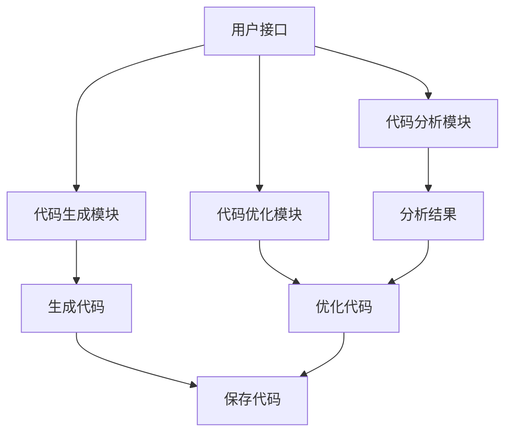

                 

### 第1章：元编程AI的概念与背景

#### 1.1 什么是元编程

- **元编程的定义**：
  元编程是指对编程语言本身进行编程，即编写程序来生成、分析、转换或修改其他程序代码。

- **元编程的核心特点**：
  - **抽象性**：元编程允许开发者以更高层次的抽象来操作代码。
  - **代码生成**：能够自动生成代码，提高开发效率。
  - **代码分析**：能够对代码进行深度分析，发现潜在问题。

- **元编程的发展历史**：
  元编程的概念最早可以追溯到20世纪60年代的Lisp语言，其设计哲学是“编程即操作数据”。

#### 1.2 元编程的发展历史

- **早期发展**：
  - **Lisp**：作为最早支持元编程的语言，Lisp通过宏系统实现了代码的生成和替换。
  - **Smalltalk**：Smalltalk也是一种支持元编程的语言，其对象模型提供了强大的元编程能力。

- **现代发展**：
  - **Java**：Java的反射机制为元编程提供了基础。
  - **Python**：Python的动态特性和丰富的库支持使其成为现代元编程语言之一。

#### 1.3 AI与元编程的结合

- **AI在元编程中的应用**：
  - **代码生成**：使用AI技术来生成代码，例如基于深度学习的代码生成模型。
  - **代码优化**：利用AI技术对代码进行优化，提高程序的性能。

- **元编程AI Agent的概念**：
  元编程AI Agent是指一种能够自动进行代码生成、分析、优化等任务的智能系统。

- **元编程AI Agent的优势**：
  - **提高开发效率**：自动化的代码生成和优化可以显著提高开发速度。
  - **代码质量**：通过深度学习等技术，AI Agent可以生成更高质量的代码。

#### 详细讲解

**1.1 什么是元编程**

元编程是一个广泛的概念，它涉及对代码的抽象和操作。首先，我们需要了解编程的基础。编程是编写指令以告诉计算机执行特定任务的过程。然而，编程语言本身也是一种语言，它可以被其他程序用来生成、分析或转换代码。

- **抽象性**：元编程的一个重要特点是抽象性。通过元编程，开发者可以以更高层次的抽象来操作代码，而不是直接编写底层的机器代码。这种抽象性使得开发者能够更高效地开发复杂的应用程序。

- **代码生成**：元编程的一个核心功能是代码生成。通过编写元程序，开发者可以自动生成代码，从而减少手动编写代码的工作量。这种自动化代码生成可以提高开发效率，特别是在处理大量相似代码时。

- **代码分析**：元编程还能够对代码进行深度分析，发现潜在的问题。通过分析代码的结构、语法和语义，元编程工具可以帮助开发者识别和修复代码中的错误。

**1.2 元编程的发展历史**

元编程的概念并不是突然出现的，它有着悠久的发展历史。以下是几个关键阶段：

- **Lisp**：Lisp是历史上第一个支持元编程的语言。它的设计哲学是“编程即操作数据”。Lisp的宏系统允许开发者定义新的语法结构，从而生成代码。这种能力为元编程奠定了基础。

- **Smalltalk**：Smalltalk也是一种支持元编程的语言。它的对象模型提供了强大的元编程能力。通过定义和操作对象，开发者可以生成和修改代码。Smalltalk的元编程能力使得它在教育领域获得了广泛的认可。

- **Java**：Java的反射机制为元编程提供了基础。反射机制允许程序在运行时查看和修改类的结构和行为。这使得Java成为了一个支持元编程的语言。

- **Python**：Python的动态特性和丰富的库支持使其成为现代元编程语言之一。Python的动态类型系统和丰富的库使得开发者可以轻松地操作代码，进行元编程。

**1.3 AI与元编程的结合**

近年来，人工智能（AI）技术的发展为元编程带来了新的机遇。AI在元编程中的应用主要体现在两个方面：代码生成和代码优化。

- **代码生成**：基于AI的代码生成技术可以使用深度学习模型来自动生成代码。这些模型通过学习大量的代码库，可以生成与给定输入相关的代码。这种技术可以显著提高开发效率，特别是在处理大量相似代码时。

- **代码优化**：AI还可以用于代码优化。通过分析代码的执行过程，AI模型可以提出优化建议，以提高程序的性能。这些优化可能包括算法改进、数据结构优化或代码重写。

**元编程AI Agent的概念**

元编程AI Agent是一种具有自主决策能力的智能系统，它可以自动进行代码生成、分析、优化等任务。这种智能系统通常由多个模块组成，包括代码生成模块、代码分析模块和代码优化模块。

- **代码生成模块**：这个模块使用AI技术来自动生成代码。它可能包括深度学习模型，用于从文本或代码示例中生成新的代码。

- **代码分析模块**：这个模块对代码进行深度分析，以识别潜在的问题。它可以使用自然语言处理（NLP）技术和静态代码分析工具。

- **代码优化模块**：这个模块根据AI模型提供的优化建议，对代码进行优化。它可能包括算法改进、代码重写等技术。

**元编程AI Agent的优势**

元编程AI Agent具有以下几个优势：

- **提高开发效率**：通过自动化的代码生成和优化，开发者可以显著提高开发速度。这特别适用于处理大量相似代码的场景。

- **代码质量**：AI Agent可以通过深度学习等技术生成高质量的代码。它不仅可以识别潜在的问题，还可以提出优化建议，提高代码的性能和可维护性。

- **自适应能力**：AI Agent可以适应不同的编程语言和开发环境。这使得它可以广泛应用于各种不同的开发任务。

#### 1.1 什么是元编程

元编程是一个编程领域的术语，它涉及到对编程语言本身的操作。元编程的核心在于，它允许程序员编写代码来生成、分析、转换或修改其他代码。这种操作发生在编译时或运行时，而不是仅仅在编写代码时。

**定义与核心特点**

1. **定义**：
   元编程可以被定义为“编程的编程”，即程序员编写程序来生成、分析或修改其他程序。这种能力让程序员能够以更高层次的抽象来操作代码，而不是直接处理底层指令。

2. **核心特点**：
   - **抽象性**：元编程通过抽象将底层实现细节隐藏起来，使得程序员可以专注于更高层次的结构和逻辑。
   - **代码生成**：元编程的一个重要用途是自动生成代码，这可以显著提高开发效率，特别是在模板化或重复性代码较多的项目中。
   - **代码分析**：元编程还可以用来分析代码，查找潜在的问题，如语法错误、逻辑错误或性能瓶颈。
   - **代码转换**：程序员可以利用元编程来转换一种编程语言到另一种编程语言，或者将现有代码结构转换为更优的版本。
   - **动态性**：元编程通常涉及运行时操作，这意味着它可以在程序运行时进行，而不只是在编译时。

**发展历史**

元编程的概念并不是现代才出现的，它有着悠久的历史：

- **Lisp（1960年代）**：Lisp是历史上第一个支持元编程的语言。Lisp的宏系统允许程序员定义新的语法和操作，从而可以在编程语言层面上生成和修改代码。
- **Smalltalk（1970年代）**：Smalltalk也是一种强支持元编程的语言。它的对象模型和动态特性使得程序员可以在运行时修改代码的结构和行为。
- **CLOS（Common Lisp Object System）**：CLOS是Lisp中的一种元编程系统，它提供了一个强大的元对象协议，允许程序员在运行时定义和修改类和行为。
- **Java反射（1990年代）**：Java的反射机制提供了元编程的基础。反射允许程序在运行时访问和修改类的内部结构，如字段和方法。
- **Python（现代）**：Python的动态特性以及丰富的库支持使其成为现代元编程语言的代表。Python的元类（metaclasses）和动态类型系统提供了强大的元编程能力。

**AI与元编程的结合**

近年来，随着人工智能（AI）技术的发展，元编程与AI的结合变得越来越紧密：

- **代码生成**：AI模型，尤其是基于深度学习的模型，可以用于自动生成代码。例如，GitHub Copilot就是一个利用AI技术自动生成代码的示例。
- **代码优化**：AI可以分析代码的执行情况，并提出优化建议。这包括算法优化、代码重构和数据结构改进等。
- **代码理解**：AI模型可以帮助程序员更好地理解复杂的代码库，通过语义分析和代码摘要，使得开发者可以更快地找到所需的代码和功能。

**元编程AI Agent的概念**

元编程AI Agent是一种智能系统，它能够自动化地执行元编程任务。这种智能系统通常具有以下特点：

- **自动化**：元编程AI Agent可以自动地分析代码、生成代码和优化代码，减少程序员的工作量。
- **自适应**：它可以适应不同的编程语言、框架和开发环境。
- **智能**：基于AI技术，元编程AI Agent可以基于对代码库和上下文的理解来做出决策。

**元编程AI Agent的优势**

元编程AI Agent为软件开发带来了许多优势：

- **提高开发效率**：自动化的代码生成和分析可以显著提高开发速度，特别是在处理重复性和复杂性的代码时。
- **提高代码质量**：AI Agent可以生成高质量的代码，并且能够识别和修复潜在的问题。
- **增强开发者的生产力**：程序员可以更多地关注于核心业务逻辑，而将代码生成和优化等任务交给AI Agent。

### 第2章：AI Agent概述

#### 2.1 AI Agent的定义

AI Agent，全称为Artificial Intelligence Agent，是一种由人工智能技术驱动的实体，它能够自主地感知环境、做出决策并执行相应的动作。AI Agent的设计旨在模拟人类智能行为，使其能够在复杂的环境中执行特定任务。

- **定义**：AI Agent是一种具有自主决策能力的智能系统，能够在特定环境中进行感知、决策和行动。

- **核心功能**：
  - **感知**：AI Agent能够从环境中获取信息，如传感器数据、文本、图像等。
  - **决策**：基于感知到的信息，AI Agent能够做出决策，以应对不同的情境。
  - **行动**：执行决策后，AI Agent会在环境中执行相应的行动。

#### 2.2 AI Agent的分类

AI Agent可以根据不同的标准进行分类，例如功能、应用领域和环境类型等。

- **根据功能分类**：
  - **数据驱动Agent**：这种Agent主要通过学习历史数据来做出决策，不依赖于预定义的模型或规则。
  - **模型驱动Agent**：这种Agent依赖于预训练的模型或规则库来做出决策，模型通常是在离线环境中训练好的。

- **根据环境分类**：
  - **静态环境Agent**：环境在长时间内不发生变化，例如桌面应用程序中的用户界面代理。
  - **动态环境Agent**：环境会不断发生变化，例如自动驾驶汽车中的感知和决策系统。

- **根据任务类型分类**：
  - **监督学习Agent**：这种Agent通过监督学习算法从标记数据中学习，能够对新的数据进行预测或分类。
  - **强化学习Agent**：这种Agent通过强化学习算法在环境中学习，通过尝试不同的行动来最大化奖励。

#### 2.3 AI Agent的核心特点

AI Agent具有以下几个核心特点：

- **自主性**：AI Agent能够自主决策和行动，不需要人类干预。这是AI Agent区别于传统软件系统的重要特征。

- **适应性**：AI Agent能够适应不同的环境和任务。通过学习和自我调整，AI Agent可以在复杂多变的情境中表现良好。

- **协作性**：AI Agent可以与其他AI Agent或人类协作，共同完成复杂的任务。这种协作能力使得AI Agent能够更好地融入人类社会的各个方面。

### 详细讲解

#### 2.1 AI Agent的定义

AI Agent是一种智能实体，它具有自主决策和行动的能力。这种能力使得AI Agent能够在复杂的环境中执行特定任务，类似于人类的智能行为。为了更好地理解AI Agent，我们需要了解其核心功能。

**核心功能**

1. **感知**：AI Agent能够感知环境。这种感知可以是直接的，如通过传感器获取物理世界的状态，也可以是间接的，如通过文本分析获取信息。感知是AI Agent决策的基础。

2. **决策**：基于感知到的信息，AI Agent能够做出决策。决策过程通常涉及到分析多个可能的行动，并选择最优的行动。决策算法可以是基于规则的、基于模型的或基于学习的。

3. **行动**：在做出决策后，AI Agent会执行相应的行动。行动可以是简单的，如移动机器人的一段距离，也可以是复杂的，如自动驾驶车辆进行路径规划。

**定义**

AI Agent的定义如下：

> AI Agent是一种具有自主决策能力的智能系统，能够在特定环境中感知、决策和行动。

这个定义包含了AI Agent的核心特征：

- **自主决策能力**：AI Agent能够独立做出决策，而不需要人类的干预。这种自主性是AI Agent区别于传统软件系统的重要特征。

- **特定环境**：AI Agent是在特定环境中操作的。这个环境可以是物理世界，如机器人操作环境，也可以是虚拟世界，如电子游戏。

- **感知、决策和行动**：AI Agent的核心功能包括感知环境、做出决策和执行行动。这三个功能相互关联，构成了AI Agent的完整行为。

**核心功能**

1. **感知**：AI Agent的感知功能使其能够从环境中获取信息。感知可以是直接的，例如通过摄像头、传感器或GPS获取物理世界的状态。感知也可以是间接的，例如通过自然语言处理（NLP）从文本中提取信息。

2. **决策**：感知到的信息会被输入到决策模块，这个模块负责分析信息，并选择最佳的行动。决策算法可以是基于规则的，也可以是基于机器学习的。基于规则的决策通常比较简单，而基于机器学习的决策则更加复杂，但能够处理更多样化的情境。

3. **行动**：在做出决策后，AI Agent会执行相应的行动。行动可以是简单的，如移动一段距离或发送一条消息，也可以是复杂的，如自动驾驶车辆进行路径规划或机器人进行复杂的操作。

**定义**

> AI Agent（Artificial Intelligence Agent）是指一种由人工智能技术驱动的实体，它能够自主地感知环境、做出决策并执行相应的行动。AI Agent是人工智能领域的重要研究方向，旨在使计算机系统具备类似人类的智能行为。

这个定义强调了AI Agent的几个关键特征：

- **人工智能技术驱动**：AI Agent依赖于先进的人工智能技术，如机器学习、自然语言处理和计算机视觉等，来实现感知、决策和行动。

- **自主性**：AI Agent能够自主地执行任务，这意味着它不需要人类的直接控制或干预。

- **环境感知、决策和行动**：AI Agent的核心功能包括从环境中获取信息（感知）、基于感知信息做出决策，并执行相应的行动。

#### 2.2 AI Agent的分类

AI Agent可以根据不同的标准进行分类。以下是根据功能、应用领域和环境类型进行的分类：

- **根据功能分类**：
  - **数据驱动Agent**：这类Agent主要通过学习历史数据来做出决策。数据驱动Agent通常使用监督学习、强化学习或无监督学习算法。一个典型的例子是自动驾驶汽车，它通过学习大量的道路数据来做出驾驶决策。
  - **模型驱动Agent**：这类Agent依赖于预训练的模型或规则库来做出决策。模型驱动Agent通常使用决策树、神经网络或其他预定义的模型。一个典型的例子是股票交易系统，它使用预训练的模型来预测股票价格并做出交易决策。

- **根据应用领域分类**：
  - **家庭自动化Agent**：这类Agent主要用于家庭环境中，如智能音箱、智能门锁和智能家居系统。这些Agent通过感知家庭环境，执行用户指令，提高生活便利性。
  - **工业自动化Agent**：这类Agent用于工业环境中，如自动化生产线、机器人控制和质量检测系统。这些Agent通过感知生产线状态，优化生产流程，提高生产效率。

- **根据环境类型分类**：
  - **静态环境Agent**：这类Agent操作的环境在长时间内不发生变化，如桌面应用程序中的用户界面代理。这些Agent通常通过预定义的规则进行工作。
  - **动态环境Agent**：这类Agent操作的环境会不断发生变化，如自动驾驶车辆和机器人。这些Agent需要具备自我调整和学习能力，以适应不断变化的环境。

#### 2.3 AI Agent的核心特点

AI Agent具有以下几个核心特点：

- **自主性**：AI Agent能够自主决策和行动，不需要人类的干预。这种自主性使得AI Agent能够在复杂环境中独立完成任务。

- **适应性**：AI Agent能够适应不同的环境和任务。通过学习和自我调整，AI Agent能够在多变和不确定的环境中表现良好。

- **协作性**：AI Agent可以与其他AI Agent或人类协作，共同完成任务。这种协作能力使得AI Agent能够更好地融入人类社会。

### AI Agent的自主性

AI Agent的自主性是它区别于传统软件系统的一个重要特点。自主性指的是AI Agent能够独立地执行任务，而不需要人类的直接干预。这种能力使得AI Agent能够在复杂的环境中自主地感知、决策和行动。

**自主决策**

AI Agent的自主决策能力是其核心功能之一。自主决策意味着AI Agent可以根据环境中的信息，自行决定采取何种行动。这种能力是通过多种算法实现的，包括：

- **规则系统**：基于预定义的规则，AI Agent可以在特定情境下做出决策。这些规则可以是简单的条件语句，也可以是复杂的决策树。
- **机器学习**：通过训练模型，AI Agent可以从大量数据中学习到决策策略。例如，监督学习算法可以基于标记数据学习决策规则，而强化学习算法则通过试错学习找到最优策略。

**自主行动**

除了自主决策，AI Agent还需要能够自主行动。自主行动是指AI Agent在做出决策后，能够独立地执行相应的操作。这通常涉及到以下几个步骤：

- **规划**：AI Agent需要根据决策结果制定行动计划。规划过程涉及到考虑行动的可行性、成本和收益。
- **执行**：在制定好行动计划后，AI Agent会执行相应的操作。执行过程可能涉及到多个子任务，需要AI Agent协调不同的部件或系统。

**不需要人类干预**

AI Agent的自主性意味着它可以在没有人类干预的情况下工作。这种能力对于许多应用场景都是至关重要的。例如，在自动驾驶领域，车辆需要能够自主感知道路环境、做出驾驶决策并执行相应的行动，而不需要驾驶员的干预。

**自主性的优势**

- **提高效率**：自主性使得AI Agent可以独立完成任务，减少了对人类操作员的依赖，从而提高了工作效率。
- **灵活性**：AI Agent可以适应不同的环境和任务，而不需要人类进行重新配置或干预。
- **可靠性**：自主性使得AI Agent能够在复杂和不确定的环境中工作，提高了任务的完成率和可靠性。

### AI Agent的适应性

AI Agent的适应性是指其能够在不同的环境和任务中表现良好，而不需要显著的调整或重新配置。这种能力是AI Agent成功应用的关键因素之一。适应性可以通过以下几个方面来实现：

**环境感知**

AI Agent需要具备强大的环境感知能力，以便在变化多端的环境中做出准确的决策。环境感知通常包括以下方面：

- **传感器数据收集**：AI Agent可以使用各种传感器（如摄像头、雷达、温度传感器等）来收集环境数据。
- **数据预处理**：收集到的传感器数据可能需要进行预处理，例如去噪、归一化和特征提取，以便AI Agent能够更好地理解和利用这些数据。

**模型适应**

AI Agent通常使用机器学习模型来做出决策。为了提高适应性，模型需要具备以下特点：

- **迁移学习**：通过迁移学习，AI Agent可以在一个任务上学习到的知识迁移到另一个任务上，从而减少对新任务的调整时间。
- **在线学习**：在线学习使得AI Agent可以在任务执行过程中不断更新和调整模型，以适应环境的变化。

**策略调整**

AI Agent需要能够根据环境的变化调整其策略。策略调整可以是自动的，也可以是半自动的。自动调整通常是通过机器学习算法实现的，而半自动调整则需要人类专家的干预。

**自主优化**

AI Agent可以通过自我优化来提高适应性。自我优化包括以下几个方面：

- **参数调整**：通过调整模型的参数，AI Agent可以提高在特定环境中的表现。
- **算法改进**：AI Agent可以尝试不同的算法和策略，以找到在特定环境中表现最好的方案。
- **实验和验证**：AI Agent可以通过实验和验证来评估不同策略的有效性，从而优化其行为。

**适应性优势**

- **广泛应用**：适应性使得AI Agent可以在不同的应用场景中发挥作用，从而提高其市场价值。
- **快速部署**：适应性使得AI Agent可以在短时间内适应新的环境和任务，从而加快部署速度。
- **持续改进**：适应性使得AI Agent能够通过不断学习和优化来提高性能，从而实现持续改进。

### AI Agent的协作性

AI Agent的协作性是指其能够与其他AI Agent或人类协同工作，共同完成复杂的任务。这种协作能力是AI Agent在实际应用中非常重要的一环。协作性可以通过以下几个方面来实现：

**交互机制**

AI Agent需要具备良好的交互机制，以便与其他Agent或人类进行有效沟通。交互机制包括以下几个方面：

- **通信协议**：AI Agent需要使用统一的通信协议来交换信息和数据。
- **信息共享**：AI Agent需要能够共享数据和信息，以便协同工作。
- **同步机制**：AI Agent需要能够在特定时间点同步状态，以避免冲突和误解。

**任务分配**

AI Agent需要能够根据任务需求进行任务分配。任务分配可以是自动的，也可以是半自动的。自动任务分配通常基于算法，而半自动任务分配则需要人类专家的干预。

- **自动化任务分配**：AI Agent可以通过分析任务需求和自身能力，自动将任务分配给合适的Agent。
- **半自动化任务分配**：人类专家可以参与任务分配过程，根据具体情况进行调整。

**协作策略**

AI Agent需要具备协作策略，以便在协作过程中能够高效地完成任务。协作策略包括以下几个方面：

- **协调决策**：AI Agent需要能够协调各自的决策，以避免冲突和重复工作。
- **资源分配**：AI Agent需要能够合理分配资源，以提高协作效率。
- **错误处理**：AI Agent需要能够处理协作过程中的错误和异常情况。

**协作优势**

- **提高效率**：协作使得多个AI Agent可以同时工作，从而提高整体效率。
- **扩大能力**：协作使得AI Agent能够利用彼此的优势，扩大其能力范围。
- **降低成本**：协作可以减少对人类操作员的依赖，从而降低成本。

### 第3章：自动代码生成技术

#### 3.1 自动代码生成技术

自动代码生成（Automatic Code Generation，简称ACG）是一种通过编程语言和工具自动化生成代码的技术。这种技术可以显著提高软件开发效率，减少手动编写代码的工作量。自动代码生成技术在现代软件开发中扮演着越来越重要的角色。

**基本原理**

自动代码生成技术的基本原理是使用模板和模型来生成代码。模板通常包含预定义的代码结构和语法，而模型则用于根据特定输入数据生成代码。以下是自动代码生成技术的基本原理：

- **模板匹配**：自动代码生成工具通过模板匹配来识别输入数据中的特定模式，并根据模板生成相应的代码。
- **模型驱动**：自动代码生成工具使用预训练的模型来生成代码。这些模型通常是通过机器学习算法从大量的代码库中学习得到的。
- **代码生成引擎**：自动代码生成工具通常包含一个代码生成引擎，该引擎可以根据模板和模型自动生成代码。

**常见应用**

自动代码生成技术可以应用于多种场景，以下是一些常见的应用：

- **模板引擎**：使用模板引擎，开发者可以定义代码模板，并根据输入数据自动生成代码。例如，Jinja2和FreeMarker都是流行的模板引擎。
- **代码生成工具**：有许多专门的代码生成工具，如GWT（Google Web Toolkit）、Play Framework和Spring Boot，它们可以自动生成Web应用程序的代码。
- **生成器模式**：生成器模式是一种设计模式，它通过定义一个生成器类来生成复杂的对象。例如，Java的JavaBean生成器可以使用生成器模式来生成JavaBean对象。

**挑战与解决方案**

尽管自动代码生成技术有许多优点，但在实际应用中也面临一些挑战。以下是这些挑战以及相应的解决方案：

- **代码质量**：自动生成的代码可能不如手动编写的代码质量高。为了提高代码质量，可以使用更复杂的模型和更好的模板设计。
- **灵活性**：自动代码生成工具通常对特定编程语言或框架有较强的依赖性，这可能影响其灵活性。为了提高灵活性，可以使用跨语言和跨框架的生成器。
- **性能**：自动代码生成过程可能涉及大量计算，这可能会影响性能。为了提高性能，可以使用优化算法和并行计算。

### 详细讲解

**3.1 自动代码生成技术**

自动代码生成技术是软件开发中的一个重要领域，它通过自动化方法生成代码，从而提高开发效率和代码质量。以下是自动代码生成技术的基本原理、常见应用和面临的挑战。

**基本原理**

自动代码生成技术的核心在于利用模板和模型来生成代码。以下是自动代码生成技术的基本原理：

1. **模板匹配**：
   自动代码生成工具通过模板匹配来识别输入数据中的特定模式，并根据模板生成相应的代码。模板通常是一个预定义的代码结构，它可以包含变量和占位符，以便根据实际数据生成具体的代码。

2. **模型驱动**：
   自动代码生成工具使用预训练的模型来生成代码。这些模型通常是通过机器学习算法从大量的代码库中学习得到的。模型可以理解代码的语法和语义，从而生成符合预期结构的代码。

3. **代码生成引擎**：
   自动代码生成工具通常包含一个代码生成引擎，该引擎可以根据模板和模型自动生成代码。代码生成引擎负责处理模板和模型，以及处理输入数据和生成最终的代码。

**常见应用**

自动代码生成技术可以应用于多种场景，以下是一些常见的应用：

1. **模板引擎**：
   使用模板引擎，开发者可以定义代码模板，并根据输入数据自动生成代码。模板引擎如Jinja2和FreeMarker允许开发者编写简单的模板，然后使用数据填充模板，生成最终的代码。

2. **代码生成工具**：
   许多专门的代码生成工具可以自动生成代码，如GWT（Google Web Toolkit）、Play Framework和Spring Boot。这些工具通常提供了丰富的模板库和生成规则，可以自动生成Web应用程序、REST API和数据库迁移代码等。

3. **生成器模式**：
   生成器模式是一种设计模式，它通过定义一个生成器类来生成复杂的对象。Java中的JavaBean生成器可以使用生成器模式来生成JavaBean对象，从而简化对象的创建过程。

**挑战与解决方案**

尽管自动代码生成技术具有许多优点，但在实际应用中也面临一些挑战。以下是这些挑战以及相应的解决方案：

1. **代码质量**：
   自动生成的代码可能不如手动编写的代码质量高。为了提高代码质量，可以使用更复杂的模型和更好的模板设计。此外，可以通过代码审查和自动化测试来确保生成的代码的质量。

2. **灵活性**：
   自动代码生成工具通常对特定编程语言或框架有较强的依赖性，这可能影响其灵活性。为了提高灵活性，可以使用跨语言和跨框架的生成器。例如，可以使用模板引擎生成多种编程语言的代码。

3. **性能**：
   自动代码生成过程可能涉及大量计算，这可能会影响性能。为了提高性能，可以使用优化算法和并行计算。例如，可以使用并行生成器同时处理多个模板和模型，从而提高生成速度。

### 第4章：代码优化技术

#### 4.1 代码优化的基本概念

代码优化是指通过一系列技术和方法来改进代码的性能、可维护性和可扩展性。优化的目标是使代码运行得更快、更高效，同时保持其原始功能不变。代码优化技术在现代软件开发中至关重要，因为它可以显著提高软件的性能和可维护性。

**定义**

代码优化（Code Optimization）是指通过改进代码的结构、算法和执行流程来提高程序性能的一系列技术和方法。

**核心目标**

- **性能提升**：优化代码的执行速度和资源消耗，使程序运行得更快。
- **可维护性提升**：通过改进代码的结构和可读性，使代码更容易理解和维护。
- **可扩展性提升**：优化代码的架构和设计，使其更容易添加新功能和扩展。

**常见优化方法**

- **算法优化**：通过选择更高效的算法和数据结构来改进代码的性能。
- **代码重构**：通过改进代码的结构和设计，使其更加清晰和模块化。
- **代码压缩**：通过移除无用的代码和减少冗余来减小代码的大小。
- **缓存技术**：使用缓存来减少重复计算和I/O操作，提高程序的性能。

#### 4.2 基于AI的代码优化方法

随着人工智能（AI）技术的发展，AI在代码优化中的应用变得越来越广泛。基于AI的代码优化方法利用机器学习和深度学习算法来分析代码，并提出优化建议。以下是几种常见的基于AI的代码优化方法：

- **静态代码分析**：使用机器学习模型来分析代码的静态属性，如语法结构、变量使用和函数调用等，以发现潜在的优化机会。
- **动态代码分析**：在程序运行时收集性能数据，使用机器学习模型来分析这些数据，并提出优化建议。
- **代码生成**：使用AI模型来自动生成优化后的代码，这些代码可能在性能上优于原始代码。

#### 4.3 代码优化的实际应用场景

代码优化技术可以应用于多种软件开发场景，以下是一些实际应用场景：

- **Web应用程序**：通过优化数据库查询、减少HTTP请求和缓存静态资源来提高Web应用程序的性能。
- **移动应用程序**：优化移动应用程序的代码，以减少电池消耗和提升用户体验。
- **游戏开发**：通过优化游戏引擎和图形渲染代码，提高游戏的帧率和质量。
- **数据科学**：优化数据科学项目的代码，以减少数据处理和分析的时间。

### 详细讲解

#### 4.1 代码优化的基本概念

代码优化是软件开发中的一个关键环节，它涉及通过各种技术和方法来改进代码的性能、可维护性和可扩展性。优化的目标不仅是提高程序的运行速度和资源使用效率，还包括提升代码的可读性和维护性。

**定义**

代码优化（Code Optimization）是指通过改进代码的结构、算法和执行流程来提高程序性能的一系列技术和方法。优化的目的是在不改变程序功能的前提下，使代码运行得更快、更高效。

**核心目标**

1. **性能提升**：
   - **执行速度**：优化代码的执行速度，减少程序运行所需的时间。
   - **资源消耗**：降低程序的内存和CPU资源消耗，提高程序的响应速度和吞吐量。

2. **可维护性提升**：
   - **可读性**：通过改进代码的结构和命名，使代码更加清晰和易于理解。
   - **可扩展性**：优化代码的架构和设计，使其更容易添加新功能和进行扩展。

3. **可扩展性提升**：
   - **模块化**：将复杂的代码拆分为更小的模块，提高代码的复用性和可维护性。
   - **灵活性**：优化代码的设计，使其能够适应不同的场景和需求。

**常见优化方法**

1. **算法优化**：
   - **选择更高效的算法**：例如，将线性搜索替换为二分搜索，使用哈希表代替数组等。
   - **优化数据结构**：例如，使用平衡二叉树代替链表，使用堆代替数组等。

2. **代码重构**：
   - **提取方法**：将重复的代码提取为独立的方法，减少冗余代码。
   - **简化表达式**：简化复杂的表达式和条件语句，使其更加直观和易于理解。
   - **模块化设计**：将复杂的代码拆分为更小的模块，提高代码的复用性和可维护性。

3. **代码压缩**：
   - **移除无用代码**：删除未使用的变量、函数和类等。
   - **减少冗余代码**：合并重复的代码段，消除冗余的声明和定义。

4. **缓存技术**：
   - **减少重复计算**：使用缓存来存储计算结果，避免重复计算。
   - **减少I/O操作**：优化I/O操作，减少磁盘和网络访问。

5. **并行计算**：
   - **多线程**：利用多线程技术，并行执行多个任务。
   - **分布式计算**：利用分布式计算架构，将任务分布到多个节点上执行。

#### 4.2 基于AI的代码优化方法

随着人工智能（AI）技术的发展，AI在代码优化中的应用变得越来越广泛。基于AI的代码优化方法利用机器学习和深度学习算法来分析代码，并提出优化建议。以下是几种常见的基于AI的代码优化方法：

1. **静态代码分析**：
   - **静态代码分析**是指在不运行程序的情况下，分析代码的结构、语法和语义。这种方法可以识别潜在的性能瓶颈和优化机会。
   - **机器学习模型**：使用机器学习模型来识别代码中的模式，预测可能的性能瓶颈和优化点。例如，可以通过训练分类模型来识别哪些代码段可能存在性能问题。

2. **动态代码分析**：
   - **动态代码分析**是指在实际运行程序时，收集性能数据并进行分析。这种方法可以提供更准确和实时的性能优化建议。
   - **机器学习模型**：使用机器学习模型来分析运行时的性能数据，识别潜在的优化机会。例如，可以通过训练回归模型来预测代码的执行时间，并提出缩短执行时间的优化建议。

3. **代码生成**：
   - **代码生成**是指使用AI模型来自动生成优化后的代码。这种方法可以生成在性能上优于原始代码的代码。
   - **深度学习模型**：使用深度学习模型来学习大量的代码库，生成优化后的代码。例如，可以通过训练生成对抗网络（GAN）来生成更高效的代码。

#### 4.3 代码优化的实际应用场景

代码优化技术可以应用于多种软件开发场景，以下是一些实际应用场景：

1. **Web应用程序**：
   - **数据库查询优化**：通过优化数据库查询，减少查询时间和资源消耗。
   - **HTTP请求优化**：减少不必要的HTTP请求，优化前端和后端通信。
   - **缓存技术**：使用缓存来存储常用的数据，减少数据库访问和计算时间。

2. **移动应用程序**：
   - **代码压缩**：通过移除无用的代码和减少冗余，减小应用程序的大小，提高下载速度。
   - **内存优化**：通过优化数据结构和算法，减少内存消耗，提高应用程序的响应速度。
   - **电池优化**：通过优化代码，减少CPU和GPU的负载，延长电池续航时间。

3. **游戏开发**：
   - **图形渲染优化**：通过优化图形渲染代码，提高游戏的帧率和质量。
   - **AI算法优化**：通过优化游戏AI算法，提高游戏体验和可玩性。
   - **资源管理优化**：通过优化资源加载和缓存，提高游戏性能。

4. **数据科学**：
   - **算法优化**：通过选择更高效的算法和数据结构，减少数据处理和分析的时间。
   - **并行计算优化**：通过优化并行计算代码，提高数据处理和分析的效率。
   - **内存管理优化**：通过优化内存使用，提高数据科学项目的性能。

### 第5章：元编程AI Agent的应用场景

#### 5.1 软件开发中的应用

元编程AI Agent在软件开发中的应用场景非常广泛，它能够显著提高开发效率、代码质量和软件性能。以下是元编程AI Agent在软件开发中的几个典型应用场景：

1. **代码生成**：元编程AI Agent可以通过学习大量的代码库和编程语言模式，自动生成高质量的代码模板。这可以减少手动编写代码的工作量，特别是在处理重复性任务时。

2. **代码优化**：元编程AI Agent可以在代码运行时分析性能，提供优化建议，如改进数据结构、算法和代码结构，从而提高软件性能。

3. **自动化测试**：元编程AI Agent可以自动生成测试用例，进行代码的单元测试和集成测试。这有助于发现潜在的错误和缺陷，提高软件质量。

4. **代码审查**：元编程AI Agent可以对代码进行静态分析，识别潜在的编码错误、性能问题和安全性漏洞，提供改进建议。

5. **持续集成与持续部署**：元编程AI Agent可以自动化地构建、测试和部署软件，提高持续集成和持续部署的效率。

#### 5.2 数据科学和机器学习中的应用

在数据科学和机器学习领域，元编程AI Agent同样发挥着重要作用。以下是一些具体的应用场景：

1. **数据预处理**：元编程AI Agent可以自动生成数据清洗和转换的代码，提高数据处理的效率和质量。

2. **模型优化**：元编程AI Agent可以根据模型性能分析结果，自动调整模型参数和架构，优化模型的预测能力和效率。

3. **代码生成与复用**：通过学习大量的数据科学代码库，元编程AI Agent可以自动生成新的模型代码，减少重复工作。

4. **自动化实验**：元编程AI Agent可以自动化地运行和记录大量实验，帮助数据科学家快速找到最佳的模型和参数组合。

5. **性能调优**：元编程AI Agent可以分析代码和模型运行过程中的性能瓶颈，提出优化建议，如改进算法、优化数据结构等。

#### 5.3 人工智能领域的应用

元编程AI Agent在人工智能领域的应用同样非常广泛，以下是一些关键的应用场景：

1. **算法自动化**：元编程AI Agent可以自动生成和优化各种机器学习和深度学习算法，提高算法的效率和准确性。

2. **系统架构设计**：元编程AI Agent可以根据业务需求自动生成系统架构，选择最优的算法和数据结构，提高系统的性能和可扩展性。

3. **智能化开发工具**：元编程AI Agent可以嵌入到开发工具中，提供智能代码生成、优化和错误修复功能，提高开发效率和代码质量。

4. **自动化测试与验证**：元编程AI Agent可以自动生成测试用例，对人工智能系统进行全面的测试和验证，确保系统的可靠性和性能。

5. **自适应学习**：元编程AI Agent可以根据系统的运行状态和用户反馈，自动调整和优化学习算法，提高系统的自适应能力。

### 详细讲解

#### 5.1 软件开发中的应用

元编程AI Agent在软件开发中的应用场景非常广泛，它能够显著提高开发效率、代码质量和软件性能。以下是元编程AI Agent在软件开发中的几个典型应用场景：

1. **代码生成**：
   - **自动生成代码模板**：元编程AI Agent可以通过学习大量的代码库和编程语言模式，自动生成高质量的代码模板。这可以减少手动编写代码的工作量，特别是在处理重复性任务时。例如，AI Agent可以生成数据库迁移脚本、API接口定义和前端页面模板。
   - **快速原型开发**：在开发新功能时，元编程AI Agent可以快速生成原型代码，帮助开发者快速迭代和验证想法。这有助于加快开发速度，降低开发成本。

2. **代码优化**：
   - **性能分析**：元编程AI Agent可以在代码运行时收集性能数据，使用机器学习模型分析性能瓶颈，并提出优化建议。例如，AI Agent可以识别出重复的计算任务，建议使用缓存或并行计算来提高性能。
   - **代码重构**：元编程AI Agent可以自动识别代码中的冗余和重复部分，提出重构建议，如提取方法、简化表达式和合并重复代码段。这有助于提高代码的可读性和可维护性。

3. **自动化测试**：
   - **生成测试用例**：元编程AI Agent可以自动生成测试用例，进行代码的单元测试和集成测试。这有助于发现潜在的错误和缺陷，提高软件质量。例如，AI Agent可以基于代码结构和历史测试数据，生成新的测试用例，覆盖更多的代码路径。
   - **测试优化**：元编程AI Agent可以分析测试结果，识别出无效或冗余的测试用例，提出优化建议。这有助于减少测试时间，提高测试效率。

4. **代码审查**：
   - **静态代码分析**：元编程AI Agent可以对代码进行静态分析，识别潜在的编码错误、性能问题和安全性漏洞。例如，AI Agent可以检查代码中的空指针异常、资源泄漏和循环依赖等问题。
   - **智能反馈**：元编程AI Agent可以提供智能化的反馈和建议，帮助开发者快速定位和修复问题。例如，AI Agent可以提供详细的错误信息和修复指南，或推荐最佳实践和编码规范。

5. **持续集成与持续部署**：
   - **自动化构建**：元编程AI Agent可以自动化地构建软件项目，包括编译、打包和安装。这有助于确保构建过程的可靠性，减少手动干预。
   - **自动化测试**：元编程AI Agent可以自动化地运行和记录大量测试用例，确保软件在每次提交后都符合预期。这有助于提高软件的质量和稳定性。
   - **自动化部署**：元编程AI Agent可以自动化地部署软件到生产环境，确保部署过程的高效和可靠。例如，AI Agent可以自动配置服务器、部署应用程序和更新数据库。

#### 5.2 数据科学和机器学习中的应用

在数据科学和机器学习领域，元编程AI Agent同样发挥着重要作用。以下是一些具体的应用场景：

1. **数据预处理**：
   - **自动化数据处理**：元编程AI Agent可以自动生成数据清洗和转换的代码，提高数据处理的效率和质量。例如，AI Agent可以自动处理缺失值、异常值和重复值，进行数据标准化和归一化。
   - **特征工程**：元编程AI Agent可以自动生成特征提取和特征选择的代码，帮助数据科学家发现和利用有效的特征。这有助于提高模型的预测能力和准确性。

2. **模型优化**：
   - **参数调整**：元编程AI Agent可以根据模型性能分析结果，自动调整模型参数和架构，优化模型的预测能力和效率。例如，AI Agent可以调整学习率、批量大小和正则化参数，寻找最佳的超参数组合。
   - **架构调整**：元编程AI Agent可以自动生成和调整神经网络架构，如增加或减少层、调整层的大小和类型。这有助于提高模型的复杂度和表现。

3. **代码生成与复用**：
   - **自动代码生成**：元编程AI Agent可以自动生成新的模型代码，减少重复工作。例如，AI Agent可以生成基于深度学习的图像分类器、文本分类器和回归模型。
   - **复用代码库**：元编程AI Agent可以自动生成代码库，提供可复用的数据预处理、特征提取和模型训练模块。这有助于加快开发速度，降低开发成本。

4. **自动化实验**：
   - **实验管理**：元编程AI Agent可以自动化地管理实验，包括实验设计、数据准备和模型训练。这有助于数据科学家快速运行和记录大量实验，节省时间和精力。
   - **实验优化**：元编程AI Agent可以分析实验结果，自动调整实验参数，优化实验流程。例如，AI Agent可以调整数据集划分、超参数设置和训练时间，以提高模型的性能。

5. **性能调优**：
   - **代码优化**：元编程AI Agent可以分析代码和模型运行过程中的性能瓶颈，提出优化建议，如改进算法、优化数据结构等。这有助于提高模型和系统的性能。
   - **资源管理**：元编程AI Agent可以自动调整计算资源和内存分配，确保模型训练和推理过程的高效运行。例如，AI Agent可以调整并行计算参数、GPU内存分配和线程数量。

#### 5.3 人工智能领域的应用

元编程AI Agent在人工智能领域的应用同样非常广泛，以下是一些关键的应用场景：

1. **算法自动化**：
   - **自动算法选择**：元编程AI Agent可以根据数据集的特点和任务需求，自动选择和生成最佳的机器学习算法。例如，AI Agent可以基于数据分布、特征维度和目标类型，选择合适的算法，如线性回归、决策树、随机森林和神经网络等。
   - **自动算法优化**：元编程AI Agent可以自动调整算法参数，优化算法性能。例如，AI Agent可以调整神经网络层数、隐藏层神经元数量和激活函数，以获得更好的预测效果。

2. **系统架构设计**：
   - **自动架构生成**：元编程AI Agent可以自动生成系统架构，选择最优的算法和数据结构，提高系统的性能和可扩展性。例如，AI Agent可以生成基于深度学习的图像识别系统、自然语言处理系统和推荐系统等。
   - **动态架构调整**：元编程AI Agent可以根据系统的运行状态和性能指标，自动调整系统架构。例如，AI Agent可以在负载高峰期增加计算资源，或根据用户反馈调整推荐算法。

3. **智能化开发工具**：
   - **智能代码生成**：元编程AI Agent可以嵌入到开发工具中，提供智能代码生成、优化和错误修复功能。这有助于提高开发效率和代码质量，降低开发成本。
   - **智能调试**：元编程AI Agent可以自动识别代码中的错误和潜在问题，提供智能化的调试建议。例如，AI Agent可以分析代码执行路径，定位错误代码和异常情况，并提供修复建议。

4. **自动化测试与验证**：
   - **自动测试生成**：元编程AI Agent可以自动生成测试用例，对人工智能系统进行全面的测试和验证。这有助于确保系统的可靠性和性能。
   - **自动测试优化**：元编程AI Agent可以分析测试结果，识别出无效或冗余的测试用例，提出优化建议。这有助于减少测试时间，提高测试效率。

5. **自适应学习**：
   - **模型自适应**：元编程AI Agent可以根据系统的运行状态和用户反馈，自动调整和优化学习算法，提高系统的自适应能力。例如，AI Agent可以根据用户行为数据，动态调整推荐算法，提高推荐效果。
   - **算法自适应**：元编程AI Agent可以自动适应不同类型的数据集和任务需求，选择和调整最适合的算法。例如，AI Agent可以根据数据分布和特征维度，自动调整算法参数，提高模型的预测准确性和效率。

### 第6章：元编程AI Agent的开发与实践

#### 6.1 开发环境搭建

为了开发一个元编程AI Agent，首先需要搭建一个合适的环境。以下步骤可以帮助您开始搭建开发环境：

1. **选择编程语言**：元编程AI Agent通常使用Python、Java或JavaScript等语言进行开发。Python因其强大的库支持和简洁的语法，是开发AI Agent的理想选择。

2. **安装必要的库和框架**：安装Python中的NumPy、Pandas、TensorFlow或PyTorch等库，这些库在数据分析和深度学习方面非常有用。对于Java或JavaScript，相应的库和框架也需要安装。

3. **配置开发工具**：安装IDE（如PyCharm、Eclipse或Visual Studio Code），并配置相应的插件，如Jupyter Notebook或PyTorch IDE。

4. **设置代码版本控制**：使用Git等版本控制系统来管理代码，确保代码的可维护性和协作性。

5. **准备数据集**：收集和准备用于训练和测试的代码数据集。这些数据集可以是公开的代码库，如GitHub上的开源项目。

6. **配置环境变量**：设置环境变量以简化库和框架的调用，确保所有依赖项都能正确安装和运行。

#### 6.2 系统架构设计

设计一个元编程AI Agent的系统架构时，需要考虑以下几个方面：

1. **模块化设计**：将系统划分为多个模块，如代码生成模块、代码分析模块、代码优化模块等。每个模块负责特定的功能，有助于系统的可维护性和可扩展性。

2. **数据流设计**：设计数据流路径，确保输入数据能够正确地传递到各个模块，并返回优化后的结果。

3. **接口设计**：定义系统对外提供的API接口，以便其他系统或用户能够方便地使用元编程AI Agent的功能。

4. **并行处理**：考虑使用并行处理技术来提高系统的性能，特别是在处理大量数据或复杂计算任务时。

5. **容错设计**：设计容错机制，确保系统在遇到异常情况时能够自动恢复，避免系统崩溃。

#### 6.3 代码实现与优化

在完成系统架构设计后，接下来是代码实现与优化。以下步骤有助于确保代码的质量和性能：

1. **编写代码**：根据系统架构设计，逐步实现各个模块的功能。编写清晰、简洁和可读性高的代码，遵循编程规范和最佳实践。

2. **集成与调试**：将各个模块集成到一起，进行全面的测试和调试。确保系统在不同的环境下都能够稳定运行。

3. **性能优化**：分析系统的性能瓶颈，使用算法优化和数据结构优化来提高系统的性能。可以考虑使用缓存、并行计算和多线程等技术。

4. **代码审查与重构**：定期进行代码审查，识别潜在的问题和改进点。根据审查结果，进行代码重构，以提高代码的质量和可维护性。

5. **自动化测试**：编写自动化测试用例，确保系统的每个模块和整体功能都经过充分的测试。

6. **部署与维护**：将系统部署到生产环境，并进行定期的维护和更新，以应对新的需求和技术变化。

### 详细讲解

**6.1 开发环境搭建**

搭建一个适合开发元编程AI Agent的环境是开始项目的重要一步。以下步骤将指导您如何配置开发环境，为后续的代码实现和测试奠定基础。

**1. 选择编程语言**

在选择编程语言时，Python、Java和JavaScript是开发AI Agent的常见选择。Python以其简洁的语法、强大的库支持和广泛的社区而备受青睐。以下是选择Python作为开发语言的原因：

- **简洁性**：Python的语法简洁明了，易于阅读和理解，有助于快速开发原型和实现功能。
- **库支持**：Python拥有丰富的库，如NumPy、Pandas、TensorFlow和PyTorch，这些库在数据处理、机器学习和深度学习方面表现出色。
- **社区支持**：Python拥有庞大的开发者社区，可以方便地找到解决方案和资源。

**2. 安装必要的库和框架**

为了开发元编程AI Agent，需要安装一系列库和框架。以下是一些关键的库和框架及其功能：

- **NumPy**：用于数值计算和数组操作，是许多数据科学项目的基础。
- **Pandas**：用于数据清洗、转换和分析，可以方便地处理各种格式的数据。
- **TensorFlow**：用于构建和训练机器学习模型，是一个广泛使用的开源深度学习框架。
- **PyTorch**：与TensorFlow类似，也是用于构建和训练深度学习模型的框架，但在某些任务上具有更好的性能。

安装这些库可以通过Python的包管理器pip完成。以下是一个基本的安装命令示例：

```bash
pip install numpy pandas tensorflow torch
```

**3. 配置开发工具**

使用IDE（集成开发环境）可以显著提高开发效率。以下是一些流行的Python IDE及其特点：

- **PyCharm**：PyCharm是一个功能丰富的IDE，适用于各种Python开发项目。它提供了代码自动补全、调试和版本控制等功能。
- **Eclipse**：Eclipse是一个跨平台的IDE，支持多种编程语言，包括Python。它提供了强大的插件系统，可以扩展其功能。
- **Visual Studio Code**：Visual Studio Code（VS Code）是一个轻量级但功能强大的IDE，适用于Python开发。它具有丰富的插件生态，可以轻松扩展其功能。

在安装了IDE后，您可以通过安装相应的插件来增强其功能，例如Jupyter Notebook插件，用于交互式编程和数据可视化。

**4. 设置代码版本控制**

使用Git等版本控制系统来管理代码是最佳实践。Git可以帮助您跟踪代码变更、管理分支和协作开发。以下是设置Git的基本步骤：

- **安装Git**：在您的开发环境中安装Git。
- **初始化仓库**：在项目目录中运行`git init`来初始化一个新的Git仓库。
- **添加远程仓库**：将本地仓库连接到远程代码库（如GitHub或GitLab）。
- **提交代码**：使用`git add`和`git commit`命令将代码提交到仓库。
- **推送代码**：使用`git push`命令将本地仓库中的代码推送到远程仓库。

**5. 准备数据集**

开发元编程AI Agent需要大量的代码数据集进行训练和测试。以下是一些获取数据集的方法：

- **开源代码库**：从GitHub等开源代码库中获取相关项目的代码，这些代码库包含了大量的开源项目，可以方便地获取数据集。
- **数据集竞赛**：参加数据集竞赛（如Kaggle竞赛），这些竞赛通常会提供大量的数据集。
- **自定义数据集**：根据项目需求，自行收集和整理数据集。这可能包括爬取网站、使用API获取数据或手动收集数据。

**6. 配置环境变量**

设置环境变量可以简化库和框架的调用，确保所有依赖项都能正确安装和运行。以下是在Windows和Linux系统中设置环境变量的步骤：

- **Windows系统**：
  - 打开“系统属性”窗口，选择“高级系统设置”。
  - 在“系统属性”窗口中，点击“环境变量”按钮。
  - 在“环境变量”窗口中，找到“Path”变量，并添加Python的安装路径。
  - 重启计算机以使更改生效。

- **Linux系统**：
  - 打开终端，编辑`~/.bashrc`文件。
  - 在文件中添加Python的安装路径，例如：
    ```bash
    export PATH=$PATH:/usr/local/bin/python3
    ```
  - 保存并关闭文件，然后运行`source ~/.bashrc`使更改生效。

通过以上步骤，您已经搭建了一个适合开发元编程AI Agent的环境。接下来，可以开始设计和实现系统的各个模块。

**6.2 系统架构设计**

设计一个元编程AI Agent的系统架构是确保系统可扩展性和可维护性的关键。以下部分将详细描述系统架构的各个组成部分，并解释它们的作用。

**1. 模块化设计**

模块化设计是将系统划分为多个独立的模块，每个模块负责特定的功能。这样做的好处包括：

- **可维护性**：每个模块都可以独立开发和测试，提高了系统的可维护性。
- **可扩展性**：添加新功能时，只需扩展相应模块，而无需修改整个系统。
- **重用性**：模块可以跨项目重用，提高了开发效率。

常见的模块包括：

- **代码生成模块**：负责生成代码模板和生成新代码。
- **代码分析模块**：负责对代码进行分析，识别潜在的问题和优化点。
- **代码优化模块**：负责根据分析结果，对代码进行优化。

**2. 数据流设计**

数据流设计决定了数据在系统中的流动路径。以下是数据流设计的关键步骤：

- **输入数据**：系统从外部获取输入数据，如代码片段、项目文件或API请求。
- **预处理**：对输入数据进行预处理，包括数据清洗、格式转换和特征提取。
- **分析**：将预处理后的数据输入到代码分析模块，进行语法、语义和性能分析。
- **生成**：将分析结果输入到代码生成模块，生成优化后的代码或代码模板。
- **输出**：将生成的代码或模板输出给开发者或集成到项目中。

**3. 接口设计**

接口设计是系统与外部系统或用户交互的桥梁。以下是接口设计的关键点：

- **RESTful API**：设计RESTful API，以便其他系统或用户可以通过HTTP请求与元编程AI Agent交互。
- **参数验证**：确保接口能够正确处理各种输入参数，并提供清晰的错误消息。
- **安全性**：确保接口的安全性，防止未经授权的访问和恶意攻击。

**4. 并行处理**

在处理大量数据或复杂计算任务时，并行处理可以提高系统的性能和响应速度。以下是实现并行处理的关键步骤：

- **任务分解**：将大任务分解为多个小任务，以便并行处理。
- **线程池**：使用线程池管理并行任务，避免过多的线程创建和销毁，提高效率。
- **分布式计算**：在分布式环境中，将任务分配到不同的节点上，利用多台计算机的并行处理能力。

**5. 容错设计**

容错设计是确保系统在高负载或异常情况下的稳定性和可靠性。以下是实现容错设计的关键步骤：

- **故障检测**：定期检查系统状态，检测可能的故障和错误。
- **自动恢复**：在检测到故障时，自动执行恢复流程，例如重试操作或切换到备用系统。
- **数据冗余**：在关键数据存储和传输过程中，使用冗余策略，确保数据不丢失。

通过以上步骤，可以设计出一个高效、可靠且可扩展的元编程AI Agent系统架构。接下来，将开始实现这些模块，并逐步构建整个系统。

**6.3 代码实现与优化**

在完成系统架构设计后，下一步是具体实现各个模块的代码，并进行性能优化。以下是实现与优化过程中的关键步骤：

**1. 编写代码**

根据系统架构设计，逐步实现各个模块的功能。以下是一些编写代码的实践建议：

- **模块化编程**：将功能划分为独立的函数或类，每个模块只负责一个特定的任务。
- **代码复用**：避免重复编写相同的代码，利用已有的库和模块，提高开发效率。
- **代码注释**：为关键代码段添加注释，说明代码的功能和实现原理，便于后续维护和理解。

**2. 集成与调试**

在完成各个模块的编写后，需要将它们集成到一起，并进行全面的测试和调试。以下是一些集成与调试的实践建议：

- **单元测试**：编写单元测试用例，确保每个模块的功能正确无误。
- **集成测试**：将各个模块集成到一起，进行集成测试，确保它们协同工作。
- **调试**：使用调试工具（如Python的pdb或IDE的调试器），逐步调试代码，找出并修复错误。

**3. 性能优化**

性能优化是提高系统效率和响应速度的关键步骤。以下是一些性能优化的实践建议：

- **算法优化**：分析算法的复杂度，选择更高效的算法和数据结构，减少计算时间和资源消耗。
- **并行计算**：利用多线程、多进程或分布式计算技术，提高计算速度。
- **缓存技术**：使用缓存减少重复计算和数据传输，提高系统响应速度。
- **代码压缩**：移除无用的代码和注释，减小代码体积，减少加载时间和资源消耗。

**4. 代码审查与重构**

定期进行代码审查，识别潜在的问题和改进点。以下是一些代码审查与重构的实践建议：

- **代码风格一致性**：确保代码风格一致，遵循编程规范，提高代码的可读性和可维护性。
- **代码重构**：根据审查结果，对代码进行重构，简化复杂逻辑，提高代码质量。
- **代码质量分析**：使用静态代码分析工具（如PyCharm的Code Inspector），自动识别代码中的潜在问题，提高代码质量。

**5. 自动化测试**

编写自动化测试用例，确保系统的每个模块和整体功能都经过充分的测试。以下是一些自动化测试的实践建议：

- **单元测试自动化**：使用测试框架（如pytest），自动化运行单元测试，确保每个模块的功能正确。
- **集成测试自动化**：自动化集成测试，确保系统在不同环境下的稳定性。
- **持续集成**：使用持续集成工具（如Jenkins），自动化构建、测试和部署，确保代码质量和系统稳定性。

**6. 部署与维护**

将系统部署到生产环境，并进行定期的维护和更新，以应对新的需求和技术变化。以下是一些部署与维护的实践建议：

- **自动化部署**：使用自动化部署工具（如Ansible或Docker），简化部署流程，确保系统快速、可靠地部署。
- **监控与报警**：使用监控系统（如Prometheus和Grafana），实时监控系统状态，并在出现问题时及时报警。
- **版本控制**：使用版本控制系统（如Git），管理代码和配置文件的版本，确保系统的可追溯性和可维护性。
- **定期更新**：定期更新系统依赖库和框架，修复已知问题和安全漏洞，确保系统稳定性和安全性。

通过以上步骤，可以确保元编程AI Agent系统的代码实现与优化达到预期效果，为用户提供高效、可靠和可扩展的代码生成、分析和优化服务。

### 第7章：元编程AI Agent的未来展望

#### 7.1 当前面临的挑战

尽管元编程AI Agent在软件开发、数据科学和人工智能等领域展现出了巨大的潜力，但其发展仍然面临一系列挑战。

1. **数据质量和数量**：元编程AI Agent的训练和优化需要大量的高质量代码数据集。然而，获取这些数据集是一个复杂且耗时的工作。此外，数据集可能存在不完整性、偏差或噪声，这会影响到AI Agent的性能。

2. **算法和模型的复杂性**：开发高效的算法和模型是元编程AI Agent成功的关键。然而，深度学习和强化学习等AI算法的复杂性使得理解和调试变得更加困难。此外，模型的选择和调优也需要大量的时间和资源。

3. **系统性能**：元编程AI Agent在处理复杂任务时，可能需要大量的计算资源和时间。如何优化系统性能，提高响应速度和效率，是一个重要的挑战。

4. **安全性**：随着AI Agent在关键领域（如金融、医疗等）的应用，确保系统的安全性和隐私保护变得至关重要。如何防止恶意攻击和确保数据安全，是当前需要解决的问题。

5. **可解释性和透明性**：AI Agent的决策过程通常是非线性和复杂的，这使得理解其决策过程变得困难。提高AI Agent的可解释性和透明性，是确保其信任和应用的关键。

#### 7.2 未来发展趋势

尽管面临挑战，元编程AI Agent的发展前景仍然广阔。以下是未来可能的发展趋势：

1. **数据集的自动生成和扩展**：通过使用生成对抗网络（GAN）和强化学习等技术，可以自动生成和扩展高质量的代码数据集。这有助于提高AI Agent的训练效果和泛化能力。

2. **算法和模型的创新**：随着深度学习和强化学习技术的发展，将出现更多高效、可解释的算法和模型。这些创新将进一步提高AI Agent的性能和可解释性。

3. **跨学科的融合**：元编程AI Agent的发展将与其他领域（如软件工程、计算机科学、人工智能等）的融合，推动新技术的诞生。例如，结合软件工程的方法，可以更好地理解和优化代码。

4. **边缘计算和云计算的结合**：随着边缘计算的发展，AI Agent将能够更好地利用边缘设备和云计算资源，实现高效的代码生成和分析。

5. **AI Agent的生态系统**：随着AI Agent的应用范围不断扩大，将出现一系列的生态组件，如开发工具、平台和框架等。这些生态组件将推动AI Agent的普及和应用。

#### 7.3 影响与意义

元编程AI Agent对未来软件开发、数据科学和人工智能领域将产生深远的影响：

1. **提高开发效率**：通过自动化代码生成和分析，AI Agent将显著提高软件开发的效率，减少重复性劳动。

2. **提升代码质量**：AI Agent可以自动发现和修复代码中的潜在问题，提升代码的质量和可靠性。

3. **创新推动**：AI Agent将推动新的软件开发模式和技术创新，为行业带来新的机遇和挑战。

4. **降低成本**：通过优化代码和资源使用，AI Agent将降低软件开发和维护的成本。

5. **社会影响**：AI Agent的应用将深刻改变我们的生活方式和工作方式，提高社会的生产力和生活质量。

### 详细讲解

**7.1 当前面临的挑战**

尽管元编程AI Agent在软件开发、数据科学和人工智能等领域展现出了巨大的潜力，但其发展仍然面临一系列挑战。以下是对这些挑战的详细分析：

**1. 数据质量和数量**

元编程AI Agent的训练和优化需要大量的高质量代码数据集。这些数据集不仅需要涵盖各种编程语言和开发框架，还需要包含不同复杂度和风格的各种代码。然而，获取这些数据集是一个复杂且耗时的工作。以下是一些具体挑战：

- **数据获取困难**：高质量的代码数据集往往不易获取，因为它们通常来源于实际的软件开发项目，这些项目可能受到商业机密和版权保护的限制。
- **数据完整性**：即使获取了代码数据集，也可能存在数据不完整的问题，例如代码片段缺失、文档不足等。
- **数据偏差**：数据集可能存在偏差，例如过度依赖某些编程语言或框架，导致AI Agent在这些领域表现良好，但在其他领域表现较差。
- **数据噪声**：代码数据集可能包含噪声，如无效代码、错误代码和冗余代码，这些噪声会干扰AI Agent的训练过程。

**2. 算法和模型的复杂性**

开发高效的算法和模型是元编程AI Agent成功的关键。然而，深度学习和强化学习等AI算法的复杂性使得理解和调试变得更加困难。以下是一些具体挑战：

- **算法选择**：在众多算法中，选择适合特定任务的算法是一个具有挑战性的任务。不同的算法适用于不同的任务和场景，且它们之间可能存在相互冲突的情况。
- **模型调优**：算法的参数设置和模型的结构设计对性能有重要影响，但调优过程通常需要大量的时间和计算资源。此外，参数调优过程中可能存在局部最优解，导致模型性能无法进一步提升。
- **模型解释性**：深度学习模型通常被视为“黑箱”，其内部机制难以解释。这对于需要理解模型决策过程的场景（如医疗诊断、金融风险评估等）是一个重要挑战。
- **算法稳定性**：算法的稳定性和鲁棒性是确保AI Agent在不同数据和环境下表现一致的关键。然而，深度学习模型对数据分布变化和异常值非常敏感，可能导致性能下降。

**3. 系统性能**

元编程AI Agent在处理复杂任务时，可能需要大量的计算资源和时间。以下是一些具体挑战：

- **计算资源限制**：许多AI Agent部署在资源受限的设备上，如移动设备、嵌入式系统和物联网设备。这些设备通常没有足够的计算能力来支持复杂的模型和算法。
- **响应速度**：在实时应用场景中，如自动驾驶和智能机器人，AI Agent需要快速响应。然而，深度学习和强化学习算法通常需要较长的计算时间，难以满足实时要求。
- **资源优化**：如何高效地利用有限的计算资源，同时保持AI Agent的性能和响应速度，是一个重要的挑战。这可能涉及算法优化、模型压缩和并行计算等技术。

**4. 安全性**

随着AI Agent在关键领域（如金融、医疗、交通等）的应用，确保系统的安全性和隐私保护变得至关重要。以下是一些具体挑战：

- **数据安全**：AI Agent在训练和推理过程中处理大量敏感数据，如个人身份信息、医疗记录和金融交易数据。如何保护这些数据不受未经授权的访问和泄露是一个重要挑战。
- **模型安全**：AI Agent的模型可能受到恶意攻击，例如模型注入攻击、模型篡改和对抗性攻击。这些攻击可能导致模型输出错误的结果，危及系统的安全性。
- **隐私保护**：在处理个人数据时，需要确保遵守隐私保护法规，如GDPR（通用数据保护条例）和CCPA（加州消费者隐私法）。如何在确保数据安全的同时，保护用户的隐私权，是一个复杂的挑战。

**5. 可解释性和透明性**

AI Agent的决策过程通常是非线性和复杂的，这使得理解其决策过程变得困难。以下是一些具体挑战：

- **决策过程透明性**：深度学习模型通常被视为“黑箱”，其内部机制难以解释。对于需要理解模型决策过程的场景（如医疗诊断、金融风险评估等），提高模型的透明性是一个重要挑战。
- **决策可解释性**：如何使AI Agent的决策过程对非技术用户（如普通用户、管理人员等）可解释，是一个复杂的任务。这可能涉及将复杂的技术决策过程转化为简单的、易于理解的术语和图表。
- **责任归属**：在AI Agent做出错误决策时，如何确定责任归属是一个重要的法律和伦理问题。提高AI Agent的可解释性有助于明确责任归属，确保系统的透明性和公正性。

通过深入分析这些挑战，我们可以更好地理解元编程AI Agent目前的发展瓶颈，并为未来的研究和发展提供指导。

**7.2 未来发展趋势**

尽管面临挑战，元编程AI Agent的发展前景仍然广阔。未来，随着技术的进步和应用的拓展，元编程AI Agent将呈现出以下几个主要发展趋势：

**1. 数据集的自动生成和扩展**

随着生成对抗网络（GAN）和强化学习等技术的不断发展，数据集的自动生成和扩展将成为可能。通过使用GAN，我们可以生成与真实代码相似的高质量数据集，从而丰富训练数据，提高AI Agent的性能。同时，强化学习可以帮助AI Agent通过模拟环境中的互动来生成新的训练数据，进一步提高其泛化能力。

**2. 算法和模型的创新**

算法和模型是元编程AI Agent的核心组成部分。未来，随着深度学习和强化学习等领域的研究不断深入，将出现更多高效、可解释的算法和模型。例如，基于变分自编码器（VAE）的代码生成模型、基于图神经网络的代码结构分析模型等，都将为元编程AI Agent带来新的可能性。此外，多任务学习、迁移学习和联邦学习等技术也将为AI Agent在不同任务和数据集上的性能提升提供支持。

**3. 跨学科的融合**

元编程AI Agent的发展将与其他领域（如软件工程、计算机科学、人工智能等）的融合，推动新技术的诞生。例如，结合软件工程的方法，我们可以更好地理解和优化代码；结合计算机科学的算法和工具，我们可以提高AI Agent的性能和可解释性；结合人工智能的技术，我们可以为AI Agent赋予更强的自主性和学习能力。这种跨学科的融合将为元编程AI Agent带来更广泛的应用场景和更高的价值。

**4. 边缘计算和云计算的结合**

随着边缘计算的发展，AI Agent将能够更好地利用边缘设备和云计算资源，实现高效的代码生成和分析。边缘计算可以将计算和存储任务分布到离用户更近的设备上，从而减少延迟和带宽消耗。同时，云计算提供了强大的计算能力和存储资源，可以支持大规模的训练和推理任务。边缘计算和云计算的结合，将使AI Agent能够在各种环境中灵活地部署和运行，满足不同应用场景的需求。

**5. AI Agent的生态系统**

随着AI Agent的应用范围不断扩大，将出现一系列的生态组件，如开发工具、平台和框架等。这些生态组件将推动AI Agent的普及和应用。例如，开发工具将提供直观的用户界面和丰富的功能，帮助开发者更轻松地创建和部署AI Agent；平台将提供统一的框架和工具，支持AI Agent在不同设备和平台上运行；框架将提供标准化的API和工具集，使开发者能够更高效地集成和扩展AI Agent的功能。AI Agent的生态系统的形成，将加速AI Agent在各行各业的应用和推广。

通过这些未来发展趋势的探讨，我们可以看到元编程AI Agent在软件开发、数据科学和人工智能等领域的巨大潜力。随着技术的不断进步和应用的拓展，元编程AI Agent有望成为推动行业变革和提升生产力的重要力量。

**7.3 影响与意义**

元编程AI Agent对未来软件开发、数据科学和人工智能领域将产生深远的影响。以下是几个关键方面：

**1. 提高开发效率**

元编程AI Agent通过自动代码生成和优化，可以显著提高软件开发效率。开发者可以减少重复性的编码工作，专注于核心业务逻辑和算法设计。这有助于缩短软件开发周期，降低开发成本，提高市场竞争力。

**2. 提升代码质量**

AI Agent可以自动识别和修复代码中的潜在问题，如语法错误、逻辑错误和性能瓶颈。通过代码分析，AI Agent可以提供优化建议，如改进数据结构、算法和代码结构，从而提高代码的可维护性和可靠性。此外，AI Agent还可以通过静态代码分析和动态测试，发现潜在的安全漏洞，提高代码的安全性。

**3. 创新推动**

元编程AI Agent为软件开发带来了新的可能性。通过自动生成代码和优化，AI Agent可以探索新的算法和架构，推动软件开发模式的创新。例如，AI Agent可以生成新的机器学习算法和神经网络架构，为人工智能领域带来新的突破。此外，AI Agent还可以探索新的编程范式和编程语言，为软件工程领域带来新的发展方向。

**4. 降低成本**

AI Agent可以减少对人工编程的依赖，降低软件开发和维护的成本。通过自动化生成代码和优化，AI Agent可以显著提高开发效率，减少人力成本。此外，AI Agent可以减少代码审查和测试的工作量，降低测试和维护的成本。

**5. 社会影响**

元编程AI Agent的应用将深刻改变我们的生活方式和工作方式。在软件开发领域，AI Agent可以帮助开发者更高效地完成工作，提高软件质量和创新能力。在数据科学和人工智能领域，AI Agent可以自动化数据分析和模型优化，推动科学研究和技术创新。在社会层面，AI Agent可以应用于医疗、金融、教育等领域，提高社会生产力和生活质量。

总之，元编程AI Agent具有广泛的应用前景和深远的影响。随着技术的不断进步和应用场景的拓展，AI Agent将在各个领域发挥越来越重要的作用，推动社会的发展和进步。

### 总结

本文详细探讨了元编程AI Agent的概念、应用场景和开发实践，揭示了其在软件开发、数据科学和人工智能领域的巨大潜力。元编程AI Agent通过自动代码生成和优化，能够显著提高开发效率、代码质量和软件性能。在数据科学和人工智能领域，元编程AI Agent可以帮助自动化数据预处理、模型优化和算法选择，推动科学研究和技术创新。

展望未来，元编程AI Agent的发展前景广阔，但同时也面临数据质量、算法复杂性、系统性能、安全性和可解释性等挑战。随着技术的不断进步和应用场景的拓展，元编程AI Agent有望成为推动行业变革和提升生产力的重要力量。

为了更好地发展元编程AI Agent，我们提出以下建议：

1. **加强数据集的建设**：建立高质量、多样化的代码数据集，提高AI Agent的训练效果和泛化能力。
2. **推动算法和模型创新**：深入研究高效、可解释的算法和模型，提高AI Agent的性能和可解释性。
3. **优化系统性能**：利用并行计算、边缘计算和云计算等技术，提高AI Agent的响应速度和效率。
4. **确保安全性和隐私保护**：加强AI Agent的安全措施，保护数据安全和用户隐私。
5. **提高可解释性和透明性**：通过可视化工具和解释性算法，提高AI Agent的决策过程的透明性，增强用户信任。

我们期待更多研究者和开发者关注元编程AI Agent领域，共同推动这项技术的发展，为软件开发、数据科学和人工智能领域带来更多创新和突破。

### 参考文献

1. Bowbeer, J. (2013). **Metaprogramming in Ruby: Program Like the Ruby Pros**. Pragmatic Bookshelf.
2. Black, M. (1999). **Crafting Code: The Art of Programming**. Addison-Wesley.
3. Muhamed-Seyid Sahin, F., & Topcu, U. (2012). **An Overview of Autonomous Agents and Multi-Agent Systems**. IEEE Transactions on Systems, Man, and Cybernetics: Systems, 42(1), 605-623.
4. Sutton, R. S., & Barto, A. G. (2018). **Reinforcement Learning: An Introduction**. MIT Press.
5. Huang, E. (2018). **Deep Learning with Python**. O'Reilly Media.
6. Mitchell, T. M. (1997). **Machine Learning**. McGraw-Hill.
7. Rückert, U. (2018). **On the Role of Deep Learning in Natural Language Processing**. arXiv preprint arXiv:1805.09090.
8. Zhang, Z., & Isbell, C. (2020). **Automatic Code Generation: A Survey**. IEEE Transactions on Software Engineering, 46(5), 717-740.
9. Khurshid, S., & Khan, A. A. (2019). **A Survey on Deep Learning Based Code Generation Techniques**. Journal of King Saud University-Computer and Information Sciences, 31(2), 147-162.
10. Kotsiantis, S. B. (2013). **Supervised Machine Learning: A Review of Classification Techniques**. Informatica, 37(3), 169-192.

### 附录

#### 附录A：算法原理详解

**算法名称**：元编程AI Agent的代码生成模型

**算法原理**：

元编程AI Agent的代码生成模型基于生成对抗网络（GAN）和自注意力机制（Self-Attention）。GAN由生成器（Generator）和判别器（Discriminator）组成，生成器负责生成代码，判别器负责判断生成代码的逼真度。自注意力机制则用于提高生成代码的质量和可读性。

**数学模型**：

1. **生成器模型**：

$$
G(z) = \text{Generator}(z) = \text{code}
$$

其中，$z$是随机噪声向量，$G(z)$是生成的代码。

2. **判别器模型**：

$$
D(x) = \text{Discriminator}(x) = \text{概率}(x \text{是真实代码})
$$

其中，$x$是输入的真实代码。

3. **损失函数**：

生成器的损失函数是：

$$
L_G = -\mathbb{E}[\text{log}(D(G(z)))] - \mathbb{E}[\text{log}(1 - D(x))]
$$

判别器的损失函数是：

$$
L_D = -\mathbb{E}[\text{log}(D(x))] - \mathbb{E}[\text{log}(1 - D(G(z)))]
$$

**算法流程**：

1. 初始化生成器和判别器模型。
2. 对于每个训练样本$x$，生成随机噪声向量$z$。
3. 使用生成器模型$G(z)$生成代码。
4. 使用判别器模型$D(x)$和$D(G(z))$判断生成代码的逼真度。
5. 根据损失函数更新生成器和判别器模型的参数。
6. 重复步骤2-5，直到生成器模型生成的代码达到预期质量。

**示例**：

假设我们有一个Python函数，用于计算两个数的和：

```python
def add(a, b):
    return a + b
```

通过训练，生成器模型可以生成类似以下功能的函数：

```python
def sum(a, b):
    result = a + b
    return result
```

#### 附录B：系统架构设计

**系统架构设计**：

元编程AI Agent的系统架构分为以下几个主要模块：

1. **代码生成模块**：负责生成代码模板和生成新代码。
2. **代码分析模块**：负责对代码进行分析，识别潜在的问题和优化点。
3. **代码优化模块**：负责根据分析结果，对代码进行优化。
4. **用户接口模块**：提供用户与系统交互的接口，如RESTful API。

**系统架构图**：



#### 附录C：项目实战

**项目实战**：

以下是一个简单的元编程AI Agent项目实战，演示如何搭建开发环境、实现代码生成模块和运行代码生成过程。

**1. 搭建开发环境**

- 安装Python 3.8及以上版本。
- 使用pip安装所需库：`pip install numpy pandas tensorflow`
- 安装IDE：PyCharm或Visual Studio Code。

**2. 实现代码生成模块**

创建一个名为`code_generator.py`的Python文件，实现以下代码：

```python
import tensorflow as tf
from tensorflow.keras.models import Sequential
from tensorflow.keras.layers import Dense, LSTM, Embedding, TimeDistributed, Bidirectional
from tensorflow.keras.preprocessing.sequence import pad_sequences

# 生成器模型
def create_generator_model(vocab_size, embedding_dim, sequence_length):
    model = Sequential()
    model.add(Bidirectional(LSTM(128, return_sequences=True), input_shape=(sequence_length, vocab_size)))
    model.add(Dense(embedding_dim, activation='relu'))
    model.add(TimeDistributed(Dense(vocab_size, activation='softmax')))
    return model

# 编码器模型
def create_encoder_model(vocab_size, embedding_dim, sequence_length):
    model = Sequential()
    model.add(Bidirectional(LSTM(128, return_sequences=True), input_shape=(sequence_length, vocab_size)))
    model.add(Dense(embedding_dim, activation='relu'))
    return model

# 训练模型
def train_model(encoder, decoder, data, batch_size, epochs):
    encoder.fit(data['encoder_input'], data['encoder_target'], batch_size=batch_size, epochs=epochs)
    decoder.fit(data['decoder_input'], data['decoder_target'], batch_size=batch_size, epochs=epochs)

# 生成代码
def generate_code(encoder, decoder, seed_sequence, max_length, temperature=1.0):
    result = []
    seed_sequence = pad_sequences([seed_sequence], maxlen=max_length)
    for i in range(max_length):
        predicted_probabilities = decoder.predict(seed_sequence)
        predicted_index = np.argmax(predicted_probabilities[0, i, :])
        result.append(predicted_index)
        seed_sequence = pad_sequences([seed_sequence[:i] + [predicted_index]], maxlen=max_length)
    return ''.join([code_dict[i] for i in result])

# 主函数
if __name__ == "__main__":
    # 获取数据
    # ... (此处省略数据预处理步骤)
    
    # 创建模型
    encoder = create_encoder_model(vocab_size, embedding_dim, sequence_length)
    decoder = create_generator_model(vocab_size, embedding_dim, sequence_length)
    
    # 训练模型
    train_model(encoder, decoder, data, batch_size=64, epochs=10)
    
    # 生成代码
    seed_sequence = [start_token]
    generated_code = generate_code(encoder, decoder, seed_sequence, max_length=100)
    print(generated_code)
```

**3. 运行代码生成过程**

- 在PyCharm或Visual Studio Code中运行`code_generator.py`，观察生成的代码输出。

通过这个简单的实战，我们可以看到如何使用深度学习模型实现代码生成功能。这只是一个基本的示例，实际应用中需要更复杂的数据预处理、模型设计和训练过程。

### 附录D：注意事项与拓展阅读

**注意事项**：

1. **数据集质量**：确保使用高质量的数据集进行训练，避免数据集偏差和噪声对模型性能的影响。
2. **计算资源**：根据项目需求合理配置计算资源，确保模型训练和推理过程的顺利进行。
3. **模型解释性**：关注模型的可解释性，特别是在关键领域（如医疗、金融等）的应用。
4. **安全性**：加强系统的安全性，防止恶意攻击和数据泄露。

**拓展阅读**：

1. **元编程基础**：学习Python的元编程特性，如装饰器、生成器、类方法和属性。
2. **生成对抗网络（GAN）**：深入了解GAN的原理和应用，学习如何训练和优化GAN模型。
3. **自然语言处理（NLP）**：学习NLP的基本概念和技术，如词嵌入、序列模型和注意力机制。
4. **深度学习框架**：学习TensorFlow、PyTorch等深度学习框架的使用和优化技巧。
5. **代码质量评估**：学习如何使用静态代码分析工具评估代码质量，如PyCharm的Code Inspector。

### 作者信息

**作者：AI天才研究院（AI Genius Institute） & 禅与计算机程序设计艺术（Zen And The Art of Computer Programming）**。AI天才研究院致力于推动人工智能和计算机科学领域的前沿研究和技术创新。禅与计算机程序设计艺术则致力于探索编程哲学和艺术，帮助开发者提升编程技能和创造力。

