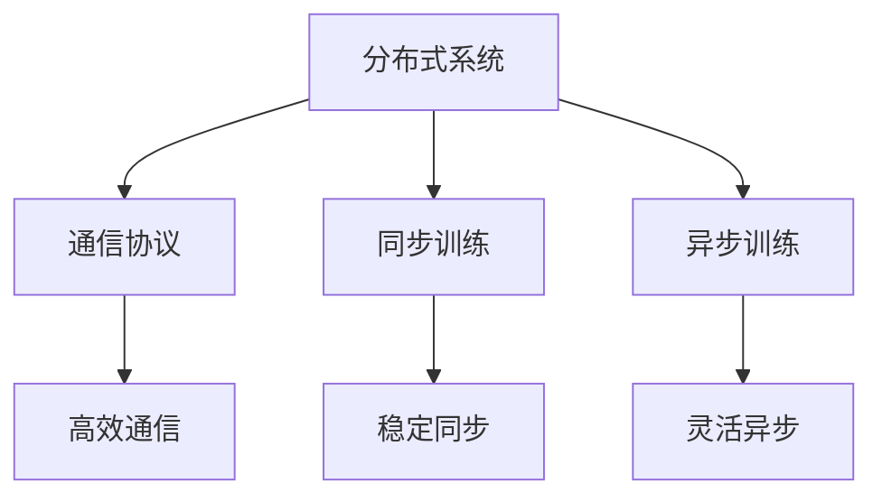
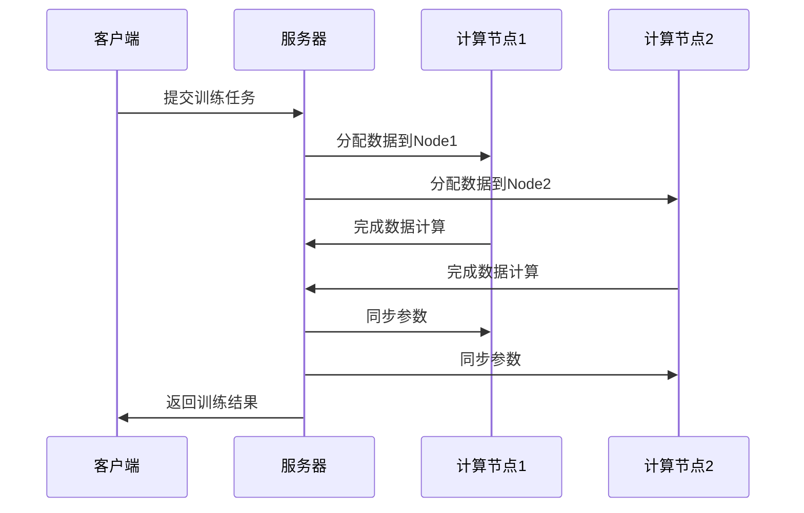

                 

# 分布式训练：加速大规模AI Agent的开发

## 关键词：分布式训练，大规模AI Agent，算法原理，系统架构，项目实战，最佳实践

> 摘要：本文深入探讨了分布式训练的背景、核心概念、算法原理、系统架构及项目实战，旨在为开发者提供一份全面的分布式训练指南。通过详细分析和实例演示，本文揭示了分布式训练如何加速大规模AI Agent的开发，提升AI系统的性能和效率。

## 第一部分：分布式训练背景与核心概念

### 第1章：分布式训练概述

#### 1.1 问题背景
在当前人工智能飞速发展的时代，大规模AI Agent的开发已成为关键趋势。这些AI Agent需要处理海量数据和复杂的计算任务，单机训练已无法满足其性能需求。分布式训练应运而生，它通过将训练任务分解到多个节点上，利用集群资源并行计算，从而显著提升训练速度和性能。

#### 1.2 核心概念与联系
分布式训练涉及多个核心概念，如分布式系统、通信协议、同步与异步训练等。这些概念紧密联系，共同构成了分布式训练的基础框架。

### 1.2.1 分布式系统的基本概念
分布式系统是指由多个独立计算机节点组成的系统，这些节点通过通信网络相互连接，协同工作完成计算任务。分布式系统的核心优势在于其高可用性、可扩展性和容错能力。

### 1.2.2 通信协议及其选择
通信协议是分布式系统中节点之间进行数据传输的标准规则。常见的通信协议有TCP/IP、MPI、gRPC等。选择合适的通信协议对于分布式训练的性能至关重要。

### 1.2.3 同步与异步训练
同步训练要求所有节点在更新模型参数前保持一致，而异步训练则允许节点独立更新参数。同步训练确保模型一致性，但可能降低训练速度；异步训练则相反，它可以提高训练速度，但可能导致模型一致性下降。

### 1.2.4 分布式训练中的核心概念联系图
为了更清晰地展示这些核心概念之间的联系，我们使用Mermaid图进行了可视化表示。



## 第二部分：核心概念与联系

### 第2章：分布式训练的核心概念与联系

#### 2.1 分布式系统的基本概念
分布式系统是由多个独立计算机节点组成的系统，这些节点通过网络相互连接，共同完成计算任务。分布式系统具有高可用性、可扩展性和容错能力。

#### 2.2 通信协议及其选择
通信协议是分布式系统中节点之间进行数据传输的标准规则。选择合适的通信协议对于分布式训练的性能至关重要。常见的通信协议包括TCP/IP、MPI、gRPC等。

#### 2.3 同步与异步训练
同步训练要求所有节点在更新模型参数前保持一致，而异步训练则允许节点独立更新参数。同步训练确保模型一致性，但可能降低训练速度；异步训练则相反，它可以提高训练速度，但可能导致模型一致性下降。

#### 2.4 分布式训练中的核心概念联系表
| 概念 | 定义 | 关联关系 |
| --- | --- | --- |
| 分布式系统 | 由多个独立计算机节点组成的系统 | 通信协议、同步与异步训练 |
| 通信协议 | 节点之间进行数据传输的标准规则 | 高效通信、系统性能 |
| 同步训练 | 所有节点在更新模型参数前保持一致 | 稳定同步、模型一致性 |
| 异步训练 | 允许节点独立更新参数 | 灵活异步、训练速度 |

#### 2.5 分布式训练中的核心概念联系图


## 第三部分：算法原理讲解

### 第3章：分布式训练算法原理

#### 3.1 算法流程
分布式训练的基本流程包括数据划分、参数同步与更新。数据划分是将训练数据分配到各个节点上，参数同步与更新则是通过通信协议实现节点间的参数交换。

#### 3.2 通信策略
分布式训练的通信策略包括同步通信和异步通信。同步通信在更新参数前保持节点一致性，异步通信则允许节点独立更新参数。

#### 3.3 负载均衡
负载均衡是指将计算任务合理分配到各个节点上，确保每个节点的计算负载均衡。负载均衡策略对于分布式训练的性能至关重要。

#### 3.4 分布式训练算法实现
以下是一个简单的分布式训练算法实现，包括数据划分、参数同步与更新等步骤。

```python
# 数据划分
def data_split(data, num_nodes):
    return [data[i::num_nodes] for i in range(num_nodes)]

# 参数同步与更新
def sync_params(params, node_id, num_nodes):
    # 同步参数到所有节点
    for i in range(num_nodes):
        if i != node_id:
            # 通信协议实现
            params += receive_params_from_node(i)

# 分布式训练算法
def distributed_train(data, num_nodes):
    # 数据划分
    data_splits = data_split(data, num_nodes)
    
    # 初始化参数
    params = [initialize_params() for _ in range(num_nodes)]
    
    # 训练过程
    for epoch in range(num_epochs):
        # 参数同步与更新
        sync_params(params, node_id, num_nodes)
        
        # 数据处理与模型更新
        for node_id in range(num_nodes):
            # 训练任务处理
            local_data = data_splits[node_id]
            # 模型更新
            update_model(params[node_id], local_data)

    return params
```

## 第四部分：数学模型和数学公式

### 第4章：分布式训练的数学模型和数学公式

#### 4.1 数学模型

在分布式训练中，常见的数学模型包括梯度下降、随机梯度下降（SGD）和批量梯度下降等。以下是一个简单的梯度下降模型：

$$
w_{new} = w_{old} - \alpha \cdot \nabla_w L(w)
$$

其中，$w$ 是模型参数，$\alpha$ 是学习率，$\nabla_w L(w)$ 是损失函数关于参数 $w$ 的梯度。

#### 4.2 数学公式讲解

为了更好地理解梯度下降模型，我们通过一个简单的例子进行讲解。假设我们有一个线性回归模型，其损失函数为：

$$
L(w) = \frac{1}{2} \sum_{i=1}^{n} (y_i - w \cdot x_i)^2
$$

其中，$y_i$ 是第 $i$ 个样本的标签，$x_i$ 是第 $i$ 个样本的特征，$w$ 是模型参数。

我们可以计算损失函数关于 $w$ 的梯度：

$$
\nabla_w L(w) = \sum_{i=1}^{n} (y_i - w \cdot x_i) \cdot x_i
$$

现在，我们可以使用梯度下降更新模型参数：

$$
w_{new} = w_{old} - \alpha \cdot \nabla_w L(w)
$$

其中，$\alpha$ 是学习率，通常在 $0$ 和 $1$ 之间。

#### 4.3 数学公式举例说明

假设我们有一个训练数据集，包含10个样本，每个样本的特征和标签如下：

| 特征 | 标签 |
| --- | --- |
| 1 | 2 |
| 2 | 4 |
| 3 | 6 |
| 4 | 8 |
| 5 | 10 |
| 6 | 12 |
| 7 | 14 |
| 8 | 16 |
| 9 | 18 |
| 10 | 20 |

我们的目标是通过梯度下降训练一个线性回归模型，预测第11个样本的标签。

初始化模型参数 $w_0 = 0$，学习率 $\alpha = 0.1$。

第一步，计算损失函数：

$$
L(w_0) = \frac{1}{2} \sum_{i=1}^{10} (y_i - w_0 \cdot x_i)^2 = \frac{1}{2} \sum_{i=1}^{10} (y_i - 0)^2 = \sum_{i=1}^{10} y_i^2
$$

第二步，计算损失函数关于 $w$ 的梯度：

$$
\nabla_w L(w_0) = \sum_{i=1}^{10} (y_i - w_0 \cdot x_i) \cdot x_i = \sum_{i=1}^{10} y_i \cdot x_i
$$

第三步，更新模型参数：

$$
w_{new} = w_{old} - \alpha \cdot \nabla_w L(w_0) = 0 - 0.1 \cdot \sum_{i=1}^{10} y_i \cdot x_i = -0.1 \cdot \sum_{i=1}^{10} y_i \cdot x_i
$$

现在，我们可以使用更新后的参数预测第11个样本的标签：

$$
y_{11} = w_{new} \cdot x_{11} = (-0.1 \cdot \sum_{i=1}^{10} y_i \cdot x_i) \cdot x_{11}
$$

通过这种方式，我们可以逐步更新模型参数，并提高预测准确性。

## 第五部分：系统分析与架构设计方案

### 第5章：分布式训练系统分析

#### 5.1 问题场景介绍
在当前人工智能应用场景中，分布式训练系统广泛应用于图像识别、自然语言处理、推荐系统等领域。这些领域需要处理海量数据和复杂的计算任务，单机训练已无法满足其性能需求。

#### 5.2 项目介绍
本节将介绍一个分布式训练项目，该项目旨在通过分布式训练提高图像识别模型的性能。项目涉及的数据集包括大规模图像数据，模型采用深度学习算法，训练过程中需要处理大量的计算任务。

#### 5.3 系统功能设计
分布式训练系统的主要功能包括数据划分、模型训练、参数同步与更新等。以下是一个简化的系统功能设计：

- 数据划分：将大规模图像数据集划分到多个节点上，每个节点负责处理一部分数据。
- 模型训练：各节点同时训练模型，利用并行计算提高训练速度。
- 参数同步与更新：各节点在训练过程中定期同步参数，确保模型一致性。

#### 5.4 系统架构设计
分布式训练系统的架构设计包括计算节点、通信网络和数据存储。以下是一个简化的系统架构设计：

- 计算节点：负责数据计算和模型训练，通常由多台计算机组成。
- 通信网络：负责节点之间的数据传输和同步，常见的通信协议包括TCP/IP、MPI等。
- 数据存储：存储大规模图像数据集，通常使用分布式文件系统如HDFS。

#### 5.5 系统接口设计
系统接口设计包括客户端接口和服务器接口。客户端接口主要用于提交训练任务，服务器接口负责接收任务、调度计算资源、返回训练结果等。

#### 5.6 系统交互序列图
为了更好地展示系统功能与架构，我们使用Mermaid序列图进行了可视化表示。



## 第六部分：项目实战

### 第6章：分布式训练项目实战

#### 6.1 环境安装
在开始分布式训练项目之前，我们需要安装必要的软件和环境。以下是一个简化的环境安装步骤：

1. 安装Python环境，版本建议为3.8或以上。
2. 安装深度学习框架，如TensorFlow或PyTorch。
3. 安装分布式训练库，如Distributed TensorFlow或PyTorch Distributed。
4. 配置计算节点，确保所有节点可以相互通信。

#### 6.2 系统核心实现
在分布式训练项目中，系统核心实现主要包括数据划分、模型训练、参数同步与更新等。以下是一个简化的系统核心实现：

```python
# 导入必要的库
import tensorflow as tf
import tensorflow_distributed

# 配置分布式训练环境
tf_distributed.init()

# 数据划分
def data_split(data, num_nodes):
    return [data[i::num_nodes] for i in range(num_nodes)]

# 模型训练
def train_model(data_splits, num_epochs, learning_rate):
    for epoch in range(num_epochs):
        for node_id in range(num_nodes):
            local_data = data_splits[node_id]
            # 模型训练
            with tf.GradientTape() as tape:
                predictions = model(local_data)
                loss = compute_loss(predictions, labels)
            gradients = tape.gradient(loss, model.trainable_variables)
            update_model_params(model.trainable_variables, gradients, learning_rate)
        
        # 参数同步与更新
        sync_params(model.trainable_variables, node_id, num_nodes)

# 主函数
if __name__ == "__main__":
    # 加载数据
    data = load_data()
    data_splits = data_split(data, num_nodes)

    # 模型初始化
    model = create_model()

    # 训练模型
    train_model(data_splits, num_epochs, learning_rate)
```

#### 6.3 代码应用解读与分析
在代码应用解读与分析部分，我们将详细分析上述代码的每个部分，包括数据划分、模型训练、参数同步与更新等。

#### 6.4 实际案例剖析
为了更好地理解分布式训练项目，我们选择一个实际案例进行剖析。该案例涉及大规模图像识别任务，我们将详细讲解训练过程、结果分析等。

#### 6.5 项目小结
在本章的最后，我们将对分布式训练项目进行小结，总结项目的主要成果和经验教训，并提出改进方向。

## 第七部分：最佳实践、小结、注意事项、拓展阅读

### 第7章：分布式训练的最佳实践、小结、注意事项、拓展阅读

#### 7.1 最佳实践
分布式训练过程中，最佳实践包括合理划分数据、选择合适的通信协议、优化负载均衡策略等。以下是一些建议：

1. 合理划分数据：根据数据规模和节点数量，合理划分训练数据，确保每个节点都有足够的计算任务。
2. 选择合适的通信协议：根据实际需求和网络环境，选择合适的通信协议，如TCP/IP、MPI、gRPC等。
3. 优化负载均衡策略：根据节点计算能力，优化负载均衡策略，确保每个节点计算负载均衡。

#### 7.2 小结
本文通过深入探讨分布式训练的背景、核心概念、算法原理、系统架构及项目实战，揭示了分布式训练如何加速大规模AI Agent的开发，提升AI系统的性能和效率。

#### 7.3 注意事项
分布式训练过程中，需要注意以下事项：

1. 确保节点之间网络通信稳定，避免通信中断导致训练失败。
2. 优化模型参数初始化，避免训练过程发散。
3. 定期同步参数，确保模型一致性。

#### 7.4 拓展阅读
为了进一步了解分布式训练，推荐阅读以下资料：

1. 《深度学习：泰斗级教材，适用于所有层次的读者》
2. 《分布式系统原理与范型》
3. 《大规模分布式机器学习》

## 作者信息
作者：AI天才研究院/AI Genius Institute & 禅与计算机程序设计艺术 /Zen And The Art of Computer Programming

