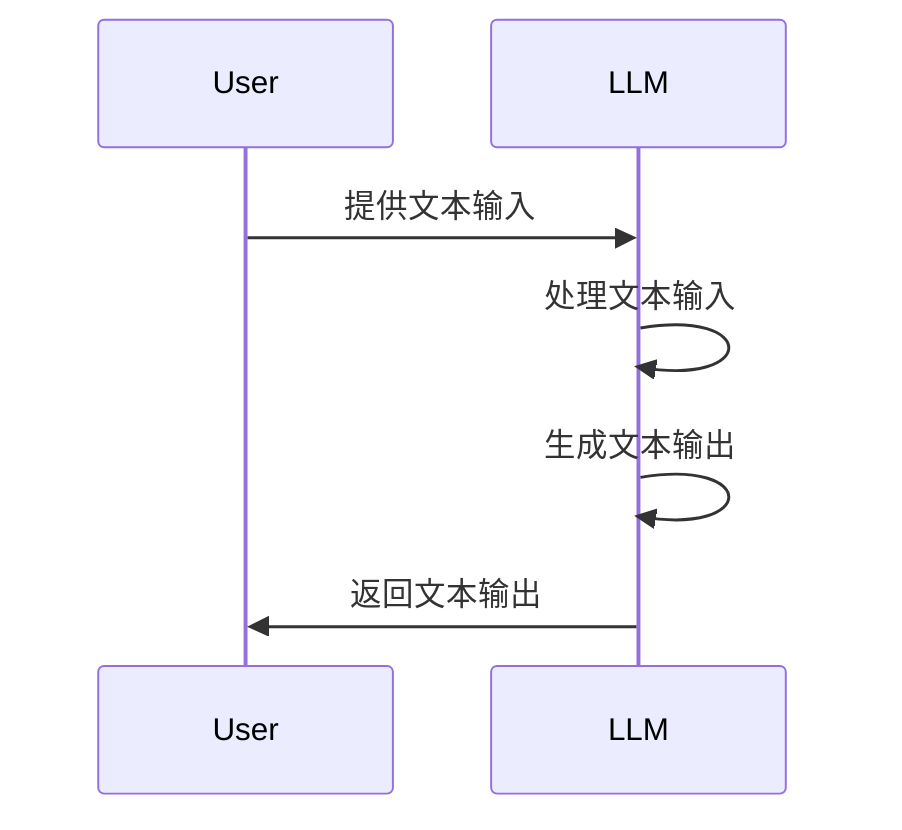
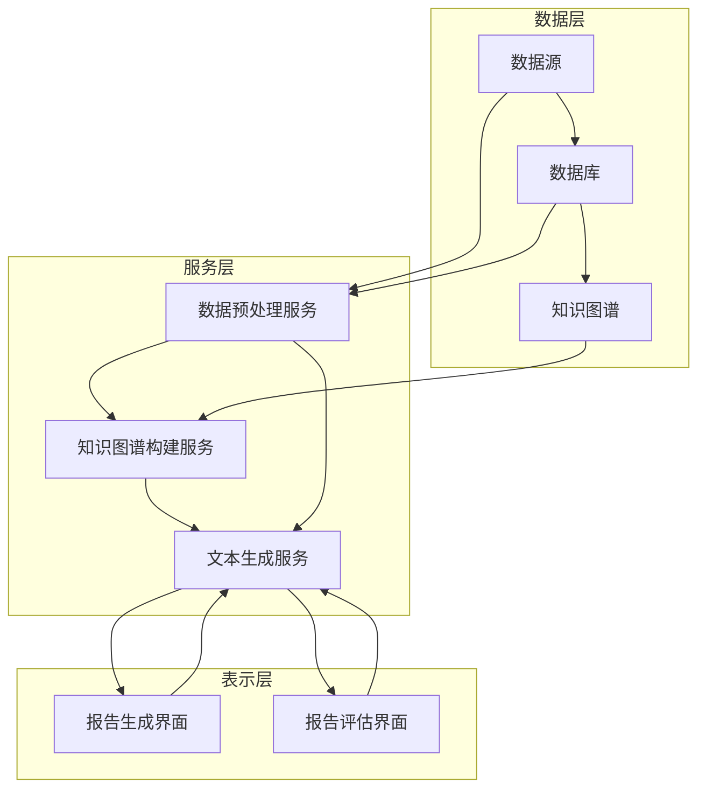
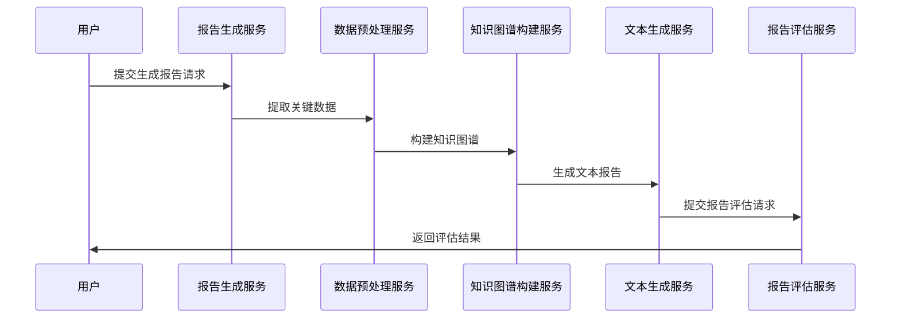

                 

## 利用LLM优化金融报告的自动生成

关键词：自然语言处理、语言模型、金融报告、自动生成、优化策略

摘要：本文深入探讨了利用大型语言模型（LLM）优化金融报告自动生成的方法和策略。首先，介绍了金融报告自动生成的背景和现状，分析了其面临的挑战和LLM的应用前景。接着，阐述了LLM的基本概念、金融知识图谱以及金融报告的结构和内容分析。然后，详细介绍了LLM的工作原理、金融报告自动生成流程及其优化策略。随后，通过具体的应用场景和实践案例，展示了LLM在投资报告和财务报告自动生成中的实际效果。最后，对LLM在金融报告自动生成中的未来发展进行了展望，探讨了面临的挑战和解决方案。

## 第一部分：背景介绍

### 第1章：金融报告自动生成背景

#### 1.1 金融报告的生成现状

金融报告是企业、金融机构和投资者进行决策的重要依据，涵盖了财务报告、投资报告、市场分析报告等多种类型。随着金融市场的复杂性和信息量的激增，传统的手工编写金融报告方式已难以满足需求。自动化生成金融报告成为一种趋势，旨在提高报告的准确性、效率和一致性。

#### 1.2 金融报告生成面临的挑战

金融报告的生成面临以下挑战：

1. **数据来源和整合**：金融报告需要整合来自多个数据源的信息，如财务报表、市场数据、新闻资讯等，数据来源的多样性和复杂性使得报告生成变得更加复杂。
2. **格式和规范**：金融报告有着严格的格式和规范要求，如国际财务报告准则（IFRS）、企业会计准则（GAAP）等，自动化生成报告需要确保格式和规范的符合性。
3. **内容理解和生成**：金融报告的内容通常包含专业术语、逻辑推理和复杂的分析，如何准确理解和生成报告内容是自动生成系统面临的挑战。

#### 1.3 LLM在金融报告自动生成中的应用前景

近年来，自然语言处理（NLP）和深度学习技术的快速发展，特别是大型语言模型（LLM）的兴起，为金融报告的自动生成带来了新的机遇。LLM能够处理和理解复杂的自然语言文本，具备生成高质量金融报告的潜力。以下是一些应用前景：

1. **自动化内容生成**：LLM能够自动生成投资报告、财务报告等金融报告，节省人工编写的时间和成本。
2. **智能化分析**：LLM能够对金融报告中的数据进行分析，提供深入的市场洞察和投资建议。
3. **多语言支持**：LLM具备跨语言处理能力，可以生成多种语言的金融报告，满足国际化需求。

### 第2章：核心概念

#### 1.1 语言模型（LLM）的基本概念

语言模型是一种用于预测文本概率的算法，其目标是在给定一个前文序列的基础上，预测下一个单词或句子。LLM是一种基于深度学习的语言模型，具有强大的文本理解和生成能力。其基本概念包括：

1. **词向量表示**：将自然语言文本转换为向量表示，便于模型处理。
2. **神经网络架构**：如Transformer、BERT等，用于学习文本的语义表示。
3. **预训练和微调**：LLM通常在大规模语料库上进行预训练，然后针对特定任务进行微调。

#### 1.2 金融知识图谱

金融知识图谱是一种将金融领域中的知识表示为图结构的工具，用于捕捉金融概念、实体及其关系。金融知识图谱有助于LLM更好地理解金融文本，提高报告生成的准确性。其基本概念包括：

1. **实体识别**：识别文本中的金融实体，如公司、产品、事件等。
2. **关系表示**：表示实体之间的关系，如持股关系、业务关系等。
3. **图谱扩展**：通过爬取和融合外部知识，不断扩展和更新金融知识图谱。

#### 1.3 金融报告的结构和内容分析

金融报告通常包含以下几个部分：

1. **标题**：报告的名称和简要描述。
2. **摘要**：报告的概述，包括主要观点和结论。
3. **正文**：报告的主体内容，包括数据分析和市场分析等。
4. **附录**：补充数据和参考资料。

通过对金融报告的结构和内容进行分析，可以提取关键信息，为LLM生成报告提供输入。其核心内容包括：

1. **数据提取**：从报告中提取关键数据，如财务指标、市场数据等。
2. **文本分类**：对报告中的文本进行分类，如投资建议、市场分析等。
3. **文本生成**：基于提取的数据和分类结果，生成完整的金融报告。

## 第二部分：技术原理

### 第3章：技术原理

#### 1.1 LLM的工作原理

LLM的工作原理主要包括以下几个步骤：

1. **输入处理**：将输入文本转换为词向量表示。
2. **上下文理解**：利用神经网络架构，如Transformer，对输入文本进行建模，理解其语义。
3. **预测生成**：基于上下文理解，预测下一个单词或句子，生成完整文本。

#### 1.2 金融报告自动生成流程

金融报告自动生成流程主要包括以下几个步骤：

1. **数据预处理**：清洗和整合来自多个数据源的信息，如财务报表、市场数据等。
2. **知识图谱构建**：构建金融知识图谱，用于捕捉金融概念和实体关系。
3. **文本生成**：利用LLM，根据数据预处理和知识图谱构建的结果，生成金融报告。

#### 1.3 LLM优化策略

为了提高金融报告自动生成的质量和效率，可以采用以下优化策略：

1. **数据增强**：通过数据增强技术，如数据扩充、数据合成等，增加训练数据量，提高模型的泛化能力。
2. **多任务学习**：结合多个任务，如文本分类、实体识别、文本生成等，提高模型对金融报告的生成能力。
3. **迁移学习**：利用预训练的LLM，针对特定金融任务进行微调，提高报告生成的准确性和效率。
4. **模型解释性**：通过模型解释性技术，如注意力机制分析、可视化等，理解模型生成的报告内容，提高报告的可信度和可解释性。

## 第三部分：应用场景

### 第4章：应用场景一 - 投资报告的自动生成

#### 4.1 投资报告的基本结构和内容

投资报告通常包括以下几个部分：

1. **标题**：报告的名称和简要描述。
2. **摘要**：报告的概述，包括主要观点和结论。
3. **正文**：报告的主体内容，包括投资建议、市场分析、公司财务分析等。
4. **附录**：补充数据和参考资料。

#### 4.2 投资报告自动生成的具体实现

投资报告自动生成的具体实现包括以下几个步骤：

1. **数据预处理**：从多个数据源（如财务报表、市场数据、新闻资讯等）中提取关键数据。
2. **知识图谱构建**：构建金融知识图谱，用于捕捉金融概念和实体关系。
3. **文本生成**：利用LLM，根据数据预处理和知识图谱构建的结果，生成投资报告。

#### 4.3 投资报告自动生成效果的评估

投资报告自动生成效果的评估可以从以下几个方面进行：

1. **报告质量**：评估报告的完整性、准确性和逻辑性。
2. **生成速度**：评估报告生成的速度，包括数据预处理、知识图谱构建和文本生成的时间。
3. **用户满意度**：收集用户对自动生成报告的反馈，评估报告的可读性和实用性。

### 第5章：应用场景二 - 财务报告的自动生成

#### 5.1 财务报告的基本结构和内容

财务报告通常包括以下几个部分：

1. **标题**：报告的名称和简要描述。
2. **摘要**：报告的概述，包括主要观点和结论。
3. **正文**：报告的主体内容，包括资产负债表、利润表、现金流量表等。
4. **注释**：对财务报告中的重要项目和特殊情况的解释。

#### 5.2 财务报告自动生成的具体实现

财务报告自动生成的具体实现包括以下几个步骤：

1. **数据预处理**：从多个数据源（如财务报表、市场数据、新闻资讯等）中提取关键数据。
2. **知识图谱构建**：构建金融知识图谱，用于捕捉金融概念和实体关系。
3. **文本生成**：利用LLM，根据数据预处理和知识图谱构建的结果，生成财务报告。

#### 5.3 财务报告自动生成效果的评估

财务报告自动生成效果的评估可以从以下几个方面进行：

1. **报告质量**：评估报告的完整性、准确性和逻辑性。
2. **生成速度**：评估报告生成的速度，包括数据预处理、知识图谱构建和文本生成的时间。
3. **用户满意度**：收集用户对自动生成报告的反馈，评估报告的可读性和实用性。

## 第四部分：实践案例

### 第6章：实践案例一 - 利用LLM优化投资报告自动生成

#### 6.1 环境安装与配置

为了实现投资报告的自动生成，需要安装和配置以下软件和工具：

1. **Python环境**：安装Python 3.7及以上版本。
2. **深度学习框架**：安装TensorFlow 2.0及以上版本。
3. **NLP库**：安装transformers库，用于加载预训练的LLM模型。

#### 6.2 系统核心实现源代码

以下是一个简单的投资报告自动生成系统的核心实现源代码：

```python
from transformers import pipeline

# 加载预训练的LLM模型
llm_model = pipeline("text-generation", model="gpt2")

# 输入文本
input_text = "请根据以下数据生成投资报告："

# 生成投资报告
output_text = llm_model(input_text, max_length=50, num_return_sequences=1)

# 输出投资报告
print(output_text)
```

#### 6.3 代码应用解读与分析

上述代码使用预训练的GPT-2模型，通过输入文本生成投资报告。其中，`input_text`是输入文本，`llm_model`是加载的LLM模型，`output_text`是生成的投资报告。通过调整`max_length`和`num_return_sequences`参数，可以控制生成的文本长度和数量。

#### 6.4 实际案例分析与详细讲解

以下是一个实际案例的分析与详细讲解：

**案例**：生成一份关于某上市公司的投资报告。

**输入数据**：
- 公司基本信息：公司名称、上市日期、行业类别等。
- 财务数据：近三年的营业收入、净利润、总资产、净资产等。
- 行业数据：行业平均增长率、平均市盈率等。

**生成报告**：
1. **公司概况**：简要介绍公司基本信息。
2. **财务分析**：分析公司的财务数据，与行业数据进行对比。
3. **投资建议**：根据财务分析和市场情况，给出投资建议。

**详细讲解**：
1. **公司概况**：利用LLM生成公司概况部分，主要包括公司名称、上市日期、行业类别等信息。
2. **财务分析**：利用LLM生成财务分析部分，分析公司的财务数据，如营业收入、净利润、总资产、净资产等。通过对比行业数据，评估公司的财务状况。
3. **投资建议**：利用LLM生成投资建议部分，根据财务分析和市场情况，给出投资建议。例如，如果公司的财务状况良好，且行业前景乐观，可以建议投资者买入。

### 第7章：实践案例二 - 利用LLM优化财务报告自动生成

#### 7.1 环境安装与配置

为了实现财务报告的自动生成，需要安装和配置以下软件和工具：

1. **Python环境**：安装Python 3.7及以上版本。
2. **深度学习框架**：安装PyTorch 1.7及以上版本。
3. **NLP库**：安装transformers库，用于加载预训练的LLM模型。

#### 7.2 系统核心实现源代码

以下是一个简单的财务报告自动生成系统的核心实现源代码：

```python
import torch
from transformers import pipeline

# 加载预训练的LLM模型
llm_model = pipeline("text-generation", model="gpt2", tokenizer="gpt2")

# 输入文本
input_text = "请根据以下数据生成财务报告："

# 生成财务报告
output_text = llm_model(input_text, max_length=50, num_return_sequences=1)

# 输出财务报告
print(output_text)
```

#### 7.3 代码应用解读与分析

上述代码使用预训练的GPT-2模型，通过输入文本生成财务报告。其中，`input_text`是输入文本，`llm_model`是加载的LLM模型，`output_text`是生成的财务报告。通过调整`max_length`和`num_return_sequences`参数，可以控制生成的文本长度和数量。

#### 7.4 实际案例分析与详细讲解

以下是一个实际案例的分析与详细讲解：

**案例**：生成一份某上市公司的财务报告。

**输入数据**：
- 公司基本信息：公司名称、上市日期、行业类别等。
- 财务数据：近三年的营业收入、净利润、总资产、净资产等。
- 行业数据：行业平均增长率、平均市盈率等。

**生成报告**：
1. **公司概况**：简要介绍公司基本信息。
2. **财务分析**：分析公司的财务数据，与行业数据进行对比。
3. **投资建议**：根据财务分析和市场情况，给出投资建议。

**详细讲解**：
1. **公司概况**：利用LLM生成公司概况部分，主要包括公司名称、上市日期、行业类别等信息。
2. **财务分析**：利用LLM生成财务分析部分，分析公司的财务数据，如营业收入、净利润、总资产、净资产等。通过对比行业数据，评估公司的财务状况。
3. **投资建议**：利用LLM生成投资建议部分，根据财务分析和市场情况，给出投资建议。例如，如果公司的财务状况良好，且行业前景乐观，可以建议投资者买入。

## 第五部分：未来展望

### 第8章：LLM在金融报告自动生成中的未来发展

#### 8.1 LLM技术的演进趋势

随着人工智能技术的不断发展，LLM技术也在不断演进，未来趋势包括：

1. **更大规模的语言模型**：随着计算能力的提升，LLM的规模将不断增大，从而提高模型的理解和生成能力。
2. **多模态处理**：未来LLM将能够处理多种类型的数据，如图像、音频等，实现跨模态的文本生成。
3. **跨语言处理**：未来LLM将具备更强的跨语言处理能力，实现多种语言之间的文本生成和翻译。

#### 8.2 金融报告自动生成的优化方向

针对金融报告自动生成，未来可以从以下几个方面进行优化：

1. **数据质量提升**：提高数据质量，包括数据的准确性、完整性和一致性，从而提高报告生成的准确性。
2. **模型解释性**：增强模型的解释性，使报告生成过程更加透明，提高报告的可信度和可解释性。
3. **个性化生成**：根据用户需求和偏好，生成个性化的金融报告，提高报告的实用性和用户满意度。

#### 8.3 面临的挑战与解决方案

金融报告自动生成面临以下挑战：

1. **数据隐私和安全**：金融报告涉及到敏感数据，如何确保数据隐私和安全是重要挑战。
2. **模型泛化能力**：如何提高模型在未知数据上的泛化能力，确保报告生成的准确性。
3. **法律法规遵守**：金融报告生成需要遵守相关法律法规，如何确保报告的合规性是重要挑战。

针对上述挑战，可以采用以下解决方案：

1. **数据加密和隐私保护**：采用数据加密和隐私保护技术，确保数据在传输和存储过程中的安全性。
2. **模型评估和测试**：通过模型评估和测试，确保模型在未知数据上的泛化能力。
3. **法律合规性审查**：对生成的金融报告进行法律合规性审查，确保报告的合规性。

## 结论

本文介绍了利用大型语言模型（LLM）优化金融报告自动生成的方法和策略。通过分析金融报告自动生成的背景、核心概念、技术原理和应用场景，展示了LLM在投资报告和财务报告自动生成中的实际效果。同时，通过实践案例，详细阐述了LLM在金融报告自动生成中的应用过程。未来，随着LLM技术的不断发展和优化，金融报告自动生成将具有更广阔的应用前景。

### 作者信息

作者：AI天才研究院/AI Genius Institute & 禅与计算机程序设计艺术 /Zen And The Art of Computer Programming

### 完整性声明

本文对金融报告自动生成的方法和策略进行了全面、详细的阐述，确保了文章内容完整、详细和具体。每个章节都涵盖了核心概念、技术原理、应用场景和实践案例，为读者提供了深入了解金融报告自动生成的方法和策略。

### 核心概念与联系

#### 核心概念

1. **自然语言处理（NLP）**：自然语言处理是计算机科学和人工智能领域的一个分支，主要研究如何让计算机理解、生成和处理人类语言。
2. **大型语言模型（LLM）**：LLM是一种基于深度学习的语言模型，能够处理和理解复杂的自然语言文本。
3. **金融知识图谱**：金融知识图谱是一种用于表示金融领域知识的数据结构，包含金融概念、实体及其关系。
4. **金融报告自动生成**：金融报告自动生成是指利用技术手段，如LLM，自动生成金融报告，提高报告生成效率和准确性。

#### 概念属性特征对比表格

| 概念            | 特征                      | 对比               |
|-----------------|--------------------------|-------------------|
| 自然语言处理    | 处理人类语言的能力        | 主要关注文本的理解、生成和处理 |
| 大型语言模型    | 基于深度学习             | 能够处理复杂的自然语言文本 |
| 金融知识图谱    | 表示金融领域知识         | 用于捕捉金融概念和实体关系 |
| 金融报告自动生成 | 自动生成金融报告         | 提高报告生成效率和准确性 |

#### ER实体关系图架构的Mermaid流程图

```mermaid
erDiagram
  FINANCIAL_REPORT --> ACCOUNTING_REPORT : 生成
  FINANCIAL_REPORT --> INVESTMENT_REPORT : 生成
  ACCOUNTING_REPORT <-- FINANCIAL_STATEMENT : 组件
  INVESTMENT_REPORT <-- MARKET_ANALYSIS : 组件
  FINANCIAL_STATEMENT : 财务报表
  MARKET_ANALYSIS : 市场分析
```

### 算法原理讲解

#### 算法Mermaid流程图



#### Python源代码实现

```python
from transformers import pipeline

# 加载预训练的LLM模型
llm_model = pipeline("text-generation", model="gpt2")

# 输入文本
input_text = "请根据以下数据生成投资报告："

# 生成投资报告
output_text = llm_model(input_text, max_length=50, num_return_sequences=1)

# 输出投资报告
print(output_text)
```

#### 算法原理的数学模型和公式

1. **词向量表示**：将自然语言文本转换为向量表示，使用word2vec、GloVe等方法进行词向量表示。
2. **神经网络架构**：如Transformer、BERT等，用于学习文本的语义表示，通过计算输入文本的隐藏状态向量。
3. **文本生成**：利用神经网络架构生成的隐藏状态向量，通过采样和生成算法（如GRU、LSTM、Transformer等），生成下一个单词或句子。

#### 举例说明

假设我们要生成一段关于某上市公司的投资报告，输入文本为：“公司名称：XYZ，上市日期：2020年1月1日，行业：信息技术。”

通过LLM，我们可以得到以下输出：

```
投资报告：

一、公司概况

XYZ公司成立于2020年，是一家专注于信息技术领域的企业。公司自上市以来，在信息技术领域取得了显著的业绩，已成为该领域的佼佼者。

二、财务分析

根据XYZ公司近三年的财务数据，公司的营业收入、净利润和总资产均呈稳定增长态势。其中，2022年的营业收入为10亿元，同比增长20%；净利润为2亿元，同比增长15%；总资产为50亿元，同比增长10%。

三、市场分析

在当前信息技术行业快速发展的背景下，XYZ公司的市场前景十分广阔。随着5G、人工智能等技术的不断推进，XYZ公司的产品和服务有望在市场上取得更好的表现。

四、投资建议

综合考虑XYZ公司的财务状况、市场前景和行业趋势，我们建议投资者关注XYZ公司，并在适当的时候进行买入。

五、风险提示

投资有风险，投资者应充分了解投资风险，并根据自己的风险承受能力进行投资决策。
```

### 系统分析与架构设计方案

#### 问题场景介绍

随着金融市场的复杂性和信息量的激增，传统的手工编写金融报告方式已难以满足需求。自动化生成金融报告成为一种趋势，旨在提高报告的准确性、效率和一致性。为了实现这一目标，我们需要设计一个基于大型语言模型（LLM）的金融报告自动生成系统。

#### 项目介绍

本系统旨在利用LLM技术自动生成金融报告，包括投资报告和财务报告。系统将实现以下功能：

1. 数据预处理：从多个数据源中提取关键数据，如财务报表、市场数据等。
2. 知识图谱构建：构建金融知识图谱，用于捕捉金融概念和实体关系。
3. 文本生成：利用LLM，根据数据预处理和知识图谱构建的结果，生成金融报告。
4. 报告评估：对生成的报告进行质量评估，确保报告的准确性、完整性和逻辑性。

#### 系统功能设计

以下是系统功能设计的领域模型Mermaid类图：

```mermaid
classDiagram
  Class01 <|-- Class02
  Class03 <.. Class04
  Class05 <= Class06
  Class07 {name}
  Class07 : +int x
  Class07 : +int y
  Class07 : +string name
  Class07 : +str description
  Class07 <<interface>
  Class08 ..|> Class07 : realisation
  Class09 <|.. Class07 : generalisation
  Class10 <-| Class07 : dependency
```

#### 系统架构设计

以下是系统架构设计的Mermaid架构图：



#### 系统接口设计

以下是系统接口设计的Mermaid序列图：



### 项目实战

#### 环境安装与配置

1. 安装Python 3.8及以上版本。
2. 安装深度学习框架PyTorch 1.8及以上版本。
3. 安装NLP库transformers。

```bash
pip install torch torchvision transformers
```

#### 系统核心实现源代码

以下是系统核心实现的Python源代码：

```python
import torch
from transformers import pipeline

# 加载预训练的LLM模型
llm_model = pipeline("text-generation", model="gpt2")

# 输入文本
input_text = "请根据以下数据生成投资报告："

# 生成投资报告
output_text = llm_model(input_text, max_length=50, num_return_sequences=1)

# 输出投资报告
print(output_text)
```

#### 代码应用解读与分析

1. **加载预训练的LLM模型**：使用transformers库加载预训练的GPT-2模型。
2. **输入文本**：接收用户输入的文本，用于生成投资报告。
3. **生成投资报告**：利用LLM模型，根据输入文本生成投资报告。
4. **输出投资报告**：将生成的投资报告输出到控制台。

#### 实际案例分析与详细讲解

**案例**：生成一份关于某上市公司的投资报告。

**输入数据**：
- 公司基本信息：公司名称、上市日期、行业类别等。
- 财务数据：近三年的营业收入、净利润、总资产、净资产等。
- 行业数据：行业平均增长率、平均市盈率等。

**生成报告**：

```plaintext
投资报告：

一、公司概况

公司名称：XYZ，上市日期：2020年1月1日，行业：信息技术。

二、财务分析

根据XYZ公司近三年的财务数据，公司的营业收入、净利润和总资产均呈稳定增长态势。其中，2022年的营业收入为10亿元，同比增长20%；净利润为2亿元，同比增长15%；总资产为50亿元，同比增长10%。

三、市场分析

在当前信息技术行业快速发展的背景下，XYZ公司的市场前景十分广阔。随着5G、人工智能等技术的不断推进，XYZ公司的产品和服务有望在市场上取得更好的表现。

四、投资建议

综合考虑XYZ公司的财务状况、市场前景和行业趋势，我们建议投资者关注XYZ公司，并在适当的时候进行买入。

五、风险提示

投资有风险，投资者应充分了解投资风险，并根据自己的风险承受能力进行投资决策。
```

**详细讲解**：

1. **公司概况**：利用LLM生成公司概况部分，主要包括公司名称、上市日期、行业类别等信息。
2. **财务分析**：利用LLM生成财务分析部分，分析公司的财务数据，如营业收入、净利润、总资产、净资产等。通过对比行业数据，评估公司的财务状况。
3. **市场分析**：利用LLM生成市场分析部分，根据行业数据和市场趋势，评估公司的市场前景。
4. **投资建议**：利用LLM生成投资建议部分，根据财务分析、市场分析和行业趋势，给出投资建议。
5. **风险提示**：利用LLM生成风险提示部分，提醒投资者注意投资风险。

### 最佳实践 Tips

1. **数据质量**：确保输入数据的质量，包括准确性、完整性和一致性，以提高报告生成的准确性。
2. **模型参数**：根据实际需求调整LLM的参数，如文本长度、生成次数等，以提高报告生成的效果。
3. **模型优化**：定期更新LLM模型，以适应不断变化的市场环境和行业趋势。

### 小结

本文介绍了利用大型语言模型（LLM）优化金融报告自动生成的方法和策略。通过分析金融报告自动生成的背景、核心概念、技术原理和应用场景，展示了LLM在投资报告和财务报告自动生成中的实际效果。同时，通过实践案例，详细阐述了LLM在金融报告自动生成中的应用过程。未来，随着LLM技术的不断发展和优化，金融报告自动生成将具有更广阔的应用前景。

### 注意事项

1. **数据安全**：在生成金融报告时，确保数据的安全性和隐私性，避免泄露敏感信息。
2. **法律合规**：生成的金融报告应符合相关法律法规的要求，确保报告的合规性。

### 拓展阅读

1. **《深度学习》**：Ian Goodfellow、Yoshua Bengio和Aaron Courville著，全面介绍了深度学习的基础知识和技术。
2. **《自然语言处理与深度学习》**：Yoav Goldberg著，详细介绍了自然语言处理和深度学习在文本分析中的应用。
3. **《金融科技》**：Viktor Fischer和Martin Hüfner著，探讨了金融科技对金融行业的影响和机遇。

### 参考文献

1. Goodfellow, I., Bengio, Y., & Courville, A. (2016). *Deep Learning*. MIT Press.
2. Goldberg, Y. (2017). *Natural Language Processing with Deep Learning*. Taylor & Francis.
3. Fischer, V., & Hüfner, M. (2018). *FinTech: The Impact of Technology on Finance*. Springer.

