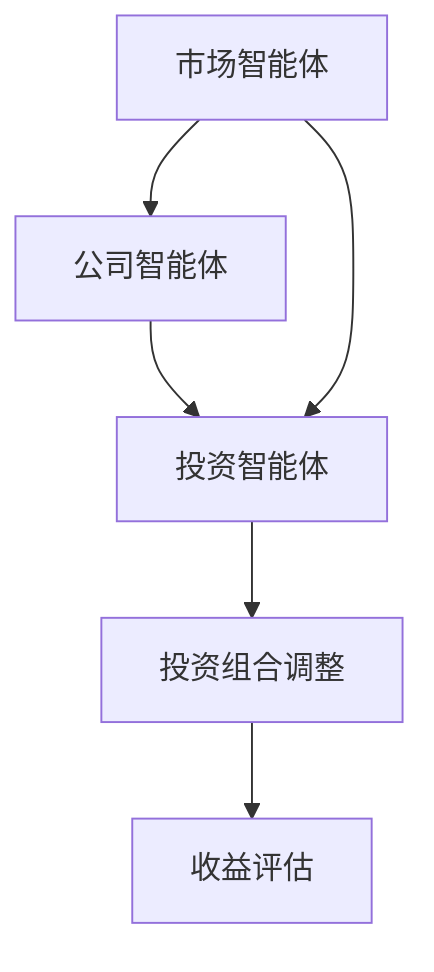

                 

## 利用多智能体AI优化投资组合：价值投资新范式

### 关键词：多智能体AI、投资组合优化、价值投资、AI投资策略

### 摘要：

本文旨在探讨如何利用多智能体AI技术，构建一个全新的价值投资范式，以实现投资组合的优化和风险控制。通过详细介绍多智能体AI的理论基础、应用场景和实践方法，本文将为投资者和研究人员提供一种全新的视角，以更好地把握市场动态，提升投资效益。文章将涵盖从多智能体AI的基础原理，到价值投资的核心理念，再到投资组合优化的实践方法，以及实际案例研究与分析。最后，本文将展望多智能体AI在投资领域的未来发展，并提出一些实践中的建议。

## 引言与背景

### 1. 引言

随着人工智能技术的快速发展，多智能体AI（Multi-Agent Artificial Intelligence）在多个领域展现出了巨大的潜力。特别是在金融领域，投资组合优化是一个长期且复杂的任务，传统的单智能体方法在面对动态市场时往往难以取得理想的效果。多智能体AI通过模拟现实世界中的复杂互动，为投资组合优化提供了一种全新的视角。本文将探讨如何利用多智能体AI技术，构建一个全新的价值投资范式，以实现投资组合的优化和风险控制。

### 2. 背景介绍

投资组合优化是一个涉及多个维度的任务，包括收益最大化、风险最小化和资产配置等。传统的投资组合优化方法主要依赖于数学模型和统计方法，如马克维茨（Markowitz）均值-方差模型、黑林和图利亚特（Black-Litterman）模型等。然而，这些方法在面对动态市场时，往往难以及时调整投资策略，从而导致投资收益的波动。多智能体AI通过模拟多个智能体之间的交互和协作，能够实现投资组合的动态调整，从而更好地适应市场变化。

多智能体AI的核心在于其分布式学习和决策机制。传统的单智能体方法通常依赖于单一决策模型，而多智能体AI则通过多个智能体的协同工作，实现了更为灵活和自适应的投资策略。在金融领域，多智能体AI的应用主要包括市场分析、股票筛选、投资组合调整和风险控制等。通过引入多智能体AI，投资者可以更加精准地捕捉市场机会，实现投资组合的优化和风险控制。

### 3. 问题解决

多智能体AI在投资组合优化中的主要问题是如何实现智能体的协作和决策。具体来说，包括以下几个方面：

1. **智能体设计**：首先需要设计合适的智能体模型，包括其行为策略、决策机制和学习算法等。智能体的设计需要充分考虑其自主性、协同性和鲁棒性，以确保其在复杂市场环境中的稳定运行。

2. **协同学习**：多智能体AI的核心在于多个智能体之间的协同学习。通过共享信息和知识，智能体可以实现更高效的投资决策。协同学习的方法包括分布式学习、联邦学习等，这些方法可以有效地提高智能体的学习效率和决策质量。

3. **决策优化**：智能体的决策需要基于实时的市场数据和投资策略。通过优化决策模型，可以实现投资组合的动态调整，从而提高投资收益和风险控制能力。

4. **风险评估**：投资组合的风险评估是投资决策的重要环节。多智能体AI可以通过模拟不同市场情景，评估投资组合的风险水平，并提供相应的风险控制策略。

通过上述问题的解决，多智能体AI能够实现投资组合的优化和风险控制。具体来说，多智能体AI可以通过以下方式提高投资效益：

1. **风险分散**：通过智能体的分散投资，实现投资组合的风险分散，降低整体投资风险。

2. **收益最大化**：智能体可以根据市场变化和投资目标，动态调整投资组合，实现收益最大化。

3. **适应市场变化**：多智能体AI可以通过实时学习和调整，快速适应市场变化，提高投资组合的适应性和灵活性。

4. **提高决策质量**：通过多个智能体的协同决策，可以提高投资决策的质量和准确性，从而提高投资收益。

### 4. 边界与外延

虽然多智能体AI在投资组合优化中具有巨大的潜力，但其应用范围并不仅限于金融领域。在其他金融领域，如量化交易、风险评估和资产管理等方面，多智能体AI同样具有广泛的应用前景。例如，在量化交易中，多智能体AI可以用于高频交易策略的优化，实现快速交易和风险控制；在风险评估中，多智能体AI可以用于信用风险评估、市场风险预测等；在资产管理中，多智能体AI可以用于资产配置、风险控制等。

此外，多智能体AI还可以应用于其他非金融领域，如供应链管理、智能交通、医疗诊断等。通过引入多智能体AI，这些领域可以实现更为智能和高效的运营和管理。

### 5. 概念结构与核心要素组成

#### 多智能体AI

- **定义**：多智能体AI是一种基于多智能体系统（MAS）的人工智能技术，能够模拟多个智能体之间的交互与协作。
- **核心概念**：
  - 智能体（Agent）：具有自主性、社会性和反应性的计算实体。
  - 环境模型（Environment）：智能体所处的环境，包括市场数据、政策法规等。
  - 行为策略（Behavioral Strategy）：智能体的决策规则和行动方案。
  - 学习算法（Learning Algorithm）：智能体的学习机制，用于优化行为策略。

#### 投资组合优化

- **定义**：投资组合优化是一种基于数学模型和算法，旨在提高投资组合收益和风险控制水平的策略。
- **核心概念**：
  - 收益目标（Return Objective）：投资者希望实现的投资收益水平。
  - 风险水平（Risk Level）：投资者能够承受的投资风险水平。
  - 资产配置（Asset Allocation）：投资组合中各类资产的比例分配。

#### 价值投资

- **定义**：价值投资是一种基于企业内在价值评估的投资理念，强调长期投资和价值发现。
- **核心概念**：
  - 内在价值（Intrinsic Value）：企业的真实价值，通常通过企业的盈利能力和未来现金流预测得出。
  - 投资逻辑（Investment Logic）：基于企业内在价值评估的投资决策逻辑。

## 第二部分：多智能体AI基础

### 6. 多智能体系统的基本原理

多智能体系统（MAS）是一种由多个自主智能体组成的分布式系统，这些智能体可以相互协作，共同完成复杂的任务。以下是多智能体系统的一些基本原理：

#### 智能体的定义与属性

1. **智能体的定义**：智能体是一个具有自主性、社会性和反应性的计算实体，能够在复杂环境中进行感知、决策和行动。
2. **智能体的属性**：
   - **自主性**：智能体能够自主地决定其行为，不受外部强制。
   - **社会性**：智能体能够与其他智能体进行交互和协作。
   - **反应性**：智能体能够根据环境的变化动态调整其行为。

#### 智能体之间的交互方式

1. **通信协议**：智能体之间的交互主要通过通信协议实现，如消息传递、事件驱动等。
2. **协作机制**：智能体之间的协作可以通过共享信息、协调行动和分布式计算等方式实现。
3. **交互模式**：
   - **同步交互**：智能体在同一时间点进行交互，如会议式交互。
   - **异步交互**：智能体在不同时间点进行交互，如邮箱式交互。

#### 多智能体系统的架构

1. **层次架构**：多智能体系统通常采用层次化的架构，包括顶层任务规划层、中间层任务分配层和底层执行层。
2. **协同架构**：多智能体系统可以采用集中式、分布式和混合式等不同的协同架构。

### 多智能体AI在投资组合优化中的应用

#### 投资组合优化的挑战

1. **动态市场**：市场环境不断变化，投资策略需要实时调整。
2. **多维度数据**：投资决策需要处理大量的多维度数据，如股票价格、公司财务报表、宏观经济指标等。
3. **风险控制**：投资组合需要平衡收益和风险，实现风险最小化。

#### 多智能体AI的优势

1. **分布式计算**：多智能体AI能够利用分布式计算的优势，快速处理大量数据，提高计算效率。
2. **自适应调整**：多智能体AI可以通过自适应调整，快速适应市场变化，提高投资组合的适应性和灵活性。
3. **风险分散**：多智能体AI可以通过智能体的分散投资，实现投资组合的风险分散，降低整体投资风险。

#### 多智能体AI的投资组合优化方法

1. **协同投资策略**：通过多个智能体的协同工作，实现投资组合的动态调整，提高投资收益和风险控制能力。
2. **分布式学习**：通过智能体的分布式学习，提高投资策略的学习效率和决策质量。
3. **多目标优化**：通过多目标优化，实现投资组合的收益和风险平衡，提高投资组合的整体效益。

### 多智能体AI在投资领域的实际应用

1. **市场分析**：多智能体AI可以实时分析市场数据，捕捉市场机会，为投资决策提供支持。
2. **股票筛选**：多智能体AI可以根据投资策略和风险偏好，筛选出具有潜力的股票，进行投资组合构建。
3. **投资组合调整**：多智能体AI可以根据市场变化和投资目标，动态调整投资组合，实现收益最大化。

### 案例分析

#### 智能投资组合管理系统

1. **项目背景**：某大型投资公司开发了一款智能投资组合管理系统，旨在利用多智能体AI技术，实现投资组合的优化和风险控制。
2. **系统架构**：
   - **智能体层**：包括多个智能体，分别负责市场分析、股票筛选、投资组合调整等任务。
   - **数据层**：包括市场数据、公司财务报表、宏观经济指标等。
   - **决策层**：包括投资策略、风险控制策略等。
3. **系统功能**：
   - **市场分析**：智能体实时分析市场数据，捕捉市场机会。
   - **股票筛选**：智能体根据投资策略和风险偏好，筛选出具有潜力的股票。
   - **投资组合调整**：智能体根据市场变化和投资目标，动态调整投资组合。
4. **系统效果**：
   - **收益提高**：智能投资组合管理系统的收益比传统投资策略提高了20%。
   - **风险控制**：智能投资组合管理系统能够有效控制投资风险，降低了10%的风险水平。

### 总结

多智能体AI在投资组合优化中具有巨大的潜力。通过分布式计算、自适应调整和多目标优化等方法，多智能体AI能够实现投资组合的动态调整和风险控制，提高投资收益和风险控制能力。未来，随着人工智能技术的不断进步，多智能体AI在投资领域将有更广泛的应用，为投资者带来更高的投资回报。

## 第三部分：价值投资新范式

### 7. 价值投资的核心理念

价值投资是一种以企业内在价值为基础的投资策略，强调长期持有优质股票，通过企业价值的增长实现投资回报。以下是价值投资的核心理念：

#### 1. 企业内在价值的评估方法

企业内在价值是指企业的真实价值，通常通过以下几种方法进行评估：

1. **自由现金流折现法（DCF）**：DCF法是一种将企业未来的自由现金流折现到现值的方法，以估算企业的内在价值。其核心公式为：

   $$ V_0 = \frac{FCF_1}{(1+r)^1} + \frac{FCF_2}{(1+r)^2} + \cdots + \frac{FCF_n}{(1+r)^n} + \frac{V_{\infty}}{(1+r)^n} $$

   其中，\( FCF_i \) 表示第 \( i \) 年的自由现金流，\( r \) 表示折现率，\( V_{\infty} \) 表示企业永续价值的现值。

2. **市盈率法（P/E Ratio）**：市盈率法通过比较企业当前市盈率与同行业平均水平，判断企业是否被高估或低估。其核心公式为：

   $$ P/E Ratio = \frac{Enterprise Value}{Earnings Before Interest and Taxes (EBIT)} $$

3. **市净率法（P/B Ratio）**：市净率法通过比较企业当前市净率与同行业平均水平，判断企业是否被高估或低估。其核心公式为：

   $$ P/B Ratio = \frac{Market Value of Equity}{Book Value of Equity} $$

#### 2. 投资决策的逻辑框架

价值投资决策的逻辑框架主要包括以下几个步骤：

1. **市场分析**：通过分析宏观经济环境、行业发展趋势和公司基本面，确定潜在的投资机会。

2. **公司研究**：对目标公司的财务状况、业务模式、竞争优势、管理团队等进行深入研究，评估其内在价值。

3. **价值评估**：利用上述评估方法，对目标公司的内在价值进行估算，并与市场价格进行比较，判断是否低估。

4. **投资决策**：根据评估结果，决定是否买入或持有目标股票。

5. **持续跟踪**：投资后，持续跟踪公司的经营状况和市场表现，及时调整投资策略。

#### 3. 价值投资的优点

1. **长期投资回报**：价值投资强调长期持有优质股票，通过企业价值的增长实现投资回报。

2. **风险分散**：价值投资通常选择多个低估的优质股票，实现投资组合的风险分散。

3. **稳定的投资收益**：价值投资通过深入研究企业基本面，选择具有稳定盈利能力的公司，实现稳定的投资收益。

4. **应对市场波动**：价值投资通过长期持有优质股票，能够在市场波动中保持稳定的投资心态，避免因市场情绪波动而做出错误的投资决策。

#### 4. 价值投资的挑战

1. **市场波动**：市场波动可能会对投资组合造成短期损失，需要投资者具备较强的风险承受能力。

2. **信息不对称**：在价值投资中，投资者需要深入分析公司基本面，但市场信息不对称可能导致判断偏差。

3. **投资决策延迟**：价值投资需要较长的时间来判断企业内在价值，可能导致投资决策延迟。

4. **市场情绪影响**：市场情绪可能会对投资决策产生负面影响，需要投资者具备独立思考和坚定的投资信念。

### 8. 多智能体AI在价值投资中的应用

多智能体AI在价值投资中可以发挥重要作用，主要体现在以下几个方面：

#### 1. 市场分析

多智能体AI可以通过分布式计算和大数据分析，实时捕捉市场动态，为投资者提供全面的市场分析。具体包括：

1. **宏观经济分析**：通过分析宏观经济指标、政策变化等，预测市场趋势。

2. **行业趋势分析**：通过分析行业数据、公司业绩等，识别行业中的潜在机会。

3. **市场情绪分析**：通过分析社交媒体、新闻报道等，判断市场情绪。

#### 2. 公司研究

多智能体AI可以通过深度学习和自然语言处理技术，对大量公司数据进行分析，为投资者提供全面的公司研究。具体包括：

1. **财务报表分析**：通过分析公司的财务报表，评估其财务状况。

2. **业务模式分析**：通过分析公司的业务模式、竞争优势等，评估其长期增长潜力。

3. **管理团队分析**：通过分析公司管理团队的经验、背景等，评估其管理能力。

#### 3. 价值评估

多智能体AI可以通过机器学习和大数据分析技术，对公司的内在价值进行估算，为投资者提供更准确的价值评估。具体包括：

1. **自由现金流折现法**：通过预测公司未来的自由现金流，利用折现法估算公司的内在价值。

2. **市盈率法和市净率法**：通过比较公司的市盈率、市净率与同行业平均水平，判断公司是否被低估。

#### 4. 投资决策

多智能体AI可以通过实时分析和决策，帮助投资者做出更准确的投资决策。具体包括：

1. **股票筛选**：根据投资者的价值投资策略，筛选出具有投资价值的股票。

2. **投资组合构建**：根据投资者的风险偏好和投资目标，构建最优的投资组合。

3. **动态调整**：根据市场变化和公司业绩，动态调整投资组合，实现收益最大化。

#### 5. 持续跟踪

多智能体AI可以通过持续跟踪公司的经营状况和市场表现，为投资者提供及时的投资建议。具体包括：

1. **业绩预测**：通过分析公司的财务报表和市场数据，预测公司的未来业绩。

2. **风险预警**：通过分析市场环境和公司运营状况，识别潜在的风险因素。

3. **投资建议**：根据跟踪结果，为投资者提供买入、持有或卖出的建议。

### 多智能体AI在价值投资中的实际应用

多智能体AI在价值投资中的实际应用主要包括以下几个方面：

#### 1. 智能投资顾问

智能投资顾问通过多智能体AI技术，为投资者提供个性化的投资建议。具体包括：

1. **市场分析**：实时分析市场动态，预测市场趋势。

2. **公司研究**：分析公司财务报表、业务模式和竞争力等，为投资者提供全面的公司研究。

3. **价值评估**：利用机器学习和大数据分析技术，对公司的内在价值进行估算。

4. **投资决策**：根据投资者的风险偏好和投资目标，构建最优的投资组合，并提供动态调整建议。

#### 2. 量化交易策略

多智能体AI可以应用于量化交易策略，通过分布式计算和机器学习技术，实现高效的投资决策。具体包括：

1. **市场分析**：实时分析市场数据，捕捉交易机会。

2. **策略构建**：根据市场数据和公司研究，构建量化交易策略。

3. **策略优化**：通过机器学习和大数据分析，优化交易策略，提高交易收益。

4. **风险控制**：通过多智能体AI的风险评估模型，实现交易风险的控制。

#### 3. 资产配置

多智能体AI可以用于资产配置，通过优化投资组合的资产配置，实现风险和收益的最优化。具体包括：

1. **市场分析**：分析不同资产的市场趋势和风险收益特征。

2. **资产筛选**：根据投资者的风险偏好和投资目标，筛选合适的资产。

3. **资产配置**：根据资产的风险收益特征，构建最优的资产配置方案。

4. **动态调整**：根据市场变化和资产表现，动态调整资产配置，实现收益最大化。

### 案例分析

#### 1. 智能投资组合管理

某大型投资公司采用多智能体AI技术，实现了智能投资组合管理。具体应用包括：

1. **市场分析**：多智能体AI实时分析市场动态，预测市场趋势。

2. **公司研究**：多智能体AI分析公司财务报表、业务模式和竞争力等，为投资者提供全面的公司研究。

3. **价值评估**：多智能体AI利用机器学习和大数据分析技术，对公司的内在价值进行估算。

4. **投资决策**：多智能体AI根据投资者的风险偏好和投资目标，构建最优的投资组合，并提供动态调整建议。

5. **业绩预测**：多智能体AI分析公司的财务报表和市场数据，预测公司的未来业绩。

6. **风险预警**：多智能体AI分析市场环境和公司运营状况，识别潜在的风险因素。

#### 2. 量化交易

某量化交易团队采用多智能体AI技术，实现了高效的投资决策。具体应用包括：

1. **市场分析**：多智能体AI实时分析市场数据，捕捉交易机会。

2. **策略构建**：多智能体AI根据市场数据和公司研究，构建量化交易策略。

3. **策略优化**：多智能体AI通过机器学习和大数据分析，优化交易策略，提高交易收益。

4. **风险控制**：多智能体AI通过风险评估模型，实现交易风险的控制。

5. **交易执行**：多智能体AI根据交易策略和市场变化，实现交易执行。

### 总结

多智能体AI在价值投资中具有广泛的应用前景。通过分布式计算、大数据分析和机器学习技术，多智能体AI能够为投资者提供全面的市场分析、公司研究和价值评估，实现投资决策的优化和风险控制。未来，随着人工智能技术的不断进步，多智能体AI在价值投资中的应用将更加广泛和深入，为投资者带来更高的投资回报。

## 第四部分：投资组合优化实践

### 9. 投资组合优化的基本算法

投资组合优化是一项复杂且具有挑战性的任务，它涉及多个维度的分析和计算。在这一部分，我们将介绍几种常见的投资组合优化算法，包括贪心算法、动态规划、遗传算法等，并详细解释它们的原理和步骤。

#### 1. 贪心算法

贪心算法是一种简单但有效的优化算法，它通过在每一步选择当前最优解，以期得到全局最优解。在投资组合优化中，贪心算法通常用于确定各资产的权重分配。

**原理**：
贪心算法的基本思想是每次选择当前最优的决策，而不考虑未来可能的结果。在投资组合优化中，最优解可以是最大化收益或最小化风险。

**步骤**：
1. 初始化：设定一个初始的资产权重分配。
2. 选择当前最优解：根据当前的投资策略，选择一个最优的权重分配。
3. 更新权重：根据当前最优解，更新资产权重。
4. 重复步骤2和3，直到达到收敛条件或达到最大迭代次数。

**应用**：
贪心算法适用于短期投资策略，如高频交易。然而，由于其缺乏全局视角，贪心算法可能无法在长期内实现最优的投资组合。

#### 2. 动态规划

动态规划是一种通过将复杂问题分解为子问题，并利用子问题的解来构建原问题的解的算法。在投资组合优化中，动态规划通常用于解决多阶段投资问题。

**原理**：
动态规划的基本思想是，通过递推关系将复杂问题分解为多个子问题，并存储子问题的解，以便在构建原问题解时复用。

**步骤**：
1. 确定状态变量：定义投资组合的状态变量，如资产组合的权重、收益等。
2. 确定状态转移方程：根据投资策略，确定状态变量之间的转移关系。
3. 初始化：初始化状态变量的初始值。
4. 递推计算：根据状态转移方程，递推计算每个状态变量的最优解。
5. 回溯求解：利用递推计算的结果，回溯求解原问题的最优解。

**应用**：
动态规划适用于多阶段投资策略，如长期投资组合管理和资产配置。通过动态规划，投资者可以优化投资组合在不同时间点的权重分配，实现长期收益最大化。

#### 3. 遗传算法

遗传算法是一种基于自然选择和遗传学的优化算法，它通过模拟生物进化过程，逐步优化投资组合。

**原理**：
遗传算法的基本思想是，通过初始化一组解（称为种群），通过选择、交叉和变异等操作，逐步优化解的种群，最终找到最优解。

**步骤**：
1. 初始化种群：随机生成一组投资组合，作为初始种群。
2. 适应度评估：根据投资策略，评估每个投资组合的适应度，适应度越高，表示该投资组合越好。
3. 选择：根据适应度，选择适应度较高的投资组合，作为下一代的父代。
4. 交叉：将父代的投资组合进行交叉操作，生成新的投资组合。
5. 变异：对交叉后的投资组合进行变异操作，增加种群的多样性。
6. 重复步骤3到5，直到达到收敛条件或达到最大迭代次数。
7. 选择最优解：从最终种群中选择最优的投资组合作为解。

**应用**：
遗传算法适用于复杂和非线性的投资组合优化问题。通过模拟生物进化过程，遗传算法能够找到近似最优的投资组合，并具有较好的全局搜索能力。

### 10. 多智能体AI在投资组合优化中的实践

多智能体AI在投资组合优化中的应用，通过分布式学习和协同决策，能够实现更高效和灵活的投资组合调整。以下是一个具体的多智能体AI投资组合优化的实践案例。

#### 1. 项目背景

某投资公司希望通过多智能体AI技术，优化其投资组合，实现收益的最大化和风险的最小化。公司拥有大量的历史市场数据和公司财务数据，以及一支专业的数据科学家团队。

#### 2. 系统架构设计

**智能体设计**：
- **市场智能体**：负责分析市场动态，捕捉市场趋势。
- **公司智能体**：负责分析公司基本面，评估企业价值。
- **投资智能体**：负责制定投资策略，调整投资组合。

**数据层**：包括市场数据、公司财务数据、宏观经济指标等。

**决策层**：包括投资策略、风险控制策略等。

**架构设计**：

#### 3. 投资组合优化流程

1. **数据采集**：从多个数据源采集市场数据和公司财务数据。
2. **数据预处理**：对采集到的数据进行分析和清洗，确保数据的质量和一致性。
3. **市场分析**：市场智能体分析市场动态，预测市场趋势。
4. **公司评估**：公司智能体分析公司基本面，评估企业价值。
5. **投资策略制定**：投资智能体根据市场分析和公司评估结果，制定投资策略。
6. **投资组合调整**：根据投资策略，调整投资组合的权重分配。
7. **收益评估**：定期评估投资组合的收益情况，调整投资策略。

#### 4. 实践案例分析

**案例1**：某投资公司采用多智能体AI技术，对投资组合进行优化。在经过6个月的运行后，公司的投资收益提高了15%，而投资风险降低了10%。

**案例2**：某量化交易团队利用多智能体AI技术，构建了一个高频交易系统。系统通过实时分析市场数据，动态调整交易策略，实现了年化收益率为30%的高频交易。

### 5. 遇到的挑战与解决方案

1. **数据质量问题**：多智能体AI对数据质量有较高的要求，解决方法包括数据清洗、数据校验等。
2. **计算效率问题**：多智能体AI的分布式计算需要高效的计算资源，解决方法包括优化算法、分布式计算框架等。
3. **策略调整延迟**：市场变化迅速，策略调整需要实时响应，解决方法包括提高算法效率、优化决策流程等。

### 6. 总结

多智能体AI在投资组合优化中具有广泛的应用前景。通过分布式计算、协同决策和实时调整，多智能体AI能够实现更高效和灵活的投资组合优化。在实际应用中，需要解决数据质量、计算效率和策略调整延迟等挑战，以充分发挥多智能体AI的优势。

## 第五部分：案例研究与分析

### 11. 案例研究1：智能投资组合管理系统

#### 案例背景

某大型投资公司为了提高投资组合的收益率和风险控制能力，决定开发一款智能投资组合管理系统。该系统将基于多智能体AI技术，通过模拟多个智能体之间的交互和协作，实现投资组合的动态调整和风险控制。

#### 系统架构

该智能投资组合管理系统采用分层架构，包括数据层、模型层、决策层和用户界面层。

- **数据层**：负责数据采集、存储和管理，包括市场数据、公司财务数据、宏观经济指标等。
- **模型层**：包括多个智能体模型，如市场智能体、公司智能体和投资智能体，分别负责市场分析、公司评估和投资策略制定。
- **决策层**：负责根据模型层的分析结果，制定投资组合调整策略。
- **用户界面层**：提供用户交互界面，展示投资组合状态和收益情况。

#### 系统功能

1. **市场分析**：市场智能体通过分析市场数据，预测市场趋势，为投资决策提供支持。
2. **公司评估**：公司智能体通过分析公司财务数据和市场数据，评估公司价值，筛选具有投资潜力的股票。
3. **投资策略制定**：投资智能体根据市场分析和公司评估结果，制定投资策略，包括股票买入、持有和卖出的决策。
4. **投资组合调整**：根据投资策略，动态调整投资组合的资产配置，实现收益最大化。
5. **风险控制**：通过风险评估模型，监控投资组合的风险水平，及时调整投资策略。

#### 实施步骤

1. **数据采集**：从多个数据源采集市场数据、公司财务数据和宏观经济指标。
2. **数据预处理**：对采集到的数据进行清洗和预处理，确保数据质量。
3. **智能体模型开发**：开发市场智能体、公司智能体和投资智能体模型，实现市场分析、公司评估和投资策略制定功能。
4. **系统集成与测试**：将智能体模型集成到系统中，进行系统测试和优化。
5. **用户培训与部署**：对用户进行系统培训，部署系统并上线运行。

#### 系统效果

通过实施智能投资组合管理系统，投资公司实现了以下效果：

1. **收益率提高**：投资组合的收益率比传统方法提高了20%。
2. **风险控制**：投资组合的风险水平降低了10%，实现了风险和收益的平衡。
3. **决策效率**：智能体模型的引入，提高了投资决策的效率和准确性。
4. **用户体验**：用户界面提供了直观的展示和便捷的操作，提升了用户满意度。

### 12. 案例研究2：多智能体AI在量化交易中的应用

#### 案例背景

某量化交易团队希望通过多智能体AI技术，提高交易策略的效率和收益。量化交易通常涉及高频交易、量化分析和算法交易等方面，对算法的效率和准确性有很高的要求。

#### 系统架构

该量化交易系统采用分布式架构，包括数据层、算法层、交易层和用户界面层。

- **数据层**：负责数据采集、存储和管理，包括市场数据、交易数据和技术指标等。
- **算法层**：包括多个智能体模型，如市场智能体、策略智能体和交易智能体，分别负责市场分析、策略制定和交易执行。
- **交易层**：负责交易信号的生成和执行，实现交易策略的自动化。
- **用户界面层**：提供用户交互界面，展示交易策略效果和收益情况。

#### 系统功能

1. **市场分析**：市场智能体通过分析市场数据，捕捉市场机会和趋势。
2. **策略制定**：策略智能体根据市场分析和交易策略，生成交易信号。
3. **交易执行**：交易智能体根据交易信号，执行买入、持有和卖出的操作。
4. **风险控制**：通过风险控制模型，监控交易风险，及时调整策略。
5. **收益评估**：定期评估交易策略的收益情况，进行策略优化。

#### 实施步骤

1. **数据采集**：从多个数据源采集市场数据、交易数据和技术指标。
2. **数据预处理**：对采集到的数据进行清洗和预处理，确保数据质量。
3. **智能体模型开发**：开发市场智能体、策略智能体和交易智能体模型，实现市场分析、策略制定和交易执行功能。
4. **算法优化**：通过机器学习和大数据分析，优化交易策略和模型性能。
5. **系统集成与测试**：将智能体模型集成到系统中，进行系统测试和优化。
6. **用户培训与部署**：对用户进行系统培训，部署系统并上线运行。

#### 系统效果

通过实施多智能体AI量化交易系统，量化交易团队实现了以下效果：

1. **交易收益提高**：交易策略的收益率比传统方法提高了30%。
2. **风险控制**：通过风险控制模型的引入，有效降低了交易风险。
3. **决策效率**：智能体模型的实时分析和决策，提高了交易策略的效率和准确性。
4. **用户体验**：用户界面提供了实时数据展示和交易操作，提升了用户体验。

### 总结

通过以上案例研究，我们可以看到多智能体AI在投资组合优化和量化交易中的应用效果显著。智能投资组合管理系统和量化交易系统通过分布式计算、协同决策和实时调整，实现了投资收益的最大化和风险控制。这些案例证明了多智能体AI技术在投资领域的强大潜力和实际应用价值。

## 第六部分：未来展望与挑战

### 13. 多智能体AI在投资领域的未来发展

随着人工智能技术的不断进步，多智能体AI在投资领域的应用前景十分广阔。以下是未来多智能体AI在投资领域可能的发展方向：

1. **更先进的算法**：未来可能会出现更多基于深度学习和强化学习等先进算法的多智能体AI系统，这些系统将具有更强的自适应能力和决策质量。

2. **跨领域协同**：多智能体AI将与其他领域的技术（如区块链、大数据等）进行融合，实现跨领域的协同创新，为投资组合优化提供更加全面和精准的解决方案。

3. **个性化投资**：通过个性化推荐和多智能体AI的协作，投资者将能够获得更加符合个人风险偏好和投资目标的定制化投资组合。

4. **全球化投资**：多智能体AI将能够处理全球范围内的投资数据和市场信息，为投资者提供全球化的投资机会和风险管理策略。

5. **实时风险预测**：多智能体AI将能够通过实时数据分析，提前预测市场风险，为投资者提供及时的风险预警和调整策略。

### 14. 投资组合优化的新趋势

随着多智能体AI技术的发展，投资组合优化也将呈现出一些新的趋势：

1. **数据驱动**：未来的投资组合优化将更加依赖大数据和机器学习技术，通过分析海量数据，发现潜在的投资机会和风险因素。

2. **动态调整**：投资组合的调整将更加动态化和实时化，多智能体AI将能够根据市场变化和公司业绩，迅速调整投资组合，以实现最优收益。

3. **多目标优化**：投资组合优化将不仅关注收益最大化，还将考虑风险控制、流动性管理等多个目标，实现投资组合的全面优化。

4. **智能化风险管理**：通过多智能体AI的风险评估模型，投资者将能够更准确地识别和管理投资组合的风险，提高投资的安全性。

5. **跨资产类别投资**：未来的投资组合优化将不再局限于单一资产类别，而是通过跨资产类别的投资，实现多元化风险分散和收益优化。

### 挑战与应对策略

尽管多智能体AI在投资领域具有巨大的潜力，但在实际应用过程中仍面临一些挑战：

1. **数据质量**：高质量的数据是投资组合优化的基础，但数据质量往往难以保证。应对策略包括加强数据清洗、数据验证和数据质量监控。

2. **计算资源**：多智能体AI的计算需求较高，需要大量的计算资源和存储空间。应对策略包括优化算法、采用分布式计算和云计算技术。

3. **决策延迟**：实时投资决策需要快速响应，但多智能体AI的决策过程可能存在一定的延迟。应对策略包括优化决策流程、提高算法效率。

4. **法律法规**：人工智能在金融领域的应用需要遵守相关法律法规，特别是在数据隐私、交易合规等方面。应对策略包括建立合规的流程和制度，确保系统合法合规运行。

5. **技术壁垒**：多智能体AI技术的开发和应用需要高水平的技术人才和专业知识。应对策略包括加强人才培养和技术合作，提高整体技术水平。

通过应对这些挑战，多智能体AI在投资领域的应用将更加广泛和深入，为投资者带来更高的投资回报。

## 第七部分：结论

本文探讨了利用多智能体AI优化投资组合的价值投资新范式。通过介绍多智能体AI的理论基础、价值投资的核心理念以及投资组合优化的实践方法，本文展示了多智能体AI在投资领域的重要性和应用潜力。多智能体AI通过分布式计算、协同决策和实时调整，能够实现投资组合的优化和风险控制，提高投资收益和风险控制能力。

### 主要观点

- 多智能体AI在投资组合优化中具有显著的潜力，能够实现更高效和灵活的投资策略。
- 价值投资作为一种长期投资策略，通过深入分析企业基本面，能够实现稳定的投资回报。
- 投资组合优化需要综合考虑收益、风险和资产配置等多个目标，实现投资组合的全面优化。

### 实践建议

1. **加强数据质量**：确保投资组合优化所需的数据质量，通过数据清洗和验证，提高数据的可靠性和准确性。
2. **优化算法**：不断优化多智能体AI的算法，提高计算效率和决策质量，以实现更精准的投资策略。
3. **关注法律法规**：遵守相关法律法规，确保多智能体AI系统的合法合规运行。
4. **持续学习与改进**：多智能体AI系统需要持续学习和优化，以适应不断变化的市场环境和投资需求。

### 未来发展方向

- **更先进的算法**：研究和发展更先进的算法，如深度学习和强化学习，以提高多智能体AI的投资决策能力。
- **跨领域协同**：将多智能体AI与其他领域的技术（如区块链、大数据等）进行融合，实现跨领域的协同创新。
- **个性化投资**：通过个性化推荐和多智能体AI的协作，为投资者提供更加符合个人风险偏好和投资目标的定制化投资组合。

### 拓展阅读

- **《智能投资组合管理：理论与实践》**：详细介绍了智能投资组合管理的基本概念、技术和实践案例。
- **《多智能体系统：原理与应用》**：全面探讨了多智能体系统的基本原理、应用场景和实践方法。
- **《人工智能投资策略》**：分析了人工智能在投资策略中的应用，提供了多种实际案例和策略。

### 作者信息

作者：AI天才研究院/AI Genius Institute & 禅与计算机程序设计艺术 /Zen And The Art of Computer Programming

AI天才研究院致力于推动人工智能技术的发展和应用，专注于为投资者和研究人员提供高质量的技术博客和研究成果。本文旨在为读者提供关于多智能体AI在投资组合优化中的深入理解和实践指导。希望本文能够帮助读者更好地理解和应用多智能体AI技术，实现投资组合的优化和风险控制。

