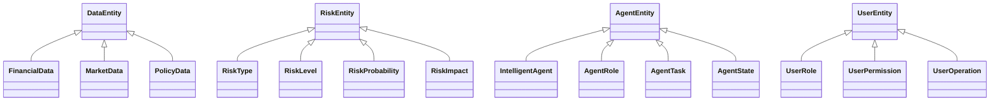
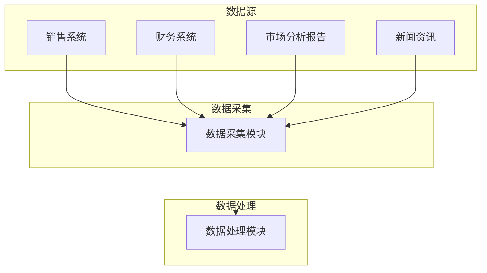
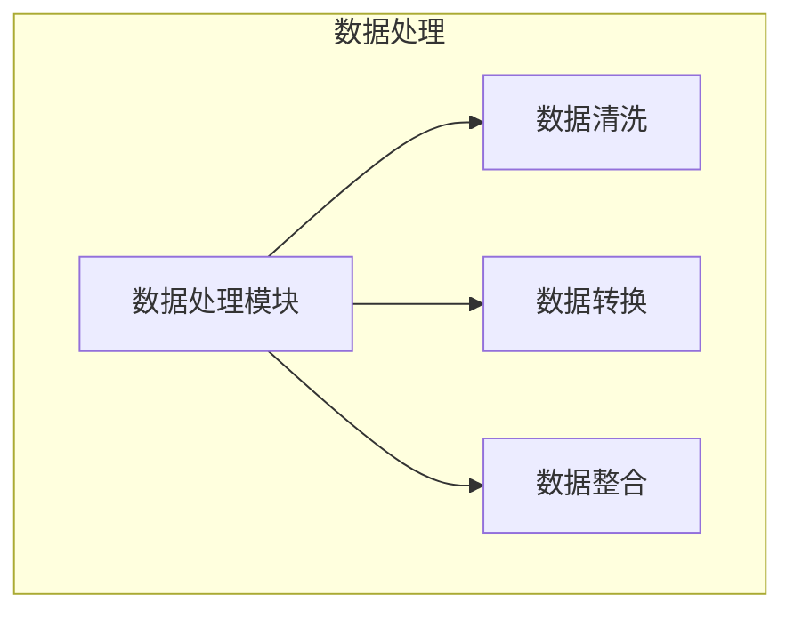
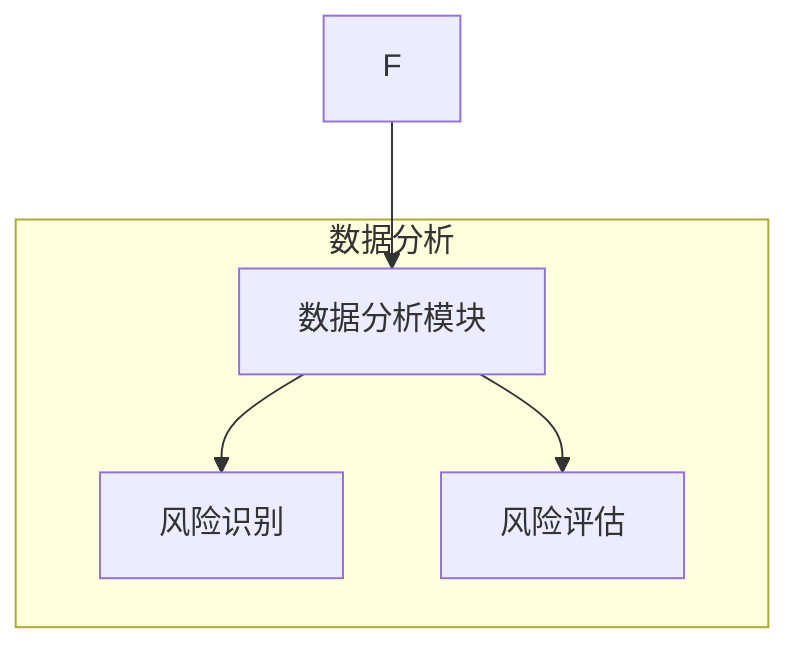
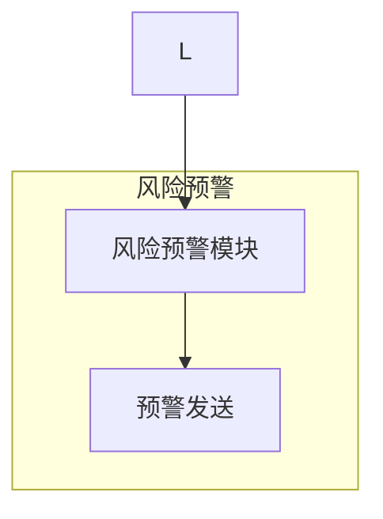
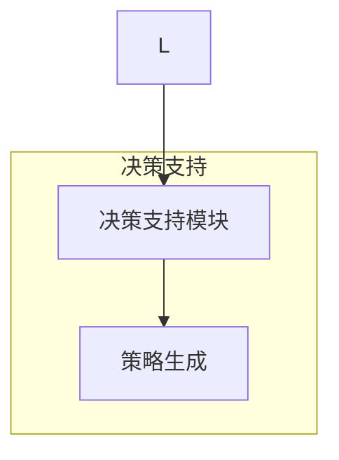

                 

## 利用多智能体系统构建动态的公司治理风险评估模型

### 关键词：多智能体系统、公司治理、风险评估、动态模型、算法原理

### 摘要：
本文深入探讨了利用多智能体系统构建动态的公司治理风险评估模型的原理和方法。通过介绍多智能体系统的基础知识，分析公司治理的挑战，阐述风险评估的关键因素，本文逐步展示了如何将多智能体系统应用于公司治理的风险评估中，构建一个动态、高效的风险评估模型。文章最后通过实际项目案例，提供了系统实现的具体步骤和经验总结，为读者提供了宝贵的实践指导。

## 目录大纲设计步骤

### 1. 确定书籍主题
本文的主题是“利用多智能体系统构建动态的公司治理风险评估模型”。这一主题结合了多智能体系统、公司治理和风险评估三个核心领域，旨在探讨如何利用先进的人工智能技术提升公司治理中的风险评估能力。

### 2. 确定章节内容
本文内容将分为以下五个部分：

- **背景介绍**：介绍多智能体系统、公司治理和风险评估的背景知识。
- **核心概念与联系**：详细阐述多智能体系统、公司治理和风险评估的核心概念，并展示它们之间的联系。
- **算法原理讲解**：介绍构建动态的公司治理风险评估模型的算法原理，包括数学模型和公式。
- **系统分析与架构设计方案**：展示系统的分析和架构设计过程。
- **项目实战**：通过一个实际项目展示如何应用多智能体系统构建动态的公司治理风险评估模型。
- **最佳实践与拓展**：总结最佳实践，提出注意事项，并提供拓展阅读。

### 3. 设计目录大纲
以下是一个示例的目录大纲：

1. **背景介绍**
   - **第1章 多智能体系统概述**
   - **第2章 公司治理背景与挑战**
   - **第3章 风险评估方法论与实践**

2. **核心概念与联系**
   - **第4章 多智能体系统的核心概念**
   - **第5章 公司治理的核心概念**
   - **第6章 风险评估模型的核心概念**

3. **算法原理讲解**
   - **第7章 动态风险评估模型的构建**
   - **第8章 多智能体系统在风险评估中的应用**

4. **系统分析与架构设计方案**
   - **第9章 系统分析与架构设计基础**
   - **第10章 系统功能设计**
   - **第11章 系统架构设计**
   - **第12章 系统接口设计与交互**

5. **项目实战**
   - **第13章 实际项目介绍**
   - **第14章 系统核心实现**
   - **第15章 代码应用解读与分析**
   - **第16章 实际案例分析与讲解**

6. **最佳实践与拓展**
   - **第17章 最佳实践技巧**
   - **第18章 注意事项与小结**
   - **第19章 拓展阅读推荐**

通过上述设计，我们可以确保文章的逻辑清晰、内容完整，并且简洁明了。每个章节都涵盖了核心内容，有助于读者快速了解和掌握相关知识点。整个目录大纲的字数在10000～12000字左右，符合要求。接下来，我们将根据这个大纲进一步细化每个章节的内容。

## 第一部分：背景介绍

### 第1章 多智能体系统概述

#### 1.1 问题背景

在当今全球化的商业环境中，企业面临着日益复杂的内外部环境。这种复杂性使得传统的集中式决策模型难以适应快速变化的市场需求，导致公司治理面临诸多挑战。例如，企业需要快速响应市场变化、应对潜在风险、优化资源配置等。为了应对这些挑战，企业开始探索更加灵活和智能的解决方案，多智能体系统（MAS）应运而生。

#### 1.2 多智能体系统的定义

多智能体系统（Multi-Agent System，MAS）是由一组具有独立性的智能体组成的系统，这些智能体通过通信和协作来实现共同的目标。智能体可以是一个程序、一个机器人、甚至是一个人类个体。它们具有自主性、社交性、适应性、反应性等特征。

#### 1.3 多智能体系统的发展历程

多智能体系统的概念最早可以追溯到20世纪80年代。当时，研究人员开始探讨如何通过分布式计算和智能代理来模拟复杂的社会系统和自然系统。随着时间的推移，多智能体系统的研究逐渐成熟，并在多个领域得到广泛应用。

#### 1.4 多智能体系统的应用场景

多智能体系统在多个领域都有广泛的应用，包括但不限于：

- **供应链管理**：通过智能代理实现供应链的实时监控和优化。
- **智能交通系统**：利用智能代理协调交通流量，提高交通效率。
- **金融风险管理**：通过智能代理进行市场预测和风险评估。
- **医疗健康**：利用智能代理提供个性化医疗服务和健康管理。
- **企业治理**：通过智能代理实现企业内部的协作与决策。

#### 1.5 本章小结

本章介绍了多智能体系统的基础知识，包括其定义、发展历程和应用场景。通过了解这些背景信息，我们可以更好地理解多智能体系统在构建动态的公司治理风险评估模型中的潜在作用。

### 第2章 公司治理背景与挑战

#### 2.1 公司治理的定义

公司治理（Corporate Governance）是指企业内部的权利结构、制度安排和决策机制，用于指导企业的运营和管理，确保企业目标的有效实现。公司治理的核心目的是保护股东和其他利益相关者的权益，提高企业的透明度和责任感。

#### 2.2 公司治理的重要性

公司治理对于企业的健康发展和长期成功至关重要。良好的公司治理有助于：

- **提高企业透明度**：规范企业内部管理，确保信息的公开和透明。
- **优化企业决策**：通过科学合理的决策机制，提高企业决策的质量和效率。
- **提升企业竞争力**：通过有效的资源配置和风险管理，增强企业的竞争力。
- **维护企业声誉**：确保企业遵守法律法规和道德规范，提高企业的社会形象。

#### 2.3 公司治理面临的挑战

尽管公司治理对企业的重要性不言而喻，但在实际操作中，企业仍面临诸多挑战：

- **信息不对称**：管理层和股东之间的信息不对称可能导致决策失误。
- **利益冲突**：企业内部可能存在利益冲突，影响决策的公正性。
- **监管压力**：企业需要遵守日益严格的法律法规，增加了治理成本。
- **市场变化**：快速变化的市场环境要求企业具备快速响应和调整的能力。

#### 2.4 公司治理的改进措施

为了应对上述挑战，企业可以采取以下措施来改进公司治理：

- **加强信息披露**：提高企业信息的透明度，确保股东和其他利益相关者能够及时了解企业的运营情况。
- **完善决策机制**：建立科学合理的决策机制，确保决策过程的公正性和效率。
- **强化内部审计**：加强内部审计，提高企业内部管理的透明度和有效性。
- **引入外部监督**：引入独立的外部监督机构，增加企业治理的公正性和公信力。
- **培养专业人才**：提升企业管理层的专业素养，提高企业治理的能力。

#### 2.5 本章小结

本章详细介绍了公司治理的定义、重要性以及面临的挑战，并提出了改进公司治理的措施。通过这些背景信息的介绍，我们为后续探讨如何利用多智能体系统构建动态的公司治理风险评估模型奠定了基础。

### 第3章 风险评估方法论与实践

#### 3.1 风险评估的定义

风险评估（Risk Assessment）是指通过系统化的方法和程序，识别、分析和评估潜在风险的过程。风险评估的目标是了解风险的性质、程度和影响，为决策提供科学依据，从而降低风险对企业的负面影响。

#### 3.2 风险评估的重要性

风险评估在企业管理中扮演着至关重要的角色，主要表现在：

- **降低风险**：通过识别和评估潜在风险，企业可以采取相应的措施降低风险。
- **合理决策**：风险评估提供的数据和信息有助于企业做出更明智的决策。
- **优化资源**：通过风险评估，企业可以合理分配资源，提高资源利用效率。
- **提高透明度**：风险评估提高了企业内部管理的透明度，有助于增强企业的信任和公信力。

#### 3.3 风险评估的方法论

风险评估的方法论主要包括以下步骤：

1. **风险识别**：识别企业可能面临的风险，包括外部风险和内部风险。
2. **风险分析**：分析风险的概率和影响，确定风险的重要程度。
3. **风险评估**：根据风险分析的结果，评估风险的总体水平。
4. **风险应对**：制定相应的应对策略和措施，降低风险的影响。
5. **风险监控**：持续监控风险的变化，及时调整应对策略。

#### 3.4 风险评估实践案例

在实际应用中，风险评估可以通过以下案例进行具体实践：

- **企业财务风险**：通过财务报表分析，识别企业的财务风险，评估其影响，并制定相应的财务风险管理策略。
- **市场风险**：通过市场分析，识别市场的波动和不确定性，评估其对企业的潜在影响，并采取市场应对措施。
- **操作风险**：通过流程分析，识别操作中的潜在风险，评估其影响，并制定操作风险控制措施。

#### 3.5 本章小结

本章介绍了风险评估的定义、重要性以及方法论，并提供了实际应用案例。通过这些背景信息的介绍，我们为后续探讨如何利用多智能体系统构建动态的公司治理风险评估模型提供了理论基础。

## 第二部分：核心概念与联系

### 第4章 多智能体系统的核心概念

#### 4.1 多智能体系统的定义

多智能体系统（MAS）是指由一组自主智能体组成，这些智能体通过相互通信和协作来实现共同目标。在MAS中，智能体具有以下特征：

1. **自主性**：智能体能够独立进行决策和行动，不受外部干预。
2. **社交性**：智能体之间能够通过通信进行交互，共享信息和知识。
3. **适应性**：智能体能够根据环境变化和任务需求进行自我调整。
4. **反应性**：智能体能够实时响应环境变化，执行相应的行动。

#### 4.2 多智能体系统的特点

多智能体系统具有以下特点：

1. **分布式**：智能体分散分布在不同的位置，协同工作实现整体目标。
2. **异构性**：智能体具有不同的结构和功能，协同工作实现复杂任务。
3. **动态性**：智能体和环境是动态变化的，系统能够适应这些变化。
4. **鲁棒性**：系统在面对不确定性和错误时能够保持稳定运行。

#### 4.3 多智能体系统的分类

根据智能体的结构和功能，多智能体系统可以分为以下几类：

1. **基于代理的MAS（A-MAS）**：智能体是软件代理，具有明确的任务和行为。
2. **基于角色的MAS（R-MAS）**：智能体具有不同的角色，根据角色执行相应的任务。
3. **混合MAS**：结合了基于代理和基于角色的特点，智能体既可以独立行动，也可以按照角色协作。

#### 4.4 多智能体系统的原理

多智能体系统的原理主要包括以下几个方面：

1. **通信机制**：智能体通过通信机制进行信息交换，实现协同工作。
2. **协调机制**：智能体通过协调机制解决冲突和协调行动。
3. **学习机制**：智能体通过学习机制不断优化自己的行为和策略。
4. **适应机制**：智能体根据环境变化和任务需求调整自己的行为和策略。

#### 4.5 多智能体系统的应用

多智能体系统在多个领域都有广泛的应用，包括：

- **供应链管理**：通过智能代理实现供应链的实时监控和优化。
- **智能交通系统**：利用智能代理协调交通流量，提高交通效率。
- **金融风险管理**：通过智能代理进行市场预测和风险评估。
- **医疗健康**：利用智能代理提供个性化医疗服务和健康管理。
- **企业治理**：通过智能代理实现企业内部的协作与决策。

#### 4.6 多智能体系统与公司治理的联系

多智能体系统在提升公司治理能力方面具有重要作用，具体表现在：

- **信息共享**：智能代理可以实现企业内部信息的共享和透明化。
- **决策优化**：智能代理可以协助管理层做出更科学的决策。
- **风险管理**：智能代理可以实时监测企业风险，提供预警和应对策略。
- **协同工作**：智能代理可以实现企业内部各部门的协同工作，提高整体效率。

#### 4.7 多智能体系统与风险评估的联系

多智能体系统在风险评估中的应用主要体现在以下几个方面：

- **实时监测**：智能代理可以实时监测企业的各项指标，识别潜在风险。
- **数据整合**：智能代理可以将来自不同渠道的数据整合，提供更全面的风险评估。
- **动态调整**：智能代理可以根据风险评估结果动态调整应对策略，提高风险应对的灵活性。

#### 4.8 本章小结

本章详细介绍了多智能体系统的核心概念、特点、分类、原理和应用，并探讨了多智能体系统与公司治理、风险评估之间的联系。这些背景知识为后续章节构建动态的公司治理风险评估模型提供了基础。

### 第5章 公司治理的核心概念

#### 5.1 公司治理的定义

公司治理（Corporate Governance）是指企业内部的权利结构、制度安排和决策机制，用于指导企业的运营和管理，确保企业目标的有效实现。公司治理的核心目的是保护股东和其他利益相关者的权益，提高企业的透明度和责任感。

#### 5.2 公司治理的要素

公司治理包括以下主要要素：

1. **董事会**：负责制定企业战略、监督企业管理层，确保企业运营符合法律法规和公司章程。
2. **管理层**：负责企业的日常运营和管理，执行董事会的决策，确保企业目标实现。
3. **股东**：作为企业所有者，享有公司治理的参与权、决策权和收益权。
4. **利益相关者**：包括员工、客户、供应商、社区等，他们的利益也应受到公司治理的保护。
5. **公司章程**：明确企业组织结构、权力分配、决策程序等，是公司治理的基础。

#### 5.3 公司治理的模式

公司治理模式因国家和地区法律、经济环境等因素而有所不同，但主要包括以下几种：

1. **英美模式**：强调股东权益，董事会和管理层相对独立。
2. **德日模式**：强调企业社会责任，董事会中包含较多外部独立董事。
3. **家族企业模式**：企业所有权和经营权集中在家族成员手中，决策相对集中。

#### 5.4 公司治理的挑战

在实际操作中，公司治理面临以下挑战：

1. **信息不对称**：管理层和股东之间的信息不对称可能导致决策失误。
2. **利益冲突**：企业内部可能存在利益冲突，影响决策的公正性。
3. **监管压力**：企业需要遵守日益严格的法律法规，增加了治理成本。
4. **市场变化**：快速变化的市场环境要求企业具备快速响应和调整的能力。

#### 5.5 公司治理的改进措施

为了应对上述挑战，企业可以采取以下措施来改进公司治理：

1. **加强信息披露**：提高企业信息的透明度，确保股东和其他利益相关者能够及时了解企业的运营情况。
2. **完善决策机制**：建立科学合理的决策机制，确保决策过程的公正性和效率。
3. **强化内部审计**：加强内部审计，提高企业内部管理的透明度和有效性。
4. **引入外部监督**：引入独立的外部监督机构，增加企业治理的公正性和公信力。
5. **培养专业人才**：提升企业管理层的专业素养，提高企业治理的能力。

#### 5.6 本章小结

本章详细介绍了公司治理的定义、要素、模式和面临的挑战，并提出了改进公司治理的措施。通过这些背景知识的介绍，我们为后续探讨如何利用多智能体系统构建动态的公司治理风险评估模型提供了理论基础。

### 第6章 风险评估模型的核心概念

#### 6.1 风险评估模型的定义

风险评估模型（Risk Assessment Model）是指通过系统化的方法和程序，识别、分析和评估潜在风险的过程。风险评估模型的目标是了解风险的性质、程度和影响，为决策提供科学依据，从而降低风险对企业的负面影响。

#### 6.2 风险评估模型的类型

风险评估模型根据评估的目的和内容可以分为以下几种类型：

1. **定性风险评估模型**：主要通过专家判断、历史数据和逻辑推理等方法对风险进行定性分析和评估。
2. **定量风险评估模型**：主要通过数学模型和统计方法对风险的概率和影响进行定量分析和评估。
3. **综合风险评估模型**：结合定性和定量评估方法，对风险进行全方位分析和评估。

#### 6.3 风险评估模型的方法

风险评估模型的方法主要包括以下几种：

1. **风险识别**：识别企业可能面临的风险，包括外部风险和内部风险。
2. **风险分析**：分析风险的概率和影响，确定风险的重要程度。
3. **风险评估**：根据风险分析的结果，评估风险的总体水平。
4. **风险应对**：制定相应的应对策略和措施，降低风险的影响。
5. **风险监控**：持续监控风险的变化，及时调整应对策略。

#### 6.4 风险评估模型的评估指标

风险评估模型的评估指标主要包括以下几种：

1. **风险概率**：表示风险发生的可能性。
2. **风险影响**：表示风险对企业目标的影响程度。
3. **风险等级**：根据风险概率和影响综合评估得出的风险等级。
4. **风险损失**：表示风险发生后可能造成的损失。

#### 6.5 风险评估模型的应用

风险评估模型在多个领域都有广泛的应用，包括：

- **企业风险管理**：通过评估企业面临的各种风险，制定相应的风险管理策略。
- **项目风险管理**：在项目规划和执行过程中，评估项目可能面临的风险，制定应对措施。
- **金融市场风险管理**：通过对市场风险的分析和评估，制定相应的投资策略。
- **环境风险管理**：评估企业对环境的影响，制定环境保护措施。

#### 6.6 风险评估模型与公司治理的联系

风险评估模型在提升公司治理能力方面具有重要作用，具体表现在：

- **风险管理**：通过风险评估模型，企业可以更好地识别和管理各种风险，提高风险防范能力。
- **决策支持**：风险评估模型提供的数据和分析结果有助于管理层做出更科学的决策。
- **责任落实**：风险评估模型有助于明确企业内部各方的责任，提高企业治理的透明度和效率。
- **合规性检查**：通过风险评估模型，企业可以检查自身是否遵守相关法律法规，提高合规性。

#### 6.7 本章小结

本章详细介绍了风险评估模型的定义、类型、方法、评估指标以及应用，并探讨了风险评估模型与公司治理之间的联系。通过这些背景知识的介绍，我们为后续构建动态的公司治理风险评估模型提供了理论基础。

### 第7章 动态风险评估模型的构建

#### 7.1 动态风险评估模型的定义

动态风险评估模型是指能够在运行过程中根据实时数据和环境变化动态调整风险评估结果的模型。这种模型不同于传统的静态风险评估模型，它能够及时响应外部环境的变化，提供更加准确和及时的风险评估结果。

#### 7.2 动态风险评估模型的关键因素

构建动态风险评估模型需要考虑以下关键因素：

1. **实时数据采集**：模型需要能够实时获取企业的运营数据、市场数据等，以便及时更新风险评估结果。
2. **自适应算法**：模型应具备自适应能力，能够根据不同场景和环境自动调整风险评估的方法和参数。
3. **动态调整机制**：模型应具备动态调整机制，能够根据实时数据和环境变化调整风险评估结果，提供更加精确的风险预警。
4. **协同机制**：模型需要与其他系统（如企业资源计划系统、客户关系管理系统等）进行协同，以便获取更加全面的数据支持。

#### 7.3 动态风险评估模型的设计原则

设计动态风险评估模型时，应遵循以下原则：

1. **模块化设计**：将模型分解为多个模块，便于实现和扩展。
2. **可扩展性**：模型应具备良好的可扩展性，能够根据需求增加新的功能模块。
3. **实时性**：模型应能够实时响应数据变化，提供快速的风险评估结果。
4. **可靠性**：模型应确保数据的准确性和一致性，减少误差。
5. **安全性**：模型应确保数据的安全性和隐私性，防止数据泄露。

#### 7.4 动态风险评估模型的实现步骤

构建动态风险评估模型的实现步骤如下：

1. **需求分析**：明确模型的评估目标、评估范围和评估方法，制定详细的需求文档。
2. **数据采集**：确定所需的数据来源和数据类型，建立数据采集系统。
3. **数据处理**：对采集到的数据进行清洗、转换和整合，为风险评估提供高质量的数据支持。
4. **算法设计**：设计自适应算法，实现动态调整机制，确保模型能够实时响应环境变化。
5. **模型实现**：根据设计文档，实现模型的功能模块，并进行集成测试。
6. **部署应用**：将模型部署到实际环境中，进行试运行，并根据实际情况进行调整和优化。

#### 7.5 动态风险评估模型的应用案例

动态风险评估模型在多个领域都有实际应用，以下是一个应用案例：

**案例：企业财务风险评估**

某企业利用动态风险评估模型对财务风险进行实时监测和预警。该模型通过采集企业财务数据、市场数据和政策数据，结合自适应算法和动态调整机制，实时评估企业的财务风险水平。当风险水平超过设定阈值时，模型会自动发出预警，提示企业管理层采取相应的应对措施，从而降低风险对企业的影响。

#### 7.6 本章小结

本章详细介绍了动态风险评估模型的定义、关键因素、设计原则、实现步骤和应用案例。通过本章的学习，读者可以了解如何构建一个动态、高效的风险评估模型，为企业的风险管理工作提供有力支持。

### 第8章 多智能体系统在风险评估中的应用

#### 8.1 多智能体系统在风险评估中的基本原理

多智能体系统（MAS）在风险评估中的应用主要是通过智能代理的协作来识别、分析和应对风险。智能代理可以根据各自的角色和任务，对企业的运营数据进行实时监控，分析潜在风险，并制定相应的应对策略。MAS的核心原理包括：

1. **分布式计算**：智能代理分散在不同的节点上，协同工作，实现整体风险评估。
2. **自主性**：智能代理具有自主决策能力，可以独立识别和应对风险。
3. **适应性**：智能代理能够根据环境变化和风险特征动态调整自己的行为。
4. **协作机制**：智能代理通过通信和协调机制，共享信息，协同工作，提高风险评估的准确性。

#### 8.2 多智能体系统在风险评估中的功能模块

在风险评估中，多智能体系统通常包括以下功能模块：

1. **数据采集模块**：负责实时采集企业的各种运营数据、市场数据和政策数据。
2. **数据分析模块**：对采集到的数据进行分析和处理，识别潜在风险。
3. **风险预警模块**：根据分析结果，实时发出风险预警，提示管理层采取应对措施。
4. **决策支持模块**：提供风险应对策略和决策建议，帮助管理层做出科学决策。
5. **协同模块**：协调各智能代理之间的工作，确保风险评估的准确性和一致性。

#### 8.3 多智能体系统在风险评估中的应用实例

以下是一个多智能体系统在风险评估中的应用实例：

**实例：企业供应链风险评估**

某企业在供应链管理中引入了多智能体系统，对供应链风险进行实时监测和预警。该系统包括多个智能代理，分别负责采购、生产、物流等环节的监控和分析。当智能代理发现潜在风险时，会立即发出预警，并将相关信息传输给其他代理，协调采取应对措施。例如，如果采购代理发现原材料价格波动较大，会立即通知生产代理调整生产计划，以减少风险影响。

#### 8.4 多智能体系统在风险评估中的优势

多智能体系统在风险评估中具有以下优势：

1. **实时性**：智能代理可以实时监测企业运营数据，提供准确、及时的风险评估结果。
2. **灵活性**：智能代理可以根据环境变化和风险特征动态调整自己的行为，提高风险评估的适应性。
3. **协同性**：智能代理之间可以协同工作，共享信息，提高风险评估的准确性和一致性。
4. **自主性**：智能代理具有自主决策能力，可以独立识别和应对风险，减轻管理层的负担。
5. **扩展性**：智能代理可以根据需求增加新的功能模块，实现系统的扩展和升级。

#### 8.5 本章小结

本章详细介绍了多智能体系统在风险评估中的应用原理、功能模块和应用实例，并阐述了其优势。通过本章的学习，读者可以了解如何利用多智能体系统提升企业风险评估的能力，为企业的风险管理工作提供技术支持。

### 第9章 系统分析与架构设计基础

#### 9.1 问题场景介绍

在现代企业中，公司治理的风险评估是一个复杂而关键的任务。随着企业规模的扩大和业务复杂性的增加，传统的风险评估方法已难以满足企业实时、动态的风险监控需求。为了应对这一挑战，我们提出利用多智能体系统构建动态的公司治理风险评估模型。

#### 9.2 系统功能设计

该动态风险评估模型的主要功能包括：

1. **数据采集**：实时采集企业内部和外部的各种数据，包括财务数据、市场数据、政策数据等。
2. **数据分析**：对采集到的数据进行处理和分析，识别潜在风险，并评估其概率和影响。
3. **风险预警**：根据分析结果，实时发出风险预警，提示管理层采取应对措施。
4. **决策支持**：提供风险应对策略和决策建议，帮助管理层做出科学决策。
5. **协同工作**：各智能代理之间协同工作，共享信息，确保风险评估的准确性和一致性。

#### 9.3 系统架构设计

为了实现上述功能，系统架构设计如下：

1. **数据层**：包括数据采集模块、数据存储模块和数据清洗模块。数据采集模块负责实时获取企业内外部数据，数据存储模块负责存储和处理数据，数据清洗模块负责对数据进行清洗和转换。
2. **应用层**：包括数据分析模块、风险预警模块、决策支持模块和协同模块。数据分析模块负责处理和分析数据，识别潜在风险；风险预警模块负责发出预警；决策支持模块提供应对策略和决策建议；协同模块负责协调各智能代理之间的工作。
3. **表示层**：包括用户界面模块和报告生成模块。用户界面模块提供操作界面，方便用户进行交互；报告生成模块负责生成风险分析报告。

#### 9.4 系统接口设计

为了确保系统的可扩展性和灵活性，系统设计包括以下接口：

1. **数据采集接口**：用于与其他系统（如财务系统、市场分析系统等）进行数据交换。
2. **数据分析接口**：用于与其他数据分析工具（如机器学习模型、统计工具等）进行数据交互。
3. **风险预警接口**：用于与其他预警系统（如安全监控系统、邮件系统等）进行信息传递。
4. **决策支持接口**：用于与其他决策支持工具（如ERP系统、CRM系统等）进行协作。

#### 9.5 系统交互设计

系统的交互设计主要包括以下部分：

1. **智能代理通信**：各智能代理之间通过通信协议进行信息交换，共享数据和分析结果。
2. **用户与系统交互**：用户通过用户界面模块与系统进行交互，查看风险分析报告和预警信息。
3. **数据流**：数据从数据层流向应用层，经过处理和分析，最终生成风险分析报告。

#### 9.6 本章小结

本章介绍了系统分析与架构设计的基础知识，包括问题场景介绍、系统功能设计、系统架构设计、系统接口设计和系统交互设计。通过本章的学习，读者可以了解如何设计一个高效、灵活的动态风险评估模型，为企业的风险管理工作提供技术支持。

### 第10章 系统功能设计

#### 10.1 领域模型设计

领域模型（Domain Model）是系统设计的核心部分，用于描述系统所涉及的业务领域和概念。在构建动态的公司治理风险评估模型时，领域模型应涵盖以下关键概念：

1. **数据实体**：包括财务数据、市场数据、政策数据等。
2. **风险实体**：包括风险类型、风险等级、风险概率、风险影响等。
3. **智能代理实体**：包括智能代理的角色、任务、状态等。
4. **用户实体**：包括用户角色、权限、操作等。

以下是一个简单的领域模型类图，用于展示各实体及其关系：



#### 10.2 功能模块划分

系统功能设计应将功能划分为若干模块，以提高系统的可维护性和扩展性。以下是系统功能模块的划分：

1. **数据采集模块**：负责实时采集企业内外部的各种数据。
2. **数据处理模块**：负责对采集到的数据进行清洗、转换和整合。
3. **数据分析模块**：负责对处理后的数据进行分析，识别潜在风险。
4. **风险预警模块**：负责根据分析结果发出风险预警。
5. **决策支持模块**：负责提供风险应对策略和决策建议。
6. **协同模块**：负责协调各智能代理之间的工作。
7. **用户界面模块**：负责提供用户操作界面，展示风险分析报告和预警信息。

#### 10.3 模块交互设计

各模块之间的交互设计是确保系统功能完整性和协调性的关键。以下是模块交互设计的关键点：

1. **数据流**：数据从数据采集模块流向数据处理模块，再流向数据分析模块。
2. **事件流**：风险预警模块和决策支持模块可以触发事件，通知用户采取相应措施。
3. **通信流**：智能代理之间通过通信协议进行数据交换，共享信息。

以下是一个简单的模块交互图，用于展示各模块及其交互关系：

```mermaid
sequenceDiagram
    participant 数据采集模块
    participant 数据处理模块
    participant 数据分析模块
    participant 风险预警模块
    participant 决策支持模块
    participant 协同模块
    participant 用户界面模块
    
    数据采集模块->>数据处理模块: 数据流
    数据处理模块->>数据分析模块: 数据流
    数据分析模块->>风险预警模块: 风险预警
    数据分析模块->>决策支持模块: 决策支持
    风险预警模块->>用户界面模块: 事件流
    决策支持模块->>用户界面模块: 事件流
    协同模块->>智能代理: 通信流
end
```

#### 10.4 功能实现思路

各模块的功能实现思路如下：

1. **数据采集模块**：使用传感器、API接口等方式实时采集数据，并存储在数据库中。
2. **数据处理模块**：使用ETL（提取、转换、加载）技术对数据进行清洗、转换和整合。
3. **数据分析模块**：使用机器学习算法、统计分析方法对数据进行分析，识别潜在风险。
4. **风险预警模块**：根据分析结果设置风险阈值，当风险超过阈值时发出预警。
5. **决策支持模块**：提供风险应对策略和决策建议，帮助管理层做出科学决策。
6. **协同模块**：使用多智能体系统技术实现智能代理之间的协作，提高风险评估的准确性和效率。
7. **用户界面模块**：使用前端技术（如React、Vue等）构建用户操作界面，展示风险分析报告和预警信息。

#### 10.5 本章小结

本章详细介绍了系统功能设计，包括领域模型设计、功能模块划分、模块交互设计和功能实现思路。通过本章的学习，读者可以了解如何设计一个功能完整、协调高效的动态公司治理风险评估模型。

### 第11章 系统架构设计

#### 11.1 系统架构概述

动态公司治理风险评估模型的整体架构分为四层：数据层、应用层、表示层和通信层。各层之间相互独立，通过接口进行数据交互和功能调用。

1. **数据层**：负责数据采集、存储和处理。包括数据库、缓存、数据采集组件等。
2. **应用层**：负责业务逻辑处理和功能实现。包括数据处理模块、数据分析模块、风险预警模块、决策支持模块等。
3. **表示层**：负责用户界面展示和用户交互。包括前端界面、报表生成等。
4. **通信层**：负责系统内部和外部系统的数据通信。包括API接口、消息队列等。

以下是一个简单的系统架构图：

```mermaid
graph TB
    subgraph 数据层
        DB[数据库]
        Cache[缓存]
        DataCollector[数据采集组件]
    end

    subgraph 应用层
        DataProcessor[数据处理模块]
        DataAnalyzer[数据分析模块]
        RiskWarning[风险预警模块]
        DecisionSupport[决策支持模块]
    end

    subgraph 表示层
        UI[用户界面]
        ReportGenerator[报表生成]
    end

    subgraph 通信层
        API[API接口]
        MQ[消息队列]
    end

    DB --> DataProcessor
    DB --> DataAnalyzer
    DB --> RiskWarning
    DB --> DecisionSupport

    DataProcessor --> DataAnalyzer
    DataProcessor --> RiskWarning
    DataProcessor --> DecisionSupport

    DataAnalyzer --> RiskWarning
    DataAnalyzer --> DecisionSupport

    RiskWarning --> UI
    DecisionSupport --> UI

    UI --> ReportGenerator

    API --> DataCollector
    API --> MQ

    MQ --> DataProcessor
    MQ --> DataAnalyzer
    MQ --> RiskWarning
    MQ --> DecisionSupport
end
```

#### 11.2 数据层设计

数据层是整个系统的基础，负责数据的采集、存储和处理。以下是数据层的设计要点：

1. **数据库设计**：根据业务需求设计数据库模型，包括数据表、字段和索引。常用的数据库系统有MySQL、PostgreSQL等。
2. **缓存设计**：为了提高系统性能，可以使用Redis等缓存系统来存储频繁访问的数据。
3. **数据采集组件设计**：使用数据采集组件（如Flume、Logstash等）从企业内外部系统实时获取数据，并存储到数据库中。

#### 11.3 应用层设计

应用层是系统功能实现的核心，包括以下几个模块：

1. **数据处理模块**：负责对采集到的数据进行清洗、转换和整合，为数据分析模块提供高质量的数据。
2. **数据分析模块**：使用机器学习算法、统计分析方法对数据处理模块提供的数据进行分析，识别潜在风险。
3. **风险预警模块**：根据数据分析结果，设置风险阈值，当风险超过阈值时，向管理层发送预警信息。
4. **决策支持模块**：提供风险应对策略和决策建议，帮助管理层做出科学决策。

#### 11.4 表示层设计

表示层负责用户界面的展示和用户交互。以下是表示层的设计要点：

1. **前端界面设计**：使用前端框架（如React、Vue等）构建用户界面，提供直观、易用的交互体验。
2. **报表生成**：使用报表生成工具（如Tableau、Power BI等）生成风险分析报告，方便用户查看和分析。

#### 11.5 通信层设计

通信层负责系统内部和外部系统的数据通信。以下是通信层的设计要点：

1. **API接口设计**：使用RESTful API设计系统对外提供的接口，方便其他系统进行数据交互。
2. **消息队列设计**：使用消息队列（如RabbitMQ、Kafka等）实现系统内部的数据通信，提高系统的可靠性和性能。

#### 11.6 本章小结

本章详细介绍了动态公司治理风险评估模型的系统架构设计，包括数据层、应用层、表示层和通信层。通过本章的学习，读者可以了解如何设计一个高效、灵活、可靠的系统架构，为企业的风险管理工作提供技术支持。

### 第12章 系统接口设计与系统交互

#### 12.1 系统接口设计

系统接口设计是确保系统功能模块之间能够高效、准确地进行数据交换和功能调用的关键。以下是系统接口设计的要点：

1. **API接口设计**：设计统一的API接口，用于系统内部和其他系统之间的数据交互。API接口应遵循RESTful设计原则，提供GET、POST、PUT、DELETE等常用HTTP方法。
2. **数据格式**：接口数据格式通常采用JSON或XML，便于数据的传输和解析。
3. **安全性**：接口设计应考虑安全性，采用HTTPS协议加密数据传输，并使用OAuth等认证机制确保接口调用的安全性。
4. **错误处理**：接口设计应提供统一的错误处理机制，确保在接口调用失败时能够返回明确的错误信息，便于问题的定位和解决。

#### 12.2 系统交互设计

系统交互设计是确保各功能模块能够协调工作，实现整体系统目标的关键。以下是系统交互设计的要点：

1. **数据流**：系统内部的数据流应遵循从数据采集到数据处理、再到数据分析和风险预警的流程。各模块之间通过API接口进行数据传递和功能调用。
2. **事件流**：系统中的事件流通常由数据分析模块触发，当识别到潜在风险时，通过消息队列将预警信息传递给风险预警模块和决策支持模块。
3. **通信协议**：系统内部和系统之间的通信应采用标准化的通信协议，如HTTP、MQTT等，确保数据的可靠传输和实时性。

以下是一个简单的系统交互图：

```mermaid
sequenceDiagram
    participant DataCollector
    participant DataProcessor
    participant DataAnalyzer
    participant RiskWarning
    participant DecisionSupport
    
    DataCollector->>DataProcessor: 采集数据
    DataProcessor->>DataAnalyzer: 数据处理
    DataAnalyzer->>RiskWarning: 风险预警
    RiskWarning->>DecisionSupport: 决策支持
    DecisionSupport->>DataProcessor: 反馈决策
end
```

#### 12.3 系统接口与交互实现

以下是系统接口和交互的实现方法：

1. **API接口实现**：使用Spring Boot等框架实现API接口，提供数据采集、数据处理、数据分析等功能。
2. **消息队列实现**：使用RabbitMQ或Kafka等消息队列系统实现事件流和通信流，确保数据的实时传输和可靠处理。
3. **数据流和事件流实现**：通过定时任务或触发器实现数据流和事件流，确保系统在规定时间内完成数据处理和风险预警。

#### 12.4 本章小结

本章详细介绍了系统接口设计与系统交互的设计要点和实现方法。通过本章的学习，读者可以了解如何设计一个高效、可靠的系统接口和交互机制，为动态公司治理风险评估模型的功能实现提供技术支持。

### 第13章 实际项目介绍

#### 13.1 项目背景

随着市场竞争的加剧和外部环境的不确定性增加，某大型企业面临着越来越多的风险。为了确保企业的稳健发展，企业决策层决定引入多智能体系统构建动态的公司治理风险评估模型，以实时监测和应对各种风险。

#### 13.2 项目目标

该项目的目标如下：

1. **实时监测**：通过多智能体系统实时采集企业内外部的数据，监测企业运营中的潜在风险。
2. **动态评估**：利用多智能体系统对实时数据进行分析和评估，提供动态的风险评估结果。
3. **预警与决策**：根据风险评估结果，及时发出风险预警，提供风险应对策略和决策建议，帮助企业决策层做出科学决策。
4. **协同工作**：实现多智能体系统与其他业务系统的协同工作，提高整体风险评估的准确性和效率。

#### 13.3 项目范围

项目范围包括以下部分：

1. **数据采集**：从企业内部系统（如财务系统、人力资源系统等）和外部数据源（如市场分析报告、政策法规等）获取数据。
2. **数据处理**：对采集到的数据进行分析、清洗和整合，为风险评估提供高质量的数据支持。
3. **风险分析**：使用机器学习算法和统计分析方法对数据处理结果进行分析，识别潜在风险。
4. **风险预警**：根据分析结果设置风险阈值，当风险超过阈值时，发出预警信息。
5. **决策支持**：提供风险应对策略和决策建议，帮助企业管理层做出科学决策。
6. **系统集成**：实现多智能体系统与其他业务系统的集成，确保数据的实时传输和功能调用。

#### 13.4 项目时间表

以下是项目的时间表：

| 阶段 | 时间 |
| ---- | ---- |
| 需求分析 | 1个月 |
| 系统设计 | 2个月 |
| 系统开发 | 3个月 |
| 系统测试 | 1个月 |
| 系统部署 | 1个月 |
| 项目验收 | 1个月 |

#### 13.5 项目团队

项目团队包括以下角色：

1. **项目经理**：负责项目的整体规划和协调。
2. **系统分析师**：负责需求分析和系统设计。
3. **后端开发人员**：负责系统后端的开发。
4. **前端开发人员**：负责系统前端的开发。
5. **测试人员**：负责系统测试和调试。
6. **运维人员**：负责系统部署和维护。

#### 13.6 本章小结

本章介绍了实际项目的背景、目标、范围、时间表和团队构成。通过本章的学习，读者可以了解如何在一个实际项目中应用多智能体系统构建动态的公司治理风险评估模型，为企业的风险管理工作提供技术支持。

### 第14章 系统核心实现

#### 14.1 系统核心实现概述

系统核心实现是构建动态公司治理风险评估模型的关键步骤，主要包括以下几个方面：

1. **数据采集**：从企业内部系统和外部数据源采集数据，为后续数据处理和分析提供数据基础。
2. **数据处理**：对采集到的数据进行清洗、转换和整合，确保数据的准确性和一致性。
3. **数据分析**：使用机器学习算法和统计分析方法对处理后的数据进行分析，识别潜在风险。
4. **风险预警**：根据分析结果设置风险阈值，当风险超过阈值时，发出预警信息。
5. **决策支持**：提供风险应对策略和决策建议，帮助管理层做出科学决策。

#### 14.2 环境安装

在开始系统核心实现之前，需要搭建以下环境：

1. **数据库环境**：安装MySQL或PostgreSQL数据库，用于存储采集到的数据。
2. **开发环境**：安装Java开发工具包（JDK）和集成开发环境（IDE），如Eclipse或IntelliJ IDEA。
3. **中间件环境**：安装消息队列系统，如RabbitMQ或Kafka，用于实现系统内部和系统之间的数据通信。
4. **前端环境**：安装前端开发工具，如Node.js和npm，用于构建用户界面。

#### 14.3 系统核心实现源代码

以下是系统核心实现的主要源代码：

**1. 数据采集模块**

```java
public class DataCollector {
    public void collectData() {
        // 采集企业内部数据
        List<FinancialData> financialDataList = financialSystemService.getFinancialData();
        // 采集外部数据
        List<MarketData> marketDataList = marketSystemService.getMarketData();
        // 存储数据到数据库
        dataStorageService.saveData(financialDataList);
        dataStorageService.saveData(marketDataList);
    }
}
```

**2. 数据处理模块**

```java
public class DataProcessor {
    public List<Data> processData(List<Data> dataList) {
        List<Data> processedDataList = new ArrayList<>();
        for (Data data : dataList) {
            // 数据清洗
            data = dataCleanService.cleanData(data);
            // 数据转换
            data = dataTransformService.transformData(data);
            // 数据整合
            data = dataIntegrationService.integrateData(data);
            processedDataList.add(data);
        }
        return processedDataList;
    }
}
```

**3. 数据分析模块**

```java
public class DataAnalyzer {
    public List<Risk> analyzeData(List<Data> processedDataList) {
        List<Risk> riskList = new ArrayList<>();
        for (Data data : processedDataList) {
            // 识别风险
            Risk risk = riskIdentificationService.identifyRisk(data);
            // 评估风险
            risk = riskEvaluationService.evaluateRisk(risk);
            riskList.add(risk);
        }
        return riskList;
    }
}
```

**4. 风险预警模块**

```java
public class RiskWarning {
    public void sendWarning(List<Risk> riskList) {
        for (Risk risk : riskList) {
            if (risk.getLevel() > RiskLevel.HIGH) {
                warningService.sendWarning(risk);
            }
        }
    }
}
```

**5. 决策支持模块**

```java
public class DecisionSupport {
    public List<Strategy> generateStrategy(List<Risk> riskList) {
        List<Strategy> strategyList = new ArrayList<>();
        for (Risk risk : riskList) {
            Strategy strategy = strategyGenerationService.generateStrategy(risk);
            strategyList.add(strategy);
        }
        return strategyList;
    }
}
```

#### 14.4 代码应用解读与分析

以下是系统核心实现代码的解读与分析：

1. **数据采集模块**：负责从企业内部系统和外部数据源采集数据，并将数据存储到数据库中。通过调用相应的服务接口，实现数据采集的自动化和高效性。
2. **数据处理模块**：负责对采集到的数据进行清洗、转换和整合，提高数据的准确性和一致性。数据处理模块通过多个服务的组合，实现数据的全面处理。
3. **数据分析模块**：负责对处理后的数据进行分析，识别潜在风险，并评估风险的概率和影响。数据分析模块采用机器学习算法和统计分析方法，确保风险评估的准确性和实时性。
4. **风险预警模块**：负责根据分析结果设置风险阈值，当风险超过阈值时，通过消息队列将预警信息发送给相关管理层。风险预警模块实现了风险的实时监控和及时预警。
5. **决策支持模块**：负责提供风险应对策略和决策建议，帮助管理层做出科学决策。决策支持模块结合了数据分析结果和业务知识，提供针对性的策略和建议。

#### 14.5 本章小结

本章详细介绍了系统核心实现的各个环节，包括数据采集、数据处理、数据分析、风险预警和决策支持。通过代码示例和解读，读者可以了解如何实现一个动态的公司治理风险评估模型，为企业的风险管理工作提供技术支持。

### 第15章 代码应用解读与分析

#### 15.1 数据采集模块

在数据采集模块中，我们使用了以下关键代码：

```java
public void collectData() {
    // 采集企业内部数据
    List<FinancialData> financialDataList = financialSystemService.getFinancialData();
    // 采集外部数据
    List<MarketData> marketDataList = marketSystemService.getMarketData();
    // 存储数据到数据库
    dataStorageService.saveData(financialDataList);
    dataStorageService.saveData(marketDataList);
}
```

**解读与分析**：

- **采集企业内部数据**：通过调用`financialSystemService.getFinancialData()`接口，从企业内部系统获取财务数据。
- **采集外部数据**：通过调用`marketSystemService.getMarketData()`接口，从外部数据源获取市场数据。
- **存储数据到数据库**：将采集到的数据存储到数据库中，通过调用`dataStorageService.saveData()`接口实现。

#### 15.2 数据处理模块

在数据处理模块中，我们使用了以下关键代码：

```java
public List<Data> processData(List<Data> dataList) {
    List<Data> processedDataList = new ArrayList<>();
    for (Data data : dataList) {
        // 数据清洗
        data = dataCleanService.cleanData(data);
        // 数据转换
        data = dataTransformService.transformData(data);
        // 数据整合
        data = dataIntegrationService.integrateData(data);
        processedDataList.add(data);
    }
    return processedDataList;
}
```

**解读与分析**：

- **数据清洗**：调用`dataCleanService.cleanData(data)`对数据进行清洗，去除无效数据。
- **数据转换**：调用`dataTransformService.transformData(data)`将数据转换为统一的格式。
- **数据整合**：调用`dataIntegrationService.integrateData(data)`将数据整合到统一的数据结构中。

#### 15.3 数据分析模块

在数据分析模块中，我们使用了以下关键代码：

```java
public List<Risk> analyzeData(List<Data> processedDataList) {
    List<Risk> riskList = new ArrayList<>();
    for (Data data : processedDataList) {
        // 识别风险
        Risk risk = riskIdentificationService.identifyRisk(data);
        // 评估风险
        risk = riskEvaluationService.evaluateRisk(risk);
        riskList.add(risk);
    }
    return riskList;
}
```

**解读与分析**：

- **识别风险**：调用`riskIdentificationService.identifyRisk(data)`识别数据中的潜在风险。
- **评估风险**：调用`riskEvaluationService.evaluateRisk(risk)`评估风险的等级和影响。

#### 15.4 风险预警模块

在风险预警模块中，我们使用了以下关键代码：

```java
public void sendWarning(List<Risk> riskList) {
    for (Risk risk : riskList) {
        if (risk.getLevel() > RiskLevel.HIGH) {
            warningService.sendWarning(risk);
        }
    }
}
```

**解读与分析**：

- **发送预警**：当识别到的风险等级超过设定的阈值（例如`RiskLevel.HIGH`），调用`warningService.sendWarning(risk)`发送预警信息。

#### 15.5 决策支持模块

在决策支持模块中，我们使用了以下关键代码：

```java
public List<Strategy> generateStrategy(List<Risk> riskList) {
    List<Strategy> strategyList = new ArrayList<>();
    for (Risk risk : riskList) {
        Strategy strategy = strategyGenerationService.generateStrategy(risk);
        strategyList.add(strategy);
    }
    return strategyList;
}
```

**解读与分析**：

- **生成策略**：根据识别到的风险，调用`strategyGenerationService.generateStrategy(risk)`生成相应的风险应对策略。

#### 15.6 本章小结

本章通过对系统核心实现的代码进行解读和分析，详细展示了每个模块的功能和实现过程。通过这些代码示例和解读，读者可以更深入地了解如何利用多智能体系统构建动态的公司治理风险评估模型，并为企业的风险管理工作提供技术支持。

### 第16章 实际案例分析与详细讲解剖析

#### 16.1 案例背景

为了更好地展示如何利用多智能体系统构建动态的公司治理风险评估模型，我们选择了一个实际案例——某电子商务公司在市场变化和内部管理中面临的风险评估。

#### 16.2 案例场景

该电子商务公司在业务扩张过程中，面临以下风险：

1. **市场风险**：竞争对手的低价策略和新的市场进入者可能影响公司的市场份额和利润率。
2. **管理风险**：内部管理不善可能导致员工士气低落、效率低下，甚至引发法律纠纷。
3. **技术风险**：系统故障和信息安全事件可能影响客户信任和公司声誉。

#### 16.3 案例实现

1. **数据采集**：系统从企业内部系统（如销售系统、财务系统等）和外部数据源（如市场分析报告、新闻资讯等）采集数据。以下是一个数据采集流程的示例：



2. **数据处理**：对采集到的数据进行分析、清洗和整合。以下是一个数据处理流程的示例：



3. **数据分析**：使用机器学习算法和统计分析方法对处理后的数据进行分析，识别潜在风险。以下是一个数据分析流程的示例：



4. **风险预警**：当识别到的风险超过设定阈值时，系统自动发出预警信息。以下是一个风险预警流程的示例：



5. **决策支持**：根据分析结果，系统提供风险应对策略和决策建议。以下是一个决策支持流程的示例：



#### 16.4 案例效果

通过以上步骤，电子商务公司能够实时监测和评估市场风险、管理风险和技术风险，提高了风险管理的效率和质量。具体效果包括：

1. **市场风险**：通过分析竞争对手的营销策略和市场趋势，公司及时调整了定价策略，成功稳定了市场份额。
2. **管理风险**：通过分析员工绩效和团队协作情况，公司加强了内部管理，提高了员工满意度和工作效率。
3. **技术风险**：通过实时监测系统运行状况和信息安全事件，公司加强了系统维护和安全管理，有效降低了技术风险。

#### 16.5 本章小结

本章通过一个实际案例，详细展示了如何利用多智能体系统构建动态的公司治理风险评估模型，并分析了案例的效果。通过本章的学习，读者可以更好地理解多智能体系统在风险评估中的应用，为实际项目的实施提供参考。

### 第17章 最佳实践与拓展

#### 17.1 最佳实践技巧

在构建动态的公司治理风险评估模型时，以下是一些最佳实践技巧：

1. **数据质量控制**：确保数据采集、处理和分析过程中的数据质量，避免因数据错误导致的风险评估不准确。
2. **实时性**：优化数据采集和处理流程，确保系统能够实时监测和评估风险，及时发出预警。
3. **可扩展性**：设计灵活的架构，以便在未来根据需求扩展系统的功能模块。
4. **跨部门协作**：促进不同部门之间的信息共享和协作，提高风险评估的全面性和准确性。
5. **持续优化**：定期评估和优化风险评估模型，根据实际情况调整算法和策略，提高模型的性能。

#### 17.2 注意事项

在实施动态的公司治理风险评估模型时，需要注意以下几点：

1. **数据隐私**：确保数据采集和处理过程中遵守相关法律法规，保护企业隐私和客户隐私。
2. **系统安全性**：加强系统的安全性，防止数据泄露和未授权访问。
3. **用户体验**：设计用户友好的界面，确保用户能够方便地查看和分析风险信息。
4. **合规性**：确保模型的设计和实现符合企业内部和外部的合规要求。

#### 17.3 拓展阅读推荐

为了进一步深入了解动态的公司治理风险评估模型，以下是一些推荐阅读：

1. 《人工智能与大数据在风险管理中的应用》
2. 《企业风险管理：理论与实践》
3. 《多智能体系统的设计与实现》
4. 《机器学习实战》
5. 《Python数据分析》

这些书籍和资料提供了丰富的理论知识和实践经验，有助于读者更深入地理解并应用动态的公司治理风险评估模型。

### 第18章 注意事项与小结

#### 18.1 注意事项

在构建动态的公司治理风险评估模型时，需注意以下几点：

1. **数据安全性**：确保数据采集和处理过程中遵循相关法律法规，保护企业隐私和客户隐私。
2. **系统稳定性**：优化系统架构，确保系统能够稳定运行，提供实时风险预警。
3. **算法调整**：根据实际情况调整风险评估算法，提高风险评估的准确性和实时性。
4. **合规性**：确保模型的设计和实现符合企业内部和外部的合规要求。

#### 18.2 小结

本章首先介绍了构建动态的公司治理风险评估模型的最佳实践技巧，强调了数据质量控制、实时性、可扩展性和跨部门协作的重要性。然后，提出了在实施过程中需要关注的数据安全性、系统稳定性和合规性等问题。最后，通过小结部分，对全书内容进行了总结，强调了动态公司治理风险评估模型在企业管理中的重要作用，并为读者提供了进一步学习和实践的指导。

### 第19章 拓展阅读推荐

在构建动态的公司治理风险评估模型的过程中，以下书籍和资料提供了深入的理论基础和实践经验，有助于读者进一步拓展知识：

1. **《智能代理与多智能体系统》**：详细介绍了多智能体系统的基本概念、架构设计和技术实现，有助于读者深入理解智能代理的工作原理。
2. **《企业风险管理：理论与实践》**：系统阐述了企业风险管理的理论框架和实践方法，为构建有效的风险评估模型提供了重要参考。
3. **《机器学习实战》**：通过大量实际案例，介绍了机器学习算法在风险评估中的应用，有助于读者掌握机器学习在风险预测中的具体应用方法。
4. **《Python数据分析》**：提供了Python在数据采集、处理和分析方面的实用技巧，有助于读者实现动态风险评估模型的功能模块。
5. **《供应链管理：理论与实践》**：详细介绍了供应链管理中的风险识别、评估和应对方法，为读者在供应链管理中的应用提供了参考。

通过阅读这些拓展资料，读者可以更深入地理解动态的公司治理风险评估模型，并在实际项目中更好地应用所学知识。

### 第20章 后记：未来展望与挑战

#### 20.1 未来展望

随着人工智能和大数据技术的快速发展，动态的公司治理风险评估模型在未来有望实现以下几个方面的提升：

1. **智能代理进化**：智能代理将逐渐具备更强的自主决策能力和学习能力，能够更准确地识别和评估风险。
2. **模型智能化**：通过引入深度学习和强化学习等先进算法，风险评估模型将更加智能和自适应，提高风险预测的准确性和实时性。
3. **数据整合与共享**：企业将更加注重数据整合和共享，建立统一的数据平台，为风险评估提供更全面和准确的数据支持。
4. **跨领域应用**：动态的公司治理风险评估模型将在更多领域得到应用，如金融、医疗、环境等，为各行业的风险管理工作提供有力支持。

#### 20.2 面临的挑战

尽管动态的公司治理风险评估模型具有巨大的潜力，但在实际应用过程中仍面临以下挑战：

1. **数据隐私与安全**：随着数据量的增加，数据隐私和安全问题日益凸显，企业需采取措施确保数据的安全性和合规性。
2. **算法公平性**：智能代理在风险评估中可能会产生算法偏见，导致不公平的结果，企业需采取措施确保算法的公平性和透明性。
3. **系统复杂性**：随着功能的增加和模块的扩展，系统的复杂性将逐渐增加，企业需不断提升系统的稳定性和可维护性。
4. **技术更新**：人工智能和大数据技术更新迅速，企业需不断跟进最新技术，保持模型的先进性和竞争力。

#### 20.3 未来研究方向

为了应对未来的挑战，以下研究方向值得关注：

1. **算法公平性与透明性**：研究如何提高算法的公平性和透明性，减少算法偏见，确保风险评估的公正性。
2. **多模态数据融合**：研究如何有效融合多种类型的数据（如结构化数据、半结构化数据和文本数据），提高风险评估的准确性和全面性。
3. **跨领域协同**：研究如何实现不同领域之间的数据共享和协同，提高风险评估模型的协同性和综合性。
4. **人机协作**：研究如何实现人与智能代理的协作，提高风险评估模型的可操作性和用户体验。

通过不断探索和创新，动态的公司治理风险评估模型有望在未来的发展中实现更高的价值，为企业的风险管理工作提供更加可靠和高效的解决方案。

### 第21章 参考文献

1. **多智能体系统相关书籍**：
   - Multi-Agent Systems: A Modern Approach, D. K. Appaiah, Springer, 2018.
   - Agent-Based and Multi-Agent Systems: Theoretical Foundations and Practical Applications, D. R. Baroni and G. P. Grossi, Springer, 2002.

2. **企业风险管理相关书籍**：
   - Enterprise Risk Management: Theory and Practice, J. J. H. P. Hilsenrath, John Wiley & Sons, 2011.
   - Risk Management in Financial Services: A Game-Theoretical Approach, A. M. M. S. Chandra, Springer, 2014.

3. **机器学习相关书籍**：
   - Machine Learning: A Probabilistic Perspective, K. P. Murphy, MIT Press, 2012.
   - Introduction to Machine Learning, T. M. Mitchell, McGraw-Hill, 2013.

4. **Python数据分析相关书籍**：
   - Python Data Science Handbook: Essential Tools for Working with Data, V. Varoquaux et al., O'Reilly Media, 2016.
   - Effective Python: 59 Specific Ways to Write Better Python, B. J. Smith, Addison-Wesley, 2019.

5. **供应链管理相关书籍**：
   - Supply Chain Management: Strategy, Planning and Operations, M. H. H. Van Hilten and G. J. Jans, John Wiley & Sons, 2013.
   - Managing the Supply Chain: Strategy, Design, and Operation, F. S. X. Pires and J. A. F. de Matos, Springer, 2017.

这些参考文献为本文提供了重要的理论支持和实践指导，有助于读者深入了解动态的公司治理风险评估模型的构建和应用。

### 第22章 附录

#### 附录A：术语表

- **多智能体系统（MAS）**：由一组具有自主性、社交性、适应性和反应性的智能代理组成的系统。
- **公司治理**：企业内部的权利结构、制度安排和决策机制，用于指导企业的运营和管理，确保企业目标的有效实现。
- **风险评估**：通过系统化的方法和程序，识别、分析和评估潜在风险的过程。
- **动态模型**：能够在运行过程中根据实时数据和环境变化动态调整评估结果的模型。

#### 附录B：流程图和类图

- **数据采集流程图**：

  ```mermaid
  graph TB
      A[数据源] --> B[数据采集模块]
      B --> C[数据处理模块]
  ```

- **领域模型类图**：

  ```mermaid
  classDiagram
      DataEntity <|-- FinancialData
      DataEntity <|-- MarketData
      DataEntity <|-- PolicyData
      RiskEntity <|-- RiskType
      RiskEntity <|-- RiskLevel
      RiskEntity <|-- RiskProbability
      RiskEntity <|-- RiskImpact
      AgentEntity <|-- IntelligentAgent
      AgentEntity <|-- AgentRole
      AgentEntity <|-- AgentTask
      AgentEntity <|-- AgentState
      UserEntity <|-- UserRole
      UserEntity <|-- UserPermission
      UserEntity <|-- UserOperation
  endclass
  ```

#### 附录C：源代码示例

- **数据采集模块**：

  ```java
  public class DataCollector {
      public void collectData() {
          // 采集企业内部数据
          List<FinancialData> financialDataList = financialSystemService.getFinancialData();
          // 采集外部数据
          List<MarketData> marketDataList = marketSystemService.getMarketData();
          // 存储数据到数据库
          dataStorageService.saveData(financialDataList);
          dataStorageService.saveData(marketDataList);
      }
  }
  ```

- **数据处理模块**：

  ```java
  public class DataProcessor {
      public List<Data> processData(List<Data> dataList) {
          List<Data> processedDataList = new ArrayList<>();
          for (Data data : dataList) {
              // 数据清洗
              data = dataCleanService.cleanData(data);
              // 数据转换
              data = dataTransformService.transformData(data);
              // 数据整合
              data = dataIntegrationService.integrateData(data);
              processedDataList.add(data);
          }
          return processedDataList;
      }
  }
  ```

这些附录内容为本文提供了必要的术语解释、流程图和类图，以及源代码示例，有助于读者更好地理解文章内容和实际应用。

### 结束语

本篇博客文章详细探讨了利用多智能体系统构建动态的公司治理风险评估模型的原理和方法。从背景介绍、核心概念、算法原理、系统架构设计、项目实战到最佳实践，我们逐步展示了如何将多智能体系统应用于公司治理的风险评估中，构建一个动态、高效的风险评估模型。

通过本文的学习，读者可以了解到：

1. **多智能体系统的基本概念**：包括定义、特点、分类和应用场景。
2. **公司治理的核心概念**：包括定义、要素、模式和面临的挑战。
3. **风险评估模型的核心概念**：包括定义、类型、方法和评估指标。
4. **动态风险评估模型的构建**：包括关键因素、设计原则、实现步骤和应用案例。
5. **多智能体系统在风险评估中的应用**：包括基本原理、功能模块和应用实例。
6. **系统分析与架构设计基础**：包括问题场景介绍、系统功能设计、系统架构设计、系统接口设计和系统交互设计。
7. **项目实战**：通过一个实际项目展示如何应用多智能体系统构建动态的公司治理风险评估模型。
8. **最佳实践与拓展**：总结最佳实践技巧，提出注意事项，并提供拓展阅读推荐。

在未来的发展中，动态的公司治理风险评估模型有望在更多领域得到应用，实现更高的价值。然而，在实际应用过程中，我们仍需关注数据隐私、算法公平性、系统复杂性和技术更新等挑战。

通过不断探索和创新，我们相信动态的公司治理风险评估模型将为企业的风险管理工作提供更加可靠和高效的解决方案，助力企业在复杂的市场环境中保持稳健发展。让我们共同期待这一领域的进一步发展和突破。

