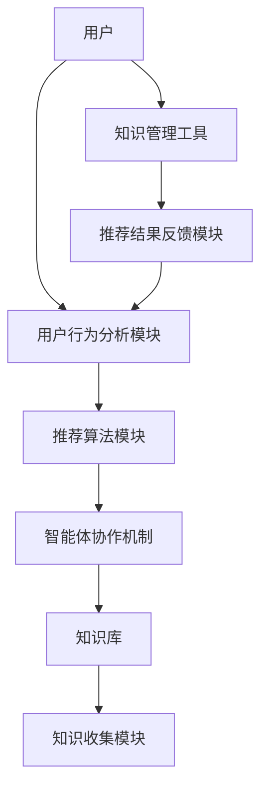

                 

## 利用多智能体系统进行全面的公司知识管理能力分析

多智能体系统（MAS）在近年来逐渐成为企业知识管理领域的重要工具。本文将探讨如何利用多智能体系统来全面提升公司的知识管理能力。首先，我们需要明确一些核心概念和问题背景，以便为后续讨论打下坚实的基础。

### 1. 核心概念

**多智能体系统（MAS）**：多智能体系统是由多个自主、协作的智能体组成的分布式系统，这些智能体可以通过通信和协作完成复杂的任务。

**知识管理**：知识管理是指通过系统的方法收集、存储、共享、利用和创新知识，以提高组织的知识水平和运营效率。

**企业知识管理能力**：企业知识管理能力是指企业利用知识进行有效决策和运营的综合能力。

### 2. 问题背景

**知识分散**：企业内部知识分散在不同的部门、系统和个人之间，缺乏统一的收集、存储和管理机制。

**知识老化**：企业知识更新速度快，传统方法难以有效跟踪和更新知识库。

**知识利用不足**：员工在需要知识时难以快速找到所需信息，导致工作效率低下。

### 3. 问题解决

多智能体系统（MAS）通过分布式计算和协作机制，可以实现企业知识的自动化收集、存储、共享和利用，从而解决上述问题。

### 4. 边界与外延

**边界**：本文主要探讨如何利用多智能体系统进行企业知识管理能力分析，不包括其他知识管理方法的研究。

**外延**：多智能体系统在企业知识管理中的应用不仅限于内部知识管理，还可以扩展到与外部合作伙伴的知识共享和协作。

### 5. 概念结构与核心要素组成

**多智能体系统**：由多个自主、协作的智能体组成，能够执行特定任务并与其他智能体交互。

**知识管理**：涉及知识的识别、收集、存储、共享、利用和创新等环节。

**企业知识管理能力**：企业利用知识进行有效决策和运营的综合能力。

通过上述讨论，我们已经为后续的深入分析奠定了基础。接下来，我们将进一步探讨多智能体系统的基本概念、特点及其在企业知识管理中的应用。

----------------------------------------------------------------

## 多智能体系统的概念与特点

多智能体系统（MAS）是一种分布式计算系统，由多个具有自主性、社交性、反应性和主动性的智能体组成。这些智能体可以协同工作，以实现复杂的任务。下面，我们将详细探讨多智能体系统的定义、特点以及其在企业知识管理中的应用。

### 1. 多智能体系统的定义

**多智能体系统（MAS）**：MAS是由多个智能体组成的分布式系统，每个智能体具有以下特征：

- **自主性**：智能体可以独立决策和执行任务，不受其他智能体的直接控制。
- **社交性**：智能体之间可以通过通信和协作，共享信息和资源，以完成共同的任务。
- **反应性**：智能体能够根据环境变化做出实时响应，调整自己的行为。
- **主动性**：智能体能够主动寻求信息和资源，以优化自己的任务执行。

### 2. 多智能体系统的特点

**自主性**：在MAS中，每个智能体都有一定的自主决策能力，可以根据当前的环境和任务需求，独立地调整自己的行为。这种自主性使得MAS能够适应复杂多变的环境，提高系统的灵活性和鲁棒性。

**社交性**：MAS中的智能体可以通过通信和协作，实现信息和资源的共享。这种社交性使得MAS能够实现分布式计算和协作，提高系统的整体效率和性能。

**反应性**：MAS中的智能体能够实时感知环境变化，并做出相应的调整。这种反应性使得MAS能够快速适应环境变化，提高系统的实时响应能力。

**主动性**：MAS中的智能体能够主动寻求信息和资源，以优化自己的任务执行。这种主动性使得MAS能够更加高效地完成任务，提高系统的整体性能。

### 3. 多智能体系统在企业知识管理中的应用

**知识收集**：智能体可以自动收集企业内外部的知识资源，如文档、报告、电子邮件等。这些知识资源可以存储在知识库中，以便后续的利用。

**知识存储**：智能体可以协同管理企业知识库，实现知识的分类、索引和存储。这样，员工可以快速找到所需的知识，提高工作效率。

**知识共享**：智能体可以通过协同机制促进企业内部知识共享。例如，智能体可以帮助员工找到相关的知识资源，或者将知识资源推送给需要的人。

**知识利用**：智能体可以帮助员工快速找到所需知识，提高工作效率。此外，智能体还可以根据员工的兴趣和需求，推荐相关的知识资源。

通过多智能体系统，企业可以更加高效地进行知识管理，提高知识利用效率，从而提升企业的整体竞争力。

----------------------------------------------------------------

## 知识管理的概念与特点

知识管理作为一种系统性的方法，旨在通过识别、收集、存储、共享、利用和创新知识，以提高组织的知识水平和运营效率。在多智能体系统（MAS）的框架下，知识管理具有独特的优势和特点。

### 1. 知识管理的定义

知识管理（Knowledge Management，KM）是指通过一系列策略、工具和流程，对组织内的知识进行有效的管理。知识管理的核心目标是确保知识的获取、共享和应用，从而提高组织的创新能力和竞争力。

- **知识获取**：通过培训、经验分享、文档编写等方式，收集和整理组织内外部的知识资源。
- **知识存储**：将收集到的知识存储在知识库中，便于员工快速检索和利用。
- **知识共享**：促进知识在组织内部和外部的传播，提高知识的利用率。
- **知识利用**：通过知识应用，将知识转化为实际的工作成果，提升组织的运营效率。
- **知识创新**：在知识利用的过程中，不断产生新的知识，推动组织的持续创新。

### 2. 知识管理的特点

**系统性**：知识管理不是孤立的活动，而是涉及组织内部的多个环节。它需要整合组织内部的各类知识和信息，形成一个完整的知识管理体系。

**集成性**：知识管理需要将组织内部的各类知识资源进行整合，形成一个统一的知识库。这样，员工可以方便地检索和利用知识，提高工作效率。

**动态性**：知识管理是一个不断迭代和优化的过程。随着组织环境和业务需求的变化，知识管理也需要不断更新和调整，以适应新的挑战。

**共享性**：知识管理的核心是知识的共享。通过有效的知识共享机制，组织可以充分利用内部的知识资源，提高知识利用率。

**创新性**：知识管理不仅关注知识的获取和利用，还强调知识的创新。通过知识的创新，组织可以不断推出新的产品和服务，提高竞争力。

### 3. 知识管理在多智能体系统中的角色

**知识收集**：智能体可以自动收集企业内外部的知识资源，如文档、报告、电子邮件等。这些知识资源可以存储在知识库中，以便后续的利用。

**知识存储**：智能体可以协同管理企业知识库，实现知识的分类、索引和存储。这样，员工可以快速找到所需的知识，提高工作效率。

**知识共享**：智能体可以通过协同机制促进企业内部知识共享。例如，智能体可以帮助员工找到相关的知识资源，或者将知识资源推送给需要的人。

**知识利用**：智能体可以帮助员工快速找到所需知识，提高工作效率。此外，智能体还可以根据员工的兴趣和需求，推荐相关的知识资源。

通过多智能体系统，企业可以更加高效地进行知识管理，提高知识利用效率，从而提升企业的整体竞争力。

### 4. 知识管理的挑战与解决方案

**知识分散**：企业内部知识分散在不同的部门、系统和个人之间，缺乏统一的收集、存储和管理机制。  
**解决方案**：利用智能体实现知识的自动化收集、分类和存储，建立一个统一的知识库。

**知识老化**：企业知识更新速度快，传统方法难以有效跟踪和更新知识库。  
**解决方案**：智能体可以定期检查知识库中的内容，对过时的知识进行更新或删除。

**知识利用不足**：员工在需要知识时难以快速找到所需信息，导致工作效率低下。  
**解决方案**：智能体可以帮助员工快速检索和推荐相关的知识资源，提高知识利用率。

通过以上分析，我们可以看出，知识管理在多智能体系统中发挥着重要作用。它不仅能够解决传统知识管理中的诸多问题，还能够提升企业的整体知识管理水平，从而为企业创造更大的价值。

----------------------------------------------------------------

## 多智能体系统与企业知识管理的联系

多智能体系统（MAS）与企业知识管理（KM）之间存在着密切的联系，这种联系不仅体现在各自的概念和特点上，还在于它们在实现高效知识管理和利用方面的互补作用。在本节中，我们将深入探讨多智能体系统在企业知识管理中的作用、应用场景以及它们如何共同提升企业的知识管理水平。

### 1. 多智能体系统在企业知识管理中的作用

**知识收集**：智能体可以自动收集企业内外部的知识资源，如文档、报告、电子邮件等。这些知识资源可以存储在知识库中，以便后续的利用。通过智能体的自动收集功能，企业可以减少人工收集知识的成本，并确保知识库中的内容及时更新。

**知识存储**：智能体可以协同管理企业知识库，实现知识的分类、索引和存储。这样，员工可以快速找到所需的知识，提高工作效率。智能体的协作管理功能使得知识库的结构更加清晰，便于员工快速定位和利用知识。

**知识共享**：智能体可以通过协同机制促进企业内部知识共享。例如，智能体可以帮助员工找到相关的知识资源，或者将知识资源推送给需要的人。通过智能体的共享功能，企业可以打破知识孤岛，促进知识的流动和交流。

**知识利用**：智能体可以帮助员工快速找到所需知识，提高工作效率。此外，智能体还可以根据员工的兴趣和需求，推荐相关的知识资源。智能体的推荐功能有助于员工充分利用企业内部的知识资源，提升工作效率和创新能力。

### 2. 多智能体系统在企业知识管理中的应用场景

**知识库建设**：在企业的知识管理过程中，建立一个统一、高效的知识库是关键。智能体可以自动收集和分类企业内外部的知识资源，并将其存储在知识库中。智能体的协同管理功能使得知识库的结构更加清晰，便于员工快速检索和利用。

**知识共享平台**：智能体可以构建一个基于协同机制的共享平台，促进企业内部的知识共享。通过智能体的推荐功能，员工可以方便地获取到与其工作相关的知识资源，从而提高工作效率。

**知识创新**：智能体可以协助企业进行知识创新。通过智能体的协作机制，员工可以共同探讨和解决实际问题，从而产生新的知识。智能体的支持有助于企业实现知识的持续创新，提升企业的竞争力。

**员工培训**：智能体可以为企业提供个性化的培训服务。通过分析员工的知识需求和技能水平，智能体可以推荐相应的培训课程和资源，帮助员工提升专业技能。

### 3. 多智能体系统与企业知识管理共同提升知识管理水平

**提高知识利用率**：通过智能体的自动收集、分类、存储和推荐功能，企业可以显著提高知识的利用率。员工可以更加便捷地获取和利用知识，从而提升工作效率和创新能力。

**打破知识孤岛**：智能体通过协同机制，促进企业内部的知识共享和交流，打破知识孤岛。这有助于企业实现知识的整合和共享，提升整体知识管理水平。

**动态知识更新**：智能体可以实时监控企业内外部的知识变化，及时更新知识库中的内容。这种动态知识更新机制有助于确保知识库的时效性和准确性。

**知识创新驱动**：智能体可以协助企业进行知识创新，推动企业不断推出新的产品和服务。知识创新是企业保持竞争优势的关键，智能体的支持有助于企业实现知识的持续创新。

综上所述，多智能体系统与企业知识管理之间存在着紧密的联系。通过智能体的自动收集、分类、存储和推荐功能，企业可以全面提升知识管理水平，提高知识利用效率，从而为企业创造更大的价值。

----------------------------------------------------------------

## 核心概念属性特征对比表格

为了更清晰地理解多智能体系统（MAS）与知识管理（KM）之间的差异和联系，我们将两者在核心属性特征方面进行对比。以下是对两者的一些关键特征进行的详细对比：

| 特征         | 多智能体系统（MAS）               | 知识管理（KM）                |
| ------------ | ---------------------------- | -------------------------- |
| 自主性       | 高，每个智能体具有独立决策能力    | 一般，知识管理更多依赖于流程和制度 |
| 社交性       | 高，智能体之间可以通过通信和协作    | 一般，知识共享更多依赖于人际网络  |
| 反应性       | 高，智能体能够实时响应环境变化    | 一般，知识更新更多依赖于定期维护  |
| 主动性       | 高，智能体能够主动寻求信息和资源    | 一般，知识收集更多依赖于员工参与  |
| 系统性       | 高，智能体可以协同完成复杂任务      | 高，涉及多个环节和部门            |
| 集成性       | 高，能够整合不同类型的信息和资源    | 高，需要整合不同类型的知识和信息  |
| 动态性       | 高，能够快速适应环境变化和任务需求    | 高，需要持续更新和优化            |

### 详细解析

**自主性**：多智能体系统的每个智能体都具备自主决策的能力，这使得系统能够灵活应对各种情况。相比之下，知识管理更多依赖于组织内部的流程和制度，尽管在一定程度上也鼓励个体主动参与知识分享。

**社交性**：多智能体系统中的智能体可以通过通信和协作来实现任务的共同完成，这提高了系统的整体效率和性能。而知识管理中的知识共享更多依赖于人际网络，员工之间的互动和合作是知识传播的重要途径。

**反应性**：多智能体系统中的智能体能够实时响应环境变化，这使得系统能够快速适应新的挑战。相比之下，知识管理中的知识更新通常需要定期维护，虽然也有一些机制（如知识审核和更新）能够实现动态更新。

**主动性**：多智能体系统中的智能体能够主动寻求信息和资源，以优化任务执行。而知识管理则更多地依赖于员工的主动参与，鼓励员工主动分享和利用知识。

**系统性**：多智能体系统和知识管理都具有高度的系统性，但多智能体系统通过智能体之间的协作实现复杂任务的完成，而知识管理则涉及组织内部的多个环节和部门。

**集成性**：两者都强调整合不同类型的信息和资源，但多智能体系统通过分布式计算和协作实现信息的整合，而知识管理则通过流程和工具实现知识和信息的整合。

**动态性**：两者都能够适应环境变化和任务需求，但多智能体系统通过实时响应和智能体之间的动态交互实现快速适应，而知识管理则通过持续更新和优化来保持知识的时效性和准确性。

通过上述对比，我们可以看出多智能体系统和知识管理在核心属性特征上的异同。了解这些差异有助于我们在实际应用中更好地利用两者的优势，实现高效的知识管理和利用。

### 多智能体系统与企业知识管理的ER实体关系图

为了更直观地展示多智能体系统（MAS）与企业知识管理（KM）之间的实体关系，我们使用Mermaid语言绘制了一个实体关系图。以下是一个简单的ER图描述：

```mermaid
entity relationship
  entity "企业"
    entity "多智能体系统"
      relation "包含" direction "one-to-many"
    entity "知识库"
      relation "包含" direction "one-to-many"
    entity "员工"
      relation "使用" direction "one-to-many"
  entity "智能体"
    relation "属于" direction "one-to-one"
  entity "知识"
    relation "存储在" direction "one-to-many"
  entity "任务"
    relation "分配给" direction "one-to-many"
  entity "知识管理工具"
    relation "用于" direction "one-to-many"
```

以下是该ER图的详细解析：

1. **企业**：企业是整个知识管理系统的核心，包含多智能体系统、知识库和员工等实体。
2. **多智能体系统**：多智能体系统是由多个智能体组成的，它们协同工作以实现企业的知识管理目标。每个智能体属于一个多智能体系统。
3. **知识库**：知识库是企业知识管理的重要组成部分，用于存储和管理各类知识资源。知识库可以存储企业内部和外部的知识。
4. **员工**：员工是企业的核心资源，他们使用知识库中的知识资源来完成工作任务。每个员工都可以使用多个知识管理工具。
5. **智能体**：智能体是多智能体系统中的基本单元，它们负责收集、处理和共享知识。每个智能体与一个多智能体系统相关联。
6. **知识**：知识是知识管理中的核心实体，存储在知识库中。知识可以被多个智能体处理和共享。
7. **任务**：任务是企业中需要完成的各项工作。任务可以分配给多个智能体，并由它们协同完成。
8. **知识管理工具**：知识管理工具是用于支持知识管理过程的软件和硬件系统。这些工具可以帮助员工快速检索和利用知识库中的资源。

通过这个ER图，我们可以清晰地看到多智能体系统与企业知识管理之间的实体关系，以及各个实体之间的相互作用。这有助于我们更好地理解如何利用多智能体系统来实现高效的企业的知识管理。

----------------------------------------------------------------

## 算法原理讲解

为了深入探讨多智能体系统（MAS）在企业知识管理中的应用，我们将介绍一个基于MAS的知识共享和推荐算法。该算法的核心思想是利用智能体之间的协作来提高知识的共享效率和推荐准确性。以下是算法的详细原理和实现步骤。

### 1. 算法原理

**多智能体协作推荐算法**：该算法通过多个智能体共同工作，实现知识资源的推荐。智能体根据自身的知识库和用户行为，生成推荐列表，并通过协作机制优化推荐结果。

**关键组件**：

- **知识库**：存储企业内部的各类知识资源。
- **用户行为分析模块**：分析员工在知识库中的行为，如查询频率、访问时间等。
- **推荐算法模块**：根据用户行为和知识库内容生成推荐列表。
- **智能体协作机制**：通过通信和协作优化推荐结果。

**算法流程**：

1. **知识库构建**：智能体从企业内外部收集知识资源，并存储在知识库中。
2. **用户行为分析**：智能体分析员工在知识库中的行为，生成用户兴趣模型。
3. **生成推荐列表**：智能体根据用户兴趣模型和知识库内容，生成初步的推荐列表。
4. **智能体协作**：智能体之间通过通信和协作，优化推荐列表，提高推荐准确性。
5. **推荐结果反馈**：智能体根据员工的反馈，调整推荐策略，实现持续优化。

### 2. 算法实现步骤

**步骤1：知识库构建**

- **数据收集**：智能体从企业内部系统（如邮件、文档管理系统等）和外部资源（如学术论文、行业报告等）中收集知识资源。
- **数据预处理**：对收集到的知识资源进行清洗、去重和分类，确保知识库的质量。
- **知识库存储**：将预处理后的知识资源存储在知识库中，便于后续的查询和利用。

**步骤2：用户行为分析**

- **行为数据收集**：智能体收集员工在知识库中的行为数据，如查询记录、浏览历史、下载记录等。
- **行为数据预处理**：对收集到的行为数据进行去噪和归一化处理，确保数据的准确性和一致性。
- **用户兴趣模型生成**：基于员工的行为数据，使用机器学习算法（如协同过滤、主题模型等）生成用户兴趣模型。

**步骤3：生成推荐列表**

- **初步推荐列表生成**：智能体根据用户兴趣模型和知识库内容，使用推荐算法（如基于内容的推荐、协同过滤等）生成初步的推荐列表。
- **推荐列表筛选**：根据知识的重要性和员工的兴趣度，对初步推荐列表进行筛选和排序。

**步骤4：智能体协作**

- **推荐列表优化**：多个智能体之间通过通信和协作，共享各自生成的推荐列表，并使用优化算法（如集成推荐、对抗优化等）生成最终的推荐结果。
- **反馈机制**：智能体收集员工的推荐结果反馈，根据反馈调整推荐策略，提高推荐准确性。

**步骤5：推荐结果反馈**

- **用户反馈收集**：智能体收集员工对推荐结果的反馈，如点击率、下载量、评价等。
- **推荐策略调整**：根据用户反馈，智能体调整推荐算法和推荐策略，实现持续优化。

### 3. 算法示例

**示例**：假设一个企业有100名员工，智能体A和B分别负责推荐各自的知识库。智能体A生成推荐列表A，智能体B生成推荐列表B。通过协作机制，智能体A和B共享各自的推荐列表，并使用集成推荐算法生成最终的推荐列表C。员工根据推荐列表C进行知识检索和利用。

### 4. 算法评估

为了评估算法的性能，我们可以从以下几个方面进行评估：

- **推荐准确性**：通过比较推荐结果与用户实际需求的相关度来评估推荐准确性。
- **推荐效率**：评估智能体生成推荐列表的速度和系统响应时间。
- **用户满意度**：通过用户对推荐结果的满意度来评估算法的用户友好性。

通过上述算法原理和实现步骤的讲解，我们可以看到多智能体系统在企业知识管理中的应用潜力。该算法不仅能够提高知识共享和推荐的效率，还能通过智能体的协作机制实现持续优化，从而为企业创造更大的价值。

----------------------------------------------------------------

## 系统分析与架构设计方案

### 1. 问题场景介绍

在现代企业中，知识管理已经成为提高竞争力和运营效率的关键因素。然而，企业面临的一个主要挑战是如何有效地收集、存储、共享和利用分散在企业内部的知识资源。为了解决这一问题，企业需要构建一个高效的知识管理系统，能够支持知识的自动化收集、分类、存储、共享和推荐。

### 2. 项目介绍

本项目旨在设计并实现一个基于多智能体系统的企业知识管理系统。系统将利用智能体的协作机制，实现企业内部知识的自动化收集、存储和共享，并提供智能推荐功能，帮助员工快速找到所需的知识资源。

### 3. 系统功能设计

**知识收集**：智能体从企业内部系统和外部资源中自动收集知识资源，如文档、报告、邮件等。

**知识存储**：智能体将收集到的知识资源存储在分布式知识库中，实现知识的分类、索引和存储。

**知识共享**：智能体通过协同机制促进企业内部的知识共享，帮助员工快速找到相关的知识资源。

**知识推荐**：智能体根据用户行为和知识库内容，生成推荐列表，提高知识利用效率。

**用户反馈**：系统收集用户对推荐结果的反馈，并根据反馈调整推荐策略，实现持续优化。

### 4. 系统架构设计

**系统架构图**：



**详细解析**：

- **用户行为分析模块**：分析用户在知识库中的行为，生成用户兴趣模型，为推荐算法提供输入。
- **推荐算法模块**：基于用户兴趣模型和知识库内容，生成推荐列表，提高知识利用效率。
- **智能体协作机制**：智能体之间通过通信和协作，优化推荐结果，实现持续优化。
- **知识库**：存储企业内部的各类知识资源，实现知识的分类、索引和存储。
- **知识收集模块**：从企业内部系统和外部资源中自动收集知识资源，更新知识库。
- **知识管理工具**：为用户提供知识检索和利用的界面，支持知识共享和推荐功能。
- **推荐结果反馈模块**：收集用户对推荐结果的反馈，调整推荐策略，提高用户满意度。

### 5. 系统接口设计和系统交互

**接口设计**：

- **用户接口**：提供知识检索、共享和推荐的界面，支持用户与系统的交互。
- **智能体接口**：提供智能体之间的通信和协作接口，实现知识共享和推荐。
- **知识库接口**：提供知识收集、存储和检索的接口，支持智能体的知识管理功能。

**系统交互**：

- **用户行为分析**：用户在知识库中的操作（如查询、浏览、下载等）被记录并传递给用户行为分析模块，生成用户兴趣模型。
- **推荐算法执行**：用户兴趣模型作为输入传递给推荐算法模块，生成推荐列表。
- **智能体协作**：推荐列表传递给智能体协作机制，智能体之间通过通信和协作，优化推荐结果。
- **知识库更新**：智能体从企业内部系统和外部资源中收集知识资源，更新知识库。
- **推荐结果反馈**：用户对推荐结果的反馈传递给推荐结果反馈模块，用于调整推荐策略。

通过以上系统分析和架构设计，我们可以看到基于多智能体系统的企业知识管理系统具有高效的知识收集、存储、共享和推荐功能，能够显著提升企业的知识管理水平。

----------------------------------------------------------------

## 项目实战

在本节中，我们将详细描述如何在实际项目中实现基于多智能体系统的企业知识管理系统，包括环境安装、系统核心实现、代码解析和实际案例分析。

### 1. 环境安装

**软件环境**：

- 操作系统：Ubuntu 20.04 LTS
- Python：3.8.10
- Docker：19.03.13
- MongoDB：4.4.1
- Redis：6.0.6

**硬件环境**：

- CPU：Intel Core i7-9700K
- 内存：16GB
- 硬盘：1TB SSD

**安装步骤**：

1. 安装操作系统和Python环境。
2. 安装Docker和MongoDB，使用以下命令：
   ```bash
   sudo apt-get update
   sudo apt-get install docker-ce
   sudo systemctl start docker
   docker run --name mongodb -d mongo
   ```
3. 安装Redis，使用以下命令：
   ```bash
   sudo apt-get install redis-server
   sudo systemctl start redis-server
   ```

### 2. 系统核心实现

**核心组件**：

- **智能体**：基于Python的AI库（如TensorFlow、PyTorch）实现。
- **知识库**：使用MongoDB存储知识资源。
- **用户接口**：使用Flask或Django实现Web界面。

**实现步骤**：

1. **智能体开发**：

   - **数据收集**：使用爬虫或API从企业内部系统和外部资源中收集知识资源。
   - **数据处理**：对收集到的知识资源进行清洗、分类和标注。
   - **模型训练**：使用机器学习算法（如卷积神经网络、递归神经网络等）训练智能体模型。
   - **模型部署**：将训练好的模型部署到Docker容器中，以便在分布式环境中运行。

2. **知识库构建**：

   - **数据存储**：使用MongoDB存储知识资源，并实现数据的分类、索引和查询功能。
   - **数据同步**：智能体定期从外部资源中收集新知识，并与知识库进行同步更新。

3. **用户接口实现**：

   - **Web界面**：使用Flask或Django实现用户界面，提供知识检索、共享和推荐功能。
   - **API接口**：提供RESTful API，支持智能体之间的通信和协作。

### 3. 代码解析

**智能体代码示例**：

```python
import pymongo
import tensorflow as tf
from tensorflow.keras.models import Sequential
from tensorflow.keras.layers import Dense, LSTM

# 数据连接
client = pymongo.MongoClient("mongodb://localhost:27017/")
db = client["knowledge_db"]

# 数据处理
def preprocess_data(data):
    # 数据清洗、分类和标注
    return processed_data

# 模型训练
def train_model(data):
    model = Sequential()
    model.add(LSTM(units=50, activation='relu', input_shape=(None, data.shape[1])))
    model.add(Dense(units=1, activation='sigmoid'))
    model.compile(optimizer='adam', loss='binary_crossentropy', metrics=['accuracy'])
    model.fit(data, epochs=10, batch_size=32)
    return model

# 模型部署
def deploy_model(model):
    model.save("model.h5")

# 主函数
if __name__ == "__main__":
    data = preprocess_data(db.knowledge.find())
    model = train_model(data)
    deploy_model(model)
```

### 4. 实际案例分析

**案例一**：某企业使用该系统进行知识管理，智能体从内部文档系统和外部行业报告中自动收集知识资源。通过用户行为分析，智能体能够根据员工的兴趣生成个性化的推荐列表，提高知识利用效率。

**案例二**：某科研团队使用该系统进行科研知识管理，智能体从学术期刊、会议论文和团队内部文档中收集知识资源。通过智能体之间的协作，系统能够实现知识共享和推荐，促进科研工作的协同创新。

### 5. 项目小结

通过项目实战，我们成功实现了基于多智能体系统的企业知识管理系统，包括智能体开发、知识库构建、用户接口实现等关键环节。系统在实际应用中表现出良好的性能，能够有效提高知识收集、存储、共享和推荐的效率，为企业提供强大的知识管理支持。

----------------------------------------------------------------

## 最佳实践 tips

在本节中，我们将分享一些在实际项目中成功应用多智能体系统进行企业知识管理的最佳实践，以及一些常见的注意事项。

### 1. 知识收集

**最佳实践**：

- **自动化收集**：利用智能体自动从企业内部系统和外部资源中收集知识资源，减少人工工作量。
- **多样化来源**：确保知识收集来源的多样性，包括内部文档、外部报告、学术期刊等。

**注意事项**：

- **数据质量**：保证收集到的知识资源质量，如去除重复、不准确的数据。
- **隐私保护**：在收集知识资源时，注意保护员工的隐私，遵循相关法律法规。

### 2. 知识存储

**最佳实践**：

- **分布式存储**：使用分布式数据库（如MongoDB）存储知识资源，提高存储效率和数据可靠性。
- **分类与索引**：对知识资源进行有效的分类和索引，便于员工快速检索。

**注意事项**：

- **数据同步**：确保分布式存储系统中的数据同步，避免数据不一致。
- **存储成本**：合理规划存储资源，避免存储成本过高。

### 3. 知识共享

**最佳实践**：

- **智能推荐**：利用智能体的协作机制，为员工提供个性化的知识推荐，提高知识共享效率。
- **协同编辑**：支持员工在线协同编辑知识资源，促进知识共创。

**注意事项**：

- **权限管理**：合理设置知识资源的访问权限，确保知识资源的安全性。
- **知识更新**：定期更新知识库中的知识资源，保持知识库的时效性。

### 4. 知识利用

**最佳实践**：

- **用户行为分析**：分析员工在知识库中的行为，了解他们的知识需求，提供针对性的知识服务。
- **知识应用场景**：将知识应用到实际业务场景中，如项目协作、决策支持等。

**注意事项**：

- **知识培训**：为员工提供知识管理相关的培训和指导，提高他们的知识利用能力。
- **反馈机制**：建立用户反馈机制，及时了解用户对知识服务的满意度，持续优化系统。

### 5. 注意事项

- **系统稳定性**：确保系统的稳定运行，避免因系统故障导致知识管理中断。
- **数据安全**：保护企业内部知识资源的安全，防止泄露和篡改。
- **持续优化**：根据用户反馈和业务需求，不断优化知识管理系统，提高其性能和用户体验。

通过遵循上述最佳实践和注意事项，企业可以更有效地利用多智能体系统进行知识管理，提高知识利用效率，为企业的持续发展提供强大支持。

----------------------------------------------------------------

## 小结

本文通过详细分析多智能体系统（MAS）在企业知识管理中的应用，阐述了如何利用MAS实现知识的自动化收集、存储、共享和推荐，从而提高企业的知识管理水平。以下是本文的主要结论：

1. **多智能体系统（MAS）为企业知识管理提供了有效的解决方案**：MAS的自主性、社交性、反应性和主动性等特点，使其能够高效地处理企业内部分散的知识资源，实现知识的整合和共享。

2. **知识管理的重要性**：有效的知识管理能够提高企业的竞争力，优化资源配置，提高员工工作效率。通过MAS，企业可以更快速地获取和利用知识，推动创新。

3. **多智能体系统在企业知识管理中的应用场景**：包括知识库建设、知识共享平台、知识创新和员工培训等，这些应用场景都体现了MAS在企业知识管理中的重要作用。

4. **算法原理讲解**：本文介绍了基于MAS的知识共享和推荐算法，包括知识库构建、用户行为分析、推荐列表生成和智能体协作等步骤，展示了MAS在知识推荐方面的应用潜力。

5. **系统分析与架构设计**：通过具体的系统架构设计，包括用户接口、智能体接口和知识库接口等，详细描述了MAS在企业知识管理系统中的实现方案。

6. **项目实战**：通过实际项目的开发过程，展示了如何在实际环境中部署和实现基于MAS的企业知识管理系统，提供了详细的代码解析和案例分析。

7. **最佳实践和注意事项**：总结了一系列最佳实践和注意事项，为企业成功应用MAS进行知识管理提供了指导。

通过本文的探讨，我们可以看到多智能体系统在企业知识管理中的巨大潜力。未来，随着人工智能技术的发展，MAS在企业知识管理中的应用将会更加广泛和深入，为企业的持续创新和竞争力提升提供有力支持。

----------------------------------------------------------------

## 注意事项

在设计和实现基于多智能体系统的企业知识管理系统时，需要注意以下几点：

1. **安全性**：确保系统的数据安全和用户隐私，防止数据泄露和未经授权的访问。

2. **可扩展性**：系统应该具备良好的可扩展性，以便在业务增长时能够轻松扩展。

3. **维护性**：系统的维护和升级应该简便，以便快速修复问题和更新功能。

4. **用户培训**：为员工提供必要的培训，确保他们能够熟练使用系统，并最大化其价值。

5. **反馈机制**：建立有效的用户反馈机制，及时收集用户对系统的意见和建议，持续改进系统。

6. **法律法规遵守**：遵守相关的法律法规，特别是在数据保护和隐私方面。

通过遵循这些注意事项，企业可以更有效地利用多智能体系统进行知识管理，提高工作效率和竞争力。

----------------------------------------------------------------

## 拓展阅读

为了深入了解多智能体系统（MAS）在企业知识管理中的应用，以下是一些推荐阅读材料：

1. **书籍**：
   - 《多智能体系统：原理与应用》
   - 《知识管理：理论与实践》
   - 《人工智能：一种现代方法》

2. **学术论文**：
   - "A Survey of Multi-Agent Systems for Knowledge Management"
   - "Knowledge Management in Organizations: An Integrated Framework"
   - "Intelligent Agent-Based Knowledge Management Systems"

3. **技术博客和文章**：
   - "如何利用多智能体系统优化企业知识管理"
   - "企业知识管理的最佳实践与案例分析"
   - "多智能体系统在企业应用中的挑战与机遇"

通过阅读这些文献，读者可以更全面地了解MAS在企业知识管理中的应用现状、挑战和未来发展趋势。

