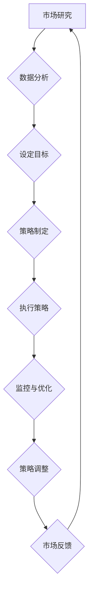
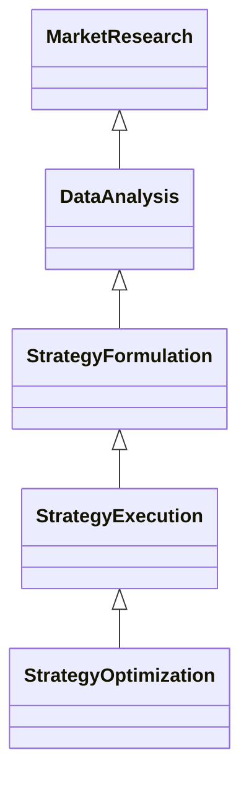
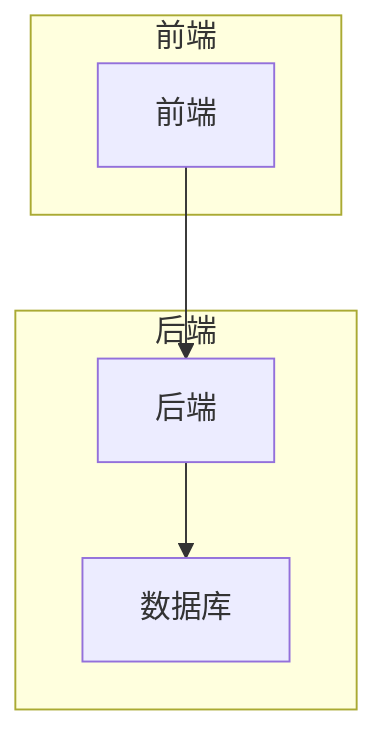
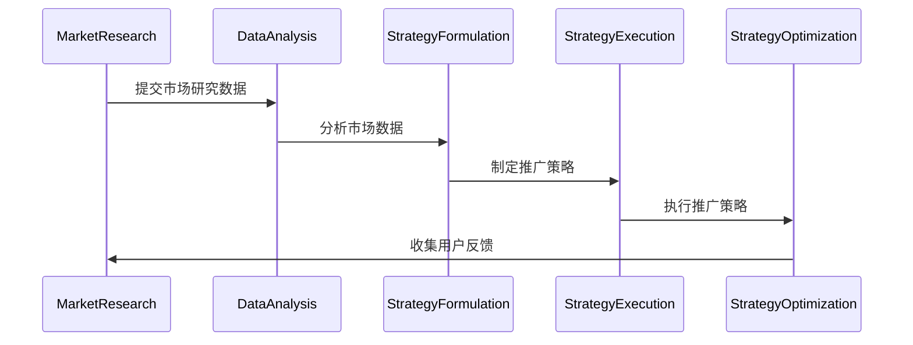
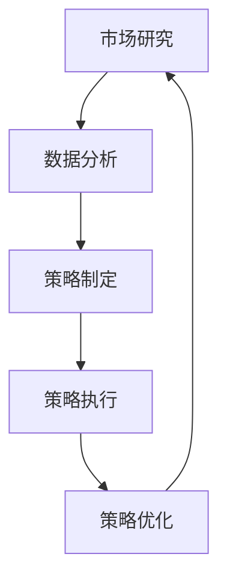

                 

## 文章标题

“制定有效的金融AI产品市场推广策略”是一个复杂且多层次的主题，它要求我们在理解金融AI的背景和重要性，市场推广的核心概念和原则，制定和执行具体的市场推广策略，以及评估和优化这些策略的各个方面进行深入思考。以下，我们将一步一步地分析这一主题，并构建一个清晰、逻辑紧密的文章框架。

### 核心关键词

- **金融AI**
- **市场推广策略**
- **目标受众**
- **品牌建设**
- **数字营销**
- **数据分析**

### 摘要

本文将探讨如何制定和实施有效的金融AI产品市场推广策略。我们将首先介绍金融AI的背景和其在金融市场中的重要性，然后详细分析市场推广的核心概念和原则。接下来，我们将重点讨论如何开发和执行具体的市场推广策略，包括市场研究、目标设定、渠道选择和数字营销战术。最后，我们将介绍如何监控和优化市场推广活动，并通过成功案例展示最佳实践。通过本文，读者将获得一个系统化的市场推广策略框架，以指导他们在金融AI领域的成功推广。

### 目录

**一、引言：金融AI与市场推广的重要性**

1.1 金融AI的背景与发展

1.2 市场推广在金融AI产品中的关键角色

1.3 当前市场推广面临的挑战

**二、核心概念与原则**

2.1 金融AI的定义与市场影响

2.2 市场细分与目标受众分析

2.3 品牌建设在市场推广中的重要性

**三、策略制定**

3.1 市场研究与分析

3.2 明确目标与关键绩效指标（KPI）

3.3 策略制定与执行

**四、市场推广渠道与工具**

4.1 在线与社交媒体营销

4.2 内容营销与搜索引擎优化（SEO）

4.3 传统营销方法

**五、数字营销策略**

5.1 电子邮件营销

5.2 搜索引擎营销（SEM）

5.3 影响者营销与合作策略

**六、监控与优化**

6.1 关键市场推广指标

6.2 数据分析与A/B测试

6.3 持续优化与迭代

**七、案例研究：成功经验与最佳实践**

7.1 案例分析1：成功要素解析

7.2 案例分析2：策略应用与实践效果

**八、结论与展望**

8.1 关键点回顾

8.2 注意事项与拓展阅读

### 背景介绍

**金融AI的背景与发展**

金融AI，即金融领域的人工智能，是指利用机器学习、深度学习、自然语言处理等人工智能技术来处理和分析金融数据，从而实现自动化决策、预测和风险管理等功能。随着大数据、云计算和人工智能技术的快速发展，金融AI在金融市场中的应用越来越广泛，从投资理财、风险管理到客户服务，涵盖了金融行业的方方面面。

**市场推广在金融AI产品中的关键角色**

市场推广在金融AI产品的发展中扮演着至关重要的角色。有效的市场推广策略不仅能提高产品的知名度和用户粘性，还能帮助企业抓住市场机遇，实现可持续发展。然而，金融AI产品具有高度的专业性和复杂性，其市场推广面临诸多挑战，如技术壁垒、信息安全、用户信任等。

**当前市场推广面临的挑战**

1. **技术复杂性**：金融AI产品通常涉及复杂的技术概念，如机器学习算法、神经网络等，这对市场推广提出了更高的要求，需要具备专业的技术知识和市场洞察力。
   
2. **信息安全与隐私保护**：金融AI产品处理大量敏感数据，对信息安全和隐私保护的要求非常高。市场推广过程中，如何平衡数据利用与隐私保护成为一大挑战。

3. **用户信任**：金融领域用户对新兴技术的信任度较低，市场推广需要通过有效的方式建立用户信任，提升产品口碑。

4. **市场竞争**：金融AI市场竞争激烈，同质化产品较多，市场推广需要找到差异化优势，才能在激烈的市场竞争中脱颖而出。

### 核心概念与联系

**金融AI的定义与市场影响**

金融AI是指利用人工智能技术来优化金融产品和服务的各个方面。其核心概念包括：

- **机器学习**：通过数据训练模型，实现自动化决策和预测。
- **深度学习**：基于多层神经网络，实现复杂模式的识别和理解。
- **自然语言处理**：理解和生成自然语言，应用于金融文本分析和客户服务。

金融AI对市场的影响主要体现在以下几个方面：

- **自动化**：通过自动化技术提高金融服务的效率和准确性，降低人力成本。
- **个性化**：基于用户数据，提供定制化的金融产品和服务，提升用户体验。
- **风险控制**：利用大数据和人工智能技术，实现更精准的风险评估和管理。

**市场细分与目标受众分析**

市场细分是市场推广策略的基础。在金融AI市场中，常见的细分方式包括：

- **按行业细分**：如投资银行、保险、零售银行等。
- **按产品类型细分**：如智能投顾、风险管理软件、金融分析工具等。
- **按客户特征细分**：如年龄、收入水平、投资偏好等。

通过分析不同细分市场的需求和特点，企业可以更精准地定位目标受众，制定有针对性的市场推广策略。

**品牌建设在市场推广中的重要性**

品牌建设是市场推广的核心。一个强大的品牌能够提升产品的竞争力，增加用户信任度，从而在市场中脱颖而出。在金融AI领域，品牌建设的重要性更为突出，因为用户对新兴技术产品的信任度较低。通过以下方式，企业可以加强品牌建设：

- **专业形象**：通过专业化的内容和技术展示，建立权威的专业形象。
- **用户体验**：通过优质的用户体验，提升用户满意度和口碑。
- **持续创新**：通过持续的创新和改进，保持品牌的市场活力。

### 算法原理讲解

为了更好地理解金融AI产品市场推广的策略，我们需要首先了解一些基本的算法原理。以下是一个简化的市场推广策略算法的Mermaid流程图：



**1. 市场研究**

市场研究是制定有效市场推广策略的第一步。通过收集和分析市场数据，企业可以了解市场趋势、用户需求和竞争对手情况。以下是市场研究的主要步骤：

- **数据收集**：通过问卷调查、访谈、在线调查等方式收集数据。
- **数据分析**：使用统计分析和数据挖掘技术，对收集的数据进行深入分析。
- **市场趋势分析**：分析市场的发展趋势，为后续策略制定提供依据。

**2. 数据分析**

数据分析是市场推广策略的核心。通过分析用户行为、购买习惯、反馈等数据，企业可以了解目标受众的特点，为策略制定提供数据支持。以下是数据分析的主要步骤：

- **数据清洗**：对收集到的数据进行清洗，去除重复和无效的数据。
- **数据可视化**：使用图表和报表等方式，将数据可视化，便于理解和分析。
- **用户画像**：基于数据分析，构建用户画像，了解用户特征和需求。

**3. 设定目标**

设定目标是市场推广策略的关键步骤。企业需要根据市场研究和数据分析的结果，设定明确的推广目标和关键绩效指标（KPI）。以下是设定目标的主要步骤：

- **目标设定**：根据市场情况和用户需求，设定具体的推广目标。
- **KPI设定**：确定衡量推广效果的关键绩效指标，如用户增长率、转化率、市场份额等。

**4. 策略制定**

策略制定是根据目标和数据分析结果，制定具体的推广策略。以下是一个简单的策略制定流程：

- **策略选择**：根据目标和市场情况，选择适合的推广策略，如在线营销、内容营销、社交媒体营销等。
- **执行计划**：制定详细的执行计划，包括时间表、资源分配、任务分配等。
- **风险评估**：评估推广策略的风险和不确定性，制定相应的风险应对措施。

**5. 执行策略**

执行策略是将策略转化为具体行动的过程。以下是一个简单的执行策略流程：

- **资源调配**：根据执行计划，调配所需的资源，包括人力、资金、技术等。
- **任务执行**：按照执行计划，执行具体的推广任务。
- **监控进度**：实时监控推广任务的执行进度，确保策略的有效实施。

**6. 监控与优化**

监控与优化是市场推广策略持续改进的关键。通过监控推广活动的效果，企业可以及时调整策略，优化推广效果。以下是一个简单的监控与优化流程：

- **数据收集**：收集推广活动的数据，包括用户行为数据、反馈数据等。
- **数据分析**：对收集到的数据进行分析，评估推广效果。
- **策略调整**：根据数据分析结果，调整推广策略，优化推广效果。

### 系统分析与架构设计方案

为了更好地理解和实施金融AI产品市场推广策略，我们需要一个系统的架构设计。以下是一个简化的架构设计方案，包括问题场景介绍、系统功能设计、系统架构设计、系统接口设计和系统交互。

#### 问题场景介绍

金融AI产品市场推广涉及多个方面，包括市场研究、数据分析、策略制定、策略执行和策略优化。这些功能需要集成在一个系统中，以便高效地实施市场推广策略。

#### 系统功能设计

系统功能设计主要包括以下几个模块：

- **市场研究模块**：负责收集和分析市场数据，为策略制定提供支持。
- **数据分析模块**：负责对用户行为、购买习惯、反馈等数据进行深入分析，构建用户画像。
- **策略制定模块**：负责根据市场研究和数据分析结果，制定具体的推广策略。
- **策略执行模块**：负责执行推广策略，包括资源调配、任务执行和监控进度。
- **策略优化模块**：负责监控推广活动的效果，根据数据分析结果，调整推广策略。

以下是一个简化的领域模型Mermaid类图：



#### 系统架构设计

系统架构设计主要包括以下几个部分：

- **前端**：提供用户界面，用户可以通过前端进行数据查询、策略制定和监控。
- **后端**：处理业务逻辑，包括数据存储、数据处理和策略执行。
- **数据库**：存储市场研究数据、用户行为数据和策略执行数据。

以下是一个简化的Mermaid架构图：



#### 系统接口设计

系统接口设计主要包括以下几个接口：

- **市场研究接口**：用于收集市场研究数据。
- **数据分析接口**：用于处理用户行为数据和购买习惯数据。
- **策略制定接口**：用于制定推广策略。
- **策略执行接口**：用于执行推广策略。
- **策略优化接口**：用于监控推广活动效果，调整推广策略。

以下是一个简化的Mermaid接口序列图：



#### 系统交互

系统交互是指不同模块之间的数据流动和交互过程。以下是一个简化的Mermaid交互图：



### 项目实战

#### 环境安装

为了实施金融AI产品市场推广策略，我们需要搭建一个完整的环境。以下是环境安装的步骤：

1. **安装Python**：确保Python环境已经安装，版本建议为3.8或更高。
2. **安装依赖库**：使用pip命令安装必要的依赖库，如pandas、numpy、matplotlib、scikit-learn等。
3. **安装数据库**：选择合适的数据库，如MySQL或PostgreSQL，并安装相应的驱动。

#### 系统核心实现源代码

以下是一个简化的系统核心实现源代码示例，用于市场研究、数据分析、策略制定和策略执行。

```python
# 市场研究模块
def market_research():
    # 收集市场研究数据
    data = collect_market_data()
    return data

# 数据分析模块
def data_analysis(data):
    # 分析市场数据
    user_profile = analyze_user_data(data)
    return user_profile

# 策略制定模块
def strategy_formulation(user_profile):
    # 制定推广策略
    strategy = formulate_strategy(user_profile)
    return strategy

# 策略执行模块
def strategy_execution(strategy):
    # 执行推广策略
    execute_strategy(strategy)
    return

# 策略优化模块
def strategy_optimization(strategy):
    # 优化推广策略
    optimized_strategy = optimize_strategy(strategy)
    return optimized_strategy
```

#### 代码应用解读与分析

以下是对上述代码的解读和分析。

- **市场研究模块**：该模块负责收集市场研究数据。在实际应用中，可以使用API接口、Web爬虫或数据库查询等方式获取数据。
- **数据分析模块**：该模块负责对用户行为和购买习惯进行分析。可以使用数据挖掘和机器学习技术，如聚类分析、回归分析等。
- **策略制定模块**：该模块根据分析结果制定推广策略。策略可以是基于用户画像的个性化推荐、折扣优惠等。
- **策略执行模块**：该模块负责执行推广策略。在实际应用中，可以使用电子邮件、短信、社交媒体等渠道发送推广信息。
- **策略优化模块**：该模块负责监控推广效果，根据用户反馈和数据分析结果调整策略。这可以通过A/B测试、多变量测试等方法实现。

#### 实际案例分析和详细讲解剖析

以下是一个简化的实际案例分析和详细讲解剖析。

**案例背景**：某金融公司推出了一款智能投顾产品，目标用户是中高收入人群。

**市场研究**：公司通过在线调查和用户访谈，收集了用户对智能投顾产品的需求、期望和满意度数据。

**数据分析**：根据用户数据，公司分析了用户的投资偏好、风险承受能力和投资目标。

**策略制定**：基于数据分析结果，公司制定了以下推广策略：

- **个性化推荐**：根据用户画像，为用户提供个性化的投资建议。
- **用户教育**：通过在线课程和文章，提高用户对智能投顾产品的了解。
- **促销活动**：为新用户提供免费试用期，以吸引更多用户。

**策略执行**：公司通过电子邮件、社交媒体和合作伙伴渠道，执行了上述推广策略。

**策略优化**：通过用户反馈和数据分析，公司不断调整和优化推广策略，以提高用户参与度和满意度。

#### 项目小结

通过本项目，我们搭建了一个简化的金融AI产品市场推广策略系统。虽然实际应用中会涉及更多的细节和复杂度，但本项目提供了一个基本的框架和思路。在实际操作中，企业需要根据具体情况进行调整和优化，以实现有效的市场推广。

### 最佳实践 tips

1. **明确目标**：在制定市场推广策略前，首先要明确推广目标，确保策略的制定和执行有明确的方向。
2. **数据驱动**：市场推广策略应基于数据分析，通过数据了解用户需求和行为，为策略制定提供支持。
3. **持续优化**：市场推广策略不是一成不变的，应通过监控和反馈，不断调整和优化策略，以提高效果。
4. **跨部门协作**：市场推广涉及多个部门和环节，需要跨部门协作，确保策略的有效实施。

### 小结

本文系统地介绍了金融AI产品市场推广策略的制定和实施方法。通过市场研究、数据分析、策略制定、策略执行和策略优化，企业可以有效地推广金融AI产品，提升市场竞争力。在实际操作中，企业应根据具体情况进行调整和优化，以实现最佳效果。

### 注意事项

1. **数据保护**：在市场推广过程中，应严格保护用户数据，遵守相关法律法规，确保用户隐私。
2. **风险评估**：在制定和执行市场推广策略时，应充分考虑风险，制定相应的风险应对措施。
3. **合规性**：市场推广策略应遵守市场规则和法律法规，避免违规行为。

### 拓展阅读

1. **《人工智能：一种现代方法》**：迈克尔·刘易斯（Michael Lewis）
2. **《深度学习》**：伊恩·古德费洛（Ian Goodfellow）、耶夫根尼·布达诺夫（Yoshua Bengio）和阿里·拉吉（Aaron Courville）
3. **《市场推广实战》**：菲利普·科特勒（Philip Kotler）

### 作者信息

**作者：AI天才研究院/AI Genius Institute & 禅与计算机程序设计艺术 /Zen And The Art of Computer Programming**

