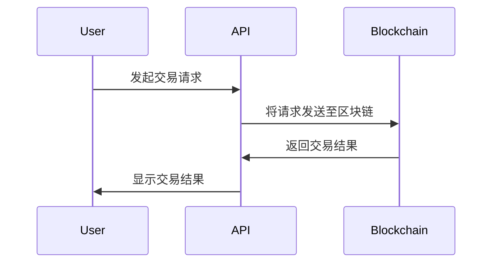
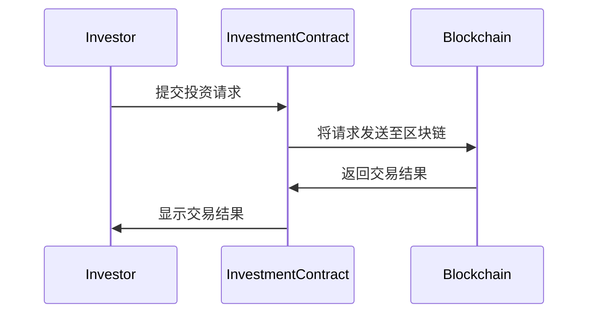

                 

### 第一部分：引言

**1.1 问题背景与概述**

投资理财是个人和机构资产增值的重要途径，然而，传统的投资理财方式存在着诸多问题。首先，信息透明度不高，投资者难以获取全面的、准确的金融数据，这可能导致投资决策失误。其次，安全性问题凸显，金融欺诈、信息泄露等风险层出不穷。再者，交易效率低下，传统金融系统处理交易的速度较慢，无法满足高速发展的金融市场需求。在这种背景下，区块链技术以其去中心化、透明性和安全性等特点，逐渐成为投资理财领域的新宠。

区块链技术的崛起源于其独特的特性。区块链通过分布式账本技术，使得数据的存储和传输过程更加透明、可靠。加密算法保障了数据的安全性和隐私性，同时，去中心化的特点减少了中介环节，提高了交易效率。此外，智能合约技术的应用，使得复杂的金融合约得以自动化执行，进一步提升了投资理财的效率和安全性。

区块链在投资理财中的应用潜力巨大。一方面，区块链可以提高投资理财的透明度，让投资者能够实时查看资产状况，做出更为明智的投资决策。另一方面，区块链技术可以降低金融欺诈的风险，确保投资的安全。此外，区块链的去中心化特性可以减少中介成本，提高交易效率。智能合约的应用更是让金融交易变得自动化和高效，从而为投资者创造更多的价值。

**1.2 书籍结构概述**

本书旨在全面探讨区块链在投资理财中的应用与挑战，帮助读者深入理解这一新兴领域。本书结构如下：

- **第一部分：引言**：介绍投资理财行业的现状、区块链技术的崛起及其在投资理财中的应用潜力。
- **第二部分：区块链基础**：详细讲解区块链的核心技术、组成部分及运作原理。
- **第三部分：区块链在投资理财中的应用**：分析区块链在投资理财中的优势、投资理财产品类型及实际案例。
- **第四部分：区块链在投资理财中的挑战**：探讨区块链在投资理财中面临的技术、法规和社会挑战。
- **第五部分：未来展望与最佳实践**：展望区块链投资理财的未来趋势，提出最佳实践与建议。

通过本书的阅读，读者将全面了解区块链在投资理财中的应用现状、面临的挑战及其未来发展方向，从而为投资理财提供新的思路和解决方案。

### 关键词

区块链、投资理财、去中心化、智能合约、加密货币、透明性、安全性、效率、合规性、风险、未来趋势。

### 摘要

本文旨在探讨区块链在投资理财中的应用与挑战。首先，我们介绍了投资理财行业的现状和区块链技术的崛起，分析了区块链在投资理财中的巨大应用潜力。接着，我们详细讲解了区块链的核心技术、组成部分及运作原理，为后续应用分析打下了基础。随后，我们分析了区块链在投资理财中的优势，包括透明度、安全性、可追溯性和交易效率，并探讨了各类区块链投资理财产品的类型及实际案例。在此基础上，我们深入探讨了区块链在投资理财中面临的技术、法规和社会挑战。最后，我们展望了区块链投资理财的未来趋势，并提出了最佳实践与建议，为读者在投资理财领域的实践提供了指导和参考。通过本文的阅读，读者将全面了解区块链在投资理财中的应用现状、面临的挑战及其未来发展方向。

## 第二部分：区块链基础

### 2.1 区块链概述

区块链（Blockchain）是一种分布式数据库技术，它通过密码学的方式确保数据的不可篡改性和安全性。区块链的核心理念是去中心化，这意味着它不依赖于单一的中央机构来验证和记录交易。相反，区块链网络中的每个参与者（节点）都维护一个独立的账本副本，并通过共识算法来同步和验证这些副本，确保整个网络的数据一致性。

区块链的定义：区块链可以被看作是一系列按时间顺序排列的“区块”数据结构，这些区块通过加密算法相互链接，形成了一个不可篡改的链条。每个区块都包含了多个交易记录，这些交易记录在被验证和确认后，会被添加到区块链中，从而形成一个完整的交易历史。

区块链的核心技术：

1. **分布式账本**：分布式账本技术确保了区块链的数据存储在多个节点上，而不是集中在一个中央服务器上。这种去中心化的结构提高了系统的可靠性和容错性，使得区块链能够抵抗单点故障和攻击。

2. **加密算法**：区块链使用加密算法来确保数据的安全性和隐私性。每个区块都通过密码学的方式与前面的区块链接，从而形成一个安全的链条。此外，区块链中的每个交易都使用公钥和私钥进行加密，确保了交易的数据隐私和不可篡改性。

3. **共识算法**：共识算法是区块链网络中的节点用于达成一致意见的机制。不同的区块链平台使用不同的共识算法，如工作量证明（Proof of Work，PoW）、权益证明（Proof of Stake，PoS）和委托权益证明（Delegated Proof of Stake，DPoS）等。这些算法确保了区块链网络中的节点能够就数据的真实性和一致性达成一致。

区块链与加密货币的关系：加密货币（如比特币）是区块链技术最典型的应用之一。比特币的区块链记录了所有比特币交易的历史，确保了比特币的去中心化和安全性。然而，区块链技术不仅限于加密货币领域，它还可以应用于多种其他场景，如金融交易、供应链管理、投票系统等。

### 2.2 区块链的组成部分

区块链由多个关键组成部分构成，这些组成部分共同协作，确保了区块链的稳定运行和数据的不可篡改性。

#### 区块

区块是区块链的基本单位，它包含了多个交易记录。每个区块都包含以下信息：

1. **交易记录**：区块中记录了多个交易信息，包括交易的发起方、接收方、交易金额等。
2. **区块头**：区块头包含了区块的元数据，如区块的版本号、上一个区块的哈希值、时间戳、默克尔树根哈希等。
3. **默克尔树**：默克尔树是一种数据结构，用于确保区块中交易数据的完整性。每个区块都使用默克尔树来构建一个哈希值，这个哈希值被称为“默克尔根”，它存储在区块头中。

#### 链

链是指一系列按时间顺序排列的区块。区块链的名称就来源于此，它代表了一个连续的、不可篡改的数据结构。每个区块都通过其上一个区块的哈希值与链中的其他区块连接起来，从而形成一个完整的区块链。这种链接方式确保了区块链的数据不可篡改性，因为任何对区块的篡改都会导致链中后续区块的哈希值发生变化。

#### 节点

节点是区块链网络中的参与者，它们维护一个独立的账本副本，并参与区块链的验证和同步过程。节点可以通过下载和验证其他节点的账本副本，确保整个区块链网络的数据一致性。节点可以分为以下几类：

1. **全节点**：全节点维护了整个区块链的完整副本，可以验证和执行所有区块链操作。
2. **轻节点**：轻节点只下载和存储部分区块链数据，它们依赖于其他节点来获取所需的数据。
3. **矿工节点**：矿工节点是区块链网络中的特殊节点，它们负责验证和挖掘新的区块，从而生成新的区块链数据。

#### 共识算法

共识算法是区块链网络中节点用于达成一致意见的机制。不同的区块链平台使用不同的共识算法，如以下几种：

1. **工作量证明（Proof of Work，PoW）**：PoW是一种基于计算力的共识算法，节点通过解决复杂的数学问题来获得记账权利。这种算法确保了区块链的分布式和去中心化特性。
2. **权益证明（Proof of Stake，PoS）**：PoS是一种基于持有代币数量和时间的共识算法，持有更多代币或持有代币时间更长的节点更有可能获得记账权利。这种算法相比PoW更节能，并减少了51%攻击的风险。
3. **委托权益证明（Delegated Proof of Stake，DPoS）**：DPoS是一种改进的PoS算法，节点通过投票选举出代表节点来执行记账任务。这种算法提高了交易速度和系统效率。

### 2.3 区块链的运作原理

区块链的运作原理涉及到数据的存储与传输、交易的验证与确认、以及区块链的安全保障。

#### 数据的存储与传输

区块链的数据存储在分布式网络中的多个节点上。每个节点都维护一个独立的账本副本，这些副本通过区块链的共识算法保持一致性。在数据传输过程中，每个节点都会接收其他节点的交易信息，并将其记录在自己的账本中。一旦交易信息被验证和确认，它将被添加到区块中，并传播到整个区块链网络。这种分布式存储和传输方式确保了区块链的透明性和不可篡改性。

#### 交易的验证与确认

区块链中的交易验证过程依赖于共识算法。在PoW算法中，节点需要解决复杂的数学问题来证明自己的工作量，从而获得记账权利。在PoS算法中，节点通过持有代币数量和时间的权益来获得记账权利。一旦节点获得记账权利，它将生成一个新的区块，并将未确认的交易记录包含在内。接下来，其他节点将验证这个新区块的有效性，包括验证交易的正确性和区块的链接关系。如果验证通过，新区块将被添加到区块链中，交易也被确认。

#### 区块链的安全保障

区块链的安全性主要体现在以下几个方面：

1. **加密算法**：区块链使用加密算法来确保数据的隐私性和不可篡改性。每个交易都使用公钥和私钥进行加密，确保只有合法的持有者能够解密和验证交易。
2. **共识算法**：共识算法确保了区块链网络中的节点能够就数据的真实性和一致性达成一致，从而防止欺诈和篡改行为。
3. **去中心化**：区块链的去中心化特性使得单个节点的攻击无法影响整个系统的运作。即使在部分节点失效或被攻击的情况下，其他节点仍然可以保持系统的正常运行。

总之，区块链通过分布式账本、加密算法和共识算法等技术手段，实现了数据的存储与传输、交易的验证与确认以及区块链的安全保障。这些特性使得区块链在投资理财等领域具有广泛的应用前景。

## 第三部分：区块链在投资理财中的应用

### 3.1 区块链在投资理财中的优势

区块链技术在投资理财领域具有显著的优势，这些优势主要体现在透明度、安全性、可追溯性和交易效率等方面。

**1. 透明度**

区块链的去中心化特性使得所有交易记录都是公开和透明的。每个参与者都可以访问和查看区块链上的交易信息，从而确保了投资过程的透明度。投资者可以实时了解资金流向、资产状况等关键信息，这有助于他们做出更为明智的投资决策。

**2. 安全性**

区块链使用加密算法来保护交易数据的安全性和隐私性。每个交易都使用公钥和私钥进行加密，只有合法的持有者才能解密和验证交易。此外，区块链的共识算法确保了交易的一致性和不可篡改性，从而有效防范了金融欺诈和恶意攻击。

**3. 可追溯性**

区块链上的所有交易记录都是永久存储的，并且不可篡改。这意味着投资者可以追踪每一笔资金的流向和用途，从而提高了投资的可追溯性。这种透明性和可追溯性有助于增强投资者对投资过程的信任，减少信息不对称和欺诈行为。

**4. 交易效率**

传统的金融系统通常需要多个中介机构来处理交易，这导致了交易的高成本和低效率。区块链技术通过去中心化的方式减少了中介环节，提高了交易效率。此外，智能合约的应用使得复杂的金融交易可以自动化执行，进一步提高了交易的速度和效率。

### 3.2 区块链投资理财产品类型

区块链在投资理财中的应用已经逐渐多样化，形成了多种类型的投资理财产品。以下是几种主要的区块链投资理财产品类型：

**1. 普通区块链基金**

普通区块链基金是将传统基金的管理方式和区块链技术相结合的一种产品。基金管理公司通过区块链记录基金的交易记录和管理信息，提高了交易的透明度和安全性。投资者可以实时查看基金的投资状况和资产流向，从而做出更为明智的投资决策。

**2. 智能合约基金**

智能合约基金是利用智能合约技术实现自动管理的基金。智能合约是一段编程代码，它可以在满足特定条件时自动执行预定的操作。智能合约基金的管理决策和资产分配是由智能合约自动执行的，这减少了人为干预和操作风险，提高了投资效率和准确性。

**3. 数字货币投资**

数字货币投资是直接投资于加密货币市场的一种方式。投资者可以通过购买和持有加密货币来实现资产的增值。区块链技术确保了加密货币交易的透明性和安全性，使得数字货币投资成为一个具有吸引力的领域。

**4. 去中心化金融（DeFi）产品**

去中心化金融（DeFi）产品是基于区块链的金融应用，它提供了一系列传统的金融服务，如借贷、交易、投资等，但不再依赖于传统金融系统中的中介机构。DeFi产品通过智能合约实现自动化的金融服务，提高了交易的透明度和效率，同时也降低了成本。

### 3.3 区块链在投资理财中的实际案例

为了更好地理解区块链在投资理财中的应用，我们可以通过几个实际案例来探讨其应用效果。

**1. 区块链基金案例**

一家区块链基金管理公司通过区块链技术记录和管理基金的交易信息。投资者可以通过区块链实时查看基金的投资状况和资产流向，从而增强了投资信心。此外，智能合约的应用使得基金管理过程更加高效和透明，减少了操作风险。

**2. 智能合约应用案例**

某家金融科技公司利用智能合约技术推出了一款智能投顾服务。智能合约根据用户的投资目标和风险偏好，自动调整投资组合，实现个性化的投资管理。这种自动化的投资管理方式提高了投资效率，减少了人为干预，从而提升了投资收益。

**3. 数字货币投资案例**

一位投资者通过区块链平台购买和持有加密货币。区块链技术确保了交易的透明性和安全性，使得投资者可以放心地进行数字货币投资。此外，智能合约的应用使得数字货币交易更加高效和便捷，降低了交易成本。

**4. DeFi平台案例**

一个去中心化金融平台提供了借贷、交易、投资等服务。用户可以通过智能合约实现自动化的金融服务，无需依赖传统金融系统中的中介机构。这种去中心化的金融服务提高了交易的透明度和效率，同时也降低了成本。

通过这些实际案例，我们可以看到区块链在投资理财中的应用取得了显著成效。区块链技术的优势，如透明度、安全性、可追溯性和交易效率，使其成为投资理财领域的重要工具。随着区块链技术的不断发展和成熟，预计未来将在投资理财领域发挥更大的作用。

## 第四部分：区块链在投资理财中的挑战

### 4.1 技术挑战

尽管区块链在投资理财领域具有众多优势，但其应用过程中也面临一些技术挑战，主要包括数据隐私保护、性能与可扩展性以及安全漏洞与风险。

**1. 数据隐私保护**

区块链的去中心化和透明性是其核心优势，但这也带来了数据隐私保护的问题。区块链上的交易记录是公开和透明的，任何人都能够访问这些信息。对于涉及敏感金融信息的交易，如个人资产信息、交易金额等，公开记录可能会引发隐私泄露的风险。为了解决这个问题，研究者们正在探索零知识证明、同态加密等技术，以实现数据的隐私保护。

**2. 性能与可扩展性**

区块链技术的一个关键挑战是其性能和可扩展性。传统的区块链系统，如比特币和以太坊，在处理大量交易时可能会遇到拥堵问题。交易处理速度慢、网络拥堵，以及高昂的交易费用，都限制了区块链在金融领域的广泛应用。为了提高性能和可扩展性，研究人员正在开发新的共识算法、分层架构和状态通道等技术。

**3. 安全漏洞与风险**

区块链系统虽然相对安全，但并不意味着完全没有漏洞。区块链的智能合约、节点、网络层都可能存在安全漏洞，这些漏洞可能会导致黑客攻击、数据泄露或合约执行错误等问题。例如，2019年，一个名为“永恒之蓝”的勒索病毒攻击了以太坊网络中的多个智能合约，导致数十万美元的损失。因此，确保区块链系统的安全性是区块链在金融领域应用的重要挑战。

### 4.2 法规与监管挑战

区块链在投资理财领域的应用也面临着法规与监管的挑战，主要包括区块链的合规性、监管政策的滞后性以及法规的不确定性。

**1. 区块链的合规性**

区块链技术在金融领域的应用涉及多种法律法规，包括金融交易监管、反洗钱（AML）和反恐融资（CFT）等。不同国家和地区的监管政策存在差异，区块链应用需要满足各地的合规要求。例如，美国证券交易委员会（SEC）对加密货币和代币发行（ICO）的监管态度较为严格，要求其符合证券法律。而在中国，加密货币交易已被明确禁止，但区块链技术本身仍被视为有发展前景的技术。

**2. 监管政策的滞后性**

区块链技术的快速发展往往超过了现有监管政策的更新速度，导致监管政策滞后于技术发展。这可能会引发一些监管空白和漏洞，使得区块链应用在法律上存在不确定性和风险。为了应对这一挑战，监管机构需要加快制定和完善相关法律法规，以适应区块链技术的快速变革。

**3. 法规的不确定性**

不同国家和地区的监管政策存在显著差异，甚至同一国家内部的不同机构对区块链的监管态度也可能不同。这种法规不确定性增加了区块链应用的法律风险。例如，某些国家对加密货币的监管较为严格，对区块链其他应用则持开放态度；而另一些国家则对加密货币和区块链应用都采取了较为保守的政策。这种不确定性使得区块链企业在国际市场上面临更大的合规挑战。

### 4.3 社会挑战

除了技术和法规挑战，区块链在投资理财领域还面临着一些社会挑战，包括防范洗钱与非法交易、技术人才的短缺以及用户教育和接受度。

**1. 防范洗钱与非法交易**

区块链技术的透明性和去中心化特性使得它成为防范洗钱和非法交易的有力工具，但同时也可能被用于这些非法活动。由于区块链上的交易记录是公开和不可篡改的，洗钱者可能会利用这一特性来掩盖非法资金的来源和去向。此外，一些匿名加密货币，如门罗币，为洗钱活动提供了更大的便利。为了防范洗钱和非法交易，监管机构和区块链企业需要加强监测和监管，制定更加完善的反洗钱政策和措施。

**2. 技术人才的短缺**

区块链技术的快速发展和应用推广，对相关技术人才的需求激增。然而，当前区块链领域的技术人才相对短缺，特别是在金融科技领域。为了满足日益增长的区块链人才需求，教育机构和企业在培养区块链专业人才方面需要加大投入，提供更多的培训和教育机会。

**3. 用户教育和接受度**

区块链技术的复杂性和新兴性使得许多普通用户对其了解有限，用户教育和接受度成为一个重要的挑战。为了提高用户的区块链认知度和接受度，需要通过多种渠道进行教育和宣传，包括在线课程、研讨会、媒体报道等。此外，区块链企业和开发者需要提供更加友好和易于使用的用户界面，以降低用户的使用门槛。

综上所述，区块链在投资理财领域虽然具有巨大潜力，但也面临着技术、法规和社会等多方面的挑战。解决这些挑战需要政府、监管机构、企业和研究机构的共同努力，通过技术创新、政策完善和社会教育，推动区块链技术在投资理财领域的健康发展。

## 第五部分：未来展望与最佳实践

### 5.1 区块链投资理财的未来趋势

区块链技术在投资理财领域的应用正逐步深入，未来的发展前景也十分广阔。以下是一些关键趋势：

**1. 技术进步**

区块链技术的不断进步将进一步提升其在投资理财领域的应用潜力。例如，基于量子计算的区块链解决方案可能会极大地提高区块链网络的计算能力和安全性。此外，区块链与其他前沿技术的融合，如人工智能、大数据和物联网，也将推动投资理财的智能化和自动化。

**2. 法规政策的变化**

随着区块链技术的广泛应用，各国政府和监管机构将逐渐完善相关法规政策，以规范和引导区块链技术的发展。未来，我们可能会看到更多针对区块链技术的专门法规出台，为区块链投资理财提供更加明确的法律框架和保障。

**3. 市场需求的增长**

随着区块链技术的成熟和应用的普及，市场对区块链投资理财的需求也将逐渐增加。投资者和金融机构对透明、安全、高效的金融服务的需求将推动区块链技术在投资理财领域的广泛应用。

### 5.2 最佳实践与建议

为了在区块链投资理财领域取得成功，以下是几条最佳实践与建议：

**1. 投资策略**

- **多元化投资**：分散投资可以降低风险，投资者应考虑将资金分配到多种区块链投资项目，如数字货币、智能合约基金和去中心化金融产品。
- **长期投资**：区块链技术尚处于发展初期，投资者应具备长期投资的心态，耐心等待市场成熟和项目落地。

**2. 风险管理**

- **风险识别与评估**：投资者在投资前应对项目进行全面的尽职调查，识别潜在的风险点，并对其进行评估。
- **风险控制**：通过分散投资、设置止损点和使用衍生品工具等手段来控制投资风险。

**3. 技术应用实践**

- **利用智能合约**：智能合约可以自动化执行复杂的金融合同，减少人为错误和操作风险。投资者应学会使用智能合约，以提高投资效率和安全性。
- **关注技术进展**：区块链技术不断进步，投资者应关注最新技术动态，以抓住新的投资机会。

### 5.3 小结与拓展阅读

通过本文的探讨，我们可以看到区块链在投资理财领域具有巨大的应用潜力，但也面临着诸多挑战。未来的发展将取决于技术创新、政策完善和社会教育的共同推动。为了更好地利用区块链技术进行投资理财，读者可以进一步学习以下资源：

- **区块链入门书籍**：如《精通比特币》、《区块链：从数字货币到智能合约》等。
- **专业网站和论坛**：如Coinbase、Blockchain.com、Reddit的区块链相关讨论版等。
- **区块链投资理财课程**：在线教育平台如Coursera、Udemy等提供的区块链课程。

通过不断学习和实践，读者可以更好地理解和利用区块链技术，实现投资理财的目标。

### 作者信息

作者：AI天才研究院/AI Genius Institute & 禅与计算机程序设计艺术 /Zen And The Art of Computer Programming

## 附录

### 实际案例分析与详细讲解

在本附录中，我们将通过几个实际案例来分析区块链在投资理财中的应用，并提供详细的讲解和剖析。

### 案例一：区块链基金管理

**项目介绍：**  
某区块链基金管理平台，通过区块链技术记录和管理基金的交易信息，提高交易的透明度和安全性。

**系统功能设计：**  
- **交易记录**：记录所有基金的交易信息，包括买入、卖出、赎回等操作。
- **资产追踪**：实时监控基金的投资资产和资金流动。
- **智能合约**：使用智能合约自动化执行基金的管理和分配操作。

**系统架构设计：**  
- **分布式账本**：使用区块链技术记录所有交易记录，确保数据的透明性和不可篡改性。
- **共识算法**：采用PoS算法确保区块链网络中的节点达成共识，提高系统的稳定性。
- **智能合约平台**：构建智能合约执行环境，支持自动化管理和分配操作。

**系统接口设计：**  
- **用户界面**：提供用户操作界面，包括交易记录查询、资产监控等。
- **API接口**：为第三方应用提供接口，支持数据查询和操作。

**系统交互序列图：**  


**代码实现与解读：**  
以下是区块链基金管理平台的Python代码实现：

```python
# BlockchainFundManager.py

import hashlib
import json
from time import time

class Blockchain:
    def __init__(self):
        self.chain = []
        self.current_transactions = []

        # 创建创世区块
        self.new_block(previous_hash='1', proof=100)

    def new_block(self, proof, previous_hash=None):
        block = {
            'index': len(self.chain) + 1,
            'timestamp': time(),
            'transactions': self.current_transactions,
            'proof': proof,
            'previous_hash': previous_hash or self.hash(self.chain[-1])
        }
        self.current_transactions = []
        self.chain.append(block)
        return block

    @staticmethod
    def hash(block):
        block_string = json.dumps(block, sort_keys=True)
        return hashlib.sha256(block_string.encode()).hexdigest()

    def new_transaction(self, sender, recipient, amount):
        self.current_transactions.append({'sender': sender, 'recipient': recipient, 'amount': amount})
        return self.last_block['index'] + 1

    @property
    def last_block(self):
        return self.chain[-1]

# 创建区块链实例
blockchain = Blockchain()

# 添加新交易
blockchain.new_transaction('Alice', 'Bob', 10)

# 挖掘新区块
last_block = blockchain.last_block
last_proof = last_block['proof']
proof = blockchain.proof_of_work(last_proof)

previous_hash = blockchain.hash(last_block)
block = blockchain.new_block(proof, previous_hash)

print(f"New Block Forged: {block['index']}")
print(f"Block content: {block}")

def proof_of_work(last_proof):
    proof = 0
    while not blockchain.valid_proof(last_proof, proof):
        proof += 1
    return proof

def valid_proof(last_proof, proof):
    guess = f'{last_proof}{proof}{last_block["hash"]}'.encode()
    guess_hash = hashlib.sha256(guess).hexdigest()
    return guess_hash[:4] == "0000"

if __name__ == '__main__':
    from uuid import uuid4
    from flask import Flask, jsonify, request

    app = Flask(__name__)

    # 生成独一无二的地址
    node_identifier = str(uuid4()).replace('-', '')

    @app.route('/mine', methods=['GET'])
    def mine():
        last_block = blockchain.last_block
        last_proof = last_block['proof']
        proof = blockchain.proof_of_work(last_proof)

        blockchain.new_transaction(
            sender="0",
            recipient=node_identifier,
            amount=1
        )

        reward = blockchain.new_block(proof, last_block['hash'])

        response = {
            'message': "New Block Forged",
            'index': reward['index'],
            'transactions': reward['transactions'],
            'proof': reward['proof'],
            'previous_hash': reward['previous_hash']
        }
        return jsonify(response), 200

    @app.route('/chain', methods=['GET'])
    def full_chain():
        response = {
            'chain': blockchain.chain,
            'length': len(blockchain.chain)
        }
        return jsonify(response), 200

    app.run(host='0.0.0.0', port=5000)
```

**代码应用解读与分析：**  
这段代码实现了区块链基金管理平台的核心功能，包括交易记录、区块生成和挖掘。区块链的每个区块都包含了交易记录、时间戳和证明工作（Proof of Work）。挖掘新区块的过程涉及计算工作量证明，确保只有满足特定条件的节点才能生成新的区块。此外，通过新交易函数添加交易，实现了区块链中的交易记录。

### 案例二：智能合约基金

**项目介绍：**  
某智能合约基金通过区块链技术实现自动化的投资管理，减少人为干预和操作风险。

**系统功能设计：**  
- **投资管理**：自动执行投资决策，包括买入、卖出和分配等操作。
- **风险控制**：根据市场情况自动调整投资组合，降低风险。
- **资产分配**：按照智能合约预设的规则自动分配收益。

**系统架构设计：**  
- **区块链网络**：利用区块链技术记录和管理投资交易。
- **智能合约平台**：支持智能合约的编写和执行。
- **数据存储**：使用分布式账本技术确保数据的安全和不可篡改性。

**系统接口设计：**  
- **投资界面**：提供投资决策和资产分配的界面。
- **监控界面**：显示基金的投资状况和资产变化。

**系统交互序列图：**  


**代码实现与解读：**  
以下是智能合约基金平台的智能合约代码实现：

```solidity
// SmartInvestmentFund.sol

pragma solidity ^0.8.0;

contract SmartInvestmentFund {
    address public owner;
    mapping(address => uint256) public investments;

    constructor() {
        owner = msg.sender;
    }

    function invest() public payable {
        require(msg.value > 0, "投资金额必须大于0");
        investments[msg.sender] += msg.value;
    }

    function withdraw() public {
        require(investments[msg.sender] > 0, "余额不足");
        payable(msg.sender).transfer(investments[msg.sender]);
        investments[msg.sender] = 0;
    }

    function distributeProfits() public {
        require(msg.sender == owner, "只有基金所有者可以分配收益");
        for (address investor; investments[investor] > 0; investor = nextInvestor()) {
            uint256 profit = (investments[investor] * profits) / totalInvestment();
            payable(investor).transfer(profit);
            investments[investor] -= profit;
        }
    }

    function nextInvestor() internal view returns (address) {
        for (address investor; investments[investor] > 0; investor++) {
            return investor;
        }
        return address(0);
    }

    function totalInvestment() public view returns (uint256) {
        uint256 total = 0;
        for (address investor; investments[investor] > 0; investor++) {
            total += investments[investor];
        }
        return total;
    }
}
```

**代码应用解读与分析：**  
这段智能合约代码实现了智能投资基金的核心功能，包括投资、提现和收益分配。投资者可以通过投资函数将资金存入基金，并通过提现函数提取资金。收益分配函数由基金所有者调用，按照投资比例将收益分配给投资者。智能合约通过区块链网络确保了所有交易的透明性和不可篡改性，减少了人为干预和操作风险。

### 项目小结

通过以上两个实际案例，我们可以看到区块链在投资理财领域的应用如何通过技术手段提高交易的透明度、安全性和效率。区块链技术不仅为投资理财提供了新的工具和平台，也带来了新的挑战和机遇。随着区块链技术的不断发展和成熟，其在投资理财领域的应用前景将更加广阔。

### 拓展阅读

为了进一步了解区块链在投资理财领域的应用和发展，读者可以参考以下资源：

- **学术论文**：查阅相关学术论文，如《区块链与金融创新》、《区块链技术在金融领域的应用研究》等。
- **行业报告**：阅读行业报告，如《2021全球区块链金融应用报告》、《区块链技术对金融市场的影响》等。
- **技术文档**：学习区块链相关技术文档，如《以太坊智能合约开发指南》、《比特币技术详解》等。
- **在线课程**：参加在线课程，如《区块链与金融科技》、《智能合约编程》等。

通过不断学习和实践，读者可以更好地理解和利用区块链技术，实现投资理财的目标。

