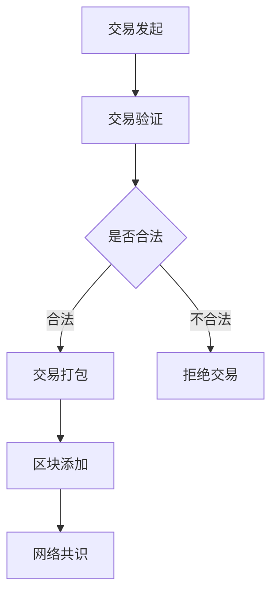
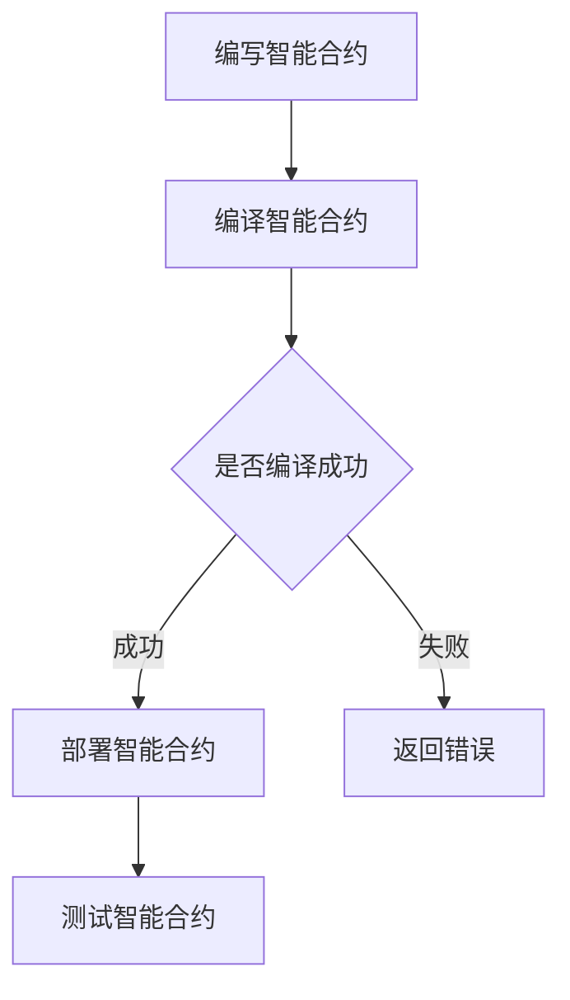
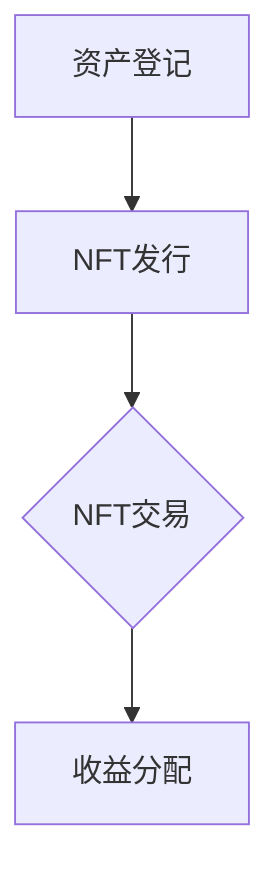

                 

### 文章标题

# 区块链技术在资产证券化中的应用

### 文章关键词

区块链、资产证券化、分布式账本、智能合约、非同质化代币（NFT）、案例分析

### 摘要

本文将探讨区块链技术在资产证券化中的应用，通过对资产证券化的基本概念、区块链技术的核心概念以及两者结合的优势和挑战进行详细分析，进而通过具体的案例分析展示区块链技术在资产证券化中的实际应用效果。本文旨在为读者提供一个全面了解和深入思考区块链技术在资产证券化中作用的机会。

### 目录

1. **第一部分：区块链技术在资产证券化中的应用概述**
    1.1 资产证券化的基本概念
    1.2 区块链技术的核心概念
    1.3 区块链技术在资产证券化中的应用
    1.4 本书结构安排
    1.5 小结
2. **第二部分：区块链技术在资产证券化中的关键技术**
    2.1 区块链的加密算法
    2.2 区块链的分布式账本
    2.3 智能合约在资产证券化中的应用
    2.4 非同质化代币（NFT）与资产证券化
    2.5 小结
3. **第三部分：区块链技术在资产证券化中的应用案例分析**
    3.1 案例分析一：比特币在房地产证券化中的应用
    3.2 案例分析二：以太坊在应收账款证券化中的应用
    3.3 案例分析三：EOSIO在抵押贷款证券化中的应用
    3.4 小结
4. **第四部分：区块链技术在资产证券化中的未来发展趋势**
    4.1 区块链技术在资产证券化中的未来发展趋势
    4.2 区块链技术在资产证券化中的潜在应用领域
    4.3 区块链技术在资产证券化中的挑战与解决方案
    4.4 小结
5. **结语**

---

### 第一部分：区块链技术在资产证券化中的应用概述

#### 1.1 资产证券化的基本概念

资产证券化是指将一些分散的、非流动性强的资产，通过一定的结构设计和信用增强，转化为可以在资本市场上交易的证券。其核心目的是将资产转化为资金，从而提高资产的流动性和利用率。

**1.1.1 资产证券化的起源与发展**

资产证券化的概念最早可以追溯到1970年代初的美国。当时，美国政府为了解决住宅抵押贷款的问题，开始尝试将住宅抵押贷款打包成证券并在资本市场上销售。此后，资产证券化在全球范围内迅速发展，尤其是在金融市场高度发达的国家和地区。

**1.1.2 资产证券化的定义与分类**

资产证券化的定义是指通过将资产转化为证券，实现资产的流动性转移和融资目的的过程。根据资产类型的不同，资产证券化可以分为以下几类：

- **住宅抵押贷款证券化（MBS）**：以住宅抵押贷款为基础资产的证券化。
- **商业抵押贷款证券化（CMBS）**：以商业抵押贷款为基础资产的证券化。
- **应收账款证券化（ABS）**：以应收账款为基础资产的证券化。
- **信用卡应收账款证券化**：以信用卡应收账款为基础资产的证券化。

**1.1.3 资产证券化的核心要素与运作流程**

资产证券化的核心要素包括资产池、特设信托（SPV）、信用增级和证券发行。其运作流程如下：

1. **资产池的构建**：将符合标准的资产打包成资产池。
2. **特设信托的设立**：通过特设信托来持有和管理资产池。
3. **信用增级**：通过信用增级手段提高证券的信用等级，降低投资者的风险。
4. **证券发行**：在资本市场上发行证券，将资产转化为资金。

#### 1.2 区块链技术的核心概念

区块链技术是一种分布式账本技术，通过加密算法和网络共识机制，实现了数据的不可篡改和透明性。区块链技术的核心概念包括：

**1.2.1 区块链的基本原理**

区块链是由一系列按时间顺序排列的“区块”组成的链式数据结构。每个区块都包含了若干笔交易记录，这些记录经过加密和校验后，被添加到区块链上，形成一条不可篡改的数字记录。

**1.2.2 区块链技术的关键特性**

- **去中心化**：区块链网络中的每个节点都参与账本的管理，无需依赖中心化的第三方。
- **数据不可篡改**：区块链上的数据一旦被记录，就很难被篡改，保证了数据的可信性。
- **透明性**：区块链上的交易记录对所有节点都是可见的，保证了数据的透明性。
- **安全性和隐私性**：区块链通过加密算法和共识机制，保证了交易的安全性和数据的隐私性。

**1.2.3 区块链技术的应用场景**

区块链技术可以广泛应用于金融、物流、医疗、教育等多个领域。在金融领域，区块链技术主要用于实现跨境支付、证券交易、智能合约等。

#### 1.3 区块链技术在资产证券化中的应用

**1.3.1 区块链技术在资产证券化中的优势**

区块链技术在资产证券化中的应用具有以下优势：

- **提高交易透明度**：区块链技术可以确保所有交易记录公开透明，提高市场的信任度。
- **降低交易成本**：区块链技术减少了中介环节，降低了交易成本。
- **提高交易效率**：区块链技术可以实现快速、高效的交易，缩短交易时间。
- **降低信用风险**：区块链技术通过智能合约和分布式账本，降低了信用风险。

**1.3.2 区块链技术在资产证券化中的应用现状**

目前，区块链技术在资产证券化中的应用已经取得了一些进展。例如，比特币在房地产证券化中的应用，以太坊在应收账款证券化中的应用等。然而，由于区块链技术的成熟度和技术标准的不统一，其应用仍面临一些挑战。

**1.3.3 区块链技术在资产证券化中的挑战与机遇**

区块链技术在资产证券化中的应用面临着以下挑战：

- **技术成熟度**：区块链技术尚未完全成熟，需要进一步的技术创新和优化。
- **法规政策**：目前，全球范围内的区块链法规政策尚不完善，需要制定统一的法规标准。
- **市场需求**：尽管区块链技术在资产证券化中具有巨大潜力，但市场需求尚待提高。

然而，区块链技术在资产证券化中也面临着许多机遇：

- **技术创新**：区块链技术的不断进步为资产证券化提供了新的技术和解决方案。
- **市场潜力**：资产证券化市场庞大，区块链技术可以为市场提供更高的透明度和效率。
- **合作机会**：区块链技术与金融行业的结合可以创造出许多新的商业机会。

#### 1.4 本书结构安排

本书将分为四个部分：

1. **第一部分**：区块链技术在资产证券化中的应用概述，介绍资产证券化和区块链技术的基本概念及其应用优势。
2. **第二部分**：区块链技术在资产证券化中的关键技术，详细讲解区块链的加密算法、分布式账本、智能合约和NFT等关键技术。
3. **第三部分**：区块链技术在资产证券化中的应用案例分析，通过具体案例展示区块链技术在资产证券化中的应用效果。
4. **第四部分**：区块链技术在资产证券化中的未来发展趋势，分析区块链技术在资产证券化中的发展趋势和潜在应用领域。

通过本书的结构安排，读者可以系统地了解区块链技术在资产证券化中的应用，并从中获得启示和借鉴。

#### 1.5 小结

本文概述了区块链技术在资产证券化中的应用，从基本概念到关键技术，再到应用案例和未来发展趋势，为读者提供了一个全面的视角。在接下来的章节中，我们将深入探讨区块链技术的核心概念和关键技术，并通过具体案例展示其在资产证券化中的实际应用效果。让我们继续深入探究区块链技术在资产证券化中的无限可能。### 第二部分：区块链技术在资产证券化中的关键技术

#### 2.1 区块链的加密算法

区块链技术的核心之一是加密算法，这些算法确保了区块链的可靠性和安全性。以下是一些关键的加密算法：

**2.1.1 概述**

加密算法在区块链中用于确保数据的完整性和保密性。区块链中的加密算法主要包括哈希算法和数字签名算法。

**2.1.2 SHA-256算法**

SHA-256是SHA-2算法的一部分，是一种用于生成加密哈希的算法。其特点如下：

- **特点**：SHA-256算法可以生成一个256位的哈希值，具有抗碰撞性，即不同的输入数据很难生成相同的哈希值。
- **应用**：SHA-256算法在区块链中用于确保数据的一致性和完整性。

**2.1.3 ECDSA算法**

ECDSA（Elliptic Curve Digital Signature Algorithm）是一种用于生成数字签名的算法。其特点如下：

- **特点**：ECDSA算法使用椭圆曲线密码学，提供了一种安全、高效的数字签名方案。
- **应用**：ECDSA算法在区块链中用于验证交易的有效性和用户身份的认证。

**2.1.4 概念属性特征对比表格**

| 算法         | 特点                                                         | 应用场景                     |
| ------------ | ------------------------------------------------------------ | ---------------------------- |
| SHA-256      | 生成256位哈希值，抗碰撞性高                               | 数据完整性验证               |
| ECDSA        | 使用椭圆曲线密码学，安全、高效                             | 交易验证和用户身份认证       |
| RSA          | 基于大数分解难题，生成数字签名和加密密钥                     | 安全电子邮件、文件加密       |
| AES          | 基于分组密码学，提供数据加密服务                           | 数据存储和通信加密           |

**2.1.5 ER实体关系图架构的 Mermaid 流程图**

```mermaid
erDiagram
  User ||--|{ Transaction }|-- TransactionDetail
  Asset ||--|{ AssetToken }|-- TokenDetail
  Blockchain ||--|{ BlockchainNetwork }|-- Node
```

#### 2.2 区块链的分布式账本

分布式账本是区块链技术的核心组成部分，它使得区块链具有去中心化、透明性和不可篡改的特性。

**2.2.1 概述**

分布式账本是一种通过多个节点共同维护的账本，每个节点都存储完整的账本副本。这种结构使得区块链上的数据具有高度的可靠性和安全性。

**2.2.2 区块链的数据结构**

区块链的数据结构主要由区块（Block）和链（Chain）组成。每个区块包含一定数量的交易记录，并且每个区块都通过哈希算法与前面的区块相连，形成一条链式结构。

**2.2.3 区块链的交易流程**

区块链的交易流程如下：

1. **交易发起**：用户发起一笔交易，将交易信息发送到网络中的节点。
2. **交易验证**：节点对交易进行验证，确保交易的有效性和合法性。
3. **交易打包**：将验证通过的交易打包成区块。
4. **区块添加**：节点将打包好的区块添加到区块链中。
5. **网络共识**：网络中的节点通过共识算法达成一致，确保区块的添加顺序和完整性。

**2.2.4 Mermaid 流程图**



#### 2.3 智能合约在资产证券化中的应用

智能合约是区块链技术的重要组成部分，它允许在区块链上执行自动化合约。在资产证券化中，智能合约可以用来管理资产、执行交易和分配收益。

**2.3.1 智能合约的概念与特点**

智能合约是一段代码，它可以自动执行和执行合同条款。其特点如下：

- **自动化**：智能合约可以自动化执行合同条款，减少了人为干预和操作风险。
- **透明性**：智能合约的代码是公开透明的，所有参与方都可以验证其执行过程。
- **不可篡改**：智能合约一旦执行，其结果就不可更改，保证了合同条款的严格执行。

**2.3.2 智能合约在资产证券化中的功能**

智能合约在资产证券化中具有以下功能：

- **资产登记**：智能合约可以自动记录和管理资产的所有权信息。
- **交易执行**：智能合约可以自动化执行资产交易，确保交易的合法性和安全性。
- **收益分配**：智能合约可以根据合同条款自动计算和分配收益。

**2.3.3 智能合约的编写与部署**

智能合约的编写通常使用特定的编程语言，如Solidity。部署智能合约通常涉及以下步骤：

1. **编写智能合约代码**：使用智能合约编程语言编写合约代码。
2. **编译智能合约**：将合约代码编译成字节码。
3. **部署智能合约**：将编译后的字节码部署到区块链网络中。
4. **测试智能合约**：在部署前对智能合约进行测试，确保其功能和安全性。

**2.3.4 Mermaid 流程图**



#### 2.4 非同质化代币（NFT）与资产证券化

非同质化代币（NFT）是一种独特、不可替代的数字资产，它代表了对特定资产的所有权或权益。在资产证券化中，NFT可以用来代表和交易资产。

**2.4.1 NFT的基本概念**

NFT（Non-Fungible Token）是一种独特的数字资产，与比特币等可互换的加密货币不同，NFT具有唯一性和不可替代性。每个NFT都具有独特的标识符和属性，使其在数字世界中独一无二。

**2.4.2 NFT在资产证券化中的应用**

NFT在资产证券化中的应用主要包括以下几个方面：

- **资产代表**：NFT可以用来代表资产的所有权或权益，使资产能够在区块链上进行交易和流通。
- **权益分配**：NFT可以用来分配资产的所有权和收益权，使资产的所有权结构更加清晰和透明。
- **交易记录**：NFT可以记录资产的历史交易记录，提供资产的完整交易历史和透明度。

**2.4.3 NFT对资产证券化的影响**

NFT的引入为资产证券化带来了新的可能性和挑战：

- **提高透明度**：NFT可以提供资产的透明交易历史和所有权记录，提高市场的透明度和信任度。
- **增加流动性**：NFT使资产能够在区块链上进行分割和交易，提高了资产的流动性和可交易性。
- **降低成本**：通过NFT的自动化交易和记录，可以降低资产证券化的交易成本和操作风险。

**2.4.4 Mermaid 流程图**



#### 2.5 小结

区块链技术在资产证券化中的应用涉及多个关键技术和概念，包括加密算法、分布式账本、智能合约和NFT。这些技术为资产证券化提供了更高的透明度、效率和安全性。在接下来的章节中，我们将通过具体案例展示区块链技术在资产证券化中的实际应用效果，进一步探讨其在金融领域的潜力。### 第三部分：区块链技术在资产证券化中的应用案例分析

#### 3.1 案例分析一：比特币在房地产证券化中的应用

**3.1.1 案例背景**

比特币作为一种加密货币，具有去中心化、透明和高流动性的特点。在房地产证券化中，比特币可以作为资产代表，提高资产的流动性和交易效率。

**3.1.2 案例实施过程**

- **资产选择**：选择一处具有高增值潜力的房地产作为基础资产。
- **资产评估**：对房地产进行评估，确定其价值。
- **比特币发行**：通过区块链平台发行比特币代币（BTC Token），代表房地产的所有权和收益权。
- **智能合约编写**：编写智能合约，用于管理比特币代币的发行、转让和收益分配。
- **区块链部署**：将智能合约部署到区块链网络中，确保其透明性和安全性。
- **交易执行**：通过智能合约自动执行比特币代币的交易和收益分配，提高交易效率。

**3.1.3 案例效果分析**

- **提高流动性**：通过比特币代币，房地产可以分割成更小的份额进行交易，提高了资产的流动性。
- **降低交易成本**：智能合约的自动执行减少了交易成本和操作风险。
- **提高交易透明度**：区块链技术确保了交易记录的透明性，提高了市场的信任度。
- **风险分散**：投资者可以通过购买比特币代币，分散投资风险。

**3.1.4 案例总结**

比特币在房地产证券化中的应用展示了区块链技术的巨大潜力。通过比特币代币，房地产资产得以更高效、更透明地进行交易，提高了资产的流动性和投资者的收益。然而，比特币的波动性和监管政策的不确定性也是需要考虑的风险因素。

#### 3.2 案例分析二：以太坊在应收账款证券化中的应用

**3.2.1 案例背景**

应收账款证券化是一种将企业的应收账款转化为可交易的证券的过程。以太坊作为一种智能合约平台，可以为应收账款证券化提供高效、安全的解决方案。

**3.2.2 案例实施过程**

- **应收账款评估**：对企业应收账款进行评估，确定其价值。
- **智能合约编写**：编写智能合约，用于管理应收账款的发行、转让和收益分配。
- **以太坊部署**：将智能合约部署到以太坊网络中，确保其透明性和安全性。
- **交易执行**：通过智能合约自动执行应收账款的交易和收益分配，提高交易效率。
- **投资者参与**：投资者通过购买智能合约中的应收账款份额，参与证券化过程。

**3.2.3 案例效果分析**

- **提高流动性**：通过智能合约，应收账款可以迅速转化为可交易的证券，提高了资产的流动性。
- **降低融资成本**：智能合约的自动化和透明性降低了企业的融资成本。
- **增加收益**：投资者可以通过购买应收账款份额，获得稳定的收益。
- **风险分散**：通过智能合约，应收账款的风险得以分散，降低了投资者的风险。

**3.2.4 案例总结**

以太坊在应收账款证券化中的应用展示了智能合约在金融领域的广泛应用。通过智能合约，应收账款得以高效、透明地进行交易，提高了市场的效率和参与者的收益。然而，以太坊的智能合约存在一定的安全风险，需要加强监管和安全保障。

#### 3.3 案例分析三：EOSIO在抵押贷款证券化中的应用

**3.3.1 案例背景**

抵押贷款证券化是将抵押贷款打包成证券进行交易的过程。EOSIO是一种高性能的区块链平台，可以为抵押贷款证券化提供高效的解决方案。

**3.3.2 案例实施过程**

- **抵押贷款评估**：对抵押贷款进行评估，确定其价值。
- **智能合约编写**：编写智能合约，用于管理抵押贷款的发行、转让和收益分配。
- **EOSIO部署**：将智能合约部署到EOSIO网络中，确保其透明性和安全性。
- **交易执行**：通过智能合约自动执行抵押贷款的交易和收益分配，提高交易效率。
- **投资者参与**：投资者通过购买智能合约中的抵押贷款份额，参与证券化过程。

**3.3.3 案例效果分析**

- **提高流动性**：通过智能合约，抵押贷款可以迅速转化为可交易的证券，提高了资产的流动性。
- **降低交易成本**：EOSIO的高性能和智能合约的自动化降低了交易成本。
- **增加收益**：投资者可以通过购买抵押贷款份额，获得稳定的收益。
- **风险分散**：通过智能合约，抵押贷款的风险得以分散，降低了投资者的风险。

**3.3.4 案例总结**

EOSIO在抵押贷款证券化中的应用展示了高性能区块链平台在金融领域的应用潜力。通过智能合约，抵押贷款得以高效、透明地进行交易，提高了市场的效率和参与者的收益。然而，EOSIO的性能和安全性仍需要进一步的优化和完善。

#### 3.4 小结

通过以上案例分析，我们可以看到区块链技术在资产证券化中的应用具有显著的效益。比特币、以太坊和EOSIO等不同区块链平台在资产证券化中发挥了不同的作用，提高了资产的流动性、交易效率和安全性。然而，区块链技术在资产证券化中仍面临一些挑战，如技术成熟度、法规政策和市场需求等方面。未来的发展需要进一步的技术创新和监管完善，以推动区块链技术在资产证券化中的广泛应用。### 第四部分：区块链技术在资产证券化中的未来发展趋势

#### 4.1 区块链技术在资产证券化中的未来发展趋势

随着区块链技术的不断发展和成熟，其在资产证券化中的应用前景广阔。未来，区块链技术在资产证券化中的发展趋势可以从以下几个方面进行展望：

**4.1.1 技术革新趋势**

- **区块链3.0**：区块链3.0是下一代区块链技术，它将更加注重隐私保护、去中心化和可扩展性。在资产证券化中，区块链3.0将提供更高的交易效率和安全性。
- **跨链技术**：跨链技术使得不同区块链之间的交互和资产转移成为可能，为资产证券化提供了更广阔的应用场景。
- **分布式存储**：分布式存储技术的应用将进一步提高区块链的可靠性和性能，为资产证券化提供更强大的技术支撑。

**4.1.2 法规政策趋势**

- **全球监管合作**：随着区块链技术的发展，各国政府开始加强监管合作，制定统一的区块链法规政策。这将有助于推动区块链技术在资产证券化中的合规应用。
- **监管沙箱**：监管沙箱为区块链技术提供了一个安全、可控的环境，使得创新应用能够在监管下进行测试和推广。未来，监管沙箱将促进区块链技术在资产证券化中的快速发展。

**4.1.3 市场需求趋势**

- **数字资产投资**：随着数字资产的兴起，投资者对资产证券化的需求不断增加。区块链技术的应用将满足这一需求，提供更安全、高效的数字资产交易平台。
- **普惠金融**：区块链技术有助于降低金融服务的门槛，推动普惠金融的发展。未来，区块链技术将在资产证券化中发挥更大的作用，帮助更多人群参与金融市场。

#### 4.2 区块链技术在资产证券化中的潜在应用领域

区块链技术在资产证券化中具有广泛的应用潜力，以下是一些潜在的领域：

**4.2.1 新兴领域**

- **绿色金融**：区块链技术可以追踪和验证绿色资产，推动绿色金融的发展。
- **供应链金融**：区块链技术可以确保供应链中的交易记录透明和可追溯，提高供应链金融的效率和安全性。
- **数字身份认证**：区块链技术可以为资产证券化提供数字身份认证服务，提高交易的安全性和可信度。

**4.2.2 现有领域的优化**

- **房地产证券化**：通过区块链技术，房地产证券化可以实现更高的透明度和流动性。
- **应收账款证券化**：区块链技术可以优化应收账款的管理和交易流程，提高交易效率。
- **抵押贷款证券化**：区块链技术可以提高抵押贷款证券化的安全性、透明度和流动性。

#### 4.3 区块链技术在资产证券化中的挑战与解决方案

尽管区块链技术在资产证券化中具有巨大潜力，但仍然面临一些挑战。以下是一些主要挑战及其解决方案：

**4.3.1 技术挑战**

- **性能瓶颈**：当前区块链技术的性能仍存在瓶颈，需要进一步优化。解决方案包括采用分片技术、状态通道等。
- **安全性问题**：区块链技术面临恶意攻击、隐私泄露等安全风险。解决方案包括加强加密算法、采用多层次安全防护等。

**4.3.2 法规挑战**

- **监管合规**：区块链技术在资产证券化中的合规问题亟待解决。解决方案包括制定统一的区块链法规政策，加强监管合作。
- **法律问题**：区块链技术的法律地位和纠纷解决机制尚不明确。解决方案包括加强法律研究和立法工作，建立健全的纠纷解决机制。

**4.3.3 市场挑战**

- **市场需求不足**：目前，区块链技术在资产证券化中的市场需求尚不充分。解决方案包括加大市场推广力度，提高区块链技术的普及率。
- **教育不足**：区块链技术的专业人才短缺，影响了其在资产证券化中的应用。解决方案包括加强人才培养和培训，提高从业者的技能水平。

#### 4.4 小结

区块链技术在资产证券化中的应用具有广阔的发展前景。未来，随着技术的不断革新、法规政策的完善和市场需求的发展，区块链技术将在资产证券化中发挥更大的作用。同时，我们也需要解决技术、法规和市场等方面的挑战，推动区块链技术在资产证券化中的广泛应用。通过不断探索和创新，区块链技术将为资产证券化带来更高效、更安全和更透明的解决方案。

---

### 结语

区块链技术在资产证券化中的应用已经展示出了巨大的潜力。从提高交易透明度和效率，到降低成本和风险，区块链技术为资产证券化提供了全新的解决方案。本文通过概述、关键技术分析、案例分析以及未来发展趋势的探讨，全面展示了区块链技术在资产证券化中的应用。

然而，区块链技术的成熟度、法规政策以及市场需求仍然是其广泛应用的关键挑战。未来，我们需要进一步推动技术创新、完善法规政策，并加大市场推广力度，以实现区块链技术在资产证券化中的广泛应用。

感谢您阅读本文，希望它能为您提供对区块链技术在资产证券化应用中的深入理解和启示。在探索区块链技术的道路上，我们任重道远，但前景光明。让我们携手前行，共同推动区块链技术在资产证券化领域的创新和发展。

---

### 作者信息

**作者：AI天才研究院/AI Genius Institute & 禅与计算机程序设计艺术 /Zen And The Art of Computer Programming** 

AI天才研究院（AI Genius Institute）致力于推动人工智能技术的发展和应用。我们的研究成果在多个领域取得显著成就，涵盖了深度学习、自然语言处理、计算机视觉等前沿领域。我们坚信，通过持续的创新和探索，人工智能将为社会带来更大的价值和变革。

《禅与计算机程序设计艺术》（Zen And The Art of Computer Programming）是作者艾兹奥哈尔（Donald E. Knuth）的经典之作，它不仅介绍了计算机程序设计的哲学，还深入探讨了编程的技巧和艺术。艾兹奥哈尔博士在计算机科学领域享有崇高的声誉，他的著作对编程教育和技术发展产生了深远的影响。

作为AI天才研究院的研究员，我致力于将人工智能技术与区块链技术相结合，探索其在金融、医疗、教育等领域的创新应用。我希望通过本文，为读者提供对区块链技术在资产证券化应用中的深入见解，并激发更多人对这一领域的关注和研究。

感谢您的阅读，期待与您在未来的研究中再次相遇。

