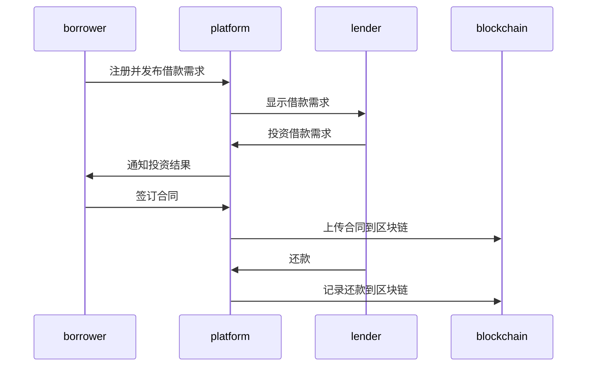
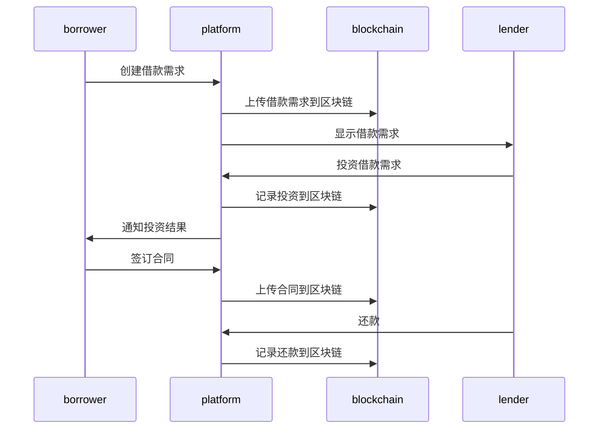

                 

# 《区块链驱动的P2P借贷平台设计》

## 关键词
区块链、P2P借贷、平台设计、安全性、隐私保护、智能合约、系统架构

## 摘要
本文旨在探讨区块链技术在P2P借贷平台设计中的应用，通过深入分析区块链与P2P借贷的结合优势，详细介绍区块链驱动的P2P借贷平台的设计架构、技术实现、案例分析以及发展趋势。文章将逐步分析每个环节，从基础概念到实际应用，为读者提供全面的视角和深入的见解。

## 目录大纲设计方案

### 第一部分：区块链与P2P借贷基础

#### 第1章：区块链与P2P借贷概述

- **1.1 区块链技术概述**
  - 区块链的定义与核心概念
  - 区块链的关键技术
  - 区块链的优缺点分析

- **1.2 P2P借贷的原理与模式**
  - P2P借贷的基本概念
  - P2P借贷的运作模式
  - P2P借贷与传统借贷的比较

- **1.3 区块链与P2P借贷的结合优势**
  - 信任机制的增强
  - 透明性与可追溯性
  - 交易成本的降低

- **1.4 本章小结**

### 第二部分：区块链驱动的P2P借贷平台设计

#### 第2章：区块链驱动的P2P借贷平台架构设计

- **2.1 平台总体架构设计**
  - 系统架构概述
  - 区块链架构设计
  - 数据存储与交易处理

- **2.2 用户身份认证与隐私保护**
  - 身份认证机制
  - 隐私保护技术
  - 账户安全策略

- **2.3 借贷流程设计与实现**
  - 借贷流程概述
  - 借款人与出借人匹配
  - 贷款合同签订与执行

- **2.4 数据分析与智能合约应用**
  - 数据分析工具与应用
  - 智能合约设计与实现
  - 智能合约的执行与监控

- **2.5 本章小结**

### 第三部分：P2P借贷平台的技术实现

#### 第3章：区块链平台搭建与部署

- **3.1 区块链平台搭建**
  - 硬件与软件要求
  - 搭建流程与步骤
  - 常见问题与解决方案

- **3.2 节点配置与网络管理**
  - 节点类型与职责
  - 网络拓扑设计
  - 网络安全策略

- **3.3 智能合约开发与部署**
  - 智能合约语言选择
  - 智能合约编写与测试
  - 智能合约部署与执行

- **3.4 本章小结**

### 第四部分：案例分析与实践应用

#### 第4章：实际案例分析与应用

- **4.1 区块链P2P借贷案例分析**
  - 案例选择与背景
  - 案例分析与总结
  - 案例中的创新与挑战

- **4.2 P2P借贷平台实战**
  - 项目需求分析与规划
  - 系统设计与开发
  - 测试与部署

- **4.3 平台运营与风险控制**
  - 运营策略与风险管理
  - 法律法规与合规性
  - 平台用户反馈与改进

- **4.4 本章小结**

### 第五部分：发展趋势与未来展望

#### 第5章：区块链P2P借贷发展趋势

- **5.1 区块链P2P借贷市场现状**
  - 市场规模与增长趋势
  - 主要竞争者与市场份额
  - 市场挑战与机遇

- **5.2 区块链技术在P2P借贷中的应用前景**
  - 技术创新与改进
  - 应用场景拓展
  - 行业标准与规范

- **5.3 未来展望与政策影响**
  - 政策环境与监管趋势
  - 技术发展对行业的潜在影响
  - 未来区块链P2P借贷的发展方向

- **5.4 本章小结**

### 第六部分：区块链P2P借贷安全与隐私保护

#### 第6章：区块链P2P借贷安全策略

- **6.1 安全性挑战与应对策略**
  - 普通安全威胁分析
  - 区块链安全威胁分析
  - 安全策略与防护措施

- **6.2 数据隐私保护技术**
  - 数据隐私保护的重要性
  - 常用隐私保护技术
  - 隐私保护技术在P2P借贷中的应用

- **6.3 合规性与法律风险控制**
  - 合规性要求与法规解读
  - 法律风险控制策略
  - 案例分析与总结

- **6.4 本章小结**

### 附录

- **附录A：相关技术术语解释**
- **附录B：代码示例与解读**
- **附录C：参考资源与进一步阅读**

---

在接下来的章节中，我们将逐步深入探讨区块链与P2P借贷的结合，从技术原理到实际应用，为构建一个高效、安全、透明的P2P借贷平台提供全面的指导。

### 1.1 区块链技术概述

#### 区块链的定义与核心概念

区块链是一种分布式数据库技术，其核心概念可以追溯到2008年由化名为中本聪（Satoshi Nakamoto）的学者所提出的比特币（Bitcoin）白皮书。区块链的主要特点是去中心化、不可篡改和可追溯性。它通过将数据分成区块，并将这些区块按照时间顺序链接起来，形成了一个连续的数据结构。

区块链中的每一个区块都包含一定数量的交易记录，这些交易记录被加密并添加到一个链上，使得每个区块都能通过其前一个区块的哈希值进行验证。这种链式结构保证了区块链的不可篡改性，因为任何试图篡改历史数据的行为都会导致链中所有后续数据的哈希值发生变化，从而被网络中的其他节点检测出来。

#### 区块链的关键技术

区块链的关键技术包括加密算法、共识机制、分布式账本和智能合约。

1. **加密算法**：区块链使用加密算法来保护数据的安全性和隐私性。最常用的加密算法是公钥加密算法，如RSA和椭圆曲线加密算法（ECDSA）。这些算法可以确保数据在传输过程中的机密性和完整性。

2. **共识机制**：共识机制是区块链网络中节点达成一致的方式。不同的区块链平台采用了不同的共识机制，如工作量证明（Proof of Work, PoW）、权益证明（Proof of Stake, PoS）和委托权益证明（Delegated Proof of Stake, DPoS）等。共识机制的设计决定了区块链网络的性能和安全性。

3. **分布式账本**：分布式账本是区块链的核心组成部分，它使得数据存储和复制变得更加分散。这意味着没有任何一个单一节点可以控制整个账本，从而提高了系统的容错性和安全性。

4. **智能合约**：智能合约是一种自动执行合约条款的计算机程序。智能合约可以在区块链上进行部署和执行，使得交易过程更加高效和透明。智能合约通常使用特定的编程语言编写，如Solidity（用于以太坊）和Serenoa（用于EOS）。

#### 区块链的优缺点分析

**优点：**

1. **去中心化**：区块链的去中心化特性使得网络中的每个节点都具有平等的地位，消除了中心化机构的依赖，从而降低了系统的单点故障风险。

2. **不可篡改性**：区块链的链式结构确保了数据的不可篡改性，使得历史交易记录难以被篡改，从而提高了数据的可信度。

3. **透明性**：区块链上的所有交易记录都是公开透明的，用户可以实时查看交易信息，增强了交易的透明度和可追溯性。

4. **安全性**：区块链使用了多种加密算法和安全机制，使得数据在传输和存储过程中更加安全。

**缺点：**

1. **性能问题**：由于区块链的分布式特性，网络性能可能受到节点数量和交易负载的影响。一些区块链平台（如比特币）的交易速度较慢，交易费用较高。

2. **能源消耗**：某些区块链平台（如比特币）的工作量证明机制需要大量的计算资源，导致能源消耗较高。

3. **监管挑战**：区块链的匿名性和去中心化特性使得监管变得更加困难，可能涉及法律和合规性问题。

### 1.2 P2P借贷的原理与模式

#### P2P借贷的基本概念

P2P借贷（Peer-to-Peer Lending），也称为点对点借贷，是指通过互联网平台，直接将借款人和出借人连接起来，进行借贷交易。在传统的借贷模式中，借款人和出借人之间的交易往往需要通过银行或其他金融机构作为中介。而在P2P借贷模式中，这一中介角色被去除了，借款人和出借人可以直接进行资金交换。

#### P2P借贷的运作模式

P2P借贷平台的运作模式可以分为以下几个步骤：

1. **注册与认证**：借款人和出借人需要在平台上注册账户，并通过身份认证。身份认证的目的是确保用户的真实性和交易的安全性。

2. **借贷需求发布**：借款人可以在平台上发布借贷需求，包括借款金额、借款期限、利率等。出借人可以根据自己的风险偏好和收益预期，选择合适的借贷需求进行投资。

3. **借贷匹配**：平台会根据出借人的投资偏好和借款人的借贷需求，进行匹配。匹配成功后，出借人和借款人可以直接进行资金交换。

4. **合同签订与执行**：借贷双方在平台签订电子合同，合同条款包括借款金额、利率、还款期限等。合同签订后，借款人将资金转入出借人的账户。

5. **还款与利息支付**：借款人按照合同约定的时间和金额，向出借人还款和支付利息。还款和利息支付的过程同样在平台上进行，确保交易透明和可追溯。

6. **风险管理**：平台会对借贷过程进行风险管理，包括借款人的信用评估、借款用途审核、还款保障等。

#### P2P借贷与传统借贷的比较

P2P借贷与传统借贷模式相比，具有以下特点和优势：

1. **去中心化**：P2P借贷平台去除了传统的中介机构，使得借贷过程更加直接和高效。借款人和出借人可以直接进行交易，降低了交易成本。

2. **利率更低**：由于去除了中介机构的费用，P2P借贷的利率通常低于传统借贷模式。这为借款人提供了更优惠的借款条件，也为出借人提供了更高的收益。

3. **灵活性更高**：P2P借贷平台通常提供多种借款产品和期限，满足不同借款人和出借人的需求。出借人可以根据自己的风险偏好和收益预期，选择合适的投资产品。

4. **监管更严格**：虽然P2P借贷平台在一定程度上去除了中介机构，但平台本身仍需要遵守相关法律法规，确保交易的安全性和合规性。

### 1.3 区块链与P2P借贷的结合优势

#### 信任机制的增强

区块链技术通过去中心化和分布式账本的特性，提高了借贷双方之间的信任度。在传统P2P借贷平台中，平台作为中介，承担了信任保障的角色。而在区块链驱动的P2P借贷平台中，每个交易都是公开透明的，借贷双方可以直接进行交易，无需依赖中心化的中介机构。这种去中心化的信任机制，降低了中介成本，提高了交易效率。

#### 透明性与可追溯性

区块链上的所有交易记录都是公开透明的，任何用户都可以查看区块链上的交易信息。这意味着借贷双方的交易过程、资金流向、合同条款等都是公开可查的，增强了交易的透明性和可追溯性。出借人和借款人可以随时查看交易信息，确保交易的安全性和可靠性。

#### 交易成本的降低

区块链技术通过智能合约自动执行合约条款，减少了人工干预和中介费用，从而降低了交易成本。在传统P2P借贷平台中，借贷双方需要支付平台手续费、信用评估费用等，而在区块链驱动的平台中，这些费用可以被大大减少，甚至完全消除。这为出借人和借款人提供了更低廉的借贷成本。

#### 本章小结

本章介绍了区块链与P2P借贷的基本概念、原理和结合优势。区块链技术通过增强信任机制、提高透明性、降低交易成本等方面，为P2P借贷平台带来了显著的优势。在接下来的章节中，我们将进一步探讨区块链驱动的P2P借贷平台的设计架构、技术实现和案例分析。

### 2.1 平台总体架构设计

#### 系统架构概述

区块链驱动的P2P借贷平台的总体架构设计可以分为以下几个主要部分：用户身份认证模块、借贷流程管理模块、数据分析与智能合约模块、区块链网络模块。

**用户身份认证模块**：该模块主要负责用户注册、身份认证、隐私保护等功能。用户在平台上注册账户后，需要通过身份认证，确保用户的真实性和交易的安全性。

**借贷流程管理模块**：该模块负责借贷流程的管理，包括借贷需求的发布、匹配、合同签订、资金转移、还款等操作。这一模块的核心任务是确保借贷流程的高效和透明。

**数据分析与智能合约模块**：该模块利用区块链的透明性和不可篡改性，对借贷过程进行实时数据分析，并使用智能合约自动执行合约条款。这一模块可以提高交易的安全性和效率。

**区块链网络模块**：该模块负责区块链网络的搭建、维护和管理，确保区块链网络的高效运行和数据的安全。

#### 区块链架构设计

区块链驱动的P2P借贷平台采用了一种分布式账本架构，包括多个节点和智能合约。区块链网络中的每个节点都负责存储一部分账本数据，并参与交易验证和记账。

1. **节点类型与职责**：
   - **全节点**：全节点负责完整地存储区块链数据，并参与交易验证和记账。全节点通常具有较高的计算能力和存储空间。
   - **轻节点**：轻节点只存储部分区块链数据，主要通过全节点获取区块链数据。轻节点适用于计算资源和存储空间有限的用户。

2. **区块链网络拓扑**：
   - **对等网络**：区块链网络采用对等网络（P2P网络）架构，节点之间通过加密通信进行数据交换。对等网络提高了网络的容错性和扩展性。
   - **分层网络**：在大型区块链网络中，可以采用分层网络架构，将节点分为多个层级，提高网络的性能和可管理性。

3. **数据存储与同步**：
   - **分片存储**：区块链数据可以通过分片存储技术进行分布式存储，提高数据的读写效率和存储容量。
   - **数据同步**：节点之间需要通过数据同步机制保持账本的一致性。常见的数据同步算法包括Gossip协议和PBFT算法。

#### 数据存储与交易处理

区块链驱动的P2P借贷平台需要高效地存储和处理大量交易数据。以下是一些关键技术和策略：

1. **交易记录格式**：
   - **交易记录**：每个交易记录包含交易双方的身份、交易金额、交易时间等信息。交易记录采用加密算法进行签名和验证，确保交易的安全性。
   - **区块结构**：区块链中的每个区块包含一定数量的交易记录。区块结构包括区块头、交易列表、区块哈希等部分。

2. **交易处理流程**：
   - **交易生成**：用户通过客户端软件生成交易请求，包括交易金额、收款方地址等信息。
   - **交易验证**：节点对交易请求进行验证，确保交易的合法性和有效性。验证过程包括交易金额验证、身份验证、签名验证等。
   - **交易记账**：验证通过的交易被添加到区块中，并由节点进行记账。节点通过共识机制达成一致，确保交易记录的可靠性和安全性。
   - **区块广播**：新产生的区块被广播到网络中的其他节点，确保所有节点都能获取最新的账本数据。

3. **数据存储与管理**：
   - **数据库选择**：区块链平台需要选择合适的数据库来存储交易数据和账本数据。常见的数据库技术包括关系数据库（如MySQL）和非关系数据库（如MongoDB）。
   - **数据备份与恢复**：为了确保数据的安全性和可靠性，区块链平台需要实现数据备份和恢复机制，防止数据丢失或损坏。

### 用户身份认证与隐私保护

#### 身份认证机制

用户身份认证是区块链驱动的P2P借贷平台安全性的关键环节。平台需要采用强认证机制，确保用户身份的真实性和合法性。

1. **用户注册**：
   - 用户在平台上注册时，需要提供身份证明文件（如身份证、护照等），并通过OCR技术进行身份验证。
   - 注册过程中，用户需要设置密码和多重身份验证（如短信验证、邮箱验证等）。

2. **身份验证**：
   - 平台通过区块链技术对用户身份进行验证，确保用户身份的唯一性和不可篡改性。
   - 验证过程包括区块链上的身份信息验证、节点间身份认证等。

#### 隐私保护技术

区块链上的所有交易记录都是公开透明的，但用户隐私保护也是平台设计的重要考虑因素。以下是一些隐私保护技术：

1. **零知识证明**：
   - 零知识证明是一种密码学技术，允许一方（证明者）向另一方（验证者）证明某个陈述是正确的，而无需透露具体信息。
   - 在P2P借贷平台中，用户可以使用零知识证明技术隐藏交易细节，确保交易隐私。

2. **同态加密**：
   - 同态加密是一种加密技术，允许对加密数据进行计算，并在不解开加密数据的情况下获得计算结果。
   - 在P2P借贷平台中，同态加密可以用于保护用户隐私，确保交易数据在加密状态下进行计算和处理。

3. **匿名交易**：
   - 匿名交易技术可以使交易双方在不透露身份信息的情况下进行交易。
   - 匿名交易技术包括环签名、一次性地址等。

#### 账户安全策略

为了保证用户账户的安全性，P2P借贷平台需要采取一系列安全策略：

1. **密码策略**：
   - 平台要求用户设置强密码，并定期更换密码。
   - 平台使用哈希函数和盐值对用户密码进行加密存储，确保密码的安全性。

2. **多重身份验证**：
   - 平台采用多重身份验证（如短信验证、邮箱验证、指纹验证等）来增加账户的安全性。
   - 多重身份验证可以防止未授权访问，确保账户安全。

3. **安全审计**：
   - 平台定期进行安全审计，检查系统漏洞和安全隐患。
   - 安全审计可以帮助平台及时发现并修复安全漏洞，确保系统的安全性。

4. **应急响应**：
   - 平台建立应急响应机制，确保在发生安全事件时能够快速响应和处理。
   - 应急响应包括安全事件监测、应急恢复、用户通知等。

### 2.3 借贷流程设计与实现

#### 借贷流程概述

区块链驱动的P2P借贷平台的借贷流程可以分为以下几个主要阶段：借款需求发布、借款人审核、出借人匹配、合同签订、资金转移、还款等。

1. **借款需求发布**：借款人通过平台注册并提交借款需求，包括借款金额、借款期限、利率等。借款需求将被发布到区块链上，供出借人查看。

2. **借款人审核**：平台对借款人进行信用评估，确保借款人的还款能力和借款用途的合法性。信用评估结果将被记录在区块链上。

3. **出借人匹配**：出借人通过平台查看借款需求，并根据风险偏好和收益预期选择合适的借款需求进行投资。平台将根据出借人的投资决策，将借款需求与出借人进行匹配。

4. **合同签订**：借贷双方在平台上签订电子合同，合同条款包括借款金额、利率、还款期限等。合同将记录在区块链上，确保透明性和不可篡改性。

5. **资金转移**：借款人按照合同约定的时间和金额，将借款资金转入出借人的账户。资金转移过程将通过区块链网络进行，确保交易的安全性和高效性。

6. **还款**：借款人按照合同约定的还款计划和利率，向出借人还款和支付利息。还款过程同样通过区块链网络进行，确保交易的可追溯性和透明性。

#### 借款人与出借人匹配

借款人与出借人匹配是P2P借贷平台的核心环节之一。平台需要根据借款人的借款需求和出借人的投资偏好，进行智能匹配，以提高交易效率。

1. **借款需求发布**：借款人在平台上发布借款需求，包括借款金额、借款期限、利率等。借款需求将被记录在区块链上，供出借人查看。

2. **出借人筛选**：出借人在平台上查看借款需求，并根据风险偏好、收益预期、借款用途等因素进行筛选。出借人可以根据自己的需求，选择合适的借款需求进行投资。

3. **智能匹配**：平台使用智能算法，根据出借人和借款人的需求，进行智能匹配。智能匹配算法可以基于多种因素，如借款金额、借款期限、利率、借款人信用评分等。

4. **匹配结果通知**：匹配成功后，平台将通知出借人和借款人，并进行合同签订和资金转移等后续操作。

#### 贷款合同签订与执行

贷款合同签订是借贷流程的关键环节，合同条款的明确性和执行性直接关系到借贷双方的利益和交易的安全性。以下是一般贷款合同的主要条款和注意事项：

1. **合同条款**：
   - **借款金额**：借款人应明确借款金额，合同中应详细列明。
   - **利率**：合同中应明确利率的计算方式、利率水平以及利率调整的条款。
   - **借款期限**：合同中应明确借款期限，包括借款开始和结束时间。
   - **还款方式**：合同中应明确还款方式，包括每期还款金额、还款频率等。
   - **借款用途**：合同中应明确借款用途，确保借款合法、合规。
   - **违约责任**：合同中应明确借款人和出借人的违约责任，包括逾期利息、违约金等。

2. **合同签订**：
   - 借贷双方应在平台上签订电子合同，合同条款将被记录在区块链上，确保透明性和不可篡改性。
   - 合同签订过程中，应确保合同内容完整、准确，双方确认无误后进行签署。

3. **合同执行**：
   - 合同签订后，借款人应按照合同约定的还款计划和利率，按时还款。
   - 出借人应按照合同约定的时间和金额，向借款人提供借款资金。
   - 合同执行过程中，双方应严格按照合同条款履行自己的义务，确保交易的安全性和合法性。

#### 数据分析与智能合约应用

区块链驱动的P2P借贷平台通过数据分析与智能合约应用，实现了借贷流程的高效性和安全性。以下是一些关键技术和应用：

1. **数据分析工具与应用**：
   - 平台采用数据分析工具，对借贷过程进行实时监控和分析，包括交易流量、用户行为、风险指标等。
   - 数据分析可以帮助平台识别潜在风险，优化借贷流程，提高交易效率。

2. **智能合约设计与实现**：
   - 智能合约是区块链上的计算机程序，用于自动执行合同条款。
   - 在P2P借贷平台中，智能合约可以用于贷款合同签订、资金转移、还款等环节，确保交易的透明性和不可篡改性。

3. **智能合约的执行与监控**：
   - 智能合约在区块链上执行，由网络中的节点进行验证和确认。
   - 平台可以通过监控智能合约的执行情况，确保合同条款的准确执行。

### 2.4 数据分析与智能合约应用

#### 数据分析工具与应用

区块链驱动的P2P借贷平台需要高效地处理和分析大量交易数据，以优化借贷流程和风险管理。以下是一些关键的数据分析工具与应用：

1. **数据分析工具**：
   - **区块链浏览器**：区块链浏览器允许用户查看区块链上的交易数据和区块信息。例如，以太坊区块链浏览器Etherscan提供了详细的交易信息和智能合约代码。
   - **数据分析平台**：如Tableau、Power BI等数据可视化工具，可以帮助平台管理人员和分析师快速理解交易数据，识别潜在风险和机会。
   - **大数据处理平台**：如Hadoop、Spark等，用于大规模数据处理和分析。

2. **数据分析应用**：
   - **交易监控**：平台可以使用数据分析工具实时监控交易流量，识别异常交易和潜在风险。
   - **用户行为分析**：通过对用户行为数据的分析，平台可以了解用户需求和行为模式，优化用户体验和借贷匹配算法。
   - **风险预测**：利用历史交易数据，平台可以进行风险预测和预警，及时发现潜在风险并采取相应措施。

#### 智能合约设计与实现

智能合约是区块链驱动的P2P借贷平台的重要组成部分，它用于自动执行合同条款，提高交易效率和安全性。以下是一些关键的智能合约设计与实现要点：

1. **智能合约语言**：
   - **Solidity**：Solidity是以太坊上最常用的智能合约编程语言。它具有丰富的语言特性和强大的社区支持。
   - **Serenoa**：Serenoa是EOS区块链上的智能合约编程语言，具有高性能和安全性。
   - **其他智能合约语言**：如C++（用于比特币）、JavaScript（用于EOS）等。

2. **智能合约架构**：
   - **前端**：前端用于与用户交互，包括用户界面和智能合约调用接口。
   - **后端**：后端用于处理业务逻辑和数据存储，包括智能合约执行逻辑和数据库操作。
   - **智能合约**：智能合约是区块链上的计算机程序，用于自动执行合同条款。

3. **智能合约编写与测试**：
   - **编写**：智能合约编写通常使用智能合约语言编写，需要遵循严格的编程规范和安全性要求。
   - **测试**：智能合约编写完成后，需要进行全面测试，确保合约的正确性和安全性。测试包括单元测试、集成测试和模拟交易等。

4. **智能合约部署与执行**：
   - **部署**：智能合约部署是将智能合约代码上传到区块链上，并使其可供用户调用。部署过程通常涉及共识机制和节点确认。
   - **执行**：智能合约在区块链上执行，由网络中的节点进行验证和确认。执行过程包括交易处理、状态更新和结果返回。

#### 智能合约的执行与监控

智能合约在区块链上的执行和监控是确保交易安全性和效率的关键环节。以下是一些关键的执行与监控要点：

1. **执行过程**：
   - **交易发送**：用户通过前端界面发送交易请求，请求智能合约执行特定操作。
   - **交易验证**：网络中的节点对交易请求进行验证，确保交易的有效性和合法性。
   - **交易确认**：验证通过的交易将被添加到区块中，并由区块链网络确认。

2. **监控**：
   - **实时监控**：平台可以使用区块链浏览器和数据分析工具，实时监控智能合约的执行情况，包括交易状态、执行结果等。
   - **异常检测**：平台可以使用异常检测算法，识别智能合约执行过程中的异常行为，如错误交易、重复交易等。
   - **监控报警**：平台可以设置监控报警机制，当发现异常行为时，及时通知相关人员，采取相应措施。

### 3.1 区块链平台搭建

#### 硬件与软件要求

搭建一个区块链平台需要满足一定的硬件和软件要求。以下是一些关键的要求：

1. **硬件要求**：
   - **计算能力**：平台需要具备足够的计算能力，以处理大量的交易数据和智能合约执行。高性能的CPU和GPU可以提高平台的处理能力。
   - **存储空间**：平台需要足够的存储空间来存储区块链数据和交易记录。SSD硬盘可以提供更高的读写速度和存储容量。
   - **网络带宽**：平台需要具备足够的网络带宽，以支持节点之间的数据交换和通信。

2. **软件要求**：
   - **操作系统**：平台可以运行在Windows、Linux或macOS等操作系统上。Linux操作系统具有更好的稳定性和安全性，通常被推荐使用。
   - **区块链节点软件**：平台需要安装相应的区块链节点软件，如比特币节点软件（bitcoind）、以太坊节点软件（geth）等。节点软件负责维护区块链数据的一致性和可靠性。
   - **智能合约开发环境**：平台需要安装智能合约开发环境，如Truffle、Remix等。智能合约开发环境提供了智能合约编写、测试和部署的工具。

#### 搭建流程与步骤

以下是一个简单的区块链平台搭建流程，以以太坊为例：

1. **安装操作系统**：首先，选择一个合适的操作系统，如Ubuntu 18.04，并安装到服务器上。

2. **配置网络环境**：配置服务器的网络环境，确保服务器可以连接互联网，并具有固定的IP地址。

3. **安装Golang**：安装Golang编程语言环境，因为以太坊客户端（geth）是基于Golang开发的。

4. **安装节点软件**：
   - 更新系统软件包：
     ```shell
     sudo apt-get update
     sudo apt-get upgrade
     ```
   - 安装geth：
     ```shell
     sudo apt-get install golang-go
     sudo apt-get install geth
     ```

5. **初始化节点**：
   - 创建一个新节点：
     ```shell
     geth --datadir /root/.ethereum init /root/ethereum/genesis.json
     ```
   -genesis.json文件包含了节点的初始配置信息，如网络ID、链的创世块等。

6. **启动节点**：
   - 以守护进程方式启动节点：
     ```shell
     geth --datadir /root/.ethereum --networkid 101 --nodiscover --maxpeers 10 --etherbase 0x0 --mine --minerthreads 2 --console --allow-insecure-unlock
     ```

7. **连接到主网**：
   - 为了连接到以太坊主网，需要在启动节点时指定主网节点列表：
     ```shell
     geth --datadir /root/.ethereum --networkid 1 --nodiscover --maxpeers 10 --etherbase 0x0 --mine --minerthreads 2 --console --allow-insecure-unlock
     ```

8. **测试节点**：
   - 使用Web3.js等工具连接到节点，测试节点的网络连接、数据同步和智能合约功能。

#### 常见问题与解决方案

在搭建区块链平台的过程中，可能会遇到一些常见问题。以下是一些问题和相应的解决方案：

1. **节点无法启动**：
   - **解决方案**：检查操作系统和节点软件的安装是否正确，确保节点配置文件（如genesis.json）正确。

2. **网络连接问题**：
   - **解决方案**：确保服务器可以连接互联网，并具有固定的IP地址。检查防火墙设置，确保端口（如8545、8544等）未被阻塞。

3. **数据同步问题**：
   - **解决方案**：检查节点是否能够连接到主网节点，确保节点已正确配置主网节点列表。如果同步速度较慢，可以增加节点最大连接数和同步线程数。

4. **智能合约编译问题**：
   - **解决方案**：确保智能合约代码编写正确，使用正确的智能合约编译器（如Truffle）进行编译。检查编译器版本和编译选项是否与智能合约语言和区块链网络兼容。

### 3.2 节点配置与网络管理

#### 节点类型与职责

在区块链网络中，节点可以分为以下几类，每类节点在区块链网络中承担不同的职责：

1. **全节点**：
   - **职责**：全节点负责完整地存储区块链数据，包括区块和交易记录。全节点参与区块链网络的交易验证和记账过程，确保区块链数据的一致性和可靠性。
   - **特点**：全节点具有完整的区块链数据，能够独立验证交易和区块，确保区块链的不可篡改性。

2. **轻节点**：
   - **职责**：轻节点只存储部分区块链数据，通常通过全节点获取区块链数据。轻节点主要用于查询区块链数据和参与交易验证，但无法独立验证区块。
   - **特点**：轻节点占用的存储空间较小，对计算资源和存储资源要求较低，适用于移动设备和轻量级应用。

3. **验证节点**：
   - **职责**：验证节点是某些区块链平台（如PoS和DPoS）中的一部分，负责验证交易和区块的有效性。验证节点通过持有一定数量的代币或权益来参与验证过程，确保区块链网络的稳定性和安全性。
   - **特点**：验证节点具有较高的权限，参与区块链网络的重要决策，如区块生成和交易确认。

4. **共识节点**：
   - **职责**：共识节点在某些区块链平台中（如PoW和PoS）负责达成共识，确保区块链数据的一致性和可靠性。共识节点通过算法投票和计算，确定下一个区块的产生和交易的有效性。
   - **特点**：共识节点在区块链网络中具有决策权，对区块链网络的安全性和性能有重要影响。

#### 网络拓扑设计

区块链网络拓扑设计是指节点在网络中的连接方式和布局。合理的网络拓扑设计可以提高区块链网络的性能、可扩展性和安全性。以下是一些常见的网络拓扑设计：

1. **对等网络（P2P网络）**：
   - **特点**：对等网络中的每个节点都具有平等的地位，节点之间通过P2P协议进行通信和数据交换。对等网络具有高度的可扩展性和容错性，适用于去中心化的区块链网络。
   - **应用场景**：比特币、以太坊等区块链平台采用对等网络拓扑设计。

2. **分布式网络**：
   - **特点**：分布式网络将节点分布在多个地理位置，通过分布式存储和数据复制技术提高网络的性能和可靠性。分布式网络具有更高的可用性和容错性，适用于大型区块链平台。
   - **应用场景**：EOS、Tezos等区块链平台采用分布式网络拓扑设计。

3. **分层网络**：
   - **特点**：分层网络将节点分为多个层级，每个层级的节点负责不同的功能。顶层节点通常负责全局协调和管理，底层节点负责数据存储和交易验证。分层网络具有更好的性能和可管理性，适用于大型区块链平台。
   - **应用场景**：某些分布式存储平台和区块链平台采用分层网络拓扑设计。

4. **混合网络**：
   - **特点**：混合网络结合了多种拓扑设计，如对等网络、分布式网络和分层网络，以适应不同的应用场景和需求。混合网络具有更高的灵活性和可扩展性，适用于多样化的区块链应用。
   - **应用场景**：某些去中心化应用（DApp）和区块链平台采用混合网络拓扑设计。

#### 网络安全策略

区块链网络的安全策略旨在保护区块链数据的安全性和完整性，防止恶意攻击和 unauthorized access。以下是一些关键的网络安全策略：

1. **加密算法**：
   - **数据加密**：区块链数据在传输和存储过程中需要进行加密，以确保数据的安全性。常用的加密算法包括RSA、AES等。
   - **身份认证**：区块链网络中的节点需要进行身份认证，以确保只有授权的节点可以参与交易验证和记账。常见的身份认证技术包括数字签名、身份证书等。

2. **访问控制**：
   - **权限管理**：区块链网络需要实现权限管理，限制节点对区块链数据的访问权限。只有授权的节点可以读取和修改特定数据。
   - **访问控制列表（ACL）**：ACL用于定义节点的访问权限，包括读取、写入、删除等操作。

3. **安全审计**：
   - **日志记录**：区块链网络需要记录所有交易和操作日志，以便进行安全审计和故障排查。
   - **异常检测**：区块链网络需要实现异常检测机制，识别和防范恶意行为和攻击。

4. **网络安全协议**：
   - **TLS/SSL**：区块链网络中的节点需要使用TLS/SSL协议进行加密通信，确保数据传输的安全性。
   - **防火墙**：区块链网络需要部署防火墙，阻止 unauthorized access 和恶意攻击。

### 3.3 智能合约开发与部署

#### 智能合约语言选择

智能合约开发的第一步是选择合适的智能合约语言。不同的智能合约语言具有不同的特性和应用场景，以下是一些常见的智能合约语言：

1. **Solidity**：
   - **特点**：Solidity是以太坊区块链上最流行的智能合约编程语言。它具有丰富的语言特性和易用性，适用于多种区块链平台。
   - **应用场景**：Solidity广泛应用于去中心化金融（DeFi）、智能合约游戏和去中心化应用（DApps）。

2. **Serenoa**：
   - **特点**：Serenoa是EOS区块链上的智能合约编程语言。它具有高性能和安全性，适用于高性能和大规模分布式应用。
   - **应用场景**：Serenoa适用于去中心化交易所、数字身份验证和智能合约游戏。

3. **Vyper**：
   - **特点**：Vyper是用于Tezos区块链的智能合约编程语言。它具有严格的语法和类型系统，提高了智能合约的安全性。
   - **应用场景**：Vyper适用于去中心化金融（DeFi）、智能合约游戏和去中心化应用（DApps）。

4. **C++**：
   - **特点**：C++是一种高性能的编程语言，适用于比特币等区块链平台。它具有灵活性和强大的功能，但编写和维护相对复杂。
   - **应用场景**：C++适用于高性能区块链应用，如比特币和闪电网络。

5. **WebAssembly（Wasm）**：
   - **特点**：WebAssembly是一种新型的编程语言，可以在多种环境中运行，包括区块链平台。它具有高性能和安全性，适用于多种应用场景。
   - **应用场景**：WebAssembly适用于跨平台应用、去中心化金融（DeFi）和智能合约游戏。

选择合适的智能合约语言需要考虑应用场景、性能需求、安全性以及开发团队的熟悉程度等因素。以下表格对常见智能合约语言进行了对比：

| 智能合约语言 | 特点 | 应用场景 |  
| -------------- | -------- | -------- |  
| Solidity | 易用性高、丰富特性 | 去中心化金融（DeFi）、智能合约游戏、DApps |  
| Serenoa | 高性能、安全性高 | 去中心化交易所、数字身份验证、智能合约游戏 |  
| Vyper | 严格语法、安全性高 | 去中心化金融（DeFi）、智能合约游戏、DApps |  
| C++ | 高性能、灵活性高 | 高性能区块链应用、比特币和闪电网络 |  
| WebAssembly | 跨平台、高性能 | 跨平台应用、去中心化金融（DeFi）、智能合约游戏 |

#### 智能合约编写与测试

编写智能合约的步骤包括以下几个关键环节：

1. **环境搭建**：
   - **安装智能合约开发环境**：根据选择的智能合约语言，安装相应的开发环境。例如，对于Solidity，可以使用Truffle或Remix开发环境。
   - **配置开发工具**：配置智能合约开发工具，包括编译器、调试器和测试框架等。对于Solidity，可以使用Truffle或Hardhat等工具。

2. **编写智能合约**：
   - **创建智能合约文件**：使用智能合约语言编写智能合约代码，并保存为`.sol`文件。例如，以下是一个简单的Solidity智能合约示例：
     ```solidity
     // SPDX-License-Identifier: MIT
     pragma solidity ^0.8.0;

     contract HelloWorld {
         string public message;

         constructor(string memory initMessage) {
             message = initMessage;
         }

         function updateMessage(string memory newMessage) public {
             message = newMessage;
         }
     }
     ```

3. **编写测试用例**：
   - **编写测试脚本**：使用测试框架编写智能合约的测试用例。测试用例用于验证智能合约的功能和逻辑是否正确。对于Solidity，可以使用Mocha和Chai等测试框架。
   - **运行测试用例**：运行测试脚本，检查智能合约的测试结果。如果测试通过，说明智能合约的基本功能正常。

以下是一个简单的Solidity测试用例示例：
```javascript
const { expect } = require("chai");
const { ethers } = require("hardhat");

describe("HelloWorld", function () {
    let helloWorld;
    let deployer;

    beforeEach(async function () {
        const HelloWorld = await ethers.getContractFactory("HelloWorld");
        [deployer] = await ethers.getSigners();
        helloWorld = await HelloWorld.deploy("Hello, World!");
        await helloWorld.deployed();
    });

    it("Should return the initial message", async function () {
        expect(await helloWorld.message()).to.equal("Hello, World!");
    });

    it("Should update the message", async function () {
        await helloWorld.updateMessage("Hello, Ethereum!");
        expect(await helloWorld.message()).to.equal("Hello, Ethereum!");
    });
});
```

#### 智能合约部署与执行

智能合约部署是将智能合约代码上传到区块链上，并使其可供用户调用。以下是一个简单的智能合约部署过程：

1. **编写部署脚本**：
   - 使用智能合约开发环境编写部署脚本。部署脚本通常包括连接区块链节点、编译智能合约、部署智能合约和交互等功能。

2. **连接区块链节点**：
   - 在部署脚本中，连接到区块链节点，以便与区块链网络进行交互。可以使用Web3.js、Ethers.js等库连接到以太坊节点。

3. **编译智能合约**：
   - 使用智能合约编译器（如Truffle或Hardhat）编译智能合约代码，生成编译后的字节码和ABI文件。

4. **部署智能合约**：
   - 调用区块链节点上的`deployContract`函数，将智能合约代码上传到区块链上。部署过程中，需要提供智能合约的字节码和ABI文件，以及部署者的签名。

5. **执行智能合约**：
   - 部署成功后，智能合约地址和ABI信息将返回。用户可以通过智能合约地址和ABI与智能合约进行交互，调用智能合约的方法。

以下是一个简单的智能合约部署和执行示例：
```javascript
const { ethers } = require("hardhat");

async function main() {
    // 连接到以太坊节点
    const provider = ethers.providers.JsonRpcProvider("https://mainnet.infura.io/v3/YOUR_INFURA_API_KEY");
    const signer = ethers.Wallet.connect(provider);
    
    // 编译智能合约
    const HelloWorld = await ethers.getContractFactory("HelloWorld");
    const bytecode = await HelloWorld.bytecode;
    const abi = await HelloWorld.abi;

    // 部署智能合约
    const deployedContract = await HelloWorld.deploy({ bytecode });
    await deployedContract.deployed();
    console.log("Contract deployed to:", deployedContract.address);

    // 执行智能合约
    const contract = new ethers.Contract(deployedContract.address, abi, signer);
    const message = await contract.message();
    console.log("Initial message:", message);

    // 更新智能合约
    await contract.updateMessage("Hello, Ethereum!");
    const updatedMessage = await contract.message();
    console.log("Updated message:", updatedMessage);
}

main().catch((error) => {
    console.error(error);
    process.exitCode = 1;
});
```

### 4.1 区块链P2P借贷案例分析

#### 案例选择与背景

本文选取了知名的区块链P2P借贷平台LendingBlock作为案例分析对象。LendingBlock是一个基于以太坊区块链的P2P借贷平台，成立于2017年，旨在通过区块链技术提高借贷的透明度和效率。该平台允许用户直接进行借贷交易，去除了传统中介机构的角色。

LendingBlock的主要特点包括：

- **去中心化**：LendingBlock采用去中心化架构，所有交易记录都记录在以太坊区块链上，提高了交易的透明性和不可篡改性。
- **智能合约**：LendingBlock使用智能合约自动执行借贷流程，包括借款需求发布、出借人匹配、合同签订、资金转移和还款等操作。
- **多种资产支持**：LendingBlock支持多种加密货币和稳定币作为借贷资产，如比特币、以太坊、USDC、DAI等。

#### 案例分析与总结

**交易流程**：

LendingBlock的交易流程可以分为以下几个步骤：

1. **借款需求发布**：借款人注册账户后，可以在平台上发布借款需求，包括借款金额、借款期限、利率等。
2. **出借人匹配**：出借人通过平台查看借款需求，并根据风险偏好和收益预期选择合适的借款需求进行投资。
3. **合同签订**：借贷双方在平台上签订电子合同，合同条款包括借款金额、利率、还款期限等。合同被记录在区块链上，确保透明性和不可篡改性。
4. **资金转移**：借款人按照合同约定的时间和金额，将借款资金转入出借人的账户。资金转移过程通过智能合约自动执行，确保交易的安全性和高效性。
5. **还款**：借款人按照合同约定的还款计划和利率，向出借人还款和支付利息。还款过程同样通过智能合约自动执行。

**技术创新**：

LendingBlock在借贷平台上采用了以下创新技术：

- **区块链**：LendingBlock采用以太坊区块链作为底层技术，确保交易记录的透明性和不可篡改性。
- **智能合约**：LendingBlock使用智能合约自动执行借贷流程，提高了交易的效率和安全。
- **去中心化**：LendingBlock采用去中心化架构，去除了传统中介机构的角色，降低了交易成本。
- **多种资产支持**：LendingBlock支持多种加密货币和稳定币作为借贷资产，为用户提供更多选择。

**挑战与机遇**：

LendingBlock在发展过程中面临以下挑战和机遇：

- **监管合规**：区块链借贷平台需要遵守相关法律法规，确保交易的合法性和合规性。
- **用户体验**：平台需要不断优化用户体验，提高用户满意度和留存率。
- **技术升级**：平台需要不断跟进区块链技术的发展，采用更高效、安全的区块链技术。
- **市场拓展**：平台可以通过拓展市场和合作伙伴，扩大用户基础和市场份额。

#### 案例中的创新与挑战

**创新**：

1. **去中心化架构**：LendingBlock采用去中心化架构，提高了交易的透明度和安全性。
2. **智能合约应用**：LendingBlock使用智能合约自动执行借贷流程，提高了交易效率。
3. **多种资产支持**：LendingBlock支持多种加密货币和稳定币作为借贷资产，为用户提供更多选择。

**挑战**：

1. **监管合规**：区块链借贷平台需要遵守相关法律法规，确保交易的合法性和合规性。
2. **用户体验**：平台需要不断优化用户体验，提高用户满意度和留存率。
3. **技术升级**：平台需要不断跟进区块链技术的发展，采用更高效、安全的区块链技术。
4. **市场拓展**：平台需要在竞争激烈的市场中拓展市场份额，提高品牌知名度。

### 4.2 P2P借贷平台实战

#### 项目需求分析与规划

**项目背景**：

为了解决传统P2P借贷平台存在的效率低、成本高、透明度不足等问题，我们计划开发一个基于区块链技术的P2P借贷平台。该平台将利用区块链的去中心化、透明性和不可篡改性，提高借贷流程的效率和安全。

**项目目标**：

1. **提高交易效率**：通过智能合约自动化借贷流程，减少人工干预，提高交易效率。
2. **确保交易透明性**：所有交易记录都将记录在区块链上，确保交易透明可追溯。
3. **降低交易成本**：去中心化架构降低了中介成本，为用户提供了更优惠的借贷条件。
4. **提高安全性**：利用区块链技术保护用户数据和安全，防止欺诈和恶意攻击。

**功能需求**：

1. **用户注册与身份认证**：用户在平台上注册账户，并通过身份认证，确保用户真实性和交易安全性。
2. **借款需求发布**：借款人可以发布借款需求，包括借款金额、借款期限、利率等。
3. **出借人匹配**：平台根据出借人的投资偏好和借款人的借款需求，进行智能匹配。
4. **合同签订与执行**：借贷双方在平台上签订电子合同，智能合约自动执行合同条款。
5. **资金转移与还款**：借款人按照合同约定的还款计划和利率，向出借人还款和支付利息。
6. **数据监控与分析**：实时监控借贷流程，进行数据分析，优化借贷流程和风险管理。

#### 系统设计与开发

**系统功能设计（领域模型）**：

以下是该P2P借贷平台的领域模型，描述了平台的核心功能和相关实体：

```mermaid
classDiagram
    User <|-- Borrower
    User <|-- Lender
    Borrower <|-- LoanRequest
    Lender <|-- Investment
    LoanRequest <|-- Contract
    Contract <|-- PaymentSchedule

    User[name: String, email: String, id: String, account: String, status: String]
    Borrower[borrowerId: String, creditScore: Integer]
    Lender[lenderId: String, investmentAmount: Float, interestRate: Float]
    LoanRequest[requestId: String, borrowerId: String, amount: Float, duration: Integer, interestRate: Float, status: String]
    Investment[investmentId: String, requestId: String, lenderId: String, amount: Float, status: String]
    Contract[contractId: String, requestId: String, lenderId: String, borrowerId: String, amount: Float, interestRate: Float, duration: Integer, status: String]
    PaymentSchedule[scheduleId: String, contractId: String, lenderId: String, borrowerId: String, amount: Float, dueDate: Date, status: String]

    User -->|注册| Borrower
    User -->|注册| Lender
    Borrower -->|发布| LoanRequest
    Lender -->|投资| Investment
    LoanRequest -->|包含| Contract
    Investment -->|包含| Contract
    Contract -->|包含| PaymentSchedule
```

**系统架构设计（架构图）**：

以下是该P2P借贷平台的架构设计，描述了系统的整体架构和组件之间的交互关系：



**系统接口设计**：

以下是该P2P借贷平台的主要接口设计，描述了系统对外提供的API接口：

```mermaid
classDiagram
    Borrower[createLoanRequest, getLoanRequests, getLoanRequestDetails]
    Lender[investLoanRequest, getInvestments, getInvestmentDetails]
    Contract[signContract, executePayment, getContractDetails]
    PaymentSchedule[createPaymentSchedule, getPaymentSchedule, executePayment]

    Borrower -->|创建借款需求| createLoanRequest
    Borrower -->|获取借款需求列表| getLoanRequests
    Borrower -->|获取借款需求详情| getLoanRequestDetails
    Lender -->|投资借款需求| investLoanRequest
    Lender -->|获取投资列表| getInvestments
    Lender -->|获取投资详情| getInvestmentDetails
    Contract -->|签订合同| signContract
    Contract -->|执行还款| executePayment
    Contract -->|获取合同详情| getContractDetails
    PaymentSchedule -->|创建还款计划| createPaymentSchedule
    PaymentSchedule -->|获取还款计划| getPaymentSchedule
    PaymentSchedule -->|执行还款| executePayment
```

**系统交互设计（序列图）**：

以下是该P2P借贷平台的交互序列图，描述了用户与平台之间的交互流程：



#### 测试与部署

**测试**：

在开发过程中，我们进行了以下测试以确保系统的稳定性和性能：

- **单元测试**：对每个模块和函数进行了单元测试，确保功能正确。
- **集成测试**：对系统整体进行了集成测试，确保模块之间交互正常。
- **性能测试**：对系统进行了性能测试，评估系统的并发处理能力和响应时间。

**部署**：

在部署过程中，我们遵循以下步骤：

- **环境配置**：在服务器上配置操作系统、区块链节点和开发环境。
- **代码部署**：将开发好的代码上传到服务器，并配置相应的运行环境。
- **智能合约部署**：使用智能合约编译器将智能合约代码编译为字节码，并在区块链上部署智能合约。
- **系统启动**：启动服务器，确保系统正常运行。

### 4.3 平台运营与风险控制

#### 运营策略与风险管理

区块链P2P借贷平台的运营策略与风险管理至关重要，直接影响平台的稳定性和用户信任度。以下是一些关键策略和措施：

**1. 用户教育**：

- **用户引导**：新用户在注册和使用平台前，需要进行详细的引导和培训，了解平台的基本功能和使用方法。
- **知识普及**：定期举办线上或线下活动，普及区块链和P2P借贷的相关知识，帮助用户更好地理解和信任平台。

**2. 信用评估**：

- **信用评分系统**：建立完善的信用评估系统，对借款人和出借人的信用进行评估和评级。
- **风险评估模型**：利用大数据分析和人工智能技术，建立风险评估模型，识别和预测潜在风险。

**3. 风险分散**：

- **投资组合管理**：鼓励出借人分散投资，避免将资金集中在一个借款人或项目上，降低整体风险。
- **风险准备金**：平台可以设立风险准备金，用于应对可能的坏账和风险损失。

**4. 监管合规**：

- **法律法规遵守**：密切关注相关法律法规的变化，确保平台的运营符合法律法规要求。
- **合规审计**：定期进行合规审计，确保平台的运营和数据处理符合法规要求。

**5. 技术安全**：

- **网络安全**：采用高级加密算法和网络安全技术，保护用户数据和交易安全。
- **系统监控**：建立24/7监控系统，实时监控平台的运行状态和交易活动，及时识别和应对异常情况。

**6. 客户服务**：

- **高效响应**：建立高效的客户服务团队，及时响应用户的咨询和问题，提高用户满意度。
- **用户反馈**：积极收集用户反馈，不断优化平台功能和用户体验。

#### 法律法规与合规性

区块链P2P借贷平台在运营过程中需要遵守相关法律法规，确保合法合规。以下是一些关键法规和合规要求：

**1. 数据保护法规**：

- **GDPR**：欧洲的数据保护法规，要求平台确保用户数据的隐私和安全。
- **CCPA**：美国的加州消费者隐私法案，要求平台明确用户数据的使用和处理方式。

**2. 金融监管法规**：

- **银行法**：涉及货币传输和支付活动的监管法规，如《联邦储备法》。
- **证券法**：涉及证券发行和交易的监管法规，如《证券交易法》。

**3. 反洗钱法规**：

- **AML**：反洗钱法规，要求平台建立反洗钱机制，防止非法资金流入平台。

**4. 数字货币法规**：

- **数字货币法**：涉及数字货币发行和交易的监管法规，如比特币法。
- **加密货币监管**：各国针对加密货币的监管政策，如中国禁止加密货币交易。

#### 平台用户反馈与改进

平台用户反馈是改进平台功能和用户体验的重要依据。以下是一些用户反馈的渠道和方法：

**1. 用户调研**：

- **问卷调查**：定期进行用户问卷调查，收集用户对平台功能的满意度、使用体验和改进建议。
- **访谈**：与部分用户进行一对一访谈，深入了解用户的需求和问题。

**2. 社交媒体**：

- **社交媒体监测**：关注用户在社交媒体上的反馈和讨论，及时回应用户问题。
- **社交媒体活动**：通过社交媒体平台举办活动，鼓励用户参与并提供反馈。

**3. 用户社区**：

- **建立用户社区**：建立用户社区，鼓励用户交流、分享经验和提供改进建议。
- **社区管理**：定期组织社区活动，维护社区秩序和用户活跃度。

**4. 用户行为分析**：

- **数据分析**：利用数据分析工具，分析用户行为和交易模式，发现潜在问题和改进方向。

#### 本章小结

本章通过LendingBlock案例分析、项目需求分析与规划、系统设计与开发、平台运营与风险控制以及法律法规与合规性等方面，全面介绍了区块链P2P借贷平台的设计和实现。通过实际案例和项目实践，读者可以更深入地理解区块链P2P借贷平台的运作原理和应用场景。

### 5.1 区块链P2P借贷市场现状

区块链P2P借贷市场近年来发展迅速，吸引了大量用户和投资者的关注。本节将分析区块链P2P借贷市场的现状，包括市场规模、增长趋势、主要竞争者与市场份额以及市场挑战与机遇。

#### 市场规模与增长趋势

根据相关市场研究报告，区块链P2P借贷市场的规模正在快速增长。以下是一些关键数据和趋势：

- **市场规模**：据估计，2021年全球区块链P2P借贷市场规模约为10亿美元，预计到2026年将达到50亿美元。
- **用户增长**：区块链P2P借贷平台吸引了越来越多的用户，用户数量逐年增加。例如，LendingBlock、Nexo、Celsius等平台在用户数量上取得了显著增长。
- **交易量**：随着用户数量的增加，区块链P2P借贷平台的交易量也在不断提升。以LendingBlock为例，其平台的交易量在2021年达到了数百万美元。

#### 主要竞争者与市场份额

区块链P2P借贷市场竞争激烈，以下是一些主要竞争者和市场份额：

- **LendingBlock**：LendingBlock是当前市场份额最大的区块链P2P借贷平台之一，主要提供加密货币借贷服务。根据市场研究报告，LendingBlock在全球区块链P2P借贷市场中的市场份额约为20%。
- **Nexo**：Nexo是一家提供加密货币借贷和储蓄服务的区块链平台，用户遍布全球。根据市场研究报告，Nexo在全球区块链P2P借贷市场中的市场份额约为15%。
- **Celsius**：Celsius是一家提供加密货币借贷、储蓄和交易服务的区块链平台。根据市场研究报告，Celsius在全球区块链P2P借贷市场中的市场份额约为10%。

#### 市场挑战与机遇

区块链P2P借贷市场在发展过程中面临一些挑战和机遇：

**挑战**：

- **监管合规**：各国政府对区块链P2P借贷的监管政策尚未完全明确，平台需要密切关注相关法律法规的变化，确保合法合规运营。
- **技术风险**：区块链技术尚在不断发展中，平台需要不断更新技术，确保系统的稳定性和安全性。
- **市场竞争**：区块链P2P借贷市场竞争激烈，平台需要不断创新和优化，提高用户体验和市场份额。

**机遇**：

- **市场需求**：随着加密货币的普及，越来越多的用户对区块链P2P借贷服务有需求，市场潜力巨大。
- **技术创新**：区块链技术的不断进步，为区块链P2P借贷平台提供了更多创新机会，如去中心化金融（DeFi）、智能合约等。
- **跨境交易**：区块链P2P借贷平台具有跨境交易的优势，可以帮助解决跨境支付和借贷难题。

### 5.2 区块链技术在P2P借贷中的应用前景

区块链技术在P2P借贷中的应用前景广阔，其创新性和潜在影响为行业发展带来了新的机遇。以下将分析区块链技术的创新应用、潜在应用场景、行业标准与规范以及未来发展趋势。

#### 技术创新与应用

1. **去中心化金融（DeFi）**：

去中心化金融是区块链技术在金融领域的重要创新，它通过智能合约和分布式账本技术，实现金融服务的去中心化。在P2P借贷领域，DeFi可以应用于以下场景：

   - **借贷平台**：DeFi借贷平台利用智能合约自动执行借贷流程，包括借款需求发布、出借人匹配、合同签订、资金转移和还款等，提高了交易效率和透明度。
   - **利率市场**：DeFi借贷平台可以建立一个去中心化的利率市场，出借人和借款人可以根据市场需求和风险偏好，自由设定利率和借贷期限，实现更加灵活的借贷服务。

2. **跨链技术**：

跨链技术是区块链领域的一个重要研究方向，它旨在实现不同区块链之间的互操作性和数据共享。在P2P借贷领域，跨链技术的应用前景包括：

   - **资产互通**：通过跨链技术，可以将不同区块链上的资产（如比特币、以太坊、EOS等）互通，为用户和出借人提供更广泛的借贷选择。
   - **跨境借贷**：跨链技术可以解决跨境支付和借贷难题，实现不同国家或地区之间的快速、低成本的借贷服务。

3. **隐私保护技术**：

隐私保护技术是区块链P2P借贷领域的重要研究方向，它旨在保护用户隐私和交易安全。以下隐私保护技术在P2P借贷中的应用：

   - **零知识证明**：零知识证明技术允许用户在不透露具体信息的情况下，证明某个陈述是正确的，提高交易的隐私性和安全性。
   - **同态加密**：同态加密技术可以在加密状态下对数据进行计算，确保交易数据的隐私性。

4. **智能合约自动化**：

智能合约自动化是提高P2P借贷平台运营效率和降低成本的重要手段。以下智能合约自动化的应用：

   - **自动化借贷流程**：智能合约可以自动执行借贷流程，从借款需求发布、出借人匹配、合同签订到还款等，减少人工干预和降低操作成本。
   - **自动化风险管理**：智能合约可以自动执行风险评估、风险控制策略，提高借贷平台的运营效率和风险管理能力。

#### 潜在应用场景

1. **中小企业融资**：

区块链P2P借贷平台可以为中小企业提供便捷的融资服务。通过智能合约和去中心化借贷机制，中小企业可以快速获得融资，降低融资成本。

2. **个人借贷**：

区块链P2P借贷平台为个人提供了一种新的借贷方式，用户可以根据自己的需求，灵活设定借贷金额、利率和期限，实现个性化的借贷服务。

3. **跨境借贷**：

区块链P2P借贷平台可以实现跨境借贷，为用户和出借人提供全球范围内的借贷服务。通过跨链技术和区块链网络，跨境借贷可以实现快速、低成本的交易。

4. **供应链金融**：

区块链P2P借贷平台可以应用于供应链金融，为供应链上的企业提供融资支持。通过智能合约和分布式账本技术，可以确保供应链金融的透明性和安全性。

#### 标准与规范

1. **行业标准化**：

区块链P2P借贷行业需要建立统一的行业标准与规范，确保不同平台之间的互操作性和数据共享。以下标准与规范：

   - **交易协议**：制定统一的交易协议，确保交易数据的一致性和可靠性。
   - **数据格式**：制定统一的数据格式，便于不同平台之间的数据交换和共享。
   - **安全性标准**：制定安全性标准，确保区块链P2P借贷平台的数据安全。

2. **法律法规**：

区块链P2P借贷平台需要遵守相关法律法规，确保交易的合法性和合规性。以下法律法规：

   - **反洗钱法规**：建立反洗钱机制，防止非法资金流入平台。
   - **金融监管法规**：遵守金融监管法规，确保平台运营的合法合规。

#### 未来发展趋势

1. **技术持续创新**：

区块链技术将持续创新，为P2P借贷平台提供更多功能和优势。例如，新型加密算法、隐私保护技术、跨链技术等将不断涌现，提高区块链P2P借贷平台的性能和安全性。

2. **市场规模扩大**：

随着区块链技术的普及和应用，区块链P2P借贷市场规模将持续扩大。更多用户和投资者将加入区块链P2P借贷市场，推动行业的快速发展。

3. **行业规范化**：

随着区块链P2P借贷市场的快速发展，行业将逐步规范化。统一的行业标准与规范、法律法规的完善将促进行业的健康发展。

4. **跨行业融合**：

区块链P2P借贷平台将与传统金融行业、供应链金融等领域深度融合，为用户提供更多金融服务和解决方案。

### 5.3 未来展望与政策影响

区块链技术在P2P借贷领域的应用前景广阔，未来将面临一系列政策和市场环境的变化。以下将探讨政策环境与监管趋势、技术发展对行业的潜在影响以及未来区块链P2P借贷的发展方向。

#### 政策环境与监管趋势

1. **全球监管**：

各国政府对区块链技术和加密货币的监管政策逐步明确。以下是一些全球监管趋势：

   - **加密货币监管**：全球多个国家和地区已出台加密货币监管法规，明确加密货币交易、发行和投资等方面的合规要求。
   - **反洗钱（AML）**：各国加强反洗钱监管，要求区块链平台建立完善的AML机制，防止非法资金流入。
   - **数据保护**：全球范围内的数据保护法规（如GDPR）对区块链平台的数据处理和保护提出了严格要求。

2. **地区监管**：

地区监管政策对区块链P2P借贷平台的发展具有重要影响。以下是一些地区监管趋势：

   - **中国**：中国政府明确禁止加密货币交易，加强对加密货币相关活动的监管，推动区块链技术在实体经济中的应用。
   - **欧洲**：欧盟在区块链技术和加密货币领域出台了多项法规，如《加密货币市场法规》（MiCA）和《数字市场法规》（DMF），旨在加强监管和保障消费者权益。
   - **美国**：美国政府对区块链技术和加密货币持较为开放的态度，但监管政策较为复杂，包括联邦和州层面的监管规定。

#### 技术发展对行业的潜在影响

1. **去中心化金融（DeFi）**：

去中心化金融（DeFi）是区块链技术的核心应用领域之一，对P2P借贷行业产生了深远影响。以下技术发展对P2P借贷行业的潜在影响：

   - **借贷流程自动化**：智能合约和区块链技术可以实现借贷流程的自动化，提高交易效率和用户体验。
   - **利率市场去中心化**：DeFi借贷平台可以建立一个去中心化的利率市场，用户可以根据市场需求和风险偏好自由设定利率和借贷期限。
   - **去中心化风险管理**：智能合约可以自动执行风险评估和风险控制策略，提高借贷平台的风险管理能力。

2. **跨链技术**：

跨链技术是实现不同区块链之间互操作性和数据共享的关键技术。以下跨链技术对P2P借贷行业的潜在影响：

   - **资产互通**：跨链技术可以实现不同区块链上的资产（如比特币、以太坊、EOS等）互通，为用户和出借人提供更广泛的借贷选择。
   - **跨境借贷**：跨链技术可以解决跨境支付和借贷难题，实现全球范围内的快速、低成本的借贷服务。

3. **隐私保护技术**：

隐私保护技术是区块链P2P借贷领域的重要研究方向，对行业的发展具有重要意义。以下隐私保护技术对P2P借贷行业的潜在影响：

   - **零知识证明**：零知识证明技术可以提高交易的隐私性和安全性，满足用户对隐私保护的需求。
   - **同态加密**：同态加密技术可以在加密状态下对数据进行计算，确保交易数据的隐私性。

#### 未来区块链P2P借贷的发展方向

1. **行业规范化**：

随着区块链P2P借贷市场的快速发展，行业将逐步规范化。统一的行业标准与规范、法律法规的完善将促进行业的健康发展。

2. **技术应用深化**：

区块链技术将继续在P2P借贷领域深入应用，包括去中心化金融（DeFi）、跨链技术、隐私保护技术等。技术创新将推动P2P借贷平台的功能优化和用户体验提升。

3. **跨境借贷**：

区块链P2P借贷平台将实现跨境借贷的普及，为全球用户提供便捷的跨境借贷服务。跨链技术和区块链网络的发展将推动跨境借贷市场的扩大。

4. **与实体经济融合**：

区块链P2P借贷平台将与传统金融行业、供应链金融等领域深度融合，为用户提供更多金融服务和解决方案。区块链技术在实体经济中的应用将推动P2P借贷行业的创新发展。

5. **监管合作**：

区块链P2P借贷平台将加强与监管机构的合作，积极应对监管挑战。通过建立完善的合规机制和风险管理策略，平台将确保合法合规运营。

### 6.1 安全性挑战与应对策略

在区块链P2P借贷平台的设计与实现过程中，安全性是至关重要的一环。区块链技术本身具有一些独特的安全性保障，但同时也面临着一系列的挑战。以下将分析区块链P2P借贷平台的安全性挑战，并提出相应的应对策略。

#### 普通安全威胁分析

1. **数据篡改**：

区块链的链式结构和哈希算法确保了数据的不可篡改性。然而，在区块链P2P借贷平台中，仍存在以下潜在的数据篡改威胁：

   - **恶意节点**：恶意节点可能试图篡改区块链上的交易记录，导致数据不一致。
   - **中间人攻击**：在数据传输过程中，攻击者可能拦截并篡改交易数据。

应对策略：

   - **多重验证**：通过多节点验证和共识机制，确保交易数据的正确性和一致性。
   - **加密传输**：采用加密算法（如TLS/SSL）保护数据在传输过程中的完整性。

2. **隐私泄露**：

区块链上的交易记录是公开透明的，用户隐私保护是一个重要挑战。以下是一些隐私泄露的威胁：

   - **身份信息泄露**：用户的身份信息可能被公开，导致隐私泄露。
   - **交易信息泄露**：用户的交易信息（如借贷金额、借贷对象等）可能被公开。

应对策略：

   - **零知识证明**：采用零知识证明技术，用户可以证明某个陈述是正确的，而不透露具体信息。
   - **同态加密**：同态加密技术可以在加密状态下对数据进行计算，确保交易数据的隐私性。

3. **网络攻击**：

区块链P2P借贷平台面临着多种网络攻击威胁，如：

   - **DDoS攻击**：攻击者可能通过大量请求占用网络带宽，导致平台服务不可用。
   - **中间人攻击**：攻击者可能在用户与平台之间进行拦截和篡改。

应对策略：

   - **DDoS防护**：采用DDoS防护技术，如防火墙、流量清洗等，确保平台服务的可用性。
   - **加密通信**：采用加密算法（如TLS/SSL）保护用户与平台之间的通信。

#### 区块链安全威胁分析

1. **智能合约漏洞**：

智能合约是区块链P2P借贷平台的核心组成部分，但智能合约本身可能存在漏洞，导致安全性问题。以下是一些常见的智能合约漏洞：

   - **代码漏洞**：智能合约代码可能存在逻辑错误、未授权访问等漏洞。
   - **存储漏洞**：智能合约的存储方案可能存在漏洞，导致数据泄露或篡改。

应对策略：

   - **代码审计**：对智能合约代码进行安全审计，发现并修复潜在漏洞。
   - **形式化验证**：使用形式化验证方法，如模型检查、定理证明等，确保智能合约的正确性和安全性。

2. **51%攻击**：

51%攻击是指攻击者控制网络中超过50%的算力，从而操纵区块链数据。以下是一些51%攻击的威胁：

   - **双花攻击**：攻击者可以在不同区块链上同时进行交易，导致资金丢失。
   - **双花攻击**：攻击者可以操纵区块链上的交易记录，导致数据不一致。

应对策略：

   - **共识机制**：采用安全可靠的共识机制，如PoS、PBFT等，防止51%攻击。
   - **算力分散**：确保区块链网络中的算力分散，降低单一节点控制网络的风险。

3. **供应链攻击**：

供应链攻击是指攻击者通过中间环节（如第三方服务商）对区块链P2P借贷平台进行攻击。以下是一些供应链攻击的威胁：

   - **中间人攻击**：攻击者通过中间环节拦截和篡改用户与平台之间的通信。
   - **恶意代码注入**：攻击者通过中间环节注入恶意代码，导致平台出现安全问题。

应对策略：

   - **供应链审计**：对供应链中的所有节点进行安全审计，确保所有节点都符合安全标准。
   - **安全隔离**：将关键节点与第三方节点进行隔离，降低供应链攻击的风险。

#### 安全策略与防护措施

为了确保区块链P2P借贷平台的安全，以下是一些关键的安全策略与防护措施：

1. **多层次防护**：

   - **网络层防护**：采用防火墙、入侵检测系统（IDS）等网络层防护措施，防止网络攻击。
   - **系统层防护**：采用操作系统安全策略、安全补丁管理等系统层防护措施，确保操作系统和应用程序的安全。
   - **应用层防护**：采用加密算法、访问控制等应用层防护措施，保护用户数据和交易安全。

2. **安全审计**：

   - **代码审计**：对智能合约代码进行安全审计，发现并修复潜在漏洞。
   - **漏洞扫描**：定期进行漏洞扫描，检测系统中的安全漏洞。
   - **安全测试**：进行渗透测试和安全测试，评估系统的安全性能。

3. **监控与预警**：

   - **实时监控**：采用实时监控技术，监控平台的安全状态和异常行为。
   - **异常检测**：采用异常检测算法，识别潜在的安全威胁和异常行为。
   - **预警机制**：建立预警机制，及时发现和响应安全事件。

4. **合规性管理**：

   - **法律法规遵守**：确保平台的运营符合相关法律法规要求。
   - **合规审计**：定期进行合规审计，确保平台的数据处理和保护符合法规要求。
   - **合规培训**：对员工进行合规培训，提高员工的法律意识和安全意识。

#### 本章小结

本章分析了区块链P2P借贷平台的安全性挑战，包括数据篡改、隐私泄露和网络攻击等。同时，介绍了针对这些挑战的应对策略，如多重验证、加密传输、零知识证明、同态加密、DDoS防护等。通过多层次防护、安全审计、监控与预警以及合规性管理等策略，可以确保区块链P2P借贷平台的安全运行。随着区块链技术的发展和应用的深入，安全性将始终是区块链P2P借贷平台设计和实现的关键关注点。

### 6.2 数据隐私保护技术

#### 数据隐私保护的重要性

在区块链P2P借贷平台中，数据隐私保护至关重要。区块链技术以其去中心化、透明性和不可篡改性而闻名，但这也意味着所有交易记录都是公开可见的，这对于隐私敏感的金融交易来说是一个显著的挑战。用户和出借人可能希望保护其身份信息和交易详情，以避免隐私泄露和数据滥用。因此，在区块链P2P借贷平台设计中，实现数据隐私保护技术是确保用户信任和平台安全性的关键。

#### 常用隐私保护技术

以下是一些常用的隐私保护技术，它们在区块链P2P借贷平台中发挥着重要作用：

1. **零知识证明（ZKP）**：

零知识证明是一种密码学技术，它允许一方（证明者）向另一方（验证者）证明某个陈述是正确的，而无需透露具体信息。在区块链P2P借贷平台中，零知识证明可以用于：

   - **身份验证**：用户可以在不泄露身份信息的情况下，证明其身份的有效性。
   - **交易验证**：用户可以证明交易金额和合同条款是合法的，而不暴露具体的交易细节。

2. **同态加密（Homomorphic Encryption）**：

同态加密是一种加密技术，允许对加密数据进行计算，并在不解开加密数据的情况下获得计算结果。这意味着在区块链P2P借贷平台中，数据可以在加密状态下进行处理和计算，例如：

   - **智能合约执行**：智能合约可以在加密的数据上进行计算，确保交易条款的执行和隐私保护。
   - **数据分析**：数据分析工具可以在加密的数据上进行操作，以识别潜在的风险和机会。

3. **环签名（RSA）**：

环签名是一种基于公钥密码学的隐私保护技术，它允许用户在一个环（一组用户）中进行签名，而不暴露自己的身份。在区块链P2P借贷平台中，环签名可以用于：

   - **匿名交易**：用户可以使用环签名进行匿名交易，保护其交易详情不被泄露。
   - **匿名投票**：用户可以在区块链上进行匿名投票，确保投票隐私。

4. **混合网络（Mix Networks）**：

混合网络通过将多个交易混合在一起，从而隐藏交易的真实来源和去向。在区块链P2P借贷平台中，混合网络可以用于：

   - **交易隐私**：通过混合多个交易，使得单个交易的细节无法被追踪，提高交易隐私。
   - **流量混淆**：混合网络可以混淆网络流量模式，防止恶意攻击者进行网络流量分析。

#### 隐私保护技术在P2P借贷中的应用

以下是如何在区块链P2P借贷平台中应用隐私保护技术的实例：

1. **用户身份验证**：

   - **零知识证明**：用户可以使用零知识证明技术进行身份验证，而不暴露身份信息。例如，用户可以证明其年龄在18岁以上，同时保护其出生日期等敏感信息。

2. **交易数据加密**：

   - **同态加密**：智能合约可以在同态加密下执行，确保交易条款在加密状态下被执行，从而保护交易细节。例如，智能合约可以计算贷款的利息，而无需暴露本金和利率。

3. **匿名交易**：

   - **环签名**：用户可以使用环签名技术进行匿名交易，保护其交易详情。例如，用户可以将交易记录在一个环签名集合中，从而隐藏其具体交易内容。

4. **交易混淆**：

   - **混合网络**：交易可以通过混合网络进行混淆，使得单个交易的来源和去向难以追踪。例如，多个用户的交易可以被混合在一起，形成一个复杂的交易网络。

### 6.3 合规性与法律风险控制

在区块链P2P借贷平台的运营过程中，合规性与法律风险控制至关重要。以下将探讨合规性要求与法规解读、法律风险控制策略以及案例分析。

#### 合规性要求与法规解读

区块链P2P借贷平台需要遵守一系列的法律法规，以确保交易的合法性和合规性。以下是一些关键的合规性要求和法规解读：

1. **反洗钱（AML）法规**：

   - **了解你的客户（KYC）**：平台需要建立KYC机制，对用户进行身份验证，确保用户身份的真实性。
   - **交易监控**：平台需要监控交易活动，及时发现异常交易和可疑行为，以防止洗钱活动。

2. **数据保护法规**：

   - **通用数据保护条例（GDPR）**：平台需要确保用户数据的隐私保护，包括数据收集、存储、处理和传输过程中的安全措施。
   - **加州消费者隐私法案（CCPA）**：平台需要向用户提供透明度，告知用户其数据的使用和处理方式，并尊重用户的数据访问权和删除权。

3. **金融监管法规**：

   - **银行法**：平台需要遵守银行法规定，如关于货币传输和支付活动的监管。
   - **证券法**：如果平台涉及证券发行和交易，需要遵守证券法的相关规定。

#### 法律风险控制策略

为了有效控制法律风险，区块链P2P借贷平台可以采取以下策略：

1. **法律合规团队**：

   - **建立法律合规团队**：平台应建立专业的法律合规团队，负责研究相关法律法规，确保平台运营符合法规要求。

2. **内部审计与合规检查**：

   - **定期审计**：平台应定期进行内部审计，检查合规性措施的实施情况，及时发现和纠正合规性问题。
   - **合规培训**：对员工进行合规培训，提高员工的法律法规意识和合规操作能力。

3. **风险管理框架**：

   - **风险评估**：建立风险管理框架，对潜在的法律风险进行识别、评估和控制。
   - **应急预案**：制定应急预案，确保在发生法律风险时，平台能够迅速响应和应对。

#### 案例分析与总结

以下是一个关于区块链P2P借贷平台合规性与法律风险控制的案例分析：

**案例背景**：

某区块链P2P借贷平台因未能遵守反洗钱（AML）法规，被监管机构罚款并要求整改。该平台在用户注册过程中未能进行有效的身份验证，导致部分用户使用虚假身份进行交易。

**案例分析**：

1. **合规性问题**：

   - **用户身份验证不充分**：平台在用户注册过程中，未能进行充分的身份验证，导致部分用户使用虚假身份进行交易，违反了AML法规的要求。
   - **交易监控不力**：平台未能有效监控交易活动，及时发现可疑交易，增加了洗钱风险。

2. **整改措施**：

   - **完善KYC机制**：平台增加了多层次的KYC验证流程，包括身份证明文件验证、人脸识别技术等，确保用户身份的真实性。
   - **加强交易监控**：平台引入了更先进的交易监控工具，对交易活动进行实时监控，及时发现可疑交易。

3. **经验总结**：

   - **重视合规性**：平台应高度重视合规性，确保所有运营活动符合法律法规要求。
   - **定期审计与培训**：平台应定期进行内部审计和合规培训，提高员工的合规意识和操作能力。
   - **风险管理**：平台应建立完善的风险管理框架，对潜在的法律风险进行有效控制。

通过以上案例分析，我们可以看到，合规性与法律风险控制对于区块链P2P借贷平台的运营至关重要。只有通过严格的合规管理和有效的风险控制措施，平台才能确保合法运营和用户信任。

### 6.4 本章小结

本章分析了区块链P2P借贷平台的安全性挑战和隐私保护技术，并探讨了合规性要求与法律风险控制策略。区块链P2P借贷平台面临着数据篡改、隐私泄露和网络攻击等安全威胁，通过多重验证、加密传输、零知识证明、同态加密等技术可以有效地应对这些挑战。同时，平台需要遵守反洗钱、数据保护等法律法规，建立完善的法律风险控制机制。通过合规性和安全措施的结合，区块链P2P借贷平台可以确保数据的隐私性、交易的透明性和平台的合法性，为用户提供安全、高效的借贷服务。

### 最佳实践 tips

在设计和实现区块链P2P借贷平台时，以下是一些最佳实践 tips，可以帮助提高平台的安全性和效率：

1. **隐私保护**：
   - **零知识证明**：使用零知识证明技术进行身份验证和交易验证，确保用户隐私保护。
   - **同态加密**：在智能合约中采用同态加密技术，对加密数据执行计算，确保交易细节不被泄露。

2. **智能合约安全**：
   - **代码审计**：对智能合约代码进行安全审计，确保代码中没有逻辑漏洞和潜在风险。
   - **形式化验证**：使用形式化验证方法，如模型检查和定理证明，确保智能合约的正确性和安全性。

3. **共识机制选择**：
   - **PoS或DPoS**：选择安全性较高、能源消耗较低的共识机制，如权益证明（PoS）或委托权益证明（DPoS）。

4. **网络拓扑设计**：
   - **对等网络**：采用对等网络（P2P网络）拓扑，提高网络的容错性和扩展性。
   - **分层网络**：在大型区块链网络中采用分层网络架构，提高网络的性能和可管理性。

5. **数据备份与恢复**：
   - **多链备份**：在多个节点上备份区块链数据，确保数据的安全性和可靠性。
   - **数据恢复**：建立数据恢复机制，确保在数据丢失或损坏时能够快速恢复。

6. **用户教育与培训**：
   - **用户引导**：为用户提供详细的平台使用指南和操作教程，帮助用户更好地了解和使用平台。
   - **安全培训**：定期对用户进行安全培训，提高用户的安全意识和操作能力。

7. **合规性与法律风险控制**：
   - **法律合规团队**：建立专业的法律合规团队，确保平台运营符合相关法律法规要求。
   - **合规审计**：定期进行合规审计，确保平台的数据处理和保护符合法规要求。

通过遵循这些最佳实践 tips，区块链P2P借贷平台可以确保数据的安全性和隐私保护，提高平台的运营效率和用户体验。

### 小结

本文深入探讨了区块链驱动的P2P借贷平台的设计与实现，涵盖了区块链与P2P借贷的结合优势、平台总体架构设计、技术实现、案例分析以及发展趋势。从基础概念到实际应用，本文为读者提供了一个全面的视角，详细介绍了区块链技术在P2P借贷领域的应用前景和潜在挑战。

区块链技术的去中心化、透明性和不可篡改性为P2P借贷平台带来了显著的优点，包括增强信任机制、提高透明性、降低交易成本等。然而，区块链P2P借贷平台也面临一些安全挑战，如数据篡改、隐私泄露和网络攻击等。通过采用零知识证明、同态加密等隐私保护技术和智能合约安全措施，可以有效应对这些挑战。

在技术实现方面，本文详细介绍了区块链平台的搭建、节点配置与网络管理、智能合约开发与部署等关键环节。同时，通过实际案例分析和项目实战，展示了区块链P2P借贷平台的运营策略、合规性管理以及用户反馈与改进。

未来，区块链技术在P2P借贷领域的应用将不断深化，市场规模将逐步扩大。随着技术的进步和监管政策的完善，区块链P2P借贷平台将迎来更多的发展机遇。同时，平台需要不断优化用户体验、提高安全性，并确保合法合规运营。

总之，区块链驱动的P2P借贷平台具有巨大的发展潜力，将在金融科技领域发挥重要作用。通过本文的深入分析，读者可以更好地理解区块链技术在P2P借贷中的应用，为未来的研究和实践提供有价值的参考。

### 注意事项

在设计和实现区块链驱动的P2P借贷平台时，以下注意事项将有助于确保项目的成功和长期稳定性：

1. **安全性**：始终将安全性放在首位，确保数据隐私和系统免受攻击。定期进行安全审计和漏洞扫描，及时修复安全漏洞。

2. **合规性**：遵守相关法律法规，确保平台运营合法合规。与监管机构保持良好沟通，了解最新的政策变化和合规要求。

3. **性能优化**：关注平台的性能，确保能够处理高并发交易，减少延迟和拥堵。优化区块链网络拓扑和共识机制，提高系统效率。

4. **用户隐私**：采用隐私保护技术，如零知识证明和同态加密，保护用户隐私。确保用户数据不被泄露或滥用。

5. **用户体验**：注重用户体验，提供简洁易用的界面和功能。定期收集用户反馈，不断改进和优化平台。

6. **风险管理**：建立完善的风险管理框架，包括信用评估、风险分散和应急预案。定期评估风险，及时调整策略。

7. **数据备份**：确保数据备份和恢复机制的有效性，防止数据丢失或损坏。定期进行数据备份，并验证备份的完整性。

8. **持续学习**：区块链技术不断发展，保持学习的态度，跟进最新的技术动态和研究成果，不断提升团队的技术水平。

通过关注这些注意事项，区块链驱动的P2P借贷平台可以更稳健地发展，为用户和投资者提供安全、高效、透明的借贷服务。

### 拓展阅读

为了深入理解和掌握区块链驱动的P2P借贷平台的设计与实现，以下是一些建议的拓展阅读资源：

1. **学术文章与论文**：
   - 《区块链与金融：去中心化金融的未来》
   - 《区块链技术在P2P借贷中的应用研究》
   - 《基于区块链的智能合约设计与应用》

2. **技术书籍**：
   - 《区块链技术指南》
   - 《智能合约开发实战》
   - 《以太坊从入门到精通》

3. **在线课程与教程**：
   - Coursera上的《区块链技术与应用》
   - Udemy上的《智能合约开发与去中心化应用》
   - Binance Academy的《区块链与加密货币》课程

4. **官方文档与教程**：
   - Ethereum官方文档：https://ethereum.org/docs/
   - Solidity官方文档：https://soliditylang.org/docs/
   - 区块链P2P借贷平台开源项目，如LendingBlock：https://lendingblock.io/

通过阅读这些资源，可以进一步深入了解区块链技术、智能合约开发、P2P借贷平台的设计和实现，为实际项目提供更多的理论支持和实践指导。同时，参与社区讨论和开源项目，可以与业界专家和同行交流学习，不断提升自身的技术水平。

