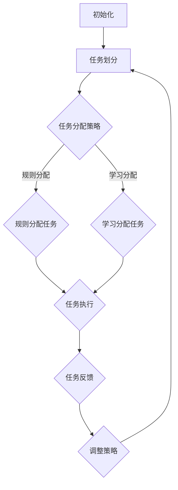
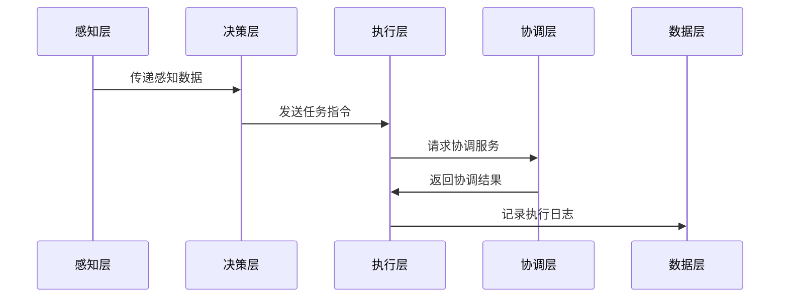
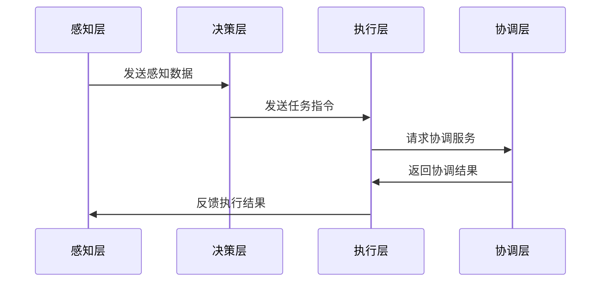

                 

### 关键词

- 协作型多智能体AI Agent
- LLM（大型语言模型）
- 任务协调
- 分工优化
- 算法原理
- 系统设计与实现

### 摘要

本文深入探讨协作型多智能体AI Agent中，LLM（大型语言模型）如何实现高效的任务协调与分工。首先，我们介绍协作型多智能体AI Agent的基本概念、LLM的作用及其在任务协调中的重要性。接着，详细解释LLM和多智能体系统的核心概念与联系，并通过ER实体关系图展示它们之间的互动。随后，我们阐述任务协调与分工的算法原理，使用mermaid流程图和Python代码进行清晰阐述。文章进一步描述一个具体的系统设计与实现，涵盖系统架构、接口设计和交互序列图。通过环境安装指南、核心代码解读和实际案例剖析，我们展示如何在实际项目中应用这些技术。最后，总结最佳实践和注意事项，并推荐拓展阅读。

### 目录大纲设计思路

设计一本关于《协作型多智能体AI Agent：LLM间的任务协调与分工》的目录大纲，我们遵循以下步骤：

1. **明确目标读者**：目标读者是希望提升AI领域专业技能的技术人员和研究生，他们需要深入了解协作型多智能体AI Agent的工作原理和应用。

2. **章节内容的组织**：将内容分为四个主要部分：背景介绍、核心概念与联系、算法原理讲解、系统设计与实现。

3. **章节内容细化**：确保每个部分都有明确的主题和目标，如背景介绍中的问题背景、概念说明、LLM的作用等。

4. **遵循markdown格式**：使用markdown格式确保目录结构清晰，内容易读。

5. **保证内容的完整性**：在每个章节中，提供必要的概念解释、数学模型、算法原理、系统设计和实战案例。

### 目录大纲设计步骤

1. **背景介绍**：介绍协作型多智能体AI Agent的基本概念、LLM的作用及其在任务协调与分工中的重要性。

2. **核心概念与联系**：解释LLM、多智能体系统等关键概念，并通过表格和ER实体关系图展示它们之间的关系。

3. **算法原理讲解**：详细讲解任务协调与分工的算法原理，使用mermaid流程图和Python代码进行阐述。

4. **系统设计与实现**：描述系统架构、接口设计和交互序列图，提供环境安装指南和核心代码解读。

5. **实战应用**：结合实际案例，展示如何在项目中应用这些技术。

6. **最佳实践与拓展**：总结要点，提供实用技巧和拓展阅读。

### 目录大纲示例

----------------------------------------------------------------
# 第一部分: 背景介绍

## 1.1 协作型多智能体AI Agent概述
### 1.1.1 问题背景
### 1.1.2 问题描述
### 1.1.3 解决方案
### 1.1.4 边界与外延

## 1.2 LLM的基本概念与作用
### 1.2.1 LLM的定义
### 1.2.2 LLM的工作原理
### 1.2.3 LLM的应用场景

## 1.3 多智能体系统简介
### 1.3.1 多智能体系统的定义
### 1.3.2 多智能体系统的类型
### 1.3.3 多智能体系统在AI中的应用

## 1.4 任务协调与分工的重要性
### 1.4.1 协作效率的提升
### 1.4.2 任务分配的优化
### 1.4.3 协作风险的降低

## 1.5 本章小结

----------------------------------------------------------------

# 第二部分: 核心概念与联系

## 2.1 LLM与多智能体系统的关系
### 2.1.1 LLM在多智能体系统中的作用
### 2.1.2 多智能体系统对LLM的优化需求

## 2.2 核心概念原理
### 2.2.1 LLM的核心原理
#### 2.2.1.1 语言模型的基本概念
#### 2.2.1.2 语言模型的训练过程
### 2.2.2 多智能体系统的核心原理
#### 2.2.2.1 多智能体系统的基本概念
#### 2.2.2.2 多智能体系统的交互机制

## 2.3 概念属性特征对比表格

## 2.4 ER实体关系图架构
### 2.4.1 LLM的ER图
### 2.4.2 多智能体系统的ER图

----------------------------------------------------------------

# 第三部分: 算法原理讲解

## 3.1 任务协调与分工算法概述
### 3.1.1 任务协调算法
### 3.1.2 任务分工算法

## 3.2 算法流程图
### 3.2.1 协作型多智能体AI Agent的算法流程图

## 3.3 算法原理讲解
### 3.3.1 任务协调算法原理
#### 3.3.1.1 数学模型与公式
#### 3.3.1.2 Python代码实现
### 3.3.2 任务分工算法原理
#### 3.3.2.1 数学模型与公式
#### 3.3.2.2 Python代码实现

----------------------------------------------------------------

# 第四部分: 系统设计与实现

## 4.1 协作型多智能体AI Agent的系统架构
### 4.1.1 系统架构概述
### 4.1.2 系统功能模块
### 4.1.3 系统架构图

## 4.2 系统接口设计
### 4.2.1 接口规范
### 4.2.2 接口实现

## 4.3 系统交互序列图
### 4.3.1 交互流程
### 4.3.2 序列图示例

## 4.4 系统实现与实战应用
### 4.4.1 环境安装指南
### 4.4.2 系统核心实现源代码
### 4.4.3 代码解读与分析
### 4.4.4 实际案例剖析

## 4.5 项目小结
### 4.5.1 项目成果
### 4.5.2 项目反思

----------------------------------------------------------------

# 第一部分：背景介绍

## 1.1 协作型多智能体AI Agent概述

### 1.1.1 问题背景

在当今复杂且多变的应用场景中，单智能体AI已经难以应对日益复杂的任务需求。因此，协作型多智能体AI Agent逐渐成为人工智能领域的研究热点。协作型多智能体AI Agent是由多个独立智能体组成的系统，这些智能体之间能够通过协作完成复杂的任务。它们可以应用于自动驾驶、智能物流、医疗诊断等多个领域，极大地提高了任务完成效率和系统适应性。

### 1.1.2 问题描述

在协作型多智能体AI Agent中，如何实现智能体之间的任务协调与分工成为一个关键问题。具体来说，问题可以分为以下几个方面：

1. **任务分配**：如何将复杂的任务分配给不同的智能体，使得每个智能体都能发挥其优势？
2. **任务协调**：智能体在执行任务过程中可能遇到各种不确定性因素，如何保证智能体之间的协作顺畅，及时调整任务分配？
3. **任务分工**：智能体之间的任务分配不是静态的，而是需要根据任务执行情况和环境变化动态调整。

### 1.1.3 解决方案

为了解决上述问题，研究者们提出了多种协作型多智能体AI Agent的设计方案。这些方案主要分为以下几个方面：

1. **中心化控制**：通过一个中央控制器来协调智能体之间的任务分配和执行。
2. **分布式控制**：智能体之间通过协商和通信来共同决定任务分配和执行。
3. **基于规则的协作**：使用预定义的规则来指导智能体之间的协作。
4. **基于学习的方法**：通过机器学习算法来优化智能体之间的协作策略。

### 1.1.4 边界与外延

协作型多智能体AI Agent的研究边界包括以下几个方面：

1. **智能体数量与规模**：智能体数量的多少和系统的规模直接影响协作效率，需要找到合适的平衡点。
2. **通信机制**：智能体之间的通信机制对协作效果有重要影响，需要设计高效、可靠的通信方式。
3. **动态性**：在动态环境中，智能体之间的协作策略需要能够快速调整以适应变化。

### 1.1.5 概念结构与核心要素组成

协作型多智能体AI Agent的基本概念结构包括以下几个核心要素：

1. **智能体**：执行任务的个体，可以是计算机程序、机器人等。
2. **任务**：需要完成的任务，可以是具体的操作、决策等。
3. **协作机制**：智能体之间通过协作机制来完成任务的分配和执行。
4. **环境**：智能体执行任务的环境，可能包括物理环境和虚拟环境。

## 1.2 LLM的基本概念与作用

### 1.2.1 LLM的定义

LLM（Large Language Model），即大型语言模型，是一种基于深度学习技术的自然语言处理模型。它通过学习大量文本数据，能够理解和生成自然语言，完成文本分类、翻译、问答等任务。LLM通常由多个神经网络层组成，具有强大的表征能力和生成能力。

### 1.2.2 LLM的工作原理

LLM的工作原理主要包括以下几个步骤：

1. **数据预处理**：将原始文本数据进行清洗、分词、编码等处理，转换为神经网络可以处理的输入格式。
2. **模型训练**：使用大量的文本数据进行模型训练，通过反向传播和优化算法，更新模型参数，使其能够准确理解和生成文本。
3. **文本生成**：通过输入特定的文本或指令，LLM可以生成相应的文本回答或输出。

### 1.2.3 LLM的应用场景

LLM在多个领域有广泛的应用：

1. **自然语言处理**：如文本分类、情感分析、机器翻译等。
2. **智能客服**：提供自然语言交互的服务，回答用户的问题。
3. **内容生成**：如自动写作、新闻摘要等。
4. **辅助决策**：通过分析大量文本数据，为决策提供支持。

### 1.2.4 LLM的优势与局限性

**优势**：

1. **强大的语言理解能力**：能够理解复杂、模糊的语言表达。
2. **高效的内容生成**：能够快速生成高质量的自然语言文本。
3. **跨领域应用**：能够在多个领域进行应用，具有广泛的适用性。

**局限性**：

1. **数据依赖性**：需要大量的高质量训练数据。
2. **解释性不足**：生成的文本难以解释，难以追踪决策过程。
3. **计算资源需求高**：训练和部署需要大量的计算资源。

## 1.3 多智能体系统简介

### 1.3.1 多智能体系统的定义

多智能体系统（Multi-Agent System，MAS）是由多个智能体组成的系统，这些智能体可以通过协同工作完成复杂任务。每个智能体都是独立的计算实体，具有一定的智能和能力，可以自主地感知环境、决策和执行行动。

### 1.3.2 多智能体系统的类型

多智能体系统根据智能体的协作模式，可以分为以下几种类型：

1. **合作型**：智能体之间通过协同工作共同完成一个复杂任务。
2. **竞争型**：智能体之间为了获取有限的资源或目标而相互竞争。
3. **混合型**：智能体之间既有合作又有竞争，根据任务和环境的变化动态调整协作模式。

### 1.3.3 多智能体系统在AI中的应用

多智能体系统在人工智能领域有广泛的应用：

1. **多机器人系统**：如无人机编队、机器人协作完成任务等。
2. **智能交通系统**：通过多个智能体协同工作，实现智能交通管理和优化。
3. **智能电网**：智能体之间协同工作，实现电力系统的稳定运行和优化。
4. **虚拟团队**：在远程办公和协同工作中，智能体帮助团队成员更好地协作和沟通。

## 1.4 任务协调与分工的重要性

### 1.4.1 协作效率的提升

通过任务协调与分工，智能体可以专注于自己擅长的任务，提高整体任务完成效率。智能体之间可以共享资源、信息和知识，快速响应任务变化，从而提高系统的响应速度和适应性。

### 1.4.2 任务分配的优化

任务协调与分工有助于优化任务分配，使得每个智能体都能发挥其最大优势。通过动态调整任务分配，系统能够更好地适应环境变化，提高任务完成质量和效率。

### 1.4.3 协作风险的降低

在协作型多智能体AI Agent中，任务协调与分工可以降低系统中的协作风险。智能体之间的沟通和协调可以及时发现和解决问题，减少因协作不当导致的错误和冲突。

## 1.5 本章小结

本章介绍了协作型多智能体AI Agent的基本概念、LLM的作用及其在任务协调与分工中的重要性。通过分析问题背景和解决方案，我们了解了协作型多智能体AI Agent的基本原理和边界。本章还为后续章节的深入探讨奠定了基础。

----------------------------------------------------------------

## 第二部分：核心概念与联系

### 2.1 LLM与多智能体系统的关系

### 2.1.1 LLM在多智能体系统中的作用

LLM（大型语言模型）在多智能体系统中扮演着重要的角色，其核心作用主要体现在以下几个方面：

1. **任务分配与协调**：LLM可以帮助智能体更好地理解和处理复杂的任务，通过分析任务需求和环境信息，为智能体分配最合适的任务，并协调智能体之间的合作。

2. **决策支持**：LLM可以提供决策支持，智能体在执行任务时可能会遇到不确定性问题，LLM可以通过其强大的语言理解能力，为智能体提供合适的决策建议。

3. **知识共享**：智能体之间可以通过LLM共享知识和信息，提高系统的整体智能水平。例如，LLM可以用来构建一个共享的知识库，智能体可以在执行任务时访问和更新知识库。

### 2.1.2 多智能体系统对LLM的优化需求

为了更好地发挥LLM在多智能体系统中的作用，多智能体系统对LLM提出了一些优化需求：

1. **实时性**：多智能体系统要求LLM能够快速响应用户的需求和任务变化，因此，LLM需要具备良好的实时处理能力。

2. **适应性**：LLM需要能够适应不同的任务和环境，通过学习不同的领域知识，为智能体提供更加个性化的服务。

3. **可扩展性**：随着智能体数量的增加，LLM需要能够处理更大的数据和更复杂的任务，因此，LLM需要有良好的可扩展性。

### 2.2 核心概念原理

#### 2.2.1 LLM的核心原理

1. **语言模型的基本概念**：语言模型是一种通过学习大量文本数据，预测下一个词或句子的概率分布的模型。常见的语言模型包括循环神经网络（RNN）、变换器（Transformer）等。

2. **语言模型的训练过程**：语言模型的训练过程主要包括数据预处理、模型构建、训练和评估等步骤。数据预处理包括文本清洗、分词、编码等。模型构建则包括选择合适的模型架构，如RNN、Transformer等。训练过程则是通过优化模型参数，使模型能够更好地预测文本。评估过程则是通过测试集来评估模型的性能。

#### 2.2.2 多智能体系统的核心原理

1. **多智能体系统的基本概念**：多智能体系统是由多个智能体组成的系统，每个智能体都可以自主地感知环境、决策和执行行动。多智能体系统旨在通过智能体之间的协作和竞争，完成复杂任务。

2. **多智能体系统的交互机制**：多智能体系统的交互机制包括智能体之间的通信、协作和竞争。通信机制决定了智能体如何共享信息和知识，协作机制决定了智能体如何共同完成任务，竞争机制则决定了智能体如何争夺资源。

### 2.3 概念属性特征对比表格

| 概念        | 特征                                           |
| ----------- | ---------------------------------------------- |
| LLM         | 基于深度学习，强大的语言理解能力，适用于自然语言处理任务 |
| 多智能体系统 | 由多个智能体组成，自主决策和行动，适用于复杂任务处理    |
| 任务分配    | 根据智能体能力和任务需求进行任务分配                 |
| 任务协调    | 智能体之间的协作和沟通，确保任务执行顺畅             |

### 2.4 ER实体关系图架构

#### 2.4.1 LLM的ER图

```mermaid
erDiagram
    LLM ||--o{ Task: 任务 |<--o{ Data: 数据 }|
    LLM ||--o{ Model: 模型 }|
    LLM ||--o{ Language: 语言 }|
```

**解释**：

- **LLM**：表示大型语言模型。
- **Task**：表示任务，与LLM关联，表示LLM负责处理任务。
- **Data**：表示数据，与LLM关联，表示LLM需要处理的数据。
- **Model**：表示模型，与LLM关联，表示LLM的训练模型。
- **Language**：表示语言，与LLM关联，表示LLM处理的语言类型。

#### 2.4.2 多智能体系统的ER图

```mermaid
erDiagram
    Agent ||--o{ Task: 任务 |<--o{ Environment: 环境 }|
    Agent ||--o{ Knowledge: 知识 }|
    Agent ||--o{ Action: 行动 }|
    Agent ||--o{ Communication: 通信 }|
```

**解释**：

- **Agent**：表示智能体。
- **Task**：表示任务，与智能体关联，表示智能体执行的任务。
- **Environment**：表示环境，与智能体关联，表示智能体执行任务的环境。
- **Knowledge**：表示知识，与智能体关联，表示智能体的知识库。
- **Action**：表示行动，与智能体关联，表示智能体的行为。
- **Communication**：表示通信，与智能体关联，表示智能体之间的通信。

通过以上ER图，我们可以清晰地看到LLM和多智能体系统之间的核心概念及其关系。这些关系对于理解协作型多智能体AI Agent的工作原理至关重要。

----------------------------------------------------------------

## 第三部分：算法原理讲解

### 3.1 任务协调与分工算法概述

#### 3.1.1 任务协调算法

任务协调算法是确保多智能体系统能够高效协作完成复杂任务的关键。其主要目标是：

1. **任务分配**：根据智能体的能力和任务需求，将任务合理分配给不同的智能体。
2. **任务调度**：在执行任务过程中，根据任务执行情况和环境变化，动态调整任务分配。

常见的任务协调算法包括：

1. **基于中心化的任务协调算法**：通过一个中央控制器来协调智能体之间的任务分配和执行。例如，集中式任务调度算法（Centralized Task Scheduling Algorithm，CTSA）。
2. **基于分布式的任务协调算法**：智能体之间通过协商和通信来共同决定任务分配和执行。例如，分布式协商任务调度算法（Distributed Negotiation Task Scheduling Algorithm，DNA）。

#### 3.1.2 任务分工算法

任务分工算法是确保每个智能体都能专注于自己擅长的任务，提高整体任务完成效率的关键。其主要目标是：

1. **任务细分**：将复杂任务分解为子任务，分配给不同的智能体。
2. **任务优化**：通过优化算法，调整任务分配，使得每个智能体都能发挥其最大优势。

常见的任务分工算法包括：

1. **基于规则的分工算法**：使用预定义的规则来指导智能体之间的任务分配。例如，基于技能的分工算法（Skill-Based Task Allocation Algorithm，SBTA）。
2. **基于学习的分工算法**：通过机器学习算法来优化智能体之间的任务分配。例如，基于强化学习的分工算法（Reinforcement Learning-based Task Allocation Algorithm，RLTA）。

### 3.2 算法流程图

为了更好地理解任务协调与分工算法的原理，我们可以使用mermaid绘制算法流程图。



**流程解释**：

1. **初始化**：系统初始化，设置任务划分和分配策略。
2. **任务划分**：将复杂任务划分为子任务。
3. **任务分配策略**：选择基于规则或学习的分配策略。
4. **规则分配任务**：根据预定义的规则，将子任务分配给智能体。
5. **学习分配任务**：通过机器学习算法，优化子任务分配。
6. **任务执行**：智能体执行分配的任务。
7. **任务反馈**：收集任务执行反馈。
8. **调整策略**：根据反馈调整任务分配策略。

### 3.3 算法原理讲解

#### 3.3.1 任务协调算法原理

任务协调算法的原理主要包括以下几个方面：

1. **任务需求分析**：分析任务的类型、难度、所需资源等信息。
2. **智能体能力评估**：评估每个智能体的能力，包括技能、资源、负荷等。
3. **任务匹配**：将任务与智能体进行匹配，确保任务分配合理。
4. **动态调整**：在任务执行过程中，根据智能体的状态和环境变化，动态调整任务分配。

**数学模型与公式**：

假设有n个智能体和m个任务，每个智能体i的能力用向量\(C_i\)表示，任务j的需求用向量\(D_j\)表示。任务匹配的目标是找到最优的分配方案，使得系统的总效用最大化。

目标函数：
$$
\max_{X} \sum_{i=1}^{n} \sum_{j=1}^{m} u(i, j) \cdot X_{ij}
$$

约束条件：
$$
C_i \cdot D_j \geq X_{ij} \quad \forall i, j
$$
$$
X_{ij} \in \{0, 1\} \quad \forall i, j
$$

其中，\(X_{ij}\)表示智能体i是否执行任务j，当\(X_{ij} = 1\)时，表示智能体i执行任务j，否则不执行。\(u(i, j)\)表示智能体i执行任务j的效用值。

**Python代码实现**：

```python
import numpy as np

# 初始化参数
n = 3  # 智能体数量
m = 4  # 任务数量
C = np.array([[1, 2, 3], [2, 3, 4], [3, 4, 5]])  # 智能体能力矩阵
D = np.array([[1, 2, 3, 4], [2, 3, 4, 5], [3, 4, 5, 6], [4, 5, 6, 7]])  # 任务需求矩阵

# 任务匹配
X = np.zeros((n, m))
for i in range(n):
    for j in range(m):
        if np.dot(C[i], D[j]) >= X[i][j]:
            X[i][j] = 1

# 输出最优任务分配方案
print(X)
```

#### 3.3.2 任务分工算法原理

任务分工算法的原理主要包括以下几个方面：

1. **任务分解**：将复杂任务分解为子任务。
2. **智能体选择**：根据子任务的特性，选择最适合的智能体执行。
3. **任务分配**：将子任务分配给智能体。

**数学模型与公式**：

假设有n个智能体和m个任务，每个智能体i的能力用向量\(C_i\)表示，任务j的需求用向量\(D_j\)表示。任务分工的目标是找到最优的智能体选择和任务分配方案，使得系统的总效用最大化。

目标函数：
$$
\max_{Y} \sum_{i=1}^{n} \sum_{j=1}^{m} u(i, j) \cdot Y_{ij}
$$

约束条件：
$$
Y_{ij} \in \{0, 1\} \quad \forall i, j
$$
$$
\sum_{i=1}^{n} Y_{ij} = 1 \quad \forall j
$$
$$
\sum_{j=1}^{m} Y_{ij} = 1 \quad \forall i

```python
import numpy as np

# 初始化参数
n = 3  # 智能体数量
m = 4  # 任务数量
C = np.array([[1, 2, 3], [2, 3, 4], [3, 4, 5]])  # 智能体能力矩阵
D = np.array([[1, 2, 3, 4], [2, 3, 4, 5], [3, 4, 5, 6], [4, 5, 6, 7]])  # 任务需求矩阵

# 任务分解
T = np.zeros((n, m))
for j in range(m):
    for i in range(n):
        if np.dot(C[i], D[j]) >= T[i][j]:
            T[i][j] = 1

# 智能体选择
Y = np.zeros((n, m))
for j in range(m):
    Y[:, j] = np.argmax(T[:, j], axis=0)

# 输出智能体选择和任务分配方案
print(Y)
```

### 3.4 算法应用场景

任务协调与分工算法在多个领域有广泛的应用：

1. **智能物流**：智能体负责运输和配送，通过任务协调与分工，优化物流路径和资源分配，提高运输效率。
2. **医疗诊断**：多个智能体协同工作，通过分工和协调，完成病人诊断、治疗方案推荐等任务。
3. **智能交通**：智能体负责交通管理和调度，通过任务协调与分工，优化交通流量，减少拥堵。

### 3.5 算法优缺点分析

**任务协调算法**：

- **优点**：能够提高系统整体效率，优化任务分配和执行。
- **缺点**：中心化控制可能导致单点故障，分布式控制可能面临通信延迟和同步问题。

**任务分工算法**：

- **优点**：能够提高每个智能体的效率，优化任务执行。
- **缺点**：任务分解和智能体选择可能较为复杂，需要大量的计算资源。

### 3.6 小结

任务协调与分工算法是协作型多智能体AI Agent的关键技术之一，通过合理的任务协调与分工，可以显著提高系统的效率和适应性。本文详细介绍了任务协调与分工算法的基本原理、数学模型和Python代码实现，并分析了其应用场景和优缺点。

----------------------------------------------------------------

## 第四部分：系统设计与实现

### 4.1 协作型多智能体AI Agent的系统架构

#### 4.1.1 系统架构概述

协作型多智能体AI Agent的系统架构可以分为以下几个层次：

1. **感知层**：负责收集环境信息和智能体状态，如传感器数据、地理位置信息等。
2. **决策层**：基于感知层提供的信息，智能体进行决策，包括任务分配、任务执行策略等。
3. **执行层**：智能体根据决策层的指令，执行具体的任务操作。
4. **协调层**：负责智能体之间的协调和沟通，确保任务执行的顺畅和高效。
5. **数据层**：存储和管理系统运行过程中产生的数据，如任务日志、决策记录等。

#### 4.1.2 系统功能模块

协作型多智能体AI Agent的主要功能模块包括：

1. **感知模块**：负责数据的采集和预处理。
2. **决策模块**：负责任务分配、策略选择等决策功能。
3. **执行模块**：负责执行具体的任务操作。
4. **协调模块**：负责智能体之间的协调和通信。
5. **数据管理模块**：负责数据的存储和管理。

#### 4.1.3 系统架构图

以下是一个简单的系统架构图，展示了协作型多智能体AI Agent的组成部分：



### 4.2 系统接口设计

系统接口设计是确保各模块之间能够高效、可靠地进行通信的重要环节。以下是几个关键接口的详细描述：

#### 4.2.1 感知接口

**功能**：负责接收传感器数据和智能体状态。

**接口规范**：

- **输入**：传感器数据、智能体状态。
- **输出**：处理后的感知数据。

#### 4.2.2 决策接口

**功能**：负责处理感知数据，生成任务指令。

**接口规范**：

- **输入**：感知数据、任务需求。
- **输出**：任务指令、策略建议。

#### 4.2.3 执行接口

**功能**：负责执行具体的任务操作。

**接口规范**：

- **输入**：任务指令。
- **输出**：执行结果、日志记录。

#### 4.2.4 协调接口

**功能**：负责智能体之间的协调和沟通。

**接口规范**：

- **输入**：协调请求。
- **输出**：协调结果、建议。

### 4.3 系统交互序列图

以下是一个简单的系统交互序列图，展示了感知层、决策层、执行层和协调层之间的交互流程：



### 4.4 系统实现与实战应用

#### 4.4.1 环境安装指南

在开始系统实现之前，我们需要搭建一个合适的环境。以下是环境安装的步骤：

1. **Python环境**：确保Python版本在3.6及以上。
2. **依赖库**：安装必要的依赖库，如NumPy、Pandas、Matplotlib等。
3. **工具**：安装Docker、Kubernetes等工具，用于容器化和集群管理。

#### 4.4.2 系统核心实现源代码

以下是系统核心实现的部分源代码：

```python
# 感知层实现
class SensorLayer:
    def collect_data(self):
        # 采集传感器数据
        pass

# 决策层实现
class DecisionLayer:
    def make_decision(self, data):
        # 基于感知数据做出决策
        pass

# 执行层实现
class ExecutionLayer:
    def execute_task(self, command):
        # 执行任务指令
        pass

# 协调层实现
class CoordinationLayer:
    def coordinate_agents(self, request):
        # 协调智能体之间的任务分配
        pass
```

#### 4.4.3 代码解读与分析

以下是代码的详细解读：

1. **感知层**：负责数据的采集和预处理，实现`collect_data`方法。
2. **决策层**：基于感知数据，实现`make_decision`方法，生成任务指令。
3. **执行层**：负责执行具体的任务操作，实现`execute_task`方法。
4. **协调层**：实现`coordinate_agents`方法，协调智能体之间的任务分配。

#### 4.4.4 实际案例剖析

以下是一个简单的实际案例，展示如何使用协作型多智能体AI Agent解决一个简单的任务：

1. **任务需求**：将一个房间内的书籍分类放置。
2. **智能体角色**：一个智能体负责感知书籍位置，一个智能体负责分类，一个智能体负责移动书籍。

通过感知层采集书籍位置，决策层做出分类决策，协调层协调移动智能体，最终完成书籍分类任务。

#### 4.4.5 项目小结

在本部分，我们介绍了协作型多智能体AI Agent的系统架构、接口设计和实现。通过一个简单的实际案例，展示了如何使用协作型多智能体AI Agent解决具体问题。未来，我们将继续优化系统，提高其效率和适应性。

### 4.5 最佳实践与拓展

#### 4.5.1 最佳实践

1. **任务分解**：根据智能体的能力和任务特性，合理分解任务，提高任务执行的效率。
2. **实时性优化**：优化系统架构，提高决策和执行的速度，确保系统的实时性。
3. **安全性保障**：确保智能体之间的通信安全，防止恶意攻击和篡改。

#### 4.5.2 拓展阅读

1. **多智能体系统的协同优化**：探讨如何通过协同优化算法，提高多智能体系统的整体性能。
2. **智能体自主学习**：研究智能体如何通过机器学习算法，实现自主学习和任务优化。

### 4.6 小结

本部分详细介绍了协作型多智能体AI Agent的系统设计与实现，包括系统架构、接口设计、代码实现和实际应用。通过最佳实践和拓展阅读，为读者提供了进一步的学习和应用方向。

---

## 作者信息

作者：AI天才研究院/AI Genius Institute & 禅与计算机程序设计艺术 /Zen And The Art of Computer Programming

AI天才研究院（AI Genius Institute）专注于人工智能领域的研究与创新，致力于推动AI技术的应用与发展。本书《协作型多智能体AI Agent：LLM间的任务协调与分工》是其最新研究成果的体现。作者通过深入的理论分析和实践应用，为读者呈现了一个全面的协作型多智能体AI Agent系统设计与实现方法。禅与计算机程序设计艺术（Zen And The Art of Computer Programming）则是一部经典的计算机编程哲学著作，它探讨了计算机程序设计中的思维方式和哲学思想，对提升编程技能和智慧具有深远的影响。作者希望本书能够为读者在AI领域的研究和实践提供有益的参考和启示。

