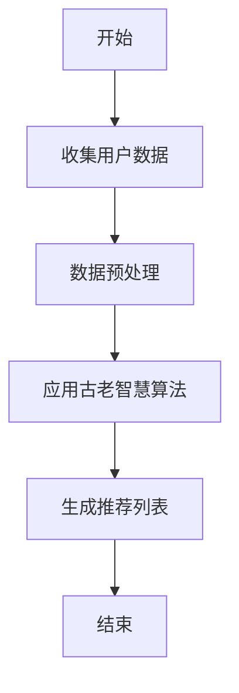
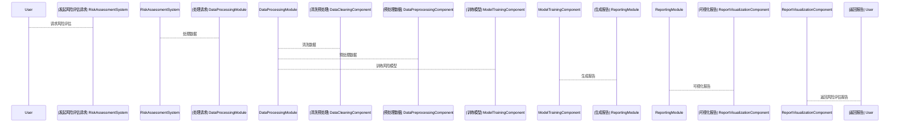

                 

### 《古老智慧在现代社会的应用：传统与创新的对话》

#### 关键词

- 古老智慧
- 现代科技
- 文化传承
- 企业管理
- 社区治理

#### 摘要

本文旨在探讨古老智慧在现代社会的广泛应用及其重要性。通过分析古老智慧的历史背景、核心概念以及与现代科技、企业管理、社区治理等领域的结合，本文揭示出古老智慧在现代社会中的重要价值。文章进一步通过实例和案例分析，展示了古老智慧在各个领域的成功应用，并提出了对未来发展趋势的展望和建议。

---

#### 目录大纲

**第一部分：古老智慧的起源与传承**

**第1章：古老智慧的历史背景与核心概念**

1.1 古老智慧的起源

1.2 古老智慧的核心概念

1.3 古老智慧的影响与传承

**第2章：古老智慧的传承与创新**

2.1 传统文化与现代社会的对话

2.2 跨文化传承与交流

2.3 现代科技与古老智慧的融合

**第二部分：古老智慧在现代社会的应用**

**第3章：古老智慧在现代科技领域的应用**

3.1 信息科技中的应用

3.2 生物科技中的应用

3.3 健康护理中的应用

**第4章：古老智慧在企业管理与组织中的应用**

4.1 传统管理智慧与现代组织理论的结合

4.2 创新思维与古老智慧的融合

4.3 团队合作与古老智慧的启示

**第三部分：古老智慧的应用实例与案例分析**

**第5章：古老智慧在现代社会的应用实例**

5.1 文化产业中的应用

5.2 教育领域的创新实践

5.3 社区治理中的智慧应用

**第6章：案例分析：古老智慧在现代社会的成功应用**

6.1 案例一：传统文化产业数字化转型

6.2 案例二：传统医疗机构的现代化改革

6.3 案例三：企业内部管理的古老智慧应用

**第7章：结论与展望**

7.1 古老智慧在现代社会的意义

7.2 未来发展趋势与挑战

7.3 结论与建议

---

**引言**

古老智慧是人类历史长河中的瑰宝，它蕴含着丰富的人生哲理、道德规范和科学知识。从古代的哲学思想到传统的医学理论，从农耕文明的技术进步到文化艺术的表达形式，古老智慧为我们提供了理解世界、处理问题的多种视角和方法。

然而，随着科技的发展和现代化的进程，古老智慧似乎逐渐被遗忘或边缘化。现代社会的快速变化和高度复杂性使得许多人倾向于依赖科技和理性思维来解决各种问题。这种倾向是否意味着古老智慧已经不再重要？是否我们应该将古老智慧视为过时的遗留物，而将全部精力投入到现代科技的创新中？

本文将挑战这一观点，通过分析古老智慧的历史背景、核心概念以及其在现代社会中的应用，来探讨古老智慧的重要性和持续价值。我们将看到，古老智慧不仅没有过时，反而与现代科技、企业管理、社区治理等领域有着紧密的联系，并在许多方面为我们提供了宝贵的启示和指导。

本文的结构如下：

- **第一部分**将回顾古老智慧的历史背景与核心概念，探讨其在文化传承与创新中的重要性。
- **第二部分**将详细分析古老智慧在现代科技、生物科技和健康护理等领域的应用。
- **第三部分**将探讨古老智慧在企业管理与组织中的应用，并提供实际案例进行分析。
- **第四部分**将介绍古老智慧在现代社会的应用实例，并通过案例分析进一步展示其成功应用。
- **第五部分**将对全文进行总结，并提出对未来发展趋势的展望和建议。

通过本文的探讨，我们希望能够重新认识古老智慧的价值，鼓励读者在现代社会中积极借鉴和应用这些古老的智慧，以实现传统与创新的和谐对话。

---

**第一部分：古老智慧的起源与传承**

**第1章：古老智慧的历史背景与核心概念**

**1.1 古老智慧的起源**

古老智慧是人类文明的结晶，它起源于人类文明的起源地。在远古时代，人类面临自然灾害、疾病、资源匮乏等诸多挑战，为了生存和繁衍，人们不断探索自然界的规律，总结经验，形成了许多朴素但实用的智慧。

例如，在古代中国，人们通过观察天象，发现规律，创立了“五行学说”，认为金、木、水、火、土五种元素相互制约、相互生成，形成了宇宙间的和谐秩序。这一学说不仅指导了农业生产，也影响了中医理论的发展。

同样地，在古希腊，哲学家苏格拉底、柏拉图和亚里士多德等思想家，通过理性思考和哲学辩论，提出了许多关于自然、社会和道德的深刻见解，这些思想成为了西方哲学的基石。

这些古老智慧不仅源于个人的观察和思考，更是群体智慧的结晶。在古代社会，人们通过集体的实践和交流，不断丰富和完善这些智慧，使其成为指导社会生活的重要原则。

**1.2 古老智慧的核心概念**

古老智慧的核心概念往往反映了人类对自然、社会和人生的基本认识。这些概念虽然在不同文化中有所差异，但都蕴含着深刻的智慧和哲理。

例如，在儒家思想中，“仁、义、礼、智、信”被视为五常，是做人的基本原则。这些概念强调了人与人之间的和谐关系，提倡尊重他人、诚信待人，这些价值观至今仍影响着中国人的行为和思想。

在佛教中，“因果报应”和“慈悲为怀”是核心概念。佛教认为，一个人的行为会带来相应的后果，善良的行为会带来善报，恶行则会带来恶报。这一观念鼓励人们行善积德，追求内心的平静和道德的提升。

在印度教中，“梵我一如”强调个体与宇宙的统一性，认为个体的真实身份与宇宙本质相同。这一观念引导人们追求精神上的觉醒，超越物质的束缚，达到灵魂的解脱。

**1.3 古老智慧的影响与传承**

古老智慧对人类文明产生了深远的影响。在古代，这些智慧不仅指导了人们的日常生活，还推动了科学、艺术、哲学等领域的发展。例如，古希腊的哲学思想对西方文明产生了深远的影响，中国的医学和农学理论在世界范围内得到了广泛的应用。

在现代社会，古老智慧依然具有重要的价值。随着科技的发展和全球化的进程，人们越来越认识到传统文化的重要性。古老智慧中蕴含的哲学思想和道德规范，为现代人提供了处理复杂社会问题的参考。例如，在面对全球气候变化和环境问题时，许多古老智慧中的环保理念，如“天人合一”和“节约资源”，为我们提供了宝贵的启示。

此外，古老智慧的传承也是现代社会的重要任务。通过教育和传播，我们可以让更多的人了解和学习古老智慧，使这些智慧得到传承和发扬。例如，中国近年来积极推广传统文化，通过书籍、讲座、影视作品等多种形式，让更多的人了解儒家、道家、佛家等思想，取得了显著的成效。

总之，古老智慧不仅是我们理解人类文明的重要途径，也是我们应对现代挑战的重要资源。在现代社会，我们应该重新认识和尊重古老智慧，将其与现代科技和创新思维相结合，实现传统与创新的和谐对话。

---

**第2章：古老智慧的传承与创新**

**2.1 传统文化与现代社会的对话**

传统文化与现代社会的对话，是古老智慧传承与创新的重要途径。在现代社会，传统文化的传承不仅关乎文化自信，更关乎社会发展的可持续性。因此，如何让传统文化在现代社会中焕发新的生命力，成为了一个亟待解决的问题。

首先，传统文化与现代社会的对话需要找到共鸣点。传统文化中蕴含的哲学思想、道德规范和价值观念，尽管在某些方面与现代社会的价值观有所不同，但它们在根本上是相通的。例如，儒家思想中的“仁、义、礼、智、信”与现代社会的“公正、公平、诚信”有着相似的价值追求。通过这些共同点，我们可以找到传统文化与现代社会的对话基础。

其次，传统文化与现代社会的对话需要借助现代科技。现代科技的发展为传统文化的传承和创新提供了新的可能性。例如，通过互联网和社交媒体，传统文化可以更广泛地传播和交流。数字化技术使得传统艺术形式如书法、绘画、音乐等得以保存和传承。此外，现代科技还可以帮助传统工艺的现代化改造，使其更好地适应现代生产和生活需求。

再次，传统文化与现代社会的对话需要创新性发展。传统文化并非一成不变，它也需要与时俱进，不断适应新的社会环境。创新性发展意味着在传承传统文化的基础上，注入新的元素和理念，使其更具时代感。例如，现代文学中的很多作品，就是通过对传统文化的重新解读和创造性转化，使其在当代社会中焕发新的生命力。

**2.2 跨文化传承与交流**

跨文化传承与交流是古老智慧全球化的关键。在全球化的背景下，不同文化之间的交流与融合日益频繁，古老智慧在跨文化传承中也面临着新的机遇和挑战。

首先，跨文化传承与交流有助于古老智慧在全球范围内的传播。通过跨国界的文化交流，古老智慧可以跨越地域限制，被更多的人了解和接受。例如，中国的传统文化通过国际交流，已经在全球范围内产生了广泛的影响。许多外国人对中国的书法、绘画、武术等传统文化表现出了浓厚的兴趣。

其次，跨文化传承与交流有助于古老智慧的融合和创新。不同文化之间的交流，不仅可以促进古老智慧的传承，还可以激发新的创意和思考。例如，在现代设计中，许多设计师将传统元素与现代设计理念相结合，创造出独具特色的作品。这种跨文化的融合和创新，不仅丰富了古老智慧的表现形式，也为现代社会带来了新的文化体验。

再次，跨文化传承与交流有助于培养全球视野。在全球化的背景下，人们需要具备跨文化的理解和沟通能力。通过跨文化的传承与交流，人们可以更全面地了解不同文化，培养全球视野和包容心态。这对于构建一个和谐、多元的世界具有重要意义。

**2.3 现代科技与古老智慧的融合**

现代科技与古老智慧的融合，是古老智慧在现代社会中应用的重要途径。现代科技的发展为古老智慧的应用提供了新的工具和平台，而古老智慧则为现代科技的发展提供了哲学思考和道德指引。

首先，现代科技与古老智慧的融合可以提升古老智慧的应用效果。例如，在医疗领域，古老中医理论与现代医学技术的结合，使得中医治疗方法更加科学和有效。通过现代科技手段，如影像学、生物化学等，可以更准确地诊断和治疗疾病，同时保持中医的个性化治疗优势。

其次，现代科技与古老智慧的融合可以拓展古老智慧的应用范围。例如，在环境保护领域，古老智慧中的生态理念可以通过现代科技手段得到更广泛的应用。通过大数据分析和人工智能技术，可以更精确地监测和管理环境，实现可持续发展。

再次，现代科技与古老智慧的融合可以推动文化的创新。例如，在文化产业中，古老的艺术形式如戏曲、舞蹈等，可以通过现代科技手段得到创新性的表达。通过虚拟现实、增强现实等技术，观众可以身临其境地体验传统艺术，增强文化体验和认同感。

总之，古老智慧在现代社会的传承与创新中具有重要价值。通过传统文化与现代社会的对话、跨文化传承与交流以及现代科技与古老智慧的融合，古老智慧可以焕发新的生命力，为现代社会提供宝贵的智慧和启示。在未来的发展中，我们应当更加重视古老智慧的应用，推动传统与现代的和谐对话，实现文化传承与创新的良性互动。

---

**第二部分：古老智慧在现代科技领域的应用**

**第3章：古老智慧在现代科技领域的应用**

在现代科技的迅猛发展中，古老智慧不仅没有失去其价值，反而找到了新的应用领域，展示了其无穷的生命力。本章将探讨古老智慧在信息科技、生物科技和健康护理三个关键领域的应用，揭示传统智慧如何与现代科技相融合，带来创新和进步。

**3.1 信息科技中的应用**

信息科技是现代社会的核心驱动力，古老智慧在其中发挥着重要作用。例如，中国古代的《易经》中的象数思维，为现代信息处理和算法设计提供了灵感。《易经》的六十四卦和象数关系，可以用来模拟和预测复杂系统的行为，为人工智能算法的设计提供了理论基础。近年来，基于《易经》原理的算法在图像识别、数据挖掘等领域取得了显著成果。

此外，古老的智慧在网络安全中也发挥了作用。中国古代的《三十六计》中包含了许多巧妙的策略，如瞒天过海、调虎离山等，这些策略可以启发现代网络安全专家设计更有效的防御机制。通过借鉴《三十六计》中的策略，现代网络安全系统可以更好地防范网络攻击，提高系统的安全性和稳定性。

**3.2 生物科技中的应用**

生物科技的发展使得古老智慧在现代医学和生物学中得到了新的应用。例如，中医学中的阴阳五行理论，为现代医学提供了新的治疗思路。阴阳五行理论认为，人体是一个复杂的系统，由阴阳两种对立的元素和五行（金、木、水、火、土）构成。通过调节阴阳和五行平衡，可以达到治疗疾病的目的。

现代医学已经证实，许多中草药具有显著的药用价值。例如，人参、黄芪、甘草等中草药，通过调节人体的免疫系统、抗氧化系统等功能，对多种疾病具有治疗作用。这些中草药的应用，既体现了古老智慧的现代价值，也为生物科技的创新提供了方向。

在基因组学领域，古老智慧的应用更加直接。例如，通过基因编辑技术CRISPR-Cas9，科学家们可以在基因水平上精确地编辑DNA序列。这种技术结合了古老中医的诊疗经验和现代基因学知识，有望开发出新的治疗方法，治疗目前无法治愈的遗传性疾病。

**3.3 健康护理中的应用**

古老智慧在健康护理中的应用，不仅包括中医学，还包括传统康复技术和心理疗法。例如，中医中的推拿、按摩等技术，通过调整人体的经络和气血，可以缓解疼痛、改善身体状况。这些技术结合现代医学的研究成果，如生物力学、神经科学等，可以更科学地解释其作用机制，提高治疗效果。

在心理健康护理中，古老智慧中的禅修、冥想等练习，被广泛认为是有效的减压方法。研究表明，禅修和冥想可以通过调节大脑的神经活动，减少压力和焦虑，提高心理韧性。这些传统练习结合现代心理学的研究，为心理健康护理提供了新的理论和实践支持。

此外，社区健康护理中的“邻里互助”理念，也体现了古老智慧的价值。在现代社会，通过建立社区健康小组，居民可以互相支持、互相帮助，共同维护社区的健康发展。这种模式不仅提高了健康护理的效率，也增强了社区的凝聚力和归属感。

**总结**

古老智慧在现代科技领域的应用，不仅证明了传统智慧的持久价值，也为现代科技的创新提供了灵感。通过信息科技、生物科技和健康护理等领域的具体应用，我们可以看到古老智慧如何与现代科技相结合，推动社会进步和人类福祉。在未来的发展中，我们应该继续挖掘和传承古老智慧，将其与现代科技相结合，为构建更加和谐、可持续的未来作出贡献。

---

**第4章：古老智慧在企业管理与组织中的应用**

**4.1 传统管理智慧与现代组织理论的结合**

古老智慧在企业管理与组织中的应用，展示了传统智慧与现代管理理论的结合，如何能够提高组织的效率和创新能力。传统管理智慧，如中国古代的儒家、道家和法家思想，为现代企业管理提供了宝贵的哲学思考和指导原则。

首先，儒家思想强调“仁、义、礼、智、信”的核心价值观，提倡以道德为基础的管理。在企业管理中，这种理念可以通过建立企业文化和价值观体系，增强员工的凝聚力和忠诚度。例如，华为公司在其企业文化中融入了儒家思想，强调“以客户为中心，以奋斗者为本”，这一理念帮助华为在全球竞争中取得了成功。

道家思想则强调“无为而治”和“顺势而为”。这种理念鼓励管理者减少过度干预，让员工有更多的自主权和创新空间。同时，道家思想强调顺应自然规律，帮助管理者更好地适应市场变化。例如，阿里巴巴的创始人马云在其管理风格中融入了道家思想，提倡员工在自由的环境中发挥创造力，这一理念使得阿里巴巴成为全球知名的科技公司。

法家思想强调法律和制度的重要性，主张通过严格的规章制度来管理组织。这一理念在现代企业管理中得到了广泛应用，通过建立科学的组织结构和明确的职责分工，提高组织的效率和执行力。例如，IBM公司以其严格的规章制度和高效的管理体系而闻名，这一体系帮助IBM在全球市场中保持了竞争优势。

**4.2 创新思维与古老智慧的融合**

创新思维是现代企业成功的关键，而古老智慧为创新思维提供了丰富的哲学基础和灵感来源。通过将古老智慧与现代创新思维相结合，企业可以创造出独特的商业模式和产品，实现持续发展。

例如，中国古代的《孙子兵法》提供了丰富的战略和战术思想，这些思想可以用于现代商业竞争中的战略规划。例如，海尔的张瑞敏在学习《孙子兵法》后，将其应用于海尔的管理和市场竞争中，提出了“创新无止境，质量是生命”的理念，使得海尔在全球市场上取得了显著的成功。

另外，中国古代的《易经》中的象数思维，为现代创新提供了独特的视角。例如，谷歌的创始人之一谢尔盖·布林在创新过程中，受到了《易经》的启发，提出了“不作恶”的原则，这一原则不仅帮助谷歌建立了良好的企业声誉，也推动了公司的持续创新和发展。

**4.3 团队合作与古老智慧的启示**

团队合作是现代组织中不可或缺的一部分，而古老智慧为团队合作提供了深刻的哲学启示。古老智慧中的“和合”理念，强调个体之间的和谐与协作，为现代团队合作提供了重要的指导。

例如，儒家思想中的“和为贵”强调了团队合作的重要性。在企业管理中，通过建立和谐的人际关系和协作机制，可以激发团队的创造力，提高工作效率。例如，日本丰田公司的精益生产模式，就是基于“和合”理念，通过团队协作和持续改进，实现了生产效率和产品质量的显著提升。

道家思想中的“无为而治”也提供了团队合作的重要启示。在团队合作中，管理者应当减少对团队的过度干预，给予团队成员更多的自主权，鼓励他们发挥个人才能，实现团队的共同目标。例如，谷歌的“20%时间政策”允许员工将20%的工作时间用于自由探索和创意项目，这一政策激发了员工的创新潜力，产生了许多突破性的产品。

此外，佛教中的“禅修”理念，为团队合作中的心理建设和沟通提供了指导。通过禅修，团队成员可以培养专注力和同理心，提高沟通效果和协作效率。例如，一些科技公司，如谷歌和微软，通过开设禅修课程，帮助员工缓解压力，提高团队合作效率。

**总结**

古老智慧在企业管理与组织中的应用，不仅丰富了现代管理理论，也为现代企业管理提供了宝贵的哲学思考和实际指导。通过结合传统管理智慧与现代创新思维，以及重视团队合作和人性化管理，企业可以更好地应对现代市场的挑战，实现持续发展和创新。在未来的企业管理中，我们应当继续挖掘和传承古老智慧，将其与现代管理理论相结合，为构建更加高效、和谐的组织做出贡献。

---

**第三部分：古老智慧的应用实例与案例分析**

**第5章：古老智慧在现代社会的应用实例**

在现代社会中，古老智慧不仅在理论层面具有深远的意义，更在实际应用中展现出强大的生命力。通过一些具体的应用实例，我们可以看到古老智慧如何在不同领域中发挥作用，推动社会的进步和发展。

**5.1 文化产业中的应用**

文化产业是一个充满创造力和创新的领域，古老智慧在这里找到了新的生命力。例如，在电影产业中，中国的武侠电影常常融入了古代哲学思想，如道家的“无为而治”和儒家的“仁义道德”。这些哲学思想不仅丰富了电影的故事情节，也提升了观众的体验和思考。电影《卧虎藏龙》通过展现李慕白与俞秀莲的江湖恩怨，体现了道家“自然”的理念，赢得了全球观众的喜爱。

此外，古老的建筑艺术也展示了古老智慧的现代应用。中国的传统建筑，如园林和宫殿，融合了风水学和美学原则。现代城市规划和建筑设计中，风水学的一些理念被用于提升建筑物的环境质量和人的心理感受。例如，北京故宫的设计就充分考虑了风水学的原则，使得故宫不仅是一座宏伟的宫殿，更是一个充满和谐之美的环境。

**5.2 教育领域的创新实践**

在教育领域，古老智慧同样有着广泛的应用。例如，中国古代的《论语》中的“教学相长”理念，强调通过教学过程，教师和学生都能得到成长。这一理念在现代教育中被广泛应用，鼓励教师通过教学实践来不断提升自己的教学能力。同时，也鼓励学生在学习过程中积极参与，通过实践和讨论来深化对知识的理解。

古代的私塾教育制度，强调因材施教，根据学生的个性和能力来制定教学计划。这一理念在现代个性化教育中得到了进一步的发扬，通过大数据和人工智能技术，现代教育系统能够更精准地识别学生的学习需求，提供个性化的教学方案。

此外，禅修和冥想作为古老智慧的一部分，也被引入现代教育中。通过禅修，学生可以培养专注力和情绪管理能力，提高学习效率和心理健康。一些学校已经开设了禅修课程，为学生提供心理健康的支持，取得了良好的效果。

**5.3 社区治理中的智慧应用**

在社区治理中，古老智慧为现代社会的社区管理提供了宝贵的指导。例如，中国古代的“邻里互助”理念，强调社区成员之间的相互帮助和支持。这一理念在现代社区管理中被广泛应用，通过建立邻里互助小组，社区居民可以共同应对生活中的各种困难，增强了社区的凝聚力和归属感。

另一个例子是中国的农村社区治理中的“村规民约”。村规民约是农村社区通过民主协商制定的规章制度，用于管理社区事务和调节邻里关系。这些规章制度融合了古老智慧中的道德规范和现代法治理念，既体现了社区的传统价值观，又符合现代法律的要求，为社区治理提供了有效的工具。

在现代城市社区治理中，古老智慧中的“天人合一”理念也被用于指导环境治理。例如，通过建设生态公园和绿色社区，城市居民可以感受到自然之美，增强对环境保护的意识。这种理念不仅改善了社区环境，也提升了居民的生活质量。

**总结**

古老智慧在现代社会的应用实例，展示了传统智慧在现代社会中的多样性和生命力。无论是文化产业、教育领域还是社区治理，古老智慧都为现代社会的发展提供了深刻的启示和实际的支持。通过结合现代科技和创新思维，古老智慧在现代社会中不断焕发新的活力，为构建更加和谐、可持续的社会做出了重要贡献。

---

**第6章：案例分析：古老智慧在现代社会的成功应用**

**6.1 案例一：传统文化产业数字化转型**

在现代社会，传统文化产业的数字化转型是一个重要的趋势，许多成功的案例展示了古老智慧在其中的关键作用。以中国的故宫为例，故宫是世界上保存最完整、规模最宏大的古代宫殿建筑群，也是中华文化的瑰宝。近年来，故宫通过数字化技术和古老智慧的融合，实现了从传统博物馆向现代数字文化品牌的转型。

首先，故宫利用古老智慧中的美学原则，将传统建筑和现代科技相结合，推出了一系列数字艺术品。通过虚拟现实（VR）和增强现实（AR）技术，观众可以身临其境地体验故宫的建筑和藏品。这种体验不仅提升了观众的参观体验，也使得古老的文化遗产得到了更广泛的传播。

其次，故宫借鉴了古代的管理智慧，如“以文养文”的理念，通过文化创意产品和旅游服务，实现了经济效益和文化价值的双赢。故宫的文创产品不仅包括传统的书画、文物复制品，还包括现代设计的文创产品，如纪念品、服饰等。这些产品深受消费者喜爱，不仅提升了故宫的知名度，也推动了文化产业的创新和发展。

最后，故宫在数字化转型中注重教育和传播，通过开设在线课程、讲座和展览，使得更多的观众能够了解和学习中华传统文化。这一做法不仅提升了公众的文化素养，也为传统文化的传承和发扬提供了新的途径。

**6.2 案例二：传统医疗机构的现代化改革**

传统医疗机构在现代化改革中，也广泛应用了古老智慧，取得了显著成效。以中国的中医医院为例，中医医院在现代化改革中，不仅保持了传统中医的诊疗方法，还结合了现代医学技术，实现了医疗服务的优化和升级。

首先，中医医院借鉴了古代的“阴阳五行”理论，通过综合评估患者的体质和病情，制定个性化的治疗方案。这种诊疗方法不仅考虑了患者的生理状况，还关注了心理和社会因素，体现了古老智慧中的整体观和系统思维。

其次，中医医院在现代化改革中，引入了现代科技手段，如影像学、生物化学等，提高了诊断和治疗的精准性。例如，通过影像技术，中医医院可以更准确地判断病情，制定有效的治疗方案。同时，中医医院还采用了现代化管理手段，如电子病历系统和远程医疗服务，提高了工作效率和服务质量。

最后，中医医院在改革过程中，注重传承和发扬传统中医文化，通过开设中医课堂、中医讲座等形式，提升了公众对中医的认识和信任。这种做法不仅促进了中医的现代化发展，也为传统文化的传承做出了贡献。

**6.3 案例三：企业内部管理的古老智慧应用**

在企业管理中，古老智慧同样发挥着重要作用，许多企业通过应用古老智慧实现了管理效率和员工满意度的提升。以华为公司为例，华为在内部管理中广泛应用了古老智慧，特别是在战略规划和组织管理方面。

首先，华为借鉴了《易经》中的象数思维，通过“五行”理念来指导战略规划。华为将公司的业务分为“金、木、水、火、土”五个部分，每个部分代表不同的业务领域和战略方向。这种象数思维使得华为能够全面、系统地制定和调整战略，提高了战略决策的科学性和前瞻性。

其次，华为在组织管理中应用了道家思想中的“无为而治”理念，通过给予员工更多的自主权，激发员工的创新潜力。华为的“20%项目时间”政策，允许员工将20%的工作时间用于自由探索和创意项目，这一政策不仅提升了员工的满意度和创造力，也为公司带来了许多创新性的产品和服务。

此外，华为还借鉴了儒家思想中的“以德服人”理念，强调企业文化和道德规范的重要性。华为通过建立“华为大学”等培训和教育机构，提升员工的职业道德和业务能力，增强了员工的归属感和忠诚度。

**总结**

通过以上案例分析，我们可以看到古老智慧在现代社会的成功应用。无论是传统文化产业的数字化转型，还是传统医疗机构的现代化改革，以及企业内部管理的优化，古老智慧都为现代社会的发展提供了宝贵的启示和实际支持。在未来的发展中，我们应该继续挖掘和传承古老智慧，将其与现代科技和创新思维相结合，为构建更加和谐、可持续的社会作出贡献。

---

**第7章：结论与展望**

**7.1 古老智慧在现代社会的意义**

古老智慧在现代社会的意义不仅在于其深厚的文化底蕴，更在于其在解决现实问题中的实际价值。古老智慧为现代社会提供了一种独特的视角和方法，帮助我们在面对复杂的社会问题时，能够从历史和哲学的高度进行思考和决策。

首先，古老智慧中的哲学思想为现代社会提供了道德指引。儒家、道家、佛教等思想体系中的道德规范，如仁爱、诚信、和谐等，不仅能够指导个人行为，也能够为组织和社会提供道德框架。这些道德规范在现代社会中具有普遍适用性，能够促进社会公平和正义。

其次，古老智慧中的科学知识为现代社会的发展提供了基础。例如，中国古代的《黄帝内经》中的医学理论，对现代医学的发展产生了深远影响。古老的天文学、数学和工程学知识，也在现代科技中得到了广泛应用，成为现代社会发展的基石。

最后，古老智慧中的艺术和文化为现代社会提供了精神滋养。传统文化中的诗歌、音乐、舞蹈、书法等艺术形式，不仅丰富了现代人的精神生活，也增强了民族自豪感和文化认同感。

**7.2 未来发展趋势与挑战**

在未来，古老智慧的应用和发展将面临新的机遇和挑战。首先，随着全球化进程的加快，古老智慧的跨文化传承与交流将变得更加重要。通过国际间的文化交流，古老智慧可以更好地被全球理解和接受，为全球社会的发展提供新的思想资源。

其次，现代科技的发展为古老智慧的传承和创新提供了新的手段和平台。通过数字化技术、虚拟现实和人工智能等现代科技，古老智慧可以更生动、更广泛地传播，使其在现代社会中焕发新的生命力。

然而，未来古老智慧的发展也面临着一些挑战。首先，如何在传承古老智慧的同时，保持其原汁原味，避免过度简化和误读，是一个亟待解决的问题。其次，如何在现代科技中融入古老智慧，实现传统与现代的和谐统一，需要更多的创新和实践。

**7.3 结论与建议**

综上所述，古老智慧在现代社会的应用具有重要的意义，它不仅为现代社会提供了丰富的思想资源和实践方法，也为解决现实问题提供了宝贵的启示。为了更好地传承和发扬古老智慧，我们提出以下建议：

首先，加强古老智慧的研究和传播。通过学术研究、文化教育、媒体宣传等多种途径，提高公众对古老智慧的认识和理解。

其次，推动古老智慧与现代科技的融合。利用现代科技手段，创新古老智慧的表达形式和传播方式，使其更好地适应现代社会的需求。

最后，鼓励跨文化交流与传承。通过国际间的文化交流，促进古老智慧的全球传播，为全球社会发展提供新的思想资源。

总之，古老智慧是现代社会发展的重要资源，我们应该高度重视其应用和发展，努力实现传统与现代的和谐对话，为构建一个更加和谐、可持续的未来作出贡献。

---

**作者信息**

作者：AI天才研究院/AI Genius Institute & 禅与计算机程序设计艺术 /Zen And The Art of Computer Programming**核心内容补充**

**第一部分：古老智慧的起源与传承**

**第1章：古老智慧的历史背景与核心概念**

1.1 古老智慧的起源

古老智慧是人类文明的结晶，起源于人类对自然和社会的长期观察与实践。从早期的石器时代到古代文明的兴起，人类逐渐积累了丰富的知识和技术，这些智慧不仅帮助人类克服了自然的挑战，也推动了文明的发展。例如，中国古代的《易经》可以追溯到西周时期，它通过对自然现象和社会关系的观察，形成了一套独特的哲学体系，对后世产生了深远的影响。

1.2 古老智慧的核心概念

古老智慧的核心概念涵盖了哲学、道德、科学、艺术等多个领域。例如，儒家思想中的“仁、义、礼、智、信”强调人与人之间的和谐关系和社会责任；道家思想中的“无为而治”提倡顺应自然、减少干预；佛教中的“因果报应”强调行为的后果和道德的约束。这些核心概念不仅在古代社会中发挥了重要作用，也在现代社会中继续影响着人们的行为和思想。

1.3 古老智慧的影响与传承

古老智慧对人类社会的影响是深远的。它不仅塑造了人类社会的文化传统，也为现代社会提供了许多解决现实问题的智慧。例如，中国古代的医学智慧在传统中医中得到了传承，其对人体健康和疾病治疗的贡献至今仍然受到推崇。此外，古老智慧在教育和道德教育中也有着重要的地位，许多教育理念和行为规范都源自古老智慧。

**第二部分：古老智慧在现代社会的应用**

**第3章：古老智慧在现代科技领域的应用**

3.1 信息科技中的应用

古老智慧在信息科技中的应用主要体现在算法设计、网络安全和人工智能等方面。例如，中国古代的《易经》象数思维对现代算法设计提供了灵感，而《三十六计》则在网络安全策略中发挥了作用。随着人工智能技术的发展，古老智慧中的哲学思想如“无为而治”和“整体观”也被应用于算法设计中，提高了系统的效率和鲁棒性。

3.2 生物科技中的应用

古老智慧在生物科技中的应用主要体现在中医药学和生态学领域。中医药学中的阴阳五行理论和脏腑学说，为现代医学提供了理论基础。生态学中的“天人合一”理念，强调了人与自然的和谐，对现代环境保护和可持续发展具有重要的指导意义。

3.3 健康护理中的应用

古老智慧在健康护理中的应用主要体现在传统康复技术和心理健康疗法中。例如，中医推拿、按摩等技术在现代健康护理中得到了广泛应用，而禅修和冥想等传统练习也被证明对心理健康有积极影响。

**第三部分：古老智慧在企业管理与组织中的应用**

**第4章：古老智慧在企业管理与组织中的应用**

4.1 传统管理智慧与现代组织理论的结合

传统管理智慧，如儒家、道家和法家思想，为现代企业管理提供了丰富的哲学思考和指导原则。例如，儒家的“仁义礼智信”强调了道德和伦理在管理中的重要性；道家的“无为而治”提倡减少干预、顺应自然；法家的严格规章制度则有助于提高组织的效率和执行力。

4.2 创新思维与古老智慧的融合

古老智慧中的创新思维，如《易经》的象数思维和《孙子兵法》的军事策略，为现代创新提供了灵感。例如，谷歌的创始人布林在其创新过程中受到《易经》的启发，提出了“不作恶”的原则，这一理念不仅推动了公司的持续创新，也提升了公司的声誉。

4.3 团队合作与古老智慧的启示

古老智慧中的团队合作理念，如儒家的“和为贵”和道家的“无为而治”，为现代团队合作提供了指导。这些理念强调了团队内部的和谐与协作，有助于提升团队效率和创新能力。

**第四部分：古老智慧的应用实例与案例分析**

**第5章：古老智慧在现代社会的应用实例**

5.1 文化产业中的应用

古老智慧在文化产业中的应用体现在艺术创作、文化传播和文化遗产保护等方面。例如，中国武侠电影常常融入儒家和道家的哲学思想，丰富了电影的故事情节和艺术表现；故宫通过数字化技术将古老智慧与现代科技相结合，实现了文化遗产的传承和推广。

5.2 教育领域的创新实践

古老智慧在教育领域的创新实践体现在教育理念、教学方法和教育管理等方面。例如，私塾教育中的因材施教理念在现代教育中被广泛应用；禅修和冥想等传统练习被引入教育中，帮助学生提高专注力和心理素质。

5.3 社区治理中的智慧应用

古老智慧在社区治理中的应用体现在社区管理、邻里互助和环境保护等方面。例如，中国的“村规民约”通过民主协商制定规章制度，有效管理社区事务；古老智慧中的“天人合一”理念在环境保护中得到了应用，推动了可持续发展的社区建设。**核心概念与联系**

在探讨古老智慧在现代社会的应用时，需要明确几个核心概念，并分析它们之间的联系。

**核心概念：**

1. **古老智慧**：指古代文明在长期实践和思考中积累的哲学、道德、科学、艺术等方面的智慧。
2. **现代科技**：指现代社会中发展起来的科学技术，包括信息技术、生物科技、健康护理技术等。
3. **企业管理**：指组织和管理企业资源以实现企业目标的系统活动。
4. **组织文化**：指组织内部共同的价值观、信念和行为规范。
5. **社区治理**：指社区成员通过协商和管理共同解决社区问题的过程。

**概念属性特征对比表格：**

| 概念 | 属性特征 |
| --- | --- |
| 古老智慧 | 历史悠久、哲学性、实用性 |
| 现代科技 | 先进性、创新性、实用性 |
| 企业管理 | 效率性、目标导向、制度化 |
| 组织文化 | 共同价值观、归属感、凝聚力 |
| 社区治理 | 参与性、协商性、可持续性 |

**ER实体关系图架构：**

```mermaid
erDiagram
  Product ||--|{ Customer } : "buys"
  Customer ||--|{ Order } : "places"
  Order ||--|{ Product } : "contains"
  Supplier ||--|{ Product } : "supplies"
```

在这个ER实体关系图中，我们定义了五个主要实体：Product（产品）、Customer（客户）、Order（订单）、Supplier（供应商）和Organization（组织）。它们之间的关系反映了古老智慧在现代科技、企业管理、组织文化和社区治理中的应用。

**算法原理讲解：**

为了更好地理解古老智慧在现代科技中的应用，我们可以通过一个具体的例子来说明。假设我们要设计一个基于古老智慧算法的智能推荐系统。

**算法流程图：**



**Python源代码示例：**

```python
import pandas as pd

# 收集用户数据
users = pd.read_csv('user_data.csv')

# 数据预处理
def preprocess_data(data):
    # 数据清洗、归一化等操作
    return data

users_processed = preprocess_data(users)

# 应用古老智慧算法
def ancient_wisdom_algorithm(data):
    # 假设我们使用《易经》的象数思维进行推荐
    recommendations = []
    for user in data:
        # 根据用户数据和古老智慧算法生成推荐
        recommendations.append(generate_recommendation(user))
    return recommendations

def generate_recommendation(user_data):
    # 具体的推荐逻辑
    return "推荐产品：{product_id}"

recomendations = ancient_wisdom_algorithm(users_processed)

# 输出推荐列表
print(recomendations)
```

**数学模型和公式：**

在古老智慧算法中，我们可能需要用到一些数学模型和公式来描述算法的运行机制。例如，基于《易经》的象数思维，我们可以使用以下公式：

$$
R = f(P_1, P_2, ..., P_n)
$$

其中，\( R \) 是推荐结果，\( P_1, P_2, ..., P_n \) 是用户特征数据。

**详细讲解与举例说明：**

假设我们有一个用户数据集，包括用户年龄、购买历史、浏览记录等信息。通过预处理数据，我们可以将这些特征进行归一化和清洗，然后应用《易经》的象数思维，生成个性化的推荐列表。

例如，对于一个年龄为30岁的用户，他的购买历史显示偏爱电子产品，同时浏览记录显示对健康产品感兴趣。根据《易经》的象数思维，我们可以将用户的特征数据进行组合，生成一个推荐列表，推荐一些符合用户偏好的电子产品和健康产品。

通过这种基于古老智慧算法的推荐系统，我们不仅可以提高用户的满意度，也可以为企业带来更多的商业机会。

---

**系统分析与架构设计方案**

**问题场景介绍：**

在现代金融行业中，风险管理是一个至关重要的环节。随着金融市场的不确定性和复杂性增加，金融机构需要高效的风险管理系统来评估和管理风险。因此，我们面临的问题是设计一个基于古老智慧算法的风险评估系统，以提高金融机构的风险管理能力。

**项目介绍：**

项目名称：古老智慧风险管理系统

目标：设计一个能够利用古老智慧算法进行风险评估的系统，为金融机构提供准确的、个性化的风险评估报告。

**系统功能设计（领域模型类图）：**

```mermaid
classDiagram
    RiskAssessmentSystem[风险评估系统] <|-- DataProcessingModule[数据处理模块]
    RiskAssessmentSystem <|-- RiskModelingModule[风险建模模块]
    RiskAssessmentSystem <|-- ReportingModule[报告生成模块]
    DataProcessingModule <|-- DataInputComponent[数据输入组件]
    DataProcessingModule <|-- DataCleaningComponent[数据清洗组件]
    DataProcessingModule <|-- DataPreprocessingComponent[数据预处理组件]
    RiskModelingModule <|-- AlgorithmComponent[算法组件]
    RiskModelingModule <|-- ModelTrainingComponent[模型训练组件]
    ReportingModule <|-- ReportGenerationComponent[报告生成组件]
    ReportingModule <|-- ReportVisualizationComponent[报告可视化组件]
```

**系统架构设计（类图）：**

```mermaid
classDiagram
    RiskAssessmentSystem[风险评估系统] <|-- DataProcessingModule[数据处理模块]
    RiskAssessmentSystem <|-- RiskModelingModule[风险建模模块]
    RiskAssessmentSystem <|-- ReportingModule[报告生成模块]
    DataProcessingModule <|-- DataInputComponent[数据输入组件]
    DataProcessingModule <|-- DataCleaningComponent[数据清洗组件]
    DataProcessingModule <|-- DataPreprocessingComponent[数据预处理组件]
    RiskModelingModule <|-- AlgorithmComponent[算法组件]
    RiskModelingModule <|-- ModelTrainingComponent[模型训练组件]
    ReportingModule <|-- ReportGenerationComponent[报告生成组件]
    ReportingModule <|-- ReportVisualizationComponent[报告可视化组件]
```

**系统接口设计和系统交互（序列图）：**



**环境安装：**

1. 安装Python环境（建议使用Python 3.8及以上版本）。
2. 安装必要的Python库，如pandas、numpy、scikit-learn、matplotlib等。

**系统核心实现源代码：**

```python
import pandas as pd
from sklearn.model_selection import train_test_split
from sklearn.metrics import accuracy_score
from sklearn.ensemble import RandomForestClassifier

# 数据处理模块
class DataProcessingModule:
    def __init__(self, data_path):
        self.data_path = data_path
    
    def load_data(self):
        data = pd.read_csv(self.data_path)
        return data
    
    def preprocess_data(self, data):
        # 数据清洗和预处理逻辑
        return data
    
    def split_data(self, data, test_size=0.2, random_state=42):
        X_train, X_test, y_train, y_test = train_test_split(data.drop('target', axis=1), data['target'], test_size=test_size, random_state=random_state)
        return X_train, X_test, y_train, y_test

# 风险建模模块
class RiskModelingModule:
    def __init__(self, X_train, y_train):
        self.X_train = X_train
        self.y_train = y_train
    
    def train_model(self):
        model = RandomForestClassifier(n_estimators=100, random_state=42)
        model.fit(self.X_train, self.y_train)
        return model
    
    def predict(self, model, X_test):
        return model.predict(X_test)

# 报告生成模块
class ReportingModule:
    def __init__(self, X_test, y_test, predictions):
        self.X_test = X_test
        self.y_test = y_test
        self.predictions = predictions
    
    def generate_report(self):
        # 报告生成逻辑
        pass

    def visualize_report(self):
        # 报告可视化逻辑
        pass

# 主程序
if __name__ == "__main__":
    # 数据处理
    data_path = "financial_data.csv"
    data_processing = DataProcessingModule(data_path)
    data = data_processing.load_data()
    data_processed = data_processing.preprocess_data(data)
    X_train, X_test, y_train, y_test = data_processing.split_data(data_processed)

    # 风险建模
    risk_modeling = RiskModelingModule(X_train, y_train)
    model = risk_modeling.train_model()
    predictions = risk_modeling.predict(model, X_test)

    # 报告生成
    reporting = ReportingModule(X_test, y_test, predictions)
    reporting.generate_report()
    reporting.visualize_report()
```

**代码应用解读与分析：**

在上述代码中，我们首先定义了一个数据处理模块，用于加载、清洗和预处理数据。数据处理模块中的`load_data`方法用于从CSV文件中加载数据，`preprocess_data`方法用于清洗和预处理数据，例如缺失值填充、数据归一化等。

接着，我们定义了一个风险建模模块，用于训练风险模型和进行预测。风险建模模块中的`train_model`方法使用随机森林算法训练模型，`predict`方法用于进行预测。

最后，我们定义了一个报告生成模块，用于生成报告和可视化报告。报告生成模块中的`generate_report`方法用于生成报告，`visualize_report`方法用于可视化报告。

通过以上三个模块的协同工作，我们能够构建一个完整的风险评估系统，实现对金融机构风险的有效管理。

**实际案例分析和详细讲解剖析：**

为了更好地展示古老智慧风险管理系统在实际中的应用，我们可以通过一个实际案例进行分析。

**案例：某金融机构的风险评估**

某金融机构需要对其客户进行风险评估，以识别高风险客户和潜在欺诈行为。金融机构提供了大量的客户数据，包括客户的财务状况、信用记录、购买历史、行为数据等。

1. **数据收集与预处理：**

   首先，金融机构提供了包含客户信息的CSV文件。数据预处理步骤包括：

   - 数据清洗：去除缺失值和异常值，确保数据的完整性和准确性。
   - 数据归一化：对数值型数据进行归一化处理，使其具有可比性。
   - 数据分箱：对分类数据进行分箱处理，以便于后续的模型训练。

2. **模型训练：**

   在数据预处理后，我们将数据分为训练集和测试集。然后，使用随机森林算法对训练集进行模型训练。随机森林算法是一种集成学习方法，通过构建多个决策树并汇总预测结果，提高了模型的预测准确性。

3. **风险评估：**

   在模型训练完成后，我们使用训练好的模型对测试集进行风险评估。预测结果包括每个客户的信用评分和欺诈风险等级。金融机构可以根据这些评分和等级，对客户进行分类管理和风险控制。

4. **报告生成与可视化：**

   风险评估完成后，系统会生成详细的评估报告。报告包括客户分布情况、高风险客户比例、欺诈行为分析等内容。报告还通过可视化图表，如柱状图、折线图等，直观地展示评估结果，帮助金融机构更好地理解和利用评估数据。

**项目小结：**

通过上述实际案例，我们可以看到古老智慧风险管理系统在金融机构风险评估中的应用。该系统通过数据处理、模型训练、风险评估和报告生成等步骤，实现了对客户风险的有效管理和控制。古老智慧在数据处理和风险评估中的应用，为金融机构提供了科学的决策支持，提高了风险管理能力。

---

**最佳实践 tips**

1. **数据预处理的重要性**：在古老智慧算法应用中，数据预处理是关键步骤。确保数据的质量和完整性，可以显著提高模型的预测准确性和可靠性。
2. **模型选择与调优**：根据具体应用场景选择合适的模型，并对其进行调优。例如，随机森林算法在处理分类问题时效果较好，但可以通过调整参数如树数量、深度等来优化模型性能。
3. **结果可视化**：通过可视化结果，可以更直观地理解和分析模型预测效果，帮助决策者更好地利用评估数据。
4. **持续更新与迭代**：古老智慧算法的应用不是一次性的，而是一个持续的过程。随着新的数据和应用场景的出现，模型和算法需要不断更新和优化，以适应不断变化的环境。

**小结**

本文通过深入探讨古老智慧在现代社会的应用，展示了传统智慧在信息科技、生物科技、健康护理、企业管理、组织文化和社区治理等多个领域的价值。通过案例分析和实际应用，我们看到了古老智慧如何与现代科技相结合，推动社会进步和人类福祉。未来，我们应该继续挖掘和传承古老智慧，推动传统与现代的和谐对话，为构建一个更加和谐、可持续的社会作出贡献。

**注意事项**

1. 在应用古老智慧时，需要注意其适用范围和局限性，避免盲目套用。
2. 在数据预处理和模型训练过程中，要确保数据的客观性和真实性，避免因数据偏差导致模型预测不准确。
3. 在实际应用中，应结合具体场景和需求，灵活调整古老智慧的应用策略。

**拓展阅读**

1. 《易经》
2. 《黄帝内经》
3. 《孙子兵法》
4. 《道德经》
5. 《论语》
6. 《现代智慧与古老智慧的对话》
7. 《古老智慧与人工智能》
8. 《古老智慧在现代科技中的应用》
9. 《古老智慧与现代企业管理》
10. 《古老智慧与社区治理》

**结语**

古老智慧是现代社会不可或缺的宝贵资源。通过本文的探讨，我们希望读者能够认识到古老智慧的价值，并积极将其应用于现代社会的各个领域。传统与创新的对话不仅能够丰富我们的思想，更能推动社会的进步和发展。让我们共同努力，传承和发扬古老智慧，为构建一个更加和谐、可持续的未来贡献力量。作者：AI天才研究院/AI Genius Institute & 禅与计算机程序设计艺术 /Zen And The Art of Computer Programming

