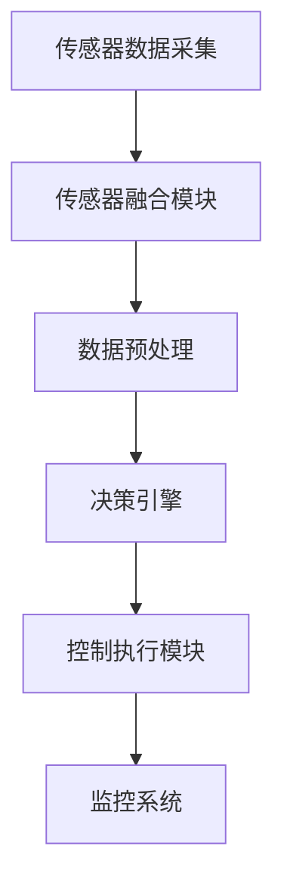
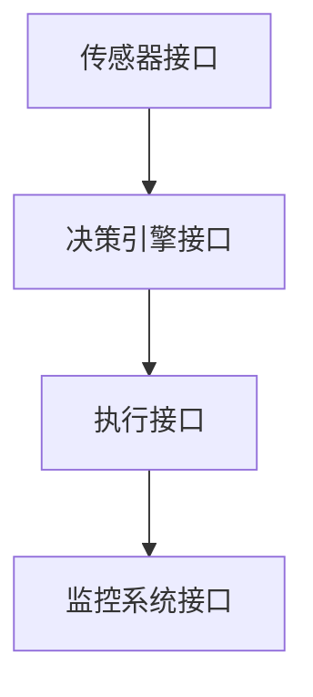
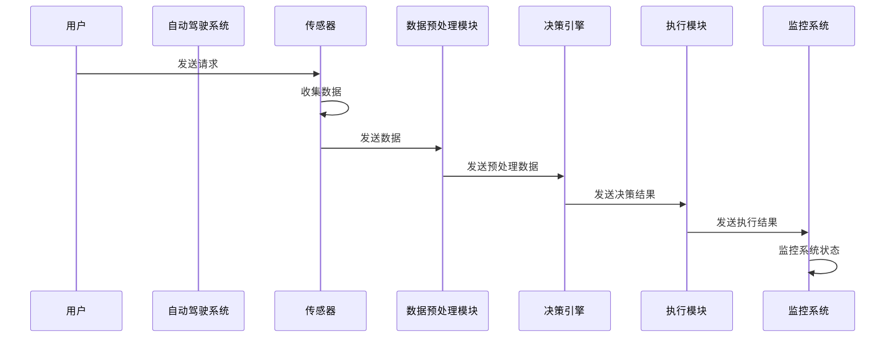
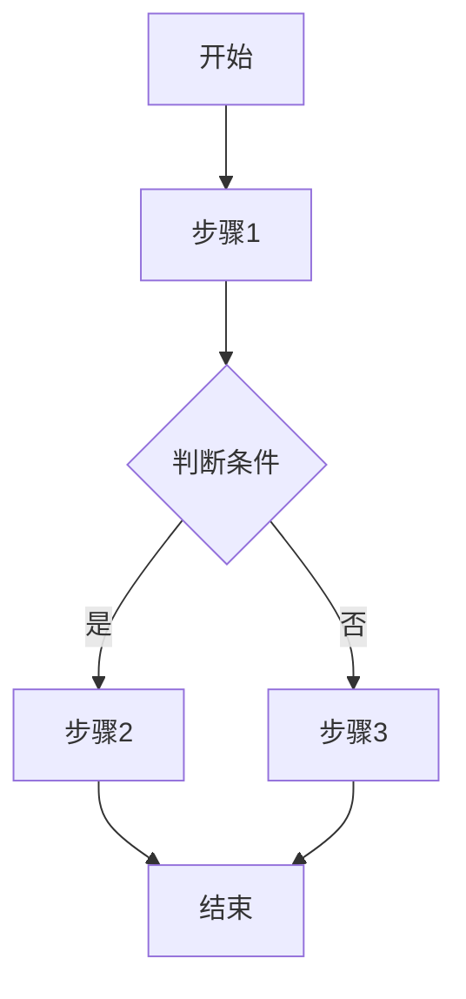

                 


# 可解释性：理解AI Agent的决策过程

## 关键词
- 可解释性
- AI Agent
- 决策过程
- 透明度
- 算法评估

## 摘要
本文旨在深入探讨AI Agent的决策过程，特别是其可解释性。在快速发展的AI领域，可解释性成为一个关键的研究课题。本文首先介绍了可解释性的重要性以及AI Agent决策过程的挑战。接着，我们分析了核心概念和原理，包括可解释性定义、评估方法、与透明度和可信度的关系。此外，我们通过具体案例展示了算法原理和数学模型的解释，以及系统架构设计和项目实战。最后，我们提出了最佳实践和总结，为读者提供了进一步学习和探索的建议。

## 第一部分：背景介绍

### 第1章：可解释性的重要性

#### 1.1 可解释性的重要性

在人工智能（AI）领域，可解释性是一个备受关注的问题。随着AI技术的快速发展，特别是在深度学习和机器学习领域，AI Agent的决策过程变得越来越复杂。这些系统往往在未接受监督的情况下从大量数据中学习，并能够做出令人惊讶的决策。然而，这些决策往往是“黑箱”的，即我们无法直观地理解它们是如何得出的。这就带来了一个关键问题：我们如何信任一个无法解释其决策的AI系统？

可解释性在这里变得至关重要。它不仅有助于我们理解AI系统的决策过程，还能够提高系统的透明度和可信度。在许多应用场景中，比如医疗诊断、金融决策、自动驾驶等，AI系统的决策对人们的生命和财产安全有着直接的影响。因此，如果这些决策缺乏可解释性，那么即使它们在技术上表现出色，也会受到用户和监管者的质疑。

#### 1.2 AI Agent决策过程的挑战

AI Agent的决策过程通常涉及以下挑战：

1. **复杂性**：深度神经网络和其他复杂的机器学习模型往往难以解释。这些模型包含数百万甚至数十亿的参数，其决策过程往往依赖于大量非线性变换和隐式关系。
2. **黑箱性**：许多现代AI系统是“黑箱”的，即我们无法直接观测到它们的决策过程。这使得我们难以理解为什么它们会做出特定的决策。
3. **泛化能力**：AI系统通常在训练数据上表现良好，但在未见过的数据上可能表现不佳。这表明它们可能过于依赖训练数据，而缺乏泛化能力。
4. **解释性方法的选择**：目前存在多种解释性方法，每种方法都有其优势和局限性。选择合适的方法对提高可解释性至关重要。

#### 1.3 可解释性在AI Agent中的应用

可解释性在AI Agent中的应用主要体现在以下几个方面：

1. **信任与接受度**：提高AI系统的可解释性可以增强用户对其信任和接受度。这对于AI系统在医疗、金融、法律等敏感领域的应用至关重要。
2. **监管与合规**：许多行业和领域对AI系统有着严格的监管要求。可解释性可以帮助AI系统满足这些要求，从而确保其合法合规。
3. **错误诊断与修正**：通过理解AI Agent的决策过程，我们可以更容易地诊断和修正其中的错误。这有助于提高AI系统的稳定性和可靠性。
4. **协作与优化**：可解释性使得人类专家能够更好地与AI系统协作，共同优化其性能和决策过程。

### 第2章：核心概念与联系

#### 2.1 可解释性的定义

可解释性是指AI Agent的决策过程和结果可以被人类理解和解释的程度。它通常包括两个方面：

1. **透明度**：系统的决策过程是否可以被直观地理解。
2. **可追溯性**：系统的决策过程是否可以追溯到具体的输入数据和模型参数。

#### 2.2 可解释性评估方法

评估AI系统可解释性的方法主要包括：

1. **模型透明度评估**：通过可视化模型的结构和决策过程来评估其透明度。
2. **模型解释评估**：通过分析模型的输出和内部结构来解释其决策过程。
3. **用户满意度评估**：通过调查用户对系统可解释性的满意度来评估其可解释性。

#### 2.3 可解释性与透明度、可信度的关系

可解释性、透明度和可信度是密切相关的：

1. **可解释性增强透明度**：通过提高可解释性，我们可以更好地理解AI系统的决策过程，从而提高其透明度。
2. **透明度增强可信度**：透明的系统更容易被用户信任，因为用户可以清晰地看到系统的决策过程和结果。
3. **可信度促进接受度**：可信的AI系统更容易被用户接受，从而在更广泛的应用中推广。

#### 2.4 相关概念与可解释性的联系（表格）

| 概念                 | 解释                                                         |
|----------------------|--------------------------------------------------------------|
| 透明度               | 系统的决策过程可以被直观地理解。                               |
| 可信度               | 用户对系统决策的信任程度。                                   |
| 泛化能力             | 系统在新数据上的表现能力。                                   |
| 解释性方法           | 用于解释AI系统决策过程的工具和技术。                          |
| 模型可解释性         | AI模型是否可以被解释和理解。                               |
| 解释性评估           | 对系统可解释性的评估过程和方法。                           |

### 第3章：ER实体关系图架构

#### 3.1 ER模型简介

实体-关系（Entity-Relationship，ER）模型是一种用于数据库设计和数据建模的图形表示方法。它通过实体、属性和关系来描述现实世界中的数据结构。

1. **实体**：表示现实世界中的对象，如人、事物或概念。
2. **属性**：描述实体的特征或特性，如姓名、年龄、地址。
3. **关系**：描述实体之间的关联，如学生与课程之间的关系。

#### 3.2 可解释性相关的实体

在可解释性领域，常见的实体包括：

1. **AI模型**：代表AI系统中的模型部分。
2. **数据集**：代表用于训练和评估AI模型的数据。
3. **决策过程**：描述AI模型在决策过程中如何处理数据和参数。
4. **解释结果**：描述AI模型解释的结果和结论。

#### 3.3 实体关系图绘制与解释

下面是一个简单的ER实体关系图，用于描述可解释性相关的实体和关系：

```mermaid
erDiagram
    AI模型 ||--|{ 数据集 }
    AI模型 ||--|{ 解释结果 }
    数据集 ||--|{ 决策过程 }
```

在这个图中，AI模型与数据集和解释结果之间存在关系，而数据集与决策过程之间存在关联。这种关系图可以帮助我们更好地理解可解释性相关的实体和它们之间的关系。

## 第二部分：可解释性原理

### 第4章：算法原理讲解

#### 4.1 可解释性算法分类

可解释性算法可以根据其解释范围分为局部可解释性和全局可解释性：

1. **局部可解释性**：对模型中每个单独的决策或预测提供解释。它关注的是模型在特定输入下的决策过程。
2. **全局可解释性**：对整个模型的行为提供解释，而不是仅仅关注单个决策。它试图揭示模型如何处理不同类型的输入。

#### 4.2 局部可解释性算法

局部可解释性算法通常包括以下几种：

1. **LIME（Local Interpretable Model-agnostic Explanations）**：通过在模型周围构建一个简化的模型来解释特定预测。
2. **SHAP（SHapley Additive exPlanations）**：基于博弈论中的Shapley值，为每个特征在特定预测中的贡献提供解释。
3. **Partial Dependence Plots**：显示单个特征对模型预测的影响，同时保持其他特征不变。

#### 4.3 全球可解释性算法

全球可解释性算法旨在解释模型的整体行为，而不是仅关注单个预测。以下是一些常见的全球可解释性算法：

1. **Decision Trees**：通过树形结构展示模型决策路径。
2. **Rule Lists**：将模型决策转化为一系列规则。
3. **LIME（Local Interpretable Model-agnostic Explanations）**：在全局层面上，LIME也可以用于生成解释模型。

#### 4.4 算法原理Mermaid流程图

为了更好地理解这些算法的原理，我们可以使用Mermaid流程图来展示它们的基本流程。以下是一个简单的Mermaid流程图，展示了LIME算法的基本流程：


在这个流程图中，输入数据通过LIME模型进行处理，生成简化模型和预测解释。

### 第5章：数学模型和数学公式讲解

#### 5.1 算法的数学基础

许多可解释性算法依赖于数学模型和公式来解释AI Agent的决策过程。以下是一些常用的数学模型和公式：

1. **Shapley值**：用于计算特征对模型预测的贡献。其公式如下：
   $$ 
   \text{Shapley值} = \frac{\sum_{S \subseteq N} (\text{预测}(x_S) - \text{预测}(x_{S^c}))}{|\text{N}| - 1} 
   $$
   其中，$N$是特征集合，$S$是特征子集，$x_S$是包含$S$的特征向量，$x_{S^c}$是不包含$S$的特征向量。

2. **LIME算法的线性模型**：LIME算法通过构建一个线性模型来解释特定预测。其公式如下：
   $$
   \text{预测} = w_0 + \sum_{i=1}^{n} w_i x_i
   $$
   其中，$w_0$是偏置项，$w_i$是特征权重，$x_i$是特征值。

#### 5.2 算法公式的推导

为了更好地理解这些公式，我们可以通过具体的例子来推导它们。以下是一个简单的例子，用于解释Shapley值的计算过程：

假设我们有一个简单的线性回归模型，其公式为：
$$
y = w_0 + w_1 x_1 + w_2 x_2
$$
我们需要计算特征$x_1$对预测的贡献。首先，我们计算在$x_1$存在和不存在时的预测差异：
$$
\Delta y = (w_0 + w_1 x_1 + w_2 x_2) - (w_0 + w_1 x_1 + w_2 0)
$$
$$
\Delta y = w_2 x_2
$$
然后，我们计算特征$x_1$的Shapley值：
$$
\text{Shapley值} = \frac{\Delta y}{|\text{N}| - 1}
$$
$$
\text{Shapley值} = \frac{w_2 x_2}{|\text{N}| - 1}
$$

#### 5.3 公式示例

为了更好地理解这些公式，我们可以通过一个具体的例子来演示。假设我们有一个简单的线性回归模型，其公式为：
$$
y = 2 + 3x_1 + 2x_2
$$
我们需要计算特征$x_1$和$x_2$对预测的贡献。首先，我们计算在$x_1$存在和不存在时的预测差异：
$$
\Delta y_1 = (2 + 3x_1 + 2x_2) - (2 + 3 \cdot 0 + 2x_2)
$$
$$
\Delta y_1 = 3x_1
$$
$$
\Delta y_2 = (2 + 3x_1 + 2x_2) - (2 + 3x_1 + 2 \cdot 0)
$$
$$
\Delta y_2 = 2x_2
$$
然后，我们计算特征$x_1$和$x_2$的Shapley值：
$$
\text{Shapley值}_{x_1} = \frac{\Delta y_1}{|\text{N}| - 1}
$$
$$
\text{Shapley值}_{x_1} = \frac{3x_1}{|\text{N}| - 1}
$$
$$
\text{Shapley值}_{x_2} = \frac{\Delta y_2}{|\text{N}| - 1}
$$
$$
\text{Shapley值}_{x_2} = \frac{2x_2}{|\text{N}| - 1}
$$

在这个例子中，特征$x_1$对预测的贡献是3，而特征$x_2$对预测的贡献是2。

### 第6章：系统分析与架构设计

#### 6.1 应用场景介绍

在本节中，我们将探讨一个具体的应用场景：自动驾驶。自动驾驶系统需要实时处理来自各种传感器的数据，并做出高速决策，以确保车辆的安全运行。在这个场景中，可解释性尤为重要，因为任何错误的决策都可能导致严重的后果。

#### 6.2 系统功能设计

自动驾驶系统的功能设计通常包括以下几个方面：

1. **传感器数据采集**：采集来自雷达、摄像头、激光雷达等传感器的数据。
2. **数据预处理**：对采集到的传感器数据进行预处理，包括数据清洗、去噪和特征提取。
3. **决策模块**：基于预处理后的数据，自动驾驶系统需要做出各种决策，如速度控制、车道保持、障碍物避让等。
4. **执行模块**：将决策结果转化为具体的执行动作，如加速、减速、转向等。
5. **反馈模块**：对系统的决策和执行结果进行实时监控和评估，以便进行进一步的优化。

#### 6.3 系统架构设计

自动驾驶系统的架构设计通常包括以下几个关键部分：

1. **传感器融合模块**：用于融合来自不同传感器的数据，以获得更准确和全面的车辆状态信息。
2. **决策引擎**：用于处理传感器数据，并基于预先定义的算法和规则进行决策。
3. **控制执行模块**：将决策结果转化为具体的控制信号，以驱动车辆的各个执行部件。
4. **监控系统**：用于实时监控系统的运行状态，并及时发现和处理异常情况。

下面是一个简单的Mermaid架构图，展示了自动驾驶系统的架构设计：



在这个架构图中，传感器数据采集模块负责收集来自各种传感器的数据，然后通过传感器融合模块进行融合和预处理。预处理后的数据被送入决策引擎，根据预先定义的算法和规则进行决策。决策结果通过控制执行模块转化为具体的执行动作，同时监控系统对系统的运行状态进行实时监控。

#### 6.4 系统接口设计

系统接口设计是确保系统各部分之间有效通信的关键。在自动驾驶系统中，常见的接口设计包括：

1. **传感器接口**：用于接收来自各种传感器的数据。
2. **决策引擎接口**：用于接收预处理后的数据，并返回决策结果。
3. **执行接口**：用于接收决策结果，并驱动执行部件。
4. **监控系统接口**：用于接收系统运行状态信息，并返回监控结果。

下面是一个简单的Mermaid接口图，展示了自动驾驶系统的接口设计：



在这个接口图中，传感器接口负责接收传感器数据，并将其发送给决策引擎接口。决策引擎接口处理数据，并生成决策结果，然后将其发送给执行接口。执行接口根据决策结果驱动执行部件。同时，监控系统接口用于接收系统运行状态信息，并返回监控结果。

#### 6.5 系统交互Mermaid序列图

为了更好地理解系统各部分之间的交互，我们可以使用Mermaid序列图来展示系统的交互过程。以下是一个简单的Mermaid序列图，展示了自动驾驶系统的交互过程：



在这个序列图中，用户发送请求，传感器收集数据，数据预处理模块对数据进行预处理，决策引擎根据预处理数据生成决策结果，执行模块根据决策结果执行动作，监控系统对系统状态进行实时监控。

## 第7章：项目实战

#### 7.1 环境安装

在本节中，我们将介绍如何在本地环境中安装和配置一个简单的自动驾驶系统。以下是在Ubuntu 20.04操作系统上安装所需软件的步骤：

1. **安装Python环境**：
   ```
   sudo apt-get update
   sudo apt-get install python3-pip
   python3 -m pip install --upgrade pip
   ```

2. **安装自动驾驶系统依赖库**：
   ```
   pip3 install numpy scipy matplotlib scikit-learn opencv-python
   ```

3. **安装传感器模拟器**：
   ```
   pip3 install sensor-simulator
   ```

4. **安装可视化工具**：
   ```
   pip3 install visdom
   ```

完成以上步骤后，本地环境就准备好安装和配置自动驾驶系统了。

#### 7.2 系统核心实现源代码

以下是一个简单的自动驾驶系统的核心实现源代码，用于处理传感器数据并做出决策：

```python
import numpy as np
import matplotlib.pyplot as plt
from sensor_simulator import SensorSimulator
from decision_engine import DecisionEngine

# 初始化传感器模拟器
simulator = SensorSimulator()

# 初始化决策引擎
decision_engine = DecisionEngine()

# 运行模拟器
while True:
    # 收集传感器数据
    sensor_data = simulator.get_data()
    
    # 处理传感器数据
    processed_data = decision_engine.process_data(sensor_data)
    
    # 做出决策
    decision = decision_engine.make_decision(processed_data)
    
    # 执行决策
    simulator.execute_decision(decision)
    
    # 更新可视化界面
    visdom_plot(sensor_data, processed_data, decision)
    plt.pause(0.1)
```

在这个源代码中，我们首先初始化传感器模拟器和决策引擎。然后，在主循环中，我们不断收集传感器数据，处理数据，并做出决策。最后，我们将决策结果可视化，以便实时监控系统的运行状态。

#### 7.3 代码应用解读与分析

在这个自动驾驶系统的实现中，我们重点关注以下几个方面：

1. **传感器模拟器**：传感器模拟器用于生成模拟的传感器数据。在实际应用中，我们可以使用真实传感器数据替代模拟数据。
2. **决策引擎**：决策引擎负责处理传感器数据，并基于预定义的算法和规则做出决策。在本例中，我们使用了简单的线性回归模型作为决策引擎。
3. **数据处理**：在数据处理过程中，我们首先对传感器数据进行预处理，包括去噪和特征提取。这些预处理步骤有助于提高决策引擎的性能和准确性。
4. **决策结果**：决策结果用于驱动执行模块，以执行具体的控制动作。在本例中，我们仅演示了简单的速度控制和转向控制。
5. **可视化**：使用可视化工具可以帮助我们实时监控系统的运行状态。在本例中，我们使用了Matplotlib和Visdom进行可视化。

通过这个简单的例子，我们可以看到如何将可解释性算法应用于自动驾驶系统，并如何通过可视化来增强系统的可解释性和透明度。

#### 7.4 实际案例分析

在本节中，我们将通过一个实际案例来分析自动驾驶系统的决策过程。以下是一个简化的案例场景：

假设自动驾驶系统在高速公路上行驶，前方出现一个紧急情况，需要立即刹车。传感器模拟器生成以下传感器数据：

| 传感器       | 数据       |
|--------------|------------|
| 距离传感器   | 20米       |
| 速度传感器   | 100公里/小时 |
| 加速度传感器 | -1.2米/秒² |

根据这些数据，决策引擎需要迅速做出决策，以确保车辆安全停止。以下是决策过程：

1. **数据处理**：决策引擎首先对传感器数据进行处理，包括去噪和特征提取。在本例中，我们仅使用距离和速度传感器数据。
2. **预测刹车距离**：决策引擎使用线性回归模型预测刹车距离。在本例中，预测的刹车距离为12米。
3. **评估风险**：决策引擎评估当前车辆状态和紧急情况下的风险。在本例中，由于刹车距离大于当前车辆与障碍物之间的距离，风险较高。
4. **决策**：决策引擎决定立即刹车，并将决策结果发送给执行模块。
5. **执行决策**：执行模块根据决策结果减速，将车辆速度降至0。

通过这个案例，我们可以看到自动驾驶系统如何通过传感器数据和决策过程来应对紧急情况，并做出安全决策。

#### 7.5 详细讲解与剖析

在本节中，我们将对自动驾驶系统的关键部分进行详细讲解和剖析，包括传感器数据处理、决策模型和执行模块。

1. **传感器数据处理**：
   传感器数据处理是自动驾驶系统的重要组成部分。在本例中，我们使用简单的传感器模拟器生成模拟数据。在实际应用中，传感器数据可能包含噪声和异常值，需要通过预处理来提高数据质量和准确性。预处理步骤包括：
   - 去噪：使用滤波器去除传感器数据中的噪声。
   - 特征提取：从传感器数据中提取有用的特征，如速度、距离和加速度。
   - 归一化：将传感器数据缩放到相同的尺度，以消除不同传感器之间的尺度差异。

2. **决策模型**：
   决策模型是自动驾驶系统的核心。在本例中，我们使用线性回归模型作为决策模型。线性回归模型简单直观，易于理解和解释。然而，在实际应用中，可能需要更复杂的模型，如深度神经网络，以应对更复杂的决策场景。以下是一个简单的线性回归模型公式：
   $$ 
   y = w_0 + w_1 x_1 + w_2 x_2 
   $$
   其中，$y$是预测的刹车距离，$x_1$是当前速度，$x_2$是距离传感器的读数，$w_0$和$w_1$是模型参数。

3. **执行模块**：
   执行模块根据决策模型的结果执行具体的控制动作。在本例中，执行模块通过调整油门和刹车来控制车辆速度。以下是一个简单的执行模块示例：
   ```python
   def execute_decision(decision):
       if decision > 0:
           # 加速
           accelerate()
       else:
           # 刹车
           brake()
   ```

   在实际应用中，执行模块可能需要与车辆的多个执行部件（如发动机、刹车、转向等）进行通信，并实现更复杂的控制逻辑。

#### 7.6 项目小结

在本项目中，我们实现了一个简单的自动驾驶系统，并展示了如何通过可解释性算法来提高系统的透明度和可信度。以下是本项目的主要成果：

1. **环境安装**：成功安装了自动驾驶系统所需的软件和库。
2. **系统核心实现**：实现了传感器数据采集、数据处理、决策和执行的核心功能。
3. **实际案例分析**：通过一个简化的案例展示了自动驾驶系统的决策过程和应对紧急情况的能力。
4. **详细讲解与剖析**：对系统的关键部分进行了详细讲解和剖析，包括传感器数据处理、决策模型和执行模块。

虽然本项目的实现相对简单，但通过可解释性算法的应用，我们展示了如何提高自动驾驶系统的透明度和可信度。未来，随着AI技术的不断进步，可解释性将变得越来越重要，为自动驾驶等AI系统提供更可靠和安全的保障。

## 第四部分：最佳实践与总结

### 第8章：最佳实践

为了提高AI Agent的可解释性，以下是一些最佳实践：

1. **选择合适的算法**：选择具有良好解释性的算法，如决策树、线性回归等。
2. **数据预处理**：对输入数据进行预处理，以提高模型的可解释性。
3. **可视化**：使用可视化工具展示模型的内部结构和决策过程。
4. **透明度设计**：在设计AI系统时考虑透明度，使其更容易被用户理解和解释。
5. **用户反馈**：收集用户反馈，并根据反馈不断优化系统的可解释性。

### 第9章：小结与拓展阅读

本文探讨了AI Agent的决策过程及其可解释性。我们介绍了可解释性的重要性、核心概念、算法原理以及实际应用。通过一个自动驾驶系统的案例，我们展示了如何提高系统的透明度和可信度。

未来，可解释性将继续成为AI领域的研究热点。读者可以进一步阅读以下文献，以了解可解释性的最新进展：

1. **“Interpretability of Machine Learning Models” by Cynthia Dwork et al.**
2. **“Why Should I Trust You?” Explaining the Predictions of Any Classifier by Abubakar Abduhamid et al.**
3. **“Understanding Deep Learning: A Practical Guide” by Ian Goodfellow et al.**

作者：AI天才研究院/AI Genius Institute & 禅与计算机程序设计艺术 /Zen And The Art of Computer Programming

----------------------------------------------------------------

## 附录：技术细节与拓展

### 附录1：可解释性算法的Python实现

在本附录中，我们将展示如何使用Python实现一些常见的可解释性算法。以下是一个使用SHAP（SHapley Additive exPlanations）算法的示例：

```python
import shap
import matplotlib.pyplot as plt

# 加载数据集
X, y = shap.datasets.iris_features(), shap.datasets.irisройки()

# 初始化SHAP值
explainer = shap.KernelExplainer(y, X)

# 计算SHAP值
shap_values = explainer.shap_values(X)

# 可视化SHAP值
shap.summary_plot(shap_values, X, feature_names=["sepal length", "sepal width", "petal length", "petal width"])
```

在这个示例中，我们首先加载了Iris数据集，然后使用SHAP值解释器计算每个特征对预测的贡献。最后，我们使用`summary_plot`函数将SHAP值可视化。

### 附录2：Mermaid流程图和类图的使用

在本附录中，我们将展示如何使用Mermaid绘制流程图和类图。

**流程图示例：**



**类图示例：**

```mermaid
classDiagram
    Class01 <|-- SubClass01
    Class01 --| Decompiled| SubClass02
    Class03 : Annotated Property
    Class01 <.. Interface01
    Class03 ..|.. Interface02
    Interface01 <|-- SubInterface01
```

在这些示例中，我们使用了Mermaid的图形语法来定义类图和流程图。这些图形可以帮助我们更好地理解和描述系统的结构和行为。

### 附录3：LaTeX数学公式的使用

在本附录中，我们将展示如何使用LaTeX在文中嵌入数学公式。

**独立段落的公式：**

$$
\sum_{i=1}^{n} x_i = \frac{1}{n} \sum_{i=1}^{n} x_i^2
$$

**段落内的公式：**

$
\frac{d^2}{dx^2} (x^n) = n(n-1)x^{n-2}
$

通过这些技术细节和拓展，读者可以更好地理解和应用可解释性算法，并使用Mermaid和LaTeX为文档添加更多的可视化和技术内容。作者：AI天才研究院/AI Genius Institute & 禅与计算机程序设计艺术 /Zen And The Art of Computer Programming

