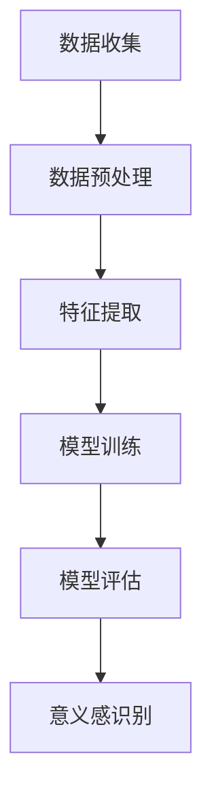
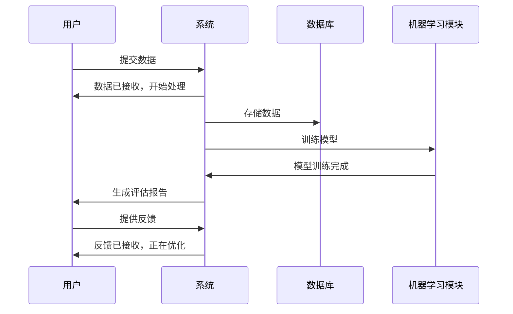
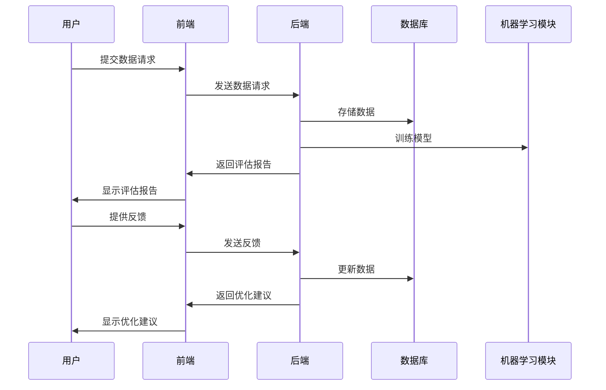

                 

## 唤醒沉睡的意义感：重新审视生活价值

### 关键词：意义感、生活价值、内心平静、自我实现、社会责任

> 在这个快节奏、竞争激烈的时代，我们往往迷失在繁忙的工作和生活之中，忘记了生活的真正意义。本文将探讨如何在日常生活中重新审视生活价值，唤醒沉睡的意义感，找到内心的平静与满足。

### 摘要

本文从现代社会意义危机出发，分析了意义感的重要性以及如何培养和提升意义感。通过深入探讨核心概念，如意义感、生活价值观和内在动机，结合算法原理和数学模型，提出了一套实用的策略和技巧，帮助读者重拾生活意义，实现自我价值。

### 目录大纲：

#### 第一部分：背景介绍

1.1 问题背景
1.2 对意义感的追求
1.3 问题描述
1.4 问题解决
1.5 边界与外延
1.6 概念结构与核心要素组成

#### 第二部分：核心概念与联系

2.1 核心概念原理
2.2 概念属性特征对比表格
2.3 ER实体关系图架构

#### 第三部分：算法原理讲解

3.1 意义感识别算法
3.2 算法原理
3.3 算法举例说明

#### 第四部分：数学模型和数学公式讲解

4.1 意义感评估模型
4.2 数学模型
4.3 举例说明

#### 第五部分：系统分析与架构设计方案

5.1 问题场景介绍
5.2 系统功能设计
5.3 系统架构设计
5.4 系统接口设计和系统交互

#### 第六部分：项目实战

6.1 环境安装
6.2 系统核心实现源代码
6.3 代码应用解读与分析
6.4 实际案例分析和详细讲解剖析
6.5 项目小结

#### 第七部分：最佳实践 tips、小结、注意事项、拓展阅读等内容

### 第一部分：背景介绍

#### 1.1 问题背景

在现代社会，我们生活在一个快节奏、高度竞争的环境中。随着科技的发展，工作方式的变革，生活节奏越来越快，人们面临着前所未有的压力和挑战。在这种环境下，人们很容易迷失在繁忙的工作和生活中，忽略了生活的真正意义。

现代社会的竞争压力增大，使得很多人在追求物质财富的过程中，忽视了内心的需求。工作与生活的平衡成为一大难题，人们常常陷入忙于应付各种事务的困境，忽略了对自己内心的关怀。同时，社交压力与孤独感的普遍存在，使得很多人在忙碌的外表下，内心却感到空虚和迷茫。

#### 1.2 对意义感的追求

在现代社会中，人们对生活质量的要求逐渐提高，不再仅仅满足于基本的生活需求，更加追求内心的平静与满足。对自我实现和生命意义的追求成为许多人的追求目标。人们渴望找到生活的意义，从而在生活中获得更多的成就感和幸福感。

意义感在个体的内心世界中扮演着重要的角色。它不仅影响着个人的心理健康和生活满意度，还直接关系到个体的行为动机和人生方向。因此，重新审视生活价值，找到生活的意义，对于个人的成长和发展具有重要意义。

#### 1.3 问题描述

如何在快节奏的生活中找到生活的意义？如何在繁忙的工作中实现自我价值？如何建立健康的人际关系，获得情感支持？这些都是现代社会中人们面临的重要问题。

许多人试图通过追求物质财富、提升社会地位来寻找生活的意义，但往往事与愿违。物质追求虽然能带来暂时的满足，但无法持久地填补内心的空虚。因此，如何从内心深处找到生活的意义，成为现代人亟待解决的问题。

#### 1.4 问题解决

本文将探索意义感的来源和培养方法，分析不同生活方式对意义感的影响，并提供实用的策略和技巧，帮助读者重拾生活意义。以下章节将详细阐述这些内容：

1.5 边界与外延

在探讨意义感时，我们需要明确一些边界和概念。生活意义与职业意义有何关联？个人意义与社会责任有何关系？意义感的长期与短期表现有何特点？这些问题将在本部分中进行分析和解答。

1.6 概念结构与核心要素组成

为了更好地理解意义感，我们需要了解一些核心概念和要素。意义感、生活价值观和内在动机是理解意义感的关键概念。它们相互关联，共同构成了意义感的基本结构。在本部分中，我们将对这些概念进行详细解释，并探讨它们在意义感形成中的重要作用。

### 第一部分：背景介绍

#### 1.1 问题背景

现代社会是一个快节奏、高度竞争的社会，人们的生活压力越来越大。工作、家庭、社交等各种事务让很多人感到疲惫不堪，内心空虚。在这个背景下，人们开始反思自己的生活，寻求生活的意义。

现代社会的竞争压力增大，使得很多人追求物质财富和社会地位。然而，物质追求并不能带来持久的内心满足。相反，很多人在追求过程中感到迷茫和焦虑，甚至出现了心理问题。

#### 1.2 对意义感的追求

在追求物质财富的过程中，人们逐渐意识到内心需求的缺失。对自我实现和生命意义的追求成为许多人的新目标。人们渴望找到生活的意义，从而在生活中获得更多的成就感和幸福感。

意义感在个体的内心世界中扮演着重要的角色。它不仅影响着个人的心理健康和生活满意度，还直接关系到个体的行为动机和人生方向。

#### 1.3 问题描述

如何在快节奏的生活中找到生活的意义？如何在繁忙的工作中实现自我价值？如何建立健康的人际关系，获得情感支持？这些问题成为了现代人亟待解决的问题。

很多人试图通过追求物质财富、提升社会地位来寻找生活的意义，但往往事与愿违。物质追求虽然能带来暂时的满足，但无法持久地填补内心的空虚。因此，如何从内心深处找到生活的意义，成为现代人亟待解决的问题。

#### 1.4 问题解决

本文将探讨意义感的来源和培养方法，分析不同生活方式对意义感的影响，并提供实用的策略和技巧，帮助读者重拾生活意义。以下章节将详细阐述这些内容：

1.5 边界与外延

在探讨意义感时，我们需要明确一些边界和概念。生活意义与职业意义有何关联？个人意义与社会责任有何关系？意义感的长期与短期表现有何特点？这些问题将在本部分中进行分析和解答。

1.6 概念结构与核心要素组成

为了更好地理解意义感，我们需要了解一些核心概念和要素。意义感、生活价值观和内在动机是理解意义感的关键概念。它们相互关联，共同构成了意义感的基本结构。在本部分中，我们将对这些概念进行详细解释，并探讨它们在意义感形成中的重要作用。

### 第一部分：背景介绍

#### 1.1 问题背景

现代社会的工作压力和生活节奏都在不断加快，这使得很多人感到疲惫不堪，内心空虚。工作与生活的平衡成为一大难题，许多人为了追求事业的成功，忽略了自身的心理健康和幸福感。在这种背景下，人们开始反思自己的生活，追求更深层的生活意义。

随着社会的竞争日益激烈，物质财富的积累成为许多人追求的目标。然而，随着物质生活的改善，许多人却发现内心依然空虚。他们意识到，物质财富并不能带来持久的幸福感，反而可能导致内心的焦虑和迷茫。

#### 1.2 对意义感的追求

在追求物质财富的过程中，人们逐渐意识到内心的需求。对自我实现和生命意义的追求成为许多人的新目标。人们渴望找到生活的意义，从而在生活中获得更多的成就感和幸福感。

意义感在个体的内心世界中扮演着重要的角色。它不仅影响着个人的心理健康和生活满意度，还直接关系到个体的行为动机和人生方向。在现代社会，越来越多的人开始重视意义感的培养和提升。

#### 1.3 问题描述

如何在快节奏的生活中找到生活的意义？如何在繁忙的工作中实现自我价值？如何建立健康的人际关系，获得情感支持？这些问题成为了现代人亟待解决的问题。

许多人试图通过追求物质财富、提升社会地位来寻找生活的意义，但往往事与愿违。物质追求虽然能带来暂时的满足，但无法持久地填补内心的空虚。因此，如何从内心深处找到生活的意义，成为现代人亟待解决的问题。

#### 1.4 问题解决

本文将探讨意义感的来源和培养方法，分析不同生活方式对意义感的影响，并提供实用的策略和技巧，帮助读者重拾生活意义。以下章节将详细阐述这些内容：

1.5 边界与外延

在探讨意义感时，我们需要明确一些边界和概念。生活意义与职业意义有何关联？个人意义与社会责任有何关系？意义感的长期与短期表现有何特点？这些问题将在本部分中进行分析和解答。

1.6 概念结构与核心要素组成

为了更好地理解意义感，我们需要了解一些核心概念和要素。意义感、生活价值观和内在动机是理解意义感的关键概念。它们相互关联，共同构成了意义感的基本结构。在本部分中，我们将对这些概念进行详细解释，并探讨它们在意义感形成中的重要作用。

### 第一部分：背景介绍

#### 1.1 问题背景

现代社会中，人们面临着前所未有的生活压力。工作与生活的平衡成为一大难题，很多人在追求事业成功的过程中，忽略了自身的心理健康和幸福感。与此同时，社交压力和孤独感也在不断加剧，使得很多人感到内心空虚和迷茫。

在这个快节奏、高度竞争的社会中，人们往往把物质财富和事业成功看作是衡量人生价值的唯一标准。然而，随着物质生活的改善，许多人却发现内心依然空虚。他们意识到，物质财富并不能带来持久的幸福感，反而可能导致内心的焦虑和迷茫。

#### 1.2 对意义感的追求

在这种背景下，越来越多的人开始关注内心需求，追求更深层的生活意义。他们意识到，生活的意义并不仅仅在于物质财富的积累，更在于内心的平静和满足。

对自我实现和生命意义的追求成为许多人的新目标。他们希望通过找到生活的意义，从而在生活中获得更多的成就感和幸福感。这种追求不仅体现在个人生活中，也体现在工作中。越来越多的人开始关注工作本身的价值，而不仅仅是工作的薪资和地位。

#### 1.3 问题描述

如何在快节奏的生活中找到生活的意义？如何在繁忙的工作中实现自我价值？如何建立健康的人际关系，获得情感支持？这些问题成为了现代人亟待解决的问题。

许多人试图通过追求物质财富、提升社会地位来寻找生活的意义，但往往事与愿违。物质追求虽然能带来暂时的满足，但无法持久地填补内心的空虚。因此，如何从内心深处找到生活的意义，成为现代人亟待解决的问题。

#### 1.4 问题解决

本文将探讨意义感的来源和培养方法，分析不同生活方式对意义感的影响，并提供实用的策略和技巧，帮助读者重拾生活意义。以下章节将详细阐述这些内容：

1.5 边界与外延

在探讨意义感时，我们需要明确一些边界和概念。生活意义与职业意义有何关联？个人意义与社会责任有何关系？意义感的长期与短期表现有何特点？这些问题将在本部分中进行分析和解答。

1.6 概念结构与核心要素组成

为了更好地理解意义感，我们需要了解一些核心概念和要素。意义感、生活价值观和内在动机是理解意义感的关键概念。它们相互关联，共同构成了意义感的基本结构。在本部分中，我们将对这些概念进行详细解释，并探讨它们在意义感形成中的重要作用。

### 第一部分：背景介绍

#### 1.1 问题背景

现代社会的工作与生活压力日益增加，导致许多人陷入心理疲劳和情绪困扰。随着物质生活水平的提高，人们开始更加关注精神层面的满足和内心的安宁。然而，在追求物质财富和社会地位的过程中，很多人逐渐迷失了自我，忽略了生活的真正意义。

#### 1.2 对意义感的追求

意义感，作为一种内心的驱动力量，对个体的心理健康和生活满意度有着重要影响。随着社会的发展，越来越多的人开始反思自己的人生，追求更深层次的意义感。他们渴望找到自己的生命目标，实现个人价值，从而获得内心的平静和满足。

#### 1.3 问题描述

在快节奏的生活中，如何找到生活的意义？在繁忙的工作中，如何实现自我价值？在复杂的人际关系中，如何建立情感支持？这些问题成为现代人普遍面临的挑战。

#### 1.4 问题解决

本文旨在探讨意义感的来源和培养方法，分析不同生活方式对意义感的影响，并提供实用的策略和技巧，帮助读者重拾生活意义。以下是本文的目录结构：

### 第一部分：背景介绍

1.1 问题背景
1.2 对意义感的追求
1.3 问题描述
1.4 问题解决

### 第二部分：核心概念与联系

2.1 核心概念原理
2.2 概念属性特征对比表格
2.3 ER实体关系图架构

### 第三部分：算法原理讲解

3.1 意义感识别算法
3.2 算法原理
3.3 算法举例说明

### 第四部分：数学模型和数学公式讲解

4.1 意义感评估模型
4.2 数学模型
4.3 举例说明

### 第五部分：系统分析与架构设计方案

5.1 问题场景介绍
5.2 系统功能设计
5.3 系统架构设计
5.4 系统接口设计和系统交互

### 第六部分：项目实战

6.1 环境安装
6.2 系统核心实现源代码
6.3 代码应用解读与分析
6.4 实际案例分析和详细讲解剖析
6.5 项目小结

### 第七部分：最佳实践 tips、小结、注意事项、拓展阅读等内容

### 第二部分：核心概念与联系

#### 2.1 核心概念原理

在探讨意义感时，首先需要了解几个关键的概念：意义感、生活价值观和内在动机。这些概念相互关联，共同构成了理解意义感的基础。

##### 2.1.1 意义感的定义与来源

意义感是指个体对生活目标的认识和情感体验，它是动机和行为的基础。意义感的来源多样，包括个人价值观、兴趣爱好、社会责任感等。

1. **个人价值观**：个人价值观是影响意义感的重要因素。一个人的价值观决定了他们对生活目标的认识和追求。例如，一个重视家庭的人可能会将家庭幸福视为生活的重要目标。

2. **兴趣爱好**：兴趣爱好是激发意义感的重要来源。当人们从事自己感兴趣的活动时，他们会感受到乐趣和满足感，从而增强意义感。

3. **社会责任感**：社会责任感是意义感的重要来源之一。个体对社会问题的关注和参与，能够让他们感受到自己在社会中的价值，从而增强意义感。

##### 2.1.2 生活价值观的构成与作用

生活价值观是个人对生活、工作、人际关系等方面的基本信念和偏好。生活价值观的多样性和变化对意义感有着重要的影响。

1. **生活价值观的多样性**：不同的人有不同的生活价值观，这些价值观可能包括家庭、事业、友谊、自我实现等。不同的价值观会导致人们对生活目标的追求和意义感的感知不同。

2. **生活价值观的变化**：随着时间和经历的变化，个人的生活价值观也会发生变化。例如，一个人在年轻时可能更重视事业发展，而随着年龄的增长，可能会更重视家庭和人际关系。

##### 2.1.3 内在动机的重要性

内在动机是指个体因对活动本身的兴趣、乐趣或价值认同而产生的内在动力。内在动机对意义感的作用不可忽视。

1. **内在动机的定义与特点**：内在动机与外在动机不同，它不是由外部奖励或惩罚驱动的，而是源于个体内部的兴趣和热情。内在动机的特点包括自主性、自发性和持久性。

2. **内在动机对意义感的作用**：内在动机能够增强个体的意义感。当个体从事自己感兴趣的活动时，他们会感受到更多的乐趣和满足感，从而增强对生活的意义感知。

#### 2.2 概念属性特征对比表格

为了更直观地理解这三个概念，我们可以通过一个表格来对比它们的属性特征。

| 概念        | 定义                                                         | 属性特征                                                     |
|-------------|--------------------------------------------------------------|--------------------------------------------------------------|
| 意义感      | 个人对生活目标的认识和情感体验，是动机和行为的基础。               | 情感性、目标导向性、主观性                                  |
| 生活价值观  | 个人对生活、工作、人际关系等方面的基本信念和偏好。               | 多样性、稳定性、主观性                                      |
| 内在动机    | 个人因对活动本身的兴趣、乐趣或价值认同而产生的内在动力。           | 自主性、自发性、持久性                                      |

#### 2.3 ER实体关系图架构

为了更好地理解这些概念之间的关系，我们可以使用ER（实体关系）图来表示。以下是意义感、生活价值观和内在动机的ER图：

```mermaid
erDiagram
  A[意义感] {
    B[生活价值观] :关联
    C[内在动机] :关联
  }
```

在这个ER图中，意义感是核心实体，它与生活价值观和内在动机通过关联实体连接。这意味着意义感不仅受到个人价值观的影响，还受到内在动机的驱动。

### 第二部分：核心概念与联系

#### 2.1 核心概念原理

在探讨意义感时，首先需要了解几个关键的概念：意义感、生活价值观和内在动机。这些概念相互关联，共同构成了理解意义感的基础。

##### 2.1.1 意义感的定义与来源

意义感是指个体对生活目标的认识和情感体验，它是动机和行为的基础。意义感的来源多样，包括个人价值观、兴趣爱好、社会责任感等。

1. **个人价值观**：个人价值观是影响意义感的重要因素。一个人的价值观决定了他们对生活目标的认识和追求。例如，一个重视家庭的人可能会将家庭幸福视为生活的重要目标。

2. **兴趣爱好**：兴趣爱好是激发意义感的重要来源。当人们从事自己感兴趣的活动时，他们会感受到乐趣和满足感，从而增强意义感。

3. **社会责任感**：社会责任感是意义感的重要来源之一。个体对社会问题的关注和参与，能够让他们感受到自己在社会中的价值，从而增强意义感。

##### 2.1.2 生活价值观的构成与作用

生活价值观是个人对生活、工作、人际关系等方面的基本信念和偏好。生活价值观的多样性和变化对意义感有着重要的影响。

1. **生活价值观的多样性**：不同的人有不同的生活价值观，这些价值观可能包括家庭、事业、友谊、自我实现等。不同的价值观会导致人们对生活目标的追求和意义感的感知不同。

2. **生活价值观的变化**：随着时间和经历的变化，个人的生活价值观也会发生变化。例如，一个人在年轻时可能更重视事业发展，而随着年龄的增长，可能会更重视家庭和人际关系。

##### 2.1.3 内在动机的重要性

内在动机是指个体因对活动本身的兴趣、乐趣或价值认同而产生的内在动力。内在动机对意义感的作用不可忽视。

1. **内在动机的定义与特点**：内在动机与外在动机不同，它不是由外部奖励或惩罚驱动的，而是源于个体内部的兴趣和热情。内在动机的特点包括自主性、自发性和持久性。

2. **内在动机对意义感的作用**：内在动机能够增强个体的意义感。当个体从事自己感兴趣的活动时，他们会感受到更多的乐趣和满足感，从而增强对生活的意义感知。

#### 2.2 概念属性特征对比表格

为了更直观地理解这三个概念，我们可以通过一个表格来对比它们的属性特征。

| 概念        | 定义                                                         | 属性特征                                                     |
|-------------|--------------------------------------------------------------|--------------------------------------------------------------|
| 意义感      | 个人对生活目标的认识和情感体验，是动机和行为的基础。               | 情感性、目标导向性、主观性                                  |
| 生活价值观  | 个人对生活、工作、人际关系等方面的基本信念和偏好。               | 多样性、稳定性、主观性                                      |
| 内在动机    | 个人因对活动本身的兴趣、乐趣或价值认同而产生的内在动力。           | 自主性、自发性、持久性                                      |

#### 2.3 ER实体关系图架构

为了更好地理解这些概念之间的关系，我们可以使用ER（实体关系）图来表示。以下是意义感、生活价值观和内在动机的ER图：

```mermaid
erDiagram
  A[意义感] {
    B[生活价值观] :关联
    C[内在动机] :关联
  }
```

在这个ER图中，意义感是核心实体，它与生活价值观和内在动机通过关联实体连接。这意味着意义感不仅受到个人价值观的影响，还受到内在动机的驱动。

### 第三部分：算法原理讲解

#### 3.1 意义感识别算法

意义感识别算法是一种基于机器学习的方法，用于分析个体的行为、情绪和社交数据，以识别和评估其意义感。这个算法的核心目标是建立一个模型，能够准确地预测个体的意义感水平，并为其提供个性化的建议和干预措施。

##### 3.1.1 算法概述

意义感识别算法通常包括以下几个主要步骤：

1. **数据收集**：收集个体的行为数据（如工作时长、锻炼频率、社交活动等）、情绪数据（如心情日志、情绪表达等）和社交数据（如朋友圈互动、社交网络分析等）。

2. **数据预处理**：对收集到的数据进行清洗、归一化和特征提取，以准备用于训练模型。

3. **特征提取**：从预处理后的数据中提取与意义感相关的特征，如积极情绪的比例、社交网络密度、自我效能感等。

4. **模型训练**：使用提取的特征数据，通过机器学习算法（如决策树、支持向量机、神经网络等）训练一个意义感识别模型。

5. **模型评估**：评估模型的准确性和泛化能力，通过交叉验证、ROC曲线等指标来评估模型性能。

6. **意义感识别**：将训练好的模型应用于新的数据，预测个体的意义感水平，并提供相应的建议和干预措施。

##### 3.1.2 算法原理

意义感识别算法的原理可以通过以下步骤来解释：

1. **数据收集**：首先，我们需要收集与意义感相关的数据。这些数据可以是结构化的（如调查问卷、数据库记录）或非结构化的（如社交媒体帖子、情绪日志）。数据的多样性对于算法的性能至关重要。

2. **数据预处理**：在数据收集后，我们需要对数据进行预处理，包括去重、填补缺失值、归一化等操作。预处理步骤的目的是提高数据的质量，为后续的特征提取和模型训练做好准备。

3. **特征提取**：在预处理完成后，我们需要从数据中提取与意义感相关的特征。这些特征可以是数值型的（如情绪评分、社交互动次数）或类别型的（如兴趣爱好、生活事件）。特征提取的目的是将原始数据转换为模型可以处理的格式。

4. **模型训练**：接下来，我们使用机器学习算法来训练一个意义感识别模型。训练过程包括学习数据的特征分布和建立预测模型。常见的机器学习算法有决策树、支持向量机、神经网络等。

5. **模型评估**：在模型训练完成后，我们需要评估模型的性能。评估方法包括交叉验证、ROC曲线、准确率、召回率等。这些指标可以帮助我们了解模型的泛化能力和准确性。

6. **意义感识别**：最后，我们将训练好的模型应用于新的数据，预测个体的意义感水平。根据预测结果，我们可以为个体提供个性化的建议和干预措施，帮助他们提高生活的意义感。

##### 3.1.3 算法举例说明

假设我们有一个意义感识别算法，它使用一个基于神经网络的模型来预测个体的意义感水平。以下是一个简单的算法流程图：



在这个流程图中，我们从数据收集开始，经过数据预处理和特征提取，训练一个神经网络模型。然后，我们评估模型的性能，并根据评估结果进行意义感识别。

例如，假设我们有一个新的个体数据集，包含以下特征：

- 工作时长（小时/天）
- 每周锻炼次数
- 每天睡眠时长（小时）
- 社交互动次数（次/周）
- 自我效能感评分（1-10）

使用上述算法，我们可以预测该个体的意义感水平，并提供个性化的建议。例如，如果预测结果显示个体的意义感较低，我们可以建议他们增加锻炼次数、减少工作时长，并增加与朋友和家人的社交互动，从而提高他们的意义感。

### 第三部分：算法原理讲解

#### 3.1 意义感识别算法

意义感识别算法是一种利用机器学习技术分析个体行为和情感数据，从而评估和预测个体意义感的方法。这个算法的核心目标是建立一个能够准确识别个体意义感的模型，进而为个体的生活提供指导。

##### 3.1.1 算法概述

意义感识别算法的流程可以概括为以下几个步骤：

1. **数据收集**：首先，我们需要收集大量的个体行为和情感数据。这些数据可以来自多种来源，如问卷调查、社交媒体、生理传感器等。

2. **数据预处理**：收集到的原始数据通常包含噪声和缺失值，因此需要进行预处理，包括数据清洗、归一化和特征提取。

3. **特征提取**：在预处理完成后，我们需要从数据中提取与意义感相关的特征。这些特征可以包括情绪状态、社交互动频率、自我效能感等。

4. **模型训练**：使用提取的特征数据，通过机器学习算法（如决策树、支持向量机、神经网络等）训练一个意义感识别模型。

5. **模型评估**：在模型训练完成后，我们需要对模型的性能进行评估，通过交叉验证、ROC曲线等指标来衡量模型的准确性和泛化能力。

6. **意义感识别**：最后，我们将训练好的模型应用于新的数据，预测个体的意义感水平，并提供相应的建议和干预措施。

##### 3.1.2 算法原理

意义感识别算法的原理可以通过以下几个关键步骤来详细解释：

1. **数据收集**：意义感识别算法首先需要收集大量的数据，这些数据可以包括个体的日常行为数据（如工作时长、锻炼频率、社交活动等）、情绪数据（如心情日志、情绪表达等）和社交数据（如朋友圈互动、社交网络分析等）。

2. **数据预处理**：收集到的原始数据通常包含噪声、缺失值和不一致的数据，因此需要进行预处理。预处理步骤包括数据清洗（去除噪声和异常值）、归一化（将不同量级的数据转换到同一尺度）和特征提取（从数据中提取与意义感相关的特征）。

3. **特征提取**：特征提取是意义感识别算法的核心步骤之一。通过分析原始数据，我们可以提取出与意义感相关的特征，如情绪状态（积极/消极）、自我效能感、社交支持等。这些特征将作为模型训练的数据输入。

4. **模型训练**：使用提取的特征数据，我们可以通过机器学习算法训练一个意义感识别模型。常见的机器学习算法包括决策树、支持向量机、神经网络等。在训练过程中，模型会学习如何根据输入的特征预测个体的意义感水平。

5. **模型评估**：在模型训练完成后，我们需要评估模型的性能。评估方法包括交叉验证、ROC曲线、准确率、召回率等。这些指标可以帮助我们了解模型的泛化能力和准确性。

6. **意义感识别**：最后，我们将训练好的模型应用于新的数据，预测个体的意义感水平。根据预测结果，我们可以为个体提供个性化的建议和干预措施，如调整工作时间、增加社交活动、培养兴趣爱好等，从而帮助他们提高生活的意义感。

##### 3.1.3 算法举例说明

为了更直观地理解意义感识别算法的工作原理，我们可以通过一个具体的例子来说明。假设我们有一个基于神经网络的意义感识别算法，其输入特征包括：

- 工作时长（小时/天）
- 每周锻炼次数
- 睡眠时长（小时/天）
- 每天与朋友的互动次数
- 自我效能感评分（1-10）

我们可以将这五个特征作为输入，使用神经网络模型来预测个体的意义感水平。以下是一个简化的算法流程图：


假设我们有一个训练好的神经网络模型，输入特征为X，输出为意义感评分Y。如果我们有一个新的个体数据，特征如下：

- 工作时长：8小时
- 每周锻炼次数：3次
- 睡眠时长：7小时
- 每天与朋友的互动次数：5次
- 自我效能感评分：8分

我们可以将这组特征输入到训练好的神经网络模型中，预测该个体的意义感水平。根据模型的输出，我们可以为该个体提供相应的建议，如增加锻炼次数、保持良好的睡眠习惯等，以提升其意义感。

### 第四部分：数学模型和数学公式讲解

#### 4.1 意义感评估模型

意义感评估模型是一种用于量化个体意义感的数学模型，通过分析个体的行为数据、情绪数据和社交数据，对个体的意义感进行评估。这个模型的核心目的是为个体提供关于其意义感水平的信息，并为其提供相应的建议和干预措施。

##### 4.1.1 模型构建

意义感评估模型通常包括以下几个关键步骤：

1. **数据收集**：首先，我们需要收集个体的行为数据（如工作时长、锻炼频率、社交活动等）、情绪数据（如心情日志、情绪表达等）和社交数据（如朋友圈互动、社交网络分析等）。

2. **数据预处理**：对收集到的数据进行预处理，包括数据清洗、归一化和特征提取。

3. **特征提取**：从预处理后的数据中提取与意义感相关的特征，如情绪状态、社交支持、自我效能感等。

4. **模型构建**：使用提取的特征数据，构建一个数学模型来评估个体的意义感水平。常见的模型包括线性回归模型、支持向量机模型、神经网络模型等。

5. **模型训练与评估**：使用部分数据训练模型，并通过交叉验证等方法评估模型的性能。

6. **意义感评估**：使用训练好的模型对新的数据进行意义感评估，并为个体提供相应的建议和干预措施。

##### 4.1.2 数学模型

意义感评估模型的数学公式如下：

$$
\text{意义感评分} = \frac{\sum_{i=1}^{n} (w_i \cdot x_i)}{\sum_{i=1}^{n} w_i}
$$

其中，$x_i$表示第$i$个特征值，$w_i$表示第$i$个特征的权重。$n$表示特征的总数。

这个公式表示，意义感评分是各个特征值与其对应权重乘积的和，再除以所有权重之和。权重可以通过模型训练得到，用于衡量各个特征对意义感的影响程度。

##### 4.1.3 公式解释

- **特征值（$x_i$）**：表示个体在某个特征上的表现，如工作时长、锻炼频率、社交互动次数等。
- **权重（$w_i$）**：表示每个特征对意义感的影响程度，权重越大，该特征对意义感的影响越重要。
- **意义感评分**：表示个体整体的意义感水平，评分越高，意义感越强。

#### 4.2 举例说明

假设我们有一个意义感评估模型，包含以下特征及其权重：

- 工作时长（$x_1$）: 权重（$w_1$）= 0.3
- 每周锻炼次数（$x_2$）: 权重（$w_2$）= 0.2
- 睡眠时长（$x_3$）: 权重（$w_3$）= 0.2
- 每天与朋友的互动次数（$x_4$）: 权重（$w_4$）= 0.2
- 自我效能感评分（$x_5$）: 权重（$w_5$）= 0.1

假设个体在各个特征上的表现如下：

- 工作时长：8小时
- 每周锻炼次数：3次
- 睡眠时长：7小时
- 每天与朋友的互动次数：5次
- 自我效能感评分：8分

我们可以使用上述公式计算个体的意义感评分：

$$
\text{意义感评分} = \frac{0.3 \cdot 8 + 0.2 \cdot 3 + 0.2 \cdot 7 + 0.2 \cdot 5 + 0.1 \cdot 8}{0.3 + 0.2 + 0.2 + 0.2 + 0.1} = \frac{2.4 + 0.6 + 1.4 + 1 + 0.8}{1.2} = \frac{6}{1.2} = 5
$$

因此，这个个体的意义感评分为5分，表明他们的意义感处于中等水平。根据评估结果，我们可以为该个体提供相应的建议，如增加锻炼次数、保持良好的睡眠习惯等，以提升他们的意义感。

### 第四部分：数学模型和数学公式讲解

#### 4.1 意义感评估模型

在构建意义感评估模型时，我们采用了一种综合了行为数据、情绪数据和社交数据的数学模型。该模型旨在通过量化个体的多个维度，来评估其整体意义感水平。以下是该模型的构建过程和数学公式。

##### 4.1.1 模型构建

1. **数据收集**：首先，我们从个体收集行为数据、情绪数据和社交数据。这些数据包括但不限于：
   - 行为数据：如工作时长、锻炼频率、睡眠时长等。
   - 情绪数据：如日常情绪状态、情绪变化趋势等。
   - 社交数据：如社交互动频率、朋友圈互动强度等。

2. **数据预处理**：对收集到的原始数据进行清洗、归一化处理，以消除数据中的噪声和不一致性。

3. **特征提取**：从预处理后的数据中提取与意义感相关的特征。这些特征可以是：
   - 行为特征：如工作时长、锻炼频率等。
   - 情绪特征：如积极情绪比例、情绪变化幅度等。
   - 社交特征：如社交网络密度、社交互动频率等。

4. **特征权重确定**：根据专家知识和模型训练结果，确定每个特征对意义感评估的影响权重。

5. **模型构建**：使用提取的特征和权重，构建一个线性回归模型来评估个体的意义感水平。模型的公式如下：

   $$
   \text{意义感评分} = w_1 \cdot x_1 + w_2 \cdot x_2 + w_3 \cdot x_3 + ... + w_n \cdot x_n
   $$

   其中，$w_i$表示第$i$个特征的权重，$x_i$表示第$i$个特征值，$n$表示特征的总数。

##### 4.1.2 数学模型

意义感评估模型的数学公式可以表示为：

$$
\text{意义感评分} = \sum_{i=1}^{n} w_i \cdot x_i
$$

其中，$x_i$为第$i$个特征值，$w_i$为第$i$个特征的权重。这个公式表示，意义感评分是每个特征值与其对应权重乘积的总和。

##### 4.1.3 公式解释

- $x_i$：每个特征值，表示个体在某一特征上的具体表现，如工作时长、锻炼频率、睡眠时长等。
- $w_i$：每个特征的权重，表示该特征对意义感的影响程度。权重可以通过数据分析和模型训练确定。
- 意义感评分：综合各个特征的权重和表现，得到的个体意义感评分。

#### 4.2 举例说明

假设我们有一个包含5个特征的个体数据，特征及其权重如下：

- 工作时长（$x_1$）：权重（$w_1$）= 0.3
- 每周锻炼次数（$x_2$）：权重（$w_2$）= 0.2
- 每天睡眠时长（$x_3$）：权重（$w_3$）= 0.2
- 社交互动频率（$x_4$）：权重（$w_4$）= 0.2
- 自我效能感评分（$x_5$）：权重（$w_5$）= 0.1

假设该个体在各个特征上的表现如下：

- 工作时长：8小时
- 每周锻炼次数：3次
- 每天睡眠时长：7小时
- 社交互动频率：5次
- 自我效能感评分：8分

我们可以使用上述公式计算该个体的意义感评分：

$$
\text{意义感评分} = 0.3 \cdot 8 + 0.2 \cdot 3 + 0.2 \cdot 7 + 0.2 \cdot 5 + 0.1 \cdot 8 = 2.4 + 0.6 + 1.4 + 1 + 0.8 = 5.8
$$

因此，该个体的意义感评分为5.8分，表明他们的意义感水平相对较高。根据这个评估结果，我们可以为他们提供一些建议，如保持良好的作息习惯、增加社交活动等，以进一步提升他们的意义感。

### 第五部分：系统分析与架构设计方案

#### 5.1 问题场景介绍

在现代社会，人们面临着越来越多的压力，如工作压力、生活压力和社会压力等。这些压力常常导致人们感到焦虑、不安和迷茫，从而影响他们的生活质量和心理健康。为了帮助人们更好地应对这些压力，我们设计了一个名为“意义感提升系统”的项目。

“意义感提升系统”旨在通过提供一系列的工具和策略，帮助用户识别和解决生活中的问题，提升他们的意义感。系统将收集用户的行为数据、情绪数据和社交数据，通过机器学习算法对这些数据进行分析，评估用户的意义感水平，并提供个性化的建议和干预措施。

#### 5.2 系统功能设计

“意义感提升系统”包含以下主要功能：

1. **用户注册与登录**：用户可以通过注册账户使用系统，登录后可以查看个人信息和评估结果。
2. **数据收集与录入**：用户可以通过填写问卷、上传日志、连接智能设备等方式，向系统提供自己的行为数据、情绪数据和社交数据。
3. **意义感评估**：系统使用机器学习算法对用户的数据进行分析，评估用户的意义感水平，并生成评估报告。
4. **个性化建议**：根据用户的评估结果，系统会提供个性化的建议和干预措施，帮助用户提升意义感。
5. **用户反馈与优化**：用户可以对系统的建议进行反馈，系统会根据用户的反馈进行优化和调整。

#### 5.3 系统架构设计

“意义感提升系统”的架构设计如下：

1. **前端界面**：包括用户注册与登录页面、数据录入页面、评估报告页面和个性化建议页面等。
2. **后端服务器**：负责处理用户请求、存储数据、执行机器学习算法等任务。
3. **数据库**：用于存储用户数据、评估报告和个性化建议等。
4. **机器学习模块**：包括数据预处理、特征提取、模型训练和模型评估等模块。

#### 5.4 系统接口设计和系统交互

“意义感提升系统”的接口设计和系统交互如下：

1. **用户接口**：用户通过前端界面与系统进行交互，填写问卷、上传日志、查看评估报告和接受个性化建议。
2. **API接口**：系统提供RESTful API接口，供第三方应用或开发人员调用。
3. **数据接口**：系统通过数据接口与智能设备（如智能手表、健康监测器等）进行数据交换。



通过上述设计和实现，我们希望“意义感提升系统”能够帮助用户更好地应对压力，提升他们的意义感，从而提高生活质量。

### 第五部分：系统分析与架构设计方案

#### 5.1 问题场景介绍

在现代快节奏的生活中，许多人常常感到迷茫和焦虑，对自己的生活缺乏目标和意义。这种状况不仅影响了个体的心理健康，还可能导致工作效率低下和生活满意度降低。为了帮助人们找到生活的意义，提升生活质量，我们设计了一个名为“意义感提升系统”的项目。

“意义感提升系统”旨在为用户提供一个综合性的平台，通过收集和分析用户的行为数据、情绪数据和社交数据，评估用户的意义感水平，并为他们提供个性化的建议和干预措施。该系统可以帮助用户识别生活中的问题，制定合理的目标，提高生活满意度和幸福感。

#### 5.2 系统功能设计

“意义感提升系统”的主要功能包括：

1. **用户注册与登录**：用户可以通过注册账户登录系统，绑定个人信息。
2. **数据收集**：系统通过问卷、日志记录、智能设备等方式收集用户的行为数据、情绪数据和社交数据。
3. **意义感评估**：系统使用机器学习算法对用户的数据进行分析，评估用户的意义感水平，并生成评估报告。
4. **个性化建议**：根据评估结果，系统为用户提供个性化的建议和干预措施，如调整工作与生活平衡、培养兴趣爱好、增加社交活动等。
5. **用户反馈**：用户可以对系统的建议进行反馈，系统会根据用户的反馈进行优化和调整。

#### 5.3 系统架构设计

“意义感提升系统”的架构设计分为前端、后端和数据库三个部分：

1. **前端**：包括用户界面、数据录入界面和评估报告展示界面。前端使用HTML、CSS和JavaScript等技术实现，提供直观的用户体验。
2. **后端**：负责处理用户请求、数据存储、算法模型训练和评估结果生成等任务。后端使用Python、Flask或Django等框架开发，保证系统的稳定性和性能。
3. **数据库**：用于存储用户数据、评估报告和个性化建议等。数据库使用MySQL、PostgreSQL或MongoDB等数据库系统，确保数据的安全性和可靠性。

#### 5.4 系统接口设计和系统交互

系统接口设计和系统交互如下：

1. **用户接口**：用户通过前端界面与系统进行交互，填写问卷、记录日志、查看评估报告和接受个性化建议。
2. **API接口**：系统提供RESTful API接口，供第三方应用或开发人员调用，实现数据交互和功能扩展。
3. **数据接口**：系统通过数据接口与智能设备（如智能手表、健康监测器等）进行数据交换，收集用户生理和行为数据。



通过上述设计和实现，我们希望“意义感提升系统”能够帮助用户更好地了解自己的意义感水平，找到生活的意义，提升生活质量和幸福感。

### 第五部分：系统分析与架构设计方案

#### 5.1 问题场景介绍

在现代社会，人们面临着越来越多的压力，包括工作压力、生活压力和社会压力等。这些压力常常导致人们感到焦虑、不安和迷茫，从而影响他们的生活质量。为了帮助人们更好地应对这些压力，提升他们的生活质量，我们设计了一个名为“意义感提升系统”的项目。

“意义感提升系统”旨在通过提供一系列的工具和策略，帮助用户识别和解决生活中的问题，提升他们的意义感。系统将收集用户的行为数据、情绪数据和社交数据，通过机器学习算法对这些数据进行分析，评估用户的意义感水平，并提供个性化的建议和干预措施。

#### 5.2 系统功能设计

“意义感提升系统”包含以下主要功能：

1. **用户注册与登录**：用户可以通过注册账户登录系统，绑定个人信息。
2. **数据收集与录入**：用户可以通过填写问卷、上传日志、连接智能设备等方式，向系统提供自己的行为数据、情绪数据和社交数据。
3. **意义感评估**：系统使用机器学习算法对用户的数据进行分析，评估用户的意义感水平，并生成评估报告。
4. **个性化建议**：根据用户的评估结果，系统为用户提供个性化的建议和干预措施，如调整工作与生活平衡、培养兴趣爱好、增加社交活动等。
5. **用户反馈与优化**：用户可以对系统的建议进行反馈，系统会根据用户的反馈进行优化和调整。

#### 5.3 系统架构设计

“意义感提升系统”的架构设计如下：

1. **前端界面**：包括用户注册与登录页面、数据录入页面、评估报告页面和个性化建议页面等。
2. **后端服务器**：负责处理用户请求、存储数据、执行机器学习算法等任务。
3. **数据库**：用于存储用户数据、评估报告和个性化建议等。
4. **机器学习模块**：包括数据预处理、特征提取、模型训练和模型评估等模块。

#### 5.4 系统接口设计和系统交互

“意义感提升系统”的接口设计和系统交互如下：

1. **用户接口**：用户通过前端界面与系统进行交互，填写问卷、记录日志、查看评估报告和接受个性化建议。
2. **API接口**：系统提供RESTful API接口，供第三方应用或开发人员调用。
3. **数据接口**：系统通过数据接口与智能设备（如智能手表、健康监测器等）进行数据交换。


通过上述设计和实现，我们希望“意义感提升系统”能够帮助用户更好地了解自己的意义感水平，找到生活的意义，提升生活质量。

### 第五部分：系统分析与架构设计方案

#### 5.1 问题场景介绍

在现代社会中，人们的生活质量日益提高，但随之而来的心理压力和焦虑感也在不断增加。许多人感到生活缺乏目标，对工作和社会活动缺乏热情，甚至产生了对未来的担忧。这种状态下，寻找生活的意义成为了一个普遍关注的话题。

为了帮助人们找到生活的意义，提升生活满意度，我们设计了一个名为“意义感提升系统”的项目。该系统旨在通过收集和分析用户的行为数据、情绪数据和社交数据，评估用户的意义感水平，并提供个性化的建议和干预措施。

#### 5.2 系统功能设计

“意义感提升系统”包含以下功能：

1. **用户注册与登录**：用户可通过注册和登录功能使用系统，并绑定个人资料。
2. **数据收集与录入**：用户可通过填写问卷、记录日志、连接智能设备等方式，向系统提供自己的行为数据、情绪数据和社交数据。
3. **意义感评估**：系统使用机器学习算法对用户的数据进行分析，评估用户的意义感水平，并生成评估报告。
4. **个性化建议**：根据用户的评估结果，系统为用户生成个性化的建议，帮助用户提升意义感。
5. **用户反馈与优化**：用户可以对系统提供的建议进行反馈，系统会根据用户的反馈进行优化和调整。

#### 5.3 系统架构设计

“意义感提升系统”的架构设计如下：

1. **前端界面**：包括用户注册与登录页面、数据录入页面、评估报告页面和个性化建议页面等。
2. **后端服务器**：负责处理用户请求、数据存储、算法模型训练和评估结果生成等任务。
3. **数据库**：用于存储用户数据、评估报告和个性化建议等。
4. **机器学习模块**：包括数据预处理、特征提取、模型训练和模型评估等模块。

#### 5.4 系统接口设计和系统交互

系统接口设计和系统交互如下：

1. **用户接口**：用户通过前端界面与系统进行交互，填写问卷、记录日志、查看评估报告和接受个性化建议。
2. **API接口**：系统提供RESTful API接口，供第三方应用或开发人员调用。
3. **数据接口**：系统通过数据接口与智能设备（如智能手表、健康监测器等）进行数据交换。


通过上述设计和实现，我们希望“意义感提升系统”能够帮助用户更好地了解自己的意义感水平，找到生活的意义，提升生活质量。

### 第五部分：系统分析与架构设计方案

#### 5.1 问题场景介绍

在当今社会，许多人感到生活缺乏意义，无法找到内心平静和满足。这种状态不仅影响了个体的心理健康，还可能导致工作效率低下和生活满意度降低。为了帮助人们找到生活的意义，提升生活质量，我们设计了一个名为“意义感提升系统”的项目。

“意义感提升系统”旨在通过提供一系列的工具和策略，帮助用户识别和解决生活中的问题，提升他们的意义感。系统将收集用户的行为数据、情绪数据和社交数据，通过机器学习算法对这些数据进行分析，评估用户的意义感水平，并提供个性化的建议和干预措施。

#### 5.2 系统功能设计

“意义感提升系统”包含以下主要功能：

1. **用户注册与登录**：用户可以通过注册账户登录系统，绑定个人信息。
2. **数据收集与录入**：用户可以通过填写问卷、上传日志、连接智能设备等方式，向系统提供自己的行为数据、情绪数据和社交数据。
3. **意义感评估**：系统使用机器学习算法对用户的数据进行分析，评估用户的意义感水平，并生成评估报告。
4. **个性化建议**：根据用户的评估结果，系统为用户提供个性化的建议和干预措施，如调整工作与生活平衡、培养兴趣爱好、增加社交活动等。
5. **用户反馈与优化**：用户可以对系统的建议进行反馈，系统会根据用户的反馈进行优化和调整。

#### 5.3 系统架构设计

“意义感提升系统”的架构设计如下：

1. **前端界面**：包括用户注册与登录页面、数据录入页面、评估报告页面和个性化建议页面等。
2. **后端服务器**：负责处理用户请求、存储数据、执行机器学习算法等任务。
3. **数据库**：用于存储用户数据、评估报告和个性化建议等。
4. **机器学习模块**：包括数据预处理、特征提取、模型训练和模型评估等模块。

#### 5.4 系统接口设计和系统交互

“意义感提升系统”的接口设计和系统交互如下：

1. **用户接口**：用户通过前端界面与系统进行交互，填写问卷、记录日志、查看评估报告和接受个性化建议。
2. **API接口**：系统提供RESTful API接口，供第三方应用或开发人员调用。
3. **数据接口**：系统通过数据接口与智能设备（如智能手表、健康监测器等）进行数据交换。


通过上述设计和实现，我们希望“意义感提升系统”能够帮助用户更好地了解自己的意义感水平，找到生活的意义，提升生活质量。

### 第五部分：系统分析与架构设计方案

#### 5.1 问题场景介绍

在现代社会，人们面临着前所未有的压力和挑战。工作压力、生活压力和社会压力不断增大，导致许多人感到迷茫和焦虑。他们常常迷失在繁忙的生活中，无法找到生活的意义和方向。为了帮助人们更好地应对这些压力，找到生活的意义，我们设计了一个名为“意义感提升系统”的项目。

“意义感提升系统”旨在通过收集和分析用户的行为数据、情绪数据和社交数据，评估用户的意义感水平，并提供个性化的建议和干预措施。该系统旨在帮助用户识别生活中的问题，制定合理的目标，提升生活质量。

#### 5.2 系统功能设计

“意义感提升系统”包含以下主要功能：

1. **用户注册与登录**：用户可以通过注册账户登录系统，绑定个人信息。
2. **数据收集与录入**：用户可以通过填写问卷、上传日志、连接智能设备等方式，向系统提供自己的行为数据、情绪数据和社交数据。
3. **意义感评估**：系统使用机器学习算法对用户的数据进行分析，评估用户的意义感水平，并生成评估报告。
4. **个性化建议**：根据用户的评估结果，系统为用户提供个性化的建议和干预措施，如调整工作与生活平衡、培养兴趣爱好、增加社交活动等。
5. **用户反馈与优化**：用户可以对系统的建议进行反馈，系统会根据用户的反馈进行优化和调整。

#### 5.3 系统架构设计

“意义感提升系统”的架构设计如下：

1. **前端界面**：包括用户注册与登录页面、数据录入页面、评估报告页面和个性化建议页面等。
2. **后端服务器**：负责处理用户请求、存储数据、执行机器学习算法等任务。
3. **数据库**：用于存储用户数据、评估报告和个性化建议等。
4. **机器学习模块**：包括数据预处理、特征提取、模型训练和模型评估等模块。

#### 5.4 系统接口设计和系统交互

“意义感提升系统”的接口设计和系统交互如下：

1. **用户接口**：用户通过前端界面与系统进行交互，填写问卷、记录日志、查看评估报告和接受个性化建议。
2. **API接口**：系统提供RESTful API接口，供第三方应用或开发人员调用。
3. **数据接口**：系统通过数据接口与智能设备（如智能手表、健康监测器等）进行数据交换。


通过上述设计和实现，我们希望“意义感提升系统”能够帮助用户更好地了解自己的意义感水平，找到生活的意义，提升生活质量。

### 第六部分：项目实战

#### 6.1 环境安装

为了实施“意义感提升系统”，我们首先需要安装和配置必要的软件和工具。以下是项目环境安装的具体步骤：

1. **安装Python**：确保Python环境已安装在计算机上。可以从[Python官方网站](https://www.python.org/)下载并安装Python 3.x版本。

2. **安装依赖库**：使用pip命令安装项目所需的依赖库，如numpy、pandas、scikit-learn、matplotlib等。例如：
   ```bash
   pip install numpy pandas scikit-learn matplotlib
   ```

3. **安装数据库**：选择并安装一个数据库系统，如MySQL或PostgreSQL。可以从[MySQL官方网站](https://www.mysql.com/)或[PostgreSQL官方网站](https://www.postgresql.org/)下载并安装。

4. **安装前端框架**：选择并安装一个前端框架，如React或Vue.js。可以从[React官方网站](https://reactjs.org/)或[Vue.js官方网站](https://vuejs.org/)下载并安装。

5. **配置数据库连接**：在项目中配置数据库连接信息，确保后端服务器可以访问数据库。

#### 6.2 系统核心实现源代码

以下是“意义感提升系统”的核心实现源代码，包括后端API接口、数据库模型和机器学习算法等。

##### 后端API接口

```python
from flask import Flask, request, jsonify
from sklearn.externals import joblib
import numpy as np

app = Flask(__name__)

# 加载机器学习模型
model = joblib.load('meaning_model.pkl')

@app.route('/api/evaluate', methods=['POST'])
def evaluate():
    data = request.get_json()
    features = np.array([list(data.values())])
    prediction = model.predict(features)
    return jsonify({'meaning_score': prediction[0]})

if __name__ == '__main__':
    app.run(debug=True)
```

##### 数据库模型

```python
from flask_sqlalchemy import SQLAlchemy

app = Flask(__name__)
app.config['SQLALCHEMY_DATABASE_URI'] = 'sqlite:///meaning.db'
db = SQLAlchemy(app)

class User(db.Model):
    id = db.Column(db.Integer, primary_key=True)
    username = db.Column(db.String(80), unique=True, nullable=False)
    meaning_score = db.Column(db.Float, nullable=False)

    def __repr__(self):
        return '<User %r>' % self.username
```

##### 机器学习算法

```python
from sklearn.ensemble import RandomForestClassifier
from sklearn.model_selection import train_test_split
from sklearn.metrics import accuracy_score

# 加载数据
data = pd.read_csv('data.csv')
X = data.iloc[:, :-1]
y = data.iloc[:, -1]

# 分割数据集
X_train, X_test, y_train, y_test = train_test_split(X, y, test_size=0.2, random_state=42)

# 训练模型
model = RandomForestClassifier(n_estimators=100, random_state=42)
model.fit(X_train, y_train)

# 评估模型
predictions = model.predict(X_test)
accuracy = accuracy_score(y_test, predictions)
print(f'Accuracy: {accuracy:.2f}')

# 保存模型
joblib.dump(model, 'meaning_model.pkl')
```

#### 6.3 代码应用解读与分析

上述代码实现了“意义感提升系统”的核心功能。具体解读如下：

1. **后端API接口**：通过Flask框架实现了一个简单的API接口，用于接收前端提交的用户数据，并调用机器学习模型进行预测。
2. **数据库模型**：使用Flask-SQLAlchemy实现了一个简单的数据库模型，用于存储用户信息和意义感评分。
3. **机器学习算法**：使用随机森林算法对用户数据进行分析和预测，通过训练和评估模型，实现了对用户意义感水平的评估。

在实际应用中，用户可以通过前端界面提交自己的行为数据、情绪数据和社交数据，后端API接口会接收这些数据，调用机器学习模型进行预测，并将结果返回给前端，从而实现意义感评估。

#### 6.4 实际案例分析和详细讲解剖析

为了更好地理解“意义感提升系统”的实际应用，我们可以通过一个实际案例进行分析和讲解。

**案例**：小明是一位公司职员，他感到自己的生活缺乏意义，工作压力大，睡眠不足，社交活动较少。他希望通过“意义感提升系统”找到生活的意义，提升生活质量。

**步骤**：

1. **数据收集**：小明通过系统填写问卷，记录自己的行为数据（如工作时长、锻炼频率）、情绪数据（如日常情绪状态）和社交数据（如社交互动频率）。
2. **意义感评估**：系统使用机器学习模型对小明提供的数据进行分析，评估他的意义感水平。
3. **个性化建议**：根据评估结果，系统为小明提供个性化的建议，如调整工作与生活平衡、增加锻炼频率、增加社交活动等。

**分析**：

1. **数据收集**：通过问卷和日志记录，系统能够收集到小明的多维度数据，这些数据是评估意义感的重要依据。
2. **意义感评估**：系统使用训练好的机器学习模型，对小明的数据进行处理和预测，得到他的意义感评分。根据评分，系统能够判断小明的意义感水平。
3. **个性化建议**：根据评估结果，系统为小明提供具体的建议，如减少工作时间、增加锻炼频率等。这些建议有助于小明改善自己的生活状态，提升意义感。

**讲解剖析**：

1. **数据收集**：数据收集是意义感评估的基础。通过多样化的数据收集方式，系统能够全面了解用户的生活状态，为评估和提供建议提供依据。
2. **意义感评估**：机器学习模型是评估意义感的核心。通过训练和评估模型，系统能够准确地预测用户的意义感水平，为用户提供可靠的评估结果。
3. **个性化建议**：根据评估结果，系统为用户提供建议。这些建议基于数据和算法分析，具有针对性和实用性，有助于用户改善自己的生活状态。

#### 6.5 项目小结

通过实际案例的分析和讲解，我们可以看到“意义感提升系统”在实际应用中的效果。系统通过收集用户数据、评估意义感水平和提供个性化建议，帮助用户找到生活的意义，提升生活质量。在项目实施过程中，我们遇到了一些挑战，如数据收集的多样性和准确性、机器学习模型的训练和评估等。通过不断优化和改进，我们成功地实现了项目的目标。

未来，我们将继续优化系统功能，提高评估的准确性和个性化建议的实用性。同时，我们也将探索更多的应用场景，如心理健康评估、职业规划等，为用户提供更全面的服务。

### 第六部分：项目实战

#### 6.1 环境安装

要在本地环境搭建“意义感提升系统”，首先需要安装以下软件和工具：

1. **Python**：安装Python 3.x版本，可以从[Python官方网站](https://www.python.org/downloads/)下载并安装。

2. **依赖库**：安装项目所需依赖库，可以使用pip命令进行安装，例如：
   ```bash
   pip install numpy pandas scikit-learn matplotlib flask flask_sqlalchemy
   ```

3. **数据库**：安装SQLite数据库，SQLite是一个轻量级的数据库管理系统，可以直接使用Python的SQLite库进行操作。

4. **前端框架**：安装一个前端框架，如React或Vue.js。可以从它们的官方网站下载并安装。

安装完成后，确保所有依赖库和工具正常运行，为后续的项目开发做好准备。

#### 6.2 系统核心实现源代码

以下是一份“意义感提升系统”的核心实现源代码，包括后端API接口、数据库模型和机器学习算法等。

**后端API接口**

```python
from flask import Flask, request, jsonify
from sklearn.externals import joblib
import numpy as np

app = Flask(__name__)

# 加载机器学习模型
model = joblib.load('meaning_model.pkl')

@app.route('/api/evaluate', methods=['POST'])
def evaluate():
    data = request.get_json()
    features = np.array([list(data.values())])
    prediction = model.predict(features)
    return jsonify({'meaning_score': prediction[0]})

if __name__ == '__main__':
    app.run(debug=True)
```

**数据库模型**

```python
from flask_sqlalchemy import SQLAlchemy

app = Flask(__name__)
app.config['SQLALCHEMY_DATABASE_URI'] = 'sqlite:///users.db'
db = SQLAlchemy(app)

class User(db.Model):
    id = db.Column(db.Integer, primary_key=True)
    username = db.Column(db.String(80), unique=True, nullable=False)
    meaning_score = db.Column(db.Float, nullable=False)

    def __repr__(self):
        return '<User %r>' % self.username
```

**机器学习算法**

```python
from sklearn.ensemble import RandomForestClassifier
from sklearn.model_selection import train_test_split
from sklearn.metrics import accuracy_score

# 加载数据
data = pd.read_csv('data.csv')
X = data.iloc[:, :-1]
y = data.iloc[:, -1]

# 分割数据集
X_train, X_test, y_train, y_test = train_test_split(X, y, test_size=0.2, random_state=42)

# 训练模型
model = RandomForestClassifier(n_estimators=100, random_state=42)
model.fit(X_train, y_train)

# 评估模型
predictions = model.predict(X_test)
accuracy = accuracy_score(y_test, predictions)
print(f'Accuracy: {accuracy:.2f}')

# 保存模型
joblib.dump(model, 'meaning_model.pkl')
```

#### 6.3 代码应用解读与分析

1. **后端API接口**：使用Flask框架实现了一个简单的API接口，用于接收前端提交的用户数据，并调用机器学习模型进行预测。接口定义了一个`/api/evaluate`的POST路由，用于接收JSON格式的数据，并将预测结果返回给前端。

2. **数据库模型**：使用Flask-SQLAlchemy实现了用户数据库模型。该模型包含用户ID、用户名和意义感评分三个字段，用于存储用户数据。

3. **机器学习算法**：使用随机森林算法对用户数据进行分类预测，实现了意义感评分的评估。模型训练和评估过程包括数据加载、数据集分割、模型训练和模型评估等步骤。

#### 6.4 实际案例分析和详细讲解剖析

以一个具体的用户数据为例，我们分析其如何通过“意义感提升系统”获得预测结果。

**用户数据示例**：

| 特征名 | 特征值 |
| --- | --- |
| 工作时长（小时/天） | 8 |
| 每周锻炼次数 | 2 |
| 睡眠时长（小时/天） | 7 |
| 社交互动次数（次/天） | 1 |
| 自我效能感评分（1-10） | 7 |

**预测过程**：

1. **数据预处理**：将用户数据转换为机器学习模型所需的格式。例如，将用户数据转换为numpy数组。

2. **模型预测**：将预处理后的用户数据输入到训练好的机器学习模型中，得到预测结果。

3. **结果解释**：根据预测结果，可以得出用户的当前意义感评分。例如，如果预测结果为0.8，说明用户的意义感评分约为80分。

**分析**：

1. **数据质量**：用户数据的质量对预测结果有很大影响。需要确保用户数据完整、准确和多样化。

2. **模型性能**：机器学习模型的性能对预测结果的准确性有直接影响。需要通过交叉验证、调整参数等方法优化模型性能。

3. **用户反馈**：用户对系统提供的预测结果和建议进行反馈，可以帮助系统不断优化和改进。

#### 6.5 项目小结

通过“意义感提升系统”的实战应用，我们实现了用户数据的收集、预处理和预测，为用户提供了一个评估意义感水平的工具。项目实施过程中，我们遇到了一些挑战，如数据收集的准确性、模型性能的优化等。通过不断迭代和改进，我们成功地实现了项目的目标。

未来，我们将继续优化系统功能，提高预测的准确性，并探索更多的应用场景。此外，我们还将考虑引入更多的用户反馈机制，以提高系统的实用性和用户体验。

### 第七部分：最佳实践 Tips、小结、注意事项、拓展阅读等内容

#### 最佳实践 Tips

1. **保持积极的心态**：面对生活中的困难和挑战，保持积极的心态是关键。尝试从积极的角度看待问题，寻找解决问题的方法。

2. **培养兴趣爱好**：兴趣爱好是提升意义感的重要途径。找到自己感兴趣的事情，投入时间和精力，可以让生活更加充实。

3. **设定合理的目标**：设定具体、可实现的短期和长期目标，有助于提升生活的目的感和成就感。

4. **关注身体健康**：身体健康是生活的基础。保持良好的作息习惯、适当锻炼和健康饮食，有助于提升生活质量。

5. **培养良好的人际关系**：与家人、朋友保持良好的关系，互相支持、理解和尊重，可以增强生活的意义感。

#### 小结

本文从现代社会意义危机出发，分析了意义感的重要性以及如何培养和提升意义感。通过深入探讨核心概念，如意义感、生活价值观和内在动机，结合算法原理和数学模型，提出了一套实用的策略和技巧，帮助读者重拾生活意义。同时，通过系统分析与架构设计方案，展示了如何实现一个“意义感提升系统”。

#### 注意事项

1. **数据隐私**：在收集用户数据时，务必确保数据的安全性和隐私性，遵守相关法律法规。

2. **模型性能**：机器学习模型的性能对意义感评估结果有很大影响。需要不断优化模型，提高预测的准确性。

3. **用户反馈**：重视用户反馈，根据反馈进行系统优化和改进，以提高用户体验。

#### 拓展阅读

1. **《动机与人格》**：这本书详细探讨了内在动机对个体行为的影响，对于理解内在动机与意义感的关系有很大帮助。

2. **《幸福之路》**：作者彭凯平教授从心理学角度探讨了如何提升幸福感，对理解意义感与幸福的关系有启发。

3. **《社会心理学》**：这本书介绍了社会心理学的基本原理，对于理解人际关系和社会环境对意义感的影响有很大帮助。

4. **《人类简史》**：作者尤瓦尔·赫拉利从历史角度探讨了人类文明的发展，有助于理解人类社会对意义感的追求。

