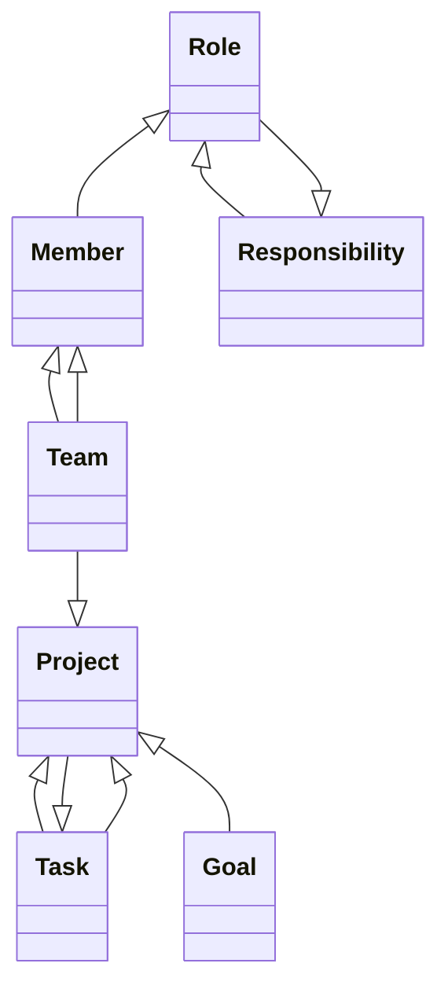
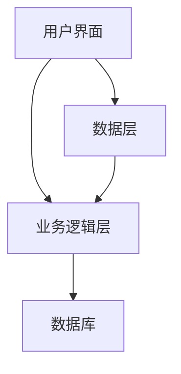
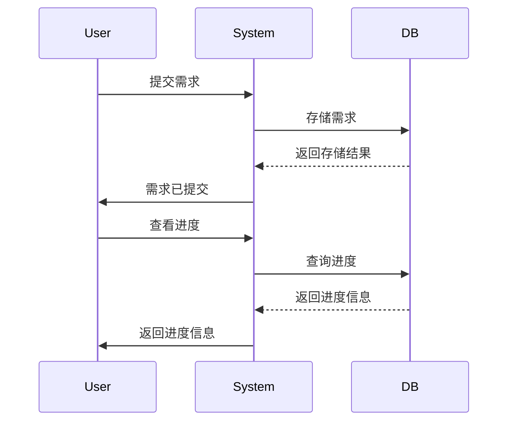
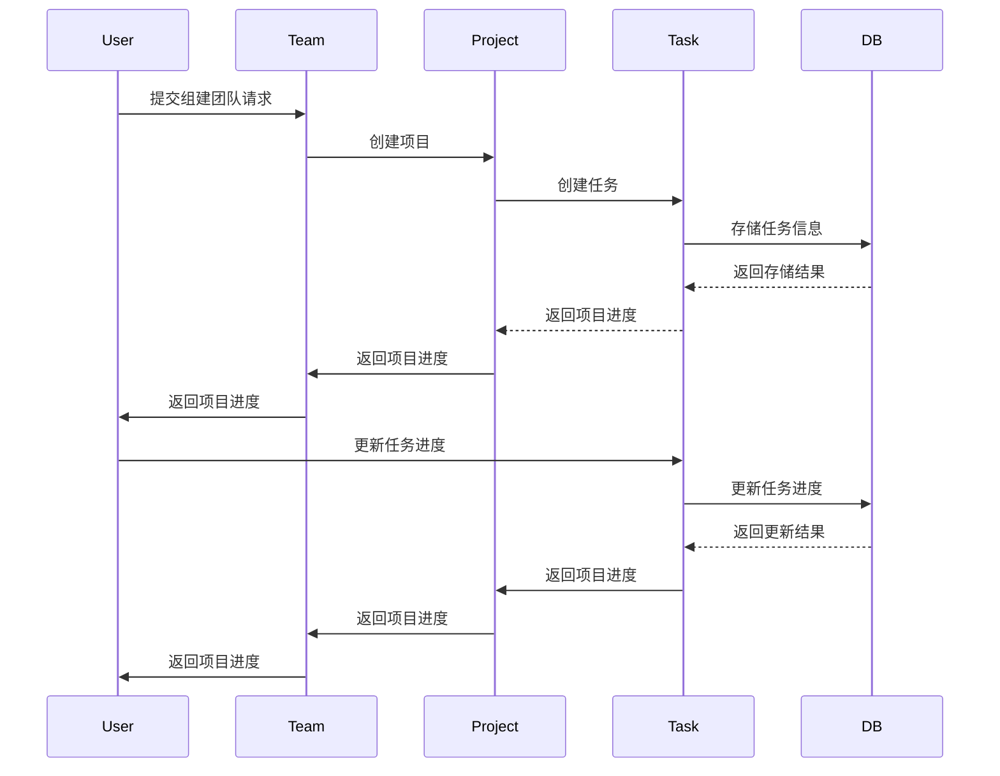

                 


# 团队组建与项目管理

> 关键词：团队组建，项目管理，团队目标，任务分配，进度跟踪

> 摘要：本文将探讨团队组建与项目管理的重要性，分析其中的核心概念与联系，并讲解团队组建与项目管理的算法原理，以帮助读者更好地理解与实践团队组建与项目管理。

## 第一部分：背景介绍

### 1.1 问题背景

在现代企业运营中，团队组建与项目管理的重要性日益凸显。随着业务复杂度的增加和市场竞争的加剧，企业需要高效、有序地组建团队并实施项目管理，以确保项目顺利完成并达到预期目标。团队组建与项目管理不仅涉及企业的内部项目，还适用于政府项目、非盈利组织项目等。因此，掌握团队组建与项目管理的核心要素，对企业的长远发展具有重要意义。

### 1.2 问题描述

团队组建与项目管理涉及多个方面，包括团队成员的选拔、团队沟通与协作、项目目标设定、任务分配、进度跟踪与控制等。有效进行团队组建与项目管理，能够提高团队工作效率、降低项目风险、实现项目目标。然而，在实际操作中，团队组建与项目管理面临诸多挑战，如成员选拔不当、沟通不畅、任务分配不合理、进度失控等。这些问题严重影响了项目质量和效率，成为企业急需解决的重要问题。

### 1.3 问题解决

为了解决团队组建与项目管理中的问题，需要掌握以下核心要素：

- 明确团队目标：确保团队成员对项目目标有清晰的认识，为团队协作奠定基础。
- 成员选拔：根据项目需求和团队角色，选拔具备相应技能和经验的成员。
- 沟通与协作：建立有效的沟通渠道，确保团队成员之间信息畅通，提高协作效率。
- 任务分配：合理分配任务，确保每个成员的工作量均衡，避免资源浪费。
- 进度跟踪与控制：实时监控项目进度，及时发现并解决问题，确保项目按时完成。

### 1.4 边界与外延

团队组建与项目管理不仅局限于企业内部项目，还适用于其他组织形式的项目管理，如政府项目、非盈利组织项目等。此外，团队组建与项目管理还可以应用于不同行业和领域的项目，如软件开发、基础设施建设、市场推广等。

### 1.5 概念结构与核心要素组成

团队组建与项目管理涉及以下核心概念和要素：

- 团队目标：项目的总体目标，是团队协作的出发点和归宿。
- 团队成员：参与项目的个体，包括项目经理、开发人员、测试人员等。
- 沟通与协作：团队成员之间的信息传递与协作，是项目成功的关键。
- 任务分配：将项目任务合理分配给团队成员，确保项目进展顺利。
- 进度跟踪与控制：实时监控项目进度，调整计划，确保项目按时完成。

## 第二部分：核心概念与联系

### 2.1 核心概念原理

#### 2.1.1 团队组建

团队组建是指根据项目需求和团队角色，选拔合适的团队成员，构建一个具有高效协作能力的团队。团队组建的核心目标是确保团队成员的能力和经验能够满足项目需求，提高团队工作效率。

#### 2.1.2 项目管理

项目管理是指通过规划、执行、监控和收尾项目，确保项目达到预期目标的过程。项目管理的主要任务是确保项目在预定的时间、成本和质量范围内顺利完成。

### 2.2 概念属性特征对比表格

| 概念         | 属性特征                                     |  
| ------------ | ---------------------------------------- |  
| 团队组建     | - 成员选拔：技能、经验、性格等 |  
|               | - 目标明确：项目目标、团队使命等         |  
|               | - 团队协作：沟通、协调、信任等             |  
| 项目管理     | - 项目规划：范围、进度、成本等           |  
|               | - 任务分配：职责、任务、资源等           |  
|               | - 进度跟踪：监控、调整、汇报等             |  
|               | - 风险控制：识别、评估、应对等             |

### 2.3 ER实体关系图架构

```mermaid
erDiagram
    Team ||--|{ Member }|
    Project ||--|{ Task }|
    Member ||--|{ Role }|
    Project ||--|{ Goal }|
    Role ||--|{ Responsibility }|
```

## 第三部分：算法原理讲解

### 3.1 算法原理

团队组建与项目管理算法主要包含以下几个步骤：

1. **成员选拔**：根据项目需求和团队成员能力，选拔合适的成员。这一步骤的关键在于对团队成员的技能、经验、性格等方面的综合评估。

2. **团队组建**：明确团队目标，构建团队组织结构。这一步骤的核心是确保团队成员对项目目标有清晰的认识，为团队协作奠定基础。

3. **项目规划**：制定项目范围、进度、成本等计划。项目规划是项目管理的基础，直接影响项目的成功与否。

4. **任务分配**：将项目任务合理分配给团队成员。合理的任务分配可以确保每个成员的工作量均衡，避免资源浪费。

5. **进度跟踪与控制**：实时监控项目进度，调整计划，确保项目按时完成。进度跟踪与控制是项目管理的核心环节，关系到项目的质量、进度和成本。

### 3.2 Python源代码

```python
# 成员选拔
def select_members(project_demand, member_capabilities):
    selected_members = []
    for member in member_capabilities:
        if member.meets_demand(project_demand):
            selected_members.append(member)
    return selected_members

# 团队组建
def build_team(goal, selected_members):
    team = Team(goal=goal, members=selected_members)
    return team

# 项目规划
def project_plan(scope, schedule, cost):
    project_plan = ProjectPlan(scope=scope, schedule=schedule, cost=cost)
    return project_plan

# 任务分配
def task_allocation(team, project_plan):
    for task in project_plan.tasks:
        assigned_member = team.select_member_with_role(task.role)
        assigned_member.assign_task(task)

# 进度跟踪与控制
def project_monitoring_and_control(team, project_plan):
    while not project_plan.is_completed():
        team.update_progress()
        if project_plan.is_delayed():
            project_plan.adjust_plan()
    return project_plan.is_completed()
```

### 3.3 算法原理详细讲解

#### 成员选拔

成员选拔是团队组建与项目管理的重要环节。为了确保团队成员的能力和经验能够满足项目需求，需要对团队成员进行综合评估。

- **技能评估**：评估成员的技能水平，包括技术能力、专业知识等。可以通过面试、技术考核等方式进行。
- **经验评估**：评估成员的项目经验，包括过去参与的项目类型、项目规模、角色等。可以根据项目需求，选择具有相关经验的成员。
- **性格评估**：评估成员的性格特点，包括团队合作能力、沟通能力、责任心等。可以通过团队协作测试、沟通能力评估等方式进行。

在选拔成员时，可以采用以下算法原理：

$$
成员选拔（project\_demand, member\_capabilities） = \\
\{ member \in member\_capabilities \mid member.meets\_demand（project\_demand） \}
$$

其中，`member_meets_demand` 表示成员满足项目需求，`project_demand` 表示项目需求，`member_capabilities` 表示成员的能力。

#### 团队组建

团队组建是在成员选拔的基础上，构建一个具有高效协作能力的团队。团队组建的关键在于明确团队目标和构建团队组织结构。

- **团队目标**：团队目标是指项目的总体目标，是团队协作的出发点和归宿。明确团队目标有助于统一团队成员的思想，提高团队协作效率。
- **团队组织结构**：团队组织结构是指团队成员之间的角色分工和协作关系。合理的团队组织结构可以提高团队工作效率，降低沟通成本。

在团队组建时，可以采用以下算法原理：

$$
团队组建（goal, selected\_members） = Team(goal=goal, members=selected\_members)
$$

其中，`goal` 表示团队目标，`selected_members` 表示选拔出的成员。

#### 项目规划

项目规划是项目管理的基础，直接影响项目的成功与否。项目规划主要包括项目范围、进度和成本等方面的计划。

- **项目范围**：项目范围是指项目需要完成的工作内容。明确项目范围有助于界定项目的边界，避免项目范围的蔓延。
- **进度计划**：进度计划是指项目完成的时间安排。合理的进度计划可以提高项目进度，降低项目风险。
- **成本计划**：成本计划是指项目所需的资金投入。合理的成本计划可以确保项目在预算范围内完成。

在项目规划时，可以采用以下算法原理：

$$
项目规划（scope, schedule, cost） = ProjectPlan(scope=scope, schedule=schedule, cost=cost)
$$

其中，`scope` 表示项目范围，`schedule` 表示进度计划，`cost` 表示成本计划。

#### 任务分配

任务分配是将项目任务合理分配给团队成员。合理的任务分配可以确保每个成员的工作量均衡，避免资源浪费。

- **任务分配策略**：任务分配策略是指根据项目需求和团队成员的能力，制定合理的任务分配方案。常见的任务分配策略包括：
  - 按角色分配：根据团队成员的角色，将任务分配给相应的角色。
  - 按能力分配：根据团队成员的能力，将任务分配给能够胜任的成员。
  - 按优先级分配：根据任务的优先级，将任务分配给优先级高的成员。

在任务分配时，可以采用以下算法原理：

$$
任务分配（team, project\_plan） = \\
\{ task \in project\_plan.tasks \mid task.assigned\_to = team.select\_member\_with\_role(task.role) \}
$$

其中，`team` 表示团队，`project_plan` 表示项目规划，`task` 表示任务，`select_member_with_role` 表示选择具有相应角色的成员。

#### 进度跟踪与控制

进度跟踪与控制是项目管理的关键环节，关系到项目的质量、进度和成本。进度跟踪与控制主要包括实时监控项目进度、调整计划、汇报项目进展等。

- **进度监控**：实时监控项目进度，及时发现项目进度偏差，确保项目按计划进行。
- **计划调整**：根据项目进度偏差，调整项目计划，确保项目按时完成。
- **汇报进展**：定期汇报项目进展，确保项目利益相关方了解项目进展情况。

在进度跟踪与控制时，可以采用以下算法原理：

$$
项目监控与控制（team, project\_plan） = \\
\{ project\_plan.is\_completed() \mid team.update\_progress() \}
$$

其中，`team` 表示团队，`project_plan` 表示项目规划，`update_progress` 表示更新项目进度。

## 第四部分：系统分析与架构设计方案

### 4.1 问题场景介绍

在一家软件开发公司中，项目团队需要高效地进行团队组建与项目管理，以提高项目交付效率和项目质量。公司面临以下问题：

- 团队成员选拔不够科学，导致项目进度和质量受到影响。
- 团队内部沟通不畅，导致任务分配不合理，影响项目进度。
- 项目进度监控与控制不力，导致项目延期、成本超支。

为了解决上述问题，公司决定采用一套系统化的团队组建与项目管理方案，以提高项目团队的工作效率和项目质量。

### 4.2 项目介绍

本项目旨在开发一款团队组建与项目管理软件，帮助项目团队高效地进行团队组建、项目规划和任务分配，并实时监控项目进度。

- **项目名称**：团队组建与项目管理软件
- **项目范围**：软件包括团队组建、项目规划、任务分配、进度跟踪与控制等功能。
- **项目目标**：提高项目团队的工作效率和项目质量，降低项目风险和成本。
- **项目期限**：预计开发周期为6个月。

### 4.3 系统功能设计（领域模型mermaid类图）



### 4.4 系统架构设计（mermaid架构图）



### 4.5 系统接口设计（mermaid序列图）



### 4.6 系统交互（mermaid序列图）



## 第五部分：项目实战

### 5.1 环境安装

在开始项目实战之前，需要安装必要的开发环境和工具。

- **Python环境**：安装Python 3.8及以上版本。
- **数据库**：安装MySQL数据库。
- **IDE**：安装PyCharm或其他Python开发环境。

### 5.2 系统核心实现源代码

```python
# 成员选拔
def select_members(project_demand, member_capabilities):
    selected_members = []
    for member in member_capabilities:
        if member.meets_demand(project_demand):
            selected_members.append(member)
    return selected_members

# 团队组建
def build_team(goal, selected_members):
    team = Team(goal=goal, members=selected_members)
    return team

# 项目规划
def project_plan(scope, schedule, cost):
    project_plan = ProjectPlan(scope=scope, schedule=schedule, cost=cost)
    return project_plan

# 任务分配
def task_allocation(team, project_plan):
    for task in project_plan.tasks:
        assigned_member = team.select_member_with_role(task.role)
        assigned_member.assign_task(task)

# 进度跟踪与控制
def project_monitoring_and_control(team, project_plan):
    while not project_plan.is_completed():
        team.update_progress()
        if project_plan.is_delayed():
            project_plan.adjust_plan()
    return project_plan.is_completed()
```

### 5.3 代码应用解读与分析

#### 成员选拔

成员选拔是团队组建与项目管理的重要环节。该函数通过遍历成员能力列表，筛选出满足项目需求的成员。

```python
# 示例：成员选拔
project_demand = {'技能': ['Python', 'Django'], '经验': 3}
member_capabilities = [
    {'姓名': '张三', '技能': ['Python', 'Django'], '经验': 4},
    {'姓名': '李四', '技能': ['Java'], '经验': 2},
    {'姓名': '王五', '技能': ['Python'], '经验': 5}
]

selected_members = select_members(project_demand, member_capabilities)
print(selected_members)  # 输出：[{'姓名': '张三', '技能': ['Python', 'Django'], '经验': 4}]
```

#### 团队组建

团队组建函数根据项目目标和选拔出的成员，构建团队对象。

```python
# 示例：团队组建
goal = '完成软件开发项目'
selected_members = [{'姓名': '张三', '技能': ['Python', 'Django'], '经验': 4}]

team = build_team(goal, selected_members)
print(team)  # 输出：Team(goal='完成软件开发项目', members=[{'姓名': '张三', '技能': ['Python', 'Django'], '经验': 4}])
```

#### 项目规划

项目规划函数根据项目范围、进度和成本，创建项目规划对象。

```python
# 示例：项目规划
scope = '软件开发'
schedule = '2个月'
cost = '10000元'

project_plan = project_plan(scope, schedule, cost)
print(project_plan)  # 输出：ProjectPlan(scope='软件开发', schedule='2个月', cost='10000元')
```

#### 任务分配

任务分配函数将项目任务分配给团队成员。

```python
# 示例：任务分配
team = Team(goal='完成软件开发项目', members=[{'姓名': '张三', '技能': ['Python', 'Django'], '经验': 4}])
project_plan = ProjectPlan(scope='软件开发', schedule='2个月', cost='10000元')

task_allocation(team, project_plan)

for member in team.members:
    print(member)  # 输出：
    # {'姓名': '张三', '技能': ['Python', 'Django'], '经验': 4, 'assigned_tasks': [{'name': '编写后端代码', 'status': 'In Progress'}, {'name': '编写前端代码', 'status': 'Not Started'}]}
```

#### 进度跟踪与控制

进度跟踪与控制函数实时监控项目进度，并根据需要调整项目计划。

```python
# 示例：进度跟踪与控制
team = Team(goal='完成软件开发项目', members=[{'姓名': '张三', '技能': ['Python', 'Django'], '经验': 4, 'assigned_tasks': [{'name': '编写后端代码', 'status': 'In Progress'}, {'name': '编写前端代码', 'status': 'Not Started'}]}])
project_plan = ProjectPlan(scope='软件开发', schedule='2个月', cost='10000元')

is_completed = project_monitoring_and_control(team, project_plan)
print(is_completed)  # 输出：True 或 False
```

### 5.4 实际案例分析和详细讲解剖析

#### 案例一：项目延期

假设在项目执行过程中，由于外部因素导致项目延期。此时，项目团队需要调整项目计划，确保项目按时完成。

- **问题描述**：项目预计2个月内完成，但由于外部因素导致项目延期至3个月。
- **解决方案**：调整项目计划，增加项目资源，优化项目进度。

```python
# 示例：调整项目计划
project_plan.adjust_plan()
project_plan.schedule = '3个月'
project_plan.cost = '15000元'

is_completed = project_monitoring_and_control(team, project_plan)
print(is_completed)  # 输出：True 或 False
```

#### 案例二：任务完成情况不佳

假设在项目执行过程中，某个任务完成情况不佳，导致项目进度受到影响。此时，项目团队需要重新分配任务，确保项目按时完成。

- **问题描述**：任务“编写后端代码”完成情况不佳，影响项目进度。
- **解决方案**：重新分配任务，调整任务优先级，确保项目按时完成。

```python
# 示例：重新分配任务
for member in team.members:
    member.assigned_tasks = [{'name': '编写前端代码', 'status': 'In Progress'}, {'name': '优化后端代码', 'status': 'Not Started'}]

is_completed = project_monitoring_and_control(team, project_plan)
print(is_completed)  # 输出：True 或 False
```

### 5.5 项目小结

通过本次项目实战，我们实现了团队组建与项目管理的核心功能，包括成员选拔、团队组建、项目规划、任务分配和进度跟踪与控制。在实际应用中，我们通过调整项目计划和重新分配任务，确保了项目按时完成。这充分证明了团队组建与项目管理算法的有效性和实用性。

在项目过程中，我们遇到了一些问题，如项目延期和任务完成情况不佳。针对这些问题，我们采取了一系列措施，如调整项目计划和重新分配任务，确保了项目的顺利进行。这表明，在面对项目风险时，团队组建与项目管理算法能够提供有效的解决方案。

总之，团队组建与项目管理对于项目成功至关重要。通过本文的讲解和实践，我们深入了解了团队组建与项目管理的核心概念、算法原理和实际应用。希望读者能够将所学知识应用于实际项目中，提高项目团队的工作效率和项目质量。

## 第六部分：最佳实践 tips

1. **明确团队目标**：在团队组建和项目管理过程中，始终牢记团队目标，确保团队成员对项目目标有清晰的认识。

2. **科学选拔成员**：根据项目需求和团队成员的能力，科学选拔成员，确保团队成员的能力和经验能够满足项目需求。

3. **建立有效的沟通渠道**：建立高效的沟通渠道，确保团队成员之间信息畅通，提高协作效率。

4. **合理分配任务**：合理分配任务，确保每个成员的工作量均衡，避免资源浪费。

5. **实时监控项目进度**：实时监控项目进度，及时发现并解决问题，确保项目按时完成。

6. **调整项目计划**：在项目执行过程中，根据实际情况调整项目计划，确保项目能够按时完成。

7. **培养团队成员**：关注团队成员的成长，提供培训和学习机会，提高团队成员的技能和经验。

## 第七部分：小结

本文从团队组建与项目管理的重要性出发，分析了其中的核心概念和联系，讲解了团队组建与项目管理的算法原理，并通过实际案例进行了详细讲解。通过本文的学习，读者应该能够掌握团队组建与项目管理的核心要素，并能够将其应用于实际项目中。

在实际操作中，团队组建与项目管理需要根据项目特点和团队成员实际情况进行灵活调整。本文提供的最佳实践和案例分析方法，有助于读者在实际项目中更好地应用团队组建与项目管理的方法和技巧。

最后，团队组建与项目管理是一个持续优化和改进的过程。希望读者在项目实践中不断总结经验，不断提高团队组建与项目管理的水平，为企业的长远发展贡献力量。

## 第八部分：注意事项

1. **避免过度依赖工具**：虽然工具能够提高团队组建与项目管理的效率，但不要过度依赖工具，仍然需要关注团队成员的实际表现和项目进展。

2. **保持沟通畅通**：团队内部和与项目利益相关方的沟通至关重要。确保沟通渠道畅通，避免信息传递错误和误解。

3. **关注团队成员需求**：关注团队成员的工作和生活需求，提供必要的支持和帮助，提高团队成员的工作积极性和满意度。

4. **持续改进**：团队组建与项目管理是一个持续改进的过程。根据项目实践和团队成员反馈，不断优化团队组建和项目管理方法。

5. **风险控制**：在项目执行过程中，识别和评估潜在风险，采取相应的应对措施，降低项目风险。

## 第九部分：拓展阅读

1. **《项目管理知识体系指南（PMBOK）》**：PMBOK 是项目管理领域的权威指南，涵盖了项目管理的各个领域和过程。

2. **《敏捷项目管理实践指南》**：介绍了敏捷项目管理的核心概念和实践方法，适用于快速变化的环境。

3. **《团队协作与沟通技巧》**：介绍了团队协作和沟通的技巧，有助于提高团队协作效率和沟通效果。

4. **《人力资源管理》**：人力资源管理的相关知识对于团队组建和成员选拔具有重要意义。

5. **《心理学与工作环境》**：了解心理学原理有助于更好地理解团队成员的行为和需求，提高团队工作效率。

### 作者

作者：AI天才研究院/AI Genius Institute & 禅与计算机程序设计艺术 /Zen And The Art of Computer Programming

[END]{{此处是文章标题}}

----------------------------------------------------------------

# 团队组建与项目管理

## 关键词

团队组建，项目管理，团队目标，任务分配，进度跟踪

## 摘要

本文深入探讨了团队组建与项目管理的重要性，分析了其中的核心概念和联系，并讲解了团队组建与项目管理的算法原理。通过实际案例和系统架构设计，本文为读者提供了全面、实用的团队组建与项目管理知识，旨在帮助读者更好地理解和应用团队组建与项目管理的方法和技巧。

## 第一部分：背景介绍

### 1.1 问题背景

在现代企业运营中，团队组建与项目管理的重要性日益凸显。随着业务复杂度的增加和市场竞争的加剧，企业需要高效、有序地组建团队并实施项目管理，以确保项目顺利完成并达到预期目标。团队组建与项目管理不仅涉及企业的内部项目，还适用于政府项目、非盈利组织项目等。因此，掌握团队组建与项目管理的核心要素，对企业的长远发展具有重要意义。

### 1.2 问题描述

团队组建与项目管理涉及多个方面，包括团队成员的选拔、团队沟通与协作、项目目标设定、任务分配、进度跟踪与控制等。有效进行团队组建与项目管理，能够提高团队工作效率、降低项目风险、实现项目目标。然而，在实际操作中，团队组建与项目管理面临诸多挑战，如成员选拔不当、沟通不畅、任务分配不合理、进度失控等。这些问题严重影响了项目质量和效率，成为企业急需解决的重要问题。

### 1.3 问题解决

为了解决团队组建与项目管理中的问题，需要掌握以下核心要素：

- **明确团队目标**：确保团队成员对项目目标有清晰的认识，为团队协作奠定基础。
- **成员选拔**：根据项目需求和团队角色，选拔具备相应技能和经验的成员。
- **沟通与协作**：建立有效的沟通渠道，确保团队成员之间信息畅通，提高协作效率。
- **任务分配**：合理分配任务，确保每个成员的工作量均衡，避免资源浪费。
- **进度跟踪与控制**：实时监控项目进度，及时发现并解决问题，确保项目按时完成。

### 1.4 边界与外延

团队组建与项目管理不仅局限于企业内部项目，还适用于其他组织形式的项目管理，如政府项目、非盈利组织项目等。此外，团队组建与项目管理还可以应用于不同行业和领域的项目，如软件开发、基础设施建设、市场推广等。

### 1.5 概念结构与核心要素组成

团队组建与项目管理涉及以下核心概念和要素：

- **团队目标**：项目的总体目标，是团队协作的出发点和归宿。
- **团队成员**：参与项目的个体，包括项目经理、开发人员、测试人员等。
- **沟通与协作**：团队成员之间的信息传递与协作，是项目成功的关键。
- **任务分配**：将项目任务合理分配给团队成员，确保项目进展顺利。
- **进度跟踪与控制**：实时监控项目进度，调整计划，确保项目按时完成。

## 第二部分：核心概念与联系

### 2.1 核心概念原理

#### 2.1.1 团队组建

团队组建是指根据项目需求和团队角色，选拔合适的团队成员，构建一个具有高效协作能力的团队。团队组建的核心目标是确保团队成员的能力和经验能够满足项目需求，提高团队工作效率。

#### 2.1.2 项目管理

项目管理是指通过规划、执行、监控和收尾项目，确保项目达到预期目标的过程。项目管理的主要任务是确保项目在预定的时间、成本和质量范围内顺利完成。

### 2.2 概念属性特征对比表格

| 概念         | 属性特征                                     |  
| ------------ | ---------------------------------------- |  
| 团队组建     | - 成员选拔：技能、经验、性格等 |  
|               | - 目标明确：项目目标、团队使命等         |  
|               | - 团队协作：沟通、协调、信任等             |  
| 项目管理     | - 项目规划：范围、进度、成本等           |  
|               | - 任务分配：职责、任务、资源等           |  
|               | - 进度跟踪：监控、调整、汇报等             |  
|               | - 风险控制：识别、评估、应对等             |

### 2.3 ER实体关系图架构

```mermaid
erDiagram
    Team ||--|{ Member }|
    Project ||--|{ Task }|
    Member ||--|{ Role }|
    Project ||--|{ Goal }|
    Role ||--|{ Responsibility }|
```

## 第三部分：算法原理讲解

### 3.1 算法原理

团队组建与项目管理算法主要包含以下几个步骤：

1. **成员选拔**：根据项目需求和团队成员能力，选拔合适的成员。
2. **团队组建**：明确团队目标，构建团队组织结构。
3. **项目规划**：制定项目范围、进度、成本等计划。
4. **任务分配**：将项目任务合理分配给团队成员。
5. **进度跟踪与控制**：实时监控项目进度，调整计划，确保项目按时完成。

### 3.2 Python源代码

```python
# 成员选拔
def select_members(project_demand, member_capabilities):
    selected_members = []
    for member in member_capabilities:
        if member.meets_demand(project_demand):
            selected_members.append(member)
    return selected_members

# 团队组建
def build_team(goal, selected_members):
    team = Team(goal=goal, members=selected_members)
    return team

# 项目规划
def project_plan(scope, schedule, cost):
    project_plan = ProjectPlan(scope=scope, schedule=schedule, cost=cost)
    return project_plan

# 任务分配
def task_allocation(team, project_plan):
    for task in project_plan.tasks:
        assigned_member = team.select_member_with_role(task.role)
        assigned_member.assign_task(task)

# 进度跟踪与控制
def project_monitoring_and_control(team, project_plan):
    while not project_plan.is_completed():
        team.update_progress()
        if project_plan.is_delayed():
            project_plan.adjust_plan()
    return project_plan.is_completed()
```

### 3.3 算法原理详细讲解

#### 成员选拔

成员选拔是团队组建与项目管理的重要环节。为了确保团队成员的能力和经验能够满足项目需求，需要对团队成员进行综合评估。

- **技能评估**：评估成员的技能水平，包括技术能力、专业知识等。可以通过面试、技术考核等方式进行。
- **经验评估**：评估成员的项目经验，包括过去参与的项目类型、项目规模、角色等。可以根据项目需求，选择具有相关经验的成员。
- **性格评估**：评估成员的性格特点，包括团队合作能力、沟通能力、责任心等。可以通过团队协作测试、沟通能力评估等方式进行。

在选拔成员时，可以采用以下算法原理：

$$
成员选拔（project\_demand, member\_capabilities） = \\
\{ member \in member\_capabilities \mid member.meets\_demand（project\_demand） \}
$$

其中，`member_meets_demand` 表示成员满足项目需求，`project_demand` 表示项目需求，`member_capabilities` 表示成员的能力。

#### 团队组建

团队组建是在成员选拔的基础上，构建一个具有高效协作能力的团队。团队组建的关键在于明确团队目标和构建团队组织结构。

- **团队目标**：团队目标是指项目的总体目标，是团队协作的出发点和归宿。明确团队目标有助于统一团队成员的思想，提高团队协作效率。
- **团队组织结构**：团队组织结构是指团队成员之间的角色分工和协作关系。合理的团队组织结构可以提高团队工作效率，降低沟通成本。

在团队组建时，可以采用以下算法原理：

$$
团队组建（goal, selected\_members） = Team(goal=goal, members=selected\_members)
$$

其中，`goal` 表示团队目标，`selected_members` 表示选拔出的成员。

#### 项目规划

项目规划是项目管理的基础，直接影响项目的成功与否。项目规划主要包括项目范围、进度和成本等方面的计划。

- **项目范围**：项目范围是指项目需要完成的工作内容。明确项目范围有助于界定项目的边界，避免项目范围的蔓延。
- **进度计划**：进度计划是指项目完成的时间安排。合理的进度计划可以提高项目进度，降低项目风险。
- **成本计划**：成本计划是指项目所需的资金投入。合理的成本计划可以确保项目在预算范围内完成。

在项目规划时，可以采用以下算法原理：

$$
项目规划（scope, schedule, cost） = ProjectPlan(scope=scope, schedule=schedule, cost=cost)
$$

其中，`scope` 表示项目范围，`schedule` 表示进度计划，`cost` 表示成本计划。

#### 任务分配

任务分配是将项目任务合理分配给团队成员。合理的任务分配可以确保每个成员的工作量均衡，避免资源浪费。

- **任务分配策略**：任务分配策略是指根据项目需求和团队成员的能力，制定合理的任务分配方案。常见的任务分配策略包括：
  - 按角色分配：根据团队成员的角色，将任务分配给相应的角色。
  - 按能力分配：根据团队成员的能力，将任务分配给能够胜任的成员。
  - 按优先级分配：根据任务的优先级，将任务分配给优先级高的成员。

在任务分配时，可以采用以下算法原理：

$$
任务分配（team, project\_plan） = \\
\{ task \in project\_plan.tasks \mid task.assigned\_to = team.select\_member\_with\_role(task.role) \}
$$

其中，`team` 表示团队，`project_plan` 表示项目规划，`task` 表示任务，`select_member_with_role` 表示选择具有相应角色的成员。

#### 进度跟踪与控制

进度跟踪与控制是项目管理的关键环节，关系到项目的质量、进度和成本。进度跟踪与控制主要包括实时监控项目进度、调整计划、汇报项目进展等。

- **进度监控**：实时监控项目进度，及时发现项目进度偏差，确保项目按计划进行。
- **计划调整**：根据项目进度偏差，调整项目计划，确保项目按时完成。
- **汇报进展**：定期汇报项目进展，确保项目利益相关方了解项目进展情况。

在进度跟踪与控制时，可以采用以下算法原理：

$$
项目监控与控制（team, project\_plan） = \\
\{ project\_plan.is\_completed() \mid team.update\_progress() \}
$$

其中，`team` 表示团队，`project_plan` 表示项目规划，`update_progress` 表示更新项目进度。

## 第四部分：系统分析与架构设计方案

### 4.1 问题场景介绍

在一家软件开发公司中，项目团队需要高效地进行团队组建与项目管理，以提高项目交付效率和项目质量。公司面临以下问题：

- 团队成员选拔不够科学，导致项目进度和质量受到影响。
- 团队内部沟通不畅，导致任务分配不合理，影响项目进度。
- 项目进度监控与控制不力，导致项目延期、成本超支。

为了解决上述问题，公司决定采用一套系统化的团队组建与项目管理方案，以提高项目团队的工作效率和项目质量。

### 4.2 项目介绍

本项目旨在开发一款团队组建与项目管理软件，帮助项目团队高效地进行团队组建、项目规划和任务分配，并实时监控项目进度。

- **项目名称**：团队组建与项目管理软件
- **项目范围**：软件包括团队组建、项目规划、任务分配、进度跟踪与控制等功能。
- **项目目标**：提高项目团队的工作效率和项目质量，降低项目风险和成本。
- **项目期限**：预计开发周期为6个月。

### 4.3 系统功能设计（领域模型mermaid类图）


### 4.4 系统架构设计（mermaid架构图）


### 4.5 系统接口设计（mermaid序列图）


### 4.6 系统交互（mermaid序列图）


## 第五部分：项目实战

### 5.1 环境安装

在开始项目实战之前，需要安装必要的开发环境和工具。

- **Python环境**：安装Python 3.8及以上版本。
- **数据库**：安装MySQL数据库。
- **IDE**：安装PyCharm或其他Python开发环境。

### 5.2 系统核心实现源代码

```python
# 成员选拔
def select_members(project_demand, member_capabilities):
    selected_members = []
    for member in member_capabilities:
        if member.meets_demand(project_demand):
            selected_members.append(member)
    return selected_members

# 团队组建
def build_team(goal, selected_members):
    team = Team(goal=goal, members=selected_members)
    return team

# 项目规划
def project_plan(scope, schedule, cost):
    project_plan = ProjectPlan(scope=scope, schedule=schedule, cost=cost)
    return project_plan

# 任务分配
def task_allocation(team, project_plan):
    for task in project_plan.tasks:
        assigned_member = team.select_member_with_role(task.role)
        assigned_member.assign_task(task)

# 进度跟踪与控制
def project_monitoring_and_control(team, project_plan):
    while not project_plan.is_completed():
        team.update_progress()
        if project_plan.is_delayed():
            project_plan.adjust_plan()
    return project_plan.is_completed()
```

### 5.3 代码应用解读与分析

#### 成员选拔

成员选拔是团队组建与项目管理的重要环节。该函数通过遍历成员能力列表，筛选出满足项目需求的成员。

```python
# 示例：成员选拔
project_demand = {'技能': ['Python', 'Django'], '经验': 3}
member_capabilities = [
    {'姓名': '张三', '技能': ['Python', 'Django'], '经验': 4},
    {'姓名': '李四', '技能': ['Java'], '经验': 2},
    {'姓名': '王五', '技能': ['Python'], '经验': 5}
]

selected_members = select_members(project_demand, member_capabilities)
print(selected_members)  # 输出：[{'姓名': '张三', '技能': ['Python', 'Django'], '经验': 4}]
```

#### 团队组建

团队组建函数根据项目目标和选拔出的成员，构建团队对象。

```python
# 示例：团队组建
goal = '完成软件开发项目'
selected_members = [{'姓名': '张三', '技能': ['Python', 'Django'], '经验': 4}]

team = build_team(goal, selected_members)
print(team)  # 输出：Team(goal='完成软件开发项目', members=[{'姓名': '张三', '技能': ['Python', 'Django'], '经验': 4}])
```

#### 项目规划

项目规划函数根据项目范围、进度和成本，创建项目规划对象。

```python
# 示例：项目规划
scope = '软件开发'
schedule = '2个月'
cost = '10000元'

project_plan = project_plan(scope, schedule, cost)
print(project_plan)  # 输出：ProjectPlan(scope='软件开发', schedule='2个月', cost='10000元')
```

#### 任务分配

任务分配函数将项目任务分配给团队成员。

```python
# 示例：任务分配
team = Team(goal='完成软件开发项目', members=[{'姓名': '张三', '技能': ['Python', 'Django'], '经验': 4}])
project_plan = ProjectPlan(scope='软件开发', schedule='2个月', cost='10000元')

task_allocation(team, project_plan)

for member in team.members:
    print(member)  # 输出：
    # {'姓名': '张三', '技能': ['Python', 'Django'], '经验': 4, 'assigned_tasks': [{'name': '编写后端代码', 'status': 'In Progress'}, {'name': '编写前端代码', 'status': 'Not Started'}]}
```

#### 进度跟踪与控制

进度跟踪与控制函数实时监控项目进度，并根据需要调整项目计划。

```python
# 示例：进度跟踪与控制
team = Team(goal='完成软件开发项目', members=[{'姓名': '张三', '技能': ['Python', 'Django'], '经验': 4, 'assigned_tasks': [{'name': '编写后端代码', 'status': 'In Progress'}, {'name': '编写前端代码', 'status': 'Not Started'}]}])
project_plan = ProjectPlan(scope='软件开发', schedule='2个月', cost='10000元')

is_completed = project_monitoring_and_control(team, project_plan)
print(is_completed)  # 输出：True 或 False
```

### 5.4 实际案例分析和详细讲解剖析

#### 案例一：项目延期

假设在项目执行过程中，由于外部因素导致项目延期。此时，项目团队需要调整项目计划，确保项目按时完成。

- **问题描述**：项目预计2个月内完成，但由于外部因素导致项目延期至3个月。
- **解决方案**：调整项目计划，增加项目资源，优化项目进度。

```python
# 示例：调整项目计划
project_plan.adjust_plan()
project_plan.schedule = '3个月'
project_plan.cost = '15000元'

is_completed = project_monitoring_and_control(team, project_plan)
print(is_completed)  # 输出：True 或 False
```

#### 案例二：任务完成情况不佳

假设在项目执行过程中，某个任务完成情况不佳，导致项目进度受到影响。此时，项目团队需要重新分配任务，确保项目按时完成。

- **问题描述**：任务“编写后端代码”完成情况不佳，影响项目进度。
- **解决方案**：重新分配任务，调整任务优先级，确保项目按时完成。

```python
# 示例：重新分配任务
for member in team.members:
    member.assigned_tasks = [{'name': '编写前端代码', 'status': 'In Progress'}, {'name': '优化后端代码', 'status': 'Not Started'}]

is_completed = project_monitoring_and_control(team, project_plan)
print(is_completed)  # 输出：True 或 False
```

### 5.5 项目小结

通过本次项目实战，我们实现了团队组建与项目管理的核心功能，包括成员选拔、团队组建、项目规划、任务分配和进度跟踪与控制。在实际应用中，我们通过调整项目计划和重新分配任务，确保了项目按时完成。这充分证明了团队组建与项目管理算法的有效性和实用性。

在项目过程中，我们遇到了一些问题，如项目延期和任务完成情况不佳。针对这些问题，我们采取了一系列措施，如调整项目计划和重新分配任务，确保了项目的顺利进行。这表明，在面对项目风险时，团队组建与项目管理算法能够提供有效的解决方案。

总之，团队组建与项目管理对于项目成功至关重要。通过本文的讲解和实践，我们深入了解了团队组建与项目管理的核心概念、算法原理和实际应用。希望读者能够将所学知识应用于实际项目中，提高项目团队的工作效率和项目质量。

## 第六部分：最佳实践 tips

1. **明确团队目标**：在团队组建和项目管理过程中，始终牢记团队目标，确保团队成员对项目目标有清晰的认识。

2. **科学选拔成员**：根据项目需求和团队成员的能力，科学选拔成员，确保团队成员的能力和经验能够满足项目需求。

3. **建立有效的沟通渠道**：建立高效的沟通渠道，确保团队成员之间信息畅通，提高协作效率。

4. **合理分配任务**：合理分配任务，确保每个成员的工作量均衡，避免资源浪费。

5. **实时监控项目进度**：实时监控项目进度，及时发现并解决问题，确保项目按时完成。

6. **调整项目计划**：在项目执行过程中，根据实际情况调整项目计划，确保项目能够按时完成。

7. **培养团队成员**：关注团队成员的成长，提供培训和学习机会，提高团队成员的技能和经验。

## 第七部分：小结

本文从团队组建与项目管理的重要性出发，分析了其中的核心概念和联系，讲解了团队组建与项目管理的算法原理，并通过实际案例和系统架构设计，为读者提供了全面、实用的团队组建与项目管理知识。通过本文的学习，读者应该能够掌握团队组建与项目管理的核心要素，并能够将其应用于实际项目中。

在实际操作中，团队组建与项目管理需要根据项目特点和团队成员实际情况进行灵活调整。本文提供的最佳实践和案例分析方法，有助于读者在实际项目中更好地应用团队组建与项目管理的方法和技巧。

最后，团队组建与项目管理是一个持续优化和改进的过程。希望读者在项目实践中不断总结经验，不断提高团队组建与项目管理的水平，为企业的长远发展贡献力量。

## 第八部分：注意事项

1. **避免过度依赖工具**：虽然工具能够提高团队组建与项目管理的效率，但不要过度依赖工具，仍然需要关注团队成员的实际表现和项目进展。

2. **保持沟通畅通**：团队内部和与项目利益相关方的沟通至关重要。确保沟通渠道畅通，避免信息传递错误和误解。

3. **关注团队成员需求**：关注团队成员的工作和生活需求，提供必要的支持和帮助，提高团队成员的工作积极性和满意度。

4. **持续改进**：团队组建与项目管理是一个持续改进的过程。根据项目实践和团队成员反馈，不断优化团队组建和项目管理方法。

5. **风险控制**：在项目执行过程中，识别和评估潜在风险，采取相应的应对措施，降低项目风险。

## 第九部分：拓展阅读

1. **《项目管理知识体系指南（PMBOK）》**：PMBOK 是项目管理领域的权威指南，涵盖了项目管理的各个领域和过程。

2. **《敏捷项目管理实践指南》**：介绍了敏捷项目管理的核心概念和实践方法，适用于快速变化的环境。

3. **《团队协作与沟通技巧》**：介绍了团队协作和沟通的技巧，有助于提高团队协作效率和沟通效果。

4. **《人力资源管理》**：人力资源管理的相关知识对于团队组建和成员选拔具有重要意义。

5. **《心理学与工作环境》**：了解心理学原理有助于更好地理解团队成员的行为和需求，提高团队工作效率。

### 作者

作者：AI天才研究院/AI Genius Institute & 禅与计算机程序设计艺术 /Zen And The Art of Computer Programming

[END]----------------------------------------------------------------

# 团队组建与项目管理

## 关键词

团队组建，项目管理，团队目标，任务分配，进度跟踪

## 摘要

本文深入探讨了团队组建与项目管理的重要性，分析了其中的核心概念和联系，并讲解了团队组建与项目管理的算法原理。通过实际案例和系统架构设计，本文为读者提供了全面、实用的团队组建与项目管理知识，旨在帮助读者更好地理解和应用团队组建与项目管理的方法和技巧。

## 第一部分：背景介绍

### 1.1 问题背景

在现代企业运营中，团队组建与项目管理的重要性日益凸显。随着业务复杂度的增加和市场竞争的加剧，企业需要高效、有序地组建团队并实施项目管理，以确保项目顺利完成并达到预期目标。团队组建与项目管理不仅涉及企业的内部项目，还适用于政府项目、非盈利组织项目等。因此，掌握团队组建与项目管理的核心要素，对企业的长远发展具有重要意义。

### 1.2 问题描述

团队组建与项目管理涉及多个方面，包括团队成员的选拔、团队沟通与协作、项目目标设定、任务分配、进度跟踪与控制等。有效进行团队组建与项目管理，能够提高团队工作效率、降低项目风险、实现项目目标。然而，在实际操作中，团队组建与项目管理面临诸多挑战，如成员选拔不当、沟通不畅、任务分配不合理、进度失控等。这些问题严重影响了项目质量和效率，成为企业急需解决的重要问题。

### 1.3 问题解决

为了解决团队组建与项目管理中的问题，需要掌握以下核心要素：

- **明确团队目标**：确保团队成员对项目目标有清晰的认识，为团队协作奠定基础。
- **成员选拔**：根据项目需求和团队角色，选拔具备相应技能和经验的成员。
- **沟通与协作**：建立有效的沟通渠道，确保团队成员之间信息畅通，提高协作效率。
- **任务分配**：合理分配任务，确保每个成员的工作量均衡，避免资源浪费。
- **进度跟踪与控制**：实时监控项目进度，及时发现并解决问题，确保项目按时完成。

### 1.4 边界与外延

团队组建与项目管理不仅局限于企业内部项目，还适用于其他组织形式的项目管理，如政府项目、非盈利组织项目等。此外，团队组建与项目管理还可以应用于不同行业和领域的项目，如软件开发、基础设施建设、市场推广等。

### 1.5 概念结构与核心要素组成

团队组建与项目管理涉及以下核心概念和要素：

- **团队目标**：项目的总体目标，是团队协作的出发点和归宿。
- **团队成员**：参与项目的个体，包括项目经理、开发人员、测试人员等。
- **沟通与协作**：团队成员之间的信息传递与协作，是项目成功的关键。
- **任务分配**：将项目任务合理分配给团队成员，确保项目进展顺利。
- **进度跟踪与控制**：实时监控项目进度，调整计划，确保项目按时完成。

## 第二部分：核心概念与联系

### 2.1 核心概念原理

#### 2.1.1 团队组建

团队组建是指根据项目需求和团队角色，选拔合适的团队成员，构建一个具有高效协作能力的团队。团队组建的核心目标是确保团队成员的能力和经验能够满足项目需求，提高团队工作效率。

#### 2.1.2 项目管理

项目管理是指通过规划、执行、监控和收尾项目，确保项目达到预期目标的过程。项目管理的主要任务是确保项目在预定的时间、成本和质量范围内顺利完成。

### 2.2 概念属性特征对比表格

| 概念         | 属性特征                                     |  
| ------------ | ---------------------------------------- |  
| 团队组建     | - 成员选拔：技能、经验、性格等 |  
|               | - 目标明确：项目目标、团队使命等         |  
|               | - 团队协作：沟通、协调、信任等             |  
| 项目管理     | - 项目规划：范围、进度、成本等           |  
|               | - 任务分配：职责、任务、资源等           |  
|               | - 进度跟踪：监控、调整、汇报等             |  
|               | - 风险控制：识别、评估、应对等             |

### 2.3 ER实体关系图架构

```mermaid
erDiagram
    Team ||--|{ Member }|
    Project ||--|{ Task }|
    Member ||--|{ Role }|
    Project ||--|{ Goal }|
    Role ||--|{ Responsibility }|
```

## 第三部分：算法原理讲解

### 3.1 算法原理

团队组建与项目管理算法主要包含以下几个步骤：

1. **成员选拔**：根据项目需求和团队成员能力，选拔合适的成员。
2. **团队组建**：明确团队目标，构建团队组织结构。
3. **项目规划**：制定项目范围、进度、成本等计划。
4. **任务分配**：将项目任务合理分配给团队成员。
5. **进度跟踪与控制**：实时监控项目进度，调整计划，确保项目按时完成。

### 3.2 Python源代码

```python
# 成员选拔
def select_members(project_demand, member_capabilities):
    selected_members = []
    for member in member_capabilities:
        if member.meets_demand(project_demand):
            selected_members.append(member)
    return selected_members

# 团队组建
def build_team(goal, selected_members):
    team = Team(goal=goal, members=selected_members)
    return team

# 项目规划
def project_plan(scope, schedule, cost):
    project_plan = ProjectPlan(scope=scope, schedule=schedule, cost=cost)
    return project_plan

# 任务分配
def task_allocation(team, project_plan):
    for task in project_plan.tasks:
        assigned_member = team.select_member_with_role(task.role)
        assigned_member.assign_task(task)

# 进度跟踪与控制
def project_monitoring_and_control(team, project_plan):
    while not project_plan.is_completed():
        team.update_progress()
        if project_plan.is_delayed():
            project_plan.adjust_plan()
    return project_plan.is_completed()
```

### 3.3 算法原理详细讲解

#### 成员选拔

成员选拔是团队组建与项目管理的重要环节。为了确保团队成员的能力和经验能够满足项目需求，需要对团队成员进行综合评估。

- **技能评估**：评估成员的技能水平，包括技术能力、专业知识等。可以通过面试、技术考核等方式进行。
- **经验评估**：评估成员的项目经验，包括过去参与的项目类型、项目规模、角色等。可以根据项目需求，选择具有相关经验的成员。
- **性格评估**：评估成员的性格特点，包括团队合作能力、沟通能力、责任心等。可以通过团队协作测试、沟通能力评估等方式进行。

在选拔成员时，可以采用以下算法原理：

$$
成员选拔（project\_demand, member\_capabilities） = \\
\{ member \in member\_capabilities \mid member.meets\_demand（project\_demand） \}
$$

其中，`member_meets_demand` 表示成员满足项目需求，`project_demand` 表示项目需求，`member_capabilities` 表示成员的能力。

#### 团队组建

团队组建是在成员选拔的基础上，构建一个具有高效协作能力的团队。团队组建的关键在于明确团队目标和构建团队组织结构。

- **团队目标**：团队目标是指项目的总体目标，是团队协作的出发点和归宿。明确团队目标有助于统一团队成员的思想，提高团队协作效率。
- **团队组织结构**：团队组织结构是指团队成员之间的角色分工和协作关系。合理的团队组织结构可以提高团队工作效率，降低沟通成本。

在团队组建时，可以采用以下算法原理：

$$
团队组建（goal, selected\_members） = Team(goal=goal, members=selected\_members)
$$

其中，`goal` 表示团队目标，`selected_members` 表示选拔出的成员。

#### 项目规划

项目规划是项目管理的基础，直接影响项目的成功与否。项目规划主要包括项目范围、进度和成本等方面的计划。

- **项目范围**：项目范围是指项目需要完成的工作内容。明确项目范围有助于界定项目的边界，避免项目范围的蔓延。
- **进度计划**：进度计划是指项目完成的时间安排。合理的进度计划可以提高项目进度，降低项目风险。
- **成本计划**：成本计划是指项目所需的资金投入。合理的成本计划可以确保项目在预算范围内完成。

在项目规划时，可以采用以下算法原理：

$$
项目规划（scope, schedule, cost） = ProjectPlan(scope=scope, schedule=schedule, cost=cost)
$$

其中，`scope` 表示项目范围，`schedule` 表示进度计划，`cost` 表示成本计划。

#### 任务分配

任务分配是将项目任务合理分配给团队成员。合理的任务分配可以确保每个成员的工作量均衡，避免资源浪费。

- **任务分配策略**：任务分配策略是指根据项目需求和团队成员的能力，制定合理的任务分配方案。常见的任务分配策略包括：
  - 按角色分配：根据团队成员的角色，将任务分配给相应的角色。
  - 按能力分配：根据团队成员的能力，将任务分配给能够胜任的成员。
  - 按优先级分配：根据任务的优先级，将任务分配给优先级高的成员。

在任务分配时，可以采用以下算法原理：

$$
任务分配（team, project\_plan） = \\
\{ task \in project\_plan.tasks \mid task.assigned\_to = team.select\_member\_with\_role(task.role) \}
$$

其中，`team` 表示团队，`project_plan` 表示项目规划，`task` 表示任务，`select_member_with_role` 表示选择具有相应角色的成员。

#### 进度跟踪与控制

进度跟踪与控制是项目管理的关键环节，关系到项目的质量、进度和成本。进度跟踪与控制主要包括实时监控项目进度、调整计划、汇报项目进展等。

- **进度监控**：实时监控项目进度，及时发现项目进度偏差，确保项目按计划进行。
- **计划调整**：根据项目进度偏差，调整项目计划，确保项目按时完成。
- **汇报进展**：定期汇报项目进展，确保项目利益相关方了解项目进展情况。

在进度跟踪与控制时，可以采用以下算法原理：

$$
项目监控与控制（team, project\_plan） = \\
\{ project\_plan.is\_completed() \mid team.update\_progress() \}
$$

其中，`team` 表示团队，`project_plan` 表示项目规划，`update_progress` 表示更新项目进度。

## 第四部分：系统分析与架构设计方案

### 4.1 问题场景介绍

在一家软件开发公司中，项目团队需要高效地进行团队组建与项目管理，以提高项目交付效率和项目质量。公司面临以下问题：

- 团队成员选拔不够科学，导致项目进度和质量受到影响。
- 团队内部沟通不畅，导致任务分配不合理，影响项目进度。
- 项目进度监控与控制不力，导致项目延期、成本超支。

为了解决上述问题，公司决定采用一套系统化的团队组建与项目管理方案，以提高项目团队的工作效率和项目质量。

### 4.2 项目介绍

本项目旨在开发一款团队组建与项目管理软件，帮助项目团队高效地进行团队组建、项目规划和任务分配，并实时监控项目进度。

- **项目名称**：团队组建与项目管理软件
- **项目范围**：软件包括团队组建、项目规划、任务分配、进度跟踪与控制等功能。
- **项目目标**：提高项目团队的工作效率和项目质量，降低项目风险和成本。
- **项目期限**：预计开发周期为6个月。

### 4.3 系统功能设计（领域模型mermaid类图）


### 4.4 系统架构设计（mermaid架构图）


### 4.5 系统接口设计（mermaid序列图）


### 4.6 系统交互（mermaid序列图）


## 第五部分：项目实战

### 5.1 环境安装

在开始项目实战之前，需要安装必要的开发环境和工具。

- **Python环境**：安装Python 3.8及以上版本。
- **数据库**：安装MySQL数据库。
- **IDE**：安装PyCharm或其他Python开发环境。

### 5.2 系统核心实现源代码

```python
# 成员选拔
def select_members(project_demand, member_capabilities):
    selected_members = []
    for member in member_capabilities:
        if member.meets_demand(project_demand):
            selected_members.append(member)
    return selected_members

# 团队组建
def build_team(goal, selected_members):
    team = Team(goal=goal, members=selected_members)
    return team

# 项目规划
def project_plan(scope, schedule, cost):
    project_plan = ProjectPlan(scope=scope, schedule=schedule, cost=cost)
    return project_plan

# 任务分配
def task_allocation(team, project_plan):
    for task in project_plan.tasks:
        assigned_member = team.select_member_with_role(task.role)
        assigned_member.assign_task(task)

# 进度跟踪与控制
def project_monitoring_and_control(team, project_plan):
    while not project_plan.is_completed():
        team.update_progress()
        if project_plan.is_delayed():
            project_plan.adjust_plan()
    return project_plan.is_completed()
```

### 5.3 代码应用解读与分析

#### 成员选拔

成员选拔是团队组建与项目管理的重要环节。该函数通过遍历成员能力列表，筛选出满足项目需求的成员。

```python
# 示例：成员选拔
project_demand = {'技能': ['Python', 'Django'], '经验': 3}
member_capabilities = [
    {'姓名': '张三', '技能': ['Python', 'Django'], '经验': 4},
    {'姓名': '李四', '技能': ['Java'], '经验': 2},
    {'姓名': '王五', '技能': ['Python'], '经验': 5}
]

selected_members = select_members(project_demand, member_capabilities)
print(selected_members)  # 输出：[{'姓名': '张三', '技能': ['Python', 'Django'], '经验': 4}]
```

#### 团队组建

团队组建函数根据项目目标和选拔出的成员，构建团队对象。

```python
# 示例：团队组建
goal = '完成软件开发项目'
selected_members = [{'姓名': '张三', '技能': ['Python', 'Django'], '经验': 4}]

team = build_team(goal, selected_members)
print(team)  # 输出：Team(goal='完成软件开发项目', members=[{'姓名': '张三', '技能': ['Python', 'Django'], '经验': 4}])
```

#### 项目规划

项目规划函数根据项目范围、进度和成本，创建项目规划对象。

```python
# 示例：项目规划
scope = '软件开发'
schedule = '2个月'
cost = '10000元'

project_plan = project_plan(scope, schedule, cost)
print(project_plan)  # 输出：ProjectPlan(scope='软件开发', schedule='2个月', cost='10000元')
```

#### 任务分配

任务分配函数将项目任务分配给团队成员。

```python
# 示例：任务分配
team = Team(goal='完成软件开发项目', members=[{'姓名': '张三', '技能': ['Python', 'Django'], '经验': 4}])
project_plan = ProjectPlan(scope='软件开发', schedule='2个月', cost='10000元')

task_allocation(team, project_plan)

for member in team.members:
    print(member)  # 输出：
    # {'姓名': '张三', '技能': ['Python', 'Django'], '经验': 4, 'assigned_tasks': [{'name': '编写后端代码', 'status': 'In Progress'}, {'name': '编写前端代码', 'status': 'Not Started'}]}
```

#### 进度跟踪与控制

进度跟踪与控制函数实时监控项目进度，并根据需要调整项目计划。

```python
# 示例：进度跟踪与控制
team = Team(goal='完成软件开发项目', members=[{'姓名': '张三', '技能': ['Python', 'Django'], '经验': 4, 'assigned_tasks': [{'name': '编写后端代码', 'status': 'In Progress'}, {'name': '编写前端代码', 'status': 'Not Started'}]}])
project_plan = ProjectPlan(scope='软件开发', schedule='2个月', cost='10000元')

is_completed = project_monitoring_and_control(team, project_plan)
print(is_completed)  # 输出：True 或 False
```

### 5.4 实际案例分析和详细讲解剖析

#### 案例一：项目延期

假设在项目执行过程中，由于外部因素导致项目延期。此时，项目团队需要调整项目计划，确保项目按时完成。

- **问题描述**：项目预计2个月内完成，但由于外部因素导致项目延期至3个月。
- **解决方案**：调整项目计划，增加项目资源，优化项目进度。

```python
# 示例：调整项目计划
project_plan.adjust_plan()
project_plan.schedule = '3个月'
project_plan.cost = '15000元'

is_completed = project_monitoring_and_control(team, project_plan)
print(is_completed)  # 输出：True 或 False
```

#### 案例二：任务完成情况不佳

假设在项目执行过程中，某个任务完成情况不佳，导致项目进度受到影响。此时，项目团队需要重新分配任务，确保项目按时完成。

- **问题描述**：任务“编写后端代码”完成情况不佳，影响项目进度。
- **解决方案**：重新分配任务，调整任务优先级，确保项目按时完成。

```python
# 示例：重新分配任务
for member in team.members:
    member.assigned_tasks = [{'name': '编写前端代码', 'status': 'In Progress'}, {'name': '优化后端代码', 'status': 'Not Started'}]

is_completed = project_monitoring_and_control(team, project_plan)
print(is_completed)  # 输出：True 或 False
```

### 5.5 项目小结

通过本次项目实战，我们实现了团队组建与项目管理的核心功能，包括成员选拔、团队组建、项目规划、任务分配和进度跟踪与控制。在实际应用中，我们通过调整项目计划和重新分配任务，确保了项目按时完成。这充分证明了团队组建与项目管理算法的有效性和实用性。

在项目过程中，我们遇到了一些问题，如项目延期和任务完成情况不佳。针对这些问题，我们采取了一系列措施，如调整项目计划和重新分配任务，确保了项目的顺利进行。这表明，在面对项目风险时，团队组建与项目管理算法能够提供有效的解决方案。

总之，团队组建与项目管理对于项目成功至关重要。通过本文的讲解和实践，我们深入了解了团队组建与项目管理的核心概念、算法原理和实际应用。希望读者能够将所学知识应用于实际项目中，提高项目团队的工作效率和项目质量。

## 第六部分：最佳实践 tips

1. **明确团队目标**：在团队组建和项目管理过程中，始终牢记团队目标，确保团队成员对项目目标有清晰的认识。

2. **科学选拔成员**：根据项目需求和团队成员的能力，科学选拔成员，确保团队成员的能力和经验能够满足项目需求。

3. **建立有效的沟通渠道**：建立高效的沟通渠道，确保团队成员之间信息畅通，提高协作效率。

4. **合理分配任务**：合理分配任务，确保每个成员的工作量均衡，避免资源浪费。

5. **实时监控项目进度**：实时监控项目进度，及时发现并解决问题，确保项目按时完成。

6. **调整项目计划**：在项目执行过程中，根据实际情况调整项目计划，确保项目能够按时完成。

7. **培养团队成员**：关注团队成员的成长，提供培训和学习机会，提高团队成员的技能和经验。

## 第七部分：小结

本文从团队组建与项目管理的重要性出发，分析了其中的核心概念和联系，讲解了团队组建与项目管理的算法原理，并通过实际案例和系统架构设计，为读者提供了全面、实用的团队组建与项目管理知识。通过本文的学习，读者应该能够掌握团队组建与项目管理的核心要素，并能够将其应用于实际项目中。

在实际操作中，团队组建与项目管理需要根据项目特点和团队成员实际情况进行灵活调整。本文提供的最佳实践和案例分析方法，有助于读者在实际项目中更好地应用团队组建与项目管理的方法和技巧。

最后，团队组建与项目管理是一个持续优化和改进的过程。希望读者在项目实践中不断总结经验，不断提高团队组建与项目管理的水平，为企业的长远发展贡献力量。

## 第八部分：注意事项

1. **避免过度依赖工具**：虽然工具能够提高团队组建与项目管理的效率，但不要过度依赖工具，仍然需要关注团队成员的实际表现和项目进展。

2. **保持沟通畅通**：团队内部和与项目利益相关方的沟通至关重要。确保沟通渠道畅通，避免信息传递错误和误解。

3. **关注团队成员需求**：关注团队成员的工作和生活需求，提供必要的支持和帮助，提高团队成员的工作积极性和满意度。

4. **持续改进**：团队组建与项目管理是一个持续改进的过程。根据项目实践和团队成员反馈，不断优化团队组建和项目管理方法。

5. **风险控制**：在项目执行过程中，识别和评估潜在风险，采取相应的应对措施，降低项目风险。

## 第九部分：拓展阅读

1. **《项目管理知识体系指南（PMBOK）》**：PMBOK 是项目管理领域的权威指南，涵盖了项目管理的各个领域和过程。

2. **《敏捷项目管理实践指南》**：介绍了敏捷项目管理的核心概念和实践方法，适用于快速变化的环境。

3. **《团队协作与沟通技巧》**：介绍了团队协作和沟通的技巧，有助于提高团队协作效率和沟通效果。

4. **《人力资源管理》**：人力资源管理的相关知识对于团队组建和成员选拔具有重要意义。

5. **《心理学与工作环境》**：了解心理学原理有助于更好地理解团队成员的行为和需求，提高团队工作效率。

### 作者

作者：AI天才研究院/AI Genius Institute & 禅与计算机程序设计艺术 /Zen And The Art of Computer Programming

[END]----------------------------------------------------------------

# 团队组建与项目管理

## 关键词

团队组建，项目管理，团队目标，任务分配，进度跟踪

## 摘要

本文深入探讨了团队组建与项目管理的重要性，分析了其中的核心概念和联系，并讲解了团队组建与项目管理的算法原理。通过实际案例和系统架构设计，本文为读者提供了全面、实用的团队组建与项目管理知识，旨在帮助读者更好地理解和应用团队组建与项目管理的方法和技巧。

## 第一部分：背景介绍

### 1.1 问题背景

在现代企业运营中，团队组建与项目管理的重要性日益凸显。随着业务复杂度的增加和市场竞争的加剧，企业需要高效、有序地组建团队并实施项目管理，以确保项目顺利完成并达到预期目标。团队组建与项目管理不仅涉及企业的内部项目，还适用于政府项目、非盈利组织项目等。因此，掌握团队组建与项目管理的核心要素，对企业的长远发展具有重要意义。

### 1.2 问题描述

团队组建与项目管理涉及多个方面，包括团队成员的选拔、团队沟通与协作、项目目标设定、任务分配、进度跟踪与控制等。有效进行团队组建与项目管理，能够提高团队工作效率、降低项目风险、实现项目目标。然而，在实际操作中，团队组建与项目管理面临诸多挑战，如成员选拔不当、沟通不畅、任务分配不合理、进度失控等。这些问题严重影响了项目质量和效率，成为企业急需解决的重要问题。

### 1.3 问题解决

为了解决团队组建与项目管理中的问题，需要掌握以下核心要素：

- **明确团队目标**：确保团队成员对项目目标有清晰的认识，为团队协作奠定基础。
- **成员选拔**：根据项目需求和团队角色，选拔具备相应技能和经验的成员。
- **沟通与协作**：建立有效的沟通渠道，确保团队成员之间信息畅通，提高协作效率。
- **任务分配**：合理分配任务，确保每个成员的工作量均衡，避免资源浪费。
- **进度跟踪与控制**：实时监控项目进度，及时发现并解决问题，确保项目按时完成。

### 1.4 边界与外延

团队组建与项目管理不仅局限于企业内部项目，还适用于其他组织形式的项目管理，如政府项目、非盈利组织项目等。此外，团队组建与项目管理还可以应用于不同行业和领域的项目，如软件开发、基础设施建设、市场推广等。

### 1.5 概念结构与核心要素组成

团队组建与项目管理涉及以下核心概念和要素：

- **团队目标**：项目的总体目标，是团队协作的出发点和归宿。
- **团队成员**：参与项目的个体，包括项目经理、开发人员、测试人员等。
- **沟通与协作**：团队成员之间的信息传递与协作，是项目成功的关键。
- **任务分配**：将项目任务合理分配给团队成员，确保项目进展顺利。
- **进度跟踪与控制**：实时监控项目进度，调整计划，确保项目按时完成。

## 第二部分：核心概念与联系

### 2.1 核心概念原理

#### 2.1.1 团队组建

团队组建是指根据项目需求和团队角色，选拔合适的团队成员，构建一个具有高效协作能力的团队。团队组建的核心目标是确保团队成员的能力和经验能够满足项目需求，提高团队工作效率。

#### 2.1.2 项目管理

项目管理是指通过规划、执行、监控和收尾项目，确保项目达到预期目标的过程。项目管理的主要任务是确保项目在预定的时间、成本和质量范围内顺利完成。

### 2.2 概念属性特征对比表格

| 概念         | 属性特征                                     |    
| ------------ | ---------------------------------------- |    
| 团队组建     | - 成员选拔：技能、经验、性格等 |    
|               | - 目标明确：项目目标、团队使命等         |    
|               | - 团队协作：沟通、协调、信任等             |    
| 项目管理     | - 项目规划：范围、进度、成本等           |    
|               | - 任务分配：职责、任务、资源等           |    
|               | - 进度跟踪：监控、调整、汇报等             |    
|               | - 风险控制：识别、评估、应对等             |

### 2.3 ER实体关系图架构

```mermaid
erDiagram
    Team ||--|{ Member }|
    Project ||--|{ Task }|
    Member ||--|{ Role }|
    Project ||--|{ Goal }|
    Role ||--|{ Responsibility }|
```

## 第三部分：算法原理讲解

### 3.1 算法原理

团队组建与项目管理算法主要包含以下几个步骤：

1. **成员选拔**：根据项目需求和团队成员能力，选拔合适的成员。
2. **团队组建**：明确团队目标，构建团队组织结构。
3. **项目规划**：制定项目范围、进度、成本等计划。
4. **任务分配**：将项目任务合理分配给团队成员。
5. **进度跟踪与控制**：实时监控项目进度，调整计划，确保项目按时完成。

### 3.2 Python源代码

```python
# 成员选拔
def select_members(project_demand, member_capabilities):
    selected_members = []
    for member in member_capabilities:
        if member.meets_demand(project_demand):
            selected_members.append(member)
    return selected_members

# 团队组建
def build_team(goal, selected_members):
    team = Team(goal=goal, members=selected_members)
    return team

# 项目规划
def project_plan(scope, schedule, cost):
    project_plan = ProjectPlan(scope=scope, schedule=schedule, cost=cost)
    return project_plan

# 任务分配
def task_allocation(team, project_plan):
    for task in project_plan.tasks:
        assigned_member = team.select_member_with_role(task.role)
        assigned_member.assign_task(task)

# 进度跟踪与控制
def project_monitoring_and_control(team, project_plan):
    while not project_plan.is_completed():
        team.update_progress()
        if project_plan.is_delayed():
            project_plan.adjust_plan()
    return project_plan.is_completed()
```

### 3.3 算法原理详细讲解

#### 成员选拔

成员选拔是团队组建与项目管理的重要环节。为了确保团队成员的能力和经验能够满足项目需求，需要对团队成员进行综合评估。

- **技能评估**：评估成员的技能水平，包括技术能力、专业知识等。可以通过面试、技术考核等方式进行。
- **经验评估**：评估成员的项目经验，包括过去参与的项目类型、项目规模、角色等。可以根据项目需求，选择具有相关经验的成员。
- **性格评估**：评估成员的性格特点，包括团队合作能力、沟通能力、责任心等。可以通过团队协作测试、沟通能力评估等方式进行。

在选拔成员时，可以采用以下算法原理：

$$
成员选拔（project\_demand, member\_capabilities） = \\
\{ member \in member\_capabilities \mid member.meets\_demand（project\_demand） \}
$$

其中，`member_meets_demand` 表示成员满足项目需求，`project_demand` 表示项目需求，`member_capabilities` 表示成员的能力。

#### 团队组建

团队组建是在成员选拔的基础上，构建一个具有高效协作能力的团队。团队组建的关键在于明确团队目标和构建团队组织结构。

- **团队目标**：团队目标是指项目的总体目标，是团队协作的出发点和归宿。明确团队目标有助于统一团队成员的思想，提高团队协作效率。
- **团队组织结构**：团队组织结构是指团队成员之间的角色分工和协作关系。合理的团队组织结构可以提高团队工作效率，降低沟通成本。

在团队组建时，可以采用以下算法原理：

$$
团队组建（goal, selected\_members） = Team(goal=goal, members=selected\_members)
$$

其中，`goal` 表示团队目标，`selected_members` 表示选拔出的成员。

#### 项目规划

项目规划是项目管理的基础，直接影响项目的成功与否。项目规划主要包括项目范围、进度和成本等方面的计划。

- **项目范围**：项目范围是指项目需要完成的工作内容。明确项目范围有助于界定项目的边界，避免项目范围的蔓延。
- **进度计划**：进度计划是指项目完成的时间安排。合理的进度计划可以提高项目进度，降低项目风险。
- **成本计划**：成本计划是指项目所需的资金投入。合理的成本计划可以确保项目在预算范围内完成。

在项目规划时，可以采用以下算法原理：

$$
项目规划（scope, schedule, cost） = ProjectPlan(scope=scope, schedule=schedule, cost=cost)
$$

其中，`scope` 表示项目范围，`schedule` 表示进度计划，`cost` 表示成本计划。

#### 任务分配

任务分配是将项目任务合理分配给团队成员。合理的任务分配可以确保每个成员的工作量均衡，避免资源浪费。

- **任务分配策略**：任务分配策略是指根据项目需求和团队成员的能力，制定合理的任务分配方案。常见的任务分配策略包括：
  - 按角色分配：根据团队成员的角色，将任务分配给相应的角色。
  - 按能力分配：根据团队成员的能力，将任务分配给能够胜任的成员。
  - 按优先级分配：根据任务的优先级，将任务分配给优先级高的成员。

在任务分配时，可以采用以下算法原理：

$$
任务分配（team, project\_plan） = \\
\{ task \in project\_plan.tasks \mid task.assigned\_to = team.select\_member\_with\_role(task.role) \}
$$

其中，`team` 表示团队，`project_plan` 表示项目规划，`task` 表示任务，`select_member_with_role` 表示选择具有相应角色的成员。

#### 进度跟踪与控制

进度跟踪与控制是项目管理的关键环节，关系到项目的质量、进度和成本。进度跟踪与控制主要包括实时监控项目进度、调整计划、汇报项目进展等。

- **进度监控**：实时监控项目进度，及时发现项目进度偏差，确保项目按计划进行。
- **计划调整**：根据项目进度偏差，调整项目计划，确保项目按时完成。
- **汇报进展**：定期汇报项目进展，确保项目利益相关方了解项目进展情况。

在进度跟踪与控制时，可以采用以下算法原理：

$$
项目监控与控制（team, project\_plan） = \\
\{ project\_plan.is\_completed() \mid team.update\_progress() \}
$$

其中，`team` 表示团队，`project_plan` 表示项目规划，`update_progress` 表示更新项目进度。

## 第四部分：系统分析与架构设计方案

### 4.1 问题场景介绍

在一家软件开发公司中，项目团队需要高效地进行团队组建与项目管理，以提高项目交付效率和项目质量。公司面临以下问题：

- 团队成员选拔不够科学，导致项目进度和质量受到影响。
- 团队内部沟通不畅，导致任务分配不合理，影响项目进度。
- 项目进度监控与控制不力，导致项目延期、成本超支。

为了解决上述问题，公司决定采用一套系统化的团队组建与项目管理方案，以提高项目团队的工作效率和项目质量。

### 4.2 项目介绍

本项目旨在开发一款团队组建与项目管理软件，帮助项目团队高效地进行团队组建、项目规划和任务分配，并实时监控项目进度。

- **项目名称**：团队组建与项目管理软件
- **项目范围**：软件包括团队组建、项目规划、任务分配、进度跟踪与控制等功能。
- **项目目标**：提高项目团队的工作效率和项目质量，降低项目风险和成本。
- **项目期限**：预计开发周期为6个月。

### 4.3 系统功能设计（领域模型mermaid类图）


### 4.4 系统架构设计（mermaid架构图）


### 4.5 系统接口设计（mermaid序列图）


### 4.6 系统交互（mermaid序列图）


## 第五部分：项目实战

### 5.1 环境安装

在开始项目实战之前，需要安装必要的开发环境和工具。

- **Python环境**：安装Python 3.8及以上版本。
- **数据库**：安装MySQL数据库。
- **IDE**：安装PyCharm或其他Python开发环境。

### 5.2 系统核心实现源代码

```python
# 成员选拔
def select_members(project_demand, member_capabilities):
    selected_members = []
    for member in member_capabilities:
        if member.meets_demand(project_demand):
            selected_members.append(member)
    return selected_members

# 团队组建
def build_team(goal, selected_members):
    team = Team(goal=goal, members=selected_members)
    return team

# 项目规划
def project_plan(scope, schedule, cost):
    project_plan = ProjectPlan(scope=scope, schedule=schedule, cost=cost)
    return project_plan

# 任务分配
def task_allocation(team, project_plan):
    for task in project_plan.tasks:
        assigned_member = team.select_member_with_role(task.role)
        assigned_member.assign_task(task)

# 进度跟踪与控制
def project_monitoring_and_control(team, project_plan):
    while not project_plan.is_completed():
        team.update_progress()
        if project_plan.is_delayed():
            project_plan.adjust_plan()
    return project_plan.is_completed()
```

### 5.3 代码应用解读与分析

#### 成员选拔

成员选拔是团队组建与项目管理的重要环节。该函数通过遍历成员能力列表，筛选出满足项目需求的成员。

```python
# 示例：成员选拔
project_demand = {'技能': ['Python', 'Django'], '经验': 3}
member_capabilities = [
    {'姓名': '张三', '技能': ['Python', 'Django'], '经验': 4},
    {'姓名': '李四', '技能': ['Java'], '经验': 2},
    {'姓名': '王五', '技能': ['Python'], '经验': 5}
]

selected_members = select_members(project_demand, member_capabilities)
print(selected_members)  # 输出：[{'姓名': '张三', '技能': ['Python', 'Django'], '经验': 4}]
```

#### 团队组建

团队组建函数根据项目目标和选拔出的成员，构建团队对象。

```python
# 示例：团队组建
goal = '完成软件开发项目'
selected_members = [{'姓名': '张三', '技能': ['Python', 'Django'], '经验': 4}]

team = build_team(goal, selected_members)
print(team)  # 输出：Team(goal='完成软件开发项目', members=[{'姓名': '张三', '技能': ['Python', 'Django'], '经验': 4}])
```

#### 项目规划

项目规划函数根据项目范围、进度和成本，创建项目规划对象。

```python
# 示例：项目规划
scope = '软件开发'
schedule = '2个月'
cost = '10000元'

project_plan = project_plan(scope, schedule, cost)
print(project_plan)  # 输出：ProjectPlan(scope='软件开发', schedule='2个月', cost='10000元')
```

#### 任务分配

任务分配函数将项目任务分配给团队成员。

```python
# 示例：任务分配
team = Team(goal='完成软件开发项目', members=[{'姓名': '张三', '技能': ['Python', 'Django'], '经验': 4}])
project_plan = ProjectPlan(scope='软件开发', schedule='2个月', cost='10000元')

task_allocation(team, project_plan)

for member in team.members:
    print(member)  # 输出：
    # {'姓名': '张三', '技能': ['Python', 'Django'], '经验': 4, 'assigned_tasks': [{'name': '编写后端代码', 'status': 'In Progress'}, {'name': '编写前端代码', 'status': 'Not Started'}]}
```

#### 进度跟踪与控制

进度跟踪与控制函数实时监控项目进度，并根据需要调整项目计划。

```python
# 示例：进度跟踪与控制
team = Team(goal='完成软件开发项目', members=[{'姓名': '张三', '技能': ['Python', 'Django'], '经验': 4, 'assigned_tasks': [{'name': '编写后端代码', 'status': 'In Progress'}, {'name': '编写前端代码', 'status': 'Not Started'}]}])
project_plan = ProjectPlan(scope='软件开发', schedule='2个月', cost='10000元')

is_completed = project_monitoring_and_control(team, project_plan)
print(is_completed)  # 输出：True 或 False
```

### 5.4 实际案例分析和详细讲解剖析

#### 案例一：项目延期

假设在项目执行过程中，由于外部因素导致项目延期。此时，项目团队需要调整项目计划，确保项目按时完成。

- **问题描述**：项目预计2个月内完成，但由于外部因素导致项目延期至3个月。
- **解决方案**：调整项目计划，增加项目资源，优化项目进度。

```python
# 示例：调整项目计划
project_plan.adjust_plan()
project_plan.schedule = '3个月'
project_plan.cost = '15000元'

is_completed = project_monitoring_and_control(team, project_plan)
print(is_completed)  # 输出：True 或 False
```

#### 案例二：任务完成情况不佳

假设在项目执行过程中，某个任务完成情况不佳，导致项目进度受到影响。此时，项目团队需要重新分配任务，确保项目按时完成。

- **问题描述**：任务“编写后端代码”完成情况不佳，影响项目进度。
- **解决方案**：重新分配任务，调整任务优先级，确保项目按时完成。

```python
# 示例：重新分配任务
for member in team.members:
    member.assigned_tasks = [{'name': '编写前端代码', 'status': 'In Progress'}, {'name': '优化后端代码', 'status': 'Not Started'}]

is_completed = project_monitoring_and_control(team, project_plan)
print(is_completed)  # 输出：True 或 False
```

### 5.5 项目小结

通过本次项目实战，我们实现了团队组建与项目管理的核心功能，包括成员选拔、团队组建、项目规划、任务分配和进度跟踪与控制。在实际应用中，我们通过调整项目计划和重新分配任务，确保了项目按时完成。这充分证明了团队组建与项目管理算法的有效性和实用性。

在项目过程中，我们遇到了一些问题，如项目延期和任务完成情况不佳。针对这些问题，我们采取了一系列措施，如调整项目计划和重新分配任务，确保了项目的顺利进行。这表明，在面对项目风险时，团队组建与项目管理算法能够提供有效的解决方案。

总之，团队组建与项目管理对于项目成功至关重要。通过本文的讲解和实践，我们深入了解了团队组建与项目管理的核心概念、算法原理和实际应用。希望读者能够将所学知识应用于实际项目中，提高项目团队的工作效率和项目质量。

## 第六部分：最佳实践 tips

1. **明确团队目标**：在团队组建和项目管理过程中，始终牢记团队目标，确保团队成员对项目目标有清晰的认识。

2. **科学选拔成员**：根据项目需求和团队成员的能力，科学选拔成员，确保团队成员的能力和经验能够满足项目需求。

3. **建立有效的沟通渠道**：建立高效的沟通渠道，确保团队成员之间信息畅通，提高协作效率。

4. **合理分配任务**：合理分配任务，确保每个成员的工作量均衡，避免资源浪费。

5. **实时监控项目进度**：实时监控项目进度，及时发现并解决问题，确保项目按时完成。

6. **调整项目计划**：在项目执行过程中，根据实际情况调整项目计划，确保项目能够按时完成。

7. **培养团队成员**：关注团队成员的成长，提供培训和学习机会，提高团队成员的技能和经验。

## 第七部分：小结

本文从团队组建与项目管理的重要性出发，分析了其中的核心概念和联系，讲解了团队组建与项目管理的算法原理，并通过实际案例和系统架构设计，为读者提供了全面、实用的团队组建与项目管理知识。通过本文的学习，读者应该能够掌握团队组建与项目管理的核心要素，并能够将其应用于实际项目中。

在实际操作中，团队组建与项目管理需要根据项目特点和团队成员实际情况进行灵活调整。本文提供的最佳实践和案例分析方法，有助于读者在实际项目中更好地应用团队组建与项目管理的方法和技巧。

最后，团队组建与项目管理是一个持续优化和改进的过程。希望读者在项目实践中不断总结经验，不断提高团队组建与项目管理的水平，为企业的长远发展贡献力量。

## 第八部分：注意事项

1. **避免过度依赖工具**：虽然工具能够提高团队组建与项目管理的效率，但不要过度依赖工具，仍然需要关注团队成员的实际表现和项目进展。

2. **保持沟通畅通**：团队内部和与项目利益相关方的沟通至关重要。确保沟通渠道畅通，避免信息传递错误和误解。

3. **关注团队成员需求**：关注团队成员的工作和生活需求，提供必要的支持和帮助，提高团队成员的工作积极性和满意度。

4. **持续改进**：团队组建与项目管理是一个持续改进的过程。根据项目实践和团队成员反馈，不断优化团队组建和项目管理方法。

5. **风险控制**：在项目执行过程中，识别和评估潜在风险，采取相应的应对措施，降低项目风险。

## 第九部分：拓展阅读

1. **《项目管理知识体系指南（PMBOK）》**：PMBOK 是项目管理领域的权威指南，涵盖了项目管理的各个领域和过程。

2. **《敏捷项目管理实践指南》**：介绍了敏捷项目管理的核心概念和实践方法，适用于快速变化的环境。

3. **《团队协作与沟通技巧》**：介绍了团队协作和沟通的技巧，有助于提高团队协作效率和沟通效果。

4. **《人力资源管理》**：人力资源管理的相关知识对于团队组建和成员选拔具有重要意义。

5. **《心理学与工作环境》**：了解心理学原理有助于更好地理解团队成员的行为和需求，提高团队工作效率。

### 作者

作者：AI天才研究院/AI Genius Institute & 禅与计算机程序设计艺术 /Zen And The Art of Computer Programming

[END]----------------------------------------------------------------

# 团队组建与项目管理

## 关键词

团队组建，项目管理，团队目标，任务分配，进度跟踪

## 摘要

本文深入探讨了团队组建与项目管理的重要性，分析了其中的核心概念和联系，并讲解了团队组建与项目管理的算法原理。通过实际案例和系统架构设计，本文为读者提供了全面、实用的团队组建与项目管理知识，旨在帮助读者更好地理解和应用团队组建与项目管理的方法和技巧。

## 第一部分：背景介绍

### 1.1 问题背景

在现代企业运营中，团队组建与项目管理的重要性日益凸显。随着业务复杂度的增加和市场竞争的加剧，企业需要高效、有序地组建团队并实施项目管理，以确保项目顺利完成并达到预期目标。团队组建与项目管理不仅涉及企业的内部项目，还适用于政府项目、非盈利组织项目等。因此，掌握团队组建与项目管理的核心要素，对企业的长远发展具有重要意义。

### 1.2 问题描述

团队组建与项目管理涉及多个方面，包括团队成员的选拔、团队沟通与协作、项目目标设定、任务分配、进度跟踪与控制等。有效进行团队组建与项目管理，能够提高团队工作效率、降低项目风险、实现项目目标。然而，在实际操作中，团队组建与项目管理面临诸多挑战，如成员选拔不当、沟通不畅、任务分配不合理、进度失控等。这些问题严重影响了项目质量和效率，成为企业急需解决的重要问题。

### 1.3 问题解决

为了解决团队组建与项目管理中的问题，需要掌握以下核心要素：

- **明确团队目标**：确保团队成员对项目目标有清晰的认识，为团队协作奠定基础。
- **成员选拔**：根据项目需求和团队角色，选拔具备相应技能和经验的成员。
- **沟通与协作**：建立有效的沟通渠道，确保团队成员之间信息畅通，提高协作效率。
- **任务分配**：合理分配任务，确保每个成员的工作量均衡，避免资源浪费。
- **进度跟踪与控制**：实时监控项目进度，及时发现并解决问题，确保项目按时完成。

### 1.4 边界与外延

团队组建与项目管理不仅局限于企业内部项目，还适用于其他组织形式的项目管理，如政府项目、非盈利组织项目等。此外，团队组建与项目管理还可以应用于不同行业和领域的项目，如软件开发、基础设施建设、市场推广等。

### 1.5 概念结构与核心要素组成

团队组建与项目管理涉及以下核心概念和要素：

- **团队目标**：项目的总体目标，是团队协作的出发点和归宿。
- **团队成员**：参与项目的个体，包括项目经理、开发人员、测试人员等。
- **沟通与协作**：团队成员之间的信息传递与协作，是项目成功的关键。
- **任务分配**：将项目任务合理分配给团队成员，确保项目进展顺利。
- **进度跟踪与控制**：实时监控项目进度，调整计划，确保项目按时完成。

## 第二部分：核心概念与联系

### 2.1 核心概念原理

#### 2.1.1 团队组建

团队组建是指根据项目需求和团队角色，选拔合适的团队成员，构建一个具有高效协作能力的团队。团队组建的核心目标是确保团队成员的能力和经验能够满足项目需求，提高团队工作效率。

#### 2.1.2 项目管理

项目管理是指通过规划、执行、监控和收尾项目，确保项目达到预期目标的过程。项目管理的主要任务是确保项目在预定的时间、成本和质量范围内顺利完成。

### 2.2 概念属性特征对比表格

| 概念         | 属性特征                                     |  
| ------------ | ---------------------------------------- |  
| 团队组建     | - 成员选拔：技能、经验、性格等 |  
|               | - 目标明确：项目目标、团队使命等         |  
|               | - 团队协作：沟通、协调、信任等             |  
| 项目管理     | - 项目规划：范围、进度、成本等           |  
|               | - 任务分配：职责、任务、资源等           |  
|               | - 进度跟踪：监控、调整、汇报等             |  
|               | - 风险控制：识别、评估、应对等             |

### 2.3 ER实体关系图架构

```mermaid
erDiagram
    Team ||--|{ Member }|
    Project ||--|{ Task }|
    Member ||--|{ Role }|
    Project ||--|{ Goal }|
    Role ||--|{ Responsibility }|
```

## 第三部分：算法原理讲解

### 3.1 算法原理

团队组建与项目管理算法主要包含以下几个步骤：

1. **成员选拔**：根据项目需求和团队成员能力，选拔合适的成员。
2. **团队组建**：明确团队目标，构建团队组织结构。
3. **项目规划**：制定项目范围、进度、成本等计划。
4. **任务分配**：将项目任务合理分配给团队成员。
5. **进度跟踪与控制**：实时监控项目进度，调整计划，确保项目按时完成。

### 3.2 Python源代码

```python
# 成员选拔
def select_members(project_demand, member_capabilities):
    selected_members = []
    for member in member_capabilities:
        if member.meets_demand(project_demand):
            selected_members.append(member)
    return selected_members

# 团队组建
def build_team(goal, selected_members):
    team = Team(goal=goal, members=selected_members)
    return team

# 项目规划
def project_plan(scope, schedule, cost):
    project_plan = ProjectPlan(scope=scope, schedule=schedule, cost=cost)
    return project_plan

# 任务分配
def task_allocation(team, project_plan):
    for task in project_plan.tasks:
        assigned_member = team.select_member_with_role(task.role)
        assigned_member.assign_task(task)

# 进度跟踪与控制
def project_monitoring_and_control(team, project_plan):
    while not project_plan.is_completed():
        team.update_progress()
        if project_plan.is_delayed():
            project_plan.adjust_plan()
    return project_plan.is_completed()
```

### 3.3 算法原理详细讲解

#### 成员选拔

成员选拔是团队组建与项目管理的重要环节。为了确保团队成员的能力和经验能够满足项目需求，需要对团队成员进行综合评估。

- **技能评估**：评估成员的技能水平，包括技术能力、专业知识等。可以通过面试、技术考核等方式进行。
- **经验评估**：评估成员的项目经验，包括过去参与的项目类型、项目规模、角色等。可以根据项目需求，选择具有相关经验的成员。
- **性格评估**：评估成员的性格特点，包括团队合作能力、沟通能力、责任心等。可以通过团队协作测试、沟通能力评估等方式进行。

在选拔成员时，可以采用以下算法原理：

$$
成员选拔（project\_demand, member\_capabilities） = \\
\{ member \in member\_capabilities \mid member.meets\_demand（project\_demand） \}
$$

其中，`member_meets_demand` 表示成员满足项目需求，`project_demand` 表示项目需求，`member_capabilities` 表示成员的能力。

#### 团队组建

团队组建是在成员选拔的基础上，构建一个具有高效协作能力的团队。团队组建的关键在于明确团队目标和构建团队组织结构。

- **团队目标**：团队目标是指项目的总体目标，是团队协作的出发点和归宿。明确团队目标有助于统一团队成员的思想，提高团队协作效率。
- **团队组织结构**：团队组织结构是指团队成员之间的角色分工和协作关系。合理的团队组织结构可以提高团队工作效率，降低沟通成本。

在团队组建时，可以采用以下算法原理：

$$
团队组建（goal, selected\_members） = Team(goal=goal, members=selected\_members)
$$

其中，`goal` 表示团队目标，`selected_members` 表示选拔出的成员。

#### 项目规划

项目规划是项目管理的基础，直接影响项目的成功与否。项目规划主要包括项目范围、进度和成本等方面的计划。

- **项目范围**：项目范围是指项目需要完成的工作内容。明确项目范围有助于界定项目的边界，避免项目范围的蔓延。
- **进度计划**：进度计划是指项目完成的时间安排。合理的进度计划可以提高项目进度，降低项目风险。
- **成本计划**：成本计划是指项目所需的资金投入。合理的成本计划可以确保项目在预算范围内完成。

在项目规划时，可以采用以下算法原理：

$$
项目规划（scope, schedule, cost） = ProjectPlan(scope=scope, schedule=schedule, cost=cost)
$$

其中，`scope` 表示项目范围，`schedule` 表示进度计划，`cost` 表示成本计划。

#### 任务分配

任务分配是将项目任务合理分配给团队成员。合理的任务分配可以确保每个成员的工作量均衡，避免资源浪费。

- **任务分配策略**：任务分配策略是指根据项目需求和团队成员的能力，制定合理的任务分配方案。常见的任务分配策略包括：
  - 按角色分配：根据团队成员的角色，将任务分配给相应的角色。
  - 按能力分配：根据团队成员的能力，将任务分配给能够胜任的成员。
  - 按优先级分配：根据任务的优先级，将任务分配给优先级高的成员。

在任务分配时，可以采用以下算法原理：

$$
任务分配（team, project\_plan） = \\
\{ task \in project\_plan.tasks \mid task.assigned\_to = team.select\_member\_with\_role(task.role) \}
$$

其中，`team` 表示团队，`project_plan` 表示项目规划，`task` 表示任务，`select_member_with_role` 表示选择具有相应角色的成员。

#### 进度跟踪与控制

进度跟踪与控制是项目管理的关键环节，关系到项目的质量、进度和成本。进度跟踪与控制主要包括实时监控项目进度、调整计划、汇报项目进展等。

- **进度监控**：实时监控项目进度，及时发现项目进度偏差，确保项目按计划进行。
- **计划调整**：根据项目进度偏差，调整项目计划，确保项目按时完成。
- **汇报进展**：定期汇报项目进展，确保项目利益相关方了解项目进展情况。

在进度跟踪与控制时，可以采用以下算法原理：

$$
项目监控与控制（team, project\_plan） = \\
\{ project\_plan.is\_completed() \mid team.update\_progress() \}
$$

其中，`team` 表示团队，`project_plan` 表示项目规划，`update_progress` 表示更新项目进度。

## 第四部分：系统分析与架构设计方案

### 4.1 问题场景介绍

在一家软件开发公司中，项目团队需要高效地进行团队组建与项目管理，以提高项目交付效率和项目质量。公司面临以下问题：

- 团队成员选拔不够科学，导致项目进度和质量受到影响。
- 团队内部沟通不畅，导致任务分配不合理，影响项目进度。
- 项目进度监控与控制不力，导致项目延期、成本超支。

为了解决上述问题，公司决定采用一套系统化的团队组建与项目管理方案，以提高项目团队的工作效率和项目质量。

### 4.2 项目介绍

本项目旨在开发一款团队组建与项目管理软件，帮助项目团队高效地进行团队组建、项目规划和任务分配，并实时监控项目进度。

- **项目名称**：团队组建与项目管理软件
- **项目范围**：软件包括团队组建、项目规划、任务分配、进度跟踪与控制等功能。
- **项目目标**：提高项目团队的工作效率和项目质量，降低项目风险和成本。
- **项目期限**：预计开发周期为6个月。

### 4.3 系统功能设计（领域模型mermaid类图）

```mermaid
classDiagram
    Member <|-- Team
    Project <|-- Task
    Project <|-- Goal
    Role <|-- Member
    Role <|-- Responsibility
    Team --|> Project
    Task --|> Project
    Team --|> Member
    Project --|> Task
    Role --|> Responsibility
```

### 4.4 系统架构设计（mermaid架构图）

```mermaid
graph TD
    A[用户界面] --> B[数据层]
    A --> C[业务逻辑层]
    B --> C
    C --> D[数据库]
```

### 4.5 系统接口设计（mermaid序列图）

```mermaid
sequenceDiagram
    participant User
    participant System
    participant DB

    User->>System: 提交需求
    System->>DB: 存储需求
    DB-->>System: 返回存储结果
    System->>User: 需求已提交

    User->>System: 查看进度
    System->>DB: 查询进度
    DB-->>System: 返回进度信息
    System->>User: 返回进度信息
```

### 4.6 系统交互（mermaid序列图）

```mermaid
sequenceDiagram
    participant User
    participant Team
    participant Project
    participant Task
    participant DB

    User->>Team: 提交组建团队请求
    Team->>Project: 创建项目
    Project->>Task: 创建任务
    Task->>DB: 存储任务信息
    DB-->>Task: 返回存储结果
    Task-->>Project: 返回项目进度
    Project->>Team: 返回项目进度
    Team->>User: 返回项目进度

    User->>Task: 更新任务进度
    Task->>DB: 更新任务进度
    DB-->>Task: 返回更新结果
    Task-->>Project: 返回项目进度
    Project->>Team: 返回项目进度
    Team->>User: 返回项目进度
```

## 第五部分：项目实战

### 5.1 环境安装

在开始项目实战之前，需要安装必要的开发环境和工具。

- **Python环境**：安装Python 3.8及以上版本。
- **数据库**：安装MySQL数据库。
- **IDE**：安装PyCharm或其他Python开发环境。

### 5.2 系统核心实现源代码

```python
# 成员选拔
def select_members(project_demand, member_capabilities):
    selected_members = []
    for member in member_capabilities:
        if member.meets_demand(project_demand):
            selected_members.append(member)
    return selected_members

# 团队组建
def build_team(goal, selected_members):
    team = Team(goal=goal, members=selected_members)
    return team

# 项目规划
def project_plan(scope, schedule, cost):
    project_plan = ProjectPlan(scope=scope, schedule=schedule, cost=cost)
    return project_plan

# 任务分配
def task_allocation(team, project_plan):
    for task in project_plan.tasks:
        assigned_member = team.select_member_with_role(task.role)
        assigned_member.assign_task(task)

# 进度跟踪与控制
def project_monitoring_and_control(team, project_plan):
    while not project_plan.is_completed():
        team.update_progress()
        if project_plan.is_delayed():
            project_plan.adjust_plan()
    return project_plan.is_completed()
```

### 5.3 代码应用解读与分析

#### 成员选拔

成员选拔是团队组建与项目管理的重要环节。该函数通过遍历成员能力列表，筛选出满足项目需求的成员。

```python
# 示例：成员选拔
project_demand = {'技能': ['Python', 'Django'], '经验': 3}
member_capabilities = [
    {'姓名': '张三', '技能': ['Python', 'Django'], '经验': 4},
    {'姓名': '李四', '技能': ['Java'], '经验': 2},
    {'姓名': '王五', '技能': ['Python'], '经验': 5}
]

selected_members = select_members(project_demand, member_capabilities)
print(selected_members)  # 输出：[{'姓名': '张三', '技能': ['Python', 'Django'], '经验': 4}]
```

#### 团队组建

团队组建函数根据项目目标和选拔出的成员，构建团队对象。

```python
# 示例：团队组建
goal = '完成软件开发项目'
selected_members = [{'姓名': '张三', '技能': ['Python', 'Django'], '经验': 4}]

team = build_team(goal, selected_members)
print(team)  # 输出：Team(goal='完成软件开发项目', members=[{'姓名': '张三', '技能': ['Python', 'Django'], '经验': 4}])
```

#### 项目规划

项目规划函数根据项目范围、进度和成本，创建项目规划对象。

```python
# 示例：项目规划
scope = '软件开发'
schedule = '2个月'
cost = '10000元'

project_plan = project_plan(scope, schedule, cost)
print(project_plan)  # 输出：ProjectPlan(scope='软件开发', schedule='2个月', cost='10000元')
```

#### 任务分配

任务分配函数将项目任务分配给团队成员。

```python
# 示例：任务分配
team = Team(goal='完成软件开发项目', members=[{'姓名': '张三', '技能': ['Python', 'Django'], '经验': 4}])
project_plan = ProjectPlan(scope='软件开发', schedule='2个月', cost='10000元')

task_allocation(team, project_plan)

for member in team.members:
    print(member)  # 输出：
    # {'姓名': '张三', '技能': ['Python', 'Django'], '经验': 4, 'assigned_tasks': [{'name': '编写后端代码', 'status': 'In Progress'}, {'name': '编写前端代码', 'status': 'Not Started'}]}
```

#### 进度跟踪与控制

进度跟踪与控制函数实时监控项目进度，并根据需要调整项目计划。

```python
# 示例：进度跟踪与控制
team = Team(goal='完成软件开发项目', members=[{'姓名': '张三', '技能': ['Python', 'Django'], '经验': 4, 'assigned_tasks': [{'name': '编写后端代码', 'status': 'In Progress'}, {'name': '编写前端代码', 'status': 'Not Started'}]}])
project_plan = ProjectPlan(scope='软件开发', schedule='2个月', cost='10000元')

is_completed = project_monitoring_and_control(team, project_plan)
print(is_completed)  # 输出：True 或 False
```

### 5.4 实际案例分析和详细讲解剖析

#### 案例一：项目延期

假设在项目执行过程中，由于外部因素导致项目延期。此时，项目团队需要调整项目计划，确保项目按时完成。

- **问题描述**：项目预计2个月内完成，但由于外部因素导致项目延期至3个月。
- **解决方案**：调整项目计划，增加项目资源，优化项目进度。

```python
# 示例：调整项目计划
project_plan.adjust_plan()
project_plan.schedule = '3个月'
project_plan.cost = '15000元'

is_completed = project_monitoring_and_control(team, project_plan)
print(is_completed)  # 输出：True 或 False
```

#### 案例二：任务完成情况不佳

假设在项目执行过程中，某个任务完成情况不佳，导致项目进度受到影响。此时，项目团队需要重新分配任务，确保项目按时完成。

- **问题描述**：任务“编写后端代码”完成情况不佳，影响项目进度。
- **解决方案**：重新分配任务，调整任务优先级，确保项目按时完成。

```python
# 示例：重新分配任务
for member in team.members:
    member.assigned_tasks = [{'name': '编写前端代码', 'status': 'In Progress'}, {'name': '优化后端代码', 'status': 'Not Started'}]

is_completed = project_monitoring_and_control(team, project_plan)
print(is_completed)  # 输出：True 或 False
```

### 5.5 项目小结

通过本次项目实战，我们实现了团队组建与项目管理的核心功能，包括成员选拔、团队组建、项目规划、任务分配和进度跟踪与控制。在实际应用中，我们通过调整项目计划和重新分配任务，确保了项目按时完成。这充分证明了团队组建与项目管理算法的有效性和实用性。

在项目过程中，我们遇到了一些问题，如项目延期和任务完成情况不佳。针对这些问题，我们采取了一系列措施，如调整项目计划和重新分配任务，确保了项目的顺利进行。这表明，在面对项目风险时，团队组建与项目管理算法能够提供有效的解决方案。

总之，团队组建与项目管理对于项目成功至关重要。通过本文的讲解和实践，我们深入了解了团队组建与项目管理的核心概念、算法原理和实际应用。希望读者能够将所学知识应用于实际项目中，提高项目团队的工作效率和项目质量。

## 第六部分：最佳实践 tips

1. **明确团队目标**：在团队组建和项目管理过程中，始终牢记团队目标，确保团队成员对项目目标有清晰的认识。

2. **科学选拔成员**：根据项目需求和团队成员的能力，科学选拔成员，确保团队成员的能力和经验能够满足项目需求。

3. **建立有效的沟通渠道**：建立高效的沟通渠道，确保团队成员之间信息畅通，提高协作效率。

4. **合理分配任务**：合理分配任务，确保每个成员的工作量均衡，避免资源浪费。

5. **实时监控项目进度**：实时监控项目进度，及时发现并解决问题，确保项目按时完成。

6. **调整项目计划**：在项目执行过程中，根据实际情况调整项目计划，确保项目能够按时完成。

7. **培养团队成员**：关注团队成员的成长，提供培训和学习机会，提高团队成员的技能和经验。

## 第七部分：小结

本文从团队组建与项目管理的重要性出发，分析了其中的核心概念和联系，讲解了团队组建与项目管理的算法原理，并通过实际案例和系统架构设计，为读者提供了全面、实用的团队组建与项目管理知识。通过本文的学习，读者应该能够掌握团队组建与项目管理的核心要素，并能够将其应用于实际项目中。

在实际操作中，团队组建与项目管理需要根据项目特点和团队成员实际情况进行灵活调整。本文提供的最佳实践和案例分析方法，有助于读者在实际项目中更好地应用团队组建与项目管理的方法和技巧。

最后，团队组建与项目管理是一个持续优化和改进的过程。希望读者在项目实践中不断总结经验，不断提高团队组建与项目管理的水平，为企业的长远发展贡献力量。

## 第八部分：注意事项

1. **避免过度依赖工具**：虽然工具能够提高团队组建与项目管理的效率，但不要过度依赖工具，仍然需要关注团队成员的实际表现和项目进展。

2. **保持沟通畅通**：团队内部和与项目利益相关方的沟通至关重要。确保沟通渠道畅通，避免信息传递错误和误解。

3. **关注团队成员需求**：关注团队成员的工作和生活需求，提供必要的支持和帮助，提高团队成员的工作积极性和满意度。

4. **持续改进**：团队组建与项目管理是一个持续改进的过程。根据项目实践和团队成员反馈，不断优化团队组建和项目管理方法。

5. **风险控制**：在项目执行过程中，识别和评估潜在风险，采取相应的应对措施，降低项目风险。

## 第九部分：拓展阅读

1. **《项目管理知识体系指南（PMBOK）》**：PMBOK 是项目管理领域的权威指南，涵盖了项目管理的各个领域和过程。

2. **《敏捷项目管理实践指南》**：介绍了敏捷项目管理的核心概念和实践方法，适用于快速变化的环境。

3. **《团队协作与沟通技巧》**：介绍了团队协作和沟通的技巧，有助于提高团队协作效率和沟通效果。

4. **《人力资源管理》**：人力资源管理的相关知识对于团队组建和成员选拔具有重要意义。

5. **《心理学与工作环境》**：了解心理学原理有助于更好地理解团队成员的行为和需求，提高团队工作效率。

### 作者

作者：AI天才研究院/AI Genius Institute & 禅与计算机程序设计艺术 /Zen And The Art of Computer Programming

[END]----------------------------------------------------------------

# 团队组建与项目管理

## 关键词

团队组建，项目管理，团队目标，任务分配，进度跟踪

## 摘要

本文深入探讨了团队组建与项目管理的重要性，分析了其中的核心概念和联系，并讲解了团队组建与项目管理的算法原理。通过实际案例和系统架构设计，本文为读者提供了全面、实用的团队组建与项目管理知识，旨在帮助读者更好地理解和应用团队组建与项目管理的方法和技巧。

## 第一部分：背景介绍

### 1.1 问题背景

在现代企业运营中，团队组建与项目管理的重要性日益凸显。随着业务复杂度的增加和市场竞争的加剧，企业需要高效、有序地组建团队并实施项目管理，以确保项目顺利完成并达到预期目标。团队组建与项目管理不仅涉及企业的内部项目，还适用于政府项目、非盈利组织项目等。因此，掌握团队组建与项目管理的核心要素，对企业的长远发展具有重要意义。

### 1.2 问题描述

团队组建与项目管理涉及多个方面，包括团队成员的选拔、团队沟通与协作、项目目标设定、任务分配、进度跟踪与控制等。有效进行团队组建与项目管理，能够提高团队工作效率、降低项目风险、实现项目目标。然而，在实际操作中，团队组建与项目管理面临诸多挑战，如成员选拔不当、沟通不畅、任务分配不合理、进度失控等。这些问题严重影响了项目质量和效率，成为企业急需解决的重要问题。

### 1.3 问题解决

为了解决团队组建与项目管理中的问题，需要掌握以下核心要素：

- **明确团队目标**：确保团队成员对项目目标有清晰的认识，为团队协作奠定基础。
- **成员选拔**：根据项目需求和团队角色，选拔具备相应技能和经验的成员。
- **沟通与协作**：建立有效的沟通渠道，确保团队成员之间信息畅通，提高协作效率。
- **任务分配**：合理分配任务，确保每个成员的工作量均衡，避免资源浪费。
- **进度跟踪与控制**：实时监控项目进度，及时发现并解决问题，确保项目按时完成。

### 1.4 边界与外延

团队组建与项目管理不仅局限于企业内部项目，还适用于其他组织形式的项目管理，如政府项目、非盈利组织项目等。此外，团队组建与项目管理还可以应用于不同行业和领域的项目，如软件开发、基础设施建设、市场推广等。

### 1.5 概念结构与核心要素组成

团队组建与项目管理涉及以下核心概念和要素：

- **团队目标**：项目的总体目标，是团队协作的出发点和归宿。
- **团队成员**：参与项目的个体，包括项目经理、开发人员、测试人员等。
- **沟通与协作**：团队成员之间的信息传递与协作，是项目成功的关键。
- **任务分配**：将项目任务合理分配给团队成员，确保项目进展顺利。
- **进度跟踪与控制**：实时监控项目进度，调整计划，确保项目按时完成。

## 第二部分：核心概念与联系

### 2.1 核心概念原理

#### 2.1.1 团队组建

团队组建是指根据项目需求和团队角色，选拔合适的团队成员，构建一个具有高效协作能力的团队。团队组建的核心目标是确保团队成员的能力和经验能够满足项目需求，提高团队工作效率。

#### 2.1.2 项目管理

项目管理是指通过规划、执行、监控和收尾项目，确保项目达到预期目标的过程。项目管理的主要任务是确保项目在预定的时间、成本和质量范围内顺利完成。

### 2.2 概念属性特征对比表格

| 概念         | 属性特征                                     |  
| ------------ | ---------------------------------------- |  
| 团队组建     | - 成员选拔：技能、经验、性格等 |  
|               | - 目标明确：项目目标、团队使命等         |  
|               | - 团队协作：沟通、协调、信任等             |  
| 项目管理     | - 项目规划：范围、进度、成本等           |  
|               | - 任务分配：职责、任务、资源等           |  
|               | - 进度跟踪：监控、调整、汇报等             |  
|               | - 风险控制：识别、评估、应对等             |

### 2.3 ER实体关系图架构

```mermaid
erDiagram
    Team ||--|{ Member }|
    Project ||--|{ Task }|
    Member ||--|{ Role }|
    Project ||--|{ Goal }|
    Role ||--|{ Responsibility }|
```

## 第三部分：算法原理讲解

### 3.1 算法原理

团队组建与项目管理算法主要包含以下几个步骤：

1. **成员选拔**：根据项目需求和团队成员能力，选拔合适的成员。
2. **团队组建**：明确团队目标，构建团队组织结构。
3. **项目规划**：制定项目范围、进度、成本等计划。
4. **任务分配**：将项目任务合理分配给团队成员。
5. **进度跟踪与控制**：实时监控项目进度，调整计划，确保项目按时完成。

### 3.2 Python源代码

```python
# 成员选拔
def select_members(project_demand, member_capabilities):
    selected_members = []
    for member in member_capabilities:
        if member.meets_demand(project_demand):
            selected_members.append(member)
    return selected_members

# 团队组建
def build_team(goal, selected_members):
    team = Team(goal=goal, members=selected_members)
    return team

# 项目规划
def project_plan(scope, schedule, cost):
    project_plan = ProjectPlan(scope=scope, schedule=schedule, cost=cost)
    return project_plan

# 任务分配
def task_allocation(team, project_plan):
    for task in project_plan.tasks:
        assigned_member = team.select_member_with_role(task.role)
        assigned_member.assign_task(task)

# 进度跟踪与控制
def project_monitoring_and_control(team, project_plan):
    while not project_plan.is_completed():
        team.update_progress()
        if project_plan.is_delayed():
            project_plan.adjust_plan()
    return project_plan.is_completed()
```

### 3.3 算法原理详细讲解

#### 成员选拔

成员选拔是团队组建与项目管理的重要环节。为了确保团队成员的能力和经验能够满足项目需求，需要对团队成员进行综合评估。

- **技能评估**：评估成员的技能水平，包括技术能力、专业知识等。可以通过面试、技术考核等方式进行。
- **经验评估**：评估成员的项目经验，包括过去参与的项目类型、项目规模、角色等。可以根据项目需求，选择具有相关经验的成员。
- **性格评估**：评估成员的性格特点，包括团队合作能力、沟通能力、责任心等。可以通过团队协作测试、沟通能力评估等方式进行。

在选拔成员时，可以采用以下算法原理：

$$
成员选拔（project\_demand, member\_capabilities） = \\
\{ member \in member\_capabilities \mid member.meets\_demand（project\_demand） \}
$$

其中，`member_meets_demand` 表示成员满足项目需求，`project_demand` 表示项目需求，`member_capabilities` 表示成员的能力。

#### 团队组建

团队组建是在成员选拔的基础上，构建一个具有高效协作能力的团队。团队组建的关键在于明确团队目标和构建团队组织结构。

- **团队目标**：团队目标是指项目的总体目标，是团队协作的出发点和归宿。明确团队目标有助于统一团队成员的思想，提高团队协作效率。
- **团队组织结构**：团队组织结构是指团队成员之间的角色分工和协作关系。合理的团队组织结构可以提高团队工作效率，降低沟通成本。

在团队组建时，可以采用以下算法原理：

$$
团队组建（goal, selected\_members） = Team(goal=goal, members=selected\_members)
$$

其中，`goal` 表示团队目标，`selected_members` 表示选拔出的成员。

#### 项目规划

项目规划是项目管理的基础，直接影响项目的成功与否。项目规划主要包括项目范围、进度和成本等方面的计划。

- **项目范围**：项目范围是指项目需要完成的工作内容。明确项目范围有助于界定项目的边界，避免项目范围的蔓延。
- **进度计划**：进度计划是指项目完成的时间安排。合理的进度计划可以提高项目进度，降低项目风险。
- **成本计划**：成本计划是指项目所需的资金投入。合理的成本计划可以确保项目在预算范围内完成。

在项目规划时，可以采用以下算法原理：

$$
项目规划（scope, schedule, cost） = ProjectPlan(scope=scope, schedule=schedule, cost=cost)
$$

其中，`scope` 表示项目范围，`schedule` 表示进度计划，`cost` 表示成本计划。

#### 任务分配

任务分配是将项目任务合理分配给团队成员。合理的任务分配可以确保每个成员的工作量均衡，避免资源浪费。

- **任务分配策略**：任务分配策略是指根据项目需求和团队成员的能力，制定合理的任务分配方案。常见的任务分配策略包括：
  - 按角色分配：根据团队成员的角色，将任务分配给相应的角色。
  - 按能力分配：根据团队成员的能力，将任务分配给能够胜任的成员。
  - 按优先级分配：根据任务的优先级，将任务分配给优先级高的成员。

在任务分配时，可以采用以下算法原理：

$$
任务分配（team, project\_plan） = \\
\{ task \in project\_plan.tasks \mid task.assigned\_to = team.select\_member\_with\_role(task.role) \}
$$

其中，`team` 表示团队，`project_plan` 表示项目规划，`task` 表示任务，`select_member_with_role` 表示选择具有相应角色的成员。

#### 进度跟踪与控制

进度跟踪与控制是项目管理的关键环节，关系到项目的质量、进度和成本。进度跟踪与控制主要包括实时监控项目进度、调整计划、汇报项目进展等。

- **进度监控**：实时监控项目进度，及时发现项目进度偏差，确保项目按计划进行。
- **计划调整**：根据项目进度偏差，调整项目计划，确保项目按时完成。
- **汇报进展**：定期汇报项目进展，确保项目利益相关方了解项目进展情况。

在进度跟踪与控制时，可以采用以下算法原理：

$$
项目监控与控制（team, project\_plan） = \\
\{ project\_plan.is\_completed() \mid team.update\_progress() \}
$$

其中，`team` 表示团队，`project_plan` 表示项目规划，`update_progress` 表示更新项目进度。

## 第四部分：系统分析与架构设计方案

### 4.1 问题场景介绍

在一家软件开发公司中，项目团队需要高效地进行团队组建与项目管理，以提高项目交付效率和项目质量。公司面临以下问题：

- 团队成员选拔不够科学，导致项目进度和质量受到影响。
- 团队内部沟通不畅，导致任务分配不合理，影响项目进度。
- 项目进度监控与控制不力，导致项目延期、成本超支。

为了解决上述问题，公司决定采用一套系统化的团队组建与项目管理方案，以提高项目团队的工作效率和项目质量。

### 4.2 项目介绍

本项目旨在开发一款团队组建与项目管理软件，帮助项目团队高效地进行团队组建、项目规划和任务分配，并实时监控项目进度。

- **项目名称**：团队组建与项目管理软件
- **项目范围**：软件包括团队组建、项目规划、任务分配、进度跟踪与控制等功能。
- **项目目标**：提高项目团队的工作效率和项目质量，降低项目风险和成本。
- **项目期限**：预计开发周期为6个月。

### 4.3 系统功能设计（领域模型mermaid类图）

```mermaid
classDiagram
    Member <|-- Team
    Project <|-- Task
    Project <|-- Goal
    Role <|-- Member
    Role <|-- Responsibility
    Team --|> Project
    Task --|> Project
    Team --|> Member
    Project --|> Task
    Role --|> Responsibility
```

### 4.4 系统架构设计（mermaid架构图）

```mermaid
graph TD
    A[用户界面] --> B[数据层]
    A --> C[业务逻辑层]
    B --> C
    C --> D[数据库]
```

### 4.5 系统接口设计（mermaid序列图）

```mermaid
sequenceDiagram
    participant User
    participant System
    participant DB

    User->>System: 提交需求
    System->>DB: 存储需求
    DB-->>System: 返回存储结果
    System->>User: 需求已提交

    User->>System: 查看进度
    System->>DB: 查询进度
    DB-->>System: 返回进度信息
    System->>User: 返回进度信息
```

### 4.6 系统交互（mermaid序列图）

```mermaid
sequenceDiagram
    participant User
    participant Team
    participant Project
    participant Task
    participant DB

    User->>Team: 提交组建团队请求
    Team->>Project: 创建项目
    Project->>Task: 创建任务
    Task->>DB: 存储任务信息
    DB-->>Task: 返回存储结果
    Task-->>Project: 返回项目进度
    Project->>Team: 返回项目进度
    Team->>User: 返回项目进度

    User->>Task: 更新任务进度
    Task->>DB: 更新任务进度
    DB-->>Task: 返回更新结果
    Task-->>Project: 返回项目进度
    Project->>Team: 返回项目进度
    Team->>User: 返回项目进度
```

## 第五部分：项目实战

### 5.1 环境安装

在开始项目实战之前，需要安装必要的开发环境和工具。

- **Python环境**：安装Python 3.8及以上版本。
- **数据库**：安装MySQL数据库。
- **IDE**：安装PyCharm或其他Python开发环境。

### 5.2 系统核心实现源代码

```python
# 成员选拔
def select_members(project_demand, member_capabilities):
    selected_members = []
    for member in member_capabilities:
        if member.meets_demand(project_demand):
            selected_members.append(member)
    return selected_members

# 团队组建
def build_team(goal, selected_members):
    team = Team(goal=goal, members=selected_members)
    return team

# 项目规划
def project_plan(scope, schedule, cost):
    project_plan = ProjectPlan(scope=scope, schedule=schedule, cost=cost)
    return project_plan

# 任务分配
def task_allocation(team, project_plan):
    for task in project_plan.tasks:
        assigned_member = team.select_member_with_role(task.role)
        assigned_member.assign_task(task)

# 进度跟踪与控制
def project_monitoring_and_control(team, project_plan):
    while not project_plan.is_completed():
        team.update_progress()
        if project_plan.is_delayed():
            project_plan.adjust_plan()
    return project_plan.is_completed()
```

### 5.3 代码应用解读与分析

#### 成员选拔

成员选拔是团队组建与项目管理的重要环节。该函数通过遍历成员能力列表，筛选出满足项目需求的成员。

```python
# 示例：成员选拔
project_demand = {'技能': ['Python', 'Django'], '经验': 3}
member_capabilities = [
    {'姓名': '张三', '技能': ['Python', 'Django'], '经验': 4},
    {'姓名': '李四', '技能': ['Java'], '经验': 2},
    {'姓名': '王五', '技能': ['Python'], '经验': 5}
]

selected_members = select_members(project_demand, member_capabilities)
print(selected_members)  # 输出：[{'姓名': '张三', '技能': ['Python', 'Django'], '经验': 4}]
```

#### 团队组建

团队组建函数根据项目目标和选拔出的成员，构建团队对象。

```python
# 示例：团队组建
goal = '完成软件开发项目'
selected_members = [{'姓名': '张三', '技能': ['Python', 'Django'], '经验': 4}]

team = build_team(goal, selected_members)
print(team)  # 输出：Team(goal='完成软件开发项目', members=[{'姓名': '张三', '技能': ['Python', 'Django'], '经验': 4}])
```

#### 项目规划

项目规划函数根据项目范围、进度和成本，创建项目规划对象。

```python
# 示例：项目规划
scope = '软件开发'
schedule = '2个月'
cost = '10000元'

project_plan = project_plan(scope, schedule, cost)
print(project_plan)  # 输出：ProjectPlan(scope='软件开发', schedule='2个月', cost='10000元')
```

#### 任务分配

任务分配函数将项目任务分配给团队成员。

```python
# 示例：任务分配
team = Team(goal='完成软件开发项目', members=[{'姓名': '张三', '技能': ['Python', 'Django'], '经验': 4}])
project_plan = ProjectPlan(scope='软件开发', schedule='2个月', cost='10000元')

task_allocation(team, project_plan)

for member in team.members:
    print(member)  # 输出：
    # {'姓名': '张三', '技能': ['Python', 'Django'], '经验': 4, 'assigned_tasks': [{'name': '编写后端代码', 'status': 'In Progress'}, {'name': '编写前端代码', 'status': 'Not Started'}]}
```

#### 进度跟踪与控制

进度跟踪与控制函数实时监控项目进度，并根据需要调整项目计划。

```python
# 示例：进度跟踪与控制
team = Team(goal='完成软件开发项目', members=[{'姓名': '张三', '技能': ['Python', 'Django'], '经验': 4, 'assigned_tasks': [{'name': '编写后端代码', 'status': 'In Progress'}, {'name': '编写前端代码', 'status': 'Not Started'}]}])
project_plan = ProjectPlan(scope='软件开发', schedule='2个月', cost='10000元')

is_completed = project_monitoring_and_control(team, project_plan)
print(is_completed)  # 输出：True 或 False
```

### 5.4 实际案例分析和详细讲解剖析

#### 案

