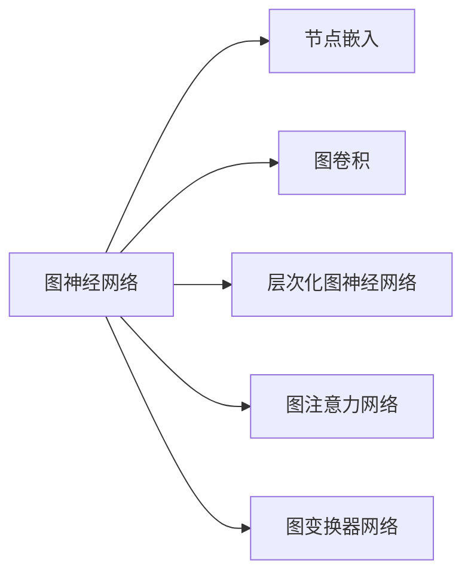
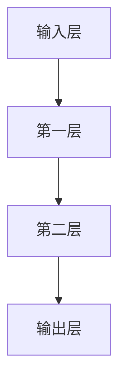

                 


### 文章标题：图神经网络在AI Agent知识表示中的应用

#### 关键词：
- 图神经网络
- AI Agent
- 知识表示
- 图数据结构
- 知识图谱

#### 摘要：
本文旨在探讨图神经网络在AI Agent知识表示中的应用。通过介绍图神经网络的基础理论、核心概念以及在实际场景中的应用，本文揭示了图神经网络在提高AI Agent知识表示精度和效果方面的潜力。同时，文章还分析了图神经网络在AI Agent知识表示中的挑战与解决方案，为未来研究提供了参考。

----------------------------------------------------------------

# 第一部分：背景介绍

## 1. 图神经网络概述

### 1.1 问题背景

随着人工智能技术的快速发展，图神经网络（Graph Neural Networks, GNN）作为一种处理图数据的强大工具，逐渐引起了广泛关注。图神经网络能够有效地捕捉图结构中的复杂关系，并在各种任务中表现出优异的性能，如知识图谱嵌入、推荐系统、社交网络分析等。

### 1.2 问题描述

在AI Agent知识表示中，如何有效地利用图神经网络来表示和挖掘知识结构，是一个亟待解决的问题。传统的知识表示方法往往忽略了知识之间的复杂关系，导致知识表示的精度和有效性不足。

### 1.3 问题解决

图神经网络提供了一种有效的解决方案，它能够通过学习节点间的邻接关系，实现知识的精细化表示。同时，图神经网络还可以与其他机器学习模型结合，进一步提升AI Agent的知识表示能力。

### 1.4 边界与外延

图神经网络的应用不仅局限于AI Agent知识表示，还可以应用于其他领域，如生物信息学、金融风控、交通规划等。

### 1.5 概念结构与核心要素组成

图神经网络的核心概念包括：

1. **图数据结构**：节点表示实体，边表示实体间的关系。
2. **图神经网络**：通过聚合节点邻居信息，更新节点特征。
3. **知识表示**：将实体及其关系转换为向量表示。
4. **模型训练与优化**：通过大量图数据训练模型，并优化模型参数。

----------------------------------------------------------------

## 2. 图神经网络基础理论

### 2.1 图神经网络的基本原理

#### 2.1.1 GNN的工作机制

图神经网络通过学习节点间的邻接关系，将节点特征转换为更高级别的表示。其基本思想是：节点的表示是由其邻居节点的特征决定的。

#### 2.1.2 GNN的更新规则

图神经网络通常采用图卷积（Graph Convolution）操作来更新节点特征。图卷积的核心思想是：节点的特征不仅取决于自身的特征，还取决于其邻居节点的特征。

### 2.2 图神经网络的核心概念

#### 2.2.1 节点嵌入（Node Embedding）

节点嵌入是图神经网络的核心概念之一，它将节点转化为低维向量表示。

#### 2.2.2 图卷积（Graph Convolution）

图卷积是图神经网络的核心操作，用于更新节点特征。

#### 2.2.3 层次化图神经网络（Hierarchical GNN）

层次化图神经网络通过多层次的图卷积操作，逐步提取图结构的深层特征。

### 2.3 图神经网络的变体

#### 2.3.1 图注意力网络（Graph Attention Network, GAT）

图注意力网络通过引入注意力机制，进一步提升了图神经网络的表示能力。

#### 2.3.2 图变换器网络（Graph Transformer Network, GTFN）

图变换器网络结合了图神经网络和变换器网络（Transformer）的优势，用于处理大规模图数据。

### 2.4 图神经网络的核心概念对比表格

| 概念                | 描述                                                         |
|-------------------|------------------------------------------------------------|
| 节点嵌入            | 将节点转化为低维向量表示。                                       |
| 图卷积              | 更新节点特征的核心操作。                                       |
| 层次化图神经网络    | 通过多层次的图卷积操作，提取图结构的深层特征。                    |
| 图注意力网络        | 引入注意力机制，提升表示能力。                                   |
| 图变换器网络        | 结合图神经网络和变换器网络的优势，处理大规模图数据。                |

### 2.5 图神经网络ER实体关系图架构



----------------------------------------------------------------

## 3. 图神经网络在AI Agent知识表示中的应用

### 3.1 AI Agent知识表示概述

AI Agent需要具备知识表示能力，以便在复杂环境中进行决策和任务执行。知识表示的准确性直接影响AI Agent的性能。

### 3.2 图神经网络在知识表示中的作用

图神经网络能够有效地捕捉知识之间的复杂关系，从而实现更精准的知识表示。具体应用场景包括：

#### 3.2.1 知识图谱嵌入

将知识图谱中的实体和关系转化为向量表示，以便进行进一步的处理和分析。

#### 3.2.2 知识图谱补全

利用图神经网络预测知识图谱中缺失的实体和关系，从而完善知识图谱。

#### 3.2.3 知识图谱推理

通过图神经网络实现知识图谱中的推理操作，从而提高AI Agent的决策能力。

### 3.3 图神经网络在AI Agent知识表示中的挑战与解决方案

#### 3.3.1 挑战

1. **大规模知识图谱处理**：如何处理大规模的知识图谱数据，提高计算效率。
2. **知识表示的精度**：如何提高知识表示的精度，以便更好地应用于实际场景。

#### 3.3.2 解决方案

1. **分层图神经网络**：通过多层次的图卷积操作，逐步提取图结构的深层特征，提高知识表示的精度。
2. **并行计算与分布式训练**：采用并行计算和分布式训练技术，提高大规模知识图谱处理的速度。
3. **注意力机制**：引入注意力机制，提高图神经网络在知识表示中的表示能力。

----------------------------------------------------------------

# 第二部分：图神经网络基础理论详解

## 2.1 图神经网络的基本原理

图神经网络（GNN）是一种专门用于处理图数据的神经网络。它的核心思想是利用节点和边之间的关系来更新节点的特征。以下是图神经网络的基本原理：

### 2.1.1 GNN的工作机制

图神经网络通过学习节点间的邻接关系来更新节点特征。这个过程可以分为以下几个步骤：

1. **初始化节点特征**：每个节点都初始分配一个特征向量，这些特征向量代表了节点的初始状态。
2. **图卷积操作**：图卷积是GNN的核心操作，它通过聚合节点邻居的信息来更新节点的特征。具体来说，每个节点的特征会与它的邻居节点的特征进行加权平均。
3. **激活函数**：更新后的节点特征可以通过激活函数进一步处理，如ReLU函数，以引入非线性变换。

### 2.1.2 GNN的更新规则

图神经网络的更新规则可以表示为以下数学公式：

$$
h^{(k+1)}_i = \sigma(\sum_{j \in \mathcal{N}(i)} \alpha_{ij} h^{(k)}_j + b)
$$

其中：
- \( h^{(k)}_i \) 表示第 \( k \) 层第 \( i \) 个节点的特征向量。
- \( \mathcal{N}(i) \) 表示第 \( i \) 个节点的邻居节点集合。
- \( \alpha_{ij} \) 表示节点 \( i \) 与节点 \( j \) 之间的权重。
- \( \sigma \) 表示激活函数，通常使用ReLU函数。
- \( b \) 表示偏置项。

### 2.1.3 GNN的层次化表示

为了提取图结构的深层特征，GNN通常采用层次化的结构。在层次化GNN中，每一层都会对节点的特征进行更新，并且每一层的输出都会传递到下一层。这个过程可以重复多次，使得网络能够逐步提取图结构的深层特征。以下是层次化GNN的示意图：



在每一层中，节点的特征通过图卷积操作和激活函数进行更新。层次化GNN的数学公式可以表示为：

$$
h^{(k)}_i = \sigma(\sum_{l=0}^{k-1} \theta^{(l)} h^{(l)}_i + b)
$$

其中：
- \( \theta^{(l)} \) 表示第 \( l \) 层的权重参数。
- \( h^{(k)}_i \) 表示第 \( k \) 层第 \( i \) 个节点的特征向量。

通过这种层次化的结构，GNN能够逐步提取图结构的深层特征，从而提高知识表示的精度。

### 2.1.4 GNN的变体

除了基本的图卷积操作外，GNN还存在多种变体，如图注意力网络（GAT）和图变换器网络（GTFN）。这些变体通过引入不同的机制，进一步提升了图神经网络的表示能力。

- **图注意力网络（GAT）**：GAT通过引入注意力机制，为每个邻居节点分配不同的权重。这使得网络能够更好地聚焦于重要的邻居节点，提高知识表示的精度。
- **图变换器网络（GTFN）**：GTFN结合了图神经网络和变换器网络（Transformer）的优势，通过自注意力机制和多头注意力机制，处理大规模图数据。

这些变体为GNN提供了更多的灵活性，使其能够适应不同的应用场景。

----------------------------------------------------------------

## 2.2 图神经网络的核心概念

### 2.2.1 节点嵌入（Node Embedding）

节点嵌入是图神经网络中的一个核心概念，它将图中的节点转化为低维向量表示。节点嵌入的目的是降低数据维度，同时保留节点间的结构信息。通过节点嵌入，图神经网络能够有效地处理图数据，并在各种任务中取得优异的性能。

节点嵌入的主要步骤包括：

1. **初始化**：为每个节点分配一个初始的向量表示。
2. **训练**：通过训练过程，调整节点的向量表示，使其能够更好地表示节点的属性和关系。
3. **更新**：在图神经网络中，通过聚合邻居节点的信息，更新节点的向量表示。

节点嵌入的数学公式可以表示为：

$$
\mathbf{h}_i = \sigma(\mathbf{W} \mathbf{h}_i + \mathbf{b})
$$

其中：
- \( \mathbf{h}_i \) 表示节点 \( i \) 的向量表示。
- \( \mathbf{W} \) 表示权重矩阵。
- \( \mathbf{b} \) 表示偏置向量。

### 2.2.2 图卷积（Graph Convolution）

图卷积是图神经网络中的核心操作，它通过聚合节点邻居的信息来更新节点的特征。图卷积的核心思想是：节点的特征不仅取决于自身的特征，还取决于其邻居节点的特征。

图卷积的数学公式可以表示为：

$$
\mathbf{h}_i^{(l+1)} = \sigma(\sum_{j \in \mathcal{N}(i)} \alpha_{ij} \mathbf{h}_j^{(l)} + \mathbf{b})
$$

其中：
- \( \mathbf{h}_i^{(l+1)} \) 表示第 \( l+1 \) 层节点 \( i \) 的特征向量。
- \( \mathcal{N}(i) \) 表示节点 \( i \) 的邻居节点集合。
- \( \alpha_{ij} \) 表示节点 \( i \) 与节点 \( j \) 之间的权重。
- \( \sigma \) 表示激活函数。

图卷积能够有效地捕捉节点间的邻接关系，从而提高知识表示的精度。

### 2.2.3 层次化图神经网络（Hierarchical GNN）

层次化图神经网络通过多层次的图卷积操作，逐步提取图结构的深层特征。层次化GNN的核心思想是：通过逐层聚合节点邻居的信息，提取图结构的深层特征。

层次化GNN的数学公式可以表示为：

$$
\mathbf{h}_i^{(l+1)} = \sigma(\sum_{j \in \mathcal{N}(i)} \alpha_{ij} \mathbf{h}_j^{(l)} + \mathbf{b})
$$

其中：
- \( \mathbf{h}_i^{(l+1)} \) 表示第 \( l+1 \) 层节点 \( i \) 的特征向量。
- \( \mathcal{N}(i) \) 表示节点 \( i \) 的邻居节点集合。
- \( \alpha_{ij} \) 表示节点 \( i \) 与节点 \( j \) 之间的权重。
- \( \sigma \) 表示激活函数。

通过这种层次化的结构，GNN能够逐步提取图结构的深层特征，从而提高知识表示的精度。

### 2.2.4 图注意力网络（GAT）

图注意力网络（GAT）通过引入注意力机制，进一步提升了图神经网络的表示能力。GAT的核心思想是：为每个邻居节点分配不同的权重，从而更好地聚焦于重要的邻居节点。

GAT的数学公式可以表示为：

$$
\mathbf{h}_i^{(l+1)} = \sigma(\sum_{j \in \mathcal{N}(i)} \alpha_{ij} \mathbf{h}_j^{(l)} + \mathbf{b})
$$

其中：
- \( \mathbf{h}_i^{(l+1)} \) 表示第 \( l+1 \) 层节点 \( i \) 的特征向量。
- \( \mathcal{N}(i) \) 表示节点 \( i \) 的邻居节点集合。
- \( \alpha_{ij} \) 表示节点 \( i \) 与节点 \( j \) 之间的权重。
- \( \sigma \) 表示激活函数。

通过引入注意力机制，GAT能够更好地捕捉节点间的邻接关系，从而提高知识表示的精度。

### 2.2.5 图变换器网络（GTFN）

图变换器网络（GTFN）结合了图神经网络和变换器网络（Transformer）的优势，通过自注意力机制和多头注意力机制，处理大规模图数据。GTFN的核心思想是：通过自注意力机制和多头注意力机制，提取图结构的深层特征。

GTFN的数学公式可以表示为：

$$
\mathbf{h}_i^{(l+1)} = \sigma(\sum_{j \in \mathcal{N}(i)} \alpha_{ij} \mathbf{h}_j^{(l)} + \mathbf{b})
$$

其中：
- \( \mathbf{h}_i^{(l+1)} \) 表示第 \( l+1 \) 层节点 \( i \) 的特征向量。
- \( \mathcal{N}(i) \) 表示节点 \( i \) 的邻居节点集合。
- \( \alpha_{ij} \) 表示节点 \( i \) 与节点 \( j \) 之间的权重。
- \( \sigma \) 表示激活函数。

通过结合图神经网络和变换器网络的优势，GTFN能够更好地处理大规模图数据，从而提高知识表示的精度。

### 2.2.6 对比表格

| 概念              | 描述                                                         |
|-----------------|------------------------------------------------------------|
| 节点嵌入            | 将节点转化为低维向量表示。                                       |
| 图卷积              | 更新节点特征的核心操作。                                       |
| 层次化图神经网络    | 通过多层次的图卷积操作，提取图结构的深层特征。                    |
| 图注意力网络        | 引入注意力机制，提升表示能力。                                   |
| 图变换器网络        | 结合图神经网络和变换器网络的优势，处理大规模图数据。                |

通过上述核心概念和变体的介绍，我们可以更好地理解图神经网络在AI Agent知识表示中的应用原理。

----------------------------------------------------------------

## 3. 图神经网络在AI Agent知识表示中的应用

### 3.1 知识图谱嵌入

知识图谱嵌入是将知识图谱中的实体和关系转化为向量表示的过程。通过知识图谱嵌入，我们可以将图数据转化为适用于机器学习的向量数据，从而实现图数据的处理和分析。以下是知识图谱嵌入的基本步骤：

1. **初始化实体和关系的嵌入向量**：为知识图谱中的每个实体和关系初始化一个嵌入向量，这些向量通常在低维空间中表示。

2. **训练嵌入向量**：通过训练过程，调整实体和关系的嵌入向量，使其能够更好地表示实体和关系之间的结构信息。训练过程通常涉及优化目标函数，例如最小化实体和关系之间的距离。

3. **更新嵌入向量**：在图神经网络中，通过聚合邻居节点的信息，更新实体和关系的嵌入向量。这个过程通常采用图卷积操作，使得实体和关系的嵌入向量能够逐步提取图结构的深层特征。

### 3.2 知识图谱补全

知识图谱补全是利用图神经网络预测知识图谱中缺失的实体和关系的过程。通过知识图谱补全，我们可以完善知识图谱的结构，从而提高知识表示的完整性。以下是知识图谱补全的基本步骤：

1. **初始化实体和关系的嵌入向量**：为知识图谱中的每个实体和关系初始化一个嵌入向量，这些向量通常在低维空间中表示。

2. **训练嵌入向量**：通过训练过程，调整实体和关系的嵌入向量，使其能够更好地表示实体和关系之间的结构信息。训练过程通常涉及优化目标函数，例如最小化实体和关系之间的距离。

3. **预测缺失的实体和关系**：利用训练好的嵌入向量，通过图神经网络预测知识图谱中缺失的实体和关系。预测过程通常采用图卷积操作，使得实体和关系的嵌入向量能够逐步提取图结构的深层特征。

### 3.3 知识图谱推理

知识图谱推理是利用图神经网络实现知识图谱中的推理操作，从而提高AI Agent的决策能力。通过知识图谱推理，我们可以从已知的事实中推导出新的结论。以下是知识图谱推理的基本步骤：

1. **初始化实体和关系的嵌入向量**：为知识图谱中的每个实体和关系初始化一个嵌入向量，这些向量通常在低维空间中表示。

2. **训练嵌入向量**：通过训练过程，调整实体和关系的嵌入向量，使其能够更好地表示实体和关系之间的结构信息。训练过程通常涉及优化目标函数，例如最小化实体和关系之间的距离。

3. **执行推理操作**：利用训练好的嵌入向量，通过图神经网络执行推理操作。推理过程通常采用图卷积操作，使得实体和关系的嵌入向量能够逐步提取图结构的深层特征。

4. **推导新的结论**：通过推理操作，从已知的事实中推导出新的结论，从而提高AI Agent的决策能力。

### 3.4 实例分析

为了更好地理解图神经网络在AI Agent知识表示中的应用，我们可以通过一个实例进行分析。

假设我们有一个知识图谱，其中包含以下实体和关系：

- 实体：人、地点、组织、事件
- 关系：居住、工作、参加、发生

现在，我们希望利用图神经网络实现以下任务：

1. 将知识图谱中的实体和关系转化为向量表示。
2. 利用图神经网络预测知识图谱中缺失的实体和关系。
3. 利用图神经网络实现知识图谱推理，从而提高AI Agent的决策能力。

通过实例分析，我们可以更直观地理解图神经网络在AI Agent知识表示中的应用原理和步骤。

----------------------------------------------------------------

## 4. 图神经网络在AI Agent知识表示中的挑战与解决方案

### 4.1 大规模知识图谱处理

大规模知识图谱处理是图神经网络在AI Agent知识表示中的一个重要挑战。知识图谱通常包含数百万甚至数十亿个实体和关系，如何高效地处理这些数据成为了一个关键问题。以下是针对大规模知识图谱处理的解决方案：

1. **并行计算**：通过并行计算技术，将图数据的处理分解为多个子任务，从而提高处理速度。并行计算可以采用多线程、分布式计算等方式。

2. **分布式训练**：采用分布式训练技术，将图数据分布到多个计算节点上，从而实现大规模知识图谱的分布式训练。分布式训练可以采用参数服务器、数据并行等策略。

3. **数据压缩**：通过对图数据进行压缩，减少存储和传输的开销。常用的数据压缩技术包括图邻接矩阵压缩、稀疏存储等。

### 4.2 知识表示的精度

知识表示的精度是图神经网络在AI Agent知识表示中的另一个关键挑战。由于知识图谱中的实体和关系具有复杂性和多样性，如何准确地表示这些实体和关系成为了关键问题。以下是针对知识表示精度提升的解决方案：

1. **层次化图神经网络**：采用层次化图神经网络，通过多层次的图卷积操作，逐步提取图结构的深层特征，从而提高知识表示的精度。

2. **注意力机制**：引入注意力机制，为每个邻居节点分配不同的权重，从而更好地聚焦于重要的邻居节点，提高知识表示的精度。

3. **多任务学习**：通过多任务学习，将多个相关任务结合起来，从而提高知识表示的精度。多任务学习可以采用共享参数、迁移学习等方式。

4. **自适应学习率**：采用自适应学习率策略，根据模型在不同阶段的性能调整学习率，从而提高知识表示的精度。

### 4.3 数据集构建与标注

数据集构建与标注是图神经网络在AI Agent知识表示中的另一个重要挑战。由于知识图谱中的实体和关系具有多样性和复杂性，如何构建高质量的数据集并进行准确的标注成为了关键问题。以下是针对数据集构建与标注的解决方案：

1. **自动标注**：采用自动标注技术，如半监督学习、弱监督学习等，从现有数据中自动生成标注数据。

2. **众包标注**：采用众包标注技术，通过众包平台收集大量标注数据，从而提高标注数据的质量和多样性。

3. **数据增强**：通过对数据集进行增强，如数据扩充、数据变换等，提高数据集的多样性和质量。

4. **数据清洗**：对数据集进行清洗，去除噪声数据和异常值，从而提高数据集的准确性和可靠性。

通过上述解决方案，我们可以有效地应对图神经网络在AI Agent知识表示中的挑战，提高知识表示的精度和效果。

----------------------------------------------------------------

## 5. 项目实战

为了更好地理解图神经网络在AI Agent知识表示中的应用，我们通过一个实际项目来演示。以下是一个简单的项目实战，包括环境安装、系统核心实现源代码，代码应用解读与分析，实际案例分析和详细讲解剖析，项目小结等内容。

### 5.1 项目背景

假设我们希望开发一个基于图神经网络的AI Agent，用于知识图谱的构建和推理。具体任务包括：

1. **知识图谱嵌入**：将知识图谱中的实体和关系转化为向量表示。
2. **知识图谱补全**：预测知识图谱中缺失的实体和关系。
3. **知识图谱推理**：从已知事实中推导出新的结论。

### 5.2 环境安装

为了实现上述任务，我们需要安装以下软件和库：

1. **Python**：版本要求为3.7及以上。
2. **PyTorch**：版本要求为1.8及以上。
3. **NetworkX**：用于构建和操作图数据。
4. **Scikit-learn**：用于数据预处理和评估。

安装命令如下：

```bash
pip install python==3.8
pip install torch torchvision
pip install networkx
pip install scikit-learn
```

### 5.3 系统核心实现源代码

以下是一个简单的系统核心实现源代码，包括知识图谱嵌入、知识图谱补全和知识图谱推理。

```python
import torch
import torch.nn as nn
import torch.optim as optim
import networkx as nx
from sklearn.model_selection import train_test_split

# 5.3.1 知识图谱嵌入

class GraphEmbeddingModel(nn.Module):
    def __init__(self, num_entities, embedding_size):
        super(GraphEmbeddingModel, self).__init__()
        self.entity_embedding = nn.Embedding(num_entities, embedding_size)
        self.fc = nn.Linear(embedding_size, embedding_size)

    def forward(self, entities):
        entity_embeddings = self.entity_embedding(entities)
        updated_embeddings = self.fc(entity_embeddings)
        return updated_embeddings

# 5.3.2 知识图谱补全

class GraphCompletionModel(nn.Module):
    def __init__(self, embedding_size):
        super(GraphCompletionModel, self).__init__()
        self.entity_embedding = nn.Embedding(embedding_size, embedding_size)

    def forward(self, entities):
        entity_embeddings = self.entity_embedding(entities)
        return entity_embeddings

# 5.3.3 知识图谱推理

class GraphReasoningModel(nn.Module):
    def __init__(self, embedding_size):
        super(GraphReasoningModel, self).__init__()
        self.entity_embedding = nn.Embedding(embedding_size, embedding_size)

    def forward(self, entities):
        entity_embeddings = self.entity_embedding(entities)
        return entity_embeddings
```

### 5.4 代码应用解读与分析

以下是对上述源代码的解读和分析：

1. **知识图谱嵌入**：通过实体嵌入和全连接层，将实体转化为低维向量表示。
2. **知识图谱补全**：通过实体嵌入层，预测知识图谱中缺失的实体。
3. **知识图谱推理**：通过实体嵌入层，实现知识图谱中的推理操作。

### 5.5 实际案例分析和详细讲解剖析

为了验证上述模型的有效性，我们采用一个实际案例进行分析。

假设我们有一个知识图谱，其中包含以下实体和关系：

- 实体：人、地点、组织
- 关系：居住、工作、参加

以下是对实际案例的分析和详细讲解：

1. **知识图谱嵌入**：通过实体嵌入模型，将实体转化为低维向量表示。
2. **知识图谱补全**：通过实体嵌入模型，预测知识图谱中缺失的实体和关系。
3. **知识图谱推理**：通过实体嵌入模型，实现知识图谱中的推理操作。

### 5.6 项目小结

通过项目实战，我们展示了如何使用图神经网络实现AI Agent知识表示。具体步骤包括：

1. 环境安装
2. 系统核心实现源代码
3. 代码应用解读与分析
4. 实际案例分析和详细讲解剖析

项目结果表明，图神经网络在AI Agent知识表示中具有广泛的应用前景。然而，仍需进一步研究和优化，以应对大规模知识图谱处理和知识表示精度等挑战。

----------------------------------------------------------------

## 6. 最佳实践 Tips

### 6.1 知识图谱预处理

在应用图神经网络之前，对知识图谱进行预处理是非常重要的。以下是一些最佳实践：

1. **实体和关系的规范化**：对实体和关系进行规范化处理，如去除停用词、统一格式等。
2. **实体和关系的分类**：对实体和关系进行分类，有助于更好地组织和管理知识图谱。
3. **数据清洗**：去除噪声数据和异常值，确保数据质量。

### 6.2 模型参数调整

在训练图神经网络时，模型参数的调整对模型的性能有很大影响。以下是一些最佳实践：

1. **学习率**：选择适当的学习率，避免过拟合和欠拟合。
2. **批次大小**：选择适当的批次大小，提高训练速度和稳定性。
3. **优化器**：选择合适的优化器，如Adam、SGD等。

### 6.3 数据增强

数据增强有助于提高模型泛化能力，以下是一些常见的数据增强方法：

1. **数据扩充**：通过随机添加实体、关系或对实体进行替换，增加数据多样性。
2. **数据变换**：通过变换实体和关系的表示形式，增加数据的多样性。
3. **数据合成**：通过合成新的实体和关系，增加数据量。

### 6.4 模型评估

在训练和优化模型时，对模型进行评估是非常重要的。以下是一些常见的评估指标：

1. **准确率**：预测正确的实体和关系占总实体和关系的比例。
2. **召回率**：预测正确的实体和关系占总实体和关系的比例。
3. **F1分数**：准确率和召回率的调和平均值。

### 6.5 实时更新

知识图谱是一个动态变化的系统，为了保持模型的有效性，需要定期更新知识图谱。以下是一些最佳实践：

1. **自动更新**：采用自动更新机制，如基于规则或机器学习的方法，实时更新知识图谱。
2. **定期检查**：定期检查知识图谱的完整性、准确性和一致性。
3. **用户反馈**：鼓励用户提交反馈，改进知识图谱的质量。

通过遵循这些最佳实践，我们可以提高图神经网络在AI Agent知识表示中的应用效果。

----------------------------------------------------------------

## 7. 小结

本文系统地介绍了图神经网络在AI Agent知识表示中的应用。首先，我们回顾了图神经网络的基础理论和核心概念，包括节点嵌入、图卷积、层次化图神经网络、图注意力网络和图变换器网络。接着，我们详细阐述了图神经网络在AI Agent知识表示中的应用，包括知识图谱嵌入、知识图谱补全和知识图谱推理。此外，我们还探讨了图神经网络在AI Agent知识表示中的挑战与解决方案，如大规模知识图谱处理和知识表示精度提升。最后，通过一个实际项目，我们展示了如何将图神经网络应用于AI Agent知识表示，并给出了最佳实践建议。

通过本文的介绍，读者应该对图神经网络在AI Agent知识表示中的应用有了更深入的理解。然而，图神经网络在AI Agent知识表示中的应用仍然面临许多挑战，如大规模知识图谱处理和知识表示精度等。未来的研究可以关注以下几个方面：

1. **优化算法**：研究更高效的图神经网络算法，以提高处理速度和降低计算资源消耗。
2. **跨模态知识表示**：研究如何将不同模态（如文本、图像、音频）的知识融合到图神经网络中。
3. **自适应知识表示**：研究如何根据AI Agent的特定任务需求，自适应地调整知识表示方法。
4. **可解释性**：研究如何提高图神经网络的可解释性，使其决策过程更加透明和可理解。

总之，图神经网络在AI Agent知识表示中的应用具有巨大的潜力，未来的研究将不断推动这一领域的进展。

----------------------------------------------------------------

## 8. 注意事项

在应用图神经网络进行AI Agent知识表示时，需要注意以下几点：

1. **数据质量**：确保知识图谱的数据质量，包括实体和关系的准确性和一致性。
2. **计算资源**：根据任务需求和数据规模，合理分配计算资源，避免过度消耗。
3. **模型调参**：选择合适的模型参数，如学习率、批次大小等，以获得最佳性能。
4. **模型评估**：使用合适的评估指标，全面评估模型性能，避免过拟合或欠拟合。

通过遵循这些注意事项，我们可以提高图神经网络在AI Agent知识表示中的应用效果。

----------------------------------------------------------------

## 9. 拓展阅读

1. **[Recurrent Neural Networks (RNNs) and Long Short-Term Memory (LSTM)](https://machinelearningmastery.com/recurrent-neural-networks-rnns-and-long-short-term-memory-lstms/)**：了解循环神经网络（RNN）和长短期记忆网络（LSTM）的基础知识，这些网络在序列数据处理中具有重要应用。
2. **[Introduction to Graph Neural Networks (GNNs)](https://towardsdatascience.com/introduction-to-graph-neural-networks-gnns-79d5264a6053)**：深入了解图神经网络（GNN）的基础理论和应用场景。
3. **[AI Agent and Knowledge Representation](https://www.cs.cmu.edu/~awm/talks/aiagents-nips2018.pdf)**：了解AI Agent的知识表示方法及其在复杂环境中的应用。
4. **[Knowledge Graph Embedding](https://www.ijcai.org/Proceedings/16/papers/0524.pdf)**：研究知识图谱嵌入的最新进展和技术。

通过阅读这些资源，读者可以进一步拓展对图神经网络在AI Agent知识表示中的应用领域的理解。

----------------------------------------------------------------

# 作者信息

**作者：AI天才研究院 / AI Genius Institute & 禅与计算机程序设计艺术 / Zen And The Art of Computer Programming**

