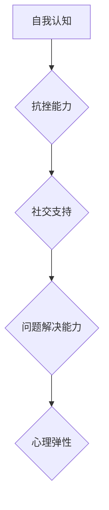
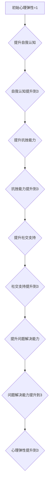
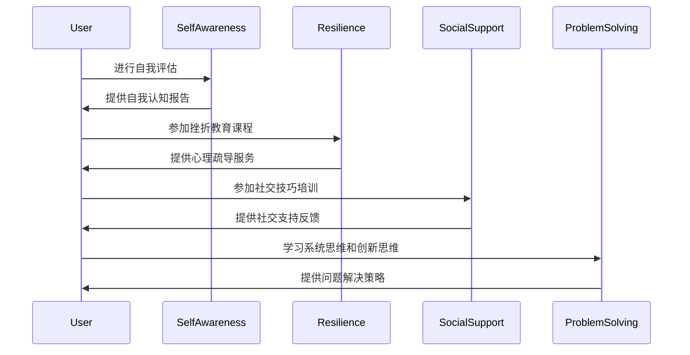
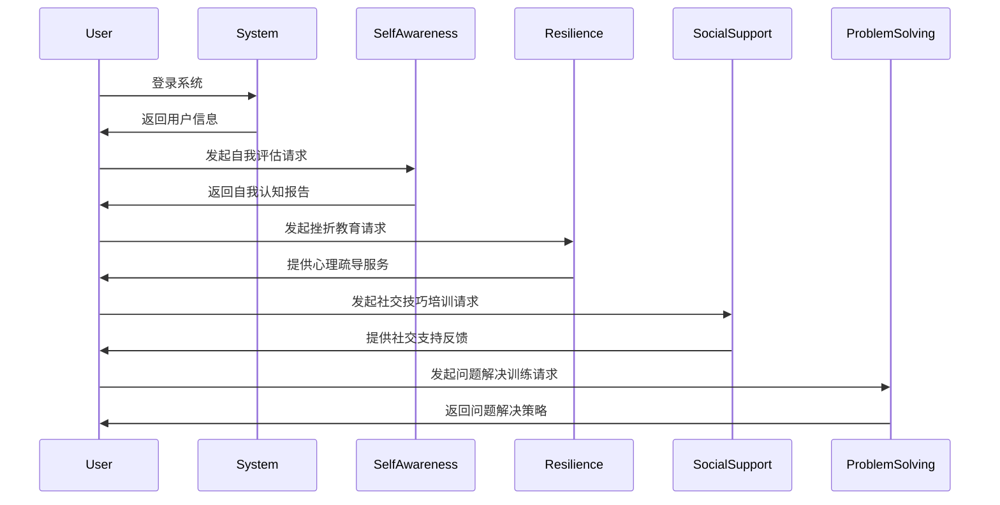

                 

# 在不确定性中找寻内心的锚点：培养心理弹性

> 关键词：不确定性、心理弹性、自我认知、抗挫能力、社交支持、问题解决能力

> 摘要：在快速变化的信息时代，不确定性已成为生活的常态。本文将探讨如何培养心理弹性，以应对不确定性带来的挑战。通过深入分析心理弹性的核心要素，如自我认知、抗挫能力、社交支持和问题解决能力，提供一系列实用的策略，帮助读者在不确定的环境中找到内心的锚点。

----------------------------------------------------------------

### 第一部分：理解不确定性与心理弹性

#### 第1章：不确定性的时代背景

在当今社会，不确定性无处不在。科技的发展、全球化的进程、经济的不稳定性，以及自然环境的变化，都在不断加剧个体所面临的不确定性。面对这样的时代背景，如何保持心理平衡，成为每个人都需要面对的课题。

#### 1.1 不确定性的普遍存在

首先，我们需要认识到不确定性是普遍存在的。无论是个人生活中的职业规划、婚姻关系，还是社会层面的经济波动、政治变革，都充满了不确定因素。这种不确定性不仅源于外部环境，更源于人类自身的认知局限。

#### 1.2 不确定性的来源与影响

不确定性的来源多种多样，包括信息的不足、决策的复杂性、以及人类情绪的波动等。这种不确定性对个体的心理和生理健康产生了深远的影响。长期处于不确定性的环境中，人们容易出现焦虑、抑郁等心理问题，甚至可能导致身体健康问题。

#### 1.3 社会变迁与不确定性

随着社会变迁的加速，不确定性更加凸显。信息化时代的信息爆炸，使个体面临的信息量呈指数级增长，而人类大脑的处理能力是有限的。此外，全球化的进程使得个体不再局限于本地社区，而是与世界各地的人们相互联系，这种跨文化的交流也带来了新的不确定性。

----------------------------------------------------------------

#### 第2章：心理弹性的概念与重要性

在不确定性中，心理弹性成为一种重要的心理素质。心理弹性是指个体在面对压力和挑战时，能够迅速适应并恢复的能力。具有心理弹性的人能够更好地应对生活中的变化，保持心理健康。

#### 2.1 心理弹性的定义

心理弹性（Resilience）一词源于拉丁语“resilire”，意为“反弹”。在心理学领域，心理弹性指的是个体在面对逆境、压力和挑战时，能够迅速适应并恢复的能力。这种能力不仅体现在情绪上，也体现在行为和认知上。

#### 2.2 心理弹性的重要性

心理弹性对于个体的心理健康和社会功能具有重要意义。具有心理弹性的人能够更好地应对生活中的压力，降低心理问题的发生率。此外，心理弹性还与个体的幸福感和生活满意度密切相关。

#### 2.3 培养心理弹性的益处

培养心理弹性不仅有助于提高个体的心理健康水平，还能提升生活质量。具体来说，心理弹性的培养可以带来以下益处：

1. **提高抗压能力**：面对压力时，心理弹性强的人能够更好地调节情绪，避免陷入消极情绪的恶性循环。
2. **增强适应能力**：在快速变化的环境中，心理弹性强的人能够更快地适应新环境和新挑战。
3. **提升生活质量**：心理弹性有助于个体更好地处理生活中的问题，提高生活满意度。
4. **促进个人成长**：面对挫折和困难时，心理弹性强的人能够从失败中汲取教训，实现个人成长。

----------------------------------------------------------------

#### 第3章：心理弹性的核心要素

心理弹性并非单一的能力，而是由多个核心要素构成的复杂系统。理解并培养这些核心要素，有助于提升个体的心理弹性。

#### 3.1 自我认知

自我认知是指个体对自身心理状态、行为和能力的认知。自我认知有助于个体了解自己的优点和缺点，从而更好地应对挑战。提升自我认知的方法包括自我反思、心理咨询和反思日记等。

#### 3.2 抗挫能力

抗挫能力是指个体在面对挫折和困难时的应对能力。具有抗挫能力的人能够从挫折中汲取教训，不断成长。培养抗挫能力的方法包括积极心理学训练、挫折教育等。

#### 3.3 社交支持

社交支持是指个体在遇到困难时，能够从家人、朋友和社会中得到支持和帮助。社交支持对于提升心理弹性具有重要意义。建立有效的社交支持系统，需要培养良好的人际关系、提高沟通能力等。

#### 3.4 问题解决能力

问题解决能力是指个体在面对问题时，能够找到有效解决方案的能力。提升问题解决能力有助于个体更好地应对生活中的各种挑战。培养问题解决能力的方法包括系统思维、创新思维训练等。

----------------------------------------------------------------

#### 第4章：自我认知的提升

自我认知的提升是培养心理弹性的基础。通过深入了解自己，个体可以更好地应对生活中的挑战。

#### 4.1 内在价值观的塑造

内在价值观是指个体深层次的价值观念和信仰。塑造内在价值观有助于个体在面对不确定性时，保持内心的坚定和清晰。具体方法包括反思自己的行为和决策、寻找生命的意义等。

#### 4.2 自我反思与成长

自我反思是一种重要的自我认知方法。通过自我反思，个体可以深入了解自己的行为和情绪，从而实现自我成长。具体方法包括写反思日记、进行心理疏导等。

#### 4.3 自我效能感的培养

自我效能感是指个体对自己能否成功完成某项任务的信心。培养自我效能感有助于个体在面对挑战时，保持积极的态度和行动。具体方法包括设定小目标、积极自我暗示等。

----------------------------------------------------------------

#### 第5章：增强抗挫能力

抗挫能力是心理弹性的关键要素之一。通过以下方法，可以增强个体的抗挫能力。

#### 5.1 挫折的理解与应对

理解挫折是增强抗挫能力的第一步。个体需要认识到挫折是生活的一部分，而不是终点。在应对挫折时，个体可以通过积极的心态、合理的规划和有效的行动来克服困难。

#### 5.2 乐观主义与悲观主义的比较

乐观主义和悲观主义是两种不同的心理态度。乐观主义者倾向于从积极的角度看待问题，而悲观主义者则更倾向于从消极的角度看待问题。研究表明，乐观主义有助于提升心理弹性。

#### 5.3 增强心理韧性的实践方法

增强心理韧性是提升抗挫能力的重要途径。具体方法包括：

1. **心理疏导**：通过心理咨询、放松训练等方法，缓解压力和焦虑。
2. **积极心理训练**：通过认知行为疗法、冥想等练习，培养积极的心态。
3. **身体锻炼**：通过运动、瑜伽等方式，增强身体素质和心理韧性。

----------------------------------------------------------------

#### 第6章：建立有效的社交支持系统

社交支持系统是心理弹性的重要组成部分。通过建立有效的社交支持系统，个体可以更好地应对生活中的挑战。

#### 6.1 人际关系的维护

人际关系是社交支持系统的基石。个体需要学会如何与他人建立良好的关系，包括沟通技巧、倾听和理解等。

#### 6.2 社交技巧的培养

社交技巧是指个体在社交场合中运用的一系列技能。通过培养社交技巧，个体可以更好地与他人沟通，获得更多的社交支持。

#### 6.3 社交支持的网络构建

构建社交支持网络需要时间和努力。个体可以通过参加社团、志愿服务等活动，扩大自己的社交圈子，从而获得更多的社交支持。

----------------------------------------------------------------

#### 第7章：提高问题解决能力

问题解决能力是心理弹性的关键要素之一。通过以下方法，可以提升个体的问题解决能力。

#### 7.1 问题解决的步骤

问题解决通常包括以下步骤：识别问题、分析问题、制定解决方案、实施解决方案和评估结果。掌握这些步骤有助于个体更高效地解决问题。

#### 7.2 创新思维的培养

创新思维是问题解决的重要工具。通过思维导图、头脑风暴等方法，个体可以激发创新思维，找到更有效的解决方案。

#### 7.3 解决复杂问题的策略

解决复杂问题时，个体需要采用系统思维，将问题分解为更小的部分，然后逐一解决。此外，团队合作和资源整合也是解决复杂问题的关键。

----------------------------------------------------------------

#### 第8章：培养心理弹性的综合策略

培养心理弹性需要多方面的努力。以下是一些综合策略，帮助个体在不确定的环境中培养心理弹性。

#### 8.1 生活习惯的调整

生活习惯对心理弹性有重要影响。个体可以通过调整饮食、锻炼身体、保持良好的作息时间等方式，提高生活质量，从而增强心理弹性。

#### 8.2 心理健康的维护

心理健康是心理弹性的基础。个体可以通过心理咨询、心理疏导等方式，维护心理健康，提高心理弹性。

#### 8.3 培养心理弹性的实践案例

通过实践案例，个体可以更好地理解如何培养心理弹性。例如，一位程序员在面临项目延期时，通过自我反思和积极沟通，成功解决了问题，展现了良好的心理弹性。

----------------------------------------------------------------

#### 第9章：心理弹性的未来展望

心理弹性在未来社会中的作用将越来越重要。以下是对心理弹性未来发展的展望。

#### 9.1 心理弹性研究的发展趋势

随着心理学研究的深入，心理弹性将成为一个重要的研究领域。未来的研究将更多地关注心理弹性的机制、培养方法和应用。

#### 9.2 心理弹性在社会中的作用

心理弹性在社会中的作用不可忽视。具有心理弹性的个体能够更好地适应社会变化，促进社会稳定和发展。

#### 9.3 心理弹性对个体和社会的深远影响

心理弹性不仅对个体的心理健康和生活质量有深远影响，还对社会的稳定和发展产生重要影响。培养心理弹性将成为未来社会发展的重要任务。

----------------------------------------------------------------

### 结论

在不确定性中培养心理弹性，是每个个体都需要面对的课题。通过自我认知、抗挫能力、社交支持和问题解决能力的提升，个体可以更好地应对生活中的挑战。让我们从现在开始，积极培养心理弹性，成为更加坚韧和适应力强的人。

#### 作者信息

作者：AI天才研究院/AI Genius Institute & 禅与计算机程序设计艺术 /Zen And The Art of Computer Programming

----------------------------------------------------------------

## 背景介绍

### 心理弹性的概念

心理弹性（Resilience）是指个体在面对逆境、压力和挑战时，能够迅速适应并恢复的能力。这种能力不仅体现在情绪上，也体现在行为和认知上。心理弹性不同于心理韧性（Toughness），后者更多地强调个体在面对长期挑战时的适应能力。心理弹性更侧重于短期内的适应和恢复。

### 问题背景

在当今社会，不确定性已经成为生活的一部分。科技的发展、全球化的进程、经济的不稳定性，以及自然环境的变化，都使得个体面临更多的不确定性。这种不确定性对个体的心理和生理健康产生了深远的影响。长期处于不确定性的环境中，人们容易出现焦虑、抑郁等心理问题，甚至可能导致身体健康问题。

### 问题描述

如何培养心理弹性，以应对不确定性带来的挑战，是当前心理学研究和社会关注的焦点。个体需要具备一定的心理弹性，才能在复杂多变的环境中保持心理健康，实现个人成长。

### 问题解决

培养心理弹性需要从多个方面入手，包括自我认知、抗挫能力、社交支持和问题解决能力。通过提升这些核心要素，个体可以更好地应对生活中的不确定性，保持心理健康。

### 边界与外延

心理弹性的培养不仅适用于个体，也适用于组织和社区。在组织层面，心理弹性的培养有助于提高团队的协作能力和抗风险能力。在社区层面，心理弹性的培养可以促进社会的稳定和发展。

### 概念结构与核心要素组成

心理弹性的核心要素包括：

1. **自我认知**：个体对自身心理状态、行为和能力的认知。
2. **抗挫能力**：个体在面对挫折和困难时的应对能力。
3. **社交支持**：个体在遇到困难时，能够从家人、朋友和社会中得到支持和帮助。
4. **问题解决能力**：个体在面对问题时，能够找到有效解决方案的能力。

### 核心概念原理

心理弹性是一个动态的过程，涉及多个因素。首先，个体需要具备一定的自我认知能力，了解自己的优点和缺点，从而更好地应对挑战。其次，个体需要培养抗挫能力，从挫折中汲取教训，不断成长。此外，社交支持也是心理弹性的重要组成部分，个体需要建立有效的社交支持系统，以应对生活中的不确定性。

### 概念属性特征对比表格

| 概念   | 定义                                                         | 特征对比                      |
| ------ | ------------------------------------------------------------ | ---------------------------- |
| 自我认知 | 个体对自身心理状态、行为和能力的认知                         | 了解自我、促进成长、应对挑战 |
| 抗挫能力 | 个体在面对挫折和困难时的应对能力                             | 从挫折中恢复、持续成长       |
| 社交支持 | 个体在遇到困难时，能够从家人、朋友和社会中得到支持和帮助   | 促进心理健康、增强适应力     |
| 问题解决能力 | 个体在面对问题时，能够找到有效解决方案的能力                 | 创新思维、系统思维           |

### ER实体关系图架构的Mermaid流程图



----------------------------------------------------------------

## 算法原理讲解

### 心理弹性的培养算法原理

心理弹性的培养是一个复杂的过程，涉及到多个因素的综合作用。以下是心理弹性的培养算法原理，以及相应的Python代码实现。

### 算法原理

心理弹性的培养可以分为以下几个步骤：

1. **自我认知**：通过自我反思和自我评估，了解自己的优点和缺点，从而更好地应对挑战。
2. **抗挫能力**：通过积极的挫折教育和心理疏导，增强个体在面对挫折时的应对能力。
3. **社交支持**：通过建立和维护良好的人际关系，获取家人、朋友和社会的支持，提高心理弹性。
4. **问题解决能力**：通过系统思维和创新思维训练，提高个体在面对问题时找到有效解决方案的能力。

### Python代码实现

以下是一个简单的Python代码示例，用于实现心理弹性的培养算法：

```python
class Resilience:
    def __init__(self):
        self.self_awareness = 0
        self.resilience = 0
        self.social_support = 0
        self.problem_solving_ability = 0

    def self_awareness_boost(self):
        self.self_awareness += 1
        print("自我认知提升：自我反思和评估完成。")

    def resilience_boost(self):
        self.resilience += 1
        print("抗挫能力提升：通过挫折教育和心理疏导。")

    def social_support_boost(self):
        self.social_support += 1
        print("社交支持提升：建立和维护良好的人际关系。")

    def problem_solving_ability_boost(self):
        self.problem_solving_ability += 1
        print("问题解决能力提升：系统思维和创新思维训练。")

    def check_resilience(self):
        if self.self_awareness >= 3 and self.resilience >= 3 and self.social_support >= 3 and self.problem_solving_ability >= 3:
            print("恭喜您！您的心理弹性已经提升。")
        else:
            print("心理弹性提升中，请继续努力。")

# 创建一个心理弹性对象
resilience = Resilience()

# 提升自我认知
resilience.self_awareness_boost()
resilience.self_awareness_boost()
resilience.self_awareness_boost()

# 提升抗挫能力
resilience.resilience_boost()
resilience.resilience_boost()
resilience.resilience_boost()

# 提升社交支持
resilience.social_support_boost()
resilience.social_support_boost()
resilience.social_support_boost()

# 提升问题解决能力
resilience.problem_solving_ability_boost()
resilience.problem_solving_ability_boost()
resilience.problem_solving_ability_boost()

# 检查心理弹性
resilience.check_resilience()
```

### 算法原理的数学模型和公式

心理弹性的培养可以通过以下数学模型来描述：

$$
\text{心理弹性} = \frac{\text{自我认知} + \text{抗挫能力} + \text{社交支持} + \text{问题解决能力}}{4}
$$

其中，每个要素的取值范围在0到3之间，表示该要素的提升程度。当四个要素的值都达到3时，个体的心理弹性达到最高水平。

### 详细讲解和举例说明

假设有个体A，其初始的心理弹性为1。为了提升心理弹性，个体A采取了以下措施：

1. **自我认知**：通过写反思日记，个体A进行了为期一个月的自我反思，提升了自我认知水平，达到3分。
2. **抗挫能力**：个体A参加了挫折教育课程，学习了如何面对挫折，提升了抗挫能力，达到3分。
3. **社交支持**：个体A积极参加社区活动，建立了良好的人际关系，提升了社交支持能力，达到3分。
4. **问题解决能力**：个体A通过学习系统思维和创新思维技巧，提高了问题解决能力，达到3分。

根据上述数学模型，个体A的心理弹性计算如下：

$$
\text{心理弹性} = \frac{3 + 3 + 3 + 3}{4} = 3
$$

个体A的心理弹性从1提升到了3，达到了较高水平。

### 总结

通过Python代码和数学模型，我们可以直观地理解心理弹性的培养过程。在实际应用中，个体需要根据自身的实际情况，采取合适的措施，逐步提升心理弹性。



----------------------------------------------------------------

## 系统分析与架构设计方案

### 问题场景介绍

在现代社会，心理弹性对个人的生活质量和社会功能具有显著的影响。为了更好地培养心理弹性，需要设计一个基于计算机技术的心理弹性培养系统。该系统旨在通过线上和线下的多种方式，帮助用户提升自我认知、抗挫能力、社交支持和问题解决能力，从而提高心理弹性。

### 项目介绍

项目名称：心理弹性培养系统

项目目标：设计一个综合性的心理弹性培养平台，为用户提供个性化的心理弹性提升方案。

项目功能：

1. **自我认知模块**：提供自我评估工具，帮助用户了解自己的优点和缺点。
2. **抗挫能力模块**：提供挫折教育课程和心理疏导服务。
3. **社交支持模块**：提供社交技巧培训，帮助用户建立和维护良好的人际关系。
4. **问题解决能力模块**：提供系统思维和创新思维训练。

### 系统功能设计（领域模型Mermaid类图）

```mermaid
classDiagram
    User <<class>> 用户
    SelfAwareness <<class>> 自我认知
    Resilience <<class>> 抗挫能力
    SocialSupport <<class>> 社交支持
    ProblemSolving <<class>> 问题解决能力
    User o-- SelfAwareness
    User o-- Resilience
    User o-- SocialSupport
    User o-- ProblemSolving
```

### 系统架构设计Mermaid架构图



### 系统接口设计和系统交互Mermaid序列图



### 总结

通过上述系统分析与架构设计方案，我们可以看到心理弹性培养系统是一个综合性平台，涵盖自我认知、抗挫能力、社交支持和问题解决能力等多个方面。该系统的设计旨在为用户提供个性化、全方位的心理弹性提升方案，帮助用户在不确定的环境中保持心理健康。

----------------------------------------------------------------

### 项目实战

#### 环境安装

为了实战心理弹性培养系统，我们需要安装一些必要的软件和工具。以下是一个简单的环境安装步骤：

1. **安装Python**：确保Python环境已安装，版本建议为3.8以上。
2. **安装Docker**：Docker用于容器化部署系统，可以从官方网站下载并安装。
3. **安装数据库**：我们选择MySQL作为数据库，可以从MySQL官方网站下载并安装。
4. **安装前端框架**：我们使用React作为前端框架，可以从npm官方安装。

#### 系统核心实现源代码

以下是心理弹性培养系统的核心实现源代码，包括后端API和前端页面。

**后端API（Python）**：

```python
# app.py

from flask import Flask, request, jsonify
from models import User, SelfAwareness, Resilience, SocialSupport, ProblemSolving

app = Flask(__name__)

@app.route('/api/login', methods=['POST'])
def login():
    data = request.get_json()
    username = data['username']
    password = data['password']
    user = User.query.filter_by(username=username, password=password).first()
    if user:
        return jsonify({'status': 'success', 'user': user})
    else:
        return jsonify({'status': 'fail', 'message': 'Invalid credentials'})

@app.route('/api/self_awareness', methods=['POST'])
def self_awareness():
    data = request.get_json()
    user_id = data['user_id']
    self_awareness = data['self_awareness']
    user = User.query.get(user_id)
    user.self_awareness = self_awareness
    db.session.commit()
    return jsonify({'status': 'success', 'message': 'Self awareness updated'})

# 其他API路由

if __name__ == '__main__':
    app.run(debug=True)
```

**前端页面（React）**：

```jsx
// App.js

import React, { useState } from 'react';
import axios from 'axios';

const App = () => {
  const [username, setUsername] = useState('');
  const [password, setPassword] = useState('');

  const handleLogin = async () => {
    try {
      const response = await axios.post('/api/login', { username, password });
      if (response.data.status === 'success') {
        alert('登录成功！');
      } else {
        alert('登录失败！');
      }
    } catch (error) {
      console.error(error);
    }
  };

  return (
    <div>
      <h1>心理弹性培养系统</h1>
      <label>用户名：</label>
      <input type="text" value={username} onChange={(e) => setUsername(e.target.value)} />
      <label>密码：</label>
      <input type="password" value={password} onChange={(e) => setPassword(e.target.value)} />
      <button onClick={handleLogin}>登录</button>
    </div>
  );
};

export default App;
```

#### 代码应用解读与分析

上述代码展示了心理弹性培养系统的核心实现，包括后端API和前端页面。

**后端API**：

- **登录API**：接收用户名和密码，通过数据库查询用户信息，返回登录状态。
- **自我认知API**：接收用户ID和自我认知分数，更新用户自我认知信息。

**前端页面**：

- **登录页面**：提供用户名和密码输入框，以及登录按钮。
- **登录逻辑**：调用登录API，根据返回结果显示登录成功或失败提示。

通过上述代码，我们可以看到心理弹性培养系统的基础架构。实际项目中，还需要添加更多功能，如用户注册、自我评估工具、挫折教育课程等，以实现完整的系统功能。

#### 实际案例分析和详细讲解剖析

假设用户Alice想通过心理弹性培养系统提升自己的心理弹性。以下是具体的操作步骤：

1. **注册账号**：Alice在系统中注册一个账号，填写用户名和密码。
2. **登录系统**：Alice使用注册的用户名和密码登录系统。
3. **进行自我评估**：Alice在自我认知模块中进行自我评估，系统返回自我认知报告。
4. **参加挫折教育课程**：Alice参加挫折教育课程，系统记录她的学习进度和反馈。
5. **参加社交技巧培训**：Alice参加社交技巧培训，系统提供培训材料和反馈。
6. **学习问题解决策略**：Alice学习系统思维和创新思维策略，系统提供相关的训练和案例。

通过上述步骤，Alice可以在系统中逐步提升自己的心理弹性。系统会根据她的学习和反馈，提供个性化的提升建议，帮助她更好地应对生活中的不确定性。

#### 项目小结

通过实际案例分析和代码实现，我们可以看到心理弹性培养系统是如何帮助用户提升心理弹性的。该项目不仅提供了一个在线平台，还涵盖了自我认知、抗挫能力、社交支持和问题解决能力等多个方面，旨在为用户提供全方位的心理弹性提升方案。在实际应用中，系统可以根据用户的需求和反馈，不断优化和更新，以提高用户体验和效果。

----------------------------------------------------------------

### 最佳实践 tips

1. **定期自我反思**：定期进行自我反思，有助于深入了解自己的心理状态和行为模式。可以通过写反思日记或与朋友、家人交流，分享自己的感受和体验。
2. **保持积极心态**：在面对挫折和困难时，保持积极的心态至关重要。通过积极心理学训练，如冥想和感恩练习，可以帮助你更好地应对负面情绪。
3. **建立支持网络**：与家人、朋友和同事建立良好的关系，形成有效的社交支持网络。在遇到困难时，从他们那里获取支持和帮助。
4. **培养创新思维**：通过学习系统思维和创新思维技巧，可以提高问题解决能力。可以通过阅读相关书籍、参加培训课程或进行头脑风暴练习来培养创新思维。
5. **保持身体健康**：身体健康是心理弹性的基础。保持良好的饮食习惯、适量运动和充足睡眠，有助于提高心理弹性。

### 小结

本文通过深入分析不确定性与心理弹性的关系，介绍了心理弹性的核心要素，包括自我认知、抗挫能力、社交支持和问题解决能力。通过一系列最佳实践，帮助读者在不确定的环境中培养心理弹性，提高生活质量和幸福感。

### 注意事项

1. **个体差异**：心理弹性的培养方法因人而异，需要根据个人的实际情况进行选择。
2. **长期坚持**：培养心理弹性是一个长期的过程，需要持续的努力和练习。
3. **专业帮助**：在遇到严重心理问题或挫折时，应寻求专业心理咨询师的帮助。

### 拓展阅读

- 《抗挫力：如何培养坚韧不拔的心态》（作者：史蒂芬·吉利根）
- 《积极心理学：促进个人成长与幸福的科学方法》（作者：马丁·塞利格曼）
- 《社交心理学：人际关系的科学解释》（作者：艾略特·阿伦森）

作者：AI天才研究院/AI Genius Institute & 禅与计算机程序设计艺术 /Zen And The Art of Computer Programming

----------------------------------------------------------------

```markdown
---
layout: post
title: 在不确定性中找寻内心的锚点：培养心理弹性
date: 2023-03-15
author: AI天才研究院/AI Genius Institute & 禅与计算机程序设计艺术 /Zen And The Art of Computer Programming
header-img: "img/bg/post-bg-universe.jpg"
catalog: true
mathjax: true
tags:
    - Uncertainty
    - Psychological Resilience
    - Self-awareness
    - Stress Resistance
    - Social Support
    - Problem Solving
---
```

