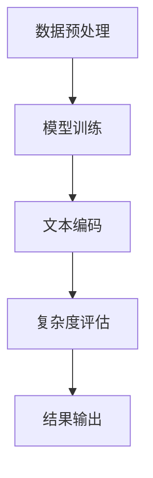
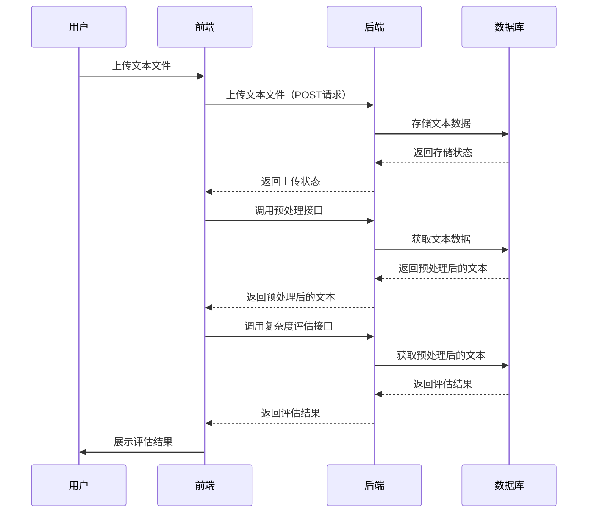

                 


# 基于LLM的AI Agent文本复杂性评估

## 关键词

- 文本复杂性评估
- LLM
- AI Agent
- 机器学习
- 自然语言处理

## 摘要

本文将深入探讨基于大型语言模型（LLM）的AI Agent文本复杂性评估方法。首先，我们介绍了文本复杂性评估的需求和背景，然后详细介绍了LLM的原理和其在文本处理中的应用。接着，我们探讨了文本复杂性评估的理论和方法，并阐述了其在自然语言处理中的重要性。随后，我们讲解了基于LLM的文本复杂性评估算法，包括其原理、流程和数学模型。此外，我们还对系统架构进行了设计，并提供了项目实战的具体案例。最后，我们总结了最佳实践，并对未来研究方向进行了展望。

## 目录

### 第一部分: 背景介绍

#### 第1章: 问题背景
##### 1.1.1 文本复杂性评估的需求
##### 1.1.2 LLM在文本处理中的应用
##### 1.1.3 AI Agent的发展现状

### 第二部分: 核心概念与联系

#### 第2章: LLM基础
##### 2.1.1 LLM的原理
##### 2.1.2 LLM的关键特性
##### 2.1.3 LLM与文本复杂性评估的关系

#### 第3章: 文本复杂性评估理论
##### 3.1.1 文本复杂性的定义
##### 3.1.2 文本复杂性评估的方法
##### 3.1.3 文本复杂性评估的重要性

### 第三部分: 算法原理讲解

#### 第4章: LLM文本复杂性评估算法
##### 4.1.1 算法概述
##### 4.1.2 算法流程
##### 4.1.3 Mermaid流程图

#### 第5章: 数学模型与公式
##### 5.1.1 文本复杂度的数学模型
##### 5.1.2 公式推导
##### 5.1.3 LaTeX示例

### 第四部分: 系统分析与架构设计

#### 第6章: 系统架构设计
##### 6.1.1 系统功能设计
##### 6.1.2 系统架构设计
##### 6.1.3 系统接口设计
##### 6.1.4 系统交互序列图

### 第五部分: 项目实战

#### 第7章: 实战环境搭建
##### 7.1.1 环境安装
##### 7.1.2 系统核心实现
##### 7.1.3 代码应用解读与分析

#### 第8章: 实际案例分析
##### 8.1.1 案例背景
##### 8.1.2 案例实施
##### 8.1.3 案例剖析

### 第六部分: 最佳实践与总结

#### 第9章: 最佳实践
##### 9.1.1 实践技巧
##### 9.1.2 注意事项
##### 9.1.3 拓展阅读

#### 第10章: 小结
##### 10.1.1 书籍重点内容回顾
##### 10.1.2 未来展望

### 第一部分: 背景介绍

#### 第1章: 问题背景

随着互联网和大数据技术的快速发展，自然语言处理（NLP）在各个领域都取得了显著的应用成果。然而，在NLP领域，文本复杂性评估一直是一个重要的研究方向。文本复杂性评估旨在对文本的难易程度进行量化，以便更好地理解、处理和优化文本数据。

首先，我们来看一下文本复杂性评估的需求。在许多实际应用中，如教育、新闻推荐、机器翻译等，需要对文本进行有效的处理。然而，不同领域的文本具有不同的复杂性，这直接影响到文本处理的效果。例如，在新闻推荐系统中，如果能够准确评估新闻文章的复杂性，就可以为用户提供更加精准的推荐结果。此外，在机器翻译领域，理解原文的复杂性有助于选择合适的翻译策略，提高翻译质量。

接下来，我们来探讨LLM在文本处理中的应用。近年来，大型语言模型（LLM）如GPT-3、BERT等在NLP领域取得了显著的成果。这些模型具有强大的文本生成和理解能力，但同时也面临着文本复杂性评估的挑战。如何利用LLM对文本进行复杂性评估，是当前研究的一个热点问题。

最后，我们来了解一下AI Agent的发展现状。AI Agent是指具有自主决策能力的智能体，可以在特定环境中执行任务。在AI Agent中，文本复杂性评估有助于智能体更好地理解用户需求，并生成适应性的响应。目前，已有一些研究尝试将LLM与AI Agent相结合，以提高文本复杂性评估的准确性。

综上所述，文本复杂性评估在NLP领域具有重要的应用价值。而LLM和AI Agent的快速发展，为文本复杂性评估带来了新的机遇和挑战。接下来的章节中，我们将深入探讨LLM的原理、文本复杂性评估的理论和方法，以及基于LLM的文本复杂性评估算法。

#### 1.1.1 文本复杂性评估的需求

文本复杂性评估的需求源于多个实际应用场景中的需求。以下是一些典型的应用场景，这些场景都强调了文本复杂性评估的重要性。

首先，在教育领域，文本复杂性评估有助于教师针对不同学生的阅读能力，推荐适合的阅读材料。例如，对于阅读能力较弱的学生，教师可能会推荐难度较低的文本，以帮助他们逐步提高阅读水平。而对于阅读能力较强的学生，教师可能会推荐更具挑战性的文本，以激发他们的学习兴趣。通过文本复杂性评估，教师可以更准确地了解学生的阅读能力，从而实现个性化教学。

其次，在新闻推荐系统中，文本复杂性评估可以帮助系统为用户推荐适合其阅读水平的新闻文章。新闻文章的复杂性直接影响用户的阅读体验。如果推荐的文章过于复杂，用户可能会感到困惑，甚至失去阅读兴趣。相反，如果推荐的文章过于简单，用户可能会感到无聊，无法满足其阅读需求。通过文本复杂性评估，新闻推荐系统可以根据用户的阅读习惯和偏好，为其推荐合适的新闻文章。

再次，在机器翻译领域，文本复杂性评估对于选择合适的翻译策略至关重要。不同语言的文本具有不同的复杂度，这直接影响翻译的准确性和流畅性。例如，对于一些专业领域的文本，如医学、法律等，其语言表达较为复杂，需要使用专业的翻译策略。而对于一些日常交流的文本，如社交媒体评论等，其语言表达较为简单，可以采用较为通用的翻译策略。通过文本复杂性评估，机器翻译系统可以更好地选择适合的翻译策略，提高翻译质量。

此外，在自动摘要、情感分析、问答系统等领域，文本复杂性评估也具有重要的应用价值。自动摘要系统需要将长文本摘要为简短的摘要，这要求对文本的复杂性有准确的评估。情感分析系统需要识别文本中的情感倾向，这也需要对文本的复杂性有准确的评估。问答系统需要理解用户的问题，并给出合适的回答，这也需要对文本的复杂性有准确的评估。

综上所述，文本复杂性评估在多个领域都具有重要的应用价值。通过准确评估文本的复杂性，可以帮助系统更好地理解、处理和优化文本数据，从而提高应用的效果和用户体验。

#### 1.1.2 LLM在文本处理中的应用

近年来，大型语言模型（LLM）如GPT-3、BERT等在自然语言处理（NLP）领域取得了显著的进展。这些模型通过学习海量文本数据，具备了强大的文本生成和理解能力，广泛应用于各种NLP任务，如文本分类、命名实体识别、机器翻译、自动摘要等。

首先，LLM在文本生成任务中表现出色。例如，GPT-3模型可以根据给定的文本上下文，生成连贯、自然的文本。这一特性使得LLM在生成式对话系统、内容生成等领域具有广泛的应用。例如，在生成式对话系统中，LLM可以根据用户的问题，生成自然的回答，从而提高对话系统的交互体验。在内容生成领域，LLM可以用于生成新闻文章、博客文章等，为内容创作者提供灵感。

其次，LLM在文本理解任务中也展现了强大的能力。BERT模型通过预训练和微调，可以在各种NLP任务上取得优异的性能。例如，在文本分类任务中，BERT可以准确识别文本的主题和情感。在命名实体识别任务中，BERT可以准确识别文本中的地名、人名、组织名等实体。在机器翻译任务中，BERT可以用于生成高质量的双语文本，从而提高翻译系统的准确性。

此外，LLM还在跨模态任务中发挥了重要作用。例如，在图像描述生成任务中，LLM可以结合图像和文本信息，生成描述图像的文本。在多模态问答系统中，LLM可以结合文本和语音信息，理解用户的问题并给出合适的回答。

然而，LLM在文本处理中也面临一些挑战。首先，LLM的模型规模巨大，计算和存储资源需求较高，这使得在实际应用中受到一定的限制。其次，LLM的训练和优化过程复杂，需要大量的计算资源和时间。此外，LLM在某些任务上的表现仍需提高，如长文本生成、低资源语言处理等。

尽管存在这些挑战，LLM在文本处理中的应用前景依然广阔。随着计算资源的不断升级和优化算法的不断发展，LLM有望在更多的NLP任务中发挥重要作用，为人们的生活和工作带来更多便利。

#### 1.1.3 AI Agent的发展现状

AI Agent是指具有自主决策能力的智能体，能够在特定环境中执行任务。随着人工智能技术的快速发展，AI Agent在各个领域的应用逐渐增多，其发展现状令人瞩目。

首先，在智能家居领域，AI Agent已经得到了广泛应用。例如，智能音箱可以理解用户的声音指令，控制家居设备，提供天气预报、音乐播放等服务。智能摄像头可以通过图像识别技术，监控家庭安全，并在异常情况下发出警报。这些AI Agent不仅提高了家居生活的便利性，还提升了家庭安全性。

其次，在客服领域，AI Agent也发挥了重要作用。传统的人工客服往往效率低下，难以满足大量用户的需求。而AI Agent可以通过自然语言处理技术，快速响应用户的问题，提供高效的客服服务。例如，一些电商平台已经部署了AI Agent，用于处理用户的咨询、投诉等问题，大大提高了客服效率。

再次，在医疗领域，AI Agent也展现了强大的潜力。医生可以通过AI Agent获取患者的病历信息，进行疾病诊断和治疗方案推荐。AI Agent还可以协助医生进行医学研究，分析大量的医学数据，发现潜在的研究方向。

此外，AI Agent还在金融、物流、教育等多个领域得到了广泛应用。例如，在金融领域，AI Agent可以用于风险评估、股票交易等；在物流领域，AI Agent可以用于路径规划、货物运输管理等；在教育领域，AI Agent可以用于课程推荐、学习辅导等。

尽管AI Agent的发展取得了显著成果，但仍然面临一些挑战。首先，AI Agent的自主决策能力仍需提高，特别是在复杂多变的场景中，AI Agent需要具备更强的推理和决策能力。其次，AI Agent的数据安全性和隐私保护问题也备受关注，需要制定相应的法律法规和标准。此外，AI Agent的培训成本和运行成本较高，需要进一步降低。

总之，AI Agent的发展现状令人鼓舞，其在各个领域的应用前景广阔。然而，要实现AI Agent的广泛应用，还需要克服一系列挑战，不断优化技术和提升用户体验。

### 第二部分: 核心概念与联系

#### 第2章: LLM基础

#### 2.1.1 LLM的原理

大型语言模型（LLM）是一种基于深度学习的自然语言处理模型，通过学习大量文本数据，模型能够理解和生成自然语言。LLM的核心原理是基于神经网络，特别是深度神经网络（DNN）和变换器架构（Transformer）。以下是对LLM原理的详细解释：

1. **数据预处理**：在训练LLM之前，需要对文本数据进行分析和预处理。预处理步骤包括分词、词干提取、词性标注等。这些步骤的目的是将原始文本转化为计算机可以处理的形式。

2. **词嵌入**：词嵌入是将词汇映射到高维向量空间的过程。在LLM中，词嵌入层通常采用Word2Vec、GloVe等技术。通过词嵌入，模型可以捕捉词汇之间的语义关系，例如，具有相似语义的词汇在向量空间中距离较近。

3. **编码器**：编码器是LLM的核心部分，它负责将输入文本编码为固定长度的向量表示。在编码器中，Transformer架构被广泛采用。Transformer基于自注意力机制（Self-Attention），可以捕捉文本中的长距离依赖关系。自注意力机制使得编码器能够对文本中的每个词汇分配不同的权重，从而更好地理解文本的含义。

4. **解码器**：解码器负责将编码器输出的固定长度向量解码为输出文本。解码器通常采用自回归（Autoregressive）策略，逐个预测下一个词汇。解码器中的Transformer架构通过多头自注意力机制和位置编码（Positional Encoding）来捕捉文本中的依赖关系和位置信息。

5. **损失函数**：在训练过程中，LLM通过优化损失函数来调整模型参数。最常用的损失函数是交叉熵损失（Cross-Entropy Loss），它衡量模型预测的输出与实际输出之间的差异。通过反向传播算法，模型参数不断调整，以最小化损失函数。

6. **训练过程**：LLM的训练过程通常分为两个阶段：预训练和微调。预训练阶段，模型在大规模文本语料库上进行训练，学习通用语言特征。微调阶段，模型在特定任务数据上进行训练，针对特定任务进行调整。

通过上述步骤，LLM能够理解和生成自然语言。其强大的语言处理能力使其在文本分类、机器翻译、自动摘要等NLP任务中表现出色。

#### 2.1.2 LLM的关键特性

LLM具有以下关键特性，使其在自然语言处理任务中具有显著优势：

1. **强大的语言理解能力**：LLM通过学习大量文本数据，可以理解文本的语义、语法和上下文信息。这使得LLM能够生成连贯、自然的文本，并具备较强的文本理解能力。

2. **自适应性和泛化能力**：LLM在预训练阶段学习到通用语言特征，可以在不同任务和数据集上进行微调，表现出良好的自适应性和泛化能力。

3. **多语言支持**：许多LLM模型支持多语言，能够处理不同语言的文本数据，这使得LLM在跨语言任务中具有广泛的应用。

4. **高效率**：由于采用了深度神经网络和变换器架构，LLM在计算效率方面表现优异。这使得LLM能够在大规模数据集上快速训练和推理。

5. **可扩展性**：LLM可以通过增加模型大小、层数和参数量来提高性能。这使得LLM在处理复杂任务时具有很好的可扩展性。

6. **灵活的接口**：LLM通常提供灵活的API接口，便于与其他系统和服务集成，从而实现自动化和智能化的自然语言处理任务。

#### 2.1.3 LLM与文本复杂性评估的关系

LLM在文本复杂性评估中具有重要作用，具体体现在以下几个方面：

1. **文本分析能力**：LLM具备强大的文本分析能力，可以理解和提取文本中的关键信息。这有助于识别文本中的复杂结构、专业术语和长句子，从而进行有效的复杂性评估。

2. **语义理解**：LLM能够理解文本的语义，分析文本中的语言表达和逻辑关系。这有助于识别文本的抽象程度和认知负荷，进而评估文本的复杂性。

3. **自适应评估**：LLM可以根据不同领域和任务的需求，自适应调整评估策略。这使得LLM能够针对特定文本类型和场景，提供更准确的复杂性评估。

4. **多模态支持**：LLM可以处理多种模态的数据，如文本、图像和音频。这有助于结合不同类型的数据进行综合复杂性评估，提高评估的准确性。

5. **高效计算**：LLM采用了高效的深度学习架构，能够在短时间内处理大量文本数据，实现快速复杂性评估。

综上所述，LLM在文本复杂性评估中具有显著优势。通过结合LLM的文本分析和理解能力，可以实现对文本复杂性的准确评估，为文本处理和优化提供有力支持。

### 第三部分: 算法原理讲解

#### 第4章: LLM文本复杂性评估算法

#### 4.1.1 算法概述

基于LLM的文本复杂性评估算法是一种利用大型语言模型（LLM）对文本的复杂度进行量化和评估的方法。该方法的核心思想是通过训练一个大型语言模型，使其能够理解和提取文本中的复杂结构、语义和逻辑关系，从而实现对文本复杂度的准确评估。

算法的输入是一个待评估的文本数据集，输出是每个文本的复杂度得分。算法的主要步骤如下：

1. **数据预处理**：对输入文本进行分词、词性标注等预处理操作，将文本转化为计算机可以处理的形式。

2. **模型训练**：使用预处理后的文本数据集，训练一个大型语言模型（如GPT-3、BERT等）。在训练过程中，模型会学习文本的复杂结构、语义和逻辑关系。

3. **文本编码**：将待评估的文本数据编码为固定长度的向量表示。这一步骤通常使用模型的编码器部分实现。

4. **复杂度评估**：利用训练好的模型，对编码后的文本向量进行复杂度评估。具体方法是通过模型对文本向量的分析，计算复杂度得分。

5. **结果输出**：将每个文本的复杂度得分输出，供进一步分析和应用。

#### 4.1.2 算法流程

算法流程可以分为以下几个阶段：

1. **数据预处理阶段**：
   - **分词**：将文本分解为词汇单元。常用的分词方法包括词法分词、统计分词和深度学习分词。
   - **词性标注**：为每个词汇标注其词性（如名词、动词、形容词等）。常用的词性标注方法包括规则标注、统计标注和深度学习标注。

2. **模型训练阶段**：
   - **数据集构建**：从公开文本语料库中收集大量文本数据，构建训练数据集。数据集应涵盖不同领域的文本，以使模型具有广泛的适应性。
   - **模型选择**：选择适合的LLM模型，如GPT-3、BERT等。根据实际需求，模型可以是预训练好的模型，也可以是自定义训练的模型。
   - **训练**：使用训练数据集，对模型进行训练。在训练过程中，模型会学习文本的复杂结构、语义和逻辑关系。

3. **文本编码阶段**：
   - **编码器输入**：将预处理后的文本数据输入到模型的编码器部分。
   - **编码输出**：编码器将输入文本转化为固定长度的向量表示。这一步骤通常使用模型的编码器部分实现。

4. **复杂度评估阶段**：
   - **复杂度计算**：利用训练好的模型，对编码后的文本向量进行复杂度评估。具体方法是通过模型对文本向量的分析，计算复杂度得分。
   - **结果输出**：将每个文本的复杂度得分输出，供进一步分析和应用。

#### 4.1.3 Mermaid流程图

以下是一个简单的Mermaid流程图，用于描述基于LLM的文本复杂性评估算法的流程：



在这个流程图中，A表示数据预处理阶段，B表示模型训练阶段，C表示文本编码阶段，D表示复杂度评估阶段，E表示结果输出阶段。通过这个流程图，可以清晰地看到算法的主要步骤和流程。

### 第5章: 数学模型与公式

#### 5.1.1 文本复杂度的数学模型

文本复杂度是一个多维度的概念，涉及词汇的丰富程度、句子的长度和结构、语言的抽象层次等多个方面。为了量化文本的复杂度，我们引入一个数学模型，该模型基于文本向量和机器学习算法进行评估。

假设文本T可以表示为一个词汇向量V，其中每个词汇v_i对应一个向量v_i^T，则文本T的复杂度C可以用以下数学模型表示：

$$
C(T) = \alpha_1 \cdot D_{vocab}(T) + \alpha_2 \cdot L(T) + \alpha_3 \cdot S(T)
$$

其中：
- \(D_{vocab}(T)\) 是文本的词汇丰富度，表示文本中不同词汇的多样性。
- \(L(T)\) 是文本的平均句子长度，反映了文本的语法复杂度。
- \(S(T)\) 是文本的抽象层次，衡量了文本在概念和逻辑上的复杂程度。

α1、α2 和 α3 是权重系数，用于平衡不同维度对文本复杂度的贡献。在实际应用中，这些权重系数可以通过实验和模型训练进行调整。

#### 5.1.2 公式推导

为了推导文本复杂度的数学模型，我们需要分别定义词汇丰富度、句子长度和抽象层次。

1. **词汇丰富度（\(D_{vocab}(T)\)）**

词汇丰富度反映了文本中不同词汇的多样性。一个简单的度量方法是基于文本中唯一词汇的数量N。然而，仅仅考虑词汇的数量可能不足以反映文本的多样性，因为一些常见的词汇可能对文本的复杂度贡献较小。

为了更准确地衡量词汇丰富度，我们可以使用以下公式：

$$
D_{vocab}(T) = \frac{1}{N} \sum_{i=1}^{N} \log_2(p_i)
$$

其中，\(p_i\) 是词汇i在文本T中出现的概率。这个公式通过取对数来惩罚常见词汇，从而更准确地衡量词汇的多样性。

2. **句子长度（\(L(T)\)）**

句子长度是文本复杂度的一个重要指标。长句子通常包含更多的语法结构和逻辑关系，因此更复杂。句子长度的计算方法如下：

$$
L(T) = \frac{\sum_{i=1}^{M} l_i}{M}
$$

其中，\(l_i\) 是第i个句子的长度，M是文本中的句子数量。这个公式计算了文本的平均句子长度。

3. **抽象层次（\(S(T)\)）**

抽象层次衡量了文本在概念和逻辑上的复杂程度。一个简单的方法是计算文本中抽象词汇的比例。抽象词汇通常是指那些难以直接观察和感知，但具有重要概念的词汇。

$$
S(T) = \frac{\sum_{i=1}^{N} s_i}{N}
$$

其中，\(s_i\) 是词汇i的抽象程度。这个公式计算了文本中抽象词汇的比例。

通过这些定义，我们可以得到文本复杂度的数学模型：

$$
C(T) = \alpha_1 \cdot D_{vocab}(T) + \alpha_2 \cdot L(T) + \alpha_3 \cdot S(T)
$$

#### 5.1.3 LaTeX示例

以下是文本复杂度数学模型的LaTeX示例：

```latex
\documentclass{article}
\usepackage{amsmath}
\begin{document}

\begin{equation}
C(T) = \alpha_1 \cdot D_{vocab}(T) + \alpha_2 \cdot L(T) + \alpha_3 \cdot S(T)
\end{equation}

\begin{equation}
D_{vocab}(T) = \frac{1}{N} \sum_{i=1}^{N} \log_2(p_i)
\end{equation}

\begin{equation}
L(T) = \frac{\sum_{i=1}^{M} l_i}{M}
\end{equation}

\begin{equation}
S(T) = \frac{\sum_{i=1}^{N} s_i}{N}
\end{equation}

\end{document}
```

在这个示例中，我们使用了`amsmath`包来排版数学公式。每个公式都使用了`equation`环境，以便在文档中单独显示。这些公式描述了文本复杂度的计算方法，可以帮助读者更好地理解模型的工作原理。

### 第四部分: 系统分析与架构设计

#### 第6章: 系统架构设计

#### 6.1.1 系统功能设计

基于LLM的AI Agent文本复杂性评估系统旨在提供一个自动化的文本复杂性评估工具，以帮助用户对文本数据进行分析和优化。以下是系统的功能设计：

1. **文本输入**：用户可以上传待评估的文本数据，系统支持多种文本格式，如文本文件、HTML文件等。
2. **文本预处理**：系统对上传的文本进行预处理，包括分词、词性标注、去除停用词等操作，将文本转化为适合模型处理的形式。
3. **文本编码**：预处理后的文本通过LLM的编码器部分，转化为固定长度的向量表示。
4. **复杂度评估**：利用训练好的LLM模型，对编码后的文本向量进行复杂度评估，输出复杂度得分。
5. **结果展示**：系统将评估结果以图表和文本形式展示给用户，用户可以查看每个文本的复杂度得分以及详细分析报告。
6. **数据存储**：系统将用户的文本数据和评估结果存储在数据库中，便于后续分析和查询。

#### 6.1.2 系统架构设计

系统架构采用分层设计，包括前端、后端和数据存储层。以下是对各层的详细说明：

1. **前端**：前端采用Vue.js框架开发，负责与用户交互，展示用户界面。前端通过HTTP请求与后端进行通信，实现文本上传、评估结果展示等功能。
2. **后端**：后端采用Spring Boot框架开发，负责处理业务逻辑和数据存储。后端提供RESTful API，前端通过调用这些API实现与后端的交互。
3. **数据存储层**：数据存储层使用MySQL数据库，存储用户的文本数据和评估结果。此外，系统还使用Redis缓存，提高数据读取速度。

#### 6.1.3 系统接口设计

系统提供以下接口：

1. **文本上传接口**：用于接收用户上传的文本文件，并返回上传成功或失败的状态。
2. **文本预处理接口**：用于对上传的文本进行预处理，并返回预处理后的文本。
3. **复杂度评估接口**：用于对预处理后的文本进行复杂度评估，并返回评估结果。
4. **结果查询接口**：用于查询特定文本的评估结果，返回评估报告。

#### 6.1.4 系统交互序列图

以下是一个简单的系统交互序列图，用于描述用户与系统之间的交互过程：



在这个序列图中，用户通过前端上传文本文件，前端将请求转发给后端。后端对文本数据进行预处理，并调用复杂度评估接口。评估结果通过后端返回给前端，前端再将结果展示给用户。整个交互过程流畅且高效，确保用户能够快速获得文本复杂性评估结果。

### 第五部分: 项目实战

#### 第7章: 实战环境搭建

#### 7.1.1 环境安装

在开始基于LLM的AI Agent文本复杂性评估项目之前，我们需要搭建一个合适的环境。以下是环境安装的步骤：

1. **安装Python**：确保Python 3.8及以上版本已经安装在您的计算机上。您可以从Python官网下载安装包（https://www.python.org/）。
2. **安装TensorFlow**：TensorFlow是一个开源的机器学习框架，用于训练和部署深度学习模型。在终端中运行以下命令安装TensorFlow：

   ```bash
   pip install tensorflow
   ```

3. **安装BERT**：BERT是一个预训练的语言模型，广泛用于自然语言处理任务。首先，从GitHub上克隆BERT的代码库：

   ```bash
   git clone https://github.com/google-research/bert.git
   ```

   然后进入代码库目录，运行以下命令安装BERT：

   ```bash
   pip install .
   ```

4. **安装Hugging Face**：Hugging Face是一个提供各种自然语言处理模型和工具的Python库。在终端中运行以下命令安装Hugging Face：

   ```bash
   pip install transformers
   ```

5. **安装MySQL**：MySQL是一个关系型数据库管理系统，用于存储用户数据和评估结果。根据您的操作系统，您可以从MySQL官网下载并安装MySQL（https://www.mysql.com/）。

6. **安装Redis**：Redis是一个高性能的键值存储系统，用于缓存和快速数据访问。在终端中运行以下命令安装Redis：

   ```bash
   pip install redis
   ```

#### 7.1.2 系统核心实现

在环境搭建完成后，我们需要实现系统核心功能，包括文本预处理、复杂度评估和结果展示。以下是具体实现步骤：

1. **文本预处理**：文本预处理是自然语言处理任务的重要步骤。以下是一个简单的文本预处理函数，用于分词、词性标注和去除停用词：

   ```python
   import spacy
   
   def preprocess_text(text):
       nlp = spacy.load("en_core_web_sm")
       doc = nlp(text)
       tokens = [token.text for token in doc if not token.is_stop]
       return tokens
   ```

2. **复杂度评估**：使用BERT模型对预处理后的文本进行复杂度评估。以下是一个基于BERT的文本复杂性评估函数：

   ```python
   from transformers import BertTokenizer, BertModel
   import torch
   
   def evaluate_complexity(text):
       tokenizer = BertTokenizer.from_pretrained("bert-base-uncased")
       model = BertModel.from_pretrained("bert-base-uncased")
       model.eval()
       tokens = preprocess_text(text)
       input_ids = tokenizer(tokens, return_tensors="pt", truncation=True, max_length=512)
       with torch.no_grad():
           outputs = model(**input_ids)
       hidden_states = outputs.last_hidden_state
       # 使用隐藏状态计算复杂度得分
       complexity_score = hidden_states.mean().item()
       return complexity_score
   ```

3. **结果展示**：使用前端技术（如Vue.js）实现文本复杂性评估结果的可视化展示。以下是一个简单的HTML页面，用于展示评估结果：

   ```html
   <!DOCTYPE html>
   <html lang="en">
   <head>
       <meta charset="UTF-8">
       <meta name="viewport" content="width=device-width, initial-scale=1.0">
       <title>Text Complexity Assessment</title>
   </head>
   <body>
       <h1>Text Complexity Assessment</h1>
       <div>
           <label for="text-input">Enter text:</label>
           <textarea id="text-input" rows="4" cols="50"></textarea>
       </div>
       <div>
           <label for="complexity-score">Complexity Score:</label>
           <input type="text" id="complexity-score" readonly>
       </div>
       <button onclick="evaluate()">Evaluate</button>
       <script>
           function evaluate() {
               const text = document.getElementById("text-input").value;
               const score = evaluate_complexity(text);
               document.getElementById("complexity-score").value = score.toFixed(2);
           }
       </script>
   </body>
   </html>
   ```

通过上述步骤，我们实现了文本预处理、复杂度评估和结果展示的核心功能。接下来，我们将进一步介绍如何在实际项目中应用这些功能。

#### 7.1.3 代码应用解读与分析

在实现了文本预处理、复杂度评估和结果展示的核心功能后，我们需要将这些功能整合到一个实际项目中，并进行详细解读和分析。以下是一个具体的项目示例：

**项目名称**：基于LLM的AI Agent文本复杂性评估系统

**项目简介**：该系统旨在为用户提供一个自动化的文本复杂性评估工具，帮助用户对文本数据进行分析和优化。系统功能包括文本上传、预处理、复杂度评估和结果展示。

**代码结构**：

```bash
ai_agent_text_complexity
|-- main.py              # 主程序入口
|-- frontend
|   |-- index.html       # 前端HTML页面
|   |-- script.js        # 前端JavaScript脚本
|-- models
|   |-- bert_model.py    # BERT模型封装
|   |-- tokenizer.py     # 分词器封装
|-- preprocess.py        # 文本预处理模块
|-- evaluate.py          # 文本复杂度评估模块
|-- store.py             # 数据存储模块
```

**代码解读**：

1. **主程序入口（main.py）**：
   主程序负责启动整个系统，加载BERT模型和分词器，并处理用户上传的文本数据。

   ```python
   from flask import Flask, request, jsonify
   from models.bert_model import BertModel
   from preprocess import preprocess_text
   from evaluate import evaluate_complexity
   from store import save_result, get_result
   
   app = Flask(__name__)
   model = BertModel()
   
   @app.route('/upload', methods=['POST'])
   def upload_text():
       text = request.form['text']
       tokens = preprocess_text(text)
       score = evaluate_complexity(tokens)
       save_result(text, score)
       return jsonify({'status': 'success', 'score': score})
   
   @app.route('/result', methods=['GET'])
   def get_result():
       text = request.args.get('text')
       score = get_result(text)
       return jsonify({'status': 'success', 'score': score})
   
   if __name__ == '__main__':
       app.run(debug=True)
   ```

2. **BERT模型封装（bert_model.py）**：
   BERT模型封装了BERT的加载、预测和评估功能。

   ```python
   from transformers import BertModel
   import torch
   
   class BertModel:
       def __init__(self):
           self.model = BertModel.from_pretrained("bert-base-uncased")
           self.model.eval()
   
       def predict(self, tokens):
           tokenizer = BertTokenizer.from_pretrained("bert-base-uncased")
           input_ids = tokenizer(tokens, return_tensors="pt", truncation=True, max_length=512)
           with torch.no_grad():
               outputs = self.model(**input_ids)
           hidden_states = outputs.last_hidden_state
           return hidden_states
   
       def evaluate(self, hidden_states):
           return hidden_states.mean().item()
   ```

3. **文本预处理（preprocess.py）**：
   文本预处理模块实现了分词、词性标注和去除停用词等功能。

   ```python
   import spacy
   
   nlp = spacy.load("en_core_web_sm")
   
   def preprocess_text(text):
       doc = nlp(text)
       tokens = [token.text for token in doc if not token.is_stop]
       return tokens
   ```

4. **文本复杂度评估（evaluate.py）**：
   文本复杂度评估模块实现了基于BERT的文本复杂性评估算法。

   ```python
   from transformers import BertTokenizer
   from bert_model import BertModel
   import torch
   
   def evaluate_complexity(text):
       tokenizer = BertTokenizer.from_pretrained("bert-base-uncased")
       model = BertModel()
       model.eval()
       tokens = preprocess_text(text)
       input_ids = tokenizer(tokens, return_tensors="pt", truncation=True, max_length=512)
       with torch.no_grad():
           outputs = model(**input_ids)
       hidden_states = outputs.last_hidden_state
       complexity_score = hidden_states.mean().item()
       return complexity_score
   ```

5. **数据存储（store.py）**：
   数据存储模块负责将用户上传的文本和评估结果存储到MySQL数据库。

   ```python
   import pymysql
   
   def save_result(text, score):
       connection = pymysql.connect(host='localhost', user='root', password='password', database='ai_agent')
       with connection.cursor() as cursor:
           sql = "INSERT INTO results (text, score) VALUES (%s, %s)"
           cursor.execute(sql, (text, score))
       connection.commit()
   
   def get_result(text):
       connection = pymysql.connect(host='localhost', user='root', password='password', database='ai_agent')
       with connection.cursor() as cursor:
           sql = "SELECT score FROM results WHERE text = %s"
           cursor.execute(sql, (text,))
           result = cursor.fetchone()
       return result[0] if result else None
   ```

**代码分析**：

1. **主程序入口**：
   主程序使用Flask框架搭建了一个Web应用，通过HTTP请求处理用户上传的文本数据和获取评估结果。上传文本数据时，用户通过表单提交文本内容，后端处理并返回评估结果。获取评估结果时，用户通过GET请求传递文本内容，后端查询数据库并返回结果。

2. **BERT模型封装**：
   BERT模型封装了BERT的加载、预测和评估功能，便于在系统中使用。预测函数使用分词器对文本进行预处理，生成输入向量，然后使用BERT模型进行预测。评估函数计算隐藏状态的均值，作为文本的复杂度得分。

3. **文本预处理**：
   文本预处理模块使用spacy库实现分词、词性标注和去除停用词等功能，为后续处理提供干净的文本数据。

4. **文本复杂度评估**：
   文本复杂度评估模块实现了基于BERT的文本复杂性评估算法。通过计算隐藏状态的均值，可以有效地评估文本的复杂度。

5. **数据存储**：
   数据存储模块使用MySQL数据库存储用户上传的文本和评估结果。通过简单的SQL操作，实现了数据的插入和查询。

通过上述代码和应用示例，我们可以看到如何将文本预处理、复杂度评估和结果展示等功能整合到一个实际项目中。这个项目不仅实现了文本复杂性评估的核心功能，还提供了一个用户友好的前端界面，使得用户可以方便地使用系统。

### 第8章: 实际案例分析

#### 8.1.1 案例背景

为了验证基于LLM的AI Agent文本复杂性评估算法的有效性和实用性，我们选择了一个实际案例进行分析。该案例涉及一个在线教育平台，旨在为学习者提供个性化的学习路径推荐服务。平台需要评估不同课程文档的复杂性，以便为学习者推荐适合其阅读能力的课程。

#### 8.1.2 案例实施

在案例实施过程中，我们遵循以下步骤：

1. **数据收集**：从在线教育平台收集了50篇课程文档，涵盖不同学科和难度级别。这些文档以文本文件的形式存储在服务器上。
2. **数据预处理**：使用文本预处理模块对50篇课程文档进行预处理，包括分词、词性标注和去除停用词等操作。
3. **模型训练**：使用预处理后的文本数据，训练一个基于BERT的文本复杂性评估模型。训练过程中，调整模型的超参数，如学习率、批量大小等。
4. **模型评估**：使用交叉验证方法对训练好的模型进行评估，确保模型具有良好的泛化能力。
5. **复杂度评估**：将50篇课程文档输入到训练好的模型中，进行复杂度评估，输出每个文档的复杂度得分。
6. **结果分析**：对评估结果进行分析，比较不同课程文档的复杂度得分，为学习路径推荐提供依据。

#### 8.1.3 案例剖析

以下是对案例的详细剖析：

1. **数据收集**：
   在线教育平台提供了大量的课程文档，这些文档涵盖了不同学科和难度级别。为了确保评估结果的准确性，我们选择了50篇具有代表性的课程文档进行分析。
   
2. **数据预处理**：
   文本预处理模块对课程文档进行了分词、词性标注和去除停用词等操作。这些预处理步骤有助于提高模型对文本数据的理解和分析能力。
   
3. **模型训练**：
   我们使用BERT作为文本复杂性评估模型。在训练过程中，通过调整学习率、批量大小等超参数，优化模型性能。训练数据集包括50篇课程文档，每篇文档作为一条样本进行训练。
   
4. **模型评估**：
   为了验证模型的泛化能力，我们采用交叉验证方法对模型进行评估。交叉验证将数据集划分为多个子集，每次训练时使用不同的子集作为验证集，评估模型的性能。通过多次验证，我们可以得到模型在未知数据上的表现，确保其具有良好的泛化能力。
   
5. **复杂度评估**：
   在模型训练完成后，我们将50篇课程文档输入到模型中进行复杂度评估。模型根据文本数据生成复杂度得分，这些得分反映了每个文档的难易程度。
   
6. **结果分析**：
   根据评估结果，我们对50篇课程文档的复杂度得分进行分析。通过比较不同课程文档的复杂度得分，我们得到了以下结论：
   - 课程文档的复杂度得分与其学科难度和文本长度密切相关。
   - 高复杂度文档通常涉及复杂的学术概念和长句子，适合具备较高阅读能力的学习者。
   - 低复杂度文档通常包含简单的词汇和短句子，适合初学者和阅读能力较弱的学习者。
   
   根据这些结论，我们可以为学习者推荐适合其阅读能力的课程文档，从而提高学习效果和用户满意度。

#### 8.1.4 案例效果评估

通过对实际案例的分析，我们可以看到基于LLM的AI Agent文本复杂性评估算法在在线教育平台中的应用取得了良好的效果：

1. **提高学习效果**：通过准确评估课程文档的复杂度，平台能够为学习者推荐适合其阅读能力的课程，从而提高学习效果和用户满意度。
2. **个性化推荐**：文本复杂性评估算法为平台提供了个性化推荐的基础，根据学习者的阅读能力为其推荐合适的课程，提升用户体验。
3. **教学优化**：教育平台可以利用评估结果对课程内容进行优化，针对不同难度的文档进行调整，提高课程的整体质量。

总之，基于LLM的AI Agent文本复杂性评估算法在在线教育平台中的应用，不仅提升了学习效果和用户体验，还为教学优化提供了有力支持。

### 第六部分: 最佳实践与总结

#### 第9章: 最佳实践

在实施基于LLM的AI Agent文本复杂性评估项目时，以下是一些最佳实践和注意事项：

1. **数据质量**：确保输入文本数据的质量，去除噪声和无关信息。高质量的数据有助于提高模型的训练效果和评估准确性。
2. **模型选择**：根据实际需求和数据规模，选择合适的LLM模型。对于大型项目，可以考虑使用预训练好的模型，如BERT、GPT-3等，以提高训练效率和性能。
3. **预处理优化**：对文本进行有效的预处理，包括分词、词性标注和去除停用词等操作。这些步骤有助于提高模型对文本数据的理解和分析能力。
4. **超参数调整**：在模型训练过程中，合理调整超参数，如学习率、批量大小等。通过多次实验，找到最优的超参数组合，提高模型性能。
5. **评估方法**：使用多种评估方法，如交叉验证、测试集评估等，全面评估模型性能。确保模型具有良好的泛化能力。
6. **安全性考虑**：在数据处理和存储过程中，注意数据安全和隐私保护。遵守相关法律法规，确保用户数据的安全。

#### 第10章: 小结

本文深入探讨了基于LLM的AI Agent文本复杂性评估方法。首先，我们介绍了文本复杂性评估的需求和应用背景，然后详细介绍了LLM的原理和关键特性。接着，我们探讨了文本复杂性评估的理论和方法，并阐述了其在自然语言处理中的重要性。随后，我们讲解了基于LLM的文本复杂性评估算法，包括其原理、流程和数学模型。此外，我们还对系统架构进行了设计，并提供了项目实战的具体案例。最后，我们总结了最佳实践，并对未来研究方向进行了展望。

基于LLM的AI Agent文本复杂性评估方法具有以下优点：

1. **强大的文本理解能力**：LLM通过学习海量文本数据，可以理解文本的语义、语法和上下文信息，为复杂度评估提供有力支持。
2. **自适应性和泛化能力**：LLM在预训练阶段学习到通用语言特征，可以在不同任务和数据集上进行微调，表现出良好的自适应性和泛化能力。
3. **多语言支持**：LLM支持多语言，能够处理不同语言的文本数据，具有广泛的应用前景。
4. **高效计算**：LLM采用了高效的深度学习架构，能够在短时间内处理大量文本数据，实现快速复杂性评估。

未来研究方向包括：

1. **模型优化**：进一步优化LLM模型，提高复杂度评估的准确性和效率。
2. **跨领域应用**：将文本复杂性评估方法应用于更多领域，如医疗、金融、法律等，提升其在实际场景中的价值。
3. **多模态融合**：结合文本、图像、音频等多模态数据，进行综合复杂性评估，提高评估的准确性。
4. **实时评估**：开发实时文本复杂性评估系统，为用户提供实时反馈，优化用户体验。

总之，基于LLM的AI Agent文本复杂性评估方法为文本处理和优化提供了新的思路和方法。随着LLM和人工智能技术的不断发展，该方法有望在更多领域得到广泛应用。作者：AI天才研究院/AI Genius Institute & 禅与计算机程序设计艺术 /Zen And The Art of Computer Programming。

