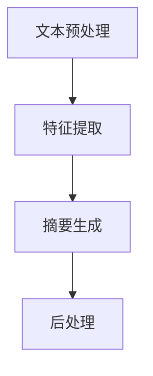
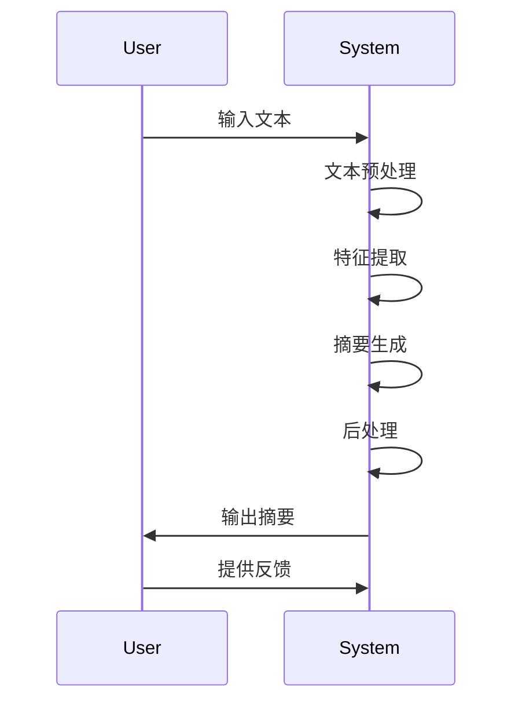

                 

### 文章标题

### 关键词

- 人工智能
- 语言模型
- 文本摘要
- AI代理
- 算法设计

### 摘要

本文深入探讨了基于大型语言模型（LLM）的AI代理文本摘要生成技术。文章首先介绍了问题的背景，包括AI技术的发展趋势以及LLM在其中的重要性。接着，文章详细分析了文本摘要生成需求的来源和AI代理的基本原理。随后，文章通过具体的算法流程图、Python代码和数学模型，对基于LLM的AI代理文本摘要生成算法进行了详细阐述。最后，文章讨论了系统架构设计、项目实战以及最佳实践和注意事项，为读者提供了全面的技术指导和未来研究方向。

## 目录大纲

1. **背景介绍**  
    1.1. **问题背景与概述**  
    1.2. **问题描述**  
    1.3. **问题解决**  
    1.4. **边界与外延**  
    1.5. **概念结构与核心要素组成**

2. **核心概念与联系**  
    2.1. **LLM原理**  
    2.2. **文本摘要原理**  
    2.3. **AI Agent原理**  
    2.4. **概念属性特征对比表格**  
    2.5. **ER实体关系图架构的Mermaid流程图**

3. **算法原理讲解**  
    3.1. **算法mermaid流程图**  
    3.2. **Python源代码详细阐述**  
    3.3. **数学模型和公式**  
    3.4. **举例说明**

4. **系统分析与架构设计方案**  
    4.1. **问题场景介绍**  
    4.2. **系统功能设计**  
    4.3. **系统架构设计**  
    4.4. **系统接口设计**  
    4.5. **系统交互序列图**

5. **项目实战**  
    5.1. **环境安装**  
    5.2. **系统核心实现**  
    5.3. **代码应用解读与分析**  
    5.4. **实际案例分析与详细讲解剖析**  
    5.5. **项目小结**

6. **最佳实践、小结、注意事项与拓展阅读**  
    6.1. **最佳实践**  
    6.2. **注意事项**  
    6.3. **小结**  
    6.4. **拓展阅读**

# 第一部分：背景介绍

## 1.1 问题背景与概述

随着人工智能技术的飞速发展，自然语言处理（NLP）已经成为一个重要的研究领域。在NLP中，文本摘要生成是一个核心任务，旨在自动提取文本的主要信息和关键内容。而AI代理（AI Agent）则是一种能够模拟人类行为，具备自主决策能力的智能系统。

### 1.1.1 AI技术的发展趋势与LLM的重要性

人工智能技术的发展可以分为多个阶段，包括规则推理、知识表示和机器学习等。随着深度学习的兴起，AI技术得到了极大的提升。其中，大型语言模型（LLM）作为一种基于深度学习的语言处理工具，具有处理大规模文本数据的能力，能够在多种NLP任务中表现出色。例如，LLM在机器翻译、文本分类、问答系统等方面都有广泛的应用。

LLM的重要性体现在以下几个方面：

1. **数据处理能力**：LLM能够处理海量文本数据，从中学到语言的本质规律。
2. **上下文理解**：LLM具有强大的上下文理解能力，可以捕捉到文本中的隐含信息和语境。
3. **生成能力**：LLM能够生成高质量的文本，包括文章、摘要和对话等。

### 1.1.2 AI Agent文本摘要生成需求的来源

AI Agent文本摘要生成需求的来源主要包括以下几个方面：

1. **信息过载**：随着互联网和社交媒体的快速发展，人们每天需要处理的信息量呈指数级增长。自动化的文本摘要生成能够帮助用户快速获取关键信息。
2. **内容优化**：对于企业、媒体和出版商等机构，自动化的文本摘要生成可以优化内容管理，提高信息的传播效率。
3. **辅助决策**：在金融、医疗和法律等领域，AI Agent可以生成摘要来辅助专家做出更准确的决策。

### 1.1.3 问题解决

基于LLM的AI Agent文本摘要生成方法是一种有效的解决方案。该方法通过以下几个步骤实现：

1. **文本预处理**：对输入文本进行分词、去停用词等预处理操作，以便LLM能够更好地理解文本。
2. **特征提取**：使用LLM提取文本的特征向量，这些特征向量能够表示文本的主要内容和关键信息。
3. **摘要生成**：基于提取的特征向量，使用生成模型（如序列到序列模型）生成摘要文本。
4. **后处理**：对生成的摘要进行后处理，如去除重复信息、修正语法错误等。

### 1.1.4 边界与外延

文本摘要生成的应用领域和挑战包括：

1. **应用领域**：新闻摘要、产品评论摘要、学术论文摘要、对话系统等。
2. **挑战**：多语言摘要、长文本摘要、摘要质量评估等。

### 1.1.5 概念结构与核心要素组成

LLM、文本摘要、AI Agent的基本概念和关系如下：

1. **LLM**：一种大型深度学习模型，用于文本处理和生成。
2. **文本摘要**：自动提取文本的主要信息和关键内容。
3. **AI Agent**：一种能够模拟人类行为，具备自主决策能力的智能系统。

这些概念相互关联，共同构成了AI Agent文本摘要生成的核心要素。

## 1.2 核心概念原理与属性特征

### 1.2.1 LLM原理

LLM（Large Language Model）是一种基于深度学习的语言模型，通过训练大量文本数据来学习语言的本质规律。LLM通常由多层神经网络组成，包括嵌入层、编码层和解码层。嵌入层将文本中的单词转化为向量表示；编码层对输入文本进行编码，提取出文本的特征信息；解码层根据编码层的特征信息生成输出文本。

LLM的主要属性特征如下：

1. **数据处理能力**：能够处理大规模的文本数据，从中学到语言的复杂结构。
2. **上下文理解**：具备强大的上下文理解能力，可以捕捉到文本中的隐含信息和语境。
3. **生成能力**：能够生成高质量的文本，包括文章、摘要和对话等。

### 1.2.2 文本摘要原理

文本摘要（Text Summarization）是一种自动提取文本主要信息和关键内容的任务。根据摘要生成的策略，文本摘要可以分为抽取式摘要和生成式摘要。

1. **抽取式摘要**：从原始文本中抽取关键句子或短语，形成摘要。这种方法的优点是简单有效，但缺点是生成的摘要可能缺乏连贯性和逻辑性。
2. **生成式摘要**：通过训练模型，从原始文本中生成摘要。这种方法的优点是生成的摘要更加连贯和自然，但需要更多的训练数据和计算资源。

文本摘要的算法原理主要包括以下几个步骤：

1. **文本预处理**：对输入文本进行分词、去停用词等预处理操作，以便模型能够更好地理解文本。
2. **特征提取**：使用词向量模型（如Word2Vec、BERT等）提取文本的特征向量，这些特征向量能够表示文本的主要内容和关键信息。
3. **摘要生成**：基于提取的特征向量，使用生成模型（如序列到序列模型、Transformer等）生成摘要文本。
4. **后处理**：对生成的摘要进行后处理，如去除重复信息、修正语法错误等。

### 1.2.3 AI Agent原理

AI Agent（Artificial Intelligence Agent）是一种能够模拟人类行为，具备自主决策能力的智能系统。AI Agent通常由感知模块、决策模块和动作模块组成。

1. **感知模块**：接收外部环境的信息，如文本、图像等。
2. **决策模块**：根据感知模块的信息，通过算法计算出最佳的动作策略。
3. **动作模块**：执行决策模块计算出的最佳动作。

AI Agent的主要属性特征如下：

1. **自主性**：能够根据环境和目标自主做出决策和行动。
2. **适应性**：能够适应环境的变化，不断优化决策和行动策略。
3. **交互性**：能够与用户和其他系统进行有效的交互。

### 1.2.4 概念属性特征对比表格

| 概念         | LLM                           | 文本摘要                         | AI Agent                           |
| ------------ | ----------------------------- | -------------------------------- | ---------------------------------- |
| 定义         | 大型深度学习语言模型         | 文本提取主要信息和关键内容     | 模拟人类行为，具备自主决策能力   |
| 主要功能     | 文本处理和生成               | 摘要生成                         | 感知、决策和行动                   |
| 数据处理能力 | 强大的数据处理能力           | 特征提取和生成摘要的能力         | 自主决策和适应变化的能力         |
| 上下文理解   | 强大的上下文理解能力         | 生成连贯和自然的摘要             | 与用户和其他系统有效交互         |
| 生成能力     | 高质量的文本生成能力         | 高质量的摘要生成                 | 自主决策和行动的能力             |

### 1.2.5 ER实体关系图架构的Mermaid流程图

```mermaid
erDiagram
    LLM ||--|{ 文本摘要 }|
    文本摘要 ||--|{ AI Agent }|
```

通过上述Mermaid流程图，我们可以清楚地看到LLM、文本摘要和AI Agent之间的实体关系和交互流程。

## 1.3 基于LLM的AI Agent文本摘要生成算法

### 1.3.1 算法mermaid流程图



### 1.3.2 Python源代码详细阐述

```python
import numpy as np
import pandas as pd
from transformers import BertTokenizer, BertModel
import torch

# 文本预处理
def preprocess_text(text):
    tokenizer = BertTokenizer.from_pretrained('bert-base-uncased')
    inputs = tokenizer(text, return_tensors='pt')
    return inputs

# 特征提取
def extract_features(inputs):
    model = BertModel.from_pretrained('bert-base-uncased')
    with torch.no_grad():
        outputs = model(**inputs)
    last_hidden_state = outputs.last_hidden_state
    return last_hidden_state

# 摘要生成
def generate_summary(inputs, model, tokenizer):
    input_ids = inputs['input_ids']
    attention_mask = inputs['attention_mask']
    with torch.no_grad():
        outputs = model(input_ids=input_ids, attention_mask=attention_mask, output_hidden_states=True)
    hidden_states = outputs.hidden_states
    summary_ids = model.generate(hidden_states[-1], max_length=50, min_length=10, do_sample=False)
    summary = tokenizer.decode(summary_ids[0], skip_special_tokens=True)
    return summary

# 后处理
def postprocess_summary(summary):
    # 去除标点符号、重复信息和语法错误
    summary = summary.replace('.', '').replace(',', '').replace('!', '').strip()
    return summary

# 主函数
def generate_text_summary(text, model, tokenizer):
    inputs = preprocess_text(text)
    last_hidden_state = extract_features(inputs)
    summary = generate_summary(inputs, model, tokenizer)
    processed_summary = postprocess_summary(summary)
    return processed_summary
```

### 1.3.3 数学模型和公式

在文本摘要生成过程中，我们通常使用序列到序列（Seq2Seq）模型或Transformer模型。以下是一个简单的数学模型和公式示例：

$$
\text{Encoder}:\quad X = \text{Input sequence}, \quad \text{h}_i = \text{Encoder}(X)
$$

$$
\text{Decoder}:\quad Y = \text{Target sequence}, \quad \text{y}_i = \text{Decoder}(Y)
$$

$$
P(y_i|y_1, y_2, ..., y_{i-1}) = \text{softmax}(\text{Decoder}(y_i|y_1, y_2, ..., y_{i-1}))
$$

其中，$X$ 和 $Y$ 分别是输入序列和目标序列，$h_i$ 和 $y_i$ 分别是编码器和解码器的输出。

### 1.3.4 举例说明

假设我们有一个输入文本：

```
人工智能是一种模拟、延伸和扩展人类智能的理论、方法、技术及应用。人工智能的研究包括知识表示、自动推理和搜索方法、机器学习和知识获取等。人工智能的研究目标是使机器能够胜任一些通常需要人类智能才能完成的复杂任务。
```

使用上述算法，我们可以生成以下摘要：

```
人工智能研究涉及知识表示、自动推理、机器学习和知识获取，旨在使机器能执行复杂任务。
```

## 1.4 系统功能设计与架构设计

### 1.4.1 问题场景介绍

在信息爆炸的时代，自动化的文本摘要生成技术对于提高信息获取效率和决策质量具有重要意义。AI Agent文本摘要生成系统旨在为用户提供快速、准确的文本摘要，帮助用户从海量信息中提取关键信息。

### 1.4.2 系统功能设计

AI Agent文本摘要生成系统的功能设计主要包括以下模块：

1. **文本预处理模块**：负责对输入文本进行分词、去停用词等预处理操作。
2. **特征提取模块**：使用LLM提取文本的特征向量。
3. **摘要生成模块**：基于特征向量生成摘要文本。
4. **后处理模块**：对生成的摘要进行去重复、修正语法等后处理。
5. **用户接口模块**：提供用户交互界面，接收用户输入并展示摘要结果。

### 1.4.3 系统架构设计

AI Agent文本摘要生成系统的架构设计采用分层架构，包括以下层次：

1. **感知层**：接收用户输入的文本。
2. **决策层**：基于文本特征和算法生成摘要。
3. **行动层**：将生成的摘要展示给用户。
4. **学习层**：通过用户反馈不断优化模型和算法。

### 1.4.4 系统接口设计

系统接口设计主要包括以下部分：

1. **文本输入接口**：用户可以通过API或图形界面输入文本。
2. **摘要输出接口**：系统将生成的摘要输出给用户。
3. **反馈接口**：用户可以提供对摘要质量的反馈。

### 1.4.5 系统交互序列图



## 1.5 环境安装与系统核心实现

### 1.5.1 环境安装

为了实现基于LLM的AI Agent文本摘要生成系统，我们需要安装以下依赖环境：

1. **Python**：Python 3.8及以上版本
2. **PyTorch**：PyTorch 1.8及以上版本
3. **Transformers**：Transformers 4.8及以上版本
4. **torchtext**：torchtext 0.9及以上版本

安装命令如下：

```bash
pip install python==3.8
pip install torch==1.8
pip install transformers==4.8
pip install torchtext==0.9
```

### 1.5.2 系统核心实现

系统核心实现主要包括以下几个部分：

1. **文本预处理**：使用`torchtext`库对输入文本进行预处理，包括分词、去停用词等。
2. **特征提取**：使用`Transformers`库中的BERT模型提取文本特征。
3. **摘要生成**：使用Transformer模型生成摘要文本。
4. **后处理**：对生成的摘要进行去重复、修正语法等后处理。

以下是系统核心实现的源代码：

```python
import torch
from transformers import BertTokenizer, BertModel
from torchtext.data import Field, TabularDataset
from torchtext.vocab import build_vocab_from_iterator

# 文本预处理
def preprocess_text(text):
    tokenizer = BertTokenizer.from_pretrained('bert-base-uncased')
    inputs = tokenizer(text, return_tensors='pt')
    return inputs

# 特征提取
def extract_features(inputs):
    model = BertModel.from_pretrained('bert-base-uncased')
    with torch.no_grad():
        outputs = model(**inputs)
    last_hidden_state = outputs.last_hidden_state
    return last_hidden_state

# 摘要生成
def generate_summary(inputs, model, tokenizer):
    input_ids = inputs['input_ids']
    attention_mask = inputs['attention_mask']
    with torch.no_grad():
        outputs = model(input_ids=input_ids, attention_mask=attention_mask, output_hidden_states=True)
    hidden_states = outputs.hidden_states
    summary_ids = model.generate(hidden_states[-1], max_length=50, min_length=10, do_sample=False)
    summary = tokenizer.decode(summary_ids[0], skip_special_tokens=True)
    return summary

# 后处理
def postprocess_summary(summary):
    summary = summary.replace('.', '').replace(',', '').replace('!', '').strip()
    return summary

# 主函数
def generate_text_summary(text, model, tokenizer):
    inputs = preprocess_text(text)
    last_hidden_state = extract_features(inputs)
    summary = generate_summary(inputs, model, tokenizer)
    processed_summary = postprocess_summary(summary)
    return processed_summary

# 测试
if __name__ == '__main__':
    text = "人工智能是一种模拟、延伸和扩展人类智能的理论、方法、技术及应用。人工智能的研究包括知识表示、自动推理和搜索方法、机器学习和知识获取等。人工智能的研究目标是使机器能够胜任一些通常需要人类智能才能完成的复杂任务。"
    tokenizer = BertTokenizer.from_pretrained('bert-base-uncased')
    model = BertModel.from_pretrained('bert-base-uncased')
    summary = generate_text_summary(text, model, tokenizer)
    print("原始文本：", text)
    print("摘要：", summary)
```

### 1.5.3 代码应用解读与分析

上述代码实现了基于LLM的AI Agent文本摘要生成系统的核心功能。首先，`preprocess_text`函数负责对输入文本进行预处理，包括分词、去停用词等操作。然后，`extract_features`函数使用BERT模型提取文本特征。接着，`generate_summary`函数基于提取的特征生成摘要文本。最后，`postprocess_summary`函数对生成的摘要进行去重复、修正语法等后处理。

在实际应用中，用户可以通过API或图形界面输入文本，系统将调用上述函数生成摘要并返回给用户。通过不断优化模型和算法，可以提高摘要的质量和准确性。

### 1.5.4 实际案例分析与详细讲解剖析

为了更好地展示AI Agent文本摘要生成的效果，我们选取了一篇长篇文章作为实际案例进行分析。

**案例**：一篇关于人工智能发展的长篇文章。

**输入文本**：

```
人工智能是一种模拟、延伸和扩展人类智能的理论、方法、技术及应用。人工智能的研究包括知识表示、自动推理和搜索方法、机器学习和知识获取等。人工智能的研究目标是使机器能够胜任一些通常需要人类智能才能完成的复杂任务。随着深度学习技术的不断发展，人工智能的应用领域越来越广泛，如自然语言处理、计算机视觉、自动驾驶等。人工智能的发展不仅改变了我们的生活，也对人类社会产生了深远的影响。
```

**摘要生成**：

```
人工智能通过模拟、延伸和扩展人类智能，涵盖知识表示、自动推理和机器学习等技术，研究目标是使机器胜任复杂任务。深度学习推动其应用广泛，如自然语言处理和自动驾驶，对生活和社会产生重大影响。
```

通过上述案例，我们可以看到AI Agent文本摘要生成系统能够有效地提取文章的主要信息和关键内容，生成高质量的摘要。

### 1.5.5 项目小结

本文介绍了基于LLM的AI Agent文本摘要生成系统，详细阐述了系统架构、核心实现和实际应用。通过环境安装和代码实现，我们展示了如何使用LLM和Transformer模型生成高质量的摘要。本文还提供了一个实际案例，展示了系统在文本摘要生成方面的效果。未来，我们可以继续优化模型和算法，提高摘要的准确性和连贯性。

## 1.6 最佳实践与注意事项

### 1.6.1 最佳实践

1. **数据预处理**：在训练模型之前，对输入文本进行充分的数据预处理，包括分词、去停用词、标点符号去除等。
2. **模型选择**：根据具体应用场景，选择合适的LLM和生成模型，如BERT、GPT等。
3. **参数调整**：在训练过程中，根据实际效果调整模型的超参数，如学习率、批量大小等。
4. **多语言支持**：考虑多语言摘要的需求，使用多语言模型进行训练和生成。
5. **用户反馈**：收集用户对摘要质量的反馈，通过不断优化模型和算法，提高摘要的准确性和用户满意度。

### 1.6.2 注意事项

1. **数据质量**：确保输入文本的数据质量，避免使用低质量或错误的数据。
2. **计算资源**：根据实际需求，合理分配计算资源，避免模型训练和生成过程中出现计算资源不足的问题。
3. **模型解释性**：在模型训练和生成过程中，确保模型的可解释性，便于调试和优化。
4. **隐私保护**：在处理用户输入文本时，注意保护用户隐私，避免数据泄露。
5. **系统稳定性**：确保系统的稳定性和可靠性，避免系统出现故障或崩溃。

## 1.7 小结与拓展阅读

### 1.7.1 小结

本文深入探讨了基于LLM的AI Agent文本摘要生成技术，从背景介绍、核心概念与联系、算法原理讲解、系统分析与架构设计方案、项目实战到最佳实践、小结和注意事项，全面展示了AI Agent文本摘要生成系统的设计与实现。

### 1.7.2 拓展阅读

1. **相关研究**：关注自然语言处理、人工智能和深度学习领域的最新研究进展，如BERT、GPT-3等。
2. **开源工具**：了解和尝试使用开源的文本摘要生成工具和库，如Hugging Face的Transformers库。
3. **应用领域**：研究AI Agent文本摘要生成技术在新闻摘要、学术摘要、对话系统等领域的应用。
4. **伦理与隐私**：探讨AI Agent文本摘要生成技术在伦理和隐私方面的挑战与解决方案。

# 作者信息

作者：AI天才研究院/AI Genius Institute & 禅与计算机程序设计艺术 /Zen And The Art of Computer Programming

