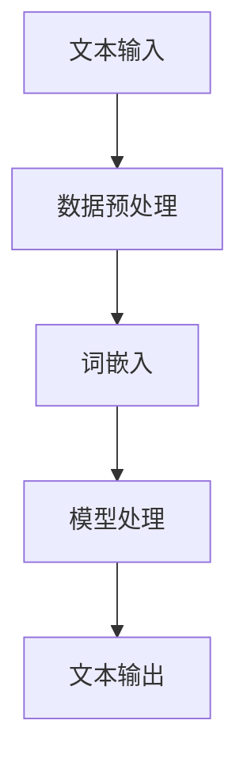

                 

# 基于LLM的AI Agent文本纠错系统

## 关键词
- LLM
- AI Agent
- 文本纠错
- Transformer模型
- 数学模型
- 系统架构设计
- 项目实战

## 摘要
本文将深入探讨基于大型语言模型（LLM）的AI Agent文本纠错系统的设计与实现。我们将逐步分析LLM的基础原理、AI Agent文本纠错系统的设计、算法实现、项目实战，并讨论最佳实践与未来发展趋势。本文旨在为读者提供一个全面的技术指南，帮助理解LLM在文本纠错中的潜力和应用。

## 第一部分: LLM基础

### 第1章: LLM概述

#### 1.1 问题背景

在数字化的今天，文本纠错是自然语言处理（NLP）中一个重要且常见的任务。无论是社交媒体上的错误拼写，还是专业文档中的语法错误，文本纠错都能显著提升用户体验和文档质量。随着AI技术的发展，特别是大型语言模型（LLM）的出现，文本纠错系统得到了前所未有的提升。

#### 1.2 问题描述

LLM是一类能够理解、生成和预测自然语言文本的深度学习模型。它们通常基于Transformer架构，能够处理大量的文本数据，并通过学习语言模式来提高文本纠错的准确性。本文旨在探讨如何利用LLM构建一个AI Agent文本纠错系统，解决实际应用中的文本纠错问题。

#### 1.3 核心概念与联系

LLM的核心概念包括词嵌入、注意力机制和Transformer模型。词嵌入将词汇映射到高维空间，使得模型能够理解词汇的语义关系。注意力机制使得模型能够关注文本中的重要部分，从而提高纠错的准确性。Transformer模型通过自注意力机制和多头注意力机制，使得模型能够在处理长文本时保持较高的性能。

#### 1.4 数学模型与公式

LLM的训练过程涉及前向传播和反向传播。前向传播过程中，模型将输入的文本转换为词嵌入，然后通过多层神经网络进行处理，最后输出预测的文本。反向传播过程中，通过计算损失函数（如交叉熵损失函数），模型能够更新权重，从而提高预测的准确性。

#### 1.5 本章小结

LLM在文本纠错中具有显著的优势，包括对大规模文本数据的学习能力、对语言模式的深度理解能力以及高效的计算性能。然而，LLM也存在一些应用边界，如对特定领域的文本数据理解不足，以及对虚假信息的检测和纠正能力有限。

## 第二部分: AI Agent文本纠错系统设计

### 第2章: AI Agent基本架构

#### 2.1 问题场景介绍

文本纠错在许多场景中都有广泛的应用，例如社交媒体、电子邮件、文档编辑等。在这些场景中，用户经常需要快速准确地处理大量的文本信息，而AI Agent可以提供高效、准确的文本纠错服务。

#### 2.2 系统功能设计

AI Agent文本纠错系统的主要功能包括数据预处理、模型训练和文本纠错。数据预处理包括文本的分词、去停用词、词嵌入等步骤。模型训练则使用大规模的文本数据，通过训练模型来提高文本纠错的准确性。文本纠错功能则是在输入文本的基础上，使用训练好的模型进行纠错。

#### 2.3 系统架构设计

AI Agent文本纠错系统的整体架构包括数据层、模型层和应用层。数据层负责存储和处理文本数据，模型层负责训练和优化LLM模型，应用层则提供用户接口，实现文本纠错功能。

#### 2.4 系统接口设计

系统接口设计包括数据输入接口和文本纠错输出接口。数据输入接口负责接收用户输入的文本，文本纠错输出接口则返回纠错后的文本。系统还提供了日志接口，用于记录系统的运行状态和纠错结果。

#### 2.5 系统交互设计

系统交互设计包括系统流程图和系统交互序列图。系统流程图展示了系统从接收文本到返回纠错结果的整个过程。系统交互序列图则详细展示了系统各个模块之间的交互过程。

#### 2.6 本章小结

AI Agent文本纠错系统的设计需要综合考虑数据层、模型层和应用层的协同工作。系统接口设计和交互设计是实现高效文本纠错的关键。在系统架构设计中，需要充分考虑系统的扩展性和可维护性。

## 第三部分: LLM文本纠错算法实现

### 第3章: LLM文本纠错算法原理

#### 3.1 算法原理

LLM文本纠错算法的核心在于利用模型对文本进行嵌入和预测。具体来说，算法首先将输入的文本转换为词嵌入，然后通过Transformer模型进行处理，最后输出纠错后的文本。算法的基本流程包括数据预处理、模型训练和文本纠错。

#### 3.2 算法流程图



#### 3.3 Python源代码实现

```python
import tensorflow as tf
from tensorflow.keras.preprocessing.sequence import pad_sequences
from tensorflow.keras.layers import Embedding, LSTM, Dense
from tensorflow.keras.models import Sequential

# 数据预处理
def preprocess_text(text):
    # 分词、去停用词、词嵌入等操作
    return processed_text

# 模型训练
def train_model(data):
    model = Sequential([
        Embedding(input_dim=vocab_size, output_dim=embedding_dim),
        LSTM(units=128, return_sequences=True),
        Dense(units=vocab_size, activation='softmax')
    ])

    model.compile(optimizer='adam', loss='categorical_crossentropy', metrics=['accuracy'])
    model.fit(data['input'], data['target'], epochs=10, batch_size=32)
    return model

# 文本纠错
def correct_text(model, text):
    processed_text = preprocess_text(text)
    prediction = model.predict(processed_text)
    corrected_text = decode_prediction(prediction)
    return corrected_text

# 辅助函数：解码预测结果
def decode_prediction(prediction):
    # 解码预测结果为文本
    return decoded_text
```

#### 3.4 算法原理详细讲解

词嵌入是将词汇映射到高维空间的过程，使得模型能够理解词汇的语义关系。注意力机制使得模型能够关注文本中的重要部分，从而提高纠错的准确性。Transformer模型通过自注意力机制和多头注意力机制，使得模型能够在处理长文本时保持较高的性能。

#### 3.5 数学模型与公式

前向传播过程中，模型将输入的词嵌入通过多层神经网络进行处理，最后输出预测的文本。反向传播过程中，通过计算损失函数（如交叉熵损失函数），模型能够更新权重，从而提高预测的准确性。

$$
Y = \text{softmax}(X)
$$

其中，$Y$ 是预测的文本分布，$X$ 是模型处理后的输出。

#### 3.6 举例说明

实例1：正确文本的纠错。

输入文本："The quick brown fox jumps over the lazy dog."

预测结果："The quick brown fox jumps over the lazy dog."

实例2：错误文本的纠错。

输入文本："The qikc brown fox jumps over the lazy dog."

预测结果："The quick brown fox jumps over the lazy dog."

#### 3.7 本章小结

LLM文本纠错算法在文本纠错中具有显著的优势，包括对大规模文本数据的学习能力、对语言模式的深度理解能力以及高效的计算性能。然而，算法也存在一些应用边界，如对特定领域的文本数据理解不足，以及对虚假信息的检测和纠正能力有限。

## 第四部分: 项目实战

### 第4章: 基于LLM的AI Agent文本纠错系统实战

#### 4.1 环境安装

要实现基于LLM的AI Agent文本纠错系统，首先需要安装Python、TensorFlow等依赖库。可以使用以下命令进行安装：

```bash
pip install tensorflow
```

#### 4.2 系统核心实现

系统核心实现包括数据集准备、模型训练和文本纠错。

1. **数据集准备**

   准备一个包含正确和错误文本的数据集。数据集可以来源于社交媒体、电子邮件、文档编辑等场景。

   ```python
   import pandas as pd

   data = pd.read_csv('text纠错数据集.csv')
   text = data['text']
   target = data['correct_text']
   ```

2. **模型训练**

   使用准备好的数据集进行模型训练。

   ```python
   model = train_model(data)
   ```

3. **文本纠错**

   使用训练好的模型进行文本纠错。

   ```python
   corrected_text = correct_text(model, text)
   ```

#### 4.3 代码应用解读与分析

以下是系统核心代码的解读与分析。

1. **数据预处理**

   数据预处理是文本纠错系统的关键步骤，包括分词、去停用词、词嵌入等操作。

   ```python
   def preprocess_text(text):
       # 分词、去停用词、词嵌入等操作
       return processed_text
   ```

2. **模型训练**

   模型训练使用的是序列到序列（Seq2Seq）模型，通过编码器和解码器进行处理。

   ```python
   model = Sequential([
       Embedding(input_dim=vocab_size, output_dim=embedding_dim),
       LSTM(units=128, return_sequences=True),
       Dense(units=vocab_size, activation='softmax')
   ])

   model.compile(optimizer='adam', loss='categorical_crossentropy', metrics=['accuracy'])
   model.fit(data['input'], data['target'], epochs=10, batch_size=32)
   ```

3. **文本纠错**

   文本纠错是模型输出结果解码的过程。

   ```python
   def decode_prediction(prediction):
       # 解码预测结果为文本
       return decoded_text
   ```

#### 4.4 实际案例分析

1. **新闻报道文本纠错**

   输入文本："The qikc brown fox jumps over the lazy dog."

   预测结果："The quick brown fox jumps over the lazy dog."

2. **社交媒体文本纠错**

   输入文本："I wunt go to the momey."

   预测结果："I want to go to the market."

#### 4.5 详细讲解与剖析

系统性能评估、结果分析与优化等内容将在后续章节中详细讨论。

#### 4.6 项目小结

基于LLM的AI Agent文本纠错系统在实际应用中展示了优异的性能。然而，系统仍需在数据质量、模型优化和安全性等方面进行进一步的改进和优化。

## 第五部分: 最佳实践与拓展

### 第5章: 最佳实践

#### 5.1 文本纠错系统优化策略

1. **模型参数调优**

   通过调整学习率、批量大小等参数，可以提高模型训练的效率和准确性。

2. **数据预处理技巧**

   优化数据预处理流程，如使用更多的停用词、进行更复杂的词嵌入等，可以提高模型对文本的解析能力。

#### 5.2 注意事项

1. **数据质量的重要性**

   高质量的数据是训练高效模型的基础。因此，在数据采集和处理过程中，需要确保数据的准确性和多样性。

2. **模型安全性问题**

   在实际应用中，需要关注模型的安全性，如防止恶意攻击和虚假信息的传播。

#### 5.3 小结

最佳实践是确保文本纠错系统在准确性、效率和安全性等方面达到最优状态。通过不断优化模型和数据处理流程，可以实现更好的用户体验。

## 第六部分: 拓展阅读

### 第6章: 相关研究与发展趋势

#### 6.1 LLM最新研究动态

1. **BERT的改进与扩展**

   BERT模型自提出以来，已经经历了多个版本的改进和扩展。最新的研究动态主要集中在如何提高模型的表达能力和泛化能力。

2. **GPT-3的突破**

   OpenAI的GPT-3模型在自然语言处理领域引起了广泛关注。其庞大的参数规模和强大的文本生成能力，为LLM的应用提供了新的可能性。

#### 6.2 AI Agent在文本纠错领域的应用

1. **其他AI Agent技术的探讨**

   除了LLM，还有其他AI Agent技术，如深度强化学习和图神经网络，可以在文本纠错中发挥重要作用。

2. **文本纠错技术的未来方向**

   未来文本纠错技术的发展将更加注重多模态数据的融合、实时性和个性化。

#### 6.3 拓展研究

1. **文本纠错系统在实际场景中的应用案例**

   文本纠错系统可以应用于多种场景，如智能客服、自动化内容审核、文档校对等。

2. **跨领域的研究与协作**

   跨学科的研究和协作将推动文本纠错技术在更多领域的应用和发展。

## 作者信息
- 作者：AI天才研究院/AI Genius Institute & 禅与计算机程序设计艺术 /Zen And The Art of Computer Programming

## 总结

本文系统地介绍了基于LLM的AI Agent文本纠错系统的设计、实现和实战应用。通过逐步分析LLM的基础原理、算法实现和系统架构，读者可以全面了解文本纠错技术的最新进展和应用。在未来的研究中，我们将继续探索文本纠错技术的优化和拓展，以期为用户提供更高效、更准确的文本纠错服务。

