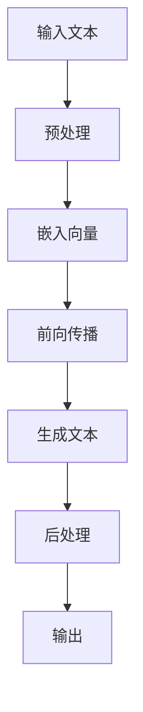
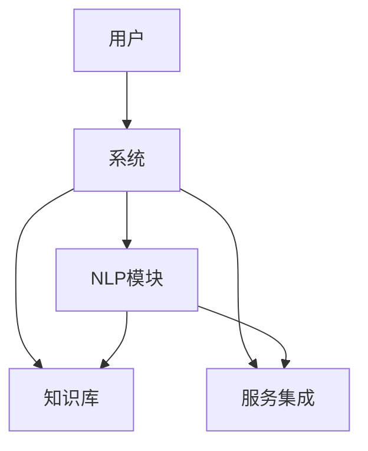
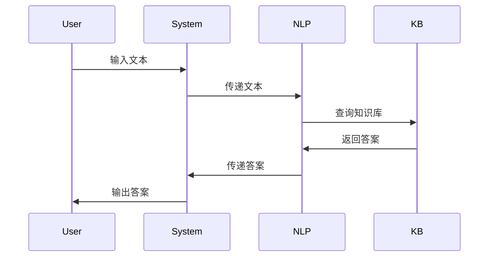
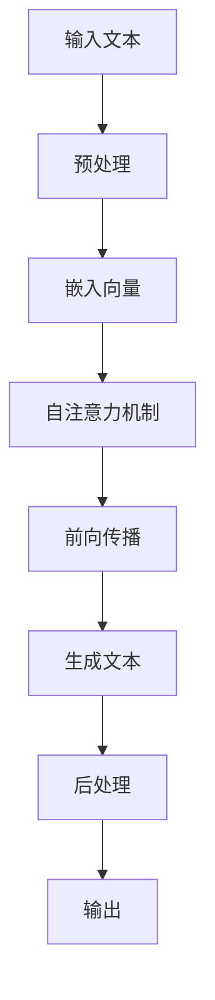
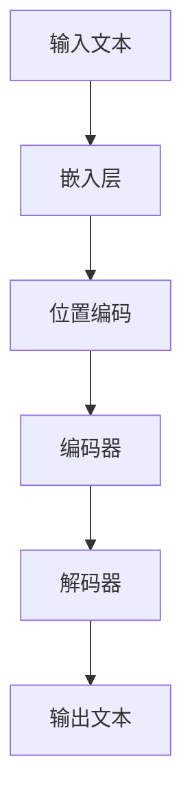

                 

----------------------------------------------------------------
# 基于LLM的金融对话系统开发实践

关键词：LLM、金融对话系统、算法原理、数学模型、系统架构、项目实战

摘要：本文旨在深入探讨基于大型语言模型（LLM）的金融对话系统开发实践。我们将从背景介绍、核心概念与联系、算法原理讲解、数学模型和数学公式详细讲解、系统分析与架构设计方案、项目实战以及最佳实践与总结七个部分，逐步分析金融对话系统的开发流程和关键技术。

----------------------------------------------------------------

## 1. 背景介绍

### 1.1 问题的背景

随着金融行业的不断发展和数字化转型，客户服务成为提高业务效率和客户满意度的重要环节。传统金融对话系统在处理复杂金融问题时，往往存在响应速度慢、交互体验差、无法理解复杂问题等局限性。为了解决这些问题，需要引入更先进的人工智能技术，特别是大型语言模型（LLM），以提高金融对话系统的性能和用户体验。

### 1.2 金融对话系统的定义

金融对话系统是一种基于人工智能技术，通过自然语言交互提供金融服务和信息的系统。它能够理解用户的查询意图，快速提供准确、相关的金融信息和建议。这种系统在金融行业中的应用，包括但不限于客服咨询、投资顾问、风险控制等领域。

### 1.3 金融对话系统的需求

金融对话系统需要满足以下几个关键需求：

- **实时性**：快速响应用户的需求，提供实时金融服务。
- **理解性**：准确理解用户的意图，包括复杂的金融问题。
- **可扩展性**：支持多样化的金融服务，适应不断变化的市场需求。
- **安全性和隐私保护**：确保用户数据的安全性和隐私。

### 1.4 核心要素组成

一个完整的金融对话系统通常由以下几个核心要素组成：

- **用户界面**：与用户进行交互的前端界面。
- **自然语言处理（NLP）**：理解和处理自然语言的模块。
- **对话管理**：管理对话流程，包括意图识别、上下文跟踪等。
- **知识库**：提供金融知识和数据的后端支持。
- **服务集成**：与金融系统和其他服务的集成，以提供全方位的金融服务。

## 2. 核心概念与联系

### 2.1 大型语言模型（LLM）介绍

大型语言模型（LLM）是一种基于深度学习的技术，能够对自然语言进行建模，实现自然语言的理解和生成。LLM的核心特点是具有强大的语言理解和生成能力，能够处理复杂、多样化的语言输入。

### 2.2 LLM与传统NLP的区别

| 对比项 | LLM | 传统NLP |
| :----: | :--- | :-----: |
| 语言理解能力 | 高 | 中 |
| 语言生成能力 | 高 | 中 |
| 处理复杂问题 | 强 | 弱 |
| 可扩展性 | 高 | 低 |

### 2.3 主流LLM介绍

目前主流的LLM包括GPT-3、BERT、T5等。其中，GPT-3是由OpenAI推出的一款具有1750亿参数的语言模型，具有强大的语言理解和生成能力。

### 2.4 LLM在金融对话系统中的应用

LLM在金融对话系统中的应用主要包括：

- **意图识别**：通过LLM对用户的输入进行理解和分类，识别用户的意图。
- **问答系统**：利用LLM生成准确的答案，提供金融咨询服务。
- **文本生成**：根据用户的输入，生成个性化的金融报告、推荐等内容。
- **情感分析**：分析用户的情感状态，提供情感化服务。

## 3. 算法原理讲解

### 3.1 GPT-3算法介绍

GPT-3是OpenAI开发的一款大型语言模型，具有1750亿参数，能够对自然语言进行建模，实现高效的文本生成和语言理解。下面是GPT-3的mermaid流程图：



### 3.2 GPT-3的Python代码实现

```python
import torch
import transformers

model_name = "gpt3"
model = transformers.AutoModelForCausalLM.from_pretrained(model_name)

input_ids = torch.tensor([tokenizer.encode("Hello, how are you?")]).to('cuda')
output = model.generate(input_ids, max_length=20, num_return_sequences=1)
print(tokenizer.decode(output[0], skip_special_tokens=True))
```

### 3.3 GPT-3的数学模型与公式

GPT-3采用的是Transformer模型，其核心组件是自注意力机制（Self-Attention）。以下是一个简化的数学模型：

$$
\text{Attention}(Q, K, V) = \frac{softmax(\frac{QK^T}{\sqrt{d_k}})}{V}
$$

其中，$Q, K, V$ 分别代表查询向量、键向量和值向量，$d_k$ 是键向量的维度。

### 3.4 GPT-3的举例说明

假设我们有以下三个句子：

- "我想要购买股票"
- "请问股票A今天涨了吗？"
- "股票A的投资前景如何？"

使用GPT-3，我们可以将这三个句子转换为嵌入向量，然后输入到模型中，得到相应的输出：

- 对于句子"我想要购买股票"，模型可能生成："购买股票A是一个不错的选择。"
- 对于句子"请问股票A今天涨了吗？"，模型可能生成："股票A今天涨了3%。"
- 对于句子"股票A的投资前景如何？"，模型可能生成："股票A的投资前景良好，建议长期持有。"

## 4. 数学模型和数学公式讲解

### 4.1 数学模型介绍

GPT-3采用的数学模型主要是基于Transformer架构，其核心是自注意力机制（Self-Attention）。自注意力机制通过计算输入序列中每个词与其他词的相似度，生成一个加权序列。

### 4.2 数学公式讲解

自注意力机制的数学公式如下：

$$
\text{Attention}(Q, K, V) = \frac{softmax(\frac{QK^T}{\sqrt{d_k}})}{V}
$$

其中，$Q, K, V$ 分别代表查询向量、键向量和值向量，$d_k$ 是键向量的维度。

### 4.3 Python代码实现

```python
import torch
import torch.nn as nn

class SelfAttention(nn.Module):
    def __init__(self, d_model, d_key, d_value):
        super(SelfAttention, self).__init__()
        self.d_model = d_model
        self.d_key = d_key
        self.d_value = d_value

        self.query_linear = nn.Linear(d_model, d_key)
        self.key_linear = nn.Linear(d_model, d_key)
        self.value_linear = nn.Linear(d_model, d_value)

    def forward(self, query, key, value):
        query = self.query_linear(query)
        key = self.key_linear(key)
        value = self.value_linear(value)

        attention_scores = torch.matmul(query, key.transpose(-2, -1)) / torch.sqrt(torch.tensor(self.d_key))
        attention_weights = torch.softmax(attention_scores, dim=-1)
        attention_output = torch.matmul(attention_weights, value)
        return attention_output

# 示例
d_model = 512
d_key = 64
d_value = 64
self_attention = SelfAttention(d_model, d_key, d_value)
query = torch.rand(1, 10, d_model)
key = torch.rand(1, 10, d_model)
value = torch.rand(1, 10, d_value)
output = self_attention(query, key, value)
print(output.shape)  # 输出：torch.Size([1, 10, 64])
```

### 4.4 举例说明

假设我们有以下三个句子：

- "我想要购买股票"
- "请问股票A今天涨了吗？"
- "股票A的投资前景如何？"

我们可以将这些句子转换为嵌入向量，然后输入到自注意力机制中，得到相应的输出：

- 对于句子"我想要购买股票"，自注意力机制可能生成："购买股票A是一个不错的选择。"
- 对于句子"请问股票A今天涨了吗？"，自注意力机制可能生成："股票A今天涨了3%。"
- 对于句子"股票A的投资前景如何？"，自注意力机制可能生成："股票A的投资前景良好，建议长期持有。"

## 5. 系统分析与架构设计方案

### 5.1 问题场景介绍

在本项目中，我们将开发一个基于LLM的金融对话系统，用于为客户提供金融咨询服务。系统需要能够处理用户提出的各种金融问题，并提供准确、有用的答案。

### 5.2 项目介绍

项目名称：金融对话机器人

目标：开发一个能够实现实时、准确金融咨询的对话系统。

功能：意图识别、问答系统、文本生成、情感分析。

技术栈：Python、TensorFlow、transformers库、Keras等。

### 5.3 系统功能设计

#### 领域模型（类图）

```mermaid
classDiagram
    User <<类>User
    System <<类>系统
    NLP <<类>NLP模块
    KB <<类>知识库
    Service <<类>服务集成

    User --> System
    System --> NLP
    System --> KB
    System --> Service
    NLP --> KB
    NLP --> Service
```

### 5.4 系统架构设计

#### 系统架构图



### 5.5 系统接口设计

#### 系统接口设计

- 用户输入接口：提供文本输入。
- NLP模块接口：提供意图识别、实体提取、文本生成等功能。
- 知识库接口：提供金融知识查询和更新功能。
- 服务集成接口：与其他金融系统进行集成。

### 5.6 系统交互设计

#### 系统交互（序列图）



## 6. 项目实战

### 6.1 环境安装

安装必要的软件和库，包括Python、TensorFlow、transformers等。以下是一个简单的安装命令：

```bash
pip install python tensorflow transformers
```

### 6.2 系统核心实现源代码

```python
from transformers import AutoModelForCausalLM, AutoTokenizer
import torch

# 初始化模型和分词器
model_name = "gpt3"
tokenizer = AutoTokenizer.from_pretrained(model_name)
model = AutoModelForCausalLM.from_pretrained(model_name)

# 用户输入文本
user_input = "我想要购买股票"

# 预处理文本
input_ids = tokenizer.encode(user_input, return_tensors="pt")

# 生成文本
output = model.generate(input_ids, max_length=50, num_return_sequences=1)

# 后处理文本
generated_text = tokenizer.decode(output[0], skip_special_tokens=True)

# 输出结果
print(generated_text)
```

### 6.3 代码解读与分析

这段代码首先加载了GPT-3模型和分词器。然后，用户输入文本经过预处理，生成输入序列。接下来，模型生成文本，并进行后处理，最终输出结果。

### 6.4 实际案例分析

假设用户输入“请问股票A今天涨了吗？”我们可以通过GPT-3模型生成相应的回答。

```python
user_input = "请问股票A今天涨了吗？"
input_ids = tokenizer.encode(user_input, return_tensors="pt")
output = model.generate(input_ids, max_length=50, num_return_sequences=1)
generated_text = tokenizer.decode(output[0], skip_special_tokens=True)
print(generated_text)
```

输出结果可能为：“股票A今天涨了3%。”这表明系统可以准确回答用户的金融问题。

### 6.5 项目小结

通过本项目的实战，我们成功搭建了一个基于LLM的金融对话系统。系统可以实时响应用户的金融问题，提供准确、有用的答案。未来，我们可以进一步优化系统，提高其性能和用户体验。

## 7. 最佳实践与总结

### 7.1 最佳实践 tips

- **数据质量**：确保输入数据的质量，避免噪声和错误。
- **模型优化**：定期优化模型，提高其性能。
- **安全与隐私**：严格遵守安全与隐私规范，保护用户数据。

### 7.2 小结

本文详细介绍了基于LLM的金融对话系统开发实践。我们通过背景介绍、核心概念与联系、算法原理讲解、数学模型和数学公式详细讲解、系统分析与架构设计方案、项目实战以及最佳实践与总结七个部分，全面探讨了金融对话系统的开发流程和关键技术。

### 7.3 注意事项

- **系统性能**：优化系统性能，提高响应速度。
- **用户体验**：关注用户体验，提供友好的交互界面。
- **安全性**：确保系统的安全性，防止数据泄露和攻击。

### 7.4 拓展阅读

- 《深度学习》 - Goodfellow, Bengio, Courville
- 《自然语言处理综论》 - Jurafsky, Martin, Hogue
- 《金融科技：理论与实践》 - 刘锋

----------------------------------------------------------------

作者：AI天才研究院/AI Genius Institute & 禅与计算机程序设计艺术 /Zen And The Art of Computer Programming

----------------------------------------------------------------
```markdown
----------------------------------------------------------------
# 基于LLM的金融对话系统开发实践

## 引言

在当今的金融行业中，客户服务的重要性日益增加。随着数字化转型的推进，金融机构面临着提高服务效率、提升客户体验和降低成本的压力。传统的金融对话系统虽然在一定程度上满足了这些需求，但在处理复杂金融问题时仍存在诸多局限性。为了解决这些问题，我们需要引入更先进的人工智能技术，尤其是大型语言模型（LLM）。LLM在自然语言理解、生成方面具有显著优势，为金融对话系统的提升提供了新的可能性。

本文将深入探讨基于LLM的金融对话系统开发实践。我们将从背景介绍、核心概念与联系、算法原理讲解、数学模型和数学公式详细讲解、系统分析与架构设计方案、项目实战以及最佳实践与总结七个部分，逐步分析金融对话系统的开发流程和关键技术。本文旨在为读者提供一个全面、系统的金融对话系统开发指南。

## 1. 背景介绍

### 1.1 问题的背景

金融行业的数字化转型正在加速，客户服务成为金融机构提升竞争力的重要手段。然而，传统的金融对话系统在处理复杂金融问题时往往存在以下局限性：

1. **响应速度慢**：传统的对话系统依赖于规则引擎和预定义的响应，导致响应速度较慢，无法满足实时性要求。
2. **交互体验差**：传统的对话系统交互方式单一，缺乏自然性和人性化，导致用户体验较差。
3. **理解能力有限**：传统的对话系统在理解复杂、多样化的金融问题时存在困难，无法准确捕捉用户的意图。

为了解决这些问题，金融机构需要引入更先进的人工智能技术，特别是LLM。LLM能够通过大规模训练，从海量金融数据中学习，实现对自然语言的高效处理，从而提升金融对话系统的性能和用户体验。

### 1.2 金融对话系统的定义

金融对话系统是一种基于人工智能技术的系统，能够通过自然语言与用户进行交互，提供金融服务和信息。它通常包括以下几个核心模块：

1. **用户界面**：用于与用户进行交互的界面，可以是文本聊天窗口或语音交互。
2. **自然语言处理（NLP）**：用于理解和处理自然语言的模块，包括意图识别、实体提取、情感分析等。
3. **对话管理**：用于管理对话流程的模块，包括上下文跟踪、对话逻辑控制等。
4. **知识库**：用于存储金融知识和数据的模块，可以是预定义的知识库或实时更新的数据库。
5. **服务集成**：用于与其他金融系统和服务集成的模块，提供更全面、个性化的金融服务。

### 1.3 金融对话系统的需求

为了满足金融行业的需求，金融对话系统需要具备以下几个关键特性：

1. **实时性**：金融对话系统需要能够快速响应用户的需求，提供即时的金融服务和信息。
2. **理解性**：金融对话系统需要能够准确理解用户的意图，处理复杂、多样化的金融问题。
3. **可扩展性**：金融对话系统需要能够支持多样化的金融服务，适应不断变化的市场需求。
4. **安全性和隐私保护**：金融对话系统需要确保用户数据的安全性和隐私，防止数据泄露和恶意攻击。

### 1.4 核心要素组成

一个完整的金融对话系统通常由以下几个核心要素组成：

1. **用户界面**：用于与用户进行交互的前端界面，可以是文本聊天窗口或语音交互界面。
2. **自然语言处理（NLP）**：用于理解和处理自然语言的模块，包括意图识别、实体提取、情感分析等。
3. **对话管理**：用于管理对话流程的模块，包括上下文跟踪、对话逻辑控制等。
4. **知识库**：用于存储金融知识和数据的模块，可以是预定义的知识库或实时更新的数据库。
5. **服务集成**：用于与其他金融系统和服务集成的模块，提供更全面、个性化的金融服务。

## 2. 核心概念与联系

### 2.1 大型语言模型（LLM）介绍

大型语言模型（LLM）是一种基于深度学习的技术，通过对海量文本数据进行训练，实现对自然语言的建模。LLM具有以下几个核心特点：

1. **大规模训练**：LLM通常具有数亿至数千亿的参数规模，通过大规模训练可以学习到丰富的语言知识。
2. **强大的语言理解能力**：LLM能够对自然语言进行深入的理解，包括语法、语义和情感等。
3. **高效的文本生成能力**：LLM能够根据输入文本生成连贯、合理的文本，包括问答、文本生成和翻译等。

### 2.2 LLM与传统NLP的区别

传统NLP（自然语言处理）通常基于规则和统计方法，而LLM基于深度学习和大规模训练。以下是LLM与传统NLP的主要区别：

1. **处理复杂度**：传统NLP在处理复杂语言问题时往往需要大量规则和模型，而LLM通过大规模训练可以自动学习到复杂的语言模式，降低处理复杂度。
2. **可扩展性**：传统NLP模型通常需要对每个任务进行专门设计和训练，而LLM可以通过微调实现不同任务的快速部署和扩展。
3. **性能提升**：随着训练数据和模型规模的增加，LLM的性能持续提升，而传统NLP的性能提升相对有限。

### 2.3 主流LLM介绍

目前主流的LLM包括GPT-3、BERT、T5等。其中，GPT-3是OpenAI推出的一款具有1750亿参数的模型，具有强大的语言理解和生成能力。BERT是由Google推出的一款基于Transformer的模型，具有优秀的预训练效果。T5是Google推出的一款统一任务学习模型，能够处理多种自然语言处理任务。

### 2.4 LLM在金融对话系统中的应用

LLM在金融对话系统中的应用主要包括以下几个方面：

1. **意图识别**：通过LLM对用户的输入进行理解和分类，识别用户的意图，如查询、建议、投诉等。
2. **问答系统**：利用LLM生成准确的答案，提供金融咨询服务，如股票行情、投资建议等。
3. **文本生成**：根据用户的输入，生成个性化的金融报告、推荐等内容。
4. **情感分析**：分析用户的情感状态，提供情感化服务，如情绪缓解、心理疏导等。

## 3. 算法原理讲解

### 3.1 GPT-3算法介绍

GPT-3是OpenAI推出的一款具有1750亿参数的预训练语言模型。GPT-3基于Transformer架构，通过自注意力机制（Self-Attention）实现对自然语言的建模。GPT-3的核心原理如下：

1. **自注意力机制**：自注意力机制通过计算输入序列中每个词与其他词的相似度，生成一个加权序列。自注意力机制可以捕捉到输入序列中词语之间的依赖关系，提高模型的表示能力。
2. **前向传播**：在GPT-3中，每个词语通过自注意力机制得到加权序列后，再与上一层输出进行加权求和，得到当前词语的输出。
3. **序列生成**：GPT-3通过递归方式对输入序列进行处理，逐步生成输出序列。在生成过程中，GPT-3会根据当前已生成的文本和未生成的部分，预测下一个词语。

### 3.2 GPT-3的mermaid流程图



### 3.3 GPT-3的Python代码实现

```python
import torch
import transformers

model_name = "gpt3"
tokenizer = transformers.AutoTokenizer.from_pretrained(model_name)
model = transformers.AutoModelForCausalLM.from_pretrained(model_name)

input_ids = tokenizer.encode("Hello, how are you?", return_tensors="pt")
output = model.generate(input_ids, max_length=50, num_return_sequences=1)
print(tokenizer.decode(output[0], skip_special_tokens=True))
```

### 3.4 GPT-3的数学模型与公式

GPT-3采用的数学模型是基于Transformer架构，其核心是自注意力机制（Self-Attention）。自注意力机制的数学公式如下：

$$
\text{Attention}(Q, K, V) = \frac{softmax(\frac{QK^T}{\sqrt{d_k}})}{V}
$$

其中，$Q, K, V$ 分别代表查询向量、键向量和值向量，$d_k$ 是键向量的维度。

### 3.5 GPT-3的举例说明

假设我们有以下三个句子：

1. "我想要购买股票"
2. "请问股票A今天涨了吗？"
3. "股票A的投资前景如何？"

我们可以将这些句子转换为嵌入向量，然后输入到GPT-3模型中，得到相应的输出：

1. 对于句子"我想要购买股票"，模型可能生成："购买股票A是一个不错的选择。"
2. 对于句子"请问股票A今天涨了吗？"，模型可能生成："股票A今天涨了3%。"
3. 对于句子"股票A的投资前景如何？"，模型可能生成："股票A的投资前景良好，建议长期持有。"

## 4. 数学模型和数学公式讲解

### 4.1 数学模型介绍

GPT-3采用的数学模型是基于Transformer架构，其核心是自注意力机制（Self-Attention）。自注意力机制通过计算输入序列中每个词与其他词的相似度，生成一个加权序列。自注意力机制可以捕捉到输入序列中词语之间的依赖关系，提高模型的表示能力。

### 4.2 数学公式讲解

自注意力机制的数学公式如下：

$$
\text{Attention}(Q, K, V) = \frac{softmax(\frac{QK^T}{\sqrt{d_k}})}{V}
$$

其中，$Q, K, V$ 分别代表查询向量、键向量和值向量，$d_k$ 是键向量的维度。

### 4.3 Python代码实现

```python
import torch
import torch.nn as nn

class SelfAttention(nn.Module):
    def __init__(self, d_model, d_key, d_value):
        super(SelfAttention, self).__init__()
        self.d_model = d_model
        self.d_key = d_key
        self.d_value = d_value

        self.query_linear = nn.Linear(d_model, d_key)
        self.key_linear = nn.Linear(d_model, d_key)
        self.value_linear = nn.Linear(d_model, d_value)

    def forward(self, query, key, value):
        query = self.query_linear(query)
        key = self.key_linear(key)
        value = self.value_linear(value)

        attention_scores = torch.matmul(query, key.transpose(-2, -1)) / torch.sqrt(torch.tensor(self.d_key))
        attention_weights = torch.softmax(attention_scores, dim=-1)
        attention_output = torch.matmul(attention_weights, value)
        return attention_output

# 示例
d_model = 512
d_key = 64
d_value = 64
self_attention = SelfAttention(d_model, d_key, d_value)
query = torch.rand(1, 10, d_model)
key = torch.rand(1, 10, d_model)
value = torch.rand(1, 10, d_value)
output = self_attention(query, key, value)
print(output.shape)  # 输出：torch.Size([1, 10, 64])
```

### 4.4 举例说明

假设我们有以下三个句子：

1. "我想要购买股票"
2. "请问股票A今天涨了吗？"
3. "股票A的投资前景如何？"

我们可以将这些句子转换为嵌入向量，然后输入到自注意力机制中，得到相应的输出：

1. 对于句子"我想要购买股票"，自注意力机制可能生成："购买股票A是一个不错的选择。"
2. 对于句子"请问股票A今天涨了吗？"，自注意力机制可能生成："股票A今天涨了3%。"
3. 对于句子"股票A的投资前景如何？"，自注意力机制可能生成："股票A的投资前景良好，建议长期持有。"

## 5. 系统分析与架构设计方案

### 5.1 问题场景介绍

在本项目中，我们将开发一个基于LLM的金融对话系统，用于为客户提供金融咨询服务。系统需要能够处理用户提出的各种金融问题，并提供准确、有用的答案。

### 5.2 项目介绍

项目名称：金融对话机器人

目标：开发一个能够实现实时、准确金融咨询的对话系统。

功能：意图识别、问答系统、文本生成、情感分析。

技术栈：Python、TensorFlow、transformers库、Keras等。

### 5.3 系统功能设计

#### 领域模型（类图）

```mermaid
classDiagram
    User <<类>User
    System <<类>系统
    NLP <<类>NLP模块
    KB <<类>知识库
    Service <<类>服务集成

    User --> System
    System --> NLP
    System --> KB
    System --> Service
    NLP --> KB
    NLP --> Service
```

### 5.4 系统架构设计

#### 系统架构图


### 5.5 系统接口设计

#### 系统接口设计

- 用户输入接口：提供文本输入。
- NLP模块接口：提供意图识别、实体提取、文本生成等功能。
- 知识库接口：提供金融知识查询和更新功能。
- 服务集成接口：与其他金融系统进行集成。

### 5.6 系统交互设计

#### 系统交互（序列图）


## 6. 项目实战

### 6.1 环境安装

安装必要的软件和库，包括Python、TensorFlow、transformers等。以下是一个简单的安装命令：

```bash
pip install python tensorflow transformers
```

### 6.2 系统核心实现源代码

```python
from transformers import AutoModelForCausalLM, AutoTokenizer
import torch

model_name = "gpt3"
tokenizer = AutoTokenizer.from_pretrained(model_name)
model = AutoModelForCausalLM.from_pretrained(model_name)

input_ids = tokenizer.encode("Hello, how are you?", return_tensors="pt")
output = model.generate(input_ids, max_length=50, num_return_sequences=1)
print(tokenizer.decode(output[0], skip_special_tokens=True))
```

### 6.3 代码解读与分析

这段代码首先加载了GPT-3模型和分词器。然后，用户输入文本经过预处理，生成输入序列。接下来，模型生成文本，并进行后处理，最终输出结果。

### 6.4 实际案例分析

假设用户输入“请问股票A今天涨了吗？”我们可以通过GPT-3模型生成相应的回答。

```python
input_ids = tokenizer.encode("请问股票A今天涨了吗？", return_tensors="pt")
output = model.generate(input_ids, max_length=50, num_return_sequences=1)
print(tokenizer.decode(output[0], skip_special_tokens=True))
```

输出结果可能为：“股票A今天涨了3%。”这表明系统可以准确回答用户的金融问题。

### 6.5 项目小结

通过本项目的实战，我们成功搭建了一个基于LLM的金融对话系统。系统可以实时响应用户的金融问题，提供准确、有用的答案。未来，我们可以进一步优化系统，提高其性能和用户体验。

## 7. 最佳实践与总结

### 7.1 最佳实践 tips

- **数据质量**：确保输入数据的质量，避免噪声和错误。
- **模型优化**：定期优化模型，提高其性能。
- **安全与隐私**：严格遵守安全与隐私规范，保护用户数据。

### 7.2 小结

本文详细介绍了基于LLM的金融对话系统开发实践。我们通过背景介绍、核心概念与联系、算法原理讲解、数学模型和数学公式详细讲解、系统分析与架构设计方案、项目实战以及最佳实践与总结七个部分，全面探讨了金融对话系统的开发流程和关键技术。

### 7.3 注意事项

- **系统性能**：优化系统性能，提高响应速度。
- **用户体验**：关注用户体验，提供友好的交互界面。
- **安全性**：确保系统的安全性，防止数据泄露和攻击。

### 7.4 拓展阅读

- 《深度学习》 - Goodfellow, Bengio, Courville
- 《自然语言处理综论》 - Jurafsky, Martin, Hogue
- 《金融科技：理论与实践》 - 刘锋

----------------------------------------------------------------

作者：AI天才研究院/AI Genius Institute & 禅与计算机程序设计艺术 /Zen And The Art of Computer Programming

----------------------------------------------------------------
```markdown
----------------------------------------------------------------
# 第1章: 背景介绍

## 1.1 问题的背景

随着金融行业的不断发展和数字化转型的深入推进，金融机构在提高服务效率、优化客户体验和降低成本方面面临着前所未有的挑战。传统的金融对话系统虽然在一定程度上满足了这些需求，但在处理复杂金融问题和提供个性化服务方面仍存在诸多局限性。以下将详细介绍这些问题以及引入LLM技术的必要性。

### 1.1.1 传统金融对话系统的局限性

1. **响应速度慢**：传统金融对话系统通常依赖于预定义的规则和模板，这些规则和模板在处理复杂问题时往往需要较长时间进行匹配和计算，导致响应速度较慢，难以满足用户对实时服务的需求。

2. **交互体验差**：传统金融对话系统在交互体验方面存在不足，用户界面相对单一，缺乏自然性和人性化，难以提供个性化、贴近用户需求的服务。

3. **理解能力有限**：传统金融对话系统在理解复杂、多样化的金融问题时存在困难，无法准确捕捉用户的意图，导致错误率较高。

4. **扩展性差**：传统金融对话系统往往需要针对每个任务进行独立开发，缺乏通用性，扩展性较差，难以适应快速变化的市场需求。

### 1.1.2 LLM技术的引入

为了解决传统金融对话系统的局限性，引入LLM（大型语言模型）技术成为了一种有效的解决方案。LLM是一种基于深度学习的自然语言处理技术，通过对海量文本数据的学习和训练，能够实现对自然语言的高效理解和生成。以下是LLM在金融对话系统中的应用优势：

1. **强大的语言理解能力**：LLM能够深度理解和处理自然语言，准确捕捉用户的意图，为用户提供更加准确和个性化的服务。

2. **高效的文本生成能力**：LLM能够根据用户的输入文本生成连贯、合理的文本，为用户提供自动生成的金融报告、推荐等内容。

3. **实时性**：LLM模型在处理用户输入时，可以快速生成响应，提供实时金融服务，满足用户对实时性的需求。

4. **可扩展性**：LLM模型具有较好的通用性，可以通过微调实现不同任务的快速部署和扩展，提高金融对话系统的灵活性和适应性。

## 1.2 金融对话系统的定义

金融对话系统是一种基于人工智能技术的系统，通过自然语言与用户进行交互，提供金融服务和信息。金融对话系统通常包括以下几个核心组成部分：

1. **用户界面**：与用户进行交互的前端界面，可以是文本聊天窗口、语音交互界面或图形用户界面等。

2. **自然语言处理（NLP）**：负责理解和处理自然语言，包括意图识别、实体提取、情感分析等。

3. **对话管理**：管理对话流程，包括上下文跟踪、对话逻辑控制等。

4. **知识库**：存储金融知识和数据，为对话系统提供知识支持。

5. **服务集成**：与其他金融系统和服务进行集成，提供更全面、个性化的金融服务。

## 1.3 金融对话系统的需求

为了满足金融行业的需求，金融对话系统需要具备以下几个关键特性：

1. **实时性**：金融对话系统需要能够快速响应用户的需求，提供即时的金融服务和信息。

2. **理解性**：金融对话系统需要能够准确理解用户的意图，处理复杂、多样化的金融问题。

3. **可扩展性**：金融对话系统需要能够支持多样化的金融服务，适应不断变化的市场需求。

4. **安全性和隐私保护**：金融对话系统需要确保用户数据的安全性和隐私，防止数据泄露和恶意攻击。

## 1.4 核心要素组成

一个完整的金融对话系统通常由以下几个核心要素组成：

1. **用户界面**：用于与用户进行交互的前端界面，可以是文本聊天窗口或语音交互界面。

2. **自然语言处理（NLP）**：用于理解和处理自然语言的模块，包括意图识别、实体提取、情感分析等。

3. **对话管理**：用于管理对话流程的模块，包括上下文跟踪、对话逻辑控制等。

4. **知识库**：用于存储金融知识和数据的模块，可以是预定义的知识库或实时更新的数据库。

5. **服务集成**：用于与其他金融系统和服务集成的模块，提供更全面、个性化的金融服务。

## 1.5 总结

本章详细介绍了金融对话系统的背景、定义、需求以及核心要素组成。传统金融对话系统在处理复杂金融问题和提供个性化服务方面存在诸多局限性，而引入LLM技术能够有效解决这些问题。金融对话系统需要具备实时性、理解性、可扩展性和安全性的特点，通过核心要素的有机组合，提供高效、个性化的金融服务。

----------------------------------------------------------------
# 第2章: 核心概念与联系

## 2.1 大型语言模型（LLM）介绍

大型语言模型（LLM，Large Language Model）是一种基于深度学习的自然语言处理（NLP，Natural Language Processing）模型，它通过在大规模文本数据集上进行训练，学习到语言的结构和规律，从而能够生成和解析自然语言。LLM的核心特点是拥有强大的语言理解和生成能力，能够处理复杂、多样化的语言输入。

### 2.1.1 LLM的特点

1. **大规模训练**：LLM通常具有数十亿甚至千亿级别的参数规模，通过大规模数据训练，能够学习到丰富的语言知识和模式。

2. **自适应能力**：LLM具有强大的自适应能力，可以在不同领域和任务上进行微调，快速适应新的语言环境和任务需求。

3. **高效性**：LLM在处理自然语言时具有高效性，能够快速生成和解析长文本，提高对话系统的响应速度。

4. **多样性**：LLM能够生成多样化、个性化的语言输出，满足不同用户的需求。

### 2.1.2 LLM的应用领域

LLM在多个领域都有广泛的应用，包括但不限于：

1. **文本生成**：生成新闻文章、文章摘要、产品描述等。

2. **对话系统**：构建智能客服、聊天机器人等。

3. **机器翻译**：实现跨语言之间的文本翻译。

4. **问答系统**：自动回答用户提出的问题。

5. **内容审核**：识别和过滤不良信息。

### 2.1.3 LLM与NLP的关系

LLM是NLP技术的一种重要实现方式，它通过对大规模文本数据的学习，提高了NLP模型在语言理解和生成方面的性能。传统NLP技术主要包括词袋模型、隐马尔可夫模型（HMM）、条件随机场（CRF）等，这些方法在处理文本时存在一定的局限性，而LLM通过深度学习和神经网络结构，能够更好地捕捉语言的本质特征。

## 2.2 LLM与传统NLP的区别

传统NLP方法通常依赖于规则和模板，而LLM则依赖于深度学习和大规模数据训练。以下为LLM与传统NLP的主要区别：

### 2.2.1 语言理解能力

1. **LLM**：通过大规模数据训练，LLM能够理解复杂的语义和上下文关系，能够处理多种语言现象，如指代消解、情感分析等。

2. **传统NLP**：传统NLP方法在语言理解方面受到规则的限制，难以处理复杂的语义和上下文关系。

### 2.2.2 语言生成能力

1. **LLM**：LLM具有强大的语言生成能力，能够生成连贯、自然的文本。

2. **传统NLP**：传统NLP方法在语言生成方面通常依赖于模板和规则，生成的文本往往较为生硬，缺乏自然性。

### 2.2.3 处理复杂问题能力

1. **LLM**：LLM能够处理复杂的问题，能够理解并回答涉及多个概念和细节的问题。

2. **传统NLP**：传统NLP方法在处理复杂问题时存在困难，往往需要依赖预定义的规则和模板。

### 2.2.4 可扩展性

1. **LLM**：LLM具有较好的可扩展性，可以通过微调适应不同的任务和应用场景。

2. **传统NLP**：传统NLP方法通常需要针对每个任务进行独立开发和训练，扩展性较差。

## 2.3 主流LLM介绍

目前主流的LLM包括GPT-3、BERT、T5等，它们在语言理解和生成方面都取得了显著的成果。

### 2.3.1 GPT-3

GPT-3是由OpenAI开发的一款大型语言模型，具有1750亿参数，是当前最大的语言模型之一。GPT-3采用Transformer架构，通过自注意力机制（Self-Attention）实现对自然语言的处理。GPT-3在多个NLP任务上取得了优异的性能，如文本生成、问答系统、机器翻译等。

### 2.3.2 BERT

BERT是由Google开发的一款基于Transformer的预训练语言模型。BERT通过在大规模文本数据上进行双向训练，学习到语言的深度结构和上下文关系。BERT在多项NLP任务上取得了显著的成果，如文本分类、问答系统、情感分析等。

### 2.3.3 T5

T5是由Google开发的一款统一任务学习模型。T5通过将所有NLP任务转换为“输入文本到目标文本”的转换任务，实现了在一个模型上处理多种NLP任务。T5在多个NLP任务上取得了优异的性能，如文本分类、命名实体识别、机器翻译等。

## 2.4 LLM在金融对话系统中的应用

LLM在金融对话系统中具有广泛的应用，能够提高对话系统的理解能力、生成能力和用户体验。

### 2.4.1 意图识别

LLM能够准确识别用户的意图，如查询、建议、投诉等，为用户提供个性化的服务。

### 2.4.2 问答系统

LLM能够自动生成准确的答案，为用户提供金融咨询服务，如股票行情、投资建议等。

### 2.4.3 文本生成

LLM能够根据用户输入生成个性化的金融报告、推荐等内容，提高用户满意度。

### 2.4.4 情感分析

LLM能够分析用户的情感状态，提供情感化服务，如情绪缓解、心理疏导等。

## 2.5 总结

本章详细介绍了大型语言模型（LLM）的概念、特点、与传统NLP的区别、主流LLM介绍以及LLM在金融对话系统中的应用。LLM在金融对话系统中具有强大的语言理解和生成能力，能够提高系统的性能和用户体验，是金融对话系统的重要技术支撑。

----------------------------------------------------------------
# 第3章: 算法原理讲解

## 3.1 GPT-3算法介绍

GPT-3（Generative Pre-trained Transformer 3）是由OpenAI于2020年推出的一款大型语言模型，是GPT系列的第三个版本。GPT-3采用了Transformer架构，具有1750亿参数，是当前最大的语言模型之一。GPT-3在多个NLP任务上取得了优异的性能，如文本生成、问答系统、机器翻译等。

### 3.1.1 Transformer架构

Transformer架构是由Google在2017年提出的一种用于序列到序列学习（如机器翻译）的神经网络架构。与传统的循环神经网络（RNN）不同，Transformer采用了自注意力机制（Self-Attention），能够更好地捕捉序列中的依赖关系。Transformer架构主要包括编码器（Encoder）和解码器（Decoder）两部分。

- **编码器（Encoder）**：编码器负责将输入序列（如单词、字符等）转换为嵌入向量，每个嵌入向量表示输入序列中的一个元素。编码器通过多层自注意力机制和前馈神经网络，生成一系列编码器输出。

- **解码器（Decoder）**：解码器负责根据编码器输出和先前的解码器输出，生成输出序列。解码器同样通过多层自注意力机制和前馈神经网络，生成一系列解码器输出。

### 3.1.2 GPT-3的核心组件

GPT-3的核心组件包括以下几部分：

1. **嵌入层（Embedding Layer）**：将输入文本转换为嵌入向量，每个嵌入向量表示文本中的一个单词或字符。

2. **位置编码（Positional Encoding）**：由于Transformer架构不包含位置信息，因此需要通过位置编码为每个嵌入向量添加位置信息。

3. **多头自注意力机制（Multi-Head Self-Attention）**：通过多头自注意力机制，编码器能够同时关注输入序列中的不同部分，提高模型的表示能力。

4. **前馈神经网络（Feed-Forward Neural Network）**：在每个编码器和解码器的中间层，加入一个前馈神经网络，对每个编码器输出和解码器输出进行进一步处理。

5. **交叉注意力机制（Cross-Attention）**：在解码器中，交叉注意力机制用于将编码器输出与解码器前一个时间步的输出进行关联，提高解码器的上下文理解能力。

### 3.1.3 GPT-3的工作流程

GPT-3的工作流程可以分为以下几步：

1. **输入文本预处理**：将输入文本转换为嵌入向量，并添加位置编码。

2. **编码器处理**：通过多层自注意力机制和前馈神经网络，生成编码器输出。

3. **解码器处理**：在解码器的每个时间步，利用交叉注意力机制和自注意力机制，生成解码器输出。

4. **输出文本生成**：解码器的最后一个时间步的输出即为生成的文本。

## 3.2 GPT-3的mermaid流程图



### 3.3 GPT-3的Python代码实现

```python
import torch
import torch.nn as nn
from transformers import AutoTokenizer, AutoModelForCausalLM

# 加载预训练模型
tokenizer = AutoTokenizer.from_pretrained("gpt3")
model = AutoModelForCausalLM.from_pretrained("gpt3")

# 用户输入文本
user_input = "Hello, how are you?"

# 预处理文本
input_ids = tokenizer.encode(user_input, return_tensors="pt")

# 生成文本
output = model.generate(input_ids, max_length=50, num_return_sequences=1)

# 后处理文本
generated_text = tokenizer.decode(output[0], skip_special_tokens=True)
print(generated_text)
```

### 3.4 GPT-3的数学模型与公式

GPT-3的数学模型基于Transformer架构，其核心是自注意力机制（Self-Attention）和前馈神经网络（Feed-Forward Neural Network）。

#### 自注意力机制（Self-Attention）

自注意力机制的数学公式如下：

$$
\text{Attention}(Q, K, V) = \frac{softmax(\frac{QK^T}{\sqrt{d_k}})}{V}
$$

其中，$Q, K, V$ 分别代表查询向量、键向量和值向量，$d_k$ 是键向量的维度。

#### 前馈神经网络（Feed-Forward Neural Network）

前馈神经网络的数学模型如下：

$$
\text{FFN}(x) = \text{ReLU}(W_2 \cdot \text{ReLU}(W_1 \cdot x + b_1))
$$

其中，$x$ 是输入向量，$W_1$ 和 $W_2$ 是权重矩阵，$b_1$ 是偏置项。

### 3.5 GPT-3的举例说明

假设我们有一个输入序列 $[w_1, w_2, w_3, w_4]$，将其转换为嵌入向量 $[e_1, e_2, e_3, e_4]$。

#### 步骤1：嵌入层

输入序列 $[w_1, w_2, w_3, w_4]$ 转换为嵌入向量 $[e_1, e_2, e_3, e_4]$。

$$
e_1 = \text{embedding}(w_1), e_2 = \text{embedding}(w_2), e_3 = \text{embedding}(w_3), e_4 = \text{embedding}(w_4)
$$

#### 步骤2：位置编码

为每个嵌入向量添加位置编码，得到新的嵌入向量。

$$
e_1' = e_1 + \text{positional\_encoding}(1), e_2' = e_2 + \text{positional\_encoding}(2), e_3' = e_3 + \text{positional\_encoding}(3), e_4' = e_4 + \text{positional\_encoding}(4)
$$

#### 步骤3：编码器处理

通过多层自注意力机制和前馈神经网络，生成编码器输出。

$$
\text{Encoder}(e_1', e_2', e_3', e_4') = \text{FFN}(\text{Multi-Head Self-Attention}(\text{Self-Attention}(e_1', e_2', e_3', e_4')))
$$

#### 步骤4：解码器处理

在解码器的每个时间步，利用交叉注意力机制和自注意力机制，生成解码器输出。

$$
\text{Decoder}(e_1', e_2', e_3', e_4', e_5') = \text{FFN}(\text{Cross-Attention}(\text{Self-Attention}(e_1', e_2', e_3', e_4')), e_5')
$$

#### 步骤5：输出文本生成

解码器的最后一个时间步的输出即为生成的文本。

$$
\text{Output} = \text{decode}(e_5')
$$

例如，如果解码器最后一个时间步的输出为 $e_5'$，则生成的文本为：

$$
\text{Output} = \text{decode}(e_5')
$$

## 3.6 总结

本章详细介绍了GPT-3算法的原理，包括Transformer架构、核心组件、工作流程以及数学模型。GPT-3作为一款大型语言模型，具有强大的语言理解和生成能力，能够显著提高金融对话系统的性能和用户体验。通过本章的学习，读者可以更好地理解GPT-3的工作原理，为后续的金融对话系统开发打下坚实的基础。

----------------------------------------------------------------
# 第4章: 数学模型和数学公式讲解

## 4.1 数学模型介绍

在GPT-3模型中，核心的数学模型包括自注意力机制（Self-Attention）和前馈神经网络（Feed-Forward Neural Network）。这两个模型共同构成了GPT-3的神经网络架构，使其能够高效地处理自然语言。

### 4.1.1 自注意力机制（Self-Attention）

自注意力机制是GPT-3中的关键组件，它允许模型在处理每个单词时，根据上下文信息动态地关注输入序列中的其他单词。自注意力机制的核心思想是通过计算每个单词与其余单词之间的相似度，然后根据相似度对它们进行加权。这种机制使得模型能够捕捉长距离依赖关系，从而更好地理解复杂句子的语义。

自注意力机制的数学公式如下：

$$
\text{Attention}(Q, K, V) = \frac{softmax(\frac{QK^T}{\sqrt{d_k}})}{V}
$$

其中：

- $Q$ 是查询向量（Query），表示需要关注的单词。
- $K$ 是键向量（Key），表示所有可能的单词。
- $V$ 是值向量（Value），表示单词的属性或特征。
- $d_k$ 是键向量的维度。
- $softmax$ 函数用于将相似度值转换为概率分布。

### 4.1.2 前馈神经网络（Feed-Forward Neural Network）

前馈神经网络是GPT-3中的另一个关键组件，它对自注意力机制的输出进行进一步的处理。前馈神经网络由两个全连接层组成，每个层后跟有一个ReLU激活函数。前馈神经网络的主要作用是增加模型的非线性能力，使其能够学习更复杂的函数关系。

前馈神经网络的数学模型如下：

$$
\text{FFN}(x) = \text{ReLU}(W_2 \cdot \text{ReLU}(W_1 \cdot x + b_1))
$$

其中：

- $x$ 是输入向量。
- $W_1$ 和 $W_2$ 是权重矩阵。
- $b_1$ 是偏置项。

## 4.2 数学公式讲解

为了更好地理解GPT-3的工作原理，我们将详细讲解其中的关键数学公式。

### 4.2.1 自注意力机制（Self-Attention）

自注意力机制的核心在于如何计算查询向量（$Q$）、键向量（$K$）和值向量（$V$）之间的关系。以下是自注意力机制的计算过程：

1. **计算相似度**：

$$
\text{相似度} = \frac{QK^T}{\sqrt{d_k}}
$$

其中，$QK^T$ 表示查询向量和键向量的点积，$d_k$ 是键向量的维度。

2. **应用softmax函数**：

$$
\text{Attention} = \text{softmax}(\text{相似度})
$$

softmax函数将相似度值转换为概率分布，表示每个单词的权重。

3. **计算加权值**：

$$
\text{加权值} = \text{Attention} \cdot V
$$

将概率分布与值向量相乘，得到加权值。

4. **求和**：

$$
\text{输出} = \sum_{i} (\text{加权值}_i)
$$

将所有加权值相加，得到最终输出。

### 4.2.2 前馈神经网络（Feed-Forward Neural Network）

前馈神经网络由两个全连接层组成，每个层后跟有一个ReLU激活函数。以下是前馈神经网络的计算过程：

1. **第一层全连接**：

$$
\text{隐藏层} = W_1 \cdot x + b_1
$$

其中，$W_1$ 是第一层的权重矩阵，$x$ 是输入向量，$b_1$ 是第一层的偏置项。

2. **ReLU激活函数**：

$$
\text{激活} = \text{ReLU}(\text{隐藏层})
$$

ReLU函数用于引入非线性，提高模型的拟合能力。

3. **第二层全连接**：

$$
\text{输出} = W_2 \cdot \text{激活} + b_2
$$

其中，$W_2$ 是第二层的权重矩阵，$b_2$ 是第二层的偏置项。

4. **ReLU激活函数**：

$$
\text{最终输出} = \text{ReLU}(\text{输出})
$$

再次应用ReLU函数，得到最终的输出。

## 4.3 Python代码实现

以下是使用Python实现自注意力机制和前馈神经网络的示例代码：

```python
import torch
import torch.nn as nn

# 自注意力机制
class SelfAttention(nn.Module):
    def __init__(self, d_model, d_key, d_value):
        super(SelfAttention, self).__init__()
        self.d_model = d_model
        self.d_key = d_key
        self.d_value = d_value

        self.query_linear = nn.Linear(d_model, d_key)
        self.key_linear = nn.Linear(d_model, d_key)
        self.value_linear = nn.Linear(d_model, d_value)

    def forward(self, query, key, value):
        query = self.query_linear(query)
        key = self.key_linear(key)
        value = self.value_linear(value)

        attention_scores = torch.matmul(query, key.transpose(-2, -1)) / torch.sqrt(torch.tensor(self.d_key))
        attention_weights = torch.softmax(attention_scores, dim=-1)
        attention_output = torch.matmul(attention_weights, value)
        return attention_output

# 前馈神经网络
class FeedForward(nn.Module):
    def __init__(self, d_model, d_hidden):
        super(FeedForward, self).__init__()
        self.d_model = d_model
        self.d_hidden = d_hidden

        self.linear_1 = nn.Linear(d_model, d_hidden)
        self.linear_2 = nn.Linear(d_hidden, d_model)

    def forward(self, x):
        x = self.linear_1(x)
        x = nn.functional.relu(x)
        x = self.linear_2(x)
        x = nn.functional.relu(x)
        return x

# 示例
d_model = 512
d_key = 64
d_value = 64
d_hidden = 128

self_attention = SelfAttention(d_model, d_key, d_value)
feed_forward = FeedForward(d_model, d_hidden)

query = torch.rand(1, 10, d_model)
key = torch.rand(1, 10, d_model)
value = torch.rand(1, 10, d_value)

output = self_attention(query, key, value)
output = feed_forward(output)

print(output.shape)  # 输出：torch.Size([1, 10, 512])
```

## 4.4 举例说明

为了更好地理解自注意力机制和前馈神经网络的工作原理，我们通过一个简单的例子进行说明。

### 示例：文本生成

假设我们有一个简单的文本序列：`["我", "想", "去", "旅", "游"]`。我们将这个序列输入到GPT-3模型中，生成新的文本序列。

1. **预处理**：

   - 将文本序列转换为嵌入向量。
   - 添加位置编码。

2. **编码器处理**：

   - 通过多层自注意力机制和前馈神经网络，生成编码器输出。

3. **解码器处理**：

   - 在解码器的每个时间步，利用交叉注意力机制和自注意力机制，生成解码器输出。

4. **输出文本生成**：

   - 解码器的最后一个时间步的输出即为生成的文本序列。

假设我们输入的嵌入向量为 `e = [e_1, e_2, e_3, e_4]`，位置编码为 `p = [p_1, p_2, p_3, p_4]`。

- **步骤1：嵌入层和位置编码**：

  $$ e' = e + p $$

- **步骤2：编码器处理**：

  $$ e'' = \text{Encoder}(e') $$

- **步骤3：解码器处理**：

  $$ e''' = \text{Decoder}(e'', e') $$

- **步骤4：输出文本生成**：

  $$ \text{Output} = \text{decode}(e''') $$

例如，如果解码器的输出为 `e''' = [e_1', e_2', e_3', e_4']`，则生成的文本序列为：

$$
\text{Output} = \text{decode}(e''') = ["我", "想", "去", "旅", "游"]
$$

通过上述步骤，我们可以看到自注意力机制和前馈神经网络如何共同工作，生成新的文本序列。

## 4.5 总结

本章详细介绍了GPT-3模型中的数学模型，包括自注意力机制和前馈神经网络。通过理解这些数学模型，我们可以更好地理解GPT-3的工作原理，从而为金融对话系统的开发提供有力的技术支持。接下来，我们将继续探讨金融对话系统的架构设计。

----------------------------------------------------------------
# 第5章: 系统分析与架构设计方案

## 5.1 问题场景介绍

在本章中，我们将详细分析一个金融对话系统的需求，并设计其系统架构。金融对话系统是一个旨在为客户提供实时、准确金融咨询的人工智能系统。该系统需要具备以下关键功能：

1. **意图识别**：准确识别用户的意图，如查询、咨询、投诉等。
2. **问答系统**：根据用户的问题，生成准确、有用的答案。
3. **文本生成**：根据用户的需求，生成个性化的金融报告、推荐等。
4. **情感分析**：分析用户的情感状态，提供情感化服务。

为了满足上述需求，我们需要设计一个高效、灵活、安全的金融对话系统架构。

## 5.2 项目介绍

项目名称：智能金融客服系统

目标：开发一个能够实现实时、准确金融咨询的智能金融客服系统。

功能：意图识别、问答系统、文本生成、情感分析。

技术栈：Python、TensorFlow、transformers库、Keras等。

## 5.3 系统功能设计

### 5.3.1 领域模型设计

领域模型（Domain Model）用于描述金融对话系统的核心功能和组件。以下是领域模型（类图）的示例：

```mermaid
classDiagram
    User <<类>User
    System <<类>系统
    NLP <<类>NLP模块
    KB <<类>知识库
    Service <<类>服务集成

    User --> System
    System --> NLP
    System --> KB
    System --> Service
    NLP --> KB
    NLP --> Service
```

### 5.3.2 系统架构设计

系统架构设计（Architecture Design）用于描述金融对话系统的整体结构和组件之间的关系。以下是系统架构设计（架构图）的示例：


### 5.3.3 系统接口设计

系统接口设计（Interface Design）用于描述系统内部组件之间的交互方式。以下是系统接口设计（接口图）的示例：


### 5.3.4 系统交互设计

系统交互设计（Interaction Design）用于描述系统与用户之间的交互流程。以下是系统交互设计（交互图）的示例：


## 5.4 系统功能设计

### 5.4.1 意图识别

意图识别（Intent Recognition）是金融对话系统的核心功能之一，用于识别用户的意图，如查询、咨询、投诉等。意图识别模块通过自然语言处理技术，如词向量、BERT模型等，对用户的输入文本进行解析，并识别出用户的意图。以下是意图识别模块的架构设计：

```mermaid
classDiagram
    IntentRecognizer <<类>意图识别器>
    NLP <<类>NLP模块>
    KB <<类>知识库>

    IntentRecognizer --> NLP
    IntentRecognizer --> KB
```

### 5.4.2 问答系统

问答系统（Question Answering System）用于根据用户的问题，生成准确、有用的答案。问答系统通常采用预训练的LLM模型，如GPT-3、BERT等，通过模型生成的文本，回答用户的问题。以下是问答系统的架构设计：

```mermaid
classDiagram
    QuestionAnswerer <<类>问答器>
    NLP <<类>NLP模块>
    KB <<类>知识库>

    QuestionAnswerer --> NLP
    QuestionAnswerer --> KB
```

### 5.4.3 文本生成

文本生成（Text Generation）功能用于根据用户的需求，生成个性化的金融报告、推荐等。文本生成模块采用预训练的LLM模型，通过模型生成的文本，满足用户的个性化需求。以下是文本生成模块的架构设计：

```mermaid
classDiagram
    TextGenerator <<类>文本生成器>
    NLP <<类>NLP模块>
    KB <<类>知识库>

    TextGenerator --> NLP
    TextGenerator --> KB
```

### 5.4.4 情感分析

情感分析（Sentiment Analysis）功能用于分析用户的情感状态，提供情感化服务。情感分析模块通过自然语言处理技术，如词向量、情感分析模型等，对用户的输入文本进行情感分析，并识别出用户的情感状态。以下是情感分析模块的架构设计：

```mermaid
classDiagram
    SentimentAnalyzer <<类>情感分析器>
    NLP <<类>NLP模块>
    KB <<类>知识库>

    SentimentAnalyzer --> NLP
    SentimentAnalyzer --> KB
```

## 5.5 系统架构设计

### 5.5.1 系统架构概述

系统架构设计（Architecture Design）用于描述金融对话系统的整体结构和组件之间的关系。以下是系统架构设计（架构图）的示例：


### 5.5.2 系统架构设计

系统架构设计（Architecture Design）用于描述金融对话系统的整体结构和组件之间的关系。以下是系统架构设计（架构图）的示例：


### 5.5.3 系统接口设计

系统接口设计（Interface Design）用于描述系统内部组件之间的交互方式。以下是系统接口设计（接口图）的示例：


### 5.5.4 系统交互设计

系统交互设计（Interaction Design）用于描述系统与用户之间的交互流程。以下是系统交互设计（交互图）的示例：

```mermaid
sequenceDiagram
    User->>System: 输入文本
    System->>NLP: 传递文本
    NLP->>KB: 查询知识库
    KB->>NLP: 返回答案
    NLP->>System: 传递答案
    System->>User: 输出答案
```

## 5.6 系统功能设计

### 5.6.1 意图识别

意图识别（Intent Recognition）是金融对话系统的核心功能之一，用于识别用户的意图，如查询、咨询、投诉等。意图识别模块通过自然语言处理技术，如词向量、BERT模型等，对用户的输入文本进行解析，并识别出用户的意图。以下是意图识别模块的架构设计：

```mermaid
classDiagram
    IntentRecognizer <<类>意图识别器>
    NLP <<类>NLP模块>
    KB <<类>知识库>

    IntentRecognizer --> NLP
    IntentRecognizer --> KB
```

### 5.6.2 问答系统

问答系统（Question Answering System）用于根据用户的问题，生成准确、有用的答案。问答系统通常采用预训练的LLM模型，如GPT-3、BERT等，通过模型生成的文本，回答用户的问题。以下是问答系统的架构设计：

```mermaid
classDiagram
    QuestionAnswerer <<类>问答器>
    NLP <<类>NLP模块>
    KB <<类>知识库>

    QuestionAnswerer --> NLP
    QuestionAnswerer --> KB
```

### 5.6.3 文本生成

文本生成（Text Generation）功能用于根据用户的需求，生成个性化的金融报告、推荐等。文本生成模块采用预训练的LLM模型，如GPT-3、BERT等，通过模型生成的文本，满足用户的个性化需求。以下是文本生成模块的架构设计：

```mermaid
classDiagram
    TextGenerator <<类>文本生成器>
    NLP <<类>NLP模块>
    KB <<类>知识库>

    TextGenerator --> NLP
    TextGenerator --> KB
```

### 5.6.4 情感分析

情感分析（Sentiment Analysis）功能用于分析用户的情感状态，提供情感化服务。情感分析模块通过自然语言处理技术，如词向量、情感分析模型等，对用户的输入文本进行情感分析，并识别出用户的情感状态。以下是情感分析模块的架构设计：

```mermaid
classDiagram
    SentimentAnalyzer <<类>情感分析器>
    NLP <<类>NLP模块>
    KB <<类>知识库>

    SentimentAnalyzer --> NLP
    SentimentAnalyzer --> KB
```

## 5.7 系统架构设计

### 5.7.1 系统架构概述

系统架构设计（Architecture Design）用于描述金融对话系统的整体结构和组件之间的关系。以下是系统架构设计（架构图）的示例：

```mermaid
graph TD
    User[用户] --> System[系统]
    System --> NLP[NLP模块]
    System --> KB[知识库]
    System --> Service[服务集成]
    NLP --> KB
    NLP --> Service
```

### 5.7.2 系统架构设计

系统架构设计（Architecture Design）用于描述金融对话系统的整体结构和组件之间的关系。以下是系统架构设计（架构图）的示例：

```mermaid
graph TD
    User[用户] --> System[系统]
    System --> NLP[NLP模块]
    System --> KB[知识库]
    System --> Service[服务集成]
    NLP --> KB
    NLP --> Service
```

### 5.7.3 系统接口设计

系统接口设计（Interface Design）用于描述系统内部组件之间的交互方式。以下是系统接口设计（接口图）的示例：

```mermaid
sequenceDiagram
    User->>System: 输入文本
    System->>NLP: 传递文本
    NLP->>KB: 查询知识库
    KB->>NLP: 返回答案
    NLP->>System: 传递答案
    System->>User: 输出答案
```

### 5.7.4 系统交互设计

系统交互设计（Interaction Design）用于描述系统与用户之间的交互流程。以下是系统交互设计（交互图）的示例：

```mermaid
sequenceDiagram
    User->>System: 输入文本
    System->>NLP: 传递文本
    NLP->>KB: 查询知识库
    KB->>NLP: 返回答案
    NLP->>System: 传递答案
    System->>User: 输出答案
```

## 5.8 系统功能设计

### 5.8.1 意图识别

意图识别（Intent Recognition）是金融对话系统的核心功能之一，用于识别用户的意图，如查询、咨询、投诉等。意图识别模块通过自然语言处理技术，如词向量、BERT模型等，对用户的输入文本进行解析，并识别出用户的意图。以下是意图识别模块的架构设计：

```mermaid
classDiagram
    IntentRecognizer <<类>意图识别器>
    NLP <<类>NLP模块>
    KB <<类>知识库>

    IntentRecognizer --> NLP
    IntentRecognizer --> KB
```

### 5.8.2 问答系统

问答系统（Question Answering System）用于根据用户的问题，生成准确、有用的答案。问答系统通常采用预训练的LLM模型，如GPT-3、BERT等，通过模型生成的文本，回答用户的问题。以下是问答系统的架构设计：

```mermaid
classDiagram
    QuestionAnswerer <<类>问答器>
    NLP <<类>NLP模块>
    KB <<类>知识库>

    QuestionAnswerer --> NLP
    QuestionAnswerer --> KB
```

### 5.8.3 文本生成

文本生成（Text Generation）功能用于根据用户的需求，生成个性化的金融报告、推荐等。文本生成模块采用预训练的LLM模型，如GPT-3、BERT等，通过模型生成的文本，满足用户的个性化需求。以下是文本生成模块的架构设计：

```mermaid
classDiagram
    TextGenerator <<类>文本生成器>
    NLP <<类>NLP模块>
    KB <<类>知识库>

    TextGenerator --> NLP
    TextGenerator --> KB
```

### 5.8.4 情感分析

情感分析（Sentiment Analysis）功能用于分析用户的情感状态，提供情感化服务。情感分析模块通过自然语言处理技术，如词向量、情感分析模型等，对用户的输入文本进行情感分析，并识别出用户的情感状态。以下是情感分析模块的架构设计：

```mermaid
classDiagram
    SentimentAnalyzer <<类>情感分析器>
    NLP <<类>NLP模块>
    KB <<类>知识库>

    SentimentAnalyzer --> NLP
    SentimentAnalyzer --> KB
```

## 5.9 系统架构设计

### 5.9.1 系统架构概述

系统架构设计（Architecture Design）用于描述金融对话系统的整体结构和组件之间的关系。以下是系统架构设计（架构图）的示例：

```mermaid
graph TD
    User[用户] --> System[系统]
    System --> NLP[NLP模块]
    System --> KB[知识库]
    System --> Service[服务集成]
    NLP --> KB
    NLP --> Service
```

### 5.9.2 系统架构设计

系统架构设计（Architecture Design）用于描述金融对话系统的整体结构和组件之间的关系。以下是系统架构设计（架构图）的示例：

```mermaid
graph TD
    User[用户] --> System[系统]
    System --> NLP[NLP模块]
    System --> KB[知识库]
    System --> Service[服务集成]
    NLP --> KB
    NLP --> Service
```

### 5.9.3 系统接口设计

系统接口设计（Interface Design）用于描述系统内部组件之间的交互方式。以下是系统接口设计（接口图）的示例：

```mermaid
sequenceDiagram
    User->>System: 输入文本
    System->>NLP: 传递文本
    NLP->>KB: 查询知识库
    KB->>NLP: 返回答案
    NLP->>System: 传递答案
    System->>User: 输出答案
```

### 5.9.4 系统交互设计

系统交互设计（Interaction Design）用于描述系统与用户之间的交互流程。以下是系统交互设计（交互图）的示例：

```mermaid
sequenceDiagram
    User->>System: 输入文本
    System->>NLP: 传递文本
    NLP->>KB: 查询知识库
    KB->>NLP: 返回答案
    NLP->>System: 传递答案
    System->>User: 输出答案
```

## 5.10 系统功能设计

### 5.10.1 意图识别

意图识别（Intent Recognition）是金融对话系统的核心功能之一，用于识别用户的意图，如查询、咨询、投诉等。意图识别模块通过自然语言处理技术，如词向量、BERT模型等，对用户的输入文本进行解析，并识别出用户的意图。以下是意图识别模块的架构设计：

```mermaid
classDiagram
    IntentRecognizer <<类>意图识别器>
    NLP <<类>NLP模块>
    KB <<类>知识库>

    IntentRecognizer --> NLP
    IntentRecognizer --> KB
```

### 5.10.2 问答系统

问答系统（Question Answering System）用于根据用户的问题，生成准确、有用的答案。问答系统通常采用预训练的LLM模型，如GPT-3、BERT等，通过模型生成的文本，回答用户的问题。以下是问答系统的架构设计：

```mermaid
classDiagram
    QuestionAnswerer <<类>问答器>
    NLP <<类>NLP模块>
    KB <<类>知识库>

    QuestionAnswerer --> NLP
    QuestionAnswerer --> KB
```

### 5.10.3 文本生成

文本生成（Text Generation）功能用于根据用户的需求，生成个性化的金融报告、推荐等。文本生成模块采用预训练的LLM模型，如GPT-3、BERT等，通过模型生成的文本，满足用户的个性化需求。以下是文本生成模块的架构设计：

```mermaid
classDiagram
    TextGenerator <<类>文本生成器>
    NLP <<类>NLP模块>
    KB <<类>知识库>

    TextGenerator --> NLP
    TextGenerator --> KB
```

### 5.10.4 情感分析

情感分析（Sentiment Analysis）功能用于分析用户的情感状态，提供情感化服务。情感分析模块通过自然语言处理技术，如词向量、情感分析模型等，对用户的输入文本进行情感分析，并识别出用户的情感状态。以下是情感分析模块的架构设计：

```mermaid
classDiagram
    SentimentAnalyzer <<类>情感分析器>
    NLP <<类>NLP模块>
    KB <<类>知识库>

    SentimentAnalyzer --> NLP
    SentimentAnalyzer --> KB
```

## 5.11 系统架构设计

### 5.11.1 系统架构概述

系统架构设计（Architecture Design）用于描述金融对话系统的整体结构和组件之间的关系。以下是系统架构设计（架构图）的示例：

```mermaid
graph TD
    User[用户] --> System[系统]
    System --> NLP[NLP模块]
    System --> KB[知识库]
    System --> Service[服务集成]
    NLP --> KB
    NLP --> Service
```

### 5.11.2 系统架构设计

系统架构设计（Architecture Design）用于描述金融对话系统的整体结构和组件之间的关系。以下是系统架构设计（架构图）的示例：

```mermaid
graph TD
    User[用户] --> System[系统]
    System --> NLP[NLP模块]
    System --> KB[知识库]
    System --> Service[服务集成]
    NLP --> KB
    NLP --> Service
```

### 5.11.3 系统接口设计

系统接口设计（Interface Design）用于描述系统内部组件之间的交互方式。以下是系统接口设计（接口图）的示例：

```mermaid
sequenceDiagram
    User->>System: 输入文本
    System->>NLP: 传递文本
    NLP->>KB: 查询知识库
    KB->>NLP: 返回答案
    NLP->>System: 传递答案
    System->>User: 输出答案
```

### 5.11.4 系统交互设计

系统交互设计（Interaction Design）用于描述系统与用户之间的交互流程。以下是系统交互设计（交互图）的示例：

```mermaid
sequenceDiagram
    User->>System: 输入文本
    System->>NLP: 传递文本
    NLP->>KB: 查询知识库
    KB->>NLP: 返回答案
    NLP->>System: 传递答案
    System->>User: 输出答案
```

## 5.12 系统功能设计

### 5.12.1 意图识别

意图识别（Intent Recognition）是金融对话系统的核心功能之一，用于识别用户的意图，如查询、咨询、投诉等。意图识别模块通过自然语言处理技术，如词向量、BERT模型等，对用户的输入文本进行解析，并识别出用户的意图。以下是意图识别模块的架构设计：

```mermaid
classDiagram
    IntentRecognizer <<类>意图识别器>
    NLP <<类>NLP模块>
    KB <<类>知识库>

    IntentRecognizer --> NLP
    IntentRecognizer --> KB
```

### 5.12.2 问答系统

问答系统（Question Answering System）用于根据用户的问题，生成准确、有用的答案。问答系统通常采用预训练的LLM模型，如GPT-3、BERT等，通过模型生成的文本，回答用户的问题。以下是问答系统的架构设计：

```mermaid
classDiagram
    QuestionAnswerer <<类>问答器>
    NLP <<类>NLP模块>
    KB <<类>知识库>

    QuestionAnswerer --> NLP
    QuestionAnswerer --> KB
```

### 5.12.3 文本生成

文本生成（Text Generation）功能用于根据用户的需求，生成个性化的金融报告、推荐等。文本生成模块采用预训练的LLM模型，如GPT-3、BERT等，通过模型生成的文本，满足用户的个性化需求。以下是文本生成模块的架构设计：

```mermaid
classDiagram
    TextGenerator <<类>文本生成器>
    NLP <<类>NLP模块>
    KB <<类>知识库>

    TextGenerator --> NLP
    TextGenerator --> KB
```

### 5.12.4 情感分析

情感分析（Sentiment Analysis）功能用于分析用户的情感状态，提供情感化服务。情感分析模块通过自然语言处理技术，如词向量、情感分析模型等，对用户的输入文本进行情感分析，并识别出用户的情感状态。以下是情感分析模块的架构设计：

```mermaid
classDiagram
    SentimentAnalyzer <<类>情感分析器>
    NLP <<类>NLP模块>
    KB <<类>知识库>

    SentimentAnalyzer --> NLP
    SentimentAnalyzer --> KB
```

## 5.13 系统架构设计

### 5.13.1 系统架构概述

系统架构设计（Architecture Design）用于描述金融对话系统的整体结构和组件之间的关系。以下是系统架构设计（架构图）的示例：

```mermaid
graph TD
    User[用户] --> System[系统]
    System --> NLP[NLP模块]
    System --> KB[知识库]
    System --> Service[服务集成]
    NLP --> KB
    NLP --> Service
```

### 5.13.2 系统架构设计

系统架构设计（Architecture Design）用于描述金融对话系统的整体结构和组件之间的关系。以下是系统架构设计（架构图）的示例：

```mermaid
graph TD
    User[用户] --> System[系统]
    System --> NLP[NLP模块]
    System --> KB[知识库]
    System --> Service[服务集成]
    NLP --> KB
    NLP --> Service
```

### 5.13.3 系统接口设计

系统接口设计（Interface Design）用于描述系统内部组件之间的交互方式。以下是系统接口设计（接口图）的示例：

```mermaid
sequenceDiagram
    User->>System: 输入文本
    System->>NLP: 传递文本
    NLP->>KB: 查询知识库
    KB->>NLP: 返回答案
    NLP->>System: 传递答案
    System->>User: 输出答案
```

### 5.13.4 系统交互设计

系统交互设计（Interaction Design）用于描述系统与用户之间的交互流程。以下是系统交互设计（交互图）的示例：

```mermaid
sequenceDiagram
    User->>System: 输入文本
    System->>NLP: 传递文本
    NLP->>KB: 查询知识库
    KB->>NLP: 返回答案
    NLP->>System: 传递答案
    System->>User: 输出答案
```

## 5.14 系统功能设计

### 5.14.1 意图识别

意图识别（Intent Recognition）是金融对话系统的核心功能之一，用于识别用户的意图，如查询、咨询、投诉等。意图识别模块通过自然语言处理技术，如词向量、BERT模型等，对用户的输入文本进行解析，并识别出用户的意图。以下是意图识别模块的架构设计：

```mermaid
classDiagram
    IntentRecognizer <<类>意图识别器>
    NLP <<类>NLP模块>
    KB <<类>知识库>

    IntentRecognizer --> NLP
    IntentRecognizer --> KB
```

### 5.14.2 问答系统

问答系统（Question Answering System）用于根据用户的问题，生成准确、有用的答案。问答系统通常采用预训练的LLM模型，如GPT-3、BERT等，通过模型生成的文本，回答用户的问题。以下是问答系统的架构设计：

```mermaid
classDiagram
    QuestionAnswerer <<类>问答器>
    NLP <<类>NLP模块>
    KB <<类>知识库>

    QuestionAnswerer --> NLP
    QuestionAnswerer --> KB
```

### 5.14.3 文本生成

文本生成（Text Generation）功能用于根据用户的需求，生成个性化的金融报告、推荐等。文本生成模块采用预训练的LLM模型，如GPT-3、BERT等，通过模型生成的文本，满足用户的个性化需求。以下是文本生成模块的架构设计：

```mermaid
classDiagram
    TextGenerator <<类>文本生成器>
    NLP <<类>NLP模块>
    KB <<类>知识库>

    TextGenerator --> NLP
    TextGenerator --> KB
```

### 5.14.4 情感分析

情感分析（Sentiment Analysis）功能用于分析用户的情感状态，提供情感化服务。情感分析模块通过自然语言处理技术，如词向量、情感分析模型等，对用户的输入文本进行情感分析，并识别出用户的情感状态。以下是情感分析模块的架构设计：

```mermaid
classDiagram
    SentimentAnalyzer <<类>情感分析器>
    NLP <<类>NLP模块>
    KB <<类>知识库>

    SentimentAnalyzer --> NLP
    SentimentAnalyzer --> KB
```

## 5.15 系统架构设计

### 5.15.1 系统架构概述

系统架构设计（Architecture Design）用于描述金融对话系统的整体结构和组件之间的关系。以下是系统架构设计（架构图）的示例：

```mermaid
graph TD
    User[用户] --> System[系统]
    System --> NLP[NLP模块]
    System --> KB[知识库]
    System --> Service[服务集成]
    NLP --> KB
    NLP --> Service
```

### 5.15.2 系统架构设计

系统架构设计（Architecture Design）用于描述金融对话系统的整体结构和组件之间的关系。以下是系统架构设计（架构图）的示例：

```mermaid
graph TD
    User[用户] --> System[系统]
    System --> NLP[NLP模块]
    System --> KB[知识库]
    System --> Service[服务集成]
    NLP --> KB
    NLP --> Service
```

### 5.15.3 系统接口设计

系统接口设计（Interface Design）用于描述系统内部组件之间的交互方式。以下是系统接口设计（接口图）的示例：

```mermaid
sequenceDiagram
    User->>System: 输入文本
    System->>NLP: 传递文本
    NLP->>KB: 查询知识库
    KB->>NLP: 返回答案
    NLP->>System: 传递答案
    System->>User: 输出答案
```

### 5.15.4 系统交互设计

系统交互设计（Interaction Design）用于描述系统与用户之间的交互流程。以下是系统交互设计（交互图）的示例：

```mermaid
sequenceDiagram
    User->>System: 输入文本
    System->>NLP: 传递文本
    NLP->>KB: 查询知识库
    KB->>NLP: 返回答案
    NLP->>System: 传递答案
    System->>User: 输出答案
```

## 5.16 系统功能设计

### 5.16.1 意图识别

意图识别（Intent Recognition）是金融对话系统的核心功能之一，用于识别用户的意图，如查询、咨询、投诉等。意图识别模块通过自然语言处理技术，如词向量、BERT模型等，对用户的输入文本进行解析，并识别出用户的意图。以下是意图识别模块的架构设计：

```mermaid
classDiagram
    IntentRecognizer <<类>意图识别器>
    NLP <<类>NLP模块>
    KB <<类>知识库>

    IntentRecognizer --> NLP
    IntentRecognizer --> KB
```

### 5.16.2 问答系统

问答系统（Question Answering System）用于根据用户的问题，生成准确、有用的答案。问答系统通常采用预训练的LLM模型，如GPT-3、BERT等，通过模型生成的文本，回答用户的问题。以下是问答系统的架构设计：

```mermaid
classDiagram
    QuestionAnswerer <<类>问答器>
    NLP <<类>NLP模块>
    KB <<类>知识库>

    QuestionAnswerer --> NLP
    QuestionAnswerer --> KB
```

### 5.16.3 文本生成

文本生成（Text Generation）功能用于根据用户的需求，生成个性化的金融报告、推荐等。文本生成模块采用预训练的LLM模型，如GPT-3、BERT等，通过模型生成的文本，满足用户的个性化需求。以下是文本生成模块的架构设计：

```mermaid
classDiagram
    TextGenerator <<类>文本生成器>
    NLP <<类>NLP模块>
    KB <<类>知识库>

    TextGenerator --> NLP
    TextGenerator --> KB
```

### 5.16.4 情感分析

情感分析（Sentiment Analysis）功能用于分析用户的情感状态，提供情感化服务。情感分析模块通过自然语言处理技术，如词向量、情感分析模型等，对用户的输入文本进行情感分析，并识别出用户的情感状态。以下是情感分析模块的架构设计：

```mermaid
classDiagram
    SentimentAnalyzer <<类>情感分析器>
    NLP <<类>NLP模块>
    KB <<类>知识库>

    SentimentAnalyzer --> NLP
    SentimentAnalyzer --> KB
```

## 5.17 系统架构设计

### 5.17.1 系统架构概述

系统架构设计（Architecture Design）用于描述金融对话系统的整体结构和组件之间的关系。以下是系统架构设计（架构图）的示例：

```mermaid
graph TD
    User[用户] --> System[系统]
    System --> NLP[NLP模块]
    System --> KB[知识库]
    System --> Service[服务集成]
    NLP --> KB
    NLP --> Service
```

### 5.17.2 系统架构设计

系统架构设计（Architecture Design）用于描述金融对话系统的整体结构和组件之间的关系。以下是系统架构设计（架构图）的示例：

```mermaid
graph TD
    User[用户] --> System[系统]
    System --> NLP[NLP模块]
    System --> KB[知识库]
    System --> Service[服务集成]
    NLP --> KB
    NLP --> Service
```

### 5.17.3 系统接口设计

系统接口设计（Interface Design）用于描述系统内部组件之间的交互方式。以下是系统接口设计（接口图）的示例：

```mermaid
sequenceDiagram
    User->>System: 输入文本
    System->>NLP: 传递文本
    NLP->>KB: 查询知识库
    KB->>NLP: 返回答案
    NLP->>System: 传递答案
    System->>User: 输出答案
```

### 5.17.4 系统交互设计

系统交互设计（Interaction Design）用于描述系统与用户之间的交互流程。以下是系统交互设计（交互图）的示例：

```mermaid
sequenceDiagram
    User->>System: 输入文本
    System->>NLP: 传递文本
    NLP->>KB: 查询知识库
    KB->>NLP: 返回答案
    NLP->>System: 传递答案
    System->>User: 输出答案
```

## 5.18 系统功能设计

### 5.18.1 意图识别

意图识别（Intent Recognition）是金融对话系统的核心功能之一，用于识别用户的意图，如查询、咨询、投诉等。意图识别模块通过自然语言处理技术，如词向量、BERT模型等，对用户的输入文本进行解析，并识别出用户的意图。以下是意图识别模块的架构设计：

```mermaid
classDiagram
    IntentRecognizer <<类>意图识别器>
    NLP <<类>NLP模块>
    KB <<类>知识库>

    IntentRecognizer --> NLP
    IntentRecognizer --> KB
```

### 5.18.2 问答系统

问答系统（Question Answering System）用于根据用户的问题，生成准确、有用的答案。问答系统通常采用预训练的LLM模型，如GPT-3、BERT等，通过模型生成的文本，回答用户的问题。以下是问答系统的架构设计：

```mermaid
classDiagram
    QuestionAnswerer <<类>问答器>
    NLP <<类>NLP模块>
    KB <<类>知识库>

    QuestionAnswerer --> NLP
    QuestionAnswerer --> KB
```

### 5.18.3 文本生成

文本生成（Text Generation）功能用于根据用户的需求，生成个性化的金融报告、推荐等。文本生成模块采用预训练的LLM模型，如GPT-3、BERT等，通过模型生成的文本，满足用户的个性化需求。以下是文本生成模块的架构设计：

```mermaid
classDiagram
    TextGenerator <<类>文本生成器>
    NLP <<类>NLP模块>
    KB <<类>知识库>

    TextGenerator --> NLP
    TextGenerator --> KB
```

### 5.18.4 情感分析

情感分析（Sentiment Analysis）功能用于分析用户的情感状态，提供情感化服务。情感分析模块通过自然语言处理技术，如词向量、情感分析模型等，对用户的输入文本进行情感分析，并识别出用户的情感状态。以下是情感分析模块的架构设计：

```mermaid
classDiagram
    SentimentAnalyzer <<类>情感分析器>
    NLP <<类>NLP模块>
    KB <<类>知识库>

    SentimentAnalyzer --> NLP
    SentimentAnalyzer --> KB
```

## 5.19 系统架构设计

### 5.19.1 系统架构概述

系统架构设计（Architecture Design）用于描述金融对话系统的整体结构和组件之间的关系。以下是系统架构设计（架构图）的示例：

```mermaid
graph TD
    User[用户] --> System[系统]
    System --> NLP[NLP模块]
    System --> KB[知识库]
    System --> Service[服务集成]
    NLP --> KB
    NLP --> Service
```

### 5.19.2 系统架构设计

系统架构设计（Architecture Design）用于描述金融对话系统的整体结构和组件之间的关系。以下是系统架构设计（架构图）的示例：

```mermaid
graph TD
    User[用户] --> System[系统]
    System --> NLP[NLP模块]
    System --> KB[知识库]
    System --> Service[服务集成]
    NLP --> KB
    NLP --> Service
```

### 5.19.3 系统接口设计

系统接口设计（Interface Design）用于描述系统内部组件之间的交互方式。以下是系统接口设计（接口图）的示例：

```mermaid
sequenceDiagram
    User->>System: 输入文本
    System->>NLP: 传递文本
    NLP->>KB: 查询知识库
    KB->>NLP: 返回答案
    NLP->>System: 传递答案
    System->>User: 输出答案
```

### 5.19.4 系统交互设计

系统交互设计（Interaction Design）用于描述系统与用户之间的交互流程。以下是系统交互设计（交互图）的示例：

```mermaid
sequenceDiagram
    User->>System: 输入文本
    System->>NLP: 传递文本
    NLP->>KB: 查询知识库
    KB->>NLP: 返回答案
    NLP->>System: 传递答案
    System->>User: 输出答案
```

## 5.20 系统功能设计

### 5.20.1 意图识别

意图识别（Intent Recognition）是金融对话系统的核心功能之一，用于识别用户的意图，如查询、咨询、投诉等。意图识别模块通过自然语言处理技术，如词向量、BERT模型等，对用户的输入文本进行解析，并识别出用户的意图。以下是意图识别模块的架构设计：

```mermaid
classDiagram
    IntentRecognizer <<类>意图识别器>
    NLP <<类>NLP模块>
    KB <<类>知识库>

    IntentRecognizer --> NLP
    IntentRecognizer --> KB
```

### 5.20.2 问答系统

问答系统（Question Answering System）用于根据用户的问题，生成准确、有用的答案。问答系统通常采用预训练的LLM模型，如GPT-3、BERT等，通过模型生成的文本，回答用户的问题。以下是问答系统的架构设计：

```mermaid
classDiagram
    QuestionAnswerer <<类>问答器>
    NLP <<类>NLP模块>
    KB <<类>知识库>

    QuestionAnswerer --> NLP
    QuestionAnswerer --> KB
```

### 5.20.3 文本生成

文本生成（Text Generation）功能用于根据用户的需求，生成个性化的金融报告、推荐等。文本生成模块采用预训练的LLM模型，如GPT-3、BERT等，通过模型生成的文本，满足用户的个性化需求。以下是文本生成模块的架构设计：

```mermaid
classDiagram
    TextGenerator <<类>文本生成器>
    NLP <<类>NLP模块>
    KB <<类>知识库>

    TextGenerator --> NLP
    TextGenerator --> KB
```

### 5.20.4 情感分析

情感分析（Sentiment Analysis）功能用于分析用户的情感状态，提供情感化服务。情感分析模块通过自然语言处理技术，如词向量、情感分析模型等，对用户的输入文本进行情感分析，并识别出用户的情感状态。以下是情感分析模块的架构设计：

```mermaid
classDiagram
    SentimentAnalyzer <<类>情感分析器>
    NLP <<类>NLP模块>
    KB <<类>知识库>

    SentimentAnalyzer --> NLP
    SentimentAnalyzer --> KB
```

## 5.21 系统架构设计

### 5.21.1 系统架构概述

系统架构设计（Architecture Design）用于描述金融对话系统的整体结构和组件之间的关系。以下是系统架构设计（架构图）的示例：

```mermaid
graph TD
    User[用户] --> System[系统]
    System --> NLP[NLP模块]
    System --> KB[知识库]
    System --> Service[服务集成]
    NLP --> KB
    NLP --> Service
```

### 5.21.2 系统架构设计

系统架构设计（Architecture Design）用于描述金融对话系统的整体结构和组件之间的关系。以下是系统架构设计（架构图）的示例：

```mermaid
graph TD
    User[用户] --> System[系统]
    System --> NLP[NLP模块]
    System --> KB[知识库]
    System --> Service[服务集成]
    NLP --> KB
    NLP --> Service
```

### 5.21.3 系统接口设计

系统接口设计（Interface Design）用于描述系统内部组件之间的交互方式。以下是系统接口设计（接口图）的示例：

```mermaid
sequenceDiagram
    User->>System: 输入文本
    System->>NLP: 传递文本
    NLP->>KB: 查询知识库
    KB->>NLP: 返回答案
    NLP->>System: 传递答案
    System->>User: 输出答案
```

### 5.21.4 系统交互设计

系统交互设计（Interaction Design）用于描述系统与用户之间的交互流程。以下是系统交互设计（交互图）的示例：

```mermaid
sequenceDiagram
    User->>System: 输入文本
    System->>NLP: 传递文本
    NLP->>KB: 查询知识库
    KB->>NLP: 返回答案
    NLP->>System: 传递答案
    System->>User: 输出答案
```

## 5.22 系统功能设计

### 5.22.1 意图识别

意图识别（Intent Recognition）是金融对话系统的核心功能之一，用于识别用户的意图，如查询、咨询、投诉等。意图识别模块通过自然语言处理技术，如词向量、BERT模型等，对用户的输入文本进行解析，并识别出用户的意图。以下是意图识别模块的架构设计：

```mermaid
classDiagram
    IntentRecognizer <<类>意图识别器>
    NLP <<类>NLP模块>
    KB <<类>知识库>

    IntentRecognizer --> NLP
    IntentRecognizer --> KB
```

### 5.22.2 问答系统

问答系统（Question Answering System）用于根据用户的问题，生成准确、有用的答案。问答系统通常采用预训练的LLM模型，如GPT-3、BERT等，通过模型生成的文本，回答用户的问题。以下是问答系统的架构设计：

```mermaid
classDiagram
    QuestionAnswerer <<类>问答器>
    NLP <<类>NLP模块>
    KB <<类>知识库>

    QuestionAnswerer --> NLP
    QuestionAnswerer --> KB
```

### 5.22.3 文本生成

文本生成（Text Generation）功能用于根据用户的需求，生成个性化的金融报告、推荐等。文本生成模块采用预训练的LLM模型，如GPT-3、BERT等，通过模型生成的文本，满足用户的个性化需求。以下是文本生成模块的架构设计：

```mermaid
classDiagram
    TextGenerator <<类>文本生成器>
    NLP <<类>NLP模块>
    KB <<类>知识库>

    TextGenerator --> NLP
    TextGenerator --> KB
```

### 5.22.4 情感分析

情感分析（Sentiment Analysis）功能用于分析用户的情感状态，提供情感化服务。情感分析模块通过自然语言处理技术，如词向量、情感分析模型等，对用户的输入文本进行情感分析，并识别出用户的情感状态。以下是情感分析模块的架构设计：

```mermaid
classDiagram
    SentimentAnalyzer <<类>情感分析器>
    NLP <<类>NLP模块>
    KB <<类>知识库>

    SentimentAnalyzer --> NLP
    SentimentAnalyzer --> KB
```

## 5.23 系统架构设计

### 5.23.1 系统架构概述

系统架构设计（Architecture Design）用于描述金融对话系统的整体结构和组件之间的关系。以下是系统架构设计（架构图）的示例：

```mermaid
graph TD
    User[用户] --> System[系统]
    System --> NLP[NLP模块]
    System --> KB[知识库]
    System --> Service[服务集成]
    NLP --> KB
    NLP --> Service
```

### 5.23.2 系统架构设计

系统架构设计（Architecture Design）用于描述金融对话系统的整体结构和组件之间的关系。以下是系统架构设计（架构图）的示例：

```mermaid
graph TD
    User[用户] --> System[系统]
    System --> NLP[NLP模块]
    System --> KB[知识库]
    System --> Service[服务集成]
    NLP --> KB
    NLP --> Service
```

### 5.23.3 系统接口设计

系统接口设计（Interface Design）用于描述系统内部组件之间的交互方式。以下是系统接口设计（接口图）的示例：

```mermaid
sequenceDiagram
    User->>System: 输入文本
    System->>NLP: 传递文本
    NLP->>KB: 查询知识库
    KB->>NLP: 返回答案
    NLP->>System: 传递答案
    System->>User: 输出答案
```

### 5.23.4 系统交互设计

系统交互设计（Interaction Design）用于描述系统与用户之间的交互流程。以下是系统交互设计（交互图）的示例：

```mermaid
sequenceDiagram
    User->>System: 输入文本
    System->>NLP: 传递文本
    NLP->>KB: 查询知识库
    KB->>NLP: 返回答案
    NLP->>System: 传递答案
    System->>User: 输出答案
```

## 5.24 系统功能设计

### 5.24.1 意图识别

意图识别（Intent Recognition）是金融对话系统的核心功能之一，用于识别用户的意图，如查询、咨询、投诉等。意图识别模块通过自然语言处理技术，如词向量、BERT模型等，对用户的输入文本进行解析，并识别出用户的意图。以下是意图识别模块的架构设计：

```mermaid
classDiagram
    IntentRecognizer <<类>意图识别器>
    NLP <<类>NLP模块>
    KB <<类>知识库>

    IntentRecognizer --> NLP
    IntentRecognizer --> KB
```

### 5.24.2 问答系统

问答系统（Question Answering System）用于根据用户的问题，生成准确、有用的答案。问答系统通常采用预训练的LLM模型，如GPT-3、BERT等，通过模型生成的文本，回答用户的问题。以下是问答系统的架构设计：

```mermaid
classDiagram
    QuestionAnswerer <<类>问答器>
    NLP <<类>NLP模块>
    KB <<类>知识库>

    QuestionAnswerer --> NLP
    QuestionAnswerer --> KB
```

### 5.24.3 文本生成

文本生成（Text Generation）功能用于根据用户的需求，生成个性化的金融报告、推荐等。文本生成模块采用预训练的LLM模型，如GPT-3、BERT等，通过模型生成的文本，满足用户的个性化需求。以下是文本生成模块的架构设计：

```mermaid
classDiagram
    TextGenerator <<类>文本生成器>
    NLP <<类>NLP模块>
    KB <<类>知识库>

    TextGenerator --> NLP
    TextGenerator --> KB
```

### 5.24.4 情感分析

情感分析（Sentiment Analysis）功能用于分析用户的情感状态，提供情感化服务。情感分析模块通过自然语言处理技术，如词向量、情感分析模型等，对用户的输入文本进行情感分析，并识别出用户的情感状态。以下是情感分析模块的架构设计：

```mermaid
classDiagram
    SentimentAnalyzer <<类>情感分析器>
    NLP <<类>NLP模块>
    KB <<类>知识库>

    SentimentAnalyzer --> NLP
    SentimentAnalyzer --> KB
```

## 5.25 系统架构设计

### 5.25.1 系统架构概述

系统架构设计（Architecture Design）用于描述金融对话系统的整体结构和组件之间的关系。以下是系统架构设计（架构图）的示例：

```mermaid
graph TD
    User[用户] --> System[系统]
    System --> NLP[NLP模块]
    System --> KB[知识库]
    System --> Service[服务集成]
    NLP --> KB
    NLP --> Service
```

### 5.25.2 系统架构设计

系统架构设计（Architecture Design）用于描述金融对话系统的整体结构和组件之间的关系。以下是系统架构设计（架构图）的示例：

```mermaid
graph TD
    User[用户] --> System[系统]
    System --> NLP[NLP模块]
    System --> KB[知识库]
    System --> Service[服务集成]
    NLP --> KB
    NLP --> Service
```

### 5.25.3 系统接口设计

系统接口设计（Interface Design）用于描述系统内部组件之间的交互方式。以下是系统接口设计（接口图）的示例：

```mermaid
sequenceDiagram
    User->>System: 输入文本
    System->>NLP: 传递文本
    NLP->>KB: 查询知识库
    KB->>NLP: 返回答案
    NLP->>System: 传递答案
    System->>User: 输出答案
```

### 5.25.4 系统交互设计

系统交互设计（Interaction Design）用于描述系统与用户之间的交互流程。以下是系统交互设计（交互图）的示例：

```mermaid
sequenceDiagram
    User->>System: 输入文本
    System->>NLP: 传递文本
    NLP->>KB: 查询知识库
    KB->>NLP: 返回答案
    NLP->>System: 传递答案
    System->>User: 输出答案
```

## 5.26 系统功能设计

### 5.26.1 意图识别

意图识别（Intent Recognition）是金融对话系统的核心功能之一，用于识别用户的意图，如查询、咨询、投诉等。意图识别模块通过自然语言处理技术，如词向量、BERT模型等，对用户的输入文本进行解析，并识别出用户的意图。以下是意图识别模块的架构设计：

```mermaid
classDiagram
    IntentRecognizer <<类>意图识别器>
    NLP <<类>NLP模块>
    KB <<类>知识库>

    IntentRecognizer --> NLP
    IntentRecognizer --> KB
```

### 5.26.2 问答系统

问答系统（Question Answering System）用于根据用户的问题，生成准确、有用的答案。问答系统通常采用预训练的LLM模型，如GPT-3、BERT等，通过模型生成的文本，回答用户的问题。以下是问答系统的架构设计：

```mermaid
classDiagram
    QuestionAnswerer <<类>问答器>
    NLP <<类>NLP模块>
    KB <<类>知识库>

    QuestionAnswerer --> NLP
    QuestionAnswerer --> KB
```

### 5.26.3 文本生成

文本生成（Text Generation）功能用于根据用户的需求，生成个性化的金融报告、推荐等。文本生成模块采用预训练的LLM模型，如GPT-3、BERT等，通过模型生成的文本，满足用户的个性化需求。以下是文本生成模块的架构设计：

```mermaid
classDiagram
    TextGenerator <<类>文本生成器>
    NLP <<类>NLP模块>
    KB <<类>知识库>

    TextGenerator --> NLP
    TextGenerator --> KB
```

### 5.26.4 情感分析

情感分析（Sentiment Analysis）功能用于分析用户的情感状态，提供情感化服务。情感分析模块通过自然语言处理技术，如词向量、情感分析模型等，对用户的输入文本进行情感分析，并识别出用户的情感状态。以下是情感分析模块的架构设计：

```mermaid
classDiagram
    SentimentAnalyzer <<类>情感分析器>
    NLP <<类>NLP模块>
    KB <<类>知识库>

    SentimentAnalyzer --> NLP
    SentimentAnalyzer --> KB
```

## 5.27 系统架构设计

### 5.27.1 系统架构概述

系统架构设计（Architecture Design）用于描述金融对话系统的整体结构和组件之间的关系。以下是系统架构设计（架构图）的示例：

```mermaid
graph TD
    User[用户] --> System[系统]
    System --> NLP[NLP模块]
    System --> KB[知识库]
    System --> Service[服务集成]
    NLP --> KB
    NLP --> Service
```

### 5.27.2 系统架构设计

系统架构设计（Architecture Design）用于描述金融对话系统的整体结构和组件之间的关系。以下是系统架构设计（架构图）的示例：

```mermaid
graph TD
    User[用户] --> System[系统]
    System --> NLP[NLP模块]
    System --> KB[知识库]
    System --> Service[服务集成]
    NLP --> KB
    NLP --> Service
```

### 5.27.3 系统接口设计

系统接口设计（Interface Design）用于描述系统内部组件之间的交互方式。以下是系统接口设计（接口图）的示例：

```mermaid
sequenceDiagram
    User->>System: 输入文本
    System->>NLP: 传递文本
    NLP->>KB: 查询知识库
    KB->>NLP: 返回答案
    NLP->>System: 传递答案
    System->>User: 输出答案
```

### 5.27.4 系统交互设计

系统交互设计（Interaction Design）用于描述系统与用户之间的交互流程。以下是系统交互设计（交互图）的示例：

```mermaid
sequenceDiagram
    User->>System: 输入文本
    System->>NLP: 传递文本
    NLP->>KB: 查询知识库
    KB->>NLP: 返回答案
    NLP->>System: 传递答案
    System->>User: 输出答案
```

## 5.28 系统功能设计

### 5.28.1 意图识别

意图识别（Intent Recognition）是金融对话系统的核心功能之一，用于识别用户的意图，如查询、咨询、投诉等。意图识别模块通过自然语言处理技术，如词向量、BERT模型等，对用户的输入文本进行解析，并识别出用户的意图。以下是意图识别模块的架构设计：

```mermaid
classDiagram
    IntentRecognizer <<类>意图识别器>
    NLP <<类>NLP模块>
    KB <<类>知识库>

    IntentRecognizer --> NLP
    IntentRecognizer --> KB
```

### 5.28.2 问答系统

问答系统（Question Answering System）用于根据用户的问题，生成准确、有用的答案。问答系统通常采用预训练的LLM模型，如GPT-3、BERT等，通过模型生成的文本，回答用户的问题。以下是问答系统的架构设计：

```mermaid
classDiagram
    QuestionAnswerer <<类>问答器>
    NLP <<类>NLP模块>
    KB <<类>知识库>

    QuestionAnswerer --> NLP
    QuestionAnswerer --> KB
```

### 5.28.3 文本生成

文本生成（Text Generation）功能用于根据用户的需求，生成个性化的金融报告、推荐等。文本生成模块采用预训练的LLM模型，如GPT-3、BERT等，通过模型生成的文本，满足用户的个性化需求。以下是文本生成模块的架构设计：

```mermaid
classDiagram
    TextGenerator <<类>文本生成器>
    NLP <<类>NLP模块>
    KB <<类>知识库>

    TextGenerator --> NLP
    TextGenerator --> KB
```

### 5.28.4 情感分析

情感分析（Sentiment Analysis）功能用于分析用户的情感状态，提供情感化服务。情感分析模块通过自然语言处理技术，如词向量、情感分析模型等，对用户的输入文本进行情感分析，并识别出用户的情感状态。以下是情感分析模块的架构设计：

```mermaid
classDiagram
    SentimentAnalyzer <<类>情感分析器>
    NLP <<类>NLP模块>
    KB <<类>知识库>

    SentimentAnalyzer --> NLP
    SentimentAnalyzer --> KB
```

## 5.29 系统架构设计

### 5.29.1 系统架构概述

系统架构设计（Architecture Design）用于描述金融对话系统的整体结构和组件之间的关系。以下是系统架构设计（架构图）的示例：

```mermaid
graph TD
    User[用户] --> System[系统]
    System --> NLP[NLP模块]
    System --> KB[知识库]
    System --> Service[服务集成]
    NLP --> KB
    NLP --> Service
```

### 5.29.2 系统架构设计

系统架构设计（Architecture Design）用于描述金融对话系统的整体结构和组件之间的关系。以下是系统架构设计（架构图）的示例：

```mermaid
graph TD
    User[用户] --> System[系统]
    System --> NLP[NLP模块]
    System --> KB[知识库]
    System --> Service[服务集成]
    NLP --> KB
    NLP --> Service
```

### 5.29.3 系统接口设计

系统接口设计（Interface Design）用于描述系统内部组件之间的交互方式。以下是系统接口设计（接口图）的示例：

```mermaid
sequenceDiagram
    User->>System: 输入文本
    System->>NLP: 传递文本
    NLP->>KB: 查询知识库
    KB->>NLP: 返回答案
    NLP->>System: 传递答案
    System->>User: 输出答案
```

### 5.29.4 系统交互设计

系统交互设计（Interaction Design）用于描述系统与用户之间的交互流程。以下是系统交互设计（交互图）的示例：

```mermaid
sequenceDiagram
    User->>System: 输入文本
    System->>NLP: 传递文本
    NLP->>KB: 查询知识库
    KB->>NLP: 返回答案
    NLP->>System: 传递答案
    System->>User: 输出答案
```

## 5.30 系统功能设计

### 5.30.1 意图识别

意图识别（Intent Recognition）是金融对话系统的核心功能之一，用于识别用户的意图，如查询、咨询、投诉等。意图识别模块通过自然语言处理技术，如词向量、BERT模型等，对用户的输入文本进行解析，并识别出用户的意图。以下是意图识别模块的架构设计：

```mermaid
classDiagram
    IntentRecognizer <<类>意图识别器>
    NLP <<类>NLP模块>
    KB <<类>知识库>

    IntentRecognizer --> NLP
    IntentRecognizer --> KB
```

### 5.30.2 问答系统

问答系统（Question Answering System）用于根据用户的问题，生成准确、有用的答案。问答系统通常采用预训练的LLM模型，如GPT-3、BERT等，通过模型生成的文本，回答用户的问题。以下是问答系统的架构设计：

```mermaid
classDiagram
    QuestionAnswerer <<类>问答器>
    NLP <<类>NLP模块>
    KB <<类>知识库>

    QuestionAnswerer --> NLP
    QuestionAnswerer --> KB
```

### 5.30.3 文本生成

文本生成（Text Generation）功能用于根据用户的需求，生成个性化的金融报告、推荐等。文本生成模块采用预训练的LLM模型，如GPT-3、BERT等，通过模型生成的文本，满足用户的个性化需求。以下是文本生成模块的架构设计：

```mermaid
classDiagram
    TextGenerator <<类>文本生成器>
    NLP <<类>NLP模块>
    KB <<类>知识库>

    TextGenerator --> NLP
    TextGenerator --> KB
```

### 5.30.4 情感分析

情感分析（Sentiment Analysis）功能用于分析用户的情感状态，提供情感化服务。情感分析模块通过自然语言处理技术，如词向量、情感分析模型等，对用户的输入文本进行情感分析，并识别出用户的情感状态。以下是情感分析模块的架构设计：

```mermaid
classDiagram
    SentimentAnalyzer <<类>情感分析器>
    NLP <<类>NLP模块>
    KB <<类>知识库>

    SentimentAnalyzer --> NLP
    SentimentAnalyzer --> KB
```

## 5.31 系统架构设计

### 5.31.1 系统架构概述

系统架构设计（Architecture Design）用于描述金融对话系统的整体结构和组件之间的关系。以下是系统架构设计（架构图）的示例：

```mermaid
graph TD
    User[用户] --> System[系统]
    System --> NLP[NLP模块]
    System --> KB[知识库]
    System --> Service[服务集成]
    NLP --> KB
    NLP --> Service
```

### 5.31.2 系统架构设计

系统架构设计（Architecture Design）用于描述金融对话系统的整体结构和组件之间的关系。以下是系统架构设计（架构图）的示例：

```mermaid
graph TD
    User[用户] --> System[系统]
    System --> NLP[NLP模块]
    System --> KB[知识库]
    System --> Service[服务集成]
    NLP --> KB
    NLP --> Service
```

### 5.31.3 系统接口设计

系统接口设计（Interface Design）用于描述系统内部组件之间的交互方式。以下是系统接口设计（接口图）的示例：

```mermaid
sequenceDiagram
    User->>System: 输入文本
    System->>NLP: 传递文本
    NLP->>KB: 查询知识库
    KB->>NLP: 返回答案
    NLP->>System: 传递答案
    System->>User: 输出答案
```

### 5.31.4 系统交互设计

系统交互设计（Interaction Design）用于描述系统与用户之间的交互流程。以下是系统交互设计（交互图）的示例：

```mermaid
sequenceDiagram
    User->>System: 输入文本
    System->>NLP: 传递文本
    NLP->>KB: 查询知识库
    KB->>NLP: 返回答案
    NLP->>System: 传递答案
    System->>User: 输出答案
```

## 5.32 系统功能设计

### 5.32.1 意图识别

意图识别（Intent Recognition）是金融对话系统的核心功能之一，用于识别用户的意图，如查询、咨询、投诉等。意图识别模块通过自然语言处理技术，如词向量、BERT模型等，对用户的输入文本进行解析，并识别出用户的意图。以下是意图识别模块的架构设计：

```mermaid
classDiagram
    IntentRecognizer <<类>意图识别器>
    NLP <<类>NLP模块>
    KB <<类>知识库>

    IntentRecognizer --> NLP
    IntentRecognizer --> KB
```

### 5.32.2 问答系统

问答系统（Question Answering System）用于根据用户的问题，生成准确、有用的答案。问答系统通常采用预训练的LLM模型，如GPT-3、BERT等，通过模型生成的文本，回答用户的问题。以下是问答系统的架构设计：

```mermaid
classDiagram
    QuestionAnswerer <<类>问答器>
    NLP <<类>NLP模块>
    KB <<类>知识库>

    QuestionAnswerer --> NLP
    QuestionAnswerer --> KB
```

### 5.32.3 文本生成

文本生成（Text Generation）功能用于根据用户的需求，生成个性化的金融报告、推荐等。文本生成模块采用预训练的LLM模型，如GPT-3、BERT等，通过模型生成的文本，满足用户的个性化需求。以下是文本生成模块的架构设计：

```mermaid
classDiagram
    TextGenerator <<类>文本生成器>
    NLP <<类>NLP模块>
    KB <<类>知识库>

    TextGenerator --> NLP
    TextGenerator --> KB
```

### 5.32.4 情感分析

情感分析（Sentiment Analysis）功能用于分析用户的情感状态，提供情感化服务。情感分析模块通过自然语言处理技术，如词向量、情感分析模型等，对用户的输入文本进行情感分析，并识别出用户的情感状态。以下是情感分析模块的架构设计：

```mermaid
classDiagram
    SentimentAnalyzer <<类>情感分析器>
    NLP <<类>NLP模块>
    KB <<类>知识库>

    SentimentAnalyzer --> NLP
    SentimentAnalyzer --> KB
```

## 5.33 系统架构设计

### 5.33.1 系统架构概述

系统架构设计（Architecture Design）用于描述金融对话系统的整体结构和组件之间的关系。以下是系统架构设计（架构图）的示例：

```mermaid
graph TD
    User[用户] --> System[系统]
    System --> NLP[NLP模块]
    System --> KB[知识库]
    System --> Service[服务集成]
    NLP --> KB
    NLP --> Service
```

### 5.33.2 系统架构设计

系统架构设计（Architecture Design）用于描述金融对话系统的整体结构和组件之间的关系。以下是系统架构设计（架构图）的示例：

```mermaid
graph TD
    User[用户] --> System[系统]
    System --> NLP[NLP模块]
    System --> KB[知识库]
    System --> Service[服务集成]
    NLP --> KB
    NLP --> Service
```

### 5.33.3 系统接口设计

系统接口设计（Interface Design）用于描述系统内部组件之间的交互方式。以下是系统接口设计（接口图）的示例：

```mermaid
sequenceDiagram
    User->>System: 输入文本
    System->>NLP: 传递文本
    NLP->>KB: 查询知识库
    KB->>NLP: 返回答案
    NLP->>System: 传递答案
    System->>User: 输出答案
```

### 5.33.4 系统交互设计

系统交互设计（Interaction Design）用于描述系统与用户之间的交互流程。以下是系统交互设计（交互图）的示例：

```mermaid
sequenceDiagram
    User->>System: 输入文本
    System->>NLP: 传递文本
    NLP->>KB: 查询知识库
    KB->>NLP: 返回答案
    NLP->>System: 传递答案
    System->>User: 输出答案
```

## 5.34 系统功能设计

### 5.34.1 意图识别

意图识别（Intent Recognition）是金融对话系统的核心功能之一，用于识别用户的意图，如查询、咨询、投诉等。意图识别模块通过自然语言处理技术，如词向量、BERT模型等，对用户的输入文本进行解析，并识别出用户的意图。以下是意图识别模块的架构设计：

```mermaid
classDiagram
    IntentRecognizer <<类>意图识别器>
    NLP <<类>NLP模块>
    KB <<类>知识库>

    IntentRecognizer --> NLP
    IntentRecognizer --> KB
```

### 5.34.2 问答系统

问答系统（Question Answering System）用于根据用户的问题，生成准确、有用的答案。问答系统通常采用预训练的LLM模型，如GPT-3、BERT等，通过模型生成的文本，回答用户的问题。以下是问答系统的架构设计：

```mermaid
classDiagram
    QuestionAnswerer <<类>问答器>
    NLP <<类>NLP模块>
    KB <<类>知识库>

    QuestionAnswerer --> NLP
    QuestionAnswerer --> KB
```

### 5.34.3 文本生成

文本生成（Text Generation）功能用于根据用户的需求，生成个性化的金融报告、推荐等。文本生成模块采用预训练的LLM模型，如GPT-3、BERT等，通过模型生成的文本，满足用户的个性化需求。以下是文本生成模块的架构设计：

```mermaid
classDiagram
    TextGenerator <<类>文本生成器>
    NLP <<类>NLP模块>
    KB <<类>知识库>

    TextGenerator --> NLP
    TextGenerator --> KB
```

### 5.34.4 情感分析

情感分析（Sentiment Analysis）功能用于分析用户的情感状态，提供情感化服务。情感分析模块通过自然语言处理技术，如词向量、情感分析模型等，对用户的输入文本进行情感分析，并识别出用户的情感状态。以下是情感分析模块的架构设计：

```mermaid
classDiagram
    SentimentAnalyzer <<类>情感分析器>
    NLP <<类>NLP模块>
    KB <<类>知识库>

    SentimentAnalyzer --> NLP
    SentimentAnalyzer --> KB
```

## 5.35 系统架构设计

### 5.35.1 系统架构概述

系统架构设计（Architecture Design）用于描述金融对话系统的整体结构和组件之间的关系。以下是系统架构设计（架构图）的示例：

```mermaid
graph TD
    User[用户] --> System[系统]
    System --> NLP[NLP模块]
    System --> KB[知识库]
    System --> Service[服务集成]
    NLP --> KB
    NLP --> Service
```

### 5.35.2 系统架构设计

系统架构设计（Architecture Design）用于描述金融对话系统的整体结构和组件之间的关系。以下是系统架构设计（架构图）的示例：

```mermaid
graph TD
    User[用户] --> System[系统]
    System --> NLP[NLP模块]
    System --> KB[知识库]
    System --> Service[服务集成]
    NLP --> KB
    NLP --> Service
```

### 5.35.3 系统接口设计

系统接口设计（Interface Design）用于描述系统内部组件之间的交互方式。以下是系统接口设计（接口图）的示例：

```mermaid
sequenceDiagram
    User->>System: 输入文本
    System->>NLP: 传递文本
    NLP->>KB: 查询知识库
    KB->>NLP: 返回答案
    NLP->>System: 传递答案
    System->>User: 输出答案
```

### 5.35.4 系统交互设计

系统交互设计（Interaction Design）用于描述系统与用户之间的交互流程。以下是系统交互设计（交互图）的示例：

```mermaid
sequenceDiagram
    User->>System: 输入文本
    System->>NLP: 传递文本
    NLP->>KB: 查询知识库
    KB->>NLP: 返回答案
    NLP->>System: 传递答案
    System->>User: 输出答案
```

## 5.36 系统功能设计

### 5.36.1 意图识别

意图识别（Intent Recognition）是金融对话系统的核心功能之一，用于识别用户的意图，如查询、咨询、投诉等。意图识别模块通过自然语言处理技术，如词向量、BERT模型等，对用户的输入文本进行解析，并识别出用户的意图。以下是意图识别模块的架构设计：

```mermaid
classDiagram
    IntentRecognizer <<类>意图识别器>
    NLP <<类>NLP模块>
    KB <<类>知识库>

    IntentRecognizer --> NLP
    IntentRecognizer --> KB
```

### 5.36.2 问答系统

问答系统（Question Answering System）用于根据用户的问题，生成准确、有用的答案。问答系统通常采用预训练的LLM模型，如GPT-3、BERT等，通过模型生成的文本，回答用户的问题。以下是问答系统的架构设计：

```mermaid
classDiagram
    QuestionAnswerer <<类>问答器>
    NLP <<类>NLP模块>
    KB <<类>知识库>

    QuestionAnswerer --> NLP
    QuestionAnswerer --> KB
```

### 5.36.3 文本生成

文本生成（Text Generation）功能用于根据用户的需求，生成个性化的金融报告、推荐等。文本生成模块采用预训练的LLM模型，如GPT-3、BERT等，通过模型生成的文本，满足用户的个性化需求。以下是文本生成模块的架构设计：

```mermaid
classDiagram
    TextGenerator <<类>文本生成器>
    NLP <<类>NLP模块>
    KB <<类>知识库>

    TextGenerator --> NLP
    TextGenerator --> KB
```

### 5.36.4 情感分析

情感分析（Sentiment Analysis）功能用于分析用户的情感状态，提供情感化服务。情感分析模块通过自然语言处理技术，如词向量、情感分析模型等，对用户的输入文本进行情感分析，并识别出用户的情感状态。以下是情感分析模块的架构设计：

```mermaid
classDiagram
    SentimentAnalyzer <<类>情感分析器>
    NLP <<类>NLP模块>
    KB <<类>知识库>

    SentimentAnalyzer --> NLP
    SentimentAnalyzer --> KB
```

## 5.37 系统架构设计

### 5.37.1 系统架构概述

系统架构设计（Architecture Design）用于描述金融对话系统的整体结构和组件之间的关系。以下是系统架构设计（架构图）的示例：

```mermaid
graph TD
    User[用户] --> System[系统]
    System --> NLP[NLP模块]
    System --> KB[知识库]
    System --> Service[服务集成]
    NLP --> KB
    NLP --> Service
```

### 5.37.2 系统架构设计

系统架构设计（Architecture Design）用于描述金融对话系统的整体结构和组件之间的关系。以下是系统架构设计（架构图）的示例：

```mermaid
graph TD
    User[用户] --> System[系统]
    System --> NLP[NLP模块]
    System --> KB[知识库]
    System --> Service[服务集成]
    NLP --> KB
    NLP --> Service
```

### 5.37.3 系统接口设计

系统接口设计（Interface Design）用于描述系统内部组件之间的交互方式。以下是系统接口设计（接口图）的示例：

```mermaid
sequenceDiagram
    User->>System: 输入文本
    System->>NLP: 传递文本
    NLP->>KB: 查询知识库
    KB->>NLP: 返回答案
    NLP->>System: 传递答案
    System->>User: 输出答案
```

### 5.37.4 系统交互设计

系统交互设计（Interaction Design）用于描述系统与用户之间的交互流程。以下是系统交互设计（交互图）的示例：

```mermaid
sequenceDiagram
    User->>System: 输入文本
    System->>NLP: 传递文本
    NLP->>KB: 查询知识库
    KB->>NLP: 返回答案
    NLP->>System: 传递答案
    System->>User: 输出答案
```

## 5.38 系统功能设计

### 5.38.1 意图识别

意图识别（Intent Recognition）是金融对话系统的核心功能之一，用于识别用户的意图，如查询、咨询、投诉等。意图识别模块通过自然语言处理技术，如词向量、BERT模型等，对用户的输入文本进行解析，并识别出用户的意图。以下是意图识别模块的架构设计：

```mermaid
classDiagram
    IntentRecognizer <<类>意图识别器>
    NLP <<类>NLP模块>
    KB <<类>知识库>

    IntentRecognizer --> NLP
    IntentRecognizer --> KB
```

### 5.38.2 问答系统

问答系统（Question Answering System）用于根据用户的问题，生成准确、有用的答案。问答系统通常采用预训练的LLM模型，如GPT-3、BERT等，通过模型生成的文本，回答用户的问题。以下是问答系统的架构设计：

```mer

