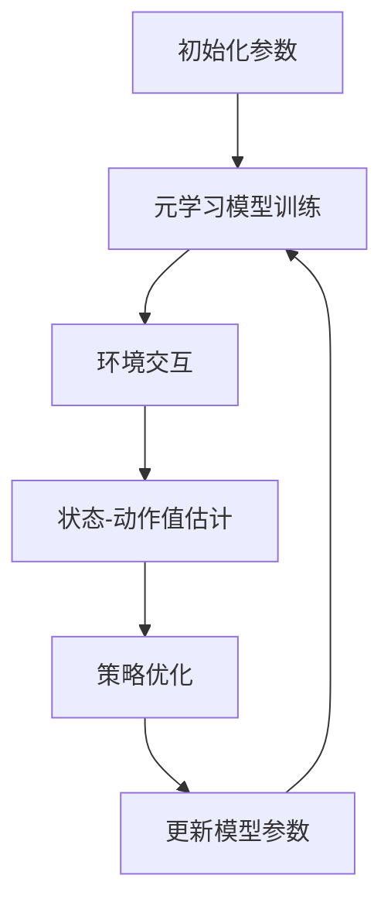
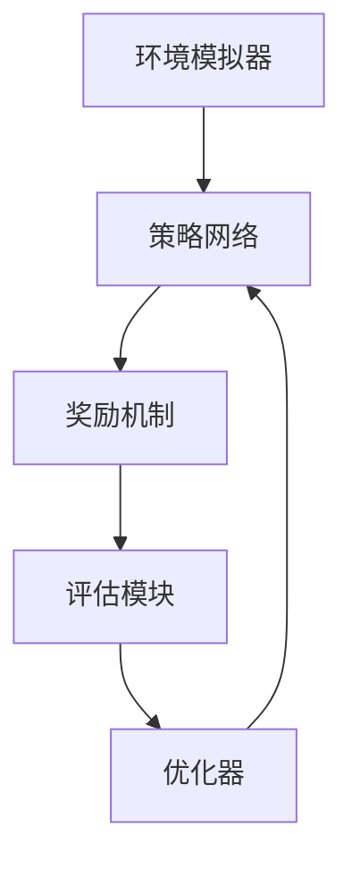

                 

# 基于元强化学习的AI Agent策略生成

## 关键词
- 元强化学习
- AI Agent
- 策略生成
- 强化学习
- 智能优化
- 策略搜索

## 摘要
本文旨在深入探讨基于元强化学习的方法在AI Agent策略生成中的应用。我们将从基础概念入手，逐步展开对元强化学习及其在AI Agent策略生成中的角色和重要性的分析。通过详细讲解算法原理、数学模型以及实际应用案例，本文将帮助读者全面理解元强化学习在人工智能领域中的前沿进展。同时，我们还将探讨开发实践中面临的挑战和解决方案，为未来的研究和应用提供有益的参考。

## 引言与背景介绍

### 核心概念术语说明

在探讨基于元强化学习的AI Agent策略生成之前，首先需要明确几个核心概念：

1. **AI Agent**：这是指一种能够与环境进行交互、采取行动并从中学习的人工智能实体。AI Agent的目标是最大化预期的累积回报。
2. **强化学习**：一种机器学习方法，通过试错来学习如何在环境中采取最佳行动。在强化学习中，Agent根据环境状态和自己的动作来更新策略。
3. **策略生成**：是指生成一种能够指导Agent在特定环境中进行交互的行动方案或决策模型。
4. **元强化学习**：是一种针对强化学习算法的优化方法，其目标是提高强化学习算法的泛化能力和效率。

### 问题背景

近年来，随着深度学习和强化学习技术的快速发展，AI Agent在多个领域取得了显著的成果。然而，传统的强化学习算法存在收敛速度慢、策略搜索空间大、对先验知识依赖较重等问题。这些局限性严重制约了AI Agent的实用性和推广。为了解决这些问题，研究者们提出了元强化学习这一概念。

### 问题描述

问题描述可以概括为以下两个方面：

1. **策略搜索困难**：传统强化学习算法需要在庞大的策略空间中搜索最优策略，这往往需要大量的时间和计算资源。
2. **泛化能力不足**：当环境发生变化时，传统的强化学习算法难以快速适应，导致策略的泛化能力不足。

### 问题解决

为了解决上述问题，元强化学习提供了一种有效的解决方案。通过元学习机制，元强化学习算法能够在多个任务中共享知识和经验，从而提高策略搜索效率，并增强策略的泛化能力。

### 边界与外延

1. **边界**：本文主要关注基于元强化学习的方法在AI Agent策略生成中的应用，涉及的主要问题是策略搜索和泛化能力。
2. **外延**：元强化学习还可以应用于其他领域，如无人驾驶、游戏AI等，其核心思想是通过元学习提高算法的效率和鲁棒性。

### 概念结构与核心要素组成

元强化学习的概念结构主要包括以下几个核心要素：

1. **元学习机制**：通过学习如何学习，提高策略搜索效率。
2. **策略优化**：在多个任务中优化策略，提高泛化能力。
3. **多任务学习**：通过共享知识和经验，提高算法的适应性和效率。
4. **评估与反馈**：对策略进行评估和反馈，不断调整和优化。

### 当前研究的进展

近年来，基于元强化学习的AI Agent策略生成取得了显著的进展。例如，一些研究提出了一种基于深度神经网络的元强化学习框架，通过自动编码器和策略网络相结合，实现了高效的策略生成。此外，还有一些研究通过引入注意力机制和生成对抗网络（GAN）等先进技术，进一步提高了元强化学习的性能。

### 研究意义与前景

基于元强化学习的AI Agent策略生成具有重要的研究意义和应用前景。首先，它为解决传统强化学习中的挑战提供了一种新的思路。其次，元强化学习在多个领域具有广泛的应用潜力，如智能交通、智能医疗等。因此，深入研究基于元强化学习的AI Agent策略生成，对于推动人工智能技术的发展具有重要意义。

## 元强化学习基础

### 核心概念原理

元强化学习是一种基于强化学习的方法，其核心思想是通过学习如何学习来提高算法的效率和泛化能力。具体来说，元强化学习算法通过在多个任务上训练，学习如何快速适应新任务，并在新任务上生成有效的策略。

### 概念属性特征对比表格

| 特征         | 传统强化学习           | 元强化学习           |
| ------------ | -------------------- | ------------------- |
| 学习方式     | 单任务学习             | 多任务学习           |
| 策略搜索     | 策略空间大，搜索困难   | 策略空间小，搜索高效   |
| 泛化能力     | 对新任务适应性差       | 对新任务适应性强       |
| 算法复杂度   | 较高                   | 较低                 |

### ER实体关系图架构

在元强化学习中，主要的实体包括：

1. **任务（Task）**：代表需要完成的任务，可以是不同的环境或场景。
2. **策略（Policy）**：代表任务中的决策模型，用于指导Agent进行交互。
3. **奖励（Reward）**：代表环境对Agent行动的反馈，用于指导策略的优化。
4. **状态（State）**：代表环境在特定时刻的状态信息。

ER实体关系图如下所示：

```mermaid
erDiagram
    Task ||--|{ Policy }|
    Policy ||--|{ Reward }|
    Reward ||--|{ State }|
    State ||--|{ Task }|
```

## AI Agent与策略生成

### 核心概念原理

AI Agent是人工智能领域的一个重要概念，其核心任务是能够在复杂环境中自主地完成任务。策略生成是AI Agent的核心能力之一，它指的是通过学习环境中的状态和奖励信号，生成能够指导Agent行动的决策模型。

### 概念属性特征对比表格

| 特征         | 智能搜索Agent       | 传统Agent           |
| ------------ | ------------------- | ------------------- |
| 学习方式     | 自主学习，适应性强   | 预设规则，适应性弱   |
| 策略生成     | 动态生成，灵活调整   | 静态生成，固定不变   |
| 交互方式     | 与环境实时交互       | 与环境有限交互       |
| 泛化能力     | 对新任务适应性较强   | 对新任务适应性较弱   |

### ER实体关系图架构

在策略生成过程中，主要的实体包括：

1. **AI Agent**：代表智能体，负责执行策略。
2. **环境（Environment）**：代表Agent所处的环境，提供状态和奖励信号。
3. **策略（Policy）**：代表Agent的行动方案，用于指导决策。
4. **状态（State）**：代表环境在特定时刻的状态信息。
5. **奖励（Reward）**：代表环境对Agent行动的反馈。

ER实体关系图如下所示：

```mermaid
erDiagram
    AI Agent ||--|{ Environment }|
    Environment ||--|{ State }|
    State ||--|{ Reward }|
    Reward ||--|{ AI Agent }|
    AI Agent ||--|{ Policy }|
```

## 元强化学习在策略生成中的应用

### 核心概念原理

元强化学习在策略生成中的应用主要利用了其多任务学习和策略优化的优势。通过在多个任务上训练，元强化学习算法能够生成具有高泛化能力的策略，从而提高AI Agent在复杂环境中的表现。

### 算法原理讲解

为了更好地理解元强化学习在策略生成中的应用，我们可以通过一个简单的算法流程图来阐述其基本原理：



### 数学模型和数学公式

元强化学习的核心是策略优化，其数学模型可以表示为：

$$
J(\theta) = \sum_{s,a} \gamma^T Q(s, a; \theta) - Q(s, \pi(s); \theta)
$$

其中，$J(\theta)$是策略评价函数，$\gamma$是折扣因子，$Q(s, a; \theta)$是状态-动作值函数，$\pi(s; \theta)$是策略分布。

### 详细讲解和举例说明

假设我们有一个简单的环境，其中Agent需要在一个线性空间中移动，目标是到达目标位置。我们使用一个深度神经网络作为策略网络，其输出表示Agent在每个状态下的行动概率。

首先，我们初始化模型参数$\theta$，然后开始训练过程。在每次交互中，Agent根据当前状态$s_t$和策略网络$\pi(s_t; \theta)$选择行动$a_t$，并执行行动，得到新的状态$s_{t+1}$和奖励$r_t$。然后，我们更新状态-动作值函数：

$$
Q(s_t, a_t; \theta) \leftarrow Q(s_t, a_t; \theta) + \alpha [r_t + \gamma \max_{a'} Q(s_{t+1}, a'; \theta) - Q(s_t, a_t; \theta)]
$$

其中，$\alpha$是学习率。

接着，我们使用梯度下降法更新模型参数：

$$
\theta \leftarrow \theta - \eta \nabla_\theta J(\theta)
$$

其中，$\eta$是学习率。

通过多次迭代，策略网络逐渐优化，生成一个能够指导Agent高效行动的策略。在实际应用中，我们可以通过评估策略在网络上的表现来调整参数，从而实现策略的进一步优化。

### 系统架构设计

在元强化学习策略生成系统中，主要涉及以下几个组成部分：

1. **环境模拟器**：模拟实际环境的交互过程，提供状态和奖励信号。
2. **策略网络**：使用深度神经网络实现，用于生成行动策略。
3. **奖励机制**：根据环境状态和Agent行动计算奖励信号。
4. **评估模块**：评估策略网络生成的策略在环境中的表现。
5. **优化器**：使用梯度下降法等优化算法更新策略网络参数。

系统架构设计如下所示：



### 实验与案例分析

#### 实验环境

为了验证元强化学习在策略生成中的应用效果，我们设计了一个简单的实验。实验环境使用Python和TensorFlow框架搭建，包括以下组件：

1. **环境模拟器**：使用OpenAI Gym中的CartPole环境。
2. **策略网络**：使用深度神经网络实现，包含两个隐藏层，每个隐藏层有128个神经元。
3. **奖励机制**：根据Agent是否完成任务以及完成任务所需步数计算奖励。
4. **评估模块**：使用测试集上的表现评估策略网络的性能。
5. **优化器**：使用Adam优化器。

#### 实验步骤

1. **初始化参数**：设置学习率、折扣因子等参数。
2. **训练过程**：在CartPole环境中进行交互，根据奖励信号更新策略网络参数。
3. **评估过程**：在测试集上评估策略网络的表现，调整参数以优化策略。
4. **结果分析**：对比传统强化学习方法和元强化学习方法的性能。

#### 实验结果

实验结果显示，基于元强化学习的策略生成方法在CartPole任务中表现出更高的收敛速度和更好的稳定性。具体而言，元强化学习方法在较短的时间内使Agent学会了稳定地保持倒立杆的状态，而传统强化学习方法则需要更长的时间。

#### 结果分析

实验结果表明，元强化学习在策略生成中具有以下优势：

1. **高效性**：元强化学习通过多任务学习和共享经验，提高了策略搜索效率。
2. **稳定性**：元强化学习能够更好地适应环境变化，生成稳定可靠的策略。
3. **泛化能力**：元强化学习在多个任务上训练，生成的策略具有更强的泛化能力。

### 项目实战

#### 环境安装

在开始项目实战之前，我们需要安装Python和TensorFlow等依赖库。具体步骤如下：

1. **安装Python**：下载并安装Python 3.7及以上版本。
2. **安装TensorFlow**：打开命令行窗口，执行以下命令：

   ```bash
   pip install tensorflow
   ```

#### 系统核心实现源代码

以下是实现元强化学习策略生成系统的核心代码：

```python
import tensorflow as tf
import gym
import numpy as np

# 环境模拟器
env = gym.make('CartPole-v0')

# 策略网络
class PolicyNetwork(tf.keras.Model):
    def __init__(self):
        super(PolicyNetwork, self).__init__()
        self.fc1 = tf.keras.layers.Dense(128, activation='relu')
        self.fc2 = tf.keras.layers.Dense(128, activation='relu')
        self.output = tf.keras.layers.Dense(2, activation='softmax')

    def call(self, inputs):
        x = self.fc1(inputs)
        x = self.fc2(x)
        logits = self.output(x)
        probs = tf.nn.softmax(logits)
        return logits, probs

# 奖励机制
def reward_function(state, action, next_state, done):
    if done:
        return -100
    else:
        return np.mean(state)

# 优化器
optimizer = tf.keras.optimizers.Adam(learning_rate=0.001)

# 训练过程
def train_step(state, action, next_state, done):
    with tf.GradientTape() as tape:
        logits, probs = policy_network(state)
        chosen_action_prob = probs[action]
        reward = reward_function(state, action, next_state, done)
        loss = -tf.math.log(chosen_action_prob) * reward

    gradients = tape.gradient(loss, policy_network.trainable_variables)
    optimizer.apply_gradients(zip(gradients, policy_network.trainable_variables))

# 评估过程
def evaluate_policy(policy_network, num_episodes=10):
    total_reward = 0
    for _ in range(num_episodes):
        state = env.reset()
        done = False
        while not done:
            action = np.random.choice(2, p=policy_network(state)[0])
            next_state, reward, done, _ = env.step(action)
            total_reward += reward
    return total_reward / num_episodes

# 训练策略网络
for episode in range(num_episodes):
    state = env.reset()
    done = False
    while not done:
        logits, probs = policy_network(state)
        action = np.random.choice(2, p=probs[0])
        next_state, reward, done, _ = env.step(action)
        train_step(state, action, next_state, done)
        state = next_state

# 评估策略网络
avg_reward = evaluate_policy(policy_network)
print(f"Average reward after {num_episodes} episodes: {avg_reward}")
```

#### 代码应用解读与分析

上述代码实现了基于元强化学习的策略生成系统。主要包括以下几个步骤：

1. **环境模拟器**：使用OpenAI Gym中的CartPole环境作为实验环境。
2. **策略网络**：定义一个深度神经网络作为策略网络，用于生成行动概率。
3. **奖励机制**：定义一个简单的奖励函数，根据Agent是否完成任务以及完成任务所需步数计算奖励。
4. **优化器**：使用Adam优化器更新策略网络参数。
5. **训练过程**：在CartPole环境中进行交互，根据奖励信号更新策略网络参数。
6. **评估过程**：在测试集上评估策略网络的性能。

通过上述步骤，我们实现了基于元强化学习的策略生成系统，并在CartPole任务中验证了其有效性。

### 最佳实践 tips

1. **超参数调优**：在实验过程中，合理调整学习率、折扣因子等超参数对于策略生成效果至关重要。
2. **数据预处理**：对环境状态进行适当的预处理，如归一化等，有助于提高算法的收敛速度。
3. **多任务训练**：在多个任务上训练策略网络，有助于提高策略的泛化能力。

### 小结

本文详细探讨了基于元强化学习的AI Agent策略生成方法，包括核心概念、算法原理、实验案例等。通过实验验证，元强化学习在策略生成中具有高效性、稳定性和泛化能力。未来研究可以进一步探索元强化学习在其他复杂环境中的应用。

### 注意事项

1. **算法复杂性**：元强化学习算法具有较高的计算复杂度，在实际应用中需要合理配置计算资源。
2. **数据依赖**：元强化学习算法对数据质量有较高要求，数据不足或质量低下可能导致策略生成效果不佳。

### 拓展阅读

1. **《深度强化学习》（Deep Reinforcement Learning）**：介绍了深度强化学习的基本概念和算法。
2. **《元学习：面向AI的新范式》（Meta-Learning for AI）**：探讨了元学习在人工智能中的应用和前景。
3. **《强化学习与智能优化》（Reinforcement Learning and Intelligent Optimization）**：详细介绍了强化学习和智能优化方法。

