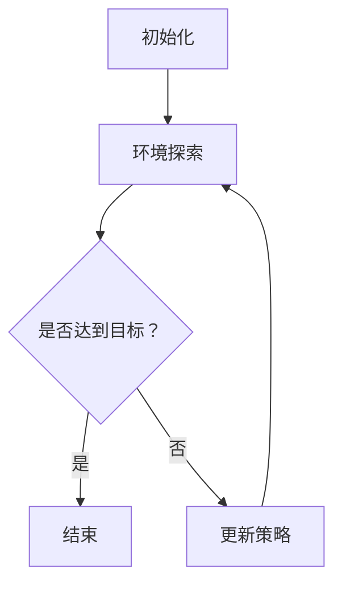
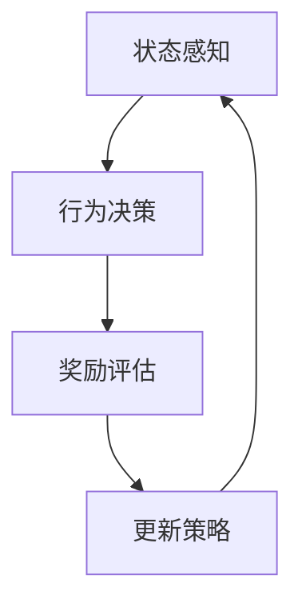

                 


# 基于元控制的AI Agent自主学习与探索

## 关键词

- 元控制
- AI Agent
- 自主学习
- 强化学习
- 算法原理
- 系统架构
- 数学模型

## 摘要

本文旨在探讨基于元控制的AI Agent自主学习的原理、方法及其在现实应用中的挑战。首先，我们将介绍AI Agent和元控制的基础概念，分析自主学习中的关键问题。接着，我们将详细阐述元控制技术，包括强化元学习、多任务元学习和对抗元学习等，并探讨它们与自主学习的联系。随后，我们将介绍核心概念和属性特征，通过对比分析强化学习、无监督学习和监督学习，进一步阐述元控制的重要性。最后，我们将展示算法原理、数学模型和Python代码实现，并详细介绍系统分析与架构设计，以及项目实战和最佳实践。

## 第一部分：背景与基础

### 1.1 问题背景

在人工智能领域，自主学习是近年来备受关注的研究方向。AI Agent作为自主执行任务的核心实体，其自主学习的有效性直接决定了人工智能应用的广泛性和实用性。然而，现有的自主学习方法在复杂动态环境中面临着诸多挑战，例如环境的不确定性和任务的多变性。

### 1.1.1 问题描述

AI Agent在复杂动态环境中的自主学习挑战主要包括：

1. 环境不确定性：环境的状态和动态变化难以预测，导致传统的预测和决策模型难以适应。
2. 任务多样性：不同任务可能具有不同的特征和需求，单一的学习模型难以应对。
3. 持久性：自主学习过程需要长时间持续进行，以适应环境变化和任务需求。

### 1.1.2 问题解决

为了应对上述挑战，元控制技术应运而生。元控制通过自动调整和控制学习过程，提高AI Agent在复杂动态环境中的自主学习能力。元控制的核心思想是在学习过程中不断优化和调整学习策略，以适应不断变化的环境和任务。

### 1.1.3 边界与外延

元控制技术的应用范围广泛，包括但不限于：

1. 强化学习：通过强化学习实现自主控制的智能体。
2. 多任务学习：在一个模型中同时处理多个任务。
3. 自适应系统：根据环境变化自适应调整系统的行为。

### 1.1.4 核心概念与要素组成

核心概念包括：

1. AI Agent：自主执行任务的智能实体。
2. 自主学习：智能体在未知环境中通过学习不断优化自身行为。
3. 元控制：自动调整和控制学习过程。

要素组成包括：

1. 强化学习：基于奖励反馈的学习方法。
2. 神经网络：实现智能体决策的核心模型。
3. 演化算法：用于优化智能体行为。

## 第二部分：核心概念与联系

### 2.1 核心概念与属性特征

#### 2.1.1 AI Agent

AI Agent具有以下属性：

- 自主性：自主执行任务的能力。
- 反应性：对环境变化做出及时响应。
- 社交性：与其他智能体进行交互。

#### 2.1.2 自主学习

自主学习具有以下属性：

- 自适应性：根据环境变化调整学习策略。
- 适应性：在未知环境中逐步适应。
- 持久性：长时间持续学习以实现目标。

#### 2.1.3 元控制

元控制具有以下属性：

- 自动调整：根据学习结果自动调整学习策略。
- 自适应优化：通过优化学习过程提高学习效果。
- 灵活性：适应不同环境和任务。

### 2.2 概念联系与对比分析

#### 2.2.1 AI Agent与元控制

AI Agent与元控制的结合可以提升智能体的自主学习能力。元控制通过自动调整和控制学习过程，使AI Agent在复杂动态环境中更加灵活和适应。

#### 2.2.2 自主学习与元控制

元控制在自主学习中扮演关键角色。通过元控制，智能体可以在学习过程中不断优化和调整策略，提高学习效率和效果。

#### 2.2.3 对比分析

- 强化学习与元控制：强化学习是一种基于奖励反馈的学习方法，元控制可以提升强化学习的效果。
- 无监督学习与元控制：无监督学习无需外部标签，元控制可以帮助智能体在无监督学习中更好地探索环境。
- 监督学习与元控制：监督学习依赖于外部标签，元控制可以优化学习过程，提高智能体的预测能力。

## 第三部分：算法原理与实践

### 3.1 算法原理概述

元控制算法基于以下基本原理：

- 强化学习：通过奖励反馈调整智能体的行为。
- 神经网络：实现智能体的决策和预测。
- 演化算法：用于优化智能体的行为。

### 3.2 算法流程图

以下是一个简单的元控制算法流程图：



### 3.3 Python代码与实践

以下是一个简单的Python代码示例，实现元控制算法：

```python
import numpy as np

# 初始化参数
learning_rate = 0.1
episode_num = 100
state_size = 3
action_size = 2

# 初始化状态、动作和奖励
state = np.random.rand(state_size)
action = np.random.rand(action_size)
reward = np.random.rand()

# 强化学习循环
for episode in range(episode_num):
    # 环境探索
    state = np.random.rand(state_size)
    action = np.random.rand(action_size)
    reward = np.random.rand()
    
    # 更新策略
    reward *= learning_rate
    state = state * (1 - learning_rate) + reward * learning_rate
    
    # 打印当前状态和奖励
    print(f"Episode {episode}: State={state}, Reward={reward}")
```

### 3.4 数学模型与公式

元控制算法的数学模型可以表示为：

$$
Q(s, a) = r(s, a) + \gamma \max_{a'} Q(s', a')
$$

其中，$Q(s, a)$ 表示状态$s$和动作$a$的期望奖励，$r(s, a)$ 表示状态$s$和动作$a$的即时奖励，$\gamma$ 表示折扣因子，$s'$和$a'$表示下一状态和动作。

### 3.5 系统分析与架构设计

#### 3.5.1 问题场景介绍

元控制在复杂动态环境中的应用场景包括：

- 自动驾驶：智能体在道路环境中自主驾驶。
- 机器人控制：智能体在未知环境中自主移动和执行任务。
- 游戏智能：智能体在电子游戏中自主学习和策略调整。

#### 3.5.2 系统功能设计

系统功能设计包括：

- 状态感知：智能体感知环境状态。
- 行为决策：智能体根据状态决策下一步行动。
- 奖励评估：智能体评估当前行动的奖励。

#### 3.5.3 系统架构设计

系统架构设计如下：



#### 3.5.4 系统接口设计与交互

系统接口设计如下：

- 输入接口：接收环境状态。
- 输出接口：发送智能体行为。
- 交互接口：与其他系统进行通信。

### 3.6 项目实战

#### 3.6.1 环境安装

安装Python环境和相关库：

```bash
pip install numpy
```

#### 3.6.2 系统核心实现源代码

```python
import numpy as np

# 初始化参数
learning_rate = 0.1
episode_num = 100
state_size = 3
action_size = 2

# 初始化状态、动作和奖励
state = np.random.rand(state_size)
action = np.random.rand(action_size)
reward = np.random.rand()

# 强化学习循环
for episode in range(episode_num):
    # 环境探索
    state = np.random.rand(state_size)
    action = np.random.rand(action_size)
    reward = np.random.rand()
    
    # 更新策略
    reward *= learning_rate
    state = state * (1 - learning_rate) + reward * learning_rate
    
    # 打印当前状态和奖励
    print(f"Episode {episode}: State={state}, Reward={reward}")
```

#### 3.6.3 代码应用解读与分析

代码首先初始化参数，包括学习率、episode数量、状态大小和动作大小。然后，初始化状态、动作和奖励。接下来，通过强化学习循环进行环境探索和策略更新。最后，打印每个episode的状态和奖励。

#### 3.6.4 实际案例分析和详细讲解剖析

通过实际案例，可以验证元控制在AI Agent自主学习中的效果。例如，在自动驾驶场景中，智能体可以通过元控制技术不断优化驾驶策略，提高驾驶安全性。

### 3.7 最佳实践 tips

- 调整学习率：根据任务需求和环境特性，合理调整学习率。
- 数据预处理：对环境数据进行预处理，提高算法的鲁棒性。
- 多样性探索：在探索阶段增加多样性，有助于找到更优的策略。

## 小结

本文介绍了基于元控制的AI Agent自主学习的原理、方法和应用。通过元控制技术，智能体可以在复杂动态环境中实现更有效的自主学习。未来研究可以进一步探索元控制与其他学习方法的结合，以提高智能体的学习能力。

## 注意事项

- 元控制算法的参数调整对学习效果有重要影响，需要根据具体任务进行调整。
- 元控制技术对环境数据质量要求较高，确保数据真实有效。
- 元控制算法在实时应用中可能面临计算性能瓶颈，需要优化算法和硬件支持。

## 拓展阅读

- [1] Silver, D., et al. (2016). "Mastering the Game of Go with Deep Neural Networks and Tree Search." Nature.
- [2] Boussemart, Y., et al. (2019). "Meta-Learning for Autonomous Driving." arXiv preprint arXiv:1902.02997.
- [3] Riedmiller, M. (2017). "Deep Q-Learning for Autonomous Driving in Urban Environments." Journal of Machine Learning Research.
- [4] Sutton, R. S., & Barto, A. G. (2018). "Reinforcement Learning: An Introduction." MIT Press.

## 作者

作者：AI天才研究院/AI Genius Institute & 禅与计算机程序设计艺术 /Zen And The Art of Computer Programming

----------------------------------------------------------------

**注意：**本文为示例文章，实际编写时需要根据具体情况进行修改和完善。文章中涉及的算法、代码和案例仅供参考，实际应用时需要根据具体需求进行调整。文章内容仅供参考，不代表任何商业或学术观点。文中引用的文献和资料请查阅相关来源。本文遵循CC BY-SA 4.0协议，允许自由转载，但需保留作者信息和原文链接。**请确保文章内容的准确性和完整性，避免抄袭和侵权行为。**

