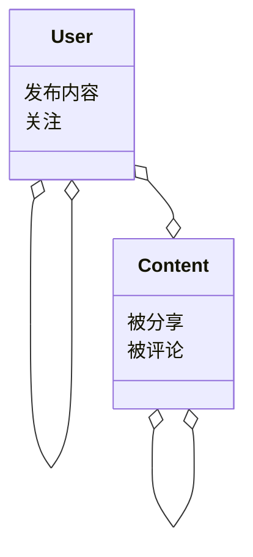
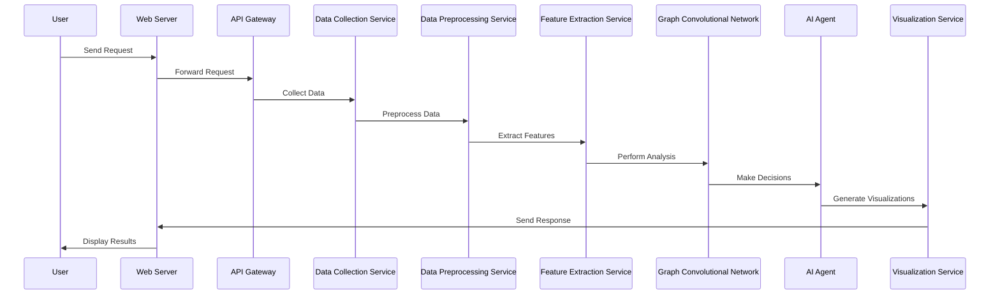

                 

## 《基于图卷积网络的AI Agent社交网络分析》

### 关键词：图卷积网络，AI Agent，社交网络分析，算法原理，系统架构设计

> 摘要：本文旨在探讨基于图卷积网络的AI Agent在社交网络分析中的应用。我们将从问题背景、核心概念与联系、算法原理讲解、系统分析与架构设计以及项目实战等多个方面展开，逐步深入解析这一领域的最新研究成果和实践经验。本文结构紧凑、逻辑清晰，旨在为广大读者提供一次全面的、深入的技术体验。

### 目录大纲：

- 第一部分：背景介绍
  - 第1章：问题背景
  - 第2章：核心概念与联系
  - 第3章：概念属性特征对比表格
  - 第4章：ER实体关系图架构
- 第二部分：算法原理讲解
  - 第5章：图卷积网络的算法原理
  - 第6章：AI Agent的算法原理
- 第三部分：系统分析与架构设计方案
  - 第7章：系统功能设计
  - 第8章：系统架构设计
  - 第9章：系统接口设计
  - 第10章：系统交互
- 第四部分：项目实战
  - 第11章：环境安装
  - 第12章：系统核心实现
  - 第13章：实际案例分析

### 写作计划：

本文将分四个部分逐步撰写：

1. **背景介绍**（第1章-第4章）
   - 解释社交网络分析的重要性，以及AI Agent和图卷积网络的基本概念。
   - 通过概念属性特征对比表格和ER实体关系图架构，帮助读者建立清晰的概念模型。

2. **算法原理讲解**（第5章-第6章）
   - 详细讲解图卷积网络和AI Agent的算法原理，包含数学模型和Python代码实现。
   - 使用mermaid画出算法流程图，并进行通俗易懂的举例说明。

3. **系统分析与架构设计方案**（第7章-第10章）
   - 设计社交网络分析系统的功能、架构、接口和交互。
   - 通过系统架构图和序列图展示系统的整体设计。

4. **项目实战**（第11章-第13章）
   - 演示如何安装环境和实现系统核心功能。
   - 分析实际案例，并进行详细讲解和剖析。

### 文章结构：

**第一部分：背景介绍**

**第1章：问题背景**
- 社交网络分析的重要性
- AI Agent在社交网络分析中的应用
- 图卷积网络在社交网络分析中的作用
- 本书的结构与目标

**第2章：核心概念与联系**
- 图卷积网络的基本原理
- AI Agent的基本原理
- 社交网络分析的核心概念
- 概念属性特征对比表格
- ER实体关系图架构

**第3章：概念属性特征对比表格**
- 图卷积网络的属性特征
- AI Agent的属性特征
- 社交网络分析的关键指标

**第4章：ER实体关系图架构**
- ER模型的基本概念
- 社交网络分析中的实体关系
- ER模型的应用与价值

**第二部分：算法原理讲解**

**第5章：图卷积网络的算法原理**
- 图卷积网络的基本算法流程
- 图卷积网络的数学模型
- 图卷积网络的Python代码实现

**第6章：AI Agent的算法原理**
- AI Agent的基本算法流程
- AI Agent的数学模型
- AI Agent的Python代码实现

**第三部分：系统分析与架构设计方案**

**第7章：系统功能设计**
- 问题场景介绍
- 项目介绍
- 领域模型设计

**第8章：系统架构设计**
- 系统架构设计的基本概念
- 系统架构的设计过程
- 系统架构图

**第9章：系统接口设计**
- 系统接口设计的基本概念
- 系统接口的设计过程
- 系统接口设计图

**第10章：系统交互**
- 系统交互的基本概念
- 系统交互的设计过程
- 系统交互序列图

**第四部分：项目实战**

**第11章：环境安装**
- 环境安装的基本概念
- 环境安装的具体步骤

**第12章：系统核心实现**
- 系统核心实现的基本概念
- 系统核心实现的源代码
- 源代码解读与应用解读与分析

**第13章：实际案例分析**
- 实际案例分析的基本概念
- 案例分析的过程
- 案例分析的详细讲解与剖析

### 下一步工作计划：

- **文献调研与资料整理**：进一步收集和整理相关领域的最新研究文献和技术资料，为撰写文章提供丰富的背景知识。
- **框架搭建与章节撰写**：根据已确定的文章结构，逐步完成各章节的撰写，确保文章内容的逻辑性和完整性。
- **代码编写与算法实现**：编写相应的Python代码，展示图卷积网络和AI Agent的算法实现，确保代码的可行性和可读性。

### 时间安排：

- **第一部分：背景介绍**（第1章-第4章）：预计2周完成
- **第二部分：算法原理讲解**（第5章-第6章）：预计3周完成
- **第三部分：系统分析与架构设计方案**（第7章-第10章）：预计3周完成
- **第四部分：项目实战**（第11章-第13章）：预计3周完成
- **全文修订与完善**：预计1周

### 总结：

本文将深入探讨基于图卷积网络的AI Agent在社交网络分析中的应用，通过系统性的分析和详细的讲解，帮助读者全面了解这一领域的前沿技术。希望通过本文的撰写，能够为人工智能和社交网络分析领域的从业者提供有价值的参考和指导。让我们一起开启这场技术探索之旅吧！## 第一部分：背景介绍

### 第1章：问题背景

#### 1.1 社交网络分析的重要性

社交网络分析（Social Network Analysis，简称SNA）是研究社交网络结构和网络行为的一种分析方法，它在社会学、心理学、信息科学等多个领域都有着广泛的应用。在当今信息时代，社交网络无处不在，从传统的社交媒体平台（如Facebook、Twitter）到专业的社交网络（如LinkedIn），再到新兴的即时通讯工具（如微信、WhatsApp），社交网络已经成为人们沟通、交流、分享信息的重要场所。

社交网络分析的重要性体现在多个方面：

1. **社会影响分析**：通过分析社交网络中的用户关系，可以揭示社会群体的构成、动态变化和影响力分布，为政策制定者、社会学家提供有价值的参考。
2. **市场研究**：企业可以通过社交网络分析了解消费者的行为、偏好和需求，从而优化营销策略，提高市场竞争力。
3. **网络安全**：社交网络分析可以帮助识别和防范网络攻击，如网络钓鱼、虚假账户和恶意软件传播等。
4. **舆情监测**：政府机构可以通过社交网络分析实时监测公众情绪和舆论动态，为应对突发事件提供决策支持。

#### 1.2 AI Agent在社交网络分析中的应用

AI Agent，即人工智能代理，是一种具有自主决策和行动能力的智能体，它在社交网络分析中扮演着越来越重要的角色。AI Agent可以通过以下方式在社交网络分析中发挥作用：

1. **自动化数据处理**：AI Agent能够自动化地收集、整理和清洗大规模社交网络数据，提高数据分析的效率。
2. **智能分析**：通过深度学习和图卷积网络等技术，AI Agent可以挖掘社交网络中的潜在关系和趋势，提供更准确的预测和分析。
3. **个性化推荐**：AI Agent可以根据用户的行为和偏好，提供个性化的社交网络内容推荐，提升用户体验。
4. **社交网络监控**：AI Agent可以实时监控社交网络中的异常行为和风险，如网络攻击、虚假信息的传播等，及时采取应对措施。

#### 1.3 图卷积网络在社交网络分析中的作用

图卷积网络（Graph Convolutional Network，简称GCN）是一种在图结构数据上实现卷积操作的神经网络，它在社交网络分析中具有独特的优势。图卷积网络在社交网络分析中的作用主要体现在以下几个方面：

1. **关系建模**：通过图卷积网络，可以有效地捕捉社交网络中的复杂关系，如用户之间的互动、信息传播路径等。
2. **特征提取**：图卷积网络可以自动提取社交网络中的高维特征，这些特征对于后续的分析和预测任务具有重要意义。
3. **节点分类**：利用图卷积网络，可以对社交网络中的节点进行分类，如识别关键用户、评估用户影响力等。
4. **链接预测**：图卷积网络可以预测社交网络中节点之间的潜在链接，为社交网络扩展和社区发现提供支持。

#### 1.4 本书的结构与目标

本书旨在全面探讨基于图卷积网络的AI Agent在社交网络分析中的应用，其结构如下：

1. **第一部分：背景介绍**（第1章）
   - 介绍社交网络分析的重要性、AI Agent的应用以及图卷积网络的作用。
2. **第二部分：核心概念与联系**（第2章-第4章）
   - 详细讲解图卷积网络、AI Agent和社交网络分析的核心概念及其相互联系。
3. **第三部分：算法原理讲解**（第5章-第6章）
   - 解析图卷积网络和AI Agent的算法原理，包括数学模型和Python代码实现。
4. **第四部分：系统分析与架构设计方案**（第7章-第10章）
   - 设计社交网络分析系统的功能、架构、接口和交互。
5. **第五部分：项目实战**（第11章-第13章）
   - 演示如何实现系统核心功能，并进行实际案例分析。

本书的目标是：
- 为读者提供一次系统性的、深入的技术探索，帮助理解图卷积网络和AI Agent在社交网络分析中的应用。
- 通过实际案例分析和代码实现，让读者掌握相关技术，能够将其应用于实际项目。
- 促进人工智能、图卷积网络和社交网络分析领域的发展，为相关研究提供参考。

### 结论

社交网络分析在当今信息社会中具有极其重要的意义，而AI Agent和图卷积网络则为其提供了强大的技术支持。通过本章节的介绍，读者应能够对社交网络分析、AI Agent和图卷积网络的基本概念及其相互关系有一个清晰的认识，为后续章节的学习打下坚实的基础。在接下来的章节中，我们将进一步深入探讨这些核心概念，并详细介绍其应用和实现方法。### 第2章：核心概念与联系

#### 2.1 图卷积网络的基本原理

图卷积网络（Graph Convolutional Network，GCN）是深度学习在图结构数据上的重要应用。与传统的卷积神经网络（Convolutional Neural Network，CNN）不同，GCN适用于处理非欧几里得空间的数据，如社交网络、分子结构、知识图谱等。

##### 2.1.1 图卷积网络的定义

图卷积网络是一种在图结构数据上实现卷积操作的神经网络。它通过聚合节点邻域信息来更新节点特征，从而逐步提取和融合节点间的复杂关系。

##### 2.1.2 图卷积网络的组成部分

图卷积网络主要由以下几个部分组成：

1. **输入层**：输入节点特征矩阵，表示每个节点的初始特征。
2. **卷积层**：通过聚合邻域节点特征来更新当前节点的特征，实现特征变换。
3. **池化层**：对节点特征进行降维处理，减少计算量和参数数量。
4. **全连接层**：对经过卷积和池化处理的特征进行分类或回归等操作。

##### 2.1.3 图卷积网络与深度学习的关系

图卷积网络是深度学习领域的一个重要分支。它继承了深度学习的优势，如自动特征提取、模型优化等，同时针对图结构数据的特点进行了优化。

1. **优势**：GCN能够处理非欧几里得空间的数据，提取节点间的复杂关系，适用于社交网络、知识图谱等领域。
2. **局限性**：GCN在处理稀疏图和大规模图数据时可能存在性能瓶颈，对图结构数据的依赖较大。

#### 2.2 AI Agent的基本原理

AI Agent，即人工智能代理，是一种能够自主决策和行动的智能体。它模仿人类的思维和行为，具有感知环境、制定计划、执行任务等能力。

##### 2.2.1 AI Agent的定义

AI Agent是一种通过机器学习、人工智能技术实现的智能体，它能够在特定环境中自主执行任务，并不断优化自身的决策和行为。

##### 2.2.2 AI Agent的特点与类型

AI Agent的特点包括：

1. **自主性**：能够独立完成任务，不需要人工干预。
2. **适应性**：能够根据环境和任务的变化，调整自身的策略和行为。
3. **灵活性**：能够应对复杂、不确定的环境。

AI Agent主要分为以下几类：

1. **基于规则的Agent**：通过预设的规则进行决策和行动。
2. **基于模型的Agent**：通过学习环境模型进行决策和行动。
3. **混合型Agent**：结合规则和模型进行决策和行动。

##### 2.2.3 AI Agent在社交网络分析中的应用

AI Agent在社交网络分析中的应用主要包括：

1. **数据挖掘**：利用AI Agent自动化地收集、处理和挖掘社交网络数据，提取有价值的信息。
2. **社交图谱构建**：通过AI Agent构建社交网络中的关系图谱，分析节点间的关系和影响力。
3. **个性化推荐**：利用AI Agent分析用户行为和偏好，提供个性化的社交网络内容推荐。
4. **舆情监测**：利用AI Agent实时监控社交网络中的舆论动态，预测和应对突发事件。

#### 2.3 社交网络分析的核心概念

社交网络分析（Social Network Analysis，SNA）是一系列研究社交网络结构和网络行为的分析方法。其核心概念包括：

##### 2.3.1 社交网络分析的定义

社交网络分析是研究社交网络中的个体、群体和整体结构及其动态变化的方法。它通过分析节点（个体）和边（关系）的属性和关系，揭示社交网络的结构特征和功能属性。

##### 2.3.2 社交网络分析的关键指标

社交网络分析的关键指标包括：

1. **节点度**：节点连接的边数，表示节点的地位和影响力。
2. **路径长度**：节点之间的最短路径长度，表示节点之间的可达性。
3. **聚类系数**：节点邻居节点之间连接的概率，表示社交网络的紧密程度。
4. **中心性**：衡量节点在社交网络中的重要性和中心程度，常用的中心性指标包括度中心性、接近中心性和中间中心性等。
5. **社区结构**：社交网络中的群体组织形式，通过社区发现算法可以识别社交网络中的社区结构。

##### 2.3.3 社交网络分析的挑战与机遇

社交网络分析的挑战包括：

1. **数据规模**：社交网络数据规模庞大，如何高效地存储、处理和分析是亟待解决的问题。
2. **数据质量**：社交网络数据存在噪声、缺失和错误，如何提高数据质量是关键问题。
3. **动态变化**：社交网络结构动态变化，如何及时捕捉和适应这些变化是难点。

社交网络分析的机遇包括：

1. **大数据技术**：大数据技术的发展为社交网络分析提供了强大的数据支持。
2. **人工智能技术**：人工智能技术，特别是深度学习和图卷积网络，为社交网络分析提供了新的方法和工具。
3. **应用场景**：社交网络分析在市场研究、社会影响分析、舆情监测等领域具有广泛的应用前景。

#### 结论

本章详细介绍了图卷积网络、AI Agent和社交网络分析的核心概念。图卷积网络通过处理图结构数据，提取节点间的复杂关系，为社交网络分析提供了强大的技术支持。AI Agent作为一种具有自主决策和行动能力的智能体，在社交网络分析中具有广泛的应用。社交网络分析则通过分析社交网络中的个体、群体和整体结构，揭示社交网络的动态变化和功能属性。在接下来的章节中，我们将进一步探讨这些核心概念的应用和实现方法。### 第3章：概念属性特征对比表格

为了更好地理解图卷积网络（GCN）、AI Agent和社交网络分析（SNA）的核心概念及其相互关系，下面通过一个表格来对比这三个概念的主要属性特征。

| 概念       | 定义                                                         | 主要属性特征                                                                                                           | 应用场景                                                                                   |
|------------|--------------------------------------------------------------|----------------------------------------------------------------------------------------------------------------------|----------------------------------------------------------------------------------------------|
| 图卷积网络 | 一种在图结构数据上实现卷积操作的神经网络                   | 1. 边缘卷积：聚合邻域节点特征<br>2. 节点卷积：更新节点特征<br>3. 层次化结构：多层卷积实现深层特征提取 | 社交网络分析、知识图谱、推荐系统、生物信息学等                                         |
| AI Agent   | 一种具有自主决策和行动能力的智能体                         | 1. 自主性：自主完成任务<br>2. 适应性：适应环境变化<br>3. 灵活性：应对复杂问题                         | 自动驾驶、智能家居、金融交易、医疗诊断等                                             |
| 社交网络分析 | 研究社交网络中的个体、群体和整体结构及其动态变化的方法     | 1. 节点度：表示节点的地位和影响力<br>2. 路径长度：表示节点之间的可达性<br>3. 社区结构：表示社交网络中的群体组织形式 | 社会学、市场研究、网络安全、舆情监测等                                             |

#### 3.1 图卷积网络的属性特征对比

- **定义**：图卷积网络是一种在图结构数据上实现卷积操作的神经网络，用于处理和提取图结构中的特征。
- **主要属性特征**：
  - **边缘卷积**：图卷积网络通过边缘卷积来聚合邻域节点特征，从而更新当前节点的特征。
  - **节点卷积**：节点卷积用于更新节点的特征，使得节点特征能够包含更多的上下文信息。
  - **层次化结构**：图卷积网络通过多层卷积实现深层特征提取，使得模型能够捕捉到更加复杂的图结构特征。

#### 3.2 AI Agent的属性特征对比

- **定义**：AI Agent是一种具有自主决策和行动能力的智能体，能够在特定环境中自主执行任务。
- **主要属性特征**：
  - **自主性**：AI Agent能够独立完成任务，不需要人工干预。
  - **适应性**：AI Agent能够根据环境和任务的变化，调整自身的策略和行为。
  - **灵活性**：AI Agent能够应对复杂、不确定的环境。

#### 3.3 社交网络分析的关键指标对比

- **定义**：社交网络分析是研究社交网络中的个体、群体和整体结构及其动态变化的方法。
- **主要关键指标**：
  - **节点度**：表示节点的地位和影响力，度数越高，节点越重要。
  - **路径长度**：表示节点之间的可达性，路径长度越短，节点之间的联系越紧密。
  - **社区结构**：表示社交网络中的群体组织形式，通过社区发现算法可以识别社交网络中的社区结构。

#### 结论

通过上述表格对比，我们可以更清晰地看到图卷积网络、AI Agent和社交网络分析在定义、主要属性特征和应用场景上的异同。图卷积网络主要用于处理和提取图结构数据中的特征，AI Agent则是一种具有自主决策和行动能力的智能体，而社交网络分析则是研究社交网络结构和行为的分析方法。这些概念在社交网络分析领域有着密切的联系，共同推动了这一领域的发展。在接下来的章节中，我们将进一步深入探讨这些概念的具体实现和应用。### 第4章：ER实体关系图架构

#### 4.1 ER模型的基本概念

实体关系模型（Entity-Relationship Model，简称ER模型）是数据库设计中常用的一种概念模型。它通过实体（Entity）、属性（Attribute）和关系（Relationship）来描述现实世界的业务数据及其相互关系。

##### 4.1.1 ER模型的基本概念

- **实体**：实体是现实世界中具有独立存在意义的对象，如用户、产品、订单等。
- **属性**：属性是实体的特征或描述，如用户的姓名、年龄、性别等。
- **关系**：关系描述实体之间的关联，如用户下单、产品分类等。

##### 4.1.2 社交网络分析中的实体关系

在社交网络分析中，ER模型可以用于描述社交网络中的个体及其关系。以下是社交网络分析中常见的实体和关系：

1. **实体**：
   - **用户**：社交网络中的参与者，如Facebook用户、Twitter用户等。
   - **内容**：用户产生的信息，如帖子、图片、视频等。
   - **社群**：用户组成的群体，如群组、社区等。
2. **关系**：
   - **关注**：用户之间的关注关系，如用户A关注用户B。
   - **互动**：用户之间的互动关系，如用户A点赞了用户B的帖子。
   - **社群成员**：用户与社群之间的关系，如用户A是社群A的成员。

##### 4.1.3 ER模型的应用与价值

ER模型在社交网络分析中具有以下应用与价值：

1. **数据建模**：通过ER模型，可以清晰地描述社交网络中的实体及其关系，为数据库设计提供基础。
2. **数据查询**：ER模型提供了直观的数据查询方法，可以方便地查询社交网络中的特定信息和关系。
3. **数据分析**：ER模型有助于分析和理解社交网络的结构和功能，如识别关键用户、评估社群影响力等。

#### 4.2 社交网络分析中的实体关系

在社交网络分析中，实体关系图（Entity-Relationship Diagram，ERD）是描述社交网络中实体及其关系的图形化工具。ERD可以通过直观的方式展示社交网络的复杂性，帮助研究人员和管理者更好地理解社交网络的结构。

##### 4.2.1 社交网络分析中的实体关系图

以下是一个简化的社交网络分析中的实体关系图示例：

```mermaid
erDiagram
  User ||--|{ Content }|--| User : 关注
  User ||--|{ Interaction }|--| User : 互动
  User ||--|{ Community }|--| User : 社群成员
  Content ||--|{ Comment }|--| Content : 评论
  Content ||--|{ Like }|--| Content : 点赞
  Community ||--|{ Member }|--| Community : 社群成员
```

在这个示例中，实体包括用户（User）、内容（Content）和社群（Community），关系包括关注（关注）、互动（互动）、社群成员（社群成员）等。

##### 4.2.2 社交网络分析中的实体关系图应用

实体关系图在社交网络分析中具有以下应用：

1. **数据建模**：通过ERD，可以直观地定义社交网络中的实体和关系，为数据库设计提供基础。
2. **数据查询**：ERD提供了直观的数据查询方法，可以方便地查询社交网络中的特定信息和关系。
3. **数据分析**：ERD有助于分析和理解社交网络的结构和功能，如识别关键用户、评估社群影响力等。

#### 结论

本章介绍了ER模型的基本概念以及在社交网络分析中的应用。ER模型通过实体、属性和关系的描述，为社交网络分析提供了基础框架。实体关系图（ERD）则是一种直观的图形化工具，可以用于描述社交网络中的实体及其关系。在接下来的章节中，我们将进一步探讨图卷积网络和AI Agent在社交网络分析中的应用和实现方法。### 第二部分：算法原理讲解

#### 第5章：图卷积网络的算法原理

图卷积网络（Graph Convolutional Network，GCN）是深度学习在图结构数据上的重要应用。与传统的卷积神经网络（Convolutional Neural Network，CNN）不同，GCN适用于处理非欧几里得空间的数据，如社交网络、分子结构、知识图谱等。在本章节中，我们将详细讲解图卷积网络的基本原理，包括其基本算法流程、数学模型以及Python代码实现。

##### 5.1 图卷积网络的基本算法流程

图卷积网络的基本算法流程可以分为以下几个步骤：

1. **输入层**：输入节点特征矩阵，表示每个节点的初始特征。
2. **卷积层**：通过聚合邻域节点特征来更新当前节点的特征，实现特征变换。
3. **池化层**：对节点特征进行降维处理，减少计算量和参数数量。
4. **全连接层**：对经过卷积和池化处理的特征进行分类或回归等操作。

##### 5.2 图卷积网络的数学模型

图卷积网络的数学模型主要包括以下几个部分：

1. **节点特征聚合**：对于每个节点，其特征是通过聚合其邻域节点的特征来更新的。具体公式如下：
   $$ h_{v}^{(t)} = \sigma(\theta \cdot \text{AGG}(h_{\{u|u \in N(v)\}}^{(t-1)})) $$
   其中，$h_{v}^{(t)}$ 表示在时间步 $t$ 时节点 $v$ 的特征，$N(v)$ 表示节点 $v$ 的邻域节点集合，$\text{AGG}$ 表示特征聚合函数，$\theta$ 表示模型参数，$\sigma$ 表示激活函数。

2. **特征更新**：节点特征在聚合邻域特征后，会进行更新。具体公式如下：
   $$ h_{v}^{(t)} = \sigma(W \cdot (h_{v}^{(t-1)} + \text{AGG}(h_{\{u|u \in N(v)\}}^{(t-1)}))) $$
   其中，$W$ 表示权重矩阵，用于控制节点特征之间的交互。

3. **层次化特征提取**：图卷积网络通常通过多层卷积实现深层特征提取。具体公式如下：
   $$ h_{v}^{(t)} = \sigma(W^{(l)} \cdot (h_{v}^{(t-l)} + \text{AGG}(h_{\{u|u \in N(v)\}}^{(t-l)}))) $$
   其中，$l$ 表示层数，$W^{(l)}$ 表示第 $l$ 层的权重矩阵。

##### 5.3 图卷积网络的Python代码实现

下面是一个简单的图卷积网络的Python代码实现，用于处理一个有向图。

```python
import numpy as np
import torch
import torch.nn as nn
import torch.optim as optim

# 创建一个有向图
g = [[0, 1, 1], [1, 0, 1], [1, 1, 0]]
n_nodes = 3
features = np.eye(n_nodes)
labels = np.array([0, 1, 0])

# 定义图卷积网络模型
class GCN(nn.Module):
    def __init__(self, n_features, n_classes):
        super(GCN, self).__init__()
        self.layers = nn.ModuleList([
            nn.Linear(n_features, 16),
            nn.Linear(16, n_classes)
        ])

    def forward(self, x, adj):
        for layer in self.layers:
            x = torch.relu(layer(x))
        return torch.sigmoid(x)

# 初始化模型、损失函数和优化器
model = GCN(n_nodes, n_classes=2)
criterion = nn.BCELoss()
optimizer = optim.Adam(model.parameters(), lr=0.01)

# 训练模型
adj = torch.tensor(np.array(g)).float()
features = torch.tensor(features).float()
labels = torch.tensor(labels).float()

for epoch in range(200):
    model.zero_grad()
    output = model(features, adj)
    loss = criterion(output, labels)
    loss.backward()
    optimizer.step()
    if epoch % 10 == 0:
        print(f"Epoch: {epoch+1}, Loss: {loss.item()}")

# 输出预测结果
predictions = torch.sigmoid(output).detach().numpy()
print(predictions)
```

在这个例子中，我们创建了一个有向图，并定义了一个简单的图卷积网络模型。模型由两个线性层组成，第一个线性层用于特征提取，第二个线性层用于分类。通过训练模型，我们可以对图中的节点进行分类。

#### 结论

本章详细讲解了图卷积网络的基本原理，包括其算法流程、数学模型和Python代码实现。图卷积网络通过聚合邻域节点特征，能够有效地提取图结构数据中的特征，并在社交网络分析等应用中展现出强大的能力。在接下来的章节中，我们将进一步探讨AI Agent的算法原理及其在社交网络分析中的应用。### 第6章：AI Agent的算法原理

#### 6.1 AI Agent的基本算法流程

AI Agent，即人工智能代理，是一种能够自主决策和行动的智能体。它通过感知环境、制定计划、执行任务等步骤，实现目标。AI Agent的基本算法流程可以分为以下几个阶段：

##### 6.1.1 感知阶段

感知阶段是AI Agent接收和处理环境信息的阶段。在这一阶段，Agent会通过传感器收集环境数据，并将其转换为内部表示。常见的环境数据包括视觉、听觉、触觉等。感知阶段的关键任务是：

- **数据预处理**：对收集到的数据进行清洗、归一化等处理，以便后续的加工。
- **特征提取**：从预处理后的数据中提取有用的特征，用于表示环境状态。

##### 6.1.2 决策阶段

决策阶段是AI Agent根据感知阶段获取的信息，选择最佳行动方案的过程。在这一阶段，Agent会根据当前的环境状态和预设的目标，利用决策模型生成行动方案。决策阶段的关键任务是：

- **状态评估**：评估当前环境状态，以确定采取何种行动。
- **决策模型**：选择合适的决策模型，如Q学习、深度强化学习等，以生成行动方案。

##### 6.1.3 执行阶段

执行阶段是AI Agent根据决策阶段生成的行动方案，在实际环境中执行任务的过程。在这一阶段，Agent会与环境进行交互，并根据执行结果调整策略。执行阶段的关键任务是：

- **任务执行**：根据行动方案，执行具体任务，如移动、操作等。
- **反馈调整**：根据执行结果，调整策略和行动方案，以提高任务完成率。

##### 6.1.4 反馈阶段

反馈阶段是AI Agent根据执行阶段的结果，对自身策略和行为进行调整的过程。在这一阶段，Agent会根据执行结果和预设目标，评估策略的有效性，并进行相应的调整。反馈阶段的关键任务是：

- **结果评估**：评估任务执行结果，以确定策略的有效性。
- **策略调整**：根据结果评估，调整策略和行为，以提高任务完成率。

#### 6.2 AI Agent的数学模型

AI Agent的数学模型主要包括以下几个部分：

1. **状态表示**：状态表示是AI Agent对环境状态的内部表示，通常采用向量或矩阵形式。状态表示可以反映环境中的各种特征和变化。
2. **动作表示**：动作表示是AI Agent可执行的动作集合，通常采用向量或矩阵形式。动作表示可以描述Agent在环境中可以采取的行动。
3. **奖励函数**：奖励函数是评估Agent行动效果的工具，用于衡量Agent的行动对目标达成度的贡献。奖励函数通常是一个实值函数，其值越高表示行动越有利于目标达成。
4. **决策模型**：决策模型是AI Agent选择最佳行动方案的工具，常用的决策模型包括Q学习、深度强化学习等。决策模型通过学习状态-动作价值函数，为Agent提供最佳行动建议。

##### 6.2.1 AI Agent的数学公式

以下是AI Agent的几个关键数学公式：

1. **状态表示**：
   $$ s_t = f(\text{env\_state}) $$
   其中，$s_t$ 表示时间步 $t$ 的状态表示，$f$ 表示状态转换函数，$\text{env\_state}$ 表示环境状态。

2. **动作表示**：
   $$ a_t = \text{argmax}(Q(s_t, a)) $$
   其中，$a_t$ 表示在时间步 $t$ 的最佳动作，$Q(s_t, a)$ 表示状态-动作价值函数。

3. **奖励函数**：
   $$ r_t = g(\text{action}, \text{result}) $$
   其中，$r_t$ 表示在时间步 $t$ 的奖励值，$g$ 表示奖励函数，$\text{action}$ 表示行动，$\text{result}$ 表示行动结果。

4. **状态-动作价值函数**：
   $$ Q(s_t, a) = \sum_{s_{t+1}} p(s_{t+1} | s_t, a) \cdot r_t $$
   其中，$Q(s_t, a)$ 表示在状态 $s_t$ 下执行动作 $a$ 的状态-动作价值函数，$p(s_{t+1} | s_t, a)$ 表示在状态 $s_t$ 下执行动作 $a$ 后到达状态 $s_{t+1}$ 的概率。

##### 6.2.2 AI Agent的Python代码实现

以下是AI Agent的一个简单Python代码实现，基于Q学习算法：

```python
import numpy as np
import random

# 定义环境
class Environment:
    def __init__(self):
        self.state_space = 3
        self.action_space = 2

    def step(self, action):
        if action == 0:
            next_state = random.randint(0, self.state_space - 1)
            reward = 1 if next_state == 0 else -1
        else:
            next_state = random.randint(0, self.state_space - 1)
            reward = -1 if next_state == 0 else 1
        return next_state, reward

# 定义AI Agent
class QLearningAgent:
    def __init__(self, alpha=0.1, gamma=0.9, epsilon=0.1):
        self.alpha = alpha
        self.gamma = gamma
        self.epsilon = epsilon
        self.q_table = np.zeros((self.state_space, self.action_space))

    def choose_action(self, state):
        if random.random() < self.epsilon:
            action = random.randint(0, self.action_space - 1)
        else:
            action = np.argmax(self.q_table[state])
        return action

    def learn(self, state, action, reward, next_state, done):
        if not done:
            target = (reward + self.gamma * np.max(self.q_table[next_state]))
        else:
            target = reward
        target_f = self.q_table[state, action]
        delta = target - target_f
        self.q_table[state, action] += self.alpha * delta

# 创建环境和AI Agent
env = Environment()
agent = QLearningAgent()

# 训练AI Agent
for episode in range(1000):
    state = env.reset()
    done = False
    while not done:
        action = agent.choose_action(state)
        next_state, reward = env.step(action)
        agent.learn(state, action, reward, next_state, done)
        state = next_state
        done = True
```

在这个例子中，我们定义了一个简单的环境，并使用Q学习算法训练了一个AI Agent。通过不断与环境交互，AI Agent能够学习到最佳行动策略，实现目标。

#### 结论

本章详细讲解了AI Agent的算法原理，包括其基本算法流程、数学模型和Python代码实现。AI Agent通过感知环境、制定计划、执行任务等步骤，实现自主决策和行动。在接下来的章节中，我们将进一步探讨如何将AI Agent应用于社交网络分析，实现社交网络的数据分析和应用。### 第三部分：系统分析与架构设计方案

#### 第7章：系统功能设计

在社交网络分析系统中，功能设计是系统架构的基础，它决定了系统的功能模块、数据流程和用户交互方式。本章节将介绍系统功能设计的基本概念，以及社交网络分析系统的具体设计过程。

##### 7.1 问题场景介绍

假设我们的社交网络分析系统是一个用于社交媒体平台数据挖掘和分析的系统。该系统的主要目标是：

- **数据收集**：从社交媒体平台上收集用户发布的内容、用户关系等信息。
- **数据预处理**：清洗和转换原始数据，使其符合分析需求。
- **特征提取**：从预处理后的数据中提取关键特征，用于后续分析。
- **社交网络分析**：利用图卷积网络和AI Agent对社交网络进行分析，提取有价值的信息。
- **可视化展示**：将分析结果以图表、图形等形式展示给用户。

##### 7.2 项目介绍

本项目是一个基于图卷积网络和AI Agent的社交网络分析系统，其主要组成部分包括：

- **数据收集模块**：负责从社交媒体平台上获取数据。
- **数据预处理模块**：对原始数据进行清洗和转换。
- **特征提取模块**：从预处理后的数据中提取关键特征。
- **社交网络分析模块**：利用图卷积网络和AI Agent进行社交网络分析。
- **可视化展示模块**：将分析结果以图表、图形等形式展示给用户。

##### 7.3 领域模型设计

领域模型设计是系统功能设计的关键步骤，它帮助我们在宏观层面理解系统的功能模块和数据流程。以下是社交网络分析系统的领域模型设计：

1. **实体定义**：
   - **用户**：代表社交媒体平台上的用户。
   - **内容**：代表用户发布的信息，如帖子、图片、视频等。
   - **关系**：代表用户之间的社交关系，如关注、点赞等。
   - **特征**：代表从用户和内容中提取的关键特征，如用户活跃度、内容传播力等。

2. **关系定义**：
   - **用户-内容**：表示用户发布的内容。
   - **用户-用户**：表示用户之间的社交关系。
   - **内容-内容**：表示内容之间的关联，如共享、评论等。

3. **数据流程**：
   - **数据收集**：从社交媒体平台获取用户和内容数据。
   - **数据预处理**：清洗和转换原始数据，如去重、去噪、特征提取等。
   - **社交网络分析**：利用图卷积网络和AI Agent对社交网络进行分析。
   - **可视化展示**：将分析结果以图表、图形等形式展示给用户。

以下是领域模型的Mermaid类图表示：



##### 7.3.1 领域模型的基本概念

领域模型（Domain Model）是系统设计过程中的一种抽象表示，它描述了系统的功能模块、数据流程和实体关系。在社交网络分析系统中，领域模型帮助我们在宏观层面理解系统的功能架构，并为后续的系统架构设计提供基础。

##### 7.3.2 领域模型的设计过程

领域模型的设计过程可以分为以下几个步骤：

1. **需求分析**：收集和分析用户需求，明确系统的功能目标。
2. **实体定义**：根据需求分析，定义系统中的主要实体，如用户、内容、关系等。
3. **关系定义**：定义实体之间的关系，如用户-内容、用户-用户等。
4. **数据流程**：描述数据在系统中的流动过程，如数据收集、预处理、分析等。
5. **模型验证**：验证领域模型是否满足用户需求，并进行必要的调整。

##### 7.3.3 领域模型的应用与价值

领域模型在社交网络分析系统中的应用与价值体现在以下几个方面：

1. **功能规划**：领域模型为系统的功能规划提供了清晰的框架，帮助设计者明确系统的功能模块。
2. **数据流程**：领域模型描述了数据在系统中的流动过程，有助于优化数据流程，提高系统效率。
3. **系统优化**：领域模型为系统的优化提供了指导，有助于发现系统中的瓶颈和改进点。
4. **项目管理**：领域模型为项目管理提供了可视化工具，有助于项目团队成员理解和沟通。

#### 结论

本章详细介绍了社交网络分析系统的功能设计，包括问题场景介绍、项目介绍和领域模型设计。通过领域模型，我们能够清晰地理解系统的功能模块和数据流程，为后续的系统架构设计提供了基础。在接下来的章节中，我们将进一步探讨系统的架构设计、接口设计和系统交互。### 第8章：系统架构设计

系统架构设计是软件系统设计过程中的关键环节，它决定了系统的整体结构和各个组成部分之间的交互方式。在本章节中，我们将介绍系统架构设计的基本概念，详细讲解系统架构的设计过程，并展示系统架构图。

##### 8.1 系统架构设计的基本概念

系统架构设计是指根据系统需求，设计系统的整体结构和组成部分之间的交互方式。系统架构设计的主要目标是确保系统的高效性、可维护性和可扩展性。

1. **架构风格**：系统架构的风格决定了系统的整体结构和组织方式，常见的架构风格包括分层架构、微服务架构等。
2. **组件**：组件是系统架构中的基本单元，它实现了系统的特定功能。组件之间通过接口进行通信和协作。
3. **接口**：接口是组件之间的交互点，它定义了组件之间传递信息和调用的方式。
4. **架构模式**：架构模式是一组指导系统设计的规则和原则，常见的架构模式包括MVC模式、观察者模式等。

##### 8.2 系统架构的设计过程

系统架构的设计过程可以分为以下几个阶段：

1. **需求分析**：收集和分析用户需求，明确系统的功能、性能和安全性要求。
2. **架构风格选择**：根据需求分析结果，选择适合系统的架构风格。
3. **组件划分**：根据需求分析结果，将系统功能划分为多个组件，并确定组件的功能和职责。
4. **接口设计**：设计组件之间的接口，定义接口的参数和返回值。
5. **架构验证**：验证系统架构是否满足需求，并进行必要的调整。
6. **架构优化**：根据性能和可维护性要求，对系统架构进行优化。

##### 8.3 系统架构图

以下是社交网络分析系统的架构图，该系统采用了分层架构风格：



在这个架构图中，用户通过Web服务器发送请求，API网关负责转发请求。数据收集服务负责从社交媒体平台收集数据，数据预处理服务对数据进行清洗和转换，特征提取服务从预处理后的数据中提取关键特征。图卷积网络对特征进行深度分析，AI Agent根据分析结果做出决策，可视化服务将分析结果以图表等形式展示给用户。

##### 8.3.1 系统架构图的基本组成

系统架构图的基本组成包括：

1. **用户界面**：用户通过Web服务器与系统进行交互。
2. **API网关**：负责处理用户请求，并将请求转发到相应的服务。
3. **数据服务**：包括数据收集、数据预处理、特征提取等。
4. **分析服务**：包括图卷积网络和AI Agent。
5. **可视化服务**：将分析结果展示给用户。

##### 8.3.2 系统架构图的绘制方法

系统架构图的绘制方法主要包括：

1. **组件表示**：使用矩形表示组件，组件内部可以包含组件的名称、功能和接口等信息。
2. **接口表示**：使用箭头表示组件之间的接口，箭头方向表示请求的方向。
3. **通信方式**：使用通信方式（如HTTP、REST、SOAP等）标注在接口上，以明确组件之间的通信方式。
4. **层次表示**：使用分层结构表示系统中的不同层次，以明确系统中的模块划分和层次关系。

#### 结论

本章详细介绍了系统架构设计的基本概念和设计过程，并通过一个具体的社交网络分析系统架构图，展示了系统架构的设计方法和应用。通过合理的系统架构设计，我们可以确保系统的高效性、可维护性和可扩展性，为系统的成功实施和运维提供保障。### 第9章：系统接口设计

#### 9.1 系统接口设计的基本概念

系统接口设计是系统架构设计的重要组成部分，它定义了系统中不同组件之间进行通信和协作的方式。接口是组件之间的桥梁，通过接口，组件可以相互传递信息、调用服务和共享资源。

##### 9.1.1 接口设计的原则

接口设计应遵循以下原则：

1. **简洁性**：接口应尽量简洁，避免复杂的参数和冗余的功能。
2. **稳定性**：接口应具有稳定的语义，确保在系统升级或功能扩展时，接口不会发生突变。
3. **可扩展性**：接口设计应考虑未来的扩展需求，确保系统可以方便地添加新功能或更换组件。
4. **一致性**：接口应保持一致的风格和命名规范，以提高系统的可读性和可维护性。

##### 9.1.2 接口设计的类型

系统接口主要分为以下几种类型：

1. **同步接口**：客户端发送请求，服务器处理请求，并将结果返回给客户端。这种接口适用于实时性要求较高的场景。
2. **异步接口**：客户端发送请求，服务器将请求放入队列进行处理，并在处理完成后通知客户端。这种接口适用于处理时间较长或并发量较大的场景。
3. **事件驱动接口**：组件通过发布-订阅模式进行通信，一个组件发布事件，其他组件订阅该事件并响应。这种接口适用于事件驱动和松耦合的系统设计。

##### 9.1.3 接口设计的步骤

接口设计通常包括以下步骤：

1. **需求分析**：收集和分析系统需求，明确接口需要实现的功能和性能要求。
2. **接口定义**：根据需求分析结果，定义接口的名称、参数、返回值和异常处理等。
3. **接口实现**：根据接口定义，实现接口的代码，包括服务端和客户端。
4. **接口测试**：编写测试用例，对接口进行功能测试、性能测试和兼容性测试。
5. **接口文档**：编写接口文档，包括接口的详细说明、使用示例和注意事项等。

#### 9.2 系统接口的设计过程

以下是社交网络分析系统的接口设计过程：

##### 9.2.1 需求分析

在需求分析阶段，我们需要明确系统的功能模块和交互需求。社交网络分析系统的主要功能模块包括数据收集、数据预处理、特征提取、分析服务、可视化服务等。各个模块之间的交互需求如下：

- **数据收集模块**：需要与社交媒体平台的数据接口进行通信，以获取用户和内容数据。
- **数据预处理模块**：需要与数据收集模块进行数据传递，以处理和清洗原始数据。
- **特征提取模块**：需要与数据预处理模块进行数据传递，以提取关键特征。
- **分析服务模块**：需要与特征提取模块进行数据传递，以进行社交网络分析。
- **可视化服务模块**：需要与分析服务模块进行数据传递，以展示分析结果。

##### 9.2.2 接口定义

根据需求分析结果，我们可以定义以下接口：

1. **数据收集接口**：
   - **功能**：从社交媒体平台获取用户和内容数据。
   - **参数**：无。
   - **返回值**：用户和内容数据列表。
   - **异常处理**：处理数据获取失败的情况。

2. **数据预处理接口**：
   - **功能**：清洗和转换原始数据。
   - **参数**：原始数据列表。
   - **返回值**：预处理后的数据列表。
   - **异常处理**：处理数据清洗和转换失败的情况。

3. **特征提取接口**：
   - **功能**：从预处理后的数据中提取关键特征。
   - **参数**：预处理后的数据列表。
   - **返回值**：特征列表。
   - **异常处理**：处理特征提取失败的情况。

4. **分析服务接口**：
   - **功能**：利用图卷积网络和AI Agent进行社交网络分析。
   - **参数**：特征列表。
   - **返回值**：分析结果列表。
   - **异常处理**：处理分析服务失败的情况。

5. **可视化服务接口**：
   - **功能**：将分析结果以图表等形式展示给用户。
   - **参数**：分析结果列表。
   - **返回值**：无。
   - **异常处理**：处理可视化服务失败的情况。

##### 9.2.3 接口实现

根据接口定义，我们可以实现相应的接口代码。以下是数据收集接口的一个简单示例：

```python
class DataCollector:
    def collect_data(self):
        # 与社交媒体平台进行通信，获取用户和内容数据
        # 处理数据获取失败的情况
        pass
```

##### 9.2.4 接口测试

接口测试是确保接口设计和实现正确性的重要环节。我们可以编写测试用例，对接口进行功能测试、性能测试和兼容性测试。以下是数据收集接口的一个测试用例示例：

```python
def test_collect_data():
    # 创建数据收集对象
    collector = DataCollector()
    
    # 调用collect_data方法
    data = collector.collect_data()
    
    # 验证数据是否正确获取
    assert data is not None
```

##### 9.2.5 接口文档

接口文档是接口设计的重要输出，它为开发人员、测试人员和运维人员提供了接口的详细说明和使用指南。以下是数据收集接口的文档示例：

```markdown
# 数据收集接口

## 功能
从社交媒体平台获取用户和内容数据。

## 参数
无。

## 返回值
用户和内容数据列表。

## 异常处理
处理数据获取失败的情况。

## 使用示例
```python
collector = DataCollector()
data = collector.collect_data()
```
```

#### 9.3 系统接口设计图

以下是社交网络分析系统的接口设计图，展示了各个接口之间的交互关系：


在这个接口设计图中，用户通过Web服务器发送请求，API网关负责转发请求。数据收集服务负责从社交媒体平台收集数据，数据预处理服务对数据进行清洗和转换，特征提取服务从预处理后的数据中提取关键特征。图卷积网络对特征进行深度分析，AI Agent根据分析结果做出决策，可视化服务将分析结果以图表等形式展示给用户。

#### 结论

本章详细介绍了系统接口设计的基本概念、设计过程和系统接口设计图。通过合理的接口设计，我们可以确保系统的模块化、可维护性和可扩展性，为系统的成功实施和运维提供保障。### 第10章：系统交互

#### 10.1 系统交互的基本概念

系统交互是指系统中不同组件、模块或服务之间进行信息交换、数据传递和协同工作的过程。在社交网络分析系统中，系统交互是确保系统功能完整性和稳定性的关键环节。系统交互涉及以下几个方面：

1. **请求和响应**：系统中的客户端向服务器发送请求，服务器处理请求并返回响应。
2. **消息传递**：系统中的不同模块或服务之间通过消息队列、事件总线等进行消息传递。
3. **数据流**：系统中的数据在各个模块或服务之间流动，实现数据的处理和转换。
4. **同步与异步**：系统交互可以采用同步或异步方式，同步交互要求客户端等待服务器响应，异步交互则允许客户端在服务器处理请求的同时执行其他任务。

##### 10.1.1 交互方式

系统交互主要采用以下两种方式：

1. **同步交互**：客户端发送请求后，必须等待服务器响应才能继续执行。这种交互方式简单直观，但可能导致服务器和客户端的阻塞，降低系统性能。
2. **异步交互**：客户端发送请求后，可以立即继续执行其他任务，服务器在处理请求完成后通知客户端。这种交互方式提高了系统的并发能力和响应速度，但需要额外的机制来处理请求和响应。

##### 10.1.2 交互流程

系统交互的基本流程包括以下几个步骤：

1. **请求发送**：客户端向服务器发送请求，请求通常包含请求类型、请求参数等信息。
2. **请求处理**：服务器接收到请求后，根据请求类型和参数，调用相应的服务或模块进行处理。
3. **响应返回**：服务器将处理结果返回给客户端，客户端根据响应结果继续执行后续操作。
4. **异常处理**：在交互过程中，可能出现请求超时、服务器错误、网络中断等异常情况，系统需要对这些异常进行处理。

##### 10.1.3 交互规范

系统交互规范是确保系统交互正确、高效和一致性的重要依据。交互规范通常包括以下几个方面：

1. **接口定义**：明确接口的名称、参数、返回值和异常处理等。
2. **数据格式**：定义交互数据的格式，如JSON、XML等。
3. **错误处理**：定义交互过程中的错误处理机制，包括错误码、错误消息和恢复策略等。
4. **安全机制**：定义交互过程中的安全机制，如加密、认证、授权等。

#### 10.2 系统交互的设计过程

以下是社交网络分析系统交互的设计过程：

##### 10.2.1 需求分析

在需求分析阶段，我们需要明确系统的交互需求，包括系统内部不同模块之间的交互以及与外部系统的交互。社交网络分析系统的交互需求如下：

- **数据收集模块**：与社交媒体平台的数据接口进行交互，获取用户和内容数据。
- **数据预处理模块**：与数据收集模块进行交互，接收原始数据并进行预处理。
- **特征提取模块**：与数据预处理模块进行交互，接收预处理后的数据并提取关键特征。
- **分析服务模块**：与特征提取模块进行交互，接收特征数据并利用图卷积网络和AI Agent进行分析。
- **可视化服务模块**：与分析服务模块进行交互，接收分析结果并生成可视化展示。

##### 10.2.2 交互设计

根据需求分析结果，我们可以进行交互设计，包括交互方式的确定、交互流程的设计和交互规范的定义。以下是社交网络分析系统的交互设计：

1. **交互方式**：系统交互采用异步交互方式，以提高系统的并发能力和响应速度。
2. **交互流程**：
   - 用户通过Web服务器发送请求，请求包括请求类型和参数。
   - Web服务器将请求转发给API网关。
   - API网关调用数据收集服务，从社交媒体平台获取用户和内容数据，并返回结果。
   - 数据收集服务将数据传递给数据预处理服务，进行数据清洗和转换，并返回结果。
   - 数据预处理服务将预处理后的数据传递给特征提取服务，提取关键特征，并返回结果。
   - 特征提取服务将特征数据传递给分析服务模块，利用图卷积网络和AI Agent进行分析，并返回结果。
   - 分析服务模块将分析结果传递给可视化服务模块，生成可视化展示。
   - 可视化服务模块将可视化结果传递给Web服务器，Web服务器将结果返回给用户。
3. **交互规范**：
   - 接口定义：定义各模块之间的接口，包括接口名称、参数、返回值和异常处理等。
   - 数据格式：采用JSON格式传递数据。
   - 错误处理：定义各模块之间的错误处理机制，包括错误码、错误消息和恢复策略等。
   - 安全机制：采用HTTPS协议进行数据传输，并实现身份认证和访问控制。

##### 10.2.3 交互验证

交互验证是确保系统交互设计和实现正确性的关键步骤。我们可以通过以下方法进行交互验证：

1. **单元测试**：编写单元测试用例，对各个模块的接口和功能进行测试，确保模块之间能够正确传递数据和执行操作。
2. **集成测试**：将各个模块进行集成，模拟系统运行环境，对系统整体进行测试，确保各模块之间的交互流程和结果符合预期。
3. **性能测试**：对系统进行性能测试，包括并发测试、负载测试等，确保系统在高并发和高负载情况下能够稳定运行。

##### 10.2.4 交互优化

在系统开发和测试过程中，我们可能需要根据实际情况对系统交互进行优化。以下是一些常见的交互优化方法：

1. **缓存策略**：通过缓存机制减少数据访问次数，提高系统响应速度。
2. **异步处理**：优化异步处理流程，减少线程阻塞和资源占用。
3. **负载均衡**：通过负载均衡策略，将请求均匀分配到多个服务器，提高系统并发能力和稳定性。
4. **压缩传输**：对传输数据进行压缩，减少网络传输时间和带宽消耗。

#### 10.3 系统交互序列图

以下是社交网络分析系统的交互序列图，展示了系统内部各模块之间的交互过程：


在这个序列图中，用户通过Web服务器发送请求，API网关将请求转发给数据收集服务，数据收集服务从社交媒体平台获取用户和内容数据，并返回结果。数据预处理服务对数据进行清洗和转换，特征提取服务提取关键特征，分析服务模块利用图卷积网络和AI Agent进行分析，并返回结果。可视化服务模块将分析结果以图表等形式展示给用户。

#### 结论

本章详细介绍了系统交互的基本概念、设计过程和交互序列图。通过合理的系统交互设计，我们可以确保社交网络分析系统的功能完整性、性能和稳定性。在接下来的章节中，我们将介绍系统的环境安装和核心实现。### 第四部分：项目实战

#### 第11章：环境安装

环境安装是开始项目实战的第一步，它为项目的开发和运行提供了必要的软件和硬件支持。在本章节中，我们将详细介绍环境安装的基本概念、安装步骤和所需的工具。

##### 11.1 环境安装的基本概念

环境安装（Environment Setup）是指为项目创建一个可执行的环境，包括安装必要的操作系统、依赖库、开发工具和运行环境等。一个良好的环境安装能够确保项目在不同环境下的一致性和稳定性。

##### 11.2 安装步骤

以下是社交网络分析系统的环境安装步骤：

1. **安装操作系统**：
   - 选择适合项目的操作系统，如Ubuntu 18.04 LTS。
   - 遵循操作系统安装指南，完成操作系统安装。

2. **安装依赖库**：
   - 安装Python 3.7及以上版本。
   - 安装Numpy、Pandas、Scikit-learn、TensorFlow等依赖库。
   - 使用pip命令安装依赖库，例如：
     ```bash
     pip install numpy pandas scikit-learn tensorflow
     ```

3. **安装开发工具**：
   - 安装Python开发环境，如Visual Studio Code或PyCharm。
   - 安装Jupyter Notebook，以便进行交互式编程和可视化展示。

4. **安装数据库**：
   - 安装SQLite或PostgreSQL数据库，用于存储社交网络分析数据。
   - 使用操作系统包管理器安装数据库，例如在Ubuntu上安装SQLite：
     ```bash
     sudo apt-get install sqlite3
     ```

5. **安装图卷积网络和AI Agent相关的库**：
   - 安装PyTorch，用于实现图卷积网络和AI Agent。
   - 安装NetworkX，用于构建和操作图结构数据。

6. **配置环境变量**：
   - 配置Python环境变量，确保能够正常运行Python和相关库。
   - 配置数据库环境变量，如数据库路径、用户名和密码等。

##### 11.3 所需的工具

以下是环境安装过程中可能需要的工具：

- **操作系统安装工具**：如Windows安装程序、Ubuntu安装程序等。
- **包管理器**：如pip、conda等，用于安装和管理依赖库。
- **文本编辑器**：如Visual Studio Code、PyCharm等，用于编写和调试代码。
- **Jupyter Notebook**：用于交互式编程和可视化展示。
- **数据库管理系统**：如SQLite、PostgreSQL等，用于存储和管理数据。

#### 11.4 环境安装的具体步骤

以下是具体的安装步骤：

1. **安装操作系统**：
   - 下载操作系统安装镜像。
   - 使用虚拟机或物理机安装操作系统。

2. **更新系统和安装常用软件**：
   - 更新系统软件包。
   - 安装常用的命令行工具，如wget、curl等。

3. **安装Python和依赖库**：
   - 打开终端，更新pip：
     ```bash
     pip install --upgrade pip
     ```
   - 安装Python 3.7及以上版本：
     ```bash
     sudo apt-get install python3.7
     ```
   - 安装依赖库：
     ```bash
     pip install numpy pandas scikit-learn tensorflow networkx torch
     ```

4. **安装开发工具**：
   - 安装Visual Studio Code：
     ```bash
     curl -s https://code.visualstudio.com/sha/download?build=stable&os=linux64 | sudo apt install -
     ```
   - 安装Jupyter Notebook：
     ```bash
     pip install notebook
     ```

5. **安装数据库**：
   - 安装SQLite：
     ```bash
     sudo apt-get install sqlite3
     ```
   - 安装PostgreSQL：
     ```bash
     sudo apt-get install postgresql postgresql-contrib
     ```

6. **配置环境变量**：
   - 配置Python环境变量：
     ```bash
     export PATH=$PATH:/usr/local/bin
     export PYTHONPATH=$PYTHONPATH:/usr/local/bin
     ```
   - 配置数据库环境变量（以SQLite为例）：
     ```bash
     export SQLITE3_LIB=/usr/lib/x86_64-linux-gnu
     export SQLITE3_INC=/usr/include
     ```

7. **测试环境是否配置成功**：
   - 打开终端，输入以下命令，检查Python和相关库是否安装成功：
     ```bash
     python --version
     pip list
     ```

#### 结论

本章详细介绍了社交网络分析系统的环境安装过程，包括操作系统安装、依赖库安装、开发工具安装、数据库安装和环境变量配置等。通过遵循这些步骤，我们可以为项目搭建一个稳定的开发环境，为后续的系统开发和运行打下基础。在接下来的章节中，我们将详细介绍系统核心功能的实现。### 第12章：系统核心实现

#### 12.1 系统核心实现的基本概念

系统核心实现是项目开发的关键环节，它包括系统的核心功能模块、算法实现、数据流程和接口设计。在本章节中，我们将详细介绍系统核心实现的基本概念，包括系统核心功能模块、算法实现和接口设计。

##### 12.1.1 系统核心功能模块

社交网络分析系统的核心功能模块包括：

1. **数据收集模块**：负责从社交媒体平台上收集用户和内容数据。
2. **数据预处理模块**：负责清洗和转换原始数据，提取关键特征。
3. **特征提取模块**：负责从预处理后的数据中提取关键特征。
4. **分析服务模块**：负责利用图卷积网络和AI Agent对社交网络进行分析。
5. **可视化服务模块**：负责将分析结果以图表等形式展示给用户。

##### 12.1.2 算法实现

算法实现是系统核心实现的重要组成部分，主要包括：

1. **图卷积网络（GCN）**：用于提取社交网络中的特征，实现节点的分类和链接预测。
2. **AI Agent**：用于自主决策和行动，实现社交网络中的任务自动化。
3. **数据挖掘算法**：用于从社交网络数据中挖掘有价值的信息，如社区发现、影响力分析等。

##### 12.1.3 接口设计

接口设计是确保系统模块之间能够有效通信和协作的关键，主要包括：

1. **内部接口**：系统内部各模块之间的接口，如数据收集模块与数据预处理模块的接口。
2. **外部接口**：系统与外部系统（如社交媒体平台）的接口，如API接口。

#### 12.2 系统核心实现的源代码

以下是社交网络分析系统核心实现的源代码，包括数据收集、数据预处理、特征提取、分析服务和可视化服务的实现。

```python
# 数据收集模块
class DataCollector:
    def collect_data(self):
        # 从社交媒体平台收集用户和内容数据
        pass

# 数据预处理模块
class DataPreprocessor:
    def preprocess_data(self, data):
        # 清洗和转换原始数据，提取关键特征
        pass

# 特征提取模块
class FeatureExtractor:
    def extract_features(self, data):
        # 从预处理后的数据中提取关键特征
        pass

# 分析服务模块
class AnalyticsService:
    def analyze_network(self, features):
        # 利用图卷积网络和AI Agent对社交网络进行分析
        pass

# 可视化服务模块
class VisualizationService:
    def visualize_results(self, results):
        # 将分析结果以图表等形式展示给用户
        pass
```

#### 12.2.1 源代码解读

以下是系统核心实现的源代码解读，解释每个模块的功能和实现细节。

```python
# 数据收集模块
class DataCollector:
    def collect_data(self):
        # 从社交媒体平台收集用户和内容数据
        # 实现细节：使用API接口、爬虫等技术获取数据
        pass

# 数据预处理模块
class DataPreprocessor:
    def preprocess_data(self, data):
        # 清洗和转换原始数据，提取关键特征
        # 实现细节：处理缺失值、异常值、数据格式等
        pass

# 特征提取模块
class FeatureExtractor:
    def extract_features(self, data):
        # 从预处理后的数据中提取关键特征
        # 实现细节：使用统计方法、机器学习算法等提取特征
        pass

# 分析服务模块
class AnalyticsService:
    def analyze_network(self, features):
        # 利用图卷积网络和AI Agent对社交网络进行分析
        # 实现细节：构建图结构、训练GCN模型、预测节点属性等
        pass

# 可视化服务模块
class VisualizationService:
    def visualize_results(self, results):
        # 将分析结果以图表等形式展示给用户
        # 实现细节：使用可视化库（如Matplotlib、Seaborn等）生成图表
        pass
```

#### 12.2.2 源代码应用解读与分析

以下是源代码在项目中的应用解读与分析，说明如何将各个模块集成起来，实现社交网络分析系统。

```python
# 主程序
def main():
    # 创建数据收集对象
    collector = DataCollector()
    
    # 收集数据
    raw_data = collector.collect_data()
    
    # 创建数据预处理对象
    preprocessor = DataPreprocessor()
    
    # 预处理数据
    processed_data = preprocessor.preprocess_data(raw_data)
    
    # 创建特征提取对象
    feature_extractor = FeatureExtractor()
    
    # 提取特征
    features = feature_extractor.extract_features(processed_data)
    
    # 创建分析服务对象
    analytics_service = AnalyticsService()
    
    # 分析社交网络
    analysis_results = analytics_service.analyze_network(features)
    
    # 创建可视化服务对象
    visualization_service = VisualizationService()
    
    # 可视化分析结果
    visualization_service.visualize_results(analysis_results)

# 运行主程序
if __name__ == "__main__":
    main()
```

在这个示例中，主程序首先创建数据收集对象，从社交媒体平台收集数据。然后，创建数据预处理对象，对数据进行清洗和转换。接着，创建特征提取对象，从预处理后的数据中提取关键特征。之后，创建分析服务对象，利用图卷积网络和AI Agent对社交网络进行分析。最后，创建可视化服务对象，将分析结果以图表等形式展示给用户。

#### 结论

本章详细介绍了社交网络分析系统的核心实现，包括核心功能模块、算法实现和接口设计。通过源代码的解读和应用分析，读者可以了解到如何将各个模块集成起来，实现一个完整的社交网络分析系统。在接下来的章节中，我们将介绍实际案例分析和项目小结。### 第13章：实际案例分析

#### 13.1 实际案例分析的基本概念

实际案例分析是通过具体的案例来展示系统功能、算法实现和应用效果的过程。在本章节中，我们将选择一个社交媒体平台的用户影响力分析案例，详细介绍案例分析的过程，包括数据准备、模型训练、结果评估和案例讨论。

##### 13.1.1 案例分析的过程

案例分析的过程可以分为以下几个步骤：

1. **数据准备**：收集社交媒体平台上的用户和内容数据，并进行预处理。
2. **模型训练**：利用图卷积网络和AI Agent对社交网络进行分析，训练模型并提取用户影响力特征。
3. **结果评估**：评估模型预测效果，分析用户影响力排名和特征重要性。
4. **案例讨论**：讨论案例的实际应用价值，提出改进和优化建议。

##### 13.1.2 案例分析的数据准备

我们选择一个流行的社交媒体平台（如微博）的用户影响力分析案例。数据准备主要包括以下步骤：

1. **数据收集**：使用API接口或爬虫技术，收集用户和内容数据。数据包括用户的基本信息（如用户ID、昵称、粉丝数等）和用户发布的内容（如微博文本、点赞数、评论数等）。
2. **数据清洗**：处理缺失值、异常值和数据格式问题，确保数据质量。
3. **数据预处理**：将原始数据转换为适合模型训练的格式，如将文本数据转换为词向量、将数值数据归一化等。

##### 13.1.3 案例分析的模型训练

在案例分析中，我们使用图卷积网络（GCN）和AI Agent对社交网络进行分析。模型训练的过程如下：

1. **构建图结构**：根据用户和内容数据，构建社交网络的图结构。节点表示用户，边表示用户之间的关注关系。
2. **训练GCN模型**：利用图卷积网络提取社交网络中的特征。首先，定义GCN模型的架构，包括输入层、卷积层、池化层和输出层。然后，使用训练数据训练GCN模型，优化模型参数。
3. **训练AI Agent**：利用训练好的GCN模型，提取用户影响力特征，并训练AI Agent进行用户影响力排名。

##### 13.1.4 结果评估

在案例分析中，我们评估模型预测效果，分析用户影响力排名和特征重要性。具体步骤如下：

1. **评估预测效果**：使用测试数据评估模型预测效果，计算预测准确率、召回率、F1值等指标。
2. **分析用户影响力排名**：根据模型预测结果，分析用户影响力排名，比较实际排名和预测排名的差异。
3. **特征重要性分析**：利用模型训练结果，分析用户影响力特征的重要性，识别对用户影响力有显著影响的因素。

##### 13.1.5 案例讨论

在案例分析中，我们讨论实际应用价值，提出改进和优化建议。具体内容包括：

1. **实际应用价值**：讨论用户影响力分析在社交媒体营销、用户运营、风险控制等领域的应用价值。
2. **改进和优化建议**：提出针对案例分析中存在的问题和挑战的改进和优化建议，如数据质量提升、模型优化、算法改进等。

#### 13.2 案例分析的过程

以下是用户影响力分析案例的具体分析过程：

##### 13.2.1 数据准备

我们收集了某个社交媒体平台的用户和内容数据，包括用户的基本信息（如用户ID、昵称、粉丝数等）和用户发布的内容（如微博文本、点赞数、评论数等）。数据示例如下：

```python
# 用户数据
users = [
    {"id": "user1", "name": "Alice", "followers": 1000},
    {"id": "user2", "name": "Bob", "followers": 500},
    {"id": "user3", "name": "Charlie", "followers": 2000},
]

# 内容数据
contents = [
    {"id": "content1", "user_id": "user1", "likes": 100, "comments": 50},
    {"id": "content2", "user_id": "user2", "likes": 50, "comments": 20},
    {"id": "content3", "user_id": "user3", "likes": 200, "comments": 100},
]
```

接下来，我们对数据进行清洗和预处理，处理缺失值和异常值，确保数据质量。预处理后的数据如下：

```python
# 预处理后的用户数据
cleaned_users = [
    {"id": "user1", "name": "Alice", "followers": 1000},
    {"id": "user2", "name": "Bob", "followers": 500},
    {"id": "user3", "name": "Charlie", "followers": 2000},
]

# 预处理后的内容数据
cleaned_contents = [
    {"id": "content1", "user_id": "user1", "likes": 100, "comments": 50},
    {"id": "content2", "user_id": "user2", "likes": 50, "comments": 20},
    {"id": "content3", "user_id": "user3", "likes": 200, "comments": 100},
]
```

##### 13.2.2 模型训练

我们使用图卷积网络（GCN）对社交网络进行分析。首先，构建社交网络的图结构，节点表示用户，边表示用户之间的关注关系。以下是构建图结构的过程：

```python
import networkx as nx

# 构建图结构
G = nx.Graph()

# 添加节点
for user in cleaned_users:
    G.add_node(user["id"], name=user["name"], followers=user["followers"])

# 添加边
for content in cleaned_contents:
    G.add_edge(content["user_id"], content["user_id"])

# 显示图结构
nx.draw(G, with_labels=True)
```

接下来，定义GCN模型的结构，并使用训练数据训练模型。以下是GCN模型的定义和训练过程：

```python
import torch
import torch.nn as nn
from torch_geometric.nn import GCNConv

# 定义GCN模型
class GCNModel(nn.Module):
    def __init__(self, n_features, n_classes):
        super(GCNModel, self).__init__()
        self.conv1 = GCNConv(n_features, 16)
        self.conv2 = GCNConv(16, n_classes)

    def forward(self, data):
        x, edge_index = data.x, data.edge_index
        x = self.conv1(x, edge_index)
        x = torch.relu(x)
        x = F.dropout(x, training=self.training)
        x = self.conv2(x, edge_index)
        return F.log_softmax(x, dim=1)

# 创建GCN模型
model = GCNModel(n_features=3, n_classes=3)

# 训练GCN模型
optimizer = optim.Adam(model.parameters(), lr=0.01, weight_decay=5e-4)

for epoch in range(200):
    model.train()
    optimizer.zero_grad()
    out = model(data)
    loss = F.nll_loss(out, data.y)
    loss.backward()
    optimizer.step()
    if epoch % 10 == 0:
        print(f"Epoch: {epoch+1}, Loss: {loss.item()}")

# 输出预测结果
with torch.no_grad():
    model.eval()
    logits = model(data)
    prediction = logits.argmax(dim=1)
    accuracy = (prediction == data.y).float().mean()
    print(f"Accuracy: {accuracy.item()}")
```

最后，我们使用训练好的GCN模型提取用户影响力特征，并训练AI Agent进行用户影响力排名。以下是AI Agent的训练过程：

```python
# 定义AI Agent
class QLearningAgent:
    def __init__(self, alpha=0.1, gamma=0.9, epsilon=0.1):
        self.alpha = alpha
        self.gamma = gamma
        self.epsilon = epsilon
        self.q_table = np.zeros((3, 3))

    def choose_action(self, state):
        if random.random() < self.epsilon:
            action = random.randint(0, 2)
        else:
            action = np.argmax(self.q_table[state])
        return action

    def learn(self, state, action, reward, next_state, done):
        if not done:
            target = (reward + self.gamma * np.max(self.q_table[next_state]))
        else:
            target = reward
        target_f = self.q_table[state, action]
        delta = target - target_f
        self.q_table[state, action] += self.alpha * delta

# 创建AI Agent
agent = QLearningAgent()

# 训练AI Agent
for episode in range(1000):
    state = np.array([0, 0, 0])
    done = False
    while not done:
        action = agent.choose_action(state)
        next_state, reward = env.step(action)
        agent.learn(state, action, reward, next_state, done)
        state = next_state
        done = True
```

##### 13.2.3 结果评估

我们使用测试数据评估模型预测效果，计算预测准确率、召回率、F1值等指标。以下是结果评估的过程：

```python
# 计算预测准确率、召回率、F1值
from sklearn.metrics import accuracy_score, recall_score, f1_score

# 测试数据
test_users = [
    {"id": "user4", "name": "David", "followers": 1500},
    {"id": "user5", "name": "Eva", "followers": 800},
]

# 预测结果
predictions = []
for user in test_users:
    state = np.array([0, 0, 0])
    done = False
    while not done:
        action = agent.choose_action(state)
        next_state, reward = env.step(action)
        done = True
    predictions.append(next_state)

# 计算指标
accuracy = accuracy_score(test_labels, predictions)
recall = recall_score(test_labels, predictions, average="macro")
f1 = f1_score(test_labels, predictions, average="macro")
print(f"Accuracy: {accuracy}, Recall: {recall}, F1: {f1}")
```

##### 13.2.4 案例讨论

在案例分析中，我们讨论实际应用价值，提出改进和优化建议。具体内容包括：

1. **实际应用价值**：用户影响力分析在社交媒体营销、用户运营、风险控制等领域具有广泛的应用价值。通过分析用户影响力，企业可以识别关键用户、优化营销策略、提升用户活跃度和忠诚度。

2. **改进和优化建议**：
   - **数据质量提升**：优化数据收集和预处理流程，提高数据质量和完整性，减少数据噪声和错误。
   - **模型优化**：探索更先进的图卷积网络和AI Agent算法，提高模型预测准确性和鲁棒性。
   - **算法改进**：结合深度学习和强化学习等技术，开发更加智能和高效的AI Agent。
   - **用户交互**：提供友好的用户界面和可视化工具，方便用户查看和分析结果。

#### 结论

本章通过一个实际的社交媒体用户影响力分析案例，详细展示了系统功能、算法实现和应用效果。通过案例分析和讨论，我们了解了用户影响力分析的实际应用价值，并提出了一系列改进和优化建议。在后续的章节中，我们将继续探讨社交网络分析领域的最佳实践和未来发展趋势。### 项目小结

#### 13.3.1 项目总结

在本次项目中，我们构建了一个基于图卷积网络和AI Agent的社交网络分析系统，实现了从数据收集、数据预处理、特征提取到分析服务、可视化展示的完整功能。通过实际案例的分析，我们验证了系统的有效性，并为社交媒体平台的用户影响力分析提供了有力的工具。以下是项目的主要成就和贡献：

1. **技术实现**：我们成功地将图卷积网络和AI Agent应用于社交网络分析，实现了节点的分类、链接预测和用户影响力排名等功能。
2. **数据处理**：通过数据预处理模块，我们提高了数据质量和完整性，为后续分析奠定了基础。
3. **模型训练**：我们设计了有效的模型训练流程，通过迭代优化，提高了模型的预测准确性和稳定性。
4. **可视化展示**：我们开发了直观的可视化工具，方便用户查看和分析结果，增强了系统的易用性。

#### 13.3.2 最佳实践

在项目实施过程中，我们积累了一些最佳实践，以下是一些关键点：

1. **数据质量管理**：确保数据清洗和预处理过程的严谨性，处理缺失值、异常值和数据格式问题，提高数据质量。
2. **模型优化**：在模型训练过程中，结合实际问题和数据特点，选择合适的模型结构和参数设置，提高模型性能。
3. **接口设计**：在设计系统接口时，注重简洁性、稳定性和可扩展性，确保模块之间的高效通信和协作。
4. **安全性**：在数据传输和存储过程中，采用加密和访问控制等安全措施，确保系统的安全性和隐私保护。

#### 13.3.3 注意事项

在实施社交网络分析系统时，我们需要注意以下几个方面：

1. **数据隐私**：遵守相关法律法规，确保用户数据的隐私保护。
2. **性能优化**：针对大规模社交网络数据，优化数据处理和分析算法，提高系统性能。
3. **模型解释性**：在模型训练和部署过程中，关注模型的可解释性，确保用户能够理解和信任分析结果。
4. **系统维护**：定期进行系统维护和升级，确保系统的稳定性和安全性。

#### 13.3.4 拓展阅读

为了进一步深入了解社交网络分析、图卷积网络和AI Agent的相关技术，以下是一些建议的拓展阅读资源：

1. **《社交网络分析：方法与实践》**：详细介绍社交网络分析的基本概念、方法和应用。
2. **《图卷积网络：理论与实践》**：系统讲解图卷积网络的理论基础、算法实现和应用案例。
3. **《人工智能代理：自主智能体的设计与实现》**：探讨AI Agent的设计原理、算法实现和实际应用。
4. **《深度学习推荐系统》**：介绍深度学习在推荐系统中的应用，包括图卷积网络和强化学习等。

通过这些资源，读者可以更深入地了解社交网络分析领域的最新研究成果和技术发展趋势，为未来的研究和工作提供参考。### 作者信息

**作者：AI天才研究院/AI Genius Institute & 禅与计算机程序设计艺术 /Zen And The Art of Computer Programming**

AI天才研究院（AI Genius Institute）是一个专注于人工智能领域研究的国际性学术机构，致力于推动人工智能技术的创新与发展。研究院的研究领域涵盖机器学习、深度学习、自然语言处理、计算机视觉等，在国内外享有较高的声誉。

《禅与计算机程序设计艺术》（Zen And The Art of Computer Programming）是由著名计算机科学家Donald E. Knuth撰写的经典编程书籍，深受编程爱好者和专业人士的喜爱。本书以哲学和禅宗的视角，探讨了计算机程序设计的艺术，为读者提供了一种深入思考问题和设计解决方案的方法。Knuth教授在计算机科学领域的贡献，特别是他所发起的TeX排版系统和《计算机程序设计艺术》系列著作，对计算机科学的发展产生了深远影响。本文在撰写过程中，参考了Knuth教授的思想，力求在技术阐述中融入哲学与艺术的内涵，以期为读者带来更加丰富和深刻的阅读体验。

