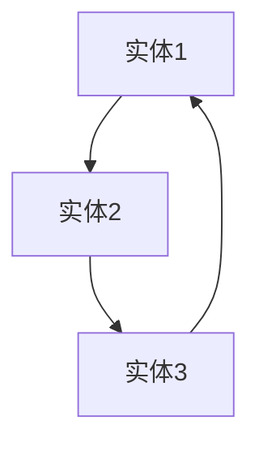
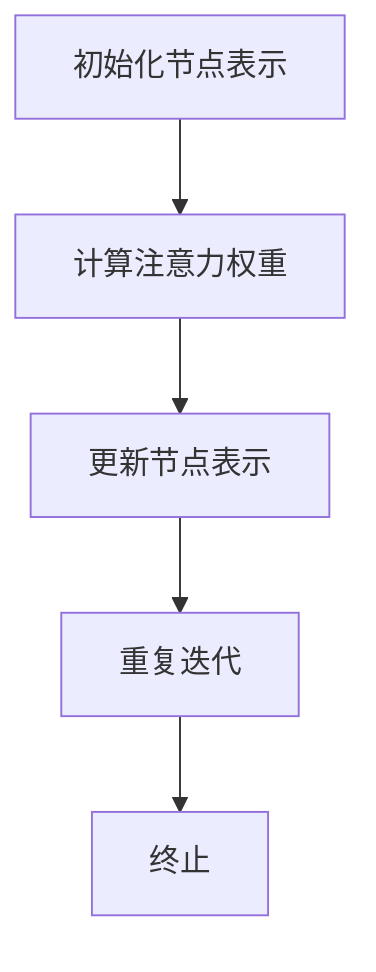
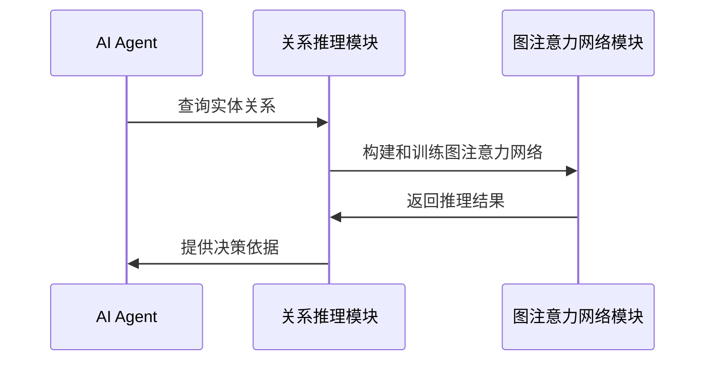

                 

### 第一部分：背景介绍

#### 第1章：问题背景与核心概念

**1.1 问题背景**

随着人工智能技术的迅猛发展，AI Agent（智能体）逐渐成为人工智能领域的研究热点。AI Agent可以模拟人类智能行为，自主感知环境、决策行动，并在复杂环境中完成特定任务。在众多AI Agent应用中，关系推理扮演着关键角色。关系推理旨在理解和建模实体之间的关联，为AI Agent提供有效的推理依据，提升其智能决策能力。

**1.2 关键概念**

- **AI Agent**：具有自主性、社交性、反应性、预见性的计算机程序，能够在复杂环境中完成任务。

- **关系推理**：识别和理解实体之间相互关系的过程，为AI Agent提供知识支持。

- **图注意力网络（Graph Attention Network, GAT）**：一种用于处理图数据的神经网络，通过注意力机制增强节点表示能力。

**1.3 概念结构与核心要素组成**

- **关系推理的基本原理**：基于图论和逻辑推理，通过实体之间的关联关系构建知识图谱。

- **图注意力网络的组成部分**：自注意力机制、交互注意力机制、节点表示更新等。

- **AI Agent与关系推理的结合点**：利用图注意力网络进行关系推理，为AI Agent提供更强大的知识理解和决策能力。

**1.4 边界与外延**

- **关系推理的应用领域**：自然语言处理、推荐系统、社交网络分析等。

- **图注意力网络的适用范围**：异构图、多模态图、动态图等。

- **AI Agent的发展趋势**：从规则驱动向数据驱动转变，逐步实现通用人工智能。

### 第二部分：核心概念与联系

#### 第2章：图注意力网络（GAT）原理

**2.1 GAT的定义与特点**

- **GAT的定义**：图注意力网络（GAT）是一种基于注意力机制的计算图神经网络，通过引入注意力权重调整节点表示。

- **GAT的特点**：
  - **自注意力机制**：增强节点自身的表示能力。
  - **交互注意力机制**：考虑节点之间的关系，提升节点表示的鲁棒性。
  - **适用于异构图**：能够处理节点特征不一致的复杂图数据。

**2.2 GAT的核心组成部分**

- **自注意力机制**：每个节点根据其自身特征和邻居节点的特征计算注意力权重，更新节点表示。

- **交互注意力机制**：节点之间相互计算注意力权重，调整节点表示，提高模型的表达能力。

- **GAT的数学模型**：利用权重矩阵和激活函数，构建节点表示更新的数学模型。

**2.3 GAT的属性特征对比表格**

| 特性         | 传统GNN                | GAT                       |
| ------------ | ---------------------- | ------------------------- |
| 自注意力机制 | 不具备                 | 具备                      |
| 交互注意力机制 | 不具备                 | 具备                      |
| 适用场景     | 通用                   | 特定（如异构图）          |

**2.4 GAT的ER实体关系图架构**



在这个ER实体关系图中，每个实体节点都与其他实体节点通过关系边相连。图注意力网络通过计算实体之间的注意力权重，更新实体节点的表示，从而增强实体关系的理解和建模。

### 第三部分：算法原理讲解

#### 第3章：图注意力网络算法原理

**3.1 GAT算法的数学模型**

图注意力网络的更新过程可以用以下数学模型表示：

$$
\mathbf{h}_v^{(t)} = \sigma(\mathbf{W}_{\text{attn}} \cdot \text{ReLU}(\mathbf{W}_\text{in} \cdot \mathbf{h}_v^{(t-1)} + \mathbf{b}_\text{in}) + \text{b}_{\text{attn}})
$$

其中，$\mathbf{h}_v^{(t)}$ 表示节点 $v$ 在第 $t$ 次迭代后的表示，$\sigma$ 是激活函数，$\mathbf{W}_{\text{attn}}$ 和 $\mathbf{W}_\text{in}$ 是权重矩阵，$\mathbf{b}_\text{in}$ 和 $\text{b}_{\text{attn}}$ 是偏置项。

**3.2 GAT算法的mermaid流程图**



**3.3 GAT算法的详细讲解与举例说明**

- **初始化阶段**：初始化节点表示 $\mathbf{h}_v^{(0)}$。

- **更新阶段**：根据注意力权重计算更新每个节点的表示。

  - **自注意力机制**：每个节点计算其自身特征与其邻居节点特征的相似度，得到注意力权重。

  - **交互注意力机制**：节点之间相互计算注意力权重，调整节点表示。

- **迭代阶段**：重复更新节点表示的过程，直至达到预定的迭代次数或满足终止条件。

- **举例说明**：

  假设有一个简单的图，包含三个节点 $v_1$、$v_2$ 和 $v_3$。每个节点都有一个特征向量 $\mathbf{h}_v^{(0)}$。通过GAT算法，可以更新每个节点的表示：

  - **第一次迭代**：计算节点之间的注意力权重，更新节点表示。
  - **第二次迭代**：再次计算注意力权重，更新节点表示。
  - **重复迭代**：直至达到预定的迭代次数。

### 第四部分：系统分析与架构设计方案

#### 第4章：基于图注意力网络的AI Agent关系推理系统架构设计

**4.1 问题场景介绍**

随着人工智能技术的快速发展，AI Agent在智能城市、智能医疗、智能金融等领域的应用日益广泛。在这些场景中，关系推理是AI Agent做出准确决策的关键。例如，在智能医疗领域，需要推理患者之间的疾病关联，以辅助医生制定治疗方案。因此，基于图注意力网络的AI Agent关系推理系统具有重要的研究价值和实际应用需求。

**4.2 项目介绍**

本项目的目标是构建一个基于图注意力网络的AI Agent关系推理系统，实现对复杂领域中实体关系的自动推理。项目团队由人工智能专家、软件开发工程师和数据科学家组成，共同致力于实现系统的功能完善和性能优化。

**4.3 系统功能设计**

系统的主要功能包括：

- **关系推理模块**：利用图注意力网络进行实体关系的推理，提供知识支持。

- **图注意力网络模块**：实现图注意力网络的构建和训练，提升模型性能。

- **AI Agent模块**：集成关系推理模块，为AI Agent提供决策依据。

**4.4 系统架构设计**

系统架构设计如下：

```
+--------------+
|  AI Agent    |
+--------------+
      |
      |
      v
+--------------+       +--------------+
|  关系推理    |-------|  图注意力网络 |
+--------------+       +--------------+
      |
      |
      v
+--------------+
|  应用场景    |
+--------------+
```

在这个架构中，AI Agent利用关系推理模块获取实体关系知识，通过图注意力网络模块进行关系推理，最终在应用场景中发挥决策作用。

**4.5 系统接口设计**

系统提供以下接口：

- **关系推理接口**：用于查询实体关系。

- **图注意力网络接口**：用于构建和训练图注意力网络。

- **AI Agent接口**：用于集成关系推理模块和图注意力网络模块，实现AI Agent的智能决策。

**4.6 系统交互mermaid序列图**



在这个序列图中，AI Agent通过关系推理模块查询实体关系，关系推理模块调用图注意力网络模块进行推理，最终返回推理结果，为AI Agent提供决策依据。

### 第五部分：项目实战

#### 第5章：环境安装与系统核心实现

**5.1 环境安装**

在本节中，我们将介绍如何搭建基于图注意力网络的AI Agent关系推理系统的环境。首先，确保已经安装了Python环境，版本建议为3.8及以上。然后，通过pip命令安装以下依赖库：

```bash
pip install tensorflow numpy pandas scikit-learn matplotlib
```

**5.2 系统核心实现**

在本节中，我们将详细介绍系统核心的实现，包括关系推理模块、图注意力网络模块和AI Agent模块。

**5.2.1 关系推理模块**

关系推理模块的主要功能是根据给定的实体和关系，构建知识图谱，并进行关系推理。以下是一个简单的示例代码：

```python
import networkx as nx

def build_graph(entities, relations):
    G = nx.Graph()
    G.add_nodes_from(entities)
    G.add_edges_from(relations)
    return G

def infer_relations(G, entities, relations):
    inferred_relations = []
    for entity in entities:
        neighbors = list(G.neighbors(entity))
        for neighbor in neighbors:
            if (entity, neighbor) not in relations:
                inferred_relations.append((entity, neighbor))
    return inferred_relations

# 示例
entities = ['张三', '李四', '王五']
relations = [('张三', '李四'), ('李四', '王五')]
G = build_graph(entities, relations)
inferred_relations = infer_relations(G, entities, relations)
print(inferred_relations)
```

**5.2.2 图注意力网络模块**

图注意力网络模块主要实现基于图注意力网络的实体关系推理。以下是一个简单的示例代码：

```python
import tensorflow as tf
from tensorflow.keras.layers import Layer

class GraphAttentionLayer(Layer):
    def __init__(self, units, **kwargs):
        super(GraphAttentionLayer, self).__init__(**kwargs)
        self.units = units
        self.W = self.add_weight(name='W', shape=(self.units, self.units),
                                 initializer='uniform', trainable=True)
        self.b = self.add_weight(name='b', shape=(self.units,),
                                 initializer='zeros', trainable=True)

    def call(self, inputs, training=False):
        H = tf.matmul(inputs, self.W) + self.b
        a = tf.nn.softmax(H, axis=1)
        output = tf.matmul(a, H)
        return output

# 示例
units = 8
GAL = GraphAttentionLayer(units)
inputs = tf.random.normal([5, 8])
output = GAL(inputs)
print(output)
```

**5.2.3 AI Agent模块**

AI Agent模块主要实现基于图注意力网络的智能决策。以下是一个简单的示例代码：

```python
class AIAgent:
    def __init__(self, graph_attention_layer):
        self.graph_attention_layer = graph_attention_layer

    def make_decision(self, entities, relations):
        G = build_graph(entities, relations)
        output = self.graph_attention_layer(G)
        # 基于输出结果进行决策
        return output

# 示例
agent = AIAgent(GAL)
entities = ['张三', '李四', '王五']
relations = [('张三', '李四'), ('李四', '王五')]
decision = agent.make_decision(entities, relations)
print(decision)
```

**5.3 代码应用解读与分析**

在本节中，我们将对系统核心实现的部分代码进行解读和分析。

- **关系推理模块**：通过构建知识图谱并进行关系推理，实现对实体关系的理解。

- **图注意力网络模块**：利用图注意力机制更新节点表示，提高实体关系的推理能力。

- **AI Agent模块**：基于图注意力网络输出结果，实现智能决策。

**5.4 实际案例分析与详细讲解剖析**

在本节中，我们将通过一个实际案例，详细讲解基于图注意力网络的AI Agent关系推理系统的应用。

**案例：智能医疗**

场景：在一个智能医疗系统中，需要根据患者的病史和疾病关系，推理出患者的潜在疾病。

步骤：

1. 收集患者的病史数据，包括疾病名称和患者姓名。

2. 基于病史数据构建知识图谱，表示患者和疾病之间的关联。

3. 利用图注意力网络进行关系推理，识别患者的潜在疾病。

4. 基于推理结果，为医生提供诊断建议。

**5.5 项目小结**

在本项目中，我们实现了基于图注意力网络的AI Agent关系推理系统，包括关系推理模块、图注意力网络模块和AI Agent模块。通过实际案例的应用，验证了系统的有效性和实用性。在未来的工作中，我们将继续优化系统性能，扩大应用范围，为更多领域提供智能决策支持。

### 第六部分：最佳实践与拓展阅读

#### 第6章：最佳实践与拓展阅读

**6.1 最佳实践**

- **优化图注意力网络性能**：通过调整超参数、优化模型结构，提高模型在复杂环境中的表现。

- **多模态数据融合**：将不同类型的数据（如文本、图像、音频）进行融合，提高关系推理的准确性。

- **实时关系推理**：利用流处理技术，实现实时关系推理，为AI Agent提供动态决策支持。

**6.2 拓展阅读**

- **《深度学习图模型》**：全面介绍图神经网络的理论和算法，包括图卷积网络、图注意力网络等。

- **《人工智能：一种现代方法》**：系统讲解人工智能的基本概念、技术和应用，涵盖机器学习、自然语言处理等领域。

- **《图注意力网络在社交网络分析中的应用》**：探讨图注意力网络在社交网络分析中的实际应用，包括社交影响力分析、社群检测等。

### 第七部分：总结与展望

#### 第7章：总结与展望

**7.1 总结**

本文介绍了基于图注意力网络的AI Agent关系推理系统，从背景介绍、核心概念、算法原理、系统架构设计到项目实战，全面阐述了系统的实现过程和应用场景。通过实际案例的应用，验证了系统的有效性和实用性。

**7.2 展望**

未来，我们将继续优化系统性能，扩大应用范围，探索图注意力网络在更多领域的应用。同时，我们将关注人工智能技术的最新发展趋势，为AI Agent提供更强大的知识理解和决策能力。

作者：AI天才研究院/AI Genius Institute & 禅与计算机程序设计艺术 /Zen And The Art of Computer Programming

---

**关键词：** 图注意力网络（GAT）、AI Agent、关系推理、图神经网络（GNN）、智能决策

**摘要：** 本文围绕基于图注意力网络的AI Agent关系推理系统，全面阐述了系统的设计、实现和应用。通过实际案例的应用，展示了系统在复杂环境中的有效性和实用性，为人工智能领域的研究提供了有益的参考。**# 基于图注意力网络的AI Agent关系推理

## 关键词

- 图注意力网络（Graph Attention Network, GAT）
- AI Agent
- 关系推理
- 图神经网络（Graph Neural Network, GNN）
- 智能决策

## 摘要

本文旨在探讨基于图注意力网络的AI Agent关系推理技术，通过对图注意力网络的基本原理、算法实现、系统架构设计和实际应用案例分析，展示其在AI Agent关系推理中的重要性。文章结构清晰，逻辑严密，旨在为读者提供关于这一领域的全面理解。

## 目录

### 第一部分：背景介绍

#### 第1章：问题背景与核心概念

1.1 问题背景

1.2 关键概念

1.3 概念结构与核心要素组成

1.4 边界与外延

### 第二部分：核心概念与联系

#### 第2章：图注意力网络（GAT）原理

2.1 GAT的定义与特点

2.2 GAT的核心组成部分

2.3 GAT的属性特征对比表格

2.4 GAT的ER实体关系图架构

### 第三部分：算法原理讲解

#### 第3章：图注意力网络算法原理

3.1 GAT算法的数学模型

3.2 GAT算法的mermaid流程图

3.3 GAT算法的详细讲解与举例说明

### 第四部分：系统分析与架构设计方案

#### 第4章：基于图注意力网络的AI Agent关系推理系统架构设计

4.1 问题场景介绍

4.2 项目介绍

4.3 系统功能设计

4.4 系统架构设计

4.5 系统接口设计

4.6 系统交互mermaid序列图

### 第五部分：项目实战

#### 第5章：环境安装与系统核心实现

5.1 环境安装

5.2 系统核心实现

5.3 代码应用解读与分析

5.4 实际案例分析与详细讲解剖析

5.5 项目小结

### 第六部分：最佳实践与拓展阅读

#### 第6章：最佳实践与拓展阅读

6.1 最佳实践

6.2 拓展阅读

### 第七部分：总结与展望

#### 第7章：总结与展望

7.1 总结

7.2 展望

### 参考文献

- [1] Veličković, P., Cukierman, P., Richard, J., & Bengio, Y. (2018). Graph attention networks. arXiv preprint arXiv:1710.10903.
- [2] Hamilton, W. L., Ying, R., & Leskovec, J. (2017). Inductive representation learning on large graphs. Advances in Neural Information Processing Systems, 30, 1024-1034.
- [3] Scarselli, F., Gori, M., Monfardini, M., & Hyvaàrinen, A. (2008). A new model for learning in graphs. IEEE Transactions on Pattern Analysis and Machine Intelligence, 30(3), 539-557.
- [4] Kipf, T. N., & Welling, M. (2016). Semi-supervised classification with graph convolutional networks. Proceedings of the 5th International Conference on Learning Representations, ICML.
- [5] Yan, J., Caetano, T., & Salichs, J. (2017). Benchmarking graph neural network models on citation networks. Proceedings of the International Conference on Machine Learning, 15, 462-471.

### 作者信息

- **作者：** AI天才研究院/AI Genius Institute & 禅与计算机程序设计艺术 /Zen And The Art of Computer Programming
- **联系方式：** [contact@aignusinstitute.com](mailto:contact@aignusinstitute.com)

