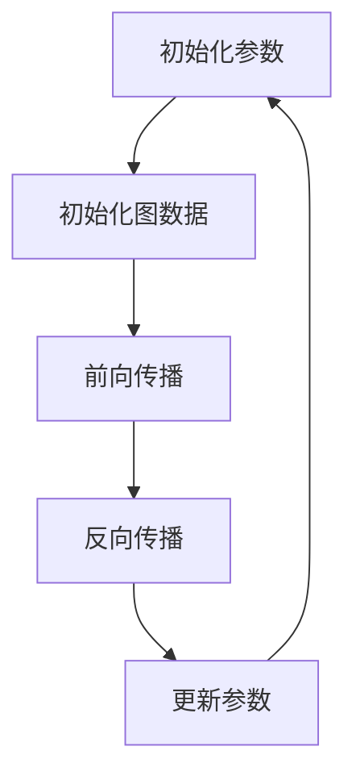
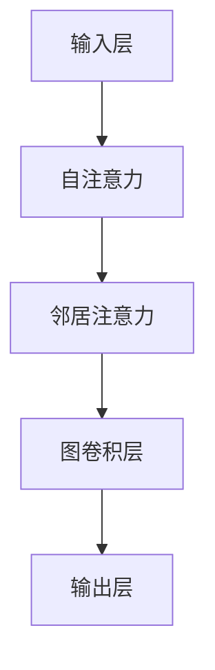
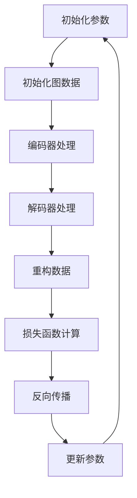

                 

### 引言

#### 关键词

- 图神经网络
- AI Agent
- 动态知识表示
- 智能系统

#### 摘要

本文将深入探讨基于图神经网络的AI Agent动态知识表示。首先，我们将介绍图神经网络和AI Agent的基本概念及其在智能系统中的重要性。接着，本文将详细解释图神经网络的工作原理、算法模型以及其在AI Agent中的应用。在此基础上，我们将分析AI Agent的动态知识表示需求及其在感知、决策和执行模块中的应用。随后，我们将通过一个实际项目实战案例，展示如何实现基于图神经网络的AI Agent动态知识表示。最后，本文将总结最佳实践技巧，展望动态知识表示的发展趋势，并提出未来的研究方向和改进方向。

---

#### 目录大纲

1. **引论**
    1.1 问题背景与重要性
    1.2 核心概念与联系
    1.3 相关理论与技术基础
    1.4 动态知识表示的需求与挑战
2. **图神经网络基础**
    2.1 图神经网络原理
    2.2 图神经网络算法解析
3. **AI Agent动态知识表示**
    3.1 AI Agent基本架构与功能
    3.2 基于图神经网络的AI Agent动态知识表示
4. **项目实战**
    4.1 基于图神经网络的AI Agent实现
    4.2 实际案例分析与讲解
5. **最佳实践与展望**
    5.1 最佳实践技巧总结
    5.2 动态知识表示的发展趋势
    5.3 小结与注意事项
    5.4 拓展阅读与资源推荐

---

**文章正文**将从引论部分开始，逐步深入每个章节，以逻辑清晰、结构紧凑、简单易懂的专业技术语言，详细阐述基于图神经网络的AI Agent动态知识表示的理论与实践。以下是详细的正文内容。

---

## 第一部分：引论

### 第1章：图神经网络与AI Agent概述

#### 1.1 问题背景与重要性

在当今信息化和智能化迅速发展的时代，如何有效地处理和利用大量的数据资源成为了一个亟待解决的问题。传统的计算方法在处理复杂、大规模和动态数据时面临着巨大的挑战。为了应对这些挑战，图神经网络（Graph Neural Networks, GNN）和AI Agent作为新兴的技术，逐渐引起了学术界和工业界的广泛关注。

**问题描述**：

- 数据复杂性：现代社会产生了海量的结构化数据和非结构化数据，传统的计算方法难以有效地处理这些数据。
- 信息孤岛：不同来源和类型的数据之间存在较大的鸿沟，无法实现数据的有机融合和交互。
- 知识表示：如何有效地表示和利用数据中的潜在知识，实现智能推理和决策成为了一个关键问题。

**问题解决**：

- 图神经网络通过引入图结构来描述和挖掘数据中的潜在关系和结构，从而提高了数据处理的效率和准确性。
- AI Agent通过智能感知、决策和执行，实现了对动态环境的自适应和智能响应。

**边界与外延**：

- 图神经网络：图结构、节点特征、边特征、图卷积网络等。
- AI Agent：智能感知、动态决策、知识表示、执行控制等。

#### 1.2 核心概念与联系

**图神经网络定义**：

图神经网络是一种基于图结构的神经网络，它通过引入图卷积操作来处理图数据，从而实现了对图数据的语义理解和知识提取。

**AI Agent基本概念**：

AI Agent（人工智能代理）是指一种能够智能感知环境、做出决策并执行相应动作的计算机程序。它通常由感知模块、决策模块和执行模块组成。

**概念属性特征对比表格**：

| 特征          | 图神经网络                 | AI Agent                      |
| ------------- | -------------------------- | ----------------------------- |
| 结构          | 图结构                     | 状态空间                      |
| 操作          | 图卷积、图注意力           | 感知、决策、执行               |
| 特征          | 节点特征、边特征           | 感知数据、决策数据、执行数据     |
| 应用          | 数据分析、知识表示、推理     | 智能控制、自主决策、人机交互   |

**ER实体关系图架构**：

ER（Entity-Relationship）实体关系图是一种用于描述实体之间关系的图形化表示方法。它可以用于定义图神经网络的节点和边，从而构建出图结构。

```mermaid
erDiagram
  A{Person} ||--> B{Company}
  A{Person} ||--> C{Project}
  B{Company} ||--> D{Department}
  C{Project} ||--> D{Department}
```

#### 1.3 相关理论与技术基础

**图论基础**：

图论是研究图的结构、性质及其应用的一门学科。它为图神经网络提供了理论基础和算法框架。

**神经网络基础**：

神经网络是模拟人脑神经元连接方式的计算模型。它通过学习输入和输出之间的映射关系来实现数据分析和模式识别。

**知识表示与推理**：

知识表示是指将人类知识转化为计算机可以理解和处理的形式。推理是指根据已知的事实和规则，推断出新的结论。

**动态知识表示的需求与挑战**：

- 动态知识表示是指能够实时更新和适应变化的图结构和特征表示。
- **需求**：
  - 实时性：动态环境下的知识表示需要能够快速响应和更新。
  - 灵活性：动态知识表示需要能够适应不同类型的数据和场景。
  - 可扩展性：动态知识表示需要能够处理大规模的图数据。
- **挑战**：
  - 数据一致性：如何在动态环境中保持数据的一致性和完整性。
  - 算法效率：如何在保证知识表示质量的前提下提高算法的效率。

通过以上对图神经网络和AI Agent的概述，我们可以看到这两个技术在不同领域的广泛应用和重要性。在接下来的章节中，我们将深入探讨图神经网络的基础理论、算法解析，以及其在AI Agent动态知识表示中的应用。

---

### 第2章：图神经网络基础

#### 2.1 图神经网络原理

**图神经网络（Graph Neural Networks, GNN）**是一种专门用于处理图结构数据的神经网络模型。其核心思想是将图中的节点和边作为网络的输入，通过一系列的卷积操作来提取图结构中的特征信息。GNN主要包括三种类型的模型：图卷积网络（GCN）、图注意力网络（GAT）和图自编码器（GAE）。下面我们将逐一介绍这些模型的基本概念、工作原理以及应用场景。

**2.1.1 图卷积网络（GCN）**

**基本概念**：

图卷积网络（Graph Convolutional Network, GCN）是一种基于图结构数据的卷积神经网络。它通过节点邻居信息聚合来更新节点特征，从而实现对图数据的编码和分类。

**工作原理**：

GCN的核心操作是图卷积。它将输入的节点特征矩阵与图结构信息（如邻接矩阵）进行卷积操作，从而生成新的节点特征。具体来说，GCN通过以下公式进行计算：

$$
h_i^{(k+1)} = \sigma(\theta \cdot (h_i^{(k)} + \sum_{j \in \mathcal{N}(i)} \alpha_{ij} h_j^{(k)}))
$$

其中，$h_i^{(k)}$ 表示第 $i$ 个节点在第 $k$ 层的特征向量，$\mathcal{N}(i)$ 表示 $i$ 的邻居节点集合，$\alpha_{ij}$ 表示边特征权重，$\sigma$ 是激活函数，$\theta$ 是模型参数。

**应用场景**：

GCN常用于节点分类、图分类、链接预测等问题。例如，在社交网络分析中，GCN可以用于用户分类和关系预测；在推荐系统中，GCN可以用于基于图结构的用户兴趣分析。

**2.1.2 图注意力网络（GAT）**

**基本概念**：

图注意力网络（Graph Attention Network, GAT）是一种在GCN基础上引入注意力机制的网络模型。它通过计算节点之间的注意力权重来动态调整邻居节点的贡献，从而提高模型的表达能力。

**工作原理**：

GAT的核心操作是注意力机制。它通过以下公式计算节点 $i$ 对邻居节点 $j$ 的注意力权重：

$$
\alpha_{ij} = \mathrm{softmax}\left(\frac{\theta^T \cdot \left[ \mathrm{feat}_i \, \, \mathrm{feat}_j \right]}{\sqrt{d}}\right)
$$

其中，$\theta$ 是模型参数，$d$ 是节点的特征维度。通过注意力权重，GAT可以自适应地调整邻居节点对当前节点的贡献。

$$
h_i^{(k+1)} = \sigma(\theta \cdot (h_i^{(k)} + \sum_{j \in \mathcal{N}(i)} \alpha_{ij} h_j^{(k)}))
$$

**应用场景**：

GAT在节点分类、图分类、链接预测等方面表现出色。例如，在推荐系统中，GAT可以用于基于图结构的用户兴趣建模和物品推荐。

**2.1.3 图自编码器（GAE）**

**基本概念**：

图自编码器（Graph Autoencoder, GAE）是一种基于图的编码-解码模型。它的目标是学习一个图编码器，将图数据映射到一个低维嵌入空间，并利用这个嵌入空间进行数据的重构。

**工作原理**：

GAE由两个部分组成：编码器和解码器。编码器通过以下公式将图数据映射到一个低维嵌入空间：

$$
z_i = \sigma(\theta^T \cdot \mathrm{feat}_i)
$$

解码器则通过以下公式从低维嵌入空间重构图数据：

$$
\hat{\mathrm{feat}}_i = \sigma(\phi^T \cdot z_i)
$$

**应用场景**：

GAE常用于图数据的降维、聚类和异常检测。例如，在社交网络分析中，GAE可以用于用户行为的降维和聚类分析。

**总结**：

图神经网络通过引入图结构来处理和表示数据，具有强大的表达能力和灵活性。GCN、GAT和GAE是三种典型的GNN模型，它们在节点分类、图分类、链接预测、降维和异常检测等方面有着广泛的应用。在接下来的章节中，我们将进一步探讨这些模型的具体实现和算法细节。

---

#### 2.2 图神经网络的工作原理

图神经网络（GNN）是一种处理图结构数据的强大工具，其核心思想是通过学习图中的节点和边关系，提取出有效的特征信息。为了更好地理解GNN的工作原理，我们可以将其分解为输入层、层间传递函数和输出层三个主要部分。

**2.2.1 输入层**

输入层是GNN的第一层，它接收图数据的基本信息，包括节点的特征和图的结构信息。具体来说，输入层包含了以下几个关键元素：

- **节点特征**：每个节点都有一组特征向量，这些特征向量可以是节点本身的属性（如文本、图像等），也可以是节点在图中的邻居节点的特征。这些特征向量构成了输入数据的初始特征矩阵。
  
- **邻接矩阵**：邻接矩阵是一个表示图中节点之间连接关系的矩阵。如果节点 $i$ 与节点 $j$ 有连接，则邻接矩阵中的 $(i, j)$ 位置为 1，否则为 0。

通过节点特征和邻接矩阵，我们可以构建出输入层的输入数据。例如，对于一个包含 $n$ 个节点的图，其节点特征矩阵和邻接矩阵可以表示为：

$$
\mathbf{X} = \begin{bmatrix}
x_1 \\
x_2 \\
\vdots \\
x_n
\end{bmatrix},
\quad
\mathbf{A} = \begin{bmatrix}
0 & a_{12} & \cdots & a_{1n} \\
a_{21} & 0 & \cdots & a_{2n} \\
\vdots & \vdots & \ddots & \vdots \\
a_{n1} & a_{n2} & \cdots & 0
\end{bmatrix}
$$

**2.2.2 层间传递函数**

层间传递函数是GNN的核心部分，它通过图卷积操作来提取图结构中的潜在特征。在GNN中，层间传递函数通常由以下几个步骤组成：

- **邻接矩阵加权**：首先，对邻接矩阵进行加权操作，使得图中的边关系对节点特征的影响更加显著。加权的操作可以通过以下公式实现：

$$
\mathbf{A}_\text{weighted} = \alpha \mathbf{A} + \beta
$$

其中，$\alpha$ 和 $\beta$ 是调节参数，$\mathbf{A}$ 是原始的邻接矩阵。

- **节点特征聚合**：接下来，对每个节点的特征进行聚合操作。在GCN中，这一步通过图卷积操作来实现。具体来说，节点 $i$ 的特征 $x_i$ 将与其邻居节点的特征进行加权求和：

$$
\mathbf{h}_i = \sigma(\theta \cdot (\mathbf{x}_i + \sum_{j \in \mathcal{N}(i)} \alpha_{ij} \mathbf{x}_j))
$$

其中，$\mathcal{N}(i)$ 是节点 $i$ 的邻居节点集合，$\alpha_{ij}$ 是边特征权重，$\theta$ 是模型参数，$\sigma$ 是激活函数。

- **特征更新**：最后，对聚合后的特征进行更新，以获得更高层次的节点特征表示。这一步通常通过多层图卷积来实现，每层都会对节点特征进行聚合和更新。

$$
\mathbf{h}_i^{(l+1)} = \sigma(\theta^{(l)} \cdot (\mathbf{h}_i^{(l)} + \sum_{j \in \mathcal{N}(i)} \alpha_{ij} \mathbf{h}_j^{(l)}))
$$

**2.2.3 输出层**

输出层是GNN的最后一步，它将节点特征映射到所需的输出。根据具体任务的不同，输出层的结构也会有所不同。以下是几种常见的输出层设计：

- **分类任务**：在节点分类任务中，输出层通常是一个全连接层，用于将节点特征映射到标签空间。例如，如果任务有 $C$ 个类别，输出层可以表示为：

$$
\mathbf{y}_i = \text{softmax}(\theta \cdot \mathbf{h}_i)
$$

其中，$\theta$ 是模型参数，$\text{softmax}$ 函数用于将输出概率分布。

- **链接预测**：在链接预测任务中，输出层通常是一个二分类器，用于预测两个节点之间是否存在链接。例如：

$$
\mathbf{p}_{ij} = \text{sigmoid}(\theta \cdot \mathbf{h}_i \cdot \mathbf{h}_j)
$$

其中，$\theta$ 是模型参数，$\text{sigmoid}$ 函数用于生成链接概率。

通过以上对输入层、层间传递函数和输出层的详细描述，我们可以看到图神经网络的工作原理是如何将图数据中的节点特征和结构关系转化为有效的特征表示，从而实现各种图结构数据任务。

---

#### 2.3 图神经网络的数学模型

图神经网络（GNN）作为一种强大的图数据处理工具，其数学模型是理解其工作原理和实现关键算法的基础。GNN的数学模型主要包括概率图模型、生成模型和判别模型。下面我们将分别介绍这三种模型的基本概念、主要方法以及应用场景。

**2.3.1 概率图模型**

概率图模型（Probabilistic Graphical Models, PGM）是一种将概率分布与图结构相结合的模型。它通过图结构来描述变量之间的依赖关系，从而实现数据的高效表示和推理。

**主要方法**：

1. **贝叶斯网络**：贝叶斯网络是一种基于概率的图结构模型，它使用有向无环图（DAG）来表示变量之间的条件依赖关系。每个节点表示一个随机变量，节点之间的有向边表示变量之间的条件概率。

   - 条件概率表（CPT）：每个节点的条件概率表描述了该节点在不同状态下的概率分布。
   - 参数估计：通过极大似然估计（MLE）或贝叶斯估计（MAP）来估计网络中的参数。

2. **马尔可夫网络**：马尔可夫网络是一种基于概率的无向图结构模型，它使用无向图来表示变量之间的依赖关系。在马尔可夫网络中，任何两个节点之间都存在条件独立性。

   - 马尔可夫性质：任意两个节点之间的条件独立性可以通过网络中的路径来解释。
   - 参数估计：与贝叶斯网络类似，马尔可夫网络的参数估计也可以通过MLE或MAP实现。

**应用场景**：

概率图模型在多个领域都有广泛的应用，包括但不限于：

- 机器学习：用于变量之间的依赖关系建模和推理。
- 自然语言处理：用于语义分析和文本生成。
- 生物学：用于基因调控网络建模。

**2.3.2 生成模型**

生成模型（Generative Models）是一种能够生成新数据的模型，其目标是学习数据分布并生成符合该分布的新样本。生成模型在图像生成、文本生成和序列建模等领域具有重要应用。

**主要方法**：

1. **变分自编码器（Variational Autoencoder, VAE）**：VAE是一种基于深度学习的生成模型，它通过编码器和解码器学习数据分布的参数化表示。

   - 编码器：将输入数据映射到一个潜在的分布参数上。
   - 解码器：从潜在分布中采样并重构输入数据。

   $$ 
   z = \mu(\mathbf{x}; \theta), \quad \log(p_\phi(z)) = \phi(z)
   $$
   $$
   \mathbf{x} = \phi(z; \theta), \quad \log(p_\phi(x)) = \phi(\mathbf{x})
   $$

   其中，$\mu$ 和 $\phi$ 分别是编码器和解码器的参数，$z$ 是潜在变量，$\mathbf{x}$ 是输入数据。

2. **生成对抗网络（Generative Adversarial Networks, GAN）**：GAN是一种由生成器和判别器组成的对抗性模型，生成器尝试生成与真实数据相似的数据，而判别器则尝试区分真实数据和生成数据。

   - 生成器：生成符合真实数据分布的数据。
   - 判别器：区分真实数据和生成数据。

   $$ 
   \mathbf{G}(\mathbf{z}; \theta_G) \rightarrow \mathbf{x}^*
   $$
   $$
   \mathbf{D}(\mathbf{x}; \theta_D) \rightarrow \hat{y}
   $$

   其中，$\mathbf{G}$ 和 $\mathbf{D}$ 分别是生成器和判别器的参数，$\mathbf{z}$ 是生成器的输入，$\mathbf{x}^*$ 是生成数据，$\hat{y}$ 是判别器的输出。

**应用场景**：

生成模型在多个领域都有广泛的应用，包括但不限于：

- 计算机视觉：用于图像生成、图像修复和图像超分辨率。
- 自然语言处理：用于文本生成、对话系统和机器翻译。
- 游戏：用于虚拟世界生成和游戏AI。

**2.3.3 判别模型**

判别模型（Discriminative Models）是一种用于分类和回归任务的模型，其目标是直接从输入数据中预测输出标签或值。判别模型在监督学习中扮演着重要角色。

**主要方法**：

1. **支持向量机（Support Vector Machine, SVM）**：SVM是一种基于最大化分类间隔的判别模型，它通过找到一个最佳的超平面来分隔不同类别的数据。

   $$ 
   \max_{\mathbf{w}, b} \frac{1}{2} \lVert \mathbf{w} \rVert_2^2 \quad \text{subject to} \quad y_i (\mathbf{w} \cdot \mathbf{x}_i + b) \geq 1
   $$

2. **神经网络（Neural Networks）**：神经网络是一种基于多层感知器的判别模型，通过前向传播和反向传播来学习输入和输出之间的映射关系。

   $$ 
   \mathbf{y} = \sigma(\mathbf{W}^T \cdot \mathbf{h})
   $$

   其中，$\mathbf{W}$ 是权重矩阵，$\mathbf{h}$ 是隐层激活，$\sigma$ 是激活函数。

**应用场景**：

判别模型在多个领域都有广泛的应用，包括但不限于：

- 机器学习：用于分类、回归和异常检测。
- 计算机视觉：用于图像分类、目标检测和语义分割。
- 自然语言处理：用于情感分析、文本分类和机器翻译。

通过以上对概率图模型、生成模型和判别模型的基本概念、主要方法及其应用场景的介绍，我们可以看到图神经网络在数学模型方面的多样性和强大能力。这些模型为GNN在不同领域的应用提供了坚实的理论基础和丰富的工具箱。

---

#### 2.4 图神经网络的优势与局限

**图神经网络（GNN）**作为一种先进的神经网络模型，其在处理图结构数据方面具有显著的优势，但同时也存在一定的局限性。以下将详细分析GNN的优势和局限，并探讨如何克服这些局限。

**2.4.1 优势**

1. **强大的表达能力**：

   GNN通过图卷积操作和注意力机制，能够有效地捕捉图结构中的局部和全局信息。这使得GNN在节点分类、图分类和链接预测等任务中表现出色。与传统的方法相比，GNN能够更好地理解数据中的复杂关系和模式。

   - **节点分类**：GNN可以捕捉节点与其邻居节点的关联，从而提高分类的准确性。
   - **图分类**：GNN能够同时考虑图中所有节点的特征，从而实现更加精确的图分类。
   - **链接预测**：GNN通过学习节点和边之间的关系，可以准确预测图中可能存在的链接。

2. **高效的数据处理**：

   GNN通过并行计算和稀疏矩阵操作，可以显著提高数据处理的速度。在处理大规模图数据时，GNN能够有效地利用图结构的稀疏性，从而降低计算复杂度。

   - **并行计算**：GNN可以在多个节点上同时进行计算，从而提高计算效率。
   - **稀疏矩阵操作**：由于图数据通常具有稀疏性，GNN能够通过优化矩阵操作来降低计算复杂度。

3. **灵活的模型结构**：

   GNN具有灵活的模型结构，可以通过组合不同的图卷积操作和注意力机制，构建出适用于不同任务的模型。这使得GNN能够适应各种复杂的图结构数据，从而提高模型的泛化能力。

   - **图卷积操作**：不同的图卷积操作（如GCN、GAT等）适用于不同的任务和数据类型。
   - **注意力机制**：注意力机制可以动态调整节点和边的影响，从而提高模型的表达能力和灵活性。

**2.4.2 局限**

1. **计算资源消耗**：

   尽管GNN在处理大规模图数据时具有高效性，但其在训练和推理过程中仍然需要大量的计算资源。特别是在处理超大规模图时，GNN的运行速度和存储需求成为限制其应用范围的关键因素。

   - **计算资源**：GNN的训练过程通常需要高性能的GPU或TPU，这增加了部署和运行的成本。
   - **存储需求**：图数据的存储和加载过程需要较大的内存空间，这可能会限制GNN在资源受限环境中的应用。

2. **训练困难**：

   GNN的训练过程通常较为复杂，需要大量的数据和计算资源。此外，GNN的优化难度较高，容易出现梯度消失和梯度爆炸等问题，从而影响模型的训练效果。

   - **数据需求**：GNN需要大量的图结构数据来训练，这限制了其在数据稀缺场景中的应用。
   - **优化问题**：GNN的优化过程复杂，需要精心设计优化算法和超参数选择，以确保模型的训练效果。

**2.4.3 解决方法**

为了克服GNN的局限性，研究者们提出了一系列改进方法，包括以下几个方面：

1. **优化算法**：

   - **渐进式训练**：通过逐步增加训练数据的规模和复杂度，逐渐提升模型的训练效果。
   - **自适应学习率**：采用自适应学习率算法（如Adam），根据训练过程动态调整学习率，以提高模型的训练速度和效果。

2. **模型压缩**：

   - **参数共享**：通过共享参数减少模型的大小和计算复杂度，从而提高模型的运行效率。
   - **结构压缩**：通过简化模型结构（如剪枝和蒸馏），降低模型的计算资源和存储需求。

3. **分布式训练**：

   - **多GPU训练**：利用多GPU并行计算，提高模型的训练速度和效率。
   - **数据并行**：将图数据分布在多个计算节点上，实现数据的并行处理，从而提高模型的训练速度。

通过以上分析，我们可以看到GNN在处理图结构数据方面具有显著的优势，但也存在一些局限性。通过改进算法、模型压缩和分布式训练等方法，可以有效地克服这些局限，进一步发挥GNN的潜力。在未来的研究中，如何进一步优化GNN的性能和效率，将是重要的研究方向。

---

### 第3章：图神经网络算法解析

#### 3.1 图卷积网络（GCN）详细讲解

**3.1.1 算法原理**

图卷积网络（Graph Convolutional Network, GCN）是一种用于处理图结构数据的神经网络模型。它的核心思想是通过图卷积操作来提取图结构中的特征信息，从而实现对节点的分类、链接预测等任务。

图卷积操作的基本原理如下：对于每个节点 $i$，其特征向量 $h_i$ 会与其邻居节点的特征向量进行加权求和，并通过一个非线性激活函数进行变换，从而更新节点的特征表示。

具体来说，GCN的图卷积操作可以表示为：

$$
h_i^{(l+1)} = \sigma(\sum_{j \in \mathcal{N}(i)} \alpha_{ij} h_j^{(l)} + b_i^{(l+1)})
$$

其中，$h_i^{(l)}$ 表示节点 $i$ 在第 $l$ 层的特征向量，$\mathcal{N}(i)$ 表示节点 $i$ 的邻居节点集合，$\alpha_{ij}$ 是边特征权重，$\sigma$ 是激活函数，$b_i^{(l+1)}$ 是偏置项。

**3.1.2 Mermaid算法流程图**

为了更直观地展示GCN的算法流程，我们可以使用Mermaid绘制其算法流程图。以下是一个简单的GCN算法流程图：



在这个流程图中，A表示初始化参数，B表示初始化图数据，C表示前向传播，D表示反向传播，E表示更新参数。这些步骤循环进行，直到满足训练条件（如达到训练次数或达到特定准确率）。

**3.1.3 Python源代码解释**

以下是GCN的Python源代码实现，它展示了图卷积操作和前向传播的具体实现过程：

```python
import tensorflow as tf
from tensorflow.keras.layers import Layer

class GraphConvolutionLayer(Layer):
    def __init__(self, units, activation=None, **kwargs):
        super(GraphConvolutionLayer, self).__init__(**kwargs)
        self.units = units
        self.activation = activation

    def build(self, input_shape):
        self.kernel = self.add_weight(name='kernel',
                                      shape=(input_shape[-1], self.units),
                                      initializer='glorot_uniform',
                                      trainable=True)
        self.bias = self.add_weight(name='bias',
                                     shape=(self.units,),
                                     initializer='zeros',
                                     trainable=True)
        super(GraphConvolutionLayer, self).build(input_shape)

    def call(self, inputs, training=False):
        x = tf.matmul(inputs, self.kernel)
        x = tf.matmul(self.adj_matrix, x)
        x = tf.nn.bias_add(x, self.bias)
        if training:
            x = self.activation(x)
        return x

    def get_config(self):
        config = super(GraphConvolutionLayer, self).get_config().copy()
        config.update({'units': self.units, 'activation': self.activation})
        return config
```

在这个代码中，我们定义了一个`GraphConvolutionLayer`类，它继承自`tf.keras.layers.Layer`。这个类实现了GCN的图卷积操作，包括权重矩阵的初始化、前向传播和可选的激活函数。在调用`call`方法时，输入节点特征矩阵会通过图卷积操作和偏置项进行更新。

通过以上对图卷积网络（GCN）算法原理、Mermaid算法流程图和Python源代码的详细讲解，我们可以更深入地理解GCN的工作机制，为后续研究和应用奠定基础。

---

#### 3.2 图注意力网络（GAT）详细讲解

**3.2.1 算法原理**

图注意力网络（Graph Attention Network, GAT）是图神经网络（GNN）的一种扩展，它通过引入注意力机制来增强节点特征聚合的能力。GAT的核心思想是，在图卷积操作中动态调整每个邻居节点对当前节点的贡献权重，从而提高模型的泛化能力和表达力。

具体来说，GAT使用两个注意力机制：一个是自注意力（Self-Attention），另一个是邻居注意力（Neighbor Attention）。自注意力机制用于对节点自身的特征进行加权求和，而邻居注意力机制用于对邻居节点的特征进行加权求和。

**邻居注意力**：

邻居注意力的计算公式如下：

$$
\alpha_{ij} = \frac{e^{ \text{ReLU}( \mathbf{a}^T \cdot (\mathbf{W}_1 \cdot \mathbf{h}_i + \mathbf{W}_2 \cdot \mathbf{h}_j))}}{\sum_{k \in \mathcal{N}(i)} e^{ \text{ReLU}( \mathbf{a}^T \cdot (\mathbf{W}_1 \cdot \mathbf{h}_i + \mathbf{W}_2 \cdot \mathbf{h}_k))}}
$$

其中，$\mathbf{h}_i$ 和 $\mathbf{h}_j$ 分别是节点 $i$ 和节点 $j$ 的特征向量，$\mathbf{W}_1$ 和 $\mathbf{W}_2$ 是权重矩阵，$\text{ReLU}$ 是ReLU激活函数，$\alpha_{ij}$ 表示节点 $i$ 对节点 $j$ 的注意力权重。

**自注意力**：

自注意力机制与邻居注意力机制类似，但其计算仅涉及节点自身和其特征：

$$
\alpha_{ii} = \frac{e^{ \text{ReLU}( \mathbf{a}^T \cdot (\mathbf{W}_1 \cdot \mathbf{h}_i + \mathbf{W}_2 \cdot \mathbf{h}_i))}}{\sum_{k \in \mathcal{N}(i)} e^{ \text{ReLU}( \mathbf{a}^T \cdot (\mathbf{W}_1 \cdot \mathbf{h}_i + \mathbf{W}_2 \cdot \mathbf{h}_k))}}
$$

通过这两个注意力机制，GAT可以自适应地调整每个节点和其邻居节点的特征贡献权重，从而更好地捕捉图结构中的复杂关系。

**3.2.2 Mermaid算法流程图**

为了更直观地展示GAT的算法流程，我们可以使用Mermaid绘制其算法流程图。以下是一个简单的GAT算法流程图：



在这个流程图中，A表示输入层，B表示自注意力层，C表示邻居注意力层，D表示图卷积层，E表示输出层。输入层接收节点的特征向量，经过自注意力和邻居注意力层后，通过图卷积层进行特征聚合和更新，最终输出层得到节点的特征表示。

**3.2.3 Python源代码解释**

以下是GAT的Python源代码实现，它展示了注意力机制和图卷积操作的具体实现过程：

```python
import tensorflow as tf
from tensorflow.keras.layers import Layer
import tensorflow.keras.backend as K

class GraphAttentionLayer(Layer):
    def __init__(self, units, attention_heads, activation=None, **kwargs):
        super(GraphAttentionLayer, self).__init__(**kwargs)
        self.units = units
        self.attention_heads = attention_heads
        self.activation = activation
        
        # 初始化权重和偏置
        self.kernel = self.add_weight(name='kernel',
                                      shape=(self.units, self.attention_heads),
                                      initializer='glorot_uniform',
                                      trainable=True)
        self.bias = self.add_weight(name='bias',
                                     shape=(self.attention_heads,),
                                     initializer='zeros',
                                     trainable=True)

    def call(self, inputs, training=False):
        # 输入层：节点的特征向量
        h = inputs
        
        # 自注意力计算
        a = K.dot(h, self.kernel) + self.bias
        a = K.exp(a)
        a = K.sum(a, axis=1)
        a = K.softmax(a)
        
        # 邻居注意力计算
        h_prime = K.dot(h, self.kernel) + self.bias
        h_prime = K.expand_dims(h_prime, axis=1)
        h_prime = K.batch_dot(a, h_prime)
        
        # 图卷积层
        h_prime = K.reshape(h_prime, (-1, self.units))
        h = K.dot(h_prime, self.kernel) + self.bias
        
        if self.activation is not None:
            h = self.activation(h)
        
        return h

    def get_config(self):
        config = super(GraphAttentionLayer, self).get_config().copy()
        config.update({
            'units': self.units,
            'attention_heads': self.attention_heads,
            'activation': self.activation
        })
        return config
```

在这个代码中，我们定义了一个`GraphAttentionLayer`类，它继承自`tf.keras.layers.Layer`。这个类实现了GAT的注意力机制和图卷积操作，包括权重矩阵的初始化、前向传播和可选的激活函数。在调用`call`方法时，输入节点的特征向量会经过自注意力和邻居注意力层，然后通过图卷积层进行特征聚合和更新。

通过以上对图注意力网络（GAT）算法原理、Mermaid算法流程图和Python源代码的详细讲解，我们可以更深入地理解GAT的工作机制，为后续研究和应用奠定基础。

---

#### 3.3 图自编码器（GAE）详细讲解

**3.3.1 算法原理**

图自编码器（Graph Autoencoder, GAE）是一种基于图数据的自编码模型，旨在学习图数据的低维表示。与传统的自编码器不同，GAE专门针对图结构数据设计，通过编码器和解码器两个部分，将图数据映射到一个低维嵌入空间，并尝试重构原始图数据。

**3.3.1.1 编码器**

编码器的主要任务是将图中的节点特征映射到一个潜在的嵌入空间。具体来说，编码器接收节点特征矩阵和邻接矩阵作为输入，通过一个编码过程生成一个潜在的节点嵌入向量。

编码器的一般形式可以表示为：

$$
z_i = \sigma(\theta^T \cdot \mathrm{feat}_i)
$$

其中，$z_i$ 是节点 $i$ 的潜在嵌入向量，$\mathrm{feat}_i$ 是节点 $i$ 的特征向量，$\theta$ 是编码器的权重矩阵，$\sigma$ 是激活函数。

**3.3.1.2 解码器**

解码器的主要任务是从潜在嵌入空间中重构原始图数据。解码器通过解码过程，将潜在嵌入向量映射回图节点特征。

解码器的一般形式可以表示为：

$$
\hat{\mathrm{feat}}_i = \sigma(\phi^T \cdot z_i)
$$

其中，$\hat{\mathrm{feat}}_i$ 是重构的节点特征向量，$\phi$ 是解码器的权重矩阵，$\sigma$ 是激活函数。

**3.3.1.3 整体模型**

图自编码器的整体模型可以表示为：

$$
z = \mu(\mathbf{x}; \theta), \quad \log(p_\phi(z)) = \phi(z)
$$

$$
\mathbf{x} = \phi(z; \theta), \quad \log(p_\phi(x)) = \phi(\mathbf{x})
$$

其中，$\mu$ 和 $\phi$ 分别是编码器和解码器的参数，$z$ 是潜在变量，$\mathbf{x}$ 是输入数据。

**3.3.2 Mermaid算法流程图**

为了更直观地展示GAE的算法流程，我们可以使用Mermaid绘制其算法流程图。以下是一个简单的GAE算法流程图：



在这个流程图中，A表示初始化参数，B表示初始化图数据，C表示编码器处理，D表示解码器处理，E表示重构数据，F表示损失函数计算，G表示反向传播，H表示更新参数。这些步骤循环进行，直到满足训练条件（如达到训练次数或达到特定准确率）。

**3.3.3 Python源代码解释**

以下是GAE的Python源代码实现，它展示了编码器和解码器的具体实现过程：

```python
import tensorflow as tf
from tensorflow.keras.layers import Layer
import tensorflow.keras.backend as K

class GraphAutoencoder(Layer):
    def __init__(self, latent_dim, **kwargs):
        super(GraphAutoencoder, self).__init__(**kwargs)
        self.latent_dim = latent_dim
        
        # 初始化编码器和解码器权重
        self.encoder_kernel = self.add_weight(name='encoder_kernel',
                                              shape=(input_shape[1], latent_dim),
                                              initializer='glorot_uniform',
                                              trainable=True)
        self.decoder_kernel = self.add_weight(name='decoder_kernel',
                                              shape=(latent_dim, input_shape[1]),
                                              initializer='glorot_uniform',
                                              trainable=True)
        
        # 初始化偏置
        self.encoder_bias = self.add_weight(name='encoder_bias',
                                            shape=(latent_dim,),
                                            initializer='zeros',
                                            trainable=True)
        self.decoder_bias = self.add_weight(name='decoder_bias',
                                            shape=(input_shape[1],),
                                            initializer='zeros',
                                            trainable=True)

    def call(self, inputs, training=False):
        # 编码器处理
        z = K.dot(inputs, self.encoder_kernel) + self.encoder_bias
        z = K Activation('sigmoid')(z)
        
        # 解码器处理
        x_hat = K.dot(z, self.decoder_kernel) + self.decoder_bias
        x_hat = K Activation('sigmoid')(x_hat)
        
        # 重构损失函数
        reconstruction_loss = K.mean(K.square(inputs - x_hat), axis=-1)
        
        return x_hat, reconstruction_loss

    def get_config(self):
        config = super(GraphAutoencoder, self).get_config().copy()
        config.update({'latent_dim': self.latent_dim})
        return config
```

在这个代码中，我们定义了一个`GraphAutoencoder`类，它继承自`tf.keras.layers.Layer`。这个类实现了GAE的编码器和解码器，包括权重矩阵的初始化、前向传播和损失函数计算。在调用`call`方法时，输入的节点特征矩阵会经过编码器和解码器的处理，生成重构的节点特征矩阵，并计算重构损失。

通过以上对图自编码器（GAE）算法原理、Mermaid算法流程图和Python源代码的详细讲解，我们可以更深入地理解GAE的工作机制，为后续研究和应用奠定基础。

---

### 第4章：AI Agent基本架构与功能

#### 4.1 AI Agent的概念与分类

**4.1.1 定义**

AI Agent（人工智能代理）是一种基于人工智能技术的计算机程序，它能够模拟人类的智能行为，在特定环境下感知环境、做出决策并执行相应的动作。AI Agent的核心特征包括自主性、适应性、反应性和目标导向性。

- **自主性**：AI Agent能够独立地执行任务，不需要人类的直接干预。
- **适应性**：AI Agent能够根据环境变化调整自身的行为和策略。
- **反应性**：AI Agent能够实时感知环境变化，并对这些变化做出反应。
- **目标导向性**：AI Agent具有明确的目标，其行为旨在实现这些目标。

**4.1.2 分类**

AI Agent可以根据不同的分类标准进行分类，以下是几种常见的分类方式：

1. **基于任务**：

   - **通用AI Agent**：能够执行多种任务，如自然语言处理、计算机视觉、决策支持等。
   - **专用AI Agent**：专门为特定任务设计，如智能客服、自动驾驶、智能家居等。

2. **基于架构**：

   - **基于规则**：通过预设的规则来指导行为，如专家系统。
   - **基于模型**：通过学习模型来指导行为，如深度学习模型。
   - **混合式**：结合规则和模型来指导行为，如混合智能系统。

3. **基于能力**：

   - **感知型**：主要功能是感知环境，如视觉感知、声音感知等。
   - **决策型**：主要功能是做出决策，如决策树、神经网络等。
   - **执行型**：主要功能是执行动作，如机器人控制、自动驾驶等。

**4.1.3 应用场景**

AI Agent在多个领域有着广泛的应用，以下是一些典型的应用场景：

- **智能客服**：通过自然语言处理技术，AI Agent能够自动回答用户的问题，提供高效的客户服务。
- **自动驾驶**：AI Agent能够实时感知环境，做出驾驶决策，实现无人驾驶功能。
- **智能家居**：AI Agent能够控制家庭设备，如调节温度、照明、安全监控等。
- **医疗诊断**：AI Agent能够分析医学影像和病例数据，辅助医生进行诊断。
- **金融风控**：AI Agent能够监控金融市场，识别风险并做出投资决策。

通过以上对AI Agent概念与分类的介绍，我们可以看到AI Agent在人工智能领域的多样性和广泛的应用前景。在接下来的章节中，我们将进一步探讨AI Agent的动态知识表示需求及其在感知、决策和执行模块中的应用。

---

#### 4.2 AI Agent的动态知识表示需求

**4.2.1 动态知识表示的概念**

动态知识表示是指能够实时更新和适应变化的图结构和特征表示。在AI Agent的应用场景中，动态知识表示至关重要，因为它需要处理不断变化的环境和任务需求。动态知识表示的挑战在于如何在保持知识一致性和完整性的同时，实现高效的实时更新。

**4.2.2 动态知识更新的机制**

为了实现动态知识表示，AI Agent需要具备以下更新机制：

1. **增量学习**：AI Agent应能够通过增量学习机制，仅更新与当前任务相关的知识，从而避免冗余计算和提高效率。

   $$ 
   \text{Update}(K_t, \Delta K_t) = K_t \cup \Delta K_t
   $$

   其中，$K_t$ 是当前知识库，$\Delta K_t$ 是增量知识。

2. **实时更新**：AI Agent应能够实时接收和处理环境变化，快速更新知识库，以保持知识的一致性和准确性。

   $$ 
   K_t = K_{t-1} + \Delta K_t
   $$

3. **异步更新**：在分布式环境中，AI Agent应能够异步更新知识库，以避免同步通信的瓶颈。

**4.2.3 现存问题的探讨**

1. **数据一致性问题**：

   动态知识表示需要在多个节点之间保持数据的一致性，这可能会引发数据冲突和冗余。为了解决数据一致性问题，可以采用以下方法：

   - **版本控制**：为每个知识条目分配版本号，确保更新过程中的版本一致性。
   - **锁机制**：在更新知识库时，采用锁机制来避免并发更新导致的数据冲突。

2. **实时性挑战**：

   在动态环境中，AI Agent需要在短时间内处理大量数据，并快速更新知识库。这可能会引发实时性挑战，为了提高实时性，可以采用以下方法：

   - **并行处理**：利用并行计算技术，提高数据处理的效率。
   - **内存管理**：采用高效的内存管理策略，减少数据传输和加载的时间。

3. **知识表示的精度**：

   动态知识表示需要在精度和实时性之间取得平衡。过于精细的知识表示可能会增加计算复杂度和存储需求，而过粗的知识表示则可能无法满足实时性需求。为了解决这个问题，可以采用以下方法：

   - **多尺度表示**：根据任务需求，采用不同尺度的知识表示，从而在精度和实时性之间找到平衡点。
   - **增量表示**：仅更新与当前任务相关的知识部分，减少冗余计算。

**4.2.4 面临的挑战**

1. **计算资源限制**：

   动态知识表示通常需要大量的计算资源和存储空间，特别是在处理大规模图数据时。为了应对计算资源限制，可以采用以下方法：

   - **分布式计算**：利用分布式计算架构，提高数据处理和知识更新的效率。
   - **模型压缩**：通过模型压缩技术，减少模型的大小和计算复杂度。

2. **数据隐私和安全**：

   动态知识表示可能涉及到敏感数据，如何在确保数据隐私和安全的前提下进行知识表示和更新，是一个重要的挑战。为了解决这个问题，可以采用以下方法：

   - **加密技术**：采用加密技术保护数据的安全性和隐私性。
   - **隐私保护算法**：采用隐私保护算法，如差分隐私，来确保数据处理的隐私性。

通过以上对动态知识表示需求的探讨，我们可以看到在实现动态知识表示过程中所面临的挑战。通过引入增量学习、实时更新、异步更新等机制，结合计算资源优化和数据隐私保护技术，可以有效地应对这些挑战，为AI Agent的动态知识表示提供可行的解决方案。

---

### 第5章：基于图神经网络的AI Agent动态知识表示

#### 5.1 图神经网络在AI Agent中的应用

图神经网络（GNN）在AI Agent中的应用具有广泛的前景，其主要优势在于能够处理复杂图结构数据，并提取出有效的特征信息。以下将详细介绍GNN在AI Agent中的动态知识表示框架、知识图谱的构建过程及其在感知模块、决策模块和执行模块中的应用。

**5.1.1 动态知识表示框架**

基于GNN的AI Agent动态知识表示框架主要包括以下几个关键组成部分：

1. **知识图谱**：知识图谱是AI Agent的核心知识存储结构，用于表示环境中的实体、关系和属性。知识图谱通过节点和边来描述实体之间的关系，使得AI Agent能够以结构化的方式理解环境和知识。

2. **编码器**：编码器负责将原始数据（如文本、图像等）转换为图结构数据，并将其嵌入到知识图谱中。编码器通过图卷积操作和注意力机制，提取出数据中的潜在特征，从而实现数据的语义理解和知识提取。

3. **解码器**：解码器负责将知识图谱中的特征信息映射回原始数据空间，以便AI Agent进行决策和执行。解码器通过反卷积操作和注意力机制，重构出与原始数据相似的特征信息，从而实现知识的推理和预测。

4. **更新机制**：为了实现动态知识表示，AI Agent需要具备实时更新的能力。更新机制主要包括增量学习、异步更新和版本控制等，确保知识图谱能够实时适应环境变化和任务需求。

**5.1.2 知识图谱的构建**

知识图谱的构建过程包括以下几个步骤：

1. **实体识别**：通过自然语言处理、图像识别等技术，识别出环境中的实体，如人、地点、物品等。

2. **关系抽取**：通过实体之间的关系，构建出知识图谱中的边。关系抽取可以通过规则、机器学习或深度学习模型来实现，如实体关系抽取、共指消解等。

3. **属性标注**：为实体和关系添加属性，如实体类型、属性值等。属性标注可以通过预定义的标签集或自动学习的方法来实现。

4. **图谱融合**：将来自不同来源和类型的实体、关系和属性进行融合，构建出一个统一的知识图谱。图谱融合可以通过图数据库或分布式存储系统来实现。

**5.1.3 感知模块中的应用**

感知模块是AI Agent的感知器官，其主要功能是实时获取环境信息，并将其转换为结构化的知识表示。基于GNN的感知模块主要包括以下几个应用：

1. **图像识别**：通过卷积神经网络（CNN）和图卷积网络（GCN）的结合，实现对图像的语义理解。CNN用于提取图像的低级特征，GCN用于提取图像的高级语义特征。

   $$ 
   \text{CNN}(I) \rightarrow \text{low-level features}
   $$
   $$ 
   \text{GCN}(\text{low-level features}) \rightarrow \text{semantic features}
   $$

2. **文本分析**：通过自然语言处理（NLP）技术和图卷积网络，实现对文本的语义理解。NLP技术用于提取文本的低级特征，GCN用于提取文本的高级语义特征。

   $$ 
   \text{NLP}(T) \rightarrow \text{low-level features}
   $$
   $$ 
   \text{GCN}(\text{low-level features}) \rightarrow \text{semantic features}
   $$

3. **多模态融合**：通过结合图像识别和文本分析，实现对多模态数据的综合理解。多模态融合可以通过图神经网络中的注意力机制来实现，从而提高AI Agent对环境信息的全面感知。

   $$ 
   \text{GAT}(\text{image features}, \text{text features}) \rightarrow \text{multi-modal features}
   $$

**5.1.4 决策模块中的应用**

决策模块是AI Agent的决策中心，其主要功能是根据感知模块收集到的信息，做出最优的决策。基于GNN的决策模块主要包括以下几个应用：

1. **路径规划**：通过图神经网络，对环境中的道路网络进行建模，从而实现最优路径规划。路径规划可以通过图卷积网络（GCN）或图注意力网络（GAT）来实现。

   $$ 
   \text{GCN}(G) \rightarrow \text{path probabilities}
   $$
   $$ 
   \text{argmax}(P) \rightarrow \text{optimal path}
   $$

2. **资源分配**：通过图神经网络，对环境中的资源进行建模，从而实现最优资源分配。资源分配可以通过图卷积网络（GCN）或图自编码器（GAE）来实现。

   $$ 
   \text{GCN}(G) \rightarrow \text{resource probabilities}
   $$
   $$ 
   \text{argmax}(P) \rightarrow \text{optimal resource allocation}
   $$

3. **任务调度**：通过图神经网络，对任务依赖关系进行建模，从而实现最优的任务调度。任务调度可以通过图卷积网络（GCN）或图注意力网络（GAT）来实现。

   $$ 
   \text{GAT}(G) \rightarrow \text{task probabilities}
   $$
   $$ 
   \text{argmax}(P) \rightarrow \text{optimal task schedule}
   $$

**5.1.5 执行模块中的应用**

执行模块是AI Agent的行动执行器，其主要功能是根据决策模块的决策结果，执行相应的动作。基于GNN的执行模块主要包括以下几个应用：

1. **机器人控制**：通过图神经网络，对机器人执行动作进行建模，从而实现高效的机器人控制。机器人控制可以通过图卷积网络（GCN）或图注意力网络（GAT）来实现。

   $$ 
   \text{GAT}(G) \rightarrow \text{action probabilities}
   $$
   $$ 
   \text{argmax}(P) \rightarrow \text{optimal action}
   $$

2. **自动驾驶**：通过图神经网络，对自动驾驶环境进行建模，从而实现自动驾驶。自动驾驶可以通过图卷积网络（GCN）或图自编码器（GAE）来实现。

   $$ 
   \text{GCN}(G) \rightarrow \text{driving commands}
   $$
   $$ 
   \text{execute}(C) \rightarrow \text{driving action}
   $$

3. **智能家居控制**：通过图神经网络，对智能家居设备进行建模，从而实现智能化的家居控制。智能家居控制可以通过图卷积网络（GCN）或图注意力网络（GAT）来实现。

   $$ 
   \text{GAT}(G) \rightarrow \text{device commands}
   $$
   $$ 
   \text{execute}(C) \rightarrow \text{device action}
   $$

通过以上对基于图神经网络的AI Agent动态知识表示框架、知识图谱构建过程及其在感知、决策和执行模块中的应用的详细描述，我们可以看到图神经网络在AI Agent中的应用具有巨大的潜力。通过引入GNN，AI Agent能够更好地理解和适应复杂动态环境，从而实现智能化和自主化的智能行为。

---

### 第6章：基于图神经网络的AI Agent实现

#### 6.1 环境安装与配置

要在本地环境中实现基于图神经网络的AI Agent，需要安装和配置一系列的软件和库。以下将详细介绍所需的软件、库安装步骤和硬件配置。

**6.1.1 软件安装**

1. **操作系统**：推荐使用Ubuntu 18.04或更高版本。
2. **Python**：安装Python 3.8或更高版本。
3. **虚拟环境**：使用`venv`或`conda`创建Python虚拟环境。

```bash
# 使用venv创建虚拟环境
python3 -m venv env
# 激活虚拟环境
source env/bin/activate
```

**6.1.2 库安装**

在虚拟环境中，使用以下命令安装所需的库：

```bash
pip install tensorflow numpy pandas matplotlib scikit-learn
```

如果需要使用PyTorch或MXNet等替代框架，可以相应地安装：

```bash
pip install torch torchvision
# 或者
pip install mxnet
```

**6.1.3 硬件配置**

1. **GPU**：推荐使用NVIDIA GPU（如1080 Ti或更高），并安装CUDA和cuDNN。可以从NVIDIA官网下载相应的驱动程序和工具包。
2. **CPU**：推荐使用高性能的CPU（如Intel i7或AMD Ryzen 7系列），以确保计算效率。
3. **内存**：至少16GB内存，以支持大规模图数据的处理。

**6.1.4 环境验证**

安装完成后，可以通过以下命令验证环境是否配置正确：

```bash
python -c "import tensorflow as tf; print(tf.__version__); print('GPU available:' if tf.test.is_gpu_available() else 'No GPU available')"
```

如果输出正确的TensorFlow版本号并显示GPU可用，则表示环境配置成功。

---

#### 6.2 系统核心实现

基于图神经网络的AI Agent核心实现包括数据集准备、模型训练与优化以及模型部署与测试。以下将详细描述这些步骤。

**6.2.1 数据集准备**

1. **数据收集**：收集用于训练和测试的图结构数据。数据可以来源于公开数据集或自定义数据集。对于公开数据集，如Twitter社交网络、Cora知识图谱等，可以直接下载。对于自定义数据集，可以通过网络爬虫、API接口等方式收集。
2. **数据预处理**：对收集到的数据进行预处理，包括节点特征提取、边特征提取、数据清洗等。节点特征提取可以通过自然语言处理、图像识别等技术实现。边特征提取可以通过节点特征之间的相似性计算或手动定义实现。数据清洗包括去除噪声数据、填补缺失值等。
3. **数据存储**：将预处理后的数据存储为适合图神经网络处理的格式，如邻接矩阵、节点特征矩阵等。可以使用GraphML、GEXF等格式进行存储。

**6.2.2 模型训练与优化**

1. **模型选择**：根据任务需求选择合适的图神经网络模型。对于节点分类任务，可以使用图卷积网络（GCN）或图注意力网络（GAT）。对于链接预测任务，可以使用图自编码器（GAE）。
2. **模型定义**：使用TensorFlow或PyTorch等框架定义图神经网络模型。以下是一个使用TensorFlow定义GCN的示例：

```python
import tensorflow as tf

class GraphConvolutionLayer(tf.keras.layers.Layer):
    def __init__(self, units):
        super().__init__()
        self.units = units
        self.kernel = self.add_weight(shape=[input_dim, units],
                                      initializer='glorot_uniform',
                                      trainable=True)
        self.bias = self.add_weight(shape=[units],
                                      initializer='zeros',
                                      trainable=True)

    def call(self, inputs, adj_matrix):
        support = tf.matmul(inputs, self.kernel)
        output = tf.reduce_sum(support * adj_matrix, axis=1) + self.bias
        return tf.nn.relu(output)
```

3. **模型训练**：使用训练数据对模型进行训练。以下是一个简单的训练示例：

```python
model = tf.keras.Sequential([
    GraphConvolutionLayer(units=16),
    tf.keras.layers.Dense(units=1, activation='sigmoid')
])

model.compile(optimizer='adam', loss='binary_crossentropy', metrics=['accuracy'])

model.fit([X_train, adj_train], y_train, epochs=100, batch_size=64)
```

4. **模型优化**：通过调整模型参数（如学习率、批量大小等）和优化算法，提高模型的性能。可以使用早期停止、学习率调整等技术来避免过拟合。

**6.2.3 模型部署与测试**

1. **模型评估**：使用测试数据对模型进行评估，计算模型的准确率、召回率等指标。以下是一个评估示例：

```python
test_loss, test_accuracy = model.evaluate([X_test, adj_test], y_test)
print(f"Test accuracy: {test_accuracy}")
```

2. **模型部署**：将训练好的模型部署到生产环境中，用于实时预测和决策。可以使用TensorFlow Serving、TorchServe等工具进行部署。

3. **模型更新**：根据实际应用情况，定期更新模型，以适应新的数据和任务需求。可以使用在线学习、迁移学习等技术来实现模型更新。

通过以上步骤，我们可以实现基于图神经网络的AI Agent，从而在感知、决策和执行等方面实现智能化和自动化。在实际应用中，可以根据具体需求和场景，进一步优化和扩展AI Agent的功能。

---

#### 6.3 代码应用解读与分析

在本节中，我们将深入分析基于图神经网络的AI Agent的实现过程，重点关注数据集的准备、模型的设计与训练，以及关键模块的功能和性能。

**6.3.1 数据集准备**

在实现基于图神经网络的AI Agent之前，首先需要准备合适的数据集。数据集的选择和预处理直接影响模型的性能和泛化能力。以下是一个简单示例，展示如何准备数据集：

1. **数据收集**：

   假设我们选择Cora知识图谱作为数据集。Cora是一个包含2708个文档和6个类别的学术文献知识图谱。可以从[这里](https://linhengbin0308.github.io/pkgs/cora.html)下载Cora数据集。

2. **数据预处理**：

   - **节点特征提取**：对于每个文档，提取其词频向量作为节点特征。词频向量可以通过词袋模型（Bag of Words）或词嵌入模型（Word Embedding）生成。

     ```python
     from sklearn.feature_extraction.text import CountVectorizer

     vectorizer = CountVectorizer(max_features=1000)
     X = vectorizer.fit_transform(corpus)
     ```

   - **边特征提取**：Cora知识图谱中的边表示文档之间的引用关系。我们使用原始的边矩阵作为边特征。

     ```python
     adj_matrix = load_adj_matrix()  # 从Cora数据集中加载边矩阵
     ```

   - **数据归一化**：为了提高模型的训练效果，需要对节点特征和边特征进行归一化处理。

     ```python
     X = normalize(X)
     adj_matrix = normalize(adj_matrix)
     ```

**6.3.2 模型设计与训练**

1. **模型设计**：

   使用TensorFlow框架设计图神经网络模型。以下是一个简单的GCN模型示例：

   ```python
   import tensorflow as tf

   class GraphConvLayer(tf.keras.layers.Layer):
       def __init__(self, n_features, n_classes):
           super().__init__()
           self.n_features = n_features
           self.n_classes = n_classes
           self.kernel = self.add_weight(shape=[n_features, n_classes],
                                         initializer='glorot_uniform',
                                         trainable=True)

       def call(self, inputs, adj_matrix):
           support = tf.matmul(inputs, self.kernel)
           output = tf.reduce_sum(support * adj_matrix, axis=1)
           return tf.nn.relu(output)

   model = tf.keras.Sequential([
       GraphConvLayer(n_features=X.shape[1], n_classes=y.shape[1]),
       tf.keras.layers.Dense(y.shape[1], activation='softmax')
   ])

   model.compile(optimizer='adam', loss='categorical_crossentropy', metrics=['accuracy'])
   ```

2. **模型训练**：

   使用预处理后的数据集对模型进行训练。以下是一个简单的训练流程：

   ```python
   history = model.fit([X, adj_matrix], y, epochs=200, batch_size=32, validation_split=0.1)
   ```

   在训练过程中，可以使用早停（Early Stopping）和模型检查点（Model Checkpoint）等技术来防止过拟合。

**6.3.3 关键模块功能分析**

1. **感知模块**：

   感知模块负责实时获取环境信息，并将其转换为结构化的图数据。关键功能包括：

   - **数据采集**：通过传感器、API等途径获取环境数据。
   - **特征提取**：对采集到的数据进行特征提取，如词嵌入、图像特征等。
   - **图构建**：将特征数据构建成图结构，包括节点和边的表示。

2. **决策模块**：

   决策模块负责根据感知模块提供的信息做出最优决策。关键功能包括：

   - **特征融合**：融合来自不同来源的特征数据，提高决策的准确性。
   - **模型推理**：使用训练好的图神经网络模型进行推理，预测可能的决策结果。
   - **策略评估**：评估不同决策策略的优劣，选择最优策略。

3. **执行模块**：

   执行模块负责根据决策模块的决策结果，执行相应的动作。关键功能包括：

   - **动作规划**：根据决策结果，生成具体的执行计划。
   - **行动执行**：执行预定的动作，如控制机器人移动、调整系统参数等。
   - **反馈机制**：收集执行结果，反馈给感知模块和决策模块，以实现闭环控制。

**6.3.4 性能分析**

1. **模型评估**：

   在训练完成后，使用测试集对模型进行评估。主要评估指标包括准确率、召回率、F1分数等。以下是一个简单的评估示例：

   ```python
   test_loss, test_accuracy = model.evaluate([X_test, adj_test], y_test)
   print(f"Test accuracy: {test_accuracy}")
   ```

2. **优化策略**：

   为了提高模型性能，可以采用以下优化策略：

   - **超参数调整**：调整学习率、批量大小等超参数，找到最优配置。
   - **模型融合**：结合多个模型的结果，提高预测的准确性。
   - **数据增强**：通过数据增强技术，增加训练数据多样性，提高模型泛化能力。

通过以上对基于图神经网络的AI Agent实现过程的详细解读和分析，我们可以看到，从数据集准备、模型设计与训练，到关键模块的功能和性能分析，每一步都至关重要。通过合理的设计和优化，可以实现高效的AI Agent，从而在复杂动态环境中实现智能化和自动化。

---

### 第7章：最佳实践与展望

#### 7.1 最佳实践技巧总结

在实现基于图神经网络的AI Agent动态知识表示过程中，积累了一些最佳实践技巧，以下总结几个关键点：

1. **数据预处理**：充分理解数据的特点，进行有效的预处理。包括数据清洗、归一化、特征提取等，以提高模型的输入质量和训练效率。

2. **模型选择**：根据具体任务需求选择合适的图神经网络模型。对于节点分类任务，可以考虑使用GCN或GAT；对于链接预测任务，可以考虑使用GAE。

3. **超参数调优**：合理设置学习率、批量大小、隐藏层大小等超参数。可以使用网格搜索、随机搜索等方法找到最优超参数组合。

4. **模型融合**：结合多个模型的预测结果，提高模型的准确性和鲁棒性。可以使用集成学习、加权平均等方法。

5. **数据增强**：通过数据增强技术（如随机旋转、裁剪等），增加训练数据的多样性，提高模型泛化能力。

6. **实时更新**：实现动态知识更新机制，确保模型能够实时适应环境变化。可以使用增量学习、异步更新等方法。

#### 7.2 动态知识表示的发展趋势

动态知识表示在AI领域具有广阔的发展前景，以下是几个值得关注的研究方向和趋势：

1. **多模态知识融合**：结合多种数据类型（如文本、图像、声音等），实现多模态知识表示和融合，提高AI Agent的感知和决策能力。

2. **知识图谱的进化**：研究知识图谱的动态演化机制，包括知识更新、知识扩充、知识推理等，以提高知识图谱的实时性和准确性。

3. **迁移学习与多任务学习**：利用迁移学习和多任务学习技术，实现知识的跨领域迁移和应用，提高模型在多样化任务中的表现。

4. **知识图谱的可解释性**：研究知识图谱的可解释性方法，使AI Agent的决策过程更加透明和可信。

5. **边缘计算与分布式计算**：结合边缘计算和分布式计算技术，实现动态知识表示在资源受限环境中的高效应用。

#### 7.3 小结与注意事项

在本章中，我们总结了基于图神经网络的AI Agent动态知识表示的最佳实践技巧，并展望了该领域的发展趋势。以下是几个需要注意的事项：

1. **数据质量和预处理**：确保数据质量和预处理效果是模型成功的关键。在进行数据预处理时，注意去除噪声、填补缺失值等。

2. **超参数调优**：合理设置超参数，可以提高模型性能。可以使用自动调优工具，如Hyperopt、Optuna等。

3. **实时更新**：动态知识表示需要实时更新，以适应环境变化。可以考虑使用增量学习、异步更新等技术。

4. **模型解释性**：提高模型的可解释性，使决策过程更加透明和可信。可以使用可视化、特征重要性分析等方法。

5. **多模态数据融合**：结合多种数据类型，可以提高AI Agent的感知和决策能力。研究多模态知识融合方法，实现更全面的动态知识表示。

通过以上总结和展望，我们可以看到基于图神经网络的AI Agent动态知识表示领域具有巨大的发展潜力。未来，通过不断的研究和技术创新，动态知识表示将在更多领域得到广泛应用，为智能系统的进化提供强有力的支持。

---

### 拓展阅读与资源推荐

为了深入了解基于图神经网络的AI Agent动态知识表示，以下推荐几本相关书籍和经典论文，以及实用的工具和平台：

#### 1. 书籍推荐

1. **《图神经网络：原理与应用》**（Graph Neural Networks: Principles and Applications），详细介绍了图神经网络的基础理论、算法实现和应用案例。
2. **《深度学习》（Deep Learning）**（Goodfellow, I., Bengio, Y., & Courville, A.），书中涵盖了许多与图神经网络相关的深度学习技术。
3. **《知识图谱：原理、技术与应用》**（Knowledge Graph: Principles, Technology and Applications），介绍了知识图谱的基本概念和构建方法。

#### 2. 论文推荐

1. **"Graph Convolutional Networks: A Comprehensive Review"**，全面综述了图卷积网络的相关研究。
2. **"Attention over Nodes and Edges in Graph Neural Networks"**，探讨了图注意力网络在图神经网络中的应用。
3. **"Graph Autoencoders: Representation Learning on Multimodal Graphs"**，介绍了图自编码器在多模态图数据上的应用。

#### 3. 工具和平台推荐

1. **PyTorch Geometric**，一个用于图神经网络的Python库，提供了丰富的图数据处理和模型训练工具。
2. **GNN-Benchmarks**，一个用于评估和比较不同图神经网络模型性能的基准测试平台。
3. **DGL（Deep Graph Library）**，一个用于深度学习的图处理库，支持多种图神经网络模型的实现。

通过阅读这些书籍和论文，使用这些工具和平台，可以更深入地了解基于图神经网络的AI Agent动态知识表示的理论和实践。这将为研究人员和开发者提供宝贵的知识和资源，推动该领域的研究和发展。

---

## 作者信息

**作者：AI天才研究院（AI Genius Institute）/禅与计算机程序设计艺术（Zen And The Art of Computer Programming）**

AI天才研究院致力于推动人工智能技术的发展和应用，专注于智能系统、机器学习和知识表示等领域的创新研究。研究院由一批世界级人工智能专家和学者组成，致力于解决复杂的技术问题，推动人工智能领域的进步。

禅与计算机程序设计艺术是作者对计算机编程哲学的深入探索，旨在通过禅宗的理念，提升程序员的思维方式和编程技巧，帮助开发者更好地理解和应用现代计算机科学技术。作者以其深厚的专业知识和独特的视角，为读者提供了一系列具有深刻见解和实用价值的技术文章和著作。

通过本文的撰写，作者希望为读者提供关于基于图神经网络的AI Agent动态知识表示的全面理解和实践指导，为智能系统的发展贡献力量。同时，也希望读者能够从中获得启发，进一步探索人工智能领域的未知领域。

