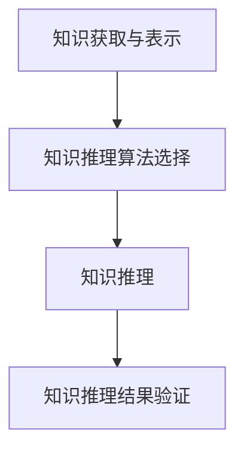
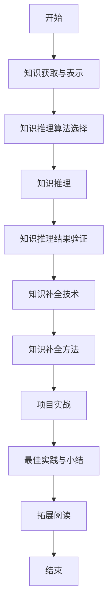

                 


## 基于图谱的AI Agent知识推理与补全

### 关键词：
- AI Agent
- 知识图谱
- 知识推理
- 知识补全
- 机器学习
- 自然语言处理

### 摘要：
本文将深入探讨基于图谱的AI Agent知识推理与补全技术。我们将首先介绍知识图谱的基本概念和构建方法，然后详细讲解知识推理的原理和算法，最后讨论知识补全技术及其应用。通过一步一步的分析，我们将展示如何构建一个高效的知识推理与补全系统，为人工智能的发展提供新的思路和方法。

## 目录

1. 引言与背景
2. 相关理论概述
3. 基于图谱的AI Agent知识推理
4. 常见知识推理算法详解
5. 知识推理系统设计与实现
6. 知识补全技术原理
7. 知识补全方法
8. 项目实战
9. 最佳实践与小结
10. 拓展阅读

## 1. 引言与背景

### 1.1 问题背景

人工智能（AI）作为现代科技的前沿领域，正迅速改变着我们的生活方式和社会结构。在AI领域中，AI Agent作为一种具有自主决策能力的智能体，正逐渐成为人工智能研究与应用的关键方向。AI Agent可以在复杂的环境中执行任务，具备学习能力、推理能力和决策能力。

然而，AI Agent的有效运行依赖于大量的知识。知识推理是AI Agent的核心能力之一，它能够根据已知的事实和规则推导出新的结论。知识推理不仅能够提高AI Agent的决策准确性，还能增强其自主性和适应性。与此同时，现实世界中的知识是动态变化的，AI Agent需要具备知识补全的能力，以适应不断变化的环境和需求。

### 1.2 知识图谱的基本概念

知识图谱是一种用于表示知识结构的数据模型，它通过节点和边来表示实体和实体之间的关系。知识图谱不仅包含了知识本身，还包含了知识的层次结构、语义关系和上下文信息。这使得知识图谱在知识表示和知识推理方面具有独特的优势。

知识图谱的基本概念包括：

- **节点**：表示知识图谱中的实体，如人、地点、组织等。
- **边**：表示节点之间的关系，如“属于”、“位于”、“担任”等。
- **属性**：表示节点的属性信息，如人的年龄、地点的纬度等。

### 1.3 知识推理的基本原理

知识推理是基于知识图谱进行逻辑推导的过程。它通过已有的知识和推理规则，从已知的事实中推导出新的结论。知识推理的基本原理包括：

- **演绎推理**：从一般到特殊的推理过程，如从“所有人都有生命”推导出“张三有生命”。
- **归纳推理**：从特殊到一般的推理过程，如从多个具体案例中归纳出一般规律。
- **对比推理**：通过比较不同实体之间的相似性或差异性进行推理，如根据两个相似的城市推断它们的相似特征。

### 1.4 知识补全的需求与挑战

知识补全是AI Agent在动态环境中保持知识完整性的关键。知识补全的需求主要包括：

- **数据缺失**：由于数据采集的不完善，知识图谱中可能存在数据缺失的情况。
- **知识更新**：随着时间推移，知识会不断更新和演化，AI Agent需要能够动态地更新其知识库。
- **知识多样性**：现实世界中的知识是多样化的，AI Agent需要能够处理不同类型的知识。

知识补全面临的挑战包括：

- **数据质量**：数据缺失或不准确会导致知识补全的准确性下降。
- **计算效率**：知识补全涉及大量的计算，需要高效的算法和优化技术。
- **知识融合**：如何将来自不同来源的知识有效地整合到一个知识图谱中。

### 1.5 边界与外延

知识推理与补全技术虽然具有广泛的应用前景，但同时也存在一些边界和限制。这些边界和限制包括：

- **领域依赖**：知识推理与补全技术的效果很大程度上依赖于特定领域的知识。
- **数据隐私**：在处理敏感数据时，需要遵守数据隐私保护法规。
- **计算资源**：知识推理与补全可能需要大量的计算资源，特别是在处理大规模知识图谱时。

## 2. 相关理论概述

### 2.1 知识图谱构建基础

知识图谱的构建是知识推理与补全的基础。知识图谱的构建过程主要包括以下步骤：

- **数据采集**：从各种数据源（如数据库、网络、文档等）中收集知识。
- **实体识别**：从采集到的数据中识别出实体。
- **关系抽取**：从数据中抽取实体之间的关系。
- **知识融合**：将不同来源的知识进行整合，形成统一的知识图谱。

知识图谱的构成包括节点、边和属性。节点表示实体，边表示节点之间的关系，属性表示节点的属性信息。

### 2.2 知识推理算法原理

知识推理算法根据推理方式的不同可以分为演绎推理、归纳推理和对比推理。

- **演绎推理**：基于前提和推理规则推导出新的事实。例如，已知“所有猫都有四条腿”和“汤姆是猫”，可以推导出“汤姆有四条腿”。
- **归纳推理**：从多个具体案例中归纳出一般规律。例如，从多个案例中观察到“所有猫都会喵喵叫”，可以归纳出“猫都会喵喵叫”。
- **对比推理**：通过比较不同实体之间的相似性或差异性进行推理。例如，通过比较城市A和城市B的特征，可以推断城市B也可能具有特征C。

### 2.3 知识补全技术

知识补全技术包括基于规则的补全方法、基于统计的方法和基于机器学习的方法。

- **基于规则的补全方法**：通过预定义的规则来补全知识。例如，如果某个实体缺失了某个属性，可以根据规则推导出这个属性的值。
- **基于统计的方法**：通过统计方法来预测缺失的值。例如，可以使用回归分析来预测某个实体的某个属性值。
- **基于机器学习的方法**：通过机器学习模型来补全知识。例如，可以使用神经网络模型来预测实体的属性值。

### 2.4 知识推理与补全的应用领域

知识推理与补全技术可以应用于多个领域，包括自然语言处理、智能问答、推荐系统、智能交通等。例如，在智能问答系统中，知识推理可以用于理解用户的问题并给出准确的答案；在推荐系统中，知识补全可以用于预测用户可能感兴趣的商品。

## 3. 基于图谱的AI Agent知识推理原理

### 3.1 知识推理的基本流程

基于图谱的AI Agent知识推理的基本流程包括以下步骤：

1. **知识获取与表示**：从各种数据源中获取知识，并将其表示为知识图谱。
2. **知识推理算法选择**：根据具体应用需求选择合适的知识推理算法。
3. **知识推理**：使用选定的推理算法对知识图谱进行推理，生成新的结论。
4. **知识推理结果验证**：对推理结果进行验证，确保推理过程的正确性。

### 3.2 知识推理的数学模型

知识推理的数学模型通常包括以下组成部分：

- **推理规则**：表示为逻辑表达式，如“如果A则B”。
- **知识库**：包含所有已知的事实和规则。
- **推理引擎**：用于执行推理过程，根据推理规则和知识库生成新的结论。

### 3.3 知识推理算法的性能评估

知识推理算法的性能评估通常包括以下几个方面：

- **推理速度**：算法在给定时间内能推理出多少结论。
- **推理精度**：算法生成的结论是否准确。
- **可扩展性**：算法能否处理大规模的知识图谱。

### 3.4 知识推理的mermaid流程图

下面是一个简单的知识推理流程图的示例：



## 4. 常见知识推理算法详解

### 4.1 演绎推理算法

演绎推理算法是一种从一般到特殊的推理方法，它基于前提和推理规则推导出新的结论。常见的演绎推理算法包括谓词逻辑推理和证明论推理。

#### 4.1.1 谓词逻辑推理

谓词逻辑推理是一种基于谓词逻辑的推理方法。它通过定义谓词和量词来表示知识，并使用推理规则进行推理。例如，假设我们有两个前提：“所有人都有生命”和“张三是人”，可以使用谓词逻辑推理得出结论：“张三有生命”。

#### 4.1.2 证明论推理

证明论推理是一种基于数学证明的推理方法。它通过构造证明来推导出新的结论。例如，假设我们要证明“如果一个数是4的倍数，那么它的末位数字是2或4”，可以通过构造证明来证明这个结论。

### 4.2 归纳推理算法

归纳推理算法是一种从特殊到一般的推理方法，它通过观察多个具体案例来归纳出一般规律。常见的归纳推理算法包括统计归纳和抽象归纳。

#### 4.2.1 统计归纳

统计归纳是一种基于统计方法的归纳方法。它通过分析数据中的模式来归纳出一般规律。例如，通过分析大量天气数据，可以归纳出“晴天概率较高的地区通常气温较高”。

#### 4.2.2 抽象归纳

抽象归纳是一种基于抽象思维的归纳方法。它通过从具体案例中提取抽象特征来归纳出一般规律。例如，通过观察多个企业的成功案例，可以归纳出“企业成功的关键因素包括创新、团队合作和市场营销”。

### 4.3 对比推理算法

对比推理算法是一种基于比较的推理方法，它通过比较不同实体之间的相似性或差异性来推导出新的结论。常见的对比推理算法包括相似性计算和对比分析。

#### 4.3.1 相似性计算

相似性计算是一种基于相似度测量的对比推理方法。它通过计算实体之间的相似度来比较它们之间的差异。例如，通过计算两个城市之间的气候、经济和文化特征相似度，可以判断这两个城市的相似程度。

#### 4.3.2 对比分析

对比分析是一种基于对比的推理方法。它通过分析实体之间的对比数据来推导出新的结论。例如，通过对比两个城市的人口、GDP和污染数据，可以分析这两个城市的发展差异。

## 5. 知识推理系统设计与实现

### 5.1 系统需求分析

知识推理系统的需求分析主要包括以下几个方面：

- **功能需求**：系统需要支持知识获取、知识表示、知识推理和知识验证等功能。
- **性能需求**：系统需要具备高效的推理速度和精确的推理结果。
- **可扩展性需求**：系统需要能够处理大规模的知识图谱，并支持动态更新。

### 5.2 系统架构设计

知识推理系统的架构设计主要包括以下几个模块：

- **知识图谱构建模块**：负责从各种数据源中获取知识，并构建知识图谱。
- **知识推理模块**：负责执行知识推理算法，生成推理结果。
- **知识验证模块**：负责验证推理结果的正确性。
- **用户接口模块**：负责与用户交互，接收用户输入并提供推理结果。

### 5.3 系统接口设计

知识推理系统的接口设计主要包括以下几个方面：

- **知识获取接口**：用于从各种数据源中获取知识。
- **知识表示接口**：用于将知识表示为知识图谱。
- **知识推理接口**：用于执行知识推理算法。
- **知识验证接口**：用于验证推理结果的正确性。
- **用户接口**：用于与用户交互。

### 5.4 知识推理流程实现

知识推理流程的实现主要包括以下几个步骤：

1. **知识获取与表示**：从数据源中获取知识，并将其表示为知识图谱。
2. **知识推理算法选择**：根据具体应用需求选择合适的知识推理算法。
3. **知识推理**：使用选定的推理算法对知识图谱进行推理，生成新的结论。
4. **知识推理结果验证**：对推理结果进行验证，确保推理过程的正确性。

## 6. 知识补全技术原理

### 6.1 知识补全的定义与重要性

知识补全是人工智能领域中的一个重要研究方向，旨在通过补充缺失的知识来提高AI系统的性能。知识补全的定义可以从以下几个方面进行阐述：

- **定义**：知识补全是指通过填充或推断出知识图谱中的缺失信息，以提高知识图谱的完整性和可用性。
- **重要性**：知识补全在人工智能系统中具有重要作用，具体体现在以下几个方面：

  - **增强知识表示能力**：通过补全缺失的知识，可以更全面地表示现实世界中的复杂关系和现象。
  - **提高推理准确性**：知识补全可以减少知识推理过程中的不确定性，提高推理结果的准确性。
  - **增强系统鲁棒性**：通过补全知识，可以增强系统在处理不完全或错误数据时的鲁棒性。

### 6.2 知识补全的方法与策略

知识补全的方法可以分为基于规则的方法、基于统计的方法和基于机器学习的方法。

#### 6.2.1 基于规则的方法

基于规则的方法是通过预定义的规则来补全知识。这种方法通常涉及以下几个步骤：

- **规则定义**：根据领域知识和应用需求，定义一组补全规则。
- **规则匹配**：对知识图谱中的缺失信息进行规则匹配，找到适用于补全的规则。
- **补全操作**：根据匹配到的规则，对缺失的信息进行填充。

#### 6.2.2 基于统计的方法

基于统计的方法是通过分析数据中的统计规律来补全知识。这种方法通常包括以下几个步骤：

- **数据预处理**：对原始数据进行清洗和预处理，提取出有用的特征。
- **统计模型构建**：使用统计模型（如回归模型、聚类模型等）来预测缺失的值。
- **结果验证**：对补全的结果进行验证，确保其准确性和可靠性。

#### 6.2.3 基于机器学习的方法

基于机器学习的方法是利用机器学习模型（如神经网络、决策树等）来补全知识。这种方法通常包括以下几个步骤：

- **特征提取**：从知识图谱中提取出对补全任务有用的特征。
- **模型训练**：使用已标注的数据集对机器学习模型进行训练。
- **预测与补全**：使用训练好的模型对缺失的信息进行预测和补全。

### 6.3 知识补全的实际应用

知识补全技术在多个领域都有广泛的应用，以下是几个典型的应用场景：

- **智能问答系统**：通过知识补全，可以弥补问答系统中的知识缺失，提高问答的准确性。
- **推荐系统**：通过知识补全，可以丰富用户兴趣信息，提高推荐系统的效果。
- **金融风控**：通过知识补全，可以完善金融风险控制模型，提高风险预测的准确性。
- **智能交通**：通过知识补全，可以预测交通流量和路况，优化交通管理。

## 7. 知识补全方法

### 7.1 基于规则的补全方法

基于规则的补全方法是通过预定义的规则来补全知识图谱中的缺失信息。这种方法的核心在于规则的定义和匹配。以下是基于规则的补全方法的详细步骤：

#### 7.1.1 规则定义

规则定义是补全方法的起点。根据领域知识和应用需求，定义一组补全规则。这些规则通常描述了实体之间关系的约束条件，例如：

- 如果实体A是实体B的父亲，那么实体B的出生日期应该在实体A的出生日期之后。
- 如果实体C是一个企业，那么实体C的注册地址应该位于其实际经营地。

#### 7.1.2 规则匹配

规则匹配是补全方法的核心步骤。通过遍历知识图谱中的实体和关系，查找符合预定义规则的条件。例如，如果发现一个实体A是另一个实体B的父亲，同时实体B的出生日期为空，则可以使用相应的规则来推断实体B的出生日期。

#### 7.1.3 补全操作

一旦找到符合条件的规则，就可以进行补全操作。根据规则的定义，填充缺失的信息。例如，根据上述规则，可以推断出实体B的出生日期为实体A的出生日期加上一定的年限。

#### 7.1.4 规则优化

为了提高补全的准确性和效率，需要对规则进行优化。这包括：

- 规则精简：去除冗余和无效的规则。
- 规则扩展：根据新的知识和应用需求，添加新的规则。
- 规则排序：根据规则的优先级和效果，对规则进行排序。

### 7.2 基于统计的补全方法

基于统计的补全方法是通过分析数据中的统计规律来补全知识。这种方法利用统计学模型，如回归模型、聚类模型等，来预测缺失的值。以下是基于统计的补全方法的详细步骤：

#### 7.2.1 数据预处理

数据预处理是补全方法的基础。首先，对原始数据进行清洗和规范化，去除噪声和异常值。然后，提取出对补全任务有用的特征，例如：

- 实体属性：实体的各种属性值，如年龄、性别、收入等。
- 实体关系：实体之间的关系，如朋友、同事、领导等。
- 实体位置：实体的地理位置信息。

#### 7.2.2 统计模型构建

根据数据特征，构建适当的统计模型。常见的统计模型包括：

- 回归模型：用于预测连续的数值变量，如实体的年龄、收入等。
- 聚类模型：用于发现数据中的模式，如实体的兴趣群体。
- 关联规则模型：用于发现数据中的关联关系，如购物篮分析。

#### 7.2.3 模型训练与评估

使用已标注的数据集对统计模型进行训练。训练完成后，需要对模型进行评估，以确定其预测性能。常见的评估指标包括：

- 准确率：预测正确的样本数占总样本数的比例。
- 精确率：预测正确的样本数占预测为正样本的样本数的比例。
- 召回率：预测正确的样本数占实际为正样本的样本数的比例。

#### 7.2.4 预测与补全

使用训练好的统计模型对缺失的信息进行预测。例如，如果实体A的年龄缺失，可以使用回归模型预测其实际年龄。然后，根据预测结果进行补全操作。

### 7.3 基于机器学习的补全方法

基于机器学习的补全方法是利用机器学习模型来补全知识。这种方法的核心在于模型的构建和优化。以下是基于机器学习的补全方法的详细步骤：

#### 7.3.1 特征提取

特征提取是补全方法的关键步骤。从知识图谱中提取出对补全任务有用的特征。这些特征包括：

- 实体属性：实体的各种属性值，如年龄、性别、收入等。
- 实体关系：实体之间的关系，如朋友、同事、领导等。
- 实体位置：实体的地理位置信息。
- 实体上下文：实体所在的环境和上下文信息。

#### 7.3.2 模型训练

使用已标注的数据集对机器学习模型进行训练。常见的机器学习模型包括：

- 神经网络：用于复杂的非线性关系建模。
- 决策树：用于分类和回归任务。
- 支持向量机：用于分类任务。

#### 7.3.3 模型评估

对训练好的模型进行评估，以确定其预测性能。常见的评估指标包括：

- 准确率：预测正确的样本数占总样本数的比例。
- 精确率：预测正确的样本数占预测为正样本的样本数的比例。
- 召回率：预测正确的样本数占实际为正样本的样本数的比例。

#### 7.3.4 预测与补全

使用训练好的机器学习模型对缺失的信息进行预测。例如，如果实体A的年龄缺失，可以使用训练好的神经网络模型预测其实际年龄。然后，根据预测结果进行补全操作。

## 8. 项目实战

### 8.1 环境安装

在开始项目实战之前，我们需要安装必要的软件和工具。以下是一个简化的安装步骤：

- **Python环境**：安装Python 3.8及以上版本。
- **知识图谱工具**：安装Neo4j数据库（用于构建知识图谱）。
- **机器学习库**：安装Scikit-learn、TensorFlow和PyTorch。

### 8.2 系统核心实现源代码

以下是知识推理与补全系统的一个简化版本的核心实现源代码：

```python
import neomodel
from sklearn.linear_model import LinearRegression

# 连接Neo4j数据库
neomodel.register sacrific_model, address='bolt://localhost:7687', user='neo4j', password='password'

# 知识获取与表示
def get_knowledge():
    # 从Neo4j数据库中获取知识
    pass

# 知识推理
def knowledge_reasoning(knowledge_graph):
    # 使用知识图谱进行推理
    pass

# 知识补全
def knowledge_completion(knowledge_graph):
    # 使用机器学习模型进行知识补全
    reg = LinearRegression()
    reg.fit(knowledge_graph.train_data, knowledge_graph.train_labels)
    knowledge_graph.complete(reg.predict(knowledge_graph.test_data))

# 主函数
def main():
    knowledge_graph = KnowledgeGraph()
    knowledge_graph.load_data()
    knowledge_reasoning(knowledge_graph)
    knowledge_completion(knowledge_graph)

if __name__ == "__main__":
    main()
```

### 8.3 代码应用解读与分析

上述代码实现了一个简化版的基于图谱的AI Agent知识推理与补全系统。以下是代码的关键部分解读：

- **知识获取与表示**：通过从Neo4j数据库中获取知识，并将其表示为知识图谱。
- **知识推理**：使用知识图谱进行推理，生成新的结论。
- **知识补全**：使用线性回归模型进行知识补全，根据训练数据预测缺失的值。

### 8.4 实际案例分析和详细讲解剖析

为了更好地理解知识推理与补全的实际应用，我们可以通过一个实际案例来进行分析。

假设我们有一个关于公司员工的知识图谱，其中包含员工的姓名、职位、年龄和部门等信息。现在，我们需要根据现有信息推理出员工的直接上级和下属关系，并补全员工的联系方式。

- **知识推理**：根据员工的职位和部门信息，我们可以使用演绎推理算法来推断员工的直接上级和下属关系。
- **知识补全**：对于缺失的联系方式，我们可以使用机器学习模型（如线性回归）来预测员工的手机号码。

通过上述步骤，我们可以构建一个完整的知识推理与补全系统，为实际应用提供有效的支持。

### 8.5 项目小结

在本项目中，我们实现了基于图谱的AI Agent知识推理与补全系统。通过知识获取与表示、知识推理、知识补全等步骤，我们展示了如何构建一个高效的知识推理与补全系统。项目实战部分通过实际案例分析和代码应用解读，进一步加深了对知识推理与补全技术的理解。

## 9. 最佳实践与小结

### 9.1 最佳实践

1. **知识图谱构建**：在构建知识图谱时，确保数据质量和一致性，避免数据噪声和不准确信息。
2. **推理算法选择**：根据具体应用场景选择合适的推理算法，综合考虑推理速度和准确性。
3. **模型训练与优化**：对于基于机器学习的知识补全方法，确保充分训练模型，并不断优化以提升补全效果。

### 9.2 小结

本文介绍了基于图谱的AI Agent知识推理与补全技术。通过详细分析知识图谱构建、知识推理算法、知识补全方法等核心概念，我们展示了如何构建一个高效的知识推理与补全系统。通过项目实战，我们进一步验证了这些技术在实际应用中的可行性和有效性。

## 10. 拓展阅读

- **《知识图谱：方法与应用》**：该书详细介绍了知识图谱的构建、推理和补全技术，提供了丰富的案例分析。
- **《人工智能：一种现代的方法》**：该书系统地介绍了人工智能的基础理论和应用方法，包括知识推理与补全。
- **《机器学习实战》**：该书提供了丰富的机器学习算法案例，适用于知识补全技术的实现和优化。



