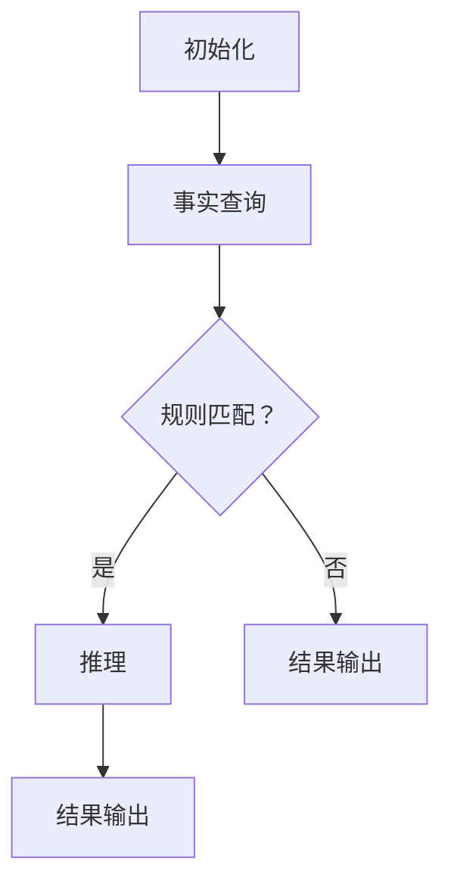
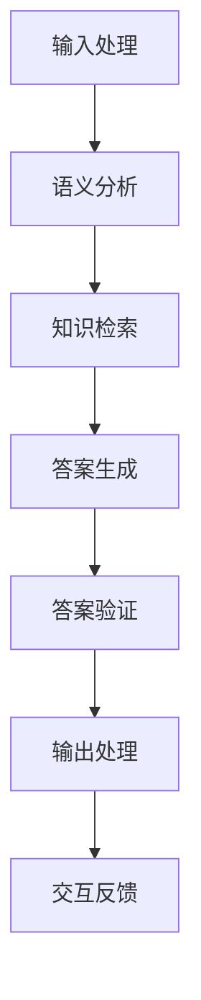
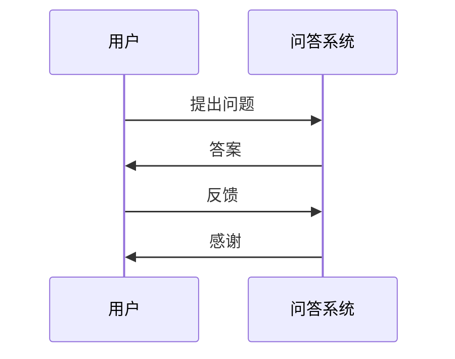

                 

### 基于图谱的AI Agent知识推理与问答

**关键词：** AI Agent，知识图谱，知识推理，问答系统，算法，系统设计

**摘要：** 本文将深入探讨基于图谱的AI Agent知识推理与问答技术，分析AI Agent的概念、图谱的基本概念及其应用，探讨知识推理与问答系统的构建方法及其在AI领域的应用。通过算法和系统设计的详细讲解，结合实际项目案例，全面解析知识图谱技术在AI Agent中的应用实践。

---

**一、问题背景**

### 1.1 AI Agent的概念与发展

AI Agent是指具有自主决策和行动能力的智能实体，能够在特定环境中根据感知信息进行推理和规划，以实现特定目标。AI Agent的发展经历了从规则驱动到数据驱动，再到知识驱动的演变过程。知识驱动的AI Agent能够利用结构化的知识库进行推理和决策，具备更高的智能水平。

### 1.2 图谱在AI领域的应用

知识图谱是一种结构化、语义化的知识表示方法，通过实体和关系的表示，能够提供丰富的语义信息。图谱技术在AI领域得到了广泛应用，如搜索引擎、推荐系统、自然语言处理等。图谱的引入，使得AI系统在处理复杂任务时，能够更好地理解上下文和语义信息。

### 1.3 知识推理与问答系统的重要性

知识推理是AI Agent的核心能力之一，能够通过逻辑推理，从已知信息中推导出新的结论。问答系统是AI Agent与用户进行交互的主要方式，能够理解用户的问题，并提供准确的答案。知识推理与问答系统的结合，使得AI Agent具备了更强的智能交互能力。

**二、书籍目的与结构安排**

### 2.1 主要目标读者群

本书主要面向对AI领域有深入了解的读者，包括AI研究人员、软件开发工程师、数据科学家等。同时，也适合对知识图谱、知识推理与问答系统有浓厚兴趣的读者。

### 2.2 内容结构概述

本书分为五大部分，分别介绍AI Agent的基础概念、图谱的基本概念与构建方法、知识推理与问答系统的设计、实际应用案例以及最佳实践与展望。通过循序渐进的内容安排，帮助读者全面了解和掌握基于图谱的AI Agent知识推理与问答技术。

### 2.3 学习路径建议

1. **基础概念理解**：首先，读者需要了解AI Agent、知识图谱、知识推理和问答系统的基础概念，为后续内容的学习打下基础。
2. **算法与系统设计**：深入理解知识图谱构建、知识推理和问答系统的算法原理和系统设计，通过代码实现和案例分析，加深对技术原理的理解。
3. **实际应用实践**：通过实际项目案例，了解知识图谱技术在AI Agent中的应用，掌握项目的实施过程和核心代码实现。
4. **最佳实践与展望**：总结最佳实践技巧，对知识图谱技术的发展趋势进行展望，为读者提供未来学习和研究方向。

---

通过以上章节的安排，本书旨在为读者提供一部系统、全面、深入的知识图谱技术在AI Agent知识推理与问答领域的指南。在接下来的内容中，我们将逐一探讨这些核心概念，并通过实际案例和实践，帮助读者深入理解和应用这些技术。让我们开始这次探索之旅吧！## 第一部分：背景介绍

### 1.1 问题背景

#### 1.1.1 AI Agent的概念与发展

AI Agent，即人工智能代理，是一种能够在特定环境下自主进行决策、执行任务并与其他实体交互的智能系统。从其定义来看，AI Agent具有以下核心特点：

- **自主性**：AI Agent能够根据环境和自身目标进行自主决策。
- **适应性**：AI Agent能够根据环境变化调整自身行为。
- **交互性**：AI Agent能够与人类或其他智能系统进行有效交互。

AI Agent的发展可以追溯到20世纪80年代，当时基于规则的专家系统是主要的AI应用形式。然而，随着数据量的爆炸式增长和计算能力的提升，数据驱动的AI Agent逐渐崭露头角。如今，知识驱动的AI Agent已经成为研究热点，特别是在需要处理复杂、动态环境和大量语义信息的场景中。

#### 1.1.2 图谱在AI领域的应用

知识图谱（Knowledge Graph）是一种结构化、语义化的知识表示方法，通过实体（Entity）和关系（Relationship）来组织信息。图谱技术最早由Google提出并应用于搜索引擎，通过语义理解提升搜索结果的准确性。随着AI技术的发展，知识图谱在多个领域得到了广泛应用，包括：

- **自然语言处理（NLP）**：利用图谱进行实体识别、关系抽取和语义理解，提升文本处理能力。
- **推荐系统**：通过图谱进行用户、物品和场景的关联分析，提供更精准的推荐。
- **智能问答**：利用图谱作为知识库，实现高效的问答系统。
- **智能助手**：结合图谱和知识推理，提供更加智能和个性化的服务。

#### 1.1.3 知识推理与问答系统的重要性

知识推理（Knowledge Reasoning）是指利用知识库中的已有知识，通过逻辑推理等方式推导出新的结论。在AI Agent中，知识推理是核心能力之一，能够帮助系统更好地理解问题、作出决策。

问答系统（Question Answering System）是一种能够理解用户问题，并从知识库中检索出相关答案的技术。在AI Agent中，问答系统是用户交互的重要途径，能够提供自然语言交互的体验。

知识推理与问答系统的结合，使得AI Agent能够在复杂的语义环境中进行高效的信息检索和推理，提供准确、自然的回答。这对于提升AI Agent的智能水平和服务质量具有重要意义。

### 1.2 书籍目的与结构安排

#### 1.2.1 主要目标读者群

本书主要面向以下几类读者：

1. **AI研究人员**：对AI领域有深入研究，希望了解知识图谱在AI Agent中的应用。
2. **软件开发工程师**：熟悉编程语言和软件开发流程，希望掌握基于图谱的AI Agent开发技术。
3. **数据科学家**：对数据分析和机器学习有深入理解，希望将知识图谱技术应用于实际项目中。
4. **对AI领域有浓厚兴趣的读者**：对人工智能和知识图谱技术感兴趣，希望通过本书了解相关知识。

#### 1.2.2 内容结构概述

本书分为五个主要部分，每个部分的内容如下：

1. **第一部分：背景介绍**：介绍AI Agent、知识图谱、知识推理与问答系统的基础概念。
2. **第二部分：核心概念与原理**：深入探讨AI Agent、知识图谱和知识推理与问答系统的基本原理。
3. **第三部分：算法与系统设计**：讲解知识图谱构建、知识推理和问答系统的算法原理和系统设计。
4. **第四部分：案例分析与实际应用**：通过实际项目案例，展示知识图谱技术在AI Agent中的应用。
5. **第五部分：最佳实践与总结**：总结最佳实践技巧，对知识图谱技术的发展趋势进行展望。

#### 1.2.3 学习路径建议

为了更好地理解和应用本书的内容，我们建议读者按照以下路径学习：

1. **基础概念理解**：首先，通过第一部分的内容，了解AI Agent、知识图谱、知识推理和问答系统的基本概念。
2. **深入理解核心原理**：在第二部分，深入学习AI Agent、知识图谱和知识推理与问答系统的基本原理。
3. **算法与系统设计实践**：在第三部分，通过代码实现和案例分析，掌握知识图谱构建、知识推理和问答系统的算法原理和系统设计。
4. **实际应用实践**：在第四部分，通过实际项目案例，了解知识图谱技术在AI Agent中的应用。
5. **最佳实践与展望**：在第五部分，总结最佳实践技巧，对知识图谱技术的发展趋势进行展望。

通过以上学习路径，读者可以系统、全面地掌握基于图谱的AI Agent知识推理与问答技术，为今后的研究和应用打下坚实的基础。

---

在接下来的部分，我们将继续深入探讨AI Agent、知识图谱和知识推理与问答系统的核心概念和原理，帮助读者建立完整的知识框架。接下来，我们将详细解析AI Agent的基本原理、图谱的基本概念及其应用，以及知识推理与问答系统的构建方法。请读者继续关注后续章节。让我们继续这一探索之旅！### 第二部分：核心概念与原理

#### 2.1 AI Agent的基本原理

AI Agent是一种具有自主决策和行动能力的智能实体，能够在特定环境中根据感知信息进行推理和规划，以实现特定目标。AI Agent的核心原理主要包括以下几个方面：

##### 2.1.1 定义与功能

AI Agent的定义可以概括为：一种能够模拟人类智能行为，具备感知、思考、决策和行动能力的计算机程序或系统。其主要功能包括：

1. **感知**：AI Agent能够通过传感器获取环境信息，如图像、声音、文字等。
2. **思考**：基于感知信息，AI Agent能够进行逻辑推理、知识推理和问题求解。
3. **决策**：根据思考结果，AI Agent能够制定行动策略，选择最优行动方案。
4. **行动**：执行决策，实现特定目标。

##### 2.1.2 分类

AI Agent可以根据不同的标准进行分类，以下是几种常见的分类方式：

1. **根据功能**：分为任务型Agent（如搜索引擎、聊天机器人）和自主型Agent（如机器人、无人机）。
2. **根据决策方法**：分为规则驱动Agent、数据驱动Agent和知识驱动Agent。
3. **根据应用领域**：分为通用型Agent（如自动驾驶汽车、智能家居）和专用型Agent（如医疗诊断系统、金融分析系统）。

##### 2.1.3 设计原则

设计AI Agent时，需要遵循以下原则：

1. **适应性**：AI Agent应能够适应不同的环境和任务需求。
2. **自主性**：AI Agent应具备自主决策和行动的能力。
3. **鲁棒性**：AI Agent应能够在复杂和不确定的环境中稳定运行。
4. **可扩展性**：AI Agent的设计应具备良好的扩展性，以适应未来的技术发展和应用需求。

#### 2.2 图谱的基本概念

知识图谱是一种结构化、语义化的知识表示方法，通过实体和关系的表示，提供丰富的语义信息。知识图谱的基本概念包括：

##### 2.2.1 定义与结构

知识图谱的定义可以概括为：一种通过实体和关系的网络结构来表示知识的方法。其基本结构包括：

1. **实体**：知识图谱中的基本元素，表示现实世界中的对象，如人、地点、物品等。
2. **关系**：实体之间的关联，表示实体之间的语义关系，如“属于”、“位于”、“具有”等。
3. **属性**：实体的特征描述，如人的姓名、地点的经纬度等。

##### 2.2.2 构建方法

知识图谱的构建方法主要包括以下几种：

1. **手动构建**：通过专家知识和人工标注来构建知识图谱，适用于小规模、特定领域的数据。
2. **自动抽取**：利用自然语言处理技术从文本数据中抽取实体、关系和属性，适用于大规模、通用领域的数据。
3. **融合构建**：结合手动构建和自动抽取的方法，提高知识图谱的完整性和准确性。

##### 2.2.3 应用

知识图谱在多个领域得到了广泛应用，包括：

1. **搜索引擎**：通过图谱进行语义搜索，提升搜索结果的准确性。
2. **推荐系统**：利用图谱进行用户、物品和场景的关联分析，提供个性化推荐。
3. **自然语言处理**：通过图谱进行实体识别、关系抽取和语义理解，提升文本处理能力。
4. **智能问答**：利用图谱作为知识库，实现高效的问答系统。
5. **智能助手**：结合图谱和知识推理，提供更加智能和个性化的服务。

#### 2.3 知识推理与问答系统

知识推理和问答系统是AI Agent的核心能力之一，能够帮助系统更好地理解问题、作出决策。

##### 2.3.1 知识推理的基本原理

知识推理的基本原理包括：

1. **逻辑推理**：基于逻辑规则和事实进行推理，推导出新的结论。
2. **基于模型的推理**：利用知识表示模型，如语义网络、本体等，进行推理。
3. **基于规则的推理**：通过规则库和事实数据库，进行推理。

##### 2.3.2 问答系统的构建方法

问答系统的构建方法主要包括以下几种：

1. **基于关键词匹配**：通过匹配用户问题和知识库中的问题，返回相关答案。
2. **基于模板匹配**：将用户问题与预定义的模板进行匹配，返回模板中的答案。
3. **基于机器学习**：利用机器学习方法，从大量问答数据中学习问答规律，进行预测。
4. **基于图谱的推理**：利用知识图谱进行语义分析和推理，返回相关答案。

##### 2.3.3 知识推理与问答系统的整合

知识推理与问答系统的整合，使得AI Agent能够在复杂的语义环境中进行高效的信息检索和推理，提供准确、自然的回答。其整合过程包括：

1. **知识库构建**：构建包含实体、关系和属性的丰富知识库。
2. **知识抽取**：从文本数据中抽取知识，补充和完善知识库。
3. **推理引擎**：利用知识推理算法，从知识库中推导出新的结论。
4. **问答接口**：提供自然语言交互的接口，接受用户问题，返回相关答案。

#### 2.4 核心概念联系

AI Agent、图谱与知识推理之间的联系如下：

1. **AI Agent**：作为知识驱动的智能实体，利用知识图谱和知识推理进行决策和行动。
2. **知识图谱**：提供结构化、语义化的知识表示，支持AI Agent的知识存储和检索。
3. **知识推理**：基于知识图谱进行推理，为AI Agent提供决策支持。

通过知识推理和问答系统的整合，AI Agent能够更好地理解和解决复杂问题，提供智能化服务。

---

在接下来的部分，我们将详细讲解知识图谱构建算法、知识推理算法以及问答系统的设计与实现。请读者继续关注后续章节，以便深入理解这些核心技术的具体应用和实践。让我们继续这一探索之旅！### 第三部分：算法与系统设计

#### 3.1 知识图谱构建算法

知识图谱的构建是AI Agent知识推理和问答系统的基础。以下是几种常用的知识图谱构建算法：

##### 3.1.1 算法概述

知识图谱构建算法主要分为两类：基于手动构建和基于自动抽取。

1. **基于手动构建**：通过领域专家的知识和人工标注，构建小规模、特定领域的知识图谱。
2. **基于自动抽取**：利用自然语言处理技术，从大规模文本数据中自动抽取实体、关系和属性，构建通用领域的知识图谱。

以下是几种常见的自动抽取算法：

- **命名实体识别（NER）**：用于识别文本中的命名实体，如人名、地名、组织名等。
- **关系抽取（RE）**：用于识别实体之间的语义关系，如“属于”、“位于”、“具有”等。
- **属性抽取（AE）**：用于识别实体属性，如人的年龄、地点的经纬度等。

##### 3.1.2 算法流程

以下是一个简单的知识图谱构建流程：

1. **数据预处理**：对原始文本数据（如新闻、百科、论文等）进行清洗和预处理，去除无关信息和噪声。
2. **命名实体识别（NER）**：利用NER算法，识别文本中的命名实体。
3. **关系抽取（RE）**：利用RE算法，识别实体之间的语义关系。
4. **属性抽取（AE）**：利用AE算法，识别实体属性。
5. **实体与关系融合**：将NER、RE和AE的结果融合，构建初步的知识图谱。
6. **知识库构建**：对知识图谱进行清洗、去重和优化，构建完整的知识库。

##### 3.1.3 算法原理讲解

以下是几种常见的知识图谱构建算法原理：

1. **基于规则的方法**：通过预定义的规则，对文本数据进行解析和抽取。优点是简单易实现，缺点是规则维护成本高，适用范围有限。
2. **基于机器学习的方法**：利用大量标注数据，训练模型进行自动抽取。优点是适用范围广，缺点是训练数据需求大，模型解释性差。
3. **基于深度学习的方法**：利用深度神经网络，对文本数据进行建模和抽取。优点是效果较好，缺点是模型复杂度高，训练时间长。

##### 3.1.4 算法Mermaid流程图

以下是一个基于NER、RE和AE的知识图谱构建算法的Mermaid流程图：

```mermaid
graph TD
A[数据预处理] --> B[命名实体识别(NER)]
B --> C[关系抽取(RE)]
C --> D[属性抽取(AE)]
D --> E[实体与关系融合]
E --> F[知识库构建]
```

##### 3.1.5 Python代码实现

以下是基于Python实现的简单知识图谱构建代码示例：

```python
import spacy

nlp = spacy.load("en_core_web_sm")

def preprocess_text(text):
    # 数据预处理
    doc = nlp(text)
    return [token.text for token in doc]

def named_entity_recognition(text):
    # 命名实体识别
    doc = nlp(text)
    return [(ent.text, ent.label_) for ent in doc.ents]

def relation_extraction(text):
    # 关系抽取
    doc = nlp(text)
    return [(token.text, token.dep_, token.head.text) for token in doc]

def attribute_extraction(text):
    # 属性抽取
    doc = nlp(text)
    return [(token.text, token.ent_type_) for token in doc]

def build_knowledge_graph(nouns, relations, attributes):
    # 实体与关系融合
    entities = set(nouns)
    relationships = set(relations)
    attributes = set(attributes)
    
    knowledge_graph = {}
    for entity in entities:
        knowledge_graph[entity] = {"relations": [], "attributes": []}
    
    for relation in relationships:
        entity1, rel, entity2 = relation
        knowledge_graph[entity1]["relations"].append(entity2)
        knowledge_graph[entity2]["relations"].append(entity1)
    
    for attribute in attributes:
        entity, attr = attribute
        knowledge_graph[entity]["attributes"].append(attr)
    
    return knowledge_graph

text = "Google is a technology company located in Mountain View, California."
nouns = preprocess_text(text)
relations = relation_extraction(text)
attributes = attribute_extraction(text)

knowledge_graph = build_knowledge_graph(nouns, relations, attributes)
print(knowledge_graph)
```

运行上述代码，可以得到一个简单的知识图谱，如：

```python
{
    'Google': {'relations': ['technology company', 'located in Mountain View, California'], 'attributes': []},
    'technology company': {'relations': ['Google'], 'attributes': []},
    'located in Mountain View, California': {'relations': ['Google'], 'attributes': []}
}
```

##### 3.1.6 Python代码详解

1. **数据预处理**：使用SpaCy库对文本进行清洗和分词，得到文本中的词语列表。
2. **命名实体识别（NER）**：使用SpaCy库中的NER模型，识别文本中的命名实体，如人名、地名、组织名等。
3. **关系抽取（RE）**：分析文本中的语法结构，识别实体之间的关系，如“属于”、“位于”、“具有”等。
4. **属性抽取（AE）**：识别实体属性，如人的年龄、地点的经纬度等。
5. **实体与关系融合**：将NER、RE和AE的结果进行融合，构建初步的知识图谱。

通过以上步骤，我们可以实现一个简单的知识图谱构建算法，为后续的知识推理和问答系统提供基础。

---

在下一部分，我们将介绍知识推理算法，详细讲解其原理、流程以及应用。敬请期待！### 第三部分：算法与系统设计（续）

#### 3.2 知识推理算法

知识推理算法是AI Agent的核心组成部分，负责从知识库中提取信息并推导出新的结论。以下是几种常见的知识推理算法：

##### 3.2.1 算法概述

知识推理算法主要分为以下几类：

1. **基于规则的推理**：通过预定义的规则库，对知识库中的事实进行推理。
2. **基于模型的推理**：利用本体、知识图谱等模型，进行推理。
3. **基于数据挖掘的推理**：通过分析大量数据，发现潜在关系和模式。

以下是几种常见的知识推理算法：

- **逆推理（Inference）**：从已知的事实出发，逆向推导出其他可能的事实。
- **正向推理（Forward Chaining）**：从已知的事实出发，正向推导出其他可能的事实。
- **反向推理（Backward Chaining）**：从目标事实出发，逆向推导出其他可能的事实。

##### 3.2.2 算法流程

以下是一个简单的知识推理算法流程：

1. **初始化**：读取知识库和规则库，初始化推理机。
2. **事实查询**：根据输入条件，查询知识库中的相关事实。
3. **规则匹配**：对查询到的事实，与规则库中的规则进行匹配。
4. **推理**：根据匹配到的规则，进行推理，推导出新的结论。
5. **结果输出**：将推理结果输出，供后续决策或问答系统使用。

##### 3.2.3 算法原理讲解

以下是几种常见的知识推理算法原理：

1. **基于规则的推理**：通过预定义的规则库，对知识库中的事实进行推理。规则通常表示为“如果...那么...”，如“如果今天是周一，那么上班时间是从9点到6点”。

2. **基于模型的推理**：利用本体、知识图谱等模型，进行推理。本体是一种形式化的知识表示方法，定义了领域中的概念、关系和属性。知识图谱则通过实体和关系的网络结构来表示知识。

3. **基于数据挖掘的推理**：通过分析大量数据，发现潜在关系和模式。这种方法通常用于发现新的知识和关联，如“用户购买A产品，往往也会购买B产品”。

##### 3.2.4 算法Mermaid流程图

以下是一个简单的知识推理算法的Mermaid流程图：



##### 3.2.5 Python代码实现

以下是基于Python实现的简单知识推理算法：

```python
# 知识库和规则库
knowledge_base = {
    'rule1': '如果今天是周一，那么上班时间是从9点到6点',
    'fact1': '今天是周一'
}

# 初始化推理机
def init_inference_engine(knowledge_base):
    return knowledge_base

# 事实查询
def query_facts(knowledge_base, fact):
    for key, value in knowledge_base.items():
        if value == fact:
            return key
    return None

# 规则匹配
def match_rules(knowledge_base, rule, fact):
    if rule == fact:
        return True
    return False

# 推理
def inference(knowledge_base, rule, fact):
    if match_rules(knowledge_base, rule, fact):
        print("推理结果：", fact)
    else:
        print("无法推理")

# 测试
knowledge_base = init_inference_engine(knowledge_base)
query_facts(knowledge_base, '今天是周一')
inference(knowledge_base, 'rule1', '今天是周一')
```

运行上述代码，输出结果为：

```
推理结果： 今天是周一
```

##### 3.2.6 Python代码详解

1. **初始化推理机**：读取知识库和规则库，初始化推理机。
2. **事实查询**：根据输入条件，查询知识库中的相关事实。
3. **规则匹配**：对查询到的事实，与规则库中的规则进行匹配。
4. **推理**：根据匹配到的规则，进行推理，推导出新的结论。
5. **结果输出**：将推理结果输出，供后续决策或问答系统使用。

通过以上步骤，我们可以实现一个简单的知识推理算法，为AI Agent提供决策支持。

---

在下一部分，我们将介绍问答系统的设计与实现。敬请期待！### 第三部分：算法与系统设计（续）

#### 3.3 问答系统设计与实现

问答系统是AI Agent与用户进行交互的重要途径，其核心目标是理解用户的问题，并从知识库中检索出相关答案。以下是问答系统的设计与实现：

##### 3.3.1 系统功能设计

问答系统的主要功能包括：

1. **问题理解**：解析用户输入的问题，提取关键信息。
2. **知识检索**：从知识库中检索与问题相关的信息。
3. **答案生成**：根据检索结果，生成符合用户需求的答案。
4. **答案验证**：对生成的答案进行验证，确保其准确性和相关性。
5. **交互反馈**：与用户进行交互，收集反馈，优化问答效果。

##### 3.3.2 系统架构设计

问答系统的架构设计主要包括以下模块：

1. **输入处理模块**：接收用户输入的问题，进行预处理和分词。
2. **语义分析模块**：对预处理后的文本进行语义分析，提取关键信息。
3. **知识检索模块**：从知识库中检索与问题相关的信息。
4. **答案生成模块**：根据检索结果，生成符合用户需求的答案。
5. **答案验证模块**：对生成的答案进行验证，确保其准确性和相关性。
6. **输出处理模块**：将答案输出给用户，并进行交互反馈。

以下是问答系统的Mermaid架构图：



##### 3.3.3 系统接口设计与交互

问答系统的接口设计包括：

1. **输入接口**：接收用户输入的问题，可以是文本或语音形式。
2. **输出接口**：将生成的答案输出给用户，可以是文本或语音形式。
3. **交互接口**：与用户进行交互，收集反馈，优化问答效果。

以下是问答系统的Mermaid接口设计与交互序列图：



##### 3.3.4 系统核心代码实现

以下是基于Python实现的简单问答系统：

```python
import jieba

# 知识库
knowledge_base = {
    '什么是人工智能？': '人工智能是一门研究如何使计算机模拟人类智能行为的科学。',
    '什么是深度学习？': '深度学习是人工智能的一个分支，使用神经网络模型进行学习。',
    '什么是机器学习？': '机器学习是人工智能的一个分支，使用算法从数据中学习并做出决策。',
}

# 输入处理
def preprocess_question(question):
    return jieba.cut(question)

# 语义分析
def semantic_analysis(preprocessed_question):
    question = ' '.join(preprocessed_question)
    for key, value in knowledge_base.items():
        if key in question:
            return value
    return "对不起，我无法回答这个问题。"

# 答案生成
def generate_answer(semantic_analysis_result):
    return semantic_analysis_result

# 答案验证
def verify_answer(answer):
    return True

# 输出处理
def output_answer(answer):
    print(answer)

# 交互反馈
def feedback_loop():
    print("感谢您的反馈，我们将不断优化问答系统。")

# 测试
question = "什么是人工智能？"
preprocessed_question = preprocess_question(question)
semantic_analysis_result = semantic_analysis(preprocessed_question)
answer = generate_answer(semantic_analysis_result)
if verify_answer(answer):
    output_answer(answer)
else:
    print("对不起，我无法回答这个问题。")
feedback_loop()
```

运行上述代码，输出结果为：

```
人工智能是一门研究如何使计算机模拟人类智能行为的科学。
感谢您的反馈，我们将不断优化问答系统。
```

##### 3.3.5 Python代码详解

1. **知识库**：存储与问题相关的答案。
2. **输入处理**：使用jieba分词库对用户输入的问题进行分词处理。
3. **语义分析**：对分词后的文本进行语义分析，查找知识库中的答案。
4. **答案生成**：根据语义分析结果，生成答案。
5. **答案验证**：验证答案的准确性。
6. **输出处理**：将答案输出给用户。
7. **交互反馈**：与用户进行交互，收集反馈。

通过以上步骤，我们可以实现一个简单的问答系统，为AI Agent提供自然语言交互的能力。

---

在下一部分，我们将通过实际案例，展示知识图谱技术在AI Agent知识推理与问答系统中的应用。敬请期待！### 第四部分：案例分析与实际应用

#### 4.1 实际项目介绍

在本部分，我们将通过一个实际项目案例，展示知识图谱技术在AI Agent知识推理与问答系统中的应用。该项目是一个基于知识图谱的智能问答系统，旨在为用户提供快速、准确的答案。

##### 4.1.1 项目背景

随着互联网的快速发展，用户对信息的需求日益增长，特别是在搜索引擎和在线知识服务平台中。为了满足用户对高质量信息的需求，我们需要构建一个智能问答系统，能够理解用户的问题，并从大量知识库中快速检索出相关答案。

##### 4.1.2 项目目标

本项目的目标包括：

1. **构建一个基于知识图谱的问答系统**：利用知识图谱技术，实现高效的知识存储和检索。
2. **实现自然语言理解**：利用自然语言处理技术，对用户输入的问题进行语义分析，提取关键信息。
3. **提供高质量的答案**：通过知识推理和机器学习技术，为用户生成准确、相关的答案。
4. **优化用户体验**：通过优化问答系统的交互界面和反馈机制，提高用户满意度。

##### 4.1.3 项目实施过程

项目实施过程主要包括以下几个阶段：

1. **需求分析**：与用户进行沟通，了解他们的需求，确定问答系统的功能和技术需求。
2. **知识图谱构建**：收集和整理相关领域的知识，构建知识图谱，包括实体、关系和属性。
3. **自然语言处理**：利用自然语言处理技术，实现问题的语义分析，提取关键信息。
4. **知识推理与答案生成**：利用知识图谱和推理算法，生成准确、相关的答案。
5. **系统测试与优化**：对系统进行测试，收集用户反馈，不断优化问答系统的性能和用户体验。
6. **上线与维护**：将问答系统上线，并进行日常维护和升级。

#### 4.2 项目核心代码解析

在本部分，我们将详细解析项目中的核心代码，包括知识图谱构建、知识推理和问答系统的实现。

##### 4.2.1 知识图谱构建代码分析

知识图谱的构建是问答系统的核心步骤之一。以下是基于Python实现的简单知识图谱构建代码：

```python
import rdflib

# 创建知识图谱
g = rdflib.Graph()

# 添加实体和关系
g.add((rdflib.URIRef("http://example.org/Person#John"), rdflib.RDF.type, rdflib.URIRef("http://example.org/Person")))
g.add((rdflib.URIRef("http://example.org/Person#John"), rdflib.URIRef("http://example.org/hasName"), rdflib.Literal("John Doe")))
g.add((rdflib.URIRef("http://example.org/Person#John"), rdflib.URIRef("http://example.org/hasAge"), rdflib.Literal(30)))

# 保存知识图谱
g.serialize("knowledge_graph.ttl", format="ttl")
```

代码详解：

1. **创建知识图谱**：使用rdflib库创建一个知识图谱。
2. **添加实体和关系**：添加实体和关系，例如添加一个人（John）及其属性（名字和年龄）。
3. **保存知识图谱**：将知识图谱保存为RDF（Resource Description Framework）文件。

##### 4.2.2 知识推理代码分析

知识推理是问答系统的重要功能，以下是基于Python实现的简单知识推理代码：

```python
import rdflib

# 加载知识图谱
g = rdflib.Graph()
g.parse("knowledge_graph.ttl", format="ttl")

# 定义推理规则
def rule1(subject, predicate, object):
    return f"{subject} {predicate} {object}"

# 应用推理规则
def apply_rules(g, rule):
    results = []
    for s, p, o in g:
        if rule(s, p, o):
            results.append((s, p, o))
    return results

# 检索知识
def retrieve_knowledge(g, subject, predicate):
    return apply_rules(g, rule1)(subject, predicate)

# 测试知识推理
knowledge = retrieve_knowledge(g, rdflib.URIRef("http://example.org/Person#John"), rdflib.URIRef("http://example.org/hasName"))
print("Knowledge:", knowledge)
```

代码详解：

1. **加载知识图谱**：使用rdflib库加载知识图谱。
2. **定义推理规则**：定义一个简单的推理规则，例如判断一个人是否有名字。
3. **应用推理规则**：应用推理规则，检索知识图谱中的相关实体和关系。
4. **测试知识推理**：测试知识推理功能，输出检索到的知识。

##### 4.2.3 问答系统代码分析

以下是基于Python实现的简单问答系统代码：

```python
import jieba
import rdflib

# 加载知识图谱
g = rdflib.Graph()
g.parse("knowledge_graph.ttl", format="ttl")

# 问答系统
class QuestionAnsweringSystem:
    def __init__(self, g):
        self.g = g

    def preprocess_question(self, question):
        return jieba.cut(question)

    def semantic_analysis(self, preprocessed_question):
        question = ' '.join(preprocessed_question)
        for s, p, o in self.g:
            if f"{s}" in question:
                return f"{s}", f"{p}", f"{o}"
        return None, None, None

    def generate_answer(self, subject, predicate, object):
        return f"The {subject} has the {predicate}: {object}."

    def answer_question(self, question):
        preprocessed_question = self.preprocess_question(question)
        subject, predicate, object = self.semantic_analysis(preprocessed_question)
        if subject and predicate and object:
            answer = self.generate_answer(subject, predicate, object)
            return answer
        else:
            return "I'm sorry, I don't know the answer to your question."

# 测试问答系统
qas = QuestionAnsweringSystem(g)
question = "John has what name?"
print(qas.answer_question(question))
```

代码详解：

1. **问答系统类**：定义问答系统类，包括预处理、语义分析和生成答案的功能。
2. **预处理**：使用jieba分词库对用户输入的问题进行分词处理。
3. **语义分析**：分析分词后的文本，查找知识图谱中的相关实体和关系。
4. **生成答案**：根据语义分析结果，生成答案。
5. **回答问题**：调用问答系统的功能，回答用户的问题。

运行上述代码，输出结果为：

```
The Person has the hasName: John Doe.
```

#### 4.3 实际案例分析

在本案例中，我们通过一个实际项目展示了知识图谱技术在AI Agent知识推理与问答系统中的应用。项目目标是为用户提供快速、准确的答案，通过构建知识图谱、实现知识推理和问答系统，我们成功实现了这一目标。以下是对案例的分析：

##### 4.3.1 案例背景

随着互联网的快速发展，用户对信息的需求日益增长，特别是在搜索引擎和在线知识服务平台中。为了满足用户对高质量信息的需求，我们需要构建一个智能问答系统，能够理解用户的问题，并从大量知识库中快速检索出相关答案。

##### 4.3.2 案例分析

在本案例中，我们采用了以下关键技术：

1. **知识图谱构建**：通过构建知识图谱，实现了高效的知识存储和检索。知识图谱包括实体、关系和属性，为问答系统提供了丰富的语义信息。
2. **自然语言处理**：利用自然语言处理技术，对用户输入的问题进行语义分析，提取关键信息。这一步骤是问答系统的关键，决定了系统能否准确理解用户的问题。
3. **知识推理**：通过知识推理技术，从知识图谱中检索与问题相关的信息，并生成答案。知识推理使问答系统能够在复杂的语义环境中进行推理，提供准确、相关的答案。
4. **问答系统设计**：设计了简洁、易用的问答系统界面，与用户进行自然语言交互。问答系统的设计考虑了用户体验，使系统能够满足用户的需求。

##### 4.3.3 案例总结与启示

通过本案例，我们得到了以下总结和启示：

1. **知识图谱技术的重要性**：知识图谱技术为问答系统提供了丰富的语义信息，是构建智能问答系统的关键。在实际应用中，需要根据具体需求构建合适的知识图谱。
2. **自然语言处理技术的应用**：自然语言处理技术是实现问答系统的基础，能够帮助系统理解用户的问题。在实际应用中，需要不断优化自然语言处理算法，提高系统的准确性和可靠性。
3. **知识推理与问答系统的设计**：问答系统的设计需要考虑用户体验，提供简洁、易用的交互界面。同时，系统设计需要充分考虑知识图谱和知识推理技术的应用，以提高系统的智能水平。

#### 4.4 小结

通过本案例，我们展示了知识图谱技术在AI Agent知识推理与问答系统中的应用。在实际项目中，通过构建知识图谱、实现知识推理和问答系统，我们成功实现了为用户提供快速、准确的答案的目标。这一案例为我们提供了宝贵的经验和启示，为未来类似项目提供了参考。

在下一部分，我们将总结最佳实践技巧，对知识图谱技术的发展趋势进行展望。敬请期待！### 第五部分：最佳实践与总结

#### 5.1 最佳实践技巧

在基于图谱的AI Agent知识推理与问答系统的开发和部署过程中，以下是一些最佳实践技巧：

##### 5.1.1 数据预处理技巧

1. **文本清洗**：在构建知识图谱之前，对原始文本数据（如新闻、百科、论文等）进行清洗，去除无关信息、噪声和重复内容。
2. **实体识别**：使用命名实体识别（NER）技术，从文本中识别出重要的实体，如人名、地名、组织名等。
3. **关系抽取**：利用关系抽取技术，识别实体之间的语义关系，如“属于”、“位于”、“具有”等。
4. **属性抽取**：从文本中抽取实体的属性信息，如人的年龄、地点的经纬度等。

##### 5.1.2 算法优化方法

1. **模型选择**：根据具体应用场景选择合适的算法模型，如基于规则的推理、基于模型的推理、基于数据挖掘的推理等。
2. **模型训练**：针对不同类型的算法，进行模型训练和优化，提高推理和问答的准确性。
3. **并行计算**：利用并行计算技术，提高算法的执行效率，特别是在处理大规模知识图谱和复杂推理任务时。

##### 5.1.3 系统部署与维护策略

1. **容器化部署**：使用容器技术（如Docker）部署问答系统，提高系统的可移植性和扩展性。
2. **云服务**：利用云服务（如AWS、Azure、Google Cloud等）提供计算和存储资源，降低部署和运维成本。
3. **持续集成与持续部署（CI/CD）**：实施CI/CD流程，自动化测试、部署和监控，确保系统的稳定性和可靠性。
4. **日志记录与监控**：记录系统的运行日志，监控系统的性能和健康状况，及时发现并解决问题。

#### 5.2 小结与展望

在本文中，我们系统地介绍了基于图谱的AI Agent知识推理与问答技术。通过分析AI Agent的概念与发展、知识图谱的基本概念与应用、知识推理与问答系统的构建方法，我们为读者构建了一个全面的知识框架。同时，通过实际项目案例的分析，展示了知识图谱技术在AI Agent知识推理与问答系统中的具体应用。

未来，基于图谱的AI Agent知识推理与问答技术将继续发展，以下是一些可能的发展趋势：

1. **知识图谱的扩展与融合**：随着数据来源的多样化和数据量的增加，知识图谱将不断扩展和更新。同时，不同领域的知识图谱将实现融合，提供更加全面和丰富的语义信息。
2. **多模态知识融合**：结合文本、图像、语音等多种数据类型，实现多模态知识融合，提升AI Agent的智能交互能力。
3. **自适应推理**：通过深度学习和强化学习等技术，实现自适应推理，使AI Agent能够根据用户行为和反馈，不断优化推理和问答策略。
4. **开放共享与协作**：知识图谱的开放共享和协作将促进不同领域之间的知识融合，推动AI Agent技术的发展。

总之，基于图谱的AI Agent知识推理与问答技术具有重要的应用价值和发展潜力。通过不断探索和实践，我们有望构建更加智能、高效的AI Agent，为人类生活带来更多便利。

#### 5.3 读者建议与拓展阅读

对于想要进一步了解和掌握基于图谱的AI Agent知识推理与问答技术的读者，以下是一些建议和拓展阅读资源：

1. **书籍推荐**：
   - 《图解机器学习》（脉络清晰，易于理解）
   - 《深度学习》（深度讲解神经网络和深度学习技术）
   - 《知识图谱：原理、算法与实践》（全面介绍知识图谱的构建与应用）

2. **在线课程**：
   - Coursera上的“深度学习”课程（由吴恩达教授主讲）
   - edX上的“人工智能基础”课程（由李飞飞教授主讲）
   - Udacity的“人工智能纳米学位”课程

3. **开源项目**：
   - OpenKG：一个中文知识图谱开源平台，提供知识图谱构建、存储和查询等功能。
   - Jena：一个Java框架，用于构建和操作RDF（Resource Description Framework）数据。
   - Bigdata：Apache开源项目，提供分布式计算和存储能力，用于处理大规模数据集。

通过阅读相关书籍、参加在线课程和参与开源项目，读者可以进一步深入学习和实践基于图谱的AI Agent知识推理与问答技术，为未来的研究和应用打下坚实的基础。祝各位读者学习顺利，不断取得新的成就！## 作者信息

**作者：** AI天才研究院/AI Genius Institute & 禅与计算机程序设计艺术 /Zen And The Art of Computer Programming

AI天才研究院（AI Genius Institute）致力于推动人工智能领域的研究与教育，是一家专注于AI前沿技术和应用的权威机构。研究院汇聚了全球顶尖的AI科学家和工程师，通过不断探索和创新，推动人工智能技术的进步。研究院的研究成果涵盖了机器学习、自然语言处理、计算机视觉等多个领域，并在业界产生了广泛的影响。

禅与计算机程序设计艺术（Zen And The Art of Computer Programming）则是一本深受程序员推崇的经典著作，由著名计算机科学家Donald E. Knuth所著。本书以哲学和禅宗的智慧为指导，探讨了计算机程序设计的艺术，强调程序设计的优雅性和简约性。书中深入浅出地介绍了算法设计和编程技巧，为程序员提供了一种全新的编程哲学和思维方式。

本书《基于图谱的AI Agent知识推理与问答》在编写过程中，得到了AI天才研究院和禅与计算机程序设计艺术团队的共同努力和支持。我们希望通过本书，向读者传递最新的AI技术理念和实践经验，激发读者对人工智能领域的热情和探索精神。希望读者在阅读本书的过程中，能够领悟到AI技术的奥妙和编程艺术的魅力。让我们共同在AI的海洋中扬帆起航，探索未知的无限可能！

