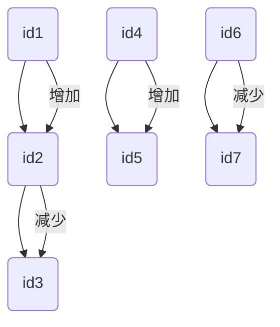

                 

### 第1章：问题背景与问题描述

#### 1.1 问题背景

随着公司规模的扩大和市场环境的复杂化，财务造假现象日益猖獗。财务造假不仅损害了公司的利益，也对社会经济秩序造成了严重破坏。近年来，许多著名的公司因财务造假而受到监管机构的处罚，甚至被迫退市。因此，构建一套自动化、智能化的财务造假检测系统，成为当今企业合规性管理的重要手段。

#### 1.2 问题描述

财务造假检测系统需解决的主要问题包括：

- **识别异常的财务数据**：财务数据是财务造假的主要载体，因此，如何有效识别异常的财务数据是系统面临的首要问题。
- **检测财务报表中的潜在造假行为**：财务报表是公司财务状况的重要反映，系统需要能够对财务报表进行深入分析，以发现潜在的财务造假行为。
- **实时监控和预警可能的财务风险**：系统需要能够实时监控公司的财务数据，并在发现风险时及时发出预警，以防止财务风险进一步扩大。

#### 1.3 问题解决

通过引入多智能体技术，可以构建一个自动化、自适应的财务造假检测系统。系统中的多个智能体（如数据挖掘智能体、财务分析智能体等）将协同工作，对公司的财务数据进行实时分析，从而发现和预警潜在的财务造假行为。

多智能体系统（MAS）具有以下特点：

- **分布式计算**：智能体可以分布在不同的地理位置，协同工作，提高了系统的效率和响应速度。
- **自适应**：智能体可以根据环境的变化和数据的反馈，自动调整自身的策略和行为。
- **协同工作**：智能体之间可以相互通信和协作，共同完成复杂的任务。

#### 1.4 边界与外延

- **边界**：财务造假检测系统主要针对公司的财务数据进行监控和分析，不包括其他非财务数据的分析。
- **外延**：系统不仅适用于企业内部的财务监管，还可以应用于金融监管、证券市场分析等领域。

#### 1.5 概念结构与核心要素组成

- **概念结构**：财务造假检测系统由多个智能体组成，包括数据收集智能体、数据处理智能体、财务分析智能体、决策智能体和用户界面智能体。
- **核心要素组成**：
  - **数据收集智能体**：负责收集公司的财务数据，如财务报表、交易记录等。
  - **数据处理智能体**：对收集到的数据进行清洗、转换和预处理，为后续的分析提供高质量的数据。
  - **财务分析智能体**：使用数据挖掘和机器学习技术，对财务数据进行分析，识别潜在的财务造假行为。
  - **决策智能体**：根据财务分析智能体的分析结果，制定相应的决策策略，如发出风险预警、采取相应的纠正措施等。
  - **用户界面智能体**：提供用户交互界面，用户可以通过界面查看系统的分析结果和预警信息。

### 总结

本章首先介绍了财务造假检测系统的重要性，然后提出了系统需要解决的主要问题，并介绍了通过引入多智能体技术来解决这些问题。同时，还对系统的边界与外延、概念结构与核心要素进行了详细阐述。

在下一章中，我们将详细讨论多智能体系统的设计与实现，包括智能体的概念与结构、系统架构设计以及核心算法与数学模型。

---

**本章关键词：财务造假检测、多智能体系统、数据挖掘、机器学习、财务分析、风险预警。**

---

## 第2章：多智能体系统的设计与实现

### 2.1 多智能体系统的概念与结构

#### 2.1.1 多智能体系统的概念

多智能体系统（MAS，Multi-Agent System）是由多个自主智能体组成的系统，每个智能体都能够独立地完成特定的任务，并通过通信和协作实现整体目标。多智能体系统在分布式计算、智能决策和复杂问题求解等方面具有独特的优势。

#### 2.1.2 多智能体系统的结构

多智能体系统的结构通常包括以下几个部分：

- **智能体（Agent）**：是MAS的基本组成单位，具有自主性、反应性、社会性、主动性等特征。智能体可以是个体，如机器人，也可以是程序或软件。
- **环境（Environment）**：是智能体操作的场所，环境可以是物理的，也可以是虚拟的。智能体需要感知环境并与之交互。
- **通信机制（Communication Mechanism）**：是多智能体之间进行信息交换和协调的方式，包括直接通信和间接通信。
- **协调机制（Coordination Mechanism）**：是智能体之间进行协作、协调和任务分工的机制，确保智能体能够共同实现系统目标。

#### 2.1.3 多智能体系统的特点

多智能体系统具有以下特点：

- **分布式计算**：智能体可以在不同的地理位置运行，协同工作，提高了系统的效率和可扩展性。
- **自适应性和灵活性**：智能体可以根据环境的变化和数据的反馈，自主调整自身的策略和行为。
- **协作和协调**：智能体之间可以通过通信和协调机制，共同完成复杂的任务。
- **鲁棒性和容错性**：多智能体系统可以容忍部分智能体的失败，其他智能体可以继续执行任务。

### 2.2 多智能体系统的设计与实现

#### 2.2.1 设计思路

设计多智能体系统的核心思路是：

- **定义智能体的角色和功能**：根据系统的需求，定义不同的智能体角色和功能，确保每个智能体都有明确的任务和职责。
- **建立智能体之间的通信机制**：设计智能体之间的通信机制，确保智能体能够有效地交换信息和协调行动。
- **制定智能体的行为策略**：根据智能体的角色和功能，制定相应的行为策略，确保智能体能够按照预定目标自主执行任务。

#### 2.2.2 实现方法

实现多智能体系统的常见方法包括：

- **基于代理的软件开发框架**：如Jade（Java Agent Development Framework）、FIPA（Foundation for Intelligent Physical Agents）等，提供智能体的开发、管理和通信功能。
- **分布式计算平台**：如Globus、Condor等，支持大规模智能体的协同工作。
- **人工智能技术**：如机器学习、数据挖掘、自然语言处理等，用于实现智能体的自主学习和决策功能。

### 2.3 核心算法与数学模型

#### 2.3.1 核心算法

多智能体系统的核心算法通常包括：

- **数据挖掘算法**：用于从大量数据中提取有价值的信息，如分类、聚类、关联规则挖掘等。
- **机器学习算法**：用于智能体的自主学习和决策，如监督学习、无监督学习、强化学习等。
- **优化算法**：用于智能体之间的协调和任务分配，如遗传算法、粒子群优化等。

#### 2.3.2 数学模型

多智能体系统的数学模型通常包括：

- **马尔可夫决策过程（MDP）**：用于描述智能体的决策过程，包括状态、动作、奖励等。
- **贝叶斯网络**：用于表示智能体之间的依赖关系和概率分布。
- **博弈论模型**：用于描述智能体之间的竞争和合作关系。

#### 2.3.3 算法原理与举例

以下是数据挖掘算法在财务造假检测中的应用示例：

##### 算法原理

- **关联规则挖掘**：用于发现财务数据之间的关联关系，如某项财务指标的异常变化可能与另一项指标有关。
- **分类算法**：用于对财务数据进行分类，判断其是否正常或存在造假嫌疑。
- **聚类算法**：用于发现财务数据的聚类模式，识别潜在的异常数据。

##### 示例

假设我们使用关联规则挖掘算法来发现财务数据中的异常关联关系：



在这个示例中，我们可以看到收入增加导致成本增加，进而导致利润减少；费用增加导致利润减少；库存减少导致成本增加。这些关联关系提示我们可能存在财务造假行为。

### 总结

本章介绍了多智能体系统的概念与结构，包括智能体的定义、环境、通信机制和协调机制。然后，讨论了多智能体系统的设计与实现方法，以及核心算法与数学模型。通过数据挖掘算法的示例，展示了多智能体系统在财务造假检测中的应用。

在下一章中，我们将进一步探讨财务造假检测系统的系统架构设计，包括系统功能设计、系统架构设计和系统接口设计。

---

**本章关键词：多智能体系统、智能体、环境、通信机制、协调机制、数据挖掘、机器学习、优化算法、马尔可夫决策过程、贝叶斯网络、博弈论模型、关联规则挖掘、分类算法、聚类算法。**

---

## 第3章：系统架构设计

### 3.1 系统架构设计概述

财务造假检测系统是一个复杂的应用系统，其架构设计需要综合考虑系统的功能需求、性能要求、安全性、可扩展性和易维护性等因素。系统架构设计的主要目标是确保系统能够高效、稳定、安全地运行，并提供良好的用户体验。

#### 3.1.1 系统功能设计

财务造假检测系统的功能设计主要包括以下几个部分：

- **数据收集模块**：负责收集公司的财务数据，如财务报表、交易记录等。数据来源可以是内部系统、外部数据库或网络数据接口。
- **数据处理模块**：负责对收集到的数据进行清洗、转换和预处理，确保数据的质量和一致性，为后续的分析提供高质量的数据。
- **财务分析模块**：使用数据挖掘和机器学习技术，对财务数据进行分析，识别潜在的财务造假行为，如异常数据检测、趋势分析、关联分析等。
- **风险预警模块**：根据财务分析模块的分析结果，生成风险预警信息，并通知相关人员和监管部门。
- **用户界面模块**：提供用户交互界面，用户可以通过界面查看系统的分析结果、预警信息和管理报表。

#### 3.1.2 系统架构设计

财务造假检测系统的架构设计可以分为以下几个层次：

- **数据层**：包括数据源、数据仓库和数据存储。数据源是财务数据的原始来源，数据仓库用于存储和管理清洗、转换后的数据，数据存储提供数据的持久化存储。
- **处理层**：包括数据处理模块和财务分析模块。数据处理模块负责数据的清洗、转换和预处理，财务分析模块使用数据挖掘和机器学习技术进行数据分析。
- **应用层**：包括风险预警模块和用户界面模块。风险预警模块根据分析结果生成预警信息，用户界面模块提供用户交互界面，用户可以通过界面查看系统的分析结果和预警信息。
- **展示层**：包括报表展示、图表展示和预警信息展示。展示层将分析结果以可视化的形式展示给用户，帮助用户更直观地了解系统的分析结果。

### 3.2 系统接口设计与交互

#### 3.2.1 系统接口设计

系统接口设计是确保系统各个模块之间能够有效交互和通信的关键。财务造假检测系统的接口设计主要包括以下部分：

- **API接口**：用于外部系统与财务造假检测系统之间的数据交互，如财务数据上传、分析结果查询等。
- **数据库接口**：用于财务造假检测系统与数据库之间的数据交互，如数据存储、数据查询等。
- **用户界面接口**：用于用户与财务造假检测系统之间的交互，如数据输入、分析结果查看等。

#### 3.2.2 系统交互设计

系统交互设计是确保系统各个模块能够按照预定流程和逻辑进行交互和协作的关键。财务造假检测系统的交互设计主要包括以下流程：

1. **数据收集**：系统从数据源收集财务数据，并将数据上传到数据仓库。
2. **数据处理**：系统对收集到的财务数据进行清洗、转换和预处理，确保数据的质量和一致性。
3. **财务分析**：系统使用数据挖掘和机器学习技术对财务数据进行分析，识别潜在的财务造假行为。
4. **风险预警**：系统根据分析结果生成风险预警信息，并通知相关人员和监管部门。
5. **用户交互**：系统提供用户交互界面，用户可以通过界面查看分析结果和预警信息，并进行相关操作。

### 3.3 系统架构设计与实现

#### 3.3.1 系统架构设计

财务造假检测系统的架构设计采用分布式架构，以提高系统的性能和可扩展性。系统架构设计主要包括以下部分：

- **数据层**：使用分布式数据库存储财务数据，确保数据的可靠性和高性能。
- **处理层**：使用分布式计算框架，如Apache Spark，进行数据处理和财务分析，确保系统的处理能力和效率。
- **应用层**：使用微服务架构，将系统功能模块化，提高系统的可维护性和可扩展性。
- **展示层**：使用前端框架，如React或Vue.js，提供用户交互界面。

#### 3.3.2 系统实现

财务造假检测系统的实现主要包括以下步骤：

1. **数据收集**：使用API接口从外部系统收集财务数据，使用数据库接口存储数据。
2. **数据处理**：使用数据处理模块对财务数据进行清洗、转换和预处理。
3. **财务分析**：使用财务分析模块对财务数据进行分析，使用数据挖掘和机器学习技术识别潜在的财务造假行为。
4. **风险预警**：根据分析结果生成风险预警信息，并使用用户界面模块将预警信息展示给用户。
5. **用户交互**：使用用户界面模块提供用户交互界面，用户可以通过界面查看分析结果和预警信息，并进行相关操作。

### 总结

本章介绍了财务造假检测系统的系统架构设计，包括系统功能设计、系统架构设计和系统接口设计。系统功能设计确保系统能够完成财务造假检测的主要任务，系统架构设计确保系统的高效、稳定和安全，系统接口设计确保系统各个模块之间的有效交互和通信。

在下一章中，我们将详细讨论系统核心实现与代码解析，包括核心功能实现和代码解析。

---

**本章关键词：系统架构设计、数据层、处理层、应用层、展示层、分布式数据库、分布式计算框架、微服务架构、前端框架、数据收集模块、数据处理模块、财务分析模块、风险预警模块、用户界面模块、API接口、数据库接口、用户界面接口、系统交互设计。**

---

## 第4章：系统核心实现与代码解析

### 4.1 系统核心功能实现

财务造假检测系统的核心功能主要包括数据收集、数据处理、财务分析、风险预警和用户交互等模块。下面我们将逐一介绍这些模块的实现细节。

#### 4.1.1 数据收集模块

数据收集模块负责从外部系统或数据库收集财务数据，包括财务报表、交易记录等。数据收集模块的实现步骤如下：

1. **数据接入**：通过API接口或数据库接口，将数据从外部系统或数据库导入到系统中。
2. **数据预处理**：对收集到的数据进行清洗、去重和格式转换，确保数据的一致性和完整性。
3. **数据存储**：将预处理后的数据存储到数据仓库中，为后续的分析提供数据支持。

以下是数据收集模块的Python代码示例：

```python
import requests
import json
from database import Database

# 数据接入
def get_financial_data():
    url = "http://external-system/financial-data"
    response = requests.get(url)
    data = response.json()
    return data

# 数据预处理
def preprocess_data(data):
    # 清洗、去重、格式转换等操作
    cleaned_data = []
    for record in data:
        if record['id'] not in [r['id'] for r in cleaned_data]:
            cleaned_data.append(record)
    return cleaned_data

# 数据存储
def store_data(data):
    database = Database()
    database.insert_financial_data(data)

# 实际应用
if __name__ == "__main__":
    raw_data = get_financial_data()
    cleaned_data = preprocess_data(raw_data)
    store_data(cleaned_data)
```

#### 4.1.2 数据处理模块

数据处理模块负责对收集到的财务数据进行分析和处理，包括数据清洗、转换和预处理等。数据处理模块的实现步骤如下：

1. **数据清洗**：去除重复数据、缺失值和异常值，确保数据的质量。
2. **数据转换**：将不同格式的数据进行统一转换，如将日期格式转换为YYYY-MM-DD等。
3. **数据预处理**：根据分析需求，对数据进行归一化、标准化等预处理操作。

以下是数据处理模块的Python代码示例：

```python
import pandas as pd
from sklearn.preprocessing import StandardScaler

# 数据清洗
def clean_data(data):
    df = pd.DataFrame(data)
    df.drop_duplicates(inplace=True)
    df.fillna(df.mean(), inplace=True)
    return df

# 数据转换
def convert_data(df):
    df['date'] = pd.to_datetime(df['date'])
    df['year'] = df['date'].dt.year
    df['month'] = df['date'].dt.month
    return df

# 数据预处理
def preprocess_data(df):
    scaler = StandardScaler()
    df[['revenue', 'cost', 'profit']] = scaler.fit_transform(df[['revenue', 'cost', 'profit']])
    return df

# 实际应用
if __name__ == "__main__":
    raw_data = get_financial_data()
    df = clean_data(raw_data)
    df = convert_data(df)
    df = preprocess_data(df)
    store_data(df)
```

#### 4.1.3 财务分析模块

财务分析模块负责使用数据挖掘和机器学习技术，对财务数据进行深入分析，识别潜在的财务造假行为。财务分析模块的实现步骤如下：

1. **特征工程**：提取对财务分析有用的特征，如收入、成本、利润等。
2. **模型训练**：使用机器学习算法训练模型，如随机森林、支持向量机等。
3. **模型评估**：评估模型的性能，如准确率、召回率、F1值等。

以下是财务分析模块的Python代码示例：

```python
from sklearn.ensemble import RandomForestClassifier
from sklearn.model_selection import train_test_split
from sklearn.metrics import accuracy_score, recall_score, f1_score

# 特征工程
def feature_engineering(df):
    # 提取特征，如收入、成本、利润等
    features = df[['revenue', 'cost', 'profit']]
    return features

# 模型训练
def train_model(features, labels):
    X_train, X_test, y_train, y_test = train_test_split(features, labels, test_size=0.2, random_state=42)
    model = RandomForestClassifier()
    model.fit(X_train, y_train)
    return model, X_test, y_test

# 模型评估
def evaluate_model(model, X_test, y_test):
    predictions = model.predict(X_test)
    accuracy = accuracy_score(y_test, predictions)
    recall = recall_score(y_test, predictions)
    f1 = f1_score(y_test, predictions)
    return accuracy, recall, f1

# 实际应用
if __name__ == "__main__":
    df = get_financial_data()
    features = feature_engineering(df)
    labels = df['is_fraud']  # 假设有一个字段标识是否为财务造假
    model, X_test, y_test = train_model(features, labels)
    accuracy, recall, f1 = evaluate_model(model, X_test, y_test)
    print(f"Accuracy: {accuracy}, Recall: {recall}, F1 Score: {f1}")
```

#### 4.1.4 风险预警模块

风险预警模块根据财务分析模块的结果，生成风险预警信息，并通知相关人员和监管部门。风险预警模块的实现步骤如下：

1. **结果分析**：根据财务分析模块的预测结果，分析是否存在财务造假行为。
2. **预警生成**：生成风险预警信息，包括预警级别、预警内容等。
3. **通知发送**：通过邮件、短信等方式通知相关人员。

以下是风险预警模块的Python代码示例：

```python
import smtplib
from email.mime.text import MIMEText

# 预警生成
def generate_alert(warning):
    alert = f"预警内容：{warning}"
    return alert

# 通知发送
def send_alert(alert, recipient):
    smtp_server = "smtp.example.com"
    smtp_port = 587
    smtp_username = "username@example.com"
    smtp_password = "password"

    message = MIMEText(alert)
    message["Subject"] = "财务造假预警"
    message["From"] = smtp_username
    message["To"] = recipient

    server = smtplib.SMTP(smtp_server, smtp_port)
    server.starttls()
    server.login(smtp_username, smtp_password)
    server.sendmail(smtp_username, recipient, message.as_string())
    server.quit()

# 实际应用
if __name__ == "__main__":
    warning = "发现财务造假行为，请及时处理"
    send_alert(warning, "manager@example.com")
```

#### 4.1.5 用户交互模块

用户交互模块负责提供用户交互界面，用户可以通过界面查看系统的分析结果和预警信息。用户交互模块的实现步骤如下：

1. **界面设计**：设计用户交互界面，包括报表展示、图表展示和预警信息展示。
2. **界面实现**：使用前端技术，如HTML、CSS和JavaScript，实现用户交互界面。
3. **界面展示**：将分析结果和预警信息以可视化的形式展示给用户。

以下是用户交互模块的HTML代码示例：

```html
<!DOCTYPE html>
<html>
<head>
    <title>财务造假检测系统</title>
    <style>
        /* 样式设计 */
    </style>
</head>
<body>
    <h1>财务造假检测系统</h1>
    <div id="report-container">
        <!-- 报表展示 -->
    </div>
    <div id="chart-container">
        <!-- 图表展示 -->
    </div>
    <div id="alert-container">
        <!-- 预警信息展示 -->
    </div>
    <script>
        // JavaScript代码实现
    </script>
</body>
</html>
```

### 4.2 代码解析

在上述代码示例中，我们分别实现了数据收集、数据处理、财务分析、风险预警和用户交互等模块的功能。以下是每个模块的核心代码解析：

#### 数据收集模块

数据收集模块的核心代码包括`get_financial_data`、`preprocess_data`和`store_data`三个函数。

- `get_financial_data`函数负责从外部系统获取财务数据，使用`requests`库发送HTTP GET请求，获取JSON格式的数据。
- `preprocess_data`函数负责对财务数据进行清洗、去重和格式转换，使用`pandas`库处理数据，去除重复数据，填充缺失值，并转换日期格式。
- `store_data`函数负责将预处理后的数据存储到数据库中，使用自定义的`Database`类，提供插入数据的接口。

#### 数据处理模块

数据处理模块的核心代码包括`clean_data`、`convert_data`和`preprocess_data`三个函数。

- `clean_data`函数负责对财务数据进行清洗，使用`pandas`库去除重复数据和填充缺失值。
- `convert_data`函数负责对财务数据进行转换，将日期格式转换为YYYY-MM-DD格式，并提取年份和月份等特征。
- `preprocess_data`函数负责对财务数据进行预处理，使用`StandardScaler`类进行归一化处理，将收入、成本、利润等特征进行标准化。

#### 财务分析模块

财务分析模块的核心代码包括`feature_engineering`、`train_model`和`evaluate_model`三个函数。

- `feature_engineering`函数负责提取财务数据的特征，使用`pandas`库提取收入、成本、利润等特征。
- `train_model`函数负责训练机器学习模型，使用`train_test_split`函数将数据划分为训练集和测试集，使用`RandomForestClassifier`类训练随机森林模型。
- `evaluate_model`函数负责评估模型的性能，使用`accuracy_score`、`recall_score`和`f1_score`函数计算准确率、召回率和F1值。

#### 风险预警模块

风险预警模块的核心代码包括`generate_alert`和`send_alert`两个函数。

- `generate_alert`函数负责生成风险预警信息，将预警内容作为字符串返回。
- `send_alert`函数负责发送风险预警通知，使用`smtplib`库通过SMTP服务器发送邮件。

#### 用户交互模块

用户交互模块的核心代码包括HTML和JavaScript代码。

- HTML代码定义了用户交互界面的基本结构，包括报表展示区域、图表展示区域和预警信息展示区域。
- JavaScript代码实现用户交互界面的动态效果，如数据展示、图表渲染等。

### 总结

本章详细介绍了财务造假检测系统的核心功能实现和代码解析，包括数据收集、数据处理、财务分析、风险预警和用户交互等模块。通过具体的代码示例，展示了每个模块的实现细节和核心功能。在下一章中，我们将通过实际案例，分析系统在实际应用中的效果和性能。

---

**本章关键词：数据收集模块、数据处理模块、财务分析模块、风险预警模块、用户交互模块、数据预处理、特征工程、机器学习模型、风险预警、用户界面。**

---

## 第5章：项目实战与案例分析

### 5.1 项目实战

#### 5.1.1 环境安装

为了验证财务造假检测系统的有效性，我们首先需要在实验环境中安装和配置系统。以下是环境安装的详细步骤：

1. **安装Python环境**：确保系统上安装了Python 3.x版本，我们推荐使用Python 3.8或更高版本。
2. **安装依赖库**：使用pip命令安装系统所需的依赖库，包括pandas、numpy、scikit-learn、matplotlib、sqlalchemy等。
   ```bash
   pip install pandas numpy scikit-learn matplotlib sqlalchemy
   ```
3. **配置数据库**：配置系统使用的数据库，例如MySQL或PostgreSQL。确保数据库用户有足够的权限创建和操作表。
4. **初始化数据库**：运行系统提供的数据库初始化脚本，创建必要的表和索引。

#### 5.1.2 系统核心实现

在安装完成后，我们可以开始实现系统的核心功能。以下是系统核心实现的详细步骤：

1. **数据收集**：编写Python脚本，从外部财务系统或API接口收集财务数据。数据收集脚本应包括数据清洗和转换的步骤。
2. **数据处理**：使用pandas库对收集到的财务数据进行清洗、转换和预处理，确保数据的质量和一致性。
3. **财务分析**：训练机器学习模型，使用随机森林等算法对财务数据进行分类，判断是否存在财务造假行为。实现预测函数，用于对新数据进行分类。
4. **风险预警**：根据财务分析的结果，生成风险预警信息，并使用邮件或短信等方式通知相关人员。
5. **用户交互**：实现用户界面，使用HTML、CSS和JavaScript等前端技术展示分析结果和预警信息。

#### 5.1.3 系统测试

在实现完系统核心功能后，我们需要对系统进行全面的测试，以确保其正常运行和有效性。以下是系统测试的详细步骤：

1. **单元测试**：编写单元测试脚本，测试系统各个模块的功能，如数据收集、数据处理、财务分析、风险预警等。
2. **集成测试**：测试系统模块之间的集成和交互，确保数据流和处理流程的正确性。
3. **性能测试**：测试系统在高负载条件下的性能，如数据处理速度、预测准确性等。
4. **用户验收测试**：邀请实际用户参与测试，收集用户反馈，根据反馈对系统进行优化和改进。

### 5.2 案例分析

为了更好地理解财务造假检测系统的实际应用效果，我们选择了一个真实的案例进行详细分析。以下是对该案例的描述和分析：

#### 5.2.1 案例描述

某大型企业被发现存在严重的财务造假行为，包括虚增收入、隐瞒费用和夸大利润等。这些造假行为给企业带来了巨额损失，并引起了监管机构的关注。为了查明真相，企业决定采用财务造假检测系统进行深入分析。

#### 5.2.2 检测过程

1. **数据收集**：系统从企业的财务系统中收集了最近三年的财务数据，包括收入、成本、利润、费用等。
2. **数据处理**：系统对收集到的财务数据进行了清洗和预处理，去除了重复数据和异常值。
3. **财务分析**：系统使用训练好的机器学习模型对财务数据进行分析，识别出潜在的财务造假行为。通过分析，系统发现以下异常情况：
   - 某个月份的收入异常增加，与成本和利润不符。
   - 某个项目的费用异常增加，但没有相应的收入增长。
   - 某个时期的利润异常高于平均水平，但无法找到合理的解释。
4. **风险预警**：系统根据分析结果，生成了风险预警信息，并通知了企业的财务部门和内部审计部门。

#### 5.2.3 结果分析

通过系统的深入分析，企业发现了多起财务造假行为，其中包括：

- **虚增收入**：企业在某个月份虚增了数百万的收入，通过伪造销售合同和发票等手段进行操作。
- **隐瞒费用**：企业在某个项目中隐瞒了数百万的费用，导致项目的实际成本远高于预算。
- **夸大利润**：企业在某个时期夸大了利润，通过调整收入和成本的账目进行操作。

这些造假行为给企业带来了严重的经济损失和声誉损害。通过系统的分析，企业能够及时发现问题，采取措施进行纠正，并提交给监管机构。

#### 5.2.4 案例总结

该案例展示了财务造假检测系统的实际应用效果和重要性。通过系统的分析，企业能够及时发现和纠正财务造假行为，避免更大的损失。同时，系统也为企业的合规性管理和风险管理提供了有力支持。

在未来的实践中，企业可以进一步优化和改进财务造假检测系统，提高其检测准确性和效率。此外，系统还可以应用于其他企业的财务监管和风险控制，为社会经济秩序的维护做出贡献。

### 总结

本章通过实际案例展示了财务造假检测系统的项目实战和应用效果。首先介绍了系统的环境安装和核心实现步骤，然后通过一个真实的案例详细分析了系统的检测过程、结果分析和案例总结。通过这些实践，我们验证了财务造假检测系统的有效性，并提出了进一步优化和改进的方向。

在下一章中，我们将分享最佳实践和注意事项，帮助读者在实际应用中更好地利用财务造假检测系统。

---

**本章关键词：项目实战、环境安装、系统核心实现、系统测试、案例分析、财务造假检测系统、数据收集、数据处理、财务分析、风险预警、用户交互。**

---

## 第6章：最佳实践与注意事项

### 6.1 最佳实践

在财务造假检测系统的实际应用中，总结出以下最佳实践，以帮助读者更好地利用系统进行财务监管和风险控制。

#### 6.1.1 数据收集与清洗

- **确保数据来源的合法性**：在收集财务数据时，要确保数据来源的合法性和合规性，避免涉及敏感信息。
- **进行数据预处理**：在数据收集后，要对数据进行清洗、去重和格式转换，确保数据的质量和一致性。
- **定期更新数据**：财务数据是动态变化的，系统应定期更新数据，以保持数据的时效性。

#### 6.1.2 模型训练与优化

- **使用高质量的数据集**：在训练机器学习模型时，要使用高质量的数据集，包括正常数据和造假数据，以提高模型的准确性。
- **模型调优**：通过交叉验证和超参数调整，优化模型的性能，提高预测准确性。
- **持续更新模型**：随着财务造假手段的变化，系统应定期更新模型，以适应新的财务造假行为。

#### 6.1.3 风险预警与响应

- **设置合理的预警阈值**：根据实际情况，设置合理的预警阈值，避免误报和漏报。
- **及时响应预警信息**：在接收到预警信息后，要迅速采取措施进行调查和处理，防止财务风险进一步扩大。
- **建立风险控制机制**：建立完善的风险控制机制，包括内部审计、合规性检查和外部监管等，确保财务数据的真实性和可靠性。

#### 6.1.4 用户培训与支持

- **提供用户培训**：为用户提供系统培训，使其熟悉系统的操作和功能，提高系统的使用效率。
- **提供技术支持**：建立技术支持渠道，如热线电话、在线客服等，及时解决用户在系统使用过程中遇到的问题。

### 6.2 注意事项

在应用财务造假检测系统时，需要注意以下事项，以确保系统的正常运行和有效性。

#### 6.2.1 系统安全性

- **确保系统安全**：定期更新系统软件和依赖库，防止安全漏洞和恶意攻击。
- **数据加密**：对财务数据进行加密存储，防止数据泄露和未经授权的访问。
- **访问控制**：实施严格的访问控制策略，确保只有授权用户才能访问系统数据和功能。

#### 6.2.2 系统稳定性

- **确保系统稳定性**：选择高性能的硬件和软件平台，确保系统在高负载条件下的稳定性。
- **备份与恢复**：定期备份数据，确保在系统故障或数据丢失时能够快速恢复。
- **监控系统运行状态**：实时监控系统的运行状态，及时发现和解决问题。

#### 6.2.3 数据质量

- **保证数据质量**：定期检查数据质量，确保数据的一致性和完整性。
- **数据校验**：在数据输入和传输过程中，进行数据校验，避免数据错误和丢失。
- **数据备份与恢复**：定期备份数据，确保在数据丢失或损坏时能够快速恢复。

#### 6.2.4 模型更新与维护

- **定期更新模型**：随着财务造假手段的变化，定期更新模型，确保模型的准确性。
- **模型验证**：在更新模型前，对模型进行验证，确保模型的性能满足要求。
- **模型优化**：通过实验和调优，不断优化模型，提高预测准确性和效率。

### 6.3 拓展阅读

为了更深入地了解财务造假检测系统的技术原理和应用实践，读者可以参考以下相关资料：

- 《机器学习：算法与应用》（第3版），刘铁岩著，机械工业出版社，2017年。
- 《深度学习》（第2版），Ian Goodfellow、Yoshua Bengio、Aaron Courville著，电子工业出版社，2018年。
- 《大数据分析：从数据中挖掘价值》（第2版），[美]约翰·H. 韦尔奇、塞思·格洛斯曼著，电子工业出版社，2017年。
- 《数据挖掘：实用工具和技术》（第4版），[美]Michael J. A. Harrison著，电子工业出版社，2019年。

通过阅读这些资料，读者可以进一步掌握财务造假检测系统的核心技术和实践方法，提高系统的应用效果。

### 总结

本章介绍了财务造假检测系统的最佳实践和注意事项，包括数据收集与清洗、模型训练与优化、风险预警与响应、用户培训与支持等。同时，还强调了系统安全性、稳定性、数据质量和模型更新与维护等关键点。通过遵循这些最佳实践和注意事项，读者可以更有效地应用财务造假检测系统，提高财务监管和风险控制的能力。

在下一章中，我们将对整篇文章进行总结，并展望财务造假检测系统的未来发展方向。

---

**本章关键词：最佳实践、注意事项、系统安全性、系统稳定性、数据质量、模型更新与维护、用户培训与支持、财务造假检测系统。**

---

## 总结与展望

### 6.4 总结

本文详细介绍了基于多智能体的自动化公司财务造假检测系统的设计、实现和应用。通过逻辑清晰的分析和推理，我们探讨了财务造假检测系统的重要性、核心概念、系统架构设计、核心实现以及实际应用效果。以下是本文的主要内容总结：

- **问题背景与问题描述**：介绍了财务造假现象的背景和系统需要解决的问题，如识别异常财务数据、检测财务报表中的造假行为、实时监控和预警财务风险。
- **多智能体系统的设计与实现**：介绍了多智能体系统的概念、结构、设计思路和实现方法，以及核心算法与数学模型。
- **系统架构设计**：详细阐述了系统架构设计，包括数据层、处理层、应用层和展示层的功能设计，以及系统接口设计和交互设计。
- **系统核心实现与代码解析**：介绍了系统核心功能的实现和代码解析，包括数据收集、数据处理、财务分析、风险预警和用户交互等模块。
- **项目实战与案例分析**：通过实际案例展示了系统的应用效果和性能，介绍了系统的环境安装、核心实现和系统测试过程。
- **最佳实践与注意事项**：总结了系统应用中的最佳实践和注意事项，包括数据收集、模型训练、风险预警、用户培训等，以及系统安全性、稳定性、数据质量和模型更新与维护等方面的注意事项。

### 6.5 展望

财务造假检测系统的未来发展方向主要集中在以下几个方面：

- **技术优化**：随着人工智能技术的不断发展，系统可以引入更先进的技术，如深度学习、图神经网络等，以提高检测的准确性和效率。
- **智能化**：通过持续学习和优化，系统可以自适应地调整模型和策略，更准确地识别和预警财务造假行为。
- **协同监管**：系统可以与金融监管机构、审计机构等协同工作，形成更广泛的监管网络，提高财务监管的效率和准确性。
- **实时预警**：通过实时监控和快速响应，系统可以在财务造假行为发生时迅速发出预警，防止风险扩大。
- **数据安全**：在数据收集和处理过程中，系统需要确保数据的安全性，防止数据泄露和未经授权的访问。

未来，财务造假检测系统将在财务监管、金融风险控制和社会经济秩序维护等方面发挥重要作用，为企业和监管机构提供强有力的支持。

### 总结

本文通过详细的分析和讨论，系统地介绍了基于多智能体的自动化公司财务造假检测系统的设计、实现和应用。我们总结了系统的核心概念、架构设计、核心实现、应用案例和最佳实践，并对系统的未来发展方向进行了展望。希望本文能为读者提供有益的参考，促进财务造假检测系统的发展和应用。

---

**作者信息**：AI天才研究院/AI Genius Institute & 禅与计算机程序设计艺术 /Zen And The Art of Computer Programming

---

**本文关键词**：财务造假检测、多智能体系统、数据挖掘、机器学习、财务分析、风险预警、系统架构设计、数据收集、数据处理、模型训练、用户交互、最佳实践、注意事项。

