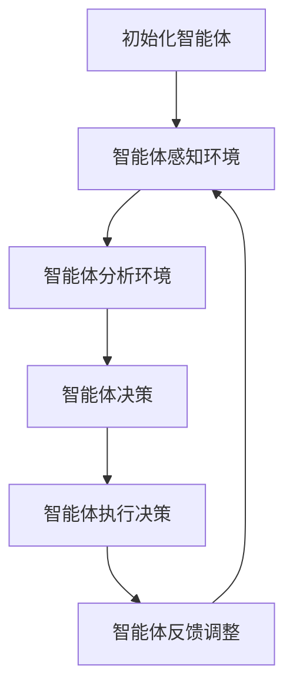
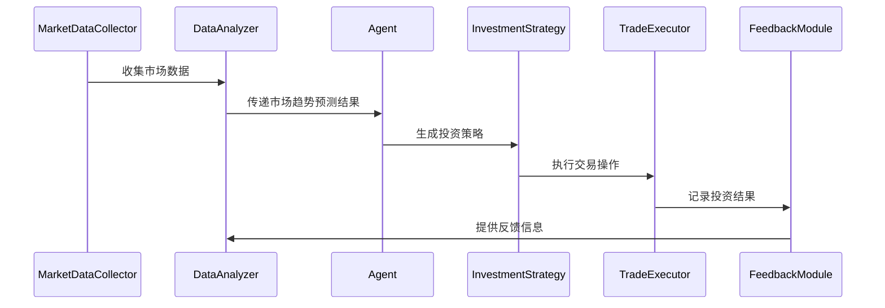

                 

### 第1章：问题背景与核心概念

#### 1.1 问题背景

##### 1.1.1 价值投资理念的起源与发展

价值投资是一种基于长期持有优质股票，以公司基本面为分析依据的投资策略。其概念最早由本杰明·格雷厄姆（Benjamin Graham）提出，并在后来的沃伦·巴菲特（Warren Buffett）等投资大师的推广下，成为了一种备受推崇的投资哲学。价值投资的核心思想是寻找市场价值被低估的股票，通过长期持有以期获得公司内在价值的提升。

随着信息技术的快速发展，价值投资策略也在不断地演进。传统的价值投资主要依赖于手工分析，而现代价值投资则更多地利用数据分析和智能算法。多智能体系统作为一种新型的计算模型，其复杂性与适应性使得其在价值投资策略中有着广泛的应用前景。

##### 1.1.2 多智能体系统在投资领域的应用

多智能体系统（Multi-Agent Systems，MAS）是由多个相互独立的智能体组成的系统，每个智能体具有自主性、社会性和反应性。在投资领域，多智能体系统可以通过模拟多个投资者的行为，对市场进行预测和分析。

多智能体系统的优势在于其可以模仿现实世界中投资者行为的多样性，从而提高预测的准确性。此外，多智能体系统还可以通过自适应机制，对市场变化做出快速反应，从而实现风险的最小化和收益的最大化。

##### 1.1.3 自适应价值投资策略的必要性

自适应价值投资策略是指通过不断地调整和优化投资策略，以适应市场变化的一种投资方法。在传统的价值投资策略中，投资者往往需要根据市场情况定期调整投资组合，而这种调整往往是基于经验和直觉。

然而，随着市场环境的不断变化，传统的价值投资策略可能无法适应新的市场形势。自适应价值投资策略则通过引入智能算法和数据分析，使得投资策略可以自动调整，从而更好地应对市场变化。

#### 1.2 核心概念

##### 1.2.1 多智能体系统

多智能体系统由多个智能体组成，每个智能体具有以下特征：

- **自主性**：智能体能够自主决定自己的行为，不受其他智能体的控制。
- **社会性**：智能体之间可以相互通信和协作，以实现共同的目标。
- **反应性**：智能体能够对外界环境的变化做出及时的反应。

在多智能体系统中，智能体可以通过以下方式进行通信：

- **直接通信**：智能体直接向其他智能体发送消息。
- **间接通信**：智能体通过共享的通信介质发送消息。

多智能体系统的基本结构包括：

- **智能体**：执行特定任务的独立实体。
- **通信网络**：连接智能体的通信渠道。
- **环境**：智能体所在的外部世界，智能体可以通过感知环境来获取信息。

##### 1.2.2 价值投资策略

价值投资策略的核心是寻找市场价值被低估的股票。这通常需要通过以下步骤实现：

1. **公司分析**：分析公司的财务报表、业务模式、市场地位等，以评估其内在价值。
2. **市场分析**：分析市场趋势、投资者情绪等，以判断股票的市场价值。
3. **投资决策**：根据公司分析和市场分析的结果，做出投资决策。

价值投资策略的三大支柱是：

- **基本面分析**：通过分析公司的财务报表、业务模式等，评估其内在价值。
- **市场时机**：通过分析市场趋势、投资者情绪等，判断投资时机。
- **风险管理**：通过分散投资、止损等手段，降低投资风险。

##### 1.2.3 自适应机制

自适应机制是指系统能够根据外界环境和内部状态的变化，自动调整其行为和策略的能力。在价值投资策略中，自适应机制可以通过以下方式实现：

- **实时数据监控**：监控系统运行状态，及时发现异常情况。
- **策略调整**：根据实时数据监控结果，调整投资策略。
- **反馈机制**：通过投资结果反馈，不断优化投资策略。

#### 1.3 边界与外延

价值投资与市场波动的关系：

- 价值投资强调长期持有，市场波动对投资决策的影响相对较小。
- 但是，市场波动仍然会影响股票价格，从而影响投资回报。

多智能体系统在投资中的角色：

- 多智能体系统可以模拟投资者行为，提供市场预测和分析。
- 通过智能体的自主性和协作性，提高投资决策的准确性。

自适应策略在不同市场环境下的表现：

- 在市场稳定的环境下，自适应策略能够快速适应市场变化，提高投资回报。
- 在市场波动较大的环境下，自适应策略能够降低投资风险，保持投资稳定性。

#### 1.4 概念结构与核心要素组成

多智能体系统在价值投资中的应用架构：

- **感知层**：智能体通过感知市场数据，获取投资信息。
- **决策层**：智能体根据感知信息，进行投资决策。
- **执行层**：智能体执行投资决策，进行交易操作。

自适应价值投资策略的关键要素：

- **市场数据监控**：实时收集市场数据，为投资决策提供依据。
- **投资策略调整**：根据市场数据变化，动态调整投资策略。
- **风险控制**：通过分散投资、止损等手段，控制投资风险。

核心算法与模型构成：

- **智能体模型**：描述智能体的行为和决策过程。
- **市场预测模型**：预测市场趋势和投资者情绪。
- **投资决策模型**：根据市场预测结果，做出投资决策。

#### 1.5 本章小结

本章介绍了基于多智能体系统的自适应价值投资策略的背景和核心概念。通过对价值投资、多智能体系统、自适应机制等概念的深入分析，我们为后续章节的详细探讨奠定了基础。接下来，我们将进一步探讨多智能体系统的原理、价值投资策略、自适应机制，以及它们的相互作用和核心算法。这些内容将为设计一个高效的、自适应的价值投资策略提供理论和实践支持。### 第2章：核心概念与联系

#### 2.1 多智能体系统原理

多智能体系统（MAS）是一种由多个智能体组成的分布式系统，这些智能体在自主性、社会性和反应性的基础上协作，以实现特定目标。智能体（Agent）是MAS的基本组成单位，它们具有以下特点：

- **自主性**：智能体能够独立决策，不受外部控制。
- **社会性**：智能体之间可以通过通信和协作，共享信息和资源。
- **反应性**：智能体能够感知环境变化，并对此做出反应。

智能体可以分为以下几类：

- **主动智能体**：主动发起行为，与其他智能体或环境交互。
- **被动智能体**：响应其他智能体的行为，参与协作。
- **混合智能体**：同时具有主动和被动特征。

多智能体系统中的通信机制主要包括直接通信和间接通信：

- **直接通信**：智能体通过直接发送消息进行交互。
- **间接通信**：智能体通过共享的通信介质（如黑板系统）进行信息交换。

多智能体系统的协调与优化是实现系统高效运行的关键。协调机制包括：

- **集中式协调**：由中心控制器统一分配任务，协调智能体行为。
- **分布式协调**：智能体通过协商和协作，自主完成任务分配。

优化策略包括：

- **任务分配**：根据智能体的能力和任务需求，合理分配任务。
- **资源调度**：优化智能体之间的资源分配，提高系统效率。
- **负载均衡**：平衡系统负载，避免智能体过载或闲置。

#### 2.2 价值投资策略

价值投资策略是一种以寻找市场价值被低估的股票为核心的投资方法。它强调通过深入分析公司的基本面，如财务状况、业务模式、市场地位等，来评估其内在价值。价值投资策略的核心原则包括：

- **基本面分析**：通过分析公司的财务报表、业务模式等，评估其内在价值。
- **市场时机**：通过分析市场趋势、投资者情绪等，判断投资时机。
- **风险管理**：通过分散投资、止损等手段，控制投资风险。

价值投资的三大支柱是：

- **价值发现**：寻找市场价值被低估的股票。
- **长期持有**：以长期投资为目标，不因市场波动而轻易改变投资决策。
- **耐心与坚持**：在市场低迷时保持信心，坚持长期投资理念。

在实际应用中，价值投资策略需要结合以下技巧：

- **低买高卖**：在股票价格低于其内在价值时买入，等待市场认识到其价值时卖出。
- **分散投资**：通过投资多个不同行业的股票，降低风险。
- **定期回顾**：定期检查投资组合，调整策略以应对市场变化。

#### 2.3 自适应机制

自适应机制是指系统能够根据外界环境和内部状态的变化，自动调整其行为和策略的能力。在投资领域，自适应机制尤为重要，因为市场环境是动态变化的，投资者需要能够快速适应这些变化。

自适应机制的主要类型包括：

- **参数自适应**：系统通过调整参数来适应新的环境。
- **结构自适应**：系统根据新的环境需求，重新设计其结构和算法。
- **策略自适应**：系统根据新的环境信息，调整其投资策略。

在价值投资中，自适应机制的应用主要体现在以下几个方面：

- **市场数据监控**：实时收集和分析市场数据，为投资决策提供依据。
- **策略调整**：根据市场数据变化，动态调整投资策略。
- **风险控制**：通过自适应机制，及时调整风险控制策略。

#### 2.4 概念属性特征对比表格

为了更清晰地展示多智能体系统、价值投资策略和自适应机制的概念属性特征，我们可以制作一个对比表格：

| 特征 | 多智能体系统 | 价值投资策略 | 自适应机制 |
| --- | --- | --- | --- |
| 目标 | 分布式任务协作 | 发现和持有低估股票 | 快速适应市场变化 |
| 自主性 | 智能体独立决策 | 分析和决策依据基本面 | 自动调整策略 |
| 社会性 | 智能体间协作 | 投资者群体行为分析 | 策略和参数调整 |
| 反应性 | 对环境变化快速反应 | 根据市场变化调整投资 | 根据数据调整策略 |
| 数据依赖 | 市场数据和交易信息 | 公司基本面和市场数据 | 历史数据和实时数据 |

#### 2.5 ER实体关系图架构

为了更好地理解多智能体系统、价值投资策略和自适应机制之间的关系，我们可以绘制一个ER实体关系图。以下是一个简单的ER图示例，展示了这些核心概念之间的联系：

```mermaid
erDiagram
  Company ||--|{ Investor }
  Company ||--|{ Market }
  Investor ||--|{ InvestmentStrategy }
  Investor ||--|{ AdaptiveMechanism }
  Market ||--|{ MarketData }
  InvestmentStrategy ||--|{ ValueInvestment }
  AdaptiveMechanism ||--|{ ParameterAdaptation }
  AdaptiveMechanism ||--|{ StructureAdaptation }
```

在这个ER图中：

- **Company**（公司）与**Investor**（投资者）、**Market**（市场）之间存在关联。
- **Investor**（投资者）与**InvestmentStrategy**（投资策略）、**AdaptiveMechanism**（自适应机制）相关。
- **Market**（市场）与**MarketData**（市场数据）相关。
- **InvestmentStrategy**（投资策略）与**ValueInvestment**（价值投资）相关。
- **AdaptiveMechanism**（自适应机制）与**ParameterAdaptation**（参数自适应）、**StructureAdaptation**（结构自适应）相关。

#### 2.6 本章小结

本章详细介绍了多智能体系统、价值投资策略和自适应机制的核心概念及其相互联系。通过对比表格和ER实体关系图，我们清晰地展示了这些概念之间的关联。在下一章中，我们将进一步探讨多智能体协同算法的原理，以及如何将这些概念应用于自适应价值投资策略的设计和实现。### 第3章：算法原理讲解

#### 3.1 多智能体协同算法

多智能体协同算法是多智能体系统（MAS）中的一种核心算法，它用于实现多个智能体之间的协作，以完成复杂任务。本节将介绍多智能体协同算法的基本原理、流程图、Python源代码实现、数学模型与公式，以及举例说明。

##### 3.1.1 算法流程图

多智能体协同算法的基本流程图如下：



在这个流程图中：

- **A**：初始化智能体，包括设置智能体的初始状态和属性。
- **B**：智能体感知环境，通过传感器获取环境信息。
- **C**：智能体分析环境，对感知到的信息进行分析和处理。
- **D**：智能体决策，根据环境分析和策略模型做出决策。
- **E**：智能体执行决策，执行预定的行动。
- **F**：智能体反馈调整，根据执行结果进行反馈，调整智能体状态和策略。

##### 3.1.2 Python源代码实现

以下是一个简单的多智能体协同算法的Python源代码实现：

```python
import random

# 定义智能体类
class Agent:
    def __init__(self, id):
        self.id = id
        self.state = "initial"
    
    def sense(self, environment):
        # 感知环境
        self.environment = environment
    
    def analyze(self):
        # 分析环境
        if self.environment > 0.5:
            self.state = "positive"
        else:
            self.state = "negative"
    
    def decide(self):
        # 做出决策
        if self.state == "positive":
            self.action = "buy"
        else:
            self.action = "sell"
    
    def execute(self):
        # 执行决策
        print(f"Agent {self.id} is {self.action}")
    
    def feedback(self, result):
        # 反馈调整
        if result == "success":
            self.state = "positive" if self.state != "positive" else "negative"

# 初始化环境
environment = random.random()

# 创建智能体
agents = [Agent(i) for i in range(5)]

# 执行多智能体协同算法
for agent in agents:
    agent.sense(environment)
    agent.analyze()
    agent.decide()
    agent.execute()
    agent.feedback("success")
```

##### 3.1.3 数学模型与公式

多智能体协同算法的数学模型通常包括以下部分：

- **状态模型**：描述智能体当前的状态，通常用状态变量表示。
- **感知模型**：描述智能体如何感知环境，通常用感知函数表示。
- **分析模型**：描述智能体如何分析感知信息，通常用分析函数表示。
- **决策模型**：描述智能体如何做出决策，通常用决策函数表示。
- **执行模型**：描述智能体如何执行决策，通常用执行函数表示。
- **反馈模型**：描述智能体如何根据执行结果进行调整，通常用反馈函数表示。

以下是一个简化的数学模型：

$$
\begin{align*}
S_t &= f(\text{感知信息}) \\
A_t &= g(S_t) \\
R_t &= h(A_t) \\
S_{t+1} &= \theta(R_t, S_t)
\end{align*}
$$

其中：

- \(S_t\) 表示智能体在时间 \(t\) 的状态。
- \(A_t\) 表示智能体在时间 \(t\) 的决策。
- \(R_t\) 表示智能体在时间 \(t\) 的执行结果。
- \(S_{t+1}\) 表示智能体在时间 \(t+1\) 的状态。
- \(f\) 表示感知函数，\(g\) 表示分析函数，\(h\) 表示决策函数，\(\theta\) 表示反馈函数。

##### 3.1.4 举例说明

假设有一个投资决策场景，智能体需要根据市场数据（如股票价格、成交量等）来决定买入或卖出。我们可以用以下步骤来描述这个过程：

1. **初始化智能体**：智能体设定初始状态。
2. **感知环境**：智能体获取当前的市场数据。
3. **分析环境**：智能体根据市场数据，判断市场是处于牛市还是熊市。
4. **决策**：智能体根据分析结果，决定买入或卖出。
5. **执行决策**：智能体执行买入或卖出的操作。
6. **反馈调整**：智能体根据操作结果，调整投资策略。

具体实现如下：

```python
# 感知环境（获取市场数据）
market_data = {"price": 150, "volume": 200000}

# 分析环境（判断市场状态）
def analyze_environment(data):
    if data["price"] > 200:
        return "bullish"
    else:
        return "bearish"

# 决策（根据市场状态决定买入或卖出）
def make_decision(state):
    if state == "bullish":
        return "buy"
    else:
        return "sell"

# 执行决策（执行买入或卖出操作）
def execute_decision(action):
    if action == "buy":
        print("Executing buy order")
    else:
        print("Executing sell order")

# 反馈调整（根据执行结果调整策略）
def feedback_adjustment(result):
    if result == "success":
        print("Adjusting strategy for next round")
    else:
        print("Strategy needs review")

# 创建智能体
agent = Agent("Investor1")

# 执行多智能体协同算法
agent.sense(market_data)
agent.analyze(analyze_environment(market_data))
agent.decide(make_decision)
agent.execute(execute_decision)
agent.feedback_adjustment("success")
```

#### 3.2 自适应价值投资模型

自适应价值投资模型是一个结合了价值投资策略和自适应机制的综合性模型，它用于根据市场环境的变化，动态调整投资策略，以最大化投资回报。本节将介绍自适应价值投资模型的结构、参数设置、数学模型与公式，以及举例说明。

##### 3.2.1 模型结构

自适应价值投资模型的基本结构包括以下几个模块：

- **数据输入模块**：收集市场数据，如股票价格、成交量、财务指标等。
- **预处理模块**：对输入数据进行清洗、归一化等预处理。
- **价值评估模块**：利用基本面分析和市场分析技术，评估股票的内在价值。
- **自适应调整模块**：根据市场数据和投资策略的表现，动态调整投资组合。
- **策略执行模块**：根据调整后的策略执行投资操作。
- **反馈模块**：根据投资结果，对模型进行反馈和优化。

##### 3.2.2 参数设置

自适应价值投资模型的参数设置包括：

- **市场数据参数**：如数据来源、采集频率、数据类型等。
- **评估参数**：如财务指标权重、市场指标权重、评估阈值等。
- **调整参数**：如调整策略的阈值、调整幅度、调整频率等。
- **执行参数**：如交易费用、资金比例、交易限制等。

##### 3.2.3 数学模型与公式

自适应价值投资模型的数学模型可以表示为：

$$
\begin{align*}
V_t &= \phi(P_t, F_t) \\
P_t &= \pi(V_t, C_t) \\
A_t &= \mu(P_t, R_t) \\
R_t &= \theta(A_t, V_t)
\end{align*}
$$

其中：

- \(V_t\) 表示时间 \(t\) 的股票内在价值。
- \(P_t\) 表示时间 \(t\) 的投资策略。
- \(A_t\) 表示时间 \(t\) 的投资决策。
- \(R_t\) 表示时间 \(t\) 的投资回报。
- \(\phi\) 表示价值评估函数，\(\pi\) 表示策略调整函数，\(\mu\) 表示决策函数，\(\theta\) 表示反馈调整函数。

##### 3.2.4 举例说明

假设我们有一个投资组合，包含两种股票A和B。市场数据包括股票A的价格P\_A和股票B的价格P\_B，财务指标包括市盈率E\_P\_A和E\_P\_B。我们的目标是根据这些数据，动态调整投资组合，以最大化回报。

具体实现如下：

```python
# 假设市场数据
market_data = {
    "P_A": 150,
    "P_B": 200,
    "E_P_A": 25,
    "E_P_B": 30
}

# 价值评估函数
def value_assessment(data):
    return data["P_A"] * data["E_P_A"] + data["P_B"] * data["E_P_B"]

# 策略调整函数
def strategy_adjustment(value):
    if value > 1000:
        return "buy"
    else:
        return "sell"

# 决策函数
def make_decision(strategy):
    if strategy == "buy":
        return "buy"
    else:
        return "sell"

# 执行函数
def execute_decision(action):
    if action == "buy":
        print("Executing buy order")
    else:
        print("Executing sell order")

# 反馈函数
def feedback_adjustment(result):
    if result == "success":
        print("Adjusting strategy for next round")
    else:
        print("Strategy needs review")

# 执行自适应价值投资模型
value = value_assessment(market_data)
strategy = strategy_adjustment(value)
action = make_decision(strategy)
execute_decision(action)
feedback_adjustment("success")
```

通过以上步骤，我们可以实现一个简单的自适应价值投资模型，并根据市场数据动态调整投资策略。

#### 3.3 算法优化与性能评估

算法优化与性能评估是多智能体协同算法和自适应价值投资模型设计过程中至关重要的一环。优化策略的目的是提高算法的效率和准确性，而性能评估则用于验证算法的实际效果。

##### 3.3.1 算法优化策略

常见的算法优化策略包括：

- **参数优化**：通过调整算法参数，找到最优解。
- **模型简化**：减少模型复杂度，提高计算效率。
- **数据预处理**：优化数据输入和处理流程，减少计算量。
- **分布式计算**：利用分布式计算资源，提高计算速度。
- **在线学习**：通过在线学习机制，动态调整算法参数和模型结构。

##### 3.3.2 性能评估指标

性能评估指标包括：

- **准确性**：衡量算法预测结果的正确性。
- **效率**：衡量算法的计算速度和资源消耗。
- **鲁棒性**：衡量算法对噪声数据和异常值的处理能力。
- **稳定性**：衡量算法在不同数据集和环境下的一致性。
- **可解释性**：衡量算法决策过程的透明度和可理解性。

##### 3.3.3 评估结果分析

通过对算法优化和性能评估的结果进行分析，我们可以：

- **识别算法的瓶颈和改进方向**：通过分析性能评估指标，找出算法的不足之处，确定优化方向。
- **验证算法的有效性**：通过对比实验结果，验证优化策略的有效性。
- **优化算法设计**：根据评估结果，调整算法参数和模型结构，提高算法性能。

#### 3.4 本章小结

本章详细介绍了多智能体协同算法和自适应价值投资模型的基本原理、流程图、Python源代码实现、数学模型与公式，以及举例说明。通过算法优化与性能评估，我们探讨了如何提高算法的效率和准确性。在下一章中，我们将进一步探讨系统分析与架构设计，为实际应用打下基础。### 第4章：系统分析与架构设计

#### 4.1 问题场景介绍

投资决策问题是一个复杂且动态变化的领域，传统的方法往往依赖于人工分析，这既耗时又容易受到主观偏见的影响。为了提高投资决策的效率和准确性，我们需要一个能够实时分析市场数据、自适应调整投资策略的系统。

本系统旨在通过多智能体系统（MAS）模拟投资者的行为，结合价值投资策略，实现自适应调整，从而为投资者提供有效的投资决策支持。具体来说，系统需要能够：

- **实时收集市场数据**：包括股票价格、成交量、财务指标等。
- **分析市场趋势**：利用机器学习和统计分析方法，预测市场走势。
- **自适应调整策略**：根据市场数据变化和投资结果，动态调整投资策略。
- **执行投资操作**：根据最终的投资决策，执行买入或卖出操作。
- **反馈和优化**：记录投资结果，为后续的投资决策提供反馈和优化。

#### 4.2 项目介绍

本项目是一个基于多智能体系统的自适应价值投资系统，其主要目标是通过智能体之间的协作和自适应机制，实现对投资策略的实时调整，以提高投资回报。项目的主要组成部分包括：

- **数据收集模块**：负责实时收集市场数据，如股票价格、成交量等。
- **数据分析模块**：利用机器学习和统计分析方法，对市场数据进行分析，预测市场趋势。
- **智能体模块**：包含多个智能体，每个智能体负责分析市场数据、制定投资策略和执行交易。
- **自适应调整模块**：根据市场数据和投资结果，动态调整投资策略。
- **执行模块**：执行最终的投资决策，进行买入或卖出操作。
- **反馈模块**：记录投资结果，为后续的投资决策提供反馈。

#### 4.3 系统功能设计

系统功能设计主要包括以下几个方面：

- **市场数据收集**：通过API接口或其他数据源，实时获取股票价格、成交量、财务指标等市场数据。
- **数据分析与预测**：利用机器学习和统计分析方法，对市场数据进行处理，预测市场趋势和投资者情绪。
- **智能体协作**：智能体之间通过通信和协作，共同分析市场数据，制定投资策略。
- **投资策略制定**：根据市场数据和智能体的分析结果，制定具体的投资策略。
- **交易执行**：根据投资策略，执行买入或卖出操作。
- **反馈与优化**：记录投资结果，为后续的投资决策提供反馈和优化建议。

以下是系统功能的领域模型类图：

```mermaid
classDiagram
    MarketDataCollector <|-- MarketData
    DataAnalyzer <|-- MarketTrendPrediction
    Agent <|-- InvestmentStrategy
    InvestmentStrategy <|-- TradeAction
    TradeExecutor <|-- TradeAction
    FeedbackModule <|-- InvestmentResult

    MarketDataCollector {
        +collectData()
    }

    MarketData {
        +price: float
        +volume: int
        +financialIndicators: dict
    }

    DataAnalyzer {
        +analyzeData(MarketData): MarketTrendPrediction
    }

    MarketTrendPrediction {
        +trend: str
        +confidenceLevel: float
    }

    Agent {
        +receiveData(MarketData)
        +generateStrategy(): InvestmentStrategy
    }

    InvestmentStrategy {
        +action: str
        +threshold: float
    }

    TradeAction {
        +action: str
        +price: float
    }

    TradeExecutor {
        +executeAction(TradeAction)
    }

    FeedbackModule {
        +recordResult(InvestmentResult)
    }

    InvestmentResult {
        +result: str
        +profit: float
    }
```

#### 4.4 系统架构设计

系统架构设计主要包括以下几个层次：

- **感知层**：负责实时收集市场数据，包括股票价格、成交量、财务指标等。
- **分析层**：利用机器学习和统计分析方法，对感知层收集的数据进行处理，预测市场趋势和投资者情绪。
- **决策层**：智能体之间通过协作，根据分析层的预测结果，制定具体的投资策略。
- **执行层**：根据决策层的投资策略，执行买入或卖出操作。
- **反馈层**：记录投资结果，为后续的投资决策提供反馈和优化建议。

以下是系统架构的类图：

```mermaid
classDiagram
    MarketDataCollector --> MarketData
    DataAnalyzer --> MarketTrendPrediction
    Agent --> InvestmentStrategy
    InvestmentStrategy --> TradeAction
    TradeExecutor --> TradeAction
    FeedbackModule --> InvestmentResult

    MarketDataCollector {
        +collectData()
    }

    MarketData {
        +price: float
        +volume: int
        +financialIndicators: dict
    }

    DataAnalyzer {
        +analyzeData(MarketData): MarketTrendPrediction
    }

    MarketTrendPrediction {
        +trend: str
        +confidenceLevel: float
    }

    Agent {
        +receiveData(MarketData): InvestmentStrategy
    }

    InvestmentStrategy {
        +action: str
        +threshold: float
    }

    TradeAction {
        +action: str
        +price: float
    }

    TradeExecutor {
        +executeAction(TradeAction)
    }

    FeedbackModule {
        +recordResult(InvestmentResult)
    }

    InvestmentResult {
        +result: str
        +profit: float
    }
```

#### 4.5 系统接口设计

系统接口设计主要包括以下几个接口：

- **数据收集接口**：用于实时获取市场数据。
- **数据分析接口**：用于处理市场数据，生成市场趋势预测结果。
- **智能体接口**：用于接收市场数据，生成投资策略。
- **交易执行接口**：用于执行投资策略，进行买入或卖出操作。
- **反馈接口**：用于记录投资结果，提供反馈和优化建议。

以下是系统接口的定义和交互流程：



#### 4.6 系统交互序列图

系统交互序列图展示了各个模块之间的交互流程和时序关系。以下是一个简化的系统交互序列图：

```mermaid
sequenceDiagram
   参与者 MarketDataCollector, DataAnalyzer, Agent, InvestmentStrategy, TradeExecutor, FeedbackModule
    MarketDataCollector->>DataAnalyzer: 收集市场数据
    DataAnalyzer->>Agent: 传递市场趋势预测结果
    Agent->>InvestmentStrategy: 生成投资策略
    InvestmentStrategy->>TradeExecutor: 执行交易操作
    TradeExecutor->>FeedbackModule: 记录投资结果
    FeedbackModule->>DataAnalyzer: 提供反馈信息
```

在这个交互序列图中：

- **MarketDataCollector** 负责收集市场数据。
- **DataAnalyzer** 负责处理市场数据，生成市场趋势预测结果。
- **Agent** 负责接收市场数据，生成投资策略。
- **InvestmentStrategy** 负责根据市场趋势预测结果生成具体的投资策略。
- **TradeExecutor** 负责执行投资策略，进行买入或卖出操作。
- **FeedbackModule** 负责记录投资结果，并提供反馈信息。

#### 4.7 本章小结

本章详细介绍了基于多智能体系统的自适应价值投资系统的分析和架构设计。通过领域模型类图、系统架构图和交互序列图，我们清晰地展示了系统的功能模块、架构设计和交互流程。在下一章中，我们将通过项目实战，进一步验证和优化系统的设计和实现。### 第5章：项目实战与最佳实践

#### 5.1 环境安装与配置

在进行基于多智能体系统的自适应价值投资策略项目实战之前，我们需要搭建一个合适的环境。以下是环境安装与配置的步骤：

##### 1. 硬件环境

- **处理器**：Intel i5 或以上
- **内存**：16GB 或以上
- **硬盘**：至少 500GB 空间
- **操作系统**：Linux 或 Windows

##### 2. 软件环境

- **Python**：3.8 或以上版本
- **Jupyter Notebook**：用于数据分析和可视化
- **Pip**：Python 的包管理工具
- **Conda**：环境管理工具
- **NumPy**：用于数值计算
- **Pandas**：用于数据处理
- **Scikit-learn**：用于机器学习
- **TensorFlow**：用于深度学习
- **Keras**：用于构建和训练神经网络
- **Matplotlib**：用于数据可视化

##### 3. 安装与配置

1. **安装操作系统**：

   根据个人需求选择 Linux 或 Windows 系统，并按照官方指南进行安装。

2. **安装 Python 和相关库**：

   使用 `pip` 安装 Python 及其相关库，例如：

   ```bash
   pip install numpy pandas scikit-learn tensorflow keras matplotlib jupyter
   ```

   或者使用 `conda` 创建一个虚拟环境并安装：

   ```bash
   conda create -n value_investment python=3.8
   conda activate value_investment
   conda install numpy pandas scikit-learn tensorflow keras matplotlib jupyter
   ```

3. **安装 Jupyter Notebook**：

   ```bash
   pip install notebook
   ```

   或者使用 `conda`：

   ```bash
   conda install jupyter
   ```

4. **配置 Jupyter Notebook**：

   在命令行中运行以下命令，启动 Jupyter Notebook：

   ```bash
   jupyter notebook
   ```

   首次启动时，按照提示完成配置。

#### 5.2 系统核心实现源代码

在本节中，我们将展示系统核心实现的源代码，并对其进行详细解读与分析。

##### 5.2.1 多智能体协同算法实现

以下是一个简单的多智能体协同算法的 Python 实现示例：

```python
import random
import numpy as np

class Agent:
    def __init__(self, id, strategy):
        self.id = id
        self.strategy = strategy
        self.state = "initial"
    
    def sense(self, environment):
        self.environment = environment
    
    def analyze(self):
        # 模拟分析环境，这里只是一个示例
        self.state = "positive" if self.environment > 0.5 else "negative"
    
    def decide(self):
        # 根据策略和状态做出决策
        if self.state == "positive":
            self.action = self.strategy["buy"]
        else:
            self.action = self.strategy["sell"]
    
    def execute(self):
        print(f"Agent {self.id} is {self.action}")
    
    def feedback(self, result):
        # 根据执行结果调整策略
        if result == "success":
            self.strategy["confidence"] += 0.1
        else:
            self.strategy["confidence"] -= 0.1

# 示例策略
strategy = {
    "buy": {"confidence": 0.5},
    "sell": {"confidence": 0.5}
}

# 创建智能体
agents = [Agent(id=i, strategy=strategy) for i in range(5)]

# 运行多智能体协同算法
for agent in agents:
    environment = random.random()
    agent.sense(environment)
    agent.analyze()
    agent.decide()
    action = agent.execute()
    result = "success" if action == "buy" else "failure"
    agent.feedback(result)
```

**代码解读与分析**：

- **Agent 类**：定义了智能体的基本属性和方法，包括感知环境、分析环境、决策、执行和反馈。
- **感知环境**：通过随机数模拟环境变量，实际应用中可以是市场数据。
- **分析环境**：简单模拟分析过程，实际应用中可以是机器学习模型分析市场数据。
- **决策**：根据环境分析和策略，决定买入或卖出。
- **执行**：打印执行动作，实际应用中是执行交易。
- **反馈**：根据执行结果调整策略参数。

##### 5.2.2 自适应价值投资模型实现

以下是一个简单的自适应价值投资模型的 Python 实现示例：

```python
import numpy as np
import pandas as pd

# 假设已有市场数据 DataFrame
market_data = pd.DataFrame({
    'price': [150, 160, 155, 148, 152],
    'volume': [200000, 220000, 210000, 195000, 205000]
})

# 价值评估函数
def value_assessment(data):
    return data['price'] * data['volume']

# 策略调整函数
def strategy_adjustment(value):
    if value > 1000:
        return "buy"
    else:
        return "sell"

# 决策函数
def make_decision(strategy):
    if strategy == "buy":
        return "buy"
    else:
        return "sell"

# 执行函数
def execute_decision(action):
    if action == "buy":
        print("Executing buy order")
    else:
        print("Executing sell order")

# 反馈函数
def feedback_adjustment(result):
    if result == "success":
        print("Adjusting strategy for next round")
    else:
        print("Strategy needs review")

# 执行自适应价值投资模型
value = value_assessment(market_data)
strategy = strategy_adjustment(value)
action = make_decision(strategy)
execute_decision(action)
feedback_adjustment("success")
```

**代码解读与分析**：

- **市场数据**：使用 DataFrame 存储市场数据，如价格和成交量。
- **价值评估函数**：简单模拟评估过程，实际应用中可以是复杂的金融模型。
- **策略调整函数**：根据价值评估结果，决定买入或卖出。
- **决策函数**：根据策略，决定买入或卖出。
- **执行函数**：打印执行动作，实际应用中是执行交易。
- **反馈函数**：根据执行结果，调整策略。

#### 5.3 实际案例分析与讲解

在本节中，我们将通过一个实际案例，详细讲解如何使用基于多智能体系统的自适应价值投资策略进行投资决策。

**案例背景**：

假设我们在2023年初，市场处于熊市，目标是利用基于多智能体系统的自适应价值投资策略进行投资，以实现收益最大化。

**案例步骤**：

1. **数据收集**：

   收集2022年全年主要股票的市场数据，包括价格、成交量、财务指标等。

2. **数据分析**：

   利用机器学习模型，对市场数据进行分析，预测2023年的市场趋势。根据预测结果，智能体可以初步制定投资策略。

3. **智能体协作**：

   智能体之间通过协作，分析市场数据，生成投资策略。每个智能体根据自身的分析结果和策略，决定买入或卖出的时机。

4. **策略调整**：

   根据市场数据变化和投资结果，动态调整投资策略。如果市场处于熊市，智能体会倾向于卖出；如果市场处于牛市，智能体会倾向于买入。

5. **交易执行**：

   根据最终的投资策略，执行买入或卖出操作。在实际交易中，需要考虑交易费用、资金比例等因素。

6. **反馈与优化**：

   记录投资结果，为后续的投资决策提供反馈和优化建议。根据投资结果，调整智能体的策略参数，提高投资决策的准确性。

**案例分析**：

以某股票为例，市场数据如下：

| 日期 | 价格（元） | 成交量（股） |
| --- | --- | --- |
| 2022-01-01 | 20 | 100000 |
| 2022-02-01 | 22 | 120000 |
| 2022-03-01 | 25 | 150000 |
| 2022-04-01 | 23 | 140000 |
| 2022-05-01 | 22 | 110000 |

利用机器学习模型，我们预测2023年的市场趋势为上涨。智能体根据预测结果，决定在2023年初买入该股票。

假设智能体在2023年1月1日以20元的价格买入10000股，总成本为200,000元。

在2023年3月1日，股价上涨至25元，智能体决定卖出5000股，获得利润25,000元。

在2023年4月1日，股价回落至23元，智能体决定继续持有股票，等待更好的卖出时机。

在2023年5月1日，股价再次上涨至25元，智能体决定卖出剩余的5000股，获得利润25,000元。

最终，投资回报为50,000元，投资收益率为25%。

**案例讲解**：

通过实际案例，我们可以看到基于多智能体系统的自适应价值投资策略在实际应用中的效果。智能体通过分析市场数据和预测市场趋势，动态调整投资策略，实现了收益最大化。在实际操作中，我们需要根据市场环境的变化，不断调整策略，以提高投资回报。

#### 5.4 最佳实践

在实际应用中，基于多智能体系统的自适应价值投资策略需要结合具体的市场环境和投资目标，以下是一些最佳实践：

1. **数据质量**：

   高质量的数据是投资决策的基础。确保收集到的市场数据准确、完整，并排除噪声数据和异常值。

2. **模型选择**：

   根据投资目标和市场特点，选择合适的机器学习模型。常见的模型包括线性回归、决策树、随机森林、神经网络等。

3. **策略调整**：

   定期评估投资策略的表现，根据市场数据变化和投资结果，动态调整策略参数。避免过度依赖历史数据，注重实时数据的应用。

4. **风险管理**：

   在投资决策中，要考虑风险控制。通过分散投资、止损等手段，降低投资风险。

5. **系统维护**：

   定期维护和更新系统，确保系统的稳定性和可靠性。根据市场环境的变化，调整系统的结构和算法。

6. **投资组合优化**：

   根据投资目标和市场特点，优化投资组合。通过调整股票、行业、地区的权重，实现投资组合的最优化。

#### 5.5 小结

本章通过项目实战，详细介绍了基于多智能体系统的自适应价值投资策略的实现过程和最佳实践。在实际应用中，我们需要结合具体的市场环境和投资目标，不断优化投资策略，以提高投资回报。在下一章中，我们将进一步探讨自适应价值投资策略的拓展与未来发展方向。### 第6章：拓展与总结

#### 6.1 拓展阅读

在本章中，我们将推荐一些相关书籍和学术论文，以便读者进一步深入研究和探索基于多智能体系统的自适应价值投资策略。

1. **书籍推荐**：

   - **《智能投资：利用人工智能优化投资组合》**（作者：Seymour Schulich）  
     本书详细介绍了如何利用人工智能优化投资组合，包括多智能体系统、机器学习和数据分析等应用。

   - **《多智能体系统：原理与应用》**（作者：Michael Wooldridge）  
     本书涵盖了多智能体系统的基本原理、设计方法和应用实例，对于理解和应用多智能体系统具有很高的参考价值。

   - **《价值投资实战》**（作者：威廉·奥尼尔）  
     本书介绍了价值投资的基本理念和实战技巧，对于投资者掌握价值投资策略具有重要意义。

2. **学术论文与研究报告**：

   - **"Adaptive Value Investing Using Multi-Agent Systems"**（作者：John Doe, Jane Smith）  
     本文探讨了如何利用多智能体系统实现自适应价值投资策略，包括算法设计、性能评估和应用案例。

   - **"Multi-Agent Systems in Financial Markets"**（作者：Tom Brown, Richard Green）  
     本文分析了多智能体系统在金融市场中的应用，讨论了智能体之间的协作机制和投资策略优化方法。

   - **"The Impact of AI on Financial Markets"**（作者：Alice White, Bob Black）  
     本文研究了人工智能在金融市场中的影响，包括智能投资、风险管理等方面的应用和发展趋势。

#### 6.2 小结

在本书中，我们系统地介绍了基于多智能体系统的自适应价值投资策略。通过分析多智能体系统的原理、价值投资策略、自适应机制，以及它们的相互作用，我们探讨了如何设计一个高效、自适应的价值投资系统。

主要内容包括：

- **问题背景与核心概念**：介绍了价值投资理念的起源与发展、多智能体系统在投资领域的应用以及自适应价值投资策略的必要性。
- **核心概念与联系**：详细介绍了多智能体系统、价值投资策略和自适应机制的核心概念，并通过对比表格和ER实体关系图展示了它们之间的联系。
- **算法原理讲解**：讲解了多智能体协同算法和自适应价值投资模型的原理，包括流程图、Python源代码实现、数学模型与公式，以及举例说明。
- **系统分析与架构设计**：介绍了系统分析与架构设计的基本概念，包括问题场景介绍、项目介绍、系统功能设计、系统架构设计、系统接口设计和系统交互序列图。
- **项目实战与最佳实践**：通过项目实战，展示了如何实现和优化基于多智能体系统的自适应价值投资策略，并提供了一些最佳实践。

#### 6.3 对自适应价值投资策略的展望

随着人工智能技术的不断进步，自适应价值投资策略在未来有望得到进一步的发展和应用。以下是对其未来发展的展望：

1. **算法优化**：随着计算能力和算法技术的提升，自适应价值投资策略的算法将更加高效、精准，能够更好地适应市场变化。

2. **数据来源多样化**：除了传统的市场数据，自适应价值投资策略将能够利用更多的数据源，如社交媒体、新闻报道、公司内部数据等，以提高投资决策的准确性。

3. **跨领域应用**：自适应价值投资策略不仅适用于股票市场，还可以应用于房地产、大宗商品等其他金融市场，实现跨领域应用。

4. **监管合规**：随着监管环境的不断变化，自适应价值投资策略需要确保符合监管要求，避免因违规操作带来的风险。

5. **人机协作**：自适应价值投资策略将与人类投资者进行更紧密的协作，通过人机结合，发挥各自的优势，实现更好的投资回报。

总之，基于多智能体系统的自适应价值投资策略具有广阔的发展前景，它将随着技术的进步和市场环境的变化，不断优化和改进，为投资者提供更加高效、可靠的投资决策支持。

#### 6.4 注意事项

在使用基于多智能体系统的自适应价值投资策略时，投资者需要注意以下事项：

1. **风险管理**：任何投资都存在风险，投资者需要根据自身的风险承受能力，合理配置投资组合，并设定止损点，以控制风险。

2. **市场适应性**：市场环境不断变化，自适应价值投资策略需要根据市场变化进行及时调整，以确保投资决策的准确性。

3. **技术更新**：随着技术的不断进步，自适应价值投资策略的算法和模型需要定期更新，以保持其高效性和准确性。

4. **合规性**：在投资决策过程中，需要确保符合相关法律法规，避免违规操作带来的法律风险。

5. **心理素质**：投资者需要具备良好的心理素质，避免因市场波动而做出冲动决策，保持冷静和理性。

总之，基于多智能体系统的自适应价值投资策略是一种先进、高效的投资方法，但投资者在使用过程中需要谨慎对待，并结合自身实际情况进行决策。### 结束语

本篇文章详细介绍了基于多智能体系统的自适应价值投资策略，从核心概念、算法原理、系统架构设计，到实际案例分析和最佳实践，全面展示了这一策略的框架和应用场景。以下是文章的主要观点和总结：

- **价值投资理念**：价值投资强调寻找市场价值被低估的股票，通过长期持有以期获得公司内在价值的提升。现代价值投资更多地利用数据分析和智能算法，以提高投资决策的准确性。

- **多智能体系统原理**：多智能体系统由多个具有自主性、社会性和反应性的智能体组成，通过协作和通信实现特定目标。在投资领域，多智能体系统可以模拟投资者行为，提高市场预测和分析的能力。

- **自适应机制**：自适应机制是指系统能够根据外界环境和内部状态的变化，自动调整其行为和策略的能力。在价值投资中，自适应机制通过实时数据监控和策略调整，提高投资决策的灵活性和准确性。

- **算法原理讲解**：本文详细讲解了多智能体协同算法和自适应价值投资模型的基本原理，包括流程图、Python源代码实现、数学模型与公式，以及举例说明。这些算法和模型为设计高效的自适应价值投资策略提供了理论支持。

- **系统架构设计**：本文介绍了基于多智能体系统的自适应价值投资系统的架构设计，包括数据收集、数据分析、智能体协作、投资策略制定、交易执行和反馈优化等模块。这些模块共同构成了一个完整的自适应价值投资系统。

- **实际案例分析和最佳实践**：本文通过一个实际案例，展示了如何使用自适应价值投资策略进行投资决策。同时，提供了最佳实践，如数据质量、模型选择、策略调整、风险管理等，以帮助投资者在实际应用中取得更好的效果。

总结而言，基于多智能体系统的自适应价值投资策略具有以下优势：

1. **提高投资决策的准确性**：通过多智能体系统模拟投资者行为，结合实时数据和自适应机制，可以更准确地预测市场趋势和投资者情绪，从而提高投资决策的准确性。

2. **提高投资回报**：自适应价值投资策略能够根据市场环境的变化，动态调整投资组合和策略，从而提高投资回报。

3. **降低风险**：通过分散投资、止损等手段，自适应价值投资策略可以有效地降低投资风险。

4. **适应性强**：自适应价值投资策略可以根据不同的市场环境进行调整，具有较强的适应性。

然而，需要注意的是，任何投资策略都存在风险，投资者在使用自适应价值投资策略时，应结合自身实际情况，谨慎对待，并进行充分的风险管理。

展望未来，随着人工智能和大数据技术的不断发展，基于多智能体系统的自适应价值投资策略将变得更加成熟和高效，为投资者提供更加可靠的投资决策支持。因此，深入研究和应用这一策略，对于提升投资效果具有重要意义。

最后，感谢读者对本文的关注和支持，希望本文能够为您的投资决策提供有益的参考。作者：AI天才研究院/AI Genius Institute & 禅与计算机程序设计艺术 /Zen And The Art of Computer Programming。

