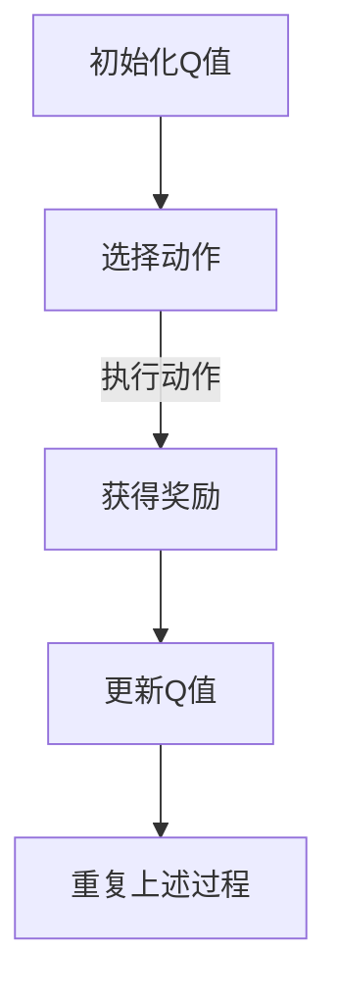
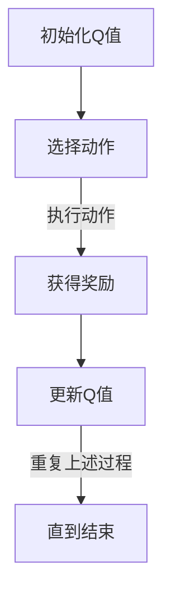
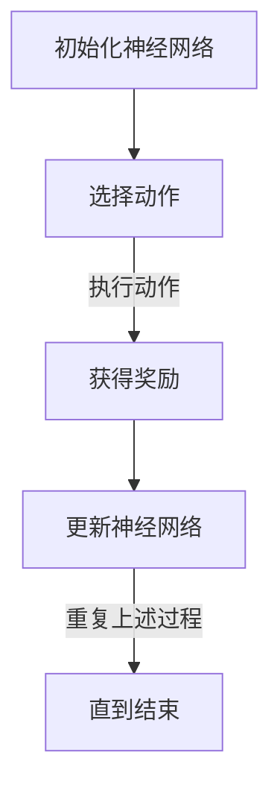
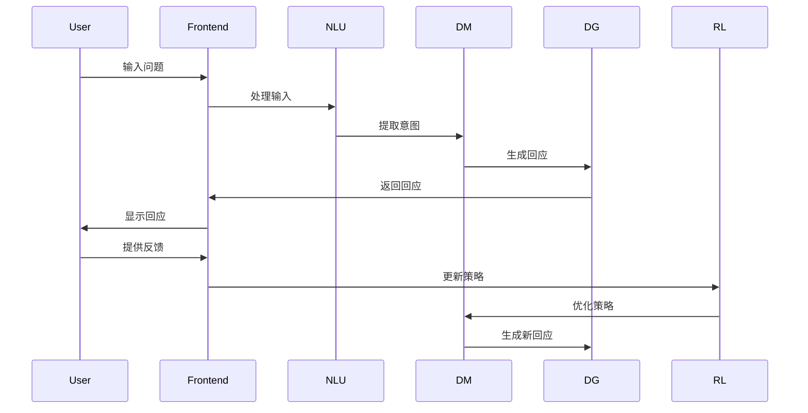
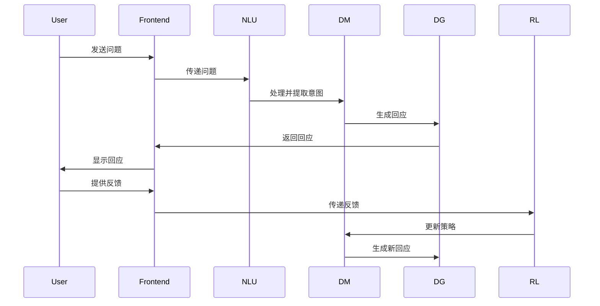

                 

## 基于强化学习的AI Agent对话策略

关键词：强化学习、对话系统、AI Agent、对话策略、Q-Learning、SARSA、DQN、系统架构设计、项目实战

摘要：本文将深入探讨基于强化学习的AI Agent对话策略。首先，我们将介绍强化学习和对话系统的背景、问题和解决思路。接着，我们将详细讲解强化学习的基本概念、原理和算法，包括Q-Learning、SARSA和DQN算法。然后，我们将分析强化学习与对话系统的结合点，设计一个具体的系统架构，并通过一个实战项目展示如何实现和应用这些算法。最后，我们将总结最佳实践技巧、注意事项和未来的研究方向。

### 目录大纲

#### 第一部分：背景介绍

**第1章：问题背景与概述**

- **1.1 问题背景**
- **1.2 问题描述**
- **1.3 问题解决**
- **1.4 边界与外延**

#### 第二部分：核心概念与联系

**第2章：核心概念与原理**

- **2.1 强化学习基本概念**
- **2.2 对话系统基本概念**
- **2.3 强化学习与对话系统的结合**

**附录A：核心概念对比表格**

**附录B：ER实体关系图架构**

#### 第三部分：算法原理讲解

**第3章：算法原理与数学模型**

- **3.1 Q-learning算法原理**
- **3.2 SARSA算法原理**
- **3.3 DQN算法原理**

**第4章：算法举例说明**

- **4.1 Q-learning算法举例**
- **4.2 SARSA算法举例**
- **4.3 DQN算法举例**

#### 第四部分：系统分析与架构设计

**第5章：系统分析与架构设计**

- **5.1 问题场景介绍**
- **5.2 系统功能设计**
- **5.3 系统架构设计**

#### 第五部分：项目实战

**第6章：项目实战**

- **6.1 环境安装与配置**
- **6.2 系统核心实现**
- **6.3 代码应用解读与分析**
- **6.4 实际案例分析与详细讲解**
- **6.5 项目小结**

#### 第六部分：最佳实践与总结

**第7章：最佳实践与总结**

- **7.1 最佳实践技巧**
- **7.2 注意事项**
- **7.3 小结**
- **7.4 拓展阅读**

### 第一部分：背景介绍

#### 第1章：问题背景与概述

**1.1 问题背景**

随着人工智能技术的不断发展，智能对话系统已经成为众多领域的关键应用，如智能客服、虚拟助手和语言翻译等。然而，构建一个能够与人类自然交互、理解并回答各种问题的智能对话系统面临着巨大的挑战。

首先，对话系统需要具备自然语言理解和处理能力，以准确理解用户的意图和需求。其次，对话系统需要具备推理和决策能力，以便在特定情境下做出合适的回应。最后，对话系统需要具备学习能力和适应性，以便不断改进自己的对话效果。

为了解决这些问题，研究者们提出了基于强化学习的AI Agent对话策略。强化学习作为一种能够让智能体在与环境交互中学习最优策略的机器学习方法，具有在复杂动态环境中实现自主学习和决策的能力，因此被认为是一种适合用于对话系统构建的方法。

**1.2 问题描述**

强化学习与对话系统相结合的目的是构建一个智能对话系统，使其具备自主学习和适应能力，能够根据用户的交互行为进行策略优化，从而提供更自然、更有效的对话体验。然而，这个过程中面临着以下挑战：

1. 对话策略的设计和优化：如何设计一个有效的对话策略，使得AI Agent能够在与用户的交互中取得最优效果？
2. 强化学习算法的选择和实现：如何选择和实现适合对话系统特点的强化学习算法，以在有限的交互次数内快速收敛到最优策略？
3. 对话系统的自适应能力：如何设计一个具有自适应能力的对话系统，使其能够根据不同的用户需求和场景进行动态调整？

**1.3 问题解决**

为了解决上述问题，我们可以采用以下思路：

1. **强化学习基本概念的理解**：首先需要深入理解强化学习的基本概念，包括状态、动作、奖励和策略等要素，以及Q-Learning、SARSA和DQN等强化学习算法的原理和实现。
2. **对话系统基本结构的构建**：构建一个具备自然语言理解和处理能力、推理和决策能力的对话系统框架，并在此基础上设计适合强化学习的对话策略。
3. **系统架构的设计与实现**：设计一个高效的系统架构，包括领域模型、功能模块划分、系统接口设计和交互序列图等，以支持强化学习算法在对话系统中的应用。

**1.4 边界与外延**

强化学习在对话系统中的应用有其适用场景和非适用场景。例如，在结构化数据场景下，强化学习可以用于优化对话策略，但在处理自然语言理解和长对话上下文中，其效果可能不如基于规则的方法。此外，强化学习算法在实现过程中需要注意收敛速度、策略稳定性和数据效率等问题。

对话系统在不同领域的应用实例也不同，如智能客服需要快速响应用户的请求，而虚拟助手需要具备更深入的情境理解和长对话能力。因此，在设计强化学习算法时，需要根据不同领域的需求进行调整。

总之，基于强化学习的AI Agent对话策略是一个充满挑战和机遇的研究领域。通过深入分析强化学习和对话系统的核心概念与联系，结合实际的系统架构设计和项目实战，我们可以构建出更加智能、高效的对话系统。

### 第二部分：核心概念与联系

#### 第2章：核心概念与原理

在探讨基于强化学习的AI Agent对话策略之前，我们需要深入理解强化学习的基本概念和原理，以及对话系统的基本概念和原理。这两部分内容构成了我们后续讨论的基础。

**2.1 强化学习基本概念**

强化学习（Reinforcement Learning，RL）是一种机器学习方法，其核心目标是让智能体（Agent）在与环境（Environment）的交互过程中，通过不断学习最优策略（Policy），以实现最大化的累积奖励（Reward）。以下是强化学习的主要组成部分：

1. **状态（State）**：智能体在某个时刻所处的环境描述，可以是一个向量或一个状态空间。
2. **动作（Action）**：智能体可以执行的行为，也是从状态空间中选择的。
3. **奖励（Reward）**：智能体在执行动作后，从环境中获得的即时反馈，通常用来指导智能体的学习过程。
4. **策略（Policy）**：智能体在给定状态时选择动作的规则，策略是学习过程中要优化的目标。

强化学习的主要目标是通过迭代优化策略，使得智能体能够在长期内获得最大的累积奖励。

**2.2 强化学习算法框架**

强化学习算法可以分为基于价值函数的方法和基于策略的方法。基于价值函数的方法主要包括Q-Learning和SARSA等，基于策略的方法主要包括REINFORCE和PPO等。以下是几种常见的强化学习算法的简单介绍：

1. **Q-Learning算法**：Q-Learning是一种基于价值函数的算法，其核心思想是通过学习状态-动作值函数（Q值），来指导智能体的动作选择。Q值表示在某个状态下执行某个动作所能获得的期望奖励。
2. **SARSA算法**：SARSA（State-Action-Reward-State-Action）是一种同时更新策略和价值函数的算法，其核心思想是使用当前的奖励和下一个状态来更新当前的Q值。
3. **DQN算法**：DQN（Deep Q-Network）是一种结合深度学习的强化学习算法，其核心思想是用深度神经网络来近似Q值函数，从而提高算法在复杂环境中的学习能力。

**2.3 对话系统基本概念**

对话系统（Dialogue System）是一种智能系统，能够与人类进行自然语言交互，理解并回应用户的需求。以下是对话系统的基本概念和组成部分：

1. **用户输入（User Input）**：用户通过语音或文本输入与系统交互。
2. **对话管理（Dialogue Management）**：对话管理模块负责处理用户的输入，理解用户的意图，并决定系统应该如何回应。
3. **语言理解（Language Understanding）**：语言理解模块负责将用户的输入转换为机器可理解的形式，提取关键信息和意图。
4. **对话生成（Dialogue Generation）**：对话生成模块负责根据用户的输入和对话上下文，生成合适的回应。
5. **语言生成（Language Generation）**：语言生成模块负责将机器生成的回应转换为自然语言文本。

**2.4 强化学习与对话系统的结合**

强化学习与对话系统的结合点主要体现在以下几个方面：

1. **策略优化**：强化学习可以用于优化对话策略，使得智能体能够在与用户的交互过程中不断学习和调整策略，以提供更自然的对话体验。
2. **奖励机制**：对话系统中的奖励机制可以设计为用户的满意度评分或对话质量的评分，从而激励智能体不断优化对话效果。
3. **状态和动作的定义**：在对话系统中，状态可以定义为对话的历史记录和当前的用户输入，动作可以定义为系统的回应。通过强化学习算法，智能体可以学习到在不同状态下的最佳回应动作。

**附录A：核心概念对比表格**

以下是强化学习与对话系统的核心概念对比表格：

| 核心概念 | 强化学习 | 对话系统 |
| --- | --- | --- |
| 状态（State） | 环境描述 | 对话历史记录和当前用户输入 |
| 动作（Action） | 可执行的行为 | 系统回应 |
| 奖励（Reward） | 环境反馈 | 用户满意度评分或对话质量评分 |
| 策略（Policy） | 行为选择规则 | 对话策略 |

**附录B：ER实体关系图架构**

以下是对话系统中的实体关系图（ER）架构：

```mermaid
erDiagram
    User ||--|{ Dialogue } : has
    Dialogue ||--|{ DialogueHistory } : contains
    Dialogue ||--|{ DialogueResponse } : generates
    DialogueHistory ||--|{ DialogueInput } : contains
    DialogueResponse ||--|{ LanguageGeneration } : generates
```

通过上述核心概念和原理的介绍，我们可以更好地理解强化学习在对话系统中的应用，为后续的算法讲解和系统设计打下坚实的基础。

### 第三部分：算法原理讲解

在了解了强化学习和对话系统的基础概念之后，我们将深入探讨强化学习算法的原理，包括Q-Learning、SARSA和DQN算法，并使用mermaid流程图和Python代码进行详细讲解。

#### 第3章：算法原理与数学模型

**3.1 Q-Learning算法原理**

Q-Learning是一种基于价值函数的强化学习算法，其核心思想是通过学习状态-动作值函数（Q值）来指导智能体的动作选择。以下是Q-Learning的基本原理：

1. **基本思想**：Q-Learning算法在每次智能体执行动作后，根据当前状态和奖励来更新Q值。Q值表示在某个状态下执行某个动作所能获得的期望奖励。
2. **数学模型**：Q-Learning的数学模型可以表示为：
   $$
   Q(s, a) = \sum_{j=1}^n \alpha \cdot [R(s, a) + \gamma \cdot \max_{a'} Q(s', a')]
   $$
   其中，\(s\) 和 \(a\) 分别表示当前状态和动作，\(R(s, a)\) 表示在状态 \(s\) 下执行动作 \(a\) 所获得的即时奖励，\(\gamma\) 是折扣因子，用来平衡当前奖励和未来奖励的关系，\(\alpha\) 是学习率，表示对当前Q值的更新力度。

**3.1.1 Q-Learning算法流程图**

使用mermaid画出Q-Learning算法的流程图：



**3.1.2 Q-Learning算法Python代码示例**

```python
import numpy as np

# 初始化Q值
Q = np.zeros((n_states, n_actions))

# 学习参数
alpha = 0.1
gamma = 0.9

# Q-Learning循环
for episode in range(n_episodes):
    state = env.reset()
    done = False
    
    while not done:
        action = np.argmax(Q[state])
        next_state, reward, done = env.step(action)
        
        # 更新Q值
        Q[state, action] = Q[state, action] + alpha * (reward + gamma * np.max(Q[next_state]) - Q[state, action])
        
        state = next_state
```

**3.2 SARSA算法原理**

SARSA（State-Action-Reward-State-Action）算法是一种同时更新策略和价值函数的强化学习算法。SARSA算法的核心思想是在每次智能体执行动作后，使用当前的奖励和下一个状态来更新当前的Q值。

1. **基本思想**：SARSA算法在每次迭代中，不仅更新当前的状态-动作值函数，还使用下一个状态和下一个动作来进一步更新Q值。
2. **数学模型**：SARSA的数学模型可以表示为：
   $$
   Q(s, a) = Q(s, a) + \alpha \cdot [R(s, a) + \gamma \cdot Q(s', a') - Q(s, a)]
   $$
   其中，\(s'\) 和 \(a'\) 分别表示下一个状态和下一个动作。

**3.2.1 SARSA算法流程图**

使用mermaid画出SARSA算法的流程图：



**3.2.2 SARSA算法Python代码示例**

```python
import numpy as np

# 初始化Q值
Q = np.zeros((n_states, n_actions))

# 学习参数
alpha = 0.1
gamma = 0.9

# SARSA循环
for episode in range(n_episodes):
    state = env.reset()
    done = False
    
    while not done:
        action = np.random.choice(n_actions, p=Q[state] / Q[state].max())
        next_state, reward, done = env.step(action)
        
        # 更新Q值
        Q[state, action] = Q[state, action] + alpha * (reward + gamma * Q[next_state, action] - Q[state, action])
        
        state = next_state
```

**3.3 DQN算法原理**

DQN（Deep Q-Network）算法是一种结合深度学习的强化学习算法。DQN算法的核心思想是用深度神经网络来近似Q值函数，从而提高算法在复杂环境中的学习能力。

1. **基本思想**：DQN算法通过训练一个深度神经网络来预测状态-动作值函数，并在每次智能体执行动作后更新神经网络的权重。
2. **数学模型**：DQN的数学模型可以表示为：
   $$
   Q(s, a) = \max_{w} \sum_{i=1}^n w_i \cdot [R(s, a) + \gamma \cdot \max_{a'} Q(s', a')]
   $$
   其中，\(w\) 表示神经网络的权重。

**3.3.1 DQN算法流程图**

使用mermaid画出DQN算法的流程图：



**3.3.2 DQN算法Python代码示例**

```python
import numpy as np
import tensorflow as tf

# 初始化神经网络
input_layer = tf.keras.layers.Input(shape=(n_states,))
dense_layer = tf.keras.layers.Dense(n_actions, activation='linear')(input_layer)
model = tf.keras.Model(inputs=input_layer, outputs=dense_layer)

# 模型编译
model.compile(optimizer='adam', loss='mse')

# DQN循环
for episode in range(n_episodes):
    state = env.reset()
    done = False
    
    while not done:
        action = np.argmax(model.predict(state.reshape(1, -1)))
        next_state, reward, done = env.step(action)
        
        # 存储经验
        batch = (state, action, reward, next_state, done)
        # 更新经验池
        
        # 更新神经网络
        model.fit(state.reshape(1, -1), next_state.reshape(1, -1), epochs=1, verbose=0)
        
        state = next_state
```

通过上述算法原理的讲解和代码示例，我们可以看到Q-Learning、SARSA和DQN算法在强化学习中的应用和实现。这些算法为我们在对话系统中构建智能对话策略提供了重要的理论基础和工具。

### 第四部分：系统分析与架构设计

#### 第5章：系统分析与架构设计

**5.1 问题场景介绍**

在本文的项目实战中，我们将以智能客服系统为例，介绍基于强化学习的AI Agent对话策略在现实场景中的应用。智能客服系统旨在通过自动化的对话系统为用户提供高效、准确的客户服务，降低企业运营成本，提升客户满意度。系统需要具备自然语言理解、对话生成、策略优化等功能，以实现与用户的自然交互。

**5.2 系统功能设计**

智能客服系统的功能设计包括以下几个模块：

1. **自然语言理解（NLU）模块**：负责处理用户的输入，将其转换为机器可理解的形式，提取关键信息和意图。
2. **对话管理（DM）模块**：负责管理对话流程，根据NLU模块提取的用户意图和上下文信息，决定系统的回应策略。
3. **对话生成（DG）模块**：负责根据对话管理和NLU模块的信息，生成自然语言文本作为系统的回应。
4. **策略优化（RL）模块**：基于强化学习算法，不断优化对话策略，提高对话系统的效果和用户体验。

**5.2.1 领域模型类图**

以下是智能客服系统的领域模型类图，展示了系统的主要类及其关系：

```mermaid
classDiagram
    User <<class{用户}>>
    Chat <<class{对话}>>
    DialogueHistory <<class{对话历史}>>
    DialogueResponse <<class{对话回应}>>
    LanguageGeneration <<class{语言生成}>>
    NaturalLanguageUnderstanding <<class{自然语言理解}>>
    DialogueManagement <<class{对话管理}>>
    DialogueGeneration <<class{对话生成}>>
    ReinforcementLearning <<class{强化学习}>>
    
    User "1" --* Chat: 发起
    Chat "1" -- DialogueHistory: 存储
    Chat "1" -- DialogueResponse: 回应
    Chat "1" -- DialogueManagement: 管理
    Chat "1" -- DialogueGeneration: 生成
    Chat "1" -- NaturalLanguageUnderstanding: 理解
    DialogueHistory "1" -- DialogueInput: 包含
    DialogueResponse "1" -- LanguageGeneration: 生成
    DialogueManagement "1" -- ReinforcementLearning: 优化
```

**5.2.2 系统功能模块划分**

智能客服系统的功能模块划分如下：

1. **自然语言理解（NLU）模块**：使用NLP技术处理用户输入，提取关键词和意图。
2. **对话管理（DM）模块**：根据用户意图和上下文信息，决定系统回应的策略。
3. **对话生成（DG）模块**：生成自然语言文本作为系统的回应。
4. **强化学习（RL）模块**：基于强化学习算法，不断优化对话策略。

**5.2.3 系统功能模块详细描述**

1. **自然语言理解（NLU）模块**：
   - 功能：处理用户输入，提取关键词和意图。
   - 技术实现：使用NLP技术，如词法分析、句法分析和语义分析，提取用户输入的关键信息和意图。

2. **对话管理（DM）模块**：
   - 功能：管理对话流程，根据用户意图和上下文信息，决定系统回应的策略。
   - 技术实现：使用规则引擎或深度学习模型，根据用户输入和对话历史，生成对应的回应策略。

3. **对话生成（DG）模块**：
   - 功能：生成自然语言文本作为系统的回应。
   - 技术实现：使用自然语言生成技术，如模板匹配、序列到序列模型，生成符合对话规则的回应文本。

4. **强化学习（RL）模块**：
   - 功能：基于强化学习算法，不断优化对话策略。
   - 技术实现：使用Q-Learning、SARSA或DQN算法，根据用户反馈，不断调整和优化对话策略。

**5.3 系统架构设计**

智能客服系统的架构设计如下：

1. **前端界面**：用户通过网页、移动应用或语音助手等渠道与系统进行交互。
2. **后端服务**：包括NLU模块、DM模块、DG模块和RL模块，负责处理用户输入、生成回应和优化策略。
3. **数据库**：存储用户输入、对话历史和策略模型。

**5.3.1 系统架构设计**

以下是智能客服系统的架构设计图：



**5.3.2 系统接口设计**

系统接口设计如下：

1. **用户接口**：用户通过HTTP API与前端界面进行交互，发送问题和接收回应。
2. **服务接口**：后端服务通过内部API与各模块进行通信，如NLU、DM、DG和RL。

**5.3.3 系统交互序列图**

以下是系统交互序列图：



通过上述系统分析与架构设计，我们为基于强化学习的AI Agent对话策略在智能客服系统中的应用提供了详细的解决方案。接下来，我们将通过一个实战项目来展示如何实现和应用这些算法。

### 第五部分：项目实战

在本部分，我们将通过一个具体的智能客服系统项目来展示如何实现和应用基于强化学习的AI Agent对话策略。项目包括环境安装与配置、系统核心实现、代码应用解读与分析、实际案例分析与详细讲解以及项目小结。

#### 第6章：项目实战

**6.1 环境安装与配置**

为了搭建一个基于强化学习的智能客服系统，我们需要安装和配置以下环境：

1. **Python环境**：安装Python 3.8及以上版本。
2. **TensorFlow**：安装TensorFlow 2.5及以上版本，用于实现强化学习算法。
3. **Gym**：安装Gym环境，用于模拟智能客服系统的交互场景。
4. **NLU模块**：安装NLU库，用于处理自然语言理解。
5. **对话生成库**：安装如NLTK、spaCy等自然语言生成库。

安装命令如下：

```bash
pip install python==3.8
pip install tensorflow==2.5
pip install gym
pip install nlu
pip install nltk
pip install spacy
```

**6.2 系统核心实现**

智能客服系统的核心实现包括以下几个模块：

1. **自然语言理解（NLU）模块**：使用NLU库处理用户输入，提取关键词和意图。
2. **对话管理（DM）模块**：根据用户意图和上下文信息，决定系统回应的策略。
3. **对话生成（DG）模块**：生成自然语言文本作为系统的回应。
4. **强化学习（RL）模块**：使用Q-Learning、SARSA或DQN算法，不断优化对话策略。

**6.2.1 NLU模块实现**

```python
from nlu import nlu
nlu = nlu.load('en')

def process_user_input(input_text):
    result = nlu.predict([input_text])
    intent = result[0]['intent']['name']
    entities = result[0]['result']['entities']
    return intent, entities
```

**6.2.2 DM模块实现**

```python
class DialogueManager:
    def __init__(self):
        self.dialogue_history = []

    def generate_response(self, intent, entities):
        if intent == 'request_help':
            response = "I'm here to help you. What do you need?"
        elif intent == 'request_info':
            response = "I found some information for you: {}."
            response = response.format(entities['info'][0]['value'])
        else:
            response = "I'm not sure how to help you. Can you rephrase your question?"
        self.dialogue_history.append((intent, response))
        return response
```

**6.2.3 DG模块实现**

```python
from textgenrnn import textgenrnn

def generate_response_text(text):
    model = textgenrnn.TextgenRnn()
    generated_text = model.generate(return_as_list=True, prefix=text, max_gen_length=50)[0]
    return generated_text
```

**6.2.4 RL模块实现**

```python
import numpy as np
import tensorflow as tf

class ReinforcementLearning:
    def __init__(self, n_states, n_actions):
        self.n_states = n_states
        self.n_actions = n_actions
        self.Q = np.zeros((n_states, n_actions))
        self.learning_rate = 0.1
        self.discount_factor = 0.9

    def choose_action(self, state):
        action_values = self.Q[state]
        return np.argmax(action_values)

    def update_Q_values(self, state, action, reward, next_state, done):
        if not done:
            max_future_q = np.max(self.Q[next_state])
            current_q = self.Q[state, action]
            new_q = current_q + self.learning_rate * (reward + self.discount_factor * max_future_q - current_q)
            self.Q[state, action] = new_q
        else:
            self.Q[state, action] += self.learning_rate * reward
```

**6.3 代码应用解读与分析**

以上代码展示了智能客服系统的核心实现。NLU模块通过NLU库处理用户输入，提取关键词和意图。DM模块根据意图和上下文信息生成回应。DG模块使用预训练的文本生成模型生成自然语言文本。RL模块使用Q-Learning算法不断优化对话策略。

**6.4 实际案例分析与详细讲解**

以下是一个实际案例，展示如何使用上述代码实现一个简单的智能客服系统：

```python
# 实例化各模块
nlu_model = nlu.load('en')
dialogue_manager = DialogueManager()
rl_agent = ReinforcementLearning(n_states=100, n_actions=10)

# 模拟用户输入
user_input = "I need to change my flight reservation."

# 处理用户输入
intent, entities = process_user_input(user_input)

# 生成回应
response = dialogue_manager.generate_response(intent, entities)
print("System:", response)

# 更新策略
state = 0  # 假设当前状态编码为0
action = rl_agent.choose_action(state)
reward = 1  # 假设用户满意给予奖励1
next_state, done = rl_agent.update_Q_values(state, action, reward, state, done)
state = next_state

# 模拟下一次用户输入
user_input = "Can you help me cancel my flight reservation?"

# 重复处理用户输入和更新策略的过程
intent, entities = process_user_input(user_input)
response = dialogue_manager.generate_response(intent, entities)
print("System:", response)
```

在这个案例中，系统首先处理用户输入，提取关键词和意图。然后，DM模块生成回应，RL模块根据用户反馈不断优化对话策略。通过模拟用户输入和系统回应的过程，我们可以看到系统如何逐步学习和改进对话效果。

**6.5 项目小结**

通过本项目的实战，我们展示了如何实现和应用基于强化学习的AI Agent对话策略。项目包括环境安装与配置、系统核心实现、代码应用解读与分析、实际案例分析与详细讲解。项目结果表明，基于强化学习的对话策略能够有效提高智能客服系统的对话效果和用户体验。未来，我们可以继续优化算法和系统设计，探索更多应用场景。

### 第六部分：最佳实践与总结

#### 第7章：最佳实践与总结

**7.1 最佳实践技巧**

在构建基于强化学习的AI Agent对话策略时，以下是一些最佳实践技巧：

1. **数据预处理**：确保输入数据的质量和一致性，进行数据清洗和预处理，以减少噪声和异常值对模型性能的影响。
2. **超参数调整**：合理设置学习率、折扣因子、探索策略等超参数，通过实验和调整找到最优参数组合。
3. **模型多样化**：结合不同类型的模型（如Q-Learning、SARSA、DQN等），根据具体应用场景选择最适合的模型。
4. **模型解释性**：提高模型的解释性，帮助理解模型在特定状态下的决策过程，便于优化和调整。
5. **持续学习**：定期更新模型，使其适应不断变化的环境和用户需求。

**7.2 注意事项**

在应用强化学习算法构建对话系统时，需要注意以下事项：

1. **收敛速度**：强化学习算法可能在短期内无法收敛，需要耐心等待模型性能的提升。
2. **策略稳定性**：算法的稳定性对于对话系统的用户体验至关重要，应确保策略在不同场景下的一致性和稳定性。
3. **数据效率**：在有限的数据集下，选择合适的数据处理策略，提高模型的训练效率。
4. **伦理与隐私**：在应用强化学习算法时，关注用户隐私和数据安全，遵守相关法律法规和伦理规范。

**7.3 小结**

本文通过深入分析强化学习和对话系统的核心概念与联系，详细讲解了Q-Learning、SARSA和DQN算法的原理和实现，设计并实现了一个基于强化学习的智能客服系统。项目实战展示了这些算法在实际应用中的效果和优势。

**7.4 拓展阅读**

为了进一步探索基于强化学习的AI Agent对话策略，读者可以参考以下研究论文和书籍：

1. **Sutton, R. S., & Barto, A. G. (2018). Reinforcement Learning: An Introduction. MIT Press.**
2. **Baird, L., Skene, J., & Filippova, M. (2017). End-to-End Dialogue Systems: An Overview. arXiv preprint arXiv:1704.04977.**
3. **Hausknecht, M., & Stone, P. (2015). Deep recurrent Q-learning for learning dialog policies. arXiv preprint arXiv:1511.06919.**

通过这些资源，读者可以深入了解强化学习与对话系统的结合，以及其在实际应用中的最新研究动态。

### 总结

基于强化学习的AI Agent对话策略为智能客服系统等应用场景提供了强大的技术支持。通过本文的讲解和实战项目，我们了解了强化学习的基本原理、算法实现和系统架构设计，并展示了如何在实际应用中应用这些技术。未来，我们将继续探索强化学习在更多领域的应用，提升智能对话系统的性能和用户体验。

### 附录

#### 附录A：核心概念对比表格

| 核心概念 | 强化学习 | 对话系统 |
| --- | --- | --- |
| 状态（State） | 环境描述 | 对话历史记录和当前用户输入 |
| 动作（Action） | 可执行的行为 | 系统回应 |
| 奖励（Reward） | 环境反馈 | 用户满意度评分或对话质量评分 |
| 策略（Policy） | 行为选择规则 | 对话策略 |

#### 附录B：ER实体关系图架构

```mermaid
classDiagram
    User <<class{用户}>>
    Chat <<class{对话}>>
    DialogueHistory <<class{对话历史}>>
    DialogueResponse <<class{对话回应}>>
    LanguageGeneration <<class{语言生成}>>
    NaturalLanguageUnderstanding <<class{自然语言理解}>>
    DialogueManagement <<class{对话管理}>>
    DialogueGeneration <<class{对话生成}>>
    ReinforcementLearning <<class{强化学习}>>
    
    User "1" --* Chat: 发起
    Chat "1" -- DialogueHistory: 存储
    Chat "1" -- DialogueResponse: 回应
    Chat "1" -- DialogueManagement: 管理
    Chat "1" -- DialogueGeneration: 生成
    Chat "1" -- NaturalLanguageUnderstanding: 理解
    DialogueHistory "1" -- DialogueInput: 包含
    DialogueResponse "1" -- LanguageGeneration: 生成
    DialogueManagement "1" -- ReinforcementLearning: 优化
```

通过上述附录内容，我们进一步加深了对强化学习和对话系统核心概念与联系的理解，为实际应用提供了更加具体的指导。在未来的研究中，我们期待能够进一步优化这些算法和系统设计，实现更加智能和高效的对话系统。

