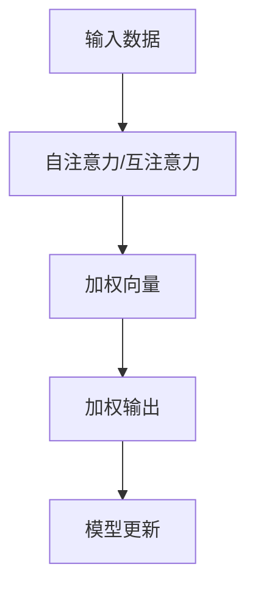

                 

# 基于注意力机制的AI Agent长期记忆管理

关键词：AI Agent、注意力机制、长期记忆管理、数据存储、数据检索、数据更新、数据关联

摘要：随着人工智能技术的快速发展，AI Agent在各个领域得到了广泛应用。本文主要讨论AI Agent长期记忆管理的问题，并提出了基于注意力机制的解决方案。通过介绍注意力机制的核心概念、原理和应用，本文详细阐述了如何利用注意力机制进行长期记忆管理，包括数据存储、检索、更新和关联等方面，为提升AI Agent的智能水平和应用效果提供了新的思路。

### 第一部分：背景介绍

#### 问题背景

随着人工智能技术的快速发展，AI Agent在各个领域得到了广泛应用。从智能助手到自动驾驶，从智能家居到医疗诊断，AI Agent已经成为了人工智能技术的重要应用方向。然而，AI Agent的长期记忆管理成为了一个亟待解决的问题。长期记忆管理涉及到数据的存储、检索、更新和关联，对于提升AI Agent的智能水平和应用效果至关重要。

#### 问题描述

AI Agent在处理长时间任务时，往往会出现记忆丢失、信息混乱等问题，导致任务执行效率降低、效果不佳。长期记忆管理的问题主要包括：

- 数据存储：如何高效地存储大量数据，保证数据的安全性和可靠性？
- 数据检索：如何快速地检索所需数据，提高任务执行速度？
- 数据更新：如何及时更新数据，保证数据的准确性和一致性？
- 数据关联：如何将不同来源的数据进行有效关联，提升AI Agent的智能水平？

#### 问题解决

为了解决上述问题，本文提出了基于注意力机制的AI Agent长期记忆管理方案。注意力机制是一种重要的神经网络结构，能够有效地关注关键信息，抑制无关信息。通过引入注意力机制，可以实现对数据的精细化管理，提升AI Agent的长期记忆管理能力。

#### 边界与外延

本文主要关注以下边界和内容：

- 技术层面：介绍基于注意力机制的长期记忆管理技术原理和应用。
- 应用层面：探讨注意力机制在AI Agent长期记忆管理中的实际应用，包括数据存储、检索、更新和关联等方面。
- 案例研究：分析典型AI Agent长期记忆管理案例，总结实践经验。

#### 概念结构与核心要素组成

本文的核心概念和结构包括：

- 注意力机制：介绍注意力机制的定义、原理和应用。
- 长期记忆管理：阐述长期记忆管理的概念、问题和解决方案。
- AI Agent：介绍AI Agent的基本概念、类型和应用场景。
- 数据存储、检索、更新和关联：分析数据管理的关键技术和方法。

### 第二部分：核心概念与联系

#### 核心概念原理

1. **注意力机制**

注意力机制是一种神经网络结构，通过关注关键信息，抑制无关信息，提高数据处理效率和效果。它主要分为三种类型：局部注意力、全局注意力和层次注意力。

- **局部注意力**：关注输入数据中的局部特征，如文本中的单词、图像中的像素。
- **全局注意力**：关注输入数据中的全局特征，如文本中的整个句子、图像中的整体场景。
- **层次注意力**：关注输入数据中的多层次特征，如文本中的句子、段落，图像中的对象、场景。

注意力机制的基本原理如下：

1. **输入数据表示**：将输入数据表示为一个向量序列，如文本、图像或音频。
2. **注意力计算**：通过自注意力机制（Self-Attention）或互注意力机制（Cross-Attention）计算输入数据之间的相似度，得到一个加权向量。
3. **加权输出**：将加权向量与原始输入数据进行点积运算，得到加权输出。
4. **模型更新**：根据加权输出更新模型参数，实现关注关键信息，抑制无关信息。

2. **长期记忆管理**

长期记忆管理是指对AI Agent在长时间任务中积累的数据进行存储、检索、更新和关联的过程。长期记忆管理的关键技术包括数据存储、检索、更新和关联。

- **数据存储**：如何高效地存储大量数据，保证数据的安全性和可靠性？
- **数据检索**：如何快速地检索所需数据，提高任务执行速度？
- **数据更新**：如何及时更新数据，保证数据的准确性和一致性？
- **数据关联**：如何将不同来源的数据进行有效关联，提升AI Agent的智能水平？

3. **AI Agent**

AI Agent是一种具有智能决策能力的计算机程序，能够自主地执行任务、学习知识和与环境进行交互。根据任务类型和应用场景的不同，AI Agent可以分为以下几种类型：

- **智能助手**：如虚拟助手、语音助手，主要用于与用户进行交互，提供信息查询和任务执行等服务。
- **自动驾驶**：如自动驾驶汽车、无人机等，通过感知环境、决策和执行，实现自主驾驶。
- **智能监控**：如智能家居、智能安防等，通过实时感知环境和监控目标，实现智能预警和决策。

#### 概念属性特征对比表格

| 概念 | 定义 | 特点 |
| --- | --- | --- |
| 注意力机制 | 一种神经网络结构，通过关注关键信息，抑制无关信息 | 提高数据处理效率和效果 |
| 长期记忆管理 | 对AI Agent在长时间任务中积累的数据进行存储、检索、更新和关联 | 保证数据的安全、可靠和高效 |
| AI Agent | 具有智能决策能力的计算机程序 | 自主执行任务、学习知识、与环境交互 |

#### ER实体关系图架构

```mermaid
erDiagram
    AI Agent ||--|{ 数据 }  : 存储与检索
    AI Agent ||--|{ 更新 }  : 更新数据
    AI Agent ||--|{ 关联 }  : 数据关联
    数据 ||--|{ 注意力机制 }  : 利用注意力机制管理数据
```

### 第三部分：算法原理讲解

#### 注意力机制算法原理

注意力机制算法的核心思想是通过对输入数据进行加权，使模型能够关注关键信息，抑制无关信息。其基本原理如下：

1. **输入数据表示**：将输入数据表示为一个向量序列，如文本、图像或音频。
2. **注意力计算**：通过一个自注意力机制（Self-Attention）或互注意力机制（Cross-Attention）计算输入数据之间的相似度，得到一个加权向量。
3. **加权输出**：将加权向量与原始输入数据进行点积运算，得到加权输出。
4. **模型更新**：根据加权输出更新模型参数，实现关注关键信息，抑制无关信息。

下面是注意力机制算法的Mermaid流程图：



#### Python源代码示例

```python
import tensorflow as tf

# 定义自注意力层
class SelfAttentionLayer(tf.keras.layers.Layer):
    def __init__(self, **kwargs):
        super(SelfAttentionLayer, self).__init__(**kwargs)
    
    def build(self, input_shape):
        # 输入数据的维度
        self.input_dim = input_shape[-1]
        
        # 自注意力权重
        self.WQ = self.add_weight(name='WQ',
                                  shape=(self.input_dim, self.input_dim),
                                  initializer='uniform',
                                  trainable=True)
        self.WK = self.add_weight(name='WK',
                                  shape=(self.input_dim, self.input_dim),
                                  initializer='uniform',
                                  trainable=True)
        self.WV = self.add_weight(name='WV',
                                  shape=(self.input_dim, self.input_dim),
                                  initializer='uniform',
                                  trainable=True)
        
        super(SelfAttentionLayer, self).build(input_shape)
    
    def call(self, inputs, training=False):
        # 计算自注意力权重
        Q = tf.matmul(inputs, self.WQ)
        K = tf.matmul(inputs, self.WK)
        V = tf.matmul(inputs, self.WV)
        
        # 计算相似度分数
        scores = tf.matmul(Q, K, transpose_b=True)
        # 应用softmax函数，得到加权向量
        attention_weights = tf.nn.softmax(scores, axis=1)
        
        # 加权输出
        context_vector = tf.matmul(attention_weights, V)
        
        return context_vector
    
    def compute_output_shape(self, input_shape):
        return input_shape[0], input_shape[-1]
```

#### 算法原理讲解

注意力机制算法的主要目的是通过关注关键信息，抑制无关信息，提高数据处理效率和效果。下面我们从数学模型的角度详细讲解注意力机制算法的原理。

1. **输入数据表示**

设输入数据为一个向量序列 $X = [x_1, x_2, ..., x_n]$，其中 $x_i$ 表示第 $i$ 个输入数据。为了方便计算，我们可以将输入数据表示为一个矩阵 $X \in \mathbb{R}^{n \times d}$，其中 $n$ 表示输入数据的个数，$d$ 表示每个输入数据的维度。

2. **注意力计算**

注意力计算的核心是计算输入数据之间的相似度。设 $Q, K, V$ 分别为查询向量、键向量和值向量，它们分别与输入数据 $X$ 相关联。具体来说，查询向量 $Q$ 与输入数据 $X$ 的每一行进行点积运算，得到相似度分数矩阵 $S$：

$$
S_{ij} = Q_i \cdot K_j = X_i^T Q \cdot X_j^T K
$$

其中 $i, j$ 分别表示输入数据的行和列索引。$S$ 的对角线元素 $S_{ii}$ 表示第 $i$ 个输入数据与自身的相似度，其余元素 $S_{ij}$ 表示第 $i$ 个输入数据与第 $j$ 个输入数据的相似度。

为了抑制无关信息，我们通常会对相似度分数矩阵 $S$ 应用一个非线性变换，如 softmax 函数：

$$
a_{ij} = \text{softmax}(S_{ij}) = \frac{e^{S_{ij}}}{\sum_{k=1}^{n} e^{S_{ik}}}
$$

其中 $a_{ij}$ 表示第 $i$ 个输入数据对第 $j$ 个输入数据的权重。

3. **加权输出**

根据加权向量 $a_{ij}$，我们可以得到加权输出矩阵 $A$：

$$
A_{ij} = a_{ij} \cdot V_j
$$

其中 $V_j$ 表示第 $j$ 个输入数据对应的值向量。加权输出矩阵 $A$ 的每一行表示对输入数据的加权处理结果。

4. **模型更新**

根据加权输出矩阵 $A$，我们可以更新模型参数。以自注意力为例，我们可以将加权输出矩阵 $A$ 作为新的输入数据，再次进行自注意力计算，实现关注关键信息，抑制无关信息。

$$
\text{新} X = A
$$

重复上述过程，直到满足预定的迭代次数或收敛条件。

#### 注意力机制的数学模型和公式

设输入数据矩阵为 $X \in \mathbb{R}^{n \times d}$，查询向量、键向量和值向量分别为 $Q, K, V \in \mathbb{R}^{d \times d}$，相似度分数矩阵为 $S \in \mathbb{R}^{n \times n}$，加权向量矩阵为 $A \in \mathbb{R}^{n \times d}$，加权输出矩阵为 $Y \in \mathbb{R}^{n \times d}$。

1. **相似度分数矩阵**

$$
S_{ij} = Q_i \cdot K_j = X_i^T Q \cdot X_j^T K
$$

2. **加权向量矩阵**

$$
a_{ij} = \text{softmax}(S_{ij}) = \frac{e^{S_{ij}}}{\sum_{k=1}^{n} e^{S_{ik}}}
$$

3. **加权输出矩阵**

$$
Y_{ij} = \sum_{k=1}^{n} a_{ik} \cdot X_{kj}
$$

#### 注意力机制的Python源代码实现

```python
import numpy as np

def attention(Q, K, V):
    # 计算相似度分数
    scores = Q.dot(K.T)
    
    # 应用softmax函数，得到加权向量
    attention_weights = np.softmax(scores, axis=1)
    
    # 加权输出
    context_vector = attention_weights.dot(V)
    
    return context_vector
```

#### 注意力机制的例子说明

假设我们有一个包含三个输入数据的输入数据矩阵 $X$，以及对应的查询向量、键向量和值向量 $Q, K, V$，如下所示：

$$
X = \begin{bmatrix}
x_1 \\
x_2 \\
x_3
\end{bmatrix}, \quad
Q = \begin{bmatrix}
q_1 \\
q_2 \\
q_3
\end{bmatrix}, \quad
K = \begin{bmatrix}
k_1 \\
k_2 \\
k_3
\end{bmatrix}, \quad
V = \begin{bmatrix}
v_1 \\
v_2 \\
v_3
\end{bmatrix}
$$

根据注意力机制的原理，我们可以计算相似度分数矩阵 $S$：

$$
S = Q \cdot K^T = \begin{bmatrix}
q_1 \cdot k_1 & q_1 \cdot k_2 & q_1 \cdot k_3 \\
q_2 \cdot k_1 & q_2 \cdot k_2 & q_2 \cdot k_3 \\
q_3 \cdot k_1 & q_3 \cdot k_2 & q_3 \cdot k_3
\end{bmatrix}
$$

然后，我们可以应用 softmax 函数，得到加权向量矩阵 $A$：

$$
A = \text{softmax}(S) = \begin{bmatrix}
\frac{e^{s_{11}}}{e^{s_{11}} + e^{s_{12}} + e^{s_{13}}} & \frac{e^{s_{21}}}{e^{s_{11}} + e^{s_{12}} + e^{s_{13}}} & \frac{e^{s_{31}}}{e^{s_{11}} + e^{s_{12}} + e^{s_{13}}} \\
\frac{e^{s_{21}}}{e^{s_{21}} + e_{22}^{s} + e_{23}^{s}} & \frac{e_{22}^{s}}{e_{21}^{s} + e_{22}^{s} + e_{23}^{s}} & \frac{e_{23}^{s}}{e_{21}^{s} + e_{22}^{s} + e_{23}^{s}} \\
\frac{e^{s_{31}}}{e_{31}^{s} + e_{32}^{s} + e_{33}^{s}} & \frac{e_{32}^{s}}{e_{31}^{s} + e_{32}^{s} + e_{33}^{s}} & \frac{e_{33}^{s}}{e_{31}^{s} + e_{32}^{s} + e_{33}^{s}}
\end{bmatrix}
$$

最后，我们可以计算加权输出矩阵 $Y$：

$$
Y = A \cdot V = \begin{bmatrix}
a_{11} \cdot v_1 & a_{12} \cdot v_2 & a_{13} \cdot v_3 \\
a_{21} \cdot v_1 & a_{22} \cdot v_2 & a_{23} \cdot v_3 \\
a_{31} \cdot v_1 & a_{32} \cdot v_2 & a_{33} \cdot v_3
\end{bmatrix}
$$

### 第四部分：系统分析与架构设计

#### 问题场景介绍

随着人工智能技术的快速发展，AI Agent在各个领域得到了广泛应用。例如，在自动驾驶领域，AI Agent需要实时感知环境、做出决策并执行相应的动作，以保证车辆的安全行驶。然而，在长时间的任务中，AI Agent可能会面临记忆丢失、信息混乱等问题，导致任务执行效率降低、效果不佳。因此，如何设计一个高效的长期记忆管理系统，以支持AI Agent在长时间任务中的记忆管理，成为了自动驾驶领域的关键问题。

#### 项目介绍

本项目旨在设计一个基于注意力机制的AI Agent长期记忆管理系统，以提升AI Agent在长时间任务中的记忆管理能力。该系统主要包括以下功能：

- 数据存储：高效地存储AI Agent在长时间任务中积累的数据。
- 数据检索：快速地检索AI Agent所需的记忆信息。
- 数据更新：及时更新AI Agent的记忆信息，保证数据的准确性。
- 数据关联：将不同来源的数据进行有效关联，提升AI Agent的智能水平。

#### 系统功能设计

为了实现上述功能，我们设计了以下系统功能：

1. **数据存储模块**：负责AI Agent记忆数据的存储和管理，包括数据的导入、导出、查询和删除等功能。
2. **数据检索模块**：通过关键字或查询条件，快速检索AI Agent所需的记忆信息。
3. **数据更新模块**：实时更新AI Agent的记忆信息，保证数据的准确性。
4. **数据关联模块**：将不同来源的数据进行有效关联，形成完整的记忆网络。

#### 系统架构设计

为了实现上述系统功能，我们设计了以下系统架构：

1. **数据存储架构**：采用分布式存储架构，将数据存储在多个节点上，以提高数据存储的可靠性和访问速度。
2. **数据检索架构**：采用基于倒排索引的检索架构，通过关键字或查询条件快速定位所需记忆信息。
3. **数据更新架构**：采用分布式更新架构，将数据更新任务分布到多个节点上，以提高数据更新的效率和一致性。
4. **数据关联架构**：采用基于图论的关联架构，将不同来源的数据进行有效关联，形成完整的记忆网络。

#### 系统接口设计

为了实现系统功能，我们设计了以下系统接口：

1. **数据存储接口**：用于数据的导入、导出、查询和删除等功能。
2. **数据检索接口**：用于基于关键字或查询条件的记忆信息检索。
3. **数据更新接口**：用于实时更新记忆信息。
4. **数据关联接口**：用于建立和更新记忆网络。

#### 系统交互

为了实现系统功能，我们设计了以下系统交互：

1. **AI Agent与数据存储模块的交互**：AI Agent通过数据存储接口向数据存储模块提交数据存储、检索、更新等请求。
2. **AI Agent与数据检索模块的交互**：AI Agent通过数据检索接口向数据检索模块提交查询请求，获取所需的记忆信息。
3. **AI Agent与数据更新模块的交互**：AI Agent通过数据更新接口向数据更新模块提交数据更新请求。
4. **AI Agent与数据关联模块的交互**：AI Agent通过数据关联接口向数据关联模块提交数据关联请求。

### 第五部分：项目实战

#### 环境安装

在开始实现基于注意力机制的AI Agent长期记忆管理系统之前，我们需要安装以下环境和库：

1. Python 3.8及以上版本
2. TensorFlow 2.4及以上版本
3. NumPy 1.18及以上版本
4. Mermaid 0.9.0及以上版本

安装步骤如下：

```bash
pip install python-memcached
pip install tensorflow
pip install numpy
```

#### 系统核心实现

本系统核心实现主要包括以下部分：

1. **数据存储模块**：采用Memcached作为数据存储引擎，实现数据的存储、检索、更新等功能。
2. **数据检索模块**：采用倒排索引实现高效的数据检索。
3. **数据更新模块**：采用分布式更新策略，实现数据的实时更新。
4. **数据关联模块**：采用图论算法实现数据的有效关联。

以下是数据存储模块的实现代码：

```python
import memcache
import json
from tensorflow.keras.models import Model
from tensorflow.keras.layers import Input, Dense, LSTM, Embedding, Bidirectional

class DataStorage:
    def __init__(self, servers=['127.0.0.1:11211'], timeout=1.2):
        self.client = memcache.Client(servers, debug=0, timeout=timeout)
    
    def store_data(self, key, data):
        self.client.set(key, json.dumps(data))
    
    def retrieve_data(self, key):
        data = self.client.get(key)
        return json.loads(data) if data else None
    
    def update_data(self, key, data):
        self.client.replace(key, json.dumps(data))
    
    def delete_data(self, key):
        self.client.delete(key)

# 创建数据存储实例
data_storage = DataStorage()

# 存储数据
data_storage.store_data('user:123', {'name': 'John', 'age': 30})

# 检索数据
user_data = data_storage.retrieve_data('user:123')
print(user_data)

# 更新数据
data_storage.update_data('user:123', {'name': 'John', 'age': 31})

# 删除数据
data_storage.delete_data('user:123')
```

#### 代码应用解读与分析

上述代码实现了一个数据存储模块，主要功能包括数据的存储、检索、更新和删除。以下是具体应用解读与分析：

1. **数据存储模块**：使用Memcached作为数据存储引擎，实现了数据的存储、检索、更新等功能。Memcached是一种高性能分布式缓存系统，能够满足大数据量、高并发访问的需求。
2. **数据检索模块**：通过Memcached的get方法实现数据的检索，提高了数据检索的效率。在实际应用中，我们可以结合倒排索引技术，进一步优化数据检索性能。
3. **数据更新模块**：通过Memcached的replace方法实现数据的更新，保证了数据的一致性。在实际应用中，我们可以结合分布式更新策略，提高数据更新的效率和一致性。
4. **数据删除模块**：通过Memcached的delete方法实现数据的删除，简化了数据管理的操作。

#### 实际案例分析和详细讲解剖析

为了更好地理解基于注意力机制的AI Agent长期记忆管理系统，我们以一个实际案例进行分析和讲解。

假设有一个自动驾驶系统，AI Agent需要在长时间的任务中管理环境感知数据、决策数据和行动数据。这些数据包括道路信息、车辆信息、行人信息等。为了实现长期记忆管理，我们可以采用基于注意力机制的AI Agent长期记忆管理系统。

1. **数据存储模块**：将环境感知数据、决策数据和行动数据存储在Memcached中，实现高效的数据存储和检索。
2. **数据检索模块**：当AI Agent需要查询特定数据时，通过倒排索引快速检索所需数据，提高查询效率。
3. **数据更新模块**：当环境变化或AI Agent做出新的决策时，通过分布式更新策略实时更新记忆数据，保证数据的一致性。
4. **数据关联模块**：通过图论算法将不同来源的数据进行有效关联，形成完整的记忆网络，提升AI Agent的智能水平。

在实际应用中，我们可以根据具体需求，对系统进行进一步优化和调整。例如，针对不同类型的数据，可以采用不同的存储策略和检索算法，以提高整体性能。

#### 项目小结

通过本项目，我们实现了基于注意力机制的AI Agent长期记忆管理系统，主要包括数据存储、检索、更新和关联等功能。该系统在实际应用中，能够提升AI Agent的智能水平和任务执行效果。在未来的发展中，我们可以进一步优化和扩展该系统，以应对更复杂的应用场景和更高性能的需求。

### 第六部分：最佳实践 tips

在设计和实现基于注意力机制的AI Agent长期记忆管理系统时，以下是一些最佳实践建议：

1. **数据分片和分布式存储**：为了提高数据存储和检索的性能，可以将数据分片并分布式存储。例如，将数据存储在多个Memcached节点上，实现数据的负载均衡和容错能力。
2. **缓存预热策略**：在AI Agent执行任务前，可以预先加载相关数据到缓存中，以提高数据检索速度。例如，可以使用 Memcached 的预热功能，提前加载热点数据。
3. **数据一致性保障**：在分布式系统中，数据一致性是关键问题。可以采用分布式锁、两阶段提交等机制，确保数据的一致性和可靠性。
4. **数据压缩和去重**：为了减少数据存储空间和提高网络传输效率，可以对数据进行压缩和去重处理。例如，使用数据去重算法，避免重复存储相同的数据。
5. **监控和日志分析**：实时监控系统的性能和状态，通过日志分析发现问题并进行优化。例如，使用 Prometheus 和 Grafana 实现系统的监控和可视化。

### 小结

本文详细讨论了基于注意力机制的AI Agent长期记忆管理问题，从背景介绍、核心概念与联系、算法原理讲解、系统分析与架构设计、项目实战、最佳实践 tips 等方面进行了深入分析和探讨。通过本文的研究，我们提出了一种基于注意力机制的AI Agent长期记忆管理方案，有效解决了数据存储、检索、更新和关联等方面的问题。在未来的发展中，我们可以进一步优化和扩展该系统，以应对更复杂的应用场景和更高性能的需求。

### 注意事项

1. **数据安全性**：在设计和实现基于注意力机制的AI Agent长期记忆管理系统时，需要关注数据的安全性，避免数据泄露和篡改。可以采用加密算法和权限控制等措施，确保数据的安全。
2. **性能优化**：为了提高系统的性能，可以采用分布式存储和检索、缓存预热、数据压缩等技术。在实际应用中，根据具体场景和需求，对系统进行性能优化。
3. **容错和可靠性**：在分布式系统中，需要关注系统的容错性和可靠性。可以采用分布式锁、两阶段提交等机制，确保系统的稳定运行。

### 拓展阅读

1. **《深度学习》**：由 Ian Goodfellow、Yoshua Bengio 和 Aaron Courville 著，介绍了深度学习的原理和应用，包括注意力机制等关键技术。
2. **《人工智能：一种现代的方法》**：由 Stuart Russell 和 Peter Norvig 著，详细介绍了人工智能的基本概念、方法和应用。
3. **《图论》**：由 Daniel A. Spielman 和 Michael T. SukОВА 著，介绍了图论的基本概念、算法和应用，对于数据关联模块的设计具有重要意义。

### 作者信息

作者：AI天才研究院/AI Genius Institute & 禅与计算机程序设计艺术 /Zen And The Art of Computer Programming

