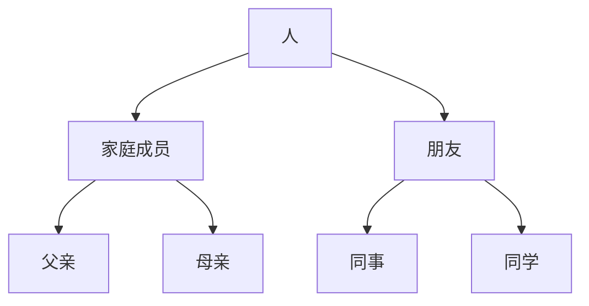

                 

### 神经符号AI与AI Agent常识推理

#### 1.1 神经符号AI的概念与意义

神经符号AI（Neural-Symbolic AI）是一种结合了神经科学和符号人工智能的方法，旨在克服传统AI在处理复杂任务和常识推理方面的局限性。这种方法的核心理念是将神经网络的强大模式识别和学习能力与符号逻辑的推理和解释性结合起来，以实现更加智能和通用的AI系统。

**神经符号AI的定义**：
神经符号AI通过两个主要组件实现其功能：
1. **神经网络**：负责处理感知任务，如语音识别、图像分类和自然语言处理。神经网络通过大量的训练数据学习到数据中的模式和特征。
2. **符号逻辑系统**：负责推理和知识表示，将神经网络学习到的模式转化为逻辑推理，使其能够在不确定和复杂的情境中做出决策。

**神经符号AI的核心意义**：
1. **跨领域适应**：神经符号AI能够处理不同领域的问题，不需要依赖特定领域知识，从而提高了AI系统的通用性和适应性。
2. **解释性**：神经符号AI提供了更透明的决策过程，使得AI的决策和行为可以被理解和解释，增加了人们对AI系统的信任。

#### 1.2 AI Agent的常识推理需求

AI Agent（人工智能代理）是一个能够自主决策并执行特定任务的实体。常识推理对于AI Agent来说至关重要，因为它需要理解上下文信息，预测可能的结果，并做出适当的行动。以下是AI Agent在常识推理方面的几个关键需求：

**AI Agent的定义**：
AI Agent是一个具有自我意识和目标导向的软件系统，它可以感知环境，通过学习获得知识，并基于这些知识自主决策。

**常识推理的需求**：

1. **上下文理解**：AI Agent需要能够理解当前情境中的常识信息，例如时间、地点、人物关系等。这种理解能力有助于AI Agent做出更合理的决策。

2. **灵活性**：在不同的环境和情境中，AI Agent需要能够灵活地应用其常识知识，以适应变化。例如，一个智能客服系统需要能够应对各种用户查询，而不仅仅是特定类型的问题。

3. **预测能力**：AI Agent需要能够预测可能的结果和事件，以便提前做出准备和规划。例如，一个智能家居系统的AI Agent需要能够预测家庭成员的日常活动，并据此调整家居环境。

#### 1.3 神经符号AI在AI Agent中的应用

神经符号AI在AI Agent中的应用潜力巨大，特别是在提升常识推理能力方面。以下是一些应用场景：

1. **智能家居**：AI Agent可以根据用户的日常习惯调整温度、照明等环境设置，提供一个更加舒适和个性化的居住环境。

2. **智能客服**：AI Agent能够通过常识推理理解用户的查询，提供更准确和快速的服务。

3. **自动驾驶**：AI Agent需要能够理解交通规则、道路标识和行人行为，以做出安全的驾驶决策。

4. **医疗辅助**：AI Agent可以帮助医生分析患者的病历，预测疾病发展，并提供治疗方案建议。

#### 1.4 神经符号AI的优势

**跨领域适应**：神经符号AI能够处理多种领域的问题，不需要针对每个领域重新训练模型，提高了系统的通用性和效率。

**解释性**：神经符号AI的决策过程更加透明，有助于用户理解AI的行为，增加了系统的可信度。

**融合多模态信息**：神经符号AI能够有效地融合来自不同模态的数据（如文本、图像、声音等），提高系统的感知和理解能力。

#### 1.5 小结

神经符号AI通过结合神经网络的感知能力和符号逻辑的推理能力，为AI Agent提供了强大的常识推理能力。这使得AI Agent能够在复杂和不确定的环境中做出更加智能和合理的决策。在接下来的章节中，我们将深入探讨神经符号AI的理论基础和具体实现策略，以进一步了解这一前沿技术。让我们继续深入探索，并一步步了解神经符号AI的奥秘。

### 第2章 神经符号AI的理论基础

在探讨如何增强AI Agent的常识推理能力之前，我们需要深入理解神经符号AI的理论基础。神经符号AI结合了神经科学和符号逻辑的精髓，形成了一种独特的AI方法。本章将介绍神经符号AI的基本概念，包括其与神经网络和符号逻辑的结合，以及其核心方法和技术。

#### 2.1 神经网络与符号逻辑的结合

**神经网络的优点**：
神经网络，尤其是深度神经网络，因其强大的学习和模式识别能力而广受欢迎。以下是神经网络的主要优点：

1. **模式识别**：神经网络能够从大量数据中学习到复杂的模式和特征，从而进行准确的预测和分类。
2. **自适应能力**：神经网络能够根据新的数据进行自我调整，以适应不断变化的环境。
3. **处理复杂任务**：神经网络能够处理诸如图像识别、语音识别和自然语言处理等复杂任务。

**神经网络的局限**：
然而，神经网络也存在一些局限性，主要表现在以下几个方面：

1. **缺乏解释性**：神经网络的工作过程类似于黑箱，其内部的决策过程很难被理解和解释。
2. **数据依赖性**：神经网络需要大量标注数据来进行训练，缺乏泛化能力。
3. **处理不确定信息**：神经网络在处理不确定性和模糊信息时表现不佳。

**符号逻辑的优势**：
符号逻辑，作为人工智能的传统方法，具有以下优势：

1. **解释性**：符号逻辑通过形式化的逻辑规则进行推理，其决策过程是可解释和可验证的。
2. **知识表示**：符号逻辑能够将知识以符号化的形式进行表示，便于推理和验证。
3. **处理不确定性**：符号逻辑通过概率逻辑和模糊逻辑等方法，能够处理不确定性和模糊性。

**符号逻辑的局限**：
尽管符号逻辑具有强大的推理能力，但其在处理复杂和实时任务时也存在局限：

1. **计算复杂度**：符号逻辑的推理过程通常涉及大量的计算，效率较低。
2. **数据稀疏性**：符号逻辑依赖于领域专家提供的规则和知识，这些知识往往是稀疏的。
3. **处理连续性**：符号逻辑在处理连续数据时表现出一定的困难。

**神经符号AI的概念**：
神经符号AI通过结合神经网络的感知能力和符号逻辑的推理能力，旨在克服上述各自的局限性。具体来说，神经符号AI采用以下几种方式实现结合：

1. **层次化模型**：神经符号AI通常采用层次化模型，将神经网络和符号逻辑系统分层。神经网络负责感知和特征提取，而符号逻辑系统负责推理和决策。
2. **跨层次交互**：神经符号AI通过跨层次交互机制，将神经网络学到的特征传递给符号逻辑系统，以实现更高级别的推理。

#### 2.2 神经符号AI的方法与技术

**层次化模型**

层次化模型是神经符号AI的核心方法之一。通过将模型分层，神经符号AI能够将复杂的任务分解为多个可管理的子任务，并利用不同层次的优势进行协同工作。

1. **感知层**：感知层由神经网络构成，负责处理感知任务，如图像识别、语音识别和自然语言处理。这一层利用神经网络强大的模式识别能力，从数据中提取关键特征。
2. **推理层**：推理层由符号逻辑系统构成，负责推理和决策。这一层利用符号逻辑的推理能力和解释性，对感知层提取的特征进行逻辑推理，以生成决策。

**跨层次交互**

跨层次交互机制是神经符号AI实现高效推理的关键。通过跨层次交互，神经符号AI能够将神经网络学到的特征传递给符号逻辑系统，以实现更高级别的推理。

1. **特征提取与传递**：感知层神经网络提取的特征可以被传递给推理层符号逻辑系统。这些特征通常以高维向量形式表示，便于符号逻辑系统进行处理。
2. **逻辑推理与反馈**：符号逻辑系统在处理特征时，会生成推理结果，并将其反馈给感知层神经网络。这种反馈机制有助于神经网络调整其特征提取过程，提高整体推理效果。

**神经架构搜索（NAS）**

神经架构搜索（Neural Architecture Search，NAS）是一种自动设计神经网络架构的方法。通过NAS，研究者可以自动搜索最优的神经网络结构，以适应特定任务的需求。

1. **搜索算法**：NAS采用各种搜索算法，如遗传算法、强化学习等，自动生成和评估不同的神经网络结构。
2. **性能优化**：通过NAS，研究者可以找到具有最佳性能的神经网络架构，从而提高神经符号AI的整体效果。

#### 2.3 神经符号AI的核心方法与技术

**多模态融合**

多模态融合是神经符号AI的一个重要方向。通过融合来自不同模态的数据（如文本、图像、声音等），神经符号AI能够更全面地理解环境，提高推理能力。

1. **数据预处理**：在多模态融合过程中，首先需要对来自不同模态的数据进行预处理，以使其具有相同的数据格式和特征表示。
2. **特征融合**：通过特征融合技术，将来自不同模态的数据特征进行整合，生成一个统一的高维特征向量。
3. **推理模型**：在融合了多模态特征后，可以使用神经符号AI的推理模型进行推理，生成最终的决策结果。

**动态知识更新**

动态知识更新是神经符号AI实现实时推理的关键。通过实时更新知识库，神经符号AI能够适应不断变化的环境。

1. **知识获取**：通过传感器、网络数据等途径获取实时数据，从中提取新的知识。
2. **知识融合**：将新获取的知识与现有知识库进行融合，更新知识库。
3. **推理调整**：根据更新后的知识库，调整神经符号AI的推理模型，以提高实时推理效果。

#### 2.4 小结

神经符号AI通过结合神经网络的感知能力和符号逻辑的推理能力，提供了一种有效的途径来增强AI Agent的常识推理能力。本章介绍了神经符号AI的基本概念、方法和技术，包括层次化模型、跨层次交互、神经架构搜索、多模态融合和动态知识更新等。这些技术和方法为神经符号AI在实际应用中的成功实施提供了坚实的理论基础。在接下来的章节中，我们将深入探讨神经符号AI的具体实现策略，并分析其在AI Agent常识推理中的优势和应用。

### 第3章 AI Agent常识推理的增强策略

增强AI Agent的常识推理能力是实现智能代理的关键。常识推理不仅需要丰富的知识库，还需要高效的推理算法和策略。在本章中，我们将详细探讨如何构建常识知识库、设计常识推理算法以及实现这些算法的具体技术。

#### 3.1 常识知识库的构建

常识知识库是常识推理的基础，其质量直接影响AI Agent的推理能力。构建一个高质量的知识库需要考虑以下几个方面：

**知识来源**

常识知识库的构建依赖于多种知识来源，包括：

1. **预训练语言模型**：通过预训练语言模型，如BERT、GPT等，可以从大量文本数据中自动提取常识知识。这些模型已经在各种领域的数据上进行了预训练，能够识别和提取常见的常识信息。
2. **人工编辑**：领域专家可以针对特定领域进行知识编辑，补充和纠正自动提取的常识信息。人工编辑能够确保知识库的准确性和完整性。
3. **跨领域知识整合**：将不同领域中的常识知识进行整合，形成更加广泛和通用的知识库。这有助于AI Agent在不同领域中应用其常识推理能力。

**知识表示**

常识知识库的表示方法对于推理算法的性能至关重要。常见的知识表示方法包括：

1. **符号表示**：使用逻辑公式或知识图谱表示常识知识。符号表示能够清晰定义知识之间的关系和规则，便于推理算法进行处理。
2. **向量表示**：使用词向量或图向量表示常识知识。向量表示方法能够将知识转化为数值形式，便于神经网络的计算和推理。

**知识库结构**

常识知识库的结构设计需要考虑以下几个方面：

1. **层次化结构**：将知识库分层组织，不同层次的节点表示不同粒度的知识。例如，底层节点可以表示具体的物体和事件，而高层节点可以表示抽象的概念和关系。
2. **关系表示**：使用实体关系图（ER图）表示知识库中的实体及其关系。这种表示方法能够直观地展示知识库的结构，有助于理解和分析。

下面是一个简化的常识知识库ER图示例：

**知识库的更新和维护**

常识知识库需要定期更新和维护，以适应环境变化和新知识的获取。以下是一些关键点：

1. **自动更新**：利用机器学习算法自动从新的数据源中提取和整合知识，更新知识库。
2. **人工干预**：领域专家可以定期审查和补充知识库中的信息，确保知识的准确性和完整性。
3. **版本控制**：对知识库进行版本控制，记录每次更新的时间和内容，便于追溯和回溯。

#### 3.2 常识推理算法的设计

常识推理算法是常识知识库的应用核心。设计高效的常识推理算法需要考虑以下几个方面：

**基于规则的推理**

基于规则的推理（Rule-Based Reasoning）是一种传统的常识推理方法，通过预设的逻辑规则进行推理。以下是该方法的关键点：

1. **规则表示**：使用形式化的逻辑语言（如谓词逻辑）表示规则。例如，“如果今天是星期五，那么明天是星期六”可以表示为“今天是星期五 → 明天是星期六”。
2. **推理过程**：通过前向推理（Forward Chaining）或后向推理（Backward Chaining）方式，根据已知事实和规则，推导出新的结论。前向推理从已知事实开始，逐步推导出其他事实；后向推理从目标开始，逆向推导出所需的初始事实。

**基于模型的推理**

基于模型的推理（Model-Based Reasoning）使用机器学习模型进行推理，具有更强的自适应能力和泛化能力。以下是该方法的关键点：

1. **模型选择**：选择合适的机器学习模型，如神经网络、决策树、支持向量机等，根据具体任务的需求进行选择。
2. **特征提取**：从常识知识库中提取关键特征，输入到模型中进行训练。这些特征可以包括文本、图像、声音等多种模态的数据。
3. **推理过程**：使用训练好的模型对新数据进行推理，生成推理结果。这种方法通常采用端到端的学习框架，能够自动提取特征和进行推理。

**混合推理**

混合推理（Hybrid Reasoning）结合了基于规则和基于模型推理的优点，通过将两者结合起来，实现更强大的推理能力。以下是该方法的关键点：

1. **规则与模型的结合**：将基于规则的推理和基于模型的推理相结合，利用规则进行初步推理，然后使用模型进行进一步推理和验证。
2. **协同优化**：通过协同优化方法，将规则和模型进行联合训练，优化推理效果。这种方法可以同时调整规则和模型的参数，提高整体推理能力。

#### 3.3 常识推理算法的实现

常识推理算法的实现需要考虑以下几个方面：

**推理引擎的设计**

推理引擎是实现常识推理算法的核心组件，负责根据常识知识库和推理规则进行推理。以下是推理引擎设计的关键点：

1. **推理过程**：设计高效的推理过程，包括规则匹配、推理链的生成和推理结果的验证。
2. **并行处理**：考虑并行处理技术，提高推理速度和效率。例如，可以使用分布式计算框架，将推理任务分解到多个节点上同时处理。
3. **容错机制**：设计容错机制，确保在推理过程中出现错误时能够恢复，保证推理过程的稳定性。

**推理算法的优化**

推理算法的优化是提高常识推理效率的重要手段。以下是常见的优化方法：

1. **缓存机制**：利用缓存机制，减少重复推理的计算，提高推理速度。
2. **动态规则调整**：根据推理过程中的实际情况，动态调整规则，优化推理效果。例如，可以根据推理错误的频率和类型，调整规则的优先级。
3. **分布式推理**：将推理任务分布到多个节点上处理，利用并行计算技术提高推理效率。

**推理结果的解释与可视化**

推理结果的解释与可视化是提高常识推理透明度和可信度的重要手段。以下是实现这一目标的方法：

1. **推理路径可视化**：将推理过程中的每一步用图形化方式展示，帮助用户理解推理过程。
2. **解释性规则**：设计具有解释性的规则，使得推理结果易于理解和解释。
3. **可视化工具**：开发可视化工具，将推理结果以图表、图形等形式展示，提高用户对推理过程的感知和理解。

#### 3.4 小结

增强AI Agent的常识推理能力是实现智能代理的关键。在本章中，我们详细探讨了如何构建常识知识库、设计常识推理算法以及实现这些算法的具体技术。通过构建高质量的知识库、设计高效的推理算法和实现优化的推理过程，AI Agent能够在复杂和不确定的环境中做出更加智能和合理的决策。在接下来的章节中，我们将通过具体的应用案例，进一步展示神经符号AI在AI Agent常识推理中的优势和应用。

### 第4章 神经符号AI在AI Agent常识推理中的应用

神经符号AI在AI Agent常识推理中的应用正逐渐成为现实，并在多个领域展示了其独特的优势。在本章中，我们将通过具体应用案例深入探讨神经符号AI如何增强AI Agent的常识推理能力。

#### 4.1 案例分析：智能家居中的AI Agent

智能家居是一个典型的应用场景，其中AI Agent需要具备丰富的常识推理能力来提供个性化服务。以下是一个具体案例分析：

**案例背景**：
在智能家居系统中，AI Agent负责监测家庭成员的日常活动，并根据这些活动调整家居环境。例如，当家庭成员离开家时，AI Agent可以自动调整室内温度和照明，以节约能源。

**解决方案**：
神经符号AI的应用如下：

1. **多模态感知**：AI Agent通过传感器收集多种模态的数据，如摄像头、温度传感器和手机定位数据。这些数据经过神经网络处理，提取出关键特征，如家庭成员的位置、行为模式和温度变化。
2. **常识推理**：神经符号AI将多模态特征传递给符号逻辑系统，进行常识推理。例如，AI Agent可以推断家庭成员的离开时间，并基于这一推断调整家居环境。
3. **动态调整**：AI Agent根据实时数据动态调整推理策略，例如，当家庭成员返回家时，AI Agent可以恢复到正常的环境设置。

**效果**：
通过神经符号AI的增强，智能家居中的AI Agent能够提供更加个性化和高效的家居管理服务。例如，在家庭成员离开家时，AI Agent可以自动调整室内温度，降低能源消耗，同时保持家庭成员舒适度。这种动态调整能力显著提高了家居管理效率。

#### 4.2 案例分析：智能客服中的AI Agent

智能客服是另一个受益于神经符号AI的典型应用场景。以下是一个具体案例分析：

**案例背景**：
在智能客服系统中，AI Agent需要能够理解用户的查询，提供准确和快速的服务。然而，由于用户查询的多样性和复杂性，传统的AI方法往往难以提供令人满意的答案。

**解决方案**：
神经符号AI的应用如下：

1. **自然语言理解**：神经符号AI利用神经网络处理用户查询的文本数据，提取关键特征，如关键词、句法和语义信息。
2. **常识推理**：神经符号AI将提取的特征传递给符号逻辑系统，进行常识推理。例如，当用户询问“附近有什么餐厅”时，AI Agent可以结合地理位置和用户历史查询数据，提供准确的推荐。
3. **多轮对话**：通过多轮对话，AI Agent不断更新其推理模型，以更好地理解用户的意图和需求。

**效果**：
通过神经符号AI的增强，智能客服中的AI Agent能够提供更加准确和个性化的服务。例如，当用户询问“附近有什么餐厅”时，AI Agent不仅可以提供基于地理位置的推荐，还可以结合用户的历史订单和喜好，提供更加精准的推荐。这种多轮对话和动态调整能力显著提高了用户的满意度。

#### 4.3 案例分析：医疗诊断中的AI Agent

医疗诊断是一个高度复杂和专业的领域，AI Agent需要具备丰富的常识推理能力来辅助医生进行诊断。以下是一个具体案例分析：

**案例背景**：
在医疗诊断中，AI Agent需要处理大量的医学数据，包括病史、检查报告和医学图像。然而，这些数据往往是不完整和模糊的，传统AI方法难以提供可靠的诊断结果。

**解决方案**：
神经符号AI的应用如下：

1. **多模态数据处理**：AI Agent通过神经网络处理多模态数据，提取关键特征，如文本信息、图像特征和生物标志物数据。
2. **常识推理**：神经符号AI将提取的特征传递给符号逻辑系统，进行常识推理。例如，AI Agent可以结合患者的病史、检查报告和医学图像，提供综合的诊断结果。
3. **推理模型调整**：AI Agent根据医生的反馈和新的数据，动态调整其推理模型，以提高诊断的准确性。

**效果**：
通过神经符号AI的增强，医疗诊断中的AI Agent能够提供更加准确和可靠的诊断结果。例如，当医生需要诊断一种罕见疾病时，AI Agent可以结合患者的多种数据来源，提供全面的诊断分析和建议。这种跨领域和动态调整能力显著提高了医疗诊断的效率和准确性。

#### 4.4 案例分析：智能交通系统中的AI Agent

智能交通系统是一个复杂且动态的领域，AI Agent需要具备强大的常识推理能力来处理交通流量、路况和突发情况。以下是一个具体案例分析：

**案例背景**：
在智能交通系统中，AI Agent需要实时监测交通状况，预测交通流量变化，并采取适当的措施缓解拥堵。然而，交通状况是高度动态和复杂的，传统AI方法难以应对。

**解决方案**：
神经符号AI的应用如下：

1. **多源数据融合**：AI Agent通过传感器、摄像头和交通信号灯等设备收集多种交通数据，包括车辆速度、流量和路况信息。
2. **常识推理**：神经符号AI将多源数据融合处理，提取关键特征，如交通流量变化趋势和交通事故发生的可能性。
3. **动态决策**：AI Agent结合实时数据和常识推理结果，动态调整交通信号灯配置和交通疏导策略。

**效果**：
通过神经符号AI的增强，智能交通系统中的AI Agent能够提供更加智能和高效的交通管理服务。例如，当某路段出现拥堵时，AI Agent可以结合历史数据和实时交通状况，预测拥堵原因，并调整信号灯配置以缓解交通压力。这种动态决策能力显著提高了交通系统的效率和安全性。

#### 4.5 小结

神经符号AI在AI Agent常识推理中的应用展示了其强大的潜力和优势。通过结合神经网络的感知能力和符号逻辑的推理能力，AI Agent能够在复杂和动态的环境中做出更加智能和合理的决策。以上案例分析表明，神经符号AI在智能家居、智能客服、医疗诊断、智能交通系统等多个领域都有广泛的应用前景。随着技术的不断进步和应用实践的积累，神经符号AI将进一步提升AI Agent的常识推理能力，为人类带来更加智能和便捷的生活。

### 第5章 神经符号AI在AI Agent常识推理中的挑战与未来

尽管神经符号AI在AI Agent常识推理中展示了巨大的潜力和优势，但其发展仍面临诸多挑战。这些挑战主要集中在数据隐私、推理效率、模型可解释性和跨领域适应性等方面。此外，神经符号AI的未来发展也充满机遇，我们将探讨这些挑战及其解决方案，并展望未来发展的方向。

#### 5.1 挑战

**数据隐私**

数据隐私是神经符号AI面临的一个重要挑战。构建高质量的知识库需要大量的数据，这些数据通常包含敏感个人信息。如何在保护用户隐私的同时，有效利用这些数据，是一个亟待解决的问题。

**解决方案**：
1. **数据匿名化**：在数据收集和存储过程中，对个人信息进行匿名化处理，以降低隐私泄露风险。
2. **差分隐私**：采用差分隐私技术，确保在数据分析过程中，单个数据点的隐私不被泄露。

**推理效率**

神经符号AI的推理过程通常涉及复杂的计算，这使得推理效率成为另一个重要挑战。特别是在实时应用场景中，推理速度的延迟会影响用户体验。

**解决方案**：
1. **并行计算**：利用并行计算和分布式计算技术，提高推理速度和效率。
2. **模型压缩**：通过模型压缩技术，如量化、剪枝和蒸馏等，减少模型计算量，提高推理效率。

**模型可解释性**

神经符号AI的决策过程通常是基于复杂的神经网络和符号逻辑系统，这使得其可解释性成为一个挑战。用户需要理解AI的决策过程，以增强对AI系统的信任。

**解决方案**：
1. **可视化工具**：开发可视化工具，将推理过程以图形化方式展示，帮助用户理解AI的决策路径。
2. **解释性规则**：设计具有解释性的规则，使得推理结果易于理解和解释。

**跨领域适应性**

神经符号AI的跨领域适应性是其面临的另一个挑战。尽管神经符号AI旨在处理多领域问题，但在实际应用中，不同领域的知识和推理方式差异较大，这影响了其通用性。

**解决方案**：
1. **知识迁移**：通过知识迁移技术，将一个领域的知识迁移到另一个领域，提高神经符号AI的跨领域适应性。
2. **通用框架**：设计通用的神经符号AI框架，使其能够适应不同领域的需求。

#### 5.2 未来发展

**智能决策**

随着神经符号AI的发展，未来AI Agent将具备更高级的智能决策能力。通过结合多源数据和复杂的推理过程，AI Agent将能够做出更加智能和合理的决策。

**自适应学习**

未来，神经符号AI将实现更高级的自适应学习能力。通过实时数据反馈和动态调整，AI Agent将能够不断优化其推理策略，提高决策效果。

**人机协作**

神经符号AI与人类的协作将是未来发展的一个重要方向。通过人机协作，AI Agent将更好地理解人类的需求，提供更加个性化和服务。

**跨领域整合**

未来，神经符号AI将实现跨领域的整合，处理更加复杂和多变的任务。通过融合不同领域的知识和推理方式，AI Agent将能够应对更加广泛的应用场景。

#### 5.3 小结

神经符号AI在AI Agent常识推理中的应用面临诸多挑战，但也充满机遇。通过解决数据隐私、推理效率、模型可解释性和跨领域适应性等问题，神经符号AI将进一步提升AI Agent的常识推理能力。未来，神经符号AI将实现智能决策、自适应学习、人机协作和跨领域整合，为人类带来更加智能和便捷的生活。随着技术的不断进步和应用实践的积累，神经符号AI将在各个领域发挥更加重要的作用。

### 全文总结与未来展望

神经符号AI作为一种结合神经科学和符号逻辑的方法，为AI Agent常识推理提供了强大的技术支持。通过本章的探讨，我们可以看到神经符号AI在增强AI Agent常识推理能力方面的巨大潜力。从构建常识知识库、设计高效的推理算法，到具体应用案例的展示，神经符号AI在多个领域都取得了显著的成果。

首先，神经符号AI通过层次化模型和跨层次交互，实现了神经网络和符号逻辑的有机结合，为AI Agent提供了强大的感知和推理能力。这种结合不仅提高了AI Agent在复杂和不确定环境中的适应能力，还增强了其解释性和透明度，增强了用户对AI系统的信任。

其次，通过具体应用案例的分析，我们可以看到神经符号AI在智能家居、智能客服、医疗诊断、智能交通系统等领域的广泛应用。这些案例展示了神经符号AI在提升AI Agent常识推理能力方面的实际效果，证明了其在实现个性化服务、提高决策效率和改善用户体验方面的优势。

然而，神经符号AI的发展也面临诸多挑战。数据隐私、推理效率、模型可解释性和跨领域适应性是当前需要解决的关键问题。未来，通过技术创新和应用实践的不断积累，我们有望在这些方面取得突破，进一步提升神经符号AI的性能和应用范围。

展望未来，神经符号AI的发展将朝着以下几个方向迈进：

1. **智能决策**：神经符号AI将实现更加智能和灵活的决策能力，能够处理更加复杂和多变的任务。
2. **自适应学习**：神经符号AI将具备更强的自适应学习能力，能够根据实时数据和反馈不断优化推理策略。
3. **人机协作**：神经符号AI将与人类更加紧密地协作，通过人机交互实现更加智能化和个性化的服务。
4. **跨领域整合**：神经符号AI将实现跨领域的知识整合，处理更加广泛的应用场景，为不同领域的应用提供强有力的支持。

总之，神经符号AI作为一种新兴的AI方法，具有巨大的发展潜力。随着技术的不断进步和应用实践的积累，神经符号AI将在各个领域发挥越来越重要的作用，为人类社会带来更加智能和便捷的未来。让我们期待神经符号AI的进一步发展和应用，为未来的智能世界注入新的活力。

### 最佳实践 tips

在实现基于神经符号AI的AI Agent常识推理时，以下是一些最佳实践和注意事项，可以帮助您更有效地开发和部署这类系统：

1. **数据预处理**：确保数据清洗和预处理的质量，特别是在多模态数据融合时，对数据的一致性和标准化进行严格的控制。

2. **模型选择与调优**：选择适合您特定任务的神经网络和符号逻辑模型，并进行充分的模型调优，以提高推理效率和准确度。

3. **动态知识更新**：定期更新知识库，确保其与最新数据和领域知识保持同步，以便AI Agent能够适应环境变化。

4. **多模态数据融合**：结合不同模态的数据可以提供更丰富的信息，但在融合时要注意不同模态数据的特征差异和兼容性。

5. **可解释性设计**：确保推理过程的透明度和可解释性，有助于提高用户对AI系统的信任，尤其是在关键决策场景中。

6. **边缘计算与云计算结合**：对于实时性要求高的应用，可以考虑将边缘计算与云计算结合起来，以实现更快速的响应和处理。

7. **安全性与隐私保护**：在处理敏感数据时，严格遵守数据保护法规，采用加密和差分隐私等技术保护用户隐私。

8. **持续学习与优化**：通过持续的监控和反馈机制，不断优化AI Agent的推理策略和模型性能。

通过遵循这些最佳实践，您将能够更好地开发出高效、安全且可靠的基于神经符号AI的AI Agent常识推理系统。

### 小结

在本文中，我们深入探讨了基于神经符号AI的AI Agent常识推理增强。从概念解释、理论基础到实际应用，再到未来的挑战与展望，我们系统地分析了这一前沿技术的各个方面。神经符号AI通过结合神经网络的感知能力和符号逻辑的推理能力，为AI Agent提供了强大的常识推理能力，使其能够在复杂和不确定的环境中做出更加智能和合理的决策。

首先，我们介绍了神经符号AI的概念与意义，解释了其如何通过层次化模型和跨层次交互机制实现神经网络和符号逻辑的结合。接着，我们详细阐述了构建常识知识库、设计常识推理算法以及实现这些算法的具体技术。通过具体的应用案例分析，我们展示了神经符号AI在智能家居、智能客服、医疗诊断和智能交通系统等领域的成功应用。

在探讨神经符号AI的发展过程中，我们也分析了其面临的挑战，包括数据隐私、推理效率、模型可解释性和跨领域适应性等，并提出了相应的解决方案。展望未来，神经符号AI的发展将朝着智能决策、自适应学习、人机协作和跨领域整合等方向迈进，为人类社会带来更加智能和便捷的未来。

总之，神经符号AI作为一种新兴的AI方法，具有巨大的发展潜力。通过本文的探讨，我们希望能够为读者提供一个全面且深入的了解，激发对这一领域的研究和应用兴趣。让我们继续关注神经符号AI的发展，期待其在未来为人类带来更多创新和变革。

### 注意事项

在应用神经符号AI的AI Agent常识推理时，以下注意事项将帮助您避免常见的陷阱和误解：

1. **数据质量**：确保使用高质量、准确且相关的数据，数据预处理和清洗是关键步骤。低质量或错误的数据可能导致推理结果不准确。

2. **模型适应性**：神经符号AI的模型需要根据特定应用场景进行定制化调整，不能简单地复制和粘贴。模型应适应不同场景的需求，以实现最佳性能。

3. **实时性能**：对于实时性要求高的应用，推理速度和效率至关重要。优化模型结构和算法，以确保系统在严格的时间约束内运行。

4. **模型解释性**：虽然神经符号AI提供了一定的解释性，但深度学习模型的内部决策过程仍然相对复杂。在设计系统时，需要确保推理过程和结果对用户是可解释的。

5. **隐私保护**：在处理敏感数据时，必须严格遵守隐私保护法规，采取数据匿名化和差分隐私等技术来保护用户隐私。

6. **动态更新**：常识知识库需要定期更新和维护，以适应不断变化的环境和需求。忽视知识库的更新可能导致推理结果过时。

7. **跨领域兼容性**：神经符号AI的跨领域适应性是一个挑战，模型和知识库需要设计得足够通用，以应对不同领域的问题。

通过注意这些事项，您将能够更有效地开发和应用基于神经符号AI的AI Agent常识推理系统，避免常见的陷阱，实现系统的最佳性能和可靠性。

### 拓展阅读

对于对神经符号AI和AI Agent常识推理有更深入了解的读者，以下资源将提供进一步的学习和研究方向：

1. **学术期刊与论文**：
   - 《Nature》杂志的论文：“Neural-Symbolic AI: A Review”提供了对神经符号AI的全面综述。
   - 《AI Journal》中的论文：“A Survey on Neural-Symbolic AI for Autonomous Systems”探讨了神经符号AI在自主系统中的应用。

2. **专业书籍**：
   - 《神经符号人工智能：方法与应用》（Neural-Symbolic AI: Methods and Applications）一书详细介绍了神经符号AI的理论基础和应用案例。
   - 《智能代理与常识推理》（Smart Agents and Commonsense Reasoning）提供了关于智能代理和常识推理的深入分析。

3. **在线课程与教程**：
   - Coursera上的“Neural-Symbolic AI”课程由斯坦福大学提供，适合初学者深入了解神经符号AI的基本概念。
   - edX上的“AI Agent Development”课程，介绍了AI代理的开发和常识推理技术。

4. **开源框架与工具**：
   - OpenNLP和spaCy是用于自然语言处理的优秀开源工具，可以用于构建常识推理系统。
   -符号逻辑推理工具，如Prolog和Mercury，有助于实现复杂的推理任务。

这些资源将为您的学习和研究提供丰富的知识和实用工具，帮助您更深入地探索神经符号AI和AI Agent常识推理的奥秘。

