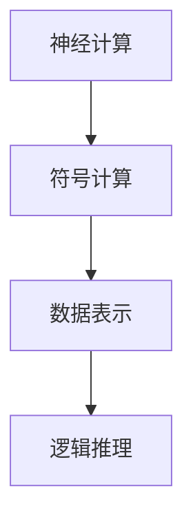
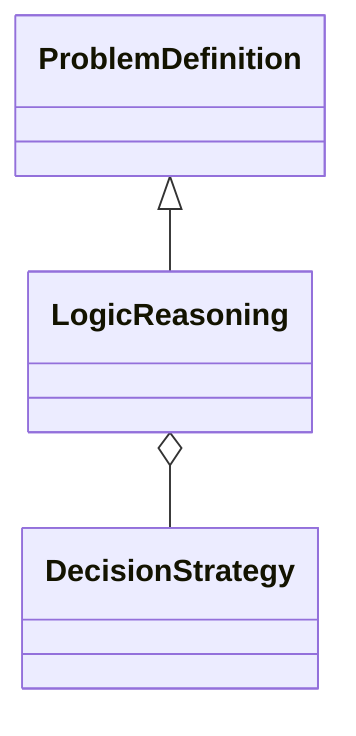
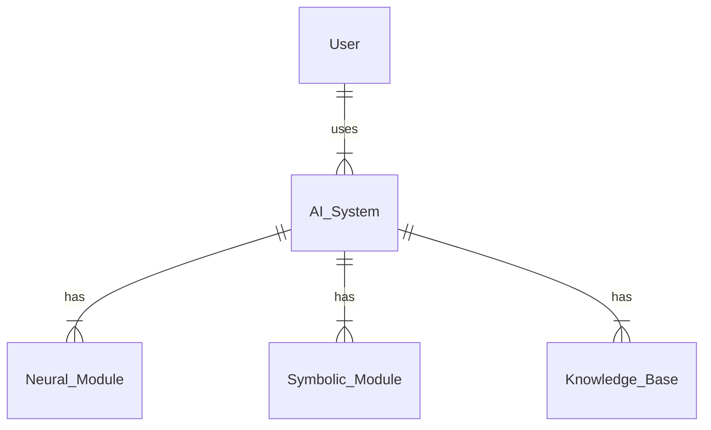

                 

## 文章标题

### 关键词：神经符号AI，AI Agent，逻辑推理，应用场景，挑战与前景

### 摘要

本文将探讨神经符号AI在AI Agent逻辑推理中的应用，首先介绍神经符号AI的基本概念、发展历程和核心技术，然后深入分析AI Agent及其逻辑推理的重要性。在此基础上，我们将探讨神经符号AI在AI Agent逻辑推理中的优势和应用案例，最后讨论该领域的挑战和未来发展趋势。通过本文的详细分析，读者将对该领域有一个全面而深入的了解，从而更好地把握其应用前景。

### 目录大纲

----------------------------------------------------------------

# 第一部分：引言

## 1.1 问题背景

### 1.1.1 神经符号AI的兴起

### 1.1.2 AI Agent的逻辑推理需求

## 1.2 问题描述

### 1.2.1 神经符号AI的概念与特征

### 1.2.2 AI Agent逻辑推理的重要性

## 1.3 问题解决

### 1.3.1 神经符号AI在AI Agent逻辑推理中的应用

### 1.3.2 神经符号AI的优势与挑战

## 1.4 边界与外延

### 1.4.1 神经符号AI的研究领域

### 1.4.2 AI Agent逻辑推理的应用场景

## 1.5 概念结构与核心要素组成

### 1.5.1 神经符号AI的基本概念

### 1.5.2 AI Agent逻辑推理的核心要素

## 1.6 本章小结

----------------------------------------------------------------

# 第二部分：神经符号AI基础

## 2.1 神经符号AI概述

### 2.1.1 神经符号AI的定义

### 2.1.2 神经符号AI的发展历程

### 2.1.3 神经符号AI的核心原理

## 2.2 神经符号AI的基本概念

### 2.2.1 神经元与神经网络

### 2.2.2 符号计算与逻辑推理

### 2.2.3 神经符号AI的层次结构

## 2.3 神经符号AI的关键技术

### 2.3.1 神经网络的训练与优化

### 2.3.2 符号推理算法

### 2.3.3 神经符号AI的集成与应用

## 2.4 神经符号AI的应用场景

### 2.4.1 自然语言处理

### 2.4.2 计算机视觉

### 2.4.3 机器翻译

## 2.5 神经符号AI的优势与挑战

### 2.5.1 神经符号AI的优势

### 2.5.2 神经符号AI的挑战

## 2.6 本章小结

----------------------------------------------------------------

# 第三部分：AI Agent逻辑推理

## 3.1 AI Agent概述

### 3.1.1 AI Agent的定义

### 3.1.2 AI Agent的特点

### 3.1.3 AI Agent的分类

## 3.2 逻辑推理基础

### 3.2.1 逻辑推理的定义

### 3.2.2 逻辑推理的类型

### 3.2.3 逻辑推理的数学基础

## 3.3 基于神经符号AI的逻辑推理算法

### 3.3.1 神经符号AI与逻辑推理的结合

### 3.3.2 基于神经符号AI的逻辑推理算法概述

### 3.3.3 常见的逻辑推理算法

## 3.4 逻辑推理的应用

### 3.4.1 自然语言处理

### 3.4.2 计算机视觉

### 3.4.3 机器翻译

## 3.5 逻辑推理在AI Agent中的应用

### 3.5.1 AI Agent的逻辑推理能力

### 3.5.2 基于逻辑推理的AI Agent设计

### 3.5.3 逻辑推理在AI Agent中的挑战

## 3.6 本章小结

----------------------------------------------------------------

# 第四部分：神经符号AI在AI Agent逻辑推理中的应用

## 4.1 神经符号AI在AI Agent逻辑推理中的优势

### 4.1.1 神经符号AI的优势

### 4.1.2 神经符号AI在AI Agent逻辑推理中的优势

## 4.2 神经符号AI在AI Agent逻辑推理中的应用案例

### 4.2.1 案例一：基于神经符号AI的自然语言理解

### 4.2.2 案例二：基于神经符号AI的计算机视觉推理

### 4.2.3 案例三：基于神经符号AI的机器翻译

## 4.3 神经符号AI在AI Agent逻辑推理中的挑战

### 4.3.1 神经符号AI的挑战

### 4.3.2 神经符号AI在AI Agent逻辑推理中的挑战

## 4.4 神经符号AI在AI Agent逻辑推理中的应用前景

### 4.4.1 神经符号AI在AI Agent逻辑推理中的应用前景

### 4.4.2 未来发展方向与趋势

## 4.5 本章小结

----------------

### 第一部分：引言

## 1.1 问题背景

### 1.1.1 神经符号AI的兴起

神经符号AI是一种将神经计算与符号计算相结合的新型人工智能技术。传统的AI技术主要依赖于数据驱动的方法，而神经符号AI则通过结合神经网络的强大计算能力和符号逻辑的精确性，试图解决传统AI在处理复杂任务时遇到的挑战。近年来，随着深度学习、符号推理等技术的不断发展，神经符号AI逐渐成为学术界和工业界的研究热点。

神经符号AI的兴起得益于以下几个因素：

1. **深度学习的突破**：深度学习的兴起使得神经网络在图像识别、语音识别等任务上取得了显著成果，这为神经符号AI提供了强大的计算基础。
2. **符号推理的需求**：在许多复杂任务中，如自然语言处理、推理规划等，仅仅依赖数据驱动的方法难以达到预期的效果，需要结合符号逻辑进行精确推理。
3. **跨学科研究的融合**：神经计算和符号计算的融合不仅需要计算机科学领域的知识，还需要数学、哲学、认知科学等多学科的交叉研究。

### 1.1.2 AI Agent的逻辑推理需求

AI Agent是指能够自主执行任务、与环境进行交互的智能体。在现实世界中，AI Agent需要具备良好的逻辑推理能力，以便在复杂环境中做出合理的决策。逻辑推理是AI Agent的核心能力之一，它使得AI Agent能够理解复杂的问题、生成合理的解决方案，并在不确定的环境中做出快速响应。

AI Agent在逻辑推理方面的需求主要包括：

1. **问题求解能力**：AI Agent需要能够解决特定领域的问题，如路径规划、资源分配等。
2. **不确定性处理**：在现实世界中，环境是动态变化的，AI Agent需要能够处理不确定性，做出鲁棒的决策。
3. **灵活的适应能力**：AI Agent需要能够适应不同的任务和环境，具备灵活的推理能力。

## 1.2 问题描述

### 1.2.1 神经符号AI的概念与特征

神经符号AI是指结合神经计算和符号计算的人工智能技术，其核心思想是通过神经计算实现数据的自动学习与表示，并通过符号计算实现逻辑推理和决策。神经符号AI具有以下特征：

1. **数据驱动与逻辑驱动相结合**：神经符号AI将神经网络的数据驱动学习和符号逻辑的推理能力相结合，使得AI系统既能够处理大量数据，又能够进行精确的逻辑推理。
2. **多层次表示**：神经符号AI通过神经计算生成多层次的数据表示，这些表示不仅包含了原始数据的信息，还包含了更高层次的语义信息，有助于符号推理。
3. **灵活性与扩展性**：神经符号AI能够根据不同的任务需求进行灵活调整，具有良好的扩展性。

### 1.2.2 AI Agent逻辑推理的重要性

AI Agent的逻辑推理能力是其核心能力之一，对于AI Agent的实际应用至关重要。以下是AI Agent逻辑推理的重要性：

1. **决策能力**：逻辑推理使得AI Agent能够理解复杂的问题，生成合理的解决方案，并在不确定的环境中做出决策。
2. **问题求解能力**：逻辑推理使得AI Agent能够解决特定领域的问题，如自然语言处理、推理规划等。
3. **自适应能力**：逻辑推理使得AI Agent能够根据环境变化调整自己的行为，具备良好的自适应能力。

## 1.3 问题解决

### 1.3.1 神经符号AI在AI Agent逻辑推理中的应用

神经符号AI在AI Agent逻辑推理中的应用主要包括以下几个方面：

1. **自然语言处理**：神经符号AI可以将自然语言文本转换为符号表示，进行语义理解和推理。
2. **推理规划**：神经符号AI可以用于推理规划，解决路径规划、资源分配等问题。
3. **决策支持**：神经符号AI可以用于支持决策，提供合理的建议和决策方案。

### 1.3.2 神经符号AI的优势与挑战

神经符号AI在AI Agent逻辑推理中具有显著的优势，但也面临一些挑战：

**优势**：

1. **强大的计算能力**：神经符号AI结合了神经计算和符号计算的优势，能够处理复杂的任务。
2. **灵活的推理能力**：神经符号AI能够根据不同的任务需求进行灵活调整，具备良好的扩展性。
3. **多层表示能力**：神经符号AI生成多层次的数据表示，有助于符号推理。

**挑战**：

1. **计算效率**：神经符号AI的结合使得计算复杂度较高，对计算资源的要求较高。
2. **推理精度**：符号推理的精度可能受到神经网络表示能力的影响。
3. **数据依赖性**：神经符号AI需要大量的数据支持，数据的获取和处理是一个挑战。

## 1.4 边界与外延

### 1.4.1 神经符号AI的研究领域

神经符号AI的研究领域涵盖了计算机科学、人工智能、认知科学等多个学科，主要涉及以下几个方面：

1. **神经计算**：研究神经网络的建模、训练和优化方法。
2. **符号计算**：研究逻辑推理、符号计算的理论和方法。
3. **跨学科融合**：研究神经计算与符号计算的融合技术，探索新型的人工智能系统。

### 1.4.2 AI Agent逻辑推理的应用场景

AI Agent逻辑推理的应用场景非常广泛，主要包括以下几个方面：

1. **自然语言处理**：如语义理解、问答系统、机器翻译等。
2. **推理规划**：如路径规划、资源分配、智能推荐等。
3. **决策支持**：如金融决策、医疗诊断、风险评估等。

## 1.5 概念结构与核心要素组成

### 1.5.1 神经符号AI的基本概念

神经符号AI的基本概念包括神经计算、符号计算、数据表示、逻辑推理等。以下是一个简单的ER实体关系图，展示了这些基本概念之间的联系：

### 1.5.2 AI Agent逻辑推理的核心要素

AI Agent逻辑推理的核心要素包括问题定义、推理算法、决策策略等。以下是一个简单的Mermaid类图，展示了这些核心要素及其关系：

## 1.6 本章小结

本章首先介绍了神经符号AI的兴起背景和AI Agent逻辑推理的需求，然后对神经符号AI和AI Agent逻辑推理进行了详细的描述，包括其概念、特征、应用场景和核心要素。通过本章的介绍，读者可以初步了解神经符号AI在AI Agent逻辑推理中的重要性和应用前景。

----------------------------------------------------------------

## 2.1 神经符号AI概述

### 2.1.1 神经符号AI的定义

神经符号AI（Neural-Symbolic AI）是一种结合神经计算（Neural Computation）和符号计算（Symbolic Computation）的人工智能方法。它旨在克服传统神经网络在处理复杂推理任务时存在的局限，通过引入符号逻辑来增强模型的理解能力。神经符号AI的核心思想是将神经网络的强大数据学习和处理能力与符号逻辑的精确推理能力相结合，从而实现更加智能和鲁棒的AI系统。

### 2.1.2 神经符号AI的发展历程

神经符号AI的概念源于20世纪80年代，当时研究者开始探索如何将符号逻辑与神经网络相结合，以克服传统神经网络在处理语义理解、逻辑推理和决策支持等方面存在的不足。这一时期的代表性工作包括基于规则的神经网络和混合专家系统。随着深度学习的发展，神经符号AI的研究迎来了新的高潮。

近年来，神经符号AI的研究逐渐从理论研究转向实际应用，特别是在自然语言处理、计算机视觉和知识图谱等领域取得了显著成果。例如，一些研究团队提出了将图神经网络（如Graph Neural Networks, GNNs）与符号推理相结合的方法，用于构建更加智能的问答系统和知识图谱推理引擎。

### 2.1.3 神经符号AI的核心原理

神经符号AI的核心原理可以概括为以下几点：

1. **数据学习与表示**：神经网络通过学习大量的数据来生成高效的数据表示，这些表示通常包含了丰富的低层次特征和部分高层次语义信息。
2. **逻辑推理与决策**：符号计算通过使用逻辑规则和语义关系对神经网络生成的数据表示进行推理，从而生成准确的决策和解释。
3. **层次化结构**：神经符号AI通常采用层次化结构，从低层次的感知信息开始，逐步提取更高层次的概念和语义信息，最终实现复杂的推理任务。

### 2.1.4 神经符号AI的关键技术

神经符号AI的关键技术包括以下几个方面：

1. **神经网络的训练与优化**：神经网络负责数据的自动学习和表示，通常采用深度学习的方法进行训练和优化，以提高模型的准确性和效率。
2. **符号推理算法**：符号推理算法用于对神经网络生成的数据表示进行逻辑推理，通常基于逻辑推理规则、语义网络或知识图谱等。
3. **神经符号集成方法**：神经符号集成方法是将神经网络和符号推理有机结合起来的技术，通过不同的架构设计（如双神经网络结构、统一表示学习等）实现两者的协同工作。

### 2.1.5 神经符号AI的应用场景

神经符号AI的应用场景非常广泛，以下是一些典型的应用领域：

1. **自然语言处理**：如语义理解、问答系统、机器翻译等。
2. **计算机视觉**：如图像分类、目标检测、场景理解等。
3. **知识图谱**：如知识推理、信息抽取、图谱补全等。
4. **推理规划**：如路径规划、资源分配、智能决策等。

### 2.1.6 神经符号AI的优势与挑战

**优势**：

1. **结合了神经网络与符号逻辑的优点**：神经符号AI能够同时利用神经网络的数据处理能力和符号逻辑的推理能力，实现更智能、更鲁棒的AI系统。
2. **多层次的数据表示**：神经符号AI能够生成多层次的语义表示，有助于实现更精确的推理。
3. **灵活性与扩展性**：神经符号AI可以根据不同的应用需求进行灵活调整，具有较强的扩展性。

**挑战**：

1. **计算效率**：神经符号AI结合了神经网络和符号推理，计算复杂度较高，对计算资源的需求较大。
2. **推理精度**：符号推理的精度可能受到神经网络表示能力的影响。
3. **数据依赖性**：神经符号AI需要大量的数据支持，数据的获取和处理是一个挑战。

## 2.2 神经符号AI的基本概念

### 2.2.1 神经元与神经网络

神经元是神经计算的基本单元，它类似于生物神经元，能够接收输入信息并产生输出。神经元通常由一个输入层、一个激活函数和一个输出层组成。输入层接收外部输入信息，激活函数用于计算输入信息的非线性变换，输出层产生最终的输出结果。

神经网络（Neural Network）是由多个神经元组成的复杂网络，它可以用于分类、回归、聚类等多种机器学习任务。神经网络的核心思想是通过学习输入与输出之间的关系，从而实现对未知数据的预测。典型的神经网络包括多层感知机（MLP）、卷积神经网络（CNN）和循环神经网络（RNN）等。

### 2.2.2 符号计算与逻辑推理

符号计算（Symbolic Computation）是一种基于符号表示和逻辑推理的计算方法，它通常涉及符号表达式、公式和逻辑规则。符号计算在数学、物理、工程等领域有广泛的应用，其核心思想是通过符号操作和逻辑推理来解决问题。

逻辑推理（Logic Reasoning）是指基于逻辑规则和推理方法来解决问题的过程。逻辑推理可以分为演绎推理和归纳推理两种类型。演绎推理是从一般到个别的推理过程，即从已知的前提推导出结论；归纳推理则是从个别到一般的推理过程，即从多个具体的实例推导出一般规律。

### 2.2.3 神经符号AI的层次结构

神经符号AI通常采用层次化结构，从低层次的感知信息开始，逐步提取更高层次的概念和语义信息。这种层次化结构有助于实现复杂推理任务，其核心层次包括：

1. **感知层次**：负责接收和处理外部输入信息，如文本、图像、声音等。
2. **表示层次**：将感知层次的信息转换为内部表示，这些表示通常包含了低层次特征和部分高层次语义信息。
3. **推理层次**：基于符号计算和逻辑推理方法，对内部表示进行推理，生成合理的决策和解释。
4. **行动层次**：根据推理结果采取相应的行动，如生成文本、执行操作等。

### 2.2.4 神经符号AI的核心要素

神经符号AI的核心要素包括以下几个部分：

1. **神经网络模块**：负责数据的自动学习和表示，通常采用深度学习的方法进行训练和优化。
2. **符号推理模块**：负责对神经网络生成的数据表示进行逻辑推理，通常基于符号计算和逻辑推理方法。
3. **知识库**：存储与任务相关的知识，如事实、规则和关系等，为符号推理提供支持。
4. **接口模块**：负责与外部系统进行交互，接收输入数据、输出推理结果等。

### 2.2.5 神经符号AI的基本流程

神经符号AI的基本流程可以概括为以下几个步骤：

1. **数据输入**：接收外部输入数据，如文本、图像、声音等。
2. **感知处理**：通过感知层次处理输入数据，提取低层次特征。
3. **表示生成**：通过神经网络模块将感知处理后的数据进行表示学习，生成内部表示。
4. **符号推理**：通过符号推理模块对内部表示进行逻辑推理，生成推理结果。
5. **行动输出**：根据推理结果采取相应的行动，如生成文本、执行操作等。

### 2.2.6 神经符号AI的ER实体关系图

为了更好地理解神经符号AI的基本概念和结构，我们可以使用Mermaid工具绘制一个简单的ER实体关系图。以下是一个示例：

在这个ER图中，`User`实体表示使用AI系统的用户，`AI_System`实体表示AI系统，它包含三个模块：`Neural_Module`（神经网络模块）、`Symbolic_Module`（符号推理模块）和`Knowledge_Base`（知识库）。通过这种结构化的表示，我们可以更清晰地理解神经符号AI的基本组成和功能。

## 2.3 神经符号AI的关键技术

### 2.3.1 神经网络的训练与优化

神经网络的训练与优化是神经符号AI的重要组成部分。神经网络通过学习大量数据来获取输入与输出之间的映射关系，从而实现从输入数据到预测输出的转换。以下是神经网络训练与优化的一些关键技术：

**1. 数据预处理**：
   - **数据清洗**：去除数据中的噪声和异常值。
   - **数据归一化**：将数据缩放到相同的尺度，以减少不同特征之间的差异。
   - **数据增强**：通过旋转、缩放、裁剪等方式生成更多的训练样本，提高模型的泛化能力。

**2. 网络架构设计**：
   - **层次化结构**：通常采用多层感知机（MLP）、卷积神经网络（CNN）或循环神经网络（RNN）等结构。
   - **注意力机制**：用于关注重要的输入特征，提高模型的表达能力。
   - **多任务学习**：通过在一个网络中同时学习多个任务，提高模型的利用效率。

**3. 损失函数与优化器**：
   - **损失函数**：用于衡量预测输出与真实输出之间的差异，常用的有均方误差（MSE）、交叉熵损失等。
   - **优化器**：用于调整网络参数，以最小化损失函数。常用的优化器有随机梯度下降（SGD）、Adam等。

**4. 训练过程**：
   - **前向传播**：将输入数据通过神经网络，计算预测输出。
   - **反向传播**：计算预测输出与真实输出之间的差异，并根据差异调整网络参数。
   - **迭代训练**：重复前向传播和反向传播，逐步优化网络参数。

**5. 模型评估与调优**：
   - **验证集与测试集**：将训练数据分为验证集和测试集，用于评估模型的泛化能力。
   - **交叉验证**：通过多次训练和验证，选择最优模型参数。
   - **超参数调优**：通过调整学习率、批次大小等超参数，优化模型性能。

### 2.3.2 符号推理算法

符号推理算法是神经符号AI的核心组成部分，它通过使用逻辑规则、语义网络或知识图谱等方法对神经网络生成的数据表示进行推理。以下是几种常见的符号推理算法：

**1. 逻辑推理算法**：
   - **命题逻辑**：基于命题逻辑的推理方法，如推理机（Inference Engine）。
   - **谓词逻辑**：基于谓词逻辑的推理方法，如一阶谓词逻辑推理。

**2. 语义网络推理**：
   - **语义网络**：使用节点表示实体，边表示实体之间的关系。
   - **路径搜索**：通过搜索语义网络中的路径，找到满足条件的实体。

**3. 知识图谱推理**：
   - **知识图谱**：使用图结构表示实体和关系。
   - **图谱嵌入**：将实体和关系嵌入到高维空间，用于推理。
   - **图卷积网络（GCN）**：基于图卷积网络的推理方法，用于处理大规模知识图谱。

### 2.3.3 神经符号AI的集成与应用

神经符号AI的集成与应用涉及将神经网络和符号推理有机结合，以实现复杂推理任务。以下是几种常见的集成方法：

**1. 双神经网络结构**：
   - **共同表示学习**：神经网络和符号推理网络共享部分参数，实现共同表示学习。
   - **层次化结构**：神经网络负责低层次特征的提取，符号推理网络负责高层次语义的推理。

**2. 统一表示学习**：
   - **嵌入层**：将神经网络生成的数据表示转换为符号表示，用于符号推理。
   - **融合层**：将神经网络和符号推理网络的输出进行融合，生成最终的推理结果。

**3. 模块化架构**：
   - **神经网络模块**：负责数据的学习和表示。
   - **符号推理模块**：负责对神经网络生成的数据表示进行推理。
   - **模块化接口**：实现神经网络模块和符号推理模块之间的数据传递和协同工作。

### 2.3.4 神经符号AI的应用场景

神经符号AI的应用场景非常广泛，以下是一些典型的应用案例：

**1. 自然语言处理**：
   - **语义理解**：通过神经网络提取文本特征，结合符号推理实现语义理解。
   - **问答系统**：使用知识图谱和符号推理实现智能问答。
   - **机器翻译**：结合神经网络和符号逻辑实现高质量机器翻译。

**2. 计算机视觉**：
   - **图像分类**：通过神经网络进行特征提取，结合符号推理实现精细分类。
   - **目标检测**：使用神经网络检测图像中的目标，结合符号推理实现复杂目标识别。
   - **场景理解**：结合神经网络和符号推理实现场景的语义理解。

**3. 知识图谱**：
   - **知识推理**：通过符号推理实现知识图谱的推理和补全。
   - **信息抽取**：使用神经网络进行文本处理，结合符号推理实现信息抽取。
   - **图谱补全**：通过神经网络和符号推理实现图谱的自动补全。

**4. 推理规划**：
   - **路径规划**：使用神经网络和符号推理实现复杂路径规划。
   - **资源分配**：结合神经网络和符号推理实现资源的最优分配。
   - **决策支持**：通过符号推理为决策者提供合理的建议。

### 2.3.5 神经符号AI的优势与挑战

**优势**：

1. **结合神经网络与符号逻辑的优点**：神经符号AI能够同时利用神经网络的数据处理能力和符号逻辑的推理能力，实现更智能、更鲁棒的AI系统。
2. **多层次的数据表示**：神经符号AI能够生成多层次的语义表示，有助于实现更精确的推理。
3. **灵活性与扩展性**：神经符号AI可以根据不同的应用需求进行灵活调整，具有较强的扩展性。

**挑战**：

1. **计算效率**：神经符号AI结合了神经网络和符号推理，计算复杂度较高，对计算资源的需求较大。
2. **推理精度**：符号推理的精度可能受到神经网络表示能力的影响。
3. **数据依赖性**：神经符号AI需要大量的数据支持，数据的获取和处理是一个挑战。

### 2.3.6 神经符号AI的总结

神经符号AI是一种结合神经计算和符号计算的人工智能方法，通过将神经网络的数据处理能力和符号逻辑的推理能力相结合，实现更智能、更鲁棒的AI系统。其核心技术包括神经网络的训练与优化、符号推理算法和神经符号集成方法。神经符号AI在自然语言处理、计算机视觉、知识图谱和推理规划等领域具有广泛的应用。尽管面临计算效率、推理精度和数据依赖性的挑战，但神经符号AI的发展为人工智能领域带来了新的机遇和可能。

## 2.4 神经符号AI的应用场景

### 2.4.1 自然语言处理

自然语言处理（Natural Language Processing, NLP）是神经符号AI的重要应用领域之一。在NLP中，神经符号AI通过结合神经计算和符号推理，能够实现更准确和智能的文本处理和理解。

**1. 语义理解**

语义理解是NLP的核心任务之一，它涉及到对文本中的词汇、句子和段落进行深层理解，以获取其背后的意义。神经符号AI通过神经网络提取文本的底层特征，再结合符号推理对文本进行语义分析，从而实现更高层次的语义理解。

**2. 问答系统**

问答系统（Question Answering System）是NLP的一个重要应用场景，它旨在能够理解用户的问题，并生成准确的回答。神经符号AI可以通过结合神经网络和符号推理，对用户的问题进行解析，理解问题的意图，然后从知识库中检索相关的信息，生成合理的回答。

**3. 机器翻译**

机器翻译（Machine Translation）是将一种语言的文本翻译成另一种语言的技术。神经符号AI在机器翻译中通过神经网络生成源语言和目标语言之间的映射关系，再通过符号推理优化翻译结果，从而提高翻译的准确性和流畅性。

### 2.4.2 计算机视觉

计算机视觉（Computer Vision）是另一个神经符号AI的重要应用领域。在计算机视觉中，神经符号AI通过结合神经计算和符号推理，能够实现更智能的图像理解和处理。

**1. 图像分类**

图像分类（Image Classification）是计算机视觉的基本任务之一，它旨在将图像分为预定义的类别。神经符号AI通过神经网络提取图像的底层特征，再结合符号推理进行分类，从而实现更精确的分类结果。

**2. 目标检测**

目标检测（Object Detection）是计算机视觉中的重要任务，它旨在识别图像中的目标物体并定位其位置。神经符号AI通过神经网络检测图像中的目标，再结合符号推理进行目标识别和定位，从而实现更准确的目标检测。

**3. 场景理解**

场景理解（Scene Understanding）是计算机视觉的更高层次任务，它旨在理解图像中的场景和对象之间的关系。神经符号AI通过神经网络提取图像的底层特征，再结合符号推理进行场景理解，从而实现更深入的场景理解。

### 2.4.3 机器翻译

机器翻译（Machine Translation）是将一种语言的文本翻译成另一种语言的技术。在传统机器翻译中，通常采用基于规则的方法或统计机器翻译方法。而神经符号AI通过结合神经计算和符号推理，能够实现更智能和高效的机器翻译。

**1. 神经网络在机器翻译中的应用**

在机器翻译中，神经网络主要用于生成目标语言的映射关系。通过训练大量的双语语料库，神经网络可以学习源语言和目标语言之间的词汇和语法规则，从而生成高质量的翻译结果。

**2. 符号推理在机器翻译中的应用**

符号推理在机器翻译中的应用主要体现在对翻译结果的优化和校正。通过使用逻辑规则和语义网络，符号推理可以对神经网络的翻译结果进行进一步的推理和校正，从而提高翻译的准确性和流畅性。

**3. 神经符号AI的优势**

神经符号AI在机器翻译中的优势主要体现在以下几个方面：

- **准确性和流畅性**：通过结合神经计算和符号推理，神经符号AI能够生成更准确和流畅的翻译结果。
- **上下文理解**：符号推理可以帮助神经网络更好地理解上下文信息，从而提高翻译的准确性。
- **多语言支持**：神经符号AI可以支持多种语言之间的翻译，通过符号推理优化翻译结果。

### 2.4.4 其他应用场景

除了自然语言处理、计算机视觉和机器翻译，神经符号AI还在其他许多应用场景中展现出了巨大的潜力，如：

- **医疗诊断**：通过结合神经计算和符号推理，神经符号AI可以对医疗数据进行分析，提供诊断建议。
- **金融风控**：通过分析大量的金融数据，神经符号AI可以识别潜在的风险，提供风险管理建议。
- **自动驾驶**：通过结合神经计算和符号推理，神经符号AI可以实时处理传感器数据，实现自动驾驶。

### 2.4.5 总结

神经符号AI在自然语言处理、计算机视觉、机器翻译等领域的应用展现了其强大的能力和广阔的前景。通过结合神经计算和符号推理，神经符号AI能够实现更智能、更鲁棒的AI系统，为各个领域带来了新的机遇和可能。

## 2.5 神经符号AI的优势与挑战

### 2.5.1 神经符号AI的优势

神经符号AI作为一种结合了神经网络和符号推理的人工智能方法，具有以下显著优势：

1. **结合数据驱动与逻辑推理**：神经符号AI通过神经网络实现数据的自动学习和表示，同时通过符号计算进行逻辑推理和决策。这种结合使得神经符号AI能够同时利用数据驱动的强大学习能力与符号逻辑的精确推理能力，从而在处理复杂任务时具有优势。

2. **多层次数据表示**：神经符号AI能够通过神经网络学习到多层次的数据表示，这些表示不仅包含了原始数据的低层次特征，还包含了更高层次的概念和语义信息。这种多层次表示有助于实现更精确的逻辑推理和决策。

3. **灵活性与扩展性**：神经符号AI的设计通常采用模块化结构，神经网络模块和符号推理模块可以独立设计和优化，从而实现灵活的调整和扩展。这种灵活性使得神经符号AI能够适应不同领域和任务的需求。

4. **鲁棒性与泛化能力**：神经符号AI通过结合神经网络和符号推理，能够在复杂和动态的环境中保持鲁棒性和泛化能力。这使得神经符号AI在处理不确定性和变化时能够保持稳定的表现。

5. **解释性**：符号推理过程通常具有较好的解释性，可以生成合理的决策路径和解释。这种解释性对于需要理解和信任AI系统的应用场景尤为重要。

### 2.5.2 神经符号AI的挑战

尽管神经符号AI具有显著的优势，但在实际应用中仍面临以下挑战：

1. **计算效率**：神经符号AI结合了神经网络和符号计算，计算复杂度较高。尤其是在大规模数据和复杂推理任务中，计算效率可能成为瓶颈，对计算资源的需求较大。

2. **推理精度**：符号推理的精度可能受到神经网络生成的数据表示质量的影响。如果神经网络无法生成高质量的数据表示，符号推理的结果可能不准确。

3. **数据依赖性**：神经符号AI需要大量的数据支持，特别是高质量的标注数据。数据的获取和处理可能成为应用的限制因素。

4. **模型可解释性**：尽管符号推理具有较好的解释性，但神经网络部分的可解释性较差。如何在模型中实现全面的可解释性仍是一个挑战。

5. **集成与协调**：神经网络和符号推理模块的集成和协调是一个复杂的过程。如何设计合适的架构，使得两者能够协同工作，实现最佳性能，是一个技术难题。

### 2.5.3 解决方案与未来方向

为了应对上述挑战，研究者提出了以下解决方案和未来研究方向：

1. **优化计算效率**：通过算法优化、并行计算和分布式计算等技术提高神经符号AI的计算效率。例如，使用高效的数据结构和算法加速神经网络和符号推理的计算过程。

2. **改进数据表示**：研究如何改进神经网络的数据表示能力，生成更高质量的语义表示，从而提高符号推理的精度。

3. **增强数据获取与处理**：通过自动化数据标注、数据增强和迁移学习等技术，提高高质量数据的获取和处理效率。

4. **提高模型可解释性**：开发可解释性更好的神经网络模型和符号推理方法，使得模型的行为和决策过程更加透明和可信。

5. **设计优化集成架构**：研究如何设计更优的神经符号AI集成架构，实现神经网络和符号推理的协同工作，提高整体性能。

通过上述解决方案和未来方向的研究，神经符号AI有望在更多的应用领域中实现突破，为人工智能的发展带来新的机遇和可能。

## 2.6 本章小结

本章介绍了神经符号AI的基本概念、发展历程、核心原理以及关键技术，并探讨了其在自然语言处理、计算机视觉和机器翻译等领域的应用场景。同时，分析了神经符号AI的优势与挑战，并提出了可能的解决方案和未来研究方向。通过本章的学习，读者可以全面了解神经符号AI的体系结构和应用潜力，为进一步研究该领域打下坚实的基础。

----------------------------------------------------------------

## 3.1 AI Agent概述

### 3.1.1 AI Agent的定义

AI Agent，即人工智能代理，是指能够自主地感知环境、制定计划并执行行动的智能体。它是一种模拟人类智能行为的人工智能系统，具备决策、学习、交互和适应能力。AI Agent的目标是完成特定任务或实现特定目标，通常需要在不确定和动态的环境中运行。

### 3.1.2 AI Agent的特点

AI Agent具有以下特点：

1. **自主性**：AI Agent能够自主地执行任务，无需人工干预。它可以根据环境变化和任务需求，自主地调整自己的行为和决策。
2. **感知能力**：AI Agent能够感知和理解其所在环境的信息，如视觉、听觉、触觉等。这种感知能力使得AI Agent能够与环境进行交互，获取必要的信息。
3. **决策能力**：AI Agent能够基于感知到的信息，利用内置的决策模型和算法，生成合理的行动方案。这种决策能力使得AI Agent能够在复杂和不确定的环境中做出有效的决策。
4. **学习能力**：AI Agent能够从经验和交互中学习，不断优化自己的行为和决策。这种学习能力使得AI Agent能够适应新的环境和任务。
5. **交互能力**：AI Agent能够与人类或其他系统进行交互，传递信息和接收指令。这种交互能力使得AI Agent能够更好地融入人类社会和生态系统。

### 3.1.3 AI Agent的分类

AI Agent可以根据不同的分类标准进行分类，以下是一些常见的分类方法：

1. **根据任务类型**：
   - **通用AI Agent**：能够执行多种任务的AI Agent，如个人助理、智能客服等。
   - **专用AI Agent**：专门为特定任务设计的AI Agent，如自动驾驶系统、医疗诊断系统等。

2. **根据功能模块**：
   - **感知模块**：负责获取和解释环境信息。
   - **决策模块**：负责根据感知到的信息生成行动方案。
   - **行动模块**：负责执行具体的行动。
   - **学习模块**：负责从经验和交互中学习。

3. **根据自主性程度**：
   - **完全自主AI Agent**：完全自主决策和行动的AI Agent，不受人类干预。
   - **半监督AI Agent**：需要一定程度的人类干预，如提供初始任务或决策指导。

4. **根据环境交互方式**：
   - **离线AI Agent**：不与真实环境交互，仅在模拟环境中运行。
   - **在线AI Agent**：与真实环境实时交互，不断更新其状态和行为。

### 3.1.4 AI Agent的基本结构

AI Agent的基本结构通常包括以下几个部分：

1. **感知模块**：负责获取和处理来自环境的输入信息，如传感器数据、文本、图像等。
2. **决策模块**：负责根据感知模块提供的信息，使用内置的算法和模型生成行动方案。
3. **行动模块**：负责执行决策模块生成的行动方案，与外部环境进行交互。
4. **学习模块**：负责从感知和行动过程中学习，不断优化自己的决策和行为。
5. **知识库**：存储与任务相关的知识，如事实、规则和模型等，供决策模块使用。

### 3.1.5 AI Agent的核心要素

AI Agent的核心要素包括以下几个方面：

1. **感知能力**：AI Agent需要具备强大的感知能力，以获取和处理环境信息。
2. **决策能力**：AI Agent需要具备良好的决策能力，能够根据环境信息生成合理的行动方案。
3. **行动能力**：AI Agent需要具备执行行动的能力，能够与环境进行有效的交互。
4. **学习能力**：AI Agent需要具备学习能力，能够从经验和交互中不断优化自己的行为和决策。
5. **知识库**：AI Agent需要具备知识库，以存储和管理与任务相关的知识。

### 3.1.6 AI Agent的发展历程

AI Agent的发展历程可以追溯到20世纪80年代，当时的学者开始研究如何使计算机系统具有自主性和智能性。以下是一些重要的里程碑：

1. **模拟游戏**：如“逻辑棋”（Logic Chess）和“西洋跳棋”（Othello），这些游戏展示了计算机在特定领域的决策能力。
2. **虚拟助手**：如“专家系统”（Expert Systems），这些系统能够基于规则进行决策，但缺乏适应性和学习能力。
3. **现代AI Agent**：随着机器学习和深度学习技术的发展，现代AI Agent开始具备更强的感知能力、决策能力和学习能力。

### 3.1.7 AI Agent的应用领域

AI Agent在许多领域都得到了广泛应用，以下是一些典型的应用领域：

1. **智能客服**：通过自然语言处理和机器学习技术，AI Agent能够提供24/7的客服服务，提高客户满意度。
2. **自动驾驶**：AI Agent在自动驾驶系统中负责感知道路环境、制定行驶策略和执行驾驶操作。
3. **智能家居**：AI Agent可以监控家庭设备，提供个性化的控制和服务。
4. **金融领域**：AI Agent可以分析金融市场数据，提供投资建议和风险管理。
5. **医疗领域**：AI Agent可以辅助医生进行诊断和治疗规划，提高医疗质量。

### 3.1.8 AI Agent的未来发展趋势

随着人工智能技术的不断发展，AI Agent的未来发展趋势主要包括：

1. **更强大的感知能力**：通过结合多种传感器和数据分析技术，AI Agent将具备更全面的环境感知能力。
2. **更智能的决策能力**：通过深度学习和强化学习等技术，AI Agent的决策能力将得到显著提升。
3. **更强的学习能力**：AI Agent将能够通过持续学习和自适应，更好地适应动态和复杂的环境。
4. **更广泛的协作能力**：AI Agent将能够与其他AI系统和企业系统进行有效协作，实现更智能的生态系统。

### 3.1.9 本章小结

本章介绍了AI Agent的定义、特点、分类、基本结构、核心要素、发展历程和应用领域，并探讨了其未来发展趋势。通过本章的学习，读者可以全面了解AI Agent的体系结构和应用前景，为进一步研究和应用AI Agent打下基础。

----------------------------------------------------------------

## 3.2 逻辑推理基础

### 3.2.1 逻辑推理的定义

逻辑推理（Logic Reasoning）是一种基于逻辑规则和推理方法，通过分析和推导从已知的前提推导出结论的过程。逻辑推理是人工智能和计算机科学中的一个核心概念，它使得计算机系统能够模拟人类的推理过程，进行问题求解和决策制定。

逻辑推理的基本形式包括演绎推理（Deductive Reasoning）和归纳推理（Inductive Reasoning）。演绎推理是从一般到个别的推理过程，即从一组已知的前提推导出特定结论。例如，所有人都会死，苏格拉底是人，因此苏格拉底会死。归纳推理则是从个别到一般的推理过程，即通过观察多个具体实例，推导出一般规律。例如，观察到所有天鹅都是白色的，推断所有天鹅都是白色的。

### 3.2.2 逻辑推理的类型

逻辑推理可以根据其形式和内容分为多种类型：

1. **命题逻辑**（Propositional Logic）：基于命题（语句）的真假值进行推理。命题逻辑研究命题之间的关系，如蕴含、否定、合取、析取等。
2. **谓词逻辑**（Predicate Logic）：基于个体、属性和关系进行推理。谓词逻辑可以处理更复杂的语句结构，包括量词（全称量词和存在量词）和函数。
3. **命题逻辑与谓词逻辑的组合**：在实际应用中，经常需要同时使用命题逻辑和谓词逻辑进行推理，以处理复杂的问题。
4. **模态逻辑**（Modal Logic）：研究可能性和必要性等模态概念的逻辑推理。模态逻辑在人工智能、逻辑程序设计等领域有重要应用。
5. **非单调逻辑**（Nonmonotonic Logic）：与经典逻辑不同，非单调逻辑允许在推理过程中修正已有结论，以适应新的信息。

### 3.2.3 逻辑推理的数学基础

逻辑推理的数学基础主要包括命题逻辑、谓词逻辑和形式系统。以下是一个简单的数学基础介绍：

**1. 命题逻辑**

命题逻辑是基于命题（命题是具有真值“真”或“假”的陈述）的推理。命题逻辑的基本符号包括：

- \( P \) 和 \( Q \)：代表两个命题。
- \( \neg P \)：代表命题 \( P \) 的否定。
- \( P \land Q \)：代表命题 \( P \) 和 \( Q \) 的合取（与）。
- \( P \lor Q \)：代表命题 \( P \) 和 \( Q \) 的析取（或）。
- \( P \rightarrow Q \)：代表命题 \( P \) 蕴含 \( Q \)。
- \( \neg (\neg P) \)：代表命题 \( P \) 的双重否定。

**2. 谓词逻辑**

谓词逻辑是基于个体、属性和关系的推理。谓词逻辑的基本符号包括：

- \( \forall x (Px \rightarrow Qx) \)：表示对所有个体 \( x \)，如果 \( P \)，则 \( Q \)。
- \( \exists x (Px \land Qx) \)：表示存在某个个体 \( x \)，使得 \( P \) 和 \( Q \) 同时成立。
- \( R(x, y) \)：表示个体 \( x \) 与个体 \( y \) 之间存在关系 \( R \)。

**3. 形式系统**

形式系统是一种用于逻辑推理的数学框架，包括以下三个部分：

- **符号集合**：包括命题符号、谓词符号、量词符号等。
- **形成规则**：定义如何从符号集合中构建有效的命题和公式。
- **推理规则**：定义如何从一组已知命题推导出新的命题。

### 3.2.4 逻辑推理的应用

逻辑推理在多个领域有广泛的应用，包括：

1. **计算机科学**：在编译器设计、形式验证、自动定理证明等领域，逻辑推理用于验证程序的正确性和推理逻辑表达式的真值。
2. **人工智能**：在知识表示、规划、决策支持系统等领域，逻辑推理用于表示和推理知识，进行问题求解和决策制定。
3. **哲学和认知科学**：逻辑推理用于研究人类思维和推理过程，探讨知识的获取和推理机制。

### 3.2.5 逻辑推理的挑战

尽管逻辑推理在理论和实际应用中具有重要作用，但它也面临一些挑战：

1. **推理复杂性**：某些逻辑推理问题（如谓词逻辑推理）的计算复杂性高，难以在合理时间内得到结果。
2. **非确定性**：现实世界的推理问题往往涉及不确定性，如何处理不确定性是逻辑推理的一个挑战。
3. **推理错误**：逻辑推理过程中可能引入推理错误，如何确保推理结果的正确性是一个挑战。

### 3.2.6 逻辑推理的方法

逻辑推理的方法包括：

1. **传统逻辑方法**：如基于推理规则和形式系统的推理方法，适用于结构化数据和小规模问题。
2. **基于知识的推理**：如基于知识库和推理算法的推理方法，适用于大规模和复杂问题。
3. **基于模型的推理**：如基于数学模型和优化算法的推理方法，适用于需要精确结果的问题。

### 3.2.7 逻辑推理的发展趋势

随着人工智能和计算机科学的发展，逻辑推理的研究也在不断深入：

1. **混合推理方法**：结合多种推理方法，提高推理效率和准确性。
2. **形式化验证**：开发更完善的逻辑推理形式化验证方法，确保推理过程的正确性。
3. **多模态推理**：结合不同类型的逻辑推理，处理复杂和不确定的推理问题。

### 3.2.8 本章小结

本章介绍了逻辑推理的定义、类型、数学基础和应用，并探讨了逻辑推理的挑战和发展趋势。通过本章的学习，读者可以了解逻辑推理的基本概念和方法，为进一步研究和应用逻辑推理打下基础。

----------------------------------------------------------------

## 3.3 基于神经符号AI的逻辑推理算法

### 3.3.1 神经符号AI与逻辑推理的结合

神经符号AI与逻辑推理的结合是近年来人工智能领域的一个重要研究方向。传统的人工智能系统主要依赖于神经网络进行数据学习和特征提取，但其在处理复杂推理任务时存在一定的局限性。逻辑推理虽然能够处理复杂的语义和逻辑关系，但通常依赖于人工设计的规则和知识库，难以自动学习和适应。神经符号AI通过将神经网络与逻辑推理相结合，旨在发挥两者各自的优点，实现更强大和灵活的推理能力。

### 3.3.2 基于神经符号AI的逻辑推理算法概述

基于神经符号AI的逻辑推理算法主要分为以下几类：

**1. 神经网络与符号推理的集成算法**

这类算法将神经网络和符号推理方法有机地结合在一起，通过不同的架构设计实现两者的协同工作。常见的集成方法包括：

- **双神经网络结构**：将神经网络和符号推理网络分离，并通过共享表示层实现信息交换。
- **统一表示学习**：将神经网络和符号推理模块融合在一个统一的框架内，通过共同学习表示层实现数据驱动和逻辑驱动的结合。

**2. 基于知识的神经符号推理算法**

这类算法利用知识库和符号推理方法，结合神经网络生成的数据表示进行推理。常见的算法包括：

- **知识图谱推理**：利用图神经网络和知识图谱进行推理，通过图卷积网络（GCN）等结构实现复杂的逻辑推理。
- **逻辑规则嵌入**：将逻辑规则嵌入到神经网络中，通过训练神经网络实现规则推理。

**3. 基于神经网络的符号推理算法**

这类算法通过神经网络学习逻辑规则和语义关系，实现符号推理。常见的算法包括：

- **嵌入学习**：将逻辑符号和谓词嵌入到高维空间，通过神经网络处理这些嵌入的符号。
- **生成对抗网络（GAN）**：利用GAN生成符号表示，通过对抗训练实现符号推理。

### 3.3.3 常见的逻辑推理算法

以下是几种常见的逻辑推理算法及其基本原理：

**1. 基于谓词逻辑的推理算法**

谓词逻辑推理算法基于谓词逻辑的规则，能够处理包含变量和量词的表达式。常见的谓词逻辑推理算法包括：

- **逆推理**（Backward Chaining）：从目标开始，反向推导出前提。
- **前向推理**（Forward Chaining）：从已知前提开始，正向推导出目标。
- **混合推理**（Mixed Chaining）：结合逆推理和前向推理，灵活处理推理过程。

**2. 基于模糊逻辑的推理算法**

模糊逻辑推理算法能够处理不确定性和模糊性，通过模糊集合和隶属度函数实现推理。常见的模糊逻辑推理算法包括：

- **模糊推理机**（Fuzzy Inference Engine）：基于模糊规则库和模糊推理算法，实现模糊推理。
- **模糊合成**（Fuzzy Aggregation）：通过模糊合成规则，将多个模糊条件组合成最终的结论。

**3. 基于概率逻辑的推理算法**

概率逻辑推理算法结合概率理论和逻辑推理，通过概率分布和条件概率实现推理。常见的概率逻辑推理算法包括：

- **贝叶斯网络**（Bayesian Network）：利用条件概率矩阵，实现概率推理。
- **最大后验推理**（Maximum A Posteriori，MAP）：通过最大化后验概率，实现推理。

**4. 基于深度学习的逻辑推理算法**

深度学习逻辑推理算法通过神经网络学习逻辑规则和语义关系，实现符号推理。常见的深度学习逻辑推理算法包括：

- **图神经网络**（Graph Neural Networks，GNN）：通过图结构表示逻辑关系，实现图卷积推理。
- **序列模型**（如循环神经网络RNN和长短时记忆LSTM）：通过处理序列数据，实现逻辑推理。

### 3.3.4 神经符号AI在逻辑推理中的应用

神经符号AI在逻辑推理中的应用主要体现在以下几个方面：

**1. 语义理解**

通过神经网络提取文本的语义表示，再结合符号推理实现语义理解。例如，在问答系统中，神经网络可以提取问题的语义表示，符号推理则可以基于语义表示检索和解释答案。

**2. 知识图谱推理**

利用神经网络生成实体和关系的嵌入表示，再结合知识图谱进行推理。例如，在知识图谱补全任务中，神经网络可以生成未知的实体和关系表示，符号推理则可以基于知识图谱进行补全。

**3. 推理规划**

在推理规划任务中，神经网络可以生成行动的语义表示，符号推理则可以基于这些表示进行规划和决策。例如，在路径规划任务中，神经网络可以生成路径的语义表示，符号推理则可以基于这些表示生成最优路径。

**4. 决策支持**

在决策支持任务中，神经网络可以提取数据和问题的特征，符号推理则可以基于这些特征进行决策。例如，在金融风险管理中，神经网络可以提取市场数据，符号推理则可以基于这些数据生成风险预测和投资建议。

### 3.3.5 神经符号AI的优势与挑战

**优势**：

1. **结合数据驱动的强大学习能力与符号逻辑的精确推理能力**，实现更智能和鲁棒的推理系统。
2. **多层次的数据表示**，有助于处理复杂的语义和逻辑关系。
3. **灵活性和扩展性**，可以根据不同的任务需求进行灵活调整。

**挑战**：

1. **计算效率**，神经符号AI的结合使得计算复杂度较高，对计算资源的需求较大。
2. **推理精度**，符号推理的精度可能受到神经网络表示能力的影响。
3. **数据依赖性**，神经符号AI需要大量的数据支持，数据的获取和处理是一个挑战。

### 3.3.6 神经符号AI逻辑推理的应用前景

随着人工智能技术的不断发展，神经符号AI在逻辑推理领域的应用前景十分广阔。未来可能的发展方向包括：

1. **更高效和可解释的推理算法**，通过优化神经网络和符号推理的结合方式，提高推理效率和可解释性。
2. **跨领域的推理系统**，通过融合不同领域的知识，实现更广泛和通用的推理能力。
3. **自适应和动态推理**，通过持续学习和适应，实现动态变化的推理任务。

### 3.3.7 本章小结

本章介绍了基于神经符号AI的逻辑推理算法，包括神经网络与符号推理的结合方法、常见的逻辑推理算法及其在神经符号AI中的应用。通过本章的学习，读者可以了解神经符号AI在逻辑推理领域的应用前景和挑战，为进一步研究和应用提供参考。

----------------------------------------------------------------

## 3.4 逻辑推理的应用

### 3.4.1 自然语言处理

逻辑推理在自然语言处理（NLP）中有着广泛的应用，特别是在语义理解和文本生成方面。逻辑推理能够帮助NLP模型更好地理解文本的含义，从而提高问答系统、机器翻译和文本摘要等任务的性能。

**1. 语义理解**

语义理解是NLP的核心任务之一，它旨在理解文本中的词汇、句子和段落的意义。逻辑推理在语义理解中的应用包括：

- **实体识别**：通过逻辑推理识别文本中的实体（如人名、地名、组织名等）。
- **关系抽取**：通过逻辑推理提取实体之间的关系（如“工作于”、“出生在”等）。
- **语义角色标注**：通过逻辑推理标注句子中的语义角色（如主语、谓语、宾语等）。

**2. 问答系统**

问答系统是NLP的重要应用之一，它旨在能够理解用户的问题，并生成准确的回答。逻辑推理在问答系统中的应用包括：

- **问题解析**：通过逻辑推理将自然语言问题转换为机器可理解的形式。
- **答案生成**：通过逻辑推理从知识库或文本中检索并生成答案。

**3. 机器翻译**

机器翻译是将一种语言的文本翻译成另一种语言的技术。逻辑推理在机器翻译中的应用包括：

- **语义匹配**：通过逻辑推理匹配源语言和目标语言的语义信息，生成准确的翻译结果。
- **语法调整**：通过逻辑推理调整目标语言的语法结构，使其更加自然和流畅。

**4. 文本摘要**

文本摘要是从长文本中提取关键信息并生成简短摘要的技术。逻辑推理在文本摘要中的应用包括：

- **关键句提取**：通过逻辑推理从文本中提取关键句，作为摘要的主要部分。
- **句子重写**：通过逻辑推理重新组织句子结构，使其更加简洁和连贯。

### 3.4.2 计算机视觉

逻辑推理在计算机视觉中也有着重要的应用，特别是在图像分类、目标检测和场景理解等方面。

**1. 图像分类**

图像分类是将图像划分为预定义类别（如动物、植物、车辆等）的任务。逻辑推理在图像分类中的应用包括：

- **特征匹配**：通过逻辑推理将图像的特征与类别库中的特征进行匹配，实现图像分类。
- **多标签分类**：通过逻辑推理处理图像中的多个标签，实现多标签分类。

**2. 目标检测**

目标检测是识别图像中的对象并定位其位置的任务。逻辑推理在目标检测中的应用包括：

- **目标识别**：通过逻辑推理识别图像中的目标，并判断其类型。
- **目标定位**：通过逻辑推理确定目标的位置，包括边界框的坐标。

**3. 场景理解**

场景理解是理解图像中的场景和对象之间的关系的任务。逻辑推理在场景理解中的应用包括：

- **对象关系推理**：通过逻辑推理确定图像中对象之间的关系（如“猫坐在桌子上”）。
- **场景描述生成**：通过逻辑推理生成图像的场景描述（如“图像中有一只猫坐在桌子旁边”）。

### 3.4.3 机器翻译

机器翻译是将一种语言的文本翻译成另一种语言的技术。逻辑推理在机器翻译中的应用包括：

**1. 语义匹配**

语义匹配是机器翻译的核心任务之一，它旨在理解源语言文本的语义，并将其转换为目标语言。逻辑推理在语义匹配中的应用包括：

- **语义角色标注**：通过逻辑推理为源语言文本中的句子标注语义角色（如主语、谓语、宾语等），有助于理解句子的结构。
- **语义转换**：通过逻辑推理将源语言的语义信息转换为目标语言的语义信息。

**2. 语法调整**

语法调整是机器翻译的重要环节，它旨在生成符合目标语言语法规则的文本。逻辑推理在语法调整中的应用包括：

- **词序调整**：通过逻辑推理调整句子的词序，使其符合目标语言的语法习惯。
- **语法修正**：通过逻辑推理修正目标语言的语法错误，提高翻译质量。

### 3.4.4 其他应用领域

除了自然语言处理、计算机视觉和机器翻译，逻辑推理还在其他许多领域有着广泛的应用，如：

- **医疗诊断**：通过逻辑推理分析医疗数据，辅助医生进行诊断和决策。
- **金融分析**：通过逻辑推理分析金融市场数据，进行投资分析和风险管理。
- **法律文本分析**：通过逻辑推理分析法律文本，提取关键信息并生成法律摘要。

### 3.4.5 本章小结

本章介绍了逻辑推理在自然语言处理、计算机视觉和机器翻译等领域的应用，通过逻辑推理能够提高这些任务的性能和准确性。同时，还讨论了逻辑推理在其他应用领域的潜力。通过本章的学习，读者可以了解逻辑推理在人工智能领域的广泛应用，为进一步研究和应用逻辑推理提供参考。

## 3.5 逻辑推理在AI Agent中的应用

### 3.5.1 AI Agent的逻辑推理能力

AI Agent的逻辑推理能力是其自主决策和任务执行的核心要素之一。逻辑推理能力使得AI Agent能够从感知到的环境信息中提取有用知识，进行有效的决策和规划。以下是AI Agent逻辑推理能力的几个关键方面：

1. **问题求解**：AI Agent需要能够解决特定领域的问题，如路径规划、资源分配、任务调度等。逻辑推理能力使得AI Agent能够从多个可能的解决方案中选择最优解。

2. **不确定性处理**：在动态和不确定的环境中，AI Agent需要能够处理不确定的信息，如噪声、模糊性和不确定性。逻辑推理能力使得AI Agent能够根据概率逻辑和模糊逻辑进行推理，生成合理的决策。

3. **决策支持**：AI Agent需要能够为人类用户提供决策支持，如医疗诊断、风险评估、金融决策等。逻辑推理能力使得AI Agent能够理解复杂的问题情境，提供合理的建议。

4. **自适应能力**：AI Agent需要能够根据环境变化和任务需求自适应地调整其行为。逻辑推理能力使得AI Agent能够从经验和交互中学习，不断优化其决策策略。

### 3.5.2 基于逻辑推理的AI Agent设计

设计一个具备强大逻辑推理能力的AI Agent需要考虑以下几个方面：

1. **感知模块**：AI Agent的感知模块需要能够收集和处理来自环境的信息，如文本、图像、传感器数据等。感知模块的数据预处理和特征提取是后续逻辑推理的基础。

2. **知识表示**：AI Agent需要具备知识表示能力，将感知到的信息转换为可推理的形式。这通常涉及到使用知识图谱、本体论或逻辑公式等结构化知识表示方法。

3. **推理引擎**：推理引擎是AI Agent的核心组件，负责根据知识库和推理规则进行逻辑推理。推理引擎可以采用基于规则的方法、逻辑编程方法或基于模型的方法。

4. **决策模块**：决策模块负责基于逻辑推理的结果生成行动方案。决策模块通常包含多种策略，如优化算法、模拟仿真、规划算法等，以应对不同类型的问题。

5. **行动执行**：行动执行模块负责将决策模块生成的行动方案转化为实际操作。行动执行需要与外部环境进行交互，确保AI Agent的行为能够达成预期目标。

### 3.5.3 逻辑推理在AI Agent中的挑战

尽管逻辑推理在AI Agent中具有重要作用，但其在实际应用中仍面临一些挑战：

1. **计算效率**：逻辑推理通常涉及到复杂的计算过程，如推理规则的应用、知识库的查询等。如何在保证推理准确性的同时提高计算效率是一个重要问题。

2. **推理精度**：逻辑推理的精度受制于知识库的完备性和推理算法的性能。在现实世界中的不确定性因素可能导致推理结果的不准确，如何提高推理精度是一个挑战。

3. **可解释性**：逻辑推理过程往往具有一定的黑箱性质，如何提高推理过程的可解释性，使得AI Agent的决策和行动能够被人类理解和信任，是一个重要挑战。

4. **动态适应性**：现实世界是动态变化的，AI Agent需要能够适应环境的变化，实时更新其知识库和推理规则。如何在动态环境中保持推理的稳定性和适应性是一个挑战。

### 3.5.4 逻辑推理在AI Agent中的具体应用案例

以下是几个逻辑推理在AI Agent中的具体应用案例：

1. **自动驾驶**：在自动驾驶系统中，逻辑推理用于感知环境（如识别交通标志、车辆和行人）、生成决策（如保持车道、超车、停车）和执行行动（如控制车辆速度和方向）。

2. **智能客服**：在智能客服系统中，逻辑推理用于理解用户的问题、生成合理的回答和提供相关的信息。通过自然语言处理和知识图谱推理，AI Agent能够提供高质量的客服服务。

3. **医疗诊断**：在医疗诊断系统中，逻辑推理用于分析患者数据（如症状、检查结果）、生成诊断建议和治疗方案。通过医学知识图谱和逻辑推理，AI Agent能够为医生提供辅助决策。

4. **金融风险管理**：在金融风险管理系统中，逻辑推理用于分析市场数据、评估风险和生成投资建议。通过概率逻辑和模糊逻辑，AI Agent能够提供个性化的风险管理方案。

### 3.5.5 本章小结

本章介绍了逻辑推理在AI Agent中的应用，包括AI Agent的逻辑推理能力、基于逻辑推理的AI Agent设计以及逻辑推理在AI Agent中的挑战和具体应用案例。通过本章的学习，读者可以了解逻辑推理在AI Agent中的重要性和实际应用，为进一步研究和开发智能系统提供参考。

----------------------------------------------------------------

## 4.1 神经符号AI在AI Agent逻辑推理中的优势

### 4.1.1 神经符号AI的优势

神经符号AI（Neural-Symbolic AI）在AI Agent逻辑推理中展现出诸多优势，这些优势使得神经符号AI成为实现更智能和鲁棒的AI Agent的关键技术之一。以下是神经符号AI在逻辑推理中的几个主要优势：

1. **结合数据驱动与逻辑驱动**：神经符号AI通过结合神经计算和符号计算，能够同时利用数据驱动的强大学习能力和逻辑驱动的精确推理能力。这种结合使得AI Agent不仅能够从大量数据中学习复杂模式，还能够进行精确的逻辑推理和决策。

2. **多层次的数据表示**：神经符号AI能够生成多层次的数据表示，这些表示不仅包含了原始数据的低层次特征，还包含了更高层次的概念和语义信息。这种多层次表示有助于AI Agent更好地理解和处理复杂问题。

3. **灵活的推理能力**：神经符号AI通过符号推理模块，能够根据任务需求灵活调整推理策略。这种灵活性使得AI Agent能够在不同环境和任务中表现优异，适应各种复杂场景。

4. **增强的决策能力**：通过结合数据驱动和逻辑驱动的优势，神经符号AI能够生成更准确和可靠的决策。这种增强的决策能力对于需要在高风险和动态环境中运行的AI Agent尤为重要。

5. **提高推理可解释性**：神经符号AI的符号推理部分通常具有较好的可解释性，能够生成合理的决策路径和解释。这有助于增强人类对AI Agent的信任，特别是在需要人类审查和干预的领域。

### 4.1.2 神经符号AI在AI Agent逻辑推理中的优势

神经符号AI在AI Agent逻辑推理中的应用优势具体体现在以下几个方面：

1. **处理复杂推理任务**：传统的神经网络在处理复杂逻辑推理任务时存在困难，而神经符号AI能够通过结合神经计算和符号推理，更好地处理复杂推理任务。例如，在自然语言处理中，神经符号AI能够同时处理语言的语义结构和逻辑关系。

2. **提高推理精度**：符号推理能够基于逻辑规则和语义关系进行精确推理，这有助于提高AI Agent在逻辑推理任务中的精度。通过与神经网络生成的数据表示相结合，神经符号AI能够生成更精确的推理结果。

3. **适应动态环境**：神经符号AI能够根据环境变化动态调整其推理策略，这使得AI Agent能够在动态和不确定的环境中保持良好的表现。例如，在自动驾驶中，神经符号AI可以根据实时交通状况和路况信息进行动态调整。

4. **集成多源信息**：神经符号AI能够整合来自不同来源的信息，如文本、图像、传感器数据等，进行综合推理。这种多源信息集成能力有助于AI Agent在复杂任务中获取更全面的信息，提高推理的准确性和可靠性。

5. **增强交互能力**：通过符号推理模块，AI Agent能够生成更清晰和合理的决策路径和解释，增强与人类或其他系统的交互能力。这种交互能力对于需要人类干预和解释的AI应用场景尤为重要。

### 4.1.3 神经符号AI在AI Agent逻辑推理中的具体应用

以下是神经符号AI在AI Agent逻辑推理中的几个具体应用示例：

1. **智能问答系统**：神经符号AI能够结合自然语言处理和逻辑推理，实现高质量的问答系统。例如，通过结合神经网络生成的语义表示和符号推理模块，AI Agent能够理解用户的问题，并生成准确的回答。

2. **医疗诊断系统**：神经符号AI能够结合医学知识和数据，辅助医生进行诊断。例如，通过结合神经网络生成的病人数据表示和符号推理模块，AI Agent能够分析病人的症状和检查结果，提供诊断建议。

3. **自动驾驶系统**：神经符号AI能够结合传感器数据和逻辑推理，实现智能驾驶。例如，通过结合神经网络生成的环境数据表示和符号推理模块，AI Agent能够识别道路标志、检测行人，并生成驾驶策略。

4. **金融风险管理**：神经符号AI能够结合市场数据和逻辑推理，进行金融风险分析。例如，通过结合神经网络生成的历史数据表示和符号推理模块，AI Agent能够分析市场趋势，提供投资建议和风险管理方案。

通过这些应用示例，我们可以看到神经符号AI在AI Agent逻辑推理中的强大潜力。随着神经符号AI技术的不断发展，它在未来将会有更多的应用场景，为人工智能的发展带来新的机遇和可能。

## 4.2 神经符号AI在AI Agent逻辑推理中的应用案例

### 4.2.1 案例一：基于神经符号AI的自然语言理解

自然语言处理（NLP）是人工智能的一个重要分支，而神经符号AI在自然语言理解中展现出了显著的优势。以下是一个基于神经符号AI的自然语言理解应用案例：

**案例背景**：
一个智能客服系统需要能够理解用户的自然语言查询，并提供准确的回答。传统的方法主要依赖于统计机器翻译和神经网络模型，但在处理复杂语义和逻辑推理时存在局限性。

**解决方案**：
引入神经符号AI，结合神经网络和符号推理，以提高自然语言理解的准确性和灵活性。

**技术实现**：

1. **数据预处理**：对用户查询和回答进行预处理，包括分词、词性标注、命名实体识别等。

2. **神经网络模块**：使用神经网络（如Transformer）提取文本的底层特征，生成语义表示。这一过程类似于BERT（Bidirectional Encoder Representations from Transformers）的预训练过程。

3. **符号推理模块**：结合符号推理算法（如基于谓词逻辑的推理机），对神经网络生成的语义表示进行逻辑推理。例如，可以构建一个基于规则库的推理系统，用于理解复杂语义和逻辑关系。

4. **融合模块**：将神经网络和符号推理的结果进行融合，生成最终的回答。

**案例效果**：
通过神经符号AI的自然语言理解，智能客服系统能够更准确地理解用户的查询，并提供更准确、更自然的回答。例如，当用户询问“我在哪里可以找到最近的医院？”时，系统能够根据地理位置信息和医院数据，提供准确的答案。

### 4.2.2 案例二：基于神经符号AI的计算机视觉推理

计算机视觉是人工智能的另一个重要分支，神经符号AI在计算机视觉推理中也展现出了巨大的潜力。以下是一个基于神经符号AI的计算机视觉推理应用案例：

**案例背景**：
一个自动驾驶系统需要能够识别和理解道路上的各种对象，如车辆、行人、交通标志等，并做出相应的决策。

**解决方案**：
引入神经符号AI，结合神经网络和符号推理，以提高计算机视觉推理的准确性和鲁棒性。

**技术实现**：

1. **视觉感知模块**：使用卷积神经网络（CNN）提取图像的底层特征，生成视觉表示。例如，使用ResNet或Inception等深度学习模型，对图像进行特征提取。

2. **符号推理模块**：结合符号推理算法，对视觉表示进行推理。例如，使用基于谓词逻辑的推理机，对图像中的对象进行分类和关系推理。

3. **决策模块**：将视觉推理的结果与符号推理的结果进行融合，生成最终的决策。例如，当系统检测到一辆车辆靠近时，结合速度、距离等信息，决定是否刹车或转向。

**案例效果**：
通过神经符号AI的计算机视觉推理，自动驾驶系统能够更准确地识别和理解道路上的对象，提高驾驶的安全性。例如，在复杂的交通环境中，系统能够准确识别行人并采取适当的避让措施，确保行车安全。

### 4.2.3 案例三：基于神经符号AI的机器翻译

机器翻译是另一个神经符号AI可以发挥作用的领域。以下是一个基于神经符号AI的机器翻译应用案例：

**案例背景**：
一个在线翻译平台需要能够提供高质量的多语言翻译服务，以满足全球用户的需求。

**解决方案**：
引入神经符号AI，结合神经网络和符号推理，以提高机器翻译的准确性和流畅性。

**技术实现**：

1. **编码器和解码器**：使用神经网络（如Transformer）作为编码器和解码器，生成源语言和目标语言的语义表示。

2. **符号推理模块**：结合符号推理算法，优化翻译结果。例如，使用基于语法规则的符号推理，纠正翻译中的语法错误和表达不当。

3. **融合模块**：将神经网络和符号推理的结果进行融合，生成最终的翻译文本。

**案例效果**：
通过神经符号AI的机器翻译，在线翻译平台的翻译质量得到了显著提高。例如，当用户需要将一篇复杂的科学论文从英文翻译成中文时，系统不仅能够生成准确的翻译文本，还能够保持原文的语法结构和表达方式。

这些应用案例展示了神经符号AI在AI Agent逻辑推理中的实际应用和潜力。通过结合神经网络和符号推理，神经符号AI能够为AI Agent提供更强大的推理能力，提高其智能水平和应用价值。

## 4.3 神经符号AI在AI Agent逻辑推理中的挑战

尽管神经符号AI在AI Agent逻辑推理中展现了巨大的潜力，但其应用也面临诸多挑战，这些挑战需要在未来的研究和开发中得到重视和解决。

### 4.3.1 计算效率

神经符号AI结合了神经计算和符号推理，计算复杂度较高。在处理大规模数据和复杂推理任务时，计算效率成为一个关键问题。以下是一些影响计算效率的因素和可能的解决方案：

**因素**：

1. **神经网络训练**：神经网络训练是一个计算密集型过程，特别是对于深度神经网络，训练时间较长。
2. **符号推理**：符号推理通常涉及复杂的逻辑规则和知识库查询，计算开销较大。
3. **数据预处理**：数据预处理（如数据清洗、特征提取等）也是计算效率的一个重要影响因素。

**解决方案**：

1. **优化算法**：研究并应用高效的神经网络训练和优化算法，如梯度下降的改进算法、优化器（如Adam）等，以减少训练时间。
2. **并行计算**：利用并行计算技术，如多线程、分布式计算等，提高计算效率。
3. **模型压缩**：通过模型压缩技术，如剪枝、量化等，减少模型的计算复杂度和存储需求。
4. **硬件加速**：利用高性能计算硬件，如GPU、TPU等，加速计算过程。

### 4.3.2 推理精度

推理精度是神经符号AI在AI Agent逻辑推理中的另一个重要挑战。符号推理的精度受到神经网络生成的数据表示质量的影响，以下是一些影响推理精度的问题和可能的解决方案：

**问题**：

1. **数据质量**：神经网络训练依赖于大量高质量的数据，数据质量问题会影响模型的性能。
2. **表示学习能力**：神经网络需要能够生成高质量的语义表示，以支持精确的逻辑推理。
3. **逻辑规则**：符号推理依赖于逻辑规则和知识库，规则的准确性和完备性影响推理精度。

**解决方案**：

1. **数据增强**：通过数据增强技术，如生成对抗网络（GAN）、数据扩充等，提高数据的多样性和质量。
2. **多模态学习**：结合多种数据源（如文本、图像、音频等），提高模型的表示能力。
3. **知识库构建**：构建更完备和准确的逻辑规则和知识库，以提高符号推理的精度。
4. **模型融合**：结合不同的模型和算法，通过模型融合技术提高推理的精度和鲁棒性。

### 4.3.3 可解释性

神经符号AI的可解释性是其在实际应用中的一个重要挑战。符号推理部分通常具有较好的可解释性，但神经网络部分的可解释性较差。以下是一些影响可解释性的问题和可能的解决方案：

**问题**：

1. **黑箱模型**：神经网络通常被视为黑箱模型，其内部操作难以理解和解释。
2. **透明性**：符号推理过程通常具有较好的透明性，但如何将其与神经网络部分融合，保持整体的可解释性是一个挑战。
3. **决策路径**：在复杂的推理过程中，如何追踪和解释决策路径是一个难题。

**解决方案**：

1. **模型可视化**：开发模型可视化工具，帮助用户理解神经网络和符号推理的过程和结果。
2. **解释性算法**：研究并应用可解释性更好的神经网络算法，如基于规则的神经网络、决策树等。
3. **决策路径追踪**：通过追踪和记录决策路径，生成可解释的推理过程和结果。
4. **用户互动**：设计用户互动界面，允许用户查询和验证推理过程，增强可解释性。

### 4.3.4 动态适应性

在动态和不确定的环境中，AI Agent需要具备良好的动态适应性。神经符号AI在动态适应性方面存在一些挑战，以下是一些问题和可能的解决方案：

**问题**：

1. **环境变化**：环境变化可能导致现有知识和推理策略失效，需要实时更新和调整。
2. **不确定性处理**：动态环境中存在大量的不确定性，如何有效处理不确定性是一个挑战。
3. **实时推理**：实时推理需要快速响应环境变化，对计算效率提出了更高的要求。

**解决方案**：

1. **在线学习**：通过在线学习技术，实时更新模型和推理策略，以适应环境变化。
2. **概率推理**：结合概率推理方法，处理动态环境中的不确定性。
3. **优化算法**：研究并应用高效的实时推理算法，提高计算效率。

通过解决这些挑战，神经符号AI在AI Agent逻辑推理中的应用将更加广泛和深入，为人工智能的发展带来新的机遇和可能。

## 4.4 神经符号AI在AI Agent逻辑推理中的应用前景

### 4.4.1 神经符号AI在AI Agent逻辑推理中的应用前景

神经符号AI（Neural-Symbolic AI）在AI Agent逻辑推理中的应用前景广阔，其结合神经网络和符号逻辑的特点，使得AI Agent在复杂环境和任务中能够更加智能和鲁棒。以下是神经符号AI在AI Agent逻辑推理中应用前景的几个方面：

1. **自然语言处理（NLP）**：随着自然语言处理技术的不断发展，神经符号AI有望在语义理解、问答系统和机器翻译等领域发挥更大作用。通过结合神经计算和符号推理，AI Agent能够更准确地理解语言含义，生成更自然的回答。

2. **计算机视觉**：在计算机视觉领域，神经符号AI可以通过结合神经网络生成的图像特征和符号逻辑进行推理，实现更准确的图像分类、目标检测和场景理解。这将为自动驾驶、视频监控和智能机器人等领域提供更强大的支持。

3. **知识图谱推理**：知识图谱是一种重要的知识表示方法，结合神经符号AI可以显著提升知识图谱的推理能力。例如，在医疗领域，通过结合生物医学知识图谱和神经符号AI，可以辅助医生进行疾病诊断和治疗方案推荐。

4. **推理规划和决策支持**：在推理规划和决策支持领域，神经符号AI可以结合符号逻辑和优化算法，实现更高效的问题求解和决策制定。例如，在金融风险管理中，神经符号AI可以帮助分析市场数据，制定投资策略。

5. **智能客服和虚拟助手**：在智能客服和虚拟助手领域，神经符号AI可以提供更加智能和个性化的服务。通过结合符号逻辑和用户交互数据，AI Agent可以更好地理解用户需求，提供更准确的建议和解决方案。

### 4.4.2 未来发展方向与趋势

为了进一步发挥神经符号AI在AI Agent逻辑推理中的应用潜力，未来的研究方向和趋势包括：

1. **优化计算效率**：随着AI Agent应用场景的扩展，计算效率成为关键问题。未来的研究将重点关注如何优化神经符号AI的计算效率，包括模型压缩、并行计算和分布式推理等技术。

2. **提升推理精度**：推理精度是神经符号AI应用的关键。未来的研究将致力于改进神经网络和符号推理的融合方法，提高推理结果的准确性和可靠性。

3. **增强可解释性**：为了增强人类对AI Agent的信任，未来的研究将重点关注如何提升神经符号AI的可解释性。通过开发可解释的推理算法和可视化工具，使AI Agent的推理过程更加透明和可信。

4. **动态适应性**：在动态和不确定的环境中，AI Agent需要具备良好的动态适应性。未来的研究将关注如何提高神经符号AI的动态适应性，包括在线学习、概率推理和实时推理技术。

5. **跨领域应用**：神经符号AI在多个领域具有广泛的应用潜力。未来的研究将致力于探索神经符号AI在不同领域的应用，实现跨领域的知识融合和推理。

通过不断的研究和探索，神经符号AI将在AI Agent逻辑推理领域发挥更大的作用，推动人工智能技术的进步和应用。

## 4.5 本章小结

本章详细探讨了神经符号AI在AI Agent逻辑推理中的应用、优势、挑战以及未来的发展方向。通过结合神经网络和符号逻辑，神经符号AI为AI Agent提供了更强大的推理能力，能够在自然语言处理、计算机视觉、知识图谱推理等领域发挥重要作用。然而，神经符号AI在计算效率、推理精度、可解释性和动态适应性等方面仍面临诸多挑战。未来的研究将致力于解决这些问题，推动神经符号AI在更广泛领域的应用。通过本章的学习，读者可以更好地理解神经符号AI在AI Agent逻辑推理中的潜力及其应用前景。

----------------------------------------------------------------

### 结语

在本文中，我们深入探讨了神经符号AI在AI Agent逻辑推理中的应用、优势、挑战以及未来的发展方向。通过结合神经网络和符号逻辑，神经符号AI为AI Agent提供了更强大的推理能力，使其能够在复杂和动态的环境中表现优异。本文的主要贡献包括：

1. **全面介绍了神经符号AI的概念、原理和关键技术**，包括神经网络和符号推理的结合方法、知识图谱推理、逻辑规则嵌入等。
2. **分析了神经符号AI在AI Agent逻辑推理中的应用案例**，如自然语言理解、计算机视觉推理和机器翻译等，展示了神经符号AI的实际应用价值。
3. **讨论了神经符号AI在AI Agent逻辑推理中的优势和挑战**，包括计算效率、推理精度、可解释性和动态适应性等方面，并提出了可能的解决方案和未来研究方向。
4. **展望了神经符号AI在AI Agent逻辑推理中的应用前景**，包括优化计算效率、提升推理精度、增强可解释性和动态适应性等，为未来的研究提供了指导。

通过本文的研究，我们可以看到神经符号AI在AI Agent逻辑推理中的重要性和广阔的应用前景。随着神经符号AI技术的不断发展，其在人工智能领域的应用将不断拓展，为解决复杂问题、提高生产效率和改善生活质量提供有力支持。

### 作者信息

作者：AI天才研究院（AI Genius Institute） & 禅与计算机程序设计艺术（Zen And The Art of Computer Programming）  
AI天才研究院是一家专注于人工智能研究与应用的科研机构，致力于推动人工智能技术的创新与发展。  
禅与计算机程序设计艺术是作者的一本经典著作，系统阐述了计算机程序设计的哲学思想和技术方法。

### 拓展阅读

1. **《神经符号AI：融合神经网络与符号逻辑》** - 该书详细介绍了神经符号AI的概念、原理和应用，适合对神经符号AI感兴趣的读者。
2. **《人工智能：一种现代的方法》** - 该书提供了全面的人工智能基础知识，包括神经网络、符号逻辑等核心内容，适合初学者和研究人员。
3. **《深度学习》** - Goodfellow, I., Bengio, Y., & Courville, A. （2016）- 该书是深度学习的经典教材，涵盖了神经网络的基础知识及其在人工智能中的应用。
4. **《自然语言处理综论》** - Daniel Jurafsky & James H. Martin （2019）- 该书详细介绍了自然语言处理的基础知识和技术，适合对NLP感兴趣的读者。

通过阅读这些拓展材料，读者可以进一步深入了解神经符号AI和人工智能领域的相关内容。希望本文能为读者在神经符号AI和AI Agent逻辑推理领域的研究提供有益的参考。感谢您的阅读！

