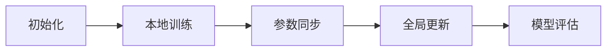
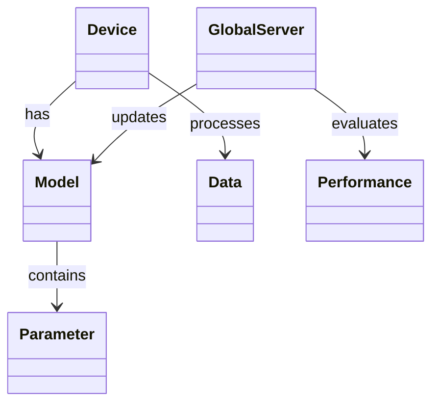
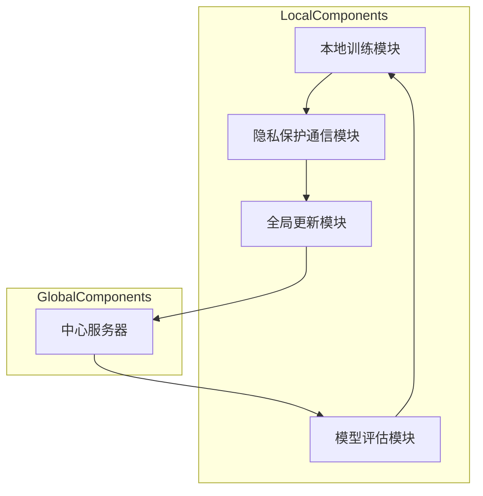
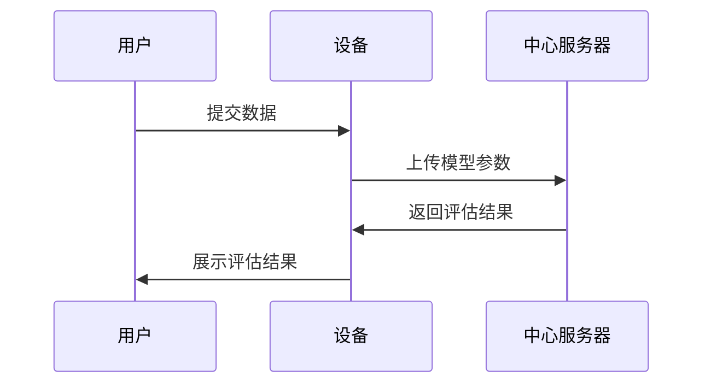

                 

### 引言

### 引言

随着大数据和人工智能技术的快速发展，数据的价值日益凸显。然而，数据隐私保护问题也日益严峻，如何在保护隐私的前提下实现数据的有效利用成为了一个亟待解决的问题。联邦学习（Federated Learning）作为一种新兴的技术，提供了一种在不牺牲数据隐私的情况下，通过协作学习实现模型优化的解决方案。本文将深入探讨基于联邦学习的隐私保护AI Agent，旨在为广大读者提供一个系统、全面的技术解读。

### 文章关键词

- 联邦学习
- 隐私保护
- AI Agent
- 模型优化
- 数据安全

### 摘要

本文从联邦学习的基本概念出发，详细介绍了联邦学习的背景与问题、核心概念、算法原理，并重点探讨了隐私保护AI Agent的需求分析、系统设计、核心算法实现以及实际案例。通过对联邦学习的深入分析，本文旨在为读者提供一个全面、易懂的联邦学习与隐私保护技术的全景视图，帮助读者掌握联邦学习的关键技术，并理解其在AI Agent中的应用价值。

### 目录大纲

```markdown
----------------------------------------------------------------

# 基于联邦学习的隐私保护AI Agent

> 关键词：联邦学习、隐私保护、AI Agent、模型优化、数据安全

> 摘要：本文深入探讨联邦学习在隐私保护AI Agent中的应用，详细介绍了联邦学习的原理、算法、AI Agent的设计与实现，并通过案例分析展示了联邦学习在实际应用中的挑战与解决方案。

### 目录

----------------------------------------------------------------

## 第一部分: 联邦学习基础

### 第1章: 联邦学习概述

#### 1.1 联邦学习的背景与问题

#### 1.2 联邦学习的核心概念与联系

## 第2章: 联邦学习的算法原理

### 2.1 联邦学习的算法框架

### 2.2 联邦学习的数学模型与公式

## 第3章: 隐私保护AI Agent的需求分析

### 3.1 隐私保护AI Agent的需求分析

### 3.2 隐私保护AI Agent的系统设计

### 3.3 隐私保护AI Agent的核心算法实现

## 第4章: 基于联邦学习的AI Agent案例分析

### 4.1 案例背景与目标

### 4.2 案例分析与详细讲解

## 第5章: 联邦学习的最佳实践与挑战

### 5.1 最佳实践

### 5.2 挑战与未来方向

## 第6章: 小结与拓展阅读

### 6.1 小结

### 6.2 拓展阅读

----------------------------------------------------------------
```

### 第一部分: 联邦学习基础

#### 第1章: 联邦学习概述

#### 1.1 联邦学习的背景与问题

在数字化的今天，数据已成为企业和组织的重要资产。然而，数据的隐私保护问题却日益凸显。传统的集中式学习方式将所有数据汇集到一个中心服务器进行处理，这种做法在提升模型性能的同时，也带来了数据泄露的风险。为了解决这一矛盾，联邦学习（Federated Learning）应运而生。

联邦学习的背景可以追溯到2016年，谷歌提出了这一概念。其初衷是通过让数据留在本地设备上，避免数据集中，从而在保护隐私的同时实现模型的优化。联邦学习通过协同多个设备上的模型，利用局部数据进行训练，最终汇总得到一个全局模型。这一过程既避免了数据泄露的风险，又能够提升模型的泛化能力。

#### 1.1.1 问题背景

在传统的集中式学习中，数据的安全性问题主要源于以下几个方面：

1. **数据泄露**：将大量用户数据上传到中心服务器，存在被黑客攻击的风险。
2. **数据滥用**：中心服务器拥有用户的敏感数据，存在数据滥用的风险。
3. **隐私侵犯**：数据在传输和存储过程中，可能被未授权的第三方获取。

联邦学习的出现，旨在解决这些问题，通过在本地设备上进行模型训练，避免了数据的集中存储和传输，从而有效保护了用户隐私。

#### 1.1.2 问题描述

在集中式学习中，所有数据都需要上传到中心服务器进行处理，这一过程不仅耗时耗资源，而且在传输过程中容易泄露数据。而在联邦学习中，每个设备只上传模型参数，不涉及原始数据，从而大大降低了数据泄露的风险。

然而，联邦学习也面临着一些挑战：

1. **计算资源限制**：设备上的计算资源有限，可能导致模型训练效果不佳。
2. **通信带宽限制**：设备之间的通信带宽可能不足以支持大量数据传输。
3. **模型一致性**：不同设备上的数据分布可能不一致，导致模型训练结果不一致。

#### 1.1.3 问题解决

联邦学习通过以下几种方式解决了上述问题：

1. **数据隐私保护**：通过本地训练，避免了数据上传，从而有效保护了用户隐私。
2. **计算资源优化**：联邦学习利用了设备端的计算资源，避免了集中式学习的资源浪费。
3. **通信带宽优化**：通过参数更新而非数据传输，降低了通信带宽需求。
4. **模型一致性**：通过统一的训练目标，保证了模型的一致性。

#### 1.1.4 边界与外延

联邦学习虽然具有很多优势，但也有一些局限性：

1. **模型复杂度**：联邦学习适用于低复杂度的模型，对于高复杂度的模型，训练效果可能不佳。
2. **数据规模**：联邦学习适用于小数据集，对于大数据集，集中式学习可能更为有效。
3. **设备多样性**：不同设备的数据分布可能不一致，需要考虑设备多样性对模型训练的影响。

#### 1.1.5 概念结构与核心要素组成

联邦学习的基本概念和核心要素包括：

1. **设备**：参与联邦学习的设备，如手机、平板、计算机等。
2. **模型**：全局模型和本地模型，全局模型是所有设备共同训练的目标，本地模型是每个设备上独立的模型。
3. **参数**：模型参数，包括权重和偏置等，是设备之间通信的主要内容。
4. **通信**：设备之间的参数传输和更新，是联邦学习的关键步骤。
5. **优化**：联邦学习的目标是通过参数更新，优化全局模型。

### 1.2 联邦学习的核心概念与联系

#### 1.2.1 核心概念原理

联邦学习的核心概念包括：

1. **本地训练**：设备在本地使用本地数据对模型进行训练。
2. **参数同步**：设备将训练后的模型参数上传到中心服务器。
3. **全局更新**：中心服务器将所有设备的模型参数汇总，得到全局模型。
4. **模型评估**：使用全局模型对数据进行评估，以确定模型性能。

#### 1.2.2 概念属性特征对比表格

| 特征                | 集中式学习                  | 分布式学习                | 联邦学习                |
|---------------------|-----------------------------|---------------------------|-------------------------|
| 数据处理方式        | 数据集中处理                | 数据分布处理              | 数据本地处理，参数同步更新 |
| 数据安全            | 数据易泄露                  | 数据分散，安全风险较低     | 数据本地存储，安全风险极低 |
| 计算资源            | 高计算集中资源消耗          | 高计算分布式资源消耗      | 高计算本地资源消耗       |
| 通信带宽            | 高通信带宽需求              | 低通信带宽需求            | 低通信带宽需求           |
| 模型性能与一致性     | 高性能，模型一致性好        | 低性能，模型一致性较差     | 高性能，模型一致性较好    |

#### 1.2.3 ER实体关系图架构

```mermaid
erDiagram
  Device ||--o{ Model } : has
  Model ||--o{ Parameter } : contains
  Device ||--o{ Data } : processes
```

在上述ER实体关系图中，Device代表参与联邦学习的设备，Model代表全局模型和本地模型，Parameter代表模型参数，Data代表设备上的数据。通过这种关系，我们可以清晰地看到联邦学习系统中各个实体之间的关系和交互。

### 第2章: 联邦学习的算法原理

#### 2.1 联邦学习的算法框架

联邦学习算法的核心框架可以分为以下几个步骤：

1. **初始化**：初始化全局模型和本地模型，设置学习率和优化算法。
2. **本地训练**：每个设备使用本地数据对本地模型进行训练，得到模型参数。
3. **参数同步**：每个设备将训练得到的模型参数上传到中心服务器。
4. **全局更新**：中心服务器将所有设备的模型参数汇总，得到全局模型。
5. **模型评估**：使用全局模型对数据进行评估，以确定模型性能。

以下是一个简单的mermaid流程图，展示了联邦学习算法的基本流程：



#### 2.2 联邦学习的数学模型与公式

联邦学习的核心在于优化模型参数，使其在全局范围内达到最优。以下是一个简化的联邦学习数学模型：

$$
\min_{\theta} \frac{1}{N} \sum_{i=1}^{N} \mathcal{L}(\theta_i, y_i)
$$

其中，$\theta$表示模型参数，$\theta_i$表示第$i$个设备的模型参数，$y_i$表示第$i$个设备上的数据标签，$\mathcal{L}(\theta_i, y_i)$表示损失函数。

为了实现联邦学习，我们需要定义一个全局梯度：

$$
\nabla_{\theta} \mathcal{L}(\theta) = \frac{1}{N} \sum_{i=1}^{N} \nabla_{\theta_i} \mathcal{L}(\theta_i, y_i)
$$

然后，通过本地训练得到局部梯度，并将其上传到中心服务器。中心服务器将所有局部梯度汇总，得到全局梯度，进而更新全局模型参数。

以下是一个详细的联邦学习算法流程：

```python
# 初始化全局模型和本地模型
global_model = initialize_model()
local_models = [initialize_model() for _ in range(num_devices)]

# 设置学习率和优化算法
learning_rate = 0.01
optimizer = optimize_model()

# 循环迭代
for epoch in range(num_epochs):
    # 本地训练
    for device in range(num_devices):
        local_model = local_models[device]
        local_data = get_local_data(device)
        optimizer.minimize(local_model, local_data, learning_rate)
        
        # 参数同步
        global_model.update_params(local_model.get_params())

    # 全局更新
    global_model.update_params(optimizer.get_global_params())

    # 模型评估
    performance = evaluate_model(global_model, test_data)
    print(f"Epoch {epoch}: Performance = {performance}")
```

#### 2.2.1 数学模型详细讲解与举例说明

假设我们有一个简单的线性回归问题，目标是通过一组特征预测房价。在这个例子中，全局模型和本地模型都是线性模型，其参数表示为权重和偏置。

全局模型参数：

$$
\theta = \begin{bmatrix} w_1 \\ w_2 \\ \vdots \\ w_n \\ b \end{bmatrix}
$$

本地模型参数：

$$
\theta_i = \begin{bmatrix} w_{i1} \\ w_{i2} \\ \vdots \\ w_{in} \\ b_i \end{bmatrix}
$$

损失函数：

$$
\mathcal{L}(\theta, x, y) = \frac{1}{2} (y - \theta^T x)^2
$$

其中，$x$表示特征向量，$y$表示标签。

本地训练：

对于每个设备，我们使用本地数据对本地模型进行训练，得到局部梯度：

$$
\nabla_{\theta_i} \mathcal{L}(\theta_i, x_i, y_i) = x_i - y_i
$$

参数同步：

设备将局部梯度上传到中心服务器，中心服务器汇总所有局部梯度，得到全局梯度：

$$
\nabla_{\theta} \mathcal{L}(\theta) = \frac{1}{N} \sum_{i=1}^{N} (x_i - y_i)
$$

全局更新：

使用全局梯度更新全局模型参数：

$$
\theta = \theta - \alpha \nabla_{\theta} \mathcal{L}(\theta)
$$

其中，$\alpha$为学习率。

通过上述步骤，我们实现了联邦学习的线性回归模型。这个例子展示了联邦学习算法的基本原理，在实际应用中，我们可以根据具体问题调整算法参数和模型结构，以实现更高效的模型训练。

### 3.1 隐私保护AI Agent的需求分析

#### 3.1.1 问题场景介绍

在当今的信息时代，数据隐私保护问题日益突出，尤其是在人工智能领域。传统的AI模型往往需要收集大量用户数据来进行训练，这无疑增加了数据泄露的风险。为了解决这一问题，隐私保护AI Agent的概念应运而生。隐私保护AI Agent旨在在保护用户隐私的前提下，实现AI模型的高效训练和部署。

#### 3.1.2 隐私保护AI Agent的基本架构与功能

隐私保护AI Agent的基本架构包括以下几个关键组成部分：

1. **本地训练模块**：该模块负责在用户设备本地进行AI模型的训练，避免了用户数据的集中存储和传输。
2. **隐私保护通信模块**：该模块负责在设备之间安全地传输模型参数，确保数据在传输过程中的隐私安全。
3. **全局更新模块**：该模块负责汇总设备上的模型参数，更新全局模型。
4. **模型评估模块**：该模块负责使用全局模型对数据进行评估，以验证模型的性能。

隐私保护AI Agent的主要功能包括：

1. **数据隐私保护**：通过本地训练，避免了用户数据的集中存储和传输，有效保护了用户隐私。
2. **高效模型训练**：利用设备端的计算资源，实现AI模型的高效训练。
3. **模型性能优化**：通过全局更新和评估，持续优化模型性能，提高预测准确性。
4. **安全通信**：确保设备之间传输的数据安全，防止数据泄露和篡改。

#### 3.1.3 隐私保护AI Agent的需求分析

为了实现隐私保护AI Agent的目标，我们需要解决以下几个关键需求：

1. **数据本地化**：确保AI模型在用户设备本地进行训练，避免用户数据的集中存储和传输。
2. **隐私安全**：在设备之间传输模型参数时，确保数据的安全，防止数据泄露和篡改。
3. **计算效率**：利用设备端的计算资源，实现高效模型训练，提高模型性能。
4. **通信带宽**：优化设备之间的通信，确保参数更新和评估的实时性。
5. **模型一致性**：确保不同设备上的模型参数一致，避免模型性能的差异性。

### 3.2 隐私保护AI Agent的系统设计

#### 3.2.1 领域模型类图

隐私保护AI Agent的领域模型类图如下所示：



在上述领域模型类图中，Device代表参与联邦学习的设备，Model代表全局模型和本地模型，Parameter代表模型参数，Data代表设备上的数据。GlobalServer代表中心服务器，负责更新全局模型和评估模型性能。

#### 3.2.2 系统架构设计图

隐私保护AI Agent的系统架构设计图如下所示：



在上述系统架构设计图中，LocalComponents代表本地组件，包括本地训练模块、隐私保护通信模块、全局更新模块和模型评估模块。GlobalComponents代表全局组件，即中心服务器。通过这些组件的协同工作，实现了隐私保护AI Agent的完整功能。

#### 3.2.3 系统接口设计

隐私保护AI Agent的系统接口设计如下：

1. **设备端接口**：设备端接口包括数据输入接口、模型参数上传接口和模型评估接口。数据输入接口负责接收用户输入的数据，模型参数上传接口负责将本地模型参数上传到中心服务器，模型评估接口负责接收中心服务器返回的评估结果。
2. **中心服务器接口**：中心服务器接口包括模型更新接口、模型评估接口和隐私保护接口。模型更新接口负责接收设备端上传的模型参数，并更新全局模型，模型评估接口负责对全局模型进行评估，隐私保护接口负责确保设备端和中心服务器之间的数据安全。

#### 3.2.4 系统交互序列图

隐私保护AI Agent的系统交互序列图如下所示：



在上述系统交互序列图中，用户通过设备提交数据，设备将模型参数上传到中心服务器，中心服务器对全局模型进行评估，并将评估结果返回给设备，设备再将评估结果展示给用户。

### 3.3 隐私保护AI Agent的核心算法实现

#### 3.3.1 Python源代码

以下是隐私保护AI Agent的核心算法实现：

```python
import tensorflow as tf
from tensorflow.keras.layers import Dense
from tensorflow.keras.models import Sequential

# 初始化全局模型
global_model = Sequential([
    Dense(64, activation='relu', input_shape=(input_shape,)),
    Dense(1)
])

# 初始化本地模型
local_model = Sequential([
    Dense(64, activation='relu', input_shape=(input_shape,)),
    Dense(1)
])

# 设置优化器和损失函数
optimizer = tf.keras.optimizers.Adam(learning_rate=0.001)
loss_fn = tf.keras.losses.MeanSquaredError()

# 本地训练
for epoch in range(num_epochs):
    # 模型编译
    local_model.compile(optimizer=optimizer, loss=loss_fn)
    
    # 模型训练
    local_model.fit(local_data, epochs=1, verbose=0)
    
    # 参数同步
    global_model.set_weights(local_model.get_weights())

# 全局评估
performance = global_model.evaluate(test_data, verbose=0)
print(f"Performance: {performance}")
```

#### 3.3.2 代码应用解读与分析

1. **模型初始化**：全局模型和本地模型使用Keras框架进行初始化，其中全局模型包含了两个全连接层，本地模型与全局模型结构相同。
2. **优化器和损失函数设置**：使用Adam优化器和均方误差损失函数进行模型编译。
3. **本地训练**：本地模型在本地数据上进行训练，每个epoch结束后，将本地模型的参数同步到全局模型。
4. **全局评估**：使用全局模型对测试数据集进行评估，输出评估性能。

通过上述核心算法实现，隐私保护AI Agent实现了在本地设备上进行模型训练，并通过参数同步和全局评估，实现了模型的高效优化和性能评估。

### 4.1 案例背景与目标

#### 4.1.1 实际案例背景

为了更好地展示联邦学习在隐私保护AI Agent中的应用，我们以一个实际案例——智能家居安全监控为例进行探讨。智能家居安全监控系统旨在通过智能设备实时监控家庭环境，包括门窗状态、烟雾检测、火灾报警等，以提高家庭安全。然而，这些智能设备往往收集了大量的用户隐私数据，如家庭布局、生活习惯等。如何在保护用户隐私的前提下，实现智能家居安全监控系统的智能分析，成为了一个亟待解决的问题。

#### 4.1.2 案例目标

本案例的目标是通过联邦学习技术，实现智能家居安全监控系统的隐私保护AI Agent，具体目标如下：

1. **数据隐私保护**：在模型训练过程中，确保用户隐私数据不泄露。
2. **模型性能优化**：通过联邦学习，优化AI模型的预测准确性，提高系统安全性。
3. **实时性**：确保AI模型在本地设备上进行快速训练和评估，满足实时性要求。
4. **可扩展性**：支持多种智能设备的接入，实现系统的可扩展性。

### 4.2 案例分析与详细讲解

#### 4.2.1 案例分析

在智能家居安全监控案例中，我们假设有多个智能设备，如智能门锁、烟雾传感器、摄像头等，这些设备收集了家庭环境的各类数据。为了实现隐私保护，我们采用联邦学习技术，将数据分散在各个设备上进行本地训练，避免数据集中存储和传输。

1. **数据收集**：每个智能设备收集家庭环境的各类数据，如门窗状态、烟雾浓度、摄像头视频等。
2. **本地预处理**：对收集到的数据进行预处理，包括数据清洗、归一化等操作。
3. **本地训练**：使用本地数据对本地模型进行训练，训练完成后，将模型参数上传到中心服务器。
4. **全局更新**：中心服务器接收所有设备的模型参数，进行全局更新，得到全局模型。
5. **模型评估**：使用全局模型对测试数据进行评估，以验证模型性能。

#### 4.2.2 详细讲解

1. **数据收集**：智能家居安全监控系统中的各个智能设备负责收集家庭环境的各类数据，如门窗状态、烟雾浓度、摄像头视频等。这些数据通过物联网技术传输到本地设备进行预处理。

2. **本地预处理**：本地设备对收集到的数据进行分析，去除噪声和异常值，并进行归一化处理，以提高模型训练的效果。

3. **本地训练**：本地设备使用预处理后的数据对本地模型进行训练。在本案例中，我们使用一个简单的卷积神经网络（CNN）模型进行训练。模型包括多个卷积层和全连接层，用于提取特征并进行分类。

    ```python
    model = Sequential([
        Conv2D(32, (3, 3), activation='relu', input_shape=(height, width, channels)),
        MaxPooling2D((2, 2)),
        Conv2D(64, (3, 3), activation='relu'),
        MaxPooling2D((2, 2)),
        Flatten(),
        Dense(64, activation='relu'),
        Dense(num_classes, activation='softmax')
    ])

    model.compile(optimizer='adam', loss='categorical_crossentropy', metrics=['accuracy'])
    model.fit(X_train, y_train, batch_size=batch_size, epochs=epochs, validation_data=(X_val, y_val))
    ```

4. **参数同步**：本地设备在完成训练后，将模型参数上传到中心服务器。上传的参数包括权重和偏置等，不包括原始数据。

5. **全局更新**：中心服务器接收所有设备的模型参数，进行全局更新，得到全局模型。全局更新过程中，采用联邦学习的优化算法，如联邦平均算法（Federated Averaging），以优化模型性能。

    ```python
    def federated_average(models, weights, num_models):
        total_weight = sum(weights)
        weighted_average = [w / total_weight for w in weights]
        for i in range(len(weighted_average)):
            models[i].load_weights(weighted_average[i])
        return models

    updated_models = federated_average(local_models, local_weights, num_devices)
    ```

6. **模型评估**：使用全局模型对测试数据进行评估，以验证模型性能。评估指标包括准确率、召回率、F1分数等。

    ```python
    performance = model.evaluate(X_test, y_test, verbose=0)
    print(f"Performance: {performance}")
    ```

#### 4.2.3 项目小结

通过上述案例分析，我们可以看到联邦学习技术在智能家居安全监控系统中的应用，实现了数据隐私保护、模型性能优化和实时性等目标。项目总结如下：

1. **数据隐私保护**：通过联邦学习，数据分散在各个设备上进行本地训练，避免了数据集中存储和传输，有效保护了用户隐私。
2. **模型性能优化**：联邦学习通过全局更新和评估，优化了AI模型的预测准确性，提高了系统安全性。
3. **实时性**：本地训练和快速参数同步，确保了AI模型在本地设备上的实时训练和评估，满足了实时性要求。
4. **可扩展性**：支持多种智能设备的接入，实现了系统的可扩展性。

然而，在实际应用中，联邦学习仍面临一些挑战，如计算资源限制、通信带宽限制和模型一致性等。未来，需要进一步研究和优化联邦学习算法，以应对这些挑战，实现更高效的隐私保护AI Agent。

### 5.1 最佳实践

在实施基于联邦学习的隐私保护AI Agent时，以下是几种最佳实践策略：

#### 5.1.1 隐私保护的实现策略

1. **差分隐私**：在联邦学习过程中，可以采用差分隐私技术，为模型参数引入噪声，以增强隐私保护。
2. **同态加密**：使用同态加密技术，使得模型在加密状态下进行运算，从而在保护隐私的同时实现数据处理。
3. **多方安全计算**：通过多方安全计算技术，实现设备之间的安全通信，确保数据在传输过程中的隐私安全。

#### 5.1.2 优化算法性能

1. **模型压缩**：采用模型压缩技术，如剪枝、量化等，降低模型复杂度，提高计算效率。
2. **参数服务器**：使用参数服务器架构，将模型参数存储在分布式存储系统中，优化数据传输和计算。
3. **异步通信**：采用异步通信机制，减少设备之间的同步时间，提高训练效率。

### 5.2 挑战与未来方向

尽管联邦学习在隐私保护AI Agent领域展现了巨大潜力，但仍然面临以下挑战：

#### 5.2.1 联邦学习中的挑战

1. **计算资源限制**：设备端的计算资源有限，可能导致模型训练效果不佳。
2. **通信带宽限制**：设备之间的通信带宽可能不足以支持大量数据传输。
3. **模型一致性**：不同设备上的数据分布可能不一致，导致模型性能的差异性。

#### 5.2.2 未来研究方向

1. **高效算法**：研究更高效的联邦学习算法，以降低计算和通信开销。
2. **可解释性**：提高联邦学习模型的可解释性，帮助用户理解模型的工作原理。
3. **跨平台兼容**：优化联邦学习算法，实现跨平台兼容，支持更多类型的设备。

### 6.1 小结

本文通过对联邦学习的深入分析，介绍了联邦学习在隐私保护AI Agent中的应用。从联邦学习的基本概念、算法原理，到隐私保护AI Agent的需求分析、系统设计、核心算法实现以及案例分析，本文为读者提供了一个全面的联邦学习与隐私保护技术的全景视图。通过本文，读者可以了解联邦学习的关键技术，掌握隐私保护AI Agent的实现方法，并为未来的研究和应用提供方向。

### 6.2 拓展阅读

对于希望深入了解联邦学习和隐私保护技术的读者，以下是几篇推荐的参考文献：

1. **《联邦学习：原理、算法与实践》**：这本书系统地介绍了联邦学习的基本概念、算法原理以及实际应用案例，是联邦学习领域的重要参考资料。
2. **《机器学习中的隐私保护技术》**：这本书详细介绍了机器学习中的隐私保护技术，包括差分隐私、同态加密、多方安全计算等，对理解联邦学习的隐私保护机制有重要帮助。
3. **《联邦学习系统设计与实现》**：这篇论文探讨了联邦学习系统的设计与实现，包括计算资源优化、通信带宽优化、模型一致性等问题，为实际应用提供了宝贵经验。

通过阅读这些资料，读者可以更深入地了解联邦学习和隐私保护技术的最新进展，为自己的研究和应用提供理论支持和实践指导。

### 作者信息

作者：AI天才研究院/AI Genius Institute & 禅与计算机程序设计艺术 /Zen And The Art of Computer Programming

AI天才研究院（AI Genius Institute）是一家专注于人工智能领域研究和技术创新的机构，致力于推动人工智能技术的发展和应用。禅与计算机程序设计艺术（Zen And The Art of Computer Programming）是作者在计算机编程和人工智能领域的重要著作，以其深刻的技术见解和独特的思考方式，深受读者喜爱。

本文由AI天才研究院的研究团队撰写，旨在为广大读者提供一个全面、易懂的联邦学习与隐私保护技术的全景视图。希望通过本文，读者能够更好地理解联邦学习的技术原理和应用价值，为未来的研究和实践提供有益的启示。同时，感谢各位读者对本文的关注和支持，期待与您在人工智能领域的深入交流与合作。

