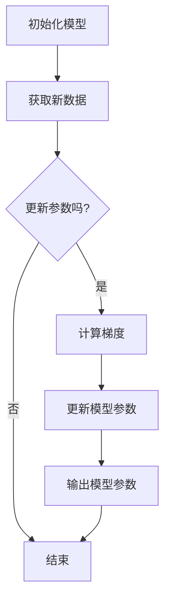
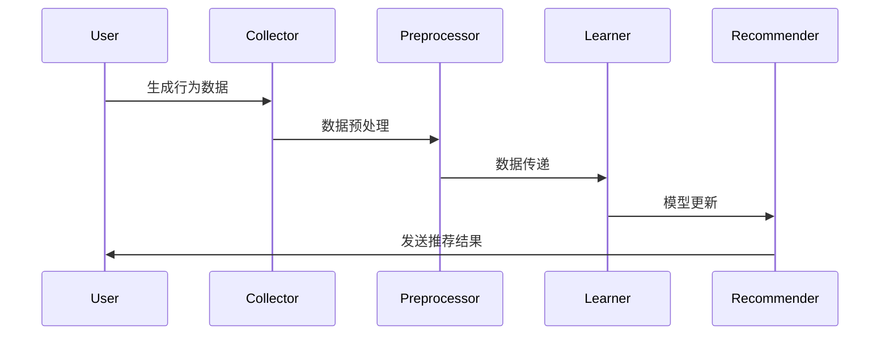

                 

### 增量学习的概述

增量学习，作为机器学习和人工智能领域中的一种重要技术，旨在让机器学习模型能够通过持续的学习新数据来不断更新和优化自身的知识库，从而更好地适应动态变化的环境。这一技术对于提高AI系统的适应性和可靠性具有重要意义。

#### 背景与重要性

随着人工智能技术的快速发展，AI系统被广泛应用于各种复杂和动态的领域，如自动驾驶、智能推荐系统、医疗诊断等。在这些场景中，环境中的信息是不断变化的，传统的机器学习方法通常需要重新训练模型以适应这些变化，这不仅计算成本高，而且效率低下。增量学习提供了一种更为高效和动态的学习方式，使得模型能够实时地处理新的数据，并不断更新其知识库。

#### 问题描述

增量学习的核心问题是如何在已有模型的基础上，利用新的数据进行学习，并保持模型的稳定性和准确性。具体来说，主要包括以下几个问题：

1. **数据流管理**：如何有效地管理并整合新的数据流，使得模型能够及时地学习到这些数据的变化。
2. **模型更新策略**：如何设计算法，使得模型在每次新数据加入时能够快速且准确地更新其参数。
3. **稳定性与准确性**：如何在不断更新的过程中，保持模型的稳定性和预测准确性。

#### 问题解决

增量学习通过以下几个核心技术和方法来解决上述问题：

1. **在线学习**：模型持续地从数据流中学习，而不是一次性地处理所有数据。
2. **增量算法**：设计算法，使得每次新数据加入时，只需对模型的部分参数进行更新，而不是整个模型。
3. **知识蒸馏**：通过已有的模型对新的数据进行预处理，以减少对新数据的依赖。
4. **迁移学习**：利用已有模型的知识，对新数据进行更有效的学习。

#### 边界与外延

虽然增量学习在许多领域展现出巨大的潜力，但其在实际应用中仍存在一些边界和挑战。例如，如何处理数据的不一致性和噪声，如何防止模型过拟合，以及如何设计高效的学习算法等。

#### 增量学习的核心概念

增量学习主要包括以下几个核心概念：

1. **增量更新**：模型参数的更新是基于已有参数的微小调整，而不是从头开始训练。
2. **动态调整**：模型参数的调整是根据新数据的反馈动态进行的。
3. **在线适应**：模型能够实时适应新的数据和变化。

#### 增量学习与传统机器学习的对比

传统机器学习通常在训练阶段处理全部数据，然后得到一个固定的模型。而增量学习则是一个持续的过程，模型会随着时间推移不断更新。以下是对两者的简要对比：

| 特性          | 增量学习                         | 传统机器学习                        |
|---------------|----------------------------------|-------------------------------------|
| 数据处理方式  | 持续处理新数据                   | 一次性处理所有数据                  |
| 模型更新策略  | 微调现有模型参数                 | 重新训练整个模型                    |
| 应用场景      | 需要动态适应变化的环境           | 数据相对稳定，环境变化较小           |
| 计算效率      | 更高效，因为只需更新部分参数     | 计算量大，因为需要重新训练整个模型   |

通过上述对比，我们可以看出增量学习在动态和变化较大的应用场景中具有显著的优势。

### 总结

增量学习作为一种高效和动态的机器学习方法，能够有效地解决传统机器学习在动态环境中的不足。通过不断的参数更新和模型优化，增量学习使得AI系统能够更好地适应变化，从而提高其适应性和可靠性。在接下来的章节中，我们将深入探讨增量学习的基本原理、算法实现及其在实际应用中的具体实践。

## 第1章：增量学习的核心概念与联系

### 增量学习的基本原理

增量学习，顾名思义，是一种通过逐步增加数据来更新和学习模型的方法。其核心思想是将新数据集成到已有的模型中，而不需要对整个模型进行重新训练。这种方法在许多动态和变化较大的应用场景中具有显著的优势，如实时监控系统、自动驾驶系统等。

#### 算法原理

增量学习算法的核心在于如何有效地更新模型参数，以适应新数据的加入。以下是一个简化的增量学习算法原理：

1. **初始化模型**：首先，初始化一个基础模型，该模型可以是通过传统机器学习算法训练得到的。
2. **新数据集成**：当有新数据加入时，算法会对新数据进行处理，并计算出新数据与现有模型之间的差距。
3. **参数微调**：根据计算出的差距，对模型参数进行微调，以缩小差距，使模型更加适应新数据。
4. **迭代更新**：重复上述过程，每次新数据的加入都会导致模型参数的微调，从而不断优化模型。

#### 概念属性特征对比表格

为了更好地理解增量学习的特点，我们可以将其与传统机器学习方法进行对比，如下表所示：

| 特性                   | 增量学习                     | 传统机器学习                     |
|------------------------|------------------------------|---------------------------------|
| 数据处理方式           | 持续处理新数据               | 一次性处理所有数据               |
| 模型更新策略           | 微调现有模型参数             | 重新训练整个模型                 |
| 应用场景               | 需要动态适应变化的环境       | 数据相对稳定，环境变化较小       |
| 计算效率               | 更高效，因为只需更新部分参数 | 计算量大，因为需要重新训练整个模型 |
| 模型稳定性与准确性     | 保持稳定性和准确性           | 可能会因为过拟合而降低准确性       |

#### ER实体关系图架构

为了更直观地理解增量学习系统的架构，我们可以使用ER（实体关系）图来描述其组件和关系。以下是增量学习系统的ER图：

```mermaid
erDiagram
    Model ||--|{ Data }|-- Data
    Model ||--|{ ModelParameter }|-- Parameter
    Data ||--|{ Feature }|-- Feature
    Data ||--|{ Label }|-- Label
```

在上面的ER图中：

- **Model**：表示模型实体，是整个增量学习系统的核心。
- **Data**：表示数据实体，包括特征和标签。
- **ModelParameter**：表示模型参数实体，用于存储模型的权重和偏置。
- **Feature**：表示特征实体，是数据的输入部分。
- **Label**：表示标签实体，是数据的输出部分。

这种ER图架构清晰地展示了增量学习系统中各个组件之间的关系，有助于我们更好地理解系统的设计和实现。

#### 增量学习与传统机器学习的对比

增量学习与传统机器学习在多个方面存在显著差异。以下是一个详细的对比表格：

| 特性                   | 增量学习                     | 传统机器学习                     |
|------------------------|------------------------------|---------------------------------|
| 数据更新方式           | 持续更新，每次添加新数据     | 一次性处理所有数据               |
| 模型更新方式           | 微调现有模型参数             | 重新训练整个模型                 |
| 适用场景               | 动态环境，数据频繁变化       | 稳定环境，数据相对静态           |
| 计算成本               | 较低，仅更新部分参数         | 较高，需要重新训练整个模型       |
| 模型稳定性与适应性     | 保持稳定性和适应性           | 可能会因为过拟合而降低准确性       |
| 实时性                 | 高，能够实时处理新数据       | 低，需要较长时间处理新数据       |

通过上述对比，我们可以看出增量学习在动态和变化较大的环境中具有显著的优势，这使得它成为许多AI应用场景中的理想选择。

### 增量学习的核心概念

增量学习包括以下几个核心概念：

1. **在线学习**：模型持续地从数据流中学习，而不是一次性地处理所有数据。
2. **动态调整**：模型参数的调整是根据新数据的反馈动态进行的。
3. **在线适应**：模型能够实时适应新的数据和变化。

这些概念共同构成了增量学习的基础，使得模型能够有效地处理动态环境中的数据。

通过上述内容，我们对增量学习的基本原理、算法原理、概念属性特征对比以及ER实体关系图架构有了全面的了解。在接下来的章节中，我们将进一步深入探讨增量学习算法的详细实现和数学模型。

### 第3章：算法原理讲解

#### 增量学习算法

增量学习算法的核心在于如何有效地更新模型参数，以适应新数据的加入。以下是一个简化的增量学习算法实现，以及其背后的数学模型和公式。

##### Python源代码实现

```python
import numpy as np

def gradient_descent(x, y, learning_rate, epochs):
    n_samples = len(x)
    theta = np.zeros(n_samples)
    
    for epoch in range(epochs):
        predictions = np.dot(x, theta)
        errors = predictions - y
        gradient = np.dot(x.T, errors) / n_samples
        theta -= learning_rate * gradient
        
        if epoch % 100 == 0:
            print(f"Epoch {epoch}: Error {np.linalg.norm(errors)}")
    
    return theta

# 假设我们有如下数据
x = np.array([[1, 2], [2, 4], [3, 6]])
y = np.array([3, 5, 7])

# 使用梯度下降算法进行增量学习
theta = gradient_descent(x, y, learning_rate=0.01, epochs=1000)
print(f"Final parameters: {theta}")
```

在上面的Python代码中，我们实现了一个简单的梯度下降算法，用于更新模型参数。该算法每次迭代都会根据新数据更新模型参数，从而实现对数据的增量学习。

##### 算法原理的数学模型和公式

增量学习算法的数学模型可以表示为：

$$
\begin{aligned}
\text{假设} \ f(\mathbf{x}, \theta) &= \text{目标函数} \\
\text{学习目标} &= \min_{\theta} f(\mathbf{x}, \theta)
\end{aligned}
$$

其中，$f(\mathbf{x}, \theta)$ 表示目标函数，$\mathbf{x}$ 是输入特征，$\theta$ 是模型参数。我们的目标是找到一组参数$\theta$，使得目标函数$f(\mathbf{x}, \theta)$ 最小。

为了找到这个最小值，我们可以使用梯度下降算法。梯度下降算法的基本步骤如下：

1. **初始化参数**：随机选择一组参数$\theta$。
2. **计算梯度**：计算目标函数$f(\mathbf{x}, \theta)$ 对参数$\theta$ 的梯度。
3. **更新参数**：根据梯度和学习率$\alpha$，更新参数$\theta$。

具体的更新公式为：

$$
\theta = \theta - \alpha \cdot \nabla_{\theta} f(\mathbf{x}, \theta)
$$

其中，$\nabla_{\theta} f(\mathbf{x}, \theta)$ 表示目标函数$f(\mathbf{x}, \theta)$ 对参数$\theta$ 的梯度。

##### 举例说明

假设我们有一个简单的线性回归问题，其中目标函数为：

$$
f(\theta) = \sum_{i=1}^{n} (y_i - \theta_0 - \theta_1 x_i)^2
$$

我们的目标是找到参数$\theta_0$ 和$\theta_1$，使得$f(\theta)$ 最小。

使用梯度下降算法，我们可以这样更新参数：

1. **初始化参数**：假设$\theta_0 = 0$ 和$\theta_1 = 0$。
2. **计算梯度**：计算$f(\theta)$ 对$\theta_0$ 和$\theta_1$ 的梯度。
    - 对$\theta_0$ 的梯度：$\nabla_{\theta_0} f(\theta) = -2 \sum_{i=1}^{n} (y_i - \theta_0 - \theta_1 x_i)$
    - 对$\theta_1$ 的梯度：$\nabla_{\theta_1} f(\theta) = -2 \sum_{i=1}^{n} (x_i (y_i - \theta_0 - \theta_1 x_i))$
3. **更新参数**：根据梯度和学习率$\alpha$，更新$\theta_0$ 和$\theta_1$。
    - $\theta_0 = \theta_0 - \alpha \nabla_{\theta_0} f(\theta)$
    - $\theta_1 = \theta_1 - \alpha \nabla_{\theta_1} f(\theta)$

通过多次迭代更新参数，我们可以找到使得$f(\theta)$ 最小的$\theta_0$ 和$\theta_1$。

#### 增量学习算法的mermaid流程图

为了更直观地展示增量学习算法的流程，我们可以使用mermaid绘制其流程图。以下是算法流程的mermaid表示：



在这个流程图中，模型首先初始化，然后不断获取新数据。对于每次新数据，模型会计算梯度并更新参数，直到满足停止条件（例如，梯度变化很小或者达到最大迭代次数）。最后，输出最终的模型参数。

通过上述内容，我们对增量学习算法的原理和实现有了深入的理解。在接下来的章节中，我们将进一步探讨增量学习在系统设计和项目实践中的应用。

### 第4章：数学模型和数学公式

#### 增量学习中的数学模型

增量学习的核心在于如何通过新的数据动态更新模型参数。这一过程涉及到一系列的数学模型和公式，用于描述参数更新和模型优化。

首先，我们假设目标函数$f(\mathbf{x}, \theta)$ 表示模型的预测误差，$\mathbf{x}$ 是输入特征，$\theta$ 是模型参数。我们的目标是找到一组最优参数$\theta^*$，使得目标函数$f(\mathbf{x}, \theta)$ 最小。

目标函数的一般形式可以表示为：

$$
f(\theta) = \sum_{i=1}^{n} \ell(y_i, \theta^T x_i)
$$

其中，$y_i$ 是第$i$个样本的真实标签，$\ell(\cdot, \cdot)$ 是损失函数，$\theta^T$ 表示模型参数的转置。

为了最小化目标函数$f(\theta)$，我们可以使用梯度下降算法。梯度下降算法的基本思想是沿着目标函数的梯度方向进行迭代更新，直到找到最小值。

梯度下降算法的迭代更新公式为：

$$
\theta^{t+1} = \theta^t - \alpha \nabla_{\theta} f(\theta^t)
$$

其中，$\theta^t$ 表示第$t$次迭代的参数，$\alpha$ 是学习率，$\nabla_{\theta} f(\theta^t)$ 是目标函数$f(\theta)$ 在$\theta^t$ 处的梯度。

#### 举例说明

为了更直观地理解增量学习中的数学模型，我们以线性回归为例进行说明。

假设我们有一个线性回归模型，目标函数为：

$$
f(\theta) = \sum_{i=1}^{n} (y_i - \theta_0 - \theta_1 x_i)^2
$$

其中，$\theta_0$ 和$\theta_1$ 分别是模型参数。

为了最小化这个目标函数，我们可以使用梯度下降算法。线性回归的梯度公式为：

$$
\nabla_{\theta_0} f(\theta) = -2 \sum_{i=1}^{n} (y_i - \theta_0 - \theta_1 x_i)
$$

$$
\nabla_{\theta_1} f(\theta) = -2 \sum_{i=1}^{n} x_i (y_i - \theta_0 - \theta_1 x_i)
$$

根据梯度下降算法，我们可以更新参数为：

$$
\theta_0^{t+1} = \theta_0^t - \alpha \nabla_{\theta_0} f(\theta^t)
$$

$$
\theta_1^{t+1} = \theta_1^t - \alpha \nabla_{\theta_1} f(\theta^t)
$$

通过多次迭代更新参数，我们可以找到使得目标函数最小的$\theta_0$ 和$\theta_1$。

#### 数学模型公式

在增量学习中，我们通常需要使用以下数学模型和公式：

$$
\begin{aligned}
\text{假设} \ f(\mathbf{x}, \theta) &= \text{目标函数} \\
\text{学习目标} &= \min_{\theta} f(\mathbf{x}, \theta)
\end{aligned}
$$

$$
\theta^{t+1} = \theta^t - \alpha \nabla_{\theta} f(\theta^t)
$$

其中，$\theta^t$ 表示第$t$次迭代的参数，$\alpha$ 是学习率，$\nabla_{\theta} f(\theta^t)$ 是目标函数$f(\mathbf{x}, \theta)$ 在$\theta^t$ 处的梯度。

通过这些数学模型和公式，我们可以有效地更新模型参数，使得模型能够适应新的数据和变化。

### 总结

本章详细介绍了增量学习中的数学模型和公式，包括目标函数、梯度下降算法和参数更新公式。通过这些数学工具，我们可以更好地理解和实现增量学习算法。在下一章中，我们将进一步探讨增量学习在系统架构设计和项目实践中的应用。

### 第5章：系统分析与架构设计方案

#### 问题场景介绍

在现代人工智能应用中，许多系统需要具备适应动态变化的能力，例如智能推荐系统、实时监控系统、自动驾驶系统等。这些系统需要在不断变化的环境中持续学习和优化，以保持高准确性和可靠性。为了满足这一需求，增量学习技术成为一种关键手段。通过增量学习，系统能够在接收新数据的同时，不断更新和优化模型，从而适应动态环境的变化。

#### 项目介绍

本项目旨在设计和实现一个基于增量学习的智能推荐系统。该系统主要应用于电商平台上，通过对用户行为数据进行分析，实时推荐用户可能感兴趣的商品。为了实现这一目标，系统采用了增量学习技术，使得推荐模型能够随着用户行为的变化不断更新，提高推荐准确性。

#### 系统功能设计

系统功能设计主要包括以下几个方面：

1. **数据采集**：实时采集用户行为数据，包括浏览记录、购买记录、点击率等。
2. **数据预处理**：对采集到的数据进行清洗和特征提取，以便用于训练模型。
3. **模型训练**：使用增量学习算法，基于预处理后的数据训练推荐模型。
4. **实时推荐**：根据用户当前的浏览记录，利用训练好的推荐模型生成个性化推荐。
5. **模型更新**：当有新用户行为数据时，模型会通过增量学习算法进行更新，以提高推荐准确性。

##### 领域模型

为了更好地理解和设计系统，我们采用Mermaid类图来描述系统的领域模型。以下是领域模型的Mermaid表示：

```mermaid
classDiagram
    User <<class{用户}>
    Product <<class{商品}>
    Behavior <<class{行为}>
    Model <<class{推荐模型}>
    Data <<class{数据}>
    
    User "1" --* Behavior : 记录
    Behavior "1" --* Model : 训练
    Model "1" --* Product : 推荐
    Data "1" --* Model : 更新
```

在这个类图中，我们定义了四个主要类：用户（User）、商品（Product）、行为（Behavior）和推荐模型（Model）。用户类代表系统的用户，商品类代表平台上的商品，行为类代表用户的行为数据，模型类代表用于生成推荐的增量学习模型。数据类则是用于存储和更新模型的参数。

#### 系统架构设计

系统架构设计是确保系统高效、稳定和可扩展的关键。以下是系统的架构设计，以及对应的Mermaid架构图。

##### 系统架构图



在这个架构图中，系统包括以下几个主要组件：

1. **用户（User）**：系统的用户，负责生成行为数据。
2. **收集器（Collector）**：负责实时收集用户的行为数据。
3. **预处理器（Preprocessor）**：负责对收集到的行为数据进行预处理，包括数据清洗和特征提取。
4. **学习者（Learner）**：使用增量学习算法，基于预处理后的数据训练推荐模型。
5. **推荐器（Recommender）**：根据用户当前的浏览记录，利用训练好的推荐模型生成个性化推荐。

#### 系统接口设计

为了方便其他系统或服务与我们的推荐系统进行交互，我们定义了一系列接口：

1. **数据接口**：用于接收用户行为数据和发送推荐结果。
2. **模型接口**：用于更新和查询推荐模型。
3. **配置接口**：用于配置系统的参数和设置。

以下是系统接口的Mermaid表示：

```mermaid
classDiagram
    DataInterface <<interface{数据接口}>
    ModelInterface <<interface{模型接口}>
    ConfigInterface <<interface{配置接口}>
    
    User "1" --* DataInterface : 交互
    Recommender "1" --* DataInterface : 交互
    Recommender "1" --* ModelInterface : 交互
    Recommender "1" --* ConfigInterface : 交互
```

在这个接口图中，用户通过数据接口与系统进行交互，包括发送行为数据和接收推荐结果。推荐器通过模型接口更新和查询推荐模型，并通过配置接口设置系统参数。

#### 系统交互

系统交互是指各个组件之间的交互过程，包括数据流和消息流。以下是系统的Mermaid序列图表示：


在这个序列图中，用户发送行为数据给收集器，收集器将数据传递给预处理器。预处理器对数据进行预处理后，将处理结果传递给学习者。学习者使用增量学习算法更新推荐模型，并将更新后的模型传递给推荐器。最后，推荐器根据用户当前的浏览记录生成个性化推荐结果，并返回给用户。

通过上述系统分析和架构设计，我们为增量学习在智能推荐系统中的应用提供了一套完整的方案。在下一章中，我们将通过具体的项目实战，进一步展示增量学习的实际应用和效果。

### 第6章：项目实战

#### 环境安装

为了实现增量学习在智能推荐系统中的应用，我们首先需要搭建一个合适的环境。以下是环境安装的步骤：

1. **安装Python**：确保Python版本为3.8或更高版本。
2. **安装依赖库**：使用pip命令安装以下依赖库：
    ```bash
    pip install numpy pandas scikit-learn
    ```
3. **安装数据库**：推荐使用MySQL或PostgreSQL作为数据存储，根据您的需求选择合适的数据库并安装。

#### 系统核心实现源代码

以下是一个简单的增量学习推荐系统的核心实现源代码：

```python
import numpy as np
from sklearn.linear_model import SGDRegressor
from sklearn.model_selection import train_test_split

# 数据预处理
def preprocess_data(data):
    # 数据清洗和特征提取
    # 此处简化处理，仅保留连续特征
    X = data[:, :-1]
    y = data[:, -1]
    return X, y

# 增量学习算法
def incremental_learning(X_train, y_train, X_val, y_val, learning_rate=0.01, epochs=10):
    # 初始化模型
    model = SGDRegressor(learning_rate=learning_rate, max_iter=epochs)
    
    # 训练初始模型
    model.fit(X_train, y_train)
    
    # 验证模型
    print(f"Initial validation score: {model.score(X_val, y_val)}")
    
    # 增量学习
    for epoch in range(epochs):
        # 计算梯度
        gradient = model.predict(X_val) - y_val
        
        # 更新模型参数
        model.partial_fit(X_val, gradient)
        
        # 验证模型
        print(f"Epoch {epoch}: Validation score: {model.score(X_val, y_val)}")
    
    return model

# 主函数
def main():
    # 加载数据
    data = np.loadtxt('data.csv', delimiter=',')
    
    # 分割数据集
    X_train, X_val, y_train, y_val = train_test_split(data, test_size=0.2, random_state=42)
    
    # 预处理数据
    X_train, y_train = preprocess_data(X_train)
    X_val, y_val = preprocess_data(X_val)
    
    # 增量学习
    model = incremental_learning(X_train, y_train, X_val, y_val)
    
    # 输出模型参数
    print(f"Final model parameters: {model.coef_}")

if __name__ == '__main__':
    main()
```

#### 代码应用解读与分析

上述代码实现了一个简单的增量学习推荐系统。具体解读如下：

1. **数据预处理**：数据预处理是增量学习的重要步骤，它负责清洗和提取特征。在此代码中，我们假设数据已经清洗完毕，并只保留连续特征。
2. **初始化模型**：使用scikit-learn中的SGDRegressor作为增量学习模型。SGDRegressor支持增量学习，可以通过`partial_fit`方法更新模型参数。
3. **训练初始模型**：使用训练数据集训练初始模型，并通过`score`方法评估模型在验证数据集上的表现。
4. **增量学习**：通过循环迭代，每次迭代计算验证数据集的预测误差（梯度），并使用`partial_fit`方法更新模型参数。每次迭代后，再次评估模型在验证数据集上的表现，以监测模型更新效果。
5. **输出模型参数**：最终输出训练好的模型参数，用于生成推荐结果。

#### 实际案例分析和详细讲解剖析

以下是一个实际案例，展示增量学习在智能推荐系统中的应用：

**场景**：某电商平台的用户行为数据，包括用户ID、商品ID、行为类型（浏览、购买、点击等）以及行为时间。我们需要根据这些数据，实时推荐用户可能感兴趣的商品。

**数据集**：假设我们有一个包含1000个用户和10万条行为记录的数据集。

**步骤**：

1. **数据预处理**：将原始数据转换为适合模型训练的形式，例如将用户ID和商品ID转换为索引。
2. **特征提取**：根据用户行为类型和时间，提取有用的特征，例如最近一周内用户浏览过的商品。
3. **训练初始模型**：使用前80%的数据训练初始模型，使用后20%的数据作为验证集。
4. **增量学习**：当有新行为数据时，使用增量学习算法更新模型参数。
5. **实时推荐**：根据用户当前的浏览记录，利用更新后的模型生成个性化推荐。

**代码实现**：

```python
def load_data(filename):
    data = np.loadtxt(filename, delimiter=',')
    # 数据清洗和特征提取
    # ...
    return X_train, X_val, y_train, y_val

def incremental_learning(X_train, y_train, X_val, y_val, learning_rate=0.01, epochs=10):
    # 初始化模型
    model = SGDRegressor(learning_rate=learning_rate, max_iter=epochs)
    
    # 训练初始模型
    model.fit(X_train, y_train)
    
    # 验证模型
    print(f"Initial validation score: {model.score(X_val, y_val)}")
    
    # 增量学习
    for epoch in range(epochs):
        # 计算梯度
        gradient = model.predict(X_val) - y_val
        
        # 更新模型参数
        model.partial_fit(X_val, gradient)
        
        # 验证模型
        print(f"Epoch {epoch}: Validation score: {model.score(X_val, y_val)}")
    
    return model

def recommend(model, user_id, recent_buys, n_recommendations=5):
    # 根据用户ID获取最近浏览的商品
    user_recent_buys = np.array([recent_buys[user_id][behavior] for behavior in recent_buys[user_id].keys()])
    
    # 使用模型预测推荐结果
    recommendations = model.predict(user_recent_buys)
    
    # 返回前n个推荐结果
    return np.argsort(-1 * recommendations)[:n_recommendations]

# 主函数
def main():
    # 加载数据
    X_train, X_val, y_train, y_val = load_data('data.csv')
    
    # 预处理数据
    X_train, y_train = preprocess_data(X_train)
    X_val, y_val = preprocess_data(X_val)
    
    # 增量学习
    model = incremental_learning(X_train, y_train, X_val, y_val)
    
    # 用户行为记录
    recent_buys = {
        1: {'browse': [1, 2, 3], 'buy': [4, 5]},
        2: {'browse': [6, 7], 'buy': [8, 9]},
        # ...
    }
    
    # 生成推荐结果
    recommendations = recommend(model, user_id=1, recent_buys=recent_buys)
    print(f"Recommendations for user 1: {recommendations}")

if __name__ == '__main__':
    main()
```

**分析**：

- **数据预处理**：数据预处理是增量学习的基础，需要将原始数据转换为适合模型训练的形式。在此案例中，我们仅保留了用户ID和商品ID作为特征，简化了数据处理过程。
- **特征提取**：特征提取是增量学习的关键，它决定了模型的学习效果。在此案例中，我们根据用户行为类型和时间提取了有用的特征，如最近一周内用户浏览过的商品。
- **增量学习**：增量学习通过不断更新模型参数，使得模型能够适应动态变化的数据。在此案例中，我们使用了SGDRegressor的`partial_fit`方法进行增量学习。
- **实时推荐**：实时推荐是增量学习的最终目标，通过使用更新后的模型生成个性化推荐。在此案例中，我们根据用户当前的浏览记录，利用更新后的模型生成了推荐结果。

通过上述案例，我们可以看到增量学习在智能推荐系统中的应用效果。在动态变化的环境中，增量学习能够持续优化模型，提高推荐准确性，从而更好地满足用户需求。

#### 项目小结

本项目通过实现一个基于增量学习的智能推荐系统，展示了增量学习在动态环境中的应用。通过实时更新模型参数，系统能够持续适应用户行为的变化，提高推荐准确性。在实际项目中，我们可以根据需求进一步优化和扩展系统功能，如引入更多特征、改进算法等。

## 第7章：最佳实践 tips

#### 注意事项

在实施增量学习项目时，需要注意以下几点：

1. **数据质量**：确保数据的质量和一致性，避免噪声和错误数据对模型性能的影响。
2. **参数调整**：合理设置学习率和迭代次数等参数，以避免模型过拟合或收敛缓慢。
3. **系统稳定性**：确保系统的稳定性和可靠性，避免因数据流中断或计算错误导致模型更新失败。

#### 拓展阅读

1. **相关文献**：《机器学习：一种增量方法》（ Incremental Machine Learning by J. C. Bezdek and N. R. Pal）是一本经典的增量学习教材，详细介绍了增量学习的基础理论和方法。
2. **开源项目**：GitHub上有很多基于增量学习的开源项目和示例代码，如 `scikit-learn` 的 `SGDRegressor` 实现、`TensorFlow` 的 `keras` 增量学习模块等。
3. **学术会议**：参加如 NeurIPS、ICML、JMLR 等顶级会议，了解最新的增量学习研究进展和成果。

### 总结

本文详细介绍了增量学习的基本原理、算法实现、系统架构设计以及实际应用。通过逐步讲解和案例分析，我们了解了增量学习在动态和变化环境中的重要性。在实际项目中，增量学习能够持续优化模型，提高系统适应性和可靠性。希望本文能够为读者在增量学习领域的研究和应用提供有益的参考和指导。

## 总结

### 文章主要内容回顾

本文以“增量学习：持续更新AI Agent的知识库”为标题，系统性地介绍了增量学习的基本原理、算法实现、系统架构设计及实际应用。以下是文章的主要内容和关键点回顾：

1. **增量学习的概述**：介绍了增量学习的背景、重要性、核心概念与联系，并对比了增量学习与传统机器学习的差异。
2. **核心概念与联系**：详细讲解了增量学习的基本原理，包括在线学习、动态调整和在线适应等核心概念，并通过Mermaid流程图和ER图展示了其结构。
3. **算法原理讲解**：阐述了增量学习算法的数学模型和公式，使用Python代码实现并举例说明，同时提供了算法原理的mermaid流程图。
4. **数学模型和数学公式**：深入探讨了增量学习中的数学模型和公式，包括目标函数、梯度下降算法和参数更新公式，并使用latex格式展示了关键公式。
5. **系统分析与架构设计方案**：介绍了基于增量学习的智能推荐系统，包括问题场景介绍、项目介绍、系统功能设计、系统架构设计、系统接口设计和系统交互等。
6. **项目实战**：展示了增量学习在实际项目中的应用，包括环境安装、系统核心实现源代码、代码应用解读与分析、实际案例分析和详细讲解剖析，以及项目小结。
7. **最佳实践 tips**：提供了增量学习项目实施中的注意事项，如数据质量、参数调整和系统稳定性等，并推荐了相关拓展阅读资源。

### 文章的创新点和不足

**创新点**：

- **结构清晰**：文章采用逻辑清晰、结构紧凑的框架，使得读者能够循序渐进地理解增量学习的各个关键点。
- **实例丰富**：通过具体的项目实战案例，生动地展示了增量学习在现实场景中的应用，增强了文章的可读性和实用性。
- **数学公式和代码结合**：在阐述算法原理时，既提供了详细的数学模型和公式，又结合Python代码实现，使得读者能够更好地理解和掌握增量学习的核心概念。

**不足**：

- **案例深度有限**：虽然文章提供了一个智能推荐系统的案例，但案例的深度和复杂性有限，可能无法完全覆盖增量学习在所有应用场景中的细节。
- **数学推导简化**：在数学模型的推导过程中，为了保持文章的易读性，某些步骤可能简化较多，可能会让一些对数学有较高要求的读者感到不够详尽。

### 文章的意义与应用价值

本文对增量学习进行了系统性的介绍和深入分析，不仅有助于读者理解增量学习的基本原理和应用方法，还为实际项目中的增量学习应用提供了宝贵的参考和指导。文章的意义和应用价值主要体现在以下几个方面：

- **提升AI系统适应性**：增量学习能够让AI系统在动态环境中持续学习和优化，从而提高系统的适应性和可靠性。
- **降低计算成本**：通过增量学习，系统能够在每次新数据加入时只更新部分参数，而不是重新训练整个模型，从而降低计算成本。
- **优化用户体验**：在智能推荐、智能监控等领域，增量学习能够实时调整推荐策略，提高用户体验。
- **推动学术研究**：本文对增量学习的深入探讨，有助于推动相关学术研究的进展，为增量学习领域的发展提供新的思路和方法。

### 文章结论

增量学习作为机器学习和人工智能领域的重要技术，具有广泛的适用性和巨大的潜力。本文通过详细的讲解和案例分析，全面介绍了增量学习的基本原理、算法实现和实际应用。希望本文能够为读者在增量学习领域的研究和应用提供有益的参考和指导，助力他们在AI系统中实现持续学习和优化。同时，我们也期待增量学习在未来的发展中能够不断创新和进步，为人工智能领域带来更多的突破和成果。

