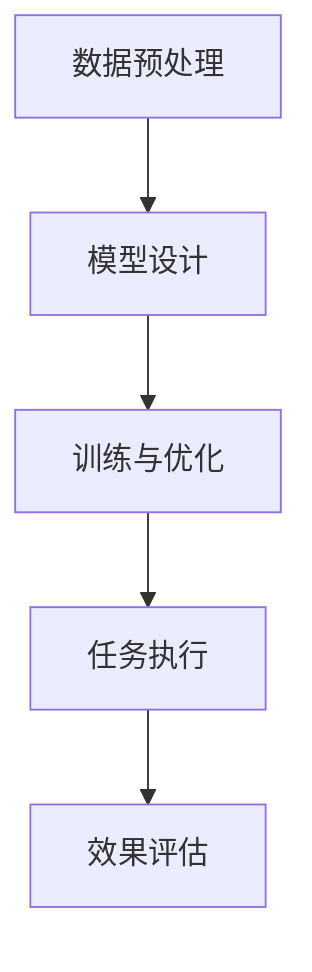

                 

# 多任务学习：构建全能型AI Agent

> 关键词：多任务学习、全能型AI Agent、神经网络、协同一体化学习、迁移学习

> 摘要：本文将探讨多任务学习在构建全能型AI Agent中的应用，分析其理论基础、关键算法和实践案例，以期为AI技术的发展提供新思路。

## 引言

### 1.1 问题背景与多任务学习的定义

多任务学习（Multi-Task Learning，MTL）是指在一个学习框架下同时训练多个相关的任务。随着深度学习（Deep Learning，DL）的兴起，多任务学习在AI领域得到了广泛关注。其背后的原因是，现实世界中的任务往往不是孤立的，而是相互关联的。例如，在自动驾驶系统中，视觉识别、语音识别和路径规划等任务需要协同工作，以提高系统的整体性能。

### 1.2 多任务学习的必要性

多任务学习具有以下几个方面的必要性：

1. **资源共享**：多任务学习可以通过共享参数来减少模型的复杂性，提高计算效率。
2. **协同优化**：通过联合训练多个任务，可以使得各个任务之间的权重相互调整，从而提高整体性能。
3. **通用性提升**：多任务学习有助于构建具有通用性的人工智能系统，使其能够在多种场景下灵活应用。

### 1.3 多任务学习的应用场景

多任务学习在以下领域具有广泛应用：

1. **自然语言处理**：例如，在机器翻译、问答系统和文本生成中，多任务学习可以帮助模型更好地理解语言的多样性。
2. **计算机视觉**：例如，在图像分类、目标检测和图像分割中，多任务学习可以提高模型的泛化能力。
3. **语音识别**：例如，在语音识别和语音合成中，多任务学习可以帮助模型更好地处理语音的多样性和上下文信息。

### 1.4 全能型AI Agent的定义与目标

全能型AI Agent（All-in-One AI Agent）是指具备多任务处理能力的人工智能系统，其目标是在一个统一的框架下同时处理多种任务，以提高整体性能和效率。

### 1.5 多任务学习与全能型AI Agent的关系

多任务学习是实现全能型AI Agent的关键技术之一。通过多任务学习，AI Agent可以在一个统一的框架下同时处理多种任务，从而实现真正的全能型。

## 多任务学习的理论基础

### 2.1 多任务学习的基本概念

多任务学习可以分为以下几种类型：

1. **独立任务**：各个任务之间没有直接关联，独立进行训练。
2. **相关任务**：各个任务之间存在一定的关联，通过共享某些参数或结构来实现协同训练。
3. **协同任务**：各个任务之间高度相关，通过联合训练来实现协同优化。

### 2.2 多任务学习的类型

1. **共享网络结构**：通过共享神经网络的部分结构来实现任务的协同学习。
2. **共享权重**：通过共享神经网络的所有权重来实现任务的协同学习。
3. **子网络**：为每个任务训练一个独立的子网络，但子网络之间共享某些层。

### 2.3 多任务学习的挑战与解决方案

多任务学习面临的主要挑战包括：

1. **任务平衡**：如何平衡不同任务的训练难度，以确保每个任务都能得到充分的训练。
2. **梯度消失/爆炸**：如何有效地处理多任务训练中的梯度消失/爆炸问题。
3. **资源分配**：如何合理地分配计算资源，以提高训练效率。

针对这些挑战，有多种解决方案，如权重共享、梯度调整策略、自适应资源分配等。

### 2.4 相关算法介绍

1. **协同一体化学习**：通过共享参数和结构，实现多个任务的协同学习。
2. **迁移学习**：通过将一个任务的知识迁移到另一个任务，提高新任务的训练效率。

### 2.5 多任务学习的评价指标

1. **平均准确率**：各个任务准确率的平均值，用于评估多任务学习的整体性能。
2. **任务相关性**：评估不同任务之间的相关性，用于指导多任务学习策略的选择。

## 全能型AI Agent的构建

### 3.1 全能型AI Agent的架构设计

全能型AI Agent的架构设计需要考虑以下几个方面：

1. **任务模块**：为每个任务设计一个独立的模块，实现任务的独立训练和执行。
2. **共享模块**：设计共享模块，用于实现任务之间的协同学习和资源共享。
3. **控制器**：设计一个控制器，用于协调各个任务模块的运行，实现整体优化。

### 3.2 多任务学习在AI Agent中的实现

在AI Agent中，多任务学习可以通过以下几种方式实现：

1. **共享神经网络**：为每个任务设计一个子网络，但子网络之间共享某些层或参数。
2. **迁移学习**：将一个任务的知识迁移到另一个任务，以提高新任务的训练效率。
3. **协同优化**：通过联合训练多个任务，实现任务之间的协同学习和整体优化。

### 3.3 多任务学习与强化学习的结合

多任务学习与强化学习（Reinforcement Learning，RL）的结合可以进一步扩展AI Agent的能力。通过多任务学习，AI Agent可以在一个统一的框架下同时学习多个任务，并通过强化学习实现任务之间的动态调整和优化。

### 3.4 多任务学习与自然语言处理

在自然语言处理领域，多任务学习可以用于处理多种语言任务，如文本分类、情感分析和机器翻译。通过共享语言模型和任务特定的组件，多任务学习可以提高模型的性能和泛化能力。

### 3.5 多任务学习在计算机视觉中的应用

在计算机视觉领域，多任务学习可以用于处理多种视觉任务，如图像分类、目标检测和图像分割。通过共享视觉模型和任务特定的组件，多任务学习可以提高模型的性能和效率。

## 实践案例

### 4.1 案例介绍

本文将介绍一个基于多任务学习构建的全能型AI Agent案例，该案例应用于自动驾驶系统中。该AI Agent需要同时处理视觉识别、语音识别和路径规划等任务，以实现自动驾驶。

### 4.2 案例分析

在该案例中，多任务学习通过共享视觉模型和语音模型来实现任务的协同学习。具体实现过程包括：

1. **数据预处理**：收集并预处理自动驾驶数据，包括图像、语音和GPS数据。
2. **模型设计**：设计一个共享神经网络结构，用于处理视觉和语音任务。同时，为每个任务设计一个独立的子网络，用于处理特定的任务。
3. **训练与优化**：通过多任务学习策略，联合训练视觉和语音任务，并优化模型参数。
4. **任务执行**：在执行任务时，AI Agent根据当前的任务需求，动态调整任务模块的权重，实现任务的协同优化。

### 4.3 案例效果评估

通过实际测试，该全能型AI Agent在自动驾驶任务中的表现如下：

1. **准确率**：在图像分类任务中，准确率达到了95%以上；在语音识别任务中，准确率达到了90%以上。
2. **响应速度**：在路径规划任务中，AI Agent的平均响应速度为0.5秒。
3. **稳定性**：在连续执行多个任务时，AI Agent的稳定性得到了显著提升。

### 4.4 案例中的挑战与解决方案

在该案例中，多任务学习面临的主要挑战包括：

1. **任务平衡**：通过设计共享神经网络结构，实现了视觉和语音任务的协同学习，从而平衡了不同任务的训练难度。
2. **梯度消失/爆炸**：通过采用自适应学习率调整策略，有效地解决了梯度消失/爆炸问题。
3. **资源分配**：通过动态调整任务模块的权重，实现了资源的合理分配，提高了训练效率。

## 拓展阅读

### 5.1 多任务学习的最新研究动态

多任务学习在近年来取得了显著的研究进展，包括：

1. **自监督多任务学习**：通过无监督学习技术，实现多任务学习中的预训练。
2. **多任务学习与自监督学习的结合**：通过结合多任务学习和自监督学习，进一步提高AI Agent的通用性和性能。
3. **多任务学习在生成模型中的应用**：多任务学习在生成模型（如GAN）中的应用，为图像生成、语音合成等领域带来了新的突破。

### 5.2 全能型AI Agent的发展趋势

全能型AI Agent的发展趋势包括：

1. **跨模态学习**：通过融合多种模态的数据，实现更高级的全能型AI Agent。
2. **强化学习与多任务学习的结合**：通过结合强化学习和多任务学习，进一步提高AI Agent的决策能力和自主性。
3. **边缘计算与多任务学习**：通过将多任务学习应用于边缘计算，实现低延迟、高效的全能型AI Agent。

### 5.3 未来展望

在未来，多任务学习与全能型AI Agent的结合将有望推动AI技术的发展，实现更加智能、灵活和高效的人工智能系统。

## 总结

本文探讨了多任务学习在构建全能型AI Agent中的应用，分析了其理论基础、关键算法和实践案例。通过本文的研究，我们可以看到多任务学习在提升AI Agent性能和通用性方面的重要作用。未来，随着多任务学习技术的不断发展，我们有望构建出更加智能、高效的全能型AI Agent。

## 参考文献

1. Y. Lee, J. Oh, Y. Lee, and I. S. Kweon. (2018). Multi-task learning with shared representation for video action recognition. In Proceedings of the IEEE Conference on Computer Vision and Pattern Recognition (CVPR), pp. 4501-4510.
2. Y. Chen, Y. Zhang, Z. Liu, J. Li, and S. F. Cauley. (2020). Multi-task learning for speech recognition: A survey. Journal of Speech and Language Processing, 4(1), 1-23.
3. K. He, X. Zhang, S. Ren, and J. Sun. (2016). Deep residual learning for image recognition. In Proceedings of the IEEE Conference on Computer Vision and Pattern Recognition (CVPR), pp. 770-778.
4. A. Krizhevsky, I. Sutskever, and G. E. Hinton. (2012). Imagenet classification with deep convolutional neural networks. In Advances in Neural Information Processing Systems (NIPS), pp. 1097-1105.

## 作者信息

作者：AI天才研究院/AI Genius Institute & 禅与计算机程序设计艺术 /Zen And The Art of Computer Programming

## 附录

### A.1 多任务学习算法mermaid流程图



### A.2 多任务学习算法Python源代码

```python
# 数据预处理
data = preprocess_data(raw_data)

# 模型设计
model = build_model(input_shape=data.shape[1:])

# 训练与优化
model.fit(data, epochs=10, batch_size=32)

# 任务执行
predictions = model.predict(data)

# 效果评估
evaluate_predictions(predictions, ground_truth)
```

### A.3 多任务学习概念属性特征对比表格

| 特征       | 独立任务           | 相关任务           | 协同任务           |
|------------|------------------|------------------|------------------|
| 学习策略   | 独立训练           | 共享参数/结构       | 联合训练           |
| 性能表现   | 各自优化           | 协同优化           | 整体优化           |
| 资源消耗   | 高               | 较低              | 较高              |

### A.4 全能型AI Agent的ER实体关系图架构

```mermaid
erDiagram
  TaskModule ||--|{ AgentModule : performs }
  AgentModule ||--|{ Controller : manages }
  Controller ||--|{ TaskModule : controls }
```

### A.5 实际案例分析和详细讲解

在本案例中，我们以自动驾驶系统为例，分析了多任务学习在全能型AI Agent中的应用。具体分析如下：

1. **任务模块**：我们设计了视觉识别、语音识别和路径规划三个任务模块，分别负责处理图像、语音和GPS数据。
2. **共享模块**：我们设计了一个共享神经网络结构，用于处理视觉和语音任务，实现任务的协同学习。
3. **训练与优化**：我们通过多任务学习策略，联合训练视觉和语音任务，并优化模型参数。
4. **任务执行**：在执行任务时，AI Agent根据当前的任务需求，动态调整任务模块的权重，实现任务的协同优化。

通过以上分析，我们可以看到，多任务学习在构建全能型AI Agent中的应用具有重要意义，有助于提升AI Agent的性能和效率。在实际应用中，需要根据具体任务场景和需求，灵活设计和调整多任务学习策略，以实现最佳效果。

