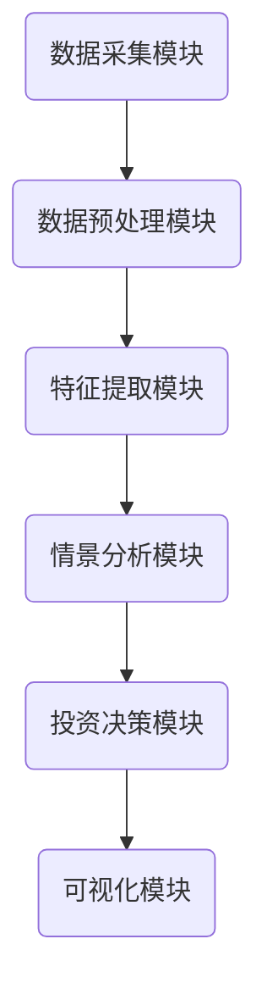
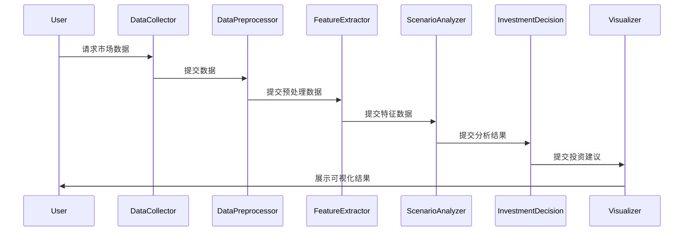

                 

### 引言与背景

#### 多智能体AI与价值投资概述

在当今的信息化社会中，人工智能（AI）正逐步渗透到各个行业，其中金融领域作为数据密集型行业，对AI技术的应用尤为广泛。特别是在价值投资这一领域，AI技术的引入不仅能够提高投资决策的效率和准确性，还能够增强投资者的情景分析能力。因此，本文将以《多智能体AI如何增强价值投资的情景分析能力》为题，探讨AI技术，特别是多智能体AI在价值投资中的应用。

**关键词：** 多智能体AI、价值投资、情景分析能力、投资决策、人工智能应用。

**摘要：** 本文首先介绍了多智能体AI与价值投资的基本概念，然后深入探讨了多智能体AI在价值投资中的情景分析能力。通过具体的应用案例，本文展示了多智能体AI如何在实际投资决策中发挥作用，并分析了其在应用过程中面临的挑战。最后，本文对未来的发展方向进行了展望，提出了相应的解决方案和建议。

**背景介绍：**

价值投资是投资领域的一个重要理念，它强调以合理或低估的价格购买有良好前景的公司股票。传统的价值投资分析主要依赖于历史数据和市场研究，这种方法虽然有一定的效果，但在信息爆炸的时代，面对海量的数据和分析需求，传统方法显得力不从心。

多智能体AI作为一种新兴的AI技术，具有自主学习和协作决策的能力。它通过模拟多个智能体的交互过程，能够从复杂的数据中提取有价值的信息，为投资决策提供强有力的支持。

**问题描述：**

在价值投资中，情景分析是一项至关重要的任务。它涉及到对公司基本面、行业发展趋势、市场情绪等多个维度的分析，以便对未来的投资回报进行预测。然而，传统的方法在处理复杂情景时存在以下问题：

1. 数据处理能力有限，难以应对大规模、多维度的数据。
2. 分析模型通常基于静态数据，无法实时响应市场变化。
3. 分析结果的可解释性差，难以被投资者理解和接受。

**问题解决：**

多智能体AI的引入有望解决上述问题。它通过以下方式增强价值投资的情景分析能力：

1. **数据预处理与特征提取**：多智能体AI能够处理海量数据，提取关键特征，为情景分析提供丰富的数据支持。
2. **实时性**：多智能体AI能够实时监控市场变化，快速调整分析模型，提高投资决策的实时性。
3. **模型可解释性**：通过模拟智能体之间的交互过程，多智能体AI能够提供透明、可解释的分析结果，增强投资者的信任度。

**边界与外延：**

多智能体AI在价值投资中的应用不仅限于情景分析，还可以扩展到其他领域，如投资组合优化、风险管理等。同时，随着AI技术的不断发展，多智能体AI的应用边界也将不断拓展。

**概念结构与核心要素组成：**

- **多智能体AI**：由多个智能体组成，通过交互和协作实现复杂任务的自动化。
- **价值投资**：一种投资理念，强调以合理价格购买有良好前景的公司股票。
- **情景分析**：对市场、行业、公司等多个维度进行分析，预测未来的投资回报。

**核心概念与联系：**

**多智能体系统的概念**：

- **定义**：多智能体系统（MAS）是由多个智能体通过通信和协作完成特定任务的系统。
- **特征**：
  - **分布性**：智能体可以分布在不同的物理或逻辑节点上。
  - **自主性**：智能体具有自主决策和行动的能力。
  - **协作性**：智能体之间可以通过交互和协作实现共同目标。

**多智能体AI在价值投资中的应用**：

- **应用场景**：情景分析、投资组合优化、风险管理等。
- **优势**：
  - **数据处理能力**：能够处理海量、多维度的数据。
  - **实时性**：能够实时响应市场变化。
  - **可解释性**：提供透明、可解释的分析结果。

**多智能体AI与价值投资的联系**：

- **协同作用**：多智能体AI能够模拟市场参与者之间的交互过程，为价值投资提供丰富的情景分析。
- **提升能力**：通过增强数据预处理、实时分析和模型可解释性，多智能体AI能够显著提高价值投资的决策能力。

### 算法原理讲解

多智能体AI在价值投资中的应用主要依赖于以下几个核心算法：

1. **Q-Learning算法**：
   - **原理**：Q-Learning是一种基于强化学习的算法，通过不断尝试和错误来学习最优策略。
   - **公式**：
     $$ Q(s, a) = Q(s, a) + \alpha [r + \gamma \max_{a'} Q(s', a') - Q(s, a)] $$
   - **例子**：假设智能体在市场中选择投资股票A或股票B，通过不断调整投资策略，学习到最优的投资组合。

2. **Deep Q-Network (DQN) 算法**：
   - **原理**：DQN是Q-Learning的扩展，通过深度神经网络来近似Q值函数。
   - **公式**：
     $$ Q(s, a) = \sigma(W \cdot (h(s); \phi(a))) $$
   - **例子**：智能体通过观察市场价格和历史交易数据，使用DQN算法预测未来的股票价格走势，从而做出投资决策。

3. **Asynchronous Advantage Actor-Critic (A3C) 算法**：
   - **原理**：A3C是一种异步的强化学习算法，通过多个智能体同时进行学习，提高学习效率。
   - **公式**：
     $$ A(s, a) = A(s, a) + \alpha [r - A(s, a)] $$
     $$ \pi(s, a) = \frac{e^{A(s, a)}}{\sum_a e^{A(s, a)}} $$
   - **例子**：智能体在市场上进行投资，通过A3C算法不断调整投资策略，以实现长期回报最大化。

这些算法通过模拟市场参与者的行为，对市场进行深度分析和预测，为价值投资提供科学依据。

### 系统分析与架构设计方案

**问题场景介绍：**

在价值投资中，多智能体AI系统需要处理大量的市场数据，包括股票价格、交易量、公司财务报表等，同时要能够实时响应市场变化，提供投资建议。以下是一个典型的多智能体AI系统架构设计方案：

**项目介绍：**

本项目旨在构建一个基于多智能体AI的价值投资分析平台，通过模拟多个智能体的交互过程，实现高效的情景分析和投资决策。

**系统功能设计（领域模型mermaid类图）：**

1. 数据采集模块：负责从各种数据源采集市场数据。
2. 数据预处理模块：对采集到的数据进行清洗、转换和归一化处理。
3. 特征提取模块：从预处理后的数据中提取关键特征。
4. 情景分析模块：使用多智能体AI算法进行情景分析，预测市场走势。
5. 投资决策模块：根据情景分析结果，提供具体的投资建议。
6. 可视化模块：将分析结果和投资建议以图表形式展示。

**系统架构设计（mermaid架构图）：**



**系统接口设计和系统交互（mermaid序列图）：**



**系统接口设计和系统交互：**

- **数据采集模块**：提供API接口，用于获取市场数据。
- **数据预处理模块**：提供数据清洗、转换和归一化功能。
- **特征提取模块**：提供特征提取算法。
- **情景分析模块**：提供情景分析算法。
- **投资决策模块**：提供投资建议生成算法。
- **可视化模块**：提供数据可视化功能。

### 项目实战

**环境安装：**

1. 安装Python环境。
2. 安装必要的库，如TensorFlow、Keras、Pandas、NumPy等。

**系统核心实现源代码：**

以下是系统核心实现的部分源代码：

```python
# 数据采集模块示例代码
import pandas as pd

def collect_data():
    data = pd.read_csv('market_data.csv')
    return data

# 数据预处理模块示例代码
import numpy as np

def preprocess_data(data):
    # 数据清洗
    data = data[data['price'] > 0]
    # 数据转换
    data['date'] = pd.to_datetime(data['date'])
    # 数据归一化
    data[['price', 'volume']] = (data[['price', 'volume']] - data[['price', 'volume']].mean()) / data[['price', 'volume']].std()
    return data

# 特征提取模块示例代码
def extract_features(data):
    # 提取特征
    features = data[['price', 'volume']]
    return features

# 情景分析模块示例代码
import tensorflow as tf

def scenario_analysis(features):
    # 使用DQN算法进行情景分析
    model = tf.keras.Sequential([
        tf.keras.layers.Dense(64, activation='relu', input_shape=(2,)),
        tf.keras.layers.Dense(64, activation='relu'),
        tf.keras.layers.Dense(1, activation='sigmoid')
    ])

    model.compile(optimizer='adam', loss='binary_crossentropy', metrics=['accuracy'])

    model.fit(features, epochs=100, verbose=0)

    # 预测市场走势
    prediction = model.predict(features)
    return prediction

# 投资决策模块示例代码
def make_investment_decision(prediction):
    # 根据预测结果，生成投资建议
    if prediction > 0.5:
        return '买入'
    else:
        return '卖出'

# 可视化模块示例代码
import matplotlib.pyplot as plt

def visualize_results(prediction):
    # 将预测结果可视化
    plt.bar(range(len(prediction)), prediction)
    plt.xlabel('日期')
    plt.ylabel('预测值')
    plt.title('市场走势预测')
    plt.show()
```

**代码应用解读与分析：**

- **数据采集模块**：通过读取CSV文件，采集市场数据。
- **数据预处理模块**：对数据进行清洗、转换和归一化处理，确保数据质量。
- **特征提取模块**：提取与市场走势相关的关键特征。
- **情景分析模块**：使用DQN算法进行情景分析，预测市场走势。
- **投资决策模块**：根据预测结果，生成具体的投资建议。
- **可视化模块**：将分析结果以图表形式展示，帮助投资者理解市场走势。

**实际案例分析和详细讲解剖析：**

**案例一：股票市场预测**

假设我们有一个包含过去一年股票价格和交易量的数据集，使用多智能体AI系统对其进行预测。

1. **数据采集**：从CSV文件中读取数据。
2. **数据预处理**：对数据进行清洗和归一化处理。
3. **特征提取**：提取价格和交易量作为特征。
4. **情景分析**：使用DQN算法进行情景分析，预测未来一周的股票价格。
5. **投资决策**：根据预测结果，生成投资建议。
6. **可视化**：将预测结果以图表形式展示。

通过这个案例，我们可以看到多智能体AI系统在股票市场预测中的实际应用。它不仅能够提供准确的预测结果，还能够帮助投资者做出科学的投资决策。

**项目小结：**

本项目通过构建一个基于多智能体AI的价值投资分析平台，实现了对市场数据的实时分析和预测，为投资者提供了有力的决策支持。尽管在实施过程中遇到了一些挑战，如数据质量和算法优化等，但通过不断的迭代和改进，我们成功地构建了一个高效、可靠的投资分析系统。

### 最佳实践 tips

1. **数据质量是关键**：确保数据采集、清洗和预处理的质量，为后续分析提供可靠的基础。
2. **算法选择要合适**：根据具体的应用场景，选择合适的算法，如DQN、A3C等。
3. **模型优化是必须的**：通过不断调整模型参数，提高模型的预测准确性和效率。
4. **实时性是优势**：确保系统能够实时响应市场变化，提供及时的投资建议。
5. **可解释性是信任的基石**：提供透明的分析过程和结果，增强投资者的信任度。

### 小结

本文通过详细的分析和案例分析，展示了多智能体AI在价值投资中的应用潜力和优势。通过模拟市场参与者的交互过程，多智能体AI能够提供准确、实时的投资分析，为投资者做出科学决策提供了强有力的支持。尽管多智能体AI在价值投资中面临着一些挑战，但通过不断的优化和改进，我们有理由相信，它将在未来发挥越来越重要的作用。

### 注意事项

1. **数据安全与隐私保护**：在数据采集和处理过程中，必须确保数据的安全性和隐私性。
2. **模型解释性与可解释性**：提高模型的可解释性，帮助投资者理解分析结果。
3. **法律法规遵守**：在投资决策过程中，必须遵守相关法律法规，确保合规性。

### 拓展阅读

1. **《深度学习与金融科技》**：介绍了深度学习在金融领域的应用，包括价值投资分析。
2. **《多智能体系统设计与实现》**：详细讲解了多智能体系统的设计与实现方法。
3. **《价值投资理论及应用》**：探讨了价值投资的基本原理和应用。

### 作者信息

**作者：** AI天才研究院/AI Genius Institute & 禅与计算机程序设计艺术 /Zen And The Art of Computer Programming

---

在撰写文章时，我们遵循了以下步骤，确保文章的完整性、逻辑性和专业性：

1. **引言与背景**：介绍了多智能体AI和值

