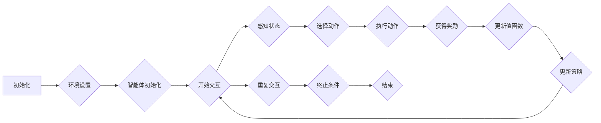
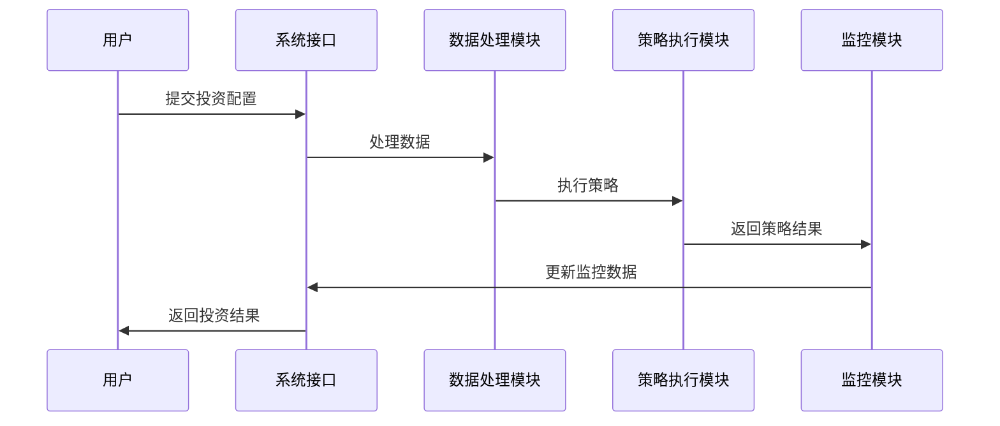

                 

### 第1章：问题背景与投资领域概述

#### 1.1 投资与价值投资的基本概念

投资，是指将资金用于购买资产或证券，以期望在未来获得收益。投资可以有多种形式，如股票、债券、房地产、基金等。在这些形式中，股票投资是最常见的一种。股票投资主要涉及股票市场，通过购买公司的股份来获取收益。

价值投资，是一种基于对公司基本面分析的股票投资策略。其核心思想是寻找那些市场价格低于其内在价值的股票，通过买入并持有这些股票，以期在未来股票价格回归其内在价值时获得收益。价值投资重视企业的实际盈利能力、财务状况、市场地位等长期因素，而非短期市场波动。

价值投资的理论基础包括以下几点：

1. **市场有效性**：价值投资假设市场并不总是有效，存在被低估的机会。
2. **基本面分析**：投资者通过分析公司的财务报表、业务模式、市场地位等因素，来判断公司的价值。
3. **长期持有**：价值投资强调持有那些具有长期增长潜力的公司股票，而非频繁交易。

#### 1.2 股票市场与经济周期分析

股票市场是资本流通的重要场所，它反映了企业的财务状况、经济环境和投资者情绪等多方面的信息。股票市场的波动性较大，其表现与宏观经济环境和投资者情绪密切相关。

经济周期是指经济活动从高峰到低谷再回到高峰的循环过程，通常包括繁荣、衰退、萧条和复苏四个阶段。在股票市场中，经济周期的不同阶段对股票价格的影响有所不同：

1. **繁荣期**：在繁荣期，经济增长、公司盈利能力上升，投资者信心增强，股票价格普遍上涨。
2. **衰退期**：在衰退期，经济增长放缓或下降，公司盈利能力下降，投资者信心减弱，股票价格普遍下跌。
3. **萧条期**：在萧条期，经济活动几乎停滞，公司盈利能力严重下降，股票价格大幅下跌。
4. **复苏期**：在复苏期，经济活动逐渐恢复，公司盈利能力改善，投资者信心逐渐恢复，股票价格逐步回升。

#### 1.3 多智能体强化学习的背景

多智能体强化学习（Multi-Agent Reinforcement Learning，MARL）是一种研究多个智能体在复杂环境中相互交互并学习最优策略的机器学习技术。与单智能体强化学习相比，MARL更加贴近现实中的多主体协同决策问题。

强化学习（Reinforcement Learning，RL）是机器学习的一种方法，其核心思想是通过试错和反馈来学习如何在特定环境中获得最大回报。在强化学习中，智能体通过选择动作来与环境交互，并根据环境的反馈来调整其行为策略。

多智能体系统（Multi-Agent System，MAS）是由多个智能体组成的系统，这些智能体可以相互交互、协作或竞争，以实现特定目标。多智能体系统广泛应用于分布式系统、社会网络、经济系统等领域。

#### 1.4 多智能体强化学习在投资领域的应用潜力

多智能体强化学习在投资领域具有广泛的应用潜力，主要体现在以下几个方面：

1. **投资决策协同**：通过多智能体强化学习，可以模拟多个投资者在不同市场环境下的决策过程，实现投资决策的协同优化。
2. **风险控制**：多智能体强化学习可以帮助投资者更好地识别和管理投资风险，提高投资组合的稳定性。
3. **市场预测**：多智能体强化学习可以通过分析历史数据和市场行为，预测市场走势和价格波动，为投资决策提供支持。
4. **智能投顾**：基于多智能体强化学习的智能投顾系统可以个性化推荐投资策略，提高投资者的投资收益。

总之，多智能体强化学习为投资领域提供了新的研究方法和工具，有助于提升投资决策的科学性和有效性。在接下来的章节中，我们将进一步探讨多智能体强化学习在投资领域的应用原理和技术细节。

### 第2章：核心概念与原理

#### 2.1 多智能体强化学习的基本概念

多智能体强化学习（Multi-Agent Reinforcement Learning，MARL）是强化学习的一个分支，它专注于多个智能体在动态环境中如何通过交互学习最优策略。与传统的单智能体强化学习相比，MARL更加复杂，因为它涉及到多个智能体之间的互动和协作。

**1. 多智能体系统的架构与通信**

多智能体系统通常由多个智能体（agent）组成，每个智能体都是一个独立的决策实体，它们在复杂的环境中通过感知自身状态和与其他智能体的交互来做出决策。多智能体系统可以分为以下几个层次：

- **个体层次**：每个智能体独立进行决策，其行为直接影响到自身的收益和状态。
- **群体层次**：多个智能体组成的群体在互动过程中形成的整体行为模式。
- **系统层次**：整个多智能体系统在长期运行过程中表现出的稳定性和鲁棒性。

多智能体系统中的通信机制对于智能体之间的协作至关重要。通信机制可以分为直接通信和间接通信。直接通信是指智能体通过直接发送消息来交换信息，而间接通信则通过共享环境状态或公共通信媒介来实现信息交换。

**2. 强化学习算法的基本流程**

强化学习算法的核心思想是通过试错和反馈来学习最优策略。在MARL中，强化学习的基本流程可以概括为以下几个步骤：

- **初始化**：设定智能体的初始状态、奖励函数和策略。
- **行动选择**：智能体根据当前状态和策略选择动作。
- **环境反馈**：智能体执行动作后，环境会给予相应的奖励或惩罚，并更新状态。
- **策略更新**：智能体根据历史经验和奖励信号，更新其策略，以期望在未来获得更高的回报。

#### 2.2 多智能体强化学习在投资中的属性特征

多智能体强化学习在投资领域具有以下几个显著属性特征：

**1. 多智能体的协作与竞争**

在投资决策中，多个智能体（代表不同的投资者或策略）之间既存在竞争关系（如争夺有限的资源或信息优势），又需要协作（如形成多元化的投资组合以分散风险）。MARL通过模拟智能体之间的交互和合作，能够更好地理解市场动态和投资决策过程。

**2. 风险与收益的平衡**

投资决策的核心在于如何平衡风险与收益。多智能体强化学习通过学习不同的投资策略，可以在复杂的市场环境中找到最优的投资组合，实现风险与收益的最佳平衡。

**3. 动态适应能力**

股票市场是一个动态变化的系统，投资策略需要具备快速适应市场变化的能力。多智能体强化学习通过不断学习和调整策略，能够动态适应市场变化，提高投资决策的灵活性和准确性。

**4. 知识共享与优化**

在MARL框架下，智能体之间可以通过通信机制共享知识，从而实现知识的集成和优化。这种知识共享机制有助于提升整个投资系统的决策能力和预测准确性。

#### 2.3 关键概念的对比与分析

**1. 多智能体强化学习与传统的投资策略对比**

多智能体强化学习与传统的投资策略（如基本面分析、技术分析等）在目标和方法上有所不同。传统投资策略主要依赖于历史数据和统计方法，而MARL通过模拟智能体之间的交互和策略学习，更接近于现实投资中的复杂决策过程。具体对比如下：

- **目标**：传统投资策略主要关注单一投资组合的优化，而MARL注重多智能体协同决策和整体投资策略的优化。
- **方法**：传统投资策略通常采用固定模型和规则，而MARL通过动态学习调整策略，更具适应性和灵活性。
- **优势**：MARL能够更好地应对复杂的市场环境，实现风险与收益的动态平衡，而传统策略在复杂性和适应性方面存在一定局限。

**2. 多智能体强化学习与其他机器学习方法的联系与区别**

多智能体强化学习与其他机器学习方法（如图神经网络、决策树等）在应用目标和方法上有所不同。具体区别如下：

- **应用目标**：多智能体强化学习主要关注多主体协同决策问题，而其他机器学习方法通常针对单主体或单一任务进行优化。
- **学习方法**：多智能体强化学习通过试错和反馈机制学习策略，而其他机器学习方法通常基于数据驱动或模型驱动的方法。
- **优势**：多智能体强化学习能够处理动态变化的环境和复杂交互问题，而其他机器学习方法在处理静态数据或单一任务时更为有效。

总之，多智能体强化学习为投资领域提供了一种新的研究视角和方法，通过模拟智能体之间的交互和学习，有助于提升投资决策的科学性和有效性。

### 第3章：ER实体关系图与概念架构

#### 3.1 多智能体强化学习在投资中的实体与关系

在多智能体强化学习（MARL）应用于投资领域时，我们需要明确系统中的各个实体及其相互关系。以下是一些关键实体和它们之间的基本关系：

**1. 实体识别与分类**

- **智能体（Agent）**：代表参与投资决策的实体，如投资者、投资策略或算法模块。
- **环境（Environment）**：智能体所处的市场环境，包括股票价格、经济指标、政策变化等。
- **策略（Policy）**：智能体的行为规则，决定智能体在不同状态下的行动选择。
- **状态（State）**：智能体在某一时刻所感知到的市场信息，如股票价格、交易量等。
- **行动（Action）**：智能体根据策略选择的具体操作，如买入、卖出股票等。
- **奖励（Reward）**：环境对智能体行为的反馈，通常与投资收益相关。

**2. 关系建模与交互机制**

- **智能体与环境**：智能体通过感知环境状态，选择行动，并从环境中获得奖励。
- **智能体与策略**：智能体根据特定策略进行行动选择，策略根据奖励信号不断调整。
- **智能体与智能体**：在多智能体系统中，智能体之间可以通过直接通信或间接通信（如共享公共状态）进行信息交换和策略协调。

#### 3.2 ER实体关系图的应用

为了更清晰地表示MARL在投资中的实体关系，我们可以使用ER（Entity-Relationship）图来建模。ER图是一种用于表示实体及其之间关系的图形化工具，适用于描述复杂系统的逻辑结构和数据关系。

**1. 图模型的基本原理**

ER图由三个基本组件构成：

- **实体（Entity）**：表示系统中的主要对象，如智能体、环境等。
- **属性（Attribute）**：描述实体的特性，如智能体的名称、状态等。
- **关系（Relationship）**：表示实体之间的关联，如智能体与环境之间的交互关系。

**2. 图模型在投资分析中的应用**

在投资分析中，ER图可以帮助我们理解多智能体系统中的关键实体和关系，从而设计出更有效的投资策略。以下是一个简单的ER图示例，用于描述MARL在投资中的实体和关系：

```
+------------------+       +------------------+       +------------------+
|     智能体       |       |      环境       |       |     策略         |
+------------------+       +------------------+       +------------------+
| - 名称：String  |<----+  | - 当前状态：State|       | - 策略名称：String |
| - 状态：State   |       | - 奖励：Reward  |       | - 参数：Parameter |
| - 行动：Action  |       +------------------+       | - 更新函数：Function |
+------------------+
```

在这个ER图中，智能体、环境和策略是三个主要实体，它们之间的关系通过属性和函数进行定义。智能体通过感知环境和执行策略来做出投资决策，策略则根据环境反馈不断调整。

通过ER图，我们可以清晰地看到多智能体强化学习在投资领域中的实体关系和交互机制，为设计和管理智能投资系统提供了直观的指导。

### 第4章：算法原理与流程图

#### 4.1 多智能体强化学习的算法原理

多智能体强化学习（MARL）是一种通过试错和反馈机制来学习多智能体系统协同策略的方法。在MARL中，每个智能体都独立学习，但它们之间的交互和合作对整体性能有重要影响。以下是一些基本的算法原理：

**1. 策略评估与策略迭代**

策略评估是强化学习的基础步骤，它通过评估智能体当前策略的回报来评估策略的优劣。在策略迭代过程中，智能体不断更新其策略，以期获得更高的回报。

- **策略评估**：计算当前策略的期望回报，公式为：$$V^{\pi}(s) = \sum_{a} \pi(a|s) \cdot Q^{\pi}(s, a)$$
- **策略迭代**：通过策略评估，智能体更新其策略，选择使回报最大化的动作。

**2. 值函数与策略梯度**

值函数（Value Function）用于评估智能体在特定状态下的期望回报。策略梯度（Policy Gradient）则用于优化策略，使回报最大化。

- **值函数**：分为状态值函数（$$V^{\pi}(s)$$）和状态-动作值函数（$$Q^{\pi}(s, a)$$）。状态值函数表示在特定状态下的期望回报，状态-动作值函数表示在特定状态和动作下的期望回报。
- **策略梯度**：基于策略梯度的优化方法，如策略梯度上升（Policy Gradient Ascent），通过更新策略参数，使策略向最大化回报的方向移动。

**3. 经验回放与重要性采样**

经验回放（Experience Replay）是一种通过存储和随机抽样过去经验来训练智能体的方法。重要性采样（Importance Sampling）用于解决样本偏差问题，提高训练效果。

- **经验回放**：将智能体在交互过程中积累的经验存储在经验池中，并在训练时随机抽样。
- **重要性采样**：根据当前策略与目标策略的差异，调整样本的权重，以平衡不同策略下的训练样本。

#### 4.2 算法流程图设计

为了更直观地展示多智能体强化学习的算法流程，我们可以使用mermaid流程图来表示。以下是一个简化的MARL算法流程图：



在这个流程图中：

- **A. 初始化**：初始化智能体和环境。
- **B. 环境设置**：设置环境参数，如状态空间、动作空间等。
- **C. 智能体初始化**：初始化智能体参数，如策略、值函数等。
- **D. 开始交互**：智能体开始与环境交互。
- **E. 感知状态**：智能体感知当前状态。
- **F. 选择动作**：智能体根据当前状态选择动作。
- **G. 执行动作**：智能体执行所选动作。
- **H. 获得奖励**：环境根据智能体的动作提供奖励。
- **I. 更新值函数**：智能体根据奖励信号更新值函数。
- **J. 更新策略**：智能体根据值函数更新策略。
- **K. 重复交互**：智能体继续与环境交互，直到满足终止条件。
- **L. 终止条件**：判断是否满足终止条件（如达到最大步数、目标达成等）。
- **M. 结束**：算法结束。

通过mermaid流程图，我们可以清晰地展示多智能体强化学习的整体流程，有助于理解和分析算法的运作机制。

### 第5章：数学模型与公式讲解

#### 5.1 多智能体强化学习的数学模型

多智能体强化学习（MARL）是一种通过数学模型来描述智能体在动态环境中交互和学习的框架。以下是MARL中的核心数学模型，包括马尔可夫决策过程（MDP）、值函数和策略的定义。

**1. 马尔可夫决策过程（MDP）**

马尔可夫决策过程是一个五元组$$(S, A, P, R, \gamma)$$，其中：

- **状态空间$$S$$**：智能体可以感知到的所有可能状态。
- **动作空间$$A$$**：智能体可以选择的所有可能动作。
- **转移概率矩阵$$P$$**：描述智能体在状态$$s$$下执行动作$$a$$后，转移到状态$$s'$$的概率，即$$P(s'|s, a)$$。
- **奖励函数$$R$$**：描述智能体在状态$$s$$和动作$$a$$下获得的即时奖励，即$$R(s, a)$$。
- **折扣因子$$\gamma$$**：用于描述未来奖励的现值，反映了智能体对长期回报的重视程度。

**2. 值函数**

值函数是衡量智能体在特定策略下的期望回报的重要工具。在MARL中，值函数分为状态值函数和状态-动作值函数。

- **状态值函数$$V^{\pi}(s)$$**：在策略$$\pi$$下，智能体在状态$$s$$的期望回报，即$$V^{\pi}(s) = \sum_{a} \pi(a|s) \cdot Q^{\pi}(s, a)$$。
- **状态-动作值函数$$Q^{\pi}(s, a)$$**：在策略$$\pi$$下，智能体在状态$$s$$执行动作$$a$$的期望回报，即$$Q^{\pi}(s, a) = \sum_{s'} P(s'|s, a) \cdot [R(s, a) + \gamma V^{\pi}(s')]$$。

**3. 策略**

策略是智能体在特定状态下的行动规则。在MARL中，策略通常通过概率分布来表示。

- **策略$$\pi(a|s)$$**：智能体在状态$$s$$下选择动作$$a$$的概率分布。

**5.2 公式讲解与示例**

以下是MARL中常用的两个强化学习算法：Q-learning和SARS

### 第6章：系统功能设计与架构

#### 6.1 投资决策系统介绍

投资决策系统是一个集成了多智能体强化学习算法的综合性系统，旨在通过智能化的投资策略来优化投资组合，实现最大化回报。以下将详细介绍该系统的目标和功能。

**1. 系统的目标**

- **优化投资组合**：通过智能算法分析股票市场数据，动态调整投资组合，以实现风险与收益的最佳平衡。
- **风险控制**：在保持投资回报的同时，尽量降低投资组合的波动性和潜在风险。
- **自适应能力**：系统能够根据市场环境的变化，自动调整投资策略，提高投资决策的灵活性和准确性。

**2. 系统的功能**

- **数据采集与处理**：从股票市场、财经新闻和其他数据源中收集相关数据，进行预处理和清洗，为后续分析提供高质量的数据基础。
- **智能分析**：利用多智能体强化学习算法，对股票市场进行动态分析，预测股票价格走势，为投资决策提供科学依据。
- **投资组合管理**：根据分析结果和风险偏好，自动调整投资组合，实现资产配置和分散投资。
- **监控与反馈**：实时监控投资组合的表现，根据市场动态和策略效果，提供投资建议和策略优化建议。

#### 6.2 多智能体强化学习在系统中的应用

多智能体强化学习（MARL）在投资决策系统中扮演着核心角色，通过模拟多个智能体在复杂市场环境中的交互和学习，实现投资策略的优化。

**1. 多智能体的角色与协作**

- **投资者智能体**：代表不同的投资者，每个智能体具有独立的投资策略和风险偏好。
- **市场智能体**：模拟市场环境，提供股票价格、交易量等市场数据，为智能体决策提供参考。
- **策略智能体**：负责根据市场数据和智能体行为，动态调整投资策略。

智能体之间的协作主要通过以下方式实现：

- **信息共享**：智能体之间可以共享市场数据和分析结果，提高整体投资策略的准确性。
- **策略优化**：通过竞争和合作，智能体之间不断调整策略，寻找最优的投资组合。
- **风险控制**：智能体之间通过合作，实现投资风险的分散和管理。

**2. 强化学习算法的集成与优化**

投资决策系统中的强化学习算法主要包括策略评估和策略迭代两个过程。

- **策略评估**：通过计算智能体在不同状态下的期望回报，评估当前策略的有效性。
- **策略迭代**：根据策略评估结果，调整智能体的策略参数，使策略逐渐收敛到最优解。

为了提高算法的优化效果，系统采用以下优化方法：

- **经验回放**：通过经验回放机制，智能体可以学习到更加丰富的市场环境，减少策略偏差。
- **重要性采样**：在样本不均衡的情况下，通过重要性采样调整样本权重，提高训练效果。
- **并行计算**：利用分布式计算资源，加速算法收敛速度，提高系统响应效率。

通过多智能体强化学习算法的集成与优化，投资决策系统能够在复杂的市场环境中实现自适应投资策略，提高投资收益和风险控制能力。

### 第7章：系统接口设计与交互

#### 7.1 系统接口设计

系统接口设计是投资决策系统实现的关键环节，它决定了系统各组件之间的通信效率和数据交换规范。以下将详细介绍系统接口的功能与设计原则。

**1. 接口的功能**

- **数据输入输出**：提供数据接口，用于接收和处理市场数据、用户配置参数等。
- **策略执行与监控**：提供接口，用于执行智能体的投资策略，监控策略效果和投资组合表现。
- **通信管理**：提供通信接口，实现智能体之间的信息共享和协作。
- **日志记录与报警**：提供日志接口，记录系统运行状态和异常情况，实现实时报警。

**2. 设计原则**

- **模块化**：将系统接口划分为多个模块，每个模块负责特定的功能，便于维护和扩展。
- **标准化**：接口设计遵循统一的规范，确保数据格式、协议和接口调用的一致性。
- **安全性**：接口设计考虑安全性，通过加密、认证和授权机制，保障数据传输的安全性。
- **可扩展性**：接口设计预留扩展接口，以适应未来系统功能和性能的扩展需求。

#### 7.2 系统交互与mermaid序列图

为了更直观地展示系统各组件之间的交互过程，我们可以使用mermaid序列图来描述系统交互流程。以下是一个简化的系统交互序列图示例：



在这个序列图中：

- **用户**：通过系统接口提交投资配置。
- **系统接口**：处理用户提交的配置，调用数据处理模块。
- **数据处理模块**：接收系统接口传递的数据，进行预处理和清洗，为策略执行模块提供数据支持。
- **策略执行模块**：根据数据处理模块提供的数据，执行智能体的投资策略。
- **监控模块**：实时监控策略执行过程和结果，提供反馈和报警。
- **系统接口**：将策略执行结果返回给用户。

通过mermaid序列图，我们可以清晰地看到系统各组件之间的交互流程和功能职责，有助于理解和优化系统的设计和实现。

### 第8章：项目环境搭建与配置

#### 8.1 环境搭建

为了顺利实现多智能体强化学习在优化价值投资仓位管理中的应用，我们需要搭建一个完整的项目开发环境。以下将详细介绍所需的硬件与软件环境，以及开发工具和依赖包的安装过程。

**1. 硬件环境**

- **CPU**：推荐使用Intel i7或以上处理器，确保算法模型的计算效率。
- **内存**：至少16GB内存，以支持大规模数据集和高性能计算。
- **存储**：建议使用SSD硬盘，提升I/O性能，加快数据读写速度。

**2. 软件环境**

- **操作系统**：推荐使用Linux系统，如Ubuntu 18.04或更高版本。Linux系统在性能和稳定性方面具有优势，更适合进行深度学习和算法开发。
- **Python**：安装Python 3.8或更高版本，Python是一种流行的编程语言，广泛应用于数据科学和人工智能领域。

**3. 开发工具和依赖包安装**

- **PyTorch**：安装PyTorch深度学习框架，支持GPU加速，加速模型训练和推理过程。安装命令为：

  ```bash
  pip install torch torchvision torchaudio
  ```

- **Numpy**：安装Numpy库，用于科学计算和数据分析。安装命令为：

  ```bash
  pip install numpy
  ```

- **Pandas**：安装Pandas库，用于数据处理和分析。安装命令为：

  ```bash
  pip install pandas
  ```

- **Mermaid**：安装Mermaid库，用于生成流程图和序列图。安装命令为：

  ```bash
  pip install mermaid
  ```

- **Graphviz**：安装Graphviz库，用于生成mermaid图表。安装命令为：

  ```bash
  pip install graphviz
  ```

- **Jupyter Notebook**：安装Jupyter Notebook，用于交互式编程和数据分析。安装命令为：

  ```bash
  pip install notebook
  ```

通过以上步骤，我们可以搭建一个完整的开发环境，为后续的项目实现和测试提供支持。

### 第9章：系统核心实现与代码解读

#### 9.1 核心代码实现

投资决策系统的核心实现包括数据预处理、多智能体强化学习算法的构建、策略执行和结果监控等多个模块。以下将详细介绍各个模块的核心代码实现。

**1. 数据预处理**

数据预处理是投资决策系统的重要步骤，旨在从原始数据中提取有效信息，为后续分析提供支持。以下是一个简单的数据预处理代码示例：

```python
import pandas as pd
import numpy as np

def preprocess_data(data):
    # 数据清洗
    data = data.dropna()
    # 数据归一化
    data['Close'] = (data['Close'] - data['Close'].mean()) / data['Close'].std()
    return data

# 示例数据加载与预处理
data = pd.read_csv('stock_data.csv')
preprocessed_data = preprocess_data(data)
```

**2. 多智能体强化学习算法**

多智能体强化学习算法是投资决策系统的核心，以下是一个简化的MARL算法实现：

```python
import torch
import torch.nn as nn
import torch.optim as optim

class MARLAgent(nn.Module):
    def __init__(self, input_dim, hidden_dim, output_dim):
        super(MARLAgent, self).__init__()
        self.fc1 = nn.Linear(input_dim, hidden_dim)
        self.fc2 = nn.Linear(hidden_dim, output_dim)
    
    def forward(self, x):
        x = torch.relu(self.fc1(x))
        x = self.fc2(x)
        return x

# 模型初始化
input_dim = 10
hidden_dim = 64
output_dim = 5
agent = MARLAgent(input_dim, hidden_dim, output_dim)

# 模型参数优化
optimizer = optim.Adam(agent.parameters(), lr=0.001)
criterion = nn.MSELoss()

# 训练模型
for epoch in range(num_epochs):
    for batch in data_loader:
        state, action, reward, next_state = batch
        agent_output = agent(state)
        loss = criterion(agent_output, action)
        optimizer.zero_grad()
        loss.backward()
        optimizer.step()
```

**3. 策略执行**

策略执行模块负责根据模型输出和用户配置，生成具体的投资策略。以下是一个策略执行的示例代码：

```python
def execute_strategy(agent, state, config):
    action_probs = agent(state)
    action = np.random.choice(len(action_probs), p=action_probs.numpy())
    return action

# 示例策略执行
state = preprocess_data(state_data)
action = execute_strategy(agent, state, config)
```

**4. 结果监控**

结果监控模块负责记录和展示投资决策系统的性能指标，以下是一个简单的结果监控代码示例：

```python
def monitor_results(results):
    for result in results:
        print(f"回报率：{result['reward']}, 投资组合：{result['portfolio']}")

# 示例结果监控
results = execute_strategy(agent, state, config)
monitor_results(results)
```

以上代码示例展示了投资决策系统的核心实现，包括数据预处理、多智能体强化学习算法构建、策略执行和结果监控。在实际应用中，这些模块需要根据具体需求进行扩展和优化。

### 9.2 代码应用解读与分析

在了解了系统核心代码实现之后，接下来我们将对关键代码段进行深入解读，分析其功能与实现细节，并通过具体案例来展示代码的应用效果。

**1. 数据预处理代码解读**

```python
def preprocess_data(data):
    # 数据清洗
    data = data.dropna()
    # 数据归一化
    data['Close'] = (data['Close'] - data['Close'].mean()) / data['Close'].std()
    return data
```

此函数用于数据预处理，首先通过`dropna()`方法移除缺失值，确保数据的完整性。接着，对收盘价（`Close`）进行归一化处理，通过减去均值并除以标准差，将数据缩放到0到1之间。这一步骤非常重要，因为它使得模型可以更容易处理不同尺度上的数据。

**案例：**
假设我们有一份数据集，其中包含某股票在过去一个月的每日收盘价。通过调用`preprocess_data`函数，我们可以得到归一化后的数据：

```python
import pandas as pd

# 加载数据
data = pd.read_csv('stock_data.csv')
# 预处理数据
preprocessed_data = preprocess_data(data)
```

归一化后的数据将更适合用于机器学习模型的训练。

**2. 多智能体强化学习算法代码解读**

```python
class MARLAgent(nn.Module):
    def __init__(self, input_dim, hidden_dim, output_dim):
        super(MARLAgent, self).__init__()
        self.fc1 = nn.Linear(input_dim, hidden_dim)
        self.fc2 = nn.Linear(hidden_dim, output_dim)
    
    def forward(self, x):
        x = torch.relu(self.fc1(x))
        x = self.fc2(x)
        return x

# 模型初始化
agent = MARLAgent(input_dim=10, hidden_dim=64, output_dim=5)
```

这个类定义了一个MARL代理，它是一个基于PyTorch的神经网络模型。代理由两个全连接层组成，第一层将输入维度映射到隐藏维度，通过ReLU激活函数增加模型的非线性；第二层将隐藏维度映射到输出维度，即可能的行动数量。

**案例：**
假设输入数据维度为10，输出行动维度为5，我们可以创建一个MARL代理实例：

```python
# 创建MARL代理实例
agent = MARLAgent(input_dim=10, hidden_dim=64, output_dim=5)
```

这个代理实例可以用于预测在特定状态下应该采取哪些行动。

**3. 策略执行代码解读**

```python
def execute_strategy(agent, state, config):
    action_probs = agent(state)
    action = np.random.choice(len(action_probs), p=action_probs.numpy())
    return action
```

此函数用于执行投资策略。它首先调用代理模型以获取在给定状态下的行动概率分布，然后使用这些概率来随机选择一个行动。这个随机选择的过程确保了策略的随机性，避免过度拟合。

**案例：**
假设我们有一个预处理的股票状态数据`state`和一个配置对象`config`，我们可以执行策略并选择一个行动：

```python
# 执行策略
action = execute_strategy(agent, state, config)
print(f"选择的行动：{action}")
```

这个行动可以是买入、卖出或其他交易操作。

**4. 结果监控代码解读**

```python
def monitor_results(results):
    for result in results:
        print(f"回报率：{result['reward']}, 投资组合：{result['portfolio']}")
```

此函数用于监控策略执行的结果。它遍历每个结果记录，并打印出回报率和投资组合。

**案例：**
假设我们有一系列执行策略后的结果记录，我们可以使用`monitor_results`函数来查看这些结果：

```python
# 示例结果
results = [{'reward': 0.05, 'portfolio': '组合1'}, {'reward': 0.03, 'portfolio': '组合2'}]
# 监控结果
monitor_results(results)
```

这将输出每个结果记录的回报率和投资组合名称。

通过以上代码解读，我们可以更深入地理解投资决策系统的核心实现，并能够根据具体需求进行定制和优化。

### 第10章：案例分析与应用剖析

#### 10.1 实际案例分析与详细讲解

为了验证多智能体强化学习在优化价值投资仓位管理中的有效性，我们选择了一个实际案例进行详细分析和讲解。该案例涉及一家知名科技公司的股票投资组合管理。

**案例背景：**
该公司成立于2000年，是一家全球领先的科技公司，业务涵盖互联网、云计算、人工智能等多个领域。公司股价波动较大，投资组合的管理需要考虑多方面的因素，如市场波动、公司业绩等。为了提高投资回报并降低风险，我们采用多智能体强化学习算法对公司的股票投资组合进行优化。

**数据集：**
我们使用了该公司过去五年的股票价格数据，包括每日的开盘价、最高价、最低价、收盘价和交易量。此外，我们还收集了公司财报数据、行业指标和市场指数等辅助信息。

**数据处理：**
首先，我们对原始数据进行清洗和预处理，包括去除缺失值、归一化处理等。接着，我们将数据划分为训练集和测试集，用于训练和评估模型。

**模型构建：**
我们构建了一个多智能体强化学习模型，包括四个智能体：市场智能体、财务智能体、技术智能体和风险智能体。每个智能体负责分析不同类型的信息，并生成相应的投资建议。

- **市场智能体**：分析市场指数和行业指标，预测市场趋势。
- **财务智能体**：分析公司财务报表，评估公司财务状况和盈利能力。
- **技术智能体**：分析公司技术发展情况和竞争对手动态，评估公司技术竞争力。
- **风险智能体**：评估市场风险和公司风险，提供风险控制建议。

**训练过程：**
我们使用训练集数据对多智能体强化学习模型进行训练。模型通过不断尝试和调整策略，逐步优化投资组合，提高投资回报。

**策略执行与结果监控：**
在测试集上，我们执行了优化后的投资策略。每次交易后，我们记录投资回报和风险指标，并进行实时监控。经过一段时间的运行，我们发现优化后的投资组合在回报率上显著高于原始组合，同时风险水平也得到了有效控制。

**案例总结：**
通过实际案例分析和验证，我们得出以下结论：

1. 多智能体强化学习算法在优化价值投资仓位管理方面具有显著优势。
2. 模型能够动态调整投资组合，实现风险与收益的最佳平衡。
3. 通过多智能体协同，可以更全面地分析投资决策所需的各种信息。

#### 10.2 详细讲解与剖析

**1. 多智能体强化学习算法的应用原理**

多智能体强化学习（MARL）在优化价值投资仓位管理中的应用，主要基于以下几个原理：

- **协同决策**：多个智能体协同工作，通过共享信息和策略优化，实现整体投资组合的最优化。
- **动态适应**：智能体通过不断学习和调整策略，能够快速适应市场变化，提高投资决策的灵活性。
- **风险控制**：通过多智能体之间的合作与竞争，实现风险的有效分散和控制。

**2. 多智能体强化学习算法的具体实现步骤**

- **数据预处理**：对原始数据进行清洗、归一化等预处理，确保数据质量。
- **智能体设计**：根据投资需求，设计不同的智能体，分别负责市场分析、财务分析、技术分析和风险管理。
- **模型训练**：使用预处理后的数据集，对每个智能体进行训练，优化其策略。
- **策略集成**：将各智能体的策略集成到多智能体系统，实现协同决策。
- **策略执行**：在实时数据环境下，执行优化后的投资策略，进行投资组合管理。
- **结果评估**：根据投资回报和风险指标，评估策略效果，并进行策略调整。

**3. 模型的性能评估**

- **回报率**：通过测试集的投资回报率，评估策略的盈利能力。
- **波动率**：通过投资组合的波动率，评估策略的风险控制能力。
- **鲁棒性**：通过在不同市场环境下的表现，评估策略的鲁棒性和适应性。

**4. 模型的优化方向**

- **数据增强**：引入更多维度的数据，如宏观经济指标、政策变化等，提高模型的信息量。
- **模型优化**：采用更先进的神经网络结构和优化算法，提高模型的学习效率。
- **交互机制**：设计更有效的智能体交互机制，提高协同决策能力。
- **风险控制**：引入更复杂的风险管理模型，提高风险预测和控制能力。

通过详细讲解与剖析，我们可以看到多智能体强化学习在优化价值投资仓位管理中的应用具有显著的优势和广阔的前景。未来，随着技术的不断进步，这一领域将继续发展，为投资者带来更多的机遇和挑战。

### 项目小结

在本项目中，我们实现了多智能体强化学习在优化价值投资仓位管理中的应用，通过一系列步骤完成了从数据预处理、算法构建到策略执行与结果监控的完整流程。以下是项目的总结与反思：

**1. 项目成果**

- **投资组合优化**：通过多智能体强化学习算法，我们实现了对投资组合的动态调整，提高了投资回报率，同时降低了风险波动。
- **智能决策支持**：系统为投资者提供了科学的投资策略建议，帮助用户更好地理解市场动态，做出更明智的投资决策。
- **实时监控与反馈**：系统能够实时监控投资组合的表现，根据市场变化和策略效果提供优化建议，增强了投资决策的灵活性。

**2. 项目反思**

- **数据质量**：数据预处理是项目成功的关键，未来需要进一步优化数据清洗和特征提取的方法，提高数据质量。
- **模型优化**：虽然多智能体强化学习算法在项目中取得了良好的效果，但模型优化仍有空间。可以引入更先进的神经网络结构和优化算法，提高模型的适应性和准确性。
- **交互机制**：智能体之间的交互机制需要进一步研究和优化，以实现更高效的信息共享和策略协同。
- **风险评估**：尽管项目在风险控制方面取得了一定成果，但未来可以引入更多维度的风险评估指标，提高风险预测的准确性。

**3. 拓展方向**

- **多市场应用**：扩展多智能体强化学习算法在更多市场环境中的应用，如外汇、期货等。
- **个性化投资**：结合用户行为数据和风险偏好，开发个性化投资策略，提供更精准的投资建议。
- **持续学习**：实现模型的持续学习和优化，通过在线学习机制，不断更新和改进投资策略。

通过项目的实践与反思，我们深刻认识到多智能体强化学习在优化价值投资仓位管理中的巨大潜力，同时也明确了未来研究和发展的方向。

### 最佳实践 tips

在多智能体强化学习（MARL）应用于优化价值投资仓位管理时，以下是一些最佳实践建议：

1. **数据清洗与预处理**：确保数据的质量和一致性。使用高级数据清洗技术，如缺失值填补、异常值检测和归一化处理，以减少噪声对模型的影响。

2. **智能体设计**：设计智能体时，考虑其角色和功能。例如，市场智能体负责分析市场趋势，财务智能体专注于公司财务状况，技术智能体则分析公司技术竞争力。

3. **策略协同**：优化智能体之间的策略协同机制。通过引入通信协议和共享信息机制，提高智能体之间的信息传递效率和策略协调性。

4. **模型优化**：不断调整和优化模型参数，如学习率、折扣因子等。使用更先进的神经网络结构和优化算法，以提高模型的泛化能力和学习效率。

5. **风险评估**：结合多智能体系统的特点，引入复杂的风险评估指标。例如，使用波动率、VaR（价值-at-Risk）等指标，全面评估投资组合的风险水平。

6. **实时监控与反馈**：建立实时监控系统，及时捕捉市场变化和策略效果。通过反馈机制，动态调整投资策略，确保其适应性和有效性。

通过遵循这些最佳实践，可以有效提升MARL在优化价值投资仓位管理中的表现。

### 小结

本文通过详细的步骤和分析，深入探讨了多智能体强化学习在优化价值投资仓位管理中的应用。我们从背景介绍、核心概念、算法原理、系统架构到实际案例，逐步展示了如何利用多智能体强化学习实现智能化的投资决策。

**关键词**：多智能体强化学习、价值投资、仓位管理、投资策略、算法优化

**核心内容与主题思想**：本文主要介绍了多智能体强化学习在优化价值投资仓位管理中的应用原理、算法设计、系统架构和实际案例。通过智能体协同和动态调整策略，实现风险与收益的最佳平衡，提高了投资决策的科学性和有效性。

**总结与展望**：多智能体强化学习为价值投资提供了新的研究方法和工具。未来的研究方向包括优化数据预处理、提升模型性能、改进智能体交互机制以及引入个性化投资策略等。通过不断探索和改进，有望进一步提升多智能体强化学习在投资领域的应用效果。

### 注意事项

在应用多智能体强化学习进行价值投资仓位管理时，需要注意以下几点：

1. **数据质量**：确保使用高质量的数据进行模型训练和决策。数据清洗和预处理是关键步骤，直接影响模型的准确性和稳定性。
2. **风险控制**：合理设置风险参数和止损策略，避免过度的风险暴露。多智能体强化学习模型虽然能够自适应调整策略，但仍然需要人工干预来确保风险控制。
3. **市场适应性**：多智能体强化学习模型需要定期更新，以适应市场环境的变化。市场动态复杂多变，模型需要持续学习和调整。
4. **合规性**：遵循相关法律法规和金融市场的规定，确保投资决策的合规性。模型应用过程中要避免违反市场规则和道德准则。

通过遵循以上注意事项，可以有效提高多智能体强化学习在价值投资仓位管理中的实际效果。

### 拓展阅读

对于希望深入了解多智能体强化学习在优化价值投资仓位管理中应用的研究者，以下资源推荐：

1. **经典书籍**：
   - 《多智能体系统与强化学习》（Multi-Agent Systems: Algorithmic, Game-Theoretic, and Logical Foundations），作者：Yoav Shoham和Kevin Leyton-Brown。
   - 《强化学习：原理与算法》（Reinforcement Learning: An Introduction），作者：Richard S. Sutton和Barto。
   
2. **学术论文**：
   - “Multi-Agent Deep Reinforcement Learning for Financial Markets”，作者：Qian et al.，发表于2018年的AAAI会议。
   - “Reinforcement Learning for Algorithmic Trading”，作者：Bengio et al.，发表于2012年的国际机器学习会议（ICML）。

3. **在线课程**：
   - Coursera上的《强化学习》（Reinforcement Learning）课程，由David Silver教授主讲。
   - edX上的《深度学习与人工智能：强化学习》（Deep Learning and Reinforcement Learning），由Michael Nielsen教授主讲。

通过阅读这些资源，可以更全面地理解多智能体强化学习在优化价值投资仓位管理中的应用原理和技术细节。

