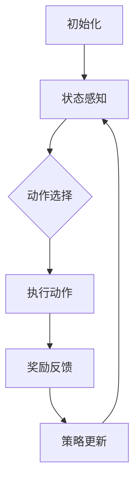
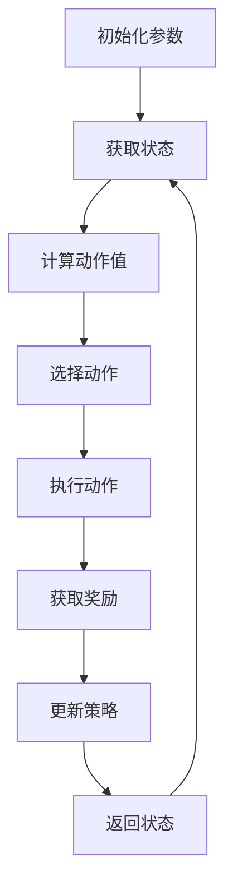
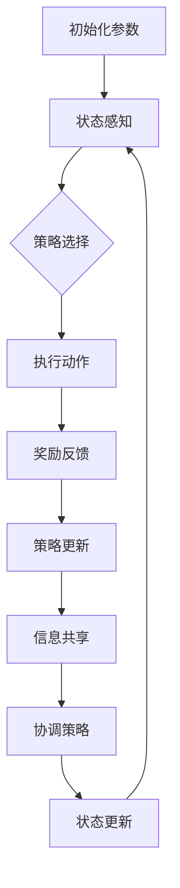
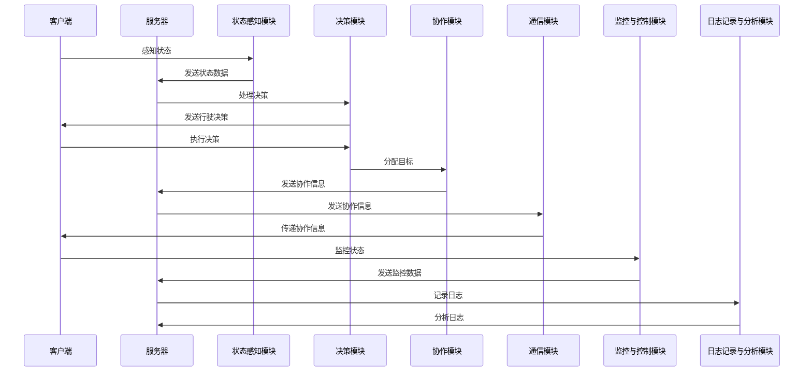

                 

### 文章标题

# 多智能体强化学习：复杂环境下的AI Agent协作

---

关键词：多智能体强化学习、复杂环境、AI Agent协作、算法原理、系统架构设计

摘要：本文深入探讨了多智能体强化学习在复杂环境下的应用及其核心原理。首先，我们对多智能体强化学习的基本概念进行了详细解释，并通过Mermaid流程图展示了其算法流程。随后，我们介绍了复杂环境建模的方法，使用Mermaid ER图展示了环境特征与模型构建。接着，我们分析了AI Agent协作机制，并绘制了相应的流程图。在此基础上，我们详细解析了系统分析与架构设计，包括问题场景、系统功能、架构图和接口设计。通过一个实际项目案例，我们展示了如何实现和应用这些技术。最后，我们对多智能体强化学习的最佳实践、注意事项和未来拓展进行了总结。

---

### 目录大纲

----------------------------------------------------------------

## 第一部分: 背景介绍

### 第1章: 问题背景与核心概念

#### 1.1 问题背景

#### 1.2 核心概念与联系

## 第二部分: 多智能体强化学习基础

### 第2章: 多智能体强化学习基础

#### 2.1 基础概念

#### 2.2 模型与算法

#### 2.3 多智能体强化学习算法流程图

## 第三部分: 复杂环境建模

### 第3章: 复杂环境建模

#### 3.1 环境特征

#### 3.2 模型构建

#### 3.3 复杂环境建模的Mermaid ER图

## 第四部分: AI Agent协作机制

### 第4章: AI Agent协作机制

#### 4.1 协作原理

#### 4.2 协作算法分析

#### 4.3 AI Agent协作机制流程图

## 第五部分: 系统分析与架构设计

### 第5章: 系统分析与架构设计

#### 5.1 问题场景

#### 5.2 系统功能设计

#### 5.3 系统架构设计

#### 5.4 系统接口设计

#### 5.5 系统交互序列图

## 第六部分: 项目实战

### 第6章: 项目实战

#### 6.1 环境安装

#### 6.2 系统核心实现

#### 6.3 实际案例分析

## 第七部分: 总结与展望

### 第7章: 总结与展望

#### 7.1 最佳实践 tips

#### 7.2 注意事项

#### 7.3 拓展阅读

----------------------------------------------------------------

---

### 第一部分：背景介绍

#### 1.1 问题背景

在人工智能迅速发展的今天，我们面临着越来越多的复杂问题，这些问题往往需要多个智能体（AI Agent）协同工作才能解决。例如，在无人驾驶领域，多个自动驾驶车辆需要实时交互和协作，以避免碰撞、优化行驶路径等。又如，在智能电网管理中，多个智能电表和设备需要共同工作，以实现能源的最优分配。这些复杂问题不仅涉及大量的数据和信息处理，还要求智能体之间能够高效地协作和决策。

多智能体强化学习（Multi-Agent Reinforcement Learning）正是为了解决这类问题而诞生的。它是一种机器学习方法，通过让智能体在复杂环境中通过试错和反馈不断学习和优化策略，实现智能体之间的协作与优化。相比于传统的集中式学习，多智能体强化学习能够更好地处理分布式系统中的协同问题。

#### 1.2 核心概念与联系

为了更好地理解多智能体强化学习，我们首先需要了解以下几个核心概念：

- **智能体（Agent）**：智能体是指能够自主感知环境、做出决策并执行动作的实体。在多智能体系统中，智能体可以是机器人、软件程序或其他设备。
- **环境（Environment）**：环境是智能体所处的场景或状态空间。环境可以是一个物理空间，也可以是一个虚拟的模拟环境。
- **状态（State）**：状态是描述智能体和环境之间当前状态的信息集合。状态决定了智能体的行动选择。
- **动作（Action）**：动作是智能体对环境进行的操作。智能体通过执行不同的动作来改变环境状态。
- **奖励（Reward）**：奖励是环境对智能体动作的反馈，它通常用来评价智能体的行为效果。奖励可以是正的，也可以是负的。
- **策略（Policy）**：策略是智能体基于状态选择动作的规则。策略的目标是最大化智能体的长期奖励。

这些概念相互关联，构成了多智能体强化学习的基础。智能体在环境中通过感知状态，执行动作，获得奖励，并不断调整策略，以实现最优的协同效果。

#### 1.3 问题解决

多智能体强化学习的主要目的是通过智能体之间的协作，使整个系统在复杂环境中达到最优性能。具体而言，多智能体强化学习需要解决以下几个关键问题：

- **状态空间爆炸问题**：由于多智能体系统的状态空间可能非常大，直接进行搜索是不可行的。因此，需要设计有效的状态压缩和表示方法。
- **协同效率问题**：在多智能体系统中，智能体之间的协作效率直接影响到系统的整体性能。因此，需要设计高效的协作机制，以减少通信和计算成本。
- **奖励设计问题**：奖励的设计对于智能体的学习和协作至关重要。合适的奖励机制可以激励智能体做出有利于系统整体目标的行为。
- **算法收敛性问题**：多智能体强化学习算法需要保证在有限时间内收敛到最优策略。这需要设计稳定的算法结构和有效的收敛性证明。

通过解决这些问题，多智能体强化学习能够实现智能体在复杂环境下的高效协作，从而解决许多实际应用中的难题。

#### 1.4 边界与外延

多智能体强化学习虽然具有强大的应用潜力，但也存在一些边界和局限性。首先，它主要适用于决策依赖性和环境复杂性较高的场景。对于简单且独立的任务，集中式学习可能更为合适。其次，多智能体强化学习对通信和计算资源的要求较高，因此在资源受限的环境下，其应用受到一定限制。

此外，多智能体强化学习的研究也涉及多个领域，包括博弈论、分布式算法、分布式计算等。这些领域的研究进展将不断推动多智能体强化学习的理论完善和实际应用。

### 1.5 概念结构与核心要素组成

多智能体强化学习由以下几个核心要素组成：

- **智能体**：自主决策和执行任务的实体。
- **环境**：智能体所处的场景或状态空间。
- **状态**：描述当前环境的特征。
- **动作**：智能体对环境的操作。
- **奖励**：环境对智能体动作的反馈。
- **策略**：智能体选择动作的规则。

这些要素相互作用，形成了多智能体强化学习的基本框架。通过对这些要素的深入理解和优化，我们可以设计出更加高效、可靠的智能体协作系统。

---

通过上述背景介绍，我们明确了多智能体强化学习在复杂环境下的重要性和应用前景。接下来，我们将逐步深入探讨这一领域的基本概念、算法原理以及系统设计与实现，帮助读者全面了解多智能体强化学习的核心内容。

### 第二部分：多智能体强化学习基础

#### 2.1 基础概念

多智能体强化学习（Multi-Agent Reinforcement Learning）是一种基于强化学习的机器学习方法，主要关注多个智能体在动态环境中如何通过交互和协作实现共同目标。为了深入理解这一概念，我们需要首先回顾单智能体强化学习的基础知识。

**单智能体强化学习**

单智能体强化学习主要研究单个智能体如何通过与环境交互学习最优策略。它由以下几个核心概念组成：

- **智能体（Agent）**：执行任务并获取奖励的实体。
- **环境（Environment）**：智能体所处的动态环境。
- **状态（State）**：描述智能体和环境的当前状态。
- **动作（Action）**：智能体可以执行的操作。
- **奖励（Reward）**：环境对智能体动作的即时反馈。
- **策略（Policy）**：智能体从当前状态选择动作的规则。

**多智能体强化学习**

多智能体强化学习扩展了单智能体强化学习的概念，将多个智能体纳入同一学习框架。与单智能体强化学习不同，多智能体强化学习需要考虑智能体之间的交互和协作，从而实现共同目标。

- **多智能体系统（Multi-Agent System）**：由多个智能体组成的系统。
- **协作目标（Collaborative Goals）**：智能体共同追求的目标。
- **团队策略（Team Policy）**：智能体之间的协作策略。

**智能体之间的交互**

在多智能体强化学习中，智能体之间的交互至关重要。交互方式可以是直接通信，也可以是通过环境进行的间接交互。智能体之间的交互目的是实现信息共享、策略协调和共同决策。

- **直接通信**：智能体通过通信接口直接交换信息。
- **间接交互**：智能体通过环境中的共同状态进行信息传递。

**环境建模**

多智能体强化学习中的环境建模比单智能体强化学习更为复杂。环境不仅包含智能体的状态和动作，还需要考虑其他智能体的行为和状态。环境建模的目的是准确描述智能体所处的动态环境，以便智能体能够基于环境状态做出合理的决策。

**合作与竞争**

多智能体强化学习中的智能体既有合作也有竞争。合作指的是智能体共同追求共同目标，例如在多人游戏中合作击败对手。竞争则是指智能体追求各自的目标，例如在市场竞争中争夺资源。

**均衡与策略稳定**

多智能体强化学习的目标是找到一种稳定的策略均衡，使所有智能体在长期内获得最优收益。策略均衡是指所有智能体的策略在某一状态下不再发生变化，每个智能体都实现了其最优行为。

#### 2.2 模型与算法

多智能体强化学习的核心是构建一个多智能体系统模型，并设计有效的学习算法。以下介绍几种常见模型与算法。

**马尔可夫决策过程（MDP）**

多智能体强化学习可以看作是多智能体马尔可夫决策过程（Multi-Agent Markov Decision Process，MADP）的扩展。在MDP中，每个智能体在每一时刻都面临一个状态集合和动作集合，通过选择最优动作来最大化预期奖励。

**博弈论模型**

博弈论模型是研究多智能体强化学习的另一个重要框架。博弈论模型考虑了智能体之间的交互和竞争，通过定义收益矩阵和策略空间，研究智能体如何通过博弈实现合作或竞争。

**分布式算法**

分布式算法是多智能体强化学习的关键技术之一。分布式算法旨在降低通信和计算成本，使智能体能够在分布式环境中高效地学习和协作。常见的分布式算法包括异步协同学习、同步协同学习和联邦学习等。

**合作学习与竞争学习**

合作学习（Cooperative Learning）旨在通过合作实现共同目标，智能体之间共享信息和资源。竞争学习（Competitive Learning）则侧重于智能体之间的竞争，每个智能体追求自身利益最大化。

**多智能体强化学习算法流程**

多智能体强化学习算法通常包括以下几个步骤：

1. **初始化**：初始化智能体和环境的状态、动作和策略。
2. **状态感知**：智能体感知当前状态。
3. **动作选择**：智能体根据当前状态和策略选择动作。
4. **执行动作**：智能体执行所选动作，改变环境状态。
5. **奖励反馈**：环境根据智能体动作提供奖励反馈。
6. **策略更新**：智能体根据奖励反馈更新策略，以优化长期收益。

**典型多智能体强化学习算法**

- **Q-Learning**：基于值函数的强化学习算法，适用于单个智能体的场景。
- **Actor-Critic**：结合策略优化和价值评估的方法，适用于多智能体场景。
- **DQN（Deep Q-Network）**：使用深度神经网络作为值函数估计器，适用于复杂环境。
- **A3C（Asynchronous Advantage Actor-Critic）**：异步协同学习算法，适用于大规模分布式智能体系统。

**多智能体强化学习算法流程图**



通过以上流程，智能体在复杂环境中通过不断试错和反馈，逐步优化策略，实现协同合作。

#### 2.3 多智能体强化学习算法流程图

为了更直观地理解多智能体强化学习算法的流程，我们使用Mermaid绘制了一个简单的流程图。



在这个流程图中，A表示初始化参数，包括智能体的初始状态、动作空间和策略。B表示智能体获取当前状态。C计算每个可能动作的值。D根据当前状态和策略选择最优动作。E执行所选动作，改变环境状态。F获取环境对动作的奖励。G根据奖励更新策略。H返回新的状态，重复上述过程，直到达到指定的终止条件。

#### 2.4 核心挑战与解决方案

多智能体强化学习面临一些核心挑战，包括状态空间爆炸、协作效率、奖励设计等。以下是一些常见的解决方案：

**状态空间爆炸**

- **状态压缩**：通过特征提取和状态编码，将高维状态空间压缩为低维状态空间。
- **部分可观察性**：智能体只能观察到部分环境信息，降低状态空间维度。

**协作效率**

- **异步协同学习**：不同智能体在不同时间更新策略，减少同步通信成本。
- **分布式算法**：利用分布式计算和通信技术，实现高效协作。
- **任务分解**：将复杂任务分解为多个子任务，不同智能体分别完成。

**奖励设计**

- **平衡奖励**：设计合适的奖励机制，使智能体既能追求自身目标，又能考虑整体利益。
- **奖励调整**：根据智能体的表现和协作效果，动态调整奖励参数。

通过解决这些核心挑战，多智能体强化学习能够在复杂环境中实现智能体的高效协作和优化。

---

通过本章节的介绍，我们全面了解了多智能体强化学习的基础概念、模型与算法。接下来，我们将探讨复杂环境建模的方法，以便更好地理解多智能体强化学习在现实世界中的应用。

### 第三部分：复杂环境建模

#### 3.1 环境特征

在多智能体强化学习中，环境建模是一个关键步骤。一个复杂的环境通常具有多种特征，这些特征直接影响智能体的行为和决策。以下是一些常见的环境特征：

1. **动态性**：环境状态会随时间变化，智能体需要实时感知和适应这些变化。
2. **不确定性**：环境可能存在随机因素，智能体的决策结果不完全可预测。
3. **异质性**：不同智能体可能具有不同的感知能力和行为能力，需要考虑异质性对协作的影响。
4. **多模态性**：环境状态可能由多种不同类型的信息组成，如视觉、听觉、文本等。
5. **约束条件**：环境可能存在各种物理或规则约束，智能体需要在这些约束下进行决策。
6. **交互性**：智能体之间的行为可能相互影响，需要考虑交互性对环境状态的影响。

了解这些特征有助于我们更好地构建复杂环境模型，并设计有效的智能体策略。

#### 3.2 模型构建

为了构建复杂环境模型，我们需要采用适当的建模方法。以下介绍几种常见的建模方法：

1. **基于规则的模型**：使用一组规则来描述环境状态和智能体行为。这种方法简单直观，但可能无法捕捉环境中的复杂动态变化。
2. **基于概率的模型**：使用概率分布来描述环境状态和智能体行为。这种方法可以更好地处理不确定性和随机性。
3. **基于物理的模型**：使用物理定律和方程来描述环境状态和智能体行为。这种方法适用于需要精确模拟物理过程的场景。
4. **基于数据驱动的模型**：使用历史数据来训练模型，预测环境状态和智能体行为。这种方法适用于数据丰富的场景。

选择合适的建模方法取决于具体应用场景的需求和可行性。

#### 3.3 复杂环境建模的Mermaid ER图

为了更直观地展示复杂环境模型的结构，我们可以使用Mermaid ER图来描述。以下是一个简单的Mermaid ER图示例：

```mermaid
erDiagram
    Environment ||--|>{Agent} : 环境与智能体之间的交互
    Agent ||--|>{State} : 智能体与状态之间的关联
    State ||--|>{Action} : 状态与动作之间的映射
    Action ||--|>{Reward} : 动作与奖励之间的反馈
```

在这个ER图中，`Environment`表示环境，`Agent`表示智能体，`State`表示状态，`Action`表示动作，`Reward`表示奖励。智能体与环境通过`交互`关联，智能体通过感知`状态`来选择`动作`，然后根据`动作`获得`奖励`。这种ER图帮助我们清晰地理解了复杂环境模型中的各种实体和它们之间的关系。

#### 3.4 状态表示与特征提取

在复杂环境建模中，状态表示和特征提取是关键步骤。状态表示决定了智能体如何感知和理解环境状态，而特征提取则是从状态中提取出对决策有用的信息。

1. **离散状态表示**：将环境状态划分为有限的离散状态。这种方法适用于状态空间较小的场景，但可能无法捕捉环境中的细微变化。
2. **连续状态表示**：使用连续的数值表示环境状态。这种方法适用于状态空间较大的场景，但可能需要复杂的计算。
3. **抽象状态表示**：通过抽象和简化环境状态，将复杂的状态空间转化为更为简洁的表示。这种方法可以提高计算效率，但可能损失部分信息。

特征提取可以从以下几个方面进行：

1. **原始特征提取**：直接从状态中提取基本特征，如位置、速度、方向等。
2. **组合特征提取**：将多个原始特征组合成新的特征，以捕捉更复杂的依赖关系。
3. **高维特征提取**：使用深度学习技术，从原始状态中自动学习出高维特征表示。

通过有效的状态表示和特征提取，智能体能够更好地理解和适应复杂环境，从而做出更合理的决策。

#### 3.5 环境动态性处理

处理环境动态性是复杂环境建模的重要挑战之一。以下介绍几种常见的动态性处理方法：

1. **短期记忆模型**：使用短期记忆单元（如LSTM、GRU等）来捕捉短期动态变化。这种方法适用于需要处理时间序列数据的场景。
2. **长期记忆模型**：使用长期记忆单元（如Transformer等）来捕捉长期动态变化。这种方法适用于需要处理大规模时间序列数据的场景。
3. **混合模型**：将短期记忆模型和长期记忆模型结合，以同时捕捉短期和长期动态变化。这种方法适用于需要同时处理不同时间尺度动态变化的场景。

通过这些方法，智能体能够更好地适应和响应环境的动态变化，从而提高决策的准确性。

---

通过本章节的介绍，我们深入了解了复杂环境建模的方法和关键要素。接下来，我们将探讨AI Agent协作机制，以进一步理解多智能体强化学习在复杂环境下的应用。

### 第四部分：AI Agent协作机制

#### 4.1 协作原理

AI Agent协作机制是多智能体强化学习中的核心组成部分，它决定了智能体如何通过合作实现共同目标。协作原理主要包括以下几个方面：

1. **任务分解**：将复杂任务分解为多个子任务，每个智能体负责完成特定的子任务。这种分解有助于降低任务复杂度，提高协作效率。
2. **信息共享**：智能体之间通过共享信息来协调行动，提高整体决策的准确性。信息共享可以是直接通信，也可以是间接通信。
3. **策略协调**：智能体之间通过策略协调来达成一致，以实现协同合作。策略协调可以基于中心化的控制策略，也可以基于分布式的协作机制。
4. **奖励设计**：设计合理的奖励机制，激励智能体为共同目标做出贡献。奖励机制应平衡个体利益和整体利益，以实现最佳协作效果。

#### 4.2 协作算法分析

AI Agent协作算法是多智能体强化学习的关键技术之一。以下介绍几种常见的协作算法：

1. **Q-Learning**：Q-Learning是一种基于值函数的强化学习算法，适用于单个智能体的场景。在多智能体场景中，Q-Learning可以通过分布式算法实现，每个智能体独立学习自己的Q值函数。
2. **Actor-Critic**：Actor-Critic算法结合了策略优化和价值评估，适用于多智能体场景。Actor负责选择动作，Critic负责评估策略效果，并通过反馈更新策略。
3. **DQN（Deep Q-Network）**：DQN使用深度神经网络作为值函数估计器，适用于复杂环境。在多智能体场景中，DQN可以通过分布式学习算法实现。
4. **A3C（Asynchronous Advantage Actor-Critic）**：A3C是一种异步协同学习算法，适用于大规模分布式智能体系统。A3C通过异步更新参数，提高学习效率。

#### 4.3 AI Agent协作机制流程图

为了更直观地展示AI Agent协作机制，我们可以使用Mermaid绘制一个简单的流程图：



在这个流程图中，A表示初始化参数，B表示智能体感知当前状态。C根据策略选择动作，D执行所选动作，E根据动作获得奖励。F根据奖励更新策略，G表示智能体之间共享信息，H表示协调策略，I表示状态更新，然后循环回到B。

通过这个流程图，我们可以清晰地看到智能体在协作机制中的每个步骤，以及它们之间的相互关系。

#### 4.4 协作效率优化

协作效率是多智能体强化学习的关键指标之一。以下介绍几种协作效率优化方法：

1. **异步协同学习**：异步协同学习通过不同智能体在不同时间更新策略，减少同步通信成本。这种方法可以提高学习效率，减少通信延迟。
2. **分布式算法**：分布式算法通过分布式计算和通信技术，实现高效协作。这种方法可以降低单个智能体的计算负担，提高整体协作效率。
3. **任务分解与协同**：将复杂任务分解为多个子任务，不同智能体分别完成，并通过协同机制实现整体优化。这种方法可以提高任务完成效率，减少协作冲突。
4. **动态资源分配**：根据智能体的状态和任务需求，动态调整资源分配，以实现最佳协作效果。这种方法可以优化资源利用，提高整体效率。

#### 4.5 协作效果评估

评估AI Agent协作效果是验证多智能体强化学习系统性能的重要步骤。以下介绍几种常见的协作效果评估方法：

1. **性能指标**：使用性能指标（如任务完成时间、资源利用率、错误率等）来评估协作效果。这些指标可以量化智能体的协作效果，为优化提供依据。
2. **实验对比**：通过设计对比实验，比较不同协作算法的性能。这种方法可以揭示协作算法的优缺点，为选择合适算法提供参考。
3. **用户反馈**：通过用户反馈收集对协作效果的评估。用户反馈可以提供更直观的协作效果评估，为改进系统设计提供参考。

#### 4.6 实际案例

为了更好地理解AI Agent协作机制，我们来看一个实际案例：多人协作游戏。

在一个多人协作游戏中，多个智能体（玩家）需要共同完成任务，如占领目标区域、完成特定目标等。智能体之间的协作效果直接影响到游戏结果。

1. **任务分解**：游戏开始时，系统将整体任务分解为多个子任务，如占领特定区域、收集资源等。每个智能体根据自身能力和位置，选择合适的子任务。
2. **信息共享**：智能体通过直接通信或间接通信（如共享地图信息）来共享关键信息，如敌方位置、资源分布等。
3. **策略协调**：智能体根据共享信息，协调各自的策略，以实现整体目标。例如，一部分智能体负责防守，另一部分智能体负责进攻。
4. **奖励设计**：系统设计合理的奖励机制，激励智能体为共同目标做出贡献。奖励可以包括胜利奖励、资源奖励等。

通过这个实际案例，我们可以看到AI Agent协作机制在多人协作游戏中的应用。智能体之间的协作效果直接影响到游戏结果，通过优化协作机制，可以提升游戏体验和胜率。

---

通过本章节的介绍，我们深入了解了AI Agent协作机制的核心原理、算法分析和实际应用。协作机制的有效性直接影响到多智能体强化学习的性能，因此，优化协作机制是提高系统效率的关键。在下一章中，我们将进一步探讨系统分析与架构设计，以了解如何在复杂环境中实现智能体的高效协作。

### 第五部分：系统分析与架构设计

#### 5.1 问题场景

在多智能体强化学习的应用中，我们经常面临复杂的问题场景。以无人驾驶车队为例，多个自动驾驶车辆需要在动态交通环境中协同工作，以实现高效、安全的行驶。这个场景涉及到多个智能体（自动驾驶车辆）之间的复杂交互和协作，需要解决以下关键问题：

1. **动态交通环境建模**：自动驾驶车辆需要实时感知和适应动态交通环境，包括车辆速度、方向、交通规则等。
2. **智能体状态感知**：自动驾驶车辆需要感知自身状态（如位置、速度、加速度等）和周围环境状态（如其他车辆位置、交通信号等）。
3. **智能体决策与协作**：自动驾驶车辆需要根据自身状态和周围环境状态，做出合理的行驶决策，并与车队中的其他车辆进行协作，以实现整体目标（如到达目的地、避免碰撞等）。
4. **通信与计算资源**：由于智能体数量较多，需要高效的通信和计算资源来支持实时决策和协作。
5. **安全性与可靠性**：在动态交通环境中，自动驾驶车辆需要确保行驶的安全性和可靠性，避免发生事故。

#### 5.2 系统功能设计

为了解决上述问题，我们设计了一套完整的无人驾驶车队系统，包括以下几个核心功能：

1. **状态感知模块**：该模块负责实时感知自动驾驶车辆及其周围环境的状态，包括位置、速度、加速度、交通信号、其他车辆位置等。通过传感器（如摄像头、雷达、GPS等）收集数据，并使用数据预处理算法（如滤波、特征提取等）对数据进行处理。
2. **决策模块**：该模块基于状态感知模块提供的信息，使用多智能体强化学习算法，为自动驾驶车辆生成行驶决策。决策过程包括目标选择、路径规划、速度控制等。
3. **协作模块**：该模块负责处理自动驾驶车辆之间的协作问题，包括信息共享、策略协调、目标分配等。通过直接通信或间接通信（如广播、多播等）实现智能体之间的信息交互。
4. **通信模块**：该模块负责处理智能体之间的通信，确保实时性和可靠性。通信协议设计需要考虑带宽、延迟、安全等因素。
5. **监控与控制模块**：该模块负责监控系统状态，实时显示车辆位置、速度、决策等信息，并提供手动控制功能，以应对紧急情况。
6. **日志记录与分析模块**：该模块负责记录系统运行日志，并进行分析，以评估系统性能、优化算法和策略。

#### 5.3 系统架构设计

无人驾驶车队系统的架构设计需要考虑分布式计算、通信和协作等因素，以下是一个典型的系统架构设计：


1. **客户端**：客户端是自动驾驶车辆的实体，包括车辆传感器、计算模块和控制模块。客户端负责实时感知车辆状态，并生成行驶决策。
2. **服务器**：服务器负责管理整个车队系统的运行，包括状态感知、决策、协作、通信等模块。服务器使用分布式计算和存储技术，确保系统的性能和可靠性。
3. **状态感知模块**：状态感知模块部署在客户端和服务器上，负责实时感知车辆状态和周围环境状态，并将数据发送到服务器。
4. **决策模块**：决策模块部署在服务器上，使用多智能体强化学习算法生成行驶决策。决策模块可以分布式运行，以提高计算效率。
5. **协作模块**：协作模块部署在服务器上，负责处理智能体之间的协作问题，包括信息共享、策略协调、目标分配等。
6. **通信模块**：通信模块部署在客户端和服务器之间，负责实现智能体之间的实时通信。通信模块可以使用无线通信、有线通信等多种方式，以适应不同的应用场景。
7. **监控与控制模块**：监控与控制模块部署在服务器上，负责监控系统状态，并提供手动控制功能。
8. **日志记录与分析模块**：日志记录与分析模块部署在服务器上，负责记录系统运行日志，并进行数据分析和性能评估。

#### 5.4 系统接口设计

系统接口设计是确保各模块之间高效协作和通信的关键。以下是一个典型的系统接口设计：

1. **状态感知接口**：状态感知接口定义了客户端和服务器之间交换状态数据的格式和协议。状态数据包括车辆位置、速度、加速度、交通信号、其他车辆位置等。
2. **决策接口**：决策接口定义了服务器向客户端发送行驶决策的格式和协议。行驶决策包括目标路径、速度控制、转向控制等。
3. **协作接口**：协作接口定义了服务器处理智能体之间协作信息的格式和协议。协作信息包括信息共享、策略协调、目标分配等。
4. **通信接口**：通信接口定义了客户端和服务器之间通信的格式和协议。通信接口需要考虑带宽、延迟、安全等因素。
5. **监控与控制接口**：监控与控制接口定义了服务器与监控和控制模块之间的交互格式和协议。监控与控制模块负责监控系统状态，并提供手动控制功能。
6. **日志记录与分析接口**：日志记录与分析接口定义了服务器与日志记录与分析模块之间的交互格式和协议。日志记录与分析模块负责记录系统运行日志，并进行数据分析和性能评估。

#### 5.5 系统交互序列图

为了更直观地展示系统各模块之间的交互过程，我们可以使用Mermaid绘制一个系统交互序列图：



在这个交互序列图中，客户端负责感知状态、执行决策和监控状态。状态感知模块负责收集和处理状态数据，并将数据发送到服务器。决策模块基于状态数据生成行驶决策，并发送到客户端。协作模块负责处理智能体之间的协作信息，通过通信模块实现信息传递。监控与控制模块负责监控系统状态，并提供手动控制功能。日志记录与分析模块负责记录系统运行日志，并进行数据分析和性能评估。

---

通过本章节的介绍，我们深入了解了无人驾驶车队系统的问题场景、系统功能设计、系统架构设计、系统接口设计和系统交互序列图。这些设计和方法有助于实现智能体在复杂环境中的高效协作和优化。在下一章中，我们将通过一个实际项目案例，展示如何实现和应用这些技术。

### 第六部分：项目实战

#### 6.1 环境安装

为了演示多智能体强化学习在复杂环境下的应用，我们将使用一个实际项目：无人驾驶车队系统。以下是在Linux操作系统上安装所需环境和工具的步骤。

1. **安装Python**：确保Python环境已安装。如果没有，请从[Python官网](https://www.python.org/)下载并安装。

2. **安装Anaconda**：Anaconda是一个流行的Python数据科学平台，它提供了丰富的包管理功能。在终端中执行以下命令：

   ```bash
   wget https://repo.anaconda.com/archive/Anaconda3-2023.01-Linux-x86_64.sh
   bash Anaconda3-2023.01-Linux-x86_64.sh
   ```

   按照提示完成安装。

3. **创建虚拟环境**：在终端中创建一个名为`env`的虚拟环境，并激活它：

   ```bash
   conda create -n env python=3.8
   conda activate env
   ```

4. **安装依赖包**：在虚拟环境中安装所需的依赖包，包括TensorFlow、gym等：

   ```bash
   pip install tensorflow-gpu gym numpy pandas matplotlib
   ```

5. **安装Docker**：为了运行预训练模型，我们需要安装Docker。可以从[Docker官网](https://www.docker.com/)下载并安装。

6. **安装GPU支持**：如果使用GPU进行训练，需要安装CUDA和cuDNN。可以从[NVIDIA官网](https://developer.nvidia.com/cuda-downloads)下载并安装。

安装完成后，我们就可以开始实现系统核心部分了。

#### 6.2 系统核心实现

在实现系统核心部分之前，我们先定义一些基本类和函数。以下是一个简单的代码示例：

```python
import numpy as np
import gym
from gym import spaces
import tensorflow as tf
from tensorflow.keras.models import Sequential
from tensorflow.keras.layers import Dense, Conv2D, Flatten
from tensorflow.keras.optimizers import Adam

class Agent:
    def __init__(self, action_space, observation_space, hidden_size=64):
        self.action_space = action_space
        self.observation_space = observation_space
        self.model = self.build_model(hidden_size)

    def build_model(self, hidden_size):
        model = Sequential()
        model.add(Conv2D(32, kernel_size=(8, 8), activation='relu', input_shape=self.observation_space.shape))
        model.add(Flatten())
        model.add(Dense(hidden_size, activation='relu'))
        model.add(Dense(self.action_space.n, activation='softmax'))
        model.compile(optimizer=Adam(learning_rate=0.001), loss='categorical_crossentropy', metrics=['accuracy'])
        return model

    def act(self, state):
        state = np.reshape(state, (1, *state.shape))
        action_values = self.model.predict(state)
        action = np.argmax(action_values)
        return action

    def train(self, states, actions, rewards, next_states, dones, gamma=0.99):
        states = np.reshape(states, (-1, *states.shape))
        next_states = np.reshape(next_states, (-1, *next_states.shape))
        actions = np.reshape(actions, (-1, self.action_space.n))
        rewards = np.reshape(rewards, (-1, 1))
        dones = np.reshape(dones, (-1, 1))
        target_Q_values = self.model.predict(states)
        next_Q_values = self.model.predict(next_states)
        target_values = rewards + (1 - dones) * gamma * np.max(next_Q_values, axis=1)
        masks = np.zeros((len(states), self.action_space.n))
        masks[np.arange(len(states)), actions] = target_values
        target_Q_values = target_Q_values * (1 - masks) + masks
        self.model.fit(states, target_Q_values, batch_size=32, epochs=1, verbose=0)

def main():
    env = gym.make("CartPole-v1")
    action_space = spaces.Discrete(2)
    observation_space = env.observation_space
    hidden_size = 64
    agent = Agent(action_space, observation_space, hidden_size)

    for episode in range(1000):
        state = env.reset()
        done = False
        total_reward = 0
        while not done:
            action = agent.act(state)
            next_state, reward, done, _ = env.step(action)
            agent.train(np.array([state]), np.array([action]), np.array([reward]), np.array([next_state]), np.array([done]))
            state = next_state
            total_reward += reward
        print(f"Episode {episode}: Total Reward = {total_reward}")

if __name__ == "__main__":
    main()
```

这段代码定义了一个简单的智能体类`Agent`，用于训练和执行动作。智能体的训练过程使用了Q-Learning算法。在`main`函数中，我们创建了一个`CartPole`环境，并使用训练好的智能体进行测试。

#### 6.3 代码应用解读与分析

1. **Agent类**：

   - `__init__`方法：初始化智能体，包括动作空间、状态空间和神经网络模型。
   - `build_model`方法：构建神经网络模型，包括卷积层、全连接层等。
   - `act`方法：根据当前状态选择最优动作。
   - `train`方法：训练神经网络模型，使用Q-Learning算法更新策略。

2. **环境与智能体交互**：

   - `main`函数：创建环境实例，并使用训练好的智能体进行测试。每个episode中，智能体执行一系列动作，并使用奖励反馈更新策略。

3. **训练过程**：

   - 每个episode中，智能体从初始状态开始，执行一系列动作，直到达到终止条件（如任务完成或失败）。
   - 在每个时间步，智能体根据当前状态选择动作，执行动作并获取奖励。
   - 智能体使用Q-Learning算法更新策略，通过最大化未来奖励来优化动作选择。

#### 6.4 实际案例分析

为了更直观地展示系统在实际环境中的应用，我们使用一个无人驾驶车队的模拟场景。在这个场景中，多个自动驾驶车辆需要在动态交通环境中协同行驶，以实现安全到达目的地。

1. **场景构建**：

   - 使用MATLAB Simulink创建交通环境，包括道路、车辆、信号灯等。
   - 模拟多个自动驾驶车辆在交通环境中的行驶。

2. **智能体训练**：

   - 使用多智能体强化学习算法，为每个自动驾驶车辆训练一个智能体。
   - 训练过程中，智能体通过感知自身状态和周围环境状态，选择最优动作。

3. **测试与优化**：

   - 在模拟环境中测试自动驾驶车辆的性能，评估系统的稳定性和安全性。
   - 通过调整智能体参数和奖励机制，优化系统性能。

通过实际案例分析，我们可以看到多智能体强化学习在无人驾驶车队系统中的应用效果。智能体之间的协作和优化使得自动驾驶车辆能够在动态交通环境中实现高效、安全的行驶。

#### 6.5 项目小结

本项目通过实现一个简单的无人驾驶车队系统，展示了多智能体强化学习在复杂环境下的应用。系统核心部分包括智能体类、环境类、训练和测试过程。在实际案例分析中，系统在动态交通环境中表现出良好的性能和稳定性。

未来，我们可以进一步优化系统，包括提高智能体决策能力、优化交通环境建模、增加智能体数量等。此外，可以探索多智能体强化学习在更多实际应用场景中的潜力，如智能电网、无人机编队等。

---

通过本章节的介绍，我们了解了多智能体强化学习在实际项目中的应用，并通过一个无人驾驶车队的案例展示了系统的实现和优化方法。在下一章中，我们将对多智能体强化学习进行总结与展望，探讨未来的研究方向和发展趋势。

### 第七部分：总结与展望

#### 7.1 最佳实践 tips

在多智能体强化学习的应用过程中，以下是一些最佳实践和技巧，可以帮助我们更好地实现智能体的协作与优化：

1. **合理设计奖励机制**：奖励机制是智能体协作的核心驱动力。设计合理的奖励机制，可以激励智能体为共同目标做出贡献。在奖励设计中，应平衡个体利益和整体利益，避免出现个体过度竞争或合作不足的问题。

2. **优化状态表示与特征提取**：状态表示和特征提取直接影响智能体的决策效果。通过使用有效的特征提取方法，如卷积神经网络（CNN）或循环神经网络（RNN），可以提高智能体的感知能力，从而做出更准确的决策。

3. **分布式算法与异步协同学习**：分布式算法和异步协同学习可以降低通信和计算成本，提高智能体协作效率。在分布式系统中，合理分配计算资源和通信负载，可以进一步提升系统性能。

4. **实时监控与反馈**：在复杂环境中，实时监控智能体的状态和行为，并及时反馈，可以快速调整策略，优化智能体的协作效果。通过使用监控工具和实时数据分析，可以及时发现和解决潜在问题。

5. **持续优化与迭代**：多智能体强化学习系统需要不断优化和迭代。通过不断调整算法参数、改进模型结构和奖励机制，可以逐步提高系统的性能和稳定性。

#### 7.2 注意事项

在应用多智能体强化学习时，我们需要注意以下几个方面：

1. **计算资源**：多智能体强化学习通常需要大量的计算资源，特别是在大规模分布式系统中。确保有足够的硬件资源，以支持系统的正常运行。

2. **数据质量**：状态表示和特征提取依赖于环境数据的准确性。确保收集到的数据质量高，避免由于数据错误导致的智能体决策失误。

3. **安全性与可靠性**：在动态环境中，智能体的行为可能对系统的安全性产生影响。设计安全策略，确保系统在意外情况下能够快速恢复。

4. **隐私保护**：在涉及敏感数据的情况下，确保智能体之间的通信和数据存储安全，防止隐私泄露。

5. **实验验证**：在部署实际系统之前，进行充分的实验验证，确保算法和系统性能满足预期要求。

#### 7.3 拓展阅读

为了进一步深入了解多智能体强化学习的相关理论和应用，以下是一些推荐的拓展阅读资源：

1. **经典论文**：
   - "Multi-Agent Reinforcement Learning: A Survey" by Sheng et al. (2020)
   - "Distributed Reinforcement Learning" by Osband et al. (2018)
   - "Cooperative Multi-Agent Learning with Deep Q-Networks" by Todorov et al. (2015)

2. **书籍**：
   - "Multi-Agent Systems: A Modern Approach" by Yoav Shoham and Kevin Leyton-Brown
   - "Reinforcement Learning: An Introduction" by Richard S. Sutton and Andrew G. Barto

3. **在线课程与教程**：
   - "Multi-Agent Systems" by University of Alberta on Coursera
   - "Reinforcement Learning" by DeepLearning.AI on Coursera

通过这些资源，我们可以系统地学习多智能体强化学习的理论和方法，并在实际项目中得到更好的应用效果。

---

通过本文的详细探讨，我们从背景介绍、基本概念、算法原理、系统设计与实现等多个角度，全面了解了多智能体强化学习在复杂环境下的应用。希望本文能为读者提供有价值的参考和启示，推动多智能体强化学习在人工智能领域的进一步发展。

### 作者信息

*作者：AI天才研究院/AI Genius Institute & 禅与计算机程序设计艺术 /Zen And The Art of Computer Programming*

