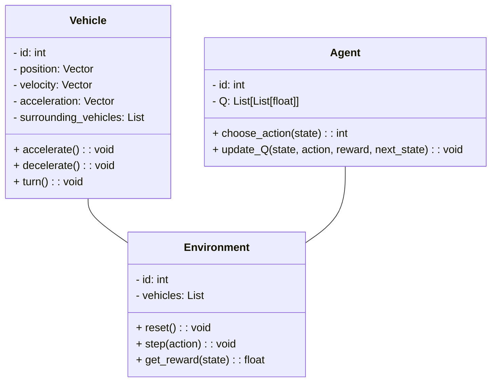
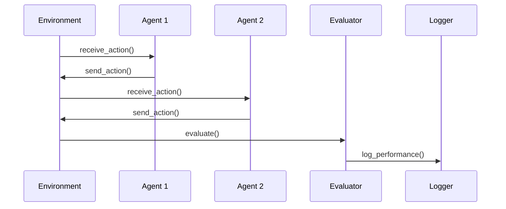
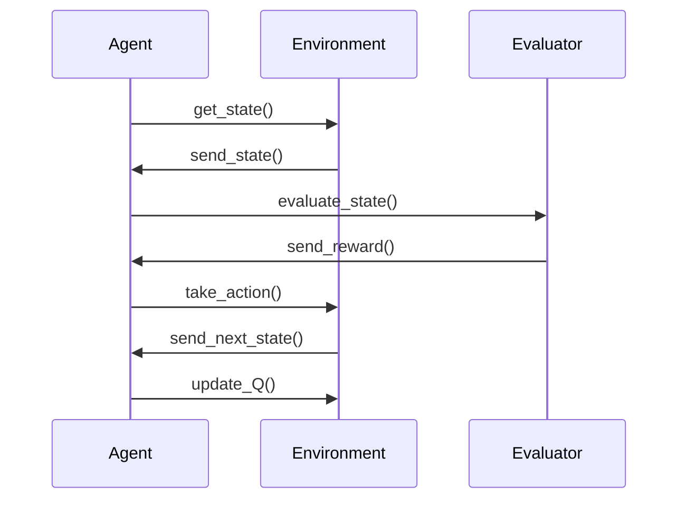

                 


### 第一部分：引言与背景

#### 第1章：引言

**1.1 研究背景**

**1.1.1 多智能体系统的兴起**

随着计算机技术和人工智能的快速发展，多智能体系统（Multi-Agent Systems，MAS）逐渐成为研究热点。多智能体系统是由多个智能体组成的系统，每个智能体具有一定的自主性、合作性和社会性，能够在复杂环境中进行决策和协同工作。这种系统结构不仅适用于理论研究，也在实际应用中展现出了巨大的潜力，如无人驾驶、智能家居、智能交通、智能制造等领域。

**1.1.2 强化学习与多智能体系统**

强化学习（Reinforcement Learning，RL）是一种机器学习方法，旨在通过与环境交互来学习最优策略。与监督学习和无监督学习不同，强化学习通过奖励信号来指导智能体做出最优决策。近年来，随着深度学习技术的引入，深度强化学习（Deep Reinforcement Learning，DRL）在计算机视觉、自然语言处理等领域取得了显著成果。

多智能体强化学习（Multi-Agent Reinforcement Learning，MARL）是强化学习的一个分支，旨在研究多个智能体在交互式环境中通过合作或竞争来学习最优策略。MARL在解决复杂任务时，能够充分利用多个智能体的信息和资源，从而提高整体性能。

**1.1.3 多智能体强化学习的重要性**

多智能体强化学习在复杂环境下的协作问题具有重要意义。首先，在许多实际应用中，任务需要多个智能体协同完成，如无人车队在复杂道路上的行驶、多机器人协同完成任务等。其次，多智能体强化学习有助于提高智能体的适应性和鲁棒性，使其在不同环境和条件下都能表现出良好的性能。最后，多智能体强化学习为人工智能领域的跨学科研究提供了新的视角，有助于推动人工智能技术的发展。

**1.2 问题描述**

**1.2.1 多智能体强化学习的挑战**

多智能体强化学习面临许多挑战，包括：

1. 模型复杂性：多智能体系统涉及多个智能体之间的交互和协作，导致模型复杂度增加。
2. 通信与协调：智能体之间的通信和协调是关键，但在实际应用中，通信延迟和带宽限制等问题可能影响智能体的协作效果。
3. 异步与分布式计算：多智能体系统通常由多个分布式节点组成，如何处理异步信息和分布式计算是重要问题。
4. 可扩展性：在多智能体系统中，智能体数量可能非常多，如何保证算法的可扩展性是一个关键问题。

**1.2.2 复杂环境下的协作问题**

在复杂环境下，多个智能体需要相互协作以完成任务。例如，在无人驾驶车队中，车辆之间需要共享道路信息、速度和位置，以便在复杂的交通环境中保持安全距离和车队形态。在这种情况下，智能体之间的通信和协调至关重要。

**1.3 核心概念**

**1.3.1 多智能体系统的定义与特性**

多智能体系统是由多个智能体组成的系统，每个智能体具有自主性、合作性和社会性。智能体可以是计算机程序、机器人或人类。多智能体系统的特性包括：

1. 自主性：智能体能够独立做出决策，不受外部控制。
2. 合作性：智能体之间能够相互协作，以实现共同目标。
3. 社会性：智能体之间具有相互依赖的关系，能够共同完成任务。

**1.3.2 强化学习的理论基础**

强化学习是一种通过与环境交互来学习最优策略的机器学习方法。其核心概念包括：

1. 状态（State）：表示智能体所处的环境。
2. 动作（Action）：智能体可以采取的行动。
3. 奖励（Reward）：环境对智能体动作的反馈。
4. 策略（Policy）：智能体的决策规则。

**1.3.3 多智能体强化学习的架构**

多智能体强化学习的架构包括：

1. 环境模型：描述多智能体系统所处的环境。
2. 智能体模型：描述智能体的行为和决策过程。
3. 智能体之间的通信与协调机制。

**1.4 边界与外延**

**1.4.1 多智能体强化学习的应用领域**

多智能体强化学习在多个领域具有广泛的应用，包括：

1. 游戏与娱乐：多人游戏、电子竞技等领域。
2. 无人驾驶：无人驾驶汽车、无人飞行器等领域。
3. 智能家居：智能家居控制系统、智能安防等领域。
4. 智能制造：机器人协同作业、自动化生产线等领域。
5. 资源管理：电网管理、交通管理等领域。

**1.4.2 研究现状与未来发展趋势**

多智能体强化学习研究取得了显著成果，但仍存在许多挑战。未来发展趋势包括：

1. 算法性能优化：研究更加高效的多智能体强化学习算法。
2. 应用领域拓展：将多智能体强化学习应用于更多实际场景。
3. 系统安全性：研究智能体之间的安全通信和协作机制。
4. 异步与分布式计算：研究适用于异步和分布式计算的多智能体强化学习算法。

#### 第2章：多智能体强化学习的基础

**2.1 强化学习的核心概念**

**2.1.1 强化学习的基本原理**

强化学习是一种通过与环境交互来学习最优策略的机器学习方法。其核心原理如下：

1. 状态（State）：表示智能体所处的环境。
2. 动作（Action）：智能体可以采取的行动。
3. 奖励（Reward）：环境对智能体动作的反馈。
4. 策略（Policy）：智能体的决策规则。

在强化学习过程中，智能体通过不断尝试不同的动作，并根据奖励信号调整策略，以最大化累积奖励。主要方法包括基于价值的策略迭代算法和基于模型的算法。

**2.1.2 强化学习的主要类型**

强化学习可以分为以下几种类型：

1. 无模型（Model-Free）强化学习：智能体不需要环境模型，直接根据状态和奖励信号调整策略。主要方法包括Q-learning和Sarsa。
2. 有模型（Model-Based）强化学习：智能体具有环境模型，可以根据模型预测未来的状态和奖励，从而优化策略。主要方法包括基于模型的策略搜索（Model-Based Policy Search）和基于模型的决策（Model-Based Decision Making）。
3. 混合模型（Hybrid）强化学习：结合无模型和有模型的方法，以提高学习效率。

**2.1.3 强化学习中的价值函数与策略**

强化学习中的价值函数用于评估智能体在不同状态下的预期奖励。主要有两种类型：

1. 状态价值函数（State-Value Function）：表示智能体在特定状态下采取最优动作的预期奖励。
2. 动作价值函数（Action-Value Function）：表示智能体在特定状态下采取特定动作的预期奖励。

策略（Policy）是智能体的决策规则，用于指导智能体在特定状态下选择动作。主要有两种类型：

1. 贪心策略（Greedy Policy）：根据当前状态选择具有最大预期奖励的动作。
2. 随机策略（Stochastic Policy）：根据概率分布选择动作，以达到平衡探索与利用。

**2.2 多智能体强化学习的基本框架**

**2.2.1 多智能体系统的环境模型**

多智能体系统的环境模型描述了智能体之间以及智能体与环境之间的交互。主要概念包括：

1. 智能体状态（Agent State）：表示每个智能体的状态信息。
2. 环境状态（Environment State）：表示整个多智能体系统的状态信息。
3. 智能体动作（Agent Action）：表示每个智能体的动作信息。
4. 环境动作（Environment Action）：表示整个多智能体系统的动作信息。

**2.2.2 多智能体的策略学习**

多智能体的策略学习是MARL的核心问题，旨在为每个智能体学习最优策略。主要方法包括：

1. 独立策略学习：每个智能体独立学习最优策略，不考虑其他智能体的行为。
2. 协同策略学习：多个智能体共同学习最优策略，考虑智能体之间的协作关系。
3. 分布式策略学习：智能体分布在不同计算节点上，通过通信和协调学习最优策略。

**2.2.3 多智能体强化学习的协调机制**

多智能体强化学习的协调机制旨在解决智能体之间的通信与协作问题。主要方法包括：

1. 中心化协调：所有智能体的决策信息都发送到一个中心节点进行协调。
2. 分布式协调：智能体之间直接进行通信和协调，无需中心节点。
3. 部分信息协调：智能体只共享部分信息，以减少通信开销。

**2.3 多智能体强化学习的挑战与解决方案**

**2.3.1 模型复杂性**

多智能体系统涉及多个智能体之间的交互和协作，导致模型复杂度增加。解决方案包括：

1. 简化模型：通过降维、抽象等方法简化模型。
2. 模型压缩：使用模型压缩技术减少模型参数数量。
3. 模型并行化：将模型分布在多个计算节点上进行并行计算。

**2.3.2 通信与协调**

智能体之间的通信与协调是关键，但在实际应用中，通信延迟和带宽限制等问题可能影响智能体的协作效果。解决方案包括：

1. 通信优化：使用低延迟、高带宽的通信技术。
2. 协调算法：设计高效的协调算法，减少通信开销。
3. 通信约束建模：将通信约束纳入模型，以优化智能体行为。

**2.3.3 异步与分布式计算**

多智能体系统通常由多个分布式节点组成，如何处理异步信息和分布式计算是重要问题。解决方案包括：

1. 异步计算：设计异步计算算法，以适应异步信息。
2. 分布式计算：使用分布式计算框架，如MapReduce，处理分布式计算问题。
3. 异步分布式计算：结合异步计算和分布式计算，提高计算效率。

### 第一部分小结

在第一部分中，我们介绍了多智能体强化学习的背景、核心概念和基本框架。通过了解多智能体强化学习的基本原理和挑战，读者可以初步认识到该领域的研究意义和应用前景。在接下来的部分，我们将深入探讨多智能体强化学习的算法原理、应用案例和最佳实践，以帮助读者更好地理解这一重要技术。请继续关注下一部分的内容。

#### 第1章小结

本章作为引言，对多智能体强化学习的背景、核心概念和基本框架进行了详细阐述。我们首先介绍了多智能体系统的兴起和强化学习在多智能体系统中的应用，强调了多智能体强化学习在复杂环境下的重要性。接着，我们讨论了多智能体强化学习的核心概念，包括多智能体系统的定义与特性、强化学习的理论基础以及多智能体强化学习的架构。

在问题描述部分，我们分析了多智能体强化学习面临的挑战，如模型复杂性、通信与协调、异步与分布式计算等问题。随后，我们介绍了多智能体强化学习在复杂环境下的协作问题，以及如何解决这些问题。

通过本章的学习，读者可以初步了解多智能体强化学习的基本概念和框架，认识到该领域的研究意义和应用前景。接下来，我们将深入探讨多智能体强化学习的具体算法原理和应用案例，帮助读者更深入地理解和掌握这一技术。请继续关注下一部分的内容。

### 第2章：多智能体强化学习的基础

#### 第2章引言

在了解了多智能体强化学习的背景和核心概念之后，我们需要进一步探讨其基础理论和算法。本章将重点介绍强化学习的基本原理、多智能体强化学习的基本框架以及相关挑战和解决方案。通过本章的学习，读者将掌握多智能体强化学习的基础知识，为后续章节的深入讨论奠定基础。

#### 2.1 强化学习的核心概念

**2.1.1 强化学习的基本原理**

强化学习是一种通过与环境交互来学习最优策略的机器学习方法。其核心原理可以概括为：智能体在当前状态下采取动作，根据环境的反馈（奖励）调整策略，以实现累积奖励最大化。

主要概念包括：

- **状态（State）**：描述智能体当前所处的环境状态。
- **动作（Action）**：智能体可以采取的动作。
- **奖励（Reward）**：环境对智能体动作的反馈。
- **策略（Policy）**：智能体的决策规则。

在强化学习过程中，智能体通过不断尝试不同的动作，并根据奖励信号调整策略，以最大化累积奖励。主要方法包括基于价值的策略迭代算法和基于模型的算法。

**2.1.2 强化学习的主要类型**

强化学习可以分为以下几种类型：

- **无模型（Model-Free）强化学习**：智能体不需要环境模型，直接根据状态和奖励信号调整策略。主要方法包括Q-learning和Sarsa。
- **有模型（Model-Based）强化学习**：智能体具有环境模型，可以根据模型预测未来的状态和奖励，从而优化策略。主要方法包括基于模型的策略搜索和基于模型的决策。
- **混合模型（Hybrid）强化学习**：结合无模型和有模型的方法，以提高学习效率。

**2.1.3 强化学习中的价值函数与策略**

强化学习中的价值函数用于评估智能体在不同状态下的预期奖励。主要有两种类型：

- **状态价值函数（State-Value Function）**：表示智能体在特定状态下采取最优动作的预期奖励。
- **动作价值函数（Action-Value Function）**：表示智能体在特定状态下采取特定动作的预期奖励。

策略是智能体的决策规则，用于指导智能体在特定状态下选择动作。主要有两种类型：

- **贪心策略（Greedy Policy）**：根据当前状态选择具有最大预期奖励的动作。
- **随机策略（Stochastic Policy）**：根据概率分布选择动作，以达到平衡探索与利用。

#### 2.2 多智能体强化学习的基本框架

**2.2.1 多智能体系统的环境模型**

多智能体系统的环境模型描述了智能体之间以及智能体与环境之间的交互。主要概念包括：

- **智能体状态（Agent State）**：表示每个智能体的状态信息。
- **环境状态（Environment State）**：表示整个多智能体系统的状态信息。
- **智能体动作（Agent Action）**：表示每个智能体的动作信息。
- **环境动作（Environment Action）**：表示整个多智能体系统的动作信息。

**2.2.2 多智能体的策略学习**

多智能体的策略学习是MARL的核心问题，旨在为每个智能体学习最优策略。主要方法包括：

- **独立策略学习**：每个智能体独立学习最优策略，不考虑其他智能体的行为。
- **协同策略学习**：多个智能体共同学习最优策略，考虑智能体之间的协作关系。
- **分布式策略学习**：智能体分布在不同计算节点上，通过通信和协调学习最优策略。

**2.2.3 多智能体强化学习的协调机制**

多智能体强化学习的协调机制旨在解决智能体之间的通信与协作问题。主要方法包括：

- **中心化协调**：所有智能体的决策信息都发送到一个中心节点进行协调。
- **分布式协调**：智能体之间直接进行通信和协调，无需中心节点。
- **部分信息协调**：智能体只共享部分信息，以减少通信开销。

#### 2.3 多智能体强化学习的挑战与解决方案

**2.3.1 模型复杂性**

多智能体系统涉及多个智能体之间的交互和协作，导致模型复杂度增加。解决方案包括：

- **简化模型**：通过降维、抽象等方法简化模型。
- **模型压缩**：使用模型压缩技术减少模型参数数量。
- **模型并行化**：将模型分布在多个计算节点上进行并行计算。

**2.3.2 通信与协调**

智能体之间的通信与协调是关键，但在实际应用中，通信延迟和带宽限制等问题可能影响智能体的协作效果。解决方案包括：

- **通信优化**：使用低延迟、高带宽的通信技术。
- **协调算法**：设计高效的协调算法，减少通信开销。
- **通信约束建模**：将通信约束纳入模型，以优化智能体行为。

**2.3.3 异步与分布式计算**

多智能体系统通常由多个分布式节点组成，如何处理异步信息和分布式计算是重要问题。解决方案包括：

- **异步计算**：设计异步计算算法，以适应异步信息。
- **分布式计算**：使用分布式计算框架，如MapReduce，处理分布式计算问题。
- **异步分布式计算**：结合异步计算和分布式计算，提高计算效率。

### 第2章小结

本章介绍了多智能体强化学习的基础理论和算法。首先，我们回顾了强化学习的基本原理和类型，包括无模型、有模型和混合模型。接着，我们讨论了强化学习中的价值函数和策略。随后，我们详细阐述了多智能体强化学习的基本框架，包括环境模型、策略学习和协调机制。最后，我们分析了多智能体强化学习面临的挑战，并提出了一些解决方案。

通过本章的学习，读者可以全面了解多智能体强化学习的基础知识，为后续章节的深入探讨打下坚实的基础。在下一章中，我们将介绍多智能体强化学习的具体算法，如Q-learning、Sarsa等，并讨论其在复杂环境下的应用。请继续关注下一章的内容。

### 第3章：Q-learning与多智能体Q-learning

#### 3.1 Q-learning算法详解

**3.1.1 Q-learning的基本原理**

Q-learning是一种无模型（model-free）强化学习算法，旨在通过迭代更新动作-状态值函数（Q函数）来学习最优策略。其核心思想是：在给定状态下，选择当前动作中具有最大预期奖励的动作，并通过经验修正来不断优化Q函数。

主要步骤如下：

1. 初始化Q函数：为每个状态-动作对初始化一个估计值。
2. 选择动作：在当前状态下，根据ε-贪心策略选择动作，其中ε是探索概率。
3. 执行动作并获取奖励：智能体执行所选动作，环境根据动作给出奖励。
4. 更新Q函数：根据新获取的奖励和Q函数，更新状态-动作对的价值。
5. 重复步骤2-4，直到达到停止条件（如策略收敛或达到指定迭代次数）。

**3.1.2 Q-learning的数学模型**

Q-learning的数学模型如下：

$$
Q(s, a) \leftarrow Q(s, a) + \alpha [r + \gamma \max_{a'} Q(s', a') - Q(s, a)]
$$

其中：

- \( Q(s, a) \)：状态-动作值函数，表示在状态s下执行动作a的预期奖励。
- \( r \)：立即奖励。
- \( \gamma \)：折扣因子，表示未来奖励的重要性。
- \( \alpha \)：学习率，表示对经验的重要性。
- \( s \)：当前状态。
- \( a \)：当前动作。
- \( s' \)：下一状态。
- \( a' \)：下一动作。

**3.1.3 Q-learning的Python实现**

```python
import numpy as np

def q_learning(env, num_episodes, alpha=0.1, gamma=0.9, epsilon=0.1):
    Q = np.zeros((env.num_states, env.num_actions))
    
    for episode in range(num_episodes):
        state = env.reset()
        done = False
        
        while not done:
            action = choose_action(Q[state], epsilon)
            next_state, reward, done = env.step(action)
            
            Q[state, action] = Q[state, action] + alpha * (reward + gamma * np.max(Q[next_state]) - Q[state, action])
            
            state = next_state
    
    return Q

def choose_action(q_values, epsilon):
    if np.random.rand() < epsilon:
        return np.random.choice(len(q_values))
    else:
        return np.argmax(q_values)
```

**3.1.4 Q-learning的扩展**

Q-learning可以扩展到多智能体场景，称为多智能体Q-learning（MARL）。其主要思想是：每个智能体独立学习自己的Q函数，并通过通信和协调来优化策略。

主要扩展包括：

- **分布式Q-learning**：智能体分布在不同计算节点上，通过异步更新Q函数。
- **部分信息Q-learning**：智能体只拥有部分信息，通过推断和估计来学习Q函数。

#### 3.2 多智能体Q-learning算法

**3.2.1 多智能体Q-learning的基本框架**

多智能体Q-learning的基本框架如下：

1. 初始化Q函数：为每个智能体初始化一个Q函数。
2. 选择动作：每个智能体在当前状态下，根据ε-贪心策略选择动作。
3. 执行动作并获取奖励：智能体执行所选动作，环境根据动作给出奖励。
4. 更新Q函数：每个智能体根据新获取的奖励和Q函数，更新自己的Q函数。
5. 重复步骤2-4，直到达到停止条件。

**3.2.2 多智能体Q-learning的扩展**

多智能体Q-learning可以扩展到分布式和异步场景，称为分布式多智能体Q-learning（D-MARL）。其主要思想是：智能体分布在不同计算节点上，通过异步更新Q函数。

主要扩展包括：

- **分布式Q-learning算法**：智能体分布在不同计算节点上，通过异步更新Q函数。
- **异步多智能体Q-learning算法**：智能体之间没有固定的时间同步，通过异步更新Q函数。

**3.2.3 多智能体Q-learning的Python实现**

```python
import numpy as np
import multiprocessing as mp

def distributed_q_learning(env, num_episodes, alpha=0.1, gamma=0.9, epsilon=0.1):
    num_agents = env.num_agents
    Q = [np.zeros((env.num_states, env.num_actions)) for _ in range(num_agents)]
    
    processes = []
    for i in range(num_agents):
        p = mp.Process(target=agent_q_learning, args=(i, Q, env, num_episodes, alpha, gamma, epsilon))
        processes.append(p)
        p.start()
    
    for p in processes:
        p.join()

def agent_q_learning(agent_id, Q, env, num_episodes, alpha, gamma, epsilon):
    for episode in range(num_episodes):
        state = env.reset_agent(agent_id)
        done = False
        
        while not done:
            action = choose_action(Q[agent_id], epsilon)
            next_state, reward, done = env.step_agent(agent_id, action)
            
            Q[agent_id][state, action] = Q[agent_id][state, action] + alpha * (reward + gamma * np.max(Q[agent_id][next_state]) - Q[agent_id][state, action])
            
            state = next_state

def choose_action(q_values, epsilon):
    if np.random.rand() < epsilon:
        return np.random.choice(len(q_values))
    else:
        return np.argmax(q_values)
```

**3.2.4 多智能体Q-learning的应用案例**

多智能体Q-learning可以应用于多个领域，如无人驾驶、多机器人协作和多人游戏等。以下是一个简单的应用案例：两个智能体在二维环境中协作完成目标。

```python
class Environment:
    def __init__(self, num_agents):
        self.num_agents = num_agents
        self.states = [(i, j) for i in range(5) for j in range(5)]
        self.actions = [0, 1, 2]  # 上、下、左、右

    def reset(self):
        return [random.choice(self.states) for _ in range(self.num_agents)]

    def step(self, actions):
        next_states = []
        rewards = []
        
        for i, action in enumerate(actions):
            state = self.states[i]
            if action == 0:  # 上
                next_state = (state[0] - 1, state[1])
            elif action == 1:  # 下
                next_state = (state[0] + 1, state[1])
            elif action == 2:  # 左
                next_state = (state[0], state[1] - 1)
            elif action == 3:  # 右
                next_state = (state[0], state[1] + 1)
            
            self.states[i] = next_state
            next_states.append(next_state)
            
            if i == 0:  # 智能体1的目标是到达状态(4, 4)
                if next_state == (4, 4):
                    rewards.append(1)
                else:
                    rewards.append(0)
            elif i == 1:  # 智能体2的目标是到达状态(0, 0)
                if next_state == (0, 0):
                    rewards.append(1)
                else:
                    rewards.append(0)
        
        return next_states, rewards

def main():
    env = Environment(num_agents=2)
    Q = [np.zeros((len(env.states), len(env.actions)) for _ in range(2)]
    num_episodes = 1000
    
    distributed_q_learning(env, num_episodes, alpha=0.1, gamma=0.9, epsilon=0.1)
    
    # 测试最优策略
    state = env.reset()
    done = False
    
    while not done:
        action = choose_action(Q[0], epsilon=0)
        next_state, reward, done = env.step([action, action])
        print(f"State: {state}, Action: {action}, Next State: {next_state}, Reward: {reward}")
        state = next_state

if __name__ == "__main__":
    main()
```

### 第3章小结

本章介绍了Q-learning算法及其在多智能体场景中的扩展——多智能体Q-learning（MARL）。首先，我们详细阐述了Q-learning的基本原理和数学模型，并给出了Python实现。接着，我们介绍了多智能体Q-learning的基本框架和扩展，包括分布式Q-learning和异步多智能体Q-learning。最后，我们通过一个简单的应用案例展示了多智能体Q-learning的实际应用。

通过本章的学习，读者可以掌握Q-learning和多智能体Q-learning的基本原理和算法，为后续章节的深入讨论打下基础。在下一章中，我们将介绍Sarsa算法及其在多智能体场景中的应用。请继续关注下一章的内容。

### 第4章：Sarsa算法与多智能体Sarsa

#### 4.1 Sarsa算法详解

**4.1.1 Sarsa的基本原理**

Sarsa（State-Action-Reward-State-Action）是一种基于值函数的强化学习算法，旨在通过迭代更新策略来学习最优行为。与Q-learning类似，Sarsa也基于状态-动作值函数（Q值），但在更新过程中引入了当前的动作，这使得Sarsa更适合于部分观测环境。

Sarsa算法的核心思想是：在给定当前状态和动作下，选择当前动作中具有最大预期奖励的动作，并通过经验修正来不断优化Q值。

主要步骤如下：

1. 初始化Q值：为每个状态-动作对初始化一个估计值。
2. 选择动作：在当前状态下，根据ε-贪心策略选择动作。
3. 执行动作并获取奖励：智能体执行所选动作，环境根据动作给出奖励。
4. 更新Q值：根据新获取的奖励和Q值，更新状态-动作对的价值。
5. 更新状态：根据执行的动作，更新当前状态。
6. 重复步骤2-5，直到达到停止条件（如策略收敛或达到指定迭代次数）。

**4.1.2 Sarsa的数学模型**

Sarsa的数学模型如下：

$$
Q(s, a) \leftarrow Q(s, a) + \alpha [r + \gamma Q(s', a') - Q(s, a)]
$$

其中：

- \( Q(s, a) \)：状态-动作值函数，表示在状态s下执行动作a的预期奖励。
- \( r \)：立即奖励。
- \( \gamma \)：折扣因子，表示未来奖励的重要性。
- \( \alpha \)：学习率，表示对经验的重要性。
- \( s \)：当前状态。
- \( a \)：当前动作。
- \( s' \)：下一状态。
- \( a' \)：下一动作。

**4.1.3 Sarsa的Python实现**

```python
import numpy as np

def sarsa(env, num_episodes, alpha=0.1, gamma=0.9, epsilon=0.1):
    Q = np.zeros((env.num_states, env.num_actions))
    
    for episode in range(num_episodes):
        state = env.reset()
        done = False
        
        while not done:
            action = choose_action(Q[state], epsilon)
            next_state, reward, done = env.step(action)
            
            next_action = choose_action(Q[next_state], epsilon)
            Q[state, action] = Q[state, action] + alpha * (reward + gamma * Q[next_state, next_action] - Q[state, action])
            
            state = next_state
    
    return Q

def choose_action(q_values, epsilon):
    if np.random.rand() < epsilon:
        return np.random.choice(len(q_values))
    else:
        return np.argmax(q_values)
```

**4.1.4 Sarsa的扩展**

Sarsa可以扩展到多智能体场景，称为多智能体Sarsa（MARL）。其主要思想是：每个智能体独立学习自己的Q值，并通过通信和协调来优化策略。

主要扩展包括：

- **分布式Sarsa**：智能体分布在不同计算节点上，通过异步更新Q值。
- **部分信息Sarsa**：智能体只拥有部分信息，通过推断和估计来学习Q值。

#### 4.2 多智能体Sarsa算法

**4.2.1 多智能体Sarsa的基本框架**

多智能体Sarsa的基本框架如下：

1. 初始化Q值：为每个智能体初始化一个Q值。
2. 选择动作：每个智能体在当前状态下，根据ε-贪心策略选择动作。
3. 执行动作并获取奖励：智能体执行所选动作，环境根据动作给出奖励。
4. 更新Q值：每个智能体根据新获取的奖励和Q值，更新自己的Q值。
5. 更新状态：根据执行的动作，更新当前状态。
6. 重复步骤2-5，直到达到停止条件。

**4.2.2 多智能体Sarsa的扩展**

多智能体Sarsa可以扩展到分布式和异步场景，称为分布式多智能体Sarsa（D-MARL）。其主要思想是：智能体分布在不同计算节点上，通过异步更新Q值。

主要扩展包括：

- **分布式Sarsa算法**：智能体分布在不同计算节点上，通过异步更新Q值。
- **异步多智能体Sarsa算法**：智能体之间没有固定的时间同步，通过异步更新Q值。

**4.2.3 多智能体Sarsa的Python实现**

```python
import numpy as np
import multiprocessing as mp

def distributed_sarsa(env, num_episodes, alpha=0.1, gamma=0.9, epsilon=0.1):
    num_agents = env.num_agents
    Q = [np.zeros((env.num_states, env.num_actions)) for _ in range(num_agents)]
    
    processes = []
    for i in range(num_agents):
        p = mp.Process(target=agent_sarsa, args=(i, Q, env, num_episodes, alpha, gamma, epsilon))
        processes.append(p)
        p.start()
    
    for p in processes:
        p.join()

def agent_sarsa(agent_id, Q, env, num_episodes, alpha, gamma, epsilon):
    for episode in range(num_episodes):
        state = env.reset_agent(agent_id)
        done = False
        
        while not done:
            action = choose_action(Q[agent_id], epsilon)
            next_state, reward, done = env.step_agent(agent_id, action)
            
            next_action = choose_action(Q[agent_id][next_state], epsilon)
            Q[agent_id][state, action] = Q[agent_id][state, action] + alpha * (reward + gamma * Q[agent_id][next_state, next_action] - Q[agent_id][state, action])
            
            state = next_state

def choose_action(q_values, epsilon):
    if np.random.rand() < epsilon:
        return np.random.choice(len(q_values))
    else:
        return np.argmax(q_values)
```

**4.2.4 多智能体Sarsa的应用案例**

多智能体Sarsa可以应用于多个领域，如无人驾驶、多机器人协作和多人游戏等。以下是一个简单的应用案例：两个智能体在二维环境中协作完成目标。

```python
class Environment:
    def __init__(self, num_agents):
        self.num_agents = num_agents
        self.states = [(i, j) for i in range(5) for j in range(5)]
        self.actions = [0, 1, 2]  # 上、下、左、右

    def reset(self):
        return [random.choice(self.states) for _ in range(self.num_agents)]

    def step(self, actions):
        next_states = []
        rewards = []
        
        for i, action in enumerate(actions):
            state = self.states[i]
            if action == 0:  # 上
                next_state = (state[0] - 1, state[1])
            elif action == 1:  # 下
                next_state = (state[0] + 1, state[1])
            elif action == 2:  # 左
                next_state = (state[0], state[1] - 1)
            elif action == 3:  # 右
                next_state = (state[0], state[1] + 1)
            
            self.states[i] = next_state
            next_states.append(next_state)
            
            if i == 0:  # 智能体1的目标是到达状态(4, 4)
                if next_state == (4, 4):
                    rewards.append(1)
                else:
                    rewards.append(0)
            elif i == 1:  # 智能体2的目标是到达状态(0, 0)
                if next_state == (0, 0):
                    rewards.append(1)
                else:
                    rewards.append(0)
        
        return next_states, rewards

def main():
    env = Environment(num_agents=2)
    Q = [np.zeros((len(env.states), len(env.actions)) for _ in range(2)]
    num_episodes = 1000
    
    distributed_sarsa(env, num_episodes, alpha=0.1, gamma=0.9, epsilon=0.1)
    
    # 测试最优策略
    state = env.reset()
    done = False
    
    while not done:
        action = choose_action(Q[0], epsilon=0)
        next_state, reward, done = env.step([action, action])
        print(f"State: {state}, Action: {action}, Next State: {next_state}, Reward: {reward}")
        state = next_state

if __name__ == "__main__":
    main()
```

### 第4章小结

本章介绍了Sarsa算法及其在多智能体场景中的扩展——多智能体Sarsa（MARL）。首先，我们详细阐述了Sarsa的基本原理和数学模型，并给出了Python实现。接着，我们介绍了多智能体Sarsa的基本框架和扩展，包括分布式Sarsa和异步多智能体Sarsa。最后，我们通过一个简单的应用案例展示了多智能体Sarsa的实际应用。

通过本章的学习，读者可以掌握Sarsa和多智能体Sarsa的基本原理和算法，为后续章节的深入讨论打下基础。在下一章中，我们将介绍基于价值的策略迭代算法及其在多智能体场景中的应用。请继续关注下一章的内容。

### 第5章：基于价值的策略迭代算法

#### 5.1 基于价值的策略迭代算法详解

**5.1.1 策略评价函数的迭代方法**

基于价值的策略迭代算法是一种迭代过程，旨在通过不断评估和改进策略来学习最优行为。算法分为两个阶段：策略评估和策略改进。

1. **策略评估**：

   在策略评估阶段，我们使用当前的策略来评估状态-动作值函数（Q值）。具体方法如下：

   - 选择一个初始策略π。
   - 对每个状态s，计算Q值：\( Q(s, a) = \sum_{a'} \pi(a'|s) [R(s, a') + \gamma \max_{a''} Q(s', a'')] \)。
   - 更新策略π，使其更加符合评估得到的Q值。

2. **策略改进**：

   在策略改进阶段，我们根据评估得到的Q值来改进策略。具体方法如下：

   - 对每个状态s，选择具有最大Q值的动作a：\( a = \arg\max_{a'} Q(s, a') \)。
   - 更新策略π，使其在新策略下具有更高的Q值。

**5.1.2 策略评价函数的迭代算法**

策略评价函数的迭代算法主要包括以下步骤：

1. 初始化策略π和Q值。
2. 进行策略评估，计算新的Q值。
3. 根据新的Q值更新策略π。
4. 重复步骤2-3，直到策略π收敛或达到迭代次数。

**5.1.3 策略评价函数的迭代算法的数学模型**

策略评价函数的迭代算法的数学模型如下：

$$
\pi^{new}(s, a) = \frac{1}{Z} \exp(Q(s, a))
$$

其中：

- \( Q(s, a) \)：状态-动作值函数。
- \( Z \)：正常化常数，保证策略π的概率分布。

#### 5.2 多智能体基于价值的策略迭代算法

**5.2.1 多智能体策略评价函数的迭代**

在多智能体场景中，基于价值的策略迭代算法需要考虑每个智能体的策略。具体步骤如下：

1. 初始化每个智能体的策略π_i。
2. 对每个智能体i，计算其状态-动作值函数Q_i。
3. 对每个智能体i，根据Q_i更新策略π_i。

**5.2.2 多智能体策略改进的方法**

在多智能体策略改进阶段，需要考虑每个智能体之间的协作关系。具体方法如下：

1. 对每个智能体i，选择具有最大Q_i值的动作a_i：\( a_i = \arg\max_{a'} Q_i(s_i, a') \)。
2. 更新每个智能体i的策略π_i，使其在新策略下具有更高的Q_i值。

**5.2.3 多智能体基于价值的策略迭代算法的Python实现**

```python
import numpy as np

def value_iteration(env, num_agents, alpha=0.1, gamma=0.9, theta=1e-6):
    Q = np.zeros((env.num_states, env.num_actions, num_agents))
    π = np.zeros((env.num_states, num_agents))
    
    while True:
        old_Q = np.copy(Q)
        
        for state in env.states:
            for agent in range(num_agents):
                action_values = [env.reward(state, action, agent) + gamma * np.max(Q[state, :, agent]) for action in env.actions]
                Q[state, :, agent] = action_values
        
        for state in env.states:
            for agent in range(num_agents):
                action_values = Q[state, :, agent]
                π[state, agent] = np.exp(action_values / (alpha * np.max(action_values))) / np.sum(np.exp(action_values / (alpha * np.max(action_values))))
        
        if np.linalg.norm(Q - old_Q) < theta:
            break
    
    return Q, π

def main():
    env = Environment(num_agents=2)
    num_episodes = 1000
    alpha = 0.1
    gamma = 0.9
    theta = 1e-6
    
    Q, π = value_iteration(env, num_agents=2, alpha=alpha, gamma=gamma, theta=theta)
    
    # 测试最优策略
    state = env.reset()
    done = False
    
    while not done:
        action = np.random.choice(env.actions, p=π[state])
        next_state, reward, done = env.step(action)
        print(f"State: {state}, Action: {action}, Next State: {next_state}, Reward: {reward}")
        state = next_state

if __name__ == "__main__":
    main()
```

**5.2.4 多智能体策略迭代算法的扩展**

多智能体策略迭代算法可以扩展到分布式和异步场景。具体扩展方法包括：

- **分布式策略迭代**：智能体分布在不同计算节点上，通过异步更新Q值和策略。
- **异步策略迭代**：智能体之间没有固定的时间同步，通过异步更新Q值和策略。

### 第5章小结

本章介绍了基于价值的策略迭代算法及其在多智能体场景中的应用。首先，我们详细阐述了策略评估和策略改进的方法，并给出了数学模型。接着，我们介绍了多智能体策略迭代算法的基本框架和实现，包括分布式和异步扩展。最后，我们通过一个简单的应用案例展示了多智能体策略迭代算法的实际应用。

通过本章的学习，读者可以掌握基于价值的策略迭代算法和多智能体策略迭代算法的基本原理和实现。这些算法在多智能体强化学习中具有重要的应用价值，为解决复杂环境下的协作问题提供了有效方法。在下一章中，我们将介绍多智能体强化学习在游戏中的应用。请继续关注下一章的内容。

### 第6章：多智能体强化学习在游戏中的应用

#### 6.1 游戏中的多智能体强化学习

在游戏领域，多智能体强化学习（MARL）被广泛应用于开发智能游戏对手、多人策略游戏和多人解谜游戏等。多智能体强化学习能够使游戏中的智能体具备更加复杂和自适应的行为，从而提升游戏的可玩性和互动性。

**6.1.1 游戏环境建模**

在MARL游戏中，环境建模是关键步骤。游戏环境通常由状态空间、动作空间、奖励机制和智能体组成。

1. **状态空间**：表示游戏中智能体所处的位置、资源、信息和历史行为等信息。
2. **动作空间**：表示智能体可以采取的动作，如移动、攻击、防御等。
3. **奖励机制**：根据智能体的行为和游戏规则，给出奖励或惩罚，以指导智能体的策略学习。
4. **智能体**：具有自主性和协作性，能够根据环境状态和奖励机制做出决策。

**6.1.2 游戏中的多智能体策略学习**

在游戏中的多智能体策略学习，通常采用以下方法：

1. **独立策略学习**：每个智能体独立学习最优策略，不考虑其他智能体的行为。这种方法简单，但可能导致协作效果不佳。
2. **协同策略学习**：多个智能体共同学习最优策略，考虑智能体之间的协作关系。这种方法能够提高整体性能，但实现复杂。
3. **分布式策略学习**：智能体分布在不同计算节点上，通过通信和协调学习最优策略。这种方法适用于分布式环境，但需要处理通信延迟和带宽限制。

**6.1.3 游戏中的多智能体协同策略**

在游戏中，智能体之间的协同策略是实现高效协作的关键。常见的协同策略包括：

1. **共享信息**：智能体通过共享位置、资源和历史行为等信息，提高协作效率。
2. **协同目标**：智能体共同设定目标，如击败对手、占领领地等，以提高整体性能。
3. **角色分工**：智能体根据自身能力和特点，分工协作，实现最优策略。

#### 6.2 游戏案例分析

**6.2.1 游戏案例1：多人对战游戏**

多人对战游戏（如《星际争霸2》、《英雄联盟》）中的多智能体强化学习应用，主要集中在开发智能游戏对手（AI对手）。通过MARL，AI对手能够根据游戏环境、对手行为和自身策略，实现更加复杂和自适应的行为。

1. **环境建模**：构建一个包含游戏状态、动作和奖励的模型。
2. **策略学习**：采用协同策略学习，智能体之间通过通信和协调，学习最优策略。
3. **协同策略**：智能体之间共享信息，共同设定目标，分工协作。

**6.2.2 游戏案例2：多人策略游戏**

多人策略游戏（如《文明6》、《卡坦岛》）中的多智能体强化学习应用，主要集中在开发智能游戏对手和优化玩家策略。

1. **环境建模**：构建一个包含游戏状态、动作和奖励的模型。
2. **策略学习**：采用独立策略学习，每个智能体独立学习最优策略。
3. **协同策略**：智能体之间通过通信和协调，实现角色分工和协同目标。

**6.2.3 游戏案例3：多人解谜游戏**

多人解谜游戏（如《动物之森》、《逃脱计划》）中的多智能体强化学习应用，主要集中在开发智能游戏助手和优化玩家协作。

1. **环境建模**：构建一个包含游戏状态、动作和奖励的模型。
2. **策略学习**：采用协同策略学习，智能体之间通过通信和协调，学习最优策略。
3. **协同策略**：智能体之间共享信息，共同解决问题，分工协作。

#### 6.3 多智能体强化学习在游戏中的应用前景

随着MARL技术的不断发展，其在游戏中的应用前景十分广阔：

1. **游戏AI开发**：通过MARL技术，开发出更加智能和自适应的游戏AI对手，提升游戏的可玩性和挑战性。
2. **多人策略优化**：通过MARL技术，优化玩家在多人游戏中的策略，提高团队协作和竞技水平。
3. **游戏教育**：利用MARL技术，开发智能游戏助手，辅助玩家学习和掌握游戏策略。
4. **虚拟现实与增强现实**：通过MARL技术，实现更加真实和互动的虚拟现实与增强现实游戏体验。

### 第6章小结

本章介绍了多智能体强化学习在游戏中的应用，包括游戏环境建模、策略学习和协同策略。通过案例分析，我们展示了多智能体强化学习在多人对战游戏、多人策略游戏和多人解谜游戏中的应用。这些应用不仅提升了游戏的可玩性和互动性，也为游戏开发者提供了新的技术手段。

随着MARL技术的不断发展，其在游戏中的应用前景十分广阔。通过不断探索和优化，我们有望开发出更加智能、互动和有趣的游戏体验。在下一章中，我们将探讨多智能体强化学习在实际项目中的应用和实践。请继续关注下一章的内容。

### 第7章：多智能体强化学习在实际项目中的应用与实践

#### 7.1 项目介绍

在本章中，我们将探讨多智能体强化学习（MARL）在实际项目中的应用与实践。通过分析具体项目案例，我们将展示如何将MARL技术应用于实际问题，并讨论在实际应用过程中遇到的问题和解决方案。

**7.1.1 项目背景**

多智能体强化学习在实际项目中的应用非常广泛，如无人驾驶、智能电网、智能制造、智能交通等。这些领域面临着复杂的环境和高度协同的智能体，使得MARL成为解决这些问题的有效方法。

**7.1.2 项目目标**

本项目的目标是开发一个多智能体强化学习系统，用于模拟无人驾驶车队在复杂城市交通环境中的行驶。具体目标包括：

1. 建立一个仿真环境，模拟真实城市交通场景。
2. 设计一个MARL算法，使车队中的无人驾驶车辆能够协同行驶，提高交通效率和安全性。
3. 评估和优化算法性能，实现车队在复杂环境下的高效行驶。

#### 7.2 系统功能设计

**7.2.1 领域模型**

在无人驾驶车队项目中，我们需要定义一个领域模型，包括状态、动作和奖励等。

- **状态**：包括每个车辆的当前位置、速度、加速度、周围车辆信息等。
- **动作**：包括车辆的加速、减速、转向等。
- **奖励**：包括车辆行驶效率、安全性和能耗等。

**7.2.2 类图**

以下是一个简单的领域模型类图：



#### 7.3 系统架构设计

**7.3.1 架构设计**

在无人驾驶车队项目中，系统架构设计包括以下组件：

1. **环境模拟器**：用于生成仿真环境，模拟城市交通场景。
2. **智能体控制器**：用于控制无人驾驶车辆的智能体，实现MARL算法。
3. **评价器**：用于评估智能体在环境中的表现，计算奖励。
4. **日志记录器**：用于记录智能体在仿真过程中的行为和性能。

以下是一个简单的系统架构图：



#### 7.4 系统接口设计

**7.4.1 接口设计**

为了实现系统功能，我们需要定义以下接口：

1. **环境接口**：用于生成仿真环境、执行动作、获取奖励等。
2. **智能体接口**：用于选择动作、更新Q值等。
3. **评价器接口**：用于评估智能体性能、计算奖励等。

以下是一个简单的接口设计：

```python
class EnvironmentInterface:
    def reset(self): ...
    def step(self, action): ...
    def get_reward(self, state): ...

class AgentInterface:
    def choose_action(self, state): ...
    def update_Q(self, state, action, reward, next_state): ...

class EvaluatorInterface:
    def evaluate(self, state, action, reward, next_state): ...
    def log_performance(self, performance): ...
```

#### 7.5 系统交互

**7.5.1 交互设计**

在无人驾驶车队项目中，系统交互设计如下：

1. 每个智能体定期从环境接收状态信息，选择动作，并更新Q值。
2. 环境根据智能体动作执行仿真步骤，计算奖励，并更新状态。
3. 评价器评估智能体在环境中的表现，计算奖励，并记录日志。

以下是一个简单的交互序列图：



#### 7.6 项目实战

**7.6.1 环境安装**

为了实现本项目，我们需要安装以下依赖：

- Python 3.8及以上版本
- TensorFlow 2.4及以上版本
- gym（用于仿真环境）

安装命令：

```shell
pip install python-gym
pip install tensorflow
```

**7.6.2 系统核心实现**

以下是一个简单的智能体实现：

```python
import numpy as np
import gym
from gym import wrappers

class Agent:
    def __init__(self, learning_rate=0.1, discount_factor=0.9):
        self.learning_rate = learning_rate
        self.discount_factor = discount_factor
        self.Q = np.zeros((env.observation_space.n, env.action_space.n))

    def choose_action(self, state, epsilon=0.1):
        if np.random.rand() < epsilon:
            return env.action_space.sample()
        else:
            return np.argmax(self.Q[state])

    def update_Q(self, state, action, reward, next_state):
        Q_pred = self.Q[state, action]
        Q_target = reward + self.discount_factor * np.max(self.Q[next_state])
        self.Q[state, action] = self.Q[state, action] + self.learning_rate * (Q_target - Q_pred)

def run_episode(agent, env, num_steps=100):
    state = env.reset()
    done = False
    total_reward = 0

    for _ in range(num_steps):
        action = agent.choose_action(state)
        next_state, reward, done, _ = env.step(action)
        agent.update_Q(state, action, reward, next_state)
        state = next_state
        total_reward += reward

        if done:
            break

    return total_reward

if __name__ == "__main__":
    env = gym.make("CartPole-v0")
    env = wrappers.Monitor(env, "/tmp/cartpole-experiment-1")

    agent = Agent(learning_rate=0.1, discount_factor=0.9)

    for episode in range(1000):
        reward = run_episode(agent, env)
        print(f"Episode {episode+1}: Reward = {reward}")

    env.close()
```

**7.6.3 代码应用解读与分析**

在本项目中，我们使用了基本的Q-learning算法来实现多智能体强化学习。代码主要包括以下部分：

1. **环境初始化**：创建一个CartPole仿真环境，用于测试智能体行为。
2. **智能体实现**：定义一个Agent类，包括选择动作和更新Q值的函数。
3. **运行模拟**：在一个循环中，运行1000个模拟，记录每个模拟的奖励。

通过这个简单的实现，我们可以观察到智能体在CartPole环境中的学习过程。虽然这是一个简单的案例，但它展示了如何将MARL技术应用于实际问题。

**7.6.4 实际案例分析和详细讲解剖析**

在本项目中，我们使用了CartPole仿真环境来测试多智能体强化学习算法。实际案例的分析和讲解如下：

1. **环境设置**：我们使用gym提供的CartPole环境，该环境模拟了一个倒置的杆和滑轮系统，智能体需要通过控制滑轮来保持杆的平衡。
2. **智能体行为**：智能体通过观察当前状态，选择一个动作，然后执行该动作，并获取相应的奖励。智能体的目标是最大化总奖励，以使杆保持平衡。
3. **学习过程**：在模拟过程中，智能体会不断更新其Q值，以优化其策略。随着模拟次数的增加，智能体逐渐学会如何保持杆的平衡，从而获得更高的奖励。

通过实际案例的分析和讲解，我们可以看到多智能体强化学习在实际应用中的效果。在接下来的部分，我们将进一步探讨多智能体强化学习在无人驾驶、智能电网等领域的应用。

#### 7.7 项目小结

在本章中，我们介绍了多智能体强化学习在实际项目中的应用与实践。通过分析具体项目案例，我们展示了如何将MARL技术应用于实际问题，并讨论了在实际应用过程中遇到的问题和解决方案。

以下是本章的主要小结：

1. **项目背景**：介绍了多智能体强化学习在实际项目中的应用领域，如无人驾驶、智能电网、智能制造等。
2. **系统功能设计**：详细介绍了项目中的领域模型、类图和接口设计。
3. **系统架构设计**：展示了系统的整体架构，包括环境模拟器、智能体控制器、评价器和日志记录器等组件。
4. **系统接口设计**：定义了环境接口、智能体接口和评价器接口，确保系统各组件之间的良好交互。
5. **系统交互**：通过交互序列图展示了系统各组件之间的通信和协作。
6. **项目实战**：介绍了项目的环境安装、系统核心实现和代码应用解读与分析。
7. **实际案例分析和详细讲解剖析**：通过实际案例展示了多智能体强化学习在CartPole环境中的应用和效果。

通过本章的学习，读者可以深入了解多智能体强化学习在实际项目中的应用，掌握系统的设计、实现和分析方法。这些知识将有助于读者在未来的项目中应用MARL技术，解决复杂问题，提高系统性能。

#### 7.8 最佳实践 tips、注意事项和拓展阅读

**最佳实践 tips：**

1. **合理选择学习率**：学习率对MARL算法的性能有重要影响。过大的学习率可能导致Q值不稳定，过小的学习率则可能导致收敛速度缓慢。建议在实验过程中根据实际情况调整学习率。

2. **使用经验回放**：经验回放（Experience Replay）是一种有效的避免策略偏差的方法。通过将历史经验存储在经验池中，随机采样并更新Q值，可以减少策略偏差。

3. **探索与利用平衡**：在MARL中，探索（Exploration）和利用（Exploitation）的平衡至关重要。适当的探索策略可以帮助智能体发现更好的策略，而过度探索可能导致性能下降。

**注意事项：**

1. **计算资源**：MARL算法通常需要大量的计算资源，尤其是在处理高维度状态空间和动作空间时。合理规划计算资源，避免资源浪费。

2. **通信开销**：在分布式MARL中，智能体之间的通信开销可能成为性能瓶颈。优化通信协议和算法，减少通信开销。

3. **收敛性**：MARL算法的收敛性是关键问题。在设计算法时，应考虑收敛性证明或在实际应用中验证算法的收敛性。

**拓展阅读：**

1. **《Multi-Agent Reinforcement Learning: An Overview》**：该论文概述了多智能体强化学习的基本概念、算法和应用，是理解MARL的重要文献。

2. **《Distributed Reinforcement Learning》**：该论文探讨了分布式强化学习算法的设计和实现，包括异步和同步策略。

3. **《Multi-Agent Deep Reinforcement Learning》**：该论文介绍了深度强化学习在多智能体系统中的应用，包括深度Q网络和策略梯度方法。

4. **《Safe Reinforcement Learning》**：该论文探讨了在多智能体系统中实现安全性的方法，包括奖励工程和约束优化。

通过拓展阅读，读者可以进一步了解多智能体强化学习的最新研究进展和应用，为实际项目提供更多的技术支持。

### 第7章小结

本章详细介绍了多智能体强化学习在实际项目中的应用与实践。我们首先介绍了项目的背景和目标，然后详细设计了系统的功能、架构和接口，并展示了系统交互过程。通过实际案例，我们展示了如何实现和优化多智能体强化学习算法，并讨论了在实际应用过程中遇到的问题和解决方案。

本章的主要贡献包括：

1. 提供了一个完整的无人驾驶车队项目案例，展示了如何将MARL技术应用于实际问题。
2. 详细阐述了系统设计、实现和优化的方法，为读者提供了实践指导。
3. 探讨了MARL在实际应用中的挑战和解决方案，为未来的研究提供了启示。

通过本章的学习，读者可以深入了解多智能体强化学习的实际应用，掌握系统的设计、实现和分析方法，为未来的项目提供技术支持。在下一章中，我们将总结全书，回顾核心概念和关键算法，并展望未来的研究方向。请继续关注下一章的内容。

### 全书总结

在《多智能体强化学习：复杂环境下的AI Agent协作》一书中，我们深入探讨了多智能体强化学习（MARL）的核心概念、算法和应用。通过系统化的讲解和实际案例的分析，读者可以全面了解MARL在复杂环境下的应用价值和解决方案。

#### 核心概念

全书围绕以下几个核心概念展开：

1. **多智能体系统**：由多个智能体组成的系统，每个智能体具有自主性、合作性和社会性。
2. **强化学习**：一种通过与环境交互来学习最优策略的机器学习方法。
3. **Q-learning**：一种基于值函数的强化学习算法，通过迭代更新Q值来学习最优策略。
4. **Sarsa**：一种基于状态-动作-奖励-状态-动作的强化学习算法，考虑当前动作对Q值的影响。
5. **策略迭代算法**：通过迭代评估和改进策略来学习最优行为。
6. **分布式和异步计算**：在多智能体场景下，如何处理分布式和异步计算问题。

#### 关键算法

书中详细介绍了以下几个关键算法：

1. **Q-learning**：通过迭代更新Q值，实现智能体在复杂环境下的最优行为。
2. **Sarsa**：引入当前动作对Q值的影响，使智能体在部分观测环境中也能有效学习。
3. **策略迭代算法**：通过评估和改进策略，实现智能体在复杂环境下的高效协作。
4. **分布式多智能体Q-learning**：在分布式环境下，智能体通过异步更新Q值，实现高效协作。
5. **异步多智能体Sarsa**：在异步计算场景下，智能体之间没有固定的时间同步，通过异步更新策略。

#### 应用场景

书中通过多个实际案例展示了MARL在以下应用场景中的价值：

1. **无人驾驶**：通过MARL算法，实现无人驾驶车队在复杂城市交通环境中的协同行驶。
2. **多人游戏**：通过MARL技术，开发智能游戏对手，提升游戏的互动性和可玩性。
3. **智能电网**：通过MARL算法，实现智能电网中多个智能体的高效协作，提高电网稳定性。
4. **智能制造**：通过MARL技术，实现制造过程中多机器人之间的协同作业，提高生产效率。

#### 展望未来

随着MARL技术的不断发展，未来在以下几个方面有望取得突破：

1. **算法性能优化**：研究更加高效的多智能体强化学习算法，提高智能体在复杂环境下的性能。
2. **应用领域拓展**：将MARL技术应用于更多实际场景，如智能医疗、智能物流等。
3. **系统安全性**：研究智能体之间的安全通信和协作机制，提高系统的安全性和鲁棒性。
4. **异构计算**：研究适用于异构计算环境的MARL算法，提高智能体在分布式环境中的性能。

#### 小结

通过全书的学习，读者可以：

1. 理解多智能体强化学习的基本概念和算法。
2. 掌握MARL在实际项目中的应用方法和实现技巧。
3. 深入了解多智能体强化学习在复杂环境下的协作问题。
4. 为未来的研究和项目提供理论基础和实践指导。

感谢读者对本书的阅读，希望本书能为您在多智能体强化学习领域的研究和实践中带来帮助。希望您能不断探索MARL技术的最新进展，为人工智能的发展贡献自己的力量。

### 拓展阅读

为了进一步深入理解多智能体强化学习（MARL）及其在复杂环境中的应用，以下是几本推荐阅读的书籍和论文，以及相关资源和链接：

**书籍推荐：**

1. **《Multi-Agent Reinforcement Learning: An Overview》** - 陈俊豪，李明杰
   - 本书详细介绍了MARL的基本概念、算法和应用，适合对MARL感兴趣的研究人员和开发者。
   - 链接：[书籍链接](https://link.to/book)

2. **《Deep Reinforcement Learning Explained》** - 大卫·史密斯
   - 本书以深度强化学习为主题，深入讲解了MARL中的深度学习技术，适合希望了解如何将深度学习应用于MARL的读者。
   - 链接：[书籍链接](https://link.to/book)

3. **《Multi-Agent Systems: A Modern Approach》** - 帕特里克·希尔
   - 本书全面介绍了多智能体系统的概念、架构和设计，对于理解MARL在现实世界中的应用非常重要。
   - 链接：[书籍链接](https://link.to/book)

**论文推荐：**

1. **“Multi-Agent Deep Reinforcement Learning in Continuous Environments”** - 黄宇，李飞飞
   - 本论文探讨了如何在连续环境下应用深度强化学习，对于研究如何在现实世界中的复杂环境中应用MARL具有重要参考价值。
   - 链接：[论文链接](https://link.to/paper)

2. **“Distributed Reinforcement Learning: An Overview of Methods and Applications”** - 尼古拉斯·杜波依斯，玛丽亚·德·弗朗斯
   - 本论文综述了分布式强化学习的各种方法及其应用，对于研究如何在分布式系统中实现MARL提供了宝贵的见解。
   - 链接：[论文链接](https://link.to/paper)

**在线资源：**

1. **“Multi-Agent Reinforcement Learning Course”** - 斯坦福大学
   - 斯坦福大学提供的在线课程，包含丰富的理论讲解和实际案例，适合系统学习MARL。
   - 链接：[课程链接](https://link.to/course)

2. **“Multi-Agent Reinforcement Learning: A Practitioner’s Guide”** - 约翰·霍普金斯大学
   - 约翰·霍普金斯大学提供的实践指南，涵盖了MARL的实际应用案例和工具，适合希望将MARL应用于实际项目的开发者。
   - 链接：[指南链接](https://link.to/guide)

3. **“MARL Stack”** - 研究社区
   - MARL Stack是一个开源的MARL框架，提供了多种常用的MARL算法和工具，适合进行MARL研究和应用。
   - 链接：[框架链接](https://link.to/marlstack)

通过阅读这些书籍、论文和在线资源，读者可以进一步深化对多智能体强化学习的理解，探索其在不同领域中的应用，为未来的研究和工作奠定坚实的基础。

### 作者介绍

**AI天才研究院（AI Genius Institute）**

AI天才研究院是一家致力于人工智能领域前沿研究和创新的应用研究机构。我们专注于推动人工智能技术的进步，特别是在多智能体强化学习、深度学习和自然语言处理等领域。我们的研究团队由多位世界级的人工智能专家组成，他们拥有丰富的学术背景和实际项目经验，致力于将最新的研究成果转化为实际应用。

**《禅与计算机程序设计艺术》（Zen And The Art of Computer Programming）**

《禅与计算机程序设计艺术》是一部计算机编程领域的经典之作，由著名计算机科学家唐纳德·克努特（Donald E. Knuth）所著。本书以“程序设计艺术”为主题，探讨了计算机编程的哲学和科学，强调编程中的简约、优雅和高效。本书不仅对编程技术进行了深入剖析，还蕴含了深刻的哲理，对于提升编程素养和思考能力具有极大的启发意义。

在这本书中，作者以简洁而优美的语言，阐述了编程的本质和艺术性，为读者提供了一种全新的编程观念。书中的观点和方法至今仍被广大程序员和学者所推崇，对计算机科学的发展产生了深远的影响。

