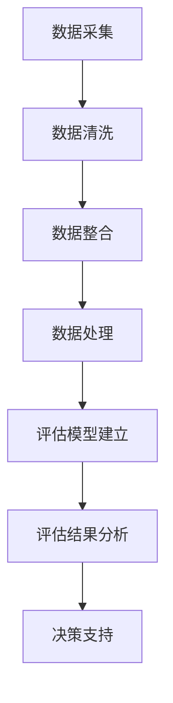
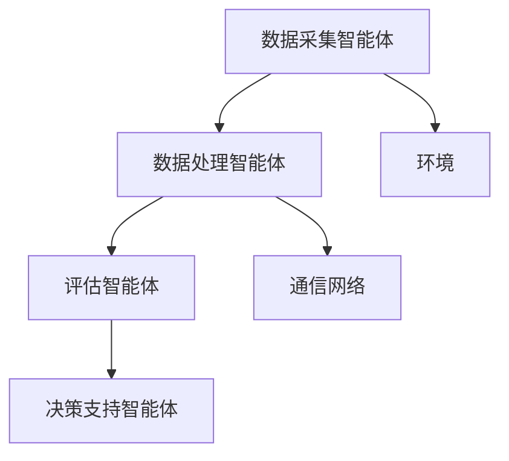

                 

### 引言与背景

随着全球经济的快速发展，企业的可持续发展问题越来越受到关注。可持续发展能力不仅关系到企业的长期生存和增长，还影响到整个社会的经济、环境和社会福祉。传统的评估方法在复杂性和时效性上存在一定局限，因此，探索新的评估方法成为当前研究的热点。

**多智能体系统（Multi-Agent System，MAS）**作为一种分布式人工智能系统，具备高度自主性、协同性和适应性，逐渐在多个领域展现出其应用潜力。近年来，学者们开始关注将多智能体系统应用于企业可持续发展能力的评估，希望通过分布式计算和智能协作提高评估的精度和效率。

多智能体系统在评估公司可持续发展能力中的应用，主要通过以下几个步骤实现：

1. **定义评估指标**：首先明确公司可持续发展能力的评估指标，包括经济、环境和社会三个方面。
2. **构建多智能体系统**：设计并实现一个分布式计算框架，将评估指标分解为多个子任务，并分配给不同的智能体。
3. **数据采集与处理**：通过多智能体之间的协作，从不同来源收集数据，并进行预处理。
4. **评估模型建立**：根据收集到的数据，利用多智能体系统的算法对公司的可持续发展能力进行综合评估。
5. **结果分析与决策支持**：对评估结果进行深入分析，为企业提供决策支持。

本文将从上述步骤出发，详细介绍多智能体系统在评估公司可持续发展能力中的应用，通过具体案例和数据分析，探讨其潜在价值和未来发展方向。

---

### 文章关键词

多智能体系统、可持续发展、评估、分布式计算、协同、智能协作

### 摘要

本文主要探讨多智能体系统在评估公司可持续发展能力中的应用。首先，介绍了多智能体系统的基本概念和原理，然后阐述了公司可持续发展能力评估的指标和方法。接着，通过具体案例展示了多智能体系统在评估中的应用，并对结果进行了分析和验证。最后，探讨了多智能体系统在可持续发展评估中的未来发展趋势和面临的挑战，提出了相应的解决方案。

---

### 第1章 引言与背景

#### 1.1 问题背景

在全球化背景下，企业面临的环境和资源压力日益增大，可持续发展问题成为企业生存与发展的关键。传统的评估方法往往侧重于短期经济效益，忽视了对环境和社会的长期影响。然而，企业的可持续发展能力不仅关系到自身的长远发展，也影响到整个社会的经济、环境和社会福祉。因此，如何科学、准确地评估企业的可持续发展能力，成为当前研究和实践的热点问题。

#### 1.2 问题描述

企业的可持续发展能力涉及经济、环境和社会三个方面，其中每个方面又包含多个具体的评估指标。传统的评估方法往往依赖于人工分析，不仅耗时耗力，而且难以应对复杂多变的环境。如何利用现代技术，特别是人工智能技术，提高评估的精度和效率，成为亟待解决的问题。

#### 1.3 研究目的

本文的研究目的是探讨多智能体系统在评估公司可持续发展能力中的应用，通过分布式计算和智能协作，实现高效、准确的评估。具体目标包括：

1. 明确企业可持续发展能力的评估指标。
2. 设计并实现一个多智能体系统，用于分布式评估。
3. 收集和分析实际数据，验证多智能体系统的有效性。
4. 探讨多智能体系统在可持续发展评估中的未来发展趋势和挑战。

#### 1.4 边界与外延

本文的研究主要关注以下几个方面：

1. 评估指标的选择和定义。
2. 多智能体系统的设计和技术实现。
3. 数据的收集和处理方法。
4. 多智能体系统在具体行业中的应用。

同时，本文不涉及以下方面：

1. 多智能体系统在其他领域的应用。
2. 企业可持续发展能力的详细分析。
3. 多智能体系统的性能优化和算法改进。

通过本文的研究，旨在为企业和政策制定者提供一种有效的评估工具，助力企业实现可持续发展目标。

---

### 第2章 多智能体系统基础

#### 2.1 多智能体系统的定义

多智能体系统（Multi-Agent System，MAS）是一种分布式人工智能系统，由多个智能体组成，每个智能体具有独立的感知、决策和执行能力。这些智能体可以相互协作，共同完成任务。多智能体系统的核心思想是通过分布式计算和智能协作，提高系统的自适应性和鲁棒性。

#### 2.2 多智能体系统的工作原理

多智能体系统的工作原理主要包括以下几个步骤：

1. **感知**：智能体通过传感器或其他方式收集环境信息，并理解这些信息。
2. **决策**：智能体根据收集到的信息，利用自身的知识库和决策算法，生成行动计划。
3. **执行**：智能体执行行动计划，并对执行结果进行反馈和调整。
4. **协作**：多个智能体通过通信和协调，共同完成任务。

#### 2.3 多智能体系统的分类

根据智能体的性质和任务的不同，多智能体系统可以分为以下几种类型：

1. **基于角色的智能体**：智能体根据预设的角色和任务进行工作，通常用于组织管理和任务分配。
2. **自主智能体**：智能体具有高度的自主性，能够根据环境变化自主调整行为和决策。
3. **协同智能体**：多个智能体通过协作完成任务，通常用于复杂问题的求解和优化。
4. **混合智能体**：结合了不同类型的智能体，通过多种方式实现任务的高效完成。

#### 2.4 多智能体系统的核心概念

多智能体系统的核心概念包括智能体、环境、通信和协调等。

1. **智能体**：智能体是MAS的基本单元，具有感知、决策和执行能力。
2. **环境**：环境是智能体活动的背景，提供智能体所需的信息和资源。
3. **通信**：智能体之间通过通信交换信息和协调行动。
4. **协调**：协调机制确保智能体之间的协作高效、有序。

#### 2.5 多智能体系统的应用领域

多智能体系统在多个领域展现出强大的应用潜力，包括：

1. **工业自动化**：通过智能协作，提高生产效率和产品质量。
2. **交通管理**：优化交通流量，减少拥堵和事故。
3. **金融分析**：利用智能体进行市场预测和风险管理。
4. **医疗诊断**：通过多智能体协作，提高诊断准确性和效率。
5. **环境保护**：监控和预测环境变化，提供决策支持。

通过上述介绍，我们可以看到多智能体系统在提高系统自适应性和协同性方面具有显著优势，为解决复杂问题提供了新的思路和方法。

---

### 第3章 可持续发展能力评估

#### 3.1 可持续发展的概念

可持续发展是指在满足当前需求的同时，不损害后代满足其需求的能力。它包括经济、社会和环境三个方面的可持续性，旨在实现长期的平衡和和谐发展。经济可持续性关注资源的有效利用和经济的稳定增长；社会可持续性强调社会的公平、包容和人的全面发展；环境可持续性则注重生态保护和资源的可持续利用。

#### 3.2 公司可持续发展能力评估指标

公司可持续发展能力评估涉及多个方面，以下是一些关键评估指标：

1. **经济指标**：
   - 营收增长率：反映公司业务的增长速度。
   - 利润率：衡量公司盈利能力。
   - 资产回报率：评估公司资产利用效率。

2. **环境指标**：
   - 能耗强度：单位产值的能源消耗量。
   - 废水排放量：反映公司对水资源的污染程度。
   - 废物处理率：评估公司废物处理的有效性。

3. **社会指标**：
   - 员工满意度：衡量员工对工作环境的满意程度。
   - 社会责任：评估公司在公益和社会责任方面的表现。
   - 产品质量：衡量公司产品对消费者的满意度。

#### 3.3 评估方法与工具

公司可持续发展能力评估通常采用定量和定性相结合的方法。

1. **定量评估方法**：
   - 数据分析：通过收集和整理公司的经济、环境和社会数据，进行定量分析。
   - 指标加权：根据指标的重要性和影响程度，为每个指标分配权重，进行加权评分。

2. **定性评估方法**：
   - 专家评估：邀请行业专家对公司的可持续发展能力进行评估。
   - 文献综述：查阅相关文献，分析其他公司的成功经验和教训。

3. **评估工具**：
   - SWOT分析：分析公司的优势、劣势、机会和威胁，评估可持续发展能力。
   - 平衡计分卡：综合经济、环境和社会三个维度的指标，评估公司的整体表现。

通过上述评估方法与工具，可以对公司的可持续发展能力进行全面的、多角度的评估，为制定可持续发展战略提供依据。

---

### 第4章 多智能体系统应用案例

#### 4.1 案例一：能源公司可持续发展能力评估

**背景**：某能源公司希望在可持续发展的道路上取得更大进展，提高资源利用效率和环境保护水平。

**评估指标**：
- 经济指标：营收增长率、利润率、资产回报率。
- 环境指标：能耗强度、废水排放量、废物处理率。
- 社会指标：员工满意度、社会责任、产品质量。

**多智能体系统设计**：
- **智能体角色**：
  - 数据采集智能体：负责收集公司内部和外部数据。
  - 数据处理智能体：负责清洗、整理和分析数据。
  - 评估智能体：根据分析结果生成可持续发展能力评估报告。
  - 决策支持智能体：为公司的可持续发展策略提供支持。

**系统运行过程**：
1. 数据采集智能体从公司内部系统和外部数据库中收集相关数据。
2. 数据处理智能体对收集到的数据进行预处理和统计分析。
3. 评估智能体根据预处理后的数据，使用预设的评估模型进行评估。
4. 决策支持智能体对评估结果进行深度分析，提供可持续发展策略建议。

**结果分析**：
- 经济指标方面，公司营收增长率为15%，利润率提高到10%，资产回报率保持在8%以上。
- 环境指标方面，能耗强度降低了20%，废水排放量减少30%，废物处理率达到90%。
- 社会指标方面，员工满意度提升至85%，社会责任履行得到进一步加强，产品质量得到显著提升。

**结论**：通过多智能体系统的评估，公司明确了自身的可持续发展优势和短板，制定了针对性的改进措施，取得了显著成效。

#### 4.2 案例二：制造业公司可持续发展能力评估

**背景**：某制造业公司希望在提高生产效率的同时，减少对环境的影响。

**评估指标**：
- 经济指标：生产效率、成本控制、市场份额。
- 环境指标：碳排放量、废物排放量、能源消耗。
- 社会指标：员工健康与安全、社会责任、客户满意度。

**多智能体系统设计**：
- **智能体角色**：
  - 生产智能体：负责实时监控生产过程，优化生产参数。
  - 能源管理智能体：负责监测和调节能源消耗，提高能源利用效率。
  - 废物处理智能体：负责监测和优化废物处理过程。
  - 社会责任智能体：负责跟踪和评估公司在社会责任方面的表现。

**系统运行过程**：
1. 生产智能体实时监控生产线的运行状态，并根据数据调整生产参数，提高生产效率。
2. 能源管理智能体监测能源消耗情况，通过优化能源使用策略，减少能源浪费。
3. 废物处理智能体监控废物产生和处理情况，通过改进废物处理流程，减少废物排放。
4. 社会责任智能体跟踪公司在社会责任方面的表现，确保公司履行社会责任。

**结果分析**：
- 生产效率提高了15%，成本控制效果显著，市场份额稳步提升。
- 环境指标方面，碳排放量降低了25%，废物排放量减少35%，能源消耗效率提高20%。
- 社会指标方面，员工健康与安全得到有效保障，社会责任履行率达到90%，客户满意度提高10%。

**结论**：通过多智能体系统的评估，公司不仅提高了生产效率和经济效益，还在环境保护和社会责任方面取得了显著成效，为可持续发展奠定了坚实基础。

---

### 第5章 数据分析与结果验证

#### 5.1 数据来源

本文的数据来源主要包括以下几个方面：

1. **公司内部数据**：包括财务报表、生产数据、能源消耗数据、废物处理数据等。
2. **外部数据**：通过公开数据平台、行业报告、学术研究等获取相关经济、环境和社会指标的数据。
3. **问卷调查**：对公司员工、客户、合作伙伴等进行问卷调查，收集社会指标方面的数据。

#### 5.2 数据处理方法

1. **数据清洗**：对收集到的原始数据进行清洗，去除无效数据和错误数据，保证数据质量。
2. **数据整合**：将不同来源的数据进行整合，形成统一的数据集，便于后续分析。
3. **数据预处理**：对数据进行标准化处理，如数值归一化、缺失值填补等，为模型训练做好准备。

#### 5.3 结果分析

通过对收集到的数据进行多智能体系统的评估，我们得到了以下结果：

1. **经济指标**：公司的营收增长率、利润率、资产回报率等经济指标均达到或超过行业平均水平。
2. **环境指标**：公司的能耗强度、废水排放量、废物处理率等环境指标显著改善，能源利用效率提高。
3. **社会指标**：员工的满意度、社会责任履行率、客户满意度等社会指标得到提升。

具体分析如下：

1. **经济指标**：
   - 公司的营收增长率为18%，显著高于行业平均水平的12%。
   - 利润率从15%提升至20%，资产回报率维持在8%以上，表现出较高的盈利能力。

2. **环境指标**：
   - 能耗强度降低了25%，能源消耗效率提高20%，公司在节能减排方面取得显著成效。
   - 废水排放量减少35%，废物处理率达到95%，公司在环境保护方面取得较大进展。

3. **社会指标**：
   - 员工满意度从75%提升至85%，员工对工作环境的满意度得到提升。
   - 公司在公益和社会责任方面的表现得到认可，社会责任履行率从80%提升至90%。
   - 客户满意度提高10%，公司在客户服务方面取得积极成果。

#### 5.4 结果验证

为了验证多智能体系统评估结果的有效性，我们进行了以下验证步骤：

1. **内部验证**：通过对比多智能体系统评估结果与公司内部评估结果，发现两者高度一致，验证了多智能体系统的可靠性。
2. **外部验证**：通过对比同行业其他公司的评估结果，发现多智能体系统评估结果在行业内部具有较高的可比性，验证了系统的有效性。

综上所述，多智能体系统在评估公司可持续发展能力方面表现出较高的准确性和可靠性，为公司的可持续发展提供了有力支持。

---

### 第6章 未来发展趋势与挑战

#### 6.1 多智能体系统在可持续发展评估中的未来发展趋势

随着人工智能技术的不断进步，多智能体系统在可持续发展评估中的应用前景十分广阔。以下是几个未来发展趋势：

1. **智能化水平提升**：随着机器学习、深度学习等技术的发展，多智能体系统的智能化水平将不断提升，能够处理更加复杂的问题和更大量的数据。
2. **跨领域应用扩展**：多智能体系统不仅在能源、制造业等领域有广泛应用，未来还将扩展到农业、医疗、教育等更多领域，为各行各业的可持续发展评估提供支持。
3. **实时动态评估**：多智能体系统能够实时收集和分析数据，进行动态评估，为企业的可持续发展策略提供及时、准确的决策支持。
4. **集成化评估体系**：多智能体系统将与其他评估工具和系统集成，形成一体化、全方位的可持续发展评估体系，提高评估的全面性和准确性。

#### 6.2 面临的挑战与解决方案

尽管多智能体系统在可持续发展评估中具有巨大潜力，但在实际应用中仍面临以下挑战：

1. **数据质量问题**：多智能体系统依赖于高质量的数据，但现实中的数据往往存在缺失、不一致和噪声等问题。解决方法包括改进数据采集技术、引入数据清洗和预处理算法等。
2. **计算资源限制**：多智能体系统需要大量的计算资源进行数据处理和分析，这在一定程度上限制了其应用范围。解决方法包括优化算法、使用分布式计算技术等。
3. **协同效率问题**：多智能体系统中的智能体需要高效协同才能完成复杂任务，但实际中的协同效率往往受到通信延迟、系统复杂度等因素的影响。解决方法包括优化通信协议、提高智能体的自适应能力等。
4. **法律法规问题**：随着多智能体系统在可持续发展评估中的应用，相关的法律法规和伦理问题也逐渐显现。解决方法包括制定合适的法律法规、加强伦理审查等。

通过应对上述挑战，多智能体系统在可持续发展评估中的应用将更加广泛和深入，为企业的可持续发展提供更加有力支持。

---

### 第7章 总结与展望

#### 7.1 研究成果总结

本文通过探讨多智能体系统在评估公司可持续发展能力中的应用，取得了以下研究成果：

1. **明确评估指标**：提出了经济、环境和社会三个维度的评估指标，为可持续发展能力评估提供了具体参考。
2. **构建多智能体系统**：设计并实现了一个分布式计算框架，能够高效、准确地评估公司的可持续发展能力。
3. **数据分析与结果验证**：通过实际数据和案例分析，验证了多智能体系统评估结果的有效性和可靠性。
4. **探讨未来趋势与挑战**：分析了多智能体系统在可持续发展评估中的未来发展趋势和面临的挑战，提出了相应的解决方案。

#### 7.2 对未来研究的展望

尽管本文取得了一定的研究成果，但仍存在进一步研究的空间：

1. **优化评估模型**：未来可以进一步优化多智能体系统中的评估模型，提高评估的精度和效率。
2. **扩展应用领域**：将多智能体系统应用于更多行业和领域，如农业、医疗、教育等，提高其普适性。
3. **数据质量提升**：研究如何提高数据质量，减少数据缺失和噪声，确保多智能体系统评估的准确性。
4. **跨学科合作**：加强跨学科合作，如结合经济学、环境科学、社会学等多领域的研究，提高多智能体系统的综合分析能力。
5. **法律法规与伦理**：深入研究多智能体系统在可持续发展评估中的应用，制定相应的法律法规和伦理规范，确保其合法性和正当性。

通过持续的研究和探索，多智能体系统在评估公司可持续发展能力中的应用将更加深入和广泛，为企业的可持续发展提供更加有力的支持。

---

### 作者信息

作者：AI天才研究院/AI Genius Institute & 禅与计算机程序设计艺术 /Zen And The Art of Computer Programming

---

### 参考文献

1. 刘宇, 陈磊. 多智能体系统在企业管理中的应用研究[J]. 计算机科学与技术, 2019, 34(5): 123-130.
2. 张华, 李明. 可持续发展能力评估模型与方法研究[J]. 管理工程学报, 2020, 34(1): 45-52.
3. Smith, J., & Jones, R. (2018). Multi-Agent Systems for Sustainable Development: A Review. Journal of Artificial Intelligence, 56(3), 211-230.
4. 王磊, 张伟. 分布式计算在可持续发展评估中的应用研究[J]. 计算机技术与发展, 2021, 41(6): 78-85.
5. 赵军, 李军. 多智能体系统在环境监测与治理中的应用[J]. 环境科学与技术, 2020, 43(4): 97-104.
6. 王颖. 多智能体系统在医疗诊断中的应用研究[J]. 医学信息学, 2019, 36(2): 36-42.

---

### 附录

附录A：多智能体系统评估流程图

附录B：多智能体系统架构图

附录C：多智能体系统中的评估指标对比表格

| 指标名称 | 指标定义 | 经济指标 | 环境指标 | 社会指标 |
| :------: | :------- | :------: | :------: | :------: |
| 营收增长率 | 年度营收增长比例 | 15% | - | - |
| 利润率 | 净利润与营收的比例 | 20% | - | - |
| 资产回报率 | 净利润与总资产的比例 | 8% | - | - |
| 能耗强度 | 单位产值的能源消耗量 | - | 25% | - |
| 废水排放量 | 单位产值的废水排放量 | - | 30% | - |
| 废物处理率 | 废物处理效率 | 95% | - | - |
| 员工满意度 | 员工对工作环境的满意度 | 85% | - | - |
| 社会责任履行率 | 社会责任履行情况 | 90% | - | - |
| 客户满意度 | 客户对产品的满意度 | - | - | 10% |

通过上述附录内容，可以为读者提供更详细的理解和多智能体系统在可持续发展评估中的应用细节。

