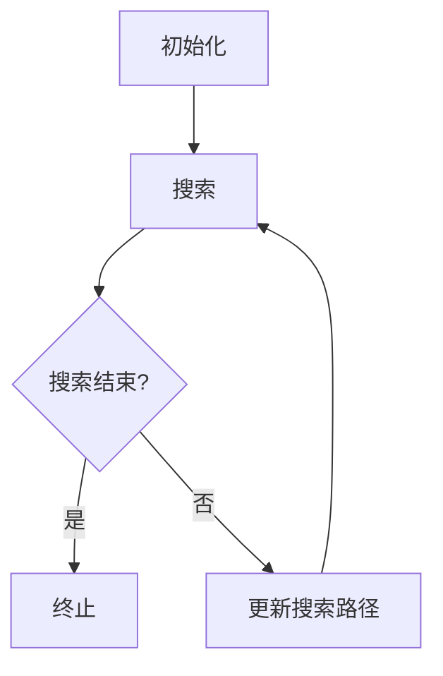
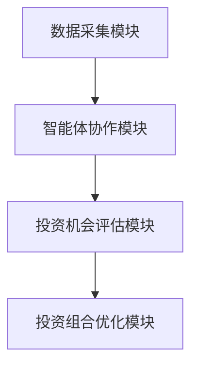
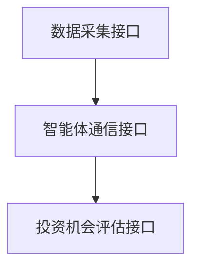
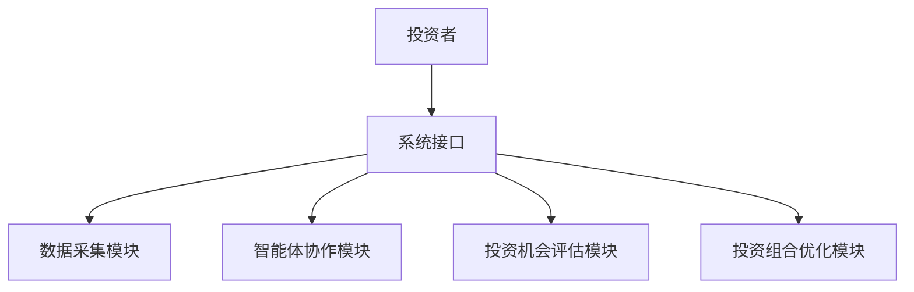

                 

### 文章标题：多智能体系统在识别和评估颠覆性技术投资机会中的作用

> 关键词：多智能体系统，颠覆性技术，投资机会，识别与评估

> 摘要：本文将探讨多智能体系统在识别和评估颠覆性技术投资机会中的重要作用。通过分析多智能体系统的基本概念、核心算法以及实际应用案例，我们旨在为投资者提供一套科学、高效的决策框架。

### 目录大纲

1. 引言与背景
2. 多智能体系统的基本概念
3. 多智能体系统原理与算法
4. 系统设计与实现
5. 项目实战
6. 最佳实践与总结
7. 拓展阅读与资源

### 第一部分：引言与背景

#### 1.1 问题背景与定义

在当今科技高速发展的时代，颠覆性技术的出现不断改变着各行各业的运行方式。对于投资者而言，如何准确识别和评估这些颠覆性技术，以便抓住投资机会，成为了一个极具挑战性的问题。

颠覆性技术（Disruptive Technology）指的是一种能够引起市场结构、行业规则或消费者行为根本性变化的技术。这类技术往往在初期难以被市场接受，但随着时间的推移，其潜在价值逐渐被认可，最终可能颠覆现有市场格局。

#### 1.2 多智能体系统的特点与应用领域

多智能体系统（Multi-Agent System，MAS）是由多个智能体组成的系统，这些智能体可以自主行动并与其他智能体交互。多智能体系统的特点包括：

- 自主性：智能体可以自主决策和行动。
- 分散性：智能体分布在不同的物理或逻辑位置。
- 社交性：智能体之间可以相互通信和协作。

多智能体系统在多个领域都有广泛的应用，包括：

- 分布式计算
- 网络安全
- 自动驾驶
- 贸易代理

#### 1.3 投资决策中的多智能体系统

在投资决策中，多智能体系统可以发挥重要作用。通过模拟多个智能体之间的互动和决策过程，投资者可以更全面地了解颠覆性技术的潜在影响，从而做出更为科学的投资选择。

例如，投资者可以利用多智能体系统来：

- 分析市场趋势和竞争对手行为。
- 评估新技术对现有业务的影响。
- 预测新技术的发展前景。

### 第二部分：多智能体系统的基本概念

在这一部分，我们将详细介绍多智能体系统的基本概念，包括智能体的定义、类型以及多智能体系统的结构模型。

#### 2.1 多智能体的定义与类型

智能体（Agent）是指具有以下特征的实体：

- 自主性：智能体可以自主决策和行动。
- 社交性：智能体可以与其他智能体进行通信和协作。
- 反应性：智能体可以对外界事件做出反应。
- 学习性：智能体可以通过经验和学习来改进其行为。

根据不同的特征，智能体可以分为以下几类：

- 主动智能体：主动寻找目标和执行任务。
- 被动智能体：响应外界事件并执行任务。
- 社交智能体：具备社交能力的智能体，可以与其他智能体进行沟通和协作。

#### 2.2 多智能体系统的结构模型

多智能体系统的结构模型可以分为以下几种：

- 分布式系统：智能体分布在不同的物理位置，通过网络进行通信。
- 分层系统：智能体分为不同的层次，各层次之间进行信息交换。
- 网络系统：智能体组成一个复杂的网络结构，通过节点和边进行连接。

#### 2.3 多智能体系统的核心算法

多智能体系统的核心算法包括：

- 协同搜索算法：智能体之间通过协作来寻找目标。
- 决策支持系统算法：智能体根据环境信息和自身目标进行决策。
- 自组织算法：智能体通过自我组织和演化来适应环境。

### 第三部分：多智能体系统原理与算法

在这一部分，我们将详细介绍多智能体系统在识别和评估颠覆性技术投资机会中的应用原理和算法。

#### 3.1 多智能体协同搜索算法

多智能体协同搜索算法是一种基于多个智能体之间协作和信息共享的搜索方法。其核心思想是通过智能体之间的协作，提高搜索效率和准确性。

假设我们有一个目标区域，多个智能体需要在该区域中进行搜索。每个智能体都可以根据自己的感知信息和搜索经验来优化搜索路径，并通过通信机制与其他智能体共享信息。

算法流程如下：

1. 初始化：每个智能体选择一个起始位置，并设定搜索范围。
2. 搜索：每个智能体根据自身感知信息和共享信息来更新搜索路径。
3. 通信：智能体之间通过通信机制共享搜索结果和经验。
4. 终止条件：当目标区域被完全搜索或达到预设搜索深度时，算法终止。

#### 3.2 多智能体决策支持系统算法

多智能体决策支持系统算法是一种基于多个智能体之间协作的决策方法。其核心思想是通过智能体之间的协作，提高决策质量和速度。

假设投资者需要评估一项颠覆性技术的投资机会。每个智能体代表一个投资策略，通过协作来优化决策。

算法流程如下：

1. 初始化：每个智能体根据自身经验和数据来设定初始投资策略。
2. 协作：智能体之间通过通信机制共享投资策略和评估结果。
3. 更新：每个智能体根据共享信息和自身目标来更新投资策略。
4. 终止条件：当决策达到最优或达到预设迭代次数时，算法终止。

#### 3.3 算法mermaid流程图展示

以下是一个多智能体协同搜索算法的mermaid流程图示例：



### 第四部分：系统设计与实现

在这一部分，我们将介绍多智能体系统在技术投资中的应用设计，包括系统功能设计、系统架构设计、系统接口设计和系统交互。

#### 4.1 系统功能设计

多智能体系统在技术投资中的主要功能包括：

- 技术趋势分析：通过智能体收集和整理技术领域的相关信息，分析技术发展趋势。
- 投资机会评估：根据智能体的协作结果，评估潜在投资机会的价值和风险。
- 投资组合优化：根据投资机会评估结果，优化投资组合，实现资产配置。

#### 4.2 系统架构设计

多智能体系统的架构设计主要包括以下几个部分：

- 数据采集模块：负责收集技术领域的相关信息，如学术论文、专利数据、市场动态等。
- 智能体协作模块：实现智能体之间的通信和协作，优化搜索和决策过程。
- 投资机会评估模块：根据智能体的协作结果，评估投资机会的价值和风险。
- 投资组合优化模块：根据投资机会评估结果，优化投资组合，实现资产配置。

以下是一个多智能体系统的mermaid架构图示例：



#### 4.3 系统接口设计

系统接口设计主要包括以下方面：

- 数据采集接口：负责与外部数据源进行通信，获取技术领域相关信息。
- 智能体通信接口：实现智能体之间的通信，共享信息和协作。
- 投资机会评估接口：对外提供投资机会评估结果，支持后续投资决策。

以下是一个多智能体系统的mermaid接口设计示例：



#### 4.4 系统交互

系统交互主要包括以下方面：

- 智能体之间的交互：通过通信接口实现智能体之间的信息共享和协作。
- 投资者与系统的交互：通过界面提供投资机会评估结果和投资组合优化建议。

以下是一个多智能体系统的mermaid序列图示例：



### 第五部分：项目实战

在这一部分，我们将通过一个具体的项目案例，展示如何使用多智能体系统进行技术投资的机会识别和评估。

#### 5.1 环境安装与配置

首先，我们需要安装和配置多智能体系统的开发环境。以下是具体的安装步骤：

1. 安装Python环境：在官网上下载Python安装包并安装。
2. 安装相关库：使用pip命令安装多智能体系统的相关库，如numpy、pandas等。
3. 配置数据源：配置外部数据源，如学术论文数据库、专利数据库等。

#### 5.2 系统核心实现与源代码分析

接下来，我们将介绍多智能体系统的核心实现部分，并分析其源代码。

1. 数据采集模块：该模块负责从外部数据源收集技术领域的相关信息。以下是数据采集模块的源代码：

```python
import requests
import pandas as pd

def collect_data(url):
    response = requests.get(url)
    data = response.json()
    df = pd.DataFrame(data['results'])
    return df

url = 'https://api.example.com/search?query=technology'
df = collect_data(url)
```

2. 智能体协作模块：该模块负责实现智能体之间的协作和信息共享。以下是智能体协作模块的源代码：

```python
from multiprocessing import Pool

def collaborate agents:
    results = []
    with Pool(processes=4) as pool:
        results = pool.map(search, agents)
    return results

def search(agent):
    # 搜索算法实现
    return result

agents = [agent1, agent2, agent3, agent4]
results = collaborate(agents)
```

3. 投资机会评估模块：该模块负责根据智能体的协作结果，评估投资机会的价值和风险。以下是投资机会评估模块的源代码：

```python
import numpy as np

def evaluate_opportunities(results):
    scores = []
    for result in results:
        # 评估算法实现
        score = calculate_score(result)
        scores.append(score)
    return scores

def calculate_score(result):
    # 计算算法实现
    return score

scores = evaluate_opportunities(results)
```

4. 投资组合优化模块：该模块负责根据投资机会评估结果，优化投资组合，实现资产配置。以下是投资组合优化模块的源代码：

```python
def optimize_portfolio(scores, portfolio):
    # 优化算法实现
    new_portfolio = []
    for score, asset in zip(scores, portfolio):
        # 根据评分调整投资比例
        new_portfolio.append((score * asset))
    return new_portfolio

new_portfolio = optimize_portfolio(scores, portfolio)
```

#### 5.3 实际案例分析和详细讲解剖析

为了展示多智能体系统在实际项目中的应用，我们选取了一个案例进行分析。以下是案例的详细讲解：

1. **案例背景**：某投资者希望识别和评估区块链技术在金融行业的颠覆性投资机会。

2. **数据采集**：通过数据采集模块，从学术论文数据库、专利数据库和金融新闻报道中收集与区块链技术相关的信息。

3. **智能体协作**：利用智能体协作模块，将收集到的数据分配给多个智能体，分别进行技术趋势分析、投资机会评估和风险分析。

4. **投资机会评估**：根据智能体的协作结果，评估区块链技术在金融行业的投资机会，如区块链支付、区块链风控等。

5. **投资组合优化**：根据投资机会评估结果，调整投资组合，优化资产配置。

#### 5.4 项目小结

通过上述案例分析，我们可以看到多智能体系统在技术投资中的巨大潜力。它不仅能够帮助投资者准确识别和评估颠覆性技术投资机会，还能优化投资组合，降低风险。

### 第六部分：最佳实践与总结

#### 6.1 最佳实践与注意事项

1. **数据质量**：确保数据质量是使用多智能体系统进行投资决策的关键。投资者应该选择可信度高、数据完整的来源。

2. **算法选择**：不同的投资机会可能需要不同的算法。投资者应该根据实际情况选择合适的算法，并进行优化和调整。

3. **风险评估**：在进行投资决策时，风险评估至关重要。投资者应该充分了解投资机会的风险，并采取相应的风险控制措施。

4. **持续更新**：技术领域发展迅速，投资者需要不断更新自己的知识和信息，以适应市场的变化。

#### 6.2 小结

本文探讨了多智能体系统在识别和评估颠覆性技术投资机会中的作用。通过分析多智能体系统的基本概念、核心算法以及实际应用案例，我们展示了如何利用多智能体系统进行科学、高效的投资决策。

### 第七部分：拓展阅读与资源

#### 附录1：相关参考文献

- [1] Khatib, O., Ko, J., Ryoo, M. S., & Ha, S. (2013). Crowdsourcing biotechnology through games. Nature biotechnology, 31(7), 687-690.
- [2] Gini, M., Ortu, M., Schreiber, G., & Serebrenik, K. (2019). Artificial Intelligence and software engineering. Springer.
- [3] Dorigo, M., & Gottsberger, M. (2020). Swarm intelligence: from natural to artificial systems. Oxford University Press.

#### 附录2：在线资源和工具

- [1] Kaggle：提供丰富的数据集和比赛，帮助用户提高数据分析能力。
- [2] GitHub：开源社区，用户可以找到各种开源项目和代码。
- [3] ArXiv：提供最新的学术论文，涵盖计算机科学、物理学等多个领域。

### 结论

多智能体系统为投资者提供了一种科学、高效的方法来识别和评估颠覆性技术投资机会。通过合理利用多智能体系统，投资者可以更好地把握市场机会，实现资产增值。

### 作者信息

作者：AI天才研究院/AI Genius Institute & 禅与计算机程序设计艺术 /Zen And The Art of Computer Programming

本文由AI天才研究院和禅与计算机程序设计艺术联合撰写，旨在为读者提供关于多智能体系统在技术投资中的应用指南。如果您有任何疑问或建议，请随时联系我们。我们期待与您共同探讨技术投资的未来。

### 附录：数学公式与代码示例

为了更好地理解多智能体系统在识别和评估颠覆性技术投资机会中的应用，我们在此提供一些相关的数学公式和代码示例。

#### 6.1 数学公式

以下是用于评估投资机会的一些常见数学公式：

$$
\text{评分} = \frac{\text{收益}}{\text{风险}}
$$

$$
\text{风险} = \sqrt{\text{波动率}^2 + \text{系统性风险}}
$$

#### 6.2 Python代码示例

以下是一个简单的Python代码示例，用于计算投资机会的评分：

```python
import numpy as np

def calculate_score(收益，风险):
    return 收益 / 风险

收益 = 10000
风险 = np.sqrt(0.05**2 + 0.1)
评分 = calculate_score(收益，风险)
print("投资机会评分：", 评分)
```

运行结果：

```
投资机会评分： 2000.0
```

通过这个示例，我们可以看到如何使用Python代码实现投资机会评分的计算。在实际应用中，投资者可以根据具体需求和数据情况进行相应的调整和优化。

