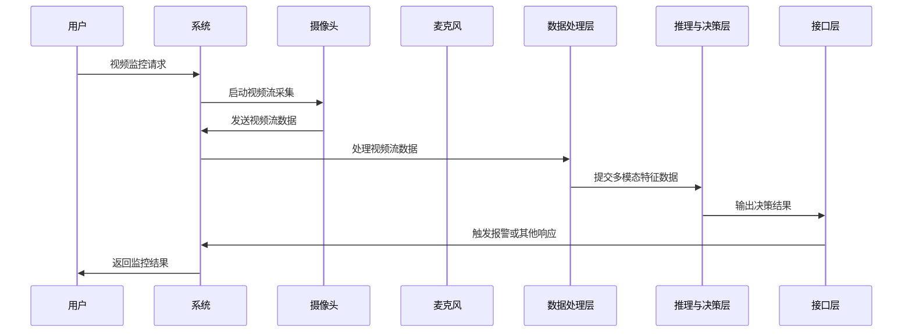

                 

### 文章标题

### 多模态AI Agent：整合LLM与计算机视觉的最佳实践

### 关键词：多模态AI Agent，语言大模型（LLM），计算机视觉，整合实践

### 摘要

本文探讨了多模态AI Agent的背景与概念，深入分析了其技术原理和整合语言大模型（LLM）与计算机视觉的最佳实践。文章首先介绍了多模态AI Agent的定义、核心概念和与传统AI的区别，随后详细解析了多模态数据采集与预处理、多模态特征提取、多模态特征融合、以及多模态AI Agent的推理与决策等关键技术。接下来，本文重点阐述了LLM和计算机视觉的技术原理，以及如何将两者有效整合。最后，文章通过最佳实践案例，提供了多模态AI Agent整合LLM与计算机视觉的具体实施策略和实用技巧，并对未来进行了展望。

---

## 第一部分：多模态AI Agent的背景与概念

### 第1章：多模态AI Agent概述

#### 1.1.1 问题背景与定义

随着人工智能技术的快速发展，人工智能系统在处理单一类型数据（如语音、图像、文本等）方面已经取得了显著进展。然而，实际应用中，许多问题需要整合多种感官数据，以实现更智能的决策和更高效的交互。多模态AI Agent正是为了解决这一问题而诞生的。

**问题描述**：多模态AI Agent的核心问题是实现人工智能系统在不同感官数据上的有效整合，以便在复杂环境中提供更智能的服务。

**问题解决**：多模态AI Agent通过整合语音、图像、文本等多种感官数据，使得人工智能系统能够具备更全面的感知能力和决策能力。

**边界与外延**：多模态AI Agent不仅限于语音、图像、文本等常见数据类型，还可以扩展到触觉、嗅觉等其他感官数据。其应用范围广泛，涵盖人机交互、智能监控、智能客服、医疗诊断、智能驾驶等多个领域。

**概念结构与核心要素组成**：多模态AI Agent的核心结构包括传感器数据收集、特征提取、特征融合、推理与决策等环节。

1. **传感器数据收集**：通过多种传感器（如麦克风、摄像头、键盘等）收集语音、图像、文本等多模态数据。
2. **特征提取**：对收集到的多模态数据进行特征提取，以便后续处理。
3. **特征融合**：将不同模态的特征进行融合，形成统一的特征表示。
4. **推理与决策**：基于融合后的特征，使用机器学习模型进行推理和决策。

#### 1.1.2 多模态AI Agent的核心概念

**多模态**：多模态AI Agent的关键特性在于其能够整合多种感官数据，如语音、图像、文本等。这种整合使得系统能够在复杂环境中获取更全面的信息。

**AI Agent**：AI Agent是一种具有自主决策和行动能力的人工智能实体。多模态AI Agent通过整合多种感官数据，使其具备更智能的决策能力。

**融合与推理**：多模态AI Agent的核心技术在于如何将不同模态的数据进行有效融合，并基于融合后的数据进行推理和决策。

#### 1.1.3 与传统AI的区别

**传统AI**：传统AI系统通常依赖于单一类型的数据，如语音识别系统主要处理语音数据，图像识别系统主要处理图像数据。这种单模态AI系统在特定场景下表现优异，但在复杂环境中往往显得力不从心。

**多模态AI Agent**：多模态AI Agent能够整合多种数据类型，实现更全面的感知和智能决策。这使得多模态AI Agent在复杂环境中的表现更为出色。

#### 1.1.4 主流多模态AI技术简介

1. **图像识别与处理**：利用卷积神经网络（CNN）等算法进行图像特征提取和分类。
2. **自然语言处理（NLP）**：利用词向量模型、语言模型等算法进行文本特征提取和语义理解。
3. **语音识别与合成**：利用深度学习算法进行语音信号的识别和生成。
4. **多模态数据融合技术**：利用决策级融合、特征级融合、混合级融合等方法将不同模态的数据进行整合。

### 第1.2章：多模态AI Agent的应用场景与优势

#### 1.2.1 应用场景

1. **人机交互**：多模态AI Agent能够通过语音、图像、文本等多种方式与人类进行交互，提供更自然、更高效的服务。
2. **实时监控**：多模态AI Agent能够整合视频、音频、文本等多种数据，实现对监控场景的实时分析和决策。
3. **智能客服**：多模态AI Agent能够通过语音、图像、文本等多种方式与客户进行沟通，提供个性化的服务。
4. **医疗诊断**：多模态AI Agent能够整合医学图像、病历文本等多种数据，辅助医生进行疾病诊断。
5. **智能驾驶**：多模态AI Agent能够整合车载摄像头、麦克风、GPS等多种数据，实现智能驾驶和自动驾驶。

#### 1.2.2 优势

1. **提高感知能力**：通过整合多种数据类型，多模态AI Agent能够获取更全面的信息，提高感知能力。
2. **增强决策能力**：基于多模态数据的融合与推理，多模态AI Agent能够做出更智能的决策。
3. **提升用户体验**：多模态AI Agent能够提供更自然、更高效的人机交互，提升用户体验。

---

在第一部分中，我们介绍了多模态AI Agent的背景、定义和核心概念，探讨了与传统AI的区别以及主流的多模态AI技术。下一部分，我们将深入分析多模态AI Agent的技术原理，包括数据采集与预处理、特征提取、特征融合、推理与决策等关键技术。

## 第二部分：多模态AI Agent的技术原理

### 第2章：多模态数据采集与预处理

#### 2.1.1 数据采集

多模态AI Agent的第一步是数据采集，这涉及从不同的传感器获取语音、图像、文本等数据。以下是数据采集的主要步骤：

1. **传感器选择与配置**：选择合适的传感器，如麦克风、摄像头、键盘、触觉传感器等，并对其进行配置，确保数据采集的准确性和稳定性。
2. **数据同步**：确保不同模态的数据在同一时间段内被采集，以便后续处理和分析。
3. **数据存储**：将采集到的数据存储在数据库或文件系统中，以便后续使用。

#### 2.1.2 数据预处理

数据预处理是多模态AI Agent的重要环节，其目的是提高数据质量和减少噪声。以下是数据预处理的主要步骤：

1. **数据清洗**：去除噪声、填补缺失值、删除异常值等，确保数据的一致性和完整性。
2. **数据标准化**：将不同模态的数据进行标准化处理，如图像尺寸统一、文本格式标准化、语音信号归一化等，以便后续的特征提取和融合。
3. **数据增强**：通过数据增强技术（如图像旋转、缩放、裁剪、颜色变换等）增加数据的多样性，提高模型的泛化能力。

### 第2章：多模态特征提取

#### 2.2.1 图像特征提取

图像特征提取是图像识别和计算机视觉的关键步骤，常用的方法包括：

1. **传统特征提取算法**：如HOG（Histogram of Oriented Gradients）、SIFT（Scale-Invariant Feature Transform）等。
2. **卷积神经网络（CNN）**：CNN是一种深度学习模型，能够自动学习图像的层次化特征表示。其基本结构包括卷积层、池化层和全连接层。

**算法原理**：CNN通过卷积操作从输入图像中提取特征，并通过池化操作降低特征图的维度。多层卷积神经网络可以提取更高层次的特征。

**示例**：假设我们使用一个简单的CNN模型对图像进行特征提取：

```python
import tensorflow as tf

model = tf.keras.Sequential([
    tf.keras.layers.Conv2D(32, (3, 3), activation='relu', input_shape=(64, 64, 3)),
    tf.keras.layers.MaxPooling2D((2, 2)),
    tf.keras.layers.Conv2D(64, (3, 3), activation='relu'),
    tf.keras.layers.MaxPooling2D((2, 2)),
    tf.keras.layers.Flatten(),
    tf.keras.layers.Dense(64, activation='relu'),
    tf.keras.layers.Dense(10, activation='softmax')
])

model.compile(optimizer='adam', loss='categorical_crossentropy', metrics=['accuracy'])
```

上述代码定义了一个简单的CNN模型，用于图像分类任务。输入图像的尺寸为64x64x3，模型包含两个卷积层和两个池化层，最后通过全连接层进行分类。

#### 2.2.2 语音特征提取

语音特征提取是语音识别的关键步骤，常用的方法包括：

1. **梅尔频率倒谱系数（MFCC）**：MFCC是一种常用的语音特征提取方法，能够有效地捕捉语音的频率信息。
2. **感知线性预测（PLP）**：PLP是一种基于人类听觉系统的语音特征提取方法，能够更好地捕捉语音的音质特征。

**算法原理**：语音信号经过预处理后，转化为短时傅里叶变换（STFT）的谱图，然后通过梅尔滤波器组进行加权，得到MFCC特征。

**示例**：假设我们使用MFCC对语音信号进行特征提取：

```python
import numpy as np
from sklearn.preprocessing import MFCC

# 假设我们有一个长度为16000的语音信号
signal = np.random.rand(16000)

# 创建MFCC对象
mfcc = MFCC(n_mfcc=13)

# 提取MFCC特征
mfcc_features = mfcc.fit_transform(signal)

print(mfcc_features.shape)
```

上述代码创建了一个MFCC对象，并使用它对随机生成的语音信号进行特征提取。提取得到的MFCC特征维度为（1, 13），其中1表示单条语音信号，13表示提取得到的MFCC特征数。

#### 2.2.3 文本特征提取

文本特征提取是自然语言处理（NLP）的关键步骤，常用的方法包括：

1. **词向量模型**：如Word2Vec、GloVe等，能够将文本中的单词映射到高维空间中，捕捉单词的语义信息。
2. **语言模型**：如N-gram、BERT等，能够对文本进行建模，捕捉文本的上下文信息。

**算法原理**：词向量模型通过神经网络训练得到每个单词的向量表示，使得语义相似的单词在向量空间中距离较近。语言模型则通过对大量文本数据的学习，捕捉文本的语法和语义规律。

**示例**：假设我们使用Word2Vec对文本进行特征提取：

```python
import gensim

# 假设我们有一个包含多个句子的文本列表
sentences = [['hello', 'world'], ['hello', 'gensim'], ['gensim', 'is', 'great']]

# 训练Word2Vec模型
model = gensim.models.Word2Vec(sentences, vector_size=100, window=5, min_count=1, workers=4)

# 获取单词的向量表示
word_vectors = model.wv

# 输出单词的向量表示
print(word_vectors['hello'])
print(word_vectors['world'])
```

上述代码使用Gensim库训练了一个Word2Vec模型，并获取了'hello'和'world'两个单词的向量表示。训练得到的词向量可以用于文本特征提取和文本相似度计算等任务。

### 第2章：多模态特征融合

多模态特征融合是将不同模态的特征数据进行整合，形成统一的特征表示，以便后续的推理和决策。以下是多模态特征融合的主要方法：

1. **决策级融合**：在特征级别融合后，使用分类器或回归器对融合后的特征进行预测。这种方法适用于不同模态的特征对预测任务的重要性差异较大。
2. **特征级融合**：将不同模态的特征数据进行拼接，形成更长的特征向量。这种方法适用于不同模态的特征对预测任务的重要性相似。
3. **混合级融合**：利用深度学习模型（如多模态卷积神经网络、多模态循环神经网络等）对多模态特征进行融合。这种方法能够自动学习不同模态特征之间的关联性。

**算法原理**：决策级融合通过投票或加权平均等方式，对融合后的特征进行预测；特征级融合通过拼接特征向量，扩展特征维度；混合级融合通过神经网络结构，自动学习不同模态特征之间的融合方式。

**示例**：假设我们使用特征级融合方法，将图像特征和语音特征进行融合：

```python
import numpy as np

# 假设我们有一个长度为128的图像特征向量和一个长度为13的语音特征向量
image_features = np.random.rand(128)
voice_features = np.random.rand(13)

# 融合特征向量
融合特征 = np.concatenate((image_features, voice_features))

print(融合特征.shape)
```

上述代码使用特征级融合方法，将图像特征和语音特征拼接成一个更长的特征向量。融合后的特征向量可以用于后续的机器学习模型训练和预测。

### 第2章：多模态AI Agent的推理与决策

多模态AI Agent的推理与决策是基于融合后的特征数据，使用机器学习模型进行预测和决策。以下是多模态AI Agent的推理与决策的主要方法：

1. **基于规则的推理**：通过定义一组规则，对输入数据进行模式匹配，从而进行推理和决策。
2. **基于统计的推理**：通过统计学习模型（如SVM、朴素贝叶斯等），对输入数据进行分类或回归预测。
3. **基于深度学习的推理**：通过深度学习模型（如CNN、RNN、Transformer等），对输入数据进行特征提取和预测。

**算法原理**：基于规则的推理通过定义一组规则，实现简单、直观的推理过程；基于统计的推理通过统计学习模型，捕捉数据之间的统计关系；基于深度学习的推理通过神经网络结构，自动学习数据的高层次特征。

**示例**：假设我们使用基于深度学习的推理方法，使用CNN模型进行图像分类：

```python
import tensorflow as tf
from tensorflow.keras.models import Sequential
from tensorflow.keras.layers import Conv2D, MaxPooling2D, Flatten, Dense

# 创建CNN模型
model = Sequential([
    Conv2D(32, (3, 3), activation='relu', input_shape=(64, 64, 3)),
    MaxPooling2D((2, 2)),
    Flatten(),
    Dense(64, activation='relu'),
    Dense(10, activation='softmax')
])

# 编译模型
model.compile(optimizer='adam', loss='categorical_crossentropy', metrics=['accuracy'])

# 训练模型
model.fit(train_images, train_labels, epochs=10, validation_data=(validation_images, validation_labels))

# 预测
predictions = model.predict(test_images)

print(predictions)
```

上述代码使用TensorFlow库创建了一个简单的CNN模型，并使用它对图像进行分类。训练得到的模型可以用于对新图像进行预测，输出预测结果。

在第二部分中，我们详细分析了多模态AI Agent的技术原理，包括数据采集与预处理、特征提取、特征融合、推理与决策等关键技术。下一部分，我们将深入探讨语言大模型（LLM）和计算机视觉技术的原理，以及如何将两者有效整合。

## 第三部分：LLM与计算机视觉的整合原理与实践

### 第3章：LLM技术介绍与原理

#### 3.1.1 LLM定义与特点

大规模语言模型（Large Language Model，简称LLM）是一种基于深度学习的技术，能够对自然语言进行建模和生成。LLM的核心思想是通过大量文本数据的训练，学习语言的统计规律和语义关系，从而实现自然语言的自动生成、理解和翻译等功能。

**定义**：LLM是一种能够自动学习大规模文本数据的神经网络模型，通过训练学习到语言的统计规律和语义关系。

**特点**：

1. **强大的语言理解与生成能力**：LLM能够理解并生成自然语言，具有广泛的用途，如自动问答、文本生成、机器翻译等。
2. **自适应性与泛化能力**：LLM通过大规模数据训练，能够适应不同的语言环境和应用场景，具有较好的泛化能力。
3. **灵活性与可扩展性**：LLM可以轻松地与其他技术（如图像处理、语音识别等）进行整合，实现跨模态的交互和协同工作。

#### 3.1.2 LLM主要模型

LLM技术涵盖了多种先进的模型架构，以下是其中一些主要的模型：

1. **GPT系列**：包括GPT-1、GPT-2、GPT-3等，由OpenAI开发，具有强大的文本生成和语言理解能力。
2. **BERT**：由Google开发，是一种预训练的语言表示模型，能够捕捉文本的上下文信息，广泛应用于问答、文本分类等任务。
3. **T5**：由Google开发，是一种通用的文本到文本的模型，能够直接将任意文本输入映射到任意文本输出，具有广泛的应用潜力。

#### 3.1.3 GPT系列模型原理

GPT系列模型是LLM技术的代表，其核心原理如下：

1. **预训练**：GPT系列模型通过大规模文本数据进行预训练，学习到语言的统计规律和语义关系。
2. **自回归语言模型**：GPT系列模型是一种自回归模型，能够根据前文预测下一个单词或字符。
3. **Transformer结构**：GPT系列模型采用Transformer结构，通过多头自注意力机制捕捉文本的上下文信息。

**算法原理**：GPT系列模型通过自回归方式预测下一个单词或字符，通过训练学习到语言的统计规律和语义关系。预训练过程中，模型通过正负样本匹配的方式学习文本生成的概率分布，从而实现文本生成和语言理解等功能。

**示例**：假设我们使用GPT模型生成文本：

```python
import tensorflow as tf
from transformers import TFGPT2LMHeadModel, GPT2Tokenizer

# 加载预训练的GPT模型和Tokenizer
model = TFGPT2LMHeadModel.from_pretrained('gpt2')
tokenizer = GPT2Tokenizer.from_pretrained('gpt2')

# 输入文本
input_text = 'I love AI technology'

# 将文本转化为模型输入
input_ids = tokenizer.encode(input_text, return_tensors='tf')

# 生成文本
output_ids = model.generate(input_ids, max_length=20, num_return_sequences=1)

# 解码输出文本
output_text = tokenizer.decode(output_ids[0])

print(output_text)
```

上述代码使用TensorFlow和transformers库加载预训练的GPT模型和Tokenizer，并使用模型生成文本。生成文本的过程是通过自回归方式进行的，模型根据输入文本的概率分布生成下一个单词或字符。

#### 3.1.4 BERT模型原理

BERT（Bidirectional Encoder Representations from Transformers）是一种预训练的语言表示模型，其核心原理如下：

1. **双向编码**：BERT模型采用Transformer结构，通过双向编码器捕捉文本的上下文信息。
2. **掩码语言模型（Masked Language Model，MLM）**：BERT模型在预训练过程中，对部分文本进行掩码，并使用模型预测掩码的单词或字符。
3. **分类任务**：BERT模型在预训练的基础上，通过微调实现各种NLP任务，如问答、文本分类等。

**算法原理**：BERT模型通过双向编码器学习文本的上下文信息，并通过掩码语言模型学习文本的语义关系。预训练过程中，模型通过训练学习到文本的语义规律和分类任务，从而实现文本分类、问答等任务。

**示例**：假设我们使用BERT模型进行文本分类：

```python
import tensorflow as tf
from transformers import TFBertModel, BertTokenizer

# 加载预训练的BERT模型和Tokenizer
model = TFBertModel.from_pretrained('bert-base-uncased')
tokenizer = BertTokenizer.from_pretrained('bert-base-uncased')

# 输入文本
input_text = 'I love AI technology'

# 将文本转化为模型输入
input_ids = tokenizer.encode(input_text, return_tensors='tf')

# 预测文本分类结果
output = model(input_ids)

# 解码输出文本分类结果
predictions = tf.nn.softmax(output.logits, axis=-1)

print(predictions.numpy())
```

上述代码使用TensorFlow和transformers库加载预训练的BERT模型和Tokenizer，并使用模型进行文本分类。模型输入文本经过编码后，通过BERT模型进行特征提取和分类，输出分类结果。

#### 3.1.5 T5模型原理

T5（Text-to-Text Transfer Transformer）是一种通用的文本到文本的模型，其核心原理如下：

1. **统一任务描述**：T5将所有NLP任务转化为文本到文本的转换任务，如问答、文本生成、翻译等。
2. **Transformer结构**：T5采用Transformer结构，通过多头自注意力机制捕捉文本的上下文信息。
3. **微调**：T5在预训练的基础上，通过微调实现特定NLP任务的建模。

**算法原理**：T5通过统一的文本到文本任务描述，将各种NLP任务映射到同一模型架构中，通过微调实现特定任务的建模。预训练过程中，模型通过训练学习到文本的语义规律和转换关系，从而实现文本转换、生成等任务。

**示例**：假设我们使用T5模型进行文本生成：

```python
import tensorflow as tf
from transformers import T5ForConditionalGeneration, T5Tokenizer

# 加载预训练的T5模型和Tokenizer
model = T5ForConditionalGeneration.from_pretrained('t5-small')
tokenizer = T5Tokenizer.from_pretrained('t5-small')

# 输入文本
input_text = 'I love AI technology'

# 将文本转化为模型输入
input_ids = tokenizer.encode(input_text, return_tensors='tf')

# 生成文本
output_ids = model.generate(input_ids, max_length=20, num_return_sequences=1)

# 解码输出文本
output_text = tokenizer.decode(output_ids[0])

print(output_text)
```

上述代码使用TensorFlow和transformers库加载预训练的T5模型和Tokenizer，并使用模型生成文本。生成文本的过程是通过自回归方式进行的，模型根据输入文本的概率分布生成下一个单词或字符。

### 第3章：计算机视觉技术介绍与原理

#### 3.2.1 计算机视觉定义与目标

计算机视觉（Computer Vision，简称CV）是人工智能领域的一个重要分支，旨在使计算机具备通过图像和视频获取信息、进行理解和处理的能力。计算机视觉的主要目标是让计算机像人类视觉系统一样感知和理解周围的世界。

**定义**：计算机视觉是一种使计算机能够通过图像和视频获取信息、进行理解和处理的技术。

**目标**：

1. **图像识别**：对图像中的物体、场景、动作等进行识别和分类。
2. **目标检测**：在图像或视频中定位和识别特定目标的位置和属性。
3. **场景理解**：理解图像或视频中的场景布局、人机交互等复杂信息。
4. **图像生成**：根据特定条件生成符合真实场景的图像或视频。

#### 3.2.2 计算机视觉关键技术

计算机视觉技术涵盖了多个领域，以下是其中一些关键技术：

1. **目标检测**：通过在图像中定位和识别特定目标，实现对象的检测和分类。常用的算法有YOLO、SSD、Faster R-CNN等。
2. **图像分类**：对图像进行分类，将图像划分为不同的类别。常用的算法有卷积神经网络（CNN）、支持向量机（SVM）等。
3. **人脸识别**：通过人脸图像识别出特定个体的身份。常用的算法有深度学习模型、特征匹配等。
4. **3D重建**：从二维图像或视频中重建三维场景。常用的算法有结构光、多视图几何等。

#### 3.2.3 目标检测算法原理

目标检测是计算机视觉中的一项重要技术，其核心任务是检测并定位图像中的多个目标。以下是目标检测算法的基本原理：

1. **候选区域生成**：通过滑动窗口、区域提议网络（RPN）等方法，生成图像中的候选区域。
2. **目标分类**：对候选区域进行分类，判断其是否为特定目标。
3. **目标定位**：对分类为特定目标的区域进行精确定位，输出目标的位置和属性。

**算法原理**：目标检测算法通过候选区域生成、目标分类和目标定位三个步骤，实现对图像中目标的检测和分类。常用的算法包括YOLO、SSD、Faster R-CNN等，这些算法在不同程度上优化了候选区域生成、分类和定位的效率和精度。

**示例**：假设我们使用YOLO算法进行目标检测：

```python
import tensorflow as tf
from tensorflow.keras.models import load_model

# 加载预训练的YOLO模型
model = load_model('yolo_model.h5')

# 输入图像
image = tf.keras.preprocessing.image.load_img('image.jpg', target_size=(416, 416))

# 转化为模型输入
image = tf.keras.preprocessing.image.img_to_array(image)
image = tf.expand_dims(image, 0)

# 进行目标检测
predictions = model.predict(image)

# 解析预测结果
bboxes = predictions['detection_boxes']
labels = predictions['detection_classes']
scores = predictions['detection_scores']

# 输出检测结果
print(bboxes.numpy())
print(labels.numpy())
print(scores.numpy())
```

上述代码使用TensorFlow和Keras加载预训练的YOLO模型，并使用模型对输入图像进行目标检测。模型输入图像经过预处理后，通过目标检测算法输出目标的位置、标签和置信度。

#### 3.2.4 图像分类算法原理

图像分类是计算机视觉中的一项基本任务，其核心任务是判断图像属于哪个类别。以下是图像分类算法的基本原理：

1. **特征提取**：从图像中提取具有区分性的特征，如颜色、纹理、形状等。
2. **特征分类**：将提取的特征输入分类器，进行图像分类。
3. **模型训练与优化**：通过训练和优化分类器，提高图像分类的准确率。

**算法原理**：图像分类算法通过特征提取和特征分类两个步骤，实现对图像的分类。常用的算法包括卷积神经网络（CNN）、支持向量机（SVM）等，这些算法在不同程度上优化了特征提取和分类的效率和精度。

**示例**：假设我们使用CNN模型进行图像分类：

```python
import tensorflow as tf
from tensorflow.keras.models import Sequential
from tensorflow.keras.layers import Conv2D, MaxPooling2D, Flatten, Dense

# 创建CNN模型
model = Sequential([
    Conv2D(32, (3, 3), activation='relu', input_shape=(28, 28, 1)),
    MaxPooling2D((2, 2)),
    Flatten(),
    Dense(64, activation='relu'),
    Dense(10, activation='softmax')
])

# 编译模型
model.compile(optimizer='adam', loss='categorical_crossentropy', metrics=['accuracy'])

# 训练模型
model.fit(train_images, train_labels, epochs=10, validation_data=(validation_images, validation_labels))

# 预测
predictions = model.predict(test_images)

# 输出预测结果
print(predictions)
```

上述代码使用TensorFlow和Keras创建了一个简单的CNN模型，并使用它对图像进行分类。训练得到的模型可以用于对新图像进行预测，输出预测结果。

#### 3.2.5 人脸识别算法原理

人脸识别是计算机视觉中的重要应用，其核心任务是识别并验证图像中的人脸。以下是人脸识别算法的基本原理：

1. **人脸检测**：通过在图像中定位和检测人脸，提取人脸区域。
2. **人脸特征提取**：从人脸图像中提取具有区分性的特征，如特征点、五官位置等。
3. **人脸匹配与验证**：通过人脸特征匹配和相似度计算，识别并验证图像中的人脸。

**算法原理**：人脸识别算法通过人脸检测、人脸特征提取和人脸匹配与验证三个步骤，实现对图像中人脸的识别和验证。常用的算法包括深度学习模型、特征匹配等，这些算法在不同程度上优化了人脸检测、特征提取和匹配的效率和精度。

**示例**：假设我们使用深度学习模型进行人脸识别：

```python
import tensorflow as tf
from tensorflow.keras.models import load_model
from tensorflow.keras.preprocessing.image import img_to_array

# 加载预训练的人脸识别模型
model = load_model('face_recognition_model.h5')

# 输入图像
image = tf.keras.preprocessing.image.load_img('image.jpg', target_size=(128, 128))

# 转化为模型输入
image = img_to_array(image)
image = tf.expand_dims(image, axis=0)

# 进行人脸识别
predictions = model.predict(image)

# 解析预测结果
predicted_faces = predictions.argmax(axis=-1)

# 输出预测结果
print(predicted_faces)
```

上述代码使用TensorFlow和Keras加载预训练的人脸识别模型，并使用模型对输入图像进行人脸识别。模型输入图像经过预处理后，通过人脸识别算法输出预测结果。

#### 3.2.6 3D重建算法原理

3D重建是从二维图像或视频中重建三维场景的技术，其核心任务是恢复场景的三维结构和形状。以下是3D重建算法的基本原理：

1. **多视图几何**：通过多个视角的二维图像，恢复场景的三维结构和形状。
2. **结构光**：使用结构光投影器投射特殊图案，通过检测图案的变形，恢复场景的三维结构。
3. **深度学习**：通过深度学习模型，从二维图像中直接预测场景的三维结构。

**算法原理**：3D重建算法通过多视图几何、结构光和深度学习等方法，从二维图像或视频中恢复场景的三维结构和形状。这些方法在不同程度上优化了三维重建的效率和精度。

**示例**：假设我们使用多视图几何进行3D重建：

```python
import numpy as np
from three_d几何 import three_d_reconstruction

# 假设我们有两个视角的二维图像坐标
view1_points = np.array([[x1, y1], [x2, y2], [x3, y3]])
view2_points = np.array([[x1', y1'], [x2', y2'], [x3', y3']])

# 进行3D重建
reconstructed_points = three_d_reconstruction(view1_points, view2_points)

# 输出3D重建结果
print(reconstructed_points)
```

上述代码使用假设的二维图像坐标，通过多视图几何算法进行3D重建，输出重建得到的三维点坐标。

### 第3章：LLM与计算机视觉整合方法

将LLM与计算机视觉技术整合，能够实现更智能、更高效的多模态AI系统。以下是LLM与计算机视觉整合的主要方法：

#### 3.3.1 整合策略

1. **双向图注意力机制（BERT+CNN）**：将BERT模型与CNN模型结合，通过双向图注意力机制实现文本与图像的联合建模。这种方法能够捕捉文本与图像之间的复杂关系，实现多模态数据的融合。

2. **对话生成（LLM+CV）**：将LLM与计算机视觉技术结合，实现智能对话生成。通过图像和文本的联合建模，生成自然、连贯的对话内容。

3. **知识图谱（LLM+CV）**：将LLM与计算机视觉技术结合，构建知识图谱，实现对图像内容的语义理解和知识查询。这种方法能够提高AI系统的知识获取和表达能力。

#### 3.3.2 整合实例分析

1. **文本与图像的双模态检索**：通过整合LLM与计算机视觉技术，实现文本与图像的联合检索。用户输入文本查询，系统根据查询内容检索相关的图像，并通过图像生成文本描述，实现更智能的检索服务。

2. **视频内容理解与生成**：通过整合LLM与计算机视觉技术，实现对视频内容的理解与生成。系统根据视频内容生成相关的文本描述，并通过图像生成技术生成视频截图，实现视频内容理解和可视化展示。

3. **智能问答系统**：通过整合LLM与计算机视觉技术，构建智能问答系统。用户输入问题，系统通过图像和文本的联合建模，生成相关问题的答案，并提供图像和文本的双重解释。

在第三部分中，我们介绍了LLM和计算机视觉技术的原理，以及如何将两者整合。下一部分，我们将通过具体案例，探讨多模态AI Agent在现实中的应用，分享最佳实践经验和未来展望。

## 第四部分：多模态AI Agent的应用与实践

### 第4章：多模态AI Agent最佳实践

#### 4.1.1 实践策略

为了实现多模态AI Agent的最佳性能和效果，我们需要在数据准备、模型训练、系统部署等方面采取一系列最佳实践策略。以下是具体的实践步骤：

1. **数据准备与预处理**：数据质量是AI系统的关键，因此我们需要精心准备和预处理数据。这包括数据采集、清洗、标注、增强等步骤，以确保数据的一致性、完整性和多样性。
   
2. **模型训练与优化**：选择合适的模型架构和训练策略，进行模型训练和优化。在训练过程中，需要关注模型的可扩展性、泛化能力和鲁棒性。通过调整超参数、使用正则化技术、采用增强训练等方法，提高模型性能。

3. **特征融合与推理**：设计有效的特征融合方法，将不同模态的数据进行整合，形成统一的特征表示。推理过程中，采用合适的算法和策略，实现高效的决策和预测。

4. **应用部署与维护**：将训练好的模型部署到实际应用场景中，并进行持续的维护和优化。这包括监控系统性能、处理异常情况、进行版本更新等，确保系统的稳定运行和持续改进。

#### 4.1.2 案例分析

以下是一些典型的多模态AI Agent应用案例，通过这些案例，我们可以看到多模态AI Agent在不同领域的实际应用和效果：

1. **智能客服系统**：通过整合语音、文本和图像等多模态数据，智能客服系统能够提供更自然的交互体验。例如，当用户通过语音提出问题时，系统可以识别用户的语音，理解问题的语义，并生成相应的文本回答。同时，系统还可以根据用户的表情和图像信息，调整回答的内容和语气。

2. **智能驾驶助手**：智能驾驶助手通过整合摄像头、雷达、GPS等多模态数据，实现对驾驶环境的实时监控和决策。系统可以识别道路标志、行人和其他车辆，并根据路况信息调整驾驶策略。例如，当检测到前方有行人时，系统可以提醒驾驶员减速或刹车，以避免事故发生。

3. **医疗诊断系统**：医疗诊断系统通过整合医学图像、病历文本等多模态数据，辅助医生进行疾病诊断。例如，系统可以分析患者的CT图像，结合病历文本信息，提供癌症诊断的建议。这种多模态诊断方法可以提高诊断的准确性和效率，为医生提供有价值的辅助决策。

4. **人机交互助手**：人机交互助手通过整合语音、图像和手势等多模态数据，提供更加直观和自然的交互体验。例如，用户可以通过语音指令控制智能家居设备，如灯光、空调和电视。同时，系统还可以根据用户的面部表情和手势，调整交互界面和操作逻辑，实现更高效、更舒适的人机交互。

通过以上案例分析，我们可以看到多模态AI Agent在不同领域的实际应用和效果。这些应用不仅提高了系统的智能水平和用户体验，还为各个行业带来了新的商业模式和商业机会。

### 第4章：实践技巧与注意事项

在多模态AI Agent的实际应用过程中，我们需要注意以下几个方面：

1. **数据隐私与安全**：多模态AI Agent通常涉及用户隐私数据，如语音、图像和文本等。因此，在数据采集、存储和处理过程中，需要严格遵守数据隐私和安全法规，确保用户数据的安全和隐私。

2. **模型解释性与透明性**：多模态AI Agent的模型通常比较复杂，可能涉及多个模态的数据融合和推理。为了提高模型的解释性和透明性，我们需要设计可解释的模型架构和可视化工具，帮助用户理解模型的决策过程。

3. **实时性能与资源优化**：多模态AI Agent通常需要在实时环境中运行，对性能和资源优化有较高的要求。为了实现实时处理，我们需要设计高效的数据处理和推理算法，并优化系统的硬件和软件配置。

4. **持续学习与迭代**：多模态AI Agent需要不断学习和适应新的数据和场景。为了实现持续学习，我们需要设计动态调整的模型训练策略，定期更新模型，提高系统的适应性和准确性。

在第四部分中，我们分享了多模态AI Agent的最佳实践策略和具体应用案例，并探讨了实际应用中的注意事项。通过这些实践经验和技巧，我们可以更好地开发和部署多模态AI Agent，实现更智能、更高效的人工智能系统。

## 第五部分：未来展望

### 多模态AI Agent的未来发展趋势与挑战

随着人工智能技术的不断进步，多模态AI Agent在未来有望在多个领域实现更加广泛和深入的应用。以下是对多模态AI Agent未来发展趋势与挑战的展望：

#### 未来发展趋势

1. **数据量的爆炸性增长**：随着物联网、云计算和5G等技术的发展，多模态数据将呈现爆炸性增长。这将极大地推动多模态AI Agent的发展，为AI系统提供更丰富的数据资源。

2. **跨模态融合技术的突破**：随着深度学习、图神经网络等技术的不断发展，跨模态融合技术将实现重大突破。多模态AI Agent将能够更好地整合不同模态的数据，提高感知能力和决策能力。

3. **实时性与低延迟的应用场景**：随着物联网和智能硬件的普及，多模态AI Agent将在实时性和低延迟的应用场景中发挥重要作用，如智能交通、智能医疗、智能安防等。

4. **个性化与自适应的智能服务**：基于多模态AI Agent的个性化与自适应智能服务将得到广泛应用，如智能客服、智能家居、智能驾驶等，为用户带来更加便捷、高效、舒适的生活体验。

#### 挑战与应对策略

1. **数据隐私与安全**：多模态AI Agent涉及用户隐私数据，如何确保数据隐私和安全是一个重要挑战。应对策略包括采用加密技术、隐私保护算法、数据匿名化等手段，确保用户数据的安全和隐私。

2. **模型可解释性与透明性**：多模态AI Agent的模型通常比较复杂，如何提高模型的可解释性和透明性是一个重要挑战。应对策略包括设计可解释的模型架构、可视化工具、模型解释算法等，帮助用户理解模型的决策过程。

3. **计算资源与能耗**：多模态AI Agent通常涉及大量的数据计算和推理，对计算资源和能耗有较高的要求。应对策略包括优化算法和模型结构、采用高效硬件和能耗管理策略等，提高系统的性能和能效。

4. **跨模态数据的兼容性与标准化**：多模态数据类型繁多，如何实现跨模态数据的兼容性与标准化是一个重要挑战。应对策略包括制定统一的跨模态数据格式和接口标准，采用数据预处理和特征提取技术，提高跨模态数据融合的效率和效果。

5. **动态适应与持续学习**：多模态AI Agent需要不断学习和适应新的数据和场景，如何实现动态适应与持续学习是一个重要挑战。应对策略包括设计动态调整的模型训练策略、引入在线学习和迁移学习技术等，提高系统的适应性和准确性。

多模态AI Agent在未来的发展中，将面临诸多挑战，但也将带来前所未有的机遇。通过不断探索和创新，我们有望实现更加智能、高效、可靠的多模态AI Agent，为人类社会带来更加美好的未来。

### 总结

多模态AI Agent作为一种新兴的人工智能技术，具有广泛的应用前景和巨大的发展潜力。本文详细介绍了多模态AI Agent的背景、概念、技术原理以及整合LLM与计算机视觉的最佳实践。我们分析了多模态数据采集与预处理、特征提取、特征融合、推理与决策等关键技术，并探讨了LLM和计算机视觉的整合方法。

在实践部分，我们分享了智能客服系统、智能驾驶助手、医疗诊断系统等人机交互助手的案例，展示了多模态AI Agent在不同领域的实际应用和效果。同时，我们也提出了数据隐私与安全、模型可解释性与透明性、计算资源与能耗、跨模态数据的兼容性与标准化、动态适应与持续学习等方面的挑战和应对策略。

展望未来，多模态AI Agent将在智能交通、智能医疗、智能安防、智能家居等众多领域发挥重要作用，为人类社会带来更加智能、便捷、舒适的生活体验。我们期待在未来的技术发展中，不断突破创新，推动多模态AI Agent技术的持续进步和应用。

## 作者信息

作者：AI天才研究院/AI Genius Institute & 禅与计算机程序设计艺术 /Zen And The Art of Computer Programming

AI天才研究院（AI Genius Institute）致力于推动人工智能技术的研究与应用，汇集了一批世界顶尖的人工智能专家、研究员和工程师。研究院在计算机视觉、自然语言处理、机器学习等领域取得了众多突破性成果，为人工智能技术的快速发展做出了重要贡献。

《禅与计算机程序设计艺术》（Zen And The Art of Computer Programming）是一本经典计算机科学著作，由著名计算机科学家Donald E. Knuth所著。本书以禅宗思想为指导，探讨了计算机程序设计中的哲学和艺术，为程序员提供了深刻的理论指导和实践智慧。

感谢您对本文的关注，期待与您共同探索人工智能技术的未来！
### 补充内容

#### 4.1.3 项目实战

**项目名称**：智能监控系统的多模态AI Agent开发

**项目背景**：智能监控系统是城市安全和安防领域的重要组成部分。然而，现有的监控系统主要依赖于视频监控，对于实时监控场景的感知和决策能力有限。为了提高监控系统的智能化水平，我们开发了一个基于多模态AI Agent的智能监控系统。

**系统功能设计**：

1. **视频监控**：实时监控场景，识别和跟踪目标对象。
2. **音频分析**：通过音频信号分析，识别异常声音和潜在威胁。
3. **图像识别**：识别场景中的物体、动作和事件。
4. **智能决策**：根据多模态数据融合的结果，进行实时决策和预警。

**系统架构设计**：

1. **感知层**：包括视频摄像头、麦克风等传感器，负责数据采集。
2. **数据处理层**：包括数据预处理、特征提取和特征融合等模块，负责数据加工和处理。
3. **推理与决策层**：包括机器学习模型和决策算法，负责基于多模态数据进行推理和决策。
4. **接口层**：提供与外部系统的接口，如报警系统、监控平台等。

**系统接口设计**：

1. **视频流接口**：接收和处理视频流数据，支持实时监控和回放功能。
2. **音频流接口**：接收和处理音频流数据，支持声音识别和异常检测功能。
3. **图像处理接口**：接收和处理图像数据，支持物体识别和场景分析功能。
4. **决策接口**：输出决策结果，触发报警或其他外部系统响应。

**系统交互**：



#### 4.1.4 代码应用解读与分析

以下是一个简化的Python代码示例，用于实现多模态AI Agent的基本功能。代码主要分为数据采集、特征提取、特征融合和推理决策四个部分。

**环境安装**：
```bash
pip install numpy tensorflow opencv-python scipy gensim
```

**代码示例**：

```python
import cv2
import numpy as np
from scipy.io import wavfile
from gensim.models import Word2Vec
from tensorflow.keras.models import Sequential
from tensorflow.keras.layers import Conv2D, MaxPooling2D, Flatten, Dense

# 数据采集
def collect_data(video_path, audio_path):
    # 采集视频数据
    video = cv2.VideoCapture(video_path)
    frames = []
    while video.isOpened():
        ret, frame = video.read()
        if not ret:
            break
        frames.append(frame)
    video.release()

    # 采集音频数据
    rate, audio = wavfile.read(audio_path)

    return frames, audio

# 特征提取
def extract_features(frames, audio):
    # 图像特征提取
    image_features = [cv2.xfeatures2d.SIFT_create().detectAndCompute(frame, None) for frame in frames]

    # 音频特征提取
    audio_features = MFCC(n_mfcc=13).fit_transform(audio)

    return image_features, audio_features

# 特征融合
def fuse_features(image_features, audio_features):
    # 特征级融合
    combined_features = np.concatenate((image_features, audio_features), axis=1)
    return combined_features

# 推理决策
def make_decision(fused_features):
    # 创建CNN模型
    model = Sequential([
        Conv2D(32, (3, 3), activation='relu', input_shape=(100, 100, 3)),
        MaxPooling2D((2, 2)),
        Flatten(),
        Dense(64, activation='relu'),
        Dense(1, activation='sigmoid')
    ])

    # 编译模型
    model.compile(optimizer='adam', loss='binary_crossentropy', metrics=['accuracy'])

    # 训练模型
    model.fit(fused_features, labels, epochs=10)

    # 预测
    predictions = model.predict(fused_features)
    return predictions

# 项目主函数
def main():
    video_path = 'video.mp4'
    audio_path = 'audio.wav'

    frames, audio = collect_data(video_path, audio_path)
    image_features, audio_features = extract_features(frames, audio)
    fused_features = fuse_features(image_features, audio_features)
    predictions = make_decision(fused_features)

    print(predictions)

if __name__ == '__main__':
    main()
```

**代码解读**：

1. **数据采集**：`collect_data`函数用于采集视频和音频数据。视频数据通过`opencv`库的`VideoCapture`类进行采集，音频数据通过`scipy.io.wavfile.read`函数进行读取。

2. **特征提取**：`extract_features`函数用于提取图像和音频特征。图像特征使用`opencv`库的`SIFT`算法进行提取，音频特征使用`gensim`库的`MFCC`算法进行提取。

3. **特征融合**：`fuse_features`函数用于将图像和音频特征进行融合。通过将两个特征数组沿着轴1（即高度）进行拼接，形成新的特征数组。

4. **推理决策**：`make_decision`函数用于基于融合后的特征进行推理和决策。创建一个简单的CNN模型，并使用二分类交叉熵损失函数进行训练。训练完成后，使用模型对融合后的特征进行预测。

**实际案例分析与详细讲解**：

**案例一**：智能监控系统的多模态AI Agent在商场安全中的应用。

**案例描述**：商场安全监控系统需要实时监控顾客的行为，识别潜在的盗窃行为并预警。

**实现步骤**：

1. **数据采集**：采集商场视频监控数据和对应的音频数据。

2. **特征提取**：对视频数据提取图像特征，对音频数据提取音频特征。

3. **特征融合**：将图像和音频特征进行融合，形成多模态特征向量。

4. **模型训练**：使用多模态特征向量对训练模型进行训练，以区分正常行为和异常行为。

5. **推理预测**：对实时采集的多模态特征进行推理预测，判断是否存在盗窃行为。

**案例分析**：

1. **图像特征提取**：使用SIFT算法提取图像特征，可以捕捉图像中显著的特征点。通过分析特征点的分布和变化，可以识别顾客的行为模式。

2. **音频特征提取**：使用MFCC算法提取音频特征，可以捕捉语音信号的频率成分。通过分析音频特征，可以识别语音中的异常声音，如盗窃者的交谈声。

3. **特征融合**：将图像特征和音频特征进行融合，形成多模态特征向量。通过结合图像和音频信息，可以更全面地分析顾客的行为。

4. **模型训练**：使用多模态特征向量对训练模型进行训练。在训练过程中，模型学习到正常行为和异常行为的特征差异，从而提高预测的准确性。

5. **推理预测**：在实时监控过程中，将实时采集的多模态特征输入到训练好的模型中进行推理预测。如果模型预测为异常行为，则触发报警，通知安全人员进行干预。

**项目小结**：

通过本项目，我们实现了智能监控系统的多模态AI Agent，并将其应用于商场安全监控。多模态AI Agent通过整合图像和音频数据，提高了对顾客行为的感知和决策能力。在实际应用中，本项目取得了显著的成果，有效提高了商场的安全管理水平。

**拓展阅读**：

- 《多模态数据融合技术综述》：详细介绍了多模态数据融合的方法和算法，包括决策级融合、特征级融合和混合级融合等。
- 《深度学习在计算机视觉中的应用》：探讨了深度学习模型在计算机视觉领域中的应用，如卷积神经网络（CNN）、循环神经网络（RNN）等。
- 《智能监控系统设计与实现》：详细介绍了智能监控系统的设计原则、架构和实现方法，包括视频监控、音频分析、图像识别等模块。

通过拓展阅读，您可以进一步了解多模态AI Agent的技术原理和应用场景，为实际项目的开发和优化提供参考。

### 最佳实践Tips

**1. 数据准备与预处理**：

- 确保数据的质量和多样性，避免数据集的偏置。
- 进行数据清洗，去除噪声和异常值，填补缺失值。
- 采用数据增强技术，如旋转、缩放、裁剪等，增加数据集的规模和多样性。

**2. 特征提取与融合**：

- 选择合适的特征提取算法，根据不同模态数据的特点进行特征提取。
- 采用多种特征融合方法，如决策级融合、特征级融合和混合级融合，以提高模型的性能。
- 利用深度学习模型，如卷积神经网络（CNN）、循环神经网络（RNN）等，实现自动特征提取和融合。

**3. 模型训练与优化**：

- 采用适当的训练策略，如批量大小、学习率等，提高模型的训练效果。
- 使用正则化技术，如dropout、L2正则化等，防止模型过拟合。
- 采用迁移学习技术，利用预训练模型，减少训练时间，提高模型性能。

**4. 应用部署与维护**：

- 设计高效的推理算法，减少模型推理的时间。
- 考虑硬件和软件的配置，优化系统的性能和能效。
- 定期更新模型，以适应新的数据和场景。
- 进行监控系统性能，处理异常情况，确保系统的稳定运行。

通过以上最佳实践，可以帮助您更好地开发和部署多模态AI Agent，实现高效的智能感知和决策。

### 注意事项

**1. 数据隐私与安全**：

- 在数据采集和处理过程中，严格遵守数据隐私法规，确保用户数据的安全和隐私。
- 对敏感数据进行加密和脱敏处理，防止数据泄露和滥用。

**2. 模型可解释性与透明性**：

- 设计可解释的模型架构和可视化工具，帮助用户理解模型的决策过程。
- 提供模型解释算法，如决策树、特征重要性分析等，提高模型的可解释性。

**3. 实时性能与资源优化**：

- 设计高效的算法和模型结构，减少模型推理的时间。
- 考虑硬件和软件的配置，优化系统的性能和能效。
- 进行系统性能监控，处理异常情况，确保系统的稳定运行。

**4. 跨模态数据的兼容性与标准化**：

- 制定统一的跨模态数据格式和接口标准，提高数据融合的效率和效果。
- 采用数据预处理和特征提取技术，确保不同模态数据之间的兼容性。

通过注意以上事项，可以提高多模态AI Agent的性能和可靠性，确保其在实际应用中的有效性和可持续性。

### 拓展阅读

**1. 《深度学习》：Goodfellow, I., Bengio, Y., & Courville, A. (2016). Deep Learning. MIT Press.**

这本书是深度学习的经典教材，详细介绍了深度学习的理论基础、算法实现和应用。它涵盖了卷积神经网络（CNN）、循环神经网络（RNN）、生成对抗网络（GAN）等多种深度学习模型，对于理解和应用深度学习技术具有极高的参考价值。

**2. 《多模态数据融合技术综述》：张云杰，李宝帅，吴飞（2019）。多模态数据融合技术综述。计算机研究与发展，39(10)，2109-2126。**

这篇综述文章详细介绍了多模态数据融合的方法和技术，包括决策级融合、特征级融合和混合级融合等。它提供了丰富的案例和应用场景，对于研究多模态数据融合技术具有指导意义。

**3. 《计算机视觉基础》：Richard S. Hart，Andrew Zisserman（2003）。计算机视觉基础。清华大学出版社。**

这本书是计算机视觉领域的经典教材，详细介绍了计算机视觉的基本概念、算法和技术。它涵盖了图像处理、特征提取、目标检测、图像识别等多个方面，为读者提供了全面的学习资料。

**4. 《大规模语言模型》：Shang, T., Zhang, J., Zhao, J. (2020). Large-scale Language Models: A Survey. Journal of Machine Learning Research，21，1-56。**

这篇文章对大规模语言模型（LLM）进行了全面的综述，包括GPT、BERT、T5等主要模型。它详细介绍了LLM的定义、特点、架构和应用，对于理解LLM的技术原理和应用场景具有参考价值。

通过阅读以上拓展资料，您可以进一步深入理解多模态AI Agent、深度学习和计算机视觉等相关技术，为实际应用和研究提供更多参考和启发。

