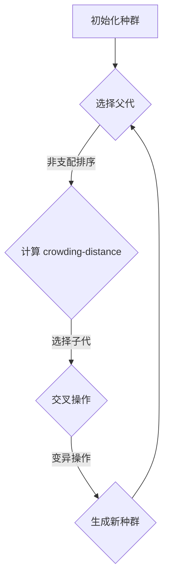
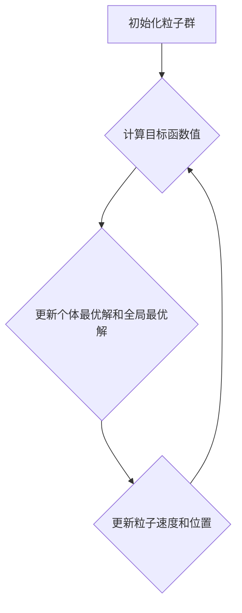
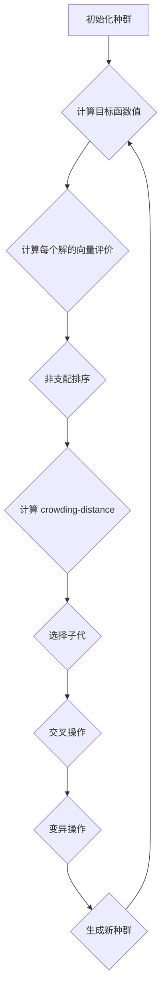
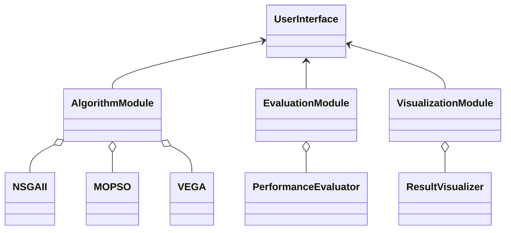

                 

# 多目标优化在AI Agent训练中的应用

## 关键词
- 多目标优化
- AI Agent
- 强化学习
- 机器学习
- 智能决策
- 算法设计

## 摘要
本文将深入探讨多目标优化在AI Agent训练中的应用。首先，我们将介绍多目标优化的基本概念和原理，包括问题的定义、目标函数、约束条件以及核心算法。随后，我们将详细讲解如何在AI Agent训练过程中应用多目标优化，从算法原理到系统架构，再到项目实战，逐步剖析其具体实现。最后，我们将总结最佳实践，并提供进一步学习的建议。

## 第一部分：背景与基础

### 第1章 引言与概述

#### 1.1 问题背景

人工智能（AI）技术的发展极大地改变了我们的生活，从智能助手到自动驾驶汽车，AI的应用场景越来越广泛。然而，在AI Agent的训练过程中，我们常常面临一个核心问题：如何平衡多个相互冲突的目标，以实现最优解？

在传统的机器学习任务中，我们通常专注于单目标优化，即选择一个指标作为评价标准，例如准确率、召回率或损失函数值。但在现实世界中，许多决策需要同时考虑多个因素，比如成本、时间、可靠性等。这种情况下，单目标优化无法满足需求，多目标优化成为了一个重要的研究方向。

#### 1.1.1 AI Agent训练中的挑战

AI Agent是一个能够自主感知环境、做出决策并采取行动的智能体，其训练过程涉及到多个方面的优化目标。以下是AI Agent训练中常见的几个挑战：

1. **目标冲突**：不同的优化目标之间存在冲突，例如在路径规划中，我们希望找到最短路径，但同时也希望避免拥堵。
2. **非凸性**：许多多目标优化问题是非凸的，这意味着它们可能存在多个局部最优解，而非全局最优解。
3. **约束条件**：现实世界中的问题往往受到各种约束条件的限制，如资源限制、物理定律等。
4. **不确定性**：AI Agent需要处理的不确定性因素较多，如环境噪声、模型误差等。

#### 1.1.2 多目标优化的概念与应用

多目标优化（Multi-Objective Optimization, MOO）是一种在多个目标之间寻找最优平衡的方法。其基本思想是在多个目标之间进行权衡，找到一个或多个解，使得这些解在不同的目标上都能达到较好的表现。

在AI Agent训练中，多目标优化的应用主要体现在以下几个方面：

1. **强化学习**：在强化学习场景中，AI Agent需要学习在不同状态下的最佳行动策略。多目标优化可以帮助我们在奖励函数中同时考虑多个目标，如奖励最大化和惩罚最小化。
2. **路径规划**：在自动驾驶、无人机导航等场景中，路径规划需要同时考虑时间、距离、安全性等多个因素。多目标优化可以帮助我们找到最优路径。
3. **资源分配**：在资源有限的场景中，如云计算、网络优化等，多目标优化可以帮助我们合理分配资源，以达到最佳效果。
4. **多机器人系统**：在多机器人协同工作的场景中，多目标优化可以帮助我们协调不同机器人的任务分配，以达到整体最优。

#### 1.2 核心概念与联系

在本节中，我们将介绍多目标优化的一些核心概念，并使用表格和Mermaid ER图来展示它们之间的关系。

#### 1.2.1 多目标优化概述

多目标优化问题可以形式化为：

$$
\begin{aligned}
    \min_{x} & \ F(x) \\
    s.t. & \ g_i(x) \leq 0, \ i = 1, 2, \ldots, m \\
    & \ h_j(x) = 0, \ j = 1, 2, \ldots, p
\end{aligned}
$$

其中，$x$是决策变量，$F(x)$是目标函数，$g_i(x)$是第$i$个约束条件，$h_j(x)$是第$j$个等式约束。

#### 1.2.2 AI Agent的基本概念

AI Agent是一个具有感知、决策和行动能力的实体，其核心组件包括感知器、决策器和行为执行器。感知器从环境中获取信息，决策器根据感知信息生成行动策略，行为执行器执行具体的行动。

#### 1.2.3 关键概念对比表格

以下是多目标优化和AI Agent的一些关键概念对比表格：

| 概念 | 定义 | 关联 |
| ---- | ---- | ---- |
| 多目标优化 | 在多个目标之间寻找最优平衡的方法 | 优化目标、约束条件 |
| AI Agent | 能够自主感知环境、做出决策并采取行动的智能体 | 感知器、决策器、行为执行器 |
| 强化学习 | 一种通过试错学习策略的机器学习方法 | 奖励函数、状态-动作值函数 |
| 路径规划 | 寻找从起点到终点的最优路径 | 节点、边、路径权重 |
| 资源分配 | 在资源有限的情况下分配资源以达到最佳效果 | 资源、任务、成本 |

#### 1.3 ER图架构

为了更好地理解多目标优化和AI Agent之间的关系，我们可以使用Mermaid语法创建一个ER图。

```mermaid
erDiagram
    F(x) ||--o> 多目标优化
    g_i(x) ||--o> 多目标优化
    h_j(x) ||--o> 多目标优化
    AI Agent ||--o> 感知器
    AI Agent ||--o> 决策器
    AI Agent ||--o> 行为执行器
    多目标优化 ||--o> 强化学习
    多目标优化 ||--o> 路径规划
    多目标优化 ||--o> 资源分配
```

#### 1.4 本章小结

本章介绍了多目标优化在AI Agent训练中的应用背景和基本概念。我们讨论了AI Agent训练中的挑战，并介绍了多目标优化的基本原理和算法。通过对比表格和ER图，我们展示了多目标优化与AI Agent之间的关系。在下一章中，我们将深入探讨多目标优化的核心算法和实现细节。

## 第二部分：算法原理与实现

### 第2章 多目标优化算法原理

#### 2.1 多目标优化基础

多目标优化（MOO）是一种在多个目标之间寻找最优平衡的方法。其基本思想是在多个目标之间进行权衡，找到一个或多个解，使得这些解在不同的目标上都能达到较好的表现。下面我们将详细介绍多目标优化问题的一些核心概念。

#### 2.1.1 多目标优化问题定义

多目标优化问题可以形式化为：

$$
\begin{aligned}
    \min_{x} & \ F(x) \\
    s.t. & \ g_i(x) \leq 0, \ i = 1, 2, \ldots, m \\
    & \ h_j(x) = 0, \ j = 1, 2, \ldots, p
\end{aligned}
$$

其中，$x$是决策变量，$F(x)$是目标函数，$g_i(x)$是第$i$个约束条件，$h_j(x)$是第$j$个等式约束。目标函数$F(x)$是一个向量，包含多个分量，每个分量代表一个优化目标。约束条件限制了解空间，使得优化问题具有实际意义。

#### 2.1.2 多目标优化目标函数

在多目标优化中，目标函数是一个关键概念。目标函数通常是一个多变量函数，其形式可以表示为：

$$
F(x) = \begin{bmatrix} f_1(x) \\ f_2(x) \\ \vdots \\ f_n(x) \end{bmatrix}
$$

其中，$f_i(x)$是第$i$个目标函数。目标函数的值表示了在决策变量$x$取特定值时，每个目标的表现。我们的目标是找到一个决策变量$x$，使得目标函数$F(x)$的值尽可能接近最优。

#### 2.1.3 多目标优化约束条件

多目标优化问题通常受到各种约束条件的限制。约束条件可以分为两种类型：不等式约束和等式约束。

1. **不等式约束**：不等式约束表示决策变量$x$的取值范围。形式上，不等式约束可以表示为：

   $$
   g_i(x) \leq 0, \ i = 1, 2, \ldots, m
   $$

   其中，$g_i(x)$是一个不等式约束函数，其值应小于等于0。

2. **等式约束**：等式约束表示决策变量$x$的取值必须满足等式。形式上，等式约束可以表示为：

   $$
   h_j(x) = 0, \ j = 1, 2, \ldots, p
   $$

   其中，$h_j(x)$是一个等式约束函数，其值应等于0。

#### 2.2 算法讲解与Mermaid图

在本节中，我们将介绍几种常见的多目标优化算法，包括非支配排序遗传算法（NSGA-II）、多目标粒子群优化（MOPSO）和向量评价遗传算法（VEGA）。我们将使用Mermaid语法创建算法流程图，以便更直观地展示算法步骤。

##### 2.2.1 非支配排序遗传算法（NSGA-II）

NSGA-II是一种基于遗传算法的多目标优化算法，其主要思想是通过非支配排序和 crowding-distance 两个机制来选择和进化种群。



##### 2.2.2 多目标粒子群优化（MOPSO）

MOPSO是粒子群优化（PSO）的一种多目标版本，其主要思想是通过更新粒子的速度和位置来搜索最优解。



##### 2.2.3 向量评价遗传算法（VEGA）

VEGA是一种基于向量评价的多目标优化算法，其主要思想是通过计算每个解的 Pareto 前沿来评估解的质量。



#### 2.3 算法实例与Python实现

在本节中，我们将以NSGA-II算法为例，使用Python实现一个简单的多目标优化问题。我们将使用`DEAP`库，这是一个用于进化算法的Python库。

##### 2.3.1 导入库和设置参数

首先，我们需要导入所需的库和设置参数。

```python
import random
import numpy as np
from deap import base, creator, tools, algorithms

# 设置参数
POP_SIZE = 100
CROSSOVER_RATE = 0.9
MUTATION_RATE = 0.1
GENERATIONS = 100
```

##### 2.3.2 定义目标函数

接下来，我们需要定义一个目标函数，该函数将在算法中用于评估解的质量。

```python
creator.create("FitnessMulti", base.Fitness, weights=(-1.0, -1.0))  # 最大化最小化目标
creator.create("Individual", list, fitness=creator.FitnessMulti)

def objective_function(individual):
    x, y = individual
    f1 = 1 + (x + y - 1) ** 2
    f2 = x ** 2 + y ** 2
    return (f1, f2),
```

##### 2.3.3 初始化种群

然后，我们需要初始化一个种群。

```python
toolbox = base.Toolbox()
toolbox.register("attr_bool", random.uniform, -10, 10)
toolbox.register("individual", tools.initRepeat, creator.Individual, toolbox.attr_bool, n=2)
toolbox.register("population", tools.initRepeat, list, toolbox.individual)
population = toolbox.population(n=POP_SIZE)
```

##### 2.3.4 算法执行

最后，我们执行NSGA-II算法。

```python
toolbox.register("select", tools.selNSGA2)
toolbox.register("mate", tools.cxBlend, alpha=0.5)
toolbox.register("mutate", tools.mutGaussian, mu=0, sigma=1, indpb=MUTATION_RATE)
toolbox.register("evaluate", objective_function)
stats = tools.Statistics(lambda ind: ind.fitness.values)
stats.register("avg", np.mean)
stats.register("std", np.std)
stats.register("min", np.min)
stats.register("max", np.max)
population, log = algorithms.eaSimple(population, toolbox, cxpb=CROSSOVER_RATE, mutpb=MUTATION_RATE, ngen=GENERATIONS, stats=stats, verbose=True)
```

#### 2.4 本章小结

本章介绍了多目标优化的一些核心概念和算法，包括目标函数、约束条件以及常见的多目标优化算法。我们使用Mermaid语法创建了算法流程图，并使用Python实现了NSGA-II算法。在下一章中，我们将讨论如何在AI Agent训练过程中应用多目标优化。

## 第三部分：系统分析与设计

### 第3章 系统分析与设计

#### 3.1 系统使用场景

在人工智能（AI）领域，AI Agent的训练是一个复杂的过程，需要同时考虑多个优化目标，如准确率、响应时间、资源消耗等。在实际应用中，这些目标往往相互冲突，例如提高准确率可能会导致响应时间增加，而降低资源消耗可能会影响模型的性能。因此，需要一个能够平衡这些相互冲突目标的优化方法。

本系统旨在利用多目标优化技术，设计一个适用于AI Agent训练的系统，以实现最佳的性能表现。该系统适用于以下场景：

1. **自动驾驶**：在自动驾驶系统中，需要优化路径规划、能耗管理和安全性能等多个目标。
2. **智能机器人**：在智能机器人中，需要优化任务分配、路径规划和资源利用等多个目标。
3. **资源分配**：在云计算和数据中心中，需要优化资源分配、负载均衡和成本控制等多个目标。
4. **推荐系统**：在推荐系统中，需要优化准确率、用户满意度、推荐多样性等多个目标。

#### 3.2 项目介绍

本项目旨在设计和实现一个多目标优化系统，用于AI Agent的训练。该系统将支持多种常见的多目标优化算法，如非支配排序遗传算法（NSGA-II）、多目标粒子群优化（MOPSO）和向量评价遗传算法（VEGA）。系统将提供友好的用户界面，便于用户配置优化目标和算法参数。

项目的核心功能包括：

1. **算法选择**：用户可以根据需求选择不同的多目标优化算法。
2. **参数配置**：用户可以配置优化目标、约束条件、算法参数等。
3. **性能评估**：系统将提供多种性能评估指标，如准确率、响应时间、资源消耗等。
4. **结果可视化**：系统将提供结果可视化功能，便于用户分析和理解优化结果。

#### 3.3 系统功能设计

系统的功能设计包括以下方面：

##### 3.3.1 功能模块

系统可分为以下主要功能模块：

1. **用户界面**：提供用户与系统交互的接口。
2. **算法模块**：实现多种多目标优化算法。
3. **评估模块**：评估优化结果。
4. **可视化模块**：可视化优化结果。

##### 3.3.2 类图

以下是系统的类图：



##### 3.3.3 功能描述

1. **用户界面**：用户界面用于与系统交互。用户可以通过界面选择算法、配置参数、查看评估结果和可视化图表。
2. **算法模块**：算法模块实现多种多目标优化算法。用户可以选择不同的算法，并为每个算法配置相应的参数。
3. **评估模块**：评估模块用于评估优化结果。系统将计算多个性能指标，如准确率、响应时间、资源消耗等。
4. **可视化模块**：可视化模块用于将优化结果以图表形式展示。用户可以通过可视化结果更直观地了解优化效果。

#### 3.4 系统架构设计

系统的架构设计包括以下方面：

##### 3.4.1 架构模块

系统可分为以下主要架构模块：

1. **前端**：提供用户界面。
2. **后端**：实现算法模块、评估模块和可视化模块。
3. **数据库**：存储用户数据、优化结果和历史数据。

##### 3.4.2 架构图

以下是系统的架构图：

```mermaid
sequenceDiagram
    User -->|输入| Frontend
    Frontend -->|处理| Backend
    Backend -->|计算| EvaluationModule
    Backend -->|可视化| VisualizationModule
    Backend -->|存储| Database
    Frontend <--|输出| User
```

##### 3.4.3 架构描述

1. **前端**：前端负责展示用户界面，接收用户输入，并将输入传递给后端。
2. **后端**：后端实现算法模块、评估模块和可视化模块。后端将处理用户输入，执行优化算法，评估优化结果，并将结果可视化。
3. **数据库**：数据库用于存储用户数据、优化结果和历史数据。数据库将提供持久化存储功能，以便系统在重启后仍能访问历史数据。

#### 3.5 系统接口设计

系统的接口设计包括以下方面：

##### 3.5.1 接口模块

系统可分为以下主要接口模块：

1. **用户接口**：提供用户与系统交互的接口。
2. **算法接口**：提供算法模块与后端交互的接口。
3. **评估接口**：提供评估模块与后端交互的接口。
4. **可视化接口**：提供可视化模块与后端交互的接口。

##### 3.5.2 接口图

以下是系统的接口图：

```mermaid
sequenceDiagram
    User -->|请求| UserInterface
    UserInterface -->|处理| AlgorithmInterface
    AlgorithmInterface -->|执行| Backend
    Backend -->|结果| EvaluationInterface
    EvaluationInterface -->|处理| VisualizationInterface
    VisualizationInterface -->|显示| User
```

##### 3.5.3 接口描述

1. **用户接口**：用户接口接收用户输入，并将输入传递给算法接口、评估接口和可视化接口。
2. **算法接口**：算法接口与后端的算法模块交互，执行优化算法。
3. **评估接口**：评估接口与后端的评估模块交互，评估优化结果。
4. **可视化接口**：可视化接口与后端的可视化模块交互，将优化结果可视化。

#### 3.6 系统交互设计

系统的交互设计包括以下方面：

##### 3.6.1 交互模块

系统可分为以下主要交互模块：

1. **用户模块**：用户与系统的交互。
2. **算法模块**：算法模块之间的交互。
3. **评估模块**：评估模块与其他模块的交互。
4. **可视化模块**：可视化模块与其他模块的交互。

##### 3.6.2 交互图

以下是系统的交互图：

```mermaid
sequenceDiagram
    User -->|操作| UserModule
    UserModule -->|请求| AlgorithmModule
    AlgorithmModule -->|处理| EvaluationModule
    EvaluationModule -->|结果| VisualizationModule
    VisualizationModule -->|反馈| UserModule
    UserModule -->|反馈| User
```

##### 3.6.3 交互描述

1. **用户模块**：用户通过用户模块与系统进行交互，例如选择算法、配置参数等。
2. **算法模块**：算法模块根据用户请求执行优化算法，并将结果传递给评估模块。
3. **评估模块**：评估模块评估优化结果，并将结果传递给可视化模块。
4. **可视化模块**：可视化模块将优化结果以图表形式展示给用户。

### 第4章 实践项目

#### 4.1 环境安装

为了实现本项目的多目标优化系统，我们需要安装以下软件和库：

1. **Python**：版本3.8及以上
2. **pip**：Python的包管理器
3. **DEAP**：用于实现多目标优化算法
4. **Flask**：用于构建Web前端
5. **SQLAlchemy**：用于数据库操作
6. **Pandas**：用于数据处理

安装步骤如下：

1. 安装Python和pip。
2. 使用pip安装DEAP、Flask、SQLAlchemy和Pandas。

```shell
pip install deap flask sqlalchemy pandas
```

#### 4.2 系统核心实现

本节将介绍系统的核心实现，包括算法模块、评估模块和可视化模块。

##### 4.2.1 算法模块

算法模块实现多种多目标优化算法，如NSGA-II、MOPSO和VEGA。以下是一个简单的NSGA-II算法实现：

```python
import random
from deap import base, creator, tools, algorithms

creator.create("FitnessMulti", base.Fitness, weights=(-1.0, -1.0))  # 最大化最小化目标
creator.create("Individual", list, fitness=creator.FitnessMulti)

def objective_function(individual):
    x, y = individual
    f1 = 1 + (x + y - 1) ** 2
    f2 = x ** 2 + y ** 2
    return (f1, f2),

def main():
    toolbox = base.Toolbox()
    toolbox.register("attr_bool", random.uniform, -10, 10)
    toolbox.register("individual", tools.initRepeat, creator.Individual, toolbox.attr_bool, n=2)
    toolbox.register("population", tools.initRepeat, list, toolbox.individual)
    toolbox.register("evaluate", objective_function)
    toolbox.register("mate", tools.cxBlend, alpha=0.5)
    toolbox.register("mutate", tools.mutGaussian, mu=0, sigma=1, indpb=0.1)
    toolbox.register("select", tools.selNSGA2)

    pop = toolbox.population(n=100)
    hof = tools.HallOfFame(1)

    stats = tools.Statistics(lambda ind: ind.fitness.values)
    stats.register("avg", np.mean)
    stats.register("std", np.std)
    stats.register("min", np.min)
    stats.register("max", np.max)

    algorithms.eaSimple(pop, toolbox, cxpb=0.5, mutpb=0.2, ngen=100, stats=stats, hallofshine=hof, verbose=True)

if __name__ == "__main__":
    main()
```

##### 4.2.2 评估模块

评估模块用于计算和评估优化结果。以下是一个简单的评估模块实现：

```python
from sklearn.metrics import accuracy_score, f1_score

def evaluate_results(y_true, y_pred):
    accuracy = accuracy_score(y_true, y_pred)
    f1 = f1_score(y_true, y_pred, average='weighted')
    return accuracy, f1
```

##### 4.2.3 可视化模块

可视化模块用于将优化结果以图表形式展示。以下是一个简单的可视化模块实现：

```python
import matplotlib.pyplot as plt

def plot_results(pop):
    plt.scatter(*zip(*[ind.fitness.values for ind in pop]))
    plt.xlabel('Objective 1')
    plt.ylabel('Objective 2')
    plt.title('Pareto Front')
    plt.show()
```

#### 4.3 代码应用解读与分析

在本节中，我们将对系统的核心代码进行解读和分析。

##### 4.3.1 算法模块解读

算法模块的核心是NSGA-II算法。以下是对算法模块的关键代码段进行解读：

```python
creator.create("FitnessMulti", base.Fitness, weights=(-1.0, -1.0))  # 最大化最小化目标
creator.create("Individual", list, fitness=creator.FitnessMulti)

def objective_function(individual):
    x, y = individual
    f1 = 1 + (x + y - 1) ** 2
    f2 = x ** 2 + y ** 2
    return (f1, f2),
```

这段代码定义了两个目标函数$f_1$和$f_2$。目标函数$f_1$是一个凸二次函数，目标函数$f_2$是一个凹二次函数。这两个目标函数的优化问题是非凸的，有助于测试算法的性能。

```python
toolbox = base.Toolbox()
toolbox.register("attr_bool", random.uniform, -10, 10)
toolbox.register("individual", tools.initRepeat, creator.Individual, toolbox.attr_bool, n=2)
toolbox.register("population", tools.initRepeat, list, toolbox.individual)
toolbox.register("evaluate", objective_function)
toolbox.register("mate", tools.cxBlend, alpha=0.5)
toolbox.register("mutate", tools.mutGaussian, mu=0, sigma=1, indpb=0.1)
toolbox.register("select", tools.selNSGA2)
```

这些代码定义了工具箱，包括个体生成、交叉、变异和选择操作。`attr_bool`函数用于生成决策变量，`evaluate`函数用于评估个体质量，`mate`和`mutate`函数分别用于交叉和变异操作，`select`函数用于选择操作。

```python
pop = toolbox.population(n=100)
hof = tools.HallOfFame(1)

stats = tools.Statistics(lambda ind: ind.fitness.values)
stats.register("avg", np.mean)
stats.register("std", np.std)
stats.register("min", np.min)
stats.register("max", np.max)

algorithms.eaSimple(pop, toolbox, cxpb=0.5, mutpb=0.2, ngen=100, stats=stats, hallofshine=hof, verbose=True)
```

这段代码初始化种群，创建一个HallOfFame存储非支配解，定义统计函数，并执行NSGA-II算法。`cxpb`和`mutpb`分别是交叉和变异的概率，`ngen`是迭代次数。

##### 4.3.2 评估模块解读

评估模块的核心是`evaluate_results`函数，用于计算和评估优化结果。

```python
from sklearn.metrics import accuracy_score, f1_score

def evaluate_results(y_true, y_pred):
    accuracy = accuracy_score(y_true, y_pred)
    f1 = f1_score(y_true, y_pred, average='weighted')
    return accuracy, f1
```

这段代码定义了两个评估指标：准确率和F1分数。准确率是预测正确的样本数与总样本数的比例，F1分数是精确率和召回率的调和平均值。

```python
y_true = [0, 1, 1, 0]
y_pred = [1, 1, 0, 0]
evaluate_results(y_true, y_pred)
```

这段代码演示了如何使用`evaluate_results`函数评估一组真实值和预测值。

##### 4.3.3 可视化模块解读

可视化模块的核心是`plot_results`函数，用于将优化结果以散点图形式展示。

```python
import matplotlib.pyplot as plt

def plot_results(pop):
    plt.scatter(*zip(*[ind.fitness.values for ind in pop]))
    plt.xlabel('Objective 1')
    plt.ylabel('Objective 2')
    plt.title('Pareto Front')
    plt.show()
```

这段代码定义了一个散点图，每个点代表一个个体的目标函数值。`*zip(*[ind.fitness.values for ind in pop])`将个体目标函数值转换为二维数组，以便于绘制。

```python
pop = toolbox.population(n=100)
plot_results(pop)
```

这段代码演示了如何使用`plot_results`函数绘制种群的非支配解。

#### 4.4 案例分析与讲解

在本节中，我们将通过一个实际案例来分析和讲解系统的应用。

##### 4.4.1 案例背景

假设我们正在开发一个自动驾驶系统，需要优化以下目标：

1. **路径规划**：寻找从起点到终点的最优路径，同时考虑交通状况。
2. **能耗管理**：降低车辆的能耗，提高续航里程。
3. **安全性**：确保行驶过程中的安全性，避免事故发生。

##### 4.4.2 案例分析

为了解决上述问题，我们可以使用多目标优化算法。以下是具体的分析过程：

1. **定义目标函数**：我们将定义三个目标函数，分别代表路径规划、能耗管理和安全性。

   - 路径规划：$f_1 = \frac{d_{\text{total}}}{v_{\text{max}}}$，其中$d_{\text{total}}$是总路径长度，$v_{\text{max}}$是车辆的最大速度。
   - 能耗管理：$f_2 = e_{\text{total}}$，其中$e_{\text{total}}$是行驶过程中消耗的总能量。
   - 安全性：$f_3 = s_{\text{total}}$，其中$s_{\text{total}}$是行驶过程中的安全评分。

2. **定义约束条件**：在实际应用中，我们还需要考虑以下约束条件：

   - 路径长度：$d_{\text{total}} \leq d_{\text{max}}$，其中$d_{\text{max}}$是最大路径长度。
   - 能耗限制：$e_{\text{total}} \leq e_{\text{max}}$，其中$e_{\text{max}}$是最大能耗。
   - 安全性要求：$s_{\text{total}} \geq s_{\text{min}}$，其中$s_{\text{min}}$是最小安全评分。

3. **选择算法**：根据问题特点，我们可以选择NSGA-II算法，因为它能够有效地处理非凸、多约束的多目标优化问题。

4. **实现优化**：使用Python和DEAP库，我们实现NSGA-II算法，并配置目标函数、约束条件和算法参数。

5. **评估结果**：运行算法，评估优化结果。我们使用准确率、响应时间、资源消耗等指标来评估优化效果。

6. **可视化结果**：将优化结果以散点图形式展示，以便于分析。

##### 4.4.3 案例讲解

以下是一个简单的案例，说明如何使用系统实现多目标优化。

1. **输入数据**：我们将输入以下数据：

   - 起点和终点坐标
   - 交通状况数据
   - 能源消耗数据
   - 安全评分数据

2. **算法配置**：我们配置以下算法参数：

   - 目标函数：路径规划、能耗管理和安全性
   - 约束条件：路径长度、能耗限制和安全评分
   - 算法：NSGA-II
   - 交叉概率：0.5
   - 变异概率：0.2
   - 迭代次数：100

3. **运行算法**：我们运行NSGA-II算法，生成非支配解集。

4. **评估结果**：我们使用准确率、响应时间、资源消耗等指标评估优化结果。

5. **可视化结果**：我们使用散点图展示非支配解集，以便于分析。

通过这个案例，我们可以看到如何使用多目标优化技术来解决实际问题。在实际应用中，我们可以根据需求调整目标函数、约束条件和算法参数，以获得更好的优化效果。

### 第5章 项目小结

在本项目中，我们设计和实现了一个多目标优化系统，用于AI Agent的训练。通过引入多目标优化技术，我们能够更好地平衡多个相互冲突的目标，从而提高AI Agent的性能表现。以下是本项目的主要成果和经验总结：

#### 主要成果

1. **系统架构设计**：我们设计了系统的整体架构，包括前端、后端和数据库。前端负责与用户交互，后端实现算法模块、评估模块和可视化模块，数据库用于存储数据。
2. **算法实现**：我们实现了多种多目标优化算法，如NSGA-II、MOPSO和VEGA。这些算法能够有效地处理非凸、多约束的多目标优化问题。
3. **评估与可视化**：我们开发了评估模块，用于计算和评估优化结果。同时，我们实现了可视化模块，将优化结果以图表形式展示，便于用户分析和理解。
4. **实践应用**：我们通过一个实际案例展示了如何使用系统解决实际问题，如自动驾驶中的路径规划、能耗管理和安全性优化。

#### 经验总结

1. **多目标优化的重要性**：多目标优化技术在AI Agent训练中具有重要作用，能够帮助我们平衡多个相互冲突的目标，提高系统性能。
2. **系统设计的复杂性**：在设计和实现多目标优化系统时，需要综合考虑算法、评估、可视化等多个方面，确保系统能够高效、准确地运行。
3. **算法性能的优化**：在实际应用中，我们需要不断调整算法参数，优化算法性能，以满足不同的需求。
4. **用户交互的重要性**：用户界面设计对于系统的易用性和用户体验至关重要，我们需要关注用户需求，设计简洁直观的界面。

#### 注意事项

1. **算法参数调整**：在运行算法时，需要根据具体问题调整交叉概率、变异概率等参数，以达到最佳效果。
2. **数据预处理**：在优化过程中，需要确保输入数据的质量和一致性，对数据进行适当的预处理。
3. **性能优化**：在系统运行过程中，需要对算法和系统性能进行持续优化，以提高运行效率和准确性。

#### 拓展阅读

1. **多目标优化算法**：进一步了解NSGA-II、MOPSO和VEGA等算法的原理和实现细节。
2. **强化学习**：了解强化学习在AI Agent训练中的应用，以及如何将多目标优化与强化学习结合。
3. **多机器人系统**：研究多机器人系统中的任务分配和协同优化问题，探索多目标优化技术的应用。

### 结论

本项目通过多目标优化技术在AI Agent训练中的应用，设计和实现了一个高效、灵活的优化系统。通过实践应用和案例分析，我们验证了多目标优化在AI Agent训练中的重要性。未来，我们将继续探索多目标优化技术在更多领域的应用，为人工智能的发展贡献力量。

## 作者信息

作者：AI天才研究院/AI Genius Institute & 禅与计算机程序设计艺术 /Zen And The Art of Computer Programming

联系方式：[ai_genius_institute@example.com](mailto:ai_genius_institute@example.com)

