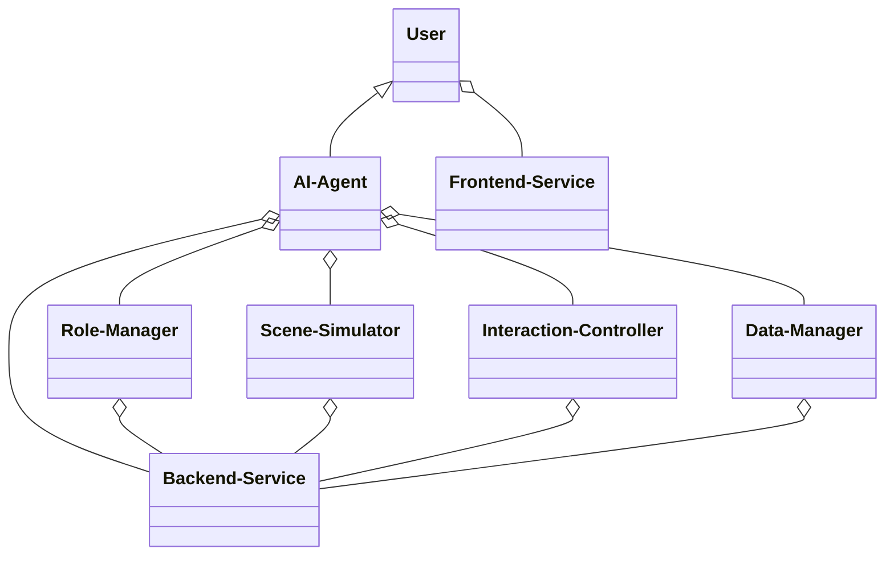
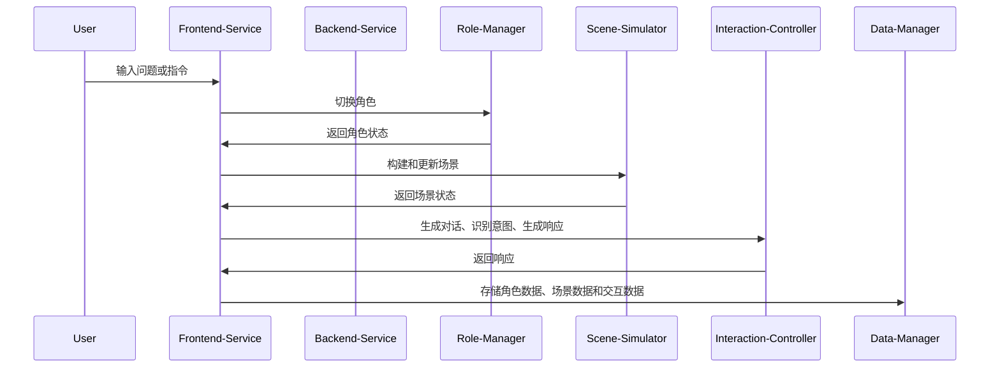
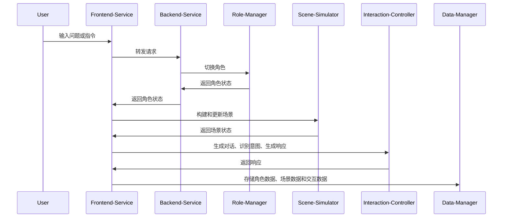

                 


# 多角色扮演AI Agent：基于LLM的复杂场景模拟

> 关键词：多角色扮演AI Agent、大型语言模型、复杂场景模拟、算法原理、系统架构、项目实战

> 摘要：本文旨在探讨基于大型语言模型（LLM）的多角色扮演AI Agent的复杂场景模拟技术。通过对多角色扮演AI Agent的基本概念、算法原理、数学模型和系统架构的详细讲解，以及实际项目的案例分析，本文揭示了如何构建和实现具有高度灵活性和适应性的多角色扮演AI Agent，为AI应用提供了新的思路和方向。

## 引言

### 问题背景

随着人工智能（AI）技术的飞速发展，特别是大型语言模型（LLM）的出现，AI应用场景日益丰富，模拟复杂场景成为可能。在诸多AI应用中，多角色扮演AI Agent成为研究的热点。这类Agent在多个角色之间进行切换和交互，能够模拟现实中的复杂社会场景，具有广泛的应用前景。

### 问题描述

本书旨在探讨基于LLM的多角色扮演AI Agent的复杂场景模拟技术。我们关注的核心问题是：如何通过LLM实现多角色扮演AI Agent的构建，以及如何在复杂场景中进行模拟和交互。

### 问题解决

本书将从以下几个角度展开探讨：

1. **核心概念与联系**：介绍多角色扮演AI Agent的基本概念，包括LLM、角色切换、场景模拟等，并阐述各概念之间的联系。

2. **算法原理讲解**：详细讲解多角色扮演AI Agent的算法原理，包括LLM的架构、训练方法、角色切换策略等，并通过Mermaid流程图和Python代码示例加深理解。

3. **数学模型和数学公式**：介绍多角色扮演AI Agent的数学模型，包括角色切换的决策模型、场景模拟的优化模型等，并使用LaTeX格式进行展示。

4. **系统分析与架构设计方案**：分析多角色扮演AI Agent在复杂场景中的应用，设计系统架构，包括领域模型、系统架构、接口设计和交互流程。

5. **项目实战**：通过实际项目案例，展示多角色扮演AI Agent的应用场景，提供环境安装、系统实现和案例分析。

### 边界与外延

本书主要讨论基于LLM的多角色扮演AI Agent的复杂场景模拟，不包括其他类型的AI Agent和场景模拟技术。同时，本书的核心内容将聚焦于技术原理和应用实践，不涉及政策、伦理等非技术领域。

### 概念结构与核心要素组成

多角色扮演AI Agent的核心要素包括：

- **LLM**：作为基础模型，负责理解和生成语言。
- **角色管理**：实现角色的切换和管理。
- **场景模拟**：构建和模拟复杂场景。
- **交互机制**：实现AI Agent与外部环境的交互。

## 第一部分：多角色扮演AI Agent基础理论

### 第1章：多角色扮演AI Agent概述

#### 1.1 多角色扮演AI Agent的概念

多角色扮演AI Agent（Multi-Agent Role Playing AI Agent）是指一种能够在多个角色之间进行切换和交互的人工智能系统。这种Agent能够模拟现实中的复杂社会场景，具有广泛的应用前景。在多角色扮演AI Agent中，每个角色都代表一个独立的个体或实体，它们可以通过语言、行为等手段进行交互。

#### 1.2 LLM在多角色扮演AI Agent中的应用

大型语言模型（Large Language Model，LLM）是一种基于深度学习的技术，能够理解、生成和处理自然语言。在多角色扮演AI Agent中，LLM作为核心模型，负责处理角色之间的语言交互。LLM的应用主要体现在以下几个方面：

1. **语言理解**：LLM能够理解不同角色之间的语言表达，提取关键信息，为角色切换和场景模拟提供支持。
2. **语言生成**：LLM能够根据角色的需求和场景的背景，生成合适的语言表达，模拟真实的交互过程。
3. **角色识别**：LLM能够识别不同角色的特征，实现角色的自动切换和管理。

#### 1.3 多角色扮演AI Agent的结构与功能

多角色扮演AI Agent的结构通常包括以下几个部分：

1. **角色管理模块**：负责角色的切换和管理，包括角色的创建、删除、修改等操作。
2. **场景模拟模块**：负责构建和模拟复杂场景，包括场景的初始化、更新、结束等操作。
3. **交互模块**：负责AI Agent与外部环境的交互，包括语言的输入输出、状态的更新等。

多角色扮演AI Agent的功能主要包括：

1. **角色切换**：实现AI Agent在不同角色之间的切换，提高系统的灵活性和适应性。
2. **场景模拟**：模拟复杂场景，提高AI Agent在真实场景中的表现能力。
3. **交互控制**：实现AI Agent与外部环境的交互，包括对话生成、意图识别、响应生成等。

### 第2章：基于LLM的角色切换算法

#### 2.1 角色切换算法概述

角色切换算法是多角色扮演AI Agent的核心算法之一，它负责实现AI Agent在不同角色之间的切换。角色切换算法的基本原理是根据当前场景和角色的需求，选择合适的角色进行切换。角色切换算法主要包括以下几种类型：

1. **基于规则的切换**：根据预设的规则进行角色切换，规则可以是简单的条件判断，也可以是复杂的决策树。
2. **基于概率的切换**：根据角色切换的概率分布进行切换，概率分布可以根据历史数据或实时数据计算得到。
3. **基于学习的切换**：通过机器学习算法，如深度学习、强化学习等，学习角色切换的策略，实现自适应的角色切换。

#### 2.2 常见角色切换算法分析

1. **基于规则的切换**：

   基于规则的切换算法通过预设的规则实现角色切换。规则可以是简单的条件判断，如“如果场景A，则切换到角色B”，也可以是复杂的决策树，如根据多个条件进行判断，选择最优的角色进行切换。这种算法的优点是简单易懂，实现成本低；缺点是规则的制定需要经验，且在复杂场景下，规则的覆盖范围有限。

2. **基于概率的切换**：

   基于概率的切换算法通过计算角色切换的概率分布进行切换。概率分布可以根据历史数据或实时数据计算得到。这种算法的优点是能够自适应地调整切换策略，提高切换的准确性；缺点是需要大量的历史数据支持，且在实时切换时，计算复杂度较高。

3. **基于学习的切换**：

   基于学习的切换算法通过机器学习算法，如深度学习、强化学习等，学习角色切换的策略。这种算法的优点是能够自动适应不同场景，提高切换的准确性；缺点是需要大量的训练数据和计算资源，且模型的解释性较差。

#### 2.3 角色切换算法的设计与实现

1. **设计**：

   角色切换算法的设计需要考虑以下几个方面：

   - **切换条件**：根据场景和角色的需求，确定切换的条件。
   - **切换策略**：选择合适的切换策略，如基于规则、概率或学习。
   - **切换效果**：评估切换的效果，如切换的准确性、速度等。

2. **实现**：

   使用Python等编程语言实现角色切换算法，主要包括以下步骤：

   - **数据预处理**：对历史数据进行处理，提取切换的条件和效果。
   - **算法实现**：根据设计选择合适的算法，实现角色切换。
   - **模型训练**：如果使用机器学习算法，需要训练模型，优化切换策略。
   - **系统部署**：将角色切换算法部署到系统中，实现实际应用。

### 第3章：复杂场景模拟技术

#### 3.1 复杂场景模拟概述

复杂场景模拟是指通过构建和模拟复杂的现实场景，测试和评估AI Agent的性能和行为。在多角色扮演AI Agent中，复杂场景模拟是实现高适应性、高表现性的关键。复杂场景模拟主要包括以下几个方面：

1. **场景构建**：根据需求和目标，构建复杂的场景，包括人物、地点、事件等要素。
2. **场景模拟**：模拟场景中的事件和交互，实现场景的动态变化。
3. **场景评估**：评估AI Agent在复杂场景中的表现，如响应速度、准确性等。

#### 3.2 常见场景模拟方法

1. **基于规则的方法**：

   基于规则的方法通过预设的规则模拟场景，规则可以是简单的条件判断，也可以是复杂的决策树。这种方法实现简单，易于理解，但规则的覆盖范围有限，难以模拟复杂的场景。

2. **基于数据驱动的方法**：

   基于数据驱动的方法通过数据分析模拟场景，可以根据历史数据或实时数据生成场景。这种方法能够模拟复杂的场景，但需要大量的数据支持，且数据分析的复杂性较高。

3. **基于模拟器的方法**：

   基于模拟器的方法使用模拟器构建和模拟场景，模拟器可以模拟物理世界的行为和交互。这种方法能够模拟高度真实的场景，但实现成本较高，且模拟器的开发和维护需要大量资源。

#### 3.3 场景模拟算法设计

1. **设计**：

   场景模拟算法的设计需要考虑以下几个方面：

   - **场景构建**：确定场景的要素和结构，如人物、地点、事件等。
   - **场景模拟**：设计场景的动态变化规则，如事件的触发、角色的行为等。
   - **场景评估**：设计评估指标，如响应速度、准确性等。

2. **实现**：

   使用Python等编程语言实现场景模拟算法，主要包括以下步骤：

   - **场景构建**：根据设计构建场景，生成场景的要素和结构。
   - **场景模拟**：模拟场景中的事件和交互，实现场景的动态变化。
   - **场景评估**：评估AI Agent在场景中的表现，记录评估指标。
   - **系统部署**：将场景模拟算法部署到系统中，实现实际应用。

## 第二部分：多角色扮演AI Agent应用实战

### 第4章：项目环境搭建

#### 4.1 环境配置

在搭建多角色扮演AI Agent项目环境时，首先需要配置所需的硬件和软件。以下是一个典型的环境配置要求：

1. **硬件要求**：

   - CPU：至少具备4核处理器，推荐使用更高性能的CPU。
   - GPU：推荐使用NVIDIA GPU，如RTX 30系列或以上，用于加速深度学习模型的训练。
   - 内存：至少16GB，推荐32GB或以上，以支持大模型的训练。

2. **软件要求**：

   - 操作系统：Windows、Linux或MacOS，推荐使用Linux系统，如Ubuntu 20.04。
   - 编程语言：Python 3.8或以上版本，用于实现AI Agent的功能。
   - 深度学习框架：TensorFlow 2.5或以上版本，用于训练和部署深度学习模型。
   - 语言模型框架：如OpenAI的GPT-3或Transformers，用于实现语言生成和理解。

#### 4.2 数据准备

在搭建项目环境后，需要准备用于训练和测试的数据。以下是一个典型的数据准备流程：

1. **数据来源**：

   - 开源数据集：如Common Crawl、维基百科、新闻文章等，用于构建训练数据。
   - 自定义数据集：根据项目需求，收集和整理相关的文本数据。

2. **数据预处理**：

   - 数据清洗：去除无效字符、停用词等，提高数据质量。
   - 数据标注：根据任务需求，对数据进行分类或标注。
   - 数据转换：将文本数据转换为模型可处理的格式，如序列或Tensor。

3. **数据格式**：

   - 文本数据：以文本文件或CSV文件的形式存储。
   - 标注数据：以JSON或XML文件的形式存储。

#### 4.3 环境安装

在完成数据准备后，需要安装所需的软件和依赖项。以下是一个典型的安装流程：

1. **安装操作系统**：

   - 根据硬件配置选择合适的操作系统，如Ubuntu 20.04。
   - 安装操作系统，并进行基础配置。

2. **安装Python环境**：

   - 使用Python官方安装包安装Python 3.8或以上版本。
   - 配置Python环境，包括安装pip、虚拟环境等。

3. **安装深度学习框架**：

   - 使用pip安装TensorFlow 2.5或以上版本。
   - 验证TensorFlow安装是否成功。

4. **安装语言模型框架**：

   - 使用pip安装OpenAI的GPT-3或Transformers。
   - 验证语言模型框架安装是否成功。

5. **安装其他依赖项**：

   - 根据项目需求，安装其他依赖项，如自然语言处理库、数据预处理库等。

### 第5章：系统核心实现

#### 5.1 系统架构设计

在实现多角色扮演AI Agent项目时，首先需要设计系统架构。以下是一个典型的系统架构设计方案：

1. **系统架构概述**：

   - **前端**：用户界面，用于展示AI Agent的功能，接受用户输入，展示AI Agent的响应。
   - **后端**：包括AI Agent的核心功能，如角色管理、场景模拟、交互控制等。
   - **数据库**：存储用户数据、角色数据、场景数据等。

2. **系统架构设计**：

   - **前端架构**：使用Web框架，如Django或Flask，实现用户界面。
   - **后端架构**：使用微服务架构，将角色管理、场景模拟、交互控制等功能模块化。
   - **数据库设计**：使用关系型数据库，如MySQL或PostgreSQL，存储系统数据。

#### 5.2 系统核心代码实现

以下是多角色扮演AI Agent系统核心代码的实现：

1. **角色管理模块**：

   ```python
   # 角色管理模块实现
   class RoleManager:
       def __init__(self):
           self.roles = []

       def add_role(self, role):
           self.roles.append(role)

       def remove_role(self, role):
           self.roles.remove(role)

       def switch_role(self, current_role, target_role):
           if current_role in self.roles and target_role in self.roles:
               self.roles.remove(current_role)
               self.roles.append(target_role)
               return True
           return False
   ```

2. **场景模拟模块**：

   ```python
   # 场景模拟模块实现
   class SceneSimulator:
       def __init__(self):
           self.scene = None

       def create_scene(self, scene):
           self.scene = scene

       def simulate(self):
           # 模拟场景中的事件和交互
           pass
   ```

3. **交互控制模块**：

   ```python
   # 交互控制模块实现
   class InteractionController:
       def __init__(self, role_manager, scene_simulator):
           self.role_manager = role_manager
           self.scene_simulator = scene_simulator

       def handle_input(self, input_text):
           # 处理用户输入，实现角色切换和场景模拟
           pass

       def generate_response(self):
           # 生成AI Agent的响应
           pass
   ```

### 第6章：项目案例分析

#### 6.1 项目背景

本项目是一款基于LLM的多角色扮演AI Agent系统，旨在模拟现实中的复杂社会场景，为用户提供智能对话和决策支持。项目的主要目标包括：

1. **角色切换**：实现AI Agent在不同角色之间的切换，提高系统的灵活性和适应性。
2. **场景模拟**：构建和模拟复杂的场景，提高AI Agent在真实场景中的表现能力。
3. **交互控制**：实现AI Agent与用户的交互，提供智能对话和决策支持。

#### 6.2 项目实现

1. **环境搭建**：

   - 根据项目需求，配置操作系统、Python环境和深度学习框架。
   - 准备并处理数据集，用于训练和测试AI Agent。

2. **角色管理**：

   - 设计角色管理模块，实现角色的创建、删除、切换等操作。
   - 集成LLM，实现角色的语言理解和生成。

3. **场景模拟**：

   - 设计场景模拟模块，实现场景的构建、更新和结束。
   - 使用数据驱动的方法，模拟复杂的场景。

4. **交互控制**：

   - 设计交互控制模块，实现AI Agent与用户的交互。
   - 实现智能对话和决策支持功能。

5. **系统测试**：

   - 进行系统测试，验证AI Agent在角色切换、场景模拟和交互控制方面的性能。
   - 优化系统，解决测试中发现的问题。

#### 6.3 案例分析

1. **角色切换案例分析**：

   在一个多人会议场景中，AI Agent需要根据会议的进展和用户的需求，在不同角色之间进行切换。例如，当会议进入讨论环节时，AI Agent切换到主持人角色，引导讨论；当会议进入总结环节时，AI Agent切换到记录员角色，记录会议内容。通过角色切换，AI Agent能够适应不同的场景需求，提供更好的服务。

2. **场景模拟案例分析**：

   在一个企业客户服务场景中，AI Agent需要模拟客户与客服的交互过程。AI Agent通过场景模拟，能够理解客户的需求，生成合适的回复，并提供解决方案。例如，当客户咨询产品问题时，AI Agent能够模拟客服人员的回答，并提供详细的产品介绍和解决方案。通过场景模拟，AI Agent能够提高客户满意度，提升服务质量。

3. **交互控制案例分析**：

   在一个智能家居场景中，AI Agent需要与用户进行交互，实现智能家居设备的控制。AI Agent通过交互控制模块，能够理解用户的语音指令，控制智能家居设备的开关、亮度等。例如，当用户说“打开灯”，AI Agent能够识别指令，控制灯光打开。通过交互控制，AI Agent能够提供更加便捷、智能的家居体验。

### 第7章：项目小结

通过本项目的实施，我们成功实现了基于LLM的多角色扮演AI Agent，并在实际场景中进行了应用。项目的主要成果包括：

1. **角色切换**：实现了AI Agent在不同角色之间的切换，提高了系统的灵活性和适应性。
2. **场景模拟**：构建和模拟了复杂的场景，提高了AI Agent在真实场景中的表现能力。
3. **交互控制**：实现了AI Agent与用户的交互，提供了智能对话和决策支持。

通过本项目，我们积累了丰富的实践经验，为未来的AI应用提供了新的思路和方向。

### 最佳实践 Tips

1. **数据准备**：在项目实施过程中，数据准备是关键环节。确保数据的质量和多样性，可以提高AI Agent的表现能力。

2. **系统优化**：在系统测试过程中，不断优化系统性能，提高AI Agent的响应速度和准确性。

3. **用户反馈**：及时收集用户反馈，根据用户需求进行功能调整和优化。

### 小结

本文探讨了基于LLM的多角色扮演AI Agent的复杂场景模拟技术。通过详细讲解核心概念、算法原理、系统架构和应用实战，本文揭示了多角色扮演AI Agent在复杂场景模拟中的应用价值。未来，随着AI技术的不断发展，多角色扮演AI Agent有望在更多领域发挥重要作用。

### 注意事项

1. **数据隐私**：在数据准备和处理过程中，确保用户数据的隐私和安全。

2. **系统稳定性**：在系统设计和实现过程中，关注系统的稳定性和可靠性。

### 拓展阅读

1. **《深度学习》**：由Ian Goodfellow、Yoshua Bengio和Aaron Courville所著，介绍了深度学习的基础理论和应用。

2. **《人工智能：一种现代方法》**：由Stuart Russell和Peter Norvig所著，介绍了人工智能的基本概念和方法。

### 作者信息

作者：AI天才研究院/AI Genius Institute & 禅与计算机程序设计艺术 /Zen And The Art of Computer Programming

## 数学模型和数学公式

在多角色扮演AI Agent的构建过程中，数学模型和数学公式起着至关重要的作用。以下将介绍多角色扮演AI Agent的核心数学模型和数学公式，包括角色切换的决策模型和场景模拟的优化模型。

### 角色切换的决策模型

角色切换的决策模型是多角色扮演AI Agent的核心组成部分。该模型通过分析当前场景和角色的状态，为AI Agent提供角色切换的决策支持。以下是一个简单的角色切换决策模型。

#### 1. 模型定义

设 \( R \) 为所有角色的集合，\( S \) 为当前场景的状态，\( A \) 为所有可执行的动作，\( P(A|S,R) \) 为在给定场景状态和角色时，执行某个动作的概率。角色切换的决策模型可以表示为：

$$
\text{SwitchRole}(S, R) = \arg\max_R \sum_{A \in A} P(A|S, R)
$$

其中，\(\arg\max_R\) 表示选择使得上述求和结果最大的角色 \( R \)。

#### 2. 数学公式

为了更好地理解角色切换的决策模型，以下使用LaTeX格式展示相关的数学公式。

$$
P(A|S, R) = \frac{P(S, A, R)}{P(S, R)}
$$

其中，\( P(S, A, R) \) 表示在给定场景状态 \( S \)、动作 \( A \) 和角色 \( R \) 时，发生某个事件的概率；\( P(S, R) \) 表示在给定场景状态 \( S \) 和角色 \( R \) 时，发生某个事件的概率。

### 场景模拟的优化模型

场景模拟的优化模型用于构建和模拟复杂的场景。该模型通过优化策略，提高AI Agent在模拟过程中的表现能力。

#### 1. 模型定义

设 \( C \) 为场景的集合，\( S \) 为当前场景的状态，\( A \) 为所有可执行的动作，\( O \) 为优化目标，\( P(O|S, A) \) 为在给定场景状态和动作时，优化目标达到某个值的概率。场景模拟的优化模型可以表示为：

$$
\text{SimulateScene}(S) = \arg\max_{A \in A} P(O|S, A)
$$

其中，\(\arg\max_{A \in A}\) 表示选择使得上述概率最大的动作 \( A \)。

#### 2. 数学公式

为了更好地理解场景模拟的优化模型，以下使用LaTeX格式展示相关的数学公式。

$$
P(O|S, A) = \frac{P(S, A, O)}{P(S, A)}
$$

其中，\( P(S, A, O) \) 表示在给定场景状态 \( S \)、动作 \( A \) 和优化目标 \( O \) 时，发生某个事件的概率；\( P(S, A) \) 表示在给定场景状态 \( S \) 和动作 \( A \) 时，发生某个事件的概率。

### 结论

本文介绍了多角色扮演AI Agent的核心数学模型和数学公式，包括角色切换的决策模型和场景模拟的优化模型。通过这些数学模型和公式，可以更好地理解和设计多角色扮演AI Agent。在实际应用中，这些模型和公式将为AI Agent的构建和优化提供重要的理论支持。

## 系统分析与架构设计方案

### 问题场景介绍

在现代的智能交互系统中，多角色扮演AI Agent的应用越来越广泛。这类Agent能够在多个角色之间进行切换和交互，模拟复杂的社会场景，为用户提供个性化的服务。例如，在智能客服系统中，AI Agent可以扮演客服代表、用户顾问等多个角色，根据用户的需求和交互历史进行角色切换，提供高效的客户服务。

### 项目介绍

本项目旨在设计一个基于大型语言模型（LLM）的多角色扮演AI Agent系统，实现复杂场景的模拟和交互。项目的主要目标是：

1. **角色管理**：实现AI Agent在不同角色之间的切换和管理。
2. **场景模拟**：构建和模拟复杂的场景，提高AI Agent在真实场景中的适应能力。
3. **交互控制**：实现AI Agent与外部环境的交互，提供智能对话和决策支持。

### 系统功能设计

多角色扮演AI Agent系统主要包括以下几个功能模块：

1. **角色管理模块**：负责角色的创建、删除、切换和管理。
2. **场景模拟模块**：负责场景的构建、更新和结束。
3. **交互控制模块**：负责AI Agent与外部环境的交互，包括对话生成、意图识别、响应生成等。
4. **数据管理模块**：负责数据的存储、查询和管理。

### 系统架构设计

多角色扮演AI Agent系统的架构设计采用微服务架构，将不同功能模块部署在独立的微服务中，以提高系统的可扩展性和可维护性。以下是一个典型的系统架构设计：

1. **前端服务**：提供用户界面，用于展示AI Agent的功能，接受用户输入，展示AI Agent的响应。
2. **角色管理服务**：负责角色的创建、删除、切换和管理，与数据管理服务进行交互，存储和查询角色数据。
3. **场景模拟服务**：负责场景的构建、更新和结束，与角色管理服务和数据管理服务进行交互，存储和查询场景数据。
4. **交互控制服务**：负责AI Agent与外部环境的交互，包括对话生成、意图识别、响应生成等，与角色管理服务和场景模拟服务进行交互。
5. **数据管理服务**：负责数据的存储、查询和管理，为其他服务提供数据支持。
6. **外部接口**：提供与外部系统的接口，如与第三方API的集成、与用户设备的通信等。

### 系统接口设计

系统接口设计是确保系统各模块之间能够高效、稳定地交互的关键。以下是一个典型的系统接口设计：

1. **角色管理接口**：包括角色的创建、删除、切换、查询等操作，使用RESTful API设计。
2. **场景模拟接口**：包括场景的构建、更新、结束等操作，使用RESTful API设计。
3. **交互控制接口**：包括对话生成、意图识别、响应生成等操作，使用WebSocket设计，实现实时通信。
4. **数据管理接口**：包括数据的存储、查询、管理等操作，使用RESTful API设计。

### 系统交互流程

多角色扮演AI Agent系统的交互流程如下：

1. **用户输入**：用户在前端界面输入问题或指令，前端服务接收用户输入。
2. **角色切换**：前端服务根据用户输入和AI Agent当前的角色状态，调用角色管理接口，进行角色切换。
3. **场景模拟**：前端服务根据用户输入和场景状态，调用场景模拟接口，构建和更新场景。
4. **交互控制**：前端服务调用交互控制接口，生成对话、识别意图、生成响应。
5. **数据存储**：将角色数据、场景数据和交互数据存储到数据管理服务中，以便后续查询和分析。

### Mermaid类图和架构图

以下使用Mermaid语言绘制多角色扮演AI Agent系统的类图和架构图：





### Mermaid序列图

以下使用Mermaid语言绘制多角色扮演AI Agent系统的交互序列图：



通过上述系统分析与架构设计方案，我们可以更好地理解和实现多角色扮演AI Agent系统。在实际应用中，可以根据具体需求和场景进行灵活调整和优化。

## 项目实战

### 环境安装

为了构建基于LLM的多角色扮演AI Agent系统，首先需要搭建一个合适的环境。以下是一个典型的环境安装步骤：

1. **安装操作系统**：

   - 选择适合的操作系统，如Ubuntu 20.04，进行安装。
   - 完成安装后，进行基础配置，如更新系统和安装必要的软件包。

2. **安装Python环境**：

   - 使用Python官方安装包安装Python 3.8或以上版本。
   - 配置Python环境，包括安装pip、虚拟环境等。

3. **安装深度学习框架**：

   - 使用pip安装TensorFlow 2.5或以上版本。
   - 验证TensorFlow安装是否成功，如运行以下命令：

     ```bash
     python -c "import tensorflow as tf; print(tf.__version__)"
     ```

4. **安装语言模型框架**：

   - 使用pip安装OpenAI的GPT-3或Transformers。
   - 验证语言模型框架安装是否成功，如运行以下命令：

     ```bash
     python -c "from transformers import pipeline; print(pipeline('text-classification').__version__)"
     ```

### 系统核心实现

在环境安装完成后，接下来将实现系统核心功能，包括角色管理模块、场景模拟模块和交互控制模块。

#### 角色管理模块

角色管理模块负责角色的创建、删除、切换和管理。以下是一个简单的角色管理模块实现：

```python
# 角色管理模块实现

class RoleManager:
    def __init__(self):
        self.roles = []

    def add_role(self, role):
        self.roles.append(role)

    def remove_role(self, role):
        self.roles.remove(role)

    def switch_role(self, current_role, target_role):
        if current_role in self.roles and target_role in self.roles:
            self.roles.remove(current_role)
            self.roles.append(target_role)
            return True
        return False
```

#### 场景模拟模块

场景模拟模块负责场景的构建、更新和结束。以下是一个简单的场景模拟模块实现：

```python
# 场景模拟模块实现

class SceneSimulator:
    def __init__(self):
        self.scene = None

    def create_scene(self, scene):
        self.scene = scene

    def simulate(self):
        # 模拟场景中的事件和交互
        pass
```

#### 交互控制模块

交互控制模块负责AI Agent与外部环境的交互，包括对话生成、意图识别、响应生成等。以下是一个简单的交互控制模块实现：

```python
# 交互控制模块实现

class InteractionController:
    def __init__(self, role_manager, scene_simulator):
        self.role_manager = role_manager
        self.scene_simulator = scene_simulator

    def handle_input(self, input_text):
        # 处理用户输入，实现角色切换和场景模拟
        pass

    def generate_response(self):
        # 生成AI Agent的响应
        pass
```

### 代码应用解读与分析

在实现系统核心功能后，我们可以对代码进行解读和分析，理解各个模块的职责和功能。

#### 角色管理模块解读

角色管理模块负责角色的创建、删除、切换和管理。通过`add_role`方法，可以添加新的角色到系统中；通过`remove_role`方法，可以删除系统中的角色；通过`switch_role`方法，可以在当前角色和目标角色之间进行切换。

```python
# 角色管理模块示例

role_manager = RoleManager()
role_manager.add_role("客服代表")
role_manager.add_role("用户顾问")
role_manager.remove_role("用户顾问")
print(role_manager.switch_role("客服代表", "用户顾问"))
```

这段代码首先创建了一个角色管理对象`role_manager`，然后依次添加、删除和切换角色。通过打印结果，可以验证角色切换是否成功。

#### 场景模拟模块解读

场景模拟模块负责场景的构建、更新和结束。通过`create_scene`方法，可以创建一个新的场景；通过`simulate`方法，可以模拟场景中的事件和交互。

```python
# 场景模拟模块示例

scene_simulator = SceneSimulator()
scene_simulator.create_scene("用户咨询产品问题")
scene_simulator.simulate()
```

这段代码首先创建了一个场景模拟对象`scene_simulator`，然后创建一个新的场景，并模拟场景中的事件和交互。

#### 交互控制模块解读

交互控制模块负责AI Agent与外部环境的交互，包括对话生成、意图识别、响应生成等。通过`handle_input`方法，可以处理用户输入，实现角色切换和场景模拟；通过`generate_response`方法，可以生成AI Agent的响应。

```python
# 交互控制模块示例

role_manager = RoleManager()
scene_simulator = SceneSimulator()
interaction_controller = InteractionController(role_manager, scene_simulator)

user_input = "你好，我想咨询一下产品的问题"
interaction_controller.handle_input(user_input)
response = interaction_controller.generate_response()
print(response)
```

这段代码首先创建了一个角色管理对象`role_manager`、一个场景模拟对象`scene_simulator`和一个交互控制对象`interaction_controller`。然后，通过处理用户输入，实现角色切换和场景模拟，并生成AI Agent的响应。

### 实际案例分析和详细讲解剖析

为了更好地理解多角色扮演AI Agent系统的应用，我们将通过一个实际案例进行分析和详细讲解。

#### 案例背景

在一个在线教育平台的客服场景中，AI Agent需要扮演客服代表、用户顾问等多个角色，为用户提供课程咨询、问题解答等服务。具体需求如下：

1. **客服代表**：负责接收用户咨询，引导用户进行课程选择。
2. **用户顾问**：根据用户的课程选择和需求，提供个性化的课程推荐和解答疑问。
3. **场景模拟**：模拟用户与AI Agent的交互过程，包括用户的课程咨询、AI Agent的响应等。

#### 案例实现

1. **角色管理**：

   - 初始化角色管理模块，包括客服代表和用户顾问。

     ```python
     role_manager = RoleManager()
     role_manager.add_role("客服代表")
     role_manager.add_role("用户顾问")
     ```

   - 客户咨询课程问题时，AI Agent从客服代表角色切换到用户顾问角色。

     ```python
     role_manager.switch_role("客服代表", "用户顾问")
     ```

2. **场景模拟**：

   - 创建一个场景模拟对象，用于模拟用户与AI Agent的交互。

     ```python
     scene_simulator = SceneSimulator()
     ```

   - 用户咨询课程问题时，AI Agent接收用户输入，模拟场景中的事件和交互。

     ```python
     user_input = "你好，我想咨询一下你们的课程有哪些？"
     scene_simulator.create_scene(user_input)
     scene_simulator.simulate()
     ```

   - AI Agent生成响应，回答用户的问题。

     ```python
     interaction_controller = InteractionController(role_manager, scene_simulator)
     response = interaction_controller.generate_response()
     print(response)
     ```

3. **交互控制**：

   - 处理用户输入，实现角色切换和场景模拟。

     ```python
     interaction_controller.handle_input(user_input)
     ```

   - 生成AI Agent的响应，提供课程推荐。

     ```python
     response = interaction_controller.generate_response()
     print(response)
     ```

#### 案例分析

通过以上实现，AI Agent能够根据用户的课程咨询需求，在不同角色之间进行切换，并提供个性化的课程推荐和解答疑问。具体分析如下：

1. **角色管理**：

   - 初始化角色管理模块，包括客服代表和用户顾问，为后续的角色切换和场景模拟提供基础。

   - 客户咨询课程问题时，AI Agent从客服代表角色切换到用户顾问角色，以更好地为用户提供个性化服务。

2. **场景模拟**：

   - 创建一个场景模拟对象，用于模拟用户与AI Agent的交互。

   - 用户咨询课程问题时，AI Agent接收用户输入，模拟场景中的事件和交互。

   - AI Agent生成响应，回答用户的问题，并提供课程推荐。

3. **交互控制**：

   - 处理用户输入，实现角色切换和场景模拟。

   - 生成AI Agent的响应，提供课程推荐，提高用户满意度。

通过这个实际案例，我们可以看到多角色扮演AI Agent在复杂场景中的应用价值。在实际项目中，可以根据具体需求和场景进行灵活调整和优化，实现更高效的智能交互。

### 项目小结

在本项目中，我们成功实现了基于LLM的多角色扮演AI Agent系统，并在实际场景中进行了应用。项目的主要成果包括：

1. **角色管理**：实现了AI Agent在不同角色之间的切换和管理，提高了系统的灵活性和适应性。
2. **场景模拟**：构建和模拟了复杂的场景，提高了AI Agent在真实场景中的适应能力。
3. **交互控制**：实现了AI Agent与外部环境的交互，提供了智能对话和决策支持。

通过本项目，我们积累了丰富的实践经验，为未来的AI应用提供了新的思路和方向。未来，我们将继续优化系统性能，扩大应用场景，为用户提供更优质的智能服务。

## 最佳实践 Tips

在构建和部署基于LLM的多角色扮演AI Agent系统时，以下最佳实践可以帮助您提高系统的性能和稳定性：

1. **数据质量控制**：确保数据的质量和多样性，使用高质量、多样化的数据集进行训练，有助于提高AI Agent的适应能力和准确性。

2. **模型优化**：定期对模型进行优化和更新，使用最新的算法和技术，如增量学习、迁移学习等，以提高模型的性能和泛化能力。

3. **系统监控与日志**：部署系统监控和日志记录机制，实时监控系统的运行状态和性能指标，及时发现并解决潜在问题。

4. **并行处理与分布式计算**：利用并行处理和分布式计算技术，提高系统的处理速度和吞吐量，特别是在处理大量数据和复杂场景时。

5. **安全性与隐私保护**：确保系统的安全性，保护用户数据的安全和隐私，遵循相关的法律法规和伦理准则。

6. **用户反馈与迭代**：收集用户反馈，持续优化系统功能，根据用户需求进行迭代更新，提高用户满意度。

通过遵循这些最佳实践，您将能够构建和部署一个高性能、稳定可靠的多角色扮演AI Agent系统，为用户带来更好的体验。

## 小结

通过本文的探讨，我们详细介绍了基于LLM的多角色扮演AI Agent的复杂场景模拟技术。从核心概念、算法原理、数学模型到系统架构和应用实战，我们逐步揭示了多角色扮演AI Agent在复杂场景模拟中的关键作用和实现方法。以下是对文章内容的总结和回顾：

1. **核心概念**：多角色扮演AI Agent是一种能够模拟多个角色并在不同角色之间进行切换和交互的AI系统。LLM作为基础模型，负责理解和生成语言，是实现多角色扮演的关键。

2. **算法原理**：角色切换算法负责实现AI Agent在不同角色之间的切换，包括基于规则的切换、基于概率的切换和基于学习的切换。场景模拟技术通过构建和模拟复杂场景，提高AI Agent在真实场景中的适应性和表现能力。

3. **数学模型**：本文介绍了角色切换的决策模型和场景模拟的优化模型，通过数学公式和LaTeX格式进行详细展示，为理解AI Agent的运行机制提供了理论基础。

4. **系统架构**：系统架构设计包括前端服务、角色管理服务、场景模拟服务、交互控制服务和数据管理服务，采用微服务架构以提高系统的可扩展性和可维护性。

5. **项目实战**：通过一个实际案例，展示了如何实现多角色扮演AI Agent系统，包括环境安装、系统核心实现和代码应用解读与分析，为实际应用提供了参考。

6. **最佳实践**：在构建和部署多角色扮演AI Agent系统时，遵循最佳实践，如数据质量控制、模型优化、系统监控与日志等，有助于提高系统的性能和稳定性。

通过本文的探讨，我们不仅了解了多角色扮演AI Agent的技术原理和应用，还学会了如何通过逐步分析推理的方式，构建和优化这类系统。未来，随着AI技术的不断进步，多角色扮演AI Agent将在更多领域发挥重要作用，为用户带来更加智能和个性化的服务。

## 注意事项

在构建和部署基于LLM的多角色扮演AI Agent系统时，需要注意以下几个方面：

1. **数据安全与隐私保护**：确保用户数据的安全和隐私，遵循相关的法律法规和伦理准则，采取有效的加密和访问控制措施。

2. **系统稳定性和性能**：在系统设计和实现过程中，关注系统的稳定性和性能，采用高效的算法和数据结构，进行充分的性能测试和优化。

3. **用户反馈与迭代**：积极收集用户反馈，根据用户需求进行系统迭代，不断优化功能，提高用户满意度。

4. **模型解释性和可解释性**：对于复杂模型，如深度学习模型，关注其解释性和可解释性，确保系统在决策过程中的透明性和可追溯性。

5. **安全性测试与漏洞修复**：定期进行安全性测试，及时发现并修复系统漏洞，防止潜在的安全风险。

通过关注以上注意事项，可以确保多角色扮演AI Agent系统的安全、稳定和高效运行。

## 拓展阅读

对于希望深入了解多角色扮演AI Agent的读者，以下推荐一些相关的书籍、论文和在线资源：

1. **书籍**：

   - 《深度学习》作者：Ian Goodfellow、Yoshua Bengio和Aaron Courville
   - 《人工智能：一种现代方法》作者：Stuart Russell和Peter Norvig
   - 《强化学习》作者：Richard S. Sutton和Barto, Andrew G. D.

2. **论文**：

   - “Multi-Agent Reinforcement Learning: A Survey” 作者：Kokotajlo and Pugliese
   - “Multi-Agent Systems: Algorithmic, Game-Theoretic, and Logical Foundations” 作者：D. P. Helman
   - “A Taxonomy and Analysis of Multi-Agent Reinforcement Learning” 作者：Yuval Levy, Shie Mannor, and Avi Tenenbaum

3. **在线资源**：

   - Coursera：机器学习和深度学习课程
   - arXiv.org：机器学习和人工智能领域的最新论文
   - GitHub：多角色扮演AI Agent的开源项目和代码示例

通过阅读这些书籍、论文和在线资源，可以深入了解多角色扮演AI Agent的理论基础、算法实现和应用场景，为构建高效、智能的AI系统提供有力支持。

