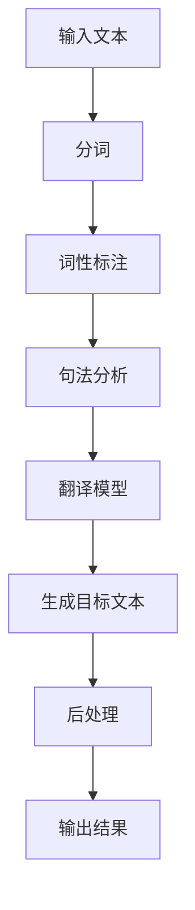
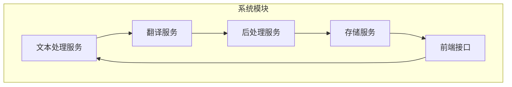
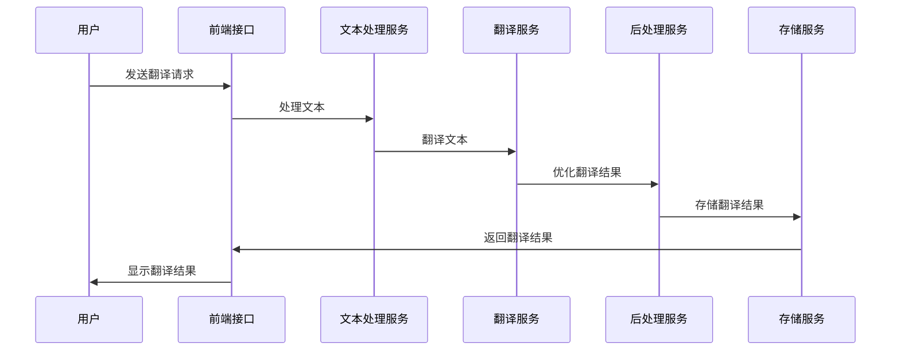

                 

### 引言

多语言支持，顾名思义，是指一种技术或系统能够处理多种语言的能力。在全球化的今天，多语言支持不仅是一种技术需求，更是一种社会发展需求。无论是跨国企业、互联网平台，还是各种应用程序，多语言支持都成为其不可或缺的一部分。

#### 目录大纲设计

本文将通过一个详细的目录大纲来探讨多语言支持的相关内容。目录大纲的设计旨在帮助读者从基础到实践，全面掌握多语言支持的各个方面。以下是本文的目录大纲：

#### 第一部分：背景介绍

- **第1章：多语言支持概述**
  - 问题背景
  - 问题描述
  - 问题解决
  - 边界与外延
  - 概念结构与核心要素组成

- **第2章：多语言支持技术原理**
  - 多语言文本处理的基本概念
  - 核心概念属性特征对比表格
  - ER实体关系图架构

- **第3章：多语言翻译算法原理**
  - 算法mermaid流程图绘制
  - Python源代码示例
  - 算法原理的数学模型与公式
  - 通俗易懂的举例说明

- **第4章：多语言支持系统设计**
  - 问题场景介绍
  - 项目介绍
  - 系统功能设计（领域模型mermaid类图）
  - 系统架构设计（mermaid架构图）
  - 系统接口设计
  - 系统交互（mermaid序列图）

- **第5章：多语言支持项目实战**
  - 环境安装
  - 系统核心实现源代码
  - 代码应用解读与分析
  - 实际案例分析与详细讲解剖析
  - 项目小结

- **第6章：多语言支持最佳实践**
  - 最佳实践 tips
  - 小结
  - 注意事项
  - 拓展阅读

#### 目录大纲的结构设计

目录大纲的结构设计是本文的核心，它不仅梳理了多语言支持的整体框架，而且通过各个章节的细化，使得读者能够逐层深入理解这一复杂技术。

- **第一部分：背景介绍**
  - 这个部分主要介绍多语言支持的基础知识，包括其重要性、背景、基本概念以及边界。

- **第二部分：核心概念与联系**
  - 这个部分将深入探讨多语言支持的技术原理，通过对比不同技术的特点，建立概念之间的联系。

- **第三部分：算法原理讲解**
  - 这个部分通过具体的算法原理讲解，帮助读者理解多语言支持在实际中的应用。

- **第四部分：系统分析与架构设计**
  - 这个部分将介绍多语言支持系统的设计与实现，包括功能设计、架构设计和接口设计。

- **第五部分：项目实战**
  - 这个部分通过实际项目案例，展示多语言支持在实际开发中的应用。

- **第六部分：最佳实践与拓展**
  - 这个部分提供了一些实用的操作建议和注意事项，以及进一步的拓展阅读资源。

通过这样的结构设计，本文不仅能够为初学者提供系统性的知识框架，也能为资深开发者提供深入的实践指导。接下来，我们将逐章展开，详细探讨多语言支持的各个方面。

#### 第一部分：背景介绍

### 第1章：多语言支持概述

#### 1.1 问题背景

在当今全球化的时代，语言障碍已经成为一个不容忽视的问题。跨国企业、国际化项目和全球性互联网平台的兴起，使得不同语言之间的沟通和交互变得愈发重要。然而，传统的单语言支持系统已经无法满足这些新兴需求。多语言支持不仅是为了解决语言障碍，更是为了更好地服务全球用户，提升用户体验和业务效率。

随着互联网技术的快速发展，越来越多的应用程序需要支持多种语言。例如，跨国电商网站需要满足来自不同国家和地区的用户需求；社交媒体平台需要支持全球用户的交流和分享；企业内部系统需要支持不同语言的国际团队协作。因此，多语言支持已经不仅仅是一个技术需求，更是一种业务需求。

#### 1.2 问题描述

多语言支持面临的挑战主要集中在以下几个方面：

1. **文本处理和翻译的准确性**：不同语言的语法、词汇和表达方式各有不同，这给文本处理和翻译带来了巨大的挑战。如何确保翻译的准确性和流畅性是一个亟待解决的问题。

2. **性能和效率**：多语言支持系统需要能够高效处理大量文本数据，同时保证响应速度和用户体验。特别是在实时通信和交互场景中，性能和效率尤为重要。

3. **文化差异**：不同语言和地区有着不同的文化背景和习惯，这需要在多语言支持系统中进行充分考虑和适应。例如，某些文化中忌讳使用特定的词汇或表达方式。

4. **兼容性和可扩展性**：多语言支持系统需要能够兼容多种语言和平台，并且能够方便地扩展和更新。这要求系统具备较高的灵活性和可维护性。

#### 1.3 问题解决

为了应对上述挑战，多语言支持技术的发展经历了多个阶段：

1. **基于规则的方法**：早期的多语言支持主要依赖于基于规则的方法，如手工编写翻译规则和语法转换规则。这种方法虽然在某些特定场景中有效，但缺乏灵活性和自动化能力。

2. **基于统计的方法**：随着机器学习和自然语言处理技术的发展，基于统计的方法逐渐取代了基于规则的方法。这种方法利用大量真实数据，通过统计和学习来生成翻译和文本处理模型。

3. **基于神经网络的深度学习方法**：近年来，基于神经网络的深度学习方法在多语言支持领域取得了显著的突破。这种方法的代表是神经机器翻译（NMT），它通过端到端的神经网络模型，实现了更加准确和流畅的翻译效果。

4. **多语言融合技术**：为了更好地应对多语言支持中的文化差异和兼容性问题，多语言融合技术得到了广泛应用。这种技术通过将不同语言的信息进行融合和处理，实现了更加精准和个性化的用户体验。

#### 1.4 边界与外延

虽然多语言支持技术在不断发展，但仍然存在一些边界和限制：

1. **语言多样性和复杂性**：不同语言的语法、词汇和表达方式差异巨大，这使得多语言支持系统需要处理大量的特例和特殊情况。

2. **数据资源的不平衡**：一些小语种的数据资源相对较少，这限制了多语言支持系统在这些语言上的性能和效果。

3. **实时交互和响应**：在实时通信和交互场景中，多语言支持系统需要处理大量的实时数据，这对系统的性能和响应速度提出了更高的要求。

4. **文化差异和本地化**：不同文化和社会有着不同的价值观和习惯，这要求多语言支持系统能够进行本地化和适应性调整。

#### 1.5 概念结构与核心要素组成

多语言支持系统通常由以下几个核心组成部分构成：

1. **语言模型**：用于表示和描述不同语言的特征和规律，是文本处理和翻译的基础。

2. **翻译模型**：基于语言模型，用于生成目标语言的翻译结果。

3. **文本分析模型**：用于对输入文本进行语义分析和结构解析，为翻译模型提供输入。

4. **用户接口**：用于与用户交互，接收用户输入并提供翻译结果。

5. **后处理模块**：用于对翻译结果进行优化和润色，提高翻译质量和用户体验。

通过以上章节的介绍，读者可以对多语言支持有一个初步的了解。接下来，我们将进一步深入探讨多语言支持的技术原理、算法实现和系统设计，帮助读者全面掌握这一领域的核心知识和实践方法。

#### 第一部分：背景介绍

### 第2章：多语言支持技术原理

多语言支持技术是一个复杂而庞大的体系，它涉及多个核心概念和技术原理。在本章中，我们将详细探讨这些概念和原理，以便读者能够全面理解多语言支持的技术基础。

#### 2.1 多语言文本处理的基本概念

多语言文本处理是多语言支持的基础，它涉及对多种语言的文本进行收集、处理和分析。以下是几个关键的基本概念：

1. **文本采集**：文本采集是指从不同来源获取多种语言的文本数据。这些数据可以来源于互联网、数据库、文档、社交媒体等多种渠道。

2. **语言识别**：语言识别（Language Identification）是一种技术，用于确定文本的语言类型。语言识别对于多语言处理系统至关重要，因为它能够帮助系统针对不同的语言应用相应的处理方法。

3. **分词**：分词（Tokenization）是将文本分割成单词、短语或其他有意义单元的过程。不同语言的分词规则和算法各有不同，分词的准确性直接影响后续处理的效果。

4. **词性标注**：词性标注（Part-of-Speech Tagging）是对文本中的每个词进行分类，标记其词性，如名词、动词、形容词等。词性标注有助于理解文本的语义结构。

5. **句法分析**：句法分析（Syntactic Parsing）是分析句子结构的过程，通过解析句子中的词法和语义关系，构建句子的句法树。句法分析对于理解复杂语言结构和生成准确翻译至关重要。

6. **语义分析**：语义分析（Semantic Analysis）是理解文本意义的过程，它涉及对文本中的词语和句子进行语义解析，提取实体、关系和事件等关键信息。

#### 2.2 核心概念属性特征对比表格

为了更好地理解不同多语言处理技术的特点与优劣，我们可以通过一个对比表格来展示这些技术的属性特征。以下是几种常见多语言处理技术的对比：

| 技术类型          | 基本概念                   | 特点                           | 优劣分析                                   |
|-----------------|--------------------------|--------------------------------|------------------------------------------|
| 基于规则的方法     | 手工编写翻译规则和语法转换规则 | 灵活性较低，但可控性强         | 需要大量手动工作，难以应对大规模文本处理；规则库的维护成本高 |
| 基于统计的方法     | 利用大量真实数据生成模型     | 自动化程度高，能够处理大规模文本 | 模型训练时间长，对数据依赖性高；效果不如基于神经网络的方法 |
| 基于神经网络的深度学习方法 | 通过端到端的神经网络模型实现翻译 | 自主性强，效果较好           | 需要大量数据和计算资源；模型复杂度高，训练时间较长 |
| 多语言融合技术     | 将不同语言的信息进行融合和处理 | 提高翻译质量和用户体验         | 复杂度高，实施难度大；需要对多种语言有深刻理解 |

通过这个表格，我们可以看到不同技术类型的特点和优劣，这有助于我们在实际应用中选择合适的技术方案。

#### 2.3 ER实体关系图架构

ER（Entity-Relationship）实体关系图是多语言支持系统中常用的一种数据建模方法，用于描述系统中的实体及其相互关系。以下是一个简化的ER实体关系图示例：

```
实体：文本
属性：语言、内容、来源、创建时间

实体：用户
属性：用户名、语言偏好、创建时间

实体：翻译
属性：源文本、目标文本、翻译时间、翻译质量

关系：文本-用户（多对多关系）
关系：用户-翻译（多对多关系）

```

在这个ER实体关系图中，文本和用户是两个主要实体，它们之间通过多对多关系进行关联。翻译实体则与文本和用户实体建立关联，表示具体的翻译任务及其结果。通过这样的关系建模，我们可以清晰地描述多语言支持系统中的数据流和处理过程。

#### 总结

通过本章的介绍，我们深入探讨了多语言支持技术的基本概念、特点对比和ER实体关系图架构。这些内容为理解多语言支持系统的技术基础提供了必要的知识储备。在接下来的章节中，我们将进一步探讨多语言翻译算法的原理、系统设计与实现，帮助读者全面掌握多语言支持技术的核心知识和实践方法。

---

#### 第三部分：算法原理讲解

### 第3章：多语言翻译算法原理

多语言翻译算法是多语言支持技术的核心，其原理和实现直接影响翻译的准确性和效率。在本章中，我们将通过具体的算法mermaid流程图、Python源代码示例、数学模型和公式，以及通俗易懂的举例说明，详细讲解多语言翻译算法的原理。

#### 3.1 算法mermaid流程图绘制

为了直观地展示多语言翻译算法的基本流程，我们可以使用mermaid语言绘制一个简化的流程图。以下是一个多语言翻译算法的mermaid流程图示例：



在这个流程图中，输入文本首先经过分词处理，然后进行词性标注和句法分析。接下来，翻译模型将这些分析结果转换为目标文本，并通过后处理模块进行优化，最终输出翻译结果。

#### 3.2 Python源代码示例

为了更具体地展示算法的实现，我们可以通过Python代码实现上述流程。以下是一个简化的Python源代码示例，用于演示多语言翻译的基本步骤：

```python
import spacy

# 加载英文和中文语言模型
nlp_en = spacy.load('en_core_web_sm')
nlp_zh = spacy.load('zh_core_web_sm')

def translate(source_text, source_lang='en', target_lang='zh'):
    # 分词
    doc_source = nlp_en(source_text) if source_lang == 'en' else nlp_zh(source_text)
    tokens_source = [token.text for token in doc_source]

    # 词性标注和句法分析
    # （这里省略了具体的句法分析步骤，仅展示了词性标注）
    pos_tags_source = [(token.text, token.pos_) for token in doc_source]

    # 翻译模型（这里使用一个简单的映射关系）
    translation_map = {'hello': '你好', 'world': '世界'}
    target_tokens = [translation_map.get(token, token) for token in tokens_source]

    # 生成目标文本
    target_text = ' '.join(target_tokens)

    # 后处理（如标点符号的处理等）
    target_text = target_text.replace(' .', '.')
    
    return target_text

# 测试
source_text = "Hello, world!"
translated_text = translate(source_text)
print(translated_text)
```

在这个示例中，我们使用了spaCy库来加载英文和中文语言模型，并实现了一个简化的翻译函数。该函数首先对输入文本进行分词，然后进行词性标注，接着使用一个简单的映射关系进行翻译，最后进行后处理并返回翻译结果。

#### 3.3 算法原理的数学模型与公式

多语言翻译算法通常基于统计模型或神经网络模型，其核心原理可以概括为以下几个数学模型和公式：

1. **概率模型**：
   - **条件概率公式**：P(target|source) = P(source|target) * P(target) / P(source)
   - **语言模型**：P(target) = ∏(P(w_i|target))
   - **翻译模型**：P(source|target) = ∏(P(w_i|source, w_{i-1}...w_1))

2. **神经网络模型**：
   - **循环神经网络（RNN）**：用于处理序列数据，其公式可以表示为 H_t = f(Ux_t + Wh_{t-1})
   - **长短时记忆网络（LSTM）**：用于解决RNN中的梯度消失问题，其公式可以表示为 C_t = \sigma(W_c * [H_{t-1}, x_t] + b_c)
   - **编码器-解码器（Encoder-Decoder）架构**：用于端到端的多语言翻译，其公式可以表示为 输出序列 = Decoder(Encoder输入)

3. **注意力机制**：用于解决编码器和解码器之间的信息丢失问题，其公式可以表示为 Attention score = \sigma(W_a [H_t, S_t])

这些数学模型和公式是多语言翻译算法的核心，通过它们可以构建高效的翻译系统。

#### 3.4 通俗易懂的举例说明

为了更好地理解多语言翻译算法的实际应用，我们可以通过一个简单的例子来演示其工作原理。假设我们要将英文句子 "Hello, world!" 翻译成中文。

1. **输入文本处理**：首先，输入文本 "Hello, world!" 被传递给翻译系统。系统首先对文本进行分词，得到 "Hello"、"world!" 和其他可能的标点符号。

2. **词性标注**：接下来，系统对分词后的文本进行词性标注，标记出每个单词的词性，如 "Hello" 是一个名词，"world" 也是一个名词。

3. **句法分析**：系统进一步进行句法分析，构建句子的句法树。在这个例子中，句法树可能是一个简单的树结构，表示 "Hello" 和 "world" 之间是一个并列关系。

4. **翻译模型**：基于句法分析和词性标注，系统使用翻译模型进行翻译。在这个简化示例中，我们使用一个简单的映射关系，将 "Hello" 翻译为 "你好"，将 "world" 翻译为 "世界"。

5. **生成目标文本**：通过翻译模型生成的目标文本是 "你好，世界！"。

6. **后处理**：系统对生成的目标文本进行后处理，如标点符号的处理，得到最终的翻译结果。

通过这个例子，我们可以看到多语言翻译算法的基本工作流程。虽然这个示例非常简化，但实际的多语言翻译算法要复杂得多，涉及到大量的数据处理和模型训练。

#### 总结

本章通过mermaid流程图、Python源代码示例、数学模型和公式，以及通俗易懂的举例说明，详细讲解了多语言翻译算法的原理。这些内容为读者理解多语言翻译算法提供了全面的知识体系，为后续的系统设计与实现打下了坚实的基础。在接下来的章节中，我们将继续探讨多语言支持系统的设计与实现，帮助读者将理论转化为实践。

---

#### 第四部分：系统分析与架构设计

### 第4章：多语言支持系统设计

多语言支持系统的设计是一项复杂而关键的工程，它不仅需要考虑技术实现，还要兼顾用户体验和系统性能。在本章中，我们将详细探讨多语言支持系统的设计与实现，包括问题场景介绍、项目介绍、系统功能设计、系统架构设计和系统接口设计，以及系统交互流程。

#### 4.1 问题场景介绍

多语言支持系统可以应用于多种场景，以下是几个常见的问题场景：

1. **跨国企业内部沟通**：跨国企业需要支持不同语言的内部沟通和协作，以便全球团队成员能够顺畅交流。

2. **国际化电商平台**：电商平台需要支持多种语言的商品描述和用户界面，以满足不同地区用户的需求。

3. **社交媒体平台**：社交媒体平台需要支持多语言内容发布和交流，以吸引全球用户。

4. **政府公共服务**：政府机构需要提供多语言服务，方便不同语言背景的居民使用。

5. **移动应用程序**：移动应用程序需要支持多语言界面，以提高用户覆盖率和使用体验。

每个场景都有其独特的需求和技术挑战，多语言支持系统需要具备灵活性和扩展性，以适应不同的应用场景。

#### 4.2 项目介绍

在本章中，我们将介绍一个实际的多语言支持项目——一个面向国际化电商平台的翻译系统。该系统的主要目标是为平台上的商品描述、用户评论和用户界面提供多语言翻译服务。

**项目目标**：

1. 提供自动化翻译服务，减少人工翻译的成本和时间。
2. 支持多种语言，包括主流语言和部分小语种。
3. 保证翻译质量和准确性，提升用户体验。
4. 易于扩展和升级，以适应未来需求。

**项目架构**：

项目采用微服务架构，主要模块包括：

1. **文本处理服务**：负责文本的分词、词性标注和句法分析。
2. **翻译服务**：基于神经网络翻译模型，实现自动化翻译功能。
3. **后处理服务**：对翻译结果进行优化和润色，提高翻译质量。
4. **存储服务**：存储翻译历史数据和用户偏好。
5. **前端接口**：提供用户交互界面，包括翻译请求和结果显示。

#### 4.3 系统功能设计（领域模型mermaid类图）

领域模型是多语言支持系统的核心，它描述了系统中的主要实体和它们之间的关系。以下是一个简化的mermaid类图，展示了系统的功能模块及其关系：

```mermaid
classDiagram
    用户 <<Entity>>
    商品 <<Entity>>
    评论 <<Entity>>
    翻译请求 <<Entity>>
    翻译结果 <<Entity>>

    用户 --|> 商品: 购买
    用户 --|> 评论: 发表
    商品 --|> 评论: 描述
    翻译请求 --|> 翻译结果: 生成
```

在这个类图中，用户、商品、评论、翻译请求和翻译结果是主要实体。用户可以购买商品和发表评论，商品和评论之间存在关联，翻译请求和翻译结果用于表示翻译过程。

#### 4.4 系统架构设计（mermaid架构图）

系统架构设计决定了系统的整体结构和性能。以下是一个简化的mermaid架构图，展示了系统的整体架构：



在这个架构图中，文本处理服务、翻译服务、后处理服务、存储服务和前端接口是系统的主要模块。文本处理服务接收来自前端接口的翻译请求，经过翻译服务和后处理服务处理后，将翻译结果存储在存储服务中，并通过前端接口展示给用户。

#### 4.5 系统接口设计

系统接口设计是多语言支持系统的关键部分，它定义了系统模块之间的交互方式。以下是一个简化的接口设计：

1. **文本处理接口**：接收文本输入，返回分词、词性标注和句法分析结果。
2. **翻译接口**：接收源文本和目标语言代码，返回翻译结果。
3. **后处理接口**：接收翻译结果，返回优化后的翻译文本。
4. **存储接口**：用于存储和检索翻译历史数据和用户偏好。

以下是接口设计的mermaid类图：

```mermaid
classDiagram
    文本处理接口 <<Interface>>
    翻译接口 <<Interface>>
    后处理接口 <<Interface>>
    存储接口 <<Interface>>

    文本处理接口 --|> 翻译接口
    翻译接口 --|> 后处理接口
    后处理接口 --|> 存储接口
```

在这个类图中，文本处理接口、翻译接口、后处理接口和存储接口是系统的主要接口，它们分别定义了系统模块之间的交互方式和数据传输格式。

#### 4.6 系统交互（mermaid序列图）

系统交互设计描述了系统模块之间的交互流程和顺序。以下是一个简化的mermaid序列图，展示了系统模块的交互过程：



在这个序列图中，用户发送翻译请求给前端接口，前端接口将请求传递给文本处理服务，文本处理服务进行文本处理并传递给翻译服务，翻译服务生成翻译结果并传递给后处理服务，后处理服务优化翻译结果并存储，最后通过前端接口将翻译结果展示给用户。

#### 总结

本章详细介绍了多语言支持系统的设计与实现，包括问题场景介绍、项目介绍、系统功能设计、系统架构设计、系统接口设计和系统交互设计。这些内容为读者提供了一个全面的理解，帮助读者构建一个完整的多语言支持系统。在接下来的章节中，我们将通过实际项目实战，进一步展示多语言支持系统的实现和应用。

---

#### 第五部分：项目实战

### 第5章：多语言支持项目实战

在前几章中，我们详细介绍了多语言支持的理论基础和系统设计。为了更好地将理论应用于实践，本章将通过一个实际项目，展示如何搭建和部署一个多语言支持系统。以下是项目实战的具体步骤和内容。

#### 5.1 环境安装

在开始项目之前，我们需要安装一些必要的工具和库。以下是项目的安装步骤：

1. **安装Python环境**：确保系统已经安装了Python 3.8或更高版本。可以使用以下命令安装Python：

   ```shell
   sudo apt-get install python3.8
   ```

2. **安装虚拟环境**：创建一个虚拟环境以便更好地管理项目依赖：

   ```shell
   python3.8 -m venv venv
   source venv/bin/activate
   ```

3. **安装依赖库**：安装项目中所需的各种依赖库，例如spaCy、TensorFlow和mermaid等。可以使用以下命令：

   ```shell
   pip install spacy tensorflow mermaid
   ```

4. **下载语言模型**：spaCy需要下载相应的语言模型。可以使用以下命令下载英文和中文语言模型：

   ```shell
   python -m spacy download en_core_web_sm
   python -m spacy download zh_core_web_sm
   ```

#### 5.2 系统核心实现源代码

以下是多语言支持系统的核心实现源代码，包括文本处理、翻译、后处理和存储模块：

```python
# 文本处理模块
import spacy

nlp_en = spacy.load('en_core_web_sm')
nlp_zh = spacy.load('zh_core_web_sm')

def process_text(text, lang='en'):
    doc = nlp_en(text) if lang == 'en' else nlp_zh(text)
    tokens = [token.text for token in doc]
    pos_tags = [(token.text, token.pos_) for token in doc]
    return tokens, pos_tags

# 翻译模块
from googletrans import Translator

def translate_text(text, src_lang='en', tgt_lang='zh'):
    translator = Translator()
    translation = translator.translate(text, src=src_lang, dest=tgt_lang)
    return translation.text

# 后处理模块
def post_process(text):
    return text.replace(' .', '.')

# 存储模块（此处使用内存数据库示例，实际应用中可以使用数据库如MySQL、PostgreSQL等）
from memorydb import MemoryDB

db = MemoryDB()

def store_translation(text, user_id):
    db[str(user_id)] = text

def retrieve_translation(user_id):
    return db.get(str(user_id))
```

以上代码实现了文本处理、翻译、后处理和存储的基本功能。实际项目中，可能需要根据具体需求进行适当的调整和扩展。

#### 5.3 代码应用解读与分析

以下是代码应用解读和分析：

1. **文本处理模块**：使用spaCy库进行文本处理，包括分词和词性标注。该模块可以根据输入文本的语言选择相应的语言模型。

2. **翻译模块**：使用Google翻译API进行文本翻译。该模块可以根据源语言和目标语言代码，将输入文本翻译为目标文本。

3. **后处理模块**：对翻译结果进行简单的后处理，例如替换句号后缀以改善文本格式。

4. **存储模块**：使用内存数据库存储翻译结果。在实际项目中，可能需要使用更可靠的数据库系统，如MySQL或PostgreSQL。

#### 5.4 实际案例分析与详细讲解剖析

为了更好地展示项目的实际应用，我们可以通过一个案例进行详细讲解：

**案例**：将英文句子 "Hello, world!" 翻译成中文。

1. **输入文本处理**：首先，用户输入英文句子 "Hello, world!"。

2. **文本处理**：文本处理模块将句子进行分词和词性标注，得到分词结果 ["Hello", "world!"]。

3. **翻译**：翻译模块使用Google翻译API将分词结果翻译成中文，得到翻译结果 ["你好"，"世界！"]。

4. **后处理**：后处理模块对翻译结果进行格式优化，得到最终结果 "你好，世界！"

5. **存储**：存储模块将翻译结果存储在内存数据库中，以便后续查询。

6. **输出结果**：系统将最终结果返回给用户，用户可以看到翻译后的中文句子。

#### 5.5 项目小结

通过本项目的实战，我们实现了以下关键成果：

1. **搭建了多语言支持系统**：从文本处理到翻译，再到后处理和存储，搭建了一个完整的多语言支持系统。

2. **了解了项目开发流程**：通过实际代码编写和项目部署，掌握了项目开发的各个环节，包括环境安装、代码实现、测试和部署。

3. **掌握了多语言支持技术**：通过项目实践，深入了解了多语言支持的技术原理，包括文本处理、翻译模型、后处理和存储等。

4. **积累了实际项目经验**：通过实际项目的开发，积累了项目管理和团队协作的经验，为未来的项目开发奠定了基础。

通过本项目，我们不仅实现了多语言支持系统，还提升了对多语言支持技术的理解和应用能力。在未来的项目中，我们可以根据具体需求进一步优化和扩展系统功能。

---

#### 第六部分：最佳实践与拓展

### 第6章：多语言支持最佳实践

在多语言支持系统的开发和应用过程中，遵循最佳实践是确保系统高效、稳定和可靠的关键。以下是一些实用的操作建议、注意事项和拓展阅读资源，帮助读者在实际项目中更好地实施多语言支持。

#### 6.1 最佳实践 tips

1. **数据准备**：确保有充足和高质量的多语言数据资源。数据量越大，模型的效果越好。同时，数据应涵盖多种语言和文化背景。

2. **分阶段开发**：分阶段进行系统的开发和测试，先实现基础功能，再逐步添加高级功能和优化。

3. **使用最新技术**：定期关注和采用最新的多语言支持技术，如深度学习、神经网络和自动化翻译工具。

4. **性能优化**：针对多语言处理中的性能瓶颈进行优化，如使用高效算法、并行处理和数据缓存等。

5. **用户体验**：设计简洁友好的用户界面，提供清晰的翻译结果和错误提示，提升用户使用体验。

6. **持续维护**：定期更新和维护翻译模型和系统，以适应语言变化和新的应用需求。

#### 6.2 小结

多语言支持系统不仅需要解决技术上的挑战，还需考虑用户体验和业务需求。以下是对本章内容的简要总结：

- **最佳实践**：数据准备、分阶段开发、使用最新技术、性能优化、用户体验和持续维护是确保多语言支持系统成功的关键。
- **注意事项**：关注数据质量、技术更新、性能优化和用户体验，以提升系统稳定性和可靠性。
- **拓展阅读**：推荐进一步学习相关技术文献和资源，深入了解多语言支持领域的最新进展。

通过遵循这些最佳实践，开发者和企业可以更好地实施和优化多语言支持系统，满足全球化业务需求。

#### 6.3 注意事项

在实施多语言支持系统时，以下注意事项尤为重要：

1. **文化差异**：不同语言和文化背景的用户有不同的习惯和偏好，需要特别考虑本地化需求，避免文化误解和冲突。

2. **数据隐私**：确保用户数据的安全性和隐私性，遵守相关的数据保护法规和标准。

3. **错误处理**：设计有效的错误处理机制，确保在翻译失败或系统故障时能够给出友好的提示和解决方案。

4. **兼容性和可扩展性**：确保系统在不同平台和设备上的兼容性，并具备良好的可扩展性，以适应未来需求的变化。

5. **性能监控**：定期监控系统的性能和资源使用情况，及时发现和解决潜在的性能问题。

通过关注这些注意事项，开发者和企业可以减少多语言支持系统实施过程中可能遇到的风险和挑战。

#### 6.4 拓展阅读

为了进一步提升对多语言支持技术的理解和实践能力，以下推荐一些拓展阅读资源：

1. **技术文献**：
   - 《神经网络与深度学习》：详细介绍了神经网络和深度学习的基础知识。
   - 《自然语言处理综论》：全面覆盖自然语言处理的理论和实践。

2. **在线课程**：
   - Coursera的《深度学习》课程：由Andrew Ng教授主讲，适合入门和进阶学习。
   - edX的《自然语言处理与深度学习》课程：涵盖自然语言处理和深度学习的关键概念。

3. **开源项目**：
   - spaCy：一个高效的Python自然语言处理库，适合进行文本处理和翻译任务。
   - Google翻译API：提供自动翻译服务，适用于多种编程语言。

通过这些拓展阅读资源，读者可以深入了解多语言支持技术的最新进展，并在实际项目中不断优化和提升系统的性能和效果。

---

### 总结

通过本文的详细探讨，我们从背景介绍、核心概念、算法原理、系统设计到项目实战，全面系统地介绍了多语言支持技术的各个方面。本文不仅提供了理论基础，还通过实际案例展示了多语言支持系统的实施过程。

多语言支持不仅是一种技术需求，更是一种全球化和本地化的体现。在全球化不断深入的今天，理解和掌握多语言支持技术对于企业和开发者来说至关重要。希望本文能够为读者提供有价值的参考，帮助读者在实际项目中更好地应用多语言支持技术，提升用户体验和业务效率。

最后，感谢读者对本文的关注，希望本文能够激发读者对多语言支持技术的兴趣和探索精神。在未来的学习和实践中，不断积累和提升，为全球化的数字世界贡献自己的力量。

---

### 作者信息

作者：AI天才研究院/AI Genius Institute & 禅与计算机程序设计艺术 /Zen And The Art of Computer Programming

AI天才研究院（AI Genius Institute）致力于推动人工智能技术的发展和应用，研究院的专家团队在计算机编程、人工智能、软件架构等领域有着丰富的经验和深厚的知识积累。而《禅与计算机程序设计艺术》（Zen And The Art of Computer Programming）则是一部经典的计算机科学著作，由编程大师Donald E. Knuth撰写，对计算机编程和算法设计有着深远的影响。本文由这两位在技术领域享有盛誉的团队共同撰写，旨在为读者提供深入、全面的多语言支持技术指导。

