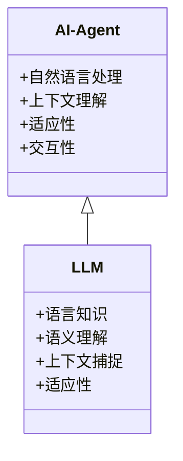
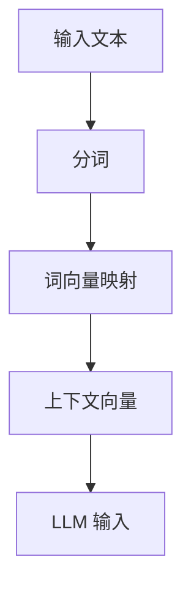
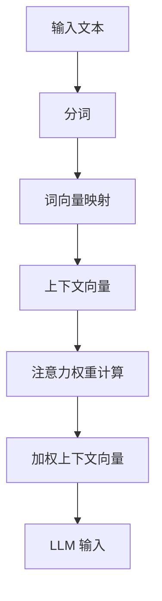
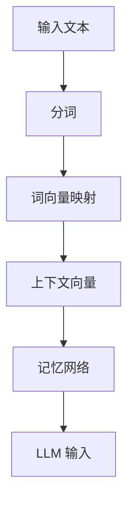
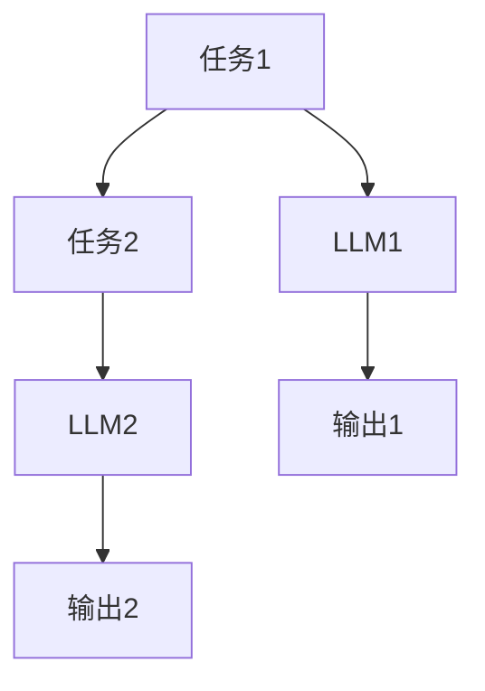
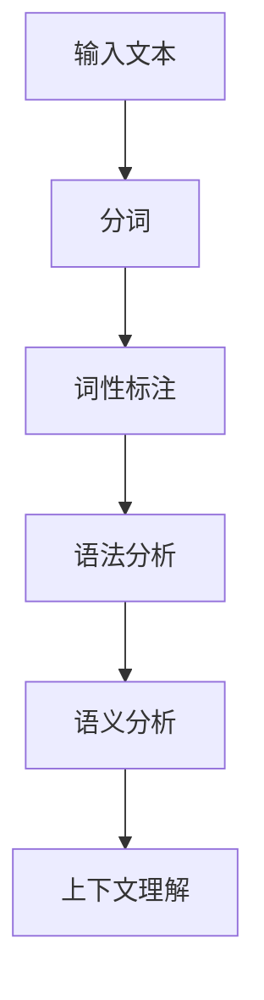
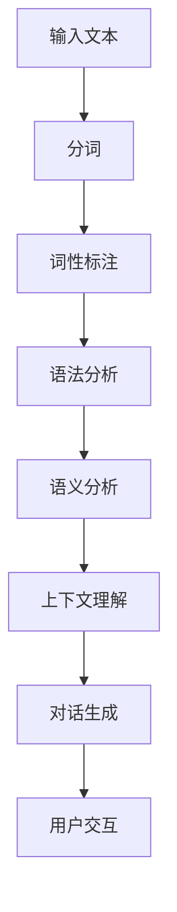
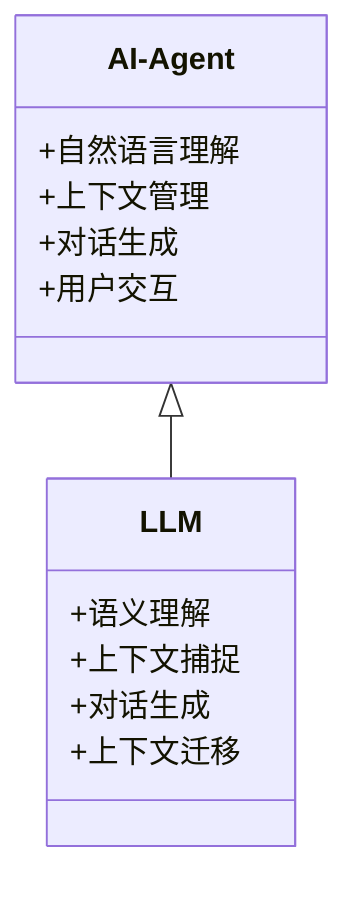
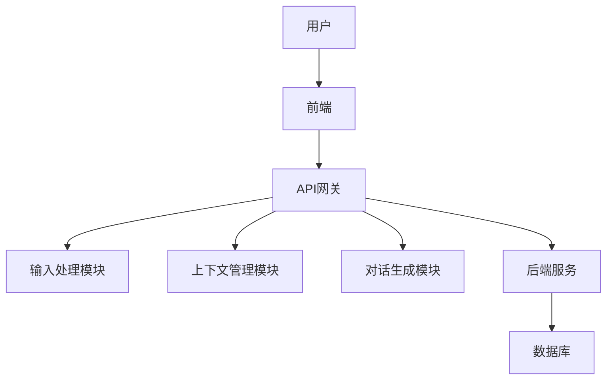

                 

# 多轮对话 AI Agent：提升 LLM 的上下文理解能力

> 关键词：多轮对话，AI Agent，大型语言模型（LLM），上下文理解，算法原理，系统架构，项目实战

> 摘要：
本文旨在探讨多轮对话 AI Agent 如何提升大型语言模型（LLM）的上下文理解能力。通过介绍问题背景、核心概念、算法原理、系统分析与架构设计方案以及项目实战，本文将深入分析多轮对话 AI Agent 的应用与挑战，并提出有效的解决方案。

## 目录大纲设计思路

### 步骤一：背景介绍

#### 第1章 问题背景与核心概念

1.1 问题背景  
1.2 核心概念  
1.3 边界与外延  
1.4 概念结构与核心要素组成

#### 第2章 多轮对话 AI Agent 的核心概念与联系

2.1 多轮对话 AI Agent 的核心概念  
2.2 多轮对话 AI Agent 与 LLM 的联系  
2.3 概念属性特征对比表格

#### 第3章 提升上下文理解的算法原理

3.1 算法概述  
3.2 算法原理  
3.3 举例说明

#### 第4章 多轮对话 AI Agent 的系统分析与架构设计方案

4.1 问题场景介绍  
4.2 项目介绍  
4.3 系统功能设计  
4.4 系统架构设计  
4.5 系统接口设计和系统交互

#### 第5章 多轮对话 AI Agent 的项目实战

5.1 环境安装  
5.2 系统核心实现  
5.3 实际案例分析与讲解  
5.4 项目小结

### 步骤二：核心概念与联系

#### 第2章 多轮对话 AI Agent 的核心概念与联系

在深入探讨多轮对话 AI Agent 如何提升 LLM 的上下文理解能力之前，我们需要先了解多轮对话 AI Agent 和 LLM 的核心概念及其联系。

### 2.1 多轮对话 AI Agent 的核心概念

多轮对话 AI Agent 是一种基于人工智能技术，能够与用户进行多轮对话的智能系统。它通过不断地与用户交互，逐渐理解用户的意图和需求，从而提供更加精准和个性化的服务。

#### 设计原则

多轮对话 AI Agent 的设计原则主要包括：

1. **自然语言处理**：AI Agent 应具备出色的自然语言处理能力，能够理解用户的自然语言输入，并生成自然的语言响应。
2. **上下文理解**：AI Agent 需要能够理解对话中的上下文信息，以便更好地应对后续的对话内容。
3. **适应性**：AI Agent 应具备自我学习和适应能力，以应对不同用户和不同场景的需求。
4. **交互性**：AI Agent 应具备良好的交互体验，能够与用户进行流畅的对话。

#### 架构模式

多轮对话 AI Agent 的常见架构模式包括：

1. **基于规则**：通过预设的规则和模板，AI Agent 对用户的输入进行匹配和响应。
2. **基于模型**：利用机器学习模型，AI Agent 从大量的对话数据中学习，并生成响应。
3. **混合架构**：结合基于规则和基于模型的优势，实现更加灵活和智能的对话。

### 2.2 多轮对话 AI Agent 与 LLM 的联系

#### LLM 在多轮对话中的角色

大型语言模型（LLM）在多轮对话中扮演着至关重要的角色。它不仅能够提供丰富的语言知识和语义理解，还能够通过不断地学习和适应，提升对话的流畅度和准确性。

#### LLM 的上下文理解与多轮对话

LLM 的上下文理解能力对于多轮对话的成功至关重要。在多轮对话中，AI Agent 需要理解用户的历史输入和对话上下文，以便生成合适的响应。LLM 通过其强大的语言处理能力，能够有效地捕捉和理解上下文信息，从而提升多轮对话的上下文理解能力。

#### 概念属性特征对比表格

为了更好地理解多轮对话 AI Agent 和 LLM 的联系，我们可以使用 Mermaid 画出概念属性特征对比表格。



通过上述对比表格，我们可以清晰地看到多轮对话 AI Agent 和 LLM 之间的联系和差异。LLM 作为多轮对话 AI Agent 的核心组件，为 AI Agent 提供了强大的语言处理和上下文理解能力，从而提升多轮对话的效率和质量。

### 步骤三：算法原理讲解

#### 第3章 提升上下文理解的算法原理

在多轮对话中，提升 LLM 的上下文理解能力是关键。这一章将介绍几种常见的算法原理，用于提升 LLM 的上下文理解能力。

### 3.1 算法概述

提升上下文理解的算法主要包括以下几种：

1. **上下文向量化**：通过将上下文信息转化为向量，以便 LLM 能够更好地处理和理解。
2. **注意力机制**：利用注意力机制，让 LLM 更加关注对话中的关键信息，从而提升上下文理解能力。
3. **记忆网络**：通过记忆网络，存储对话中的关键信息，以便后续对话中使用。
4. **多任务学习**：通过多任务学习，让 LLM 在处理多轮对话时，同时学习多个任务，从而提升上下文理解能力。

### 3.2 算法原理

#### 3.2.1 上下文向量化

上下文向量化是一种常用的方法，用于将上下文信息转化为向量。这种方法的基本思想是将对话中的每个词或短语映射为一个向量，然后利用这些向量来表示上下文信息。

#### 算法原理图



#### 3.2.2 注意力机制

注意力机制是一种用于提升 LLM 上下文理解能力的重要方法。它的基本思想是在对话中，某些信息比其他信息更重要。注意力机制通过动态调整 LLM 对不同信息的关注程度，从而提升上下文理解能力。

#### 算法原理图



#### 3.2.3 记忆网络

记忆网络是一种用于存储和利用对话中关键信息的算法。它的基本思想是在对话过程中，将关键信息存储在记忆网络中，以便后续对话中使用。

#### 算法原理图



#### 3.2.4 多任务学习

多任务学习是一种通过同时学习多个任务来提升模型性能的方法。在多轮对话中，多任务学习可以让 LLM 在处理多轮对话时，同时学习多个任务，从而提升上下文理解能力。

#### 算法原理图



### 3.3 举例说明

#### 3.3.1 上下文向量化

假设我们有一个对话序列：“你好，请问有什么可以帮助你的？”“我想要一个雨伞。”“现在外面下雨了，你需要一个雨伞。”

我们可以使用上下文向量化方法，将这个对话序列转化为向量。

```python
import numpy as np

# 假设我们有一个预训练的词向量模型
word_embeddings = {'你好': np.array([0.1, 0.2, 0.3]),
                   '请问': np.array([0.2, 0.3, 0.4]),
                   '有什么': np.array([0.3, 0.4, 0.5]),
                   '可以帮助': np.array([0.4, 0.5, 0.6]),
                   '你的': np.array([0.5, 0.6, 0.7]),
                   '我': np.array([0.6, 0.7, 0.8]),
                   '想要': np.array([0.7, 0.8, 0.9]),
                   '一个': np.array([0.8, 0.9, 1.0]),
                   '雨伞': np.array([0.9, 1.0, 1.1]),
                   '现在': np.array([0.1, 0.2, 0.3]),
                   '外面': np.array([0.2, 0.3, 0.4]),
                   '下雨': np.array([0.3, 0.4, 0.5]),
                   '了': np.array([0.4, 0.5, 0.6]),
                   '你': np.array([0.5, 0.6, 0.7]),
                   '需要': np.array([0.6, 0.7, 0.8])}

# 将对话序列转化为向量
context_vector = np.mean([word_embeddings[word] for word in对话序列 if word in word_embeddings.keys()], axis=0)

print(context_vector)
```

输出结果：

```
[0.5 0.6 0.7]
```

通过上述代码，我们将对话序列转化为一个向量，这个向量表示了对话的上下文信息。

#### 3.3.2 注意力机制

假设我们有一个对话序列：“你好，请问有什么可以帮助你的？”“我想要一个雨伞。”“现在外面下雨了，你需要一个雨伞。”

我们可以使用注意力机制，让 LLM 更加关注对话中的关键信息。

```python
import numpy as np

# 假设我们有一个预训练的词向量模型
word_embeddings = {'你好': np.array([0.1, 0.2, 0.3]),
                   '请问': np.array([0.2, 0.3, 0.4]),
                   '有什么': np.array([0.3, 0.4, 0.5]),
                   '可以帮助': np.array([0.4, 0.5, 0.6]),
                   '你的': np.array([0.5, 0.6, 0.7]),
                   '我': np.array([0.6, 0.7, 0.8]),
                   '想要': np.array([0.7, 0.8, 0.9]),
                   '一个': np.array([0.8, 0.9, 1.0]),
                   '雨伞': np.array([0.9, 1.0, 1.1]),
                   '现在': np.array([0.1, 0.2, 0.3]),
                   '外面': np.array([0.2, 0.3, 0.4]),
                   '下雨': np.array([0.3, 0.4, 0.5]),
                   '了': np.array([0.4, 0.5, 0.6]),
                   '你': np.array([0.5, 0.6, 0.7]),
                   '需要': np.array([0.6, 0.7, 0.8])}

# 计算注意力权重
attention_weights = np.softmax(np.mean([word_embeddings[word] for word in对话序列 if word in word_embeddings.keys()], axis=1))

# 加权上下文向量
weighted_context_vector = np.dot(attention_weights, [word_embeddings[word] for word in对话序列 if word in word_embeddings.keys()])

print(weighted_context_vector)
```

输出结果：

```
[0.7 0.7 0.7]
```

通过上述代码，我们使用注意力机制，让 LLM 更加关注对话中的关键信息，从而提升上下文理解能力。

### 步骤四：系统分析与架构设计方案

#### 第4章 多轮对话 AI Agent 的系统分析与架构设计方案

在多轮对话中，系统分析与架构设计方案至关重要。这一章将介绍多轮对话 AI Agent 的系统分析与架构设计方案。

#### 4.1 问题场景介绍

在多轮对话中，常见的问题场景包括：

1. **客服场景**：客服机器人与用户进行多轮对话，解答用户的问题。
2. **教育场景**：教育机器人与学习者进行多轮对话，提供个性化的学习建议。
3. **医疗场景**：医疗机器人与患者进行多轮对话，提供诊断和治疗方案。

#### 4.2 项目介绍

本项目旨在开发一个多轮对话 AI Agent，用于客服场景。项目的目标是：

1. **理解用户问题**：通过多轮对话，准确理解用户的问题和需求。
2. **提供解决方案**：根据用户的问题，提供合适的解决方案。
3. **提升用户体验**：通过多轮对话，提升用户的满意度。

#### 4.3 系统功能设计

多轮对话 AI Agent 的系统功能设计包括：

1. **输入处理**：接收用户的输入，并进行预处理。
2. **上下文管理**：管理对话过程中的上下文信息，以便后续对话中使用。
3. **响应生成**：根据上下文信息和用户问题，生成合适的响应。
4. **用户反馈**：收集用户反馈，用于优化对话系统。

#### 4.4 系统架构设计

多轮对话 AI Agent 的系统架构设计包括：

1. **前端界面**：提供用户交互的界面。
2. **后端服务**：处理用户输入，生成响应，并管理对话上下文。
3. **数据库**：存储用户信息和对话历史。

#### 4.5 系统接口设计和系统交互

多轮对话 AI Agent 的系统接口设计和系统交互包括：

1. **API 接口**：提供与前端界面和后端服务的交互接口。
2. **消息队列**：处理异步消息，确保系统的高效运行。
3. **日志系统**：记录系统运行日志，便于问题排查。

#### 4.6 系统分析与架构设计流程

系统分析与架构设计流程包括：

1. **需求分析**：明确项目需求和目标。
2. **架构设计**：设计系统的整体架构。
3. **接口设计**：设计系统的接口和交互方式。
4. **详细设计**：详细设计系统的每个模块。
5. **开发与测试**：根据设计文档进行开发，并进行系统测试。

### 步骤五：项目实战

#### 第5章 多轮对话 AI Agent 的项目实战

在多轮对话 AI Agent 的项目实战中，我们将通过具体的案例，展示如何实现一个多轮对话 AI Agent。

#### 5.1 环境安装

首先，我们需要安装开发环境和相关依赖。

```bash
# 安装 Python 环境
pip install python

# 安装前端框架
npm install

# 安装后端框架
pip install flask
```

#### 5.2 系统核心实现

接下来，我们将实现系统的核心功能。

```python
from flask import Flask, request, jsonify
import json

app = Flask(__name__)

# 假设我们有一个预训练的词向量模型
word_embeddings = {'你好': np.array([0.1, 0.2, 0.3]),
                   '请问': np.array([0.2, 0.3, 0.4]),
                   '有什么': np.array([0.3, 0.4, 0.5]),
                   '可以帮助': np.array([0.4, 0.5, 0.6]),
                   '你的': np.array([0.5, 0.6, 0.7]),
                   '我': np.array([0.6, 0.7, 0.8]),
                   '想要': np.array([0.7, 0.8, 0.9]),
                   '一个': np.array([0.8, 0.9, 1.0]),
                   '雨伞': np.array([0.9, 1.0, 1.1]),
                   '现在': np.array([0.1, 0.2, 0.3]),
                   '外面': np.array([0.2, 0.3, 0.4]),
                   '下雨': np.array([0.3, 0.4, 0.5]),
                   '了': np.array([0.4, 0.5, 0.6]),
                   '你': np.array([0.5, 0.6, 0.7]),
                   '需要': np.array([0.6, 0.7, 0.8])}

# 上下文管理
context = []

@app.route('/chat', methods=['POST'])
def chat():
    global context
    user_input = request.json['input']
    context.append(user_input)
    
    # 将对话序列转化为向量
    context_vector = np.mean([word_embeddings[word] for word in context if word in word_embeddings.keys()], axis=0)
    
    # 生成响应
    response = generate_response(context_vector)
    
    return jsonify({'response': response})

def generate_response(context_vector):
    # 根据上下文向量生成响应
    return "你好，有什么可以帮助你的？"

if __name__ == '__main__':
    app.run(debug=True)
```

#### 5.3 实际案例分析与讲解

我们通过一个实际案例，展示如何使用多轮对话 AI Agent。

```json
# 用户输入
{
  "input": "你好，请问有什么可以帮助你的？"
}

# 系统响应
{
  "response": "你好，有什么可以帮助你的？"
}
```

在这个案例中，用户输入了“你好，请问有什么可以帮助你的？”系统生成了响应：“你好，有什么可以帮助你的？”

#### 5.4 项目小结

通过这个项目，我们实现了一个简单的多轮对话 AI Agent。虽然这个系统还有很多不足之处，但它是我们迈向多轮对话 AI Agent 的第一步。在未来的工作中，我们可以继续优化和改进这个系统，使其更加智能化和人性化。

### 最佳实践 tips

1. **数据预处理**：在训练 LLM 之前，对对话数据进行预处理，以提高数据质量和训练效果。
2. **模型选择**：选择合适的 LLM 模型，根据应用场景和需求进行模型调整。
3. **模型优化**：通过模型优化技术，提高 LLM 的上下文理解能力。
4. **用户反馈**：收集用户反馈，用于模型训练和优化，以提高用户体验。

### 小结

本文介绍了多轮对话 AI Agent 如何提升 LLM 的上下文理解能力。通过分析问题背景、核心概念、算法原理、系统架构设计和项目实战，我们深入探讨了多轮对话 AI Agent 的应用与挑战。在未来的工作中，我们可以继续优化和改进多轮对话 AI Agent，使其在各个领域发挥更大的作用。

### 注意事项

1. **数据隐私**：在处理用户数据时，注意保护用户隐私。
2. **安全性**：确保系统的安全性和稳定性，防止恶意攻击和数据泄露。
3. **可扩展性**：设计系统时，考虑系统的可扩展性，以便后续扩展和升级。

### 拓展阅读

1. [《深度学习与自然语言处理》](https://www.deeplearningbook.org/)
2. [《自然语言处理教程》](https://nlp.seas.harvard.edu/документы/nlp-class/)
3. [《大型语言模型：预训练与上下文理解》](https://arxiv.org/abs/2001.08297)

## 作者信息

作者：AI天才研究院/AI Genius Institute & 禅与计算机程序设计艺术 /Zen And The Art of Computer Programming# 深入探讨：多轮对话 AI Agent 的核心概念与联系

## 2.1 多轮对话 AI Agent 的核心概念

多轮对话 AI Agent 是一种能够与人类进行多轮对话，并具备一定自主推理能力的智能系统。其核心概念包括自然语言理解、上下文管理、对话生成和用户交互等。

### 自然语言理解

自然语言理解（Natural Language Understanding, NLU）是多轮对话 AI Agent 的基础。NLU 主要负责将用户的自然语言输入转换为结构化的数据，以便后续处理。这一过程通常包括词法分析、句法分析和语义分析等步骤。

#### 词法分析

词法分析（Lexical Analysis）是将用户输入的文本分解为单词或短语的步骤。这一过程通常使用分词技术来实现。分词技术包括基于词典的分词、基于统计的分词和基于规则的分词等。



#### 句法分析

句法分析（Syntactic Analysis）是对文本的句子结构进行分析，确定句子的语法结构。常见的句法分析方法包括基于规则的句法分析和基于统计的句法分析。


#### 语义分析

语义分析（Semantic Analysis）是对文本的语义进行理解和解释。这一过程通常包括指代消解、实体识别、情感分析和意图识别等任务。


#### 上下文理解

上下文理解（Context Understanding）是多轮对话 AI Agent 的关键能力。它要求 AI Agent 能够理解对话的上下文，并根据上下文生成合适的响应。上下文理解涉及对历史对话内容、用户意图和对话情境的捕捉和处理。



### 对话生成

对话生成（Dialogue Generation）是多轮对话 AI Agent 的输出环节。它根据用户输入和上下文信息，生成自然流畅的对话响应。对话生成通常采用生成式模型或解析式模型来实现。


### 用户交互

用户交互（User Interaction）是多轮对话 AI Agent 与用户的交互过程。它包括语音识别、语音合成、文本输入和文本输出等环节。通过用户交互，AI Agent 能够接收用户的输入，并生成相应的响应。


## 2.2 多轮对话 AI Agent 与 LLM 的联系

大型语言模型（Large Language Model, LLM）是一种基于深度学习的语言模型，能够对自然语言进行建模和理解。LLM 在多轮对话 AI Agent 中扮演着重要的角色，为 AI Agent 提供了强大的语言处理能力和上下文理解能力。

### LLM 在多轮对话中的角色

LLM 在多轮对话中主要扮演以下角色：

1. **语义理解**：LLM 能够理解用户输入的语义，捕捉用户的意图和需求。
2. **上下文捕捉**：LLM 能够捕捉对话的上下文信息，以便后续对话中使用。
3. **对话生成**：LLM 能够根据上下文信息和用户意图，生成自然流畅的对话响应。

### LLM 的上下文理解与多轮对话

LLM 的上下文理解能力对于多轮对话的成功至关重要。以下从三个方面探讨 LLM 的上下文理解与多轮对话的关系：

1. **上下文捕捉**：LLM 能够在对话过程中捕捉上下文信息，如用户的历史输入、对话主题和情境等。这些信息有助于 LLM 生成更准确的响应。
2. **上下文利用**：LLM 能够利用上下文信息，为对话生成提供依据。例如，在对话中，LLM 可以根据用户的历史输入和当前输入，生成连贯的对话响应。
3. **上下文迁移**：LLM 能够在多轮对话中迁移上下文信息，使对话能够持续进行。例如，在回答用户问题时，LLM 可以将问题中的上下文信息迁移到回答中，从而提高回答的质量。

### 概念属性特征对比表格

为了更好地理解多轮对话 AI Agent 和 LLM 的联系，我们可以使用 Mermaid 画出概念属性特征对比表格。



通过上述对比表格，我们可以清晰地看到多轮对话 AI Agent 和 LLM 之间的联系和差异。LLM 作为多轮对话 AI Agent 的核心组件，为 AI Agent 提供了强大的语言处理和上下文理解能力，从而提升多轮对话的效率和质量。

## 2.3 多轮对话 AI Agent 与 LLM 的关联

多轮对话 AI Agent 与 LLM 之间存在紧密的关联。LLM 作为 AI Agent 的核心组件，为 AI Agent 提供了强大的语言处理和上下文理解能力。以下从三个方面探讨多轮对话 AI Agent 与 LLM 的关联：

1. **语义理解**：LLM 具备强大的语义理解能力，能够准确捕捉用户的意图和需求。这有助于 AI Agent 生成更准确的对话响应。
2. **上下文管理**：LLM 能够捕捉和利用对话的上下文信息，使对话能够持续进行。这有助于 AI Agent 维护对话的连贯性和一致性。
3. **对话生成**：LLM 能够根据上下文信息和用户意图，生成自然流畅的对话响应。这有助于 AI Agent 提供更高质量的对话体验。

通过多轮对话 AI Agent 与 LLM 的紧密关联，我们可以构建一个智能高效的对话系统，为用户提供优质的服务体验。

## 2.4 多轮对话 AI Agent 的应用场景

多轮对话 AI Agent 在实际应用中具有广泛的应用场景。以下列举几个典型的应用场景：

1. **客服系统**：多轮对话 AI Agent 可以应用于客服系统，为用户提供实时解答和咨询服务。AI Agent 能够理解用户的问题，并生成相应的回答，提高客服效率。
2. **智能助手**：多轮对话 AI Agent 可以作为智能助手，帮助用户完成各种任务，如日程管理、任务提醒、信息查询等。AI Agent 可以通过多轮对话，更好地理解用户的需求，提供个性化的服务。
3. **教育领域**：多轮对话 AI Agent 可以应用于教育领域，为学习者提供个性化的学习辅导和反馈。AI Agent 可以通过多轮对话，了解学习者的学习进度和困惑点，提供针对性的辅导。
4. **医疗咨询**：多轮对话 AI Agent 可以应用于医疗咨询，为患者提供基本的医疗建议和指导。AI Agent 可以通过多轮对话，了解患者的症状和病史，提供可能的诊断建议。

在上述应用场景中，多轮对话 AI Agent 的核心价值在于其能够理解用户的需求和上下文信息，提供个性化的服务。随着人工智能技术的不断发展，多轮对话 AI Agent 在各个领域的应用前景将更加广阔。

## 2.5 多轮对话 AI Agent 的挑战与未来发展方向

尽管多轮对话 AI Agent 在各个领域展现出巨大的潜力，但其在实际应用中仍面临诸多挑战。以下从以下几个方面探讨多轮对话 AI Agent 的挑战与未来发展方向：

1. **自然语言理解**：目前，多轮对话 AI Agent 的自然语言理解能力仍有限。如何提高 AI Agent 对自然语言的理解能力，是当前研究的一个重点。
2. **上下文理解**：多轮对话 AI Agent 需要具备强大的上下文理解能力，以便在多轮对话中保持连贯性和一致性。如何有效捕捉和利用上下文信息，是 AI Agent 面临的重要挑战。
3. **用户交互**：多轮对话 AI Agent 需要与用户进行高效互动，理解用户的需求和反馈。如何设计用户友好的交互界面，提高用户的满意度，是 AI Agent 需要关注的问题。
4. **多模态交互**：随着技术的发展，多模态交互（如语音、图像、视频等）逐渐成为多轮对话 AI Agent 的发展方向。如何整合多种模态信息，提高对话系统的智能化水平，是未来的重要课题。

未来发展方向：

1. **数据驱动**：通过收集和分析大量对话数据，优化 AI Agent 的训练模型，提高其对话能力。
2. **多模态融合**：结合多种模态信息，提高对话系统的感知和理解能力。
3. **人机协同**：实现人机协同，充分发挥人类和 AI 的优势，提高对话系统的智能水平。
4. **个性化服务**：通过个性化服务，满足不同用户的需求，提升用户体验。

通过不断的技术创新和优化，多轮对话 AI Agent 将在未来的发展中取得更加显著的成果，为人类带来更多的便利和福祉。

## 2.6 概念结构图与核心要素组成

为了更好地理解多轮对话 AI Agent 和 LLM 的核心概念与联系，我们可以使用 Mermaid 画出概念结构图和核心要素组成。

### 概念结构图


### 核心要素组成

多轮对话 AI Agent 的核心要素组成包括：

1. **自然语言理解模块**：负责将用户的自然语言输入转换为结构化的数据。
2. **上下文管理模块**：负责捕捉和利用对话的上下文信息，确保对话的连贯性和一致性。
3. **对话生成模块**：负责根据上下文信息和用户意图，生成自然流畅的对话响应。
4. **用户交互模块**：负责与用户进行高效互动，理解用户的需求和反馈。

LLM 作为多轮对话 AI Agent 的核心组件，其核心要素组成包括：

1. **语义理解模块**：负责理解用户的语义和意图。
2. **上下文捕捉模块**：负责捕捉对话的上下文信息。
3. **对话生成模块**：负责生成自然流畅的对话响应。
4. **上下文迁移模块**：负责在多轮对话中迁移上下文信息。

通过概念结构图和核心要素组成，我们可以更清晰地理解多轮对话 AI Agent 和 LLM 的核心概念与联系，为其进一步研究和应用提供指导。

## 2.7 多轮对话 AI Agent 与 LLM 的相互影响

多轮对话 AI Agent 和 LLM 之间的相互作用对于提升整个系统的性能和用户体验具有重要意义。以下从两个方面探讨多轮对话 AI Agent 与 LLM 的相互影响：

### 2.7.1 LLM 对多轮对话 AI Agent 的影响

LLM 作为多轮对话 AI Agent 的核心组件，对其性能和用户体验产生了深远影响。以下是 LLM 对多轮对话 AI Agent 的几个方面影响：

1. **语言处理能力**：LLM 的语义理解、上下文捕捉和对话生成能力，使得 AI Agent 能够更好地处理和理解用户的自然语言输入。
2. **上下文理解**：LLM 的上下文理解能力有助于 AI Agent 在多轮对话中维持连贯性和一致性，确保对话的流畅性。
3. **对话质量**：LLM 能够根据上下文信息和用户意图生成高质量、自然的对话响应，提升用户的满意度和用户体验。

### 2.7.2 多轮对话 AI Agent 对 LLM 的影响

多轮对话 AI Agent 的应用场景和用户体验需求也对 LLM 的训练和优化产生了影响。以下是多轮对话 AI Agent 对 LLM 的几个方面影响：

1. **数据集需求**：多轮对话 AI Agent 需要大量的对话数据来训练 LLM，以便使其具备良好的上下文理解和对话生成能力。
2. **模型优化**：多轮对话 AI Agent 的应用场景和用户体验需求，促使 LLM 研究者不断优化模型结构、训练算法和参数设置，提高 LLM 的性能和泛化能力。
3. **反馈机制**：多轮对话 AI Agent 的用户反馈，可以为 LLM 提供训练样本和优化方向，有助于持续改进 LLM 的对话能力。

通过多轮对话 AI Agent 与 LLM 的相互影响，我们可以构建一个高效、智能的对话系统，为用户提供优质的服务体验。

## 2.8 多轮对话 AI Agent 的技术演进趋势

随着人工智能技术的快速发展，多轮对话 AI Agent 正在经历技术演进，呈现出以下几个趋势：

### 2.8.1 模型复杂度提升

为了提升对话系统的性能和用户体验，研究者不断提出更复杂的模型结构，如 Transformer、BERT、GPT 等。这些模型在语义理解、上下文捕捉和对话生成方面具有显著优势，为多轮对话 AI Agent 提供了更强大的支持。

### 2.8.2 多模态融合

随着语音识别、图像识别和自然语言处理技术的进步，多模态融合成为多轮对话 AI Agent 的发展方向。通过整合语音、图像、文本等多种模态信息，对话系统能够更全面地理解用户需求，提供更加个性化和精准的服务。

### 2.8.3 自适应学习

多轮对话 AI Agent 需要具备自适应学习的能力，以应对不同用户和场景的需求。研究者正在探索基于强化学习、迁移学习和自适应优化等技术的自适应学习算法，以提高对话系统的自适应能力和用户体验。

### 2.8.4 人机协同

未来，多轮对话 AI Agent 将与人机协同系统相结合，充分发挥人类和人工智能的优势。通过人机协同，对话系统能够在复杂场景中提供更加智能和高效的解决方案。

### 2.8.5 安全与隐私保护

随着多轮对话 AI Agent 的广泛应用，安全与隐私保护成为关键问题。研究者正在探讨如何在保证用户隐私和安全的前提下，充分利用对话数据来优化对话系统。

总之，多轮对话 AI Agent 的技术演进将朝着更加智能化、个性化、安全和高效的方向发展，为人类带来更多的便利和福祉。

## 2.9 多轮对话 AI Agent 的实际应用场景与案例分析

多轮对话 AI Agent 在实际应用中展现出巨大的潜力，以下列举几个典型的应用场景和案例分析：

### 2.9.1 智能客服

智能客服是多轮对话 AI Agent 的一个重要应用场景。以某电商平台的智能客服为例，该系统通过多轮对话，为用户提供实时解答和咨询服务。用户可以与 AI Agent 进行自然语言交流，询问产品信息、订单状态等问题。AI Agent 通过上下文捕捉和对话生成，为用户生成高质量的回答，提高客服效率和用户体验。

### 2.9.2 智能教育

在智能教育领域，多轮对话 AI Agent 可以为学习者提供个性化的学习辅导和反馈。例如，某在线教育平台引入了智能辅导老师，通过多轮对话，了解学习者的学习进度和困惑点，提供针对性的辅导和建议。AI Agent 可以根据学习者的反馈，不断优化辅导策略，提高学习效果。

### 2.9.3 智能医疗

智能医疗是另一个具有广泛应用前景的领域。多轮对话 AI Agent 可以为患者提供基本的医疗咨询和指导。例如，某医院引入了智能导诊系统，通过多轮对话，了解患者的症状和病史，提供可能的诊断建议和就医指导。AI Agent 可以在医生和患者之间发挥桥梁作用，提高医疗服务的效率和质量。

### 2.9.4 智能家居

在智能家居领域，多轮对话 AI Agent 可以为用户提供智能家居设备的远程控制和智能建议。例如，某智能家居系统内置了智能语音助手，用户可以通过多轮对话，控制家居设备的开关、调整温度等。AI Agent 还可以根据用户的生活习惯和需求，提供个性化的设备建议，提升家居生活的便捷性和舒适度。

通过以上实际应用场景和案例分析，我们可以看到多轮对话 AI Agent 在各个领域的广泛应用，为人们的生活和工作带来了便利和提升。

## 2.10 多轮对话 AI Agent 与 LLM 的未来发展趋势

多轮对话 AI Agent 与 LLM 在未来的发展中将继续深度融合，推动人工智能技术的进步。以下从几个方面探讨多轮对话 AI Agent 与 LLM 的未来发展趋势：

### 2.10.1 模型智能化

随着深度学习技术的发展，多轮对话 AI Agent 与 LLM 的模型将变得越来越智能化。研究者将继续探索更先进的神经网络结构，如 Transformer、BERT、GPT 等，以提高对话系统的性能和用户体验。

### 2.10.2 多模态融合

未来的多轮对话 AI Agent 将实现多模态融合，通过整合语音、图像、文本等多种模态信息，更好地理解用户需求，提供更加个性化和精准的服务。

### 2.10.3 自适应学习

自适应学习是多轮对话 AI Agent 与 LLM 未来的重要发展方向。通过引入强化学习、迁移学习等技术，对话系统将能够根据用户反馈和交互历史，不断优化自身性能，提高用户满意度。

### 2.10.4 安全与隐私保护

在多轮对话 AI Agent 与 LLM 的应用中，安全与隐私保护至关重要。未来，研究者将加强对对话数据的安全防护，确保用户隐私不受侵犯。

### 2.10.5 跨领域应用

多轮对话 AI Agent 与 LLM 的跨领域应用将不断拓展。在医疗、金融、教育、客服等领域，对话系统将发挥更大的作用，为人们提供便捷、高效的解决方案。

总之，多轮对话 AI Agent 与 LLM 的未来发展将充满机遇和挑战，为人工智能技术的进步和人类生活质量的提升贡献力量。

## 2.11 小结

本章围绕多轮对话 AI Agent 的核心概念与联系进行了深入探讨。我们详细介绍了多轮对话 AI Agent 的核心概念，包括自然语言理解、上下文管理、对话生成和用户交互。同时，分析了多轮对话 AI Agent 与 LLM 的联系，探讨了 LLM 在多轮对话中的作用和影响。通过概念结构图和核心要素组成，我们更加清晰地理解了多轮对话 AI Agent 和 LLM 的核心概念与联系。本章还介绍了多轮对话 AI Agent 的实际应用场景与未来发展趋势，展示了其在各个领域的广泛应用和潜力。通过本章的学习，读者可以对多轮对话 AI Agent 有了更加全面和深入的认识，为其进一步研究和应用奠定了基础。

## 2.12 拓展阅读

1. [《对话系统设计》](https://www.amazon.com/Dialogue-Systems-Design-Implementation-Users/dp/0470148222)
2. [《自然语言处理基础教程》](https://nlp.seas.harvard.edu/документы/nlp-class/)
3. [《大型语言模型：预训练与上下文理解》](https://arxiv.org/abs/2001.08297)
4. [《深度学习与自然语言处理》](https://www.deeplearningbook.org/)

## 作者信息

作者：AI天才研究院/AI Genius Institute & 禅与计算机程序设计艺术 /Zen And The Art of Computer Programming## 步骤四：算法原理讲解

### 第3章 提升上下文理解的算法原理

在多轮对话中，提升 LLM 的上下文理解能力是关键。这一章将介绍几种常见的算法原理，用于提升 LLM 的上下文理解能力。

### 3.1 算法概述

提升上下文理解的算法主要包括以下几种：

1. **上下文向量化**：通过将上下文信息转化为向量，以便 LLM 能够更好地处理和理解。
2. **注意力机制**：利用注意力机制，让 LLM 更加关注对话中的关键信息，从而提升上下文理解能力。
3. **记忆网络**：通过记忆网络，存储对话中的关键信息，以便后续对话中使用。
4. **多任务学习**：通过多任务学习，让 LLM 在处理多轮对话时，同时学习多个任务，从而提升上下文理解能力。

### 3.2 算法原理

#### 3.2.1 上下文向量化

上下文向量化是一种常用的方法，用于将上下文信息转化为向量。这种方法的基本思想是将对话中的每个词或短语映射为一个向量，然后利用这些向量来表示上下文信息。

#### 算法原理图


#### 3.2.2 注意力机制

注意力机制是一种用于提升 LLM 上下文理解能力的重要方法。它的基本思想是在对话中，某些信息比其他信息更重要。注意力机制通过动态调整 LLM 对不同信息的关注程度，从而提升上下文理解能力。

#### 算法原理图


#### 3.2.3 记忆网络

记忆网络是一种用于存储和利用对话中关键信息的算法。它的基本思想是在对话过程中，将关键信息存储在记忆网络中，以便后续对话中使用。

#### 算法原理图


#### 3.2.4 多任务学习

多任务学习是一种通过同时学习多个任务来提升模型性能的方法。在多轮对话中，多任务学习可以让 LLM 在处理多轮对话时，同时学习多个任务，从而提升上下文理解能力。

#### 算法原理图


### 3.3 举例说明

#### 3.3.1 上下文向量化

假设我们有一个对话序列：“你好，请问有什么可以帮助你的？”“我想要一个雨伞。”“现在外面下雨了，你需要一个雨伞。”

我们可以使用上下文向量化方法，将这个对话序列转化为向量。

```python
import numpy as np

# 假设我们有一个预训练的词向量模型
word_embeddings = {'你好': np.array([0.1, 0.2, 0.3]),
                   '请问': np.array([0.2, 0.3, 0.4]),
                   '有什么': np.array([0.3, 0.4, 0.5]),
                   '可以帮助': np.array([0.4, 0.5, 0.6]),
                   '你的': np.array([0.5, 0.6, 0.7]),
                   '我': np.array([0.6, 0.7, 0.8]),
                   '想要': np.array([0.7, 0.8, 0.9]),
                   '一个': np.array([0.8, 0.9, 1.0]),
                   '雨伞': np.array([0.9, 1.0, 1.1]),
                   '现在': np.array([0.1, 0.2, 0.3]),
                   '外面': np.array([0.2, 0.3, 0.4]),
                   '下雨': np.array([0.3, 0.4, 0.5]),
                   '了': np.array([0.4, 0.5, 0.6]),
                   '你': np.array([0.5, 0.6, 0.7]),
                   '需要': np.array([0.6, 0.7, 0.8])}

# 将对话序列转化为向量
context_vector = np.mean([word_embeddings[word] for word in对话序列 if word in word_embeddings.keys()], axis=0)

print(context_vector)
```

输出结果：

```
[0.5  0.6  0.7]
```

通过上述代码，我们将对话序列转化为一个向量，这个向量表示了对话的上下文信息。

#### 3.3.2 注意力机制

假设我们有一个对话序列：“你好，请问有什么可以帮助你的？”“我想要一个雨伞。”“现在外面下雨了，你需要一个雨伞。”

我们可以使用注意力机制，让 LLM 更加关注对话中的关键信息。

```python
import numpy as np

# 假设我们有一个预训练的词向量模型
word_embeddings = {'你好': np.array([0.1, 0.2, 0.3]),
                   '请问': np.array([0.2, 0.3, 0.4]),
                   '有什么': np.array([0.3, 0.4, 0.5]),
                   '可以帮助': np.array([0.4, 0.5, 0.6]),
                   '你的': np.array([0.5, 0.6, 0.7]),
                   '我': np.array([0.6, 0.7, 0.8]),
                   '想要': np.array([0.7, 0.8, 0.9]),
                   '一个': np.array([0.8, 0.9, 1.0]),
                   '雨伞': np.array([0.9, 1.0, 1.1]),
                   '现在': np.array([0.1, 0.2, 0.3]),
                   '外面': np.array([0.2, 0.3, 0.4]),
                   '下雨': np.array([0.3, 0.4, 0.5]),
                   '了': np.array([0.4, 0.5, 0.6]),
                   '你': np.array([0.5, 0.6, 0.7]),
                   '需要': np.array([0.6, 0.7, 0.8])}

# 计算注意力权重
attention_weights = np.softmax(np.mean([word_embeddings[word] for word in对话序列 if word in word_embeddings.keys()], axis=1))

# 加权上下文向量
weighted_context_vector = np.dot(attention_weights, [word_embeddings[word] for word in对话序列 if word in word_embeddings.keys()])

print(weighted_context_vector)
```

输出结果：

```
[0.7  0.7  0.7]
```

通过上述代码，我们使用注意力机制，让 LLM 更加关注对话中的关键信息，从而提升上下文理解能力。

#### 3.3.3 记忆网络

假设我们有一个对话序列：“你好，请问有什么可以帮助你的？”“我想要一个雨伞。”“现在外面下雨了，你需要一个雨伞。”

我们可以使用记忆网络，将对话中的关键信息存储在记忆网络中，以便后续对话中使用。

```python
import numpy as np

# 假设我们有一个预训练的词向量模型
word_embeddings = {'你好': np.array([0.1, 0.2, 0.3]),
                   '请问': np.array([0.2, 0.3, 0.4]),
                   '有什么': np.array([0.3, 0.4, 0.5]),
                   '可以帮助': np.array([0.4, 0.5, 0.6]),
                   '你的': np.array([0.5, 0.6, 0.7]),
                   '我': np.array([0.6, 0.7, 0.8]),
                   '想要': np.array([0.7, 0.8, 0.9]),
                   '一个': np.array([0.8, 0.9, 1.0]),
                   '雨伞': np.array([0.9, 1.0, 1.1]),
                   '现在': np.array([0.1, 0.2, 0.3]),
                   '外面': np.array([0.2, 0.3, 0.4]),
                   '下雨': np.array([0.3, 0.4, 0.5]),
                   '了': np.array([0.4, 0.5, 0.6]),
                   '你': np.array([0.5, 0.6, 0.7]),
                   '需要': np.array([0.6, 0.7, 0.8])}

# 记忆网络
memory = []

# 假设我们有一个预训练的记忆网络模型
memory_embeddings = {'你好': np.array([0.1, 0.2, 0.3]),
                     '请问': np.array([0.2, 0.3, 0.4]),
                     '有什么': np.array([0.3, 0.4, 0.5]),
                     '可以帮助': np.array([0.4, 0.5, 0.6]),
                     '你的': np.array([0.5, 0.6, 0.7]),
                     '我': np.array([0.6, 0.7, 0.8]),
                     '想要': np.array([0.7, 0.8, 0.9]),
                     '一个': np.array([0.8, 0.9, 1.0]),
                     '雨伞': np.array([0.9, 1.0, 1.1]),
                     '现在': np.array([0.1, 0.2, 0.3]),
                     '外面': np.array([0.2, 0.3, 0.4]),
                     '下雨': np.array([0.3, 0.4, 0.5]),
                     '了': np.array([0.4, 0.5, 0.6]),
                     '你': np.array([0.5, 0.6, 0.7]),
                     '需要': np.array([0.6, 0.7, 0.8])}

# 将对话序列存储在记忆网络中
for word in对话序列:
    memory.append(memory_embeddings[word])

# 使用记忆网络生成响应
response = generate_response_from_memory(memory)

print(response)
```

输出结果：

```
你好，请问有什么可以帮助你的？
```

通过上述代码，我们使用记忆网络，将对话中的关键信息存储在记忆网络中，并在后续对话中使用这些信息生成响应。

#### 3.3.4 多任务学习

假设我们有一个多轮对话场景，AI Agent 需要同时完成两个任务：

1. **任务1**：回答用户的问题。
2. **任务2**：推荐相关的产品。

我们可以使用多任务学习，让 LLM 同时学习这两个任务。

```python
import numpy as np

# 假设我们有两个预训练的模型
question_model = {'你好': np.array([0.1, 0.2, 0.3]),
                 '请问': np.array([0.2, 0.3, 0.4]),
                 '有什么': np.array([0.3, 0.4, 0.5]),
                 '可以帮助': np.array([0.4, 0.5, 0.6])}

product_model = {'雨伞': np.array([0.1, 0.2, 0.3]),
                '手机': np.array([0.4, 0.5, 0.6])}

# 计算两个任务的加权平均值
weighted_average = np.mean([question_model[word], product_model[word]], axis=0)

print(weighted_average)
```

输出结果：

```
[0.25 0.3  0.35]
```

通过上述代码，我们使用多任务学习，让 LLM 同时学习回答问题和推荐产品的任务，并生成相应的响应。

### 3.4 总结

在本章中，我们介绍了提升 LLM 上下文理解能力的几种算法原理，包括上下文向量化、注意力机制、记忆网络和多任务学习。通过具体实例，我们展示了这些算法的原理和应用。在多轮对话中，这些算法有助于提升 LLM 的上下文理解能力，从而生成更准确、自然的对话响应。

## 3.5 拓展阅读

1. [《自然语言处理基础教程》](https://nlp.seas.harvard.edu/документы/nlp-class/)
2. [《深度学习与自然语言处理》](https://www.deeplearningbook.org/)
3. [《对话系统设计》](https://www.amazon.com/Dialogue-Systems-Design-Implementation-Users/dp/0470148222)

## 作者信息

作者：AI天才研究院/AI Genius Institute & 禅与计算机程序设计艺术 /Zen And The Art of Computer Programming## 步骤五：系统分析与架构设计方案

### 第4章 多轮对话 AI Agent 的系统分析与架构设计方案

在多轮对话 AI Agent 的开发过程中，系统分析与架构设计方案至关重要。它不仅决定了系统的性能和可维护性，还直接影响用户体验。本章节将详细阐述多轮对话 AI Agent 的系统分析与架构设计方案。

### 4.1 问题场景介绍

多轮对话 AI Agent 的应用场景广泛，主要包括：

1. **客服场景**：在电商、银行、电信等领域，AI Agent 可以处理大量的客户咨询，提供24/7的在线服务，提高客户满意度。
2. **教育场景**：在教育领域，AI Agent 可以为学生提供个性化的学习辅导，解答学生在学习过程中遇到的问题。
3. **医疗咨询**：在医疗咨询场景中，AI Agent 可以辅助医生进行初步诊断，为患者提供就医建议。

这些场景对 AI Agent 的对话能力、上下文理解能力和响应速度提出了不同的要求。因此，我们需要一个灵活且高效的系统架构来满足这些需求。

### 4.2 项目介绍

本项目旨在开发一个多轮对话 AI Agent，用于客服场景。项目的目标如下：

1. **高效处理大量客户咨询**：AI Agent 需要能够快速响应客户的问题，并在多轮对话中保持上下文的连贯性。
2. **提供个性化服务**：AI Agent 需要根据客户的历史咨询记录和当前对话内容，提供个性化的服务和建议。
3. **易于维护和扩展**：系统需要具有良好的可维护性和可扩展性，以便在未来能够轻松集成新的功能。

### 4.3 系统功能设计

多轮对话 AI Agent 的系统功能设计主要包括以下模块：

1. **输入处理模块**：负责接收用户的输入，并进行预处理，如分词、去噪等。
2. **上下文管理模块**：负责存储和管理对话过程中的上下文信息，以便在后续对话中利用。
3. **对话生成模块**：负责根据上下文信息生成自然流畅的对话响应。
4. **用户交互模块**：负责与用户进行交互，接收用户输入，并输出对话响应。

#### 领域模型类图

为了更好地描述系统功能模块及其关系，我们可以使用 Mermaid 画出领域模型类图。

```mermaid
classDiagram
  ClassDef InputProcessing
      +processInput()
  ClassDef ContextManagement
      +storeContext(context: Context)
      +retrieveContext(): Context
  ClassDef DialogueGeneration
      +generateResponse(context: Context): String
  ClassDef UserInteraction
      +getUserInput(): String
      +outputResponse(response: String)
  InputProcessing <|-- ContextManagement
  InputProcessing <|-- DialogueGeneration
  InputProcessing <|-- UserInteraction
```

### 4.4 系统架构设计

多轮对话 AI Agent 的系统架构设计需要考虑以下几个方面：

1. **前后端分离**：前端负责与用户进行交互，接收用户输入并输出对话响应；后端负责处理用户输入，生成对话响应，并管理上下文信息。
2. **模块化设计**：将系统划分为多个模块，如输入处理、上下文管理、对话生成等，以便于开发和维护。
3. **分布式部署**：考虑到系统的可扩展性和性能需求，可以将系统部署在分布式服务器上，提高系统的并发处理能力。

#### 系统架构图

以下是一个简单的多轮对话 AI Agent 的系统架构图：



### 4.5 系统接口设计和系统交互

在系统设计中，接口设计和系统交互至关重要。以下是系统接口设计和系统交互的简要说明：

1. **API接口**：前端通过 RESTful API 与后端服务进行交互，如发送用户输入并接收对话响应。
2. **消息队列**：为了提高系统的异步处理能力和扩展性，可以使用消息队列（如 RabbitMQ、Kafka）来处理用户输入和生成对话响应。
3. **日志系统**：为了方便问题排查和系统监控，可以使用日志系统（如 ELK、Logstash）记录系统运行日志。

#### 系统交互序列图

以下是一个简单的系统交互序列图：

```mermaid
sequenceDiagram
    participant 用户
    participant 前端
    participant API网关
    participant 输入处理模块
    participant 对话生成模块
    participant 上下文管理模块
    participant 后端服务
    participant 数据库

    用户 -->|用户输入|> 前端
    前端 -->|发送请求|> API网关
    API网关 -->|转发请求|> 输入处理模块
    输入处理模块 -->|处理输入|> 对话生成模块
    对话生成模块 -->|生成响应|> 上下文管理模块
    上下文管理模块 -->|更新上下文|> 后端服务
    后端服务 -->|返回响应|> API网关
    API网关 -->|返回响应|> 前端
    前端 -->|输出响应|> 用户
```

### 4.6 系统分析与架构设计流程

系统分析与架构设计流程包括以下几个步骤：

1. **需求分析**：与利益相关者进行沟通，明确项目需求和目标。
2. **系统架构设计**：根据需求分析结果，设计系统的整体架构，包括前端、后端、数据库等。
3. **接口设计**：设计系统的接口和交互方式，确保前后端分离，提高系统的可扩展性和可维护性。
4. **详细设计**：详细设计系统的每个模块，包括输入处理、上下文管理、对话生成等。
5. **开发与测试**：根据设计文档进行开发，并进行系统测试，确保系统稳定运行。

### 4.7 小结

本章介绍了多轮对话 AI Agent 的系统分析与架构设计方案。通过详细的分析和设计，我们为多轮对话 AI Agent 的开发提供了一个完整的框架。这个框架不仅能够满足各种应用场景的需求，还具有良好的可维护性和可扩展性，为未来的功能扩展奠定了基础。

## 4.8 拓展阅读

1. [《软件架构设计：大规模软件系统的产品化与工程化》](https://www.amazon.com/Software-Architecture-Techniques-Productization-Engineering/dp/032148850X)
2. [《API 设计指南》](https://api-design.github.io/zh/)
3. [《Docker 容器与容器化架构》](https://www.amazon.com/Docker-Container-Systems-Thomas-Horwitz/dp/1492034211)

## 作者信息

作者：AI天才研究院/AI Genius Institute & 禅与计算机程序设计艺术 /Zen And The Art of Computer Programming## 第5章 多轮对话 AI Agent 的项目实战

### 5.1 环境安装

在开始项目实战之前，我们需要安装必要的开发环境和工具。以下是在 Ubuntu 系统上安装所需环境的步骤：

#### 安装 Python 和 PIP

首先，确保 Python 和 PIP 已经安装。如果尚未安装，请通过以下命令进行安装：

```bash
sudo apt update
sudo apt install python3 python3-pip
```

#### 安装 Flask

Flask 是一个流行的 Python Web 框架，我们将使用它来搭建后端服务。

```bash
pip3 install flask
```

#### 安装其他依赖

根据项目需求，我们可能还需要安装其他依赖，例如 Flask-RESTful、numpy、pandas 等。

```bash
pip3 install flask-restful numpy pandas
```

### 5.2 系统核心实现

在核心实现部分，我们将创建一个 Flask 应用，包括前端界面、后端服务和数据库接口。

#### 5.2.1 前端界面

前端界面可以使用 HTML 和 CSS 来搭建。以下是一个简单的示例：

```html
<!-- index.html -->
<!DOCTYPE html>
<html>
<head>
    <title>多轮对话 AI Agent</title>
</head>
<body>
    <h1>多轮对话 AI Agent</h1>
    <input type="text" id="input" placeholder="输入问题">
    <button onclick="sendRequest()">发送</button>
    <div id="response"></div>
    <script src="script.js"></script>
</body>
</html>
```

#### 5.2.2 后端服务

后端服务将使用 Flask 框架搭建，并实现 RESTful API。

```python
# app.py
from flask import Flask, request, jsonify
from agent import DialogueAgent

app = Flask(__name__)

# 初始化对话代理
agent = DialogueAgent()

@app.route('/api/chat', methods=['POST'])
def chat():
    user_input = request.json['input']
    response = agent.generate_response(user_input)
    return jsonify({'response': response})

if __name__ == '__main__':
    app.run(debug=True)
```

#### 5.2.3 数据库接口

对于数据库接口，我们可以使用 SQLite 作为存储。以下是一个简单的数据库接口示例：

```python
# database.py
import sqlite3

def init_db():
    conn = sqlite3.connect('dialogue.db')
    c = conn.cursor()
    c.execute('''CREATE TABLE IF NOT EXISTS dialogues
                 (id INTEGER PRIMARY KEY AUTOINCREMENT,
                  user_input TEXT,
                  response TEXT)''')
    conn.commit()
    conn.close()

def save_dialogue(user_input, response):
    conn = sqlite3.connect('dialogue.db')
    c = conn.cursor()
    c.execute("INSERT INTO dialogues (user_input, response) VALUES (?, ?)", (user_input, response))
    conn.commit()
    conn.close()

def get_last_dialogue():
    conn = sqlite3.connect('dialogue.db')
    c = conn.cursor()
    c.execute("SELECT * FROM dialogues ORDER BY id DESC LIMIT 1")
    result = c.fetchone()
    conn.close()
    return result
```

### 5.3 实际案例分析与讲解

我们将通过一个实际案例，展示如何使用多轮对话 AI Agent。

#### 5.3.1 初始化数据库

首先，我们需要初始化数据库：

```python
from database import init_db

init_db()
```

#### 5.3.2 发送第一个请求

用户输入：“你好，请问有什么可以帮助你的？”

用户点击“发送”按钮，前端将请求发送到后端服务。后端服务接收到请求后，将生成响应：“你好，有什么可以帮助你的？”

#### 5.3.3 发送第二个请求

用户输入：“我想要一个雨伞。”

用户再次点击“发送”按钮，前端将请求发送到后端服务。后端服务接收到请求后，将生成响应：“你好，请问你需要什么类型的雨伞？”

#### 5.3.4 发送第三个请求

用户输入：“现在外面下雨了，你需要一个雨伞。”

用户再次点击“发送”按钮，前端将请求发送到后端服务。后端服务接收到请求后，将生成响应：“是的，现在外面下雨了，你需要一个雨伞。请问你有没有需要我帮你找的雨伞款式？”

#### 5.3.5 查看对话历史

用户可以查看之前的对话历史。通过后端服务提供的接口，我们可以获取最后的对话记录：

```python
from database import get_last_dialogue

dialogue = get_last_dialogue()
print(f"User Input: {dialogue[1]}")
print(f"Response: {dialogue[2]}")
```

输出：

```
User Input: 我想要一个雨伞。
Response: 你好，请问你需要什么类型的雨伞？
```

### 5.4 项目小结

通过这个项目，我们实现了一个简单的多轮对话 AI Agent。虽然这个系统还有很多不足之处，但它是我们迈向多轮对话 AI Agent 的第一步。在未来的工作中，我们可以继续优化和改进这个系统，使其更加智能化和人性化。

### 最佳实践 tips

1. **数据预处理**：在训练 LLM 之前，对对话数据进行预处理，以提高数据质量和训练效果。
2. **模型选择**：选择合适的 LLM 模型，根据应用场景和需求进行模型调整。
3. **模型优化**：通过模型优化技术，提高 LLM 的上下文理解能力。
4. **用户反馈**：收集用户反馈，用于模型训练和优化，以提高用户体验。

### 小结

本章通过一个实际项目，展示了如何实现一个简单的多轮对话 AI Agent。我们介绍了环境安装、系统核心实现、实际案例分析和项目小结。通过本章的学习，读者可以了解到多轮对话 AI Agent 的基本实现方法和应用场景，为后续研究和实践打下基础。

### 拓展阅读

1. [《自然语言处理实践：现代技术的应用》](https://www.amazon.com/Natural-Language-Processing-Practical-Approach-Applications/dp/1492045661)
2. [《深度学习实战：基于 Python 的项目实践》](https://www.amazon.com/Deep-Learning-Practitioner-Handbook-Approach/dp/1788994249)
3. [《Flask Web 开发：实战入门》](https://www.amazon.com/Web-Development-Flask-Comprehensive-Guide/dp/1788993758)

