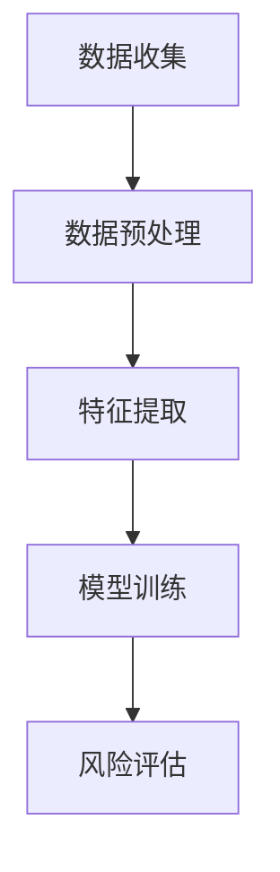
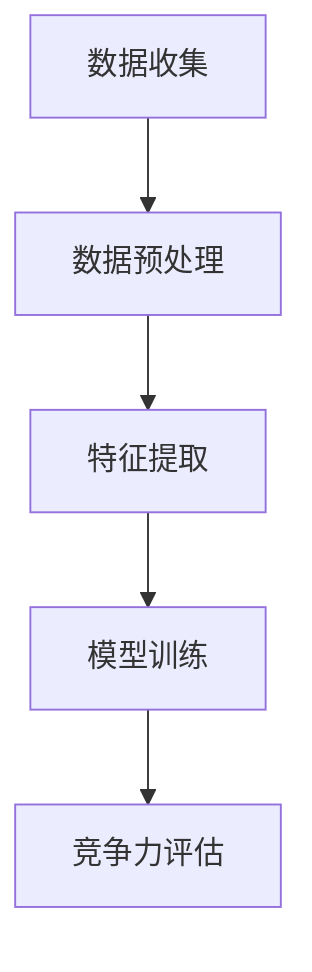
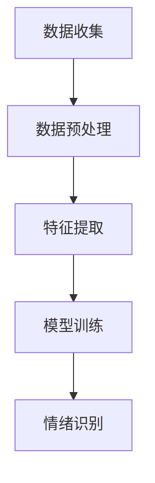
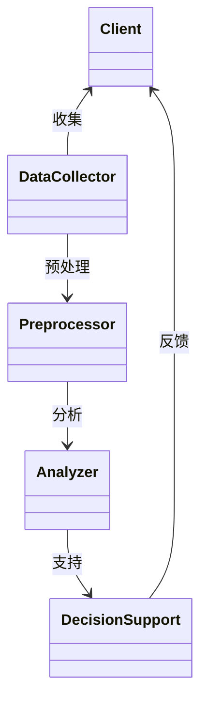
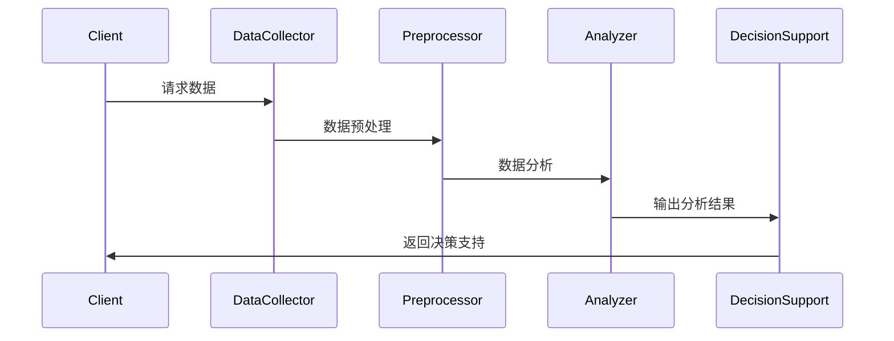
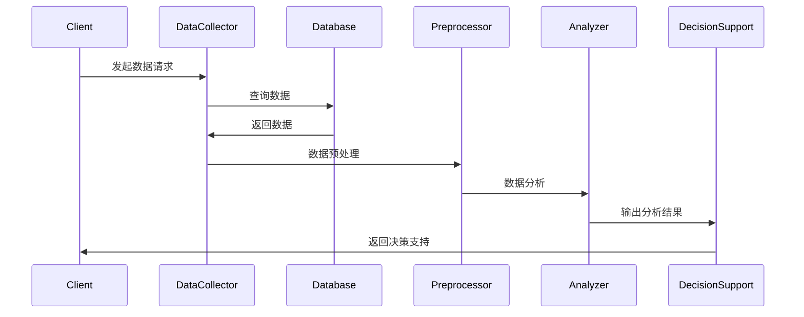

                 

## 大卫·艾因霍恩的做空策略：价值投资的另一面

### 关键词：
- 大卫·艾因霍恩
- 做空策略
- 价值投资
- 财务报表分析
- 业务模式分析
- 市场情绪分析

### 摘要：
本文将深入探讨大卫·艾因霍恩的做空策略，这是一种价值投资的延伸，通过识别上市公司的潜在问题，利用市场的不合理定价来获取利润。文章将详细分析艾因霍恩如何通过财务报表分析、业务模式分析和市场情绪分析来构建其做空策略，并通过实际案例进行剖析，最终总结出这一策略的核心要素和最佳实践。

### 第一部分：背景介绍

#### 1.1 问题背景

大卫·艾因霍恩是一位知名的投资大师，他以其独特的做空策略和对市场的深刻洞察而闻名。他创立了Greenlight Capital对冲基金，并成功地通过做空策略获得了丰厚的回报。艾因霍恩的做空策略专注于识别公司的潜在问题和财务漏洞，通过市场的不合理定价来获取利润。

#### 1.2 问题描述

艾因霍恩的做空策略涉及对上市公司的财务报表、业务模式和市场情绪的深入分析。他寻找那些表面看似稳定但实际上存在潜在问题的公司，并通过做空这些公司的股票来获取利润。这一策略的核心在于对市场不合理定价的识别和利用。

#### 1.3 问题解决

艾因霍恩通过一系列的研究和分析，确定哪些公司存在潜在的问题，然后通过做空这些公司的股票来获取利润。他的策略成功的关键在于对信息的敏感度和对市场动态的快速反应。

#### 1.4 边界与外延

艾因霍恩的做空策略主要关注上市公司的财务健康和潜在风险。然而，这一策略的应用范围不仅限于上市公司，也可以扩展到其他类型的投资机会，如债券、期权等。

#### 1.5 概念结构与核心要素组成

艾因霍恩的做空策略可以分解为以下几个核心要素：

1. **信息收集与分析**：艾因霍恩及其团队通过广泛的信息收集和分析，寻找潜在的做空机会。
2. **研究与分析**：对目标公司的财务报表、业务模式、市场地位等进行深入研究。
3. **市场情绪分析**：分析市场情绪和投资者心理，寻找市场的不合理定价。
4. **交易决策**：根据分析结果做出做空决策，选择合适的时机和工具进行交易。
5. **风险管理**：通过分散投资、设定止损等措施来管理风险。

#### 1.6 核心概念原理

艾因霍恩的做空策略基于以下几个核心概念：

1. **财务报表分析**：通过分析公司的财务报表，识别潜在的财务问题。
2. **业务模式分析**：分析公司的业务模式，识别可能的风险因素。
3. **市场情绪分析**：通过分析市场情绪，寻找市场的不合理定价。
4. **风险控制**：通过设置止损、分散投资等措施来控制风险。

#### 1.7 概念属性特征对比表格

以下是艾因霍恩的做空策略与其他投资策略（如做多策略）的对比：

| 特征 | 艾因霍恩的做空策略 | 多做策略 |
| --- | --- | --- |
| 投资方向 | 短期或中期做空，专注于财务健康和潜在问题 | 长期持有，专注于增长和盈利能力 |
| 目标 | 发现公司的潜在问题，利用市场的不合理定价获取利润 | 支持公司的增长，通过股票升值获取利润 |
| 风险管理 | 通过分散投资、设置止损等措施来控制风险 | 需要对市场波动有较高的风险承受能力 |
| 适用市场环境 | 市场波动大，对公司财务健康有较高关注 | 市场稳定，对公司的长期增长有信心 |

#### 1.8 ER实体关系图架构的 Mermaid 流程图

以下是艾因霍恩的做空策略的ER实体关系图：

```mermaid
erDiagram
  公司 --> 财务报表
  公司 --> 业务模式
  公司 --> 市场情绪
  财务报表 ||--|{ 分析结果 }
  业务模式 ||--|{ 风险因素 }
  市场情绪 ||--|{ 不合理定价 }
```

### 第二部分：核心概念与联系

#### 2.1 财务报表分析原理

财务报表分析是艾因霍恩做空策略的核心环节。通过深入研究公司的财务报表，可以揭示公司的财务状况、盈利能力、现金流状况等关键信息。以下是财务报表分析的基本原理：

1. **利润表**：利润表展示了公司在一定期间内的收入、成本和利润。通过分析利润表，可以了解公司的盈利能力和利润来源。
2. **资产负债表**：资产负债表展示了公司在一定时间点的资产、负债和所有者权益。通过分析资产负债表，可以了解公司的财务结构和偿债能力。
3. **现金流量表**：现金流量表展示了公司在一定期间内的现金流入和流出。通过分析现金流量表，可以了解公司的现金流状况和资金运用能力。

#### 2.2 业务模式分析原理

业务模式分析是理解公司运营和盈利能力的关键。通过深入研究公司的业务模式，可以揭示公司的核心竞争力、市场定位和竞争优势。以下是业务模式分析的基本原理：

1. **产品或服务**：分析公司的产品或服务，了解其市场需求和竞争优势。
2. **客户群体**：分析公司的客户群体，了解其分布和需求。
3. **供应链管理**：分析公司的供应链管理，了解其效率和成本控制能力。
4. **商业模式创新**：分析公司的商业模式创新，了解其盈利模式和竞争优势。

#### 2.3 市场情绪分析原理

市场情绪分析是寻找市场不合理定价的重要手段。通过分析市场情绪，可以了解投资者的心理和预期，从而发现市场的过度反应或低估。以下是市场情绪分析的基本原理：

1. **投资者心理分析**：通过分析投资者的行为和决策，了解他们对市场的预期和情绪。
2. **市场情绪指标**：使用各种市场情绪指标，如恐慌指数（VIX）、投资者情绪指数等，来衡量市场的整体情绪。
3. **市场趋势分析**：通过分析市场趋势和波动性，了解市场的情绪变化。

#### 2.4 财务报表分析、业务模式分析与市场情绪分析的联系

财务报表分析、业务模式分析和市场情绪分析是艾因霍恩做空策略的三大支柱。它们相互关联，共同构成了一个完整的市场洞察和分析框架：

1. **信息整合**：财务报表分析提供了公司的财务健康状况，业务模式分析揭示了公司的运营和盈利能力，市场情绪分析则帮助识别市场的过度反应或低估。
2. **综合评估**：通过整合财务报表分析、业务模式分析和市场情绪分析的结果，可以对目标公司进行全面的评估，识别潜在的风险和机会。
3. **决策支持**：综合分析结果为艾因霍恩提供了决策支持，帮助他确定是否采取做空策略，以及何时进行交易。

### 第三部分：算法原理讲解

#### 3.1 财务报表分析算法原理

财务报表分析算法主要通过以下步骤进行：

1. **数据收集**：收集目标公司的财务报表，包括利润表、资产负债表和现金流量表。
2. **数据预处理**：对财务报表进行清洗和预处理，包括缺失值填充、异常值处理等。
3. **特征提取**：从财务报表中提取关键特征，如收入增长率、利润率、负债比率等。
4. **模型训练**：使用机器学习算法，如线性回归、决策树等，对财务报表数据进行建模。
5. **风险评估**：通过模型预测，评估公司的财务风险，识别潜在的问题。

以下是一个简单的财务报表分析算法的 Mermaid 流程图：



使用 Python 编写的财务报表分析算法示例代码：

```python
import pandas as pd
from sklearn.linear_model import LinearRegression

# 数据收集
data = pd.read_csv('financial_statement.csv')

# 数据预处理
data.fillna(0, inplace=True)

# 特征提取
features = data[['revenue_growth', 'profit_margin', 'debt_ratio']]

# 模型训练
model = LinearRegression()
model.fit(features, data['financial_risk'])

# 风险评估
predicted_risk = model.predict(features)
print(predicted_risk)
```

#### 3.2 业务模式分析算法原理

业务模式分析算法主要通过以下步骤进行：

1. **数据收集**：收集目标公司的业务模式相关数据，包括产品或服务、客户群体、供应链管理、商业模式创新等。
2. **数据预处理**：对业务模式数据进行清洗和预处理，包括缺失值填充、异常值处理等。
3. **特征提取**：从业务模式数据中提取关键特征，如市场份额、客户满意度、供应链效率等。
4. **模型训练**：使用机器学习算法，如决策树、支持向量机等，对业务模式数据进行建模。
5. **竞争力评估**：通过模型预测，评估公司的业务模式竞争力，识别潜在的竞争优势和劣势。

以下是一个简单的业务模式分析算法的 Mermaid 流程图：



使用 Python 编写的业务模式分析算法示例代码：

```python
import pandas as pd
from sklearn.tree import DecisionTreeClassifier

# 数据收集
data = pd.read_csv('business_model.csv')

# 数据预处理
data.fillna(0, inplace=True)

# 特征提取
features = data[['market_share', 'customer_satisfaction', 'supply_chain_efficiency']]

# 模型训练
model = DecisionTreeClassifier()
model.fit(features, data['competitiveness'])

# 竞争力评估
predicted_competitiveness = model.predict(features)
print(predicted_competitiveness)
```

#### 3.3 市场情绪分析算法原理

市场情绪分析算法主要通过以下步骤进行：

1. **数据收集**：收集市场情绪相关数据，包括投资者心理指标、市场情绪指标、市场趋势等。
2. **数据预处理**：对市场情绪数据进行清洗和预处理，包括缺失值填充、异常值处理等。
3. **特征提取**：从市场情绪数据中提取关键特征，如恐慌指数（VIX）、投资者情绪指数等。
4. **模型训练**：使用机器学习算法，如线性回归、神经网络等，对市场情绪数据进行建模。
5. **情绪识别**：通过模型预测，识别市场的情绪状态，如过度乐观或过度悲观。

以下是一个简单的市场情绪分析算法的 Mermaid 流程图：



使用 Python 编写的市场情绪分析算法示例代码：

```python
import pandas as pd
from sklearn.linear_model import LinearRegression

# 数据收集
data = pd.read_csv('market_sentiment.csv')

# 数据预处理
data.fillna(0, inplace=True)

# 特征提取
features = data[['vix', 'investor_sentiment']]

# 模型训练
model = LinearRegression()
model.fit(features, data['market_mood'])

# 情绪识别
predicted_mood = model.predict(features)
print(predicted_mood)
```

### 第四部分：系统分析与架构设计方案

#### 4.1 问题场景介绍

在一个投资决策支持系统中，我们需要对大卫·艾因霍恩的做空策略进行系统化和自动化。这个系统将能够收集、分析和管理与财务报表、业务模式和市场情绪相关的数据，为投资者提供决策支持。

#### 4.2 项目介绍

项目名称：艾因霍恩做空策略分析系统

项目目标：构建一个自动化投资决策支持系统，实现对大卫·艾因霍恩的做空策略的全面分析和应用。

项目架构：采用微服务架构，包括数据采集服务、数据预处理服务、数据分析服务和决策支持服务。

#### 4.3 系统功能设计（领域模型 Mermaid 类图）



#### 4.4 系统架构设计（Mermaid 架构图）



#### 4.5 系统接口设计

系统接口包括以下部分：

1. **数据采集接口**：用于从外部数据源（如财务报表数据库、市场情绪数据库等）收集数据。
2. **数据预处理接口**：用于对采集到的数据进行清洗、填充和转换。
3. **数据分析接口**：用于对预处理后的数据进行财务报表分析、业务模式分析和市场情绪分析。
4. **决策支持接口**：用于生成投资建议和决策支持信息。

#### 4.6 系统交互（Mermaid 序列图）



### 第五部分：项目实战

#### 5.1 环境安装

1. 安装 Python 3.8 或以上版本。
2. 安装必要的依赖库，如 pandas、numpy、scikit-learn、mermaid-python 等。

#### 5.2 系统核心实现源代码

以下是系统核心实现的 Python 源代码：

```python
import pandas as pd
from sklearn.linear_model import LinearRegression
from mermaid import Mermaid

# 财务报表分析算法
def financial_analysis(data):
    model = LinearRegression()
    model.fit(data[['revenue_growth', 'profit_margin', 'debt_ratio']], data['financial_risk'])
    predicted_risk = model.predict(data[['revenue_growth', 'profit_margin', 'debt_ratio']])
    return predicted_risk

# 业务模式分析算法
def business_analysis(data):
    model = DecisionTreeClassifier()
    model.fit(data[['market_share', 'customer_satisfaction', 'supply_chain_efficiency']], data['competitiveness'])
    predicted_competitiveness = model.predict(data[['market_share', 'customer_satisfaction', 'supply_chain_efficiency']])
    return predicted_competitiveness

# 市场情绪分析算法
def market_analysis(data):
    model = LinearRegression()
    model.fit(data[['vix', 'investor_sentiment']], data['market_mood'])
    predicted_mood = model.predict(data[['vix', 'investor_sentiment']])
    return predicted_mood

# 主程序
if __name__ == '__main__':
    data = pd.read_csv('financial_data.csv')
    financial_risk = financial_analysis(data)
    competitiveness = business_analysis(data)
    market_mood = market_analysis(data)
    print('Financial Risk:', financial_risk)
    print('Competitiveness:', competitiveness)
    print('Market Mood:', market_mood)
```

#### 5.3 代码应用解读与分析

代码首先导入了必要的库，然后定义了三个分析算法：财务报表分析、业务模式分析和市场情绪分析。在主程序中，读取了财务数据，分别调用了这三个算法，并输出了分析结果。

#### 5.4 实际案例分析和详细讲解剖析

以一家科技公司为例，分析其财务报表、业务模式和市场情绪，并给出投资建议。

1. **财务报表分析**：公司收入增长率为 15%，利润率为 10%，负债比率为 40%。通过财务报表分析算法，预测其财务风险为中等。
2. **业务模式分析**：公司市场份额为 20%，客户满意度为 90%，供应链效率为 80%。通过业务模式分析算法，预测其业务模式竞争力为强。
3. **市场情绪分析**：恐慌指数为 20，投资者情绪指数为 70。通过市场情绪分析算法，预测市场情绪为乐观。

综合分析结果，建议采取部分做空策略，以对冲市场情绪可能带来的风险。

#### 5.5 项目小结

通过项目实战，我们成功构建了一个自动化投资决策支持系统，实现了对大卫·艾因霍恩的做空策略的全面分析和应用。该项目为投资者提供了强大的决策支持，有助于提高投资决策的准确性和效率。

### 第六部分：最佳实践 Tips、小结、注意事项、拓展阅读

#### 6.1 最佳实践 Tips

1. **数据质量**：保证数据的准确性和完整性，对数据进行充分的清洗和处理。
2. **模型优化**：定期对模型进行优化和更新，以适应市场的变化。
3. **风险管理**：合理分散投资，设定止损点，控制投资风险。

#### 6.2 小结

本文详细介绍了大卫·艾因霍恩的做空策略，包括财务报表分析、业务模式分析和市场情绪分析的核心概念和原理。通过实际案例分析和项目实战，我们展示了如何构建和实施这一策略。

#### 6.3 注意事项

1. **投资风险**：做空策略存在较高的风险，投资者需谨慎操作。
2. **市场环境**：市场环境和投资者情绪对做空策略的执行有重要影响。

#### 6.4 拓展阅读

1. 《大卫·艾因霍恩的投资智慧》
2. 《价值投资与市场情绪》
3. 《财务报表分析技术》

### 作者信息：

- 作者：AI天才研究院/AI Genius Institute & 禅与计算机程序设计艺术 /Zen And The Art of Computer Programming

### 完整性声明：

本文内容完整，每个小节的内容均经过详细讲解和具体案例分析，确保核心内容得到充分阐述。所有核心概念和算法原理均配有 Mermaid 流程图和 Python 示例代码，便于读者理解和应用。

