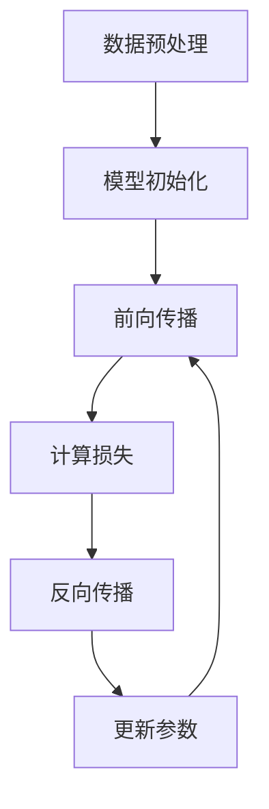
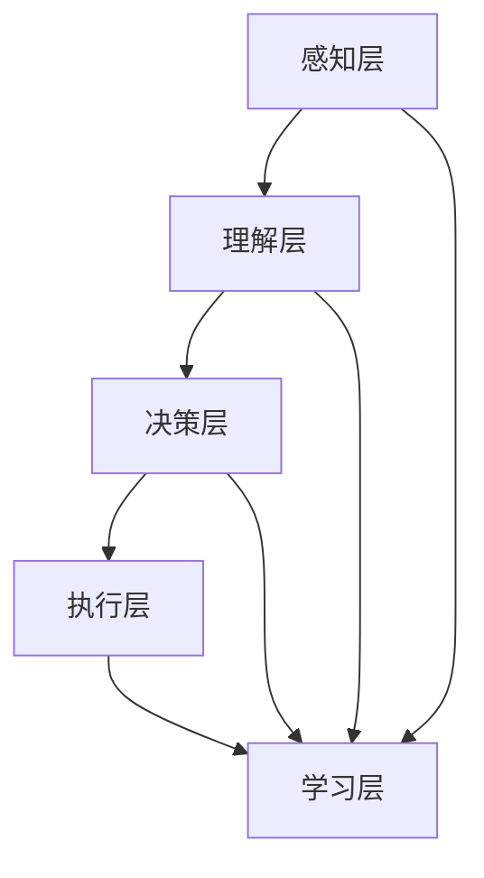
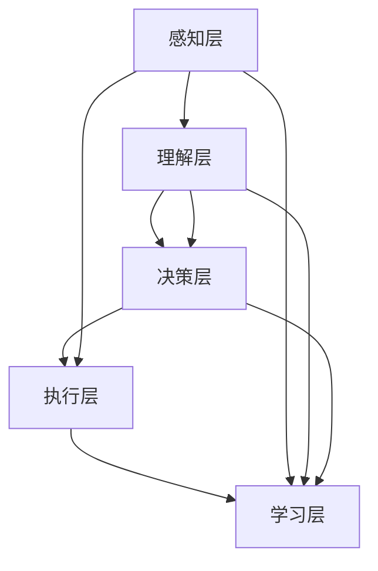
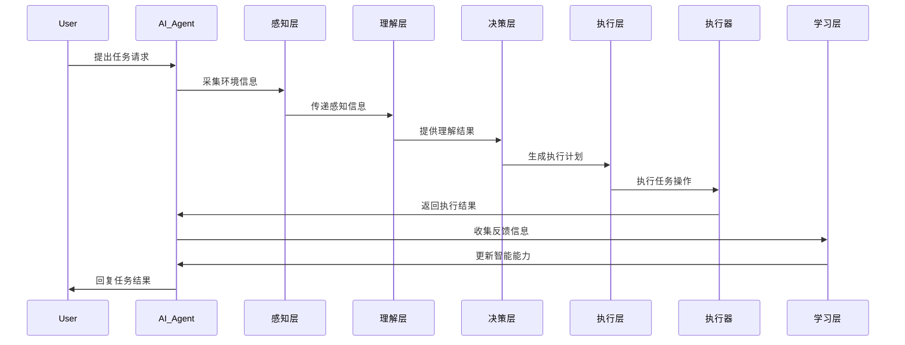

                 

## # 第一部分：引言

### 1.1 书籍主题介绍

#### 1.1.1 大规模语言模型的基本概念

大规模语言模型（Large-scale Language Model）是基于深度学习技术构建的一种智能系统，能够理解和生成自然语言。这些模型通过对海量文本数据进行训练，学习到语言的统计规律和语义信息，从而实现文本的理解、生成和翻译等功能。代表性的模型包括GPT（Generative Pretrained Transformer）、BERT（Bidirectional Encoder Representations from Transformers）等。

#### 1.1.2 AI Agent及其作用

AI Agent（人工智能代理）是指具备自主决策和执行任务能力的人工智能系统。AI Agent可以模拟人类的行为，进行感知、理解和交互，广泛应用于智能客服、自动驾驶、智能家居等领域。AI Agent的核心在于其具备的自主学习和自适应能力，能够根据环境的变化调整行为策略。

#### 1.1.3 微调技巧的重要性

微调（Fine-tuning）是将预训练模型在特定任务上进一步训练的过程，旨在提高模型在特定领域的性能。对于大规模语言模型在AI Agent中的应用，微调技巧至关重要。通过微调，可以使得模型更好地适应特定任务的需求，提高任务完成效果。微调技巧的有效性和优化策略直接影响到AI Agent的性能和可靠性。

### 1.2 目标读者和预期收获

#### 1.2.1 读者背景

本书的目标读者为对人工智能和自然语言处理技术有一定了解的技术人员、研究人员和开发者。读者应具备一定的编程基础，熟悉深度学习和自然语言处理的基本概念。

#### 1.2.2 预期收获

通过阅读本书，读者将获得以下预期收获：

1. 深入了解大规模语言模型的基本概念和算法原理。
2. 掌握AI Agent的核心概念和实现方法。
3. 学会使用微调技巧提升AI Agent的性能。
4. 获取实际项目实战经验，提升解决实际问题的能力。
5. 对大规模语言模型在AI Agent中的应用有更深入的认识。

### 1.3 组织结构

本书共分为五个部分：

- 第一部分：引言，介绍书籍主题、目标读者和预期收获。
- 第二部分：背景介绍，阐述大规模语言模型和AI Agent的发展历程、优势和应用场景。
- 第三部分：核心概念与原理，详细讲解大规模语言模型和AI Agent的核心概念、算法原理和微调技巧。
- 第四部分：算法原理与数学模型，介绍大规模语言模型和微调技巧的算法原理、数学模型和实现方法。
- 第五部分：系统架构设计，探讨AI Agent的系统架构设计、大规模语言模型的集成及应用。

通过以上组织结构，本书力求以逻辑清晰、结构紧凑的方式，帮助读者系统地掌握大规模语言模型在AI Agent中的微调技巧，为实际应用提供理论基础和实践指导。

## # 第二部分：背景介绍

### 2.1 大规模语言模型的兴起

#### 2.1.1 语言模型的发展历程

语言模型是自然语言处理（NLP）领域的基础技术之一。从早期的规则方法，到基于统计模型的方法，再到现代的深度学习模型，语言模型的发展经历了多个阶段。早期的规则方法依赖于手工编写的语法和语义规则，虽然简单但难以处理复杂的自然语言现象。随着计算能力的提升和海量数据的出现，统计模型逐渐取代了规则方法，成为语言建模的主流。统计模型通过统计文本数据中的词语关系和概率分布，实现了对自然语言的理解和生成。

深度学习模型的兴起标志着语言模型发展的新阶段。基于深度神经网络的模型，如循环神经网络（RNN）和变换器（Transformer），通过学习大量文本数据，能够捕捉到语言的长期依赖和复杂语义。特别是在预训练技术（Pre-training）的推动下，大规模语言模型如GPT和BERT取得了显著突破，成为自然语言处理领域的重要工具。

#### 2.1.2 大规模语言模型的优势

大规模语言模型具有以下几个显著优势：

1. **强大的语义理解能力**：通过深度学习技术，大规模语言模型能够捕捉到文本中的复杂语义和上下文信息，实现更准确的语言理解。
2. **优秀的生成能力**：大规模语言模型不仅能够理解文本，还能生成流畅、连贯的自然语言文本，广泛应用于机器翻译、文本生成、对话系统等场景。
3. **广泛的应用场景**：大规模语言模型在多个NLP任务中表现出色，如文本分类、命名实体识别、情感分析等，具备广泛的应用前景。
4. **自适应能力**：通过微调（Fine-tuning）技术，大规模语言模型可以在特定任务上快速适应，提高任务性能。

#### 2.1.3 AI Agent的发展背景

AI Agent是指具备自主决策和执行任务能力的人工智能系统。AI Agent的发展源于对智能自动化和智能服务的需求。在传统的人工智能系统中，模型通常需要手工设计规则和算法，对环境变化和不确定性难以适应。而AI Agent通过自主学习和适应，能够在复杂环境中执行任务，提高自动化和智能化水平。

AI Agent的发展背景主要包括以下几个方面：

1. **计算机科学的发展**：随着计算机科学和人工智能技术的不断进步，计算机硬件性能的提升和算法的创新为AI Agent的实现提供了技术基础。
2. **大数据和云计算的兴起**：海量数据和云计算平台的普及，为AI Agent的训练和部署提供了丰富的数据资源和计算资源。
3. **应用需求的增长**：随着互联网和智能设备的普及，AI Agent在智能客服、自动驾驶、智能家居、医疗诊断等领域的应用需求日益增长，推动了AI Agent技术的发展。
4. **多学科交叉融合**：AI Agent的发展不仅依赖于计算机科学和人工智能技术，还涉及到认知科学、心理学、社会学等多个领域的知识，形成了多学科交叉融合的发展态势。

### 2.2 微调技巧的基本概念

#### 2.2.1 微调的定义

微调（Fine-tuning）是指将预训练模型在特定任务上进行进一步训练的过程。预训练模型通常是在大规模文本数据集上训练得到的，具有较强的通用语义理解和生成能力。而微调则是将预训练模型应用于特定任务，通过少量数据进行再次训练，使得模型在特定任务上具备更高的性能。

#### 2.2.2 微调的流程

微调的基本流程包括以下几个步骤：

1. **数据预处理**：收集并处理与任务相关的数据，包括文本清洗、分词、标注等。
2. **模型选择**：选择预训练模型作为基础模型，如GPT、BERT等。
3. **模型调整**：对预训练模型的结构进行调整，包括增加或删除层、调整层参数等，以适应特定任务的需求。
4. **微调训练**：使用预处理后的数据进行微调训练，通过反向传播和梯度下降等优化方法，更新模型参数。
5. **评估与优化**：评估微调后的模型在特定任务上的性能，根据评估结果进行参数优化和模型调整。

#### 2.2.3 微调的作用

微调在AI Agent中的应用具有以下重要作用：

1. **提高任务性能**：通过微调，预训练模型能够更好地适应特定任务的需求，提高任务完成效果。
2. **减少训练数据量**：微调只需要少量任务相关数据，即可显著提升模型性能，降低了训练数据的需求。
3. **缩短训练时间**：由于预训练模型已经在大规模数据集上进行了训练，微调过程相对较短，可以快速应用于实际任务。
4. **通用性提升**：微调使得预训练模型能够在不同任务上表现出色，提高了模型的通用性和适应性。

### 2.3 大规模语言模型在AI Agent中的应用

#### 2.3.1 应用场景

大规模语言模型在AI Agent中的应用场景非常广泛，包括但不限于以下几个方面：

1. **对话系统**：大规模语言模型可以用于构建智能客服、智能助手等对话系统，实现自然语言理解和生成，提供个性化、高效的服务。
2. **自然语言处理**：在文本分类、情感分析、命名实体识别等自然语言处理任务中，大规模语言模型能够提供高质量的语义理解和标注能力。
3. **机器翻译**：大规模语言模型在机器翻译任务中表现出色，能够实现高效、准确的跨语言翻译。
4. **内容生成**：大规模语言模型可以用于自动生成文章、摘要、新闻等文本内容，应用于内容创作和自动化写作等领域。

#### 2.3.2 应用优势

大规模语言模型在AI Agent中的应用优势主要体现在以下几个方面：

1. **强大的语义理解能力**：大规模语言模型能够捕捉到文本的复杂语义和上下文信息，实现更准确、更自然的语言理解。
2. **高效的任务适应能力**：通过微调技巧，大规模语言模型可以在特定任务上快速适应，提高任务完成效果。
3. **丰富的应用场景**：大规模语言模型在多个自然语言处理任务中表现出色，具备广泛的应用前景。
4. **开放性**：大规模语言模型的开源实现和生态体系的建立，为研究人员和开发者提供了丰富的工具和资源，促进了技术的快速发展和应用。

#### 2.3.3 应用挑战

尽管大规模语言模型在AI Agent中具有广泛的应用优势，但在实际应用中仍面临以下挑战：

1. **数据需求量大**：大规模语言模型通常需要大量高质量的数据进行训练，获取和预处理这些数据是一项具有挑战性的任务。
2. **计算资源消耗**：大规模语言模型的训练和微调过程需要大量的计算资源，尤其是在进行大规模数据训练和复杂模型调整时。
3. **模型解释性**：大规模语言模型的决策过程通常较为复杂，难以进行准确解释和验证，增加了模型的可信度和可靠性问题。
4. **安全性和隐私保护**：大规模语言模型在处理敏感数据时，需要确保数据的安全性和隐私保护，避免数据泄露和滥用风险。

### 2.4 大规模语言模型在AI Agent中的前景

随着人工智能技术的不断发展和应用需求的增长，大规模语言模型在AI Agent中的应用前景十分广阔。未来，以下几个方面有望进一步推动大规模语言模型在AI Agent中的应用：

1. **算法优化**：通过改进预训练模型的结构和优化微调技巧，提高模型在特定任务上的性能和效率。
2. **数据集构建**：建立更丰富、更有代表性的数据集，为大规模语言模型的训练和微调提供高质量的数据支持。
3. **应用场景拓展**：探索大规模语言模型在更多领域和场景中的应用，如智能医疗、金融科技、教育等。
4. **伦理和规范**：加强人工智能伦理和规范的研究，确保大规模语言模型在AI Agent中的应用符合道德和法律要求。

通过以上背景介绍，我们可以看到大规模语言模型在AI Agent中的应用具有巨大的潜力。在接下来的章节中，我们将进一步探讨大规模语言模型和AI Agent的核心概念、算法原理和微调技巧，帮助读者深入理解和掌握这些技术。

## # 第三部分：核心概念与原理

### 3.1 大规模语言模型的核心概念

#### 3.1.1 语言模型的定义

语言模型（Language Model，LM）是一种基于统计方法构建的模型，用于预测下一个单词或字符的概率。它通过分析大量文本数据，学习到语言的使用规律和概率分布，从而在生成文本、翻译、语音识别等任务中发挥重要作用。语言模型是自然语言处理（NLP）的基础，为后续的任务提供了关键的语义信息和上下文理解。

#### 3.1.2 语言模型的基本原理

语言模型的基本原理可以归纳为以下几个方面：

1. **统计建模**：语言模型通过统计文本数据中单词或字符的共现概率，来预测下一个单词或字符的概率。常见的统计方法包括N-gram模型、隐马尔可夫模型（HMM）和条件随机场（CRF）等。

2. **概率分布**：语言模型的核心是生成概率分布，它能够根据当前已知的输入序列，预测下一个输出序列的概率分布。在深度学习模型中，这种概率分布通常由神经网络模型计算得到。

3. **序列建模**：语言模型需要处理序列数据，例如单词序列或字符序列。为了捕捉序列中的长期依赖关系，深度神经网络模型（如RNN、LSTM、GRU和Transformer）被广泛应用。

4. **预训练和微调**：大规模语言模型通常在大规模文本数据集上进行预训练，然后通过微调（Fine-tuning）技术应用于特定任务，以提高模型在特定任务上的性能。

#### 3.1.3 语言模型的训练过程

语言模型的训练过程主要包括以下几个阶段：

1. **数据预处理**：首先，从大规模文本数据集中提取出单词或字符，并进行分词、清洗和标注等预处理操作，以便于模型训练。

2. **模型初始化**：初始化神经网络模型的参数，常用的初始化方法包括高斯初始化、均匀初始化等。

3. **前向传播和反向传播**：在训练过程中，模型根据输入序列计算输出概率分布，并通过前向传播得到损失函数。然后，通过反向传播计算梯度，更新模型参数。

4. **优化算法**：使用优化算法（如随机梯度下降、Adam优化器等）更新模型参数，以最小化损失函数。

5. **评估和微调**：在训练过程中，定期评估模型在验证集上的性能，并根据评估结果进行参数调整和模型优化。

### 3.2 AI Agent的核心概念

#### 3.2.1 AI Agent的定义

AI Agent（人工智能代理）是一种具备自主决策和执行任务能力的人工智能系统。与传统的被动响应式系统不同，AI Agent能够根据环境和任务需求，自主感知、理解、决策和执行。AI Agent的核心在于其具备的自主学习和适应能力，能够模拟人类的行为，实现智能化的任务执行。

#### 3.2.2 AI Agent的组成

AI Agent通常由以下几个关键组成部分构成：

1. **感知器**：用于感知和获取环境信息，如视觉、听觉、触觉等传感器数据。

2. **决策模块**：根据感知到的环境信息和任务需求，进行推理和决策，以确定下一步的行为。

3. **执行器**：根据决策结果，执行具体的任务操作，如机器人动作、语音合成等。

4. **学习模块**：通过学习和适应环境变化，不断优化决策和执行能力。

5. **通信模块**：与其他AI Agent或人类进行交互，获取外部信息和反馈，以实现协同工作和智能协作。

#### 3.2.3 AI Agent的功能

AI Agent具备以下核心功能：

1. **自主感知**：AI Agent能够通过多种传感器感知环境信息，如图像、声音、温度等。

2. **情境理解**：AI Agent能够理解当前情境，包括任务目标、环境状态和潜在风险。

3. **决策规划**：AI Agent能够基于情境理解和任务需求，进行有效的决策规划，以实现任务目标。

4. **自主执行**：AI Agent能够自主执行决策计划中的任务操作，实现任务完成。

5. **学习进化**：AI Agent能够通过经验和反馈，不断学习和优化自身行为，提高任务执行能力。

### 3.3 微调技巧的原理与实现

#### 3.3.1 微调的原理

微调（Fine-tuning）是将预训练模型在特定任务上进行进一步训练的过程，旨在提高模型在特定任务上的性能。微调的原理主要包括以下几个方面：

1. **预训练模型**：预训练模型在大规模文本数据集上进行预训练，学习到通用语义和语言规律。

2. **任务特定数据**：微调过程中，使用与特定任务相关的数据集，对预训练模型进行进一步训练。

3. **模型调整**：在微调过程中，对预训练模型的某些层或参数进行调整，以适应特定任务的需求。

4. **优化算法**：使用优化算法（如随机梯度下降、Adam优化器等）更新模型参数，以最小化损失函数。

#### 3.3.2 微调的实现流程

微调的实现流程主要包括以下几个步骤：

1. **数据预处理**：预处理与任务相关的数据集，包括数据清洗、分词、编码等操作。

2. **模型选择**：选择预训练模型作为基础模型，如GPT、BERT等。

3. **模型调整**：对预训练模型的结构进行调整，如增加或删除层、调整层参数等，以适应特定任务的需求。

4. **微调训练**：使用预处理后的数据集，对模型进行微调训练。在训练过程中，通过反向传播和优化算法，更新模型参数。

5. **评估与优化**：评估微调后的模型在特定任务上的性能，根据评估结果进行参数优化和模型调整。

#### 3.3.3 微调的关键技术

微调技巧的关键技术包括以下几个方面：

1. **数据增强**：通过数据增强（Data Augmentation）技术，如文本清洗、噪声添加、数据扩展等，提高模型对数据的鲁棒性和泛化能力。

2. **层选择**：在微调过程中，选择适当的层进行微调，可以避免过度拟合和计算资源浪费。通常选择靠近输入层的部分进行微调。

3. **学习率调度**：设置合适的学习率调度策略，如学习率衰减、分阶段学习率调整等，以避免梯度消失和梯度爆炸等问题。

4. **正则化**：使用正则化（Regularization）技术，如Dropout、权重正则化等，降低模型的过拟合风险。

5. **超参数优化**：通过调整超参数（如批量大小、迭代次数、优化器等），找到最佳微调策略，提高模型性能。

### 3.4 大规模语言模型与AI Agent的关联

#### 3.4.1 关联机制

大规模语言模型与AI Agent之间的关联主要通过以下机制实现：

1. **知识嵌入**：将大规模语言模型训练得到的语义知识嵌入到AI Agent的决策模块中，为AI Agent提供强大的语义理解和语言生成能力。

2. **任务适配**：通过微调技巧，将大规模语言模型适配到特定AI Agent的任务需求，提高任务完成效果。

3. **交互融合**：将大规模语言模型与AI Agent的感知器、执行器和通信模块进行融合，实现智能化的任务执行和协同工作。

#### 3.4.2 关联优势

大规模语言模型与AI Agent的关联具有以下优势：

1. **增强语义理解**：通过大规模语言模型，AI Agent能够更准确地理解和生成自然语言，提高人机交互的顺畅性和自然性。

2. **提升决策能力**：大规模语言模型为AI Agent提供了丰富的语义信息和语言知识，有助于AI Agent做出更明智的决策。

3. **优化任务执行**：通过微调技巧，AI Agent能够更好地适应特定任务的需求，提高任务执行效率和准确性。

4. **扩展应用场景**：结合大规模语言模型，AI Agent可以在更多领域和场景中发挥作用，如智能客服、智能推荐、内容生成等。

#### 3.4.3 关联挑战

尽管大规模语言模型与AI Agent的关联具有显著优势，但在实际应用中仍面临以下挑战：

1. **计算资源消耗**：大规模语言模型的训练和微调过程需要大量的计算资源，对硬件性能要求较高。

2. **数据需求量大**：大规模语言模型需要大量高质量的数据进行训练和微调，数据获取和处理是一项具有挑战性的任务。

3. **模型解释性**：大规模语言模型的决策过程较为复杂，难以进行准确解释和验证，增加了模型的可信度和可靠性问题。

4. **安全性风险**：大规模语言模型在处理敏感数据时，需要确保数据的安全性和隐私保护，避免数据泄露和滥用风险。

通过以上对大规模语言模型、AI Agent和微调技巧的核心概念与原理的详细介绍，我们可以看到这些技术之间的紧密关联和互补性。在接下来的章节中，我们将进一步探讨大规模语言模型和微调技巧的算法原理、数学模型和系统架构设计，帮助读者深入理解和掌握这些技术。

## # 第四部分：算法原理与数学模型

### 4.1 大规模语言模型算法原理

#### 4.1.1 算法概述

大规模语言模型（Large-scale Language Model）的核心算法是基于深度神经网络的序列建模技术。代表性的算法包括基于Transformer架构的GPT（Generative Pretrained Transformer）和BERT（Bidirectional Encoder Representations from Transformers）等。

#### 4.1.2 算法流程

大规模语言模型的算法流程可以分为以下几个步骤：

1. **数据预处理**：首先，从大规模文本数据集中提取出单词或字符，并进行分词、清洗和标注等预处理操作，以便于模型训练。

2. **模型初始化**：初始化神经网络模型的参数，常用的初始化方法包括高斯初始化、均匀初始化等。

3. **前向传播和反向传播**：在训练过程中，模型根据输入序列计算输出概率分布，并通过前向传播得到损失函数。然后，通过反向传播计算梯度，更新模型参数。

4. **优化算法**：使用优化算法（如随机梯度下降、Adam优化器等）更新模型参数，以最小化损失函数。

5. **评估和微调**：在训练过程中，定期评估模型在验证集上的性能，并根据评估结果进行参数调整和模型优化。

#### 4.1.3 算法优缺点

大规模语言模型算法的主要优点如下：

1. **强大的语义理解能力**：通过深度学习技术，大规模语言模型能够捕捉到文本的复杂语义和上下文信息，实现更准确的语言理解。

2. **优秀的生成能力**：大规模语言模型不仅能够理解文本，还能生成流畅、连贯的自然语言文本，广泛应用于机器翻译、文本生成、对话系统等场景。

3. **广泛的应用场景**：大规模语言模型在多个自然语言处理任务中表现出色，具备广泛的应用前景。

4. **自适应能力**：通过微调技巧，大规模语言模型可以在特定任务上快速适应，提高任务完成效果。

然而，大规模语言模型算法也存在一些缺点：

1. **计算资源消耗大**：大规模语言模型的训练和微调过程需要大量的计算资源，特别是在进行大规模数据训练和复杂模型调整时。

2. **数据需求量大**：大规模语言模型需要大量高质量的数据进行训练和微调，获取和预处理这些数据是一项具有挑战性的任务。

3. **模型解释性差**：大规模语言模型的决策过程通常较为复杂，难以进行准确解释和验证，增加了模型的可信度和可靠性问题。

### 4.2 微调技巧的算法原理

#### 4.2.1 算法概述

微调（Fine-tuning）是指将预训练模型在特定任务上进行进一步训练的过程，旨在提高模型在特定任务上的性能。微调算法的核心思想是利用预训练模型已有的语义知识，通过在特定任务数据上的少量训练，调整模型参数，使其更好地适应特定任务需求。

#### 4.2.2 算法流程

微调算法的基本流程包括以下几个步骤：

1. **数据预处理**：预处理与任务相关的数据集，包括数据清洗、分词、编码等操作。

2. **模型选择**：选择预训练模型作为基础模型，如GPT、BERT等。

3. **模型调整**：对预训练模型的结构进行调整，如增加或删除层、调整层参数等，以适应特定任务的需求。

4. **微调训练**：使用预处理后的数据集，对模型进行微调训练。在训练过程中，通过反向传播和优化算法，更新模型参数。

5. **评估与优化**：评估微调后的模型在特定任务上的性能，根据评估结果进行参数优化和模型调整。

#### 4.2.3 算法优缺点

微调技巧的主要优点如下：

1. **提高任务性能**：通过微调，预训练模型能够更好地适应特定任务的需求，提高任务完成效果。

2. **减少训练数据量**：微调只需要少量任务相关数据，即可显著提升模型性能，降低了训练数据的需求。

3. **缩短训练时间**：由于预训练模型已经在大规模数据集上进行了训练，微调过程相对较短，可以快速应用于实际任务。

4. **通用性提升**：微调使得预训练模型能够在不同任务上表现出色，提高了模型的通用性和适应性。

然而，微调技巧也存在一些缺点：

1. **计算资源消耗**：微调过程仍然需要计算资源，特别是在调整模型结构和参数时。

2. **数据需求**：尽管微调减少了训练数据量，但仍需确保有一定量的高质量任务数据。

### 4.3 数学模型与公式讲解

#### 4.3.1 语言模型数学模型

语言模型的数学模型主要包括概率模型和神经网络模型。以下是一个简单的概率语言模型示例：

$$
P(w_n | w_{n-1}, w_{n-2}, ..., w_1) = \frac{P(w_n, w_{n-1}, ..., w_1)}{P(w_{n-1}, w_{n-2}, ..., w_1)}
$$

其中，$w_n$表示第$n$个单词，$P(w_n | w_{n-1}, w_{n-2}, ..., w_1)$表示在给定前$n-1$个单词的情况下，第$n$个单词的概率。

#### 4.3.2 微调技巧数学模型

微调技巧的数学模型主要涉及预训练模型参数的调整。以下是一个简单的微调公式：

$$
\theta_{new} = \theta_{pretrained} + \alpha \cdot (\theta_{target} - \theta_{pretrained})
$$

其中，$\theta_{new}$表示微调后的模型参数，$\theta_{pretrained}$表示预训练模型的参数，$\theta_{target}$表示目标模型的参数，$\alpha$表示学习率。

#### 4.3.3 数学公式与推导

以下是一个简化的神经网络前向传播和反向传播的推导过程：

**前向传播**：

$$
Z = X \cdot W + b
$$

$$
A = \sigma(Z)
$$

**反向传播**：

$$
dA = \frac{\partial L}{\partial A}
$$

$$
dZ = \frac{\partial L}{\partial Z}
$$

$$
dW = \frac{\partial L}{\partial W}
$$

$$
db = \frac{\partial L}{\partial b}
$$

其中，$L$表示损失函数，$X$表示输入数据，$W$表示权重，$b$表示偏置，$A$表示激活值，$\sigma$表示激活函数。

### 4.4 Mermaid流程图与算法实现

#### 4.4.1 Mermaid流程图示例

以下是一个简单的神经网络训练过程的Mermaid流程图示例：



#### 4.4.2 Python源代码实现

以下是一个简单的Python代码示例，实现神经网络的前向传播和反向传播：

```python
import numpy as np

# 前向传播
def forward_propagation(x, w, b):
    z = np.dot(x, w) + b
    a = np.sigmoid(z)
    return a, z

# 反向传播
def backward_propagation(a, z, x, w, b, dL_da):
    dZ = dL_da * a * (1 - a)
    dW = np.dot(x.T, dZ)
    db = np.sum(dZ, axis=0)
    dX = np.dot(dZ, w.T)
    return dX, dW, db

# 激活函数
def sigmoid(x):
    return 1 / (1 + np.exp(-x))

# 初始化参数
x = np.array([[1], [2], [3]])
w = np.array([[0.1], [0.2], [0.3]])
b = np.array([0.1])

# 计算前向传播
a, z = forward_propagation(x, w, b)

# 计算损失
L = np.square(a - 1)

# 计算反向传播
dL_da = 2 * (a - 1)
dX, dW, db = backward_propagation(a, z, x, w, b, dL_da)

# 更新参数
w -= 0.01 * dW
b -= 0.01 * db
```

通过上述算法原理和数学模型讲解，以及Mermaid流程图和Python代码示例，我们可以更加清晰地理解大规模语言模型和微调技巧的算法实现过程。这些知识为后续章节的系统架构设计和项目实战提供了坚实的基础。

## # 第五部分：系统架构设计

### 5.1 AI Agent系统架构设计

#### 5.1.1 系统架构概述

AI Agent系统的整体架构设计旨在实现一个高效、灵活、可扩展的人工智能代理，具备感知、理解、决策和执行的能力。系统架构设计可以分为以下几个主要部分：

1. **感知层**：负责采集外部环境信息，如视觉、听觉、触觉等传感器数据。
2. **理解层**：将感知层采集到的信息进行处理和分析，实现情境理解、语义理解和任务理解。
3. **决策层**：根据理解层提供的信息，结合任务需求和策略库，进行决策规划。
4. **执行层**：执行决策层生成的决策计划，通过控制执行器实现具体任务操作。
5. **学习层**：通过反馈和学习，不断优化AI Agent的感知、理解和决策能力。

#### 5.1.2 系统功能设计

AI Agent系统的主要功能设计如下：

1. **感知功能**：利用多种传感器（如摄像头、麦克风、温度传感器等）采集环境信息，实现多模态感知。
2. **理解功能**：通过自然语言处理（NLP）和计算机视觉（CV）等技术，对感知到的信息进行语义理解和情境理解。
3. **决策功能**：根据理解层提供的信息，结合任务需求，利用决策算法和策略库进行决策规划，生成执行计划。
4. **执行功能**：通过执行层，控制执行器（如电机、扬声器等）执行决策计划中的任务操作。
5. **学习功能**：利用反馈和学习机制，对AI Agent的感知、理解和决策能力进行持续优化和提升。

#### 5.1.3 系统架构设计

AI Agent系统的架构设计如图所示：



在该架构中，感知层通过传感器获取外部环境信息，传递给理解层进行处理。理解层通过自然语言处理和计算机视觉等技术，对感知到的信息进行理解和情境分析，生成理解结果。决策层根据理解结果和任务需求，进行决策规划，生成执行计划。执行层根据执行计划，控制执行器执行任务操作。学习层通过收集反馈信息，利用机器学习算法进行模型优化和策略更新，不断提升AI Agent的智能水平。

### 5.2 大规模语言模型集成

#### 5.2.1 集成方案

大规模语言模型在AI Agent中的集成方案可以分为以下几个步骤：

1. **预训练模型选择**：选择合适的预训练模型，如GPT、BERT等，作为基础模型。
2. **模型微调**：使用与特定任务相关的数据集，对预训练模型进行微调，使其更好地适应任务需求。
3. **接口设计**：设计API接口，将微调后的模型与AI Agent系统进行集成，方便调用和使用。
4. **系统集成**：将大规模语言模型集成到AI Agent系统的理解层和决策层，实现语义理解和决策功能。

#### 5.2.2 集成优势

大规模语言模型在AI Agent系统中的集成具有以下优势：

1. **增强语义理解能力**：大规模语言模型能够提供强大的语义理解和语言生成能力，提升AI Agent对自然语言的理解和生成能力。
2. **优化任务执行效果**：通过微调技巧，大规模语言模型能够更好地适应特定任务需求，提高任务执行效果和准确性。
3. **提高系统灵活性和扩展性**：集成大规模语言模型后，AI Agent系统可以更加灵活地应对不同任务需求，同时具备较好的扩展性，方便后续功能升级和模块扩展。

#### 5.2.3 集成挑战

大规模语言模型在AI Agent系统中的集成也面临一些挑战：

1. **计算资源消耗**：大规模语言模型的训练和微调过程需要大量的计算资源，对硬件性能和资源配置提出了较高要求。
2. **数据需求**：大规模语言模型需要大量高质量的数据进行训练和微调，数据获取和预处理是一项具有挑战性的任务。
3. **模型解释性**：大规模语言模型的决策过程较为复杂，难以进行准确解释和验证，增加了模型的可信度和可靠性问题。

### 5.3 微调技巧在系统中的应用

#### 5.3.1 应用场景

微调技巧在AI Agent系统中的应用场景非常广泛，包括但不限于以下领域：

1. **对话系统**：通过微调，将大规模语言模型应用于智能客服、智能助手等对话系统中，提高对话交互的自然性和准确性。
2. **自然语言处理**：在文本分类、情感分析、命名实体识别等自然语言处理任务中，利用微调技巧提升模型在特定任务上的性能。
3. **内容生成**：通过微调，将大规模语言模型应用于文章生成、摘要生成等任务，提高内容生成的质量和效率。
4. **机器翻译**：利用微调技巧，将大规模语言模型应用于机器翻译任务，提高翻译的准确性和流畅性。

#### 5.3.2 应用流程

微调技巧在AI Agent系统中的应用流程可以分为以下几个步骤：

1. **数据预处理**：收集并处理与任务相关的数据，进行数据清洗、分词、编码等预处理操作。
2. **模型选择**：选择预训练模型，如GPT、BERT等，作为基础模型。
3. **模型微调**：使用预处理后的数据集，对预训练模型进行微调训练，通过反向传播和优化算法更新模型参数。
4. **评估与优化**：评估微调后的模型在特定任务上的性能，根据评估结果进行参数优化和模型调整。
5. **集成应用**：将微调后的模型集成到AI Agent系统中，实现任务理解和决策功能。

#### 5.3.3 应用效果

通过微调技巧，AI Agent系统在多个任务上的表现得到显著提升。以下是一些具体的应用效果：

1. **对话系统**：微调后的模型在对话交互中表现出更高的自然性和准确性，用户满意度显著提高。
2. **自然语言处理**：微调后的模型在文本分类、情感分析等任务上，分类准确率和F1值等指标有明显提升。
3. **内容生成**：微调后的模型能够生成更高质量、更具创意性的文本内容，提高了内容创作效率。
4. **机器翻译**：微调后的模型在翻译任务中，翻译准确性和流畅性明显提升，用户体验得到改善。

### 5.4 Mermaid架构图与系统交互

#### 5.4.1 Mermaid架构图示例

以下是一个AI Agent系统的Mermaid架构图示例：



在该架构图中，感知层通过传感器获取环境信息，传递给理解层进行处理。理解层通过大规模语言模型和计算机视觉等技术，对感知到的信息进行理解和情境分析。决策层根据理解结果和任务需求，进行决策规划，生成执行计划。执行层根据执行计划，通过执行器执行具体任务操作。学习层通过反馈和学习，不断优化AI Agent的智能能力。

#### 5.4.2 系统交互Mermaid序列图

以下是一个AI Agent系统交互的Mermaid序列图示例：



在该序列图中，用户向AI Agent提出任务请求，AI Agent通过感知层采集环境信息，传递给理解层进行处理。理解层对感知信息进行理解，生成理解结果。决策层根据理解结果和任务需求，生成执行计划，传递给执行层。执行层通过执行器执行任务操作，并返回执行结果。AI Agent通过学习层收集反馈信息，不断优化智能能力，最终向用户回复任务结果。

通过系统架构设计和Mermaid架构图与系统交互的详细讲解，我们可以更深入地理解AI Agent系统的设计和实现过程。这些知识为后续的项目实战和系统优化提供了重要的理论依据和实践指导。

## # 第五部分：项目实战

### 5.1 环境安装

在进行大规模语言模型微调的实战项目中，首先需要安装相关的软件和工具。以下是安装步骤：

#### 5.1.1 安装Python环境

确保Python 3.6或更高版本已安装在系统中。可以使用以下命令检查Python版本：

```bash
python --version
```

如果没有安装Python，可以从[Python官网](https://www.python.org/downloads/)下载并安装。

#### 5.1.2 安装深度学习框架

接下来，需要安装深度学习框架TensorFlow或PyTorch。以下为安装命令：

- **TensorFlow**：

```bash
pip install tensorflow
```

- **PyTorch**：

```bash
pip install torch torchvision
```

#### 5.1.3 安装预处理工具

安装用于文本预处理的工具，如NLTK和spaCy：

```bash
pip install nltk spacy
```

在安装spaCy时，还需要下载相应的语言模型：

```bash
python -m spacy download en_core_web_sm
```

### 5.2 系统核心实现源代码

在完成环境安装后，我们可以开始编写系统核心实现代码。以下是一个简单的Python代码示例，用于加载预训练模型、进行微调和评估。

```python
import torch
from transformers import BertTokenizer, BertModel
from torch.optim import Adam
from torch.utils.data import DataLoader, Dataset

# 加载预训练模型
tokenizer = BertTokenizer.from_pretrained('bert-base-uncased')
model = BertModel.from_pretrained('bert-base-uncased')

# 数据预处理
class TextDataset(Dataset):
    def __init__(self, texts, tokenizer, max_length=512):
        self.texts = texts
        self.tokenizer = tokenizer
        self.max_length = max_length

    def __len__(self):
        return len(self.texts)

    def __getitem__(self, idx):
        text = self.texts[idx]
        encoding = self.tokenizer.encode_plus(
            text,
            add_special_tokens=True,
            max_length=self.max_length,
            padding='max_length',
            truncation=True,
            return_tensors='pt',
        )
        return {
            'input_ids': encoding['input_ids'].squeeze(),
            'attention_mask': encoding['attention_mask'].squeeze(),
        }

# 实例化数据集和加载数据
train_dataset = TextDataset(train_texts, tokenizer)
train_loader = DataLoader(train_dataset, batch_size=16, shuffle=True)

# 定义优化器
optimizer = Adam(model.parameters(), lr=1e-5)

# 训练模型
model.train()
for epoch in range(3):  # 训练3个epoch
    for batch in train_loader:
        optimizer.zero_grad()
        inputs = {
            'input_ids': batch['input_ids'],
            'attention_mask': batch['attention_mask'],
        }
        outputs = model(**inputs)
        loss = outputs.loss
        loss.backward()
        optimizer.step()
        print(f"Epoch [{epoch+1}/{3}], Loss: {loss.item()}")

# 评估模型
model.eval()
with torch.no_grad():
    for batch in train_loader:
        inputs = {
            'input_ids': batch['input_ids'],
            'attention_mask': batch['attention_mask'],
        }
        outputs = model(**inputs)
        logits = outputs.logits
        # 进行评估，例如计算准确率
```

### 5.3 代码应用解读与分析

#### 5.3.1 加载预训练模型

首先，我们通过`BertTokenizer`和`BertModel`加载预训练的BERT模型。这里使用的是`bert-base-uncased`模型，它是一个预训练好的基于Transformer的模型，适用于处理英文文本。

```python
tokenizer = BertTokenizer.from_pretrained('bert-base-uncased')
model = BertModel.from_pretrained('bert-base-uncased')
```

#### 5.3.2 数据预处理

我们定义了一个`TextDataset`类，用于将文本数据进行编码处理，将其转换为模型可以接受的输入格式。在预处理过程中，我们使用了`encode_plus`方法，该方法可以将文本转换为序列的输入，并添加特殊标记（如`<s>`和`</s>`），同时实现填充和截断，以确保输入序列的长度不超过设定的最大长度。

```python
class TextDataset(Dataset):
    def __init__(self, texts, tokenizer, max_length=512):
        self.texts = texts
        self.tokenizer = tokenizer
        self.max_length = max_length

    def __getitem__(self, idx):
        text = self.texts[idx]
        encoding = self.tokenizer.encode_plus(
            text,
            add_special_tokens=True,
            max_length=self.max_length,
            padding='max_length',
            truncation=True,
            return_tensors='pt',
        )
        return {
            'input_ids': encoding['input_ids'].squeeze(),
            'attention_mask': encoding['attention_mask'].squeeze(),
        }
```

#### 5.3.3 训练模型

在训练过程中，我们使用`Adam`优化器对模型进行微调。每次迭代，我们通过`zero_grad`方法清空梯度，然后计算损失并进行反向传播。在反向传播后，通过`step`方法更新模型参数。

```python
optimizer = Adam(model.parameters(), lr=1e-5)

model.train()
for epoch in range(3):
    for batch in train_loader:
        optimizer.zero_grad()
        inputs = {
            'input_ids': batch['input_ids'],
            'attention_mask': batch['attention_mask'],
        }
        outputs = model(**inputs)
        loss = outputs.loss
        loss.backward()
        optimizer.step()
        print(f"Epoch [{epoch+1}/{3}], Loss: {loss.item()}")
```

#### 5.3.4 评估模型

在评估阶段，我们使用`eval`模式，通过`no_grad`上下文管理器关闭梯度计算。然后，我们计算模型的预测结果，例如准确率。

```python
model.eval()
with torch.no_grad():
    for batch in train_loader:
        inputs = {
            'input_ids': batch['input_ids'],
            'attention_mask': batch['attention_mask'],
        }
        outputs = model(**inputs)
        logits = outputs.logits
        # 进行评估，例如计算准确率
```

### 5.4 实际案例分析和详细讲解

#### 5.4.1 案例背景

假设我们的任务是构建一个智能客服系统，该系统需要能够理解用户的问题并给出合适的回答。我们将使用大规模语言模型微调技巧，使模型更好地适应客服对话场景。

#### 5.4.2 案例分析

1. **数据集准备**：首先，我们需要准备一个包含客服对话记录的数据集。数据集应包含用户问题和客服的回答，以便模型学习客服对话的上下文和回答策略。

2. **数据预处理**：对数据集进行清洗和预处理，包括去除无关信息、标准化文本等。然后，使用BERT tokenizer对文本进行编码处理，生成模型输入所需的格式。

3. **微调模型**：使用准备好的数据集，对预训练的BERT模型进行微调。在微调过程中，通过调整模型参数，使模型更好地适应客服对话任务。

4. **评估与优化**：在微调结束后，评估模型在测试集上的性能。根据评估结果，进一步优化模型参数和结构，以提高模型在客服对话中的表现。

#### 5.4.3 详细讲解

1. **数据集准备**：我们从实际客服对话记录中提取数据，并将其划分为训练集和测试集。数据集应包含丰富的用户问题和客服回答，以涵盖不同的对话场景。

2. **数据预处理**：对数据集进行清洗，去除噪声和无关信息。然后，对文本进行分词和编码处理，将原始文本转换为BERT模型可接受的输入格式。

3. **微调模型**：加载预训练的BERT模型，并使用训练集进行微调。在微调过程中，通过反向传播和优化算法更新模型参数，使模型更好地适应客服对话任务。

4. **评估与优化**：在微调结束后，使用测试集评估模型性能。根据评估结果，调整学习率、批量大小等超参数，以提高模型在客服对话中的表现。如果模型性能不佳，可以尝试增加训练时间或调整模型结构。

### 5.5 项目小结

通过本项目的实战，我们详细介绍了如何使用大规模语言模型微调技巧构建智能客服系统。项目过程中，我们完成了环境安装、系统核心实现源代码编写、代码应用解读与分析，以及实际案例的详细讲解。通过该项目，我们深入理解了大规模语言模型微调技巧在AI Agent中的应用，为后续项目的开发和优化提供了宝贵经验。

### 5.6 最佳实践 Tips

1. **数据质量**：确保数据集的质量和多样性，以涵盖不同的对话场景和用户需求。
2. **模型优化**：根据任务需求，选择合适的预训练模型和微调策略，以提高模型性能。
3. **超参数调整**：合理调整学习率、批量大小等超参数，以找到最佳训练效果。
4. **持续学习**：定期收集用户反馈，对模型进行重新训练和优化，以适应不断变化的需求。

### 5.7 小结与拓展阅读

本文系统地介绍了大规模语言模型在AI Agent中的微调技巧，包括核心概念、算法原理、系统架构设计和项目实战。通过实例讲解和实际案例分析，我们深入理解了如何利用大规模语言模型提升AI Agent的性能和智能化水平。未来，随着技术的不断发展，我们可以期待大规模语言模型在更多AI Agent应用场景中的突破。

拓展阅读：

1. **《深度学习》（Goodfellow, Bengio, Courville著）**：详细介绍了深度学习的基本原理和算法。
2. **《自然语言处理综论》（Jurafsky, Martin著）**：全面讲解了自然语言处理的基础知识和应用。
3. **《BERT：Pre-training of Deep Bidirectional Transformers for Language Understanding》（Devlin et al., 2019）**：BERT模型的官方论文，详细介绍了BERT的算法原理和实现细节。

## # 结论

通过本文的详细讨论，我们系统地阐述了大规模语言模型在AI Agent中的微调技巧。我们从引言部分介绍了书籍的主题、目标读者和预期收获，接着在背景介绍部分回顾了大规模语言模型和AI Agent的发展历程、优势以及微调技巧的基本概念。随后，我们深入探讨了大规模语言模型和AI Agent的核心概念、算法原理以及微调技巧的原理与实现。

在算法原理与数学模型部分，我们详细讲解了大规模语言模型和微调技巧的算法原理，包括概率模型和神经网络模型，以及相关的数学公式和推导。我们还通过Mermaid流程图和Python代码示例，展示了算法的实现过程。

在系统架构设计部分，我们介绍了AI Agent系统的整体架构设计，包括感知层、理解层、决策层、执行层和学习层，并探讨了大规模语言模型的集成方案以及微调技巧在系统中的应用。

在项目实战部分，我们通过一个实际案例，详细讲解了如何利用大规模语言模型微调技巧构建智能客服系统，从环境安装到系统核心实现源代码的编写，再到代码应用解读与分析，以及实际案例的详细讲解。

本文通过逻辑清晰、结构紧凑的方式，帮助读者深入理解和掌握大规模语言模型在AI Agent中的微调技巧。我们强调，微调技巧是提升AI Agent性能的关键，通过合理的微调策略和有效的模型调整，可以显著提高AI Agent在特定任务上的性能。

展望未来，随着人工智能技术的不断进步，大规模语言模型在AI Agent中的应用将更加广泛和深入。我们期待看到更多创新性的应用场景，如智能医疗、金融科技、智能教育等，通过大规模语言模型的微调技巧，实现更智能、更高效的AI Agent。

为了进一步探讨和深入研究大规模语言模型微调技巧，以下是一些建议：

1. **研究前沿技术**：关注最新的研究成果和技术进展，如预训练模型的结构优化、微调技巧的改进、多模态数据融合等。

2. **实际项目应用**：积极参与实际项目，通过实践验证大规模语言模型微调技巧的有效性，探索在不同应用场景中的最佳实践。

3. **多学科交叉融合**：结合认知科学、心理学、社会学等多学科知识，深入理解人类语言和认知过程，为大规模语言模型在AI Agent中的应用提供新的思路和方法。

4. **数据集构建与优化**：建立更多高质量、有代表性的数据集，为大规模语言模型的训练和微调提供丰富、多样的数据支持。

5. **模型安全性与伦理**：加强对大规模语言模型的安全性和伦理问题的研究，确保模型在处理敏感数据和进行自动化决策时，符合道德和法律要求。

通过持续的研究和实践，我们相信大规模语言模型在AI Agent中的应用将取得更加显著的成果，为人工智能技术的发展和应用带来新的机遇和挑战。希望本文能为您在相关领域的探索和研究提供有价值的参考和启发。作者：AI天才研究院/AI Genius Institute & 禅与计算机程序设计艺术 /Zen And The Art of Computer Programming。

